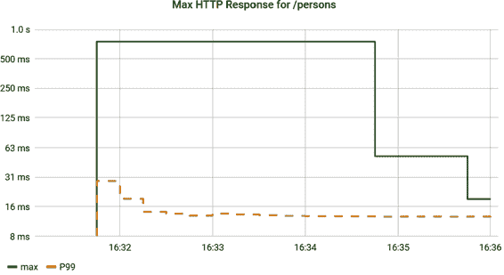
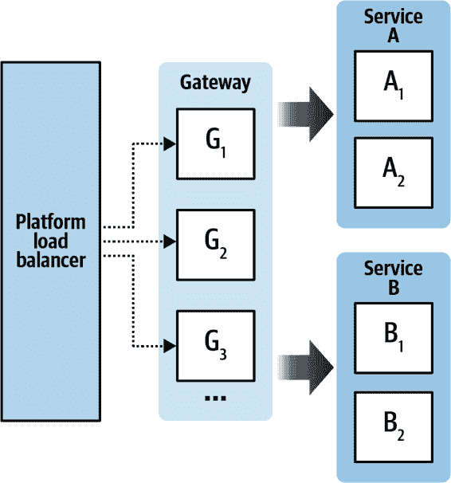
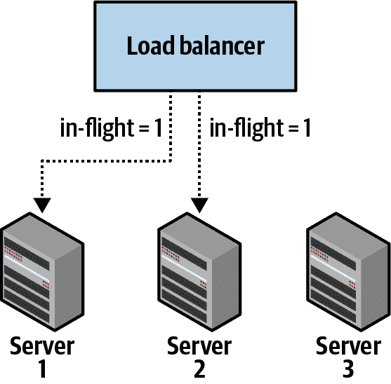
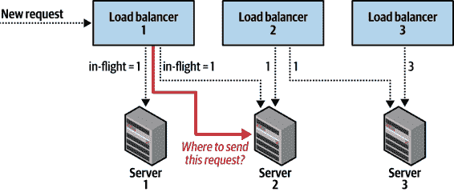
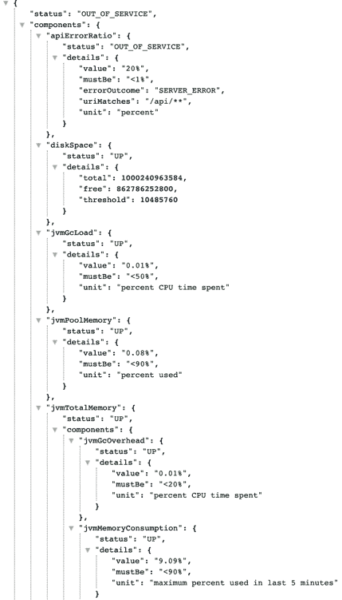
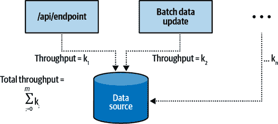
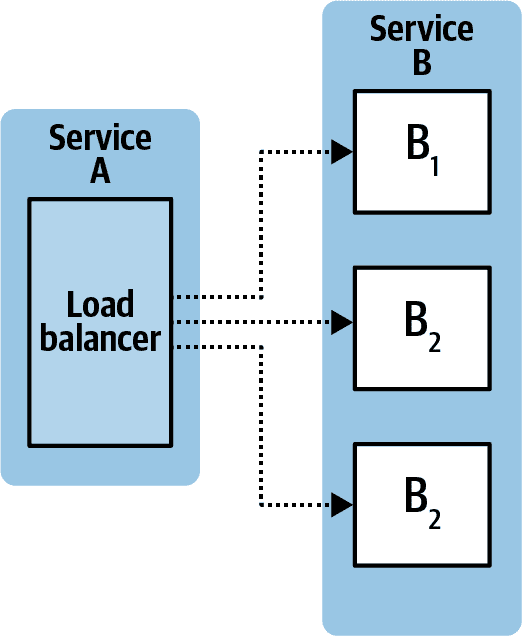
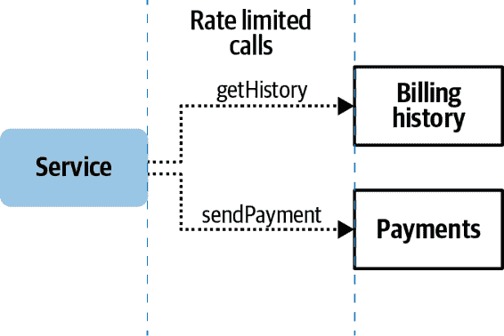
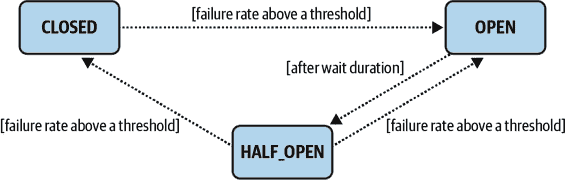
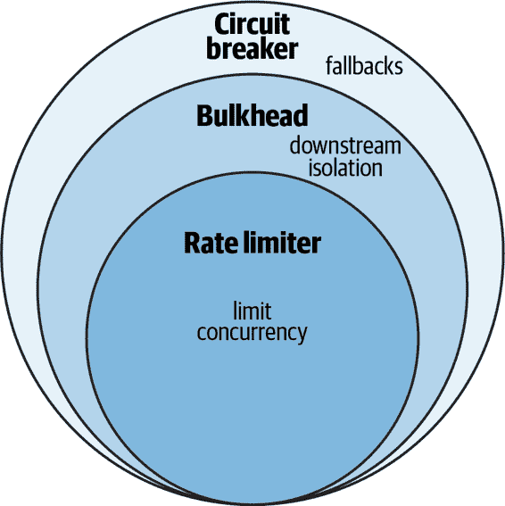

# 第七章：交通管理

云原生应用程序期望其他服务和资源的故障和低可用性。在本章中，我们介绍了涉及负载均衡（平台、网关和客户端）和调用弹性模式（重试、速率限制器、舱壁和断路器）的重要缓解策略，这些策略共同确保您的微服务继续运行。

这些模式并不适用于每个组织。通常，引入更复杂的交通管理会在操作复杂性和更可预测的用户体验或更低的整体故障率之间进行权衡。换句话说，使用您选择的 HTTP 客户端轻松地向下游服务发出 REST 调用；将该调用包装成重试则稍微复杂些。而提供断路器和回退则更为复杂。但随着复杂性的增加，可靠性也更高。

组织应根据其拥有的应用程序类型（例如，断路器适用的地方）以及微服务主要编写在哪种应用框架中来评估其需求。Java 具有这些模式的一流库支持，并集成到像 Spring 这样的流行框架中，但某些其他语言的支持不足会使得使用边车或服务网格更可取，即使因此会损失一些灵活性。

# 微服务提供更多潜在故障点。

随着参与用户交互的微服务数量增加，遇到处于低可用状态的服务实例的可能性增加。一个服务可以给下游服务施加负载，而后者可能无法承受并因此失败。调用弹性模式保护服务免受下游服务的失败影响，同时也会对下游服务产生负面影响。它们改变调用顺序的目标是为最终用户提供减少服务，但仍然是服务。例如，如果个性化服务遭遇低可用性，Netflix 电影推荐的个性化列表可以替换为通用的电影推荐。

微服务通常以水平扩展的方式部署在不同的可用区，以增加分布式系统的弹性。微服务并非静态。在任何给定时间，其中几个可以发布（部署新版本或进行金丝雀发布），进行扩展、迁移或故障切换。某些实例可能会经历故障，但不是全部。它们可能会暂时停机或者性能降低。这种动态且频繁变化的系统需要采用一套实践来动态路由流量：从首先发现服务所在的位置到选择哪个实例发送流量。这些都涉及到不同的负载均衡方法。

有两种方法可以实现这些模式：应用程序框架（代码）和支持基础设施（平台或网关负载均衡器、服务网格）。也可以结合使用。一般来说，在应用程序框架中实现这些功能允许更多灵活性和专门用于业务领域的定制。例如，用通用推荐替换个性化电影推荐是可以接受的，但对支付或账单服务的请求却没有明显的回退响应——业务领域的理解至关重要。

# 系统的并发性

“并发性”指的是一个微服务可以同时处理的请求数量。任何系统中都有一个自然的并发性界限，通常由像 CPU 或内存这样的资源，或者在请求以阻塞方式满足时的下游服务性能驱动。超过此界限的任何尝试请求无法立即满足，必须排队或拒绝。在典型的运行在 Tomcat 上的 Java 微服务中，Tomcat 线程池中的线程数表示其并发性限制的上限（尽管系统资源很可能会被 Tomcat 线程池中较少数量的并发请求耗尽）。操作系统维护的接受队列有效地排队超出该并发性限制的请求。

当请求速率超过响应速率的时间延长时，服务将失败。随着队列增长，延迟也会增加（因为请求直到从队列中移除才开始被处理）。最终，排队的请求将开始超时。

在本章中，我们将涵盖防止由于并发限制已达到而发生级联故障的策略。从这个角度看，负载平衡的讨论实际上是一种积极的方法，以便在第一时间就防止与负载相关的故障。

# 平台负载平衡

每个现代运行时平台（例如 AWS/GCP/Azure 等的 IaaS 提供、任何 Kubernetes 分发的 CaaS 提供或 Cloud Foundry 等的 PaaS 提供）至少有一些基本的集群负载均衡器。这些负载均衡器用于以某种方式（通常是轮询）在集群的实例之间分发流量，但也具有各种其他责任。例如，AWS Elastic Load Balancers 还服务于 TLS 终止、基于内容的路由、粘性会话等。

在本地环境中，即使是更简单的配置，IIS、Nginx、Apache 等仍然是固定一组命名虚拟机或物理机器前的静态配置负载均衡器。

在讨论更复杂的选项之前，值得注意的是，对于特定规模的设置并没有什么问题。一个区域性的财产/事故保险公司主要为其专有代理人提供 Web 应用程序服务，因此对于此用户群体的容量需求非常稳定。虽然这样的组织可以从主动-主动部署中受益，以增强单个数据中心的故障弹性，但其流量模式并不需要在网关或客户端负载均衡上进行更复杂的处理。

# 网关负载均衡

开源中有许多软件化的网关可用。[Spring Cloud Gateway](https://oreil.ly/yTMx-) 是这样一个网关的现代化体现，受到与[Zuul](https://oreil.ly/fNqHm)的工作经验影响。

运行时平台将流量负载均衡以优化可用性的能力是有限的。对于诸如延迟之类的可用性信号，调用方是最佳信息来源。负载均衡器和调用应用程序同样能观察和响应延迟作为可用性信号。但对于其他信号，尤其是涉及利用率的信号，服务器本身是这些信息的最佳（并且通常是唯一）来源。结合这两个可用性信号源可以产生最有效的负载均衡策略。

从可靠性的角度来看，负载均衡的目标是将流量从错误率高的服务器上移开。目标*不*应该是优化最快的响应时间。优化响应时间往往会导致策略将流量*赶*向一个健康的实例或实例组，导致它们过载和不可用。避免具有高错误率的实例仍然允许流量分布到性能不是最佳但足够可用的实例。如果集群中的所有实例都超载，选择一个实例而不是另一个不管负载平衡策略多么聪明都没有好处。然而，在许多情况下，由于临时条件，一些实例的负载过重。

无论何时集群中的某个过程可能在不同实例间交错执行时，都会出现临时超载的子集。例如，并非所有实例都可能同时进行 GC 或 VM 暂停、数据更新或缓存交换。只要这些过程没有集群范围的协调，交错就会存在。如果所有实例根据同步时钟执行某种数据更新，则存在集群协调。例如缺乏协调的示例，考虑导致 GC 暂停发生的原因。满足任何给定请求所产生的分配最终会导致 GC 事件。由于无论负载平衡策略如何，流量几乎肯定会在集群中非均匀分布，因此分配将会交错，从而导致交错的 GC 事件。

低可用性实例的子集另一个例子是冷实例，比如由自动扩展事件或零停机部署引入服务的实例。随着无服务器技术的普及，焦点已经转向了应用启动时间，直到健康检查通过（实际上是应用实例投入服务时）。但重要的是要注意到冷启动第二阶段的性能问题，即从第一个请求开始，如图 7-1 所示，直到运行时优化生效（例如 JVM 的 JIT 优化，或应用特定行为如将工作数据集内存映射）。正是这第二阶段的问题需要得到有效缓解。



###### 图 7-1\. 在最初的几个请求中，最大值比 P99 糟糕一个数量级以上

图表绘制了例 7-1 中所示的两个 Prometheus 查询，展示了 REST 端点的最大和 P99 延迟。

##### 例 7-1\. Prometheus 查询绘制 REST 端点/人员的最大和 P99 延迟

```java
http_server_requests_seconds_max{uri="/persons"}
histogram_quantile(
  0.99,
  sum(
    rate(
      http_server_requests_seconds_bucket{uri="/persons"}[5m]
    )
  ) by (le)
)
```

一些实例会因为糟糕的底层硬件或者越来越多的“吵闹邻居”，永久地运行得比其他实例慢。

显然，轮询负载均衡可以得到改进。从架构上看，这个负载均衡器的逻辑驻留在边缘网关中，如图 7-2（part0012_split_004.html#gateway_load_balancer）所示。



###### 图 7-2\. 使用 API 网关作为更智能的负载均衡器

用户面向的流量通过平台负载均衡器进入，该负载均衡器将流量以轮询方式分发到一组网关实例。在这种情况下，我们展示了一个网关向边缘后面的多个微服务提供请求服务的情况。网关实例通过从诸如 Netflix Eureka 或 HashiCorp Consul 等发现服务获取的实例列表直接与服务实例通信。不需要在个别微服务前加上平台负载均衡器，因为这些微服务由网关进行负载均衡。

在考虑这种一般性设置的同时，我们可以逐步提出一种负载均衡策略，考虑应用实例对其自身可用性的概念。然后我们将考虑其意外的副作用。目标是让您接触到可以与领域特定知识结合使用的技术，以制定对您有效的负载均衡策略，并学会思考和预见副作用。

## 加入最短队列

或许最简单的“自适应”负载均衡器，超越简单的轮询法的是“加入最短队列”。

"加入最短队列"的实现是通过比较负载均衡器可见的某些实例可用信号来完成的。一个很好的例子是对每个负载均衡器可见的每个实例的在飞请求。假设负载均衡器正在将流量引导到三个应用实例，其中两个有在飞请求。当负载均衡器收到一个新请求时，它将该请求定向到没有在飞请求的实例，如图 7-3 所示。这是计算上廉价的（只需最小化/最大化某些统计数据）且易于实现。



###### 图 7-3\. 使用一个负载均衡器节点的加入最短队列

当存在多个负载均衡器实例时，它开始出现问题。到目前为止，所描述的算法基于任何一个负载均衡器实例已知的在飞请求（通过它传递的请求）。换句话说，在负载均衡器池中，每个负载均衡器都在做出自己独立的决策，不知道其他负载均衡器上正在进行的在飞请求。

图 7-4 显示了负载均衡器 1 将基于它所知道的其他负载均衡器节点管理的不完整信息，错误地将一个新请求发送到服务器 3 的情况。箭头表示在飞请求。因此，在新请求到来之前，负载均衡器 1 已经有一个到服务 1 和 2 的在飞请求。负载均衡器 2 有一个到服务 2 和 3 的在飞请求。负载均衡器 3 有三个到服务 3 的在飞请求。当负载均衡器 1 收到一个新请求时，由于它只知道自己的在飞请求，它会决定将新请求发送到服务 3，即使这是最繁忙的服务实例，来自集群中其他负载均衡器的四个在飞请求。



###### 图 7-4\. 使用多个负载均衡器节点的加入最短队列

"加入最短队列"是基于负载均衡器对情况的视图进行负载平衡的一个例子。对于低吞吐量应用程序的一个后果是，负载均衡器仅管理少量在飞请求到集群中的一些实例。在集群中最少使用的实例的选择可以导致在没有在飞请求的两个实例之间进行随机选择，因为没有其他可用信息。

# 避免协调的诱惑！

可能会诱人地考虑与其他负载平衡器共享每个负载平衡器的正在进行中请求的状态，但像这样的分布式协调是困难的，并且应尽可能避免。 在典型的一致性、可用性和分区性权衡中，您最终面临一个工程选择，要么是操纵基于对等的分布式状态系统，要么是选择具有这些权衡的共享数据存储。

下一个模式使用来自负载平衡实例的信息。

## 实例报告的可用性和利用率

如果我们可以向每个负载平衡器通知实例对其自身可用性和利用率的观点，那么使用相同实例的两个负载平衡器将具有关于其可用性的相同信息。 有两种可用的解决方案：

轮询

轮询每个实例的利用率，从健康检查端点详细数据中采样数据。

被动地跟踪

在来自带有当前利用率数据的服务器响应中 passively track 一个标头。

这两种方法的实现同样简单，并且各自都有权衡。

Micrometer 提供了一个名为`HealthMeterRegistry`的`MeterRegistry`实现（在`io.micrometer:micrometer-registry-health`模块中可用），专门用于将度量数据转换为可由负载均衡器监视的健康指标。

`HealthMeterRegistry`配置了一组服务级别目标，然后将它们映射到框架健康指标，并在负载均衡器查询健康检查端点时进行采样。

Micrometer 提供了一些开箱即用的服务级别目标，已知适用于广泛的 Java 应用程序。 这些可以像 Example 7-2 中那样手动配置。 当`micrometer-registry-health`存在时，Spring Boot Actuator 也会自动配置这些目标。

##### 示例 7-2\. 使用推荐的服务级别目标创建 `HealthMeterRegistry`。

```java
HealthMeterRegistry registry = HealthMeterRegistry
  .builder(HealthConfig.DEFAULT)
  .serviceLevelObjectives(JvmServiceLevelObjectives.MEMORY)
  .serviceLevelObjectives(JvmServiceLevelObjectives.ALLOCATIONS)
  .serviceLevelObjectives(OperatingSystemServiceLevelObjectives.DISK)
  .build();
```

当这些目标绑定到框架级健康指标时，这些目标被纳入应用程序健康的整体确定中。 Spring Boot Actuator 的健康端点配置显示了这组默认的 SLOs，在 Figure 7-5 中。



###### 图 7-5\. Spring Boot Actuator 健康端点与服务级别目标。

您还可以定义自己的服务级别目标，并在 Example 7-3 中，我们定义了一个`api.utilization`服务级别目标，以支持从服务器健康检查端点详细信息中采样利用率数据。 Spring Boot Actuator 将此目标添加到它将自动创建的 `HealthMeterRegistry` 中；或者如果您正在进行自己的 `HealthMeterRegistry` 的连接，您可以在构建时直接添加它。

##### 示例 7-3\. 自定义的服务级别目标，用于报告服务器利用率。

```java
@Configuration
class UtilizationServiceLevelObjective {
  @Bean
  ServiceLevelObjective apiUtilization() {
      return ServiceLevelObjective
        .build("api.utilization") 
        .baseUnit("requests") 
        .failedMessage("Rate limit to 10,000 requests/second.") 
        .count(s -> s.name("http.server.requests") 
          .tag("uri", "/persons")
          .tag("outcome", "SUCCESS")
        )
        .isLessThan(10_000); 
  }
}
```


服务水平目标的名称。当将其作为健康指标组件的名称公开时，可以将其命名规范化，就像公制表名称一样。Spring Boot 将其显示为`apiUtilization`（驼峰命名法），基于其约定。


利用率的测量单位，使输出更容易理解一些。


对于未达到此目标意味着什么，用通俗的语言说。


我们在这里检索吞吐量（`count`）的度量。也可以使用`value`检索计量值，`total`检索定时器总时间，分布摘要总量，长任务定时器活动任务和`percentile`。


我们正在对度量值进行测试的阈值。当该服务每秒接收超过 10,000 个请求时，它会将自身报告为服务终端点监控的任何内容的服务中断。

当此健康指标被消费者网关使用，并且可以包含自定义代码以响应不同条件时，最好始终报告此健康指标的状态为`UP`。我们可以在应用程序中硬编码一些固定的阈值，并在利用率超过阈值时报告不同的状态，例如`OVERLOADED`。更好的方法是从动态配置服务器中获取阈值，以便可以在运行实例中通过更改配置服务器的值来一次性更改该值。最好是将决定何时利用过多的任务留给负载均衡器，该负载均衡器可以将此决策折叠到更复杂的标准中。

## 健康检查

但有时我们的“网关”是某种平台负载均衡器（通过平台负载均衡器，我指的是类似于 AWS 应用负载均衡器的东西），它可以响应其决策的较粗略的可用性指标。例如，许多平台负载均衡器提供了配置健康检查路径和端口的手段。这可以很容易地配置为 `/actuator/health`，但平台负载均衡器只会响应响应的 HTTP 状态是否成功。配置灵活度不足以查看利用率详细信息并根据阈值做出决策。在这种情况下，真正需要应用程序代码来设置阈值并返回 `Health.up()` 或 `Health.outOfService()`。虽然将此决策留给应用程序并没有真正的本质问题，但这确实需要在编写应用程序时对性能有一些先验知识，并且在部署环境中灵活性较低。作为查看健康检查的平台负载均衡器的示例，DigitalOcean 为 Kubernetes 负载均衡器提供了“健康检查” [配置](https://oreil.ly/yYBzh)，如示例 7-4 所示。AWS Auto Scaling Groups 和 Google Cloud 负载均衡器也提供了健康检查配置。Azure 负载均衡器提供了类似的称为“健康探针”的配置。

##### 示例 7-4\. 配置为查看实例报告的利用率的 Kubernetes 负载均衡器

```java
metadata:
 name: instance-reported-utilization
  annotations:
   service.beta.kubernetes.io/do-loadbalancer-healthcheck-port:80
   service.beta.kubernetes.io/do-loadbalancer-healthcheck-protocol:http
   service.beta.kubernetes.io/do-loadbalancer-healthcheck-path:/actuator/health
   service.beta.kubernetes.io/do-loadbalancer-healthcheck-check-interval-seconds:3
   service.beta.kubernetes.io/do-loadbalancer-healthcheck-response-timeout-seconds:5
   service.beta.kubernetes.io/do-loadbalancer-healthcheck-unhealthy-threshold:3
   service.beta.kubernetes.io/do-loadbalancer-healthcheck-healthy-threshold:5
```

在设置类似这样的健康指标时，任务是找到一些最能概括应用可用性的关键性能指标。这个性能指标应该监控应用程序中的弱点，即过多的流量最终会导致问题。在本例中，我们选择将 `/persons` API 端点视为此示例中利用率可用性的关键性能指标。我们可以选择多个端点、多个 HTTP 响应结果或任何其他 HTTP 端点吞吐量的组合。此外，还有其他可以使用的利用率测量。如果这是一个事件驱动的应用程序，那么从消息队列或 Kafka 主题中消费消息的速率也是合理的。如果应用程序中的多个执行路径都导致与某些利用率受限资源（如数据源或文件系统）的交互，就像图 7-6 中描述的那样，那么测量该资源上的利用率也似乎是合理的。



###### 图 7-6\. 当多个执行路径导致数据源成为瓶颈时，测量数据源的吞吐量

此健康指标可以添加到从[start.spring.io](https://start.spring.io)生成的新的 Spring Boot 应用程序，该应用程序包括对`io.micrometer:micrometer-core`的运行时依赖项以及示例 7-5 中找到的配置。

##### 示例 7-5\. 必需的 application.yml 配置

```java
management:
  endpoints.web.exposure.include: health
  endpoint.health.show-details: always
```

从`http://APP_HOST/actuator/health`收到的响应包括实例对其自身利用率的视图。从网关/负载均衡器需要对呈现给“选择两个”算法的实例列表进行预过滤时，是否此利用率表示接近满负载并不重要。算法选择权重更高的两个数字中较低的数字。仅当网关/负载均衡器需要预过滤呈现给“选择两个”算法的实例列表时，它才需要一些特定领域知识的合理截止阈值的某种理解，该阈值是超过某一利用率水平是否表示*过多*利用率的重要视角。

通过主动轮询每个实例，我们在每个实例上增加了与负载均衡器节点数量成比例的额外负载。但对于吞吐量低的服务，特别是当利用率轮询速率*超过*特定负载均衡器的请求率时，轮询提供了更准确的利用率图片。

被动策略提供了到达特定实例的最后请求的最新利用率视图。对实例的吞吐量越高，利用率测量就越准确。

我们可以使用实例报告的利用率或健康作为更加随机化的启发式算法的输入，接下来将描述。

## 选择两个

“Choice of two” 会随机选择两个服务器，并基于某些标准最大化选择其中一个。

使用多因素定义标准限制了可能无意中导致羊群效应的偏见。例如，假设一个服务器在每个请求上都失败，并且（通常情况下）故障模式使得失败响应的响应时间低于成功响应。实例的利用率将显得更低。如果仅使用利用率作为唯一因素，那么负载均衡器将开始向不健康的实例发送*更多*请求！

计算这三个因素的聚合，并在选择两个选择上进行最大化：

客户端健康

该实例的连接相关错误度量

服务器利用率

由实例提供的最新利用率测量

客户端利用率

从此负载均衡器到实例的正在进行的请求计数

为了使这更加健壮，考虑预先过滤从中选择和比较的服务器列表。确保以某种方式限制过滤，以避免在具有大量不健康实例的集群中搜索相对健康实例时造成高 CPU 成本（例如，仅尝试多次选择相对健康实例）。通过过滤，我们可以在一部分集群持续不可用时，仍然向两个算法的选择提供相对健康实例之间的选择。

我们可以向我们的选择算法中添加最后一个调整，以适应冷启动。

## 实例试用期

为了避免在新实例仍在进行第二阶段预热时过载，我们可以简单地对允许发送到该新实例的请求数量设置一个静态限制。当负载均衡器从新实例接收到一个或多个利用率响应时，试用期结束。

静态限制新实例的速率限制概念可以扩展到基于实例年龄逐渐增加的速率限制。Micrometer 开箱即用地包含了一个`process.uptime`度量标准，可用于计算实例的年龄。

现在我们拥有了一系列负载均衡策略的工具箱，让我们思考一下它们可能产生的一些意外副作用。

## 更智能负载均衡的连锁效应

为了将流量从出现可用性问题的实例转移开来，开发了两个负载均衡器的选择目标。这带来了一些有趣的效果：

+   在蓝/绿部署（或滚动蓝/绿）中负载均衡两个集群时，如果其中一个集群的性能相对较差，则它将接收到比相等份额更少的流量。

+   在自动金丝雀分析设置中，由于同样的原因，基准和金丝雀可能会接收到不同比例的流量。

+   异常检测可能不会像往常那样迅速发现异常值，因为低可靠性的早期信号意味着对该实例的尝试较少。

+   请求分布不会像轮询负载均衡器那样均匀。

可用性信号始终随时间衰减。在实例报告的利用率示例中（示例 7-3），这就是为什么我们使用了利用率的每个时间间隔的速率测量。一旦时间间隔结束，不稳定期不再反映在利用率数据中。结果是，如果一个实例从低可用性期恢复过来，则它可以再次在选择两个实例时获胜，并从负载均衡器接收流量。

并非每种微服务架构都设计成使得微服务间请求总是通过网关传递（也不应该如此）。

# 客户端负载均衡

第三种选择是实现客户端负载均衡器。这将负载均衡决策留给调用方。历史上，客户端负载均衡已被用于新颖的负载均衡策略，比如云平台区避免或区亲和性，对最低加权响应时间的偏好等。当这些策略在一般情况下运行良好时，它们往往会重新出现作为平台负载均衡器的特性。

图 7-7 展示了服务 A 和服务 B 之间的交互，其中服务 A 使用客户端负载均衡器将流量分发到服务 B。客户端负载均衡器是服务 A 应用代码的一部分。通常情况下，实例列表将从诸如 Eureka 或 Consul 的发现服务中获取，并且由于客户端负载均衡器将流量引导到从发现服务获取的服务 B 实例，所以在服务 B 前面不需要平台负载均衡器。



###### 图 7-7\. 客户端负载均衡

客户端负载均衡可以用于不同的目的。最初的一个目的是从像 Eureka 或 Consul 这样的中央服务发现机制动态获取服务器 IP 或主机名列表。

# 为什么选择服务发现而不是云负载均衡器？

当 Netflix 首次开发 Eureka 时，AWS VPC 还不存在，Elastic Load Balancers 总是具有公共的、面向互联网的主机名。不希望将内部微服务暴露给公共互联网，Netflix 构建了 Eureka，以实现中心化管理，类似于私有应用负载均衡器（ALBs 现在被认为是 AWS 的旧 ELB 构造的替代品）可以在每个微服务基础上实现的功能。也许如果 VPC 在 Netflix 首次迁移到 AWS 时就存在，Eureka 就永远不会出现。尽管如此，它的使用已经扩展到了集群中可用实例的范围之外。表 5-1 展示了它在事件驱动微服务的蓝/绿部署中的使用，以使禁用集群中的实例失效。并非每家企业都会利用这种工具，如果不使用的话，私有云负载均衡器可能更简单管理。

Spring Cloud Commons 提供了一个客户端负载均衡抽象，使得配置这些典型问题变得相当简单，就像 例子 7-6 中那样。从这样的配置生成的 `WebClient` 将缓存一段时间的服务列表，优先选择同一区域内的实例，并使用配置的 `DiscoveryClient` 获取可用名称列表。

##### 例子 7-6\. 负载均衡健康检查

```java
@Configuration
@LoadBalancerClient(
  name = "discovery-load-balancer",
  configuration = DiscoveryLoadBalancerConfiguration.class
)
class WebClientConfig {
  @LoadBalanced
  @Bean
  WebClient.Builder webClientBuilder() {
    return WebClient.builder();
  }
}

@Configuration
class DiscoveryLoadBalancerConfiguration {
	@Bean
	public ServiceInstanceListSupplier discoveryClientServiceInstances(
    ConfigurableApplicationContext context) {

    return ServiceInstanceListSuppliers.builder()
      .withDiscoveryClient()
      .withZonePreference()
      .withHealthChecks()
      .withCaching()
      .build(context);
	}
}
```

然而，并非所有的负载均衡都是关于服务器选择。有一种特定的客户端负载均衡策略用于切断高于第 99 百分位数的尾延迟。

# 避免请求过载

第二章显示，对于*N*个请求，至少有一个请求在延迟分布的前 1%的几率是 <math alttext="left-parenthesis 1 minus 0.99 Superscript upper N Baseline right-parenthesis asterisk 100 percent-sign"><mrow><mo>(</mo> <mn>1</mn> <mo>-</mo> <mn>0</mn> <mo>.</mo> <msup><mn>99</mn> <mi>N</mi></msup> <mo>)</mo> <mo>*</mo> <mn>100</mn> <mo>%</mo></mrow></math> 。此外，我们看到延迟分布几乎总是多模的，前 1%通常比第 99 百分位数差一到两个数量级。即使是 100 个独立资源交互，遇到其中一个前 1%延迟的几率是 <math alttext="left-parenthesis 1 minus 0.99 Superscript 100 Baseline right-parenthesis asterisk 100 percent-sign equals 63.3 percent-sign"><mrow><mo>(</mo> <mn>1</mn> <mo>-</mo> <mn>0</mn> <mo>.</mo> <msup><mn>99</mn> <mn>100</mn></msup> <mo>)</mo> <mo>*</mo> <mn>100</mn> <mo>%</mo> <mo>=</mo> <mn>63</mn> <mo>.</mo> <mn>3</mn> <mo>%</mo></mrow></math> 。

一种经过良好测试的策略，用于减轻调用下游服务或资源时顶部 1%延迟的影响，是简单地向下游发送多个请求，并接受首先返回的响应，丢弃其他响应。

这种方法可能会令人惊讶，因为显然它会根据您在您的对冲中包含的额外请求数量线性增加下游的负载（而且潜在地，这可能会超出直接下游的线性扇出，因为它反过来会向*它的*下游发出请求，依此类推）。在许多企业中，服务的吞吐量未能接近其总容量，而最具韧性的服务则以某种主动-主动的方式进行水平扩展，以限制在任何一个区域发生故障的影响。这样做的效果是增加容量（通常是未使用的），以提高韧性。在最好的情况下，对冲请求可以简单地利用这些多余的容量，同时通过显著减少最糟糕延迟的频率来改善终端用户响应时间。

显然，决定采用对冲请求需要一些关于所调用下游服务的领域特定知识。将三个请求发送到第三方支付系统以收取客户的信用卡费用是不合适的！因此，对冲请求通常在应用程序代码中执行。

# 对冲请求无法由服务网格客户端负载均衡器实施（！！）

由于领域特定的知识基本上要求负载平衡决策是由调用应用程序进行的，因此要注意将客户端负载平衡的责任转移到服务网格对于对冲请求来说是行不通的。鉴于对冲请求是补偿长尾延迟超过 99 百分位数的最简单有效的方法之一，因此服务网格无法替代应用程序代码来实现这一目的应该是考虑服务网格模式是否真正适用于更广泛的情况的触发器。

现在我们将讨论补偿下游微服务失败或减少这类服务首次被淹没的模式。

# 调用弹性模式

无论负载均衡器对哪个实例能够最好地处理流量做出多么准确的预测决策，任何预测都是基于过去性能的投影。过去的表现永远不是未来结果的保证，因此仍然需要另一层面的弹性来处理故障。此外，即使是一个完美地将流量分配给任何给定时间最可用的实例的负载均衡器后面的微服务集群，也有一个可以处理的极限。微服务架构的各层需要防止过载，这可能导致完全失败。

这些机制一起形成了不同的基本“背压”方案。

> 背压是从服务系统向请求系统发出失败信号以及请求系统如何处理这些失败，以防止过载自身和服务系统。设计背压意味着在过载时和系统故障时限制资源使用。这是创建强大的分布式系统的基本构建块之一。背压的实现通常涉及要么将新消息丢弃，要么在资源受限或发生故障时将错误返回给用户（并在这两种情况下递增度量）。对其他系统的连接和请求进行超时和指数级回退也是必不可少的。如果没有背压机制，级联故障或意外消息丢失变得可能。当系统无法处理另一个系统的故障时，它往往会向依赖于它的另一个系统发出故障。
> 
> Jeff Hodges

调用者可以结合四种模式来提高弹性：

+   重试

+   速率限制器

+   防波堤

+   断路器

重试是克服间歇性故障的明显第一步，但我们需要谨慎创建“重试风暴”，即在原始请求开始失败时，不要用重试淹没已经处于困境中的系统的部分。其他模式将有助于补偿。但是，让我们从重试开始。

## 重试

预期下游服务的短暂失败，由于临时满线程池、慢网络连接导致超时或其他导致不可用的临时条件。这类故障通常在短时间后会自行纠正。调用者应准备通过在对下游的调用中包装重试逻辑来处理短暂的失败。在添加重试时考虑三个因素：

+   是否适合重试。这通常需要对被调用服务的领域特定知识。例如，我们是否应该在下游服务返回超时时重试支付尝试？超时操作最终会被处理，重试是否可能导致重复收费？

+   最大重试次数和重试尝试之间使用的持续时间（包括退避，如 示例 7-7 所示）。

+   哪些响应（和异常类型）需要重试。例如，如果下游因为某些原因返回 400 错误，表明输入格式错误，我们不能期望通过重试相同的输入获得不同的结果。

##### 示例 7-7\. 使用 Resilience4J 设置指数退避重试

```java
RetryConfig config = RetryConfig.custom()
  .intervalFunction(IntervalFunction.ofExponentialBackoff(
    Duration.ofSeconds(10), 3))
  .maxAttempts(3)
  .retryExceptions(RetryableApiException.class)
  .build();

RetryRegistry retryRegistry = RetryRegistry.of(config);

Retry retry = retryRegistry.retry("persons.api");

retry.executeCallable(() -> {
  Response response = ...
  switch(response.code()) {
    case 401:
      // Authentication flow
    case 502:
    case 503:
    case 504:
      throw new RetryableApiException();
  }

  return response;
});
```

Resilience4J 具有用于重试逻辑的内置指标，通过将重试绑定到 Micrometer 的仪表注册表来启用，如 示例 7-8 所示。

##### 示例 7-8\. 通过 Micrometer 发布关于重试的指标

```java
TaggedRetryMetrics
  .ofRetryRegistry(retryRegistry)
  .bindTo(meterRegistry);
```

这导出了一个单一的仪表 `resilience4j.retry.calls`，带有一个 `kind` 标签，区分成功（带重试和无重试）和失败（带重试和无重试）的调用。如果设置了警报，它将基于 `kind` 等于 `failed.with.retry` 的调用数阈值。在许多情况下，进行调用的代码本身将会计时。例如，一个 REST 端点在调用时会执行一些工作，包括使用重试逻辑进行下游服务调用，该端点本身将使用 `http.server.requests` 进行计时，您应该已经在该端点的失败上设置了警报。

然而，如果您的应用程序包含一个常见的组件，通过重试逻辑保护对资源或下游服务的访问，那么对该资源的高失败率报警可能是一个很好的信号，表明应用程序的几个部分将会失败。

## 速率限制器

微服务的负载根据用户活动模式、定期批处理等而自然变化。突发事件可能导致活动突然激增，给某个微服务提供的特定业务功能造成资源紧张，可能导致可用性低于已建立的 SLO，速率限制（也称为节流）可以保持服务运行并响应请求，尽管在定义的吞吐率下。

Resilience4J 使用多种选项实现速率限制器模式。在 例子 7-9 中，一个微服务需要调用下游的账单历史和支付服务时使用了速率限制器。服务交互的图示如 图 7-8 所示。



###### 图 7-8\. 调用恢复性示例服务交互

##### 例子 7-9\. 使用 Resilience4J 实现速率限制器

```java
RateLimiterConfig config = RateLimiterConfig.custom()
  .limitRefreshPeriod(Duration.ofMillis(1))
  .limitForPeriod(10) 
  .timeoutDuration(Duration.ofMillis(25)) 
  .build();

RateLimiterRegistry rateLimiterRegistry = RateLimiterRegistry.of(config);

RateLimiter billingHistoryRateLimiter = rateLimiterRegistry
  .rateLimiter("billingHistory");
RateLimiter paymentRateLimiter = rateLimiterRegistry
  .rateLimiter("payment", config); 

// Components that would, as part of their implementations, // execute HTTP requests to downstream services BillingHistory billingHistory = ...
Payments payments = ...

// Spring WebFlux Functional route specification RouterFunction<ServerResponse> route = route()
	.GET("/billing/{id}", accept(APPLICATION_JSON),
    RateLimiter.decorateFunction(
      billingHistoryRateLimiter,
      BillingHistory::getHistory
    )
  )
	.POST("/payment",
    RateLimiter.decorateFunction(
      paymentRateLimiter,
      Payments::sendPayment
    )
  )
	.build();
```


速率限制器允许的并发限制。


阻塞线程尝试进入饱和速率限制器的超时时间。


可以使用与全局配置不同的配置创建某个服务的速率限制器（例如，因为此服务能够承受比其他服务更高的并发级别）。

Resilience4J 针对速率限制器内置了指标。将您的速率限制器注册到 Micrometer 米表注册中，例如 例子 7-10。

##### 例子 7-10\. 通过 Micrometer 发布有关速率限制的指标

```java
TaggedRateLimiterMetrics
  .ofRateLimiterRegistry(rateLimiterRegistry)
  .bindTo(meterRegistry);
```

然后发布 表格 7-1 中的指标。

这两个指标具有不同的优势。可用权限是一个有趣的 *预测性* 指标。如果权限接近零（或之前没有），但等待线程数较低，则尚未降低终端用户体验。高等待线程数是一个更 *反应性* 的度量，表示下游服务可能需要扩展，因为终端用户体验正在降低（如果响应时间很重要且经常有等待线程）。

表格 7-1\. Resilience4J 提供的速率限制器指标

| 指标名称 | 类型 | 描述 |
| --- | --- | --- |
| resilience4j.ratelimiter.available.permissions | Gauge | 可用权限数或未使用的并发容量 |
| resilience4j.ratelimiter.waiting.threads | Gauge | 等待线程数 |

在 Atlas 中，等待线程的警报条件根据固定阈值进行测试，如 例子 7-11 所示。

##### 例子 7-11\. Atlas 速率限制器警戒阈值

```java
name,resilience4j.ratelimiter.waiting.threads,:eq,
$THRESHOLD,
:gt
```

在 Prometheus 中，其思想类似，如 例子 7-12 所示。

##### 例子 7-12\. Prometheus 速率限制器警戒阈值

```java
resilience4j_ratelimiter_waiting_threads > $THRESHOLD
```

## 防护栅

微服务通常会对多个下游服务执行请求。当某个服务的可用性较低时，可能会导致依赖的服务同样无响应。特别是当依赖的服务是阻塞式并使用线程池进行请求时更为明显。对于一个具有多个下游服务的微服务 *A*，可能只有一小部分流量（某种类型的请求）导致对微服务 *B* 的请求。如果 *A* 使用一个公共线程池来执行请求，不仅针对 *B*，而是针对所有其他下游服务，那么 *B* 的不可用性可能会逐渐阻塞请求，使公共线程池中的线程饱和，几乎没有或完全没有工作可以进行。

舱壁模式隔离了各个下游服务，为每个下游服务指定了不同的并发限制。这样，只有需要调用 *B* 的服务请求会变得无响应，而 *A* 的其余服务仍将保持响应。

Resilience4J 使用多种选项实现舱壁模式，如 示例 7-13 所示。

##### 示例 7-13\. 使用 Resilience4J 实现舱壁模式

```java
BulkheadConfig config = BulkheadConfig.custom()
  	.maxConcurrentCalls(150) 
  	.maxWaitDuration(Duration.ofMillis(500)) 
  	.build();

BulkheadRegistry registry = BulkheadRegistry.of(config);

Bulkhead billingHistoryBulkhead = registry.bulkhead("billingHistory");
Bulkhead paymentBulkhead = registry.bulkhead("payment", custom); 

// Components that would, as part of their implementations, execute HTTP requests // to downstream services BillingHistory billingHistory = ...
Payments payments = ...

// Spring WebFlux Functional route specification RouterFunction<ServerResponse> route = route()
	.GET("/billing/{id}", accept(APPLICATION_JSON),
    Bulkhead.decorateFunction(
      billingHistoryBulkhead,
      BillingHistory::getHistory
    )
  )
	.POST("/payment",
    Bulkhead.decorateFunction(
      paymentBulkhead,
      Payments::sendPayment
    )
  )
	.build();
```


舱壁允许的并发限制。


尝试进入饱和舱壁的阻塞线程的超时时间。


可以为某些服务创建与全局配置不同的舱壁（例如，因为此服务能够比其他服务支持更高的并发级别）。

Resilience4J 提供了舱壁的内置指标。将舱壁注册表绑定到 Micrometer 计量注册表，如 示例 7-14 中所示。

##### 示例 7-14\. 通过 Micrometer 发布有关舱壁的指标

```java
TaggedBulkheadMetrics
  .ofBulkheadRegistry(bulkheadRegistry)
  .bindTo(meterRegistry);
```

表 7-2 显示了 Resilience4J 提供的舱壁指标。当可用并发调用频繁达到零或接近零时发出警报。

表 7-2\. Resilience4J 提供的舱壁指标

| Metric name | Type | Description |
| --- | --- | --- |
| resilience4j.bulkhead.available.concurrent.calls | Gauge | 可用许可数，或未使用的容量 |
| resilience4j.bulkhead.max.allowed.concurrent.calls | Gauge | 可用许可的最大数目 |

在 Atlas 中，等待线程的警报条件针对固定阈值进行测试，如 示例 7-15 中所示。这也可能是使用 `:roll-count` 限制警报过多的好地方。

##### 示例 7-15\. Atlas 舱壁警报条件

```java
name,resilience4j.bulkhead.available.concurrent.calls,:eq,
$THRESHOLD,
:lt
```

在 Prometheus 中，与 示例 7-16 中所示的类似。

##### 示例 7-16\. Prometheus 舱壁警报条件

```java
resilience4j_bulkhead_available_concurrent_calls < $THRESHOLD
```

## 断路器

断路器是与一种扭曲的批处理延伸的进一步扩展。断路器维护一个有限状态机，如图 7-9 所示，用于它保护的执行块，其状态为关闭、半开和打开。在关闭和半开状态下，允许执行。在打开状态下，执行应用程序定义的回退。



###### 图 7-9. 断路器的状态

断路器的一个经典例子是 Netflix 的电影推荐列表。这通常是根据过去的观看历史等个性化订阅者的。一个守卫对个性化服务的调用的断路器可能会在断路器处于打开状态时以一份通用内容列表作为回退而响应。

对于某些类别的业务问题，一个最终不会向用户呈现失败的回退是不可能的。假设无法接受用户的付款（假设不能将其存储在某个地方以供以后处理）。

成功和失败的执行被维护在一个环形缓冲区中。当环形缓冲区初始填满时，失败率被测试是否超过预配置的阈值。当失败率高于可配置阈值时，断路器的状态从关闭变为打开。当断路器被触发并打开时，它将在定义的时间段内停止允许执行，之后断路器半开，允许少量流量通过，并测试该少量流量的失败率是否超过阈值。如果失败率低于阈值，则再次关闭电路。

[Netflix Hystrix](https://oreil.ly/By0-M) 是第一个主要的开源断路器库，尽管它仍然很有名，但现在已经被弃用。Resilience4J 通过改进库的卫生性和支持更多线程模型来实现断路器模式。示例见 Example 7-17。

##### Example 7-17. 使用 Resilience4J 实现断路器模式

```java
CircuitBreakerConfig circuitBreakerConfig = CircuitBreakerConfig.custom()
  .failureRateThreshold(50)
  .waitDurationInOpenState(Duration.ofMillis(1000))
  .ringBufferSizeInHalfOpenState(2)
  .ringBufferSizeInClosedState(2)
  .build();

CircuitBreakerRegistry circuitBreakerRegistry = CircuitBreakerRegistry
  .of(circuitBreakerConfig);

CircuitBreaker billingHistoryCircuitBreaker = circuitBreakerRegistry
  .circuitBreaker("billingHistoryCircuitBreaker");
CircuitBreaker paymentCircuitBreaker = circuitBreakerRegistry
  .circuitBreaker("payment", circuitBreakerConfig); 

// Components that would, as part of their implementations, execute HTTP requests // to downstream services BillingHistory billingHistory = ...
Payments payments = ...

// Spring WebFlux Functional route specification RouterFunction<ServerResponse> route = route()
	.GET("/billing/{id}", accept(APPLICATION_JSON),
    CircuitBreaker.decorateFunction(
      billingHistoryCircuitBreaker,
      BillingHistory::getHistory
    )
  )
	.POST("/payment",
    CircuitBreaker.decorateFunction(
      paymentCircuitBreaker,
      Payments::sendPayment
    )
  )
	.build();
```


某个服务的断路器可以使用与全局不同的配置创建。

Resilience4J 包含用于断路器的内置指标仪表，您应该监视打开的断路器。通过将断路器注册表绑定到 Micrometer 计量器注册表来启用它，如 Example 7-18 所示。

##### Example 7-18. 绑定断路器指标

```java
TaggedCircuitBreakerMetrics
  .ofCircuitBreakerRegistry(circuitBreakerRegistry)
  .bindTo(meterRegistry);
```

Table 7-3 显示了 Resilience4J 为*每个*断路器公开的两个指标。

表 7-3. Resilience4J 公开的断路器指标

| 指标名称 | 类型 | 描述 |
| --- | --- | --- |
| resilience4j.circuitbreaker.calls | 计时器 | 成功和失败调用的总数 |
| resilience4j.circuitbreaker.state | 计量 | 根据状态标签描述的状态（开、闭等），设置为 0 或 1。 |
| resilience4j.circuitbreaker.failure.rate | 计量 | 断路器的失败率 |

由于这些是计量器，您可以通过执行 `max` 聚合来警告任何断路器当前是否打开。此时，最终用户已经通过接收到回退响应或直接传播失败而经历了降级的体验。

在 Atlas 中，警报条件检查是否处于打开状态，如示例 7-19 中所示。

##### 示例 7-19\. Atlas 断路器警报阈值

```java
name,resilience4j.circuitbreaker.state,:eq,
state,open,:eq,
:and,
:max, 
1,
:eq
```


如果任何断路器打开，此警报将匹配它。

在 Prometheus 中，这个思路类似，如示例 7-20 中所示。我们可以使用 `sum(..) > 0` 或 `max(..) == 1` 来达到相同的效果。

##### 示例 7-20\. Prometheus 断路器警报阈值

```java
sum(resilience4j_circuitbreaker_state{state="open"}) > 0
```

尽管电路可能会暂时打开然后再次关闭，但为了限制警报频繁性，可能最好是在 `resilience4j.circuitbreaker.calls` 上设置一个错误率指示器，允许在警报之前有一定数量的失败请求转向回退。

接下来我们将讨论如何通过响应代码和环境中的变化来提高警报阈值本身的灵活性。

## 自适应并发限制

到目前为止，每个呼叫恢复模式（限速器、舱壁和断路器）都有效地用于防范与负载相关的问题，无论是预防性还是响应性的。

在每种情况下，模式都配置有一个在微服务实际运行之前预先确定的阈值。速率限制器被配置为限制在间隔内可以执行的请求数量，舱壁限制瞬时并发，而断路器则将负载从遇到故障的实例（包括与负载相关的故障）中卸载出去。这些阈值可以通过仔细的性能测试确定，但随着代码更改、下游集群的规模及其可用性的变化等，它们的值往往会与真实限制偏离。

本书始终以用自适应判断替代固定阈值或手动判断为主题。我们在第二章中看到了使用预测算法设置的阈值，在第五章中看到了自动金丝雀分析。类似的自适应方法也可以应用于并发限制。

## 选择正确的调用恢复模式

在代码中，用于舱壁、速率限制器和断路器的模式看起来非常相似。实际上，这三种模式具有重叠的责任，如 图 7-10 所示。



###### 图 7-10\. 三种调用恢复模式的重叠责任

所有三种模式都实现了速率限制，但采用了不同的机制，总结在 表 7-4 中。

表 7-4\. 不同调用恢复模式的速率限制机制

| 模式 | 限制机制 | 注意事项 |
| --- | --- | --- |
| 速率限制器 | 限制间隔内的速率 | 这不限制瞬时并发性（例如，间隔内的流量突增）除非瞬时并发性超过了整个间隔的限制。 |
| 舱壁 | 限制瞬时并发级别 | 限制在尝试新请求时的并发级别。这不直接限制间隔内的向下游请求数量，除非向下游服务以非零时间响应。 |
| 断路器 | 响应错误（其中一些是由于下游并发的自然限制所导致） | 由断路器保护的 RPC 请求要么超时，要么下游服务（或其负载均衡器）会以失败响应，例如 HTTP 502（不可用）。这不直接限制瞬时或每个间隔的速率，除非向下游开始饱和。 |

因此，很少见到一块代码同时由速率限制器、舱壁或断路器中的多个模式保护。

到目前为止所展示的调用恢复模式的实现都使用了 Resilience4J，使其成为应用开发的关注点。让我们将这作为一个应用关注点与将责任外部化到服务网格中进行比较。

## 在服务网格中的实现

最终，是否尝试将流量管理从应用关注点中剥离的决定必须根据每个组织的情况做出，基于其对 表 7-5 中所示多个标准的重视程度。这里的“应用责任”意味着通过应用代码实现功能或通过对共享库的二进制依赖自动配置。跨标题行分配给每个标准的权重仅是一个示例，并且会因组织而异。例如，对于使用大量编程语言的组织，可能会更高地分配给语言支持的权重。这应该是您决策的驱动因素。

表 7-5\. 交通管理的服务网格与应用责任决策矩阵（得分越高 = 成本越高）

|  | 服务网格 | 应用程序责任 |
| --- | --- | --- |
| 语言支持 = 5 | 低：只需要一个轻客户端来连接到网格（1 x 5 = 5） | 高：每种语言都需要不同的实现（5 x 5 = 25） |
| 运行支持 = 5 | 高：例如，Istio 是 Kubernetes 的 CRD，因此绑定到特定运行时（5 x 5 = 25） | 低：仅在库希望利用运行时的特定功能时才会有影响（1 x 5 = 5） |
| 部署复杂性 = 4 | 中：需要更改部署实践（3 x 4 = 12） | 非常低：根本不改变部署（0 x 4 = 0） |
| 反灵活性 = 3 | 中：随着模式变得更为熟知，它们在网格中被概括，但不会立即实现（3 x 3 = 9） | 中：引入新模式需要跨堆栈进行依赖更新（4 x 3 = 12） |
| 操作成本 = 2 | 高：通常会消耗更多资源（5 x 2 = 10），并且在独立于应用程序的足迹的操作经验中进行升级 | 低：每个应用程序不会分配额外的进程或容器（1 x 2 = 2） |
| 总成本 | 5 + 25 + 12 + 9 + 10 = 61 | 25 + 5 + 0 + 12 + 2 = 44（在这些权重下的最佳选项） |

前文提到的双选负载均衡器是一个复杂的负载均衡器的示例，需要与应用程序代码协调，因此无法完全由服务网格技术封装。

这种与应用程序代码协调不足的另一个复杂性是另一项任务的复杂性，例如 [请求超时](https://oreil.ly/ZvOIn)，由边车代理处理。尽管在配置的超时后，代理可能会挂断调用者，但应用实例仍在工作中处理请求，直到完成。如果应用程序使用像 Tomcat 这样的传统阻塞线程池模型，超时后仍会继续消耗线程。

目前，Istio 只支持一个更接近我们定义的隔离舱的“断路器”，因为它支持通过控制最大连接或请求来限制对服务的瞬时并发。与这成为应用程序关注的情况不同，使用 Istio 时，隔离舱将通过来自 Istio Kubernetes 自定义资源定义的 YAML 配置应用，如 Example 7-21 中所示。

##### 示例 7-21\. Istio 断路器

```java
apiVersion: networking.istio.io/v1alpha3
kind: DestinationRule
metadata:
  name: billingHistory
spec:
  host: billingHistory
  subsets:
  - name: v1
    labels:
      version: v1
    trafficPolicy:
      connectionPool:
        tcp:
          maxConnections: 150
```

这也显示了服务网格的反灵活性。您的流量管理策略的复杂性将受到 YAML 可表达性的限制。考虑到这种有限表达能力是不成为应用程序代码的 *必要* 条件的重要性。

例如，如果 Istio CRD YAML 遵循了标记语言的典型演进，以满足更多不同的期望，我们预计会看到布尔逻辑的引入（如在 [multi-match](https://oreil.ly/vA0ng) 中已出现）用于组装更复杂的规则等。感觉循环是不可避免的。

再次，软件工程中的趋势往往是循环的。通过静态配置或标记简化应用程序开发的愿望以前曾发生过，并带来了有趣的后果。请记住，远在“配置即代码”时，XSLT 慢慢演变成为图灵完备语言的例子。这一点很重要，因为一旦发生这种情况，使用静态分析验证配置（现在是完整的软件）的各种特性就变得不可能。此时，我们已远离最初的目标，即将功能性保持在代码之外。

## 在 RSocket 中的实现

响应式流提供了一种标准的异步流处理方式，支持非阻塞回压。[RSocket](https://rsocket.io) 是一种持久的双向远程过程调用协议，实现了响应式流的语义。回压的目标在 2014 年的[响应式宣言](https://oreil.ly/YLrAY)中有所描述：

> 当一个组件难以跟上时，整个系统需要以明智的方式作出响应。组件在压力下不能灾难性地失败或以不受控制的方式丢弃消息是不可接受的。由于它无法应对并且不能失败，它应该向上游组件传达其处于压力之下的事实，以便让它们减少负载。这种回压是一个重要的反馈机制，允许系统在负载增加时优雅地响应而不是崩溃。回压可能一直级联到用户这一层，此时响应性可能会下降，但此机制将确保系统在负载下具有弹性，并提供信息，这些信息可以让系统本身应用其他资源来帮助分配负载...
> 
> 响应式宣言

网络层上的回压概念很可能消除应用程序代码（或旁路进程）中速率限制器、防护舱和断路器的需要。当应用实例观察到自身可用性下降时，它会对调用者施加回压。有效地，调用者无法对不可用的应用实例发起调用。

预计将看到基础设施的进一步演进，扩展回压到应用程序堆栈的上下游。[R2DBC](https://r2dbc.io) 已将回压扩展至数据库交互。[Netifi](https://www.netifi.com) 围绕此概念构建了整个控制平面，一种没有许多缺点的服务网格替代品。

# 摘要

在任何生产微服务架构中，都应预期并计划故障和性能下降。在本章中，我们介绍了一些处理这些条件的策略，从负载平衡到调用恢复模式。

你的组织在这些模式中的承诺几乎完全体现在应用代码中。与影响应用代码的其他横切关注点（如度量仪表和分布式跟踪）一样，一个有效的平台工程团队有机会通过在核心库和所有组织微服务都使用的配置中提供一些这些跨组织的良好默认观点来介入。

本书描述了通往更可靠系统的旅程。在这个旅程中，你可以尽可能远地前行，意识到每一步都让你的业务受益。它从简单地测量系统现状开始，增加对终端用户日常体验的更高程度认知。继续添加调试信号，使你能够在意识到故障原因时提出问题。优化软件交付流水线，减少在软件构建过程中引入更多故障的可能性。建立能够观察部署资产状态的能力，以便在需要时开始跨组织地推理如何进行变更。这些针对预期故障的补偿措施是通向构建更可靠分布式系统旅程的最后一步。

每一步都要设置护栏而不是大门！
