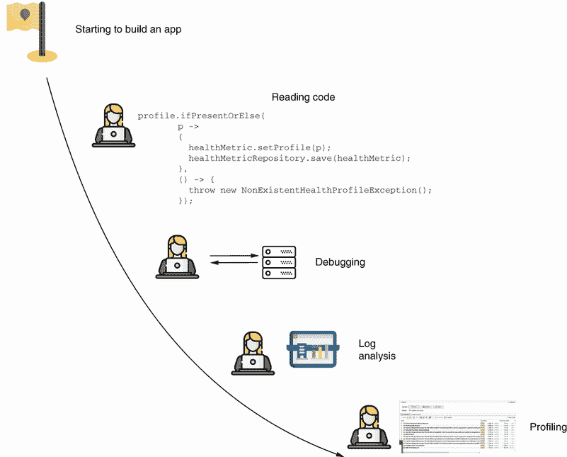

# 第一部分. 代码库调查的基础

作为软件开发者，在实际应用中工作通常涉及调查你的代码是如何工作的。在修复问题和实现新功能时，你必须理解应用的行为。你使用多种技术来完成这个目的，例如调试、日志记录、性能分析等等，这些技术我们将在本书中深入分析。

在第一部分，我们首先介绍开发者接触到的第一种技术：调试和日志记录。当你在开发一个应用时，必须经常进行调试。例如，假设你有一小段代码，你需要理解它是如何工作的。你使用调试器暂停应用的执行，深入探究应用是如何处理数据的。然后，当你的应用在某个环境中运行时，你可以大量依赖日志，它们为你提供了关于可能出错的地方的所需线索。

在第一章中，我们将讨论了解调查技术的必要性，并对其有一个整体的认识，这些内容将在本书的其余部分详细阐述。然后，我们将按照开发者接触这些技术的顺序来介绍它们。在第二章到第四章中，我们将讨论调试。在第五章中，我们将详细介绍在调查中实现和使用日志记录的必要细节。

