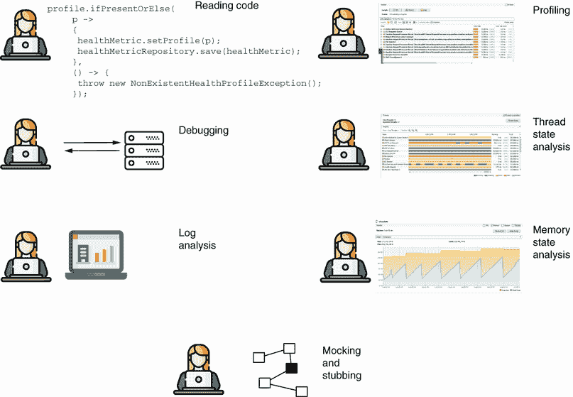
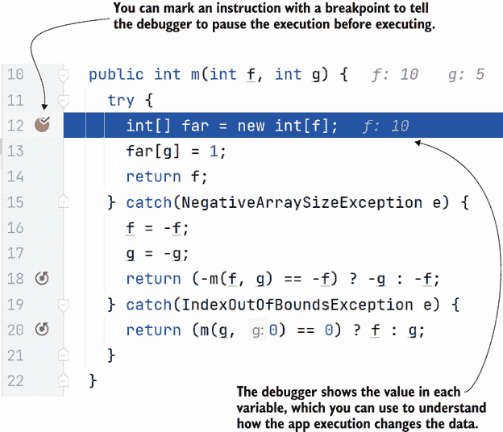
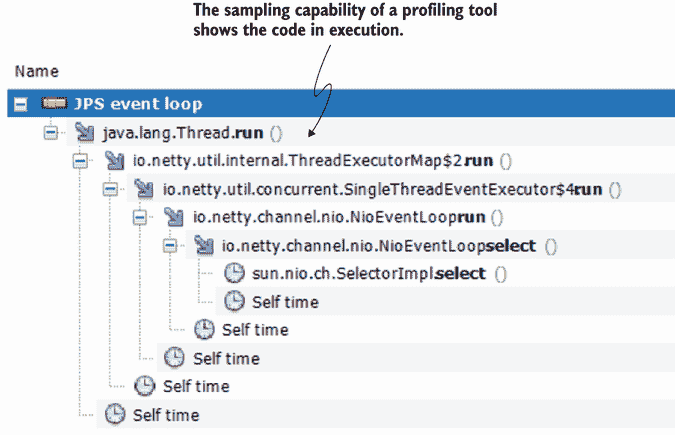
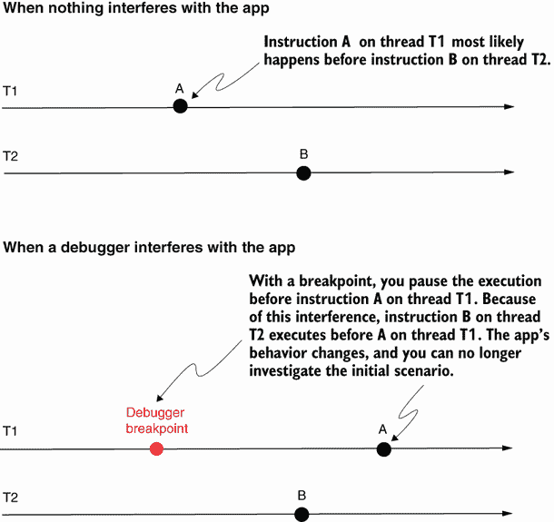
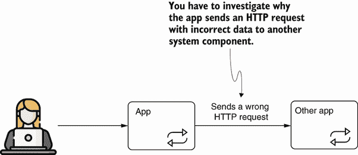
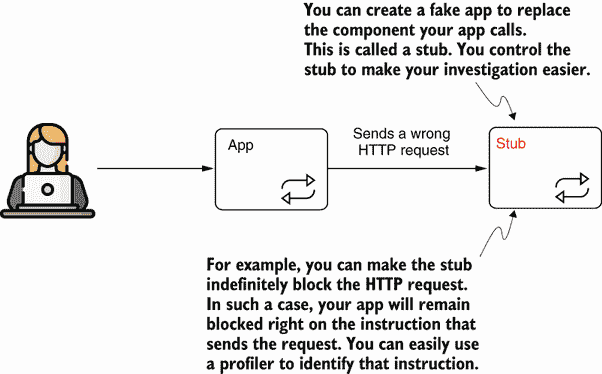
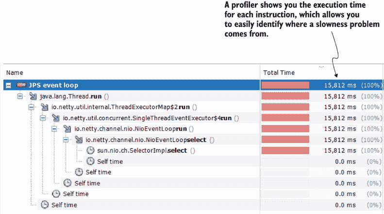
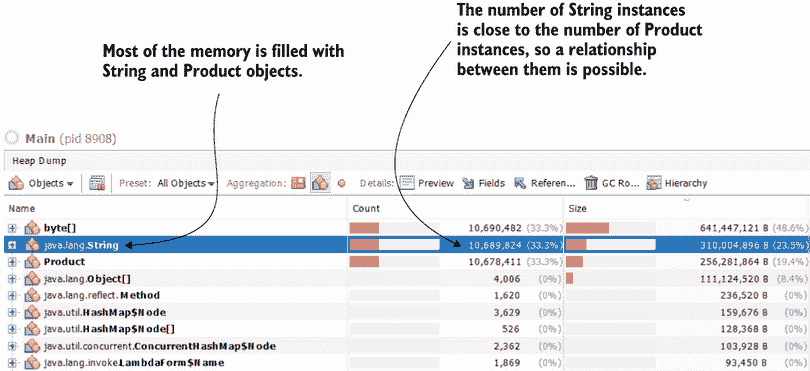
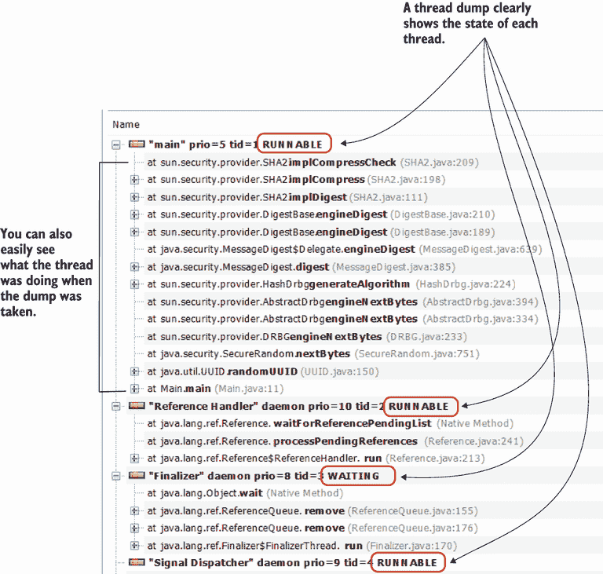

# 1 揭示应用程序的隐蔽之处

本章涵盖

+   代码调查技术的定义

+   我们使用哪些代码调查技术来理解 Java 应用程序

软件开发者有多种责任——其中大部分取决于他们如何理解他们正在工作的代码。软件开发者花费大量时间分析代码，以弄清楚如何纠正问题、实现新功能，甚至学习新技术。时间是宝贵的，因此开发者需要高效的调查技术以提高生产力。学习如何高效地理解你的代码是本书的主要内容。

备注：软件开发者通常花更多的时间理解软件的工作方式，而不是编写代码来实现新功能或纠正错误。


通常，软件开发者使用“调试”一词来指代任何调查技术；然而，这只是用于检查作为代码实现的逻辑的多种工具之一。虽然调试应该意味着“发现问题并解决它们”，但开发者使用它来命名分析代码工作方式的不同目的：

+   学习一个新的框架

+   找到问题的根本原因

+   理解现有逻辑以扩展其新功能

## 1.1 如何更容易地理解你的应用程序

首先，了解代码调查是什么以及开发者如何进行代码调查非常重要。在接下来的这一节中，我们将探讨一些常见的场景，在这些场景中你可以应用本书中将要学习的技术。

我将“调查代码”定义为分析软件能力特定行为的过程。你可能想知道，“为什么有这样的通用定义？调查的目的是什么？”在软件开发历史的早期，查看代码有一个明确的目的：找到和纠正软件错误（即“错误”）。这就是为什么许多开发者仍然使用“调试”这个术语。看看“调试”这个词是如何构成的：

**de-bug** = 消除错误，消除错误

在许多情况下，我们仍然调试应用程序以查找和纠正错误。但与软件开发早期相比，现在的应用程序更加复杂。在许多情况下，开发者发现自己正在调查特定软件能力的工作方式，仅仅是为了学习特定的技术或库。调试不再仅仅是找到特定问题；它还关于正确理解其行为（图 1.1；参见[`mng.bz/M012`](http://mng.bz/M012)）。


图 1.1 代码调查不仅关于在软件中找到问题。如今，应用程序复杂。我们经常使用调查技术来理解应用程序的行为，或者简单地学习新技术。

为什么我们要分析应用程序中的代码？

+   找到特定问题

+   理解特定软件能力的工作方式，以便我们可以增强它

+   学习特定的技术或库

许多开发者也因为乐趣而调查代码，因为探索代码的工作原理很有趣。有时它也可能变得令人沮丧，但没有什么能比找到问题的根本原因或最终理解事物是如何工作的感觉更好（图 1.2）。


图 1.2 调查代码不需要太多的体力劳动，但调试有时会让你感觉像劳拉·克劳馥或印第安纳·琼斯。许多开发者享受解决软件问题谜团的独特感觉。

我们可以应用各种调查技术来研究软件的行为。正如我们将在本章后面讨论的，开发者（尤其是初学者）常常错误地认为调试等同于使用调试器工具。调试器是一个你可以用来读取并更轻松地理解应用程序源代码的软件程序，通常是通过在特定指令上暂停执行并逐步运行代码来实现的。这是研究软件行为的一种常见方式（通常是开发者首先学习的方式）。但并非只有这一种技术，而且它并不适用于所有场景。我们将在第二章和第三章中讨论使用调试器的标准和更高级的方法。图 1.3 展示了你将在本书中学到的各种调查技术。



图 1.3 代码调查技术。根据具体情况，开发者可以选择使用这些技术中的一种或多种来理解某个功能是如何工作的。

当开发者解决一个错误时，他们大部分时间都在理解一个特定的功能。他们最终做出的更改有时会将问题简化到一行代码——一个缺失的条件、一个缺失的指令或一个误用的运算符。不是编写代码，而是理解应用程序的工作原理占据了开发者的大部分时间。

在某些情况下，仅仅阅读代码就足以理解它，但阅读代码并不像阅读一本书。当我们阅读代码时，我们不会从上到下按逻辑顺序阅读漂亮的短段落。相反，我们从一种方法跳到另一种方法，从一个文件跳到另一个文件；有时我们感觉自己像是在一个庞大的迷宫中前进并迷失方向。（关于这个话题，我推荐 Felienne Hermans 写的优秀书籍《程序员的大脑》[Manning, 2021]）。

在许多情况下，源代码的编写方式并不易于阅读。是的，我知道你在想什么：它应该是这样的。我也同意你的看法。今天，我们学习了许多代码设计模式和原则以及如何避免代码异味，但让我们说实话：在太多情况下，开发者并没有正确地使用这些原则。此外，遗留应用程序通常不遵循这些原则，仅仅是因为这些原则在那些功能编写时很多年前并不存在。但你还必须能够调查这样的代码。

查看列表 1.1。假设你在尝试确定你正在工作的应用中问题根本原因时找到了这段代码。这段代码肯定需要重构。但在你重构它之前，你需要了解它在做什么。我知道有些开发者可以阅读这段代码并立即理解它在做什么，但我不属于他们。

为了更容易地理解列表 1.1 中的逻辑，我使用了一个*调试器*——一个允许我在特定行上暂停执行并手动运行每个指令，同时观察数据如何变化，以便逐行检查它如何与给定的输入一起工作（如我们将在第二章中讨论）。凭借一些经验和一些技巧（我们将在第二章和第三章中讨论），你会发现通过解析这段代码几次，它计算了给定输入之间的最大值。这段代码是本书提供的 da-ch1-ex1 项目的一部分。

列表 1.1 需要使用调试器的难以阅读的逻辑

```
public int m(int f, int g) {
  try {
    int[] far = new int[f];
    far[g] = 1;
    return f;
  } catch(NegativeArraySizeException e) {
    f = -f;
    g = -g;
    return (-m(f, g) == -f) ? -g : -f;
  } catch(IndexOutOfBoundsException e) {
    return (m(g, 0) == 0) ? f : g;
  }
}
```

有些场景不允许你导航代码，或者使导航更加困难。今天，大多数应用依赖于库或框架等依赖项。在大多数情况下，即使你有访问源代码的权限（当你使用开源依赖项时），仍然很难跟踪定义框架逻辑的源代码。有时，你可能甚至不知道从哪里开始。在这种情况下，你必须使用不同的技术来理解应用。例如，你可以使用分析器工具（如你将在第六章到第九章中学习的）来识别在决定开始调查之前执行的代码。

其他场景不会给你运行应用的机会。在某些情况下，你可能需要调查导致应用崩溃的问题。如果遇到问题的应用是一个生产服务，你需要快速使其可用。因此，你需要收集详细信息并使用它们来识别问题，并改进应用以避免未来出现相同的问题。这种依赖于应用崩溃后收集的数据的调查称为*事后调查*。对于此类案例，你可以使用日志、堆转储或线程转储——我们在第十章和第十一章中将讨论的故障排除工具。

## 1.2 使用调查技术的典型场景

让我们讨论一些使用代码调查方法的常见场景。我们必须从现实世界的应用中分析一些典型案例，以强调本书主题的重要性：

+   理解为什么特定的代码或软件功能提供的不同结果与预期不符

+   学习如何应用所使用的依赖技术工作

+   识别导致应用缓慢等性能问题的原因

+   找出应用突然停止的案例的根本原因

对于每个展示的案例，你都会发现一或多个有助于调查应用逻辑的技术。稍后，我们将深入探讨这些技术，并通过示例演示如何使用它们。

### 1.2.1 揭秘意外输出

你需要分析代码的最常见场景是某些逻辑最终产生了与预期不同的输出。这听起来可能很简单，但解决起来并不一定容易。

首先，让我们定义*输出*。对于应用来说，这个术语可能有多种定义。输出可能是应用控制台中的某些文本，也可能是数据库中更改的某些记录。我们可以将输出视为应用发送到不同系统的 HTTP 请求或客户端请求的 HTTP 响应中发送的数据。

定义：执行可能引起数据变化、信息交换或对不同组件或系统采取行动的逻辑的任何结果，都是一种*输出*。

我们如何调查一个特定部分的应用没有达到预期执行结果的情况？我们通过根据预期输出选择适当的技术来实现。让我们看看一些例子。

场景 1：简单情况

假设一个应用应该将一些记录插入到数据库中。然而，应用只添加了部分记录。也就是说，你期望在数据库中找到比应用实际产生的更多数据。

分析的最简单方法就是使用调试工具来跟踪代码执行并理解其工作原理（图 1.4）。你将在第二章和第三章中学习调试器的主要功能。调试器会在你选择的特定代码行处添加断点，暂停应用执行，然后允许你手动继续执行。你可以逐条运行代码指令，以便查看变量值的变化并即时评估表达式。



图 1.4 使用调试器，你可以在特定指令之前暂停执行，然后通过手动逐条运行指令来观察应用逻辑如何通过改变数据。

这个场景是最简单的，通过正确学习使用所有相关的调试器功能，你可以迅速找到此类问题的解决方案。不幸的是，其他情况更为复杂，调试工具并不总是足以解决谜题并找到问题的原因。

小贴士：在许多情况下，一种调查技术不足以理解应用的行为。你需要结合各种方法来更快地理解更复杂的行为。


场景 2：我应该从哪里开始调试的情况？

有时候，你可能无法使用调试器，仅仅是因为你不知道要调试什么。假设你的应用程序是一个包含许多代码行的复杂服务。你调查了一个问题，其中应用程序没有在数据库中存储预期的记录。这肯定是一个输出问题，但出于定义你的应用程序的数千行代码之外，你不知道哪个部分实现了你需要修复的功能。

我记得有一个同事正在调查这样一个问题。由于找不到入手的地方而感到压力，他大声说道：“我希望调试器有一个方法，可以让你在应用程序的所有行上添加断点，这样你就可以看到它实际使用了什么。”

我同事的说法很有趣，但在调试器中拥有这样的功能并不是解决方案。我们还有其他方法来解决这个问题。你很可能会通过使用性能分析器来缩小可以添加断点的代码行的可能性。

*性能分析器*是一个你可以用来识别应用程序运行时执行了哪些代码的工具（图 1.5）。这对于我们的场景是一个很好的选择，因为它会给你一个关于如何使用调试器开始调查的想法。我们将在第六章到第九章中讨论使用性能分析器，你将了解到你拥有的选项不仅仅只是观察执行中的代码。



图 1.5 使用性能分析器识别执行中的代码。如果你不知道从哪里开始调试，性能分析器可以帮助你识别正在运行的代码，并给你一个关于你可以使用调试器的想法。

场景 3：多线程应用程序

当处理通过多个线程实现的逻辑或*多线程架构*时，情况变得更加复杂。在许多这类情况下，使用调试器并不是一个选择，因为多线程架构往往对干扰很敏感。

换句话说，当使用调试器时，应用程序的行为方式会有所不同。开发者将这种特性称为*海森堡执行*或*海森堡虫*（图 1.6）。这个名字来源于 20 世纪的物理学家维尔纳·海森堡，他提出了不确定性原理，该原理指出，一旦你干扰了一个粒子，它的行为就会改变，因此你不能同时准确地预测它的速度和位置（[`plato.stanford.edu/entries/qt-uncertainty/`](https://plato.stanford.edu/entries/qt-uncertainty/)）。如果你干扰了多线程架构，它可能会改变其行为方式，就像你干扰量子力学粒子一样。



图 1.6 海森堡执行。在多线程应用程序中，当调试器干扰应用程序的执行时，它可能会改变应用程序的行为。这种变化不允许你正确调查你想要研究的初始应用程序行为。

对于多线程功能，我们有大量的案例。这就是为什么我认为这些场景是最难测试的。有时分析器是一个好选择，但即使是分析器也可能干扰应用程序的执行，所以这也不一定有效。另一个选择是在应用程序中使用日志（我们将在第五章中讨论）。对于某些问题，你可以找到一种方法将线程数减少到一个，这样你就可以使用调试器进行调查。

场景 4：向特定服务发送错误的调用

你可能需要调查一个应用程序没有正确与其他系统组件或外部系统交互的场景。假设你的应用程序向另一个应用程序发送 HTTP 请求。你被第二个应用程序的维护者通知，HTTP 请求没有正确的格式（可能缺少一个标题或请求体包含错误的数据）。图 1.7 直观地展示了这个案例。



图 1.7 错误的输出可能是你的应用程序向另一个系统组件发送错误请求。你可能会被要求调查这种行为并找到其根本原因。

这是一个*错误输出*场景。你该如何处理它？首先，你需要确定代码的哪个部分发送请求。如果你已经知道，你可以使用调试器来调查应用程序是如何创建请求的，并确定出了什么问题。如果你需要找到应用程序的哪个部分发送请求，你可能需要使用分析器，正如你将在第六章到第九章中学到的。你可以使用分析器来确定在执行过程中的某个时刻正在执行什么代码。

这里有一个我经常使用的小技巧，当我必须处理像这样一个复杂的案例时，由于某种原因，我无法直接识别应用程序发送请求的地址：我将其他应用程序（我的应用程序错误地发送请求的应用程序）替换为一个存根。一个*存根*是一个我可以控制以帮助我识别问题的假应用程序。例如，为了确定代码的哪个部分发送请求，我可以让我的存根阻止请求，这样我的应用程序就会无限期地等待响应。然后，我简单地使用一个分析器来确定被存根阻止的代码。图 1.8 展示了存根的使用。将此图与图 1.7 进行比较，以了解存根是如何替换真实应用程序的。



图 1.8 你可以用存根替换你的应用程序调用的系统组件。你控制存根以快速确定你的应用程序从哪里发送请求。你还可以在修复问题后使用存根来测试你的解决方案。

### 1.2.2 学习某些技术

调查技术分析代码的另一种用途是了解某些技术是如何工作的。一些开发者开玩笑说，6 小时的调试可以节省 5 分钟阅读文档的时间。虽然阅读文档在学习新事物时也是必不可少的，但有些技术仅通过阅读书籍或规范是难以学会的。我总是建议我的学生深入一个特定的框架或库，以正确理解它。

TIP 对于你学习的任何技术（框架或库），花些时间回顾你写的代码。总是尝试更深入，调试框架的代码。


我将从我最喜欢的 Spring Security 开始。乍一看，Spring Security 可能看起来微不足道。它只是实现认证和授权，对吧？事实上，它确实是——直到你发现将这两种能力配置到应用程序中的各种方法。如果你配置错误，你可能会遇到麻烦。当事情不工作时，你必须处理那些不工作的事情，而处理这些不工作的事情的最佳选择就是调查 Spring Security 的代码。

莫过于调试帮助我理解 Spring Security。为了帮助他人，我将我的经验和知识融入了一本书中，*《Spring Security in Action》*（Manning，2020）。在这本书中，我提供了 70 多个项目供你使用，不仅是为了重新创建和运行，也是为了调试。我邀请你调试你阅读的书籍中提供的所有示例，以学习各种技术。

我通过调试学到的第二种技术是 Hibernate。Hibernate 是一个用于实现应用程序与 SQL 数据库交互能力的高级框架。Hibernate 是 Java 世界中知名度最高、使用最广泛的框架之一，因此对于任何 Java 开发者来说，学习它都是必须的。

学习 Hibernate 的基础知识很容易，你可以通过简单地阅读书籍来完成。但在现实世界中，使用 Hibernate（包括如何使用和在哪里使用）远不止基础知识那么简单。对我来说，如果不深入研究 Hibernate 的代码，我肯定不会像现在这样对这一框架了解得这么多。

我给你的建议很简单：对于你学习的任何技术（框架或库），花些时间回顾你写的代码。总是尝试更深入，调试框架的代码。这将使你成为一个更好的开发者。

### 1.2.3 澄清缓慢的原因

应用程序中偶尔会出现性能问题，就像任何其他问题一样，在你知道如何解决它们之前，你需要先调查它们。学习正确使用不同的调试技术来识别性能问题的原因至关重要。

根据我的经验，在应用程序中最常见的性能问题与应用程序响应速度有关。然而，尽管大多数开发者认为缓慢和性能是等同的，但这并不正确。缓慢问题（应用程序对给定触发器响应缓慢的情况）只是性能问题的一种。

例如，我曾经不得不调试一个消耗设备电池过快的移动应用程序。我有一个使用连接到外部设备的蓝牙库的 Android 应用程序。由于某种原因，该库在未关闭的情况下创建了大量的线程。这些保持打开状态且无目的运行的线程被称为*僵尸线程*，通常会导致性能和内存问题。它们通常也很难调查。

然而，这种电池消耗过快的类型的问题也是应用程序性能问题。在网络上传输数据时使用过多网络带宽的应用程序是另一个性能问题的良好例子。

让我们专注于缓慢问题，这是最常遇到的。许多开发者害怕缓慢问题。通常，这并不是因为这些问题的识别很困难，而是因为它们可能很难解决。使用性能分析器找到性能问题的原因通常是一项容易的工作，正如你将在第六章到第九章中了解到的那样。除了识别哪些代码执行外，正如第 1.2.1 节中讨论的，性能分析器还会显示应用程序在每条指令上花费的时间（图 1.9）。



图 1.9 使用性能分析器调查缓慢问题。性能分析器显示了代码执行期间每条指令花费的时间。这个性能分析器功能对于识别性能问题的根本原因非常出色。

在许多情况下，缓慢问题是由 I/O 调用引起的，例如从文件或数据库读取或写入，或通过网络发送数据。因此，开发者通常会采取经验主义的方法来找出问题的原因。如果你知道哪个功能受到影响，你可以专注于该功能执行的 I/O 调用。这种方法也有助于缩小问题范围，但通常你仍然需要一个工具来识别其确切位置。

### 1.2.4 理解应用程序崩溃

有时候，应用程序由于各种原因完全停止响应。这类问题通常被认为比其他问题更难调查。在许多情况下，应用程序崩溃仅在特定条件下发生，因此你无法在本地环境中重现（故意制造问题）。

每次调查问题时，你都应该首先尝试在一个可以研究问题的环境中重现它。这种方法给你的调查提供了更多的灵活性，并帮助你确认你的解决方案。然而，我们并不总是幸运到能够重现一个问题。应用程序崩溃通常也不容易重现。

我们在两种主要类型的应用程序崩溃场景中找到问题：

+   应用程序完全停止。

+   应用程序仍在运行，但不会响应用户请求。

当应用程序完全停止时，通常是因为它遇到了无法恢复的错误。最常见的情况是内存错误导致这种行为。对于 Java 应用程序，堆内存填满且应用程序不再工作的情况由`OutOfMemoryError`消息表示。

为了调查堆内存问题，我们使用*堆转储*，它提供了特定时间点堆内存内容的快照。你可以配置 Java 进程，在发生`OutOfMemoryError`消息并且应用程序崩溃时自动生成这样的快照。

堆转储是强大的工具，可以提供大量关于应用程序内部如何处理数据的详细信息。我们将在第十一章中更详细地讨论如何使用它们。但让我们先快速看一下一个简短的例子。

列表 1.2 展示了填充内存的`Product`类实例的小代码片段。你可以在书中提供的项目 da-ch1-ex2 中找到这个应用程序。该应用程序持续向列表中添加`Product`实例，导致预期的`OutOfMemoryError`消息。

列表 1.2 一个导致`OutOfMemoryError`消息的应用程序示例

```
public class Main {

  private static List<Product> products =              ❶
     new ArrayList<>();

  public static void main(String[] args) {
    while (true) {
      products.add(                                    ❷
        new Product(UUID.randomUUID().toString()));    ❸
    }
  }
}
```

❶ 我们声明了一个存储`Product`对象引用的列表。

❷ 我们持续向列表中添加`Product`实例，直到堆内存完全填满。

❸ 每个产品实例都有一个字符串属性。我们使用一个唯一的随机标识符作为其值。

图 1.10 显示了为该应用程序的一次执行创建的堆转储。你可以轻松地看到`Product`和`String`实例占据了大部分堆内存。堆转储就像内存的地图。它提供了许多细节，包括实例之间的关系以及值。例如，即使你看不到代码，你仍然可以根据这些实例的数量接近程度注意到`Product`和`String`实例之间的联系。不用担心这些方面看起来很复杂。我们将在第十一章中详细讨论你需要了解的所有关于使用堆转储的知识。



图 1.10 堆转储就像堆内存的地图。如果你学会如何阅读它，它就会给你提供关于应用程序内部如何处理数据的宝贵线索。堆转储有助于你调查内存问题或性能问题。在这个例子中，你可以轻松地找到哪个对象占据了应用程序的大部分内存，以及`Product`和`String`实例之间的关系。

如果应用程序仍在运行但停止响应用户请求，那么*线程转储*是分析发生情况的最佳工具。图 1.11 展示了线程转储的示例以及该工具提供的一些详细信息。在第十章中，我们将讨论生成和分析线程转储以调查代码。



图 1.11 线程转储提供了在转储时正在运行的线程的详细信息。它包括线程状态和堆栈跟踪，这些信息告诉你线程正在执行什么或是什么阻止了它们。这些细节对于调查为什么应用卡住或遇到性能问题非常有价值。

## 1.3 你将在本书中学到什么

这本书是为具有各种经验水平的 Java 开发者编写的，从初学者到专家。你将学习各种代码调查技术、应用它们的最佳场景以及如何应用它们以节省你在故障排除和调查上的时间。

如果你是一名初级开发者，你很可能会从这本书中学到很多东西。有些开发者可能只有在多年的经验之后才掌握所有这些技术；而有些人可能永远也掌握不了。如果你已经是专家，你可能发现你已经知道了很多东西，但你仍然有很大机会找到你以前没有机会遇到的新颖和令人兴奋的方法。

当你完成这本书后，你将学会以下技能：

+   应用不同的方法使用调试器来理解应用的逻辑或找到问题

+   使用分析器调查隐藏的功能，以更好地理解你的应用或应用的具体依赖项是如何工作的

+   分析代码技术以确定你的应用或其依赖项是否导致了某个问题

+   调查应用内存快照中的数据以识别应用处理数据时可能存在的问题

+   使用日志来识别应用行为中的问题或识别安全漏洞

+   使用远程调试来识别你在不同环境中无法重现的问题

+   正确选择使用哪些应用调查技术以使你的调查更快

## 摘要

+   你可以使用各种调查技术来分析软件行为。

+   根据你的情况，一种调查技术可能比另一种更有效。你需要知道如何选择正确的方法来使你的调查更高效。

+   在某些情况下，结合使用多种技术可以帮助你更快地识别问题。了解每种分析技术的工作原理，将使你在处理复杂问题时具有很大的优势。

+   在许多情况下，开发者使用调查技术来学习新知识，而不是解决问题。当学习像 Spring Security 或 Hibernate 这样的复杂框架时，仅仅阅读书籍或文档是不够的。加速学习的一个极好方法是调试使用你想要更好地理解的技术示例。

+   如果你能在可以研究的环境中重现一个情况，那么调查这个情况会更容易。重现问题不仅可以帮助你更容易地找到其根本原因，而且还可以帮助你确认当解决方案应用时它是有效的。
