# 2 通过调试技术理解你的应用程序逻辑

本章涵盖

+   何时使用调试器以及何时避免使用

+   使用调试器调查代码

不久前，在一次我的钢琴课上，我将我想学习的歌曲乐谱分享给了我的钢琴老师。当他第一次阅读乐谱时就演奏了这首歌，我感到非常震撼。“这太酷了！”我想。“一个人是如何获得这种技能的？”

然后，我想起了几年前我在我工作的公司的一个同伴编程会议中与一位新聘的初级程序员一起。轮到我坐在键盘前，我们正在使用调试器调查一段相对较大且复杂的代码。我开始在代码中导航，相对快速地按键盘上的键，使我能够跳过、进入和退出特定的代码行。我专注于代码，但相当平静和放松，几乎忘记了我旁边有人（我太粗鲁了）。我听到这个人说：“哇，慢一点。你太快了。你能读懂那代码吗？”

我意识到这种情况与我的钢琴老师经验相似。你如何获得这种技能？答案是比你想象的简单：努力工作和积累经验。虽然练习是宝贵的，并且需要花费大量时间，但我有一些可以帮助你更快提高技术的建议。在本章中，我们讨论了在理解代码时使用的重要工具之一：调试器。

定义 调试器是一种工具，它允许你在特定的行上暂停执行，并手动执行每条指令，同时观察数据如何变化。


使用调试器就像使用谷歌地图导航：它帮助你找到你代码中实现的复杂逻辑的路径。它也是理解代码时最常用的工具。

调试器通常是开发者学习的第一个工具，以帮助他们理解代码的功能。幸运的是，所有 IDE 都自带调试器，因此你不需要做任何特别的事情就可以拥有它。在这本书中，我使用 IntelliJ IDEA Community 作为我的示例，但任何其他 IDE 都相当相似，并且提供了（有时外观不同）我们将讨论的相同选项。尽管调试器似乎是一个大多数开发者都知道如何使用的工具，但你可能会在本章和第三章中找到一些使用调试器的新技巧。

我们将在 2.1 节中开始讨论开发者如何阅读代码以及为什么在许多情况下，仅仅阅读代码并不足以理解它。进入调试器或分析器（我们将在第六章至第九章中讨论）。在 2.2 节中，我们将通过一个示例继续讨论使用调试器的最简单技术。

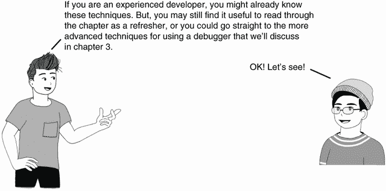

## 2.1 当分析代码不足以理解时

让我们先讨论如何阅读代码以及为什么仅仅阅读逻辑有时不足以理解它。在本节中，我将解释阅读代码的工作原理以及它与阅读其他事物（如故事或诗歌）的不同之处。为了观察这种差异并理解解码代码复杂性的原因，我们将使用一个实现简短逻辑片段的代码片段。了解我们的大脑如何解释代码背后的内容有助于你意识到需要像调试器这样的工具。

任何代码调查场景都是从阅读代码开始的。但是阅读代码与阅读诗歌不同。当你阅读一首诗时，你会按照给定的线性顺序逐行阅读文本，让你的大脑组装并想象其含义。如果你两次阅读同一首诗，你可能会理解不同的事情。

然而，对于代码来说，情况正好相反。首先，代码不是线性的。当你阅读代码时，你不会简单地逐行阅读。相反，你会跳进跳出指令，以理解它们如何影响正在处理的数据。阅读代码更像是一个迷宫，而不是一条直线。而且，如果你不专心，你可能会迷路并忘记你从哪里开始。其次，与诗歌不同，代码对每个人来说总是意味着相同的事情。这个含义是你的调查目标。

就像你会用指南针找到你的路一样，调试器可以帮助你更容易地识别你的代码做了什么。例如，我们将使用 `decode(List<Integer> input)` 方法。你可以在书中提供的项目 da-ch2-ex1 中找到这段代码。

列表 2.1 调试方法的示例

```
public class Decoder {

  public Integer decode(List<String> input) {
    int total = 0;
    for (String s : input) {
      var digits = new StringDigitExtractor(s).extractDigits();
      total += digits.stream().collect(Collectors.summingInt(i -> i));
    }

    return total;
  }
}
```

如果你从顶部行读到底部行，你必须假设一些事情的工作方式来理解它。这些指令真的在执行你认为它们正在做的事情吗？当你不确定时，你必须深入挖掘并观察代码实际上做了什么——你必须分析其背后的逻辑。图 2.1 指出了给定代码片段中的两个不确定性：

+   `StringDigitExtractor()` 构造函数做什么？它可能只是创建一个对象，或者也可能做其他事情。它可能会以某种方式改变给定参数的值。

+   调用 `extractDigits()` 方法的结果是什么？它返回一个数字列表吗？它也改变了我们在创建 `StringDigitsExtractor` 构造函数时使用的对象内部的参数吗？

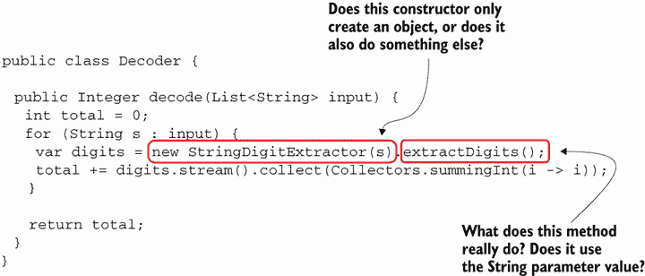

图 2.1 当阅读一段代码时，你通常需要弄清楚组成该逻辑的一些指令背后发生了什么。方法名并不总是足够有暗示性，而且你不能完全依赖它们。相反，你需要深入了解这些方法做了什么。

即使是小块代码，您可能也需要深入了解指令。您检查的每个新代码指令都会创建一个新的调查计划，并增加其认知复杂性（见图 2.2 和 2.3）。您越深入逻辑，打开的计划越多，过程就越复杂。

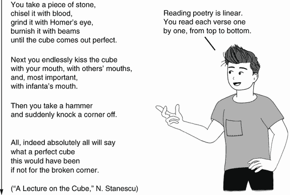

图 2.2 比较您阅读诗歌的方式与您阅读代码的方式。您逐行阅读诗歌，但阅读代码时却四处跳跃。


图 2.3 阅读代码与阅读诗歌不同，并且要复杂得多。您可以想象阅读代码就像在两个维度上阅读。一个维度是从上到下阅读一段代码。第二个维度是进入一个特定的指令以详细了解它。

阅读诗歌通常只有一条路径。代码分析则会在同一逻辑片段中创建许多路径。您打开的新计划越少，过程就越简单。您必须在跳过某些指令、使整体调查过程更简单或深入了解以更好地理解每个单独的指令并提高过程复杂性之间做出选择。

TIP 总是尝试通过最小化您为调查而打开的计划数量来缩短阅读路径。使用调试器可以帮助您更轻松地导航代码，跟踪您的位置，并观察应用程序在执行过程中如何更改数据。


## 2.2 使用调试器调查代码

在本节中，我们讨论一个可以帮助您最小化阅读代码时的认知努力，以理解其工作原理的工具——调试器。所有集成开发环境（IDE）都提供调试器，尽管不同 IDE 的界面可能略有不同，但选项通常是相同的。本书中，我将使用 IntelliJ IDEA Community，但我鼓励您使用您最喜欢的 IDE，并将其与书中的示例进行比较。您会发现它们非常相似。

调试器通过以下方式简化调查过程：

+   提供一种在特定步骤暂停执行并按自己的节奏手动执行每个指令的方法。

+   在代码的阅读路径中显示您所在的位置和您从哪里来；这样，调试器就像一张您可以使用的地图，而不是试图记住所有细节。

+   显示变量所持有的值，使调查更容易可视化并处理。

+   允许您通过使用监视器和评估表达式来即时尝试事物。

让我们再次以项目 da-ch2-ex1 中的示例为例，并使用最直接的调试器功能来理解代码。

列表 2.2 我们想要理解的代码片段

```
public class Decoder {

  public Integer decode(List<String> input) {
    int total = 0;
    for (String s : input) {
      var digits = new StringDigitExtractor(s).extractDigits();
      total += digits.stream().collect(Collectors.summingInt(i -> i));
    }

    return total;
  }
}
```

我敢肯定你正在想，“我什么时候知道该使用调试器？”这是一个合理的问题，我想要在进一步讨论之前回答。主要前提是*知道你想要调查哪部分逻辑*。正如你将在本节中学到的，使用调试器的第一步是选择一个你想让执行暂停的指令。

注意：除非你已经知道你需要从哪个指令开始你的调查，否则你不能使用调试器。


在现实世界中，你会遇到你事先不知道想要调查的具体逻辑片段的情况。在这种情况下，在你能够使用调试器之前，你需要应用不同的技术来找到你想要使用调试器调查的代码部分（我们将在后面的章节中讨论）。在本章和第三章中，我们将只关注使用调试器，所以我们将假设你以某种方式找到了你想要理解的那段代码。

回到我们的例子，我们应该从哪里开始？首先，我们需要阅读代码，弄清楚我们理解和不理解的部分。一旦我们确定了逻辑变得不清晰的地方，我们就可以执行应用程序，并“告诉”调试器暂停执行。我们可以在那些不清楚的代码行上暂停执行，以观察它们如何改变数据。为了“告诉”调试器在哪里暂停应用程序的执行，我们使用*断点*。

定义：断点是我们用来标记的行，我们希望调试器在这里暂停执行，以便我们可以调查实现的逻辑。调试器将在执行带有断点的行之前暂停执行。


在图 2.4 中，我标记了那些相对容易理解的代码（考虑到你掌握了语言基础）。正如你所见，这段代码接受一个列表作为输入，解析列表，处理列表中的每个项目，并最终以某种方式计算出一个整数，这是方法返回的。此外，方法实现的过程在没有调试器的情况下也容易确定。

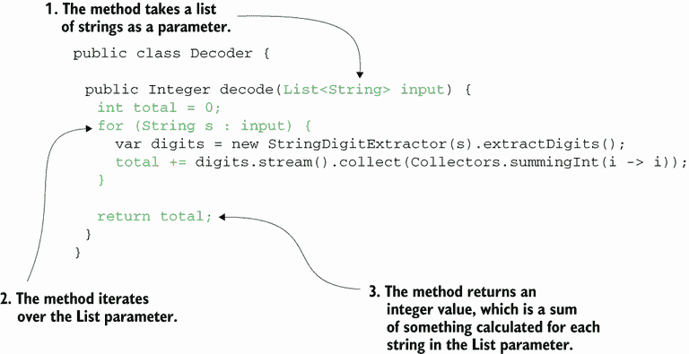

图 2.4 假设你掌握了语言基础，你很容易就能看出这段代码接受一个集合作为输入，并解析这个集合来计算一个整数。

在图 2.5 中，我标记了通常在理解方法做什么时造成困难的那几行。这些代码行更难以解析，因为它们隐藏了自己的实现逻辑。你可能认识`digits.stream().collect (Collectors.summingInt(i -> i))`，因为它是从 Java 8 开始随 JDK 提供的 Stream API 的一部分。但关于`new StringDigitExtractor(s).extractDigits()`，我们无法说同样的话。因为这是我们要调查的应用程序的一部分，这条指令可能做任何事情。

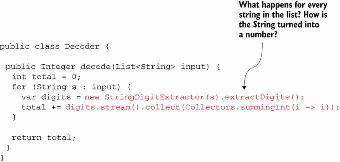

图 2.5 在这段代码中，我阴影了更难以理解的代码行。当你使用调试器时，在使代码更具挑战性的第一行设置第一个断点。

开发者选择编写代码的方式也可能增加额外的复杂性。例如，从 Java 10 开始，开发者可以使用`var`来推断局部变量的类型。推断变量类型并不总是明智的选择，因为它可能会使代码更难以阅读（图 2.5），从而增加一个使用调试器会很有用的场景。

提示：在用调试器调查代码时，从你无法理解的代码的第一行开始。


在过去许多年里，我在培训初级开发人员和学生的过程中观察到，在许多情况下，他们会在特定代码块的第一行开始调试。虽然你当然可以这样做，但如果你首先在不使用调试器的情况下阅读代码，并尝试弄清楚你是否能理解代码，则会更有效率。然后，直接从引起困难的地方开始调试。这种方法将为你节省时间，因为你可能会发现你不需要调试器就能理解特定逻辑中的发生情况。毕竟，即使你使用调试器，你也只需要查看你不理解的代码。

在某些情况下，你会在某一行添加断点，因为其意图并不明显。有时你的应用程序会抛出异常；你在日志中看到这一点，但不知道哪一行之前的代码导致了问题。在这种情况下，你可以在应用程序抛出异常之前添加一个断点来暂停应用程序的执行。但理念保持不变：避免暂停你理解的指令的执行。相反，使用断点来关注你想要关注的代码行。

对于这个例子，我们将从在图 2.6 中显示的第 11 行添加断点开始：

```
var digits = new StringDigitExtractor(s).extractDigits();
```

通常，要在任何 IDE 中的某一行添加断点，你可以在行号上或附近点击（或者更好的是，使用键盘快捷键；对于 IntelliJ，你可以在 Windows/Linux 上使用 Ctrl-F8，或者在 macOS 上使用 Command-F8）。断点将以圆圈的形式显示，如图 2.6 所示。确保你使用调试器运行你的应用程序。在 IntelliJ 中，寻找一个表示为小虫子图标按钮，它靠近你用来启动应用程序的按钮。你也可以右键单击主类文件，并在上下文菜单中使用调试按钮。当执行到达你标记的断点所在的行时，它会暂停，允许你手动导航。

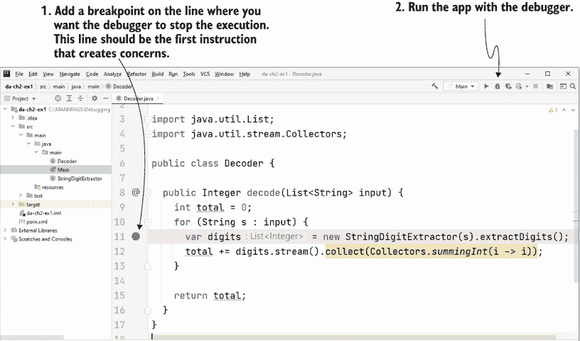

图 2.6 在行号附近点击以在特定行添加断点。然后，使用调试器运行应用程序。执行将在你标记的断点所在的行暂停，并允许你手动控制。

由于快捷键可能会根据您使用的操作系统而改变和不同（一些开发者甚至更喜欢自定义它们），我通常不会讨论它们。然而，我建议您检查您的 IDE 手册，并学习如何使用键盘快捷键。

注意 记住，您始终需要使用调试选项来执行应用程序，以便拥有一个活动的调试器。如果您使用运行选项，由于 IDE 没有将调试器附加到运行进程，断点将不会被考虑。某些 IDE 可能会默认运行您的应用程序并附加调试器，但如果不是这种情况（例如 IntelliJ 或 Eclipse），则应用程序的执行将不会在您定义的断点上暂停。

当调试器在您标记为断点的行上的特定指令处暂停代码执行时，您可以使用 IDE 显示的宝贵信息。在图 2.7 中，您可以看到我的 IDE 显示了两个基本的信息：

+   *作用域内所有变量的值*——了解所有变量的值及其值有助于您理解正在处理哪些数据以及逻辑如何影响数据。记住，执行是在带有断点的行的执行之前暂停的，因此数据状态保持不变。

+   *执行堆栈跟踪*——这显示了应用程序如何执行调试器暂停执行的那行代码。堆栈跟踪中的每一行都是调用链中涉及的方法。执行堆栈跟踪有助于您可视化执行路径，而无需记住在使用调试器通过代码导航时如何到达特定的指令。

TIP 您可以添加尽可能多的断点，但最好一次只使用有限数量的断点，并专注于那些代码行。我通常一次不会使用超过三个断点。我经常看到开发者添加过多的断点，忘记它们，并在调查的代码中迷失方向。


通常，观察作用域内变量的值是容易理解的。但，根据您的经验，您可能或可能不知道执行堆栈跟踪是什么。第 2.2.1 节讨论了执行堆栈跟踪以及为什么这个工具是必不可少的。然后我们将讨论如何使用如步过、步入和步出等基本操作来导航代码。如果您已经熟悉执行堆栈跟踪，可以直接跳过 2.2.1 节，直接进入 2.2.2 节。

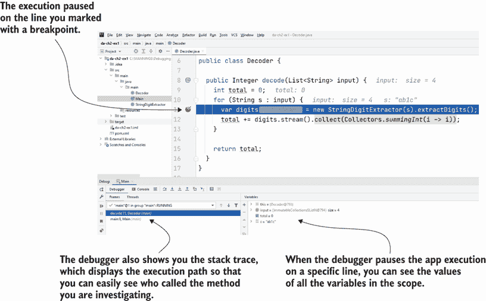

图 2.7 当执行在给定的代码行上暂停时，您可以看到所有作用域内的变量及其值。您还可以使用执行堆栈跟踪来在通过代码行导航时记住您所在的位置。

### 2.2.1 执行堆栈跟踪是什么，我如何使用它？

执行堆栈跟踪是在调试代码时使用的宝贵工具。就像一张地图一样，执行堆栈跟踪显示了执行路径到调试器暂停的具体代码行，并帮助你决定进一步导航的位置。

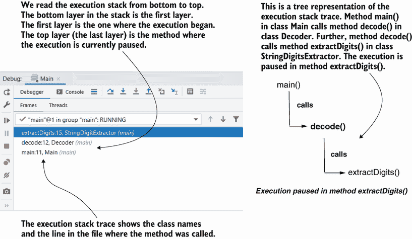

图 2.8 执行堆栈跟踪的最顶层是调试器暂停执行的地方。执行堆栈跟踪中的所有其他层都是上述层所代表的方法被调用的地方。堆栈跟踪的底层（第一层）是当前线程执行开始的地方。

图 2.8 提供了执行堆栈跟踪和树形格式下执行的比较。堆栈跟踪显示了方法是如何相互调用，直到调试器暂停执行的地方。在堆栈跟踪中，你可以找到方法名、类名和导致调用的行。

我最喜欢的执行堆栈跟踪的使用之一是找到执行路径中的隐藏逻辑。在大多数情况下，开发者使用执行堆栈跟踪仅仅是为了理解某个方法是从哪里被调用的。但你也需要考虑，使用框架（如 Spring、Hibernate 等）的应用有时会改变方法的执行链。

例如，Spring 应用通常使用被称为*方面*（在 Java/Jakarta EE 术语中，它们被称为*拦截器*）的解耦代码。这些方面实现了框架在特定条件下增强特定方法执行的逻辑。不幸的是，这种逻辑通常很难观察，因为在阅读代码时你无法直接在调用链中看到方面代码（图 2.9）。这种特性使得调查给定的功能变得具有挑战性。

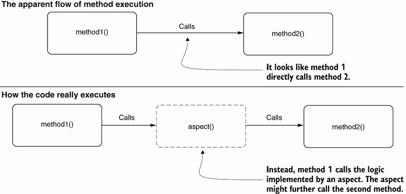

图 2.9 一个方面逻辑完全与代码解耦。因此，在阅读代码时，很难看到还有更多将要执行的逻辑。在调查某个功能时，这种隐藏逻辑执行的情况可能会令人困惑。

让我们通过一个代码示例来检查这种行为以及执行堆栈跟踪在这种情况下是如何有帮助的。你可以在书中提供的项目 da-ch2-ex2 中找到这个示例（附录 B 提供了打开项目和启动应用的重温内容）。该项目是一个小型 Spring 应用，它在控制台打印参数的值。

列表 2.3、2.4 和 2.5 展示了这三个类的实现。正如列表 2.3 所示，`main()`方法调用`ProductController`的`saveProduct()`方法，发送参数值`"Beer"`。

列表 2.3 主类调用`ProductController`的`saveProduct()`方法

```
public class Main {

  public static void main(String[] args) {
    try (var c = 
      new AnnotationConfigApplicationContext(ProjectConfig.class)) {
      c.getBean(ProductController.class).saveProduct("Beer");        ❶
    }
  }
}
```

❶ 我们使用参数值“啤酒”调用 saveProduct()方法。

在列表 2.4 中，你可以看到 `ProductController` 的 `saveProduct()` 方法只是用接收到的参数值调用 `ProductService` 的 `saveProduct()` 方法。

列表 2.4 `ProductController` 调用 `ProductService`

```
@Component
public class ProductController {

  private final ProductService productService;

  public ProductController(ProductService productService) {
    this.productService = productService;
  }

  public void saveProduct(String name) {
    productService.saveProduct(name);      ❶ 
  }
}
```

❶ ProductController 调用服务并发送参数值。

列表 2.5 显示了 `ProductService` 的 `saveProduct()` 方法，它在控制台打印参数值。

列表 2.5 `ProductService` 打印参数值

```
@Component
public class ProductService {

  public void saveProduct(String name) {
    System.out.println("Saving product " + name);    ❶
  }
}
```

❶ 在控制台打印参数值

如图 2.10 所示，流程相当简单：

1.  `main()` 方法调用名为 `ProductController` 的实例的 `saveProduct()` 方法，将值 `"Beer"` 作为参数发送。

1.  然后，`ProductController` 的 `saveProduct()` 方法调用另一个实例 `ProductService` 的 `saveProduct()` 方法。

1.  `ProductService` 实例在控制台打印参数值。


图 2.10 方法 `main()` 调用 `ProductController` 的 `saveProduct()` 方法，将值 `"Beer"` 作为参数值发送。`ProductController` 的 `saveProduct()` 方法调用 `ProductService` 实例，发送与接收到的相同的参数值。`Product-Service` 实例在控制台打印参数值。预期的是在控制台打印 `"Beer"`。

自然地，你会假设当你运行应用程序时，会打印出以下消息：

```
Saving product Beer
```

然而，当你运行项目时，消息是不同的：

```
Saving product Chocolate
```

这怎么可能呢？为了回答这个问题，首先要做的是使用执行堆栈跟踪来找出谁改变了参数值。在打印出不同值的行上设置断点，以调试模式运行应用程序，并观察执行堆栈跟踪（图 2.11）。你发现，不是 `ProductController` 实例的 `ProductService` 的 `saveProduct()` 方法，而是有一个方面改变了执行。如果你查看方面类，你确实会看到方面负责将 `"Beer"` 替换为 `"Chocolate"`（列表 2.6）。

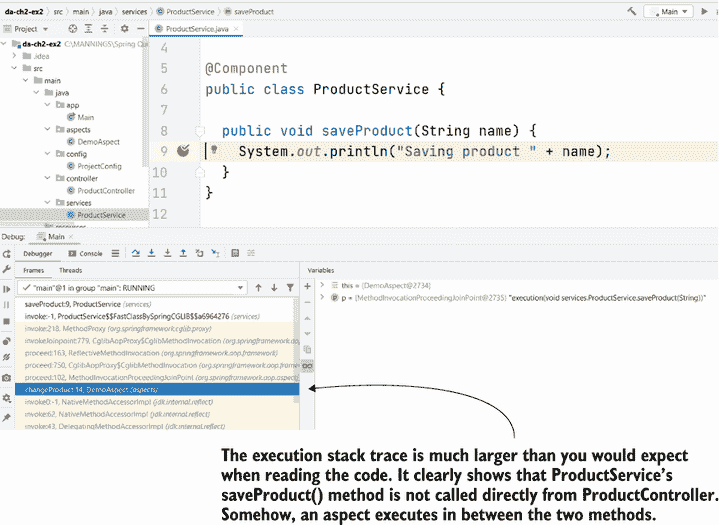

图 2.11 执行堆栈跟踪显示方面已改变执行。这个方面是参数值改变的原因。如果不使用堆栈跟踪，找出应用程序为何与预期行为不同将会更困难。

以下代码显示了通过替换 `ProductController` 发送到 `ProductService` 的值来改变执行的方面。

列表 2.6 改变执行的方面逻辑

```
@Aspect
@Component
public class DemoAspect {

  @Around("execution(* services.ProductService.saveProduct(..))")
  public void changeProduct(ProceedingJoinPoint p) throws Throwable {
    p.proceed(new Object[] {"Chocolate"});
  }
}
```

在当今的 Java 应用程序框架中，方面（Aspects）是一个非常吸引人和有用的特性。但是，如果你没有正确使用它们，它们可能会使应用程序难以理解和维护。当然，在这本书中，我们正在讨论相关的技术，这些技术可以帮助你在这种情况下识别和理解代码。但是，相信我，如果你需要为应用程序使用这项技术，这意味着该应用程序不易维护。一个编写良好的应用程序（没有技术债务）总是比一个需要投入精力进行调试的应用程序更好。如果你对更好地理解 Spring 中方面的工作原理感兴趣，我建议你阅读我写的另一本书的第六章，*Spring Start Here*（Manning，2021）。

### 2.2.2 使用调试器导航代码

在本节中，我们讨论使用调试器导航代码的基本方法。你将学习如何使用三个基本导航操作：

+   *跳过*—继续执行同一方法中的下一行代码。

+   *进入*—继续在当前行调用的方法中执行。

+   *退出*—将执行返回到调用你正在调查的方法的方法。

要开始调查过程，你必须确定你想要调试器暂停执行的第一行代码。为了理解逻辑，你需要导航代码行并观察当不同的指令执行时数据如何变化。

在任何 IDE 的 GUI 上都有按钮和键盘快捷键，可以用来执行导航操作。图 2.12 展示了这些按钮在 IntelliJ IDEA Community GUI 中的外观，这是我使用的 IDE。

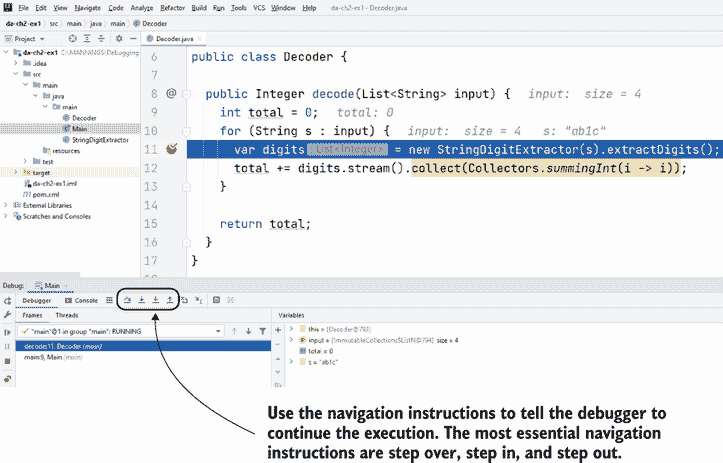

图 2.12 导航操作帮助你以受控的方式“遍历”应用程序逻辑，以确定代码的工作方式。要导航代码，你可以使用 IDE 的 GUI 上的按钮或使用与这些操作关联的键盘快捷键。

TIP 即使在开始时你发现使用 IDE 的 GUI 上的按钮更容易，我仍然建议你使用键盘快捷键。如果你习惯了使用键盘快捷键，你会发现它们比鼠标快得多。


图 2.13 直观地描述了导航操作。你可以使用跳过操作进入同一方法中的下一行。通常，这是最常用的导航操作。

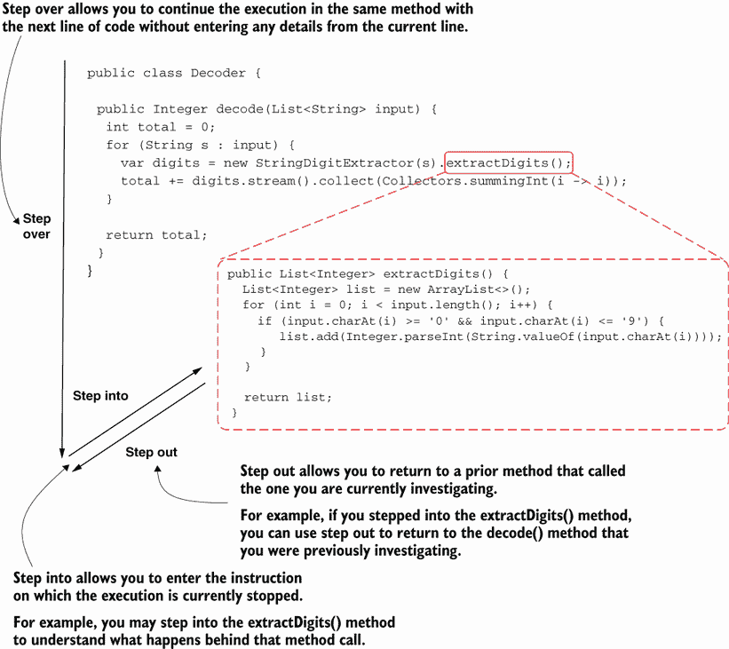

图 2.13 导航操作。跳过操作允许你进入同一方法中的下一条指令。当你想要开始一个新的调查计划并深入了解特定指令时，你可以使用进入操作。你可以使用退出操作返回到上一个调查计划。

有时候你需要更好地理解特定指令发生了什么。在我们的例子中，你可能需要进入`extractDigits()`方法，以便清楚地了解它做什么。在这种情况下，你使用“进入”操作。当你想返回到`decode()`方法时，你可以使用“退出”操作。

你还可以可视化执行堆栈跟踪中的操作，如图 2.14 所示。

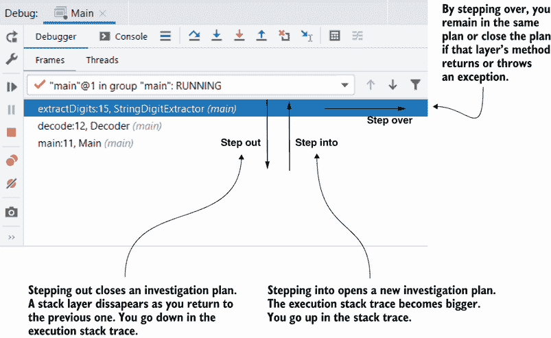

图 2.14 从执行堆栈跟踪的角度看导航操作。当你退出时，你向下进入堆栈跟踪并关闭一个调查计划。当你进入时，你打开一个新的调查计划，因此你在堆栈跟踪中向上移动，它变得更大。当你单步执行时，你保持在同一个调查计划中。如果方法结束（返回或抛出异常），单步执行将关闭调查计划，你就像退出时一样向下进入堆栈跟踪。

理想情况下，当你试图理解一段代码的工作原理时，尽可能多地使用“单步执行”操作。你进入得越多，你打开的调查计划就越多，因此调查过程就越复杂（图 2.15）。在许多情况下，你只需通过单步执行并观察输出，就可以推断出特定代码行的作用。

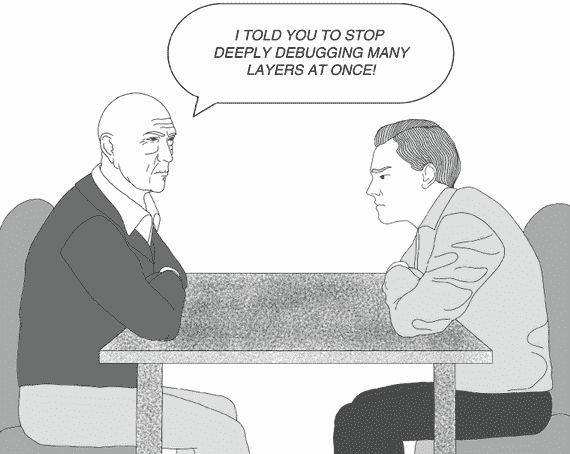

图 2.15 电影《盗梦空间》（2010）描绘了在梦中做梦的想法。你梦得越深，你待在那里的时间就越长。你可以将这个想法与进入一个方法和打开一个新的调查层进行比较。你进入得越深，你花在调查代码上的时间就越多。

图 2.16 展示了使用“单步执行”导航操作的结果。执行在 12 行暂停，比我们最初使用断点暂停调试器的那一行低一行。`digits`变量现在也被初始化了，所以你可以看到它的值。

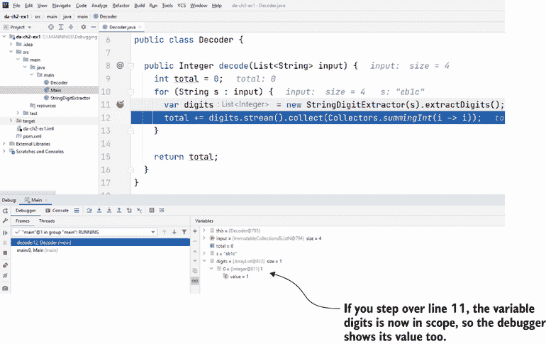

图 2.16 当你单步执行一行时，执行将在同一方法中继续。在我们的例子中，执行在第 12 行暂停，你可以看到由第 11 行初始化的`digits`变量的值。你可以使用这个值来推断第 11 行做了什么，而无需深入了解。

尝试多次继续执行。你会观察到，在第 11 行，对于每个字符串输入，结果是一个包含给定字符串中所有数字的列表。通常，逻辑足够简单，只需分析几次执行的输出就可以理解。但如果你不能仅通过执行就弄清楚一行代码的作用怎么办？

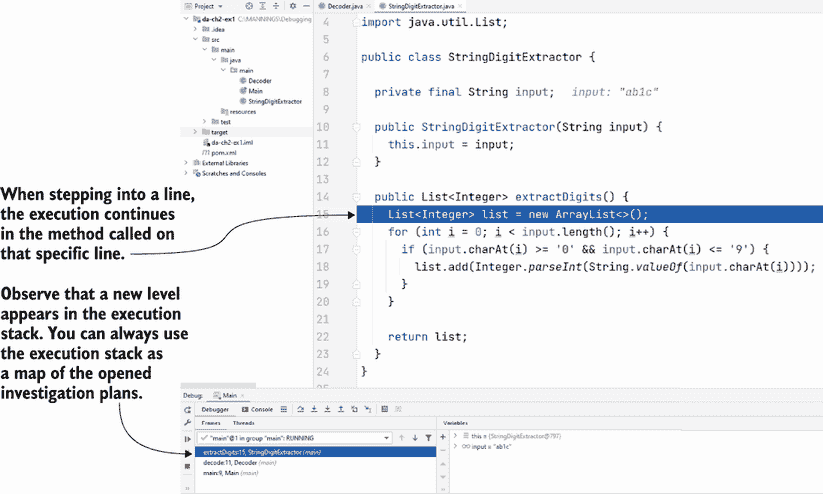

图 2.17 使用“进入”功能可以观察当前指令的整个执行过程。这开启了一个新的调查计划，允许你解析特定指令背后的逻辑。你可以使用执行堆栈跟踪来回溯执行流程。

如果您不理解发生了什么，您需要在该行上更详细地了解情况。这应该是您的最后选择，因为它要求您打开一个新的调查计划，这会使您的过程复杂化。但是，当您没有其他选择时，您可以进入指令以获取代码执行更多细节。图 2.17 显示了进入`Decoder`类第 11 行的结果：

```
var digits = new StringDigitExtractor(s).extractDigits();
```

如果您进入了指令，请先花时间阅读那行代码背后的内容。在许多情况下，查看代码就足以发现发生了什么，然后您可以回到之前进入的地方。我经常观察到学生急于调试他们进入的方法，而没有先深吸一口气阅读那段代码。为什么先阅读代码很重要？因为进入一个方法会打开另一个调查计划，所以，如果您想高效，您必须重新执行调查步骤：

1.  阅读方法并找到您不理解的第一行代码。

1.  在该代码行上设置一个断点，并从那里开始调查。

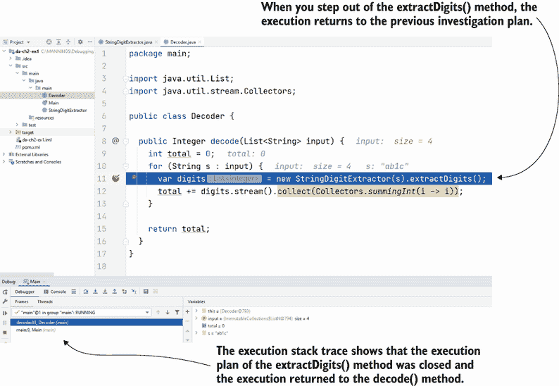

图 2.18 步出操作允许您关闭一个调查计划并返回到执行堆栈跟踪中的上一个计划。使用步出操作可以节省时间，因为您不必逐条指令执行，直到当前执行计划自行关闭。步出操作为您提供了一条返回到之前调查的执行计划的捷径。

通常，如果您停下来阅读代码，您会发现您不需要继续那个调查计划。如果您已经理解了发生了什么，您只需简单地返回到之前的位置。您可以使用步出操作来完成这一点。图 2.18 显示了从`extractDigits()`方法使用步出操作时发生的情况：执行返回到`decode(List <String> input)`方法中的上一个调查计划。

提示：步出操作可以为您节省时间。在进入新的调查计划（通过进入代码行）时，首先阅读新的代码片段。一旦您理解了代码的功能，就退出新的调查计划。


为什么下一执行行不总是下一行？

当与调试器讨论代码导航时，我经常提到“下一执行行”。我想确保我清楚“下一行”和“下一执行行”之间的区别。

下一执行行是应用程序将要执行的代码行。当我们说调试器在第 12 行暂停执行时，*下一行*总是第 13 行，但*下一执行行*可能不同。例如，如果第 12 行没有抛出异常，如以下图所示，下一执行行将是第 13 行，但如果第 12 行抛出异常，下一执行行将是第 18 行。您可以在项目 da-ch2-ex3 中找到这个例子。

当使用单步执行操作时，执行将继续到*下一执行行*。

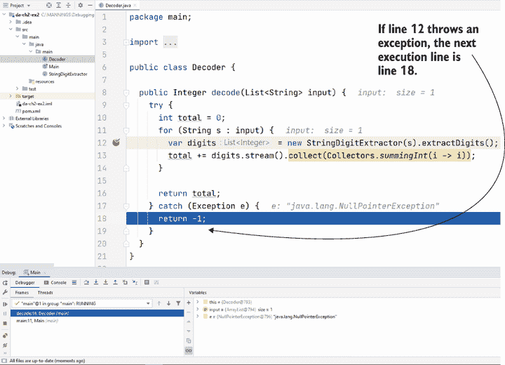

在这个图中，我们从第 12 行开始单步执行，第 12 行抛出异常；执行继续到第 18 行，这是下一执行行。换句话说，下一执行行不总是下一行。

## 2.3 当使用调试器可能不够时

调试器是一个优秀的工具，可以帮助你通过在代码中导航来分析代码，理解它是如何与数据一起工作的。但并非所有代码都可以用调试器来调查。在本节中，我们讨论了一些使用调试器不可行或不充分的场景。你需要意识到这些情况，以免浪费时间使用调试器。

在使用调试器（或仅使用调试器）通常不是正确方法时，以下是一些最常遇到的调查场景：

+   当你不知道代码的哪个部分创建了输出时，调查输出问题

+   调查性能问题

+   调查整个应用失败时的崩溃

+   调查多线程实现

提示：记住，使用调试器的关键先决条件是知道在哪里暂停执行。


在开始调试之前，你需要找到生成错误输出的代码部分。根据应用的不同，可能更容易找到实现逻辑中发生某事的位置。如果应用有一个清晰的类设计，找到负责输出的应用部分相对容易。如果应用缺乏类设计，可能更难发现事情发生的地方，因此也就更难确定在哪里使用调试器。在接下来的章节中，你将学习到其他几种技术。其中一些技术，如分析应用或使用存根，将帮助你确定使用调试器开始调查的位置。

*性能问题*是一组通常无法用调试器调查的问题。慢速应用或完全卡住的应用是常见的性能问题。在大多数情况下，性能分析和对数技术（我们将在第五章到第九章中讨论）将帮助你解决此类场景。对于应用完全阻塞的特定实例，获取和分析线程转储通常是调查的最直接路径。我们将在第十章中讨论分析线程转储。

如果应用遇到了问题并且执行停止（应用崩溃），你无法在代码上使用调试器。调试器允许你在执行过程中观察应用。如果应用不再执行，调试器显然无济于事。根据发生的情况，你可能需要审计日志，正如我们在第五章中将要讨论的，或者调查线程或堆转储，这些将在第十章和第十一章中学习。

大多数开发者发现**多线程实现**是最具挑战性的调查对象。这样的实现很容易受到你使用调试器等工具的干扰。这种干扰会产生海森堡效应（在第一章中讨论）：当你使用调试器时，应用程序的行为与你不干扰它时不同。正如你将学到的，有时你可以将调查隔离到一条线程并使用调试器。但在大多数情况下，你将不得不应用一系列技术，包括调试、模拟和存根以及性能分析，以了解应用程序在最复杂场景中的行为。

## 摘要

+   每次你打开一个新的逻辑块（例如，进入一个定义其自身逻辑的新方法），你就打开了一个新的调查计划。

+   与文本段落不同，阅读代码不是线性的。每条指令可能会创建一个你需要调查的新计划。你探索的逻辑越复杂，你需要打开的计划就越多。你打开的计划越多，过程就越复杂。加快代码调查过程的一个技巧是尽可能少地打开计划。

+   调试器是一个工具，它允许你在特定行暂停应用程序的执行，这样你就可以逐步观察应用程序的执行以及它管理数据的方式。使用调试器可以帮助你减少阅读代码时的认知负荷。

+   你可以使用断点标记你想要调试器暂停应用程序执行的特定代码行，以便你可以评估作用域内所有变量的值。

+   你可以跨过一行，这意味着继续执行同一计划中的下一行，或者进入一行，这意味着深入到调试器暂停执行的指令的细节。你应该尽量减少进入一行的次数，更多地依赖跨过。每次进入一行，调查路径都会变长，过程也会更加耗时。

+   尽管使用鼠标和 IDE 的 GUI 导航代码在最初可能更舒适，但学习使用这些操作的键盘快捷键将帮助你更快地调试。我建议你学习你最喜欢的 IDE 的键盘快捷键，并使用它们而不是用鼠标触发导航。

+   进入一行后，首先阅读代码并尝试理解它。如果你能弄清楚发生了什么，使用退出操作返回到之前的调查计划。如果你不理解发生了什么，确定第一条不清楚的指令，添加一个断点，并从那里开始调试。
