# 3 使用高级调试技术查找问题根本原因

本章涵盖了

+   使用条件断点来调查特定场景

+   使用断点在控制台记录调试消息

+   在调试过程中更改数据以强制应用程序以特定方式执行

+   在调试过程中重新运行代码的某个部分

在第二章中，我们开始讨论使用调试器的最常见方法。当调试某个已实现的逻辑部分时，开发者通常会使用代码导航操作，如跳过、进入和退出一行。了解如何正确使用这些操作有助于您调查代码，以便更好地理解或找到问题。

但调试器是一个比许多开发者所意识到的更强大的工具。开发者们在仅使用基本导航进行代码调试时有时会感到困难，而如果他们使用调试器提供的其他（不太为人所知）方法，则可以节省大量时间。

在本章中，您将了解如何充分利用调试器提供的功能：

+   条件断点

+   断点作为日志事件

+   修改内存中的数据

+   丢弃执行帧

我们将讨论一些超越基本方式的代码导航方法，您将了解如何以及何时使用这些方法。我们将使用代码示例来讨论这些调查方法，以便您了解如何使用它们来节省时间，以及在何时避免使用它们。

## 3.1 使用条件断点最小化调查时间

在本节中，我们将讨论使用*条件断点*来在满足特定条件下暂停应用程序执行的代码行。

定义：条件断点是与条件关联的断点，因此调试器只有在条件满足时才会暂停执行。在调查场景中，当您只对代码部分与给定值如何工作感兴趣时，条件断点非常有用；在适当的情况下使用条件断点可以节省您的时间，并帮助您更容易地理解应用程序的工作方式。


让我们通过一个例子来了解条件断点是如何工作的，以及您可能希望使用它们的典型情况。列表 3.1 展示了一个返回字符串值列表中数字之和的方法。您可能已经从第二章中熟悉了这种方法。我们也将使用这段代码来讨论条件断点。然后，我们将把这个简化示例与您可能在现实世界案例中遇到的类似情况进行比较。这个例子可以在本书提供的项目 da-ch3-ex1 中找到。

列表 3.1 使用条件断点进行调查

```
public class Decoder {

  public Integer decode(List<String> input) {
    try {
      int total = 0;
      for (String s : input) {
        var digits = new StringDigitExtractor(s).extractDigits();
        var sum = digits.stream().collect(Collectors.summingInt(i -> i));
        total += sum;
      }

      return total;
    } catch (Exception e) {
      return -1;
    }
  }
}
```

当调试一段代码时，你通常只对特定值下的逻辑工作方式感兴趣。例如，假设你怀疑实现的逻辑在某个特定情况下（例如，某些变量具有特定值）工作得不好，并且你想证明这一点。或者你只是想了解在特定情况下发生了什么，以便更好地了解整个功能。

假设在这种情况下，你只想调查变量`sum`有时为零的原因。你如何只关注这个特定案例呢？你可以使用单步跳过操作来导航代码，直到你观察到方法返回零。这种方法在像这样的演示示例（足够小）中可能是可接受的。但在现实世界的案例中，你可能需要多次跳过才能达到预期的案例。实际上，在现实世界的场景中，你可能甚至不知道你想要调查的特定情况何时出现。


图 3.1 使用条件断点暂停特定情况的执行。在这个图中，我们只想在`sum`为零的情况下暂停第 14 行的执行。我们可以在断点上应用一个条件，指示调试器只有在给定状态为真时才考虑该断点。这有助于你更快地到达想要调查的场景。

使用条件断点比在代码中导航到想要研究的条件更高效。图 3.1 展示了如何在 IntelliJ IDEA 中应用条件到断点上。右键点击你想要添加条件的断点，并写下该断点所应用的条件。条件需要是一个布尔表达式（它应该是可以评估为真或假的某种东西）。在断点上使用`sum == 0`条件，你告诉调试器只有在变量`sum`为零的情况下才考虑该断点并暂停执行。

当你使用调试器运行应用程序时，执行只有在如图 3.2 所示的循环首次迭代一个不包含数字的字符串时才会暂停。这种情况导致变量`sum`为零，因此断点上的条件被评估为真。


图 3.2 一个条件断点。图中第 14 行被多次执行，但调试器只有在变量`sum`为零时才会暂停执行。这样，我们就跳过了所有我们不感兴趣的案例，从而可以开始关注与我们的调查相关的条件。

条件断点可以节省你的时间，因为你不需要搜索你想要调查的特定情况。相反，你允许应用程序运行，当满足某个条件时，调试器会暂停执行，让你可以从这一点开始调查。尽管使用条件断点很容易，但许多开发者似乎忘记了这种方法，浪费了大量时间调查本可以用条件断点简化的情况。

设置条件断点是调查代码的绝佳方式。然而，它们也有其缺点。条件断点可能会显著影响执行性能，因为调试器必须持续拦截你使用的范围内的变量值，并评估断点条件。

小贴士：使用少量条件断点。最好一次只使用一个条件断点，以避免过多地减慢执行速度。


使用条件断点的另一种方法是记录特定的执行细节，例如各种表达式值和特定条件的堆栈跟踪（图 3.3）。

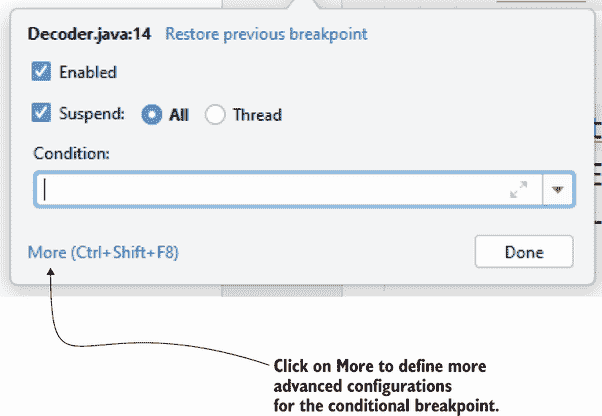

图 3.3 要在 IntelliJ 中对断点进行高级配置，你可以点击更多按钮。

不幸的是，这个功能仅在特定的 IDE 中工作。例如，尽管你可以在 Eclipse 中以与这里描述相同的方式使用条件断点，但 Eclipse 不允许你仅为了记录执行细节而使用断点（图 3.4）。

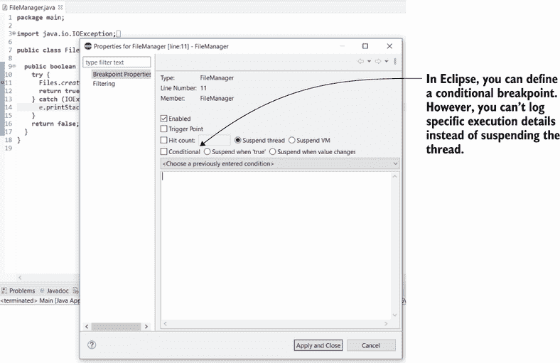

图 3.4 并非所有 IDE 都提供相同的调试工具。所有 IDE 都提供基本操作，但某些功能，如记录执行细节而不是暂停执行，可能不存在。在 Eclipse 中，你可以定义条件断点，但你不能使用日志功能。

你可能会问自己是否应该只为这些示例使用 IntelliJ IDEA。即使本书中的大多数示例都使用 IntelliJ IDEA，这并不意味着这个 IDE 比其他 IDE 更好。我使用过许多与 Java 相关的 IDE，例如 Eclipse、Netbeans 和 JDeveloper。我的建议是，你不应该过于习惯使用一个 IDE。相反，尝试使用各种选项，这样你可以决定哪个更适合你和你所在的团队。

## 3.2 使用不会暂停执行的断点

在本节中，我们讨论使用断点记录你可以稍后用于调查代码的消息。我最喜欢的使用断点的方式是记录可以帮助我了解应用程序执行期间发生了什么的细节，而无需暂停执行。正如你将在第五章中学到的，在某些情况下，记录是一种出色的调查实践。许多开发者在与添加日志指令时挣扎，而他们本可以简单地使用条件断点。

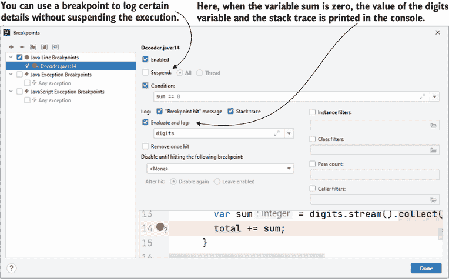

图 3.5 条件断点高级配置。除了指定断点的条件外，你还可以指示调试器不要为给定的断点暂停执行。相反，你可以简单地记录你需要了解情况的数据。

图 3.5 展示了如何配置一个不会暂停执行的条件断点。相反，当达到带有断点的行时，调试器会记录一条消息。在这种情况下，调试器记录了`digits`变量的值和执行堆栈跟踪。

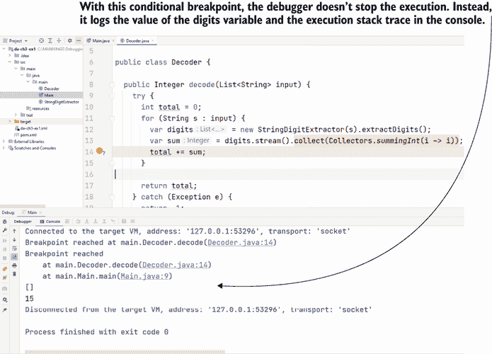

图 3.6 使用不暂停执行的断点。相反，当行被达到时，调试器会记录一条消息。调试器还会记录`digits`变量的值和执行堆栈跟踪。

图 3.6 显示了配置了条件断点后运行应用程序的结果。注意，调试器在控制台中记录了执行堆栈跟踪，`digits`变量的值是一个空列表：`[]`。这类信息可以帮助你解决你在现实场景中调查的代码的难题。

## 3.3 动态改变调查场景

在本节中，你将学习另一种非常有价值的技巧，这将使你的代码调查更容易：在调试过程中更改作用域内变量的值。在某些情况下，这种方法可以节省大量时间。我们将从讨论在实时更改变量值最有效的方法的场景开始。然后我将通过一个示例演示如何使用这种方法。

在本章的早期，我们讨论了条件断点。条件断点允许你告诉调试器在特定条件下暂停执行（例如，当给定变量具有某个值时）。通常，我们调查的是执行时间很短的逻辑，使用条件断点就足够了。对于像通过 REST 端点调用的逻辑（特别是如果你有在环境中重现问题的正确数据）这样的案例，你只需在适当的时候使用条件断点来暂停执行。这是因为你知道通过端点调用的东西不会花费很长时间。但考虑以下场景：

+   你调查了一个执行时间很长的进程的问题。比如说，这是一个计划中的进程，有时需要超过一个小时才能完成其执行。你怀疑某些给定的参数值导致了错误的输出，你想要在决定如何纠正问题之前确认你的怀疑。

+   你有一段执行速度很快的代码，但你无法在你的环境中重现问题。这个问题只出现在你无法访问的、由于安全限制而无法访问的生产环境中。你认为问题出现在某些参数具有特定值时。你想要证明你的理论是正确的。

在场景 1 中，断点（无论是条件断点还是非条件断点）并不那么有帮助。除非你调查的是在过程开始时发生的某些逻辑，否则运行过程并等待执行在带有断点的行上暂停会花费太多时间（图 3.7）。

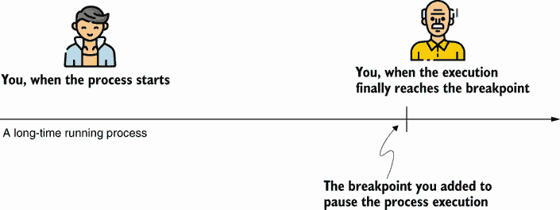

图 3.7 通常情况下，在调查长时间运行过程中的问题时，使用断点并不是一个真正的选择。执行达到你要调查的代码部分可能需要很长时间，如果你不得不多次重新运行该过程，你肯定会花费太多时间在上面。

执行堆栈跟踪：视觉表示与文本表示

注意控制台打印堆栈跟踪的方式。你通常会找到以文本格式而不是视觉格式表示的执行堆栈跟踪。文本表示的优点是它可以存储在任何文本格式输出中，例如控制台或日志文件。

下图显示了调试器提供的执行堆栈跟踪的视觉表示和文本表示之间的比较。在这两种情况下，调试器都提供了可以帮助你理解特定代码行是如何执行的相同基本细节。

在这个特定的情况下，堆栈跟踪告诉我们执行是从`Main`类的`main()`方法开始的。记住，堆栈跟踪的第一层是底部的一层。在第 9 行，`main()`方法调用了`Decoder`类的`decode()`方法（层 2），然后调用了我们标记为断点的行。

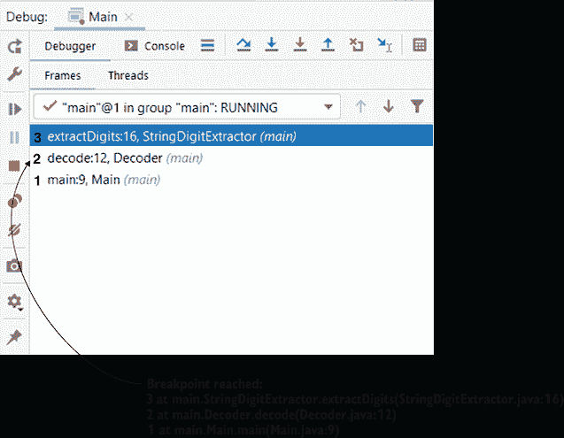

调试器中执行堆栈跟踪的视觉表示与其文本表示的比较。堆栈跟踪显示了方法是如何被调用的，并提供了足够详细的说明，以便你理解执行路径。

对于场景 2，使用断点有时可能是可能的。在第四章中，我们将讨论远程调试，你将了解何时远程调试是一种有用的调查技术。但让我们暂时假设（因为我们还没有讨论过）在这种情况下不能应用远程调试。相反，如果你对导致问题的原因有一个想法，你只需要证明它但没有正确的数据，你可以使用变量值的即时更改。

图 3.8 展示了当调试器暂停执行时如何更改作用域中某个变量的数据。在 IntelliJ IDEA 中，你右键单击想要更改值的变量。你在这个动作中完成，调试器显示作用域中变量的当前值。让我们看看我们之前的例子，da-ch3-ex1。

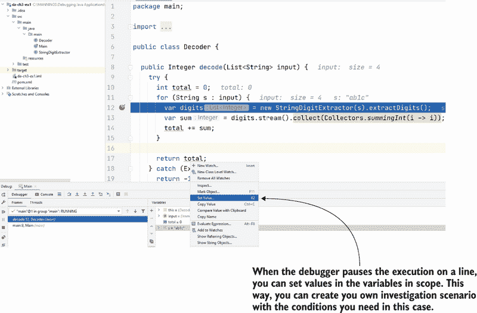

图 3.8 在作用域内设置变量的新值。当调试器在给定行上暂停执行时，它会显示作用域内变量的值。你也可以更改这些值以创建一个新的调查案例。在某些情况下，这种方法可以帮助你验证关于代码行为的怀疑。

一旦你选择了想要更改的变量，按照图 3.9 所示设置值。记住，你必须使用符合变量类型的值。这意味着如果你更改一个`String`变量，你仍然需要使用一个`String`值；你不能使用`long`或`Boolean`值。

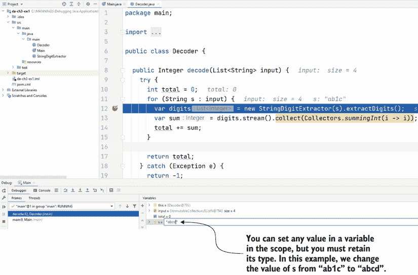

图 3.9 将变量的值更改以观察应用程序在不同条件下的执行行为。

当你继续执行时，如图 3.10 所示，应用程序现在使用新的值。而不是为值`"ab1c"`调用`extractDigits()`，应用程序使用了值`"abcd"`。该方法返回的列表为空，因为字符串`"abcd"`不包含数字。

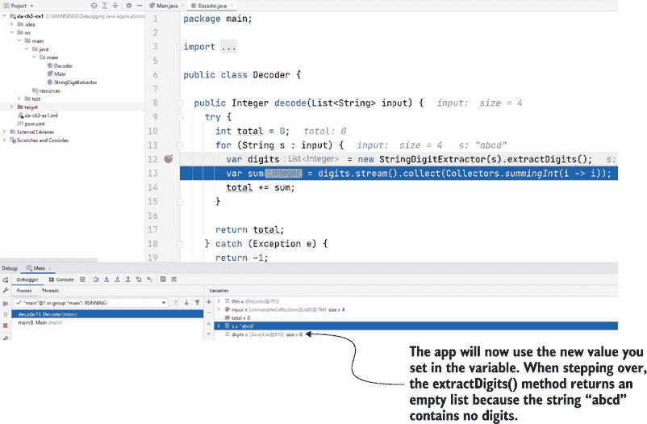

图 3.10 当使用单步执行操作时，应用程序使用你设置的`s`变量的新值。`extractDigits()`返回一个空列表，因为字符串`"abcd"`不包含数字。在变量上动态设置值允许你在没有所需输入数据的情况下测试不同的场景。

让我们比较第 3.1 节中讨论的条件断点方法与动态更改数据。在这两种情况下，你首先需要有一个关于可能引起问题的代码部分的思路。如果你

+   你拥有导致你想要调查的场景的数据。在我们的例子中，我们需要执行提供列表中行为所需的价值。

+   你正在调查的代码执行时间不会太长。例如，假设我们有一个包含许多元素的列表，并且应用程序处理每个元素需要几秒钟。在这种情况下，使用条件断点可能意味着你将不得不投入大量时间来调查你的案例。

如果你可以使用更改变量值的策略

+   你没有导致你想要调查的场景所需的数据。

+   执行代码花费的时间太长了。

我知道你现在在想什么：我们为什么要使用条件断点呢？看起来你可能应该完全避免使用条件断点，因为你可以通过在变量上动态更改值来创建任何你需要的用于调查的环境。

这两种技术都有优点和缺点。如果你只需要更改几个值，改变变量的值可能是一个很好的方法。但是，当你的更改变得更加广泛时，场景的复杂性就变得越来越难以管理。

## 3.4 回滚调查案例

我们不能回到过去。然而，通过调试，有时可以回溯调查。在本节中，我们讨论在调试代码时何时以及如何“回到过去”。我们称这种方法为*丢弃帧*、*丢弃执行帧*或*退出执行帧*。

我们将使用 IntelliJ IDEA 来查看一个示例。我们将比较本章前几节中讨论的方法，然后我们还将确定何时不能使用这种技术。

丢弃执行帧实际上是在执行堆栈跟踪中回退一层。例如，假设你进入了一个方法并想要返回；你可以丢弃执行帧以返回到方法被调用的位置。

许多开发者混淆了丢弃帧和退出，很可能是因为当前的调查计划在这两种情况下都会关闭，并且执行返回到方法被调用的位置。然而，这里有一个很大的区别。当你从方法中退出时，执行会在当前计划中继续，直到方法返回或抛出异常。然后，调试器会在当前方法退出后暂停执行。

图 3.11 展示了如何使用项目 da-ch3-ex1 中的示例来工作。你处于`extractDigits()`方法中，正如你可以从执行堆栈跟踪中看到的那样，它已经被`Decoder`类中的`decode()`方法调用。如果你使用退出操作，执行将继续在调用`extractDigits()`的方法中，直到该方法返回。然后，调试器会在`decode()`方法中暂停执行。换句话说，退出就像是快进这个执行计划来关闭它并返回到上一个计划。


图 3.11 退出操作通过执行方法并在方法调用后立即暂停执行来关闭当前调查计划。这个操作允许你继续执行并返回执行堆栈中的一层。

当你丢弃执行帧时，执行会返回到方法调用之前的前一个计划，这与退出不同。这样，你可以重新播放调用。如果退出操作像是快进，那么丢弃执行帧（图 3.12）就像是倒带。

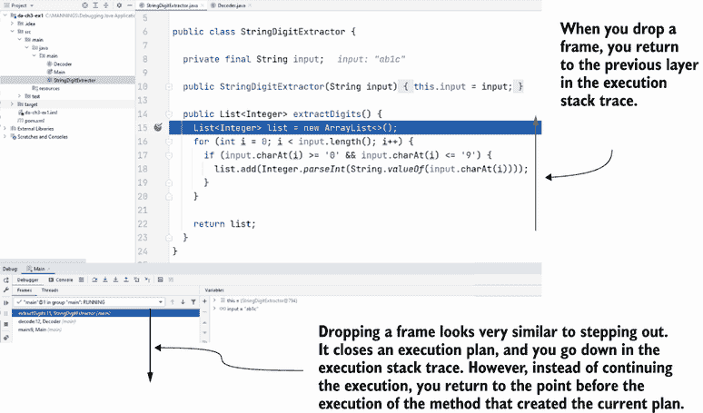

图 3.12 当你丢弃一个帧时，你会返回到方法调用之前执行堆栈跟踪中的上一层。这样，你可以通过再次进入或跳过它来重新播放方法执行。

图 3.13 展示了相对于我们的示例，从`extractDigits()`方法中退出与回退由`extractDigits()`方法创建的帧之间的比较。如果你退出，你会回到`decode()`方法的第 12 行，从那里调用`extractDigits()`，调试器将要执行的下一行是第 13 行。如果你回退帧，调试器会回到`decode()`方法，但将要执行的下一行是第 12 行。基本上，调试器会回到`extractDigits()`方法执行之前的行。

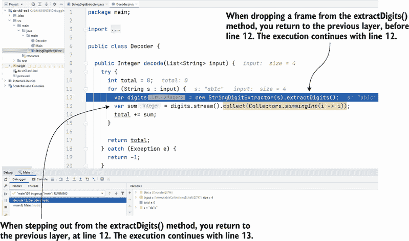

图 3.13 回退帧与退出。当你回退帧时，你会回到方法执行之前的行。当你退出时，你会继续执行，但关闭当前的调查计划（由执行栈中的当前层表示）。

图 3.14 展示了如何在 IntelliJ IDEA 中使用回退帧功能。要回退当前执行帧，请在执行栈跟踪中右键单击方法的层，然后选择“回退帧”。

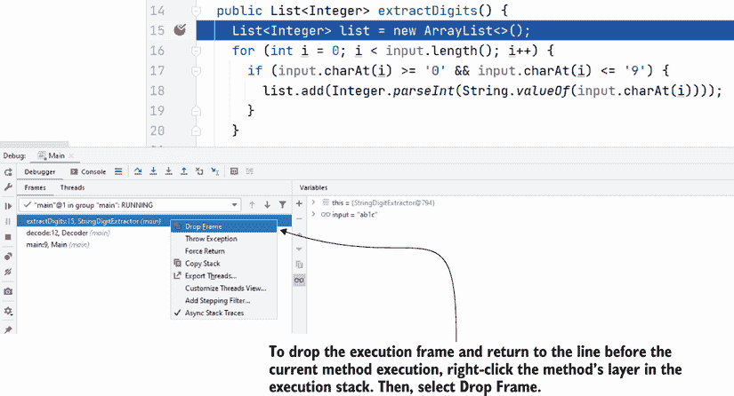

图 3.14 当使用 IntelliJ IDEA 时，你可以通过在执行栈跟踪中右键单击方法的层来回退帧，然后选择“回退帧”。

为什么回退帧（drop frame）是有用的，它是如何帮助节省时间的？无论你是通过端点查找你想要调查的特定案例，还是通过改变变量的值来创建一个，正如第 3.3 节中讨论的，你有时会发现重复执行相同的操作几次是有用的。理解某段代码并不总是那么简单，即使你使用调试器暂停执行并逐步进行，也是如此。但时不时地回顾步骤以及特定的代码指令如何改变数据，可能有助于你理解正在发生的事情。

当你决定通过回退帧重复特定的指令时，也需要注意。这种方法有时可能比有帮助更令人困惑。记住，如果你运行任何改变应用内部内存外值的指令，你不能通过回退帧撤销该更改。这样的例子包括（图 3.15）如下：

+   修改数据库中的数据（插入、更新或删除）

+   改变文件系统（创建、删除或更改文件）

+   调用另一个应用，该应用会改变该应用的数据

+   向由不同应用读取的消息队列中添加消息，该应用会改变该应用的数据

+   发送电子邮件消息

你可以回退导致提交事务并更改数据库中数据的帧，但回到之前的指令不会撤销事务所做的更改。如果应用调用一个端点将内容发布到不同的服务，端点调用产生的更改不能通过回退帧撤销。如果应用发送电子邮件消息，回退帧不能撤回消息，等等（图 3.15）。

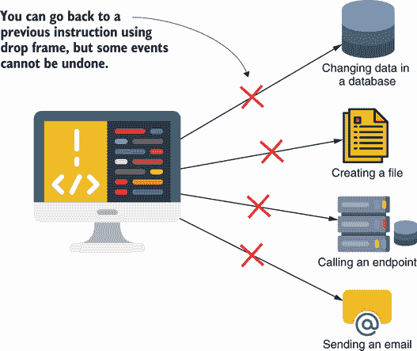

图 3.15 使用丢弃帧操作可能会导致一些无法撤销的事件。例如，更改数据库中的数据，更改文件系统中的数据，调用另一个应用程序，或发送电子邮件消息。

当数据在应用程序外部更改时，你需要小心，因为有时重复相同的代码不会得到相同的结果。以一个简单的代码片段（列表 3.2，你可以在项目 da-ch3-ex2 中找到）为例。如果你在创建文件的行执行后丢弃帧，会发生什么？

```
Files.createFile(Paths.get("File " + i));
```

创建的文件会保留在文件系统中，在你丢弃帧后第二次执行代码后，你会遇到异常（因为文件已经存在）。这是一个调试时回溯时间不有帮助的简单例子。最糟糕的是，在现实世界的案例中，这并不那么明显。我的建议是避免重复执行大量代码，并且在决定使用这种方法之前，确保逻辑部分不会进行外部更改。

如果你注意到再次运行丢弃帧后出现的不寻常的差异，可能是因为代码在外部进行了更改。在大型应用程序中，观察这种行为往往并不简单。例如，你的应用程序可能使用缓存或记录数据，这些数据访问某个库以观察或执行通过拦截器（方面）完全解耦的代码。

调用 `Files.createFile()` 方法会在文件系统中创建一个新文件。如果你在运行此行代码后丢弃帧，你会回到调用 `createFile()` 方法之前的行。然而，这并不会撤销文件创建。

列表 3.2 执行时在应用程序外部进行更改的方法

```
public class FileManager {

  public boolean createFile(int i) {
    try {
      Files.createFile(Paths.get("File " + i));    ❶
      return true;
    } catch (IOException e) {
      e.printStackTrace();
    }
    return false;
  }
}
```

❶ 在文件系统中创建一个新文件。

## 摘要

+   条件断点是与布尔条件关联的断点。只有当提供的条件为真时，即只有当特定条件适用时，调试器才会暂停执行。这样，你可以节省在代码中导航直到到达你想要开始调查的点的时间。

+   你可以使用断点在控制台记录某些变量的值，而不会挂起应用程序的执行。这种方法非常有帮助，因为你可以在不更改代码的情况下添加日志消息。

+   当调试器在特定代码行上暂停执行时，你可以实时更改数据，以根据你想要调查的内容创建自定义场景。这样，你不必等到执行到达条件断点。在某些情况下，当你没有适当的环境时，在调试过程中更改数据可以节省你本来需要准备数据的时间。

+   通过更改变量的值来创建自定义调查场景，在试图理解长时间运行过程的某个逻辑部分或当你没有在运行应用的环境中获取到所需数据时，可以是一种有效的技术。然而，一次更改一个或两个以上的变量值可能会增加相当大的复杂性，使你的调查更具挑战性。

+   你可以跳出调查计划并返回到方法调用之前的位置。这被称为丢弃帧，但有时可能会引入不希望出现的副作用。如果应用在外部进行了任何更改（例如，提交了事务并更改了一些数据库记录，更改了文件系统中的文件，或向另一个应用发出了 RESTful 调用），返回到之前的执行步骤不会撤销这些更改。
