# 5 充分利用日志：审计应用程序的行为

本章节涵盖

+   有效使用日志来理解应用程序的行为

+   正确实现应用程序中的日志功能

+   避免由日志引起的问题

在本章中，我们将讨论使用应用程序记录的日志消息。日志的概念并非随着软件的出现而出现。几个世纪以来，人们使用日志来帮助他们理解过去的事件和过程。自从书写发明以来，人们就开始使用日志，并且我们今天仍在使用它。所有船只都有航海日志。水手记录决策（方向、速度增加或减少等）和下达或接收的命令，以及遇到的任何事件（图 5.1）。如果船上设备出现问题，他们可以使用航海日志的记录来了解自己的位置，并导航到最近的岸边。如果发生事故，航海日志的记录可以在调查中用来确定如何避免不幸事件。


图 5.1 水手将事件存储在日志中，他们可以使用这些日志来确定自己的航线或分析船员对特定事件的反应。同样，应用程序存储日志消息，以便开发者可以在以后分析潜在问题或发现应用程序中的漏洞。

如果你曾经观看过棋局，你就会知道两位棋手都会记录每一步棋的移动。为什么？这些日志帮助他们之后重新创建整个游戏。他们研究自己和对手的走法，以发现潜在的错误或弱点。

出于类似的原因，应用程序也会记录日志消息。我们可以使用这些消息来了解应用程序执行时发生了什么。通过阅读日志消息，你可以像棋手重新创建整个棋局一样重新创建执行过程。当我们调查异常或不受欢迎的行为，或者更难以察觉的问题，如安全漏洞时，我们可以使用日志。

我相信你已经知道日志看起来像什么了。你至少在用 IDE（图 5.2）运行你的应用程序时见过日志消息。所有 IDE 都有一个*日志控制台*。这是所有软件开发者最初学习的内容之一。但是，应用程序不仅仅在 IDE 的控制台中显示日志消息。现实世界的应用程序会将日志存储起来，以便开发者可以调查特定时间点的应用程序行为。

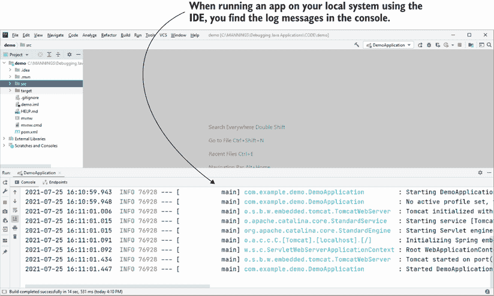

图 5.2 IDE 日志控制台。所有 IDE 都有一个日志控制台。在本地运行应用程序时，在控制台中记录日志消息是有用的，但现实世界的应用程序也会存储日志，这些日志是理解应用程序在特定时间行为所必需的。

图 5.3 展示了标准格式日志消息的结构。日志消息只是一个字符串，所以从理论上讲，它可以是一句任何句子。然而，干净且易于使用的日志需要遵循一些最佳实践（你将在本章中学习到）。例如，除了描述外，日志消息还包含应用程序写入消息的时间戳、严重性的描述以及记录消息的应用程序部分的标记（图 5.3）。

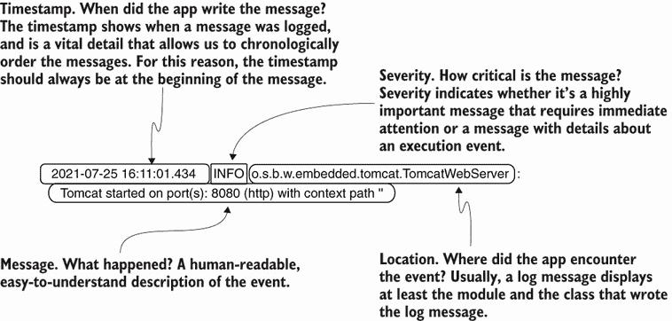

图 5.3 优质日志消息的结构。除了描述一个情况或事件外，日志消息还应包含其他一些相关细节：应用程序记录消息的时间戳、事件的严重性以及消息被写入的位置。使用这些日志中的细节可以让你更容易地调查问题。

在许多情况下，日志是调查应用程序行为的一种有效方式。以下是一些例子：

+   调查已经发生的事件或事件时间线

+   调查那些干扰应用程序会改变应用程序行为的（海森堡）问题

+   理解应用程序长期的行为

+   对需要立即关注的临界事件发出警报

我们在调查特定应用程序功能的行为时通常不会只使用一种技术。根据场景的不同，开发者可能需要结合几种技术来理解特定的行为。在某些情况下，你将使用调试器以及日志和其他技术（你将在接下来的章节中学习）来找出为什么某些事情会以这种方式工作。

在调查问题时，我总是建议开发者在进行其他任何操作之前先检查日志（图 5.4）。日志通常能让你立即识别出异常行为，这有助于你确定调查的起点。日志不一定能回答你所有的问题，但有一个起点极其重要。如果日志消息显示了你应该从哪里开始，那么你已经节省了很多时间！

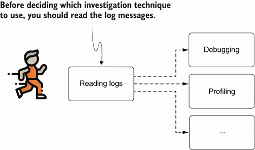

图 5.4 在你调查问题时，你应该做的第一件事就是阅读应用程序的日志。在许多情况下，日志消息为你提供了一个起点，或提供了关于下一步如何解决问题的宝贵提示。

在我看来，日志不仅极其有价值，实际上对于任何应用程序都是不可或缺的。在下一节中，我们将讨论如何使用日志，并了解日志在典型调查场景中的必要性。在 5.2 节中，你将学习如何正确实现应用程序中的日志功能。我们将讨论使用日志级别来帮助你更容易地过滤由日志引起的事件和问题。在 5.3 节中，我们将讨论使用日志和远程调试之间的区别。

我还推荐阅读 Phil Wilkins 所著的《Logging in Action》第四部分（Manning, 2022）。这一章更多地关注使用日志的调查技术，而《Logging in Action》则更深入地探讨了日志的技术细节。你还会发现使用不同于 Java（Python）的语言演示了日志记录。

## 5.1 检查日志中的问题

就像任何其他调查技术一样，在某些情况下使用日志是有意义的，而在其他情况下则不然。在本节中，我们将探讨各种场景，在这些场景中使用日志可以帮助你更轻松地理解软件的行为。我们将首先讨论日志消息的几个关键点，然后分析这些特征如何帮助开发者调查应用问题。

日志消息的一个最大优点是它们允许你可视化特定时间点某段代码的执行。当我们讨论第 2-4 章时，使用调试器时，你的注意力主要在当前。你查看调试器在特定代码行暂停执行时数据的外观。调试器不会给你很多关于执行历史的细节。你可以使用执行堆栈跟踪来识别执行路径，但其他所有内容都集中在当前。

相反，日志关注的是过去一段时间内应用的执行（图 5.5）。日志消息与时间有很强的关联性。

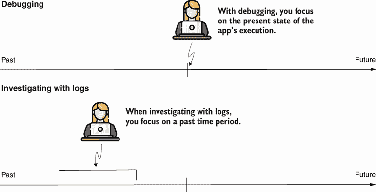

图 5.5 在使用调试器调查问题时，你关注的是当前。当你使用日志消息时，你关注的是过去的一个特定时间段。这种差异可以帮助你决定使用哪种方法。

记得考虑你的应用运行在的系统时区。由于时区不同（例如，应用运行的地方和开发者所在的地方之间），日志时间可能会偏移几个小时，这可能会造成混淆。

注意：始终在日志消息中包含时间戳。你将使用时间戳来轻松识别消息记录的顺序，这将给你一个关于应用何时写入特定消息的线索。我建议时间戳位于消息的第一部分（开头）。


### 5.1.1 使用日志来识别异常

日志可以帮助你在问题发生后识别问题并调查其根本原因。通常，我们使用日志来决定从哪里开始调查。然后我们继续使用其他工具和技术探索问题，例如调试器（如第 2-4 章所述）或分析器（如第 6-9 章所述）。你通常可以在日志中找到异常堆栈跟踪。下面的代码片段显示了 Java 异常堆栈跟踪的一个示例：

```
java.lang.NullPointerException
at java.base/java.util.concurrent.ThreadPoolExecutor
➥ runWorker(ThreadPoolExecutor.java:1128) ~[na:na]
at java.base/java.util.concurrent.ThreadPoolExecutor$Worker
➥ run(ThreadPoolExecutor.java:628) ~[na:na]
at org.apache.tomcat.util.threads.TaskThread$WrappingRunnable
➥ run(TaskThread.java:61) ~[tomcat-embed-core-9.0.26.jar:9.0.26]
at java.base/java.lang.Thread.run(Thread.java:830) ~[na:na]
```

在应用程序的日志中看到这个异常堆栈跟踪或类似的内容，告诉你某个功能可能出现了问题。每个异常都有其自己的含义，有助于你确定应用程序遇到问题的位置。例如，`NullPointerException` 告诉你，某种方式下，一个指令通过一个不包含对象实例引用的变量引用了一个属性或方法（图 5.6）。

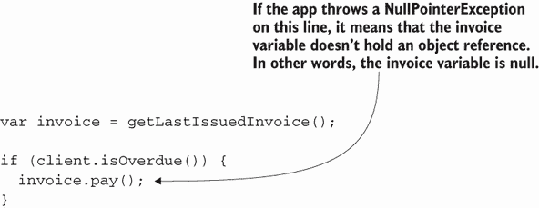

图 5.6 `NullPointerException` 表示应用程序执行遇到了没有行为实例的行为。但这并不意味着产生异常的行也是问题的原因。异常可能是根本原因的结果。你应该始终寻找根本原因，而不是局部处理问题。

注意：记住，异常发生的地方不一定是问题的根本原因的位置。异常告诉你哪里出了问题，但异常本身可能是其他地方问题的结果。它不一定是问题本身。不要急于通过添加 `try-catch-finally` 块或 `if-else` 语句来本地解决异常。首先，确保你在寻找解决问题的解决方案之前理解了问题的根本原因。

我经常发现这个概念会让初学者感到困惑。让我们以一个简单的 `NullPointerException` 为例，这可能是任何 Java 开发者遇到的第一个异常，也是最容易理解的。然而，当你发现日志中的 `NullPointerException` 时，你首先需要问自己：为什么那个引用缺失？它可能是因为应用程序之前执行的一个特定指令没有按预期工作（图 5.7）。


图 5.7 在许多情况下，局部解决问题等同于把问题扫到地毯下。如果根本原因仍然存在，以后可能会出现更多问题。记住，日志中的异常并不一定表示根本原因。

### 5.1.2 使用异常堆栈跟踪来识别调用方法

开发者认为的一种不寻常的技术，但我在实践中发现它很有优势，就是记录异常堆栈跟踪以识别调用特定方法的代码。自从我开始作为软件开发者职业生涯以来，我就一直在处理（通常是）大型应用的混乱代码库。我经常遇到的一个困难是在远程环境中运行应用程序时，确定谁调用了给定的方法。如果你只是阅读应用程序的代码，你会发现数百种调用该方法的方式。

当然，如果你足够幸运，并且有权访问，你可以使用第四章中讨论的远程调试。然后你可以访问调试器提供的执行堆栈跟踪。但如果你无法远程使用调试器怎么办？在这种情况下，你可以使用日志技术代替！

Java 中的异常具有常被忽视的能力：它们记录执行堆栈跟踪。在讨论异常时，我们经常将执行堆栈跟踪称为 *异常* 堆栈跟踪。但最终，它们是同一件事。异常堆栈跟踪显示了导致特定异常的方法调用链，即使没有抛出该异常，你也能访问到这些信息。在代码中，使用异常就足够了：

```
new Exception().printStackTrace();
```

考虑列表 5.1 中的方法。如果你没有调试器，你可以简单地像我在这个示例中做的那样，在查找执行堆栈跟踪的方法中打印异常堆栈跟踪，作为第一行。记住，这只会打印堆栈跟踪，并不会抛出异常，所以它不会干扰执行的逻辑。这个示例在项目 da-ch5-ex1 中。

列表 5.1 使用异常打印执行堆栈跟踪

```
public List<Integer> extractDigits() {
  new Exception().printStackTrace();       ❶
  List<Integer> list = new ArrayList<>();
  for (int i = 0; i < input.length(); i++) {
    if (input.charAt(i) >= '0' && input.charAt(i) <= '9') {
      list.add(Integer.parseInt(String.valueOf(input.charAt(i))));
    }
  }

  return list;
}
```

❶ 打印异常堆栈跟踪

下一个片段展示了应用如何在控制台中打印异常堆栈跟踪。在现实场景中，堆栈跟踪帮助你立即识别执行流程，这导致你想要调查的调用，正如我们在第二章和第三章中讨论的那样。在这个示例中，你可以从日志中看到，`extractDigits()` 方法是在 `decode()` 方法内部从 `Decoder` 类的第 11 行被调用的：

```
java.lang.Exception at main.StringDigitExtractor
➥ extractDigits(StringDigitExtractor.java:15)
    at main.Decoder.decode(Decoder.java:11)
    at main.Main.main(Main.java:9)
```

### 5.1.3 测量执行给定指令花费的时间

日志消息是衡量给定指令集执行时间的一种简单方法。你总是可以记录给定行代码前后的时间戳之间的差异。假设你正在调查一个性能问题，其中某些给定功能执行时间过长。你怀疑原因是应用执行以从数据库检索数据的查询。对于某些参数值，查询很慢，这降低了应用的总体性能。

要找出哪个参数导致了问题，你可以在日志中编写查询和查询执行时间。一旦你确定了麻烦的参数值，你就可以开始寻找解决方案。也许你需要向数据库中的表添加一个额外的索引，或者也许你可以重写查询以使其更快。

列表 5.2 展示了如何记录特定代码片段的执行时间。例如，让我们找出应用运行从数据库中查找所有产品操作所需的时间。是的，我知道，这里没有参数；我简化了示例，以便你能够专注于讨论的语法。但在现实世界的应用中，你可能会调查更复杂的操作。

列表 5.2 记录特定代码行的执行时间

```
public TotalCostResponse getTotalCosts() {
  TotalCostResponse response = new TotalCostResponse();

  long timeBefore = System.currentTimeMillis();       ❶
  var products = productRepository.findAll();         ❷
  long spentTimeInMillis =                            ❸
    System.currentTimeMillis() – timeBefore;

  log.info(“Execution time: ” + spentTimeInMillis);   ❹

  var costs = products.stream().collect(
       Collectors.toMap(
              Product::getName,
              p -> p.getPrice()
                .multiply(new BigDecimal(p.getQuantity()))));

  response.setTotalCosts(costs);

  return response;
}
```

❶ 记录方法执行前的时间戳

❷ 执行我们想要计算执行时间的那个方法

❸ 计算执行后的时间戳与执行前的时间戳之间的时间差

❹ 打印执行时间

准确测量应用程序执行给定指令花费的时间是一种简单但有效的技术。然而，我只会暂时使用这种技术在调查问题时使用。我不建议您长时间保留此类日志在代码中，因为它们很可能以后不再需要，并且会使代码更难以阅读。一旦您解决了问题，不再需要知道该行代码的执行时间，您就可以删除日志。

### 5.1.4 调查多线程架构中的问题

多线程架构是一种使用多个线程来定义其功能的能力类型，并且通常对外部干扰很敏感（图 5.8）。例如，如果您使用调试器或分析器（干扰应用程序执行的工具），应用程序的行为可能会改变（图 5.9）。

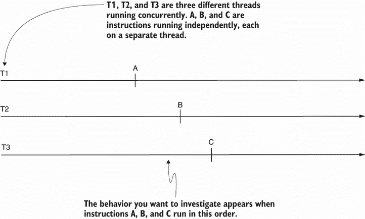

图 5.8 多线程架构。具有使用多个线程并发处理数据的能力的应用程序是多线程应用程序。除非显式同步，否则在独立线程（A、B 和 C）上运行的指令可以以任何顺序执行。

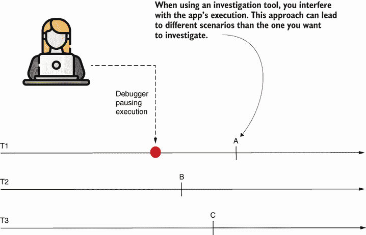

图 5.9 使用调试器或分析器等工具会干扰执行，使某些（或所有）线程变慢。因此，执行通常会改变，某些指令可能以与您想要调查的场景不同的顺序执行。在这种情况下，该工具就不再有用，因为您无法研究您感兴趣的行为。

然而，如果您使用日志，应用程序在运行时受到影响的可能性较小。日志有时也会在多线程应用程序中干扰，但它们对执行的影响不足以改变应用程序的流程。因此，它们可以成为检索您调查所需数据的解决方案。

由于日志消息包含时间戳（如本章前面所述），您可以按顺序排列日志消息，以找到操作执行的顺序。在 Java 应用程序中，有时记录执行特定指令的线程名称是有帮助的。您可以使用以下指令获取当前执行线程的名称：

```
String threadName = Thread.currentThread().getName();
```

在 Java 应用程序中，所有线程都有一个名称。开发者可以命名它们，或者 JVM 将使用具有模式 Thread-x 的名称来识别线程，其中 x 是一个递增的数字。例如，第一个创建的线程将被命名为 Thread-0；下一个，Thread-1；依此类推。正如我们在第十章中讨论线程转储时将讨论的，命名应用程序的线程是一种良好的实践，这样在调查案例时可以更容易地识别它们。

## 5.2 实现日志记录

在本节中，我们讨论了在应用程序中实现日志记录功能的最佳实践。为了使应用程序的日志消息准备好调查，并避免对应用程序的执行造成麻烦，您需要关注一些实现细节。

我们将在 5.2.1 节中首先讨论应用程序如何持久化日志，具体讨论这些实践的优势和劣势。在 5.2.2 节中，你将学习如何通过根据严重性对日志消息进行分类来更有效地使用日志消息，从而提高应用程序的性能。在 5.2.3 节中，我们将讨论日志消息可能引起的问题以及如何避免这些问题。

### 5.2.1 持久化日志

持久性是日志消息的一个基本特征。正如本章前面所讨论的，日志记录与其他调查技术不同，因为它更多地关注过去而不是现在。我们读取日志是为了理解已经发生的事情，因此应用程序需要存储它们，以便我们可以在以后阅读。日志消息的存储方式可以影响日志的可用性和应用程序的性能。我已与许多应用程序合作，并有幸看到开发人员实现日志消息持久化的各种方法：

+   将日志存储在非关系型数据库中

+   将日志存储在文件中

+   将日志存储在关系型数据库中

根据应用程序的功能，这些都可以是好的选择。让我们看看你需要考虑的一些主要事项，以便做出正确的决定。

将日志存储在非关系型数据库中

非关系型（NoSQL）数据库帮助你权衡性能和一致性。你可以使用 NoSQL 数据库以更高效的方式存储日志，这给数据库一个机会错过日志消息或不在应用程序写入它们的精确时间顺序中存储它们。但是，正如本章前面所讨论的，日志消息应该始终包含消息存储时的时间戳，最好放在消息的开头。

在 NoSQL 数据库中存储日志消息是常见的。在大多数情况下，应用程序使用一个完整的引擎来存储日志，并具有检索、搜索和分析日志消息的能力。今天使用最广泛的两个引擎是 ELK 堆栈([`www.elastic.co/what-is/elk-stack`](https://www.elastic.co/what-is/elk-stack))和 Splunk([`www.splunk.com/`](https://www.splunk.com/))。

将日志存储在文件中

在过去，应用程序将日志存储在文件中。你可能会发现一些较老的应用程序直接在文件中写入日志消息，但这种方法现在不太常见，因为它通常较慢，并且搜索已记录的数据更困难。我提醒你这一点，因为你会发现在许多教程和示例中，应用程序将它们的日志存储在文件中，但在更现代的应用程序中，你应该避免这样做。

将日志存储在关系型数据库中

我们很少使用关系型数据库来存储日志消息。关系型数据库主要保证数据一致性，这确保日志消息不会丢失。一旦存储，你就可以检索它们。但一致性会带来性能上的妥协。

在大多数应用程序中，丢失一条日志消息并不是什么大问题，并且性能通常比一致性更重要。但是，正如往常一样，在现实世界应用程序中，总有一些例外。例如，全球各国政府为金融应用程序施加日志消息规定，特别是对于支付功能。这样的功能通常应该有特定的日志消息，应用程序不允许丢失。未能遵守这些规定可能导致处罚和罚款。

### 5.2.2 定义日志级别和使用日志框架

在本节中，我们讨论日志级别以及在应用程序中使用日志框架正确实现日志记录。我们将首先探讨为什么日志级别是必要的，然后实现一个示例。

日志级别，也称为*严重性*，是一种根据它们对你调查的重要性来分类日志消息的方法。应用程序在运行时通常会生成大量的日志消息。然而，你通常不需要所有日志消息中的所有细节。其中一些消息对你的调查比其他消息更重要：一些代表需要始终关注的关键事件。

最常见的日志级别（严重性）如下：

+   *错误*—一个关键问题。应用程序应该始终记录此类事件。通常，Java 应用程序中的未处理异常被记录为错误。

+   *警告*—一个可能出错的事件，但应用程序能够处理它。例如，如果一个第三方系统的连接最初失败，但应用程序在第二次尝试中成功发送了呼叫，那么这个问题应该被记录为警告。

+   *信息*—“常见”的日志消息。这些消息代表了应用程序的主要执行事件，有助于你理解在大多数情况下应用程序的行为。

+   *调试*—细粒度的详细信息，你只有在信息消息不足以满足需求时才应该启用。

注意，不同的库可能使用多于或不同的名称来表示这四个严重性级别。例如，在某些情况下，应用程序或框架可能使用严重性级别“致命”（比错误更严重）和“跟踪”（比调试更不严重）。在本章中，我仅关注在现实世界应用程序中最常遇到的严重性和术语。


根据严重性对日志消息进行分类，可以让你最小化应用程序存储的日志消息数量。你应该只允许应用程序记录最相关的细节，并在需要更多细节时才启用更多日志。

看图 5.10，它展示了日志严重性金字塔：

+   应用程序记录少量关键问题，但这些问题非常重要，因此它们始终需要被记录。

+   你越接近金字塔的底部，应用程序写入的日志消息就越多，但它们在调查中变得不那么关键，也不那么频繁地需要。

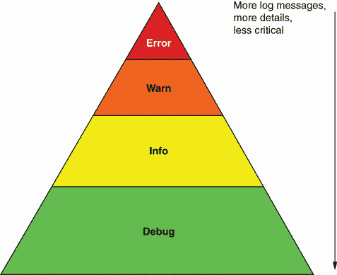

图 5.10 日志严重性金字塔。顶部是通常需要立即关注的临界日志消息。底部代表您很少需要的详细日志消息。从上到下，日志消息变得不那么重要，但数量更多。通常，调试级别的消息默认禁用，开发者可以选择在需要关于应用程序执行细粒度详细信息的研究时启用它们。

对于大多数调查案例，您不需要将消息分类为调试。此外，由于数量庞大，它们使您的调查更具挑战性。因此，调试消息通常被禁用，并且您应该仅在遇到需要更多详细信息的特定问题时启用它们。

当您开始学习 Java 时，您被教导如何使用 `System.out` 或 `System.err` 在控制台打印某些内容。最终，您学习了如何使用 `printStackTrace()` 记录异常消息，正如我在 5.1.2 节中所做的那样。但是，这些在 Java 应用程序中处理日志的方式并不提供足够的配置灵活性。因此，在现实世界的应用程序中，我建议您使用日志框架。

实现日志级别很简单。今天，Java 生态系统提供了各种日志框架选项，如 Logback、Log4j 和 Java 日志 API。这些框架相似，使用它们很简单。

让我们通过一个例子来实现使用 Log4j 的日志记录。此示例位于项目 da-ch5-ex2\. 要使用 Log4j 实现日志记录功能，您首先需要添加 Log4j 依赖项。在我们的 Maven 项目中，您必须更改 pom.xml 并添加 Log4j 依赖项。

列表 5.3 在 pom.xml 文件中需要添加的依赖项以使用 Log4j

```
<dependencies>
   <dependency>
      <groupId>org.apache.logging.log4j</groupId>
      <artifactId>log4j-api</artifactId>
      <version>2.14.1</version>
    </dependency>
    <dependency>
      <groupId>org.apache.logging.log4j</groupId>
      <artifactId>log4j-core</artifactId>
      <version>2.14.1</version>
    </dependency>
  </dependencies>
```

一旦在项目中添加了依赖项，您就可以在任何想要写入日志消息的类中声明一个 `Logger` 实例。使用 Log4j，创建 `Logger` 实例的最简单方法是使用 `LogManager.getLogger()` 方法，如列表 5.4 所示。此方法允许您写入与表示的事件严重性名称相同的日志消息。例如，如果您想以信息严重性级别记录一条消息，您将使用 `info()` 方法。如果您想以调试严重性级别记录一条消息，您将使用 `debug()` 方法，依此类推。

列表 5.4 使用不同严重性写入日志消息

```
public class StringDigitExtractor {

  private static Logger log = LogManager.getLogger();          ❶

  private final String input;

  public StringDigitExtractor(String input) {
    this.input = input;
  }

  public List<Integer> extractDigits() {
    log.info("Extracting digits for input {}", input);        ❷
    List<Integer> list = new ArrayList<>();
    for (int i = 0; i < input.length(); i++) {
      log.debug("Parsing character {} of input {}",           ❸
          input.charAt(i), input);
      if (input.charAt(i) >= '0' && input.charAt(i) <= '9') {
        list.add(Integer.parseInt(String.valueOf(input.charAt(i))));
      }
    }

    log.info("Extract digits result for input {} is {}", input, list);
    return list;
  }
}
```

❶ 为当前类声明一个用于写入日志消息的日志记录器实例

❷ 使用信息严重性写入消息

❸ 使用调试严重性写入消息

一旦您决定要记录哪些消息并使用 `Logger` 实例写入它们，您需要配置 Log4j 以告诉应用程序如何以及在哪里写入这些消息。我们将使用一个名为 log4j2.xml 的 XML 文件来配置 Log4j。此 XML 文件必须位于应用程序的类路径中，因此我们将将其添加到我们的 Maven 项目的资源文件夹中。我们需要定义三件事（见图 5.11）：

+   *logger*——告诉 Log4j 哪些消息应该写入哪个 appender

+   *appender*——告诉 Log4j 将日志消息写入何处

+   *formatter*——告诉 Log4j 如何打印消息

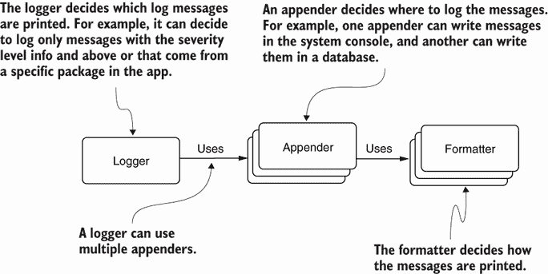

图 5.11 展示了 appender、logger 和 formatter 之间的关系。logger 使用一个或多个 appender。logger 决定要写入什么内容（例如，仅写入包中对象的日志消息）。logger 将要写入的消息交给一个或多个 appender。每个 appender 然后以某种方式存储这些消息。appender 使用 formatter 在存储之前对消息进行格式化。

logger 定义了要记录哪些消息。在这个例子中，我们使用 `Root` 来从应用的任何部分写入消息。其属性 level，值为 `info`，意味着只有严重性为 info 及以上的消息会被记录。logger 也可以决定只记录来自特定应用部分的消息。例如，当使用框架时，你很少对框架打印的日志消息感兴趣，但你通常对应用的日志消息感兴趣，因此你可以定义一个排除框架日志消息并只打印来自应用的日志消息的 logger。记住，你只想写入必要的日志消息。否则，调查可能会变得不必要地更具挑战性，因为你必须过滤掉非必要的日志消息。

在实际应用中，你可以定义多个 appender，它们很可能会被配置为将消息存储在不同的来源，如数据库或文件系统中的文件。在第 5.2.1 节中，我们讨论了应用保留日志消息的多种方式。appender 只是负责以特定方式存储日志消息的实现。

appender 也使用一个 formatter，该 formatter 定义了消息的格式。在这个例子中，formatter 指定消息应包括时间戳和严重性级别，因此应用只需要发送描述。

列表 5.5 展示了定义了 appender 和 logger 的配置。在这个例子中，我们定义了一个 appender，它告诉 Log4j 将消息记录在系统的标准输出流（控制台）中。

列表 5.5 展示了在 log4j2.xml 文件中配置 appender 和 logger 的配置

```
<?xml version="1.0" encoding="UTF-8"?>
<Configuration status="WARN">
    <Appenders>                                     ❶
      <Console name="Console" target="SYSTEM_OUT">
            <PatternLayout pattern="%d{yy-MM-dd HH:mm:ss.SSS} [%t] 
              %-5level %logger{36} - %msg%n"/>
      </Console>
    </Appenders>
    <Loggers>                                       ❷
      <Root level="info">
        <AppenderRef ref="Console"/>
      </Root>
    </Loggers>
</Configuration>
```

❶ 定义 appender

❷ 定义 logger 配置

图 5.12 可视化地展示了列表 5.5 中的 XML 配置与它定义的三个组件之间的联系：logger、appender 和 formatter。

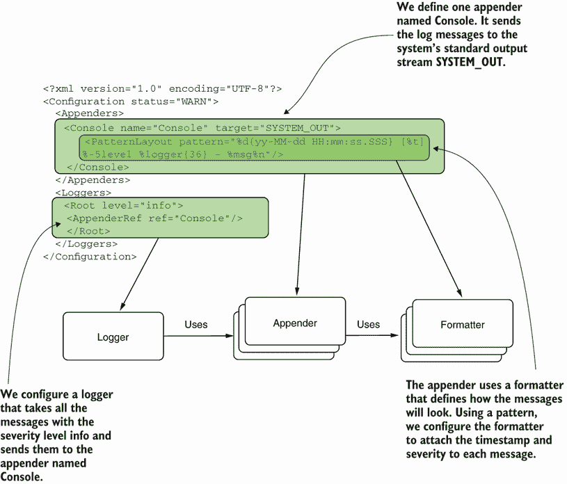

图 5.12 配置中的组件。logger `Root` 接收应用写入的所有严重性级别为 info 的日志消息。logger 将消息发送到名为 `Console` 的 appender。appender `Console` 被配置为将消息发送到系统终端。它使用 formatter 在写入之前将时间戳和严重性级别附加到消息上。

下面的代码片段显示了示例运行时打印的日志部分。请注意，调试消息没有被记录，因为它们的严重性低于信息（列表 5.5 中的第 10 行）。

```
21-07-28 13:17:39.915 [main] INFO  
➥ main.StringDigitExtractor 
➥ Extracting digits for input ab1c
21-07-28 13:17:39.932 [main] INFO  
➥ main.StringDigitExtractor 
➥ Extract digits result for input ab1c is [1]
21-07-28 13:17:39.943 [main] INFO  
➥ main.StringDigitExtractor 
➥ Extracting digits for input a112c
21-07-28 13:17:39.944 [main] INFO  
➥ main.StringDigitExtractor
➥ Extract digits result for input a112c is [1, 1, 2]
...
```

如果我们想让应用程序也记录调试严重性的消息，我们就必须更改日志定义。

列表 5.6 使用不同的严重性配置

```
<?xml version="1.0" encoding="UTF-8"?>
<Configuration status="WARN">                   ❶
  <Appenders>    
        <Console name="Console" target="SYSTEM_OUT">
            <PatternLayout pattern="%d{yy-MM-dd HH:mm:ss.SSS} [%t] 
              %-5level %logger{36} - %msg%n"/>
        </Console>
    </Appenders>

    <Loggers>
       <Root level="debug">                     ❷
         <AppenderRef ref="Console"/>
       </Root>
  </Loggers>
</Configuration>
```

❶ 设置内部 Log4j 事件的日志级别

❷ 将日志级别更改为调试

在列表 5.6 中，您可以看到一个状态和一个日志级别。这通常会引起混淆。大多数时候，您关心的是 `level` 属性，它显示根据严重性哪些消息将被记录。在 `<Configuration>` 标签中的 `status` 属性是 Log4J 事件的严重性，库遇到的问题。也就是说，`status` 属性是日志库的日志配置。

我们可以将列表 5.6 中的日志记录器更改为也记录具有优先级的消息：

```
21-07-28 13:18:36.164 [main ] INFO  
➥ main.StringDigitExtractor 
➥ Extracting digits for input ab1c
21-07-28 13:18:36.175 [main] DEBUG 
➥ main.StringDigitExtractor 
➥ Parsing character a of input ab1c
21-07-28 13:18:36.176 [main] DEBUG 
➥ main.StringDigitExtractor 
➥ Parsing character b of input ab1c
21-07-28 13:18:36.176 [main] DEBUG 
➥ main.StringDigitExtractor 
➥ Parsing character 1 of input ab1c
21-07-28 13:18:36.176 [main] DEBUG 
➥ main.StringDigitExtractor 
➥ Parsing character c of input ab1c
21-07-28 13:18:36.177 [main] INFO  
➥ main.StringDigitExtractor 
➥ Extract digits result for input ab1c is [1]
21-07-28 13:18:36.181 [main] INFO  
➥ main.StringDigitExtractor 
➥ Extracting digits for input a112c
...
```

日志库为您提供了灵活性，让您只记录所需的内容。编写最少数量的日志消息以调查特定问题是一种良好的实践，因为它可以帮助您更容易地理解日志，并保持应用程序的性能良好和易于维护。日志库还使您能够在不重新编译应用程序的情况下配置日志。

### 5.2.3 日志引起的问题及其避免方法

我们存储日志消息，以便我们可以使用它们来了解应用程序在某个时间点或一段时间内的行为。在许多情况下，日志是必要的并且非常有帮助，但如果不妥善处理，它们也可能变得有害。在本节中，我们将讨论日志可能引起的主要问题以及如何避免这些问题（图 5.13）：

+   *安全和隐私问题*—由暴露私人数据的日志消息引起

+   *性能问题*—由应用程序存储过多或过大的日志消息引起

+   *可维护性问题*—由使源代码更难阅读的日志指令引起


图 5.13 小细节可能导致大问题。开发者有时会认为应用程序的日志功能默认无害，并忽视日志可能引入的问题。然而，日志，就像所有其他软件功能一样，处理数据，如果实现不当，可能会影响应用程序的功能和可维护性。

安全和隐私问题

安全性是我最喜欢的主题之一，也是开发者在实现应用程序时需要考虑的最重要主题之一。我写的一本书就是关于安全的，如果你使用 Spring 框架实现应用程序并想了解更多关于如何保护它们的信息，我建议你阅读它：*Spring Security in Action*（Manning，2020）。

意想不到的是，日志有时会导致应用程序出现漏洞，在大多数情况下，这些问题发生是因为开发者没有注意到他们暴露的细节。请记住，日志使特定细节对任何可以访问它们的人可见。你始终需要考虑你记录的数据是否应该对可以访问日志的人可见（图 5.14）。

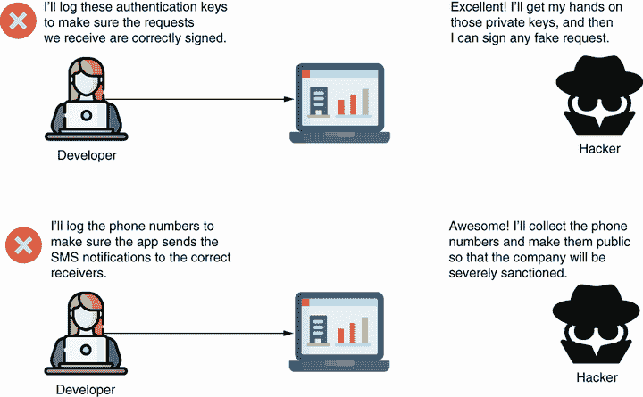

图 5.14 日志消息不应包含秘密或私人细节。任何在应用程序或应用程序部署的基础设施上工作的人都不应访问此类数据。在日志中暴露敏感细节可以帮助恶意人员（黑客）找到更容易的方法来破坏系统或创建与安全相关的问题。

以下代码片段展示了某些日志消息的示例，这些消息暴露了敏感细节并导致漏洞：

```
Successful login. 
User bob logged in with password RwjBaWIs66

Failed authentication. 
The token is unsigned. 
The token should have a signature with IVL4KiKMfz.

A new notification was sent to 
➥ the following phone number +1233...
```

这里展示的日志有什么问题？前两个日志消息暴露了私人细节。你不应该记录用于签名令牌的密码或私人密钥，或任何其他交换的信息。密码是只有其所有者应该知道的东西。因此，没有任何应用程序应该以明文形式存储任何密码（无论是在日志中还是在数据库中）。私人密钥和类似的秘密细节应该存储在秘密库中，以防止被盗。如果有人获得了此类密钥的值，他们可以冒充应用程序或用户。

第三个日志消息示例暴露了一个电话号码。电话号码被视为个人细节，并且在全球范围内，特定的法规限制了此类细节的使用。例如，欧盟在 2018 年 5 月实施了通用数据保护条例（GDPR）。任何欧盟国家的应用程序都必须遵守这些规定，以避免严重的处罚。这些规定允许任何用户请求应用程序使用的所有个人数据，并要求立即删除这些数据。在日志中存储如电话号码之类的信息会暴露这些私人细节，并使检索和删除它们变得更加困难。

性能问题

编写日志意味着将细节（通常作为字符串）发送到应用程序外部的 I/O 流中。我们可以简单地将此信息发送到应用程序的控制台（终端），或者我们可以将其存储在文件中，甚至是一个数据库，正如我们在 5.2.1 节中讨论的那样。无论如何，你需要记住，记录消息也是一个耗时指令；添加过多的日志消息会显著降低应用程序的性能。

我记得几年前我的团队调查了一个问题。亚洲的一个客户报告了我们为工厂库存目的实施的应用程序的问题。这个问题并没有造成太多麻烦，但我们发现很难找到根本原因，所以我们决定添加更多的日志信息。在交付包含微小更改的补丁后，系统变得非常慢，有时几乎无法响应，这最终导致了生产停滞，我们不得不迅速撤销我们的更改。我们 somehow managed to change a mosquito into an elephant。


但一些简单的日志信息是如何造成如此大的麻烦的呢？这些日志被配置为将消息发送到网络中的另一个独立服务器，并且它们在那里持续存在。在那个工厂，网络极其缓慢，而且日志信息被添加到一个迭代大量项目的循环中，这使得应用程序变得极其缓慢。

最后，我们学到了一些有助于我们更加小心并避免重复同样错误的事情：

+   确保你理解应用程序如何记录消息。记住，即使是同一个应用程序，不同的部署也可能有不同的配置（参见 5.2.2 节）。

+   避免记录过多的信息。不要在迭代大量元素的循环中记录日志信息。记录过多的信息也会使阅读日志变得复杂。如果你需要在大型循环中记录日志信息，使用条件来缩小记录消息的迭代次数。

+   确保应用程序仅在真正需要时存储给定的日志信息。你可以通过使用我们在 5.2.2 节中讨论的日志级别来限制你存储的日志信息数量。

+   以一种方式实现日志记录机制，使得你可以在不重启服务的情况下启用和禁用它。这将允许你切换到更细粒度的日志级别，获取所需详细信息，然后再使日志不那么敏感。

可维护性

日志信息也可能对应用程序的可维护性产生负面影响。如果你太频繁地添加日志信息，它们可能会使应用程序的逻辑更难以理解。让我们看看一个例子：尝试阅读列表 5.7 和 5.8。哪段代码更容易理解？

列表 5.7 实现简单逻辑的方法

```
public List<Integer> extractDigits() {
  List<Integer> list = new ArrayList<>();
  for (int i = 0; i < input.length(); i++) {
    if (input.charAt(i) >= '0' && input.charAt(i) <= '9') {
      list.add(Integer.parseInt(String.valueOf(input.charAt(i))));
    }
  }

  return list;
   }
```

列表 5.8 实现简单逻辑的方法，其中包含大量日志信息

```
public List<Integer> extractDigits() {
  log.info(“Creating a new list to store the result.”);  
  List<Integer> list = new ArrayList<>();
  log.info(“Iterating through the input string ” + input);
  for (int i = 0; i < input.length(); i++) {
    log.info(“Processing character ” + i + “ of the string”);
    if (input.charAt(i) >= '0' && input.charAt(i) <= '9') {
      log.info(“Character ” + i + 
               “ is digit. Character: ” + 
               input.charAt(i))
      log.info(“Adding character” + input.charAt(i) + “ to the list”);
      list.add(Integer.parseInt(String.valueOf(input.charAt(i))));
    }
  }

  Log.info(“Returning the result ” + list);
  return list;
}
```

这两个都展示了相同的实现逻辑。但在列表 5.8 中，我添加了大量的日志信息，这使得方法的逻辑更难以阅读。

我们如何避免影响应用程序的可维护性？

+   你不一定需要在代码中的每条指令后都添加日志信息。识别那些提供最相关细节的指令。记住，如果现有的日志信息不够，你可以稍后添加额外的日志。

+   确保方法足够小，以至于你只需要记录参数的值和执行后方法返回的值。

+   一些框架允许你将部分代码与方法解耦。例如，在 Spring 中，你可以使用自定义方面来记录方法执行的输出（包括参数值和方法执行后的返回值）。

## 5.3 日志与远程调试比较

在第四章中，我们讨论了远程调试，你了解到你可以将调试器连接到在外部环境中运行的应用。我开始这个讨论是因为我的学生经常问我为什么我们需要使用日志，因为我们可以直接连接并调试特定的问题。但正如我在本章前面以及之前章节中提到的，这些调试技术并不相互排斥。有时一个比另一个更好；在其他情况下，你需要将它们一起使用。

让我们分析一下与远程调试相比，我们可以做什么以及不能做什么，以了解如何高效地使用这两种技术。表 5.1 展示了日志和远程调试的并列比较。

表 5.1 日志与远程调试比较

| 功能 | 日志 | 远程调试 |
| --- | --- | --- |
| 可以用来理解远程执行应用的行为 |  |  |
| 需要特殊的网络权限或配置 |  |  |
| 持久存储执行线索 |  |  |
| 允许你在代码的指定行暂停执行以理解应用的行为 |  |  |
| 可以用来理解应用的行为而不干扰执行逻辑 |  |  |
| 建议用于生产环境 |  |  |

你可以使用日志和远程调试来理解远程执行应用的行为。但两种方法都有自己的困难。日志意味着应用会记录调查所需的事件和数据。如果不是这种情况，你需要添加这些指令并重新部署应用。这就是开发者通常所说的“添加额外的日志”。远程调试允许你的调试器连接到远程执行的应用，但需要授予特定的网络配置和权限。

一个很大的区别是每种技术所体现的哲学。调试关注的是现在。你暂停执行并观察应用当前的状态。日志更多地关于过去。你得到一堆日志消息并分析执行情况，关注时间线。同时使用调试和日志来理解更复杂的问题是很常见的，我可以从经验中告诉你，有时使用日志与调试取决于开发者的偏好。我有时看到开发者使用一种技术仅仅是因为他们比另一种更舒服。

## 摘要

+   在开始调查任何问题时，始终检查应用程序的日志。日志可能会指示出了什么问题，或者至少为您的研究提供一个起点。

+   所有日志消息都应该包含时间戳。记住，在大多数情况下，系统不保证日志存储的顺序。时间戳将帮助您按时间顺序排列日志消息。

+   避免保存过多的日志消息。并非每个细节都与调查潜在问题相关或有帮助，并且保存过多的日志消息可能会影响应用程序的性能并使代码更难以阅读。

+   只有在需要时才应实现更多日志记录。运行中的应用程序应仅记录必要的信息。如果您需要更多详细信息，您始终可以暂时启用更多日志记录。

+   日志中的异常不一定是问题的根源。它可能是问题的后果。在本地处理之前，研究导致异常的原因。

+   您可以使用异常堆栈跟踪来确定调用了哪个给定方法。在大型、混乱且难以理解的代码库中，这种方法可能非常有帮助并节省您的时间。

+   永远不要在日志消息中写入敏感细节（例如，密码、私钥或个人信息）。在日志中记录密码或私钥会引入安全漏洞，因为任何可以访问日志的人都可以看到并使用它们。写入诸如姓名、地址或电话号码等个人信息也可能不符合各种政府法规。
