# 6 使用性能分析技术识别资源消耗问题

本章涵盖

+   评估资源消耗

+   识别资源消耗问题

“至于你，弗罗多·巴金斯，我给你 Eärendil 的光，我们最喜爱的星星。愿它在所有其他灯光熄灭的黑暗地方成为你的光明。”

——加拉德丽尔（J.R.R. 托尔金的《魔戒》）

在本章中，我们首先从使用性能分析器开始。我们将在第七章继续讨论。性能分析器可能不如 Eärendil 的光那么强大，但这个工具在所有其他灯光熄灭的黑暗情况下绝对是一盏明灯。*性能分析器*是一个强大的工具，它帮助我在许多困难情况下理解应用程序奇怪行为的原因。我认为学习使用性能分析器对所有开发者来说都是必须的，因为它可以成为指引你找到看似无望的问题原因的指南。正如你将在本章中学到的，性能分析器拦截正在执行的 JVM 进程，并提供极其有用的详细信息：

+   应用程序如何消耗资源，如 CPU 和内存

+   正在执行的线程及其当前状态

+   正在执行的代码及其消耗的资源（例如，每个方法执行的持续时间）

在 6.1 节中，我们将分析一些场景，以便你可以看到性能分析器提供的细节如何有用，以及为什么它们如此重要。在 6.2 节中，我们将讨论使用性能分析器解决 6.1 节中的场景。我们将在 6.2.1 节中开始安装和配置性能分析器。然后，在 6.2.2 节中，我们将分析应用程序如何消耗系统资源，而在 6.2.3 节中，我们将学习如何识别应用程序在管理使用内存方面出现问题时的情况。我们将在第七章继续讨论使用性能分析器，你将学习如何识别正在执行的代码及其相关的性能问题。

我在本章的示例中使用 VisualVM 性能分析器。VisualVM 是一个免费的性能分析器，是我多年来成功使用的优秀工具。你可以从这里下载 VisualVM：[`visualvm.github.io/download.xhtml`](https://visualvm.github.io/download.xhtml)。VisualVM 不是 Java 应用程序的唯一性能分析工具。一些其他知名的性能分析工具包括 Java Mission Control ([`mng.bz/AVQE`](http://mng.bz/AVQE)) 和 JProfiler ([`mng.bz/Zplj`](http://mng.bz/Zplj))。

## 6.1 性能分析器在哪里会有用？

在本节中，我们分析了三个场景，其中性能分析工具可以帮助你：

+   识别资源使用异常

+   找到执行中的代码部分

+   识别应用程序执行中的缓慢

### 6.1.1 识别资源使用异常

性能分析器通常用于确定应用程序如何消耗 CPU 和内存，这有助于你理解应用程序的具体问题。因此，它是调查此类问题的第一步。观察应用程序如何消耗资源通常会引导你到两类问题：

+   *线程相关的问题*——通常是由缺乏或不适当的同步引起的并发问题

+   *内存泄漏*——应用程序未能从内存中移除不必要数据的情况，导致执行缓慢，并可能导致应用程序完全失败

我在现实世界中的应用程序中遇到了这两种类型的问题，比我愿意遇到的要多。资源使用问题的影响非常多样。在某些情况下，它们只会导致应用程序变慢；在其他情况下，它们可能导致应用程序完全失败。我必须使用分析器解决的“最喜欢”的线程相关问题是在移动设备上导致电池问题。变慢并不是最大的问题。用户抱怨说，当他们使用这个基于 Android 的应用程序时，他们的设备电池消耗得非常快。这种行为肯定需要调查。在花了一些时间观察应用程序的行为后，我发现应用程序使用的某个库有时会创建一些保持执行状态但什么也不做的线程，只是消耗系统资源。在移动应用程序中，CPU 资源的使用通常反映在电池的消耗上。

一旦你发现了潜在的问题，你就可以通过线程转储进一步调查它，正如你将在第十章中学到的。通常，此类问题的根本原因是线程的同步错误。

我也时不时地在应用程序中发现内存泄漏。在大多数情况下，内存泄漏的最终结果是一个`OutOfMemoryError`，这会导致应用程序崩溃。所以当我听说应用程序崩溃时，我通常会怀疑存在内存问题。

提示：每当遇到随机崩溃的应用程序时，你应该考虑内存泄漏。


资源使用异常的根本原因通常是在编码中出现的错误，即使对象不再需要，也会允许对象引用存在。请记住，尽管 JVM 有一个自动机制可以从内存中释放不再需要的数据（我们称这个机制为*垃圾回收器* [GC]），但确保所有对不必要数据的引用都被移除仍然是开发者的责任。如果我们实现保留对象引用的代码，GC 不知道它们不再被使用，因此不会移除它们。我们称这种情况为*内存泄漏*。在第 6.2.3 节中，你将学习如何使用分析器来识别此类问题；然后，在第十一章中，你将学习如何使用堆转储来研究其根本原因。

### 6.1.2 查找执行代码

作为一名开发人员和顾问，我有时与大型、复杂且混乱的代码库合作。有好几次，我不得不调查一个特定应用程序的功能；我能够重现问题，但不知道代码的哪个部分参与了其中。几年前，我调查了一个运行某些进程的遗留应用程序的问题。公司的管理层做出了一个不太明智的决定，让只有一个开发者负责代码。没有人知道那里有什么或者如何与之合作。当那个开发者离开时，没有留下任何文档或友好的代码库，我被要求帮助确定问题的原因。第一次看到代码让我有点害怕：应用程序缺少类设计，Java 和 Scala 混合了一些由 Java 反射驱动的代码。

在这种情况下，你如何确定需要调查的代码？幸运的是，性能分析器具有采样执行代码的能力。该工具拦截方法，并以可视化的方式显示执行的内容，为你提供足够的信息开始调查。一旦你找到了正在执行的代码，你可以阅读它，并最终使用第二章到第四章中讨论的调试器。

使用性能分析器，你可以找到幕后执行的代码，而无需首先查看代码。这种能力被称为*采样*，当代码如此混乱以至于你甚至无法理解正在调用什么时，这种能力尤其有用。

### 6.1.3 识别应用程序执行中的缓慢

在某些情况下，你必须处理性能问题。对于这类情况，你想要回答的一般问题是：“为什么执行这么慢？”从经验上看，开发者总是首先怀疑与 I/O 通信相关的代码部分。调用网络服务、连接到数据库或存储数据到文件都是可能导致应用程序延迟的 I/O 操作。然而，I/O 调用并不总是导致缓慢问题的原因。即使如此，除非你完全熟悉代码库（这种情况很少发生），否则没有一些帮助，仍然很难找到问题来源。

幸运的是，性能分析器非常“神奇”，并且具有拦截执行代码和计算每段代码消耗的资源的能力。我们将在第七章中讨论这些能力。

## 6.2 使用性能分析器

在本节中，我们探讨如何使用性能分析器来解决第 6.1 节中讨论的问题。我们从安装和配置 VisualVM（在第 6.2.1 节中）开始。然后，我们将检查性能分析器的调查能力。我使用一个应用程序来演示每个主题；这个应用程序足够小，可以让你专注于展示的主题，但同时也足够复杂，与我们的讨论相关。

在第 6.2.2 节中，我们将讨论系统资源消耗以及如何确定你的应用程序是否存在与过度消耗相关的问题。在第 6.2.3 节中，你将了解应用程序可能遇到哪些内存问题以及如何发现它们。

### 6.2.1 安装和配置 VisualVM

在本节中，你将学习如何安装和配置 VisualVM。在使用分析器之前，你需要确保正确安装和配置此工具或类似工具。然后，你可以使用本书提供的示例来尝试本章中讨论的每个功能。如果你在现实世界的项目中工作，我建议使用你正在实施的应用程序中的技术。

安装 VisualVM 很简单。一旦你从官方网站（[`visualvm.github.io/download.xhtml`](https://visualvm.github.io/download.xhtml)）下载了适用于你的操作系统的版本，你需要做的唯一一件事是确保你正确配置了 VisualVM 要使用的 JDK 位置。在 VisualVM 文件夹中的 etc/visualvm.config 配置文件中，定义你的系统中的 JDK 位置。你需要将 JDK 路径分配给 `visualvm_jdkhome` 变量，并取消注释该行（移除其前面的 #），如下面的代码片段所示。VisualVM 与 Java 8 或更高版本兼容：

```
visualvm_jdkhome="C:\Program Files\Java\openjdk-17\jdk-17"
```

一旦配置了 JDK 位置，你就可以使用安装应用程序的 bin 文件夹中的可执行代码来运行 VisualVM。如果你正确配置了 JDK 位置，应用程序将启动，你将看到一个类似于图 6.1 所示的界面。

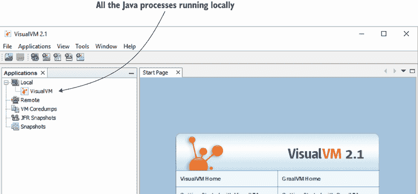

图 6.1 VisualVM 欢迎屏幕。一旦你配置并启动 VisualVM，你会发现这个工具具有简单且易于学习的图形用户界面。在欢迎屏幕的左侧是本地运行的可调查进程。

让我们启动一个 Java 应用程序。你可以使用本书提供的项目 da-ch6-ex1。你可以使用 IDE 启动应用程序，或者直接从控制台启动应用程序。分析 Java 进程不受应用程序启动方式的影响。

一旦启动应用程序，VisualVM 在左侧显示进程。通常，如果你没有明确为进程指定特定名称，VisualVM 将使用主类名，如图 6.2 所示。

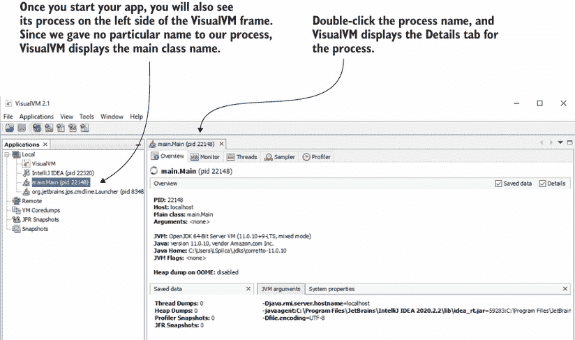

图 6.2 双击进程名称以使用 VisualVM 调查该进程，并将出现一个新标签页。在这个标签页中，VisualVM 为探索该特定进程提供了所有需要的功能。

通常，启动应用程序应该足够了。然而，在某些情况下，由于各种问题，VisualVM 无法连接到本地进程，如图 6.3 所示。在这种情况下，首先尝试的是在启动要分析的应用程序时，使用 VM 参数显式指定域名：

```
-Djava.rmi.server.hostname=localhost
```

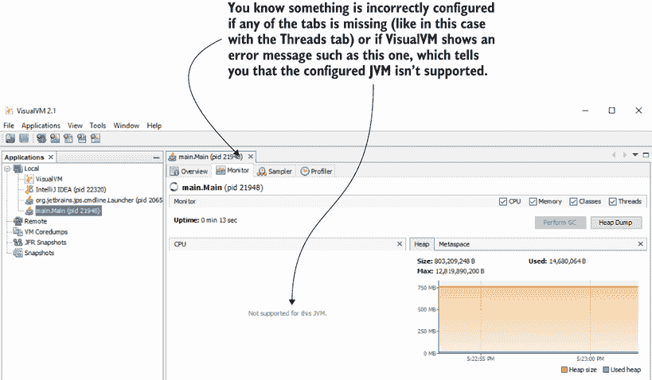

图 6.3 如果工具似乎工作不正常，您需要检查其配置方式。当配置的 JVM 发行版不在 VisualVM 支持的发行版中时，可能会出现此类问题。有时，由于某些原因，工具可能无法连接到您想要调查的本地进程。在这种情况下，使用符合工具要求的另一个 JVM 发行版，或审查您想要调查的进程是如何启动的。

类似的问题也可能是由使用 VisualVM 不支持的热点版本引起的。如果添加`-Djava.rmi.server.hostname=localhost`参数不能解决您的问题，请检查您配置的 JVM 发行版是否在 VisualVM 支持的发行版中（根据其网站上的下载部分：[`visualvm.github.io/download.xhtml`](https://visualvm.github.io/download.xhtml))。

### 6.2.2 观察 CPU 和内存使用情况

您可以使用分析器做的最简单的事情之一是观察您的应用如何消耗系统资源。这样，您可以发现应用中的问题，如内存泄漏或僵尸线程。

定义：内存泄漏是指您的应用没有释放不再需要的数据。随着时间的推移，将没有更多的空闲内存。这是一个问题。


在本节中，您将了解到您可以使用分析器来直观地确认您的应用行为不正确。例如，*僵尸线程*是那些持续执行并消耗应用资源的线程。您可以使用 VisualVM 轻松观察到此类问题。

我准备了一些项目来向您展示如何使用分析器来识别导致异常资源消耗的应用问题。我们将逐个运行书中提供的应用，并使用 VisualVM 来观察行为并识别异常。

让我们从应用 da-ch6-ex1 开始。该应用的想法很简单：两个线程持续向列表中添加值，而另外两个线程持续从该列表中移除（消费）值。我们通常称这种实现为*生产者-消费者方法*，这是一种在应用中常见的多线程设计模式。

列表 6.1 生产者线程向列表添加值

```
public class Producer extends Thread {

  private Logger log = Logger.getLogger(Producer.class.getName());

  @Override
  public void run() {
    Random r = new Random();
    while (true) {
      if (Main.list.size() < 100) {   ❶
        int x = r.nextInt();
        Main.list.add(x);             ❷
        log.info("Producer " + Thread.currentThread().getName() + 
                 " added value " + x);
      }
    }
  }

}
```

❶ 为列表设置最大值数量

❷ 在列表中添加一个随机值

以下代码显示了消费者线程的实现。

列表 6.2 消费者线程从列表中移除值

```
public class Consumer extends Thread {

  private Logger log = Logger.getLogger(Consumer.class.getName());

  @Override
  public void run() {
    while (true) {
      if (Main.list.size() > 0) {     ❶
        int x = Main.list.get(0);
        Main.list.remove(0);          ❷
        log.info("Consumer " + Thread.currentThread().getName() + 
                 " removed value " + x);
      }
    }
  }
}
```

❶ 检查列表中是否包含任何值。

❷ 如果列表包含值，则从列表中移除第一个值

`Main`类创建了两个生产者线程实例和两个消费者线程实例。

列表 6.3 `Main`类创建并启动生产者和消费者线程

```
public class Main {

  public static List<Integer> list = new ArrayList<>();  ❶

  public static void main(String[] args) {
    new Producer().start();                              ❷
    new Producer().start();                              ❷
    new Consumer().start();                              ❷
    new Consumer().start();                              ❷
  }
}
```

❶ 创建一个列表以存储生产者生成的随机值

❷ 启动消费者和生产者线程

这个应用错误地实现了一个多线程架构。更确切地说，多个线程并发访问和修改一个类型为`ArrayList`的列表。因为`ArrayList`不是 Java 中的并发集合实现，它不会自己管理线程的访问。多个线程访问这个集合可能会进入*竞争条件*。当多个线程竞争访问同一资源时，就会发生竞争条件。也就是说，它们在争夺访问同一资源。

在项目 da-ch6-ex1 中，实现缺少线程同步。当你运行应用时，由于竞争条件引起的异常，一些线程在短时间内停止，而其他线程则永远保持活跃，什么也不做（僵尸线程）。我们将使用 VisualVM 来识别所有这些问题。然后，我们将运行项目 da-ch6-ex2，它对应用进行了修正，同步了访问列表的线程。我们将比较 VisualVM 显示的第一个示例和第二个示例的结果，以了解正常应用和有问题的应用之间的差异。

应用将快速运行然后停止（可能在控制台显示异常堆栈跟踪）。下面的代码片段显示了应用在控制台打印的日志消息的样子：

```
Aug 26, 2021 5:22:42 PM main.Producer run
INFO: Producer Thread-0 added value -361561777
Aug 26, 2021 5:22:42 PM main.Producer run
INFO: Producer Thread-1 added value -500676534
Aug 26, 2021 5:22:42 PM main.Producer run
INFO: Producer Thread-0 added value 112520480
```

你可能会认为，因为这个应用只有三个类，你不需要使用分析器来找出问题——阅读代码在这里就足够了。确实，只有三个类，你可能不需要使用单独的工具就能找出问题。这是因为我们使用的应用是简化示例，以便你能够专注于使用分析器。但在现实世界中，应用更加复杂，没有适当的工具（如分析器）很难发现这些问题。

即使应用看起来像是暂停的，当你使用 VisualVM 调查幕后发生的事情时，你也能看到一些有趣的东西。为了调查这种意外行为，请按照以下步骤操作：

1.  检查进程 CPU 使用情况。

1.  检查进程内存使用情况。

1.  可视化调查正在执行的线程。

进程消耗了大量的 CPU 资源，所以，某种程度上，它似乎仍然活跃。为了观察其资源消耗，在 VisualVM 中双击左侧面板中的进程名称后，使用监视器选项卡。在这个选项卡上，你找到的一个小部件显示了 CPU 使用情况（图 6.4）。

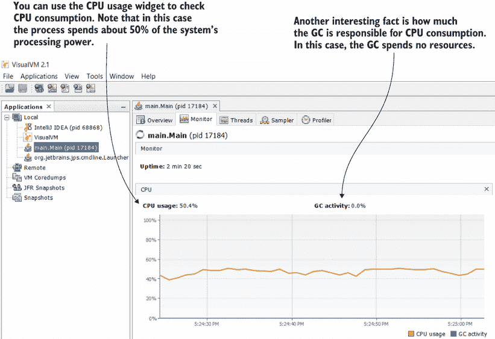

图 6.4 使用 VisualVM 观察 CPU 资源的使用情况。监视器选项卡上的小部件显示了进程使用了多少 CPU 以及多少使用是由 GC 引起的。这些信息有助于你了解应用是否有执行问题，并且是调查下一步的绝佳指导。在这个特定示例中，进程消耗了大约 50%的 CPU。GC 不会影响这个值。这些迹象通常是僵尸线程的指标，这些僵尸线程通常由并发问题生成。

消费者和生产者线程似乎已经进入了一个持续运行的状态，即使它们没有正确完成它们的工作，也会消耗系统的资源。在这种情况下，这种状态是竞态条件的结果，因为线程正在尝试访问和修改一个非并发集合。但我们已经知道应用程序有问题。我们想要观察这些问题引起的症状，这样在类似的其他情况下，我们就会知道我们的应用程序遇到了相同的问题。

在这个小部件中，您还可以找到 GC 使用的 CPU 资源量。GC 是 JVM 机制，用于从内存中删除应用程序不再需要的数据。GC CPU 使用情况是宝贵的信息，因为它可以表明应用程序存在内存分配问题。如果 GC 消耗大量的 CPU 资源，这可能表明应用程序存在内存泄漏问题。

在这种情况下，GC 没有消耗任何 CPU 资源。这也不是一个好迹象。换句话说，应用程序正在消耗大量的处理能力，但没有进行任何处理。这些迹象通常表明僵尸线程，这通常是并发问题的后果。

下一步是查看显示内存消耗的小部件。这个小部件被巧妙地放置在显示 CPU 消耗的小部件附近，如图 6.5 所示。我们将在 6.2.3 节中更详细地讨论这个小部件，但此时请注意，应用程序几乎不消耗任何内存。这种行为，再次，不是一个好迹象，因为它相当于说，“应用程序什么也没做。”仅使用这两个小部件，我们就可以得出我们很可能面临一个并发问题的结论。

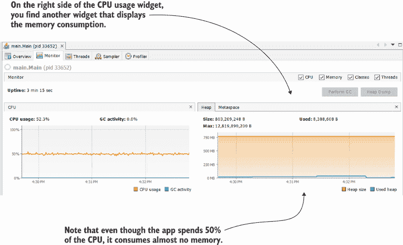

在 CPU 使用率小部件的右侧，您会发现内存使用率小部件。在这个例子中，应用程序几乎不使用内存。这也是为什么 GC 活动为零的原因。不消耗任何内存的应用程序意味着应用程序什么也没做。

我们将在第十章中讨论使用线程转储。现在，我们将只关注配置文件提供的高级小部件，并将比较这些小部件对健康和不健康应用程序提供的结果的比较。

在深入调查执行中的线程之前，我更喜欢使用 VisualVM 来直观地观察线程是如何执行的。在大多数情况下，这样做会给我一些线索，告诉我需要关注哪些线程。一旦我得到这些信息，我就使用线程转储来查找并发问题，并学习如何修复它。


图 6.6 显示了“线程”选项卡，您可以在“监视器”选项卡附近找到它。线程选项卡提供了执行线程及其状态的视觉表示。在这个例子中，应用程序启动的所有四个线程都在执行状态中。

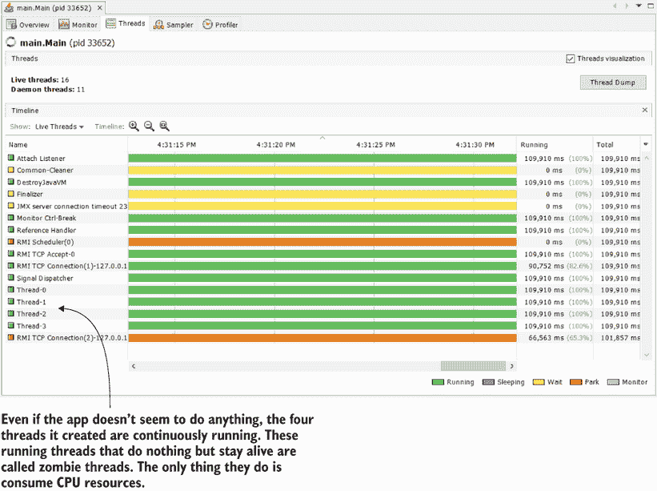

图 6.6 线程选项卡提供了对存活线程及其状态的视觉表示。小部件显示了所有进程线程，包括由 JVM 启动的线程，这有助于你轻松识别应该注意哪些线程，并最终使用线程转储进行更深入的调查。

并发问题可能产生不同的结果。不一定所有线程都将保持存活，例如。有时并发访问可能导致异常，这会中断某些或所有线程。以下代码片段显示了应用程序执行期间可能发生的此类异常的示例：

```
Exception in thread "Thread-1" 
➥ java.lang.ArrayIndexOutOfBoundsException: 
➥ Index -1 out of bounds for length 109
    at java.base/java.util.ArrayList.add(ArrayList.java:487)
    at java.base/java.util.ArrayList.add(ArrayList.java:499)
    at main.Producer.run(Producer.java:16)
```

如果发生此类异常，则某些线程可能会停止，并且线程选项卡不会显示它们。图 6.7 显示了一个应用程序抛出异常，只有一个线程保持存活。

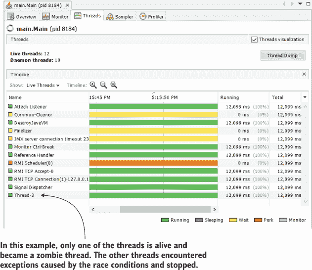

图 6.7 如果应用程序执行期间发生异常，一些线程可能会停止。此图显示了一个并发访问导致三个线程发生异常并停止的情况。只有一个线程仍然存活。记住，多线程应用程序中的并发问题可能导致不同的意外结果。

在本例中，我们只关注发现资源消耗问题。下一步是使用线程转储来确定并发问题的确切原因。我们将在第七章中讨论有关线程转储的所有内容，但就目前而言，让我们专注于识别资源消耗问题。我们将在一个健康的应用程序上运行相同的验证，并将其与我们的不健康应用程序进行比较。这样，你就会知道如何立即识别正确的和不正确的应用程序行为。

项目 da-ch6-ex2 中的示例是刚刚查看的相同应用程序的修正版本。我添加了一些同步块以避免线程的并发访问并消除竞争条件问题。我为消费者和生产者同步代码块都使用了`list`实例作为线程监视器。

列表 6.4 消费者访问同步

```
public class Consumer extends Thread {

  private Logger log = Logger.getLogger(Consumer.class.getName());

  public Consumer(String name) {
    super(name);
  }

  @Override
  public void run() {
    while (true) {
      synchronized (Main.list) {     ❶
        if (Main.list.size() > 0) {
          int x = Main.list.get(0);
          Main.list.remove(0);
          log.info("Consumer " + 
              Thread.currentThread().getName() + 
              " removed value " + x);
        }
      }
    }
  }
}
```

❶ 使用列表实例作为线程监视器来同步对列表的访问

以下代码显示了应用于`Producer`类的同步。

列表 6.5 生产者访问同步

```
public class Producer extends Thread {

  private Logger log = Logger.getLogger(Producer.class.getName());

  public Producer(String name) {
    super(name);
  }

  @Override
  public void run() {
    Random r = new Random();
    while (true) {
      synchronized (Main.list) {       ❶
        if (Main.list.size() < 100) {
          int x = r.nextInt();
          Main.list.add(x);
          log.info("Producer " + 
              Thread.currentThread().getName() + 
              " added value " + x);
        }
      }
    }
  }

}
```

❶ 使用列表实例作为线程监视器来同步对列表的访问

我还为每个线程设置了自定义名称。我总是推荐这种方法。你注意到在前一个示例中 JVM 为我们的线程提供的默认名称了吗？通常，Thread-0、Thread-1、Thread-2 等等并不是你可以轻易用来识别特定线程的名称。我总是尽可能地给线程设置自定义名称，这样我就可以快速地识别它们。此外，我给它们起的名字以下划线开头，这样排序起来更容易。首先，我在 `Consumer` 和 `Producer` 类（分别见列表 6.4 和 6.5）中定义了构造函数，并使用 `super()` 构造函数来命名线程。然后，我给它们命名，如列表 6.6 所示。

列表 6.6 为线程设置自定义名称

```
public class Main {

  public static List<Integer> list = new ArrayList<>();

  public static void main(String[] args) {
    new Producer("_Producer 1").start();
    new Producer("_Producer 2").start();
    new Consumer("_Consumer 1").start();
    new Consumer("_Consumer 2").start();
  }
}
```

注意，启动此应用程序后，控制台会持续显示日志。应用程序不会像示例 da-ch6-ex1 那样停止。让我们使用 VisualVM 来观察资源消耗。在 CPU 利用率小部件中，你可以看到应用程序消耗的 CPU 较少，而内存使用情况小部件显示应用程序在运行时使用了一些分配的内存。此外，我们还可以观察到 GC 的活动。正如你将在本章后面学到的那样，内存图右侧的谷底是 GC 活动的结果。

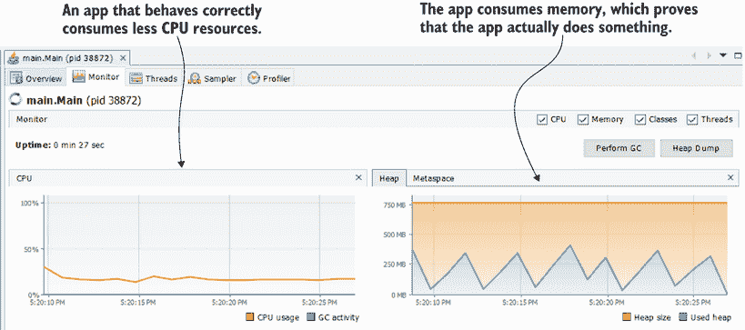

图 6.8 在正确同步代码后，资源消耗小部件看起来不同。CPU 消耗较低，应用程序使用了一些内存。

线程选项卡显示监视器有时会阻塞线程，这仅允许一次只有一个线程通过同步块。线程不会连续运行，这使得应用程序消耗的 CPU 较少，如图 6.8 所示。图 6.9 显示了线程选项卡中的线程可视化。

注意：即使我们添加了同步块，一些代码仍然位于这些块之外。因此，线程可能仍然看起来是并发运行的（如图 6.9 所示）。

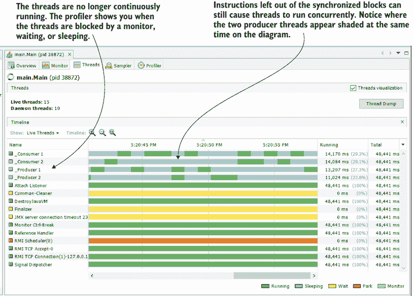

图 6.9 线程选项卡帮助你可视化应用程序中线程的执行。由于线程的名称以下划线开头，你可以简单地按名称排序它们以查看它们分组。注意，它们的执行有时会被监视器中断，这允许一次只有一个线程通过同步代码块。

### 6.2.3 识别内存泄漏

在本节中，我们讨论内存泄漏以及如何确定你的应用程序何时受到影响。*内存泄漏*是指应用程序存储并保留对未使用对象的引用（见图 6.10）。由于这些引用，GC（负责从应用程序内存中删除不需要数据的机制）无法删除这些对象。随着应用程序继续添加更多数据，内存会填满。当应用程序没有足够的空间添加新数据时，它会抛出 `OutOfMemoryError` 并停止。我们将使用一个简单的应用程序，该应用程序会导致 `OutOfMemoryError`，以演示如何使用 VisualVM 识别内存泄漏。

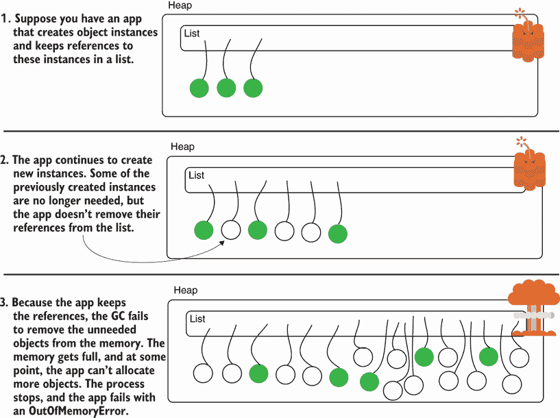

图 6.10 `OutOfMemoryError` 像一个定时炸弹。应用程序未能移除它不再使用的对象的引用。由于应用程序保留这些实例的引用，垃圾回收器无法从内存中移除这些实例。随着更多对象的创建，内存会填满。在某个时刻，堆中不再有空间分配其他对象，应用程序会因 `OutOfMemoryError` 而失败。

在项目 da-ch6-ex3 提供的示例中，你可以找到一个简单的应用程序，它在列表中存储随机实例，但从不移除它们的引用。以下代码提供了一个简单实现的示例，该实现会产生一个 `OutOfMemoryError`。

列表 6.7 产生 `OutOfMemoryError`

```
public class Main {

  public static List<Cat> list = new ArrayList<>();

  public static void main(String[] args) {
    while(true) {
      list.add(new Cat(new Random().nextInt(10)));    ❶
    }
  }
}
```

❶ 持续向列表中添加新实例，直到 JVM 内存耗尽

类 `Cat` 是一个简单的 `java` 对象，如下代码片段所示：

```
public class Cat {

  private int age;

  public Cat(int age) {
    this.age = age;
  }

  // Omitted getters and setters
}
```

让我们运行这个应用程序，并使用 VisualVM 观察资源使用情况。我们特别感兴趣的是显示内存使用情况的控件。当内存泄漏影响你的应用程序时，这个控件可以确认使用的内存会持续增长。垃圾回收器试图从内存中释放未使用的数据，但它移除的数据太少。最终，内存被填满，应用程序无法存储新数据，并抛出 `OutOfMemoryError`（图 6.11）。

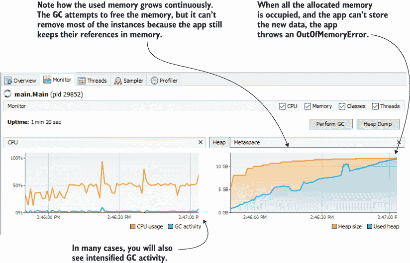

图 6.11 当内存泄漏影响你的应用程序时，使用的内存会持续增长。垃圾回收器尝试释放内存，但无法移除足够的数据。使用的内存增加，直到应用程序无法分配更多新数据。此时，应用程序抛出 `OutOfMemoryError` 并停止。在许多情况下，内存泄漏还会导致垃圾回收活动加剧，这可以在 CPU 资源使用小部件中看到。

如果你让应用程序运行足够长的时间，你最终会在应用程序的控制台中看到错误堆栈跟踪：

```
Exception in thread "main" java.lang.OutOfMemoryError: Java heap space
    at java.base/java.util.Arrays.copyOf(Arrays.java:3689)
    at java.base/java.util.ArrayList.grow(ArrayList.java:238)
    at java.base/java.util.ArrayList.grow(ArrayList.java:243)
    at java.base/java.util.ArrayList.add(ArrayList.java:486)
    at java.base/java.util.ArrayList.add(ArrayList.java:499)
    at main.Main.main(Main.java:13)
```

重要的是要记住，`OutOfMemoryError` 的堆栈跟踪并不一定表明导致问题的位置。由于应用程序只有一个堆内存位置，某个线程可能引起问题，而另一个线程可能不幸成为最后一个尝试使用内存位置的线程，从而引发错误。唯一确定识别根本原因的方法是使用堆转储，你将在第十一章中学习。

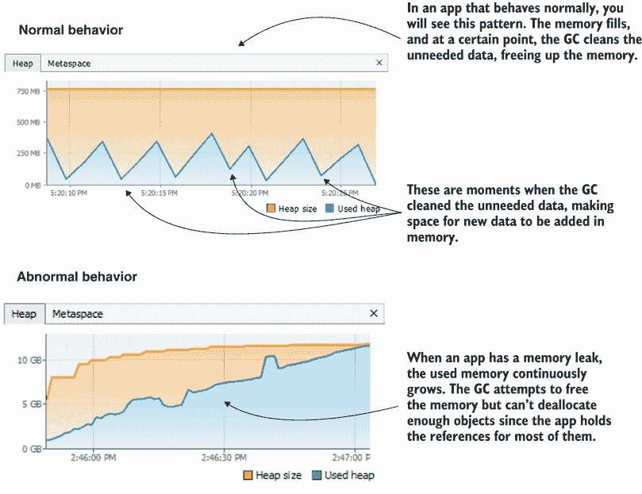

图 6.12 健康应用程序与受内存泄漏影响的应用程序的内存使用量比较。垃圾回收器能够为健康应用程序从内存中释放不需要的数据，分配的空间永远不会填满。受内存泄漏影响的应用程序不允许垃圾回收器移除足够的数据。在某个时刻，内存完全填满，生成 `OutOfMemoryError`。

图 6.12 比较了正常行为和受内存泄漏影响的应用程序的行为，如图 6.12 所示。对于正常执行（未受内存泄漏影响）的应用程序，请注意图表有峰值和谷值。应用程序分配内存使其填满（峰值），并且有时垃圾回收器会移除不再需要的数据（谷值）。这种起伏通常是调查的能力未受内存泄漏影响的良好迹象。

然而，如果你看到内存逐渐填满而垃圾回收器（GC）没有清理它，那么你的应用程序可能存在内存泄漏。一旦你怀疑有内存泄漏，你需要进一步使用堆转储来调查。

你可以控制 Java 应用程序中分配的堆大小。这样，你可以增加 JVM 为你的应用程序分配的最大限制。然而，给应用程序更多的内存并不是解决内存泄漏的解决方案。但这种方法可以作为一个临时解决方案，给你更多时间来解决问题的根本原因。要为应用程序设置最大堆大小，请使用 JVM 属性`-Xmx`，后跟你想分配的量（例如，`-Xmx1G`将分配最大堆大小为 1 GB）。你可以使用类似的方法使用`-Xms`属性设置最小初始堆大小（例如，`-Xms500m`将分配最小堆大小为 500 MB）。

除了正常的堆空间外，任何应用程序也会使用一个*元空间*：JVM 存储应用程序执行所需类元数据的内存位置。在 VisualVM 中，你可以在内存分配小部件中观察到元空间的分配。要评估元数据分配，请使用小部件的元空间选项卡，如图 6.13 所示。

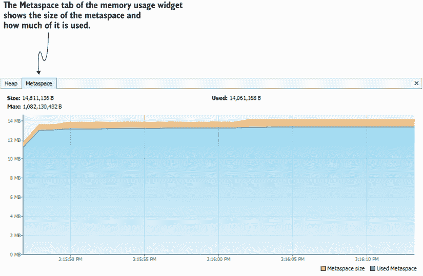

图 6.13 元空间是用于存储类元数据的内存的一部分。在特定情况下，元空间可能会溢出。VisualVM 内存分配小部件也显示了元空间的用法。

元数据空间中的`OutOfMemoryError`发生得较少，但并非不可能。我最近处理了一个应用程序的此类案例，该应用程序误用了数据持久性的框架。通常，如果误用，使用 Java 反射的框架和库最有可能生成此类问题，因为它们通常依赖于动态代理和间接调用。

在我的情况下，应用程序误用了名为 Hibernate 的框架。如果你已经听说过 Hibernate，那也不会让我感到惊讶，因为它是目前管理 Java 应用程序中持久数据最常用的解决方案之一。Hibernate 是一个优秀的工具，它有助于实现应用程序最常用的持久化功能，同时消除了编写不必要的代码的需要。Hibernate 管理实例的上下文并将对上下文的更改映射到数据库。但是，它不推荐用于非常大的上下文。换句话说，不要一次性处理来自数据库的太多记录！

我遇到问题的应用程序定义了一个计划中的进程，从数据库中加载许多记录并以定义的方式处理它们。似乎在某个时刻，此进程获取的记录数量如此之大，以至于加载操作本身导致了元空间的填充；问题在于框架的误用，而不是框架的 bug。开发者不应该使用 Hibernate，而应该使用替代的、更底层的解决方案，如 JDBC。

问题非常关键，我必须找到短期解决方案，因为完全重构将花费很长时间。就像堆一样，你可以自定义元空间的大小。使用`-XX:MaxMetaspaceSize`属性，你可以扩大元空间（例如，`-XX:MaxMetaspaceSize=100M`），但请记住，这并不是解决问题的真正方法。此类情况的长期解决方案是重构功能，以避免一次性在内存中加载大量记录，并在必要时最终使用替代的持久化技术。

## 摘要

+   分析器是一个工具，它允许你观察应用程序的执行，以识别其他情况下更难发现的问题的原因。分析器会显示给你

    +   应用程序如何消耗系统资源，如 CPU 和内存

    +   执行的代码以及每个方法执行的持续时间

    +   不同线程上方法执行的调用栈

    +   执行线程及其状态

+   分析器提供了优秀的可视化控件，帮助你更快地理解某些方面。

+   你可以使用分析器观察 GC 的执行，这有助于你识别应用程序未正确从内存中释放未使用数据（内存泄漏）等问题。
