# 7 使用剖析技术寻找隐藏问题

本章涵盖

+   对应用程序执行进行采样以找到当前正在执行的方法

+   观察执行时间

+   识别应用程序执行的 SQL 查询

在第六章中，我说过分析器是一个强大的工具，可以在所有灯光都熄灭时为你指明一条道路。但我们讨论的只是分析器能力的一小部分。分析器为调查应用程序的执行提供了强大的工具，学会正确使用这些工具可以在许多场景中帮助你。

在许多情况下，我不得不评估或调查我几乎无法阅读的代码库中的应用程序执行——一些公司将其隐藏在衣柜中的旧应用程序，其代码设计不佳。在这种情况下，分析器是找到在特定功能被触发时正在执行什么的唯一有效方法。现在你可以看到为什么我把分析器比作 Eärendil 的光：正如加拉德丽尔所说，它真的是许多黑暗地方的灯光，其他所有灯光都已熄灭。

在本章中，我们将通过剖析分析三种调查技术，我认为这些技术非常有价值：

+   采样以找出应用程序代码的哪个部分在执行

+   剖析执行（也称为*仪器化*）以识别错误行为和优化

+   剖析应用程序以识别其用于与数据库管理系统（DBMS）通信的 SQL 查询

我们将在第八章继续讨论应用程序执行的先进可视化技术。当适当使用时，这些技术可以节省你大量时间来找到各种问题的原因。不幸的是，尽管这些技术很强大，但许多开发者对它们不熟悉。一些开发者知道这些技术存在，但往往认为它们难以使用（在本章中，我将向你展示事实正好相反）。因此，他们尝试使用其他方法来解决可以用分析器（如本章所示）更高效解决的问题。

为了确保你正确理解如何使用这些技术以及可以调查哪些问题，我创建了四个小型项目。我们将使用这些项目来应用我们讨论的剖析技术。第 7.1 节讨论了采样——这是一种用于识别在特定时间执行哪些代码的技术。在第 7.2 节中，你将了解分析器如何提供比采样更多的执行细节。第 7.3 节讨论了如何使用分析器获取应用程序发送给数据库管理系统（DBMS）的 SQL 查询的详细信息。

## 7.1 采样以观察执行代码

什么是采样，它如何对你有益？采样是一种使用分析器来识别应用程序执行哪些代码的方法。采样不会提供关于执行的许多细节，但它描绘了发生的大致情况，为你提供了关于你需要进一步分析的有价值信息。因此，在分析应用程序时，采样始终应该是第一步，而且，正如你将看到的，在许多情况下，采样甚至可能足够。对于本节，我准备了项目 da-ch7-ex1\. 我们将使用分析器来采样此应用程序，并了解我们如何使用 VisualVM 识别与特定功能执行时间相关的问题。

我们将使用的一个用于演示采样的项目是一个小型应用程序，它暴露了一个端点 `/demo`。当有人使用 cURL、Postman 或类似工具调用此端点时，应用程序会进一步调用由 [httpbin.org](http://httpbin.org/) 暴露的端点。

我喜欢使用 [httpbin.org](http://httpbin.org/) 来演示许多示例和演示。[Httpbin.org](http://httpbin.org/) 是一个开源的用 Python 编写的 Web 应用程序和工具，它暴露了你可以用来测试你实现的不同内容的模拟端点。

在这里，我们调用一个端点，[httpbin.org](http://httpbin.org/) 以给定的延迟响应。我们将在这个示例中使用 5 秒的延迟来模拟应用程序中的延迟场景，而 [httpbin.org](http://httpbin.org/) 模拟了问题的根本原因。

对于延迟，我们理解应用程序的反应速度比预期慢。


这种场景也在图 7.1 中进行了视觉表示。

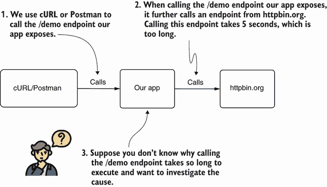

图 7.1 我们正在调查的应用程序暴露了一个端点：`/demo`。当你调用此端点时，你必须等待 5 秒以等待应用程序响应。我们需要了解为什么端点响应需要这么长时间。我们知道我们的应用程序从 [httpbin.org](http://httpbin.org/) 调用一个模拟端点，这导致了延迟，但我们要学习如何使用分析器来调查这种场景。这样，你就会知道如何使用类似的技术来解决现实世界中的问题。

分析方法分为两个步骤：

1.  采样以找出执行了哪些代码以及你应该在哪里进行更详细的调查（本节中讨论的方法）。

1.  分析（也称为 *instrumentation*）以获取有关特定代码执行更多细节。

有时步骤 1（采样）就足以理解一个问题，你可能不需要分析应用程序（步骤 2）。正如你将在本章和第八章到第十章中学习的，如果需要，分析可以提供更多关于执行的细节。但首先，你需要知道要分析代码的哪个部分，而为此，你使用采样。

在我们的例子中，问题是如何发生的？当调用`/demo`端点时，执行需要 5 秒钟（如图 7.2），我们认为这太长了。理想情况下，我们希望执行时间少于 1 秒，因此我们需要了解为什么调用`/demo`端点需要这么长时间。延迟是由什么引起的？是我们的应用程序，还是其他原因？

当你在未知代码库中调查缓慢问题时，使用分析器应该是你的首选。问题不一定需要涉及端点。在这个例子中，端点是最简单的解决方案。但在任何涉及缓慢的情况——调用端点、执行进程或对特定事件进行简单方法调用——分析器都应该是你的首选。

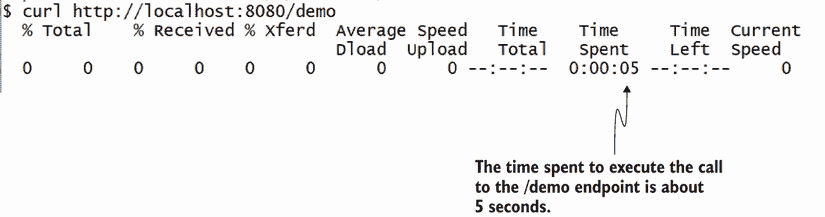

图 7.2 当调用端点时（在这个图中，使用 cURL），应用程序大约需要 5 秒钟来响应。在我们的场景中，我们使用分析器来调查这个延迟问题。

首先，启动应用程序，然后启动 VisualVM（我们将用它来进行调查）。记住要添加 VM 选项`-Djava.rmi.server.hostname=localhost,`，正如我们在第六章中讨论的那样。这允许 VisualVM 连接到进程。从左侧的列表中选择进程，然后选择采样标签，如图 7.3 所示，以开始采样执行。

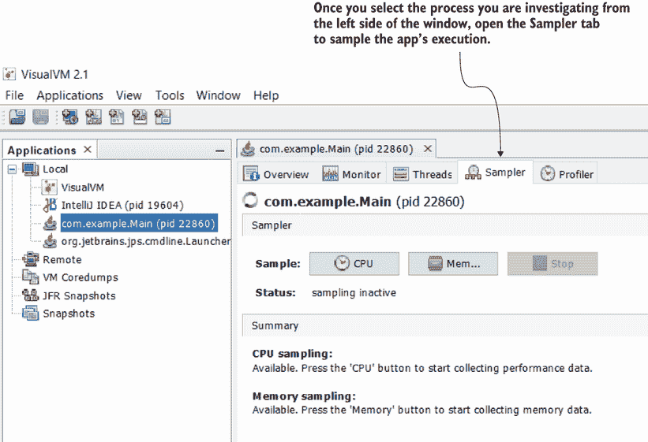

图 7.3 要开始采样执行，从左侧的列表中选择进程，然后选择采样标签。

采样执行有三个目的：

+   *为了找出什么代码在执行*——采样显示了幕后执行的代码，这是找到需要调查的应用程序部分的一种极好方式。

+   *为了识别 CPU 消耗*——我们将使用它来调查延迟问题并了解哪些方法共享执行时间。

+   *为了识别内存消耗*——这允许我们分析与内存相关的问题。我们将在第十一章中更详细地讨论采样和内存分析。

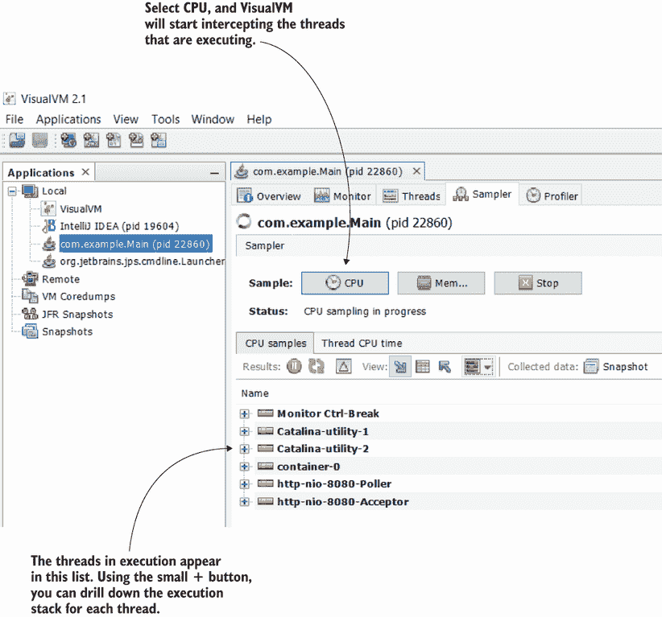

图 7.4 分析器以列表形式显示所有活动线程。你可以展开每个项目以查看执行堆栈和近似执行时间。当应用程序执行时，新创建的线程会出现在列表中，你可以分析它们的执行。

选择 CPU（如图 7.4 所示）以开始采样性能数据。VisualVM 显示所有活动线程及其堆栈跟踪。然后分析器拦截进程执行并显示所有调用的方法和近似执行时间。当你调用`/demo`端点时，分析器会显示应用程序执行该功能时幕后发生的事情。

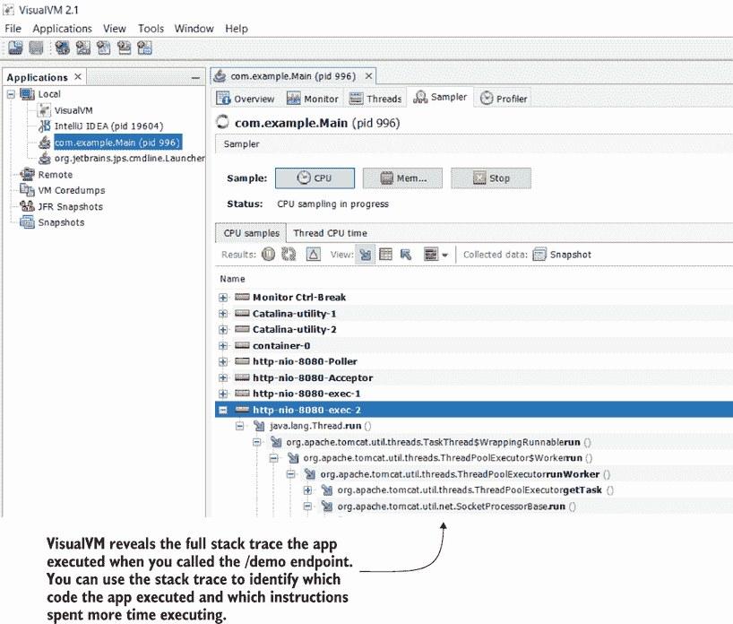

图 7.5 堆栈跟踪显示了应用程序执行的代码。你可以看到每个方法和随后调用的每个方法。这种视图有助于你在调查特定功能时快速找到想要关注的代码。

我们现在可以调用 `/demo` 端点并观察会发生什么。如图 7.5 所示，列表中出现了一些新的线程。当调用 `/demo` 端点时，应用启动了这些线程。当你打开它们时，你应该能够精确地看到应用在执行过程中的行为。

在我讨论执行时间等细节之前，我想强调这个第一步是多么重要。很多时候，当我分析代码时，我只是使用采样来确定查找问题的位置。我可能甚至没有在调查性能或延迟问题，而只是在寻找开始调试的点。记住我们第二章到第四章的讨论：要调试某个东西，你需要知道在哪里添加断点来暂停应用的执行。如果你不知道在哪里添加断点，你就无法调试。采样可以在你不知道从哪里开始调试的情况下为你提供一些线索（特别是在本章开头提到的那些情况下，应用缺乏清晰的代码设计）。

让我们查看执行堆栈以了解分析器向我们展示了什么。当你想要找出哪些代码正在执行时，你只需展开堆栈跟踪，直到它显示你感兴趣的应用的函数。当你调查一个延迟问题（如本例所示）时，你可以展开堆栈跟踪以观察最大执行时间，如图 7.6 所示。

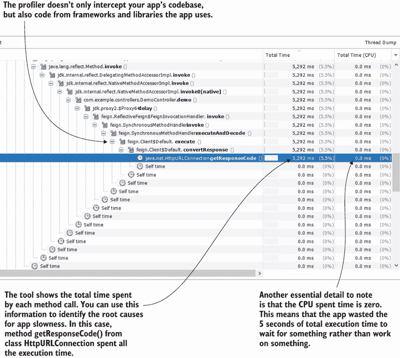

图 7.6 当你展开执行堆栈时，你可以找到哪些方法正在执行以及它们执行花费了多长时间。你还可以推断出它们等待了多久以及它们工作了多少。分析器显示了应用的代码库方法以及应用使用的特定依赖项（库或框架）中调用的方法。

我通过选择最后一个方法中的小 (+) 按钮来展开执行堆栈。分析器显示，理解执行并找到导致延迟的方法大约花费了 5 秒。在这种情况下，我们看到只有一个方法导致了缓慢：`HttpURLConnection` 类的 `getResponseCode()` 方法。

提示：记住，在现实世界的场景中，并不总是只有一个方法花费了所有的执行时间。你经常会发现，时间被多个执行的方法所共享。规则是首先关注执行时间最长的那个方法。


本例的一个重要方面是 CPU 时间（方法工作的时间）为零。尽管该方法在执行过程中花费了 5 秒，但它没有使用 CPU 资源，因为它正在等待 HTTP 调用结束并获取响应。我们可以得出结论，问题不在于应用；相反，它之所以缓慢，仅仅是因为它等待 HTTP 请求的响应。

区分总 CPU 时间和总执行时间非常有价值。如果一个方法消耗 CPU 时间，这意味着该方法“工作”了。在这种情况下，为了提高性能，你通常必须调整（如果可能）算法以最小化其复杂性。如果一个方法的执行消耗了少量的 CPU 时间但具有较长的执行时间，那么这个方法很可能是正在等待某事：一个动作可能需要很长时间，但应用什么也不做。在这种情况下，你需要弄清楚你的应用正在等待什么。

另一个需要观察的重要方面是，分析器不仅拦截你的应用代码库。你可以看到，在应用执行期间也会调用依赖项的方法。在这个例子中，应用使用名为 OpenFeign 的依赖项来调用`httpbin.org`端点。你可以在不属于你应用代码库的堆栈跟踪包中看到这一点。这些包是你应用用来实现其功能的依赖项的一部分。OpenFeign 可能是其中之一，就像这个例子一样。

OpenFeign 是 Spring 技术生态系统中的一项项目，Spring 应用可以使用它来调用 REST 端点。由于这个例子是一个 Spring 应用，你将在堆栈跟踪中找到与 Spring 相关的技术包。你不需要了解堆栈跟踪的每一部分做什么。在现实世界的场景中，你也不会知道这一点。实际上，这本书是关于理解你还不了解的代码。如果你想学习 Spring，我建议从*Spring Start Here*（Manning，2021）开始，这是另一本我写的书。你还可以在*Spring Start Here*中找到关于 OpenFeign 的详细信息。

为什么观察依赖项的方法如此重要？因为，有时，使用其他方法几乎不可能确定给定依赖项的执行内容。看看我们应用中编写的调用`httpbin.org`端点的代码（参见列表 7.1）。你无法看到发送 HTTP 请求的实际实现。这是因为，正如今天许多 Java 框架所发生的那样，依赖项使用动态代理来解耦实现。

列表 7.1 使用 OpenFeign 的 HTTP 客户端实现

```
@FeignClient(name = "httpBin", url = "${httpBinUrl}")
public interface DemoProxy {

  @PostMapping("/delay/{n}")
  void delay(@PathVariable int n);
}
```

*动态代理*为应用提供了一种在运行时选择方法实现的方式。当一个应用功能使用动态代理时，它实际上可能调用一个接口声明的方 法，而不知道在运行时会给它什么实现来执行（图 7.7）。使用框架的功能更容易，但缺点是不知道在哪里调查问题。

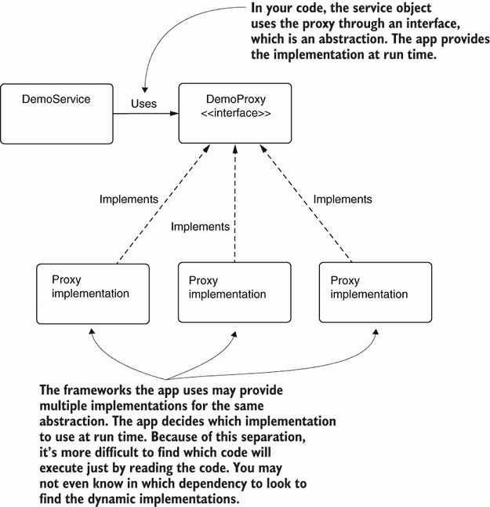

图 7.7 框架将抽象的实现保持独立，并在执行期间动态提供它们。因为实现是解耦的，并且应用在运行时提供它，所以通过阅读代码很难找到它。

我个人使用采样的一种情况是在学习一个新的框架或库时。采样帮助我理解新功能背后执行的内容。我在学习 Hibernate 和 Spring Security 时应用了这种方法，这两个框架功能复杂，这帮助我快速理解如何使用给定的功能。


## 7.2 分析以了解方法执行了多少次

找到执行哪些代码是至关重要的，但有时这还不够。我们经常需要更多细节来精确理解给定的行为。例如，采样不提供方法调用的次数。一个应用程序可能只花费 50 毫秒执行，但如果它调用方法一千次，那么在采样时它将花费 50 秒来执行。为了演示如何使用分析器获取执行细节并确定何时有用，我们将再次使用书中提供的一些项目。我们将从项目 da-ch7-ex1 开始，我们也在 7.1 节中使用过，但这次我们将讨论关于执行细节的分析。

启动项目 da-ch7-ex1 提供的应用程序。当您分析应用程序时，您不应该调查整个代码库。相反，您只需要过滤对您调查至关重要的部分。分析是一个非常消耗资源的操作，所以除非您有一个非常强大的系统，否则分析整个应用程序将花费大量时间。这也是我们总是从采样开始的原因之一——如果需要，确定进一步分析的部分。

提示：永远不要分析应用程序的整个代码库。您应该首先基于采样决定您想要分析以获取更多细节的应用程序部分。


在这个例子中，我们将忽略应用程序的代码库（不包括依赖项），只从依赖项中获取 OpenFeign 类。请注意，在实际应用程序中，您不能引用整个应用程序的代码，因为这可能会消耗大量时间和资源。在这个小例子中，这不会成为问题，但对于大型应用程序，在分析时始终尽可能限制拦截的代码。

在图 7.8 中，您可以看到如何应用这些限制。在“分析器”标签页的右侧，您可以指定要拦截应用程序的哪个部分。在这个例子中，我们使用以下设置：

+   `com.example.**`—`com.example`所有包和子包中的代码

+   `feign.**`—`feign`所有包和子包中的代码

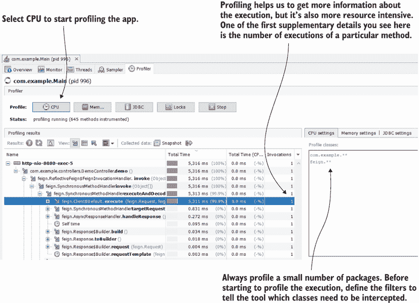

图 7.8 在执行过程中分析应用程序的一部分以获取给定方法被调用的次数的详细信息。我们可以看到导致 5 秒延迟的方法只被调用了一次，这意味着调用次数在这里不会引起问题。

您可以使用以下简单规则来过滤您想要分析包和类：

+   将每条规则写在单独的一行上。

+   使用一个星号（*）来引用一个包；例如，如果我们想分析 `com.example` 包中的所有类，我们可以使用 `com.example.*`。

+   使用两个星号（**）来引用一个包及其所有子包。在这种情况下，通过使用 `com.example.**`，我们指的是 `com.example` 包中的所有类以及其任何子包中的类。

+   如果你只想分析某个类，请写出该类的全名；例如，我们可以使用 `com.example.controllers.DemoController` 来仅分析这个类。

我在 7.1 节中讨论的采样执行后选择了这些包。因为我观察到具有延迟问题的方法调用来自 `feign` 包的类，所以我决定将这个包及其子包添加到列表中，以获取更多信息。

在这个特定情况下，调用次数似乎并没有引起问题：该方法只执行一次，并且大约需要 5 秒钟来完成其执行。少量方法调用意味着我们没有重复不必要的执行（正如你将在本章后面学到的那样，这是许多应用程序中常见的问题）。

在另一种情况下，你可能观察到对给定端点的调用仅花费了 1 秒钟，但方法（由于某些设计不佳）被调用了 5 次。那么，问题就出在应用程序中，我们就知道如何以及在哪里解决它。在第 7.3 节中，我们将分析这样的问题。

## 7.3 使用分析器识别应用程序执行的 SQL 查询

在本节中，你将学习如何使用分析器来识别应用程序发送给数据库管理系统的 SQL 查询。这个主题无疑是我的最爱之一。如今，几乎每个应用程序都至少使用一个关系型数据库，而且几乎在所有情况下，都会时不时地遇到由 SQL 查询引起的延迟。此外，如今的应用程序使用更高级的方法来实现持久层；在许多情况下，应用程序发送的 SQL 查询是由框架或库动态创建的。这些动态生成的查询难以识别，但分析器可以施展一些魔法，极大地简化你的调查。

我们将使用项目 da-ch7-ex2 实现的场景来学习一个方法执行了多少次，并拦截应用程序在关系型数据库上运行的 SQL 查询。然后，我们将演示即使在应用程序与框架一起工作且不直接处理查询的情况下，也可以检索执行的 SQL 查询。最后，我们将通过几个示例进一步讨论这个主题。

### 7.3.1 使用分析器检索框架未生成的 SQL 查询

本节通过一个示例演示如何使用分析器获取应用程序执行的 SQL 查询。我们将使用一个简单的应用程序，该应用程序直接将查询发送到数据库管理系统，而不使用框架。

让我们开始项目 da-ch7-ex2 并使用“分析器”选项卡，正如你在第 7.2 节中学到的。项目 da-ch7-ex2 也是一个小型应用程序。它配置了一个内存数据库，包含两个表（产品表和购买表），并使用一些记录填充了这两个表。

当调用 `/products` 端点时，应用程序会公开所有已购买的产品。这里的“已购买产品”指的是在购买表中至少有一条购买记录的产品。目的是在不首先分析代码的情况下分析应用程序调用此端点时的行为。这样，我们可以看到仅通过使用分析器我们可以得到多少信息。

在图 7.9 中，我们使用“分析器”选项卡，因为你已经学过了第 7.1 节中的采样，但请记住，在任何实际场景中，你都是从采样开始的。我们启动应用程序，并使用 cURL 或 Postman 调用 `/products` 端点。分析器精确地显示了发生了什么：

1.  调用了属于 `PurchaseController` 类的 `findPurchasedProductNames()` 方法。

1.  此方法将调用委托给了 `PurchaseService` 类中的 `getProductNamesForPurchases()` 方法。

1.  `ProductService` 类中的 `getProductNamesForPurchases()` 方法调用了 `PurchaseRepository` 中的 `findAll()`。

1.  `ProductService` 类中的 `getProductNamesForPurchases()` 方法调用了 `ProductRepository` 中的 `findProduct()` 10 次。

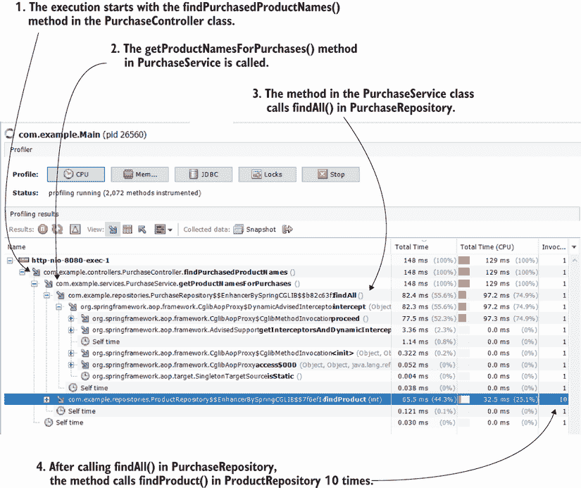

图 7.9 当分析应用程序时，我们观察到其中一个方法被调用了 10 次。我们现在需要问自己这是否是一个设计问题。因为我们现在对整个算法有了大致的了解，并且知道执行了哪些代码，如果我们无法弄清楚发生了什么，我们还可以调试应用程序。

这不令人惊叹吗？我们甚至没有查看代码，就已经对这次执行了解了很多。这些细节非常棒，因为现在你知道了确切的位置可以进入代码，以及你可以期望找到什么。分析器给你提供了类名、方法名以及它们是如何相互调用的。现在让我们来看看列表 7.2 中的代码，并找出所有这些发生的地方。通过使用分析器，我们可以看到大多数事情都发生在 `PurchaseService` 类中的 `getProductNamesForPurchases()` 方法中，所以这很可能是我们需要分析的地方。

列表 7.2 在 `PurchaseService` 类中实现的算法

```
@Service
public class PurchaseService {

  private final ProductRepository productRepository;
  private final PurchaseRepository purchaseRepository;

  public PurchaseService(ProductRepository productRepository,
                         PurchaseRepository purchaseRepository) {
    this.productRepository = productRepository;
    this.purchaseRepository = purchaseRepository;
  }

  public Set<String> getProductNamesForPurchases() {
    Set<String> productNames = new HashSet<>();
    List<Purchase> purchases = purchaseRepository.findAll();   ❶
    for (Purchase p : purchases) {                             ❷
      Product product = 
        productRepository.findProduct(p.getProduct());         ❸
      productNames.add(product.getName());                     ❹
    }

    return productNames;                                       ❺
  }
}
```

❶ 从数据库表获取所有购买记录

❷ 遍历每个产品

❸ 获取已购买产品的详细信息

❹ 将产品添加到集合中

❺ 返回产品集合

观察实现的行为：应用程序在列表中获取一些数据，然后迭代它以从数据库中获取更多数据。这样的实现通常表明存在设计问题，因为你通常可以将这么多查询的执行减少到一次。显然，执行的查询越少，应用程序就越高效。

在这个例子中，直接从代码中检索查询是轻而易举的。由于性能分析器显示了它们的确切位置，并且应用程序很小，因此找到查询不是问题。但是，现实世界的应用程序并不小，在许多情况下，直接从代码中检索查询并不容易。但不必再担心了！你可以使用性能分析器检索应用程序发送给数据库管理系统的所有 SQL 查询。你可以在图 7.10 中看到这一演示。不是选择 CPU 按钮，而是选择 JDBC 按钮以开始对 SQL 查询进行性能分析。

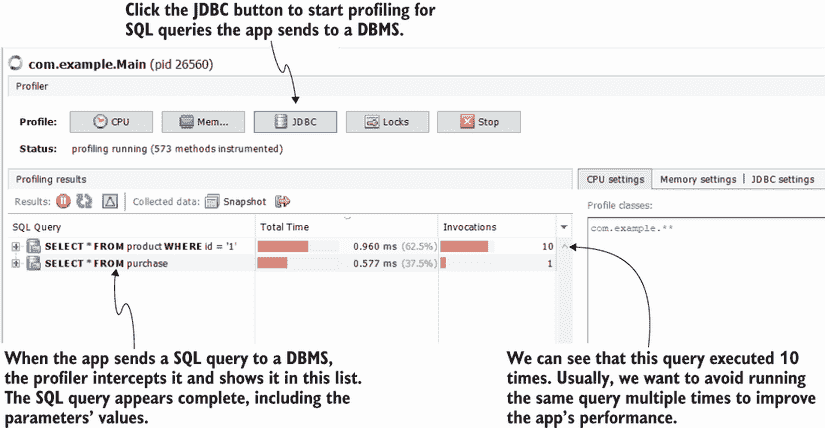

图 7.10 性能分析器拦截了应用程序通过 JDBC 驱动程序发送到数据库管理系统的 SQL 查询。这为你提供了一个简单的方法来获取查询，运行它们，观察代码库的哪个部分运行了它们，以及查询执行了多少次。

工具在幕后执行的操作非常简单：Java 应用程序通过 JDBC 驱动程序将 SQL 查询发送到数据库管理系统。性能分析器拦截驱动程序并在驱动程序将查询发送到数据库管理系统之前复制它们。图 7.11 显示了这种方法。结果是令人惊叹的，因为你可以直接复制并粘贴查询到你的数据库客户端中，在那里你可以运行它们或调查它们的计划。

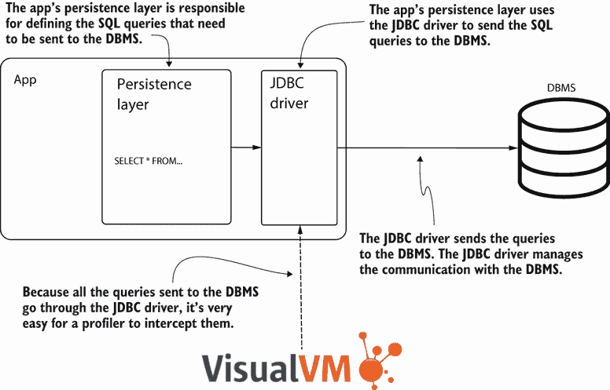

图 7.11 在 Java 应用程序中，与关系型数据库管理系统的通信是通过 JDBC 驱动程序完成的。性能分析器可以拦截所有方法调用，包括 JDBC 驱动程序的方法调用，并检索应用程序发送给数据库管理系统的 SQL 查询。你可以获取这些查询并在你的调查中使用它们。

性能分析器还显示了查询发送的次数。在这种情况下，应用程序第一次查询发送了 10 次。这种设计是有缺陷的，因为它多次重复相同的查询，从而浪费了不必要的时间和资源。实现代码的开发者试图获取购买信息，然后获取每个购买的详细信息。但是，通过在两个表（产品和购买）之间进行连接的简单查询就可以一步解决问题。幸运的是，使用 VisualVM，你确定了原因，并且你知道如何确切地更改以改进这个应用程序。

图 7.12 显示了如何找到发送查询的代码库部分。你可以展开执行堆栈，通常可以在应用程序代码库中找到第一个方法。

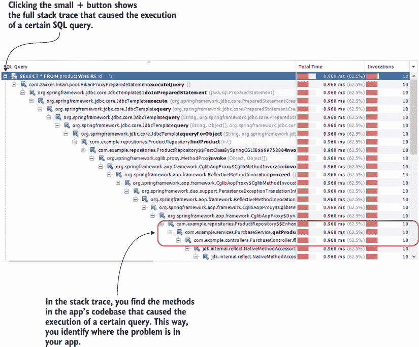

图 7.12 对于每个查询，性能分析器还提供了执行堆栈跟踪。你可以使用堆栈跟踪来识别你的应用程序代码库的哪个部分发送了查询。

列表 7.2 显示了性能分析器识别的代码。一旦你确定了问题的来源，就是时候阅读代码并找到一种优化实现的方法。在这个例子中，所有内容都可以合并为一个查询。这看起来可能像是一个愚蠢的错误，但请相信我，你甚至会在由强大组织实施的大型应用程序中找到这类情况。

列表 7.3 `ProductService` 类中算法的实现

```
@Service
public class PurchaseService {

  // Omitted code

  public Set<String> getProductNamesForPurchases() {
    Set<String> productNames = new HashSet<>();
    List<Purchase> purchases = purchaseRepository.findAll();            ❶
    for (Purchase p : purchases) {                                      ❷
      Product product = productRepository.findProduct(p.getProduct());  ❸
      productNames.add(product.getName());
    }
    return productNames;
  }
}
```

❶ 应用程序获取所有产品的列表。

❷ 遍历每个产品

❸ 获取产品详情

示例 da-ch7-ex2 使用 JDBC 将 SQL 查询发送到数据库管理系统 (DBMS)。应用程序直接在 Java 代码（列表 7.3）中以原生形式包含 SQL 查询，因此你可能认为直接从代码中复制查询并不那么困难。但在当今的应用程序中，你不太可能在代码中遇到原生查询。如今，许多应用程序使用诸如 Hibernate（最常用的 Java 持久化 API [JPA] 实现）或 Java 面向对象查询（JOOQ）之类的框架，而原生查询并不直接在代码中。（你可以在他们的 GitHub 仓库中找到有关 JOOQ 的更多详细信息：[`github.com/jOOQ/jOOQ`](https://github.com/jOOQ/jOOQ)）。

列表 7.4 使用原生 SQL 查询的存储库

```
@Repository
public class ProductRepository {

  private final JdbcTemplate jdbcTemplate;

  public ProductRepository(JdbcTemplate jdbcTemplate) {
    this.jdbcTemplate = jdbcTemplate;
  }

  public Product findProduct(int id) {
    String sql = "SELECT * FROM product WHERE id = ?";                    ❶
    return jdbcTemplate.queryForObject(sql, new ProductRowMapper(), id);
  }
}
```

❶ 应用程序发送到 DBMS 的原生 SQL 查询

### 7.3.2 使用分析器获取框架生成的 SQL 查询

让我们看看一些更加非凡的事情。为了进一步证明分析器在调查 SQL 查询方面的有用性，让我们回顾项目 da-ch7-ex3。从算法的角度来看，这个项目与上一个项目做的是同样的事情：返回购买产品的名称。我故意保留了相同的逻辑以简化示例并使其具有可比性。

下一个代码片段显示了 Spring Data JPA 存储库的定义。存储库是一个简单的接口，你无处看到 SQL 查询。使用 Spring Data JPA，应用程序根据方法的名称或以特定方式定义查询的方式（称为 Java 持久化查询语言 [JPQL]，它基于应用程序的对象）在幕后生成查询。无论哪种方式，都没有简单的方法可以从代码中复制和粘贴查询。

一些框架根据你编写的代码和配置在幕后生成 SQL 查询。在这些情况下，获取执行的查询更具挑战性。但分析器可以通过在它们发送到 DBMS 之前从 JDBC 驱动程序中提取它们来帮助你：

```
public interface ProductRepository 
    extends JpaRepository<Product, Integer> { 
}
```

分析器来救命。由于该工具在应用程序将查询发送到 DBMS 之前拦截查询，我们仍然可以使用它来找出应用程序使用的确切查询。启动应用程序 da-ch7-ex3 并使用 VisualVM 分析 SQL 查询，就像我们之前对前两个项目所做的那样。

图 7.13 显示了在分析`/products`端点调用时工具显示的内容。应用程序发送了两个 SQL 查询。请注意，查询中的别名有奇怪的名字，因为查询是由框架生成的。此外，请注意，即使服务中的逻辑相同，并且应用程序调用存储库方法 10 次，第二个查询也只执行一次，因为 Hibernate 在可能的情况下优化了执行。现在，如果需要，您可以复制并使用 SQL 开发客户端调查这个查询。在许多情况下，调查慢查询需要在 SQL 客户端中运行以观察查询的哪个部分给 DBMS 带来了困难。

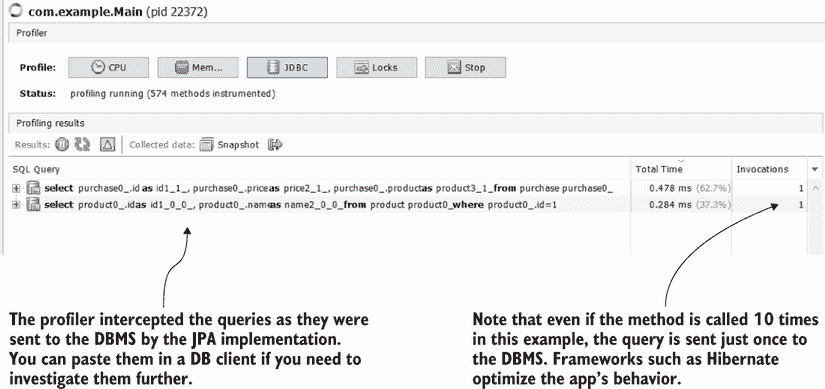

图 7.13 即使在使用框架时，分析器仍然可以拦截 SQL 查询。这使得调查变得容易得多，因为您不能像使用 JDBC 和原生查询那样直接从代码中复制查询。

查询只执行一次，即使方法被调用了 10 次。持久化框架通常会做这类技巧吗？虽然它们很聪明，但有时它们在幕后所做的事情可能会增加复杂性。此外，如果有人没有正确理解框架，可能会编写出导致问题的代码。这也是使用分析器检查框架生成的查询并确保应用程序按预期工作的重要原因。

我遇到的大多数需要调查的框架问题如下：

+   *慢查询导致的延迟*——使用分析器检查执行时间很容易发现

+   *框架生成的多个不必要的查询*（通常由开发人员称为 N+1 查询问题引起）——使用分析器确定查询执行次数很容易发现

+   *由糟糕的应用程序设计生成的长事务提交*——使用 CPU 分析很容易发现

当框架需要从多个表中获取数据时，它通常知道要组合一个查询并在一次调用中获取所有数据。然而，如果您没有正确使用框架，它可能只使用初始查询获取部分数据，然后，对于最初检索到的每条记录，运行一个单独的查询。因此，而不是只运行一个查询，框架将发送一个初始查询加上*N*个其他查询（一个用于第一次查询检索到的*N*条记录中的每一条）；我们称这种情况为*N+1 查询问题*，这通常通过执行多个查询而不是一个查询来创建显著的延迟。

大多数开发人员似乎都倾向于使用日志或调试器来调查这类问题。但根据我的经验，这两种方法都不是确定问题根本原因的最佳选择。

使用日志处理此类情况的首要问题是难以确定哪个查询导致了问题。在现实场景中，应用程序可能会发送数十个查询——其中一些多次执行，而且在大多数情况下，它们都很长并且使用了大量参数。使用性能分析器，它以列表形式显示所有查询及其执行时间和执行次数，你可以几乎瞬间发现问题。第二个问题是，即使你确定了可能引起问题的查询（比如说，在监控日志时，你观察到应用程序执行某个查询需要很长时间），直接运行该查询也不是一件简单的事情。在日志中，你发现参数与查询是分开的。

你可以通过向 da-ch7-ex3 文件的应用程序属性中添加一些参数来配置应用程序以打印 Hibernate 生成的查询：

```
spring.jpa.show-sql=true
spring.jpa.properties.hibernate.format_sql=true
logging.level.org.hibernate.type.descriptor.sql=trace
```

注意，你必须使用不同的方式来配置日志，具体取决于你用来实现应用程序的技术。在本书提供的示例中，我们使用 Spring Boot 和 Hibernate。下面的列表显示了应用程序如何在日志中打印查询。

列表 7.5 Hibernate 发送的本地查询日志

```
Hibernate: 
    Select                                                                    ❶
        product0_.id as id1_0_0_,    
        product0_.name as name2_0_0_    
    from
        product product0_ 
    where
        product0_.id=?

2021-10-16 13:57:26.566 TRACE 9512 --- [nio-8080-exec-2]                      ❷
➥ o.h.type.descriptor.sql.BasicBinder      : binding parameter [1] as        ❷
➥ [INTEGER] - [1]                                                            ❷
2021-10-16 13:57:26.568 TRACE 9512 --- [nio-8080-exec-2]                      ❸
➥ o.h.type.descriptor.sql.BasicExtractor   : extracted value ([name2_0_0_] : ❸
➥ [VARCHAR]) - [Chocolate]                                                   ❸
```

❶ 应用程序生成的查询

❷ 第一个参数的值

❸ 第二个参数的值

日志显示查询并给出查询的输入和输出。但如果你想单独运行它，你需要将参数值绑定到查询上。而且，当多个查询被记录时，寻找所需内容可能会非常令人沮丧。日志也不会显示应用程序的哪个部分运行了查询，这可能会使你的调查更加困难。

我建议你在调查延迟问题时始终从性能分析器开始。你的第一步应该是采样。当你怀疑与 SQL 查询相关的问题时，继续对 JDBC 进行性能分析。然后，问题将容易理解，你可以根据需要使用调试器或日志来确认你的猜测。


### 7.3.3 使用性能分析器获取编程生成的 SQL 查询

为了完整性，让我们再举一个例子，演示当应用程序以编程方式定义查询时，性能分析器是如何工作的。我们将调查一个由 Hibernate（我们示例中使用的框架）生成的查询在应用程序中使用 *criteria 查询*（一种使用 Hibernate 定义应用程序持久层的编程方式）时的性能问题。你永远不会使用这种方法编写查询，无论是原生的还是 JPQL。

正如列表 7.6 所示，它展示了使用条件查询重新实现的 `ProductRepository` 类，这种方法更冗长。通常认为它更难，并且更容易出错。项目 da-ch7-ex4 中的实现包含一个错误，这可能导致现实世界应用程序中出现重大的性能问题。让我们看看我们能否找到这个问题，并确定分析器如何帮助我们理解出了什么问题。

列表 7.6 使用条件查询定义的存储库

```
public class ProductRepository {

  private final EntityManager entityManager;

  public ProductRepository(EntityManager entityManager) {
    this.entityManager = entityManager;
  }

  public Product findById(int id) {
    CriteriaBuilder cb = entityManager.getCriteriaBuilder();
    CriteriaQuery<Product> cq = cb.createQuery(Product.class);   ❶

    Root<Product> product = cq.from(Product.class);              ❷
    cq.select(product);                                          ❸

    Predicate idPredicate = 
      cb.equal(cq.from(Product.class).get("id"), id);            ❹
    cq.where(idPredicate);                                       ❺

    TypedQuery<Product> query = entityManager.createQuery(cq);
    return query.getSingleResult();                              ❻
  }
}
```

❶ 创建一个新的查询

❷ 指定查询选择产品

❸ 选择产品

❹ 在下一行定义成为 where 子句一部分的条件

❺ 定义 where 子句

❻ 运行查询并提取结果

我们使用 JDBC 分析来拦截应用程序发送给 DBMS 的查询。你可以看到它包含产品表与自身的交叉连接（图 7.14）。这是一个大问题！在我们的表中只有 10 条记录时，我们没有观察到任何可疑之处。但在现实世界的应用程序中，表会有更多的记录，这个交叉连接将创建巨大的延迟，最终甚至产生错误的输出（重复的行）。简单地使用 VisualVM 拦截查询并读取它就能显示问题。

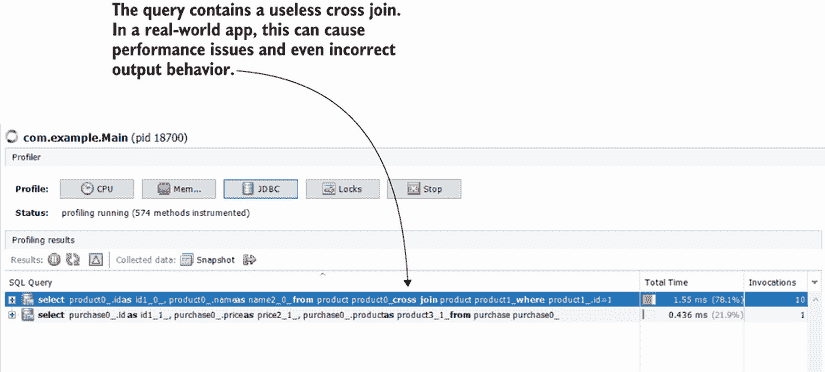

图 7.14 分析器可以通过 JDBC 驱动程序拦截发送给 DBMS 的任何 SQL 查询。在这里，我们发现了生成的查询中的一个问题——一个不必要的交叉连接，它会导致性能问题。

下一个问题，“为什么应用程序以这种方式生成查询？” 我喜欢关于 JPA 实现，如 Hibernate 的说法：“好事是它们使查询生成透明并最小化工作。坏事是它们使查询生成透明，使应用程序更容易出错。” 当与这样的框架一起工作时，我通常建议开发者在开发过程中分析查询，以便提前发现此类问题。使用分析器更多的是为了审计目的，而不是寻找问题，但这样做是一个良好的安全措施。

在下面的例子中，我故意引入了这个具有重大影响的小错误。我两次调用了 `from()` 方法，指示 Hibernate 进行交叉连接。

列表 7.7 交叉连接问题的原因

```
public class ProductRepository {

  // Omitted code

  public Product findById(int id) {
    CriteriaBuilder cb = entityManager.getCriteriaBuilder();
    CriteriaQuery<Product> cq = cb.createQuery(Product.class);   

    Root<Product> product = cq.from(Product.class);    ❶
    cq.select(product);     

    Predicate idPredicate = cb.equal(
      cq.from(Product.class).get("id"), id);           ❷
    cq.where(idPredicate);     

    TypedQuery<Product> query = entityManager.createQuery(cq);
    return query.getSingleResult();     
  }
}
```

❶ 只调用一次 CriteriaQuery 的 from() 方法

❷ 再次调用 CriteriaQuery 的 from() 方法

解决这个问题很简单：使用产品实例而不是在第二次调用 `CriteriaQuery` 的 `from()` 方法，如下所示。

列表 7.8 修正交叉连接问题

```
public class ProductRepository {

  // Omitted code

  public Product findById(int id) {
    CriteriaBuilder cb = entityManager.getCriteriaBuilder();
    CriteriaQuery<Product> cq = cb.createQuery(Product.class);   

    Root<Product> product = cq.from(Product.class);      
    cq.select(product);     

    Predicate idPredicate = cb.equal(product.get("id"), id);    ❶
    cq.where(idPredicate);     

    TypedQuery<Product> query = entityManager.createQuery(cq);
    return query.getSingleResult();     
  }
}
```

❶ 使用已经存在的 Root 对象。

一旦你做出这个小的改动，生成的 SQL 查询将不再包含不必要的交叉连接（图 7.15）。然而，应用程序仍然多次运行相同的查询，这并不理想。应用程序运行的计算算法应该重构以获取数据，最好只使用一个查询。

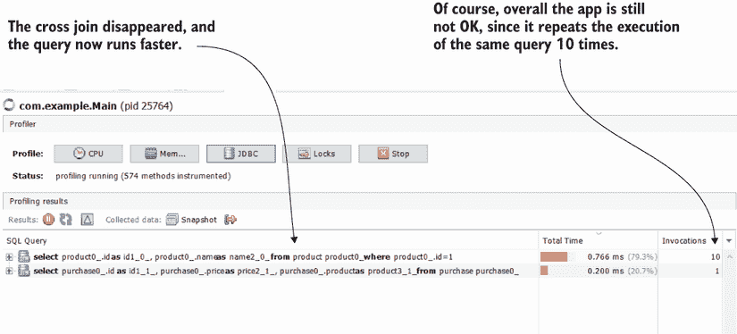

图 7.15 通过消除辅助的 `select()` 方法调用，交叉连接消失了。然而，这个应用程序的整体算法应该进行修订，因为它仍然多次运行相同的查询，这并不理想。

## 摘要

+   分析器拦截应用程序的执行并提供有关正在执行代码的基本细节，例如每个线程的执行堆栈跟踪、每个方法执行所需的时间以及某个特定方法被调用的次数。

+   在调查延迟问题时，使用分析器的第一步是采样——这是分析器拦截正在执行代码的一种方式，而不需要获取很多细节。采样资源消耗较少，并允许您观察执行的总体情况。

+   样本提供三个基本细节：

    +   *执行了什么代码*——在调查问题时，有时您不知道代码的哪个部分被执行，您可以通过采样找到这个方面。

    +   *每个方法的总执行时间*——这个细节有助于您确定代码的哪个部分可能导致潜在的延迟问题。

    +   *总 CPU 执行时间*——这个细节有助于您确定代码是否将执行时间花在“工作”还是等待某事上。

+   有时采样就足以了解问题的来源。但在许多情况下，您需要更多细节。您可以通过分析执行来获取这些细节。

+   分析是一个资源消耗的过程。在现实世界的应用程序中，几乎总是不可能分析整个代码库。因此，当分析细节时，您应该过滤特定的包和类，这些包和类是您想要集中调查的对象。通常，您可以通过首先采样执行来确定应用程序的哪个部分需要关注。

+   通过分析获得的必要细节是方法调用的次数。在采样时，您知道方法执行的总时间，但不知道它被调用的频率。这个方面在识别运行缓慢或使用错误的方法时非常重要。

+   您可以使用分析器来获取应用程序发送给数据库管理系统的 SQL 查询。分析器拦截任何查询，无论应用程序的持久层使用什么技术实现。这对于调查使用框架（如 Hibernate）与数据库交互的应用程序的慢查询非常有价值。
