# 8 使用高级可视化工具分析剖析数据

本章涵盖

+   检测与关系型数据库连接的问题

+   使用调用图更快地理解应用程序的设计

+   使用火焰图更轻松地可视化应用程序的执行

+   分析应用程序发送到 NoSQL 数据库服务器的查询

本章讨论了一些有价值的技巧，这些技巧可以在调查特定场景时使生活变得更轻松。我们首先通过检查 Java 应用程序与关系型数据库服务器之间连接问题的方法来开始本章。我们在第七章中已经讨论了 SQL 查询的剖析，但有时当应用程序与 DBMS 建立通信时会出现问题。这种情况下，应用程序甚至可能完全无响应，因此找到这种问题的原因至关重要。

在第 8.2 节中，我将向您展示我最喜欢的理解给定执行场景背后代码的方法之一——使用调用图的一个简单方法，调用图是应用程序对象之间依赖关系的视觉表示。我发现调用图很有帮助，尤其是在处理我以前从未见过的混乱代码时。鉴于我相信大多数开发者在职业生涯的某个阶段都必须处理混乱的代码库，了解这种方法将是有帮助的。

第七章讨论了可视化应用程序执行的最常用方法之一——执行栈。您学习了如何使用 VisualVM 进行采样或剖析时生成执行栈，以及如何使用它来识别执行延迟。在第 8.3 节中，我们将使用执行栈的不同表示：火焰图。火焰图是一种可视化应用程序执行的方法，它侧重于执行代码和执行时间。从额外的角度查看相同的数据有时可以帮助您更容易地找到您正在寻找的内容。正如您将在第 8.3 节中学习的，火焰图为您提供了应用程序执行的另一种视角，这有助于您识别潜在的延迟和性能问题。在第 8.4 节中，我们将讨论分析应用程序的持久层如何工作的技术，当它不使用关系型数据库，而是使用我们所说的“NoSQL 技术家族”中的不同持久化方法时。 

对于本章中讨论的主题，VisualVM 是不够的。VisualVM 是一个出色的免费工具，我在使用剖析器调查的 90%以上的场景中都使用它，但它有其局限性。

为了展示本章中讨论的功能，我们将使用 JProfiler ([` mng.bz/RvVn`](http://mng.bz/RvVn))，这是一个授权的剖析器。JProfiler 提供了我们与 VisualVM 讨论的所有内容，但它还具备 VisualVM 没有的功能（以一个小价格）。您可以使用软件提供的试用版来尝试剖析本书中使用的示例，并形成自己对 VisualVM 和 JProfiler 之间差异的看法。

## 8.1 检测 JDBC 连接的问题

我们在第七章中讨论了使用 SQL 查询调查问题的许多细节。但是，一个应用与 DBMS 之间发送查询所需的连接是怎样的呢？忽视连接管理可能会导致问题，在本节中，我们将讨论这些问题以及如何找到它们的根本原因。

有些人可能会争论，应用使用框架和库来处理大多数情况下的连接管理，因此这类问题不再发生。然而，经验告诉我，这些问题仍然存在，主要是因为开发者依赖于许多事情自动完成。有时我们应该使用更不常见且更底层的实现，而不是依赖于框架提供的功能，大多数这类问题都发生在这里。

让我给你讲一个我最近不得不处理的问题的故事。在一个特定的服务（使用 Spring 实现）中，开发者必须实现一个不太常见的功能：一种取消存储过程（在数据库级别运行的过程）执行的方法。实现并不复杂，但它需要直接访问连接对象。在大多数情况下，允许 Spring 在幕后使用连接就足够了。Spring 是一个健壮的框架，易于定制，你可以轻松访问它管理的连接，但它在你访问它们之后仍然管理这些连接吗？答案是有时。而这个“有时”就是事情变得有趣（同时也更具挑战性）的原因。

开发者发现，在 Spring 管理事务的标准方法执行中，框架也会在结束时关闭连接。该过程是通过 Spring Batch 实现的批处理方法取消的。在这种情况下，框架不会关闭连接；你必须自己管理它们。开发者在这两种情况下都使用了相同的方法，但没有意识到在其中一个情况下连接没有被正确关闭，这可能会造成大问题。幸运的是，开发错误及时发现，没有造成损害。

这个故事展示了为什么本节中你将学习的技巧仍然相关。你使用的框架名称并不重要，你可能永远不知道幕后发生的一切，所以准备好以任何方式调查你的应用执行始终是相关的。

我们将使用书中提供的项目 da-ch8-ex1。这个项目定义了一个简单的应用，它有一个巨大的问题：它的一个方法“忘记”关闭它打开的 JDBC 连接。应用创建一个 JDBC 连接以向 DBMS 发送 SQL 查询。一旦应用不再需要这些连接，就必须始终关闭 JDBC 连接。所有 DBMS 都向客户端（即应用）提供获取有限数量连接的能力（通常数量很少，如 100）。当应用打开所有这些连接但又不关闭它们时，它就无法连接到数据库服务器（图 8.1）。

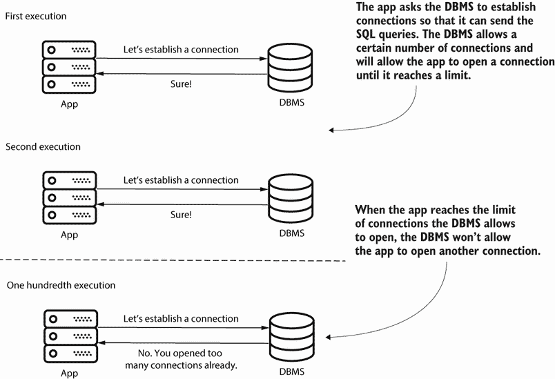

图 8.1 数据库管理系统允许应用打开有限且通常数量较小的连接。当应用达到可以打开的连接限制时，数据库管理系统不允许应用打开其他连接。在这种情况下，应用可能无法执行其工作。

数据库管理系统并不总是提供精确的 100 个连接。这个数字可以在数据库级别进行配置。当与数据库一起工作时，最好找到（通常通过询问数据库管理员）应用可以打开的最大连接数。

注意：为了简化我们的演示，我们将使用一个持久层，该层限制连接数为 10。


让我们开始项目 da-ch8-ex1 并分析应用的行为。该项目定义了一个简单的应用，该应用在数据库中存储有关产品的详细信息。应用在`/products`路径上公开一个端点。通过调用端点，应用返回基于其数据库中存储的数据的详细信息。当你第一次调用端点时，应用几乎立即响应。但是当你向同一端点发送第二个请求时，应用在 30 秒后响应并显示一个错误信息，如图 8.2 所示。

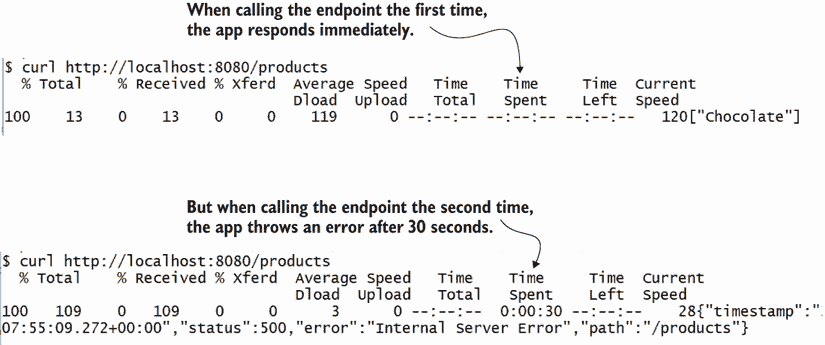

图 8.2 当第一次调用`/products`端点时，应用立即响应，返回包含单词“巧克力”的列表。但是当你尝试第二次调用该端点时，应用似乎卡住了大约 30 秒，然后显示一个错误信息。

应用实际执行的操作对我们演示来说并不重要，所以我就不会深入讨论其功能细节了，但想象一下，一个在独立项目上工作的朋友向你求助并展示了这样的问题。他们没有提供太多关于他们的应用如何工作的细节（在现实世界的应用中，这可能是一个复杂的企业案例）。你还能帮助他们吗？我们首先分析他们向我们展示的行为。

我们想要找出导致问题行为的原因。你查看日志并立即怀疑问题与 JDBC 连接有关。下面的代码片段中显示的异常信息告诉你，应用无法建立连接，很可能是由于数据库管理系统不允许打开其他连接。但让我们假设我们并不能总是依赖日志。最终，我们无法确定是否是应用使用的另一个框架或库生成了直接的异常信息：

```
java.sql.SQLTransientConnectionException: 
➥ HikariPool-1 - Connection is not available, 
➥ request timed out after 30014ms.                ❶
     at com.zaxxer.hikari.pool.HikariPool
     ➥ .createTimeoutException(HikariPool.java:696) at 
     ➥ com.zaxxer.hikari.pool.HikariPool
     ➥ .getConnection(HikariPool.java:197)
     at [CA]com.zaxxer.hikari.pool.HikariPool
     ➥ .getConnection(HikariPool.java:162)
     at [CA]com.zaxxer.hikari.HikariDataSource
     ➥ .getConnection(HikariDataSource.java:128)
     at [CA]com.example.repositories.PurchaseRepository
     ➥ .findAll(PurchaseRepository.java:31)
     at [CA]com.example.repositories.PurchaseRepository
➥ $$FastClassBySpringCGLIB$$d661c9a0.invoke(<generated>)
```

❶ 异常信息

正如我在第七章中建议的，每次性能分析调查都应该从采样开始，这为你提供了执行概述和继续研究所需的详细信息。如果你使用了 VisualVM，采样结果将类似于图 8.3。

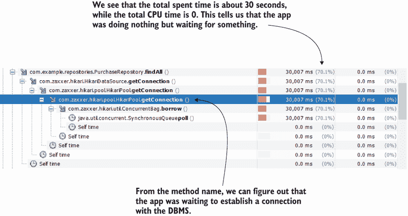

图 8.3 在采样执行后，我们有更多理由怀疑与数据库管理系统建立连接存在问题。在执行堆栈中，我们看到应用程序等待了 30 秒来获取连接。

在采样并观察日志中的异常堆栈跟踪后，我们知道我们的应用程序在连接到数据库管理系统时存在问题。但造成这个问题的原因可能是什么？这可能是两件事之一：

+   应用程序与数据库管理系统之间的通信失败是由于某些基础设施或网络问题。

+   数据库管理系统不愿意为我们应用程序提供连接：

    +   因为认证问题

    +   因为应用程序已经消耗了数据库管理系统可以提供的所有连接

由于在我们的情况下，问题总是在第二次发送请求时发生（有一个定义的模式可以重现它），我们可以排除通信问题。这必须是数据库管理系统没有提供连接。但由于第一次调用工作良好，这不可能是一个认证问题。不太可能凭据发生了变化，所以最有可能的原因是我们应用程序有时没有关闭连接。现在我们只需要找到这种情况发生的地方。记住，遇到问题的方法不一定是导致问题的方法。可能这个方法是“不幸”的那个，在其他人“吃掉”所有其他连接之后尝试获取连接。

但是，使用 VisualVM，您不能明确地调查 JDBC 连接，因此我们无法使用它来识别哪个连接保持打开状态。相反，我们将继续使用 JProfiler 进行调查。将 JProfiler 附加到正在运行的 Java 进程与使用 VisualVM 非常相似。让我们一步一步地遵循这种方法。

首先，在 JProfiler 主窗口的左上角选择“开始中心”，如图 8.4 所示。

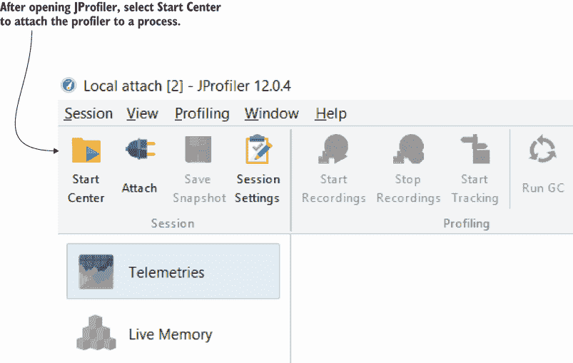

图 8.4 通过选择 JProfiler 窗口左上角的“开始中心”菜单，使用 JProfiler 开始采样或性能分析会话。

出现一个弹出窗口（图 8.5），您可以在左侧选择快速附加以获取所有本地运行的 Java 进程的列表。选择您想要分析的过程，然后选择开始。就像 VisualVM 一样，您可以通过主类的名称或进程 ID（PID）来识别进程。

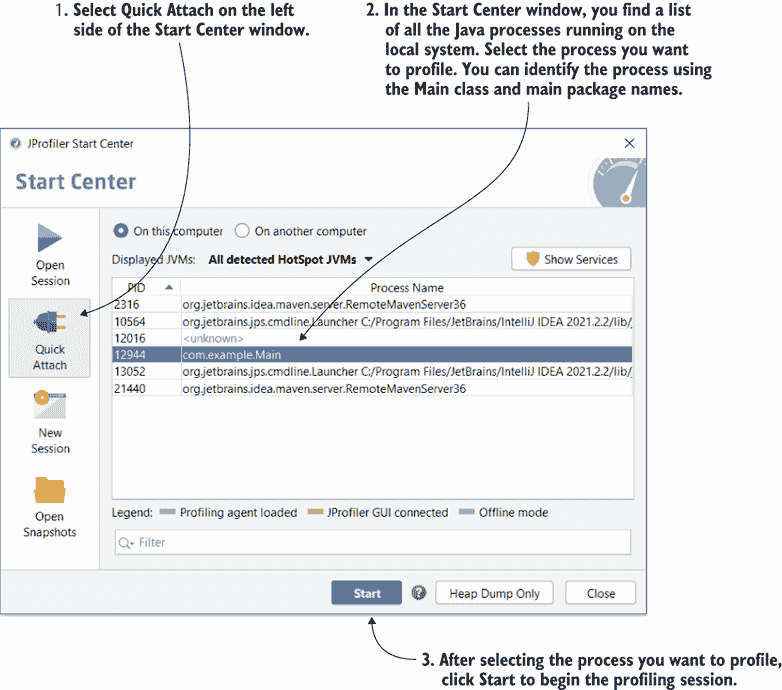

图 8.5 在弹出窗口中，选择快速附加，并在列表中选择您想要分析的过程。然后选择开始按钮以开始性能分析会话。

JProfiler 会询问您是否想要使用采样或仪器（仪器相当于我们所说的使用 VisualVM 进行性能分析），如图 8.6 所示。我们选择仪器，因为我们使用性能分析器来获取 JDBC 连接的详细信息，因此希望更深入地分析执行过程。

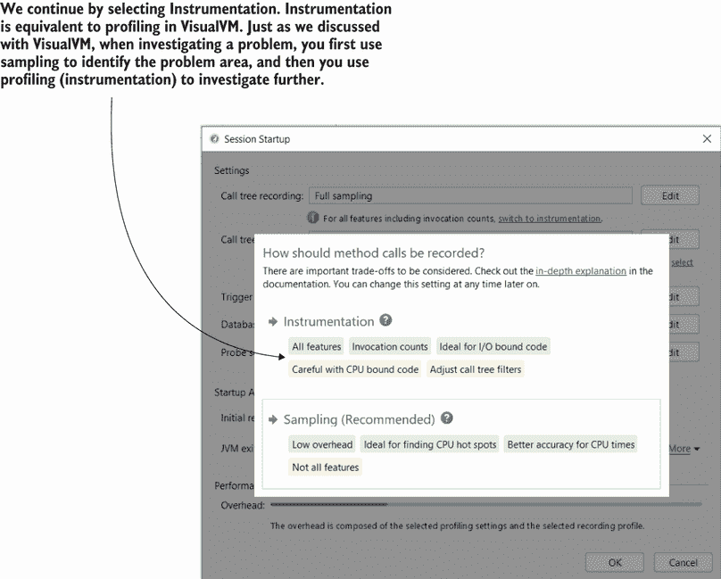

图 8.6 为了更深入地分析执行情况，我们需要选择工具，这在 VisualVM 中相当于我们所说的分析。

在左侧菜单的数据库下，选择 JDBC。然后按照图 8.7 所示开始 JDBC 分析。


图 8.7 使用 JProfiler 开始 JDBC 分析，首先在左侧菜单中选择 JDBC；然后开始分析过程。

一旦开始分析，我们最感兴趣的两个标签页是连接和连接泄漏（图 8.8）。这些标签页显示了应用程序打开到 DBMS 的连接的详细信息，我们将使用它们来识别问题的根本原因。

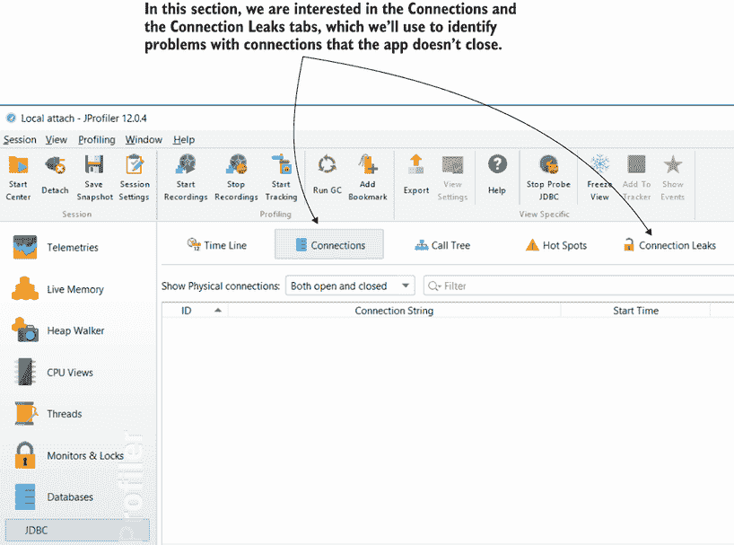

图 8.8  连接和连接泄漏标签页显示了应用程序创建的连接的详细信息，包括潜在的问题连接。我们将使用这些详细信息来了解我们应用程序中问题的来源。

现在是时候重现问题并分析执行情况了。向`/products`端点发送请求，看看会发生什么。连接标签页显示，正如图 8.9 所示，创建了多个连接。由于我们不知道应用程序做了什么，所以许多连接并不一定意味着问题。但我们期望应用程序在需要时关闭这些连接。我们需要弄清楚的是，应用程序是否正确地关闭了这些连接。

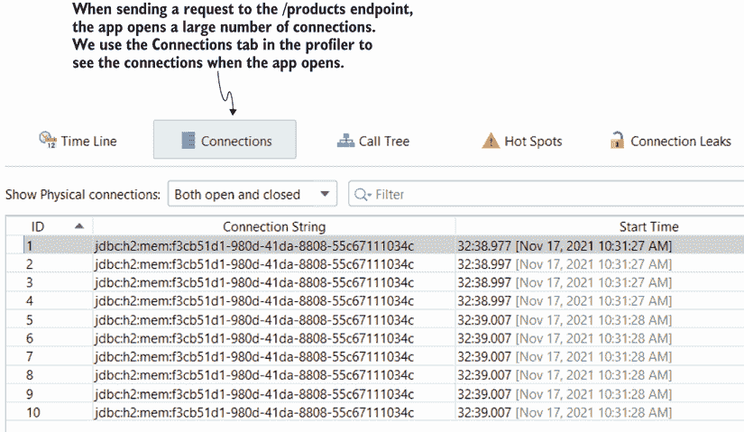

图 8.9  连接泄漏标签页证实了我们的怀疑（图 8.10）；通过向`/products`端点发送请求，我们看到应用程序创建了多个连接。我们不知道应用程序具体做了什么，但这可能令人担忧。

打开许多连接，但连接在端点响应后长时间未关闭。这是连接泄漏的明显迹象。如果我们没有明确启动 CPU 分析（我稍后会展示如何进行），你只能看到创建连接的线程名称。有时线程名称就足够了，在这种情况下，你甚至不需要启动 CPU 分析。然而，在这种情况下，它并不能提供足够的信息来识别创建连接的代码。

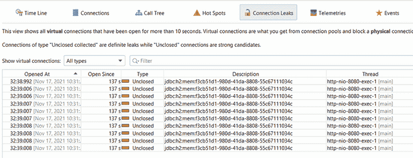

图 8.10 连接泄漏标签页显示了每个连接的状态。我们关注的是关闭晚或从未关闭的连接。在这里，应用程序打开的连接在端点向客户端发送响应后仍然存活很长时间，这强烈表明存在问题。

但这还不够，是吗？我们怀疑应用程序获取 DBMS 连接时可能存在问题。现在我们需要使用分析器的 CPU 分析功能来识别代码库中创建连接并忘记关闭它们的部分。

我们仍然需要一种方法来识别创建泄漏连接的代码。幸运的是，JProfiler 也可以帮助我们做到这一点，但我们需要在启用 CPU 分析后重新进行练习。在 CPU 分析激活时，JProfiler 将为每个泄漏连接显示创建连接的方法的堆栈跟踪。

图 8.11 展示了如何启用 CPU 分析以及如何找到每个泄漏连接的堆栈跟踪。

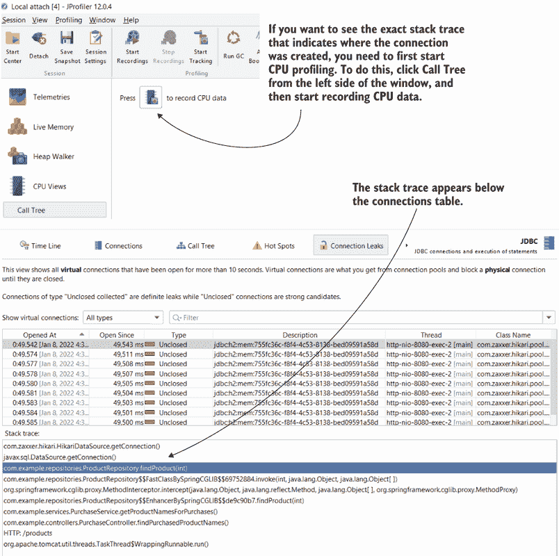

图 8.11 启用 CPU 分析后，JProfiler 显示堆栈跟踪，这有助于你确定哪个应用程序代码部分创建了泄漏连接。

让我们直接查看我们的示例 da-ch8-ex1 中的代码。我们观察到该方法确实创建了一个似乎在任何地方都没有关闭的连接。我们找到了根本原因！

列表 8.1 识别问题根本原因

```
public Product findProduct(int id) throws SQLException {
    String sql = "SELECT * FROM product WHERE id = ?";

    Connection con = dataSource.getConnection();                   ❶
    try (PreparedStatement statement = con.prepareStatement(sql)) {
      statement.setInt(1, id);
      ResultSet result = statement.executeQuery();

      if (result.next()) {
        Product p = new Product();
        p.setId(result.getInt("id"));
        p.setName(result.getString("name"));
        return p;
      }
    }
    return null;
  }
```

❶ 这行代码创建了一个永远不会关闭的连接。

项目 da-ch8-ex2 修复了代码。通过将连接添加到`try-with-resources`块中，应用程序将在`try`块结束时关闭连接，当连接不再需要时。

列表 8.2 通过关闭连接解决问题

```
  public Product findProduct(int id) throws SQLException {
    String sql = "SELECT * FROM product WHERE id = ?";

    try (Connection con = dataSource.getConnection();              ❶
         PreparedStatement statement = con.prepareStatement(sql)) {
      statement.setInt(1, id);
      ResultSet result = statement.executeQuery();

      if (result.next()) {
        Product p = new Product();
        p.setId(result.getInt("id"));
        p.setName(result.getString("name"));
        return p;
      }
    }
    return null;
  }
```

❶ 连接在`try-with-resources`块中声明，在`try`块结束时关闭连接。

在应用修正后，我们可以再次对应用程序进行分析。现在，JProfiler 中的连接选项卡显示只创建了一个连接，连接泄漏选项卡为空，确认问题确实得到了解决（图 8.12）。当你测试应用程序时，你也会看到你可以向`/products`端点发送多个请求。

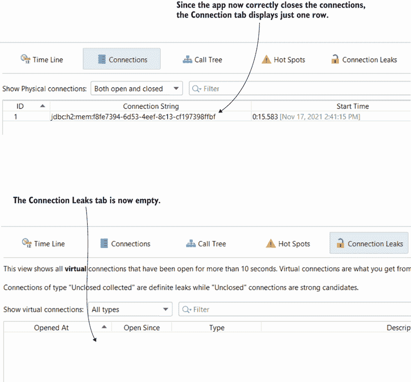

图 8.12 修复错误后，我们使用 JProfiler 确认没有更多的连接泄漏。我们观察到应用程序一次只打开一个连接，并在不再需要时正确关闭连接。连接泄漏选项卡没有显示其他故障连接。

你是否想知道在现实场景中避免此类问题的最佳实践是什么？我建议开发者每次实现或修复错误后花大约 10 分钟的时间，使用分析器测试他们所工作的功能。这种做法可以帮助在开发的早期阶段识别由错误的查询或错误连接管理引起的延迟问题。

## 8.2 使用调用图理解应用程序的代码设计

在本节中，我们讨论了我最喜欢的一种理解应用程序类设计的技术：将执行过程可视化为一个调用图。这项技术在处理混乱的代码时特别有帮助，这是与新的应用程序一起工作的一个可能结果。

到目前为止，我们已使用堆栈跟踪来理解执行。执行堆栈跟踪是有价值的工具，我们已经看到了我们可以用它们做什么。它们之所以有用，是因为它们以直观的文本方式表示，这使得它们可以打印在日志中（通常作为异常堆栈跟踪）。但从视觉角度来看，它们在快速识别对象和方法调用之间的关系方面并不出色。调用图是表示分析器收集数据的不同方式，并且更多地关注对象和方法调用之间的关系。

为了演示如何获取调用图，我们将使用书中提供的示例 da-ch8-ex2 来演示如何使用调用图快速了解哪些对象和方法在执行背后起作用，而无需分析代码。当然，这并不是要完全避免代码；你最终仍然需要深入代码，但通过首先使用调用图，你将有一个更好的初步了解发生了什么。

我们将继续使用 JProfiler 进行演示。由于调用图是表示 CPU 分析数据的一种方式，我们首先需要开始 CPU 分析。图 8.13 显示了如何开始 CPU 分析，这将导致堆栈跟踪（在 JProfiler 中称为*调用树*）。我们将研究调用应用程序公开的`/products`端点时会发生什么。

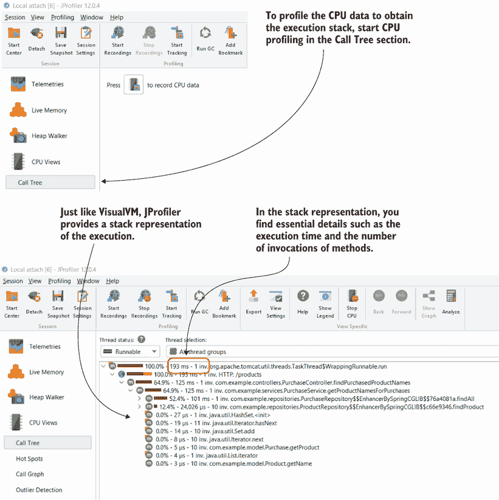

图 8.13 从左侧菜单中选择调用树以开始分析 CPU（记录 CPU 数据）。向`/products`端点发送请求，分析器最初将记录的数据显示为堆栈跟踪，包括调用次数和执行时间的详细信息。

右键单击堆栈跟踪中的一行，然后选择显示调用图，以将收集的执行数据可视化为调用图（图 8.14）。

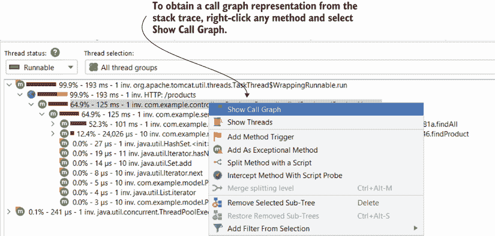

图 8.14 要从执行堆栈跟踪中获取调用图表示，右键单击堆栈跟踪中的一行，然后选择显示调用图。

JProfiler 将生成一个调用图表示，重点关注在生成调用图时所选行的定义的方法。最初，你只知道这个方法是从哪里被调用的以及这个方法调用了什么。你可以进一步导航并观察整个调用链（图 8.15）。调用图还提供了关于执行时间和调用次数的详细信息，但它的主要焦点是对象和方法调用之间的关系。

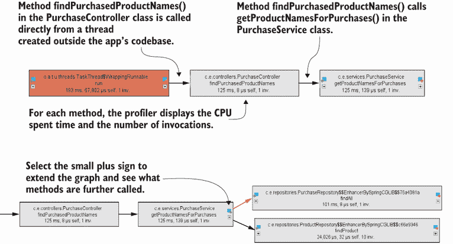

图 8.15 调用图显示了执行情况，主要关注对象和方法调用之间的关系。你可以线性地导航方法执行链，以确定每个方法是从哪里被调用的以及该方法调用了什么。调用图还显示了应用程序代码库中的对象和方法，以及应用程序使用的库和框架中的对象和方法。

## 8.3 使用火焰图查找性能问题

另一种可视化已分析执行的方法是使用*火焰图*。如果调用图关注对象和方法调用之间的关系，那么火焰图在识别潜在延迟方面最有帮助。它们只是以不同的方式查看方法执行栈提供相同细节的一种方式，但正如章节引言中提到的，相同数据的其他表示可能有助于识别特定信息。

我们将继续使用示例 da-ch8-ex2 进行演示。我们将使用 JProfiler 将执行栈表示更改为火焰图，并讨论新表示的优点。

在第 8.1 节和第 8.2 节中讨论了生成调用树之后，您可以使用菜单栏上的“分析”项将其更改为火焰图，如图 8.16 所示。

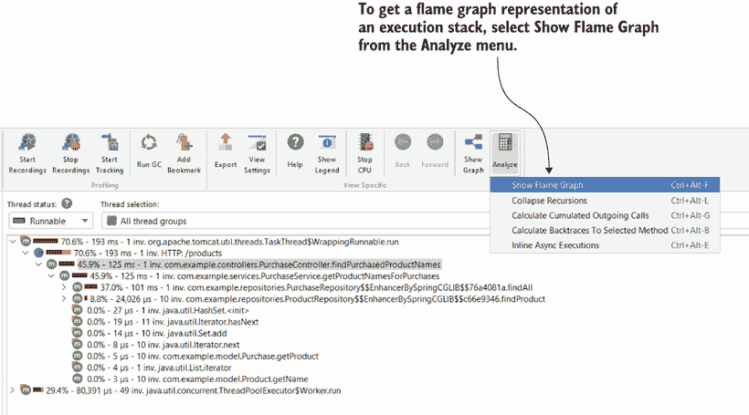

图 8.16 要将执行栈（调用树）更改为火焰图，请在菜单中选择“分析”，然后选择“显示火焰图”。

火焰图是一种将执行树表示为栈的方式。这个花哨的名字是因为这个图通常看起来像火焰。这个栈的第一层是线程执行的第一个方法。然后，每一层以上的方法都是由下面一层调用的。图 8.17 展示了为图 8.16 中的执行树创建的火焰图。

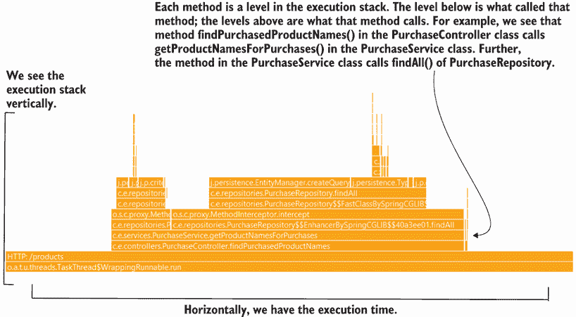

图 8.17 火焰图是执行跟踪的栈表示。每一层显示的是下面一层调用的方法。栈的第一层（底部）是线程的开始。这样，我们垂直地看到执行栈，而火焰图水平地表示每一层相对于下面一层花费的时间。

一个方法可以调用多个其他方法。在火焰图中，被调用的方法将出现在同一层。在这种情况下，每个方法的长度是相对于调用它的方法（下面一层）花费的时间。在图 8.17 中，您可以看到`ProductRepository`类中的`findById()`方法和`PurchaseRepository`类中的`findAll()`方法都是从`ProductService`类中的`getProductNamesForPurchases()`方法调用的。

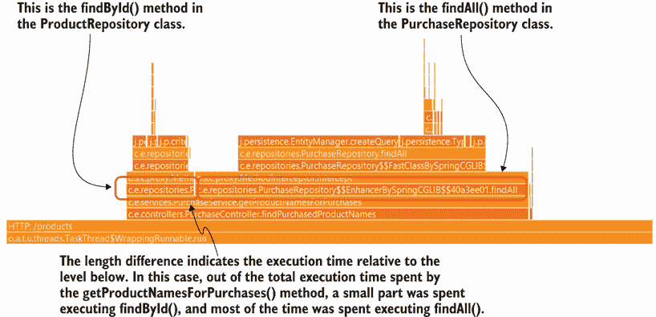

图 8.18 当多个方法共享同一层时，它们都是由下面的方法调用的。表示长度的总和等于下面方法的长度。每个方法的长度是相对于总执行时间的相对表示。在这种情况下，`findAll()`的执行时间比`findById()`长得多。

在图 8.18 中，我们观察到`ProductService`类中的`getProductNamesForPurchases()`是`ProductRepository`类中的`findById()`方法和`PurchaseRepository`类中的`findAll()`方法的底层。此外，`findById()`和`findAll()`共享相同的层。但请注意，它们的长度并不相同。长度是相对于调用者的执行而言的，因此在这种情况下，`findById()`的执行时间小于`findAll()`的执行时间。

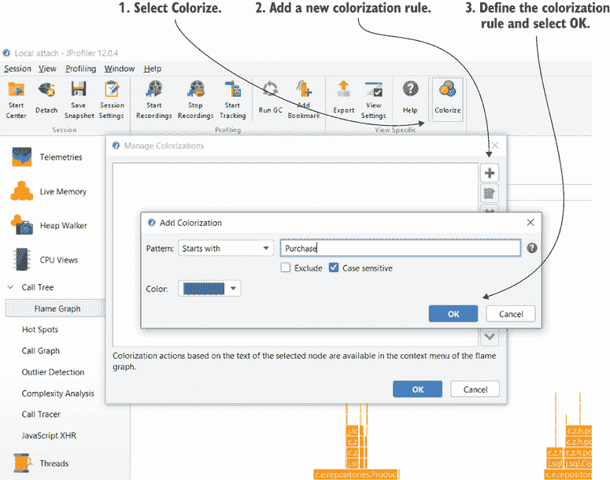

图 8.19 为了使火焰图着色并便于阅读，请使用顶部菜单中的“着色”项添加着色规则。这些规则定义了火焰图中哪些层应该着色以及使用哪种颜色。

你可能已经注意到，在这张图中很容易迷失方向。这只是一个用于学习目的的简单示例；在实际应用程序中，火焰图可能要复杂得多。为了减轻这种复杂性，你可以使用 JProfiler 根据方法、类或包名称着色层。图 8.19 展示了如何使用着色来标记火焰图中的特定层。你使用顶部菜单中的“着色”项添加着色规则。你可以添加多个着色规则来指定哪些层应该着色以及你喜欢的颜色。

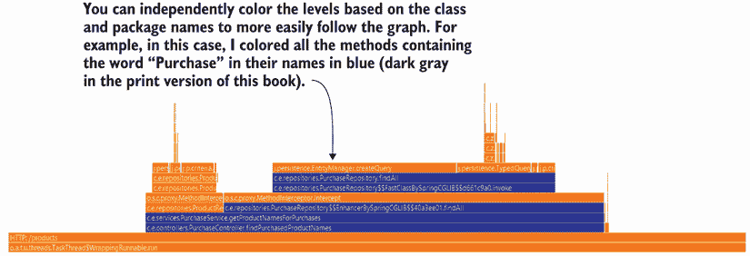

图 8.20 着色层级有助于突出你想要关注的火焰图的特定部分。你可以同时使用多种颜色，这有助于你比较执行时间。

在图 8.20 中，你可以看到我如何突出显示名称中包含“Purchase”一词的方法的层级，并将它们着色为蓝色（本书印刷版中的深灰色）。

## 8.4 分析 NoSQL 数据库上的查询

应用程序通常使用关系型数据库，但在许多情况下，某些实现需要不同的持久化技术。我们称之为*NoSQL 技术*，我们实现的应用程序可以从大量此类实现中选择。其中一些最著名的例子是 MongoDB、Cassandra、Redis 和 Neo4J。一些分析器，如 JProfiler，可以拦截应用程序发送到特定 NoSQL 服务器以与数据库交互的查询。

JProfiler 可以拦截发送到 MongoDB 和 Cassandra 的事件，这些详细信息在调查使用此类持久化实现的应用程序行为时可能有助于节省时间。因此，在本节中，我们将使用一个小应用程序来演示如何使用 JProfiler 观察应用程序与 MongoDB 数据库的交互。

项目 da-ch8-ex3 与 MongoDB 协作。该应用程序实现了一些端点：一个用于在数据库中存储产品详情，另一个用于返回所有先前添加的产品列表。为了简化，产品仅由名称和唯一 ID 表示。

要跟随本节，您首先需要在本地安装一个 MongoDB 服务器，项目 da-ch8-ex3 将连接到该服务器。您可以从官方网站下载并安装 MongoDB Community Server：[`www.mongodb.com/try/download/community`](https://www.mongodb.com/try/download/community)。

一旦安装了服务器，您就可以开始项目 da-ch8-ex3。我们还将把 JProfiler 附加到该进程。要开始监控 MongoDB 事件，请在左侧菜单的“数据库”下选择 MongoDB 部分并开始录制。为了观察 JProfiler 如何呈现事件，我们将调用应用程序公开的两个端点。您可以使用 cURL 命令（如下面的片段所示）或 Postman 等工具调用这两个端点：

```
curl -XPOST http://localhost:8080/product/Beer    ❶

curl  http://localhost:8080/product               ❷
```

❶ 向数据库添加名为“Beer”的产品

❷ 获取数据库中的所有产品

图 8.21 显示了 JProfiler 拦截的两个事件。该工具显示与每个事件相关的堆栈跟踪（调用树）。我们可以获取关于调用次数和执行时间的详细信息。

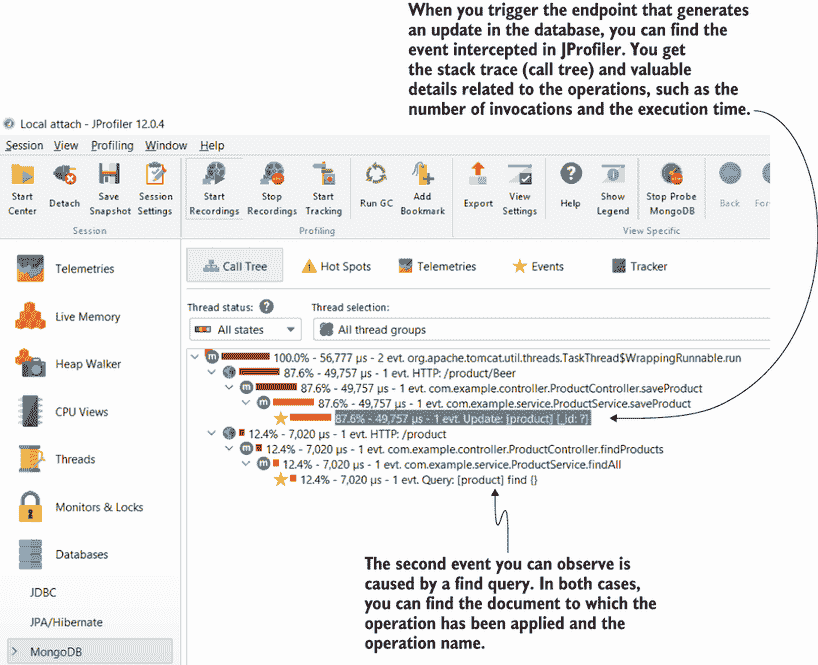

图 8.21 JProfiler 可以拦截应用程序对 NoSQL 数据库执行的操作。在这个例子中，JProfiler 拦截了两个事件：对名为“product”的文档的更新和读取。这样，您可以监控您的应用程序与 NoSQL 数据库之间的交互，并考虑特定操作的调用次数和执行时间。分析器还为您提供特定操作的完整堆栈跟踪，以便您可以快速找到导致特定事件的代码。

## 摘要

+   如 VisualVM 之类的免费工具提供了大量的小部件，可以帮助进行任何调查。但如 JProfiler 之类的授权工具可以通过不同的方式表示调查数据，使调查更加有效。

+   有时应用程序在连接到 DBMS 时会遇到问题。通过使用 JProfiler，您可以更轻松地调查与关系型数据库服务器的 JDBC 连接问题。您可以评估连接是否保持打开状态，并识别代码中“忘记”关闭它们的部分。

+   调用图是可视化执行堆栈的另一种方式，主要关注对象和方法调用之间的关系。因此，调用图是您可以用来更轻松地理解应用程序执行背后的类设计的优秀工具。

+   火焰图提供了可视化分析数据的另一种视角。您可以使用火焰图更容易地发现导致执行延迟和长堆栈跟踪的区域。您可以在火焰图中着色特定的层，以更好地可视化执行。

+   一些授权的工具提供扩展功能，例如调查应用程序之间的通信或您的应用程序与 NoSQL 数据库服务器之间的通信。
