# 9 在多线程架构中调查锁

本章涵盖

+   监控应用程序的线程

+   识别线程锁及其原因

+   分析等待的线程

在本章中，我们讨论了调查利用多线程架构的应用程序执行的方法。通常，开发者发现实现多线程架构是应用程序开发中最具挑战性的事情之一，而使应用程序性能良好又带来了另一个维度的难度。本章中讨论的技术将使你对这类应用程序的执行有更清晰的了解，从而更容易识别问题并优化应用程序的执行。

为了正确理解本章的内容，你需要了解 Java 中线程机制的基础，包括线程状态和同步。为了复习，请阅读附录 D；它不会给你所有关于 Java 中线程和并发的可能知识（那需要自己的书架），但它会提供足够的细节来理解本章的讨论。

## 9.1 监控线程以获取锁

在本节中，我们讨论线程锁以及如何分析它们以发现潜在的问题或优化应用程序执行的机会。"线程锁"是由不同的线程同步方法引起的，通常用于控制多线程架构中事件流的流程。以下是一些例子：

+   一个线程想要防止其他线程在它更改资源时访问该资源。

+   一个线程需要等待另一个线程完成或达到其执行中的某个特定点，然后才能继续其工作。

线程锁是必要的；它们帮助应用程序控制线程。但是实现线程同步留下了很多错误的空间。错误实现的锁可能导致应用程序冻结或性能问题。我们需要使用分析器来确保我们的实现是最优的，并通过最小化锁的时间来使应用程序更高效。

在本节中，我们将使用一个小型应用程序（项目 da-ch9-ex1）来实现一个简单的多线程架构。我们将使用分析器来分析应用程序执行期间的锁。我们想了解线程是否被锁定以及它们的行为如何：

+   哪个线程锁定了另一个

+   线程被锁定的次数

+   线程暂停而不是执行的时间

这些细节使我们能够了解应用程序执行是否优化，以及我们是否有改进应用程序执行的方法。我们用于示例的应用程序实现了两个并发运行的线程：生产者和消费者。生产者生成随机值并将它们添加到列表实例中，而消费者从生产者使用的同一集合中移除值（图 9.1）。

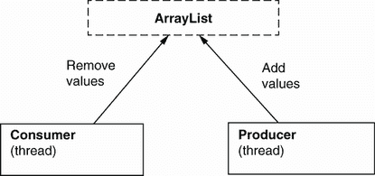

图 9.1 应用程序启动了两个线程，我们称之为“生产者”和“消费者”。这两个线程使用一个公共资源：它们改变`ArrayList`类型的列表实例。生产者生成随机值并将其添加到列表中，而消费者同时移除生产者添加的值。

让我们跟随应用程序在列表 9.1、9.2 和 9.3 中的实现，看看在调查执行时我们可以期待什么。在列表 9.1 中，你可以找到启动两个线程实例的`Main`类。我在启动线程之前让应用程序等待 10 秒钟，这样我们就有时间启动分析器并观察整个线程的时间线。应用程序将线程命名为`_Producer`和`_Consumer`，以便我们在使用分析器时可以轻松识别它们。

列表 9.1 应用程序的`Main`方法，它启动两个线程

```
public class Main {

  private static Logger log = Logger.getLogger(Main.class.getName());

  public static List<Integer> list = new ArrayList<>();

  public static void main(String[] args) {
    try {
      Thread.sleep(10000);                    ❶

      new Producer("_Producer").start();      ❷
      new Consumer("_Consumer").start();      ❸
    } catch (InterruptedException e) {
      log.severe(e.getMessage());
    }
  }
}
```

在开始时等待 10 秒钟，以便程序员开始分析

启动一个生产者线程

启动一个消费者线程

在列表 9.2 中，你可以找到消费者线程的实现。该线程遍历一个包含一百万行代码的代码块（这个数字应该足够让应用程序运行几秒钟，并允许我们使用分析器来获取一些统计数据）。在每次迭代中，线程使用在`Main`类中声明的静态列表实例。消费者线程检查列表中是否有值，并移除列表中的第一个值。实现逻辑的整个代码块都是同步的，使用列表实例本身作为监视器。监视器不会允许多个线程同时进入它保护的同步块。

列表 9.2 消费者线程的定义

```
public class Consumer extends Thread {

  private Logger log = Logger.getLogger(Consumer.class.getName());

  public Consumer(String name) {
    super(name);
  }

  @Override
  public void run() {
    for (int i = 0; i < 1_000_000; i++) {               ❶

      synchronized (Main.list) {                        ❷
        if (Main.list.size() > 0) {                     ❸
          int x = Main.list.get(0);      
          Main.list.remove(0);                          ❹
          log.info("Consumer " +                        ❹❺
                Thread.currentThread().getName() + 
                " removed value " + x);
        }
      }

    }
  }
}
```

在消费者的同步代码块上迭代一百万次

使用在主类中定义的静态列表作为监视器同步代码块

仅当列表不为空时才尝试消费一个值

消费列表中的第一个值并移除该值

记录移除的值

列表 9.3 展示了生产者线程的实现，它与消费者线程的实现非常相似。生产者也会遍历一个包含一百万行代码的代码块。对于每次迭代，生产者生成一个随机值并将其添加到在`Main`类中静态声明的列表中。这个列表就是消费者从中移除值的列表。生产者只有在列表大小小于 100 时才添加新值。

列表 9.3 生产者线程的定义

```
public class Producer extends Thread {

  private Logger log = Logger.getLogger(Producer.class.getName());

  public Producer(String name) {
    super(name);
  }

  @Override
  public void run() {
    Random r = new Random();
    for (int i = 0; i < 1_000_000; i++) {    ❶
      synchronized (Main.list) {             ❷
        if (Main.list.size() < 100) {        ❸
          int x = r.nextInt();               ❹
          Main.list.add(x);                  ❹
          log.info("Producer " +             ❺
                Thread.currentThread().getName() + 
                " added value " + x);
        }
      }
    }
  }
}
```

在生产者的同步代码块上迭代一百万次

使用在主类中定义的静态列表作为监视器同步代码块

仅当列表元素少于 100 个时才添加值

生成一个新的随机值并将其添加到列表中

记录添加到列表中的值

生产者的逻辑也使用列表作为监视器进行同步。这样，一次只有一个线程，即生产者或消费者，可以更改此列表。监视器（列表实例）允许一个线程进入其逻辑，并使另一个线程在其代码块的开始处等待，直到另一个线程完成同步块的执行（图 9.2）。

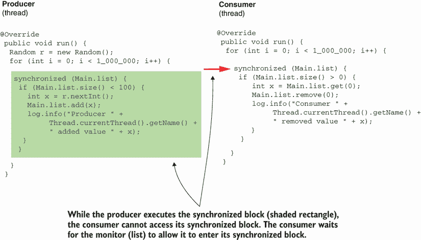

图 9.2 一次只有一个线程可以进入同步代码块。要么是生产者执行其`run()`方法中定义的逻辑，要么是消费者执行其逻辑。

我们能否使用分析器找到这种应用行为和其他关于执行的细节？在现实世界的应用中，代码可能要复杂得多，所以仅通过阅读代码来理解应用的行为，在大多数情况下是不够的。

记住，本书中使用的项目是简化和定制以适应我们讨论的目的。不要将它们视为最佳实践，并在现实世界的应用中直接应用。


让我们使用 VisualVM 来查看在“线程监控”标签页（图 9.3）中这看起来是什么样子。注意颜色（阴影）交替，因为每个线程的大多数代码都是同步的。在大多数情况下，要么是生产者正在运行而消费者等待，要么是消费者正在运行而生产者等待。

这两个线程很少会同时执行代码。由于存在同步块之外的指令，这两个线程可以同时运行以执行代码。这种代码的一个例子是`for`循环，在两种情况下都是在同步块外部定义的。

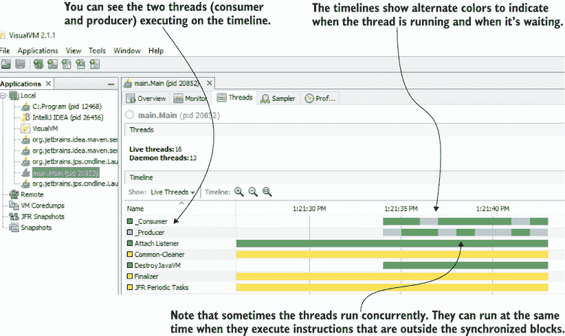

图 9.3 在大多数情况下，线程将依次锁定彼此并执行它们的同步代码块。这两个线程仍然可以并发执行同步块之外的指令。

一个线程可能被同步代码块阻塞，它可能正在等待另一个线程完成其执行（连接），或者它可能被阻塞对象控制。在线程被阻塞且无法继续执行的情况下，我们说线程是*锁定*的。在图 9.4 中，你可以看到 JProfiler 以我们使用的方法呈现的相同信息，JProfiler 是一种替代 VisualVM 的分析器。


图 9.4 你可以使用其他分析器代替 VisualVM。在这里，你看到线程时间线在 JProfiler 中的显示方式。

## 9.2 分析线程锁

当与使用线程锁的应用架构一起工作时，我们希望确保应用得到最佳实现。为此，我们需要一种方法来识别锁，以找出线程被阻塞的次数和锁的时间长度。我们还需要了解在特定场景下导致线程等待的原因。我们能否以某种方式收集所有这些信息？是的，一个分析器可以告诉我们关于线程行为所需了解的一切。

我们将继续使用你在第七章中学到的相同步骤进行性能分析调查：

1.  使用样本分析来了解在执行过程中发生的事情，并确定进一步深入了解的地方。

1.  使用性能分析（工具化）来获取我们想要调查的特定主题的详细信息。

图 9.5 显示了应用程序执行样本的结果。在查看执行时间时，我们观察到总时间比总 CPU 时间更长。在第七章中，你看到了类似的情况，我们得出结论，当这种情况发生时，意味着应用程序正在等待某事物。

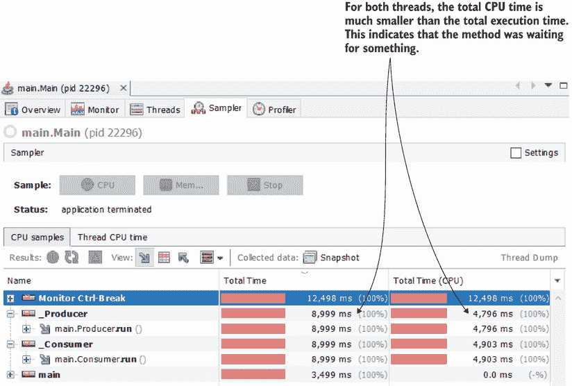

图 9.5 当总 CPU 时间短于总执行时间时，意味着应用程序正在等待某事物。我们想要弄清楚应用程序等待的是什么，以及这段时间是否可以优化。

在图 9.6 中，我们可以看到一些有趣的事情：方法在等待，但正如样本数据所示，它并没有等待其他事物。它似乎只是在等待自己。标记为“自我时间”的行告诉我们方法执行花费了多少时间。请注意，方法只花费了大约 700 毫秒的 CPU 时间作为自我时间，但作为总执行自我时间的一个更大的值 4903 毫秒。

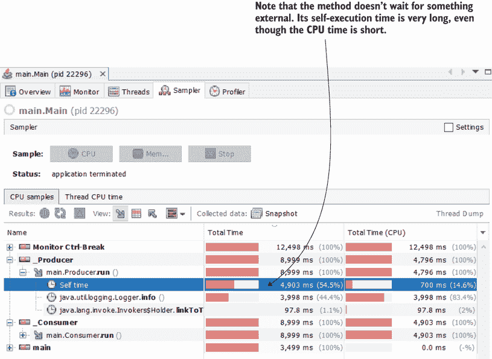

图 9.6 该方法不是等待某事物，而是等待自身。我们观察到它的自我执行时间比总 CPU 时间更长，这通常意味着线程被锁定。线程可能被另一个线程阻塞。

在第七章中，我们处理了一个示例，其中应用程序正在等待外部服务响应。应用程序发送了一个调用，然后等待另一个服务回复。在这种情况下，为什么应用程序等待是有意义的，但这里的情况看起来很奇怪。什么可能造成这种行为？

你可能会想，“一个方法怎么能等待自己呢？它是不是太懒了？”当我们观察到这样的行为，即一个方法正在等待但不是等待外部事物时，其线程可能已经被锁定。为了获取有关线程锁定更详细的信息，我们需要通过性能分析执行进一步的分析。

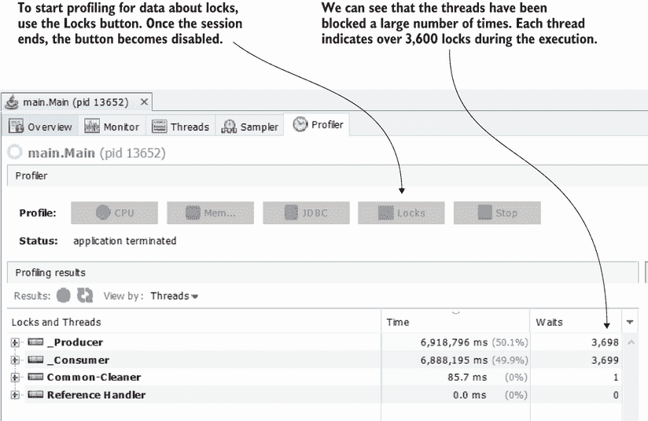

图 9.7 要开始对锁进行性能分析，请使用性能分析标签页中的锁按钮。在性能分析会话结束时，我们观察到每个生产者和消费者线程上都有超过 3,600 个锁。

样本分析并没有回答我们所有的问题。我们可以看到方法正在等待，但我们不知道它们在等待什么。我们需要继续进行性能分析（工具化）以获取更多信息。在 VisualVM 中，我们使用性能分析标签页来开始锁监控。要开始对锁进行性能分析，请使用图 9.7 中所示的锁按钮，该按钮显示了性能分析结果。按钮在图中显示为禁用状态，因为性能分析会话结束时进程已经被停止。

对于每个线程，我们可以通过选择线程名称左侧的小加号（+）来深入了解。现在，你可以获取到影响线程执行的每个监视对象的详细信息。分析器显示了被其他线程阻塞的线程的详细信息，以及是什么阻塞了线程。

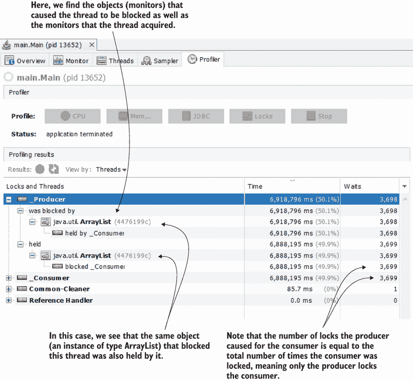

图 9.8 分析结果让我们对什么创建了锁以及什么受到它们的影响有了很好的理解。我们看到生产者线程只与一个监视器合作。此外，生产者线程使用监视器被消费者线程阻塞了 3,698 次。使用相同的监视器实例，生产者以类似的数量阻塞了消费者：3,699 次。

你可以在图 9.8 中找到这些详细信息。我们看到生产者线程被一个`ArrayList`类型的监视器实例阻塞。对象引用（图中的 4476199c）帮助我们唯一地识别对象实例，以确定是否同一个监视器影响了多个线程。它还允许我们精确地识别线程和监视器之间的关系。

图 9.8 中的发现可以这样阅读：

+   命名为`_Producer`的线程被引用 4476199c 的监视器实例（`ArrayList`类型的实例）阻塞。

+   `_Consumer`线程通过获取监视器 4476199c 阻塞了`_Producer`线程 3,698 次。

+   生产者线程还持有（拥有）引用 4476199c 的监视器 3,699 次，或者说线程`_Producer`阻塞了线程`_Consumer` 3,699 次。

图 9.9 扩展了消费者线程的视角。你会发现所有数据都相关联。在整个执行过程中，只有一个监视实例，即`ArrayList`类型的实例，锁定了一个线程或另一个线程。消费者线程最终被锁定 3,699 次，而生产者线程执行了由`ArrayList`对象同步的代码块。生产者线程被阻塞 3,698 次，而消费者线程执行了与`ArrayList`监视器同步的代码块。

记住，当你在自己的计算机上执行应用程序时，你不会必然得到相同的数字。事实上，即使你在同一台计算机上重复执行，也很可能不会得到相同的数字。尽管你可能得到不同的值，但总体上，你可以做出类似的观察。


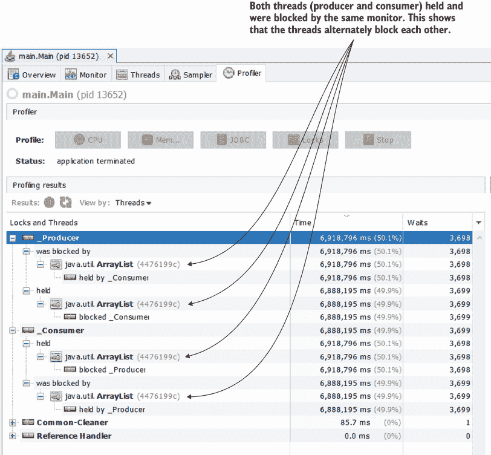

图 9.9 两个线程使用相同的监视器相互阻塞。当一个线程执行带有`ArrayList`实例监视器的同步代码块时，另一个线程等待。这样，一个线程被锁定 3,698 次，另一个线程被锁定 3,699 次。

对于这个演示，我使用了 VisualVM，因为它免费，而且我很熟悉它。但您也可以使用其他工具以相同的方法，例如 JProfiler。

在将 JProfiler 附加到进程（如第八章所述）后，确保您将 JVM 退出操作设置为“为分析保持 VA 活动”，如图 9.10 所示。

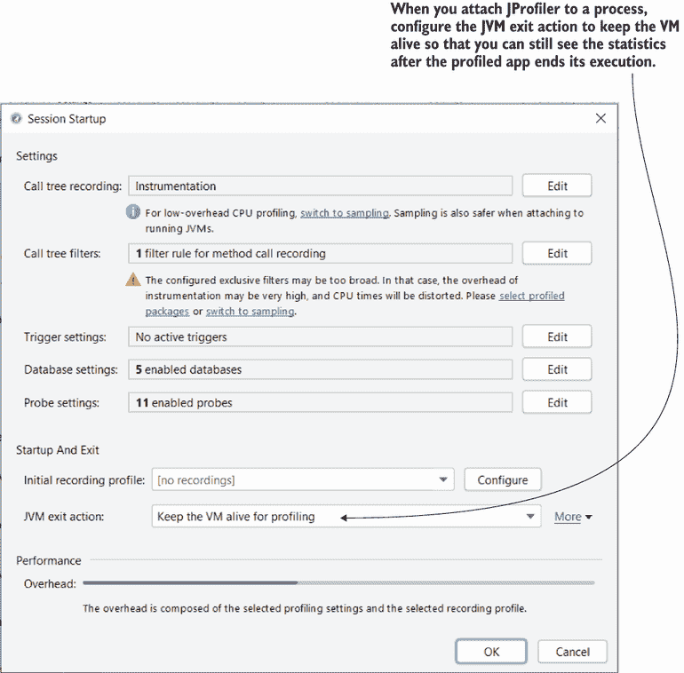

图 9.10 当使用 JProfiler 开始性能分析会话时，请记住将 JVM 操作设置为“为性能保持虚拟机活动”，这样您就可以在应用程序执行完毕后看到性能分析结果。

JProfiler 提供了多个视角来可视化我们使用 VisualVM 获得的相同细节，但结果是一样的。图 9.11 显示了锁的监视器历史视图报告。

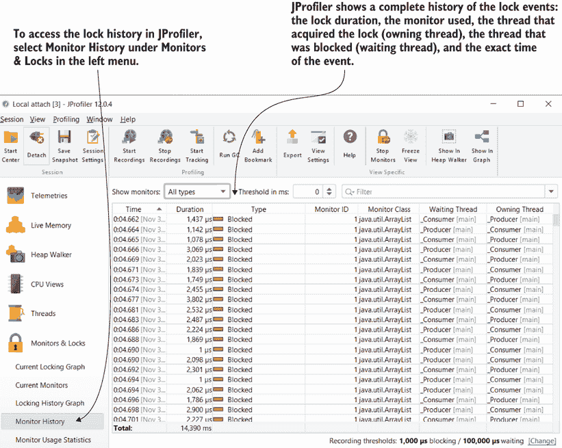

图 9.11 JProfiler 显示了应用程序线程遇到的所有锁的详细历史记录。该工具显示了事件的准确时间、事件持续时间、导致锁定的监视器以及涉及的线程。

在大多数情况下，您不需要如此详细的报告。我更喜欢将事件（锁）按线程分组，或者较少的情况下，按监视器分组。在 JProfiler 中，您可以像图 9.12 所示那样分组事件。从左侧菜单的监视器使用统计中，您可以选择按参与线程或导致锁定的监视器来分组事件。JProfiler 甚至有一个更独特的选项，您可以按监视器对象的类来分组锁。

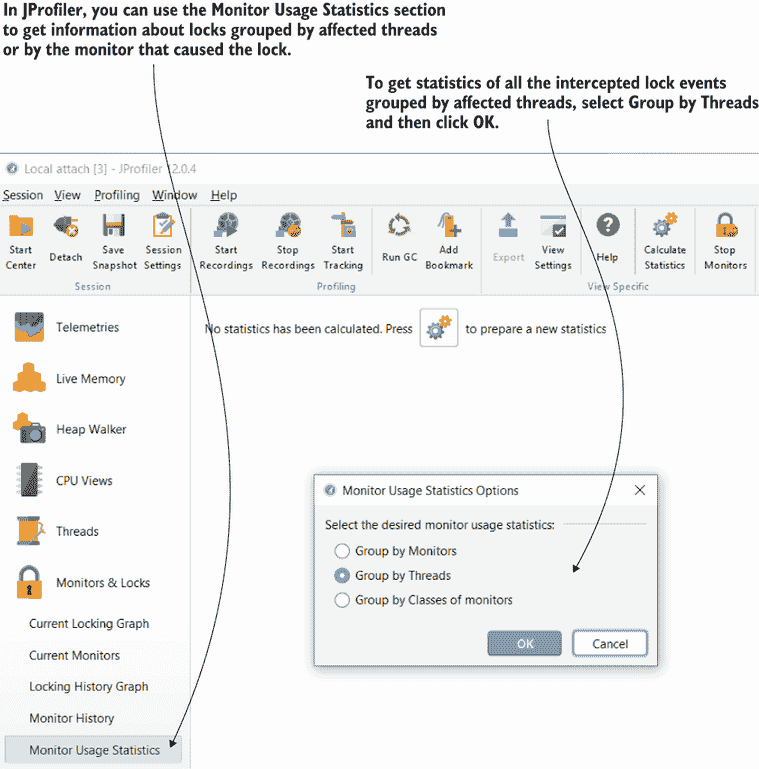

图 9.12 您可以使用监视器使用统计部分按参与线程或监视器分组锁事件。您可以使用聚合视图来了解哪些线程受影响更大以及它们受到什么影响，或者哪个监视器导致线程更频繁地停止。

如果您按参与线程分组锁事件，您将得到一个类似于 VisualVM 提供的统计。每个线程在应用程序执行期间被锁定超过 3,600 次（图 9.13）。

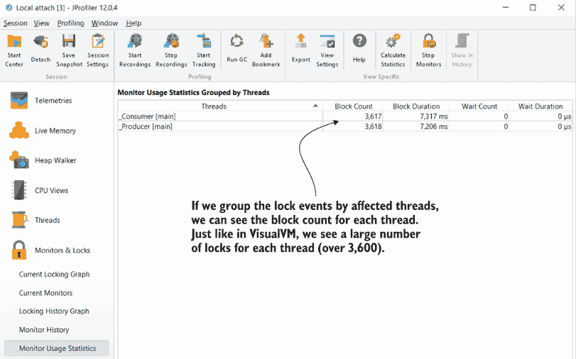

图 9.13 按线程分组锁事件为您提供了一个聚合视图，显示了每个线程在执行期间锁定了多少次。

执行是否最优？要回答这个问题，我们需要了解应用程序的目的。在我们的案例中，应用程序是一个简单、演示性的例子，因为它没有真正的目的，所以很难完全分析结果是否表明应用程序可以被增强。

但是，由于应用程序使用两个使用公共资源（列表）的线程，如果我们考虑到它们不能同时使用共享资源，那么我们期望以下情况：

+   总执行时间应该是 CPU 执行时间的总和（因为线程不能同时工作，它们将相互排斥），大约如此。

+   线程应该分配给执行的相似时间，并且应该锁定大约相同数量的次数。如果其中一个线程被优先考虑，另一个线程可能会陷入*饥饿*：线程以一种“不公平”的方式被阻塞，并且无法执行。

如果你再次查看线程分析，你可以看到两个线程得到了公平的对待。它们确实被锁定相似的次数，并且它们相互排斥但具有相似的活动（CPU 时间）执行。这是最优的，我们无法做太多来增强它。但请记住，这取决于应用做什么以及我们对它如何执行的期望。

这里有一个不同场景的例子，在这种情况下，该应用可能并不一定被认为是最佳的。假设你有一个实际处理值的程序。比如说，生产者需要更多的时间将每个值添加到列表中，而消费者需要的时间却比处理该值的时间少。在现实世界的应用中，类似的情况可能会发生：线程不需要做等效的困难“工作”。

在这种情况下，你可以增强应用：

+   最小化消费者线程的锁数量，并让它等待以允许生产者工作更多。

+   定义更多的生产者线程或让消费者线程批量（一次多个）读取和处理值。

一切都取决于应用做什么，但了解你可以做什么来使其变得更好，首先要从分析执行开始。因为你不可能有一种可以应用于所有应用的通用方法，所以我总是建议开发者使用分析器并分析在实现多线程应用时应用执行的更改。

## 9.3 分析等待线程

在本节中，我们分析等待被通知的线程。等待线程与锁定线程不同。监视器锁定线程以执行同步代码块。在这种情况下，我们并不期望监视器执行特定操作来“告诉”被阻塞的线程继续其执行。但监视器可以使线程等待不确定的时间，然后决定何时允许该线程继续其执行。一旦监视器使线程等待，该线程只有在被同一监视器通知后才会返回执行。使线程等待直到被通知的能力在控制线程方面提供了很大的灵活性，但如果不正确使用，也可能导致问题。

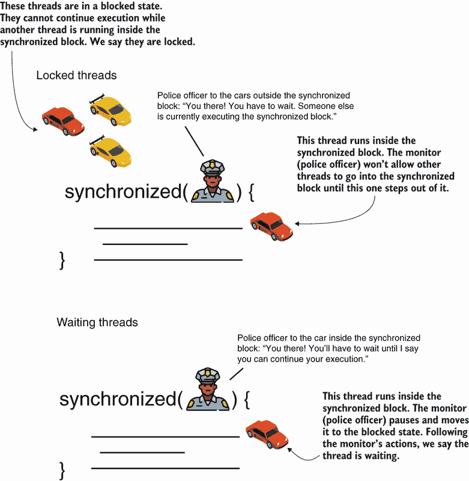

图 9.14 锁定线程与等待线程。一个锁定线程在同步块的入口处被阻塞。监视器不允许一个线程在另一个线程在块内积极运行时进入同步块。一个等待线程是监视器明确设置为阻塞状态的线程。监视器可以使其管理的任何线程在同步块中等待。等待线程只有在监视器明确告诉它可以继续执行后才能继续其执行。

为了可视化锁定线程和等待线程之间的差异，请看图 9.14。想象一下，同步块是由警察管理的受限区域。线程是汽车。警察一次只允许一辆汽车在受限区域（同步块）内运行。被阻塞的汽车我们称之为*锁定*。警察还可以管理受限区域内运行的汽车。警察可以命令在区域内运行的汽车等待，直到它们被明确命令继续；我们称之为*等待*。

我们将使用本章前面分析过的相同应用程序，并考虑以下场景：负责该应用程序的一位开发者考虑了对我们的生产者-消费者架构的改进。现在，当列表为空时，消费者线程无法执行任何操作，因此它只是多次迭代一个错误条件，直到 JVM 让它等待，以便允许生产者线程运行并向列表添加值。当生产者向列表添加 100 个值时，也会发生同样的事情。生产者线程会运行在一个错误条件上，直到 JVM 允许消费者从列表中移除一些值。

我们能否做些什么，使得消费者在没有可消费的值时等待，并且只有在我们知道列表中至少有一个值时才运行（见图 9.15）？同样，我们能否让生产者在列表中已有太多值时等待，并且只有在添加其他值有意义时才允许它运行？这种方法会使我们的应用程序更高效吗？

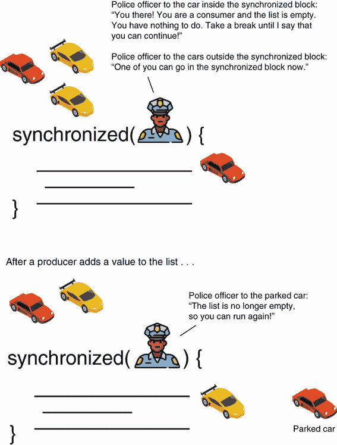

图 9.15 中的一些汽车是消费者线程，而另一些是生产者线程。警察命令消费者等待，如果列表中没有可以消费的值，允许生产者工作并添加值。一旦列表中至少有一个可以消费的值，警察会命令等待的消费者继续执行。

我们将更改应用程序以实现这种新行为，但也会证明，对于我们的场景，应用程序并没有变得更高效。相反，执行效率更低。

当线程无法与共享资源（列表）一起工作时，让他们等待可能看起来是个好主意。但经过分析，你会发现这反而严重影响了性能，而不是帮助应用程序运行得更快。

我总是建议在开发期间使用分析器来证明应用程序执行得最优。


列表 9.4 展示了消费者线程的新实现。当列表为空时，消费者线程会等待，因为它没有可以消费的内容。监视器使消费者线程等待，并且只有在生产者向列表添加了某些内容之后，才会通知它继续执行。我们使用 `wait()` 方法告诉消费者如果列表为空则等待。同时，当消费者从列表中移除值时，它会通知等待的线程，这样如果生产者在等待，现在它知道它可以继续执行，因为列表不再满。我们使用 `notifyAll()` 方法来通知等待的线程。您可以在项目 da-ch9-ex2 中找到此实现。

列表 9.4 在列表为空时使消费者线程等待

```
public class Consumer extends Thread {

  // Omitted code

  @Override
  public void run() {
    try {
      for (int i = 0; i < 1_000_000; i++) {
        synchronized (Main.list) {
          if (Main.list.size() > 0) {
            int x = Main.list.get(0);
            Main.list.remove(0);
            log.info("Consumer " + 
                 Thread.currentThread().getName() + 
                 " removed value " + x);
            Main.list.notifyAll();        ❶
          } else {
            Main.list.wait();             ❷
          }
        }
      }
    } catch (InterruptedException e) {
      log.severe(e.getMessage());
    }
  }
}
```

❶ 在从列表中消费一个元素之后，消费者通知等待的线程列表内容已发生变化。

❷ 当列表为空时，消费者会等待直到它被通知列表中已添加了某些内容。

以下代码展示了生产者线程的实现。与消费者线程类似，如果列表中有太多值，生产者线程会等待。消费者最终会通知生产者，并在从列表中消费一个值后允许它再次运行。

列表 9.5 如果列表已满，使生产者线程等待

```
public class Producer extends Thread {

  // Omitted code

  @Override
  public void run() {
    try {
      Random r = new Random();
      for (int i = 0; i < 1_000_000; i++) {
        synchronized (Main.list) {
          if (Main.list.size() < 100) {
            int x = r.nextInt();
            Main.list.add(x);
            log.info("Producer " + 
                  Thread.currentThread().getName() + 
                  " added value " + x);
            Main.list.notifyAll();        ❶
          } else {
            Main.list.wait();             ❷
          }
        }
      }
    } catch (InterruptedException e) {
      log.severe(e.getMessage());
    }
  }
}
```

❶ 在向列表添加一个元素之后，生产者通知等待的线程列表内容已发生变化。

❷ 当列表中有 100 个元素时，生产者会等待直到它被通知列表中已移除某些内容。

如你所知，我们通过采样执行来开始我们的调查。我们已经看到一些可疑之处：执行似乎比我们之前在 9.1 节中观察到的要长得多（图 9.16）。如果你回到我们在 9.1 节中做出的前观察，你会发现整个执行只花了大约 9 秒。现在，执行需要大约 50 秒——这是一个巨大的差异。

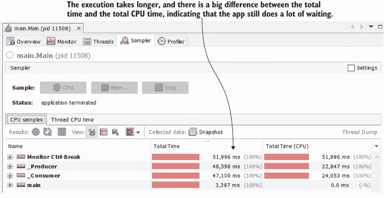

图 9.16 通过采样执行，我们看到执行时间比我们使线程等待之前要慢。

样本细节（图 9.17）显示我们添加的 `wait()` 方法导致了大部分线程等待时间。由于自我执行时间非常接近 CPU 执行时间，线程并没有长时间锁定。然而，我们的目的是使我们的应用程序整体上更高效，但看起来我们只是将等待从一边移到了另一边，在这个过程中使应用程序变慢了。

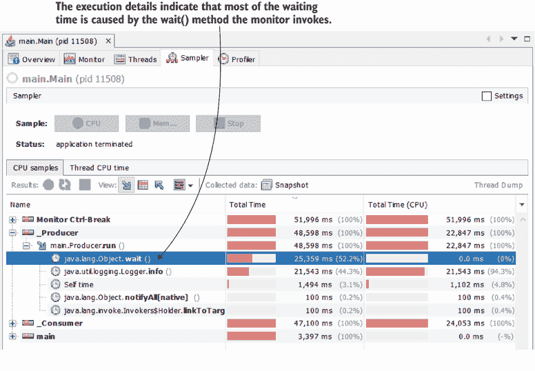

图 9.17 通过分析细节，我们可以看到自我执行时间并不长，但线程被阻塞，因此等待时间更长。

我们继续通过更详细的性能分析（图 9.18）。确实，性能分析结果显示锁的数量更少，但这并没有很大帮助，因为执行速度仍然很慢。

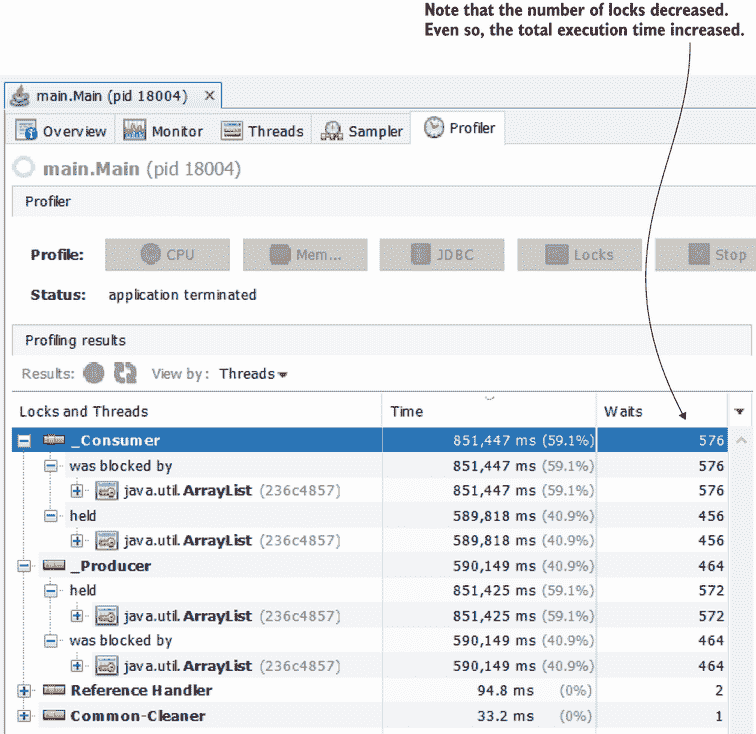

图 9.18 锁的模式与我们的先前结果相似，但线程被锁定的频率更低。

图 9.19 展示了使用 JProfiler 获得的相同调查细节。在 JProfiler 中，一旦我们将锁事件按线程分组，我们就可以得到锁的数量和等待时间。在前面的练习中，等待时间为零，但我们有更多的锁。现在锁的数量更少，但等待时间更长。这告诉我们，当使用等待/通知方法时，JVM 在线程之间变化得更慢，而不是允许线程由同步块的监视器自然锁定和解锁。

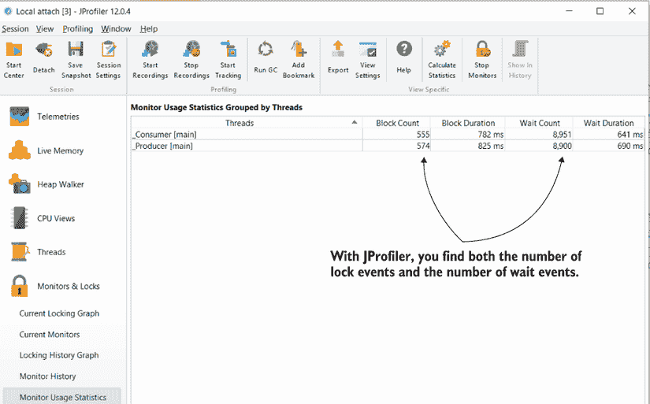

图 9.19 使用 JProfiler 我们可以得到相同的详细信息。锁定的线程更少，但现在它们被阻塞的时间更长。

## 摘要

+   线程可以通过同步代码块被锁定并强制等待。当线程同步以避免同时更改共享资源时，会出现锁。

+   锁是避免竞态条件所必需的，但有时应用程序会使用有缺陷的线程同步方法，这可能导致不希望的结果，例如性能问题或甚至应用程序冻结（在死锁的情况下）。

+   由同步代码块引起的锁会减慢应用程序的执行速度，因为它们迫使线程等待而不是让它们工作。在某些实现中可能需要锁，但最好找到方法来最小化应用程序线程被锁定的时长。

+   我们可以使用性能分析器来识别何时锁会减慢应用程序，应用程序在执行过程中遇到了多少锁，以及它们会降低多少性能。

+   当使用性能分析器时，始终先采样执行，以确定应用程序的执行是否受到锁的影响。你通常会通过观察一个方法正在等待自身来识别采样时的锁。

+   如果你通过采样发现锁可能影响应用程序的执行，你可以继续使用锁分析（仪器）进行调查，这将显示受影响的线程、锁的数量、涉及的监视器以及锁定线程和引起锁的线程之间的关系。这些细节有助于你决定应用程序的执行是否最优，或者你是否可以找到方法来增强它。

+   每个应用程序都有不同的目的，因此没有理解线程锁的通用公式。一般来说，我们希望最小化线程被锁定或等待的时间，并确保线程不会被不公平地排除在执行之外（饥饿线程）。
