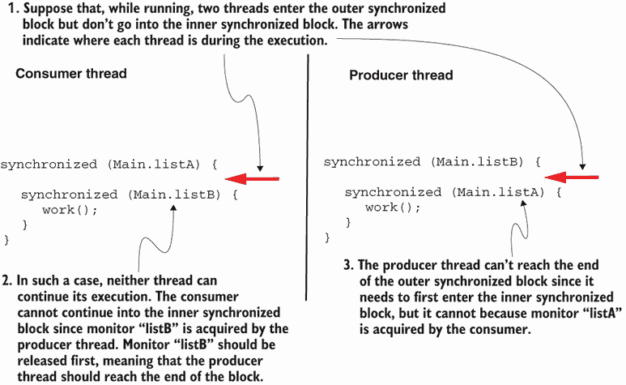
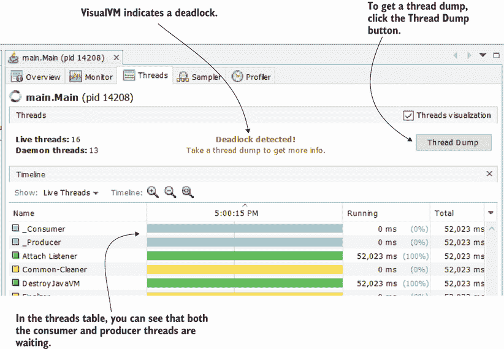
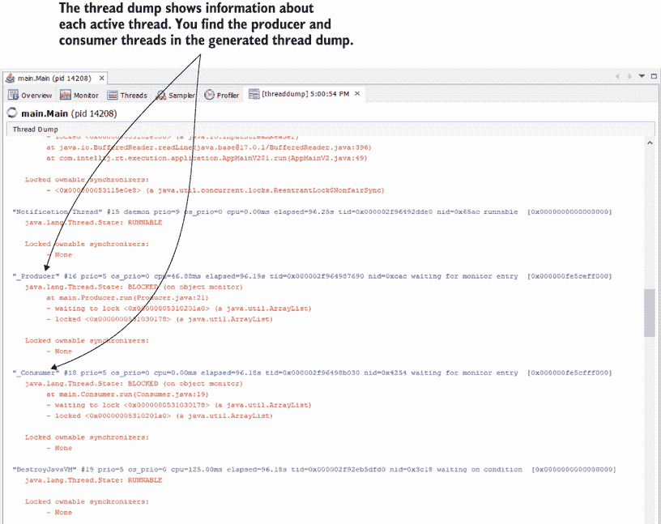
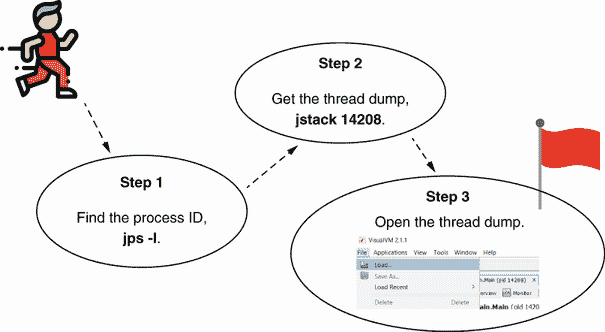
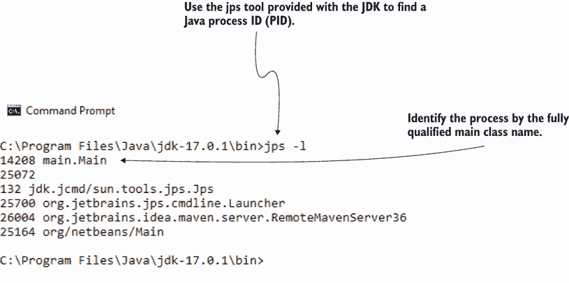
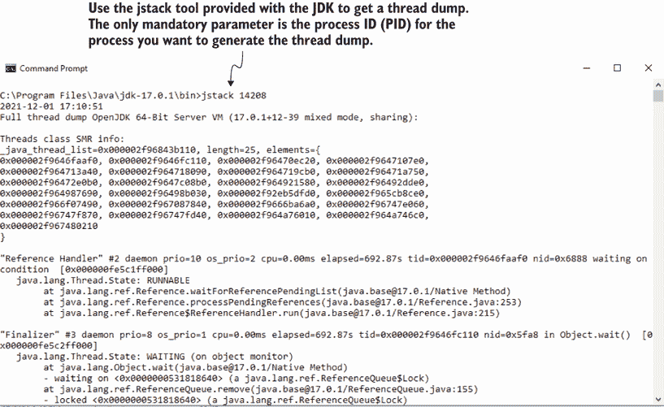
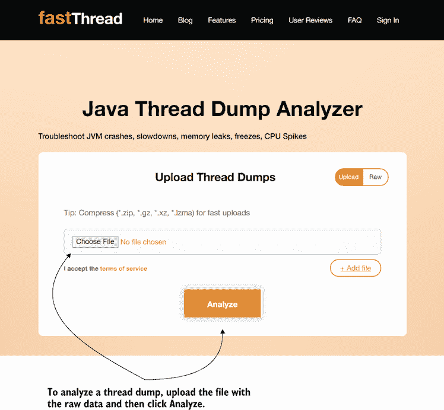
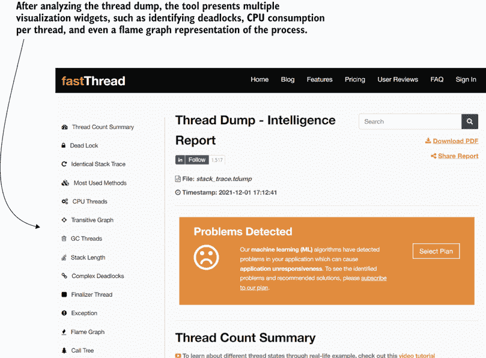
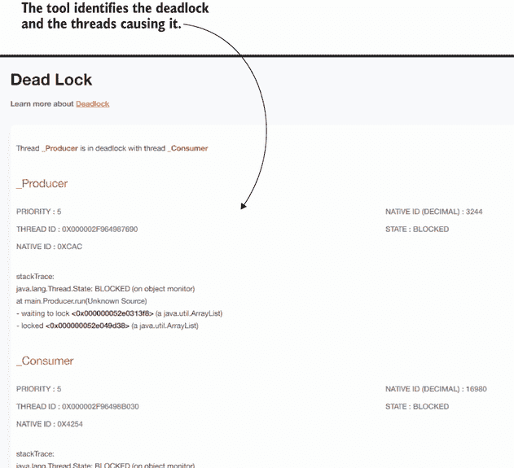

# 10 使用线程转储调查死锁

本章涵盖

+   使用分析器获取线程转储

+   使用命令行获取线程转储

+   读取线程转储以调查问题

在本章中，我们将讨论如何使用线程转储来分析给定时间点的线程执行。通常，我们在应用程序变得无响应的情况下使用线程转储，例如在死锁的情况下。当多个线程暂停它们的执行并等待彼此满足某个条件时，就会发生*死锁*。如果假设线程 A 等待线程 B 执行某些操作，而线程 B 又等待线程 A，那么两者都无法继续执行。在这种情况下，应用程序，或者至少是它的一部分，将会冻结。我们需要了解如何分析这个问题，以找到其根本原因，并最终解决问题。

由于死锁可能导致进程完全冻结，你通常无法使用采样或分析（工具），就像我们在第九章中所做的那样。相反，你可以获取给定 JVM 进程的所有线程及其状态的统计信息。这个统计信息被称为*线程转储*。

## 10.1 获取线程转储

在本节中，我们将分析获取线程转储的方法。我们将使用一个小应用程序，该应用程序故意实现了一个导致死锁的问题。你可以在项目 da-ch10-ex1 中找到这个应用程序。我们将运行这个应用程序，等待它冻结（这应该在几秒钟内发生），然后我们将讨论获取线程转储的多种方法。一旦我们知道了如何获取线程转储，我们将讨论如何读取它们（第 10.2 节）。

让我们看看我们将要使用的应用程序是如何实现的，以及为什么它的执行会导致死锁。该应用程序使用两个线程来更改两个共享资源（两个列表实例）。一个名为“生产者”的线程在执行过程中向一个列表或另一个列表添加值。另一个名为“消费者”的线程从这些列表中移除值。如果你阅读了第九章，你可能还记得我们曾对一个类似的应用程序进行过工作。但由于该应用程序的逻辑对我们示例无关紧要，我已经从列表中省略了它，只保留了对我们演示重要的一部分——同步块。

这个例子被简化了，以便你能够专注于我们讨论的调查技术。在现实世界的应用程序中，事情通常会更加复杂。此外，错误使用同步块并不是导致死锁的唯一途径。错误使用信号量、闩锁或屏障等阻塞对象也可能导致此类问题。但你要学习的调查问题的步骤是相同的。

在列表 10.1 和 10.2 中，请注意，两个线程使用嵌套的同步块和两个不同的监视器：`listA`和`listB`。问题是其中一个线程使用监视器`listA`进行外部同步块，而`listB`用于内部。另一个线程则相反。这种代码设计留下了死锁的空间，如图 10.1 所示。

列表 10.1 使用嵌套同步块进行消费者线程

```
public class Consumer extends Thread {

  // Omitted code

  @Override
  public void run() {
    while (true) {
      synchronized (Main.listA) {     ❶

        synchronized (Main.listB) {   ❷
          work();
        }
      }
    }  
  }

  // Omitted code
}
```

❶ 外部同步块使用 listA 监视器。

❷ 内部同步块使用 listB 监视器。

在列表 10.1 中，消费者线程使用`listA`作为外部同步块的监视器。在列表 10.2 中，生产者线程使用相同的监视器作为内部块，而`listB`监视器也在两个线程之间交换。

列表 10.2 使用嵌套同步块进行生产者线程

```
public class Producer extends Thread {

  // Omitted code

  @Override
  public void run() {
    Random r = new Random();
    while (true) {
      synchronized (Main.listB) {       ❶

        synchronized (Main.listA) {     ❷
          work(r);
        }
      }
   }

  // Omitted code
}
```

❶ 外部同步块使用 listB 监视器。

❷ 内部同步块使用 listA 监视器。

图 10.1 显示了两个线程如何遇到死锁。



图 10.1 如果两个线程都进入了外部同步块，但没有进入内部块，它们将陷入停滞并相互等待。我们说它们进入了死锁。

### 10.1.1 使用分析工具获取线程转储

当我们有一个冻结的应用程序并且想要确定问题的根本原因时，我们该怎么办？在应用程序或其部分冻结的情况下，使用分析工具分析锁可能不起作用。与第九章中我们在执行过程中分析锁不同，我们将只对应用程序的线程状态进行快照。我们将读取这个快照（即线程转储），并找出哪些线程在相互影响，导致应用程序冻结。

您可以通过使用分析工具（例如，VisualVM、JProfiler）或通过使用命令行直接调用 JDK 提供的工具来获取线程转储。在本节中，我们将讨论如何使用分析工具获取线程转储，而在第 10.1.2 节中，我们将学习如何使用命令行获取相同的信息。

我们将启动我们的应用程序（项目 da-ch10-ex1），等待几秒钟，直到它进入死锁。当应用程序不再在控制台写入消息（它卡住了）时，您就会知道应用程序进入了死锁。

使用分析工具获取线程转储是一种简单的方法。这不需要更多的操作，只需点击一下按钮。让我们使用 VisualVM 来获取线程转储。图 10.2 显示了 VisualVM 界面。您可以看到 VisualVM 非常智能，已经发现我们进程的一些线程遇到了死锁。这在“线程”标签页中有显示。



图 10.2 当应用程序的一些线程进入死锁时，VisualVM 在“线程”标签页中用消息指示这种情况。请注意，`_Consumer`和`_Producer`两个线程都在图形时间线上被锁定。要获取线程转储，您只需在窗口右上角选择“线程转储”按钮。

在收集线程转储后，界面看起来像图 10.3。线程转储以纯文本形式表示，描述了应用程序线程并提供有关它们的详细信息（例如，它们在生命周期中的状态、谁阻塞了它们等）。

起初，你可能不理解图 10.3 中的线程转储文本。在本章的后面部分，你将学习如何阅读它。




图 10.3 显示了一个纯文本线程转储，描述了应用程序的线程。在我们收集的线程转储中，我们可以找到两个死锁线程 `_Consumer` 和 `_Producer`。

### 10.1.2 从命令行生成线程转储

线程转储也可以使用命令行获取。这种方法在需要从远程环境获取线程转储时特别有用。大多数情况下，你无法远程分析安装在环境中的应用程序（记住，在第四章中讨论过，在生产环境中不建议进行远程分析和远程调试）。由于在大多数情况下，你只能通过命令行访问远程环境，因此你也需要知道如何以这种方式获取线程转储。

幸运的是，使用命令行获取线程转储相当简单（图 10.4）：

1.  找到你想要获取线程转储的进程 ID。

1.  将线程转储作为文本数据（原始数据）获取，并将其保存到文件中。

1.  将保存的线程转储加载到分析工具中，以便更容易阅读。



图 10.4 使用命令行获取线程转储的三个简单步骤。首先，找到你想要获取线程转储的进程 ID。其次，使用 JDK 工具获取线程转储。最后，在分析工具中打开线程转储以读取它。

步骤 1：找到要调查的进程的进程 ID

到目前为止，我们已经通过其名称（表示为主类的名称）识别了我们想要分析的过程。但是，当使用命令行获取线程转储时，你需要通过其 ID 来识别进程。如何获取正在运行的 Java 应用的进程 ID（PID）？最简单的方法是使用 JDK 提供的`jps`工具。下面的代码片段显示了你需要运行的命令。我们使用`-l`（小写“L”）选项来获取与 PID 关联的主类名称。这样，我们可以以与第六章到第九章中学习分析应用程序执行相同的方式识别进程：

```
jps -l
```

图 10.5 显示了运行命令的结果。输出第一列中的数值是 PID。第二列将主类名称与每个 PID 关联。这样，我们得到了在步骤 2 中用于获取线程转储的 PID。



图 10.5 显示了使用 JDK 提供的`jps`工具获取正在运行的 Java 进程的 PID。这些 PID 是获取给定进程的线程转储所必需的。

步骤 2：收集线程转储

一旦您可以通过其 PID 识别出您想要收集线程转储的进程，您就可以使用 JDK 提供的另一个工具`jstack`来生成线程转储。当使用`jstack`时，您只需要提供一个进程 ID 作为参数（而不是`<<PID>>`，您需要使用在第 1 步中收集到的 PID 值）：

```
jstack <<PID>>
```

这样的命令执行示例是

```
jstack 14208
```

图 10.6 显示了运行`jstack`命令后跟一个 PID 的结果。线程转储以纯文本形式提供，您可以将其保存到文件中以便移动或加载到工具中进行调查。



图 10.6 `jstack`命令后跟一个 PID 将为给定进程生成线程转储。线程转储以纯文本形式显示（也称为原始线程转储）。您可以将文本收集到文件中，以便稍后导入和调查。

第 3 步：将收集到的线程转储导入分析器以方便阅读

通常，您会将`jstack`命令的输出、线程转储保存到文件中。将线程转储存储在文件中允许您移动它、存储它或将其导入帮助您调查其详细信息的工具。

图 10.7 显示了您如何在命令行中将`jstack`命令的输出放入文件中。一旦您有了文件，您可以使用文件 > 加载菜单在 VisualVM 中加载它。


图 10.7 一旦将线程转储保存到文件中，您就可以使用各种工具来打开它进行调查。例如，要在 VisualVM 中打开它，请选择文件 > 加载。

## 10.2 读取线程转储

在本节中，我们将讨论读取线程转储。一旦收集到线程转储，您需要了解如何读取它以及如何有效地使用它来识别问题。我们将从讨论如何在第 10.2.1 节中读取纯文本线程转储开始——这意味着您将学习如何读取由`jstack`（见第 10.1.2 节）提供的原始数据。然后，在第 10.2.2 节中，我们将使用一个名为 fastThread（[`fastthread.io/`](https://fastthread.io/））的工具，它提供了一种更简单的方式来可视化线程转储中的数据。

这两种方法（读取纯文本线程转储和使用高级可视化）都很有用。当然，我们总是更喜欢高级可视化，但如果您无法获得它，您需要了解如何依赖原始数据。

### 10.2.1 读取纯文本线程转储

当你收集线程转储时，你会得到线程的纯文本格式描述（即原始数据）。尽管我们有工具可以轻松地可视化这些数据（我们将在第 10.2.2 节中讨论），但我一直认为对于开发者来说，理解原始表示也很重要。你可能遇到无法从生成它的环境中移除原始线程转储的情况。比如说，你远程连接到一个容器，并且只能使用命令行来深入日志并调查运行中的应用程序发生了什么。你怀疑存在与线程相关的问题，因此你想生成线程转储。如果你能以文本形式读取线程转储，你需要的就只有控制台本身了。

让我们看看列表 10.3，它显示了线程转储中的一个线程。这不过是当转储被捕获时，在应用程序中活跃的每个线程的类似显示的详细信息。以下是关于线程的详细信息：

+   线程名称

+   线程 ID

+   原生线程 ID

+   操作系统级别的线程优先级

+   线程消耗的总时间和 CPU 时间

+   状态描述

+   状态名称

+   栈跟踪

+   谁阻塞了线程

+   线程所获取的锁

首先显示的是*线程名称*——在我们的例子中，`"_Producer"`。线程名称至关重要，因为它是你在需要时识别线程转储中线程的几种方式之一。JVM 还将线程与一个*线程 ID*（在列表 10.3 中，`tid=0x000002f964987690`）关联起来。由于开发者提供了名称，因此有些线程可能会得到相同的名称。如果这种不幸的情况发生，你仍然可以通过其 ID（总是唯一的）在转储中识别线程。

在 JVM 应用程序中，线程是系统线程的包装器，这意味着你总是可以识别在幕后运行的操作系统（OS）线程。如果你需要这样做，请寻找*原生线程 ID*（在列表 10.3 中，`nid=0xcac`）。

一旦你识别了一个线程，你就识别你感兴趣的详细信息。在线程转储中，你首先得到的是*线程的优先级*、*CPU 执行时间*和*总执行时间*。每个操作系统都会将其运行的每个线程关联到一个优先级。我很少在线程转储中使用这个值。但是，如果你看到某个线程的活跃度不如你想象的那么高，并且你看到操作系统将其指定为较低的优先级，那么这可能是原因。在这种情况下，总执行时间也会比 CPU 执行时间高得多。记住，从第七章中，总执行时间是线程存活的时间，而 CPU 执行时间是它工作得有多好。

*状态描述* 是一个宝贵的细节。它用简单的英语告诉您线程发生了什么。在我们的例子中，线程是“等待监视器进入”，这意味着它在同步块的入口处被阻塞。线程可能“在监视器上定时等待”，这意味着它在定义的时间内睡眠或正在运行。与状态描述相关联的是 *状态名称*（运行中、等待、阻塞等）。附录 D 提供了关于线程生命周期和线程状态的很好的复习资料，以防您需要。

线程转储为每个线程提供了一个 *堆栈跟踪*，显示了在转储时线程正在执行代码的哪个部分。堆栈跟踪非常有价值，因为它显示了线程正在做什么。您可以使用堆栈跟踪来找到您想要进一步调试的特定代码片段，或者在慢线程的情况下，确定导致该线程延迟或阻塞的具体原因。

最后，对于获取锁或被锁定的线程，我们可以找到 *它们获取的锁* 和 *它们等待的锁*。每次您调查死锁时都会使用这些细节。它们也可以为您提供优化提示。例如，如果您看到线程获取了许多锁，您可能会想知道为什么以及如何改变其行为，使其不会阻塞那么多的其他执行。 

列表 10.3 线程转储中线程详细信息的结构

```
"_Producer" #16 prio=5 os_prio=0 cpu=46.88ms elapsed=763.96s         ❶
➥ tid=0x000002f964987690 nid=0xcac waiting for monitor entry        ❷
➥ [0x000000fe5ceff000]
   java.lang.Thread.State: BLOCKED (on object monitor)               ❸
    at main.Producer.run(Unknown Source)                             ❹
    - waiting to lock <0x000000052e0313f8> (a java.util.ArrayList)   ❺
    - locked <0x000000052e049d38> (a java.util.ArrayList)            ❻
```

❶ 线程名称以及关于资源消耗和执行时间的详细信息

❷ 线程 ID 和状态描述

❸ 线程状态

❹ 线程堆栈跟踪

❺ 阻塞当前线程的锁 ID 和监视器对象类型

❻ 当前线程产生的锁的锁 ID

关于线程转储的一个重要事项是，它们提供的细节几乎与正常的锁分析（在第九章中讨论）一样多。锁分析相对于线程转储的优势在于，它显示了执行的动态性。就像图片和电影之间的区别一样，线程转储只是给定时间点的快照（在这里，是执行期间），而分析显示了参数在执行过程中的变化。但在许多情况下，一张图片就足够了，而且更容易获得。

有时使用线程转储而不是分析器就足够了。


如果您只需要知道在给定时间执行的代码是什么，线程转储就足够了。您已经学会了使用采样来达到这个目的，但了解线程转储也能做到这一点是很好的。比如说，您无法远程分析一个应用程序，但您需要找出幕后执行的代码。您可以获取线程转储。

现在，让我们关注如何通过线程转储找到线程之间的关系。我们如何分析线程之间相互交互的方式？我们特别感兴趣的是线程之间的锁定。在列表 10.4 中，我添加了两个已知处于死锁状态的线程的线程转储细节。但问题是，“如果我们事先不知道这些细节，我们如何找到它们处于死锁状态？”

如果你怀疑存在死锁，你应该专注于线程引起的锁（图 10.8）：

1.  筛选出所有未阻塞的线程，以便你可以专注于可能导致死锁的线程。

1.  从第一个候选线程（你在第 1 步中没有筛选的线程）开始，搜索导致它被阻塞的锁 ID。

1.  找到导致该锁的线程，并检查是什么阻止了该线程。如果你在某个时刻返回到你开始的线程，那么你解析的所有线程都处于死锁状态。


图 10.8 要通过线程转储找到死锁，请遵循这三个简单的步骤。首先，移除所有未阻塞的线程。然后，从一个阻塞线程开始，使用锁 ID 找到阻止它的原因。对每个线程重复此过程。如果你返回到你已经调查过的线程，这意味着你找到了死锁。

第 1 步：筛选出未锁定的线程

首先，筛选掉所有未锁定的线程，这样你就可以只关注你正在调查的情况——死锁——的潜在候选线程。线程转储可以描述数十个线程。你想要消除噪音，只关注那些被阻塞的线程。

第 2 步：找到第一个候选线程被阻止的原因

在消除不必要的线程细节后，从第一个候选线程开始，通过导致线程等待的锁 ID 进行搜索。锁 ID 是尖括号之间的一个（在列表 10.4 中，`"_Producer"`等待 ID 为`0x000000052e0313f8`的锁）。

第 3 步：找到阻止下一个线程的原因

重复此过程。如果你在某个时刻到达一个已经调查过的线程，这意味着你找到了死锁；请参阅以下列表。

列表 10.4 查找相互锁定的线程

```
"_Producer" #16 prio=5 os_prio=0 cpu=46.88ms 
➥ elapsed=763.96s tid=0x000002f964987690 
➥ nid=0xcac waiting for monitor entry  [0x000000fe5ceff000]
   java.lang.Thread.State: BLOCKED (on object monitor)
    at main.Producer.run(Unknown Source)
    - waiting to lock <0x000000052e0313f8> 
➥ (a java.util.ArrayList)     
    - locked <0x000000052e049d38> 
➥ (a java.util.ArrayList)     

"_Consumer" #18 prio=5 os_prio=0 cpu=0.00ms 
➥ elapsed=763.96s tid=0x000002f96498b030 
➥ nid=0x4254 waiting for monitor entry  [0x000000fe5cfff000]
   java.lang.Thread.State: BLOCKED (on object monitor)
    at main.Consumer.run(Unknown Source)
    - waiting to lock <0x000000052e049d38> (a java.util.ArrayList)   ❶
    - locked <0x000000052e0313f8> (a java.util.ArrayList)            ❷
```

❶ 消费者线程等待由生产者线程发起的锁。

❷ 生产者线程等待由消费者线程发起的锁。

我们的例子演示了一个简单的死锁，假设两个线程互相锁定。按照前面讨论的三步流程，你会看到`"_Producer"`线程阻塞了`"_Consumer"`线程，反之亦然。当涉及超过两个线程时，会发生复杂的死锁。例如，线程 A 阻塞线程 B，线程 B 阻塞线程 C，线程 C 又阻塞线程 A。你可以发现一条长链，其中线程互相锁定。死锁中线程链越长，找到、理解和解决死锁就越困难。图 10.9 显示了复杂死锁和简单死锁之间的区别。


图 10.9 当只有两个线程互相阻塞时，这被称为简单死锁，但死锁可能由多个互相阻塞的线程引起。线程越多，复杂性就越大。因此，当涉及超过两个线程时，这被称为复杂死锁。

有时复杂的死锁可能会与级联阻塞线程（图 10.10）混淆。*级联阻塞线程*（也称为*级联锁定*）是你可以通过线程转储发现的不同问题。要找到级联线程，遵循与调查死锁相同的步骤。但在锁的级联中，你将看到其中一个线程正在等待一个外部事件，这导致所有其他线程也等待。


图 10.10 当多个线程进入一个链式等待的链时，会出现级联锁定。链中的最后一个线程被外部事件（如从数据源读取或调用端点）阻塞。

级联阻塞线程通常表明多线程架构设计不当。当我们设计一个多线程的应用程序时，我们实现线程化以允许应用程序并发处理事物。线程互相等待会抵消多线程架构的目的。尽管有时你需要让线程互相等待，但你不应期望出现带有级联锁的长线程链。

### 10.2.2 使用工具更好地理解线程转储

阅读线程转储的纯文本原始表示是有用的，但有时可能相当困难。如果可能的话，大多数人更喜欢一种更简单的方式来可视化线程转储中的数据。今天，我们可以使用工具来帮助我们更容易地理解线程转储。尽可能的情况下，我会从收集线程转储的环境中移除它。我通常更喜欢使用 fastThread ([fastthread.io](https://fastthread.io/))来调查转储，而不是处理原始数据。

fastThread 是一个旨在帮助您阅读线程转储的在线工具。它提供免费和付费计划，但免费计划一直足够满足我的需求。只需上传包含线程转储原始数据的文件，然后等待工具提取您需要的细节并将它们以更容易理解的形式呈现。图 10.11 显示了起始页面，您可以从系统中选择包含线程转储原始数据的文件并上传它以进行分析。



图 10.11 要分析线程转储，请将包含线程转储原始数据的文件上传到[fastThread.io](https://fastthread.io/)，并等待工具以简单易懂的形式呈现细节。

fastThread 的分析显示了线程转储的各种细节，包括死锁检测、依赖图、堆栈跟踪、资源消耗，甚至火焰图（图 10.12）。



图 10.12 fastThread 以易于阅读的格式提供了各种详细信息。这些细节包括死锁检测、依赖图、资源消耗和火焰图。

图 10.13 显示了 fastThread 如何识别我们的线程转储中的死锁。



图 10.13 在分析线程转储原始数据后，fastThread 识别并提供了由`_Consumer`和`_Producer`线程引起的死锁的详细信息。

## 摘要

+   当两个或多个线程在等待彼此时被阻塞，它们处于死锁状态。当一个应用程序进入死锁状态时，它通常会冻结，无法继续执行。

+   您可以使用线程转储识别死锁的根本原因，这些转储显示了在生成线程转储时应用程序所有线程的状态。这些信息使您能够找到哪个线程正在等待另一个线程。

+   线程转储还显示了有关资源消耗和每个线程的堆栈跟踪等详细信息。如果这些细节足够充分，您可以使用线程转储而不是仪器进行您的调查。想象一下线程转储和剖析之间的差异，就像图片和电影之间的差异一样。使用线程转储，您只有一张静态图片，因此您错过了执行动态，但您仍然可以获取大量相关且有用的细节。

+   线程转储提供了在转储时应用程序中正在执行的线程的信息。线程转储以纯文本格式显示了线程的详细信息，包括资源消耗、线程在其生命周期中的状态、线程是否正在等待某些事物，以及它引起的或受影响的锁。

+   您可以使用性能分析器或命令行来生成线程转储。使用性能分析工具获取线程转储是最简单的方法，但当您无法将性能分析器连接到正在运行的过程（例如，由于网络限制）时，您可以使用命令行来获取转储。线程转储将允许您调查正在运行的线程及其之间的关系。

+   纯文本线程转储（也称为原始线程转储）可能难以阅读。例如，[fastThread.io](https://fastthread.io/) 等工具可以帮助您可视化这些细节。
