# 11 在应用程序执行中查找与内存相关的问题

本章涵盖

+   通过采样执行以查找内存分配问题

+   剖析代码的一部分以确定内存分配问题的根本原因

+   获取和读取堆转储

每个应用程序都会处理数据，为了完成这项工作，应用程序需要在处理数据的同时将其存储在某个地方。应用程序会分配系统内存的一部分来处理数据，但内存并不是无限的资源。系统上运行的所有应用程序共享系统提供的有限内存空间。如果一个应用程序没有明智地管理其分配的内存，它可能会耗尽内存，使其无法继续工作。即使应用程序没有耗尽内存，使用过多的内存也会使应用程序变慢，因此错误的内存分配可能会引起性能问题。

如果应用程序没有优化其在内存中的数据分配，它可能会运行得更慢。如果应用程序需要的内存超过了系统提供的内存，应用程序将停止工作并抛出错误。因此，不良内存管理的副作用是执行缓慢甚至整个应用程序崩溃。我们编写应用程序功能以最大限度地利用其分配的内存是至关重要的。

如果应用程序没有以优化的方式分配其处理的数据，它可能会迫使垃圾回收器更频繁地运行，因此应用程序将变得更加 CPU 消耗。


应用程序应该尽可能高效地管理其资源。当我们讨论应用程序的资源时，我们主要考虑 CPU（处理能力）和内存。在第七章到第十章中，我们讨论了如何调查 CPU 消耗问题。在本章中，我们将专注于识别应用程序在内存中分配数据方面的问题。

我们将在第 11.1 节中讨论执行采样和剖析内存使用统计，本章将开始讨论。您将学习如何确定应用程序是否有内存使用问题以及如何找到导致这些问题的应用程序部分。

然后，在第 11.2 节中，我们将讨论如何获取完整的转储（即堆转储）以分析其内容。在某些情况下，当应用程序完全因为错误的内存管理而崩溃时，您无法对执行进行剖析。但是，在问题出现时获取和分析应用程序分配内存的内容可以帮助您确定问题的根本原因。

在继续本章之前，您需要记住一些关于 Java 应用程序如何分配和使用内存的基本概念。如果您需要复习，附录 E 提供了您理解本章中思想所需的所有信息。

## 11.1 内存问题的采样和剖析

在本节中，我们使用一个小应用程序来模拟一个错误实现的、使用过多分配内存的功能。我们使用此应用程序来讨论你可以使用的调查技术，以识别内存分配问题或代码中可以优化以更有效地使用系统内存的地方。

假设你有一个真实的应用程序，并且你注意到某些功能运行缓慢。你使用我们在第六章中讨论的技术来分析资源消耗，并发现尽管应用程序并不经常“工作”（消耗 CPU 资源），但它使用了大量的内存。当应用程序使用过多内存时，JVM 可以触发垃圾收集器（GC），这将进一步消耗 CPU 资源。记住，GC 是自动从内存中释放不再需要的数据的机制（参见附录 E 以获取复习资料）。

查看图 11.1。在第六章讨论如何分析资源消耗时，我们使用了 VisualVM 的“监视器”选项卡来观察应用程序消耗了哪些资源。您可以使用此选项卡中的内存小部件来查找应用程序何时使用大量内存。

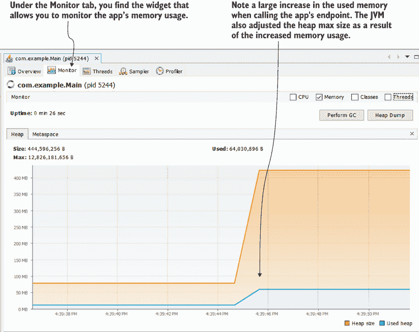

图 11.1 VisualVM 的“监视器”选项卡中的内存小部件可以帮助你确定应用程序在任意给定时间是否比平常消耗了更多的内存。通常，监视器选项卡中的小部件，如 CPU 和内存消耗，会给我们提供如何继续调查的线索。当我们看到应用程序消耗了异常大量的内存时，我们可能会决定继续进行内存分析。

本章中我们使用的应用程序位于项目 da-ch11-ex1 中。这个小型 Web 应用程序暴露了一个端点。当调用此端点时，我们提供一个数字，端点会创建相应数量的对象实例。我们基本上发送一个请求来创建一百万个对象（足够大的数字以供我们的实验使用），然后查看分析器关于此请求执行的信息。此端点执行模拟了在现实世界中，当某个应用程序能力消耗大量应用程序内存资源时会发生什么（图 11.2）。


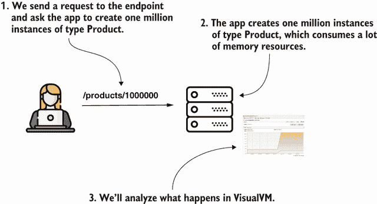

图 11.2 当我们调用由提供的项目 da-ch11-ex1 暴露的端点时，应用程序创建了大量实例，消耗了应用程序相当一部分内存。我们将使用分析器分析此场景。

要启动项目，请按照以下步骤操作：

1.  启动项目 da-ch11-ex1。

1.  启动 VisualVM。

1.  在 VisualVM 中选择项目 da-ch11-ex1 的进程。

1.  前往 VisualVM 的“监视器”选项卡。

1.  调用 `/`products/1000000` 端点。

1.  在 VisualVM 的“内存”选项卡中观察内存小部件。

在“监视器”选项卡中的内存小部件中，你可以看到应用程序使用了大量的内存资源。小部件看起来类似于图 11.1。当我们怀疑某些应用程序能力没有最佳地使用内存资源时，我们应该怎么做？调查过程遵循两个主要步骤：

1.  使用内存采样来获取应用程序存储的对象实例的详细信息。

1.  使用内存分析（仪表化）来获取执行中代码特定部分的额外详细信息。

让我们遵循在第七章到第九章中学到的相同方法来分析 CPU 资源消耗：使用采样来获取发生情况的高级视图。为了对应用程序执行进行内存使用采样，请选择 VisualVM 中的“采样器”选项卡。然后选择“内存”按钮以启动内存使用采样会话。调用端点并等待执行结束。VisualVM 屏幕将显示应用程序分配的对象。

我们在寻找占用最多内存的内容。在大多数情况下，这将是以下两种情况之一：

+   许多特定类型的对象实例被创建并填满了内存（这就是我们场景中发生的情况）。

+   某些类型的实例不多，但每个实例都非常大。

许多实例填满分配的内存是有意义的，但少数实例是如何做到这一点的呢？想象一下这个场景：你的应用程序处理大视频文件。应用程序一次可能加载两三个文件，但由于它们很大，它们填满了分配的内存。开发者可以分析是否可以优化这种能力。也许应用程序不需要一次性将整个文件加载到内存中，而只需要加载它们的一部分。

当我们开始调查时，我们不知道会陷入哪种场景。我通常会按内存占用量降序排列，然后按实例数量排列。注意图 11.3 中，VisualVM 显示了每种采样类型的内存占用量和实例数量。您需要按表格中的第二列和第三列降序排列。

在图 11.3 中，你可以清楚地看到我按“活动字节”（占用空间）降序排列了表格。然后我们可以查找我们应用程序代码库中出现在表格中的第一个类型。不要寻找原始数据类型、字符串、原始数据类型的数组或字符串数组。这些通常位于顶部，因为它们作为副作用被创建。然而，在大多数情况下，它们不会提供任何关于问题的线索。

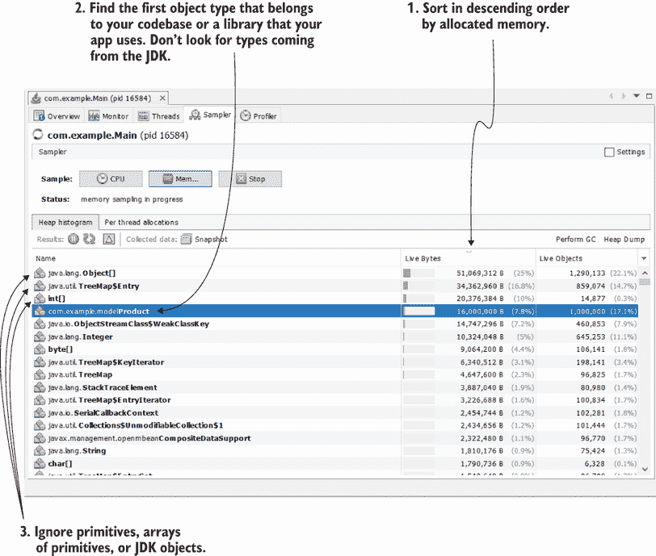

图 11.3 我们按内存占用量降序排列采样结果。这样，我们可以看到哪些对象消耗了大部分内存。我们通常不会寻找原始数据类型、字符串、字符串数组或通常的 JDK 对象。我们主要感兴趣的是找到与我们的代码库直接相关的对象，它是导致问题的原因。在这种情况下，`Product`类型（它是我们代码库的一部分）占用了大量内存。

在图 11.3 中，我们可以清楚地看到类型`Product`引起了问题。它占用了分配内存的大部分，在“活动对象”列中，我们看到应用程序创建了该类型的一百万个实例。

分析工具将它们命名为“活动对象”，因为采样只显示你内存中仍然存在的实例。


如果您需要在整个执行过程中创建的类型实例总数，您必须使用剖析（仪器化）技术。我们将在本章后面进行此操作。

这个应用只是一个示例，但在现实世界的应用中，仅仅按占用空间排序可能不够。我们需要弄清楚问题是不是由于实例数量过多，或者每个实例是否占用了大量空间。我知道你在想什么：在这种情况下不是很明显吗？是的，但在现实世界的应用中可能不是这样，所以我总是建议开发者也按实例数量降序排序以确保。


图 11.4 我们可以按实例数量（活动对象）对采样结果进行排序。这让我们可以了解某些功能是否创建了大量的对象，这些对象对内存分配产生了负面影响。

有时采样就足以帮助您识别问题。但如果您无法通过采样执行来找出创建这些对象的应用部分呢？当您仅通过采样执行无法找到问题时，您的下一步是进行剖析（仪器化）。剖析提供了更多细节，包括代码的哪个部分创建了可能有问题实例。但请记住经验法则：当您使用剖析时，您需要首先知道要剖析什么。这就是为什么我们总是从采样开始。

由于我们知道问题是出在`Product`类型上，我们将对其进行分析。就像在第七章到第九章中所做的那样，您必须使用表达式指定您想要剖析的应用部分。在图 11.5 中，我仅对`Product`类型进行了剖析。我通过在窗口右侧的内存设置文本框中使用该类的完全限定名（包和类名）来完成此操作。

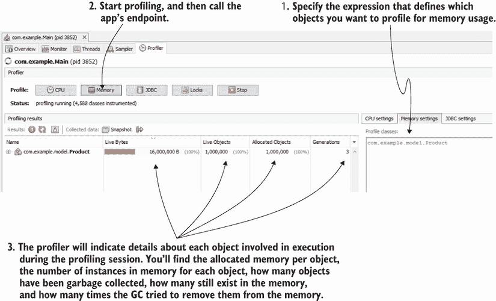

图 11.5 要对内存分配进行剖析，首先指定您想要剖析的包或类，然后通过按内存按钮开始剖析。剖析器将为您提供有关剖析类型的相关细节，包括使用的内存、实例数量、分配对象的总数以及 GC 代数。

就像第八章中 CPU 剖析的情况一样，您可以一次对更多类型进行剖析，甚至可以指定整个包。以下是一些最常用的表达式：

+   *严格类型，完全限定名*（例如，`com.example.model.Product`）—仅搜索该特定类型

+   *给定包中的类型*（例如，`com.example.model.*`）—仅搜索在包`com.example.model`中声明的类型，但不包括其子包

+   *给定包及其子包中的类型*（例如，`com.example.**`）—在指定的包及其所有子包中进行搜索

总是记住尽可能限制您要分析的类型。如果您知道 Product 导致了问题，那么只分析这个类型是有意义的。


除了仍在内存中存在的活动对象（即该类型的实例）之外，您还将获得应用程序创建的该类型实例的总数。此外，您还将看到这些实例“存活”了 GC（我们称之为*代数*）多少次。

这些细节很有价值，但找到创建对象的代码部分通常更有用。如图 11.6 所示，对于每个分析类型，工具显示实例是在哪里创建的。点击表格中该行左侧的加号（+）。此功能可以快速显示问题的根本原因。

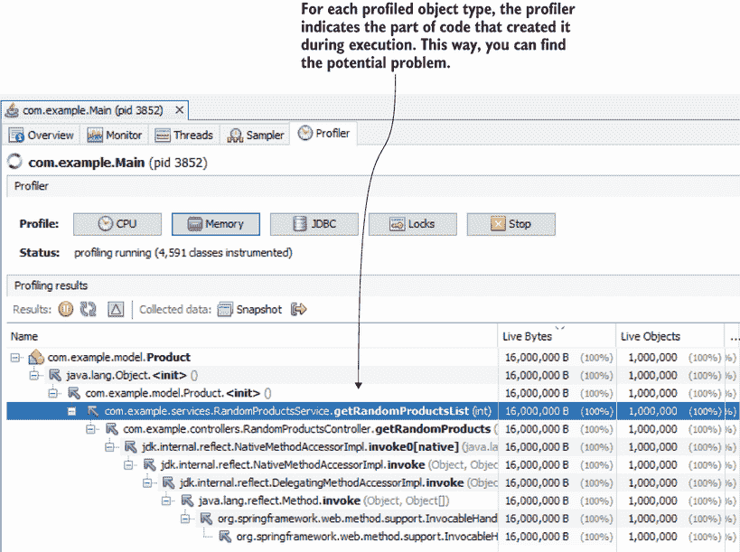

图 11.6 分析器显示了创建每个分析类型实例的代码的堆栈跟踪。这样，您可以轻松地识别出应用程序的哪个部分创建了有问题的实例。

## 11.2 使用堆转储查找内存泄漏

如果应用程序正在运行，您可以分析以识别任何可以优化的功能。但假设应用程序崩溃，并且您怀疑这是由于内存分配问题导致的？在大多数情况下，应用程序崩溃是由具有内存分配问题的功能（如内存泄漏）引起的——应用程序在不需要时不会在内存中释放它创建的对象。由于内存不是无限的，持续分配对象最终会填满内存，导致应用程序崩溃。在 JVM 应用程序中，这会在运行时通过抛出`OutOfMemoryError`来表示。

如果应用程序没有运行，您无法附加分析器来调查执行情况。但即便如此，您还有其他替代方案来调查问题。您可以使用*堆转储*，这是应用程序崩溃时堆内存的快照。尽管您可以在任何时候收集堆转储，但它最有用的时候是您无法因为某些原因分析应用程序——可能是因为应用程序崩溃，或者您根本无法访问分析进程，而您想确定它是否遭受了任何内存分配问题。

在下一节中，我们将讨论三种获取堆转储的可能方法，在 11.2.2 节中，我将向您展示如何使用堆转储来识别内存分配问题和它们的根本原因。在 11.2.3 节中，我们将讨论使用一种称为对象查询语言（OQL）的查询语言读取堆转储的更高级方法。OQL 类似于 SQL，但您不是查询数据库，而是使用 OQL 查询堆转储中的数据。

### 11.2.1 获取堆转储

在本节中，我们将讨论三种生成堆转储的方法：

+   配置应用程序，在应用程序因内存问题崩溃时自动在指定位置生成堆转储。

+   使用分析工具（如 VisualVM）。

+   使用命令行工具（如`jcmd`或`jmap`）。

您甚至可以以编程方式获取堆转储。一些框架具有生成堆转储的能力，这允许开发者集成应用程序监控工具。要了解更多关于这个主题的信息，请参阅 Java 官方 API 文档中的 `HotSpotDiagnosticMXBean` 类（[`mng.bz/19XZ`](http://mng.bz/19XZ)）。

项目 da-ch11-ex1 实现了一个端点，您可以使用 `HotSpotDiagnosticMXBean` 类生成堆转储。使用 cURL 或 Postman 调用此端点将创建转储文件：

```
curl http://localhost:8080/jmx/heapDump?file=dump.hprof
```

配置应用程序在遇到内存问题时生成堆转储

开发者经常使用堆转储来调查应用程序崩溃，当他们怀疑错误的内存分配导致问题时。因此，应用程序通常配置为在应用程序崩溃时生成内存外观的堆转储。您应该始终配置应用程序在由于内存分配问题而停止时生成堆转储。幸运的是，配置很简单。您只需在应用程序启动时添加几个 JVM 参数：

```
-XX:+HeapDumpOnOutOfMemoryError    
-XX:HeapDumpPath=heapdump.bin    
```

第一个参数 `-XX:+HeapDumpOnOutOfMemoryError` 告诉应用程序在遇到 `OutOfMemoryError`（堆已满）时生成堆转储。第二个参数 `XX:HeapDumpPath=heapdump.bin` 指定了在文件系统中存储转储的路径。在这种情况下，包含堆转储的文件将命名为 heapdump.bin，并将位于可执行应用程序附近，从 `classpath` 的根目录（因为我们使用了相对路径）。确保进程具有在此路径上的“写入”权限，以便能够将文件存储在指定位置。

以下代码片段显示了运行应用程序的完整命令：

```
java -jar -XX:+HeapDumpOnOutOfMemoryError 
➥ -XX:HeapDumpPath=heapdump.bin app.jar
```

我们将使用名为 da-ch11-ex2 的演示应用程序来演示这种方法。您可以在本书提供的项目中找到此应用程序。以下列表中的应用程序会持续向列表中添加 `Product` 类型的实例，直到内存填满。

列表 11.1 生成大量无法释放的实例

```
public class Main {

  private static List<Product> products = new ArrayList<>();

  public static void main(String[] args) {
    Random r = new Random();
    while (true) {                   ❶
      Product p = new Product();
      p.setName("Product " + r.nextInt());
      products.add(p);               ❷
    }
  }
} 
```

❶ 循环无限迭代。

❷ 向列表中添加实例，直到内存填满

以下代码片段显示了简单的 `Product` 类型的外观：

```
public class Product {

  private String name;

  // Omitted getters and setters

}
```

也许您想知道为什么产品实例有一个随机名称。我们将在 11.2.2 节中讨论读取堆转储时需要它。目前，我们只对如何生成堆转储以找出为什么这个应用程序在几秒钟内填满其堆内存感兴趣。

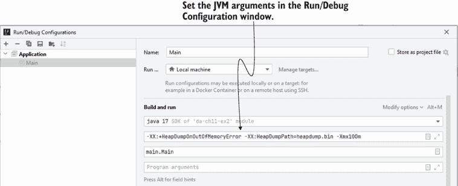

图 11.7 您可以从您的 IDE 中配置 JVM 参数。在启动应用程序之前，在运行/调试配置中添加这些值。

您可以使用 IDE 运行应用程序并设置参数。图 11.7 展示了如何在 IntelliJ 中设置 JVM 参数。我还添加了 `-Xmx` 参数来限制应用程序的堆内存仅为 100 MB。这将使堆转储文件更小，并且我们的示例更容易理解。

当你运行应用时，稍等片刻，应用将会崩溃。只有 100 MB 的堆空间，内存不应该超过几秒钟就满了。项目文件夹中包含一个名为 heapdump.bin 的文件，其中包含应用停止时的堆中所有数据的详细信息。你可以使用 VisualVM 打开此文件进行分析，如图 11.8 所示。

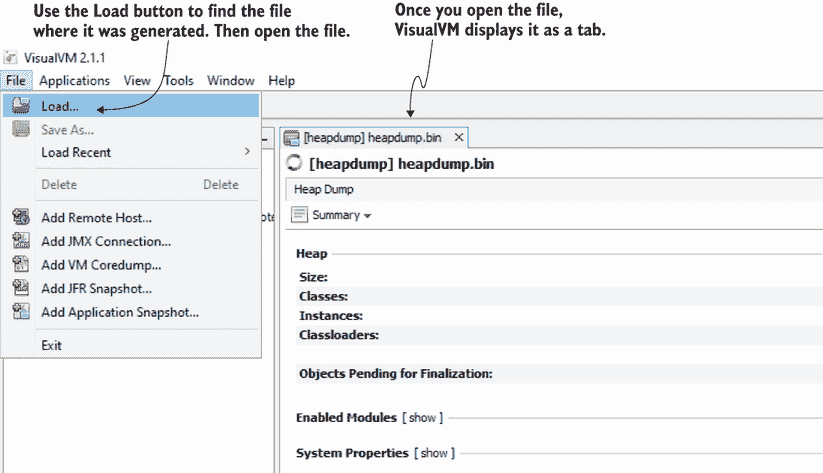

图 11.8 你可以使用 VisualVM 打开堆转储文件进行分析。使用菜单中的“加载”按钮来查找文件。打开文件，VisualVM 将显示堆转储作为一个标签页。

使用分析器获取堆转储

有时你需要获取正在运行进程的堆转储。在这种情况下，最简单的解决方案是使用 VisualVM（或类似的分析工具）来生成转储。使用 VisualVM 获取堆转储就像点击一个按钮一样简单。只需在监视器标签页中使用堆转储按钮，如图 11.9 所示。

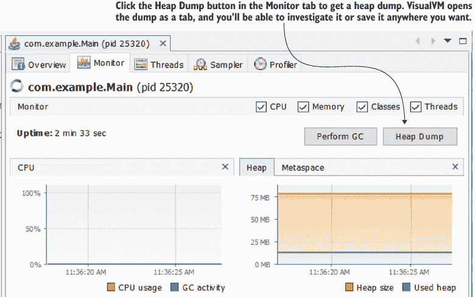

图 11.9 在 VisualVM 的监视器标签页中按下“堆转储”按钮以获取所选进程的堆转储。VisualVM 将转储作为标签页打开，你可以进一步调查它或将其保存到任何你想要的位置。

使用命令行获取堆转储

如果你需要获取正在运行进程的堆转储，但你的应用部署在一个你无法连接分析器的环境中，不要慌张；你仍然有选择。你可以使用 JDK 提供的命令行工具 `jmap` 来生成堆转储。

使用 `jmap` 收集堆转储有两个步骤：

1.  找到你想获取堆转储的正在运行的应用的进程 ID (PID)。

1.  使用 `jmap` 将转储保存到文件中。

要找到正在运行的进程的 PID，你可以使用 `jps`，就像我们在第十章中做的那样：

```
jps -l
25320 main.Main    
132 jdk.jcmd/sun.tools.jps.Jps
25700 org.jetbrains.jps.cmdline.Launcher
```

第二步是使用 `jmap`。要调用 `jmap`，需要指定进程 ID (PID) 和堆转储文件将要保存的位置。你还必须使用 `-dump:format=b` 参数指定输出为二进制文件。图 11.10 展示了在命令行中使用此工具的方法。

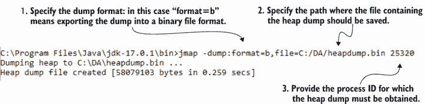

图 11.10 在命令行中使用 `jmap` 获取堆转储。你需要指定包含转储的文件的路径以及为你生成转储的进程 ID。该工具将堆转储作为二进制文件保存在请求的位置。

复制以下代码以方便使用命令：

```
jmap -dump:format=b,file=C:/DA/heapdump.bin 25320
```

现在，你可以打开使用 `jmap` 保存的文件，在 VisualVM 中进行调查。

### 11.2.2 读取堆转储

在本节中，我们将重点关注使用堆转储来调查内存分配问题。堆转储就像是在转储生成时的内存的“图片”。它包含应用在堆中所有的数据，这意味着你可以用它来检查数据和它的结构方式。这样，你可以确定哪些对象占据了分配内存的大部分，并理解为什么应用无法释放它们。

记住，在“图片”（堆转储）中你可以看到一切。如果未加密的密码或任何类型的私人数据在内存中，拥有堆转储的人将能够获取这些详细信息。


与线程转储不同，你不能将堆转储作为纯文本进行分析。相反，你必须使用 VisualVM（或任何通用的性能分析工具）。在本节中，我们将使用 VisualVM 分析我们在 11.2.1 节中为项目 da-ch11-ex2 生成的堆转储。你将学会利用这种方法来找到 `OutOfMemoryError` 的根本原因。

当你在 VisualVM 中打开堆转储时，性能分析工具会显示堆转储的摘要视图（图 11.11），它提供了有关堆转储文件的快速详细信息（例如，文件大小、类总数、转储中的实例总数）。你可以使用这些信息来确保你有正确的转储，以防你不是提取转储的人。

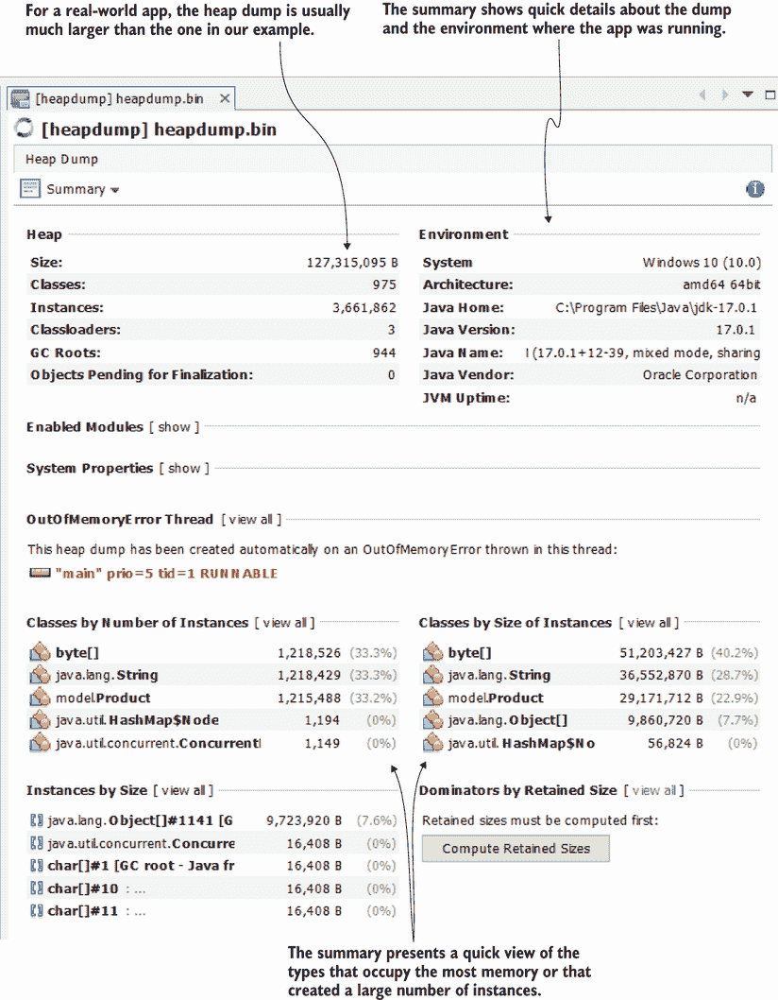

图 11.11 在打开堆转储后的初始屏幕中，VisualVM 提供了堆转储的摘要，其中包括有关转储本身以及应用程序运行的系统信息。视图还显示了占用最大内存量的类型。

有时候我不得不调查支持团队从应用程序运行的环境访问的堆转储。然而，我自己无法访问这些环境，所以我必须依赖别人为我获取数据。不止一次，我惊讶地发现我得到了错误的堆转储。我通过查看转储的大小并将其与我知道的进程配置的最大值进行比较，或者通过查看操作系统或 Java 版本来识别错误。

我的建议是首先快速检查摘要页面，确保你有正确的文件。在摘要页面，你还会找到占用大量空间的类型。我通常不依赖这个摘要，而是直接转到对象视图，在那里我开始我的调查。在大多数情况下，摘要对我来说不足以得出结论。

要切换到对象视图，请从堆转储标签页左上角的下拉菜单中选择对象（图 11.12）。这将允许你调查堆转储中的对象实例。

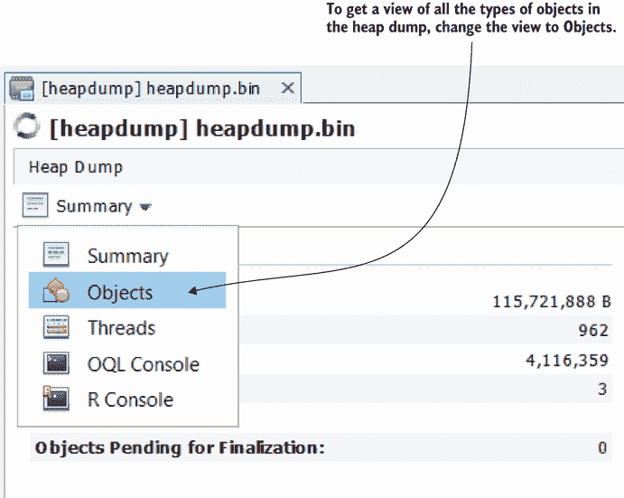

图 11.12 你可以切换到对象视图，这使得调查堆转储中的实例更容易。

就像内存采样和性能分析一样，我们正在寻找占用最多内存的类型。最佳方法是按实例和占用内存量降序排序，并查找属于应用程序代码库的第一种类型。不要寻找诸如原始数据类型、字符串或原始数据类型和字符串数组之类的类型。通常有很多这样的类型，而且它们不会给你很多关于错误的线索。

在图 11.13 中，您可以看到，经过排序后，`Product`类型似乎与问题有关。`Product`类型是应用程序代码库中第一个类型，它使用了大量的内存。我们需要弄清楚为什么创建了这么多实例，以及为什么垃圾收集器不能从内存中删除它们。

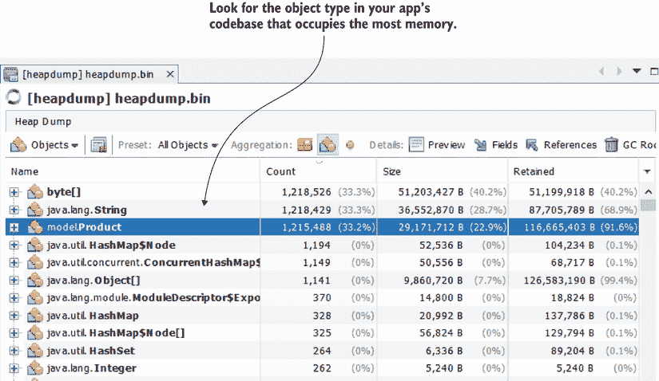

图 11.13 使用列排序来识别哪种类型创建了大量的实例或占用了大量的空间。始终在您的应用程序代码库中寻找第一个对象。在这种情况下，无论是实例数量还是大小，`Product`类型都是列表中的第一个。

您可以通过选择行左侧的小加号（+）来获取该类型所有实例的详细信息。我们已经知道有超过一百万个`Product`实例，但我们仍然需要找到

+   代码的哪一部分创建了这些实例

+   为什么垃圾收集器不能及时删除它们以避免应用程序失败

您可以找到每个实例所引用的内容（通过字段）以及什么引用了这个实例。由于我们知道垃圾收集器只有在没有引用者的情况下才能从内存中删除实例，因此我们寻找引用实例的内容，以查看它是否仍在处理上下文中需要，或者应用程序是否忘记了删除其引用。

图 11.14 显示了`Product`实例细节的扩展视图。我们可以看到该实例引用了一个`String`（产品名称），并且其引用保存在一个`Object`数组中，该数组是`ArrayList`实例的一部分。此外，`ArrayList`实例似乎保存了大量的引用（超过一百万个）。这通常不是一个好兆头，因为要么应用程序实现了未优化的功能，要么我们发现了内存泄漏。

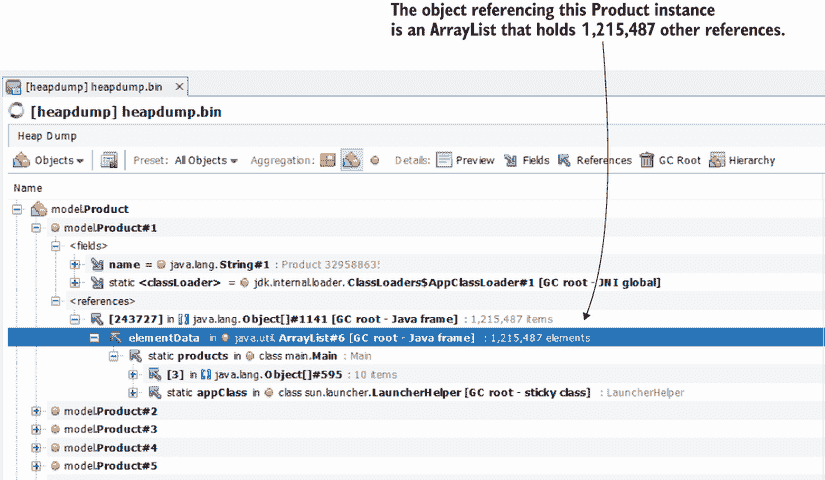

图 11.14 实例的引用。通过使用堆转储，您可以在每个实例中找到在转储生成时被引用的其他实例。分析工具还告诉您给定引用在代码中的存储位置。在这种情况下，`ArrayList`，它保存了超过一百万个引用，是`Main`类中的一个静态变量。

要了解哪种情况，我们需要使用我们在第二章到第五章中讨论的调试和日志技术来调查代码。幸运的是，分析器会告诉你如何在代码中找到这个列表。在我们的例子中，这个列表是在`Main`类中声明为一个静态变量。

使用 VisualVM，我们可以轻松理解对象之间的关系。通过结合本书中学习到的其他调查技术，您拥有了处理这类问题的所有工具。复杂的问题（和应用程序）可能仍然需要大量的努力，但使用这种方法将为您节省大量时间。

### 11.2.3 使用 OQL 控制台查询堆转储

在本节中，我们将讨论调查堆转储的更高级方法。我们使用类似于 SQL 的查询语言从堆转储中检索详细信息。我们在 11.2.2 节中讨论的简单方法通常足以识别内存分配问题的根本原因。但当我们需要比较两个或更多堆转储的详细信息时，它们就不够了。

假设你想要比较为应用的两个或更多版本提供的堆转储，以确定在版本发布之间是否实现了有缺陷或不优化的功能。你可以逐个手动调查它们。但我会教你如何编写可以在每个堆转储上轻松运行的查询，这将为你节省时间。这就是 OQL 是一种优秀方法的地方。图 11.15 展示了如何将视图切换到 OQL 控制台，在那里你可以运行查询以调查堆转储。

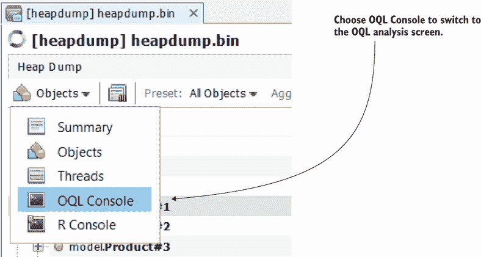

图 11.15 要在 VisualVM 中切换到 OQL 视图，请从堆转储标签页左上角的下拉菜单中选择 OQL 控制台。

我们将讨论一些我认为最有用的例子，但请记住，OQL 更复杂。（你可以在 [`mng.bz/Pod2`](http://mng.bz/Pod2) 上找到更多关于其功能的信息。）

让我们从简单的一个开始：选择给定类型的所有实例。比如说，我们想要从堆转储中获取所有 `Product` 类型的实例。要使用 SQL 查询从关系数据库中的表中获取所有产品记录，我们会编写类似这样的代码：

```
select * from product
```

要使用 OQL 查询堆转储中的所有 `Product` 实例，你需要编写如下代码：

```
select p from model.Product p
```

注意：对于 OQL，关键字如“select”、“from”或“where”始终以小写形式书写。类型总是用它们的完全限定名称（包+类名）给出。


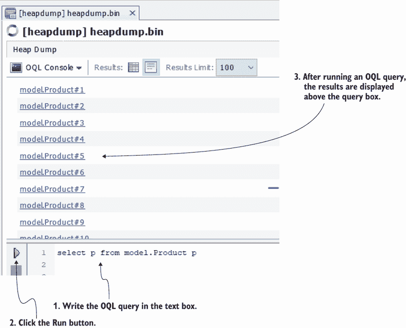

图 11.16 使用 VisualVM 运行 OQL 查询。在 OQL 控制台中，在窗口底部的文本框中编写 OQL 查询，然后单击运行按钮（文本框左侧的绿色箭头）以运行查询。结果将显示在文本框上方。

图 11.16 展示了执行从堆转储中检索所有 `Product` 实例的简单查询结果。

注意：在学习 OQL 时，请使用小堆转储。现实世界的堆转储通常很大（4 GB 或更大）。OQL 查询会变慢。如果你只是在学习，请生成并使用我们在本章中使用的类似的小尺寸堆转储。


你可以选择任何查询实例以获取其详细信息。你可以找到保持对该实例引用的内容，该实例引用的内容，以及其值（图 11.17）。

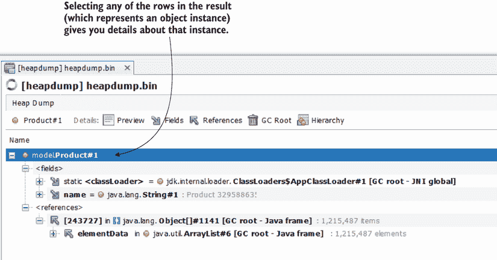

图 11.17 你可以通过单击来访问查询实例的详细信息（引用者和被引用者）。

你还可以选择从某些实例引用的值或引用。例如，如果我们想获取所有产品名称而不是产品实例，我们可以编写以下查询（图 11.18）：

```
select p.name from model.Product p
```

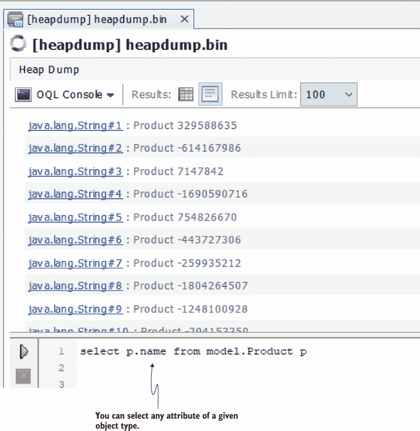

图 11.18：选择给定对象类型的属性。就像在 Java 中一样，你可以使用标准的点操作符来引用实例的属性。

使用 OQL，你可以同时提取多个值。为此，你需要将它们格式化为 JSON，如下一列表所示。

列表 11.2：使用 JSON 投影

```
 select 

{                                           ❶
   name: p.name,                            ❷
   name_length: p.name.value.length         ❸
} 

from model.Product p
```

❶ 大括号包围了 JSON 对象表示

❷ 属性名称取产品名称的值。

❸ 属性名称 _length 取产品名称中字符数的值。

图 11.19 显示了运行此查询的结果。

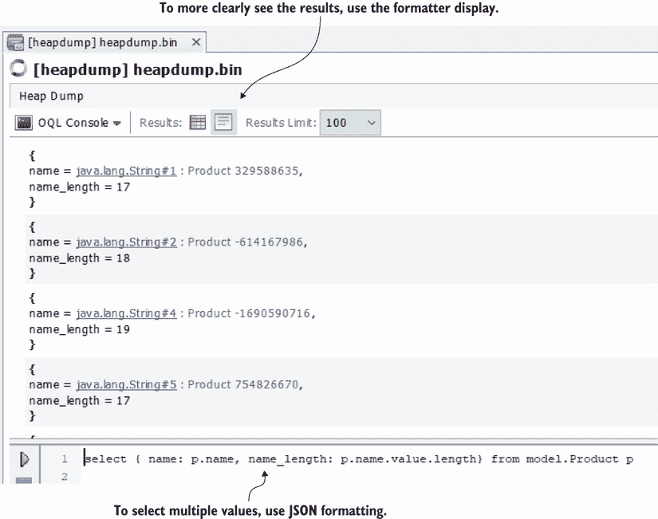

图 11.19：选择多个值。你可以使用 JSON 格式化在一个查询中获取多个值。

你可以将此查询修改为，例如，添加一个或多个选定值的条件。假设你只想选择名称长度超过 15 个字符的实例。你可以编写如下查询的片段：

```
select { name: p.name, name_length: p.name.value.length} 
from model.Product p 
where p.name.value.length > 15
```

让我们继续探讨一些稍微高级一点的内容。在调查内存问题时，我经常使用`referrers()`方法来获取指向特定类型实例的对象。通过使用此类内置 OQL 函数，你可以做很多有用的事情：

+   *查找或查询实例引用者*——可以告诉你应用是否有内存泄漏

+   *查找或查询实例引用*——可以告诉你特定实例是否是内存泄漏的原因

+   *在实例中查找重复项*——可以告诉你是否可以将特定功能优化以使用更少的内存

+   *查找某些实例的子类和超类*——在不查看源代码的情况下，让你了解应用的类设计

+   *识别长生命周期路径*——可以帮助你识别内存泄漏

要获取类型`Product`的所有唯一引用，你可以使用以下查询：

```
select unique(referrers(p)) from model.Product p
```

图 11.20 显示了运行此查询的结果。在这种情况下，我们可以看到所有产品实例都被一个对象——列表所引用。通常，当大量实例只有少量引用时，这是一个内存泄漏的迹象。在我们的例子中，列表保留了所有`Product`实例的引用，阻止 GC 从内存中删除它们。

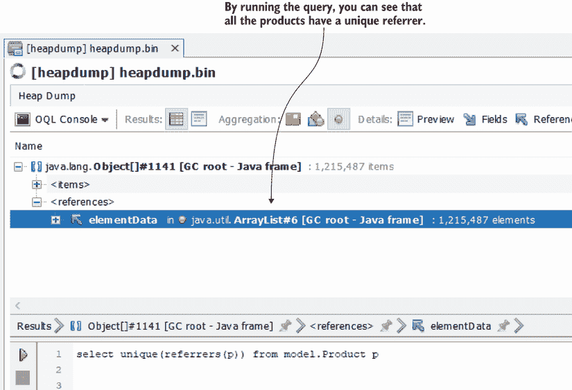

图 11.20：选择特定类型的所有唯一引用者，这可以显示是否有一个对象阻止 GC 从内存中删除实例。这可以是一个快速识别内存泄漏的方法。

如果结果不唯一，你可以使用以下查询通过实例计数引用，以找到可能涉及内存泄漏的实例：

```
select { product: p.name, count: count(referrers(p))} from model.Product p
```

OQL 查询提供了很多机会，一旦您编写了一个查询，您就可以根据需要多次运行它，并在不同的堆转储上运行。

## 摘要

+   一个未针对内存分配进行优化的应用可能会引起性能问题。优化应用以智能地分配（避免浪费不必要的内存空间）内存中的数据对于应用性能至关重要。

+   性能分析工具允许您在应用执行期间采样和记录内存的使用情况。这可以帮助您识别应用中未优化的部分，并提供有关可以改进的详细信息。

+   如果在执行期间不断向内存中添加新的对象实例，但应用从未删除对新实例的引用，垃圾回收器将无法删除引用并释放内存。当内存完全被占用时，应用无法继续执行并停止。在停止之前，应用会抛出`OutOfMemoryError`。

+   要调查`OutOfMemoryError`，我们使用堆转储。堆转储收集应用堆内存中的所有数据，并允许您分析它以找出问题所在。

+   您可以使用几个 JVM 参数启动应用，指示它在`OutOfMemoryError`失败时在指定路径生成堆转储。

+   您也可以通过使用性能分析工具或如`jmap`之类的命令行工具来获取堆转储。

+   要分析堆转储，请将其加载到 VisualVM 等性能分析工具中，这允许您调查转储中的实例及其关系。这样，您可以找出应用中哪些部分未优化或存在内存泄漏。

+   VisualVM 提供了分析堆转储的更高级方法，例如 OQL 查询。OQL 是一种类似于 SQL 的查询语言，您可以使用它从堆转储中检索数据。
