# 12 调查大型系统中的应用程序行为

本章涵盖

+   调查应用程序通信问题

+   在您的系统中使用日志监控工具

+   利用部署工具

在本章中，我们将超越单个应用程序的边界，讨论如何调查由系统中的应用程序协同工作引起的情况。如今，许多系统由多个相互通信的应用程序组成。大型商业系统利用各种应用程序，并且它们通常使用不同的技术和平台实现。在许多情况下，这些应用程序的成熟度也各不相同，从新服务到旧的和混乱的脚本。

调试、性能分析和日志记录并不总是足够。有时您需要找到更大的线索。一个应用程序可以独立工作得很好，但不能正确地与其他应用程序或其部署的环境集成。

我们将从 12.1 节开始，介绍调查系统服务之间通信的方法。在 12.2 节中，我们将关注在系统中实施应用程序监控的相关性以及如何使用监控工具提供的信息。我们将在 12.3 节结束本章的讨论，我们将讨论如何利用部署工具。

## 12.1 调查服务之间的通信

在本节中，我们讨论调查应用程序之间的通信。在一个系统中，应用程序“交谈”以履行其职责。到目前为止，我们一直专注于调查应用程序的内部工作原理以及应用程序与数据库管理系统之间的通信。但对于相互交谈的应用程序呢？是否有方法来监控由许多应用程序组成的整个系统中的事件（图 12.1）？


图 12.1 在许多情况下，调查停留在应用程序的边界内。但您可能需要超越给定进程内部发生的事情。问题或异常行为可能是由存在通信问题的问题应用程序引起的，实现监控工具将使调查这类问题更容易。

让我们讨论如何使用性能分析工具来调查应用程序之间“交流”的问题。我们将使用 JProfiler 来观察一个简单应用程序（项目 da-ch12-ex1）的通信，以暴露一个您可以调用的端点（`/demo`端点）。当您向此端点发送 HTTP 请求时，应用程序会向由[httpbin.org](http://httpbin.org/)提供的端点发送请求，该端点延迟 5 秒后以 200 OK HTTP 状态响应。

正如您在本节中将学到的，JProfiler 提供了一套您可以用来观察应用程序接收到的请求和发送的请求的工具。此外，您还可以调查套接字上的低级通信事件。这些方法可以帮助您确定通信问题的根本原因。

在 12.1.1 节中，我们将使用 JProfiler 观察应用程序接收到的请求。在 12.1.2 节中，我们将调查应用程序发送的请求的详细信息，而在 12.1.3 节中，我们将专注于调查套接字上的低级通信事件。

微服务

让我们坦率地谈谈微服务。你将要工作的许多系统声称它们是微服务。大多数情况下这并不真实；它们只是面向服务的架构。微服务已经（出于某种原因，我无法完全理解）成为了一个卖得相当好的品牌：

+   你想要更快地雇佣某人吗？告诉他们他们将使用微服务工作。

+   你想在销售前会议中给客户留下深刻印象吗？告诉他们你做微服务。

+   你想要更多的人参加你的演示吗？没错：只需在标题中添加微服务。

但微服务比我认为的大多数开发者理解的要复杂。如果你想要更好地理解微服务是什么，你会在那里找到大量的文献。你可以从 Chris Richardson 的《Microservices Patterns》（Manning, 2018）开始，然后阅读 Sam Newman 的《Monolith to Microservices》（O’Reilly Media, 2018）或《Building Microservices: Designing Fine-Grained Systems》，第二版（O’Relly Media, 2021），也是 Sam Newman 的作品。

无论它们是否是真正的微服务系统，你仍然需要知道如何调查问题和如何快速理解在给定场景下系统做了什么。在本章中，我们将讨论适用于微服务的调查技术，但不仅限于微服务。我更喜欢使用简单的术语*服务*而不是*微服务*。有时我会直接使用*应用程序*或*应用*。

### 12.1.1 使用 HTTP 服务器探针观察 HTTP 请求

当两个应用程序进行通信时，数据流向两个方向。一个应用程序要么发送请求，要么接收请求。当一个应用程序发送请求时，我们称其为*客户端*；当它接收请求时，我们称其为*服务器*。在本节中，我们专注于应用程序作为服务器接收的 HTTP 请求。我们将使用书中提供的简单应用程序（项目 da-ch12-ex1）来了解如何使用 JProfiler 监控此类事件。

在你的 IDE 中打开项目 da-ch12-ex1 并启动应用程序。使用 JProfiler 连接到应用程序，并开始记录发送到 HTTP 服务器>事件的接收到的 HTTP 请求，然后按星形图标记录单个事件。图 12.2 显示了如何开始记录事件。我们想要了解应用程序接收到的 HTTP 请求以及这些请求可以提供的信息。

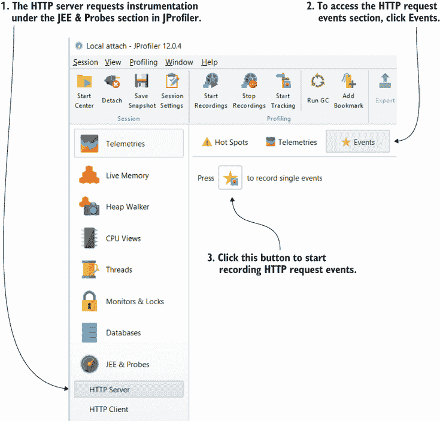

图 12.2 要使用 JProfiler 开始记录接收到的 HTTP 请求，请转到 HTTP 服务器>事件，然后按星形图标记录单个事件。现在，每当被分析的应用程序接收 HTTP 请求时，JProfiler 将显示详细信息。

让我们将这个演示应用程序暴露的唯一端点称为：

```
curl http://localhost:8080/demo
```

如图 12.3 所示，JProfiler 显示了服务器接收到的请求。首先，你可以轻松地确定事件何时结束：显示的状态将是“完成”。如果操作永远不会结束，这意味着由于某种原因请求没有完全处理，或者响应没有发送回客户端，状态将是“进行中”。这样，你可以确定请求是否耗时过长，或者是否由于某些原因而延迟或中断。

HTTP 服务器事件表还显示了事件持续时间。如果事件已完成但耗时较长，你需要确定导致延迟的原因。可能是由于通信故障，你将使用第 12.1.3 节中讨论的套接字事件来观察，或者你可能需要像第七章到第九章中讨论的那样采样和性能分析。

也很重要的是要看到应用接收了多少事件。在某些情况下，一个请求不会引起麻烦，但我记得有一个情况是一个应用受到了其中一个客户端*轮询*（在短时间内重复发送请求）其中一个端点的影响。如果客户端在短时间内发送大量请求，并且没有任何阻止它们到达应用的因素，应用可能难以响应所有请求，甚至崩溃。

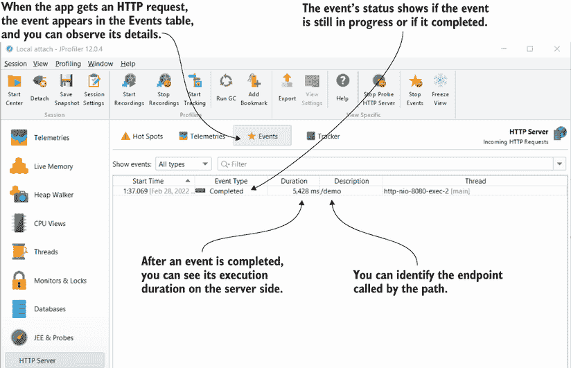

图 12.3 开始记录 HTTP 服务器事件（应用接收到的 HTTP 请求）后，性能分析工具会在页面上显示所有接收事件的详细信息。你可以轻松地看到事件是否结束以及完成所需的时间。

### 12.1.2 使用 HTTP 客户端探针观察应用发送的 HTTP 请求

与 HTTP 服务器事件（应用接收到的 HTTP 请求）类似，你可以对 HTTP 客户端事件（应用发送的 HTTP 请求）进行性能分析。在本节中，我们将讨论分析应用发送的 HTTP 请求以识别它们可能引起的问题。为此，我们将继续使用项目 da-ch12-ex1 中提供的应用，与我们在 12.1.1 节中使用的是同一个应用。当你调用它公开的`/demo`端点时，该应用会向 httpbin.org 的端点发送请求。让我们启动应用，调用`/demo`端点，并找出我们是否可以观察到这个应用发送的 HTTP 请求。

启动应用后，开始在 JProfiler 中记录 HTTP 客户端事件（图 12.4），并调用`/demo`端点：

```
curl http://localhost:8080/demo
```

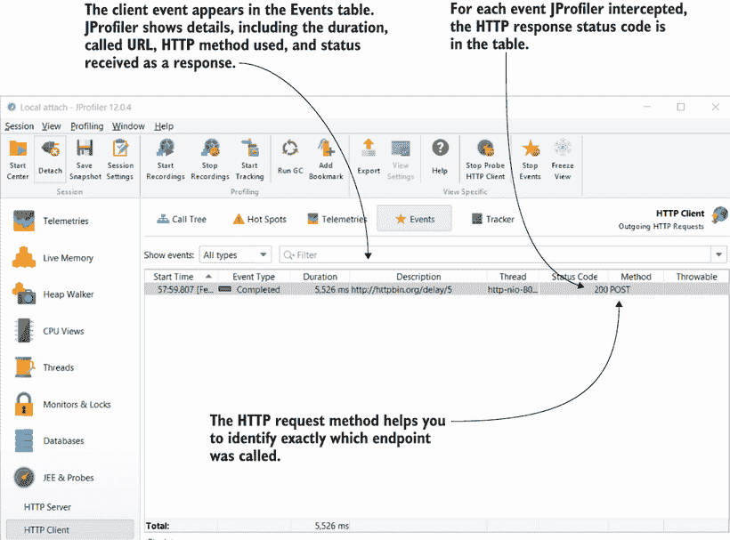

图 12.4 在 JProfiler 中，你可以记录应用发送的所有 HTTP 请求，无论它们是如何发送的（应用使用的技术），它显示了诸如持续时间、状态码、调用的 HTTP 方法和 URI 以及是否遇到异常等详细信息——这些都是调查涉及应用发送的 HTTP 请求的具体场景时的有用信息。

查看此工具提供的信息（图 12.4）。您首先感兴趣的可能是描述和方法列，因为它们有助于您识别应用程序调用的端点。一旦您知道了这一点，提供最多洞察力的细节是调用持续时间、响应状态码以及是否遇到了异常。

如果您发现某个调用执行时间过长（超过您的预期），您可能需要找出原因。首先，尝试确定问题是由数据交换（通过网络）还是应用程序内部（例如，反序列化响应或处理它）引起的。

正如您将在第 12.1.3 节中看到的那样，调查套接字上的底层事件可以告诉您问题是否是通信本身，或者您是否应该查看应用程序的某些操作。如果您发现数据交换不是问题的原因，您可以将我们在第七章到第九章中讨论的配置文件技术应用于发现影响应用程序执行性能的因素。

正如在第 12.1.1 节中讨论的 HTTP 请求一样，考虑应用程序发送的 HTTP 请求的事件计数（事件表中出现多少行）非常重要。您的应用程序是否发送了过多的请求，导致其他服务响应较慢？在我之前实施的一个应用程序中，我发现应用程序由于一个错误的重试机制而频繁发送请求。由于请求是为了检索一些数据，并没有改变任何东西或导致错误输出，因此问题一开始很难被发现。在这种情况下，补充请求只会影响应用程序的性能。

### 12.1.3 调查套接字上的底层事件

在本节中，我们讨论调查套接字上的底层通信事件，以查看通信问题是由通信通道（例如，网络）引起的，还是由应用程序内部的故障引起的。要观察这些底层事件，您可以使用 JProfiler：转到“套接字 > 事件”部分。

启动应用程序，开始在 JProfiler 中注册事件，然后向`/demo`端点发送请求：

```
curl http://localhost:8080/demo
```

JProfiler 拦截套接字上的所有事件，并将它们以表格形式显示，如图 12.5 所示。

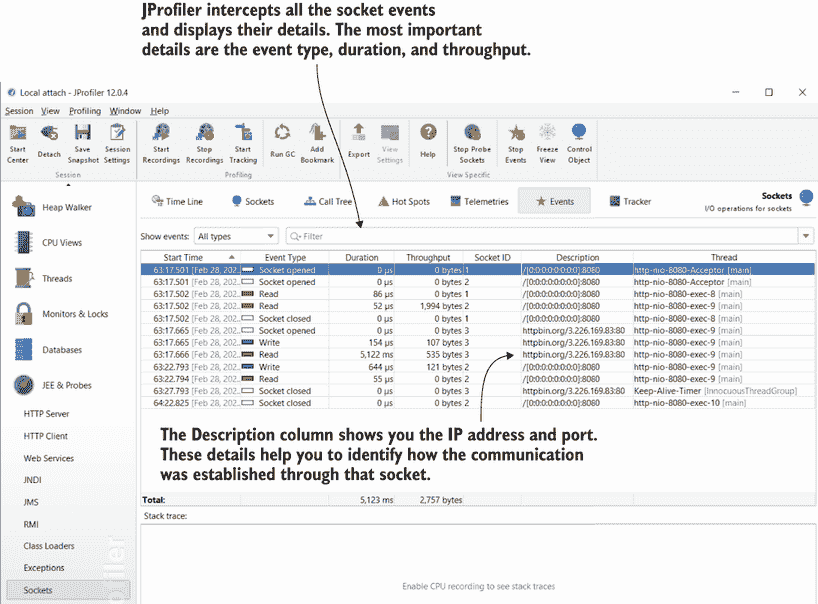

图 12.5 任何应用程序通过网络层交换的消息都使用底层的套接字。您可以使用 JProfiler 之类的分析工具来观察套接字级别的所有底层事件。要监控这些事件，请使用“套接字 > 事件”部分。这些事件可以帮助您了解应用程序是否面临网络问题，或者它是否只是没有正确管理通信。

套接字是应用程序与其通信的另一个进程的网关。在建立通信时，应用程序将执行以下套接字事件（图 12.6）：

1.  打开套接字以建立通信（与需要与之通信的应用程序进行握手）。

1.  从套接字读取（接收数据）或通过它写入（发送数据）。

1.  关闭套接字。

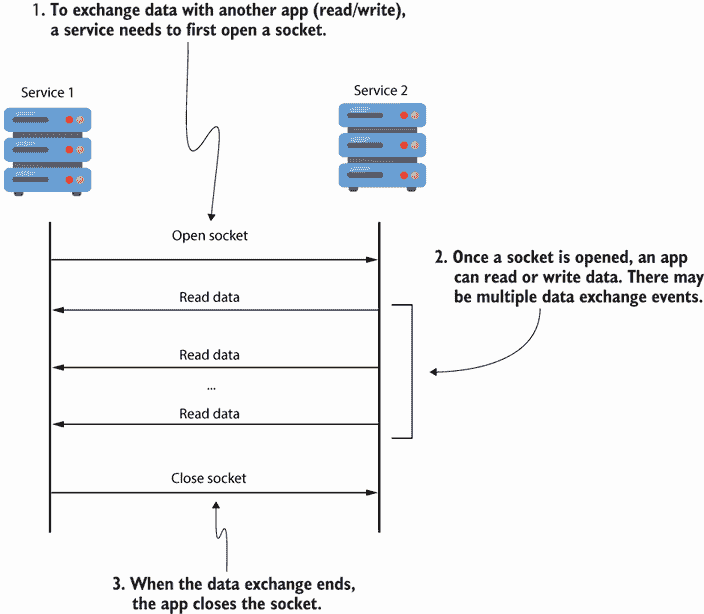

图 12.6 当应用程序开始数据交换时，它首先打开一个套接字。为了交换数据，应用程序可以执行多个数据交换事件（读取或写入数据事件）。当数据交换结束时，应用程序关闭套接字。

让我们更详细地讨论这些事件，并了解它们能告诉你关于应用程序行为的什么信息。

打开套接字以建立通信

应该引起你注意的是打开套接字事件的长时间执行。打开套接字不应该花费很长时间。如果它确实花费了很长时间，这表明通信通道存在问题。例如，应用程序运行的系统或虚拟机可能配置不当，或者网络可能存在问题。当打开套接字事件花费很长时间时，通常不是由你的代码问题引起的。

通过套接字写入数据或从它读取数据

通过套接字读取或写入数据是实际通信过程。两个应用程序相互连接，并交换数据。如果这个操作很慢，可能是因为大量数据传输，或者通信通道缓慢或故障。

你可以使用 JProfiler 找到通过套接字发送的数据量（参见图 12.5 中的吞吐量列），这样你可以决定缓慢是由数据量还是其他原因引起的。在我们的示例中，你可以看到应用程序接收了非常少量的数据（只有 535 字节），但它必须等待超过 5 秒。在这种情况下，我们可以得出结论，问题不是当前应用程序的问题，而是通信通道或我们的应用程序与之通信的进程的问题。

我们在示例中使用的应用程序调用[httpbin.org](http://httpbin.org/)上的一个端点，该端点会导致 5 秒的延迟。因此，我们的结论确实是正确的：其他通信端点导致了缓慢。

关闭套接字

关闭套接字不会导致缓慢。它允许应用程序释放分配给套接字的所有资源。因此，当通信结束时，应用程序需要关闭套接字。

## 12.2 集成日志监控的相关性

今天，许多系统采用面向服务的架构，并且随着时间的推移增加他们提供的应用程序数量。这些应用程序相互通信，交换、存储和处理数据，执行用户需要的业务功能。随着应用程序数量和应用程序规模的增加，系统变得越来越难以监控。注意到哪里出了问题已经变得相当具有挑战性。为了确定导致问题的系统部分，你可以使用日志监控工具提供的功能（图 12.7）。

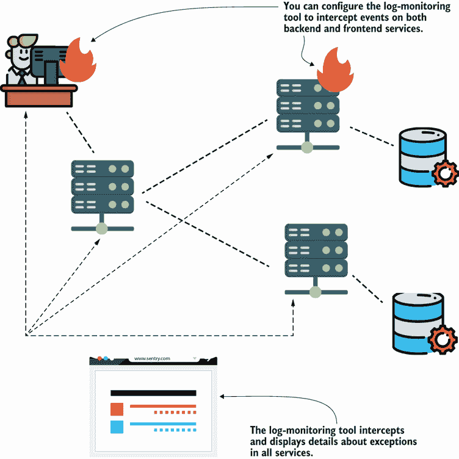

图 12.7 日志监控工具帮助你轻松收集和可视化整个系统中的事件。你可以使用这些详细信息来调查问题和特定应用的行为。

定义：日志监控工具是一种你可以集成到应用中以查看整个系统中发生的异常的软件。


工具会观察所有应用的执行情况，并在应用抛出运行时异常时收集数据。然后，它会以用户友好的方式显示这些信息，帮助你更快地识别问题的原因。

我们将使用一个简单的工具，你可以配置它以收集异常事件并以易于阅读的方式呈现。Sentry([`sentry.io`](https://sentry.io))是我使用过许多系统中的一种日志监控工具，它在应用的开发和生产过程中都证明极为有用。Sentry 有一个免费计划，你可以用于学习目的（如本章中的示例）。

让我们创建一个故意抛出异常的应用，并将其与 Sentry 集成。此应用位于项目 da-ch12-ex2 中。

下面的代码片段展示了此应用的简单实现。我们希望使用 Sentry 来观察此应用引发的异常。

```
@RestController
public class DemoController {

  @GetMapping                               ❶
  public void throwException() {
    throw new RuntimeException("Oh No!");   ❷
  }
}
```

❶ 定义一个使用 HTTP GET 调用的端点

❷ 当你向端点发送请求时抛出异常

将应用与 Sentry 集成非常简单。Sentry 提供 API，允许你仅用几行代码就将各种平台开发的应用集成。官方文档提供了根据所使用的技术如何集成你的应用的示例和详细步骤。

你需要遵循的步骤很简单：

1.  在 Sentry 中创建一个账户。

1.  添加一个新的项目（代表你想要监控的应用）。

1.  收集 Sentry 提供的项目数据源名称（DSN）地址。

1.  在你的项目中配置 DSN 地址。

一旦你创建了一个账户（步骤 1），你就可以添加项目（步骤 2）。对于这两个步骤，你只需遵循[sentry.io](https://sentry.io)上的说明；这个过程就像在任何网站上创建账户一样简单。你添加的每个项目都会出现在你的仪表板上，如图 12.8 所示。

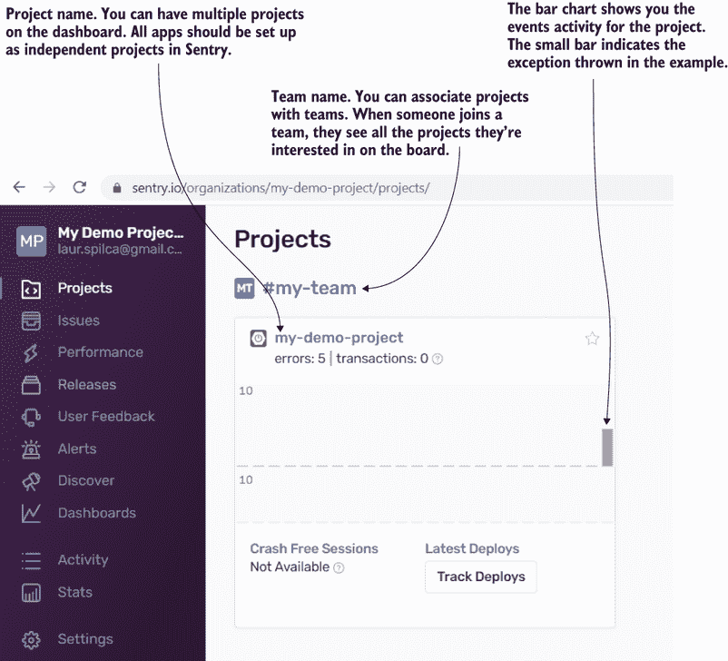

图 12.8 Sentry 独立监控系统中每个服务的日志，并在初始仪表板上为每个服务显示事件的简要概述。服务（称为项目）分配给团队，Sentry 可以配置为向团队成员发送事件通知的电子邮件。

我创建了 my-demo-project。一个或多个项目可以被添加到一个团队中。在这种情况下，当我添加第一个项目时，Sentry 默认创建了我的团队。如果您喜欢，可以重命名它，并在需要时添加其他人。当您有更多应用时，您可以将其分配到团队中。每个用户可以成为一个或多个团队的成员，并可以监控分配给他们的团队的应用事件。Sentry 中的团队是一种简单的方式来组织谁负责什么，并使开发者对监控某些服务负责。

由于您的应用尚未向 Sentry 发送任何事件，您的项目在柱状图中不会显示条形（如图 12.8 所示）。您首先需要告诉您的应用将事件发送到何处。为此，您需要配置 Sentry 提供的 DSN 地址，如图 12.9 所示。您可以在项目设置中的“客户端密钥”部分（步骤 3）找到 DSN 地址。

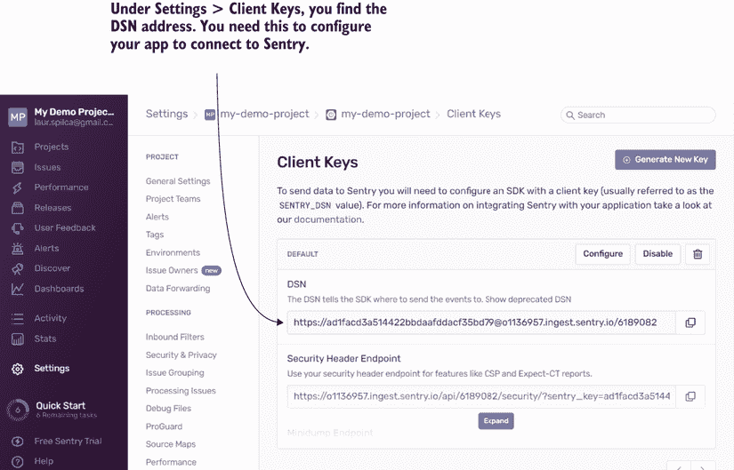

图 12.9 在项目设置中，在“客户端密钥”部分，您会找到 DSN 值，这是一个 URL。应用使用此 URL 将事件发送到 Sentry。

根据应用类型，Sentry 提供不同的配置设置方法（步骤 4）。您可以在每个平台的官方页面上找到详细步骤：[`docs.sentry.io/platforms/`](https://docs.sentry.io/platforms/)。

由于我们的项目使用 Spring Boot 作为平台，我们只需将 DSN 值添加到 application.properties 文件中的属性`sentry.dsn`即可。您可以在下一节中找到此配置。尽管在 Sentry 中是可选的，但我总是建议指定应用运行的环境名称。这允许您稍后筛选事件，以便只获取您感兴趣的事件：

```
sentry.dsn=https://ad1facd3a514422bbdaafddacf...     
sentry.environment=production     
```

图 12.10 展示了如何在您的应用中获取异常事件的详细信息。选择左侧的“问题”菜单以访问一个板，您可以在其中浏览 Sentry 从其集成的应用中捕获的所有事件。您可以筛选您想要查看事件的应用、环境和您感兴趣的时间段。

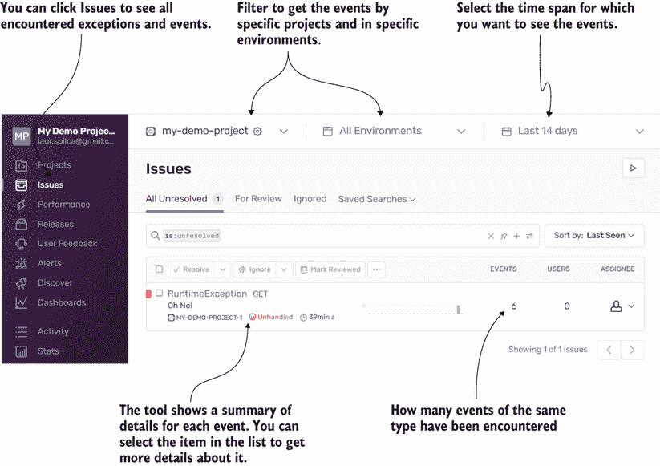

图 12.10 Sentry 收集了由监控服务引起的所有异常。在“问题”菜单中，您可以浏览这些问题的列表。您可以根据事件发生的时间、环境和导致事件的特定服务来筛选它们，这有助于您更容易地识别问题。

这个板是调查的关键起点。如果您使用 Sentry 并需要分析系统中某个服务的异常，首先检查问题板中的事件。使用 Sentry 查找异常事件比我们在第五章中讨论的搜索日志中的这些事件要快得多。

您在板上首先看到的是每个审计事件的简要详情列表。异常类型、其消息和发生次数是最重要的细节。

在每个事件中，你发现的一个基本细节是事件最后一次遇到的时间和第一次出现的时间。你可以使用这些信息来判断问题是否是反复出现的，是否经常发生，或者是否是一个孤立案例。如果事件是孤立的，你可能会发现它是由于环境中偶然的问题引起的，但由应用逻辑产生的错误是反复出现的，并且更频繁。如图 12.10 所示，所有这些细节都在主要问题板上。

如果你对特定事件的信息感兴趣，请在主要问题板上选择你需要调查的事件。Sentry 收集以下有用的细节（图 12.11）：

+   异常堆栈跟踪

+   环境细节，例如操作系统、运行时 JVM 和服务器名称

+   客户端详细信息，如果异常是在 HTTP 请求过程中引起的

+   在 HTTP 请求过程中发生异常时发送的信息

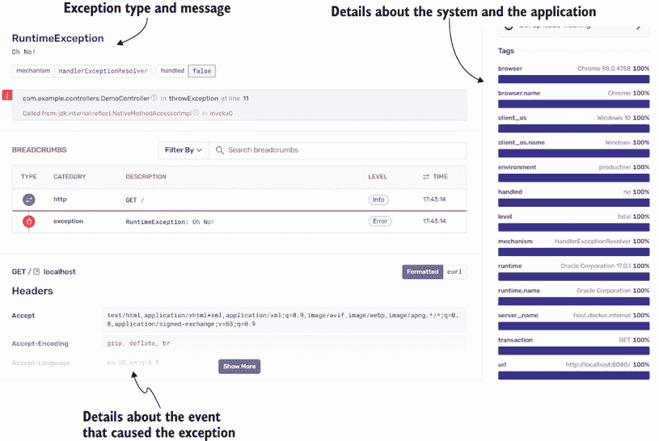

图 12.11 Sentry 收集的每个事件——事件的堆栈跟踪、关于服务器和客户端环境的详细信息，甚至关于请求的详细信息（头信息、HTTP 方法等）——提供了可以帮助你识别问题根本原因的信息。

在团队管理中使用 Sentry

尽管 Sentry 是一个主要用于审计、监控和调查应用问题的工具，但我觉得它还有另一种用途，我认为这个用途非常有帮助。

作为一名开发团队领导，我既是团队领导也是技术领导。在 COVID-19 大流行之前，当我们都在办公室工作时，彼此靠近，我知道有人遇到困难要容易得多，反之亦然：当他们需要我时，更容易把一团纸扔向我以引起我的注意。但随着远程在线工作的出现，情况发生了变化。给团队增加延迟的一个因素仅仅是团队成员之间沟通的困难。

Sentry 可以配置为发送它遇到的事件的电子邮件，因此我配置了它接收电子邮件，即使是来自本地环境的事件，以了解团队成员遇到了什么困难。由于我对我的团队很了解，我知道如果有人遇到了特定的问题。在某些情况下，两个或更多团队成员遇到了相同的问题，但由于沟通存在缺陷，他们都花费了时间来调查它。

使用 Sentry，我能够立即采取行动并帮助某人，在他们花费太多时间尝试调查错误之前。我还能在他们超时或同时工作时阻止他们工作。这很酷，不是吗？

我发现特别有用的一点是，Sentry 会自动收集在为请求服务的线程上发生异常时 HTTP 请求的详细信息。你可以使用这些信息在开发环境中重现问题，或者尝试确定通过 HTTP 请求发送的任何数据是否可能导致了异常事件。虽然 Sentry 不会指出问题的原因，但它确实提供了更多的线索，帮助你更快地理解其根本原因。

注意：在许多情况下，今天的应用程序通过 HTTP 相互通信，并且异常事件很可能因此发生。Sentry 会记录 HTTP 请求的详细信息，并将其与事件关联。


## 12.3 使用部署工具进行调查

随着时间的推移和参与许多项目的工作，我学到了一些东西，那就是托管应用程序的环境是不同的，并且会演变。我学到的其中一个重要教训是，正确理解应用程序运行的环境在调查为什么应用程序以特定方式行为时非常有帮助。让我们讨论一种最新的部署面向服务的架构的方法，以及这种方法在调查应用程序可能遇到的问题时如何有所帮助：*服务网格*。

服务网格是一种控制系统中不同应用程序之间如何相互通信的方法，并且从许多角度来看，它们可以非常有帮助，包括使你的应用程序在出现问题时更容易监控和调查。我最喜欢并使用的服务网格工具是 Istio ([`istio.io`](https://istio.io))；有关更多详情，我建议你阅读 Christian E. Posta 和 Rinor Maloku 合著的《Istio in Action》（Manning，2022 年）。

我将概述服务网格的工作原理，然后我们将讨论它们在调查应用程序执行时的一些有用方式：

+   *故障注入*——一种你可以强制应用程序通信失败以创建你需要调查的特定场景的方法

+   *镜像*——一种将生产应用程序的事件复制到测试环境中进行调查的方法

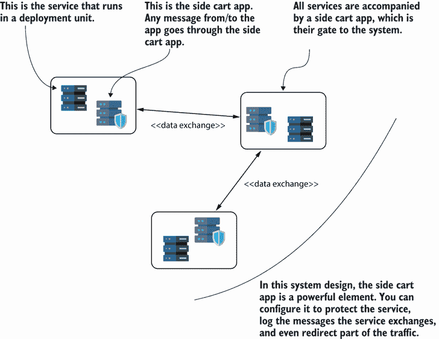

图 12.12 在服务网格部署中，每个应用的通信都被一个侧边栏应用（一个独立的应用）拦截。由于侧边栏应用拦截了交换的数据，你可以配置它来记录你需要的信息，甚至修改通信以强制系统进入你想要调查的场景。

图 12.12 直观地展示了在服务网格中部署的三个服务。每个服务都伴随着一个拦截该服务与其他应用交换数据的应用的程序。

由于侧边栏应用拦截了它所链接的服务以及其他应用之间的通信，你可以配置它以完全透明于服务的方式管理这些数据。我们将在 12.3.1 和 12.3.2 节中进一步讨论这一点。

### 12.3.1 使用故障注入来模拟难以复现的问题

最具挑战性的调查场景之一是那些难以在本地环境或在你有更多调试或分析访问权限的环境中复现的场景。根据我的经验，环境可以创建一些最难以复现的场景。以下事件可能会给你带来极大的麻烦，并使调查应用程序的行为变得相当困难：

+   一些故障设备导致网络故障。

+   在你的应用程序安装的地方运行的一些额外软件使整个环境变得故障或不稳定。

然而，关于这类问题，有一些重要的事情需要记住：你的应用程序应该预期它们会发生。网络永远不可能 100%可靠，你不能完全信任环境。如果你的应用程序因为网络峰值而失败，那么你的应用程序还不够可靠；不要试图把问题推给其他人——解决它！

你需要设计应用程序使其具有鲁棒性，并预期它们知道如何对不允许它们执行正常流程的外部事件做出反应。但以这种方式设计系统并不容易。作为一名开发者，你应该预料到这一点，即使你做出了巨大的努力来覆盖所有基础，问题仍然可能发生。你需要准备好调查这些问题的来源，并实施解决方案来解决它们。

我在书中多次提到这一点，但在这里重复一遍：调查问题的最佳方式是找到一种方法来复现它。尽管一些由环境引起的问题难以复现，但当你使用服务网格进行部署时，一些场景可以很容易地重新创建。

注意：调查场景的最佳方式是首先在测试环境中复现应用程序或系统的行为。


做起来最容易且最有用的事情之一是模拟一个故障通信场景。在一个面向服务的或微服务系统中，整个系统依赖于应用程序之间的通信方式。因此，能够测试当系统中的某个服务无法访问时会发生什么，这一点极为重要。你需要模拟故障行为以进行测试或调查。

由于服务网格管理应用程序的通信是由侧边栏应用程序处理的，因此你可以配置侧边栏应用程序故意异常行为，以模拟故障通信（图 12.13）。这样，你可以调查系统在这种情况下的行为。

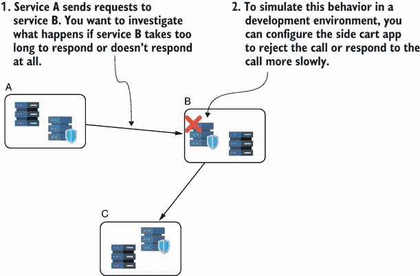

图 12.13 你可以使用服务网格的侧边栏应用程序来强制系统进入你想要调查的场景。比如说，你想要复现一个生产案例，其中两个服务之间的通信经常中断。你可以轻松地配置一个服务网格侧边栏应用程序来强制执行进入这样的场景，以便你可以进行调查。

故障注入意味着在测试环境中故意破坏您的系统，以复制其他情况下难以复制的特定行为。


### 12.3.2 使用镜像促进测试和错误检测

当使用服务网格时，您可以使用的一种在另一个环境中复制问题的技术是镜像。*镜像*是指配置侧边栏应用程序，将服务发送到与其通信的应用程序副本的相同请求的副本。这个副本可能运行在您用于测试的不同环境中（如图 12.14 所示），这允许您使用在测试环境中运行的应用程序来调试或分析服务之间的通信。

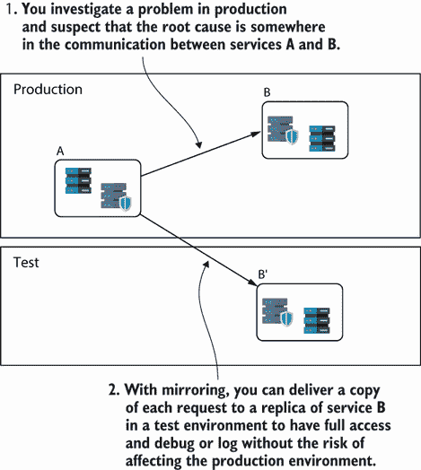

图 12.14 您可以将侧边栏应用程序配置为将生产应用程序的事件镜像到开发中部署的服务。这样，您可以在不影响生产环境的情况下，调查在开发环境中难以复制的难题。

镜像是非常有用的调查工具，但请记住，即使您的系统使用服务网格进行部署，您也可能无法使用镜像。在许多系统中，生产环境中使用的数据是私有的，不能简单地复制到测试环境中。如果您的系统不允许从生产环境复制数据到测试环境，那么镜像也将被禁止。

## 摘要

+   今天的系统通常由许多相互通信的服务组成。服务之间的错误通信可能导致性能问题或甚至错误的输出。了解如何使用配置文件或服务网格等工具调查服务之间的通信至关重要。

+   您可以使用 JProfiler 截获服务器应用程序接收的 HTTP 请求和事件持续时间。然后，您可以使用这些信息来观察是否某个端点被调用次数过多或执行时间过长，从而对应用程序实例造成压力。

+   您可以使用 JProfiler 观察应用程序作为 HTTP 客户端的行为。您可以截获应用程序发送的所有请求，以及持续时间、HTTP 响应状态码和遇到的异常等详细信息。这些信息可以帮助您确定应用程序与其他服务集成的方式是否存在问题。

+   JProfiler 为您提供优秀的工具，可以直接调查应用程序建立的底层通信，通过直接调查套接字事件，这允许您隔离问题并确定问题是否与通信通道或应用程序的某个部分有关。

+   在大型面向服务的系统中，使用日志监控工具是观察问题和更快地将拼图碎片拼凑起来以找到问题根本原因的绝佳方式。日志监控工具是一种软件，它收集系统中每个应用中的异常事件，并显示你需要了解问题及其来源的信息。Sentry 是一个你可以用于系统日志监控的绝佳工具。

+   在某些情况下，你可以利用用于部署应用的工具。例如，如果你的服务部署依赖于服务网格，你可以使用服务网格功能来重现你想要调查的场景。你可以配置

    +   故障注入以模拟一个工作不正常的服务，并调查在这种情况下其他服务受到的影响。

    +   通过镜像来获取应用发送给接收服务副本的所有请求的副本。这个副本安装在测试环境中，你可以使用调试和性能分析技术来调查场景，而不会影响生产系统。
