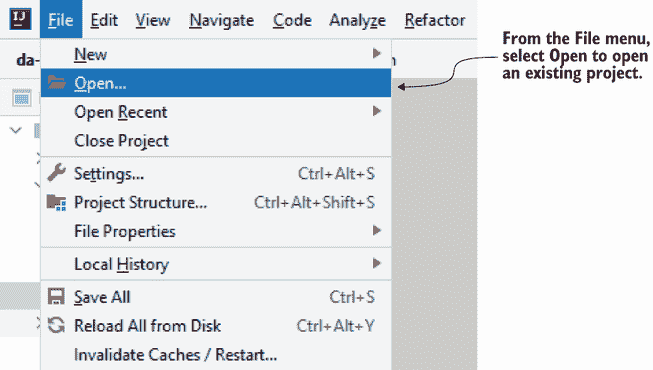
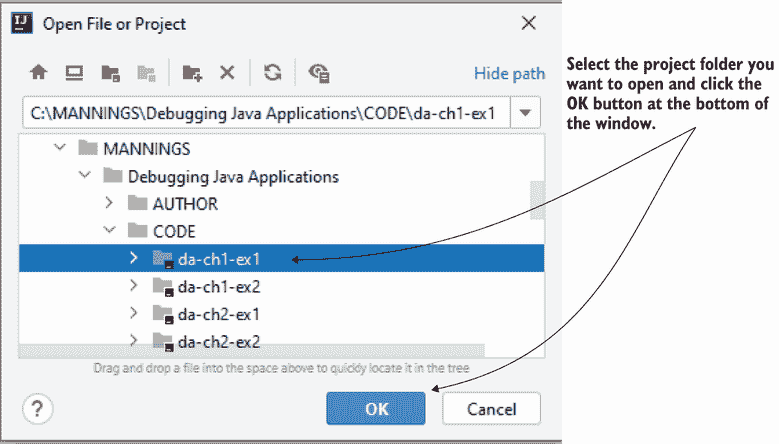

# 附录 B. 打开项目

在本附录中，您可以找到打开和运行现有项目的步骤。本书提供的项目是使用 Java 17 编写的 Java 应用程序。我们使用这些项目来演示几种技术和工具的使用。

首先，您需要安装一个 IDE，例如 IntelliJ IDEA、Eclipse 或 Apache Netbeans。对于示例，我使用了 IntelliJ IDEA：[`www.jetbrains.com/idea/download/`](https://www.jetbrains.com/idea/download/)。

要运行本书提供的项目，您需要安装 JDK 版本 17 或更高版本。您可以使用任何 Java 发行版。我使用的是 OpenJDK 发行版：[`jdk.java.net/17/`](https://jdk.java.net/17/)。

图 B.1 展示了如何在 IntelliJ IDEA 中打开现有项目。要选择要打开的项目，请选择文件 > 打开。

图 B.1 要在 IntelliJ IDEA 中打开现有项目，请在文件菜单中选择打开。

点击文件 > 打开，将弹出一个窗口。选择要打开的项目。图 B.2 展示了此弹出窗口。

图 B.2 在文件菜单中选择打开后，将弹出一个窗口。在此窗口中，从文件系统中选择要打开的项目，并点击确定按钮。

要运行应用程序，请右键单击包含 `main()` 方法的类。对于本书提供的项目，`main()` 方法定义在名为 `Main` 的类中。右键单击此类，如图 B.3 所示，并选择运行。

图 B.3 一旦打开应用程序，您就可以运行它。要运行应用程序，右键单击 `Main` 类并选择运行菜单项。如果您想使用调试器运行应用程序，请点击调试。

如果您想使用调试器运行应用程序，请右键单击 `Main` 类 > 调试。
