# 附录 D.理解 Java 线程

在本附录中，我们将讨论 Java 应用程序中线程的基本知识。线程是应用程序运行的独立指令序列。给定线程上的操作与其他线程上的操作并发运行。今天，任何 Java 应用程序都依赖于拥有多个线程，因此几乎不可能不遇到需要更深入理解为什么特定线程没有按预期工作或难以与其他线程协作的研究场景。这就是为什么您会在本书的多个讨论中找到线程（特别是第七章到第九章，但也在本书前半部分的其他地方，当我们讨论调试时）。为了正确理解这些讨论，您需要了解一些关于线程的基本知识。本附录向您介绍了理解本书中其他讨论所必需的元素。

我们将从 D.1 节开始，我会提醒您线程的整体概念以及为什么我们在应用程序中使用它们。在 D.2 节中，我们将通过讨论线程的生命周期来详细介绍线程的执行方式。了解线程生命周期的状态和可能的转换对于调查任何与线程相关的问题都是必要的。在 D.3 节中，我们将讨论线程同步，这是一种控制执行线程的方式。错误的同步实现引入了您需要调查和解决的大多数问题。在 D.4 节中，我们将讨论最常见的与线程相关的问题。

线程是一个复杂的话题，所以我只会关注您需要了解以理解本书中展示的技术。我无法保证在几页纸内让您成为该主题的专家，因此您会在本附录的末尾找到我推荐的一些资源。

## D.1 什么是线程？

在本节中，我们讨论线程是什么以及如何使用多个线程帮助应用程序。*线程*是运行进程中的一个独立操作序列。任何进程都可以有多个并发运行的线程，使您的应用程序能够解决多个任务，潜在地并行执行。线程是语言处理并发的一个基本组成部分。

我喜欢将多线程应用程序想象成图 D.1 所示的一组序列时间线。请注意，应用程序从一个线程（主线程）开始。这个线程启动其他线程，这些线程可以再启动其他线程，依此类推。请记住，每个线程都是独立的。例如，主线程可以在应用程序本身结束之前很久就结束其执行。当所有线程停止时，进程停止。

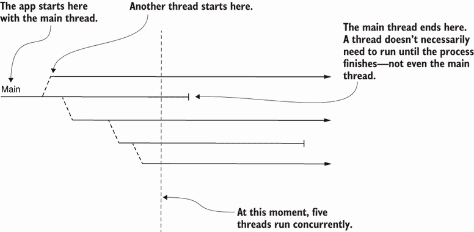

图 D.1 将多线程应用程序可视化为一组序列时间线。图中的每条箭头代表一个线程的时间线。应用程序从主线程开始，可以启动其他线程。一些线程一直运行到进程结束，而其他线程则提前停止。在某个特定时间，一个应用程序可以有一个或多个线程并行运行。

给定线程上的指令总是按照定义的顺序执行。如果您知道指令 A 在同一个线程上位于指令 B 之前，那么您总是知道 A 会在 B 之前发生。但由于两个线程相互独立，您不能对两个分别位于不同线程的指令 A 和 B 说同样的话。在这种情况下，A 可以在 B 之前执行，或者反之亦然（图 D.2）。有时我们可以说一种情况比另一种情况更可能，但我们不能知道哪种流程会持续执行。

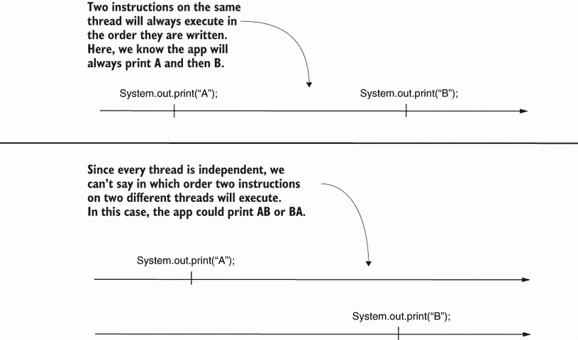

图 D.2 在一个线程上有两个指令时，我们总能知道执行的确切顺序。但由于两个线程是独立的，如果指令位于不同的线程上，我们无法知道它们将执行的顺序。最多我们只能说一种情况比另一种情况更可能。

在许多情况下，您会看到工具将线程执行以序列时间线的方式可视化。图 D.3 显示了 VisualVM（本书中使用的分析器工具）如何以序列时间线的方式呈现线程执行。

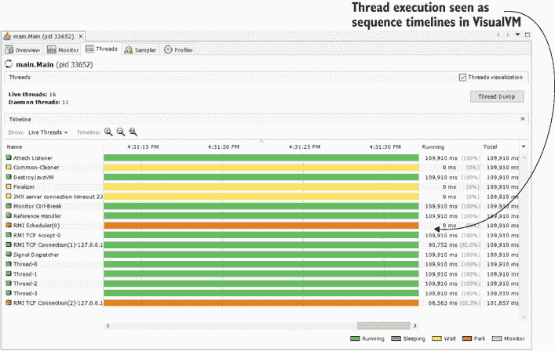

图 D.3 VisualVM 以序列时间线的方式显示线程执行。这种视觉表示使得应用程序的执行更容易理解，并有助于您调查可能的问题。

## D.2 线程的生命周期

一旦您可视化了线程执行，了解线程生命周期是理解它们执行的关键。在整个执行过程中，线程会经历多个状态（图 D.4）。当使用分析器（如第六章至第九章中讨论的）或线程转储（如第十章中讨论的）时，我们通常会参考线程的状态，这在试图了解执行时非常重要。了解线程如何从一个状态转换到另一个状态以及线程在每个状态下的行为对于跟踪和调查应用程序的行为至关重要。

图 D.4 直观地展示了线程状态以及线程如何从一个状态转换到另一个状态。我们可以识别 Java 线程的以下主要状态：

+   *新建*—线程在其实例化后（在启动之前）处于此状态。在此状态下，线程是一个简单的 Java 对象。应用程序还不能执行它定义的指令。

+   *可运行*—线程在其`start()`方法被调用后处于此状态。在此状态下，JVM 可以执行线程定义的指令。在此状态下，JVM 将逐步将线程在两个子状态之间移动：

    +   *准备就绪*—线程不会执行，但 JVM 可以在任何时候将其放入执行状态。

    +   *运行*—线程正在执行。当前 CPU 正在执行它定义的指令。

+   *阻塞*—线程已启动，但暂时被移出了可运行状态，因此 JVM 无法执行其指令。此状态帮助我们通过允许我们暂时“隐藏”线程从 JVM 中，使其无法执行，来控制线程的执行。在阻塞状态下，线程可以处于以下子状态之一：

    +   *监视*—线程被同步块的监视器（控制对同步块访问的对象）暂停，并等待被释放以执行该块。

    +   *等待*—在执行过程中，调用了监视器的`wait()`方法，这导致当前线程暂停。线程将保持阻塞状态，直到调用`notify()`或`notifyAll()`方法，允许 JVM 释放正在执行的线程。

    +   *睡眠*—在`Thread`类中调用`sleep()`方法，将当前线程暂停一段时间。时间作为参数传递给`sleep()`方法。在这段时间过后，线程变为可运行状态。

    +   *已挂起*—几乎与等待相同，当有人调用`park()`方法后，线程将显示为已挂起，这会阻塞当前线程，直到调用`unpark()`方法。

+   *死亡*—线程在完成其指令集后死亡或终止，一个`Error`或`Exception`使其停止，或者它被另一个线程中断。一旦死亡，线程无法再次启动。

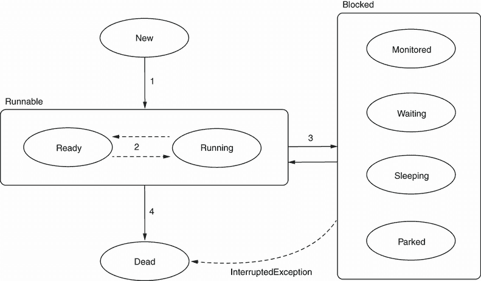

图 D.4 线程生命周期。在其生命周期中，线程会经历多个状态。首先，线程是新的，JVM 无法运行它定义的指令。启动线程后，它变为可运行状态，并开始被 JVM 管理。线程在其生命周期中可以暂时被阻塞，在其生命周期的末尾，它进入死亡状态，从该状态无法重新启动。

图 D.4 也显示了线程状态之间的可能转换：

+   当有人调用其`start()`方法时，线程从新状态变为可运行状态。

+   一旦进入可运行状态，线程会在就绪和运行之间振荡。JVM 决定哪个线程将被执行以及何时执行。

+   有时，线程会被阻塞。它可以通过几种方式进入阻塞状态：

    +   在`Thread`类中调用`sleep()`方法，将当前线程置于一个临时的阻塞状态。

    +   有人调用了`join()`方法，导致当前线程等待另一个线程。

    +   有人调用了监视器的`wait()`方法，暂停了当前线程的执行，直到调用`notify()`或`notifyAll()`方法。

    +   一个同步块的监视器暂停了线程的执行，直到另一个活动线程完成同步块的执行。

+   线程可以在执行完毕或被其他线程中断时进入死（终止）状态。JVM 认为从阻塞状态到终止状态的转换是不可接受的。如果阻塞线程被另一个线程中断，转换会通过`InterruptedException`信号表示。

## D.3 同步线程

在本节中，我们将讨论同步线程的方法，这是开发者在多线程架构中控制线程所使用的。不正确的同步也是许多你必须调查和解决的问题的根本原因。我们将概述同步线程最常用的方法。

### D.3.1 同步块

同步线程最简单的方法，通常是任何 Java 开发者学习同步线程的第一个概念，就是使用同步代码块。其目的是允许一次只有一个线程通过同步代码——禁止给定代码片段的并发执行。这里有两种选择：

+   *块同步*—在给定的代码块上应用 synchronized 修饰符

+   *方法同步*—在方法上应用 synchronized 修饰符

下面的代码片段展示了同步块的例子：

```
synchronized (a) {    ❶
  // do something     ❷
}
```

❶ 括号中的对象是同步块的监视器。

❷ 同步指令块被定义在大括号之间。

下面的代码片段展示了方法同步的例子：

```
synchronized void m() {   ❶
  // do something         ❷
}
```

❶ 应用到方法上的 synchronized 修饰符

❷ 定义在大括号中的整个方法代码块是同步的。

使用`synchronized`关键字这两种方式的效果相同，尽管它们看起来有些不同。你将发现每个同步块的两个重要组成部分：

+   *监视器*—管理同步指令执行的对象

+   *指令块*—实际同步的指令

方法同步似乎缺少监视器，但对此语法来说，监视器实际上是隐含的。对于非静态方法，将使用实例“this”作为监视器，而对于静态方法，同步块将使用类的类型实例作为监视器。

监视器（不能为 null）是赋予同步块意义的对象。该对象决定一个线程是否可以进入并执行同步指令。技术上，规则很简单：一旦一个线程进入同步块，它就会在监视器上获得一个锁。直到拥有锁的线程释放它，其他线程将不会被接受进入同步块。为了简化，让我们假设线程仅在退出同步块时释放锁。图 D.5 展示了一个视觉示例。想象两个同步块位于应用程序的不同部分，但由于它们都使用相同的监视器 M1（相同的对象实例），线程一次只能在一个块中执行。指令 A、B 或 C 不会并发调用（至少不是从所提供的同步块中）。


图 D.5 使用同步块的示例。应用程序的多个同步块可以使用作为监视器的相同对象实例。当这种情况发生时，所有线程都是相关的，以至于只有一个活动线程在所有同步块中执行。在这张图片中，如果一个线程进入同步块，定义指令 A 和 B，则其他线程不能进入相同的块或定义指令 C 的块。

然而，应用程序可能定义多个同步块。监视器链接多个同步块，但当两个同步块使用两个不同的监视器（图 D.6）时，这些块不是同步的。在图 D.6 中，第一个和第二个同步块也是相互同步的，因为它们使用相同的监视器。但这两个块与第三个块不同步。结果是，定义在第三个同步块中的指令 D 可以与第一个和第二个同步块中的任何指令并发执行。

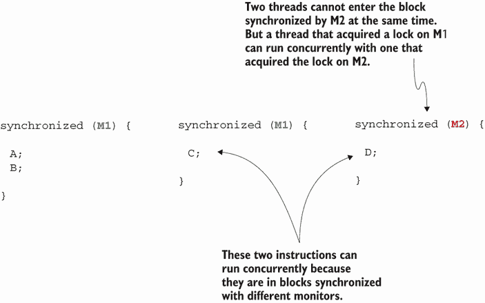

图 D.6 当两个同步块不使用作为监视器的相同对象实例时，它们不是同步的。在这种情况下，第二个和第三个同步块使用不同的监视器。这意味着这两个同步块中的指令可以同时执行。

当使用分析器或线程转储等工具调查问题时，你需要了解线程被阻塞的方式。这些信息可以阐明发生了什么，为什么，或者是什么原因导致某个线程无法执行。图 D.7 展示了 VisualVM（我们在第 7-9 章中使用的分析器）如何显示同步块监视器阻塞了一个线程。

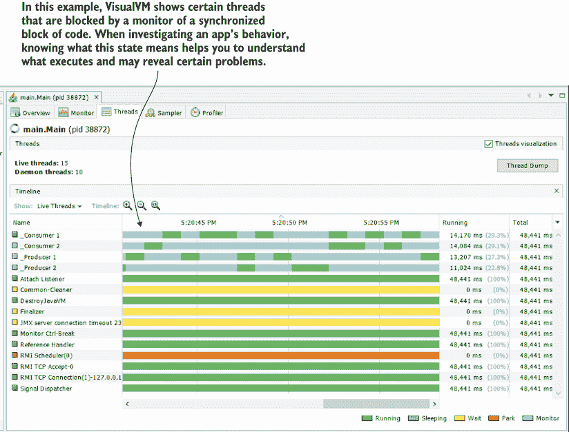

图 D.7 VisualVM 显示了线程的状态。分析器中的线程选项卡提供了每个线程所做事情的完整情况，如果线程被阻塞，则显示阻塞该线程的原因。

### D.3.2 使用 wait()、notify() 和 notifyAll()

另一种线程可能被阻塞的方式是如果它被要求等待一个不确定的时间。使用同步块监视器的 `wait()` 方法，您可以指示线程无限期地等待。然后，其他线程可以“告诉”等待的线程继续其工作。您可以使用监视器的 `notify()` 或 `notifyAll()` 方法来做这件事。这些方法通常用于通过防止线程在不应该执行时执行来提高应用程序的性能。同时，这些方法的错误使用可能导致死锁或线程无限期等待而从未被释放到执行的情况。

记住，`wait()`、`notify()` 和 `notifyAll()` 只有在它们被用于同步块时才有意义。这些方法是同步块监视器的行为，因此您不能在没有监视器的情况下使用它们。使用 `wait()` 方法，监视器会阻塞线程一个不确定的时间。在阻塞线程的同时，它也会释放它所获得的锁，以便其他线程可以进入由该监视器同步的块。当调用 `notify()` 方法时，线程可以再次被执行。图 D.8 总结了 `wait()` 和 `notify()` 方法。

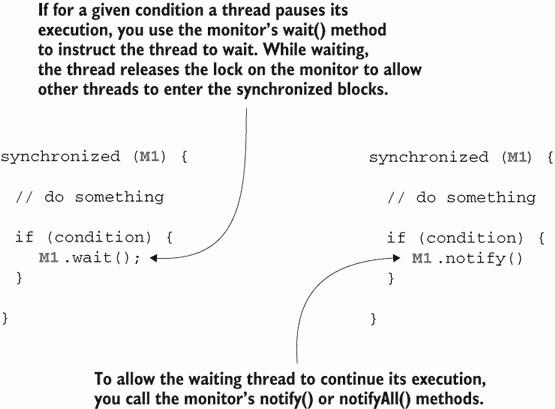

图 D.8 在某些情况下，一个线程应该暂停执行并等待某个事件发生。为了使线程等待，同步块的监视器可以调用它的 `wait()` 行为。当线程再次可执行时，监视器可以调用 `notify()` 或 `notifyAll()` 方法。

图 D.9 展示了一个更具体的场景。在第七章中，我们使用了一个实现生产者-消费者方法的示例应用，其中多个线程共享一个资源。生产者线程向共享资源添加值，消费者线程消费这些值。但如果共享资源不再有值呢？消费者在此时执行将不会受益。技术上，它们仍然可以执行，但没有值可以消费，因此允许 JVM 执行它们会导致系统不必要的资源消耗。更好的方法是在共享资源没有值时“告诉”消费者等待，并且只有在生产者添加了新的值后，才继续它们的执行。


图 D.9 `wait()` 和 `notify()` 的一个用例。当一个线程在当前条件下执行没有带来任何值时，我们可以让它等待直到进一步的通知。在这种情况下，当消费者没有可消费的值时，它不应该执行。我们可以让消费者等待，并且只有当生产者在共享资源中添加了新的值后，才能告诉他们继续。

### D.3.3 线程的连接

一种相当常见的线程同步方法是让一个线程等待另一个线程完成其执行。与等待/通知模式不同的是，线程不需要等待被通知。线程只是简单地等待另一个线程完成其执行。图 D.10 展示了可能从这种同步技术中受益的场景。

假设你必须根据从两个不同的独立来源检索到的数据实现一些数据处理。通常，从第一个数据源检索数据需要大约 5 秒，从第二个数据源获取数据需要大约 8 秒。如果你按顺序执行操作，获取所有数据处理所需的时间是 5 + 8 = 13 秒。但是，你知道一个更好的方法。由于数据源是两个独立的数据库，如果你使用两个线程，你可以同时从两个数据源获取数据。但是，然后你需要确保处理数据的线程在开始之前等待检索数据的两个线程完成。为了实现这一点，你使处理线程加入检索数据的线程（图 D.10）。

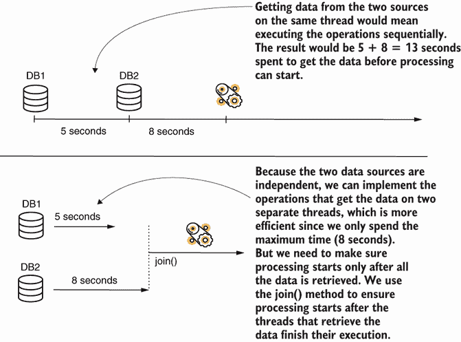

图 D.10 在某些情况下，你可以使用多个线程来提高应用程序的性能。但是，你需要让一些线程等待其他线程，因为它们依赖于这些线程的执行结果。你可以使用 join 操作使一个线程等待另一个线程。

在许多情况下，连接线程是一种必要的同步技术。但是，如果使用不当，它也可能导致问题。例如，如果一个线程正在等待另一个线程，它卡住了，或者永远不会结束，那么加入它的线程将永远不会执行。

### D.3.4 定义时间阻塞线程

有时，一个线程需要等待给定的时间。在这种情况下，线程处于“定时等待”状态或“睡眠”状态。以下操作是最常见的导致线程定时等待的操作：

+   `sleep()`—你可以始终使用`Thread`类中的静态`sleep()`方法来使当前正在执行代码的线程等待固定的时间。

+   `wait(long timeout)`—具有超时参数的 wait 方法可以像 D.3.2 节中讨论的没有参数的`wait()`方法一样使用。然而，如果你提供了一个参数，如果在此之前没有收到通知，线程将等待给定的时间。

+   `join(long timeout)`—这个操作与我们在 D.3.3 节中讨论的`join()`方法的工作方式相同，但等待最大超时时间，该时间作为参数给出。

我在应用程序中经常发现的一个常见反模式是使用`sleep()`来使线程等待，而不是我们在第四章中讨论的`wait()`方法。以我们讨论的生产者-消费者架构为例。你可以用`sleep()`代替`wait()`，但消费者应该睡眠多长时间以确保生产者有时间运行并添加值到共享资源？我们对此没有答案。例如，使线程睡眠 100 毫秒（如图 D.11 所示）可能太长或太短。在大多数情况下，如果你遵循这种方法，你最终得到的性能可能不是最好的。

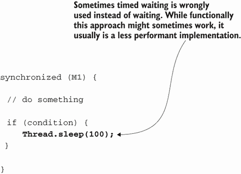

图 D.11 使用定时等待方法代替`wait()`和`notify()`通常不是最佳策略。只要你的代码可以确定线程何时可以继续执行，就使用`wait()`和`notify()`代替`sleep()`。

### D.3.5 使用阻塞对象同步线程

JDK 提供了一套令人印象深刻的工具用于同步线程。在这些工具中，一些在多线程架构中使用的最知名的类包括

+   `信号量`—你可以用来限制可以执行给定代码块线程数量的对象

+   `CyclicBarrier`—你可以用来确保至少有给定数量的线程活跃以执行给定代码块的对象

+   `锁`—一个提供更广泛同步选项的对象

+   `闩锁`—你可以用来使一些线程等待，直到其他线程中的某些逻辑执行完毕的对象

这些对象是高级实现，每个都采用定义良好的机制来简化某些场景下的实现。在大多数情况下，这些对象由于使用不当而引起麻烦，而且在许多情况下，开发者会过度设计使用它们的代码。我的建议是使用你能找到的最简单的方法来解决问题，并且在使用这些对象之前，确保你正确理解它们的工作原理。

## D.4 多线程架构中的常见问题

在调查多线程架构时，你会识别出常见的问题，这些问题是各种意外行为（无论是意外输出还是性能问题）的根本原因。提前理解这些问题将帮助你更快地确定问题的来源并修复它。这些问题如下：

+   *竞态条件*—两个或更多线程竞争修改共享资源。

+   *死锁*—两个或更多线程在等待对方时陷入僵局。

+   *活锁*—两个或更多线程未能满足停止的条件，并且持续运行而不执行任何有用的工作。

+   *饥饿*—当一个线程在 JVM 执行其他线程时持续被阻塞。该线程永远不会执行它定义的指令。

### D.4.1 竞态条件

当多个线程尝试并发更改同一资源时，会发生竞态条件。当这种情况发生时，我们可能会遇到意外结果或异常。通常，我们使用同步技术来避免这些情况。图 D.12 以视觉方式展示了这种情况。线程 T1 和 T2 同时尝试更改变量 x 的值。线程 T1 尝试增加值，而线程 T2 尝试减少它。这种场景可能导致应用程序重复执行时产生不同的输出。以下是一些可能的情况：

+   *操作执行后，x 可能是 5*——如果 T1 首先更改了值，而 T2 读取了已经更改的变量值，或者相反，变量仍然具有值 5。

+   *操作执行后，x 可能是 4*——如果两个线程同时读取 x 的值，但 T2 是最后一个写入的，x 将是（T2 读取的值，5，减去 1）。

+   *操作执行后，x 可能是 6*——如果两个线程同时读取 x 的值，但 T1 是最后一个写入的，x 将是 6（T1 读取的值，5，加上 1）。

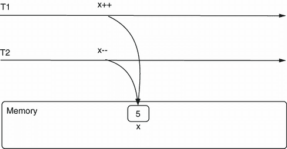

图 D.12 竞态条件。多个线程同时尝试更改共享资源。在这个例子中，线程 T1 和 T2 同时尝试更改变量 x 的值，这可能导致不同的输出。

这种情况通常会导致意外的输出。在可能存在多个执行流程的多线程架构中，这些情况可能很难重现。有时，它们只在特定环境中发生，这使得调查变得困难。

### D.4.2 死锁

死锁是两个或多个线程暂停并等待彼此的某些操作以继续执行的情况（见图 D.13）。死锁会导致应用程序（或至少其一部分）冻结，阻止某些功能运行。

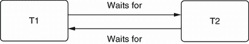

图 D.13 死锁示例。在 T1 等待 T2 继续执行而 T2 又等待 T1 的情况下，线程处于死锁状态。由于它们都在等待对方，因此都无法继续执行。

图 D.14 展示了死锁可以通过代码发生的方式。在这个例子中，一个线程获得了资源 A 的锁，另一个线程获得了资源 B 的锁。但是，每个线程也需要另一个线程所拥有的资源来继续其执行。线程 T1 等待线程 T2 释放资源 A，但与此同时，线程 T2 正在等待线程 T1 释放资源 B。由于两个线程都在等待对方释放它们需要的资源，因此都无法继续执行，导致死锁。

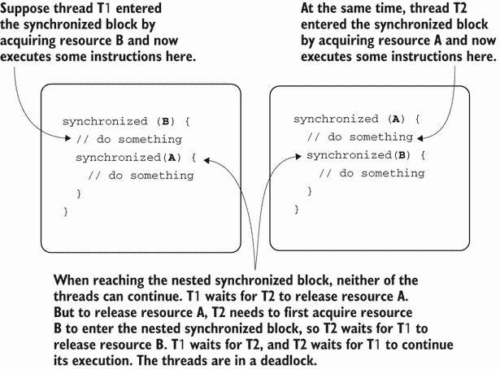

图 D.14 死锁。线程 T1 无法进入嵌套的同步块，因为 T2 拥有资源 A 的锁。线程 T1 等待 T2 释放资源 A 以便它可以继续执行。但线程 T2 处于类似的情况：它无法继续执行，因为 T1 获得了资源 B 的锁。线程 T2 等待线程 T1 释放资源 B 以便它可以继续执行。由于两个线程都在等待对方，并且都不能继续执行，因此线程处于死锁状态。

图 D.14 中的示例很简单，但它只是一个教学示例。现实世界的情况通常更难调查和理解，可能涉及多个线程。请注意，同步块并不是线程陷入死锁的唯一方式。理解此类场景的最佳方式是使用你在第七章到第九章中学到的调查技术。

### D.4.3 活锁

活锁或多或少是死锁的反面。当线程处于活锁状态时，条件总是以某种方式改变，使得线程即使应该在给定条件下停止也会继续执行。线程无法停止，它们会持续运行，通常无理由地消耗系统的资源。活锁可能导致应用程序执行中的性能问题。

图 D.15 展示了一个通过序列图表示的活锁。两个线程 T1 和 T2 在一个循环中运行。为了停止其执行，T1 在其最后一次迭代之前使一个条件为真。当 T1 下次回到该条件时，它期望它为真并停止。然而，这并没有发生，因为另一个线程 T2 将其改回为假。T2 发现自己处于相同的情况。每个线程都会改变条件，以便它可以停止，但与此同时，每个条件的变化都会导致另一个线程继续运行。

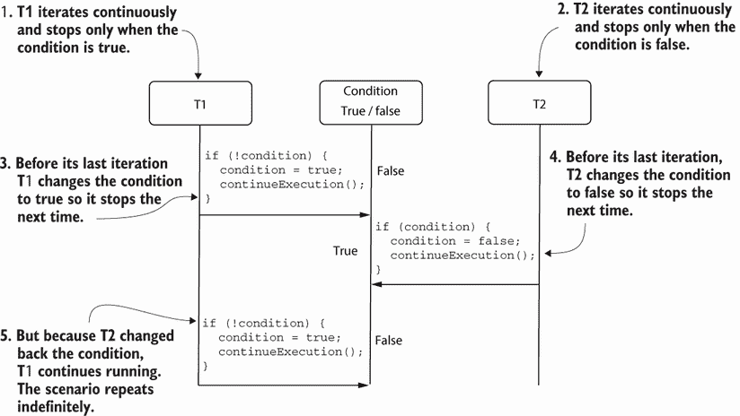

图 D.15 活锁的一个例子。两个线程依赖于一个条件来停止它们的执行。但当改变条件的值以便它们可以停止时，每个线程都会导致另一个线程继续运行。线程无法停止，因此不必要地消耗了系统的资源。

正如第四章中的死锁示例（第 4.4.2 节）一样，请记住这是一个简化的场景。现实世界中的活锁可能由更复杂的情况引起，并且可能涉及多个线程。第七章到第九章讨论了你可以用来调查此类场景的几种方法。

### D.4.4 饥饿

另一个常见问题，尽管在当今的应用中不太可能发生，是饥饿。饥饿是由于某个线程始终被排除在执行之外，即使它是可运行的。该线程想要执行其指令，但 JVM 持续允许其他线程访问系统的资源。因为线程无法访问系统的资源并执行其定义的指令集，所以我们说它是饥饿的。

在早期 JVM 版本中，当开发者给某个线程设置一个非常低的优先级时，就会出现这种情况。如今，JVM 实现对这些情况的处理要聪明得多，所以（至少在我的经验中）饥饿场景发生的可能性较小。

## D.5 进一步阅读

线程很复杂，在这篇附录中，我们讨论了帮助你理解本书中提到的技术的关键主题。但是，对于任何 Java 开发者来说，详细了解线程的工作原理是一项宝贵的技能。以下是我推荐您阅读的一些资源，以深入了解线程：

+   《*Oracle Certified Professional Java SE 11 Developer Complete Study Guide*》由 Jeanne Boyarsky 和 Scott Selikoff（Sybex，2020）编著。第十八章介绍了线程和并发，从零开始，涵盖了 OCP 认证所需的全部线程基础知识。我建议您从这本书开始学习线程。

+   Benjamin Evans、Jason Clark 和 Martijn Verburg（Manning，2022）编著的《*The Well-Grounded Java Developer*》的第二版，从基础到性能调优，教授并发知识。

+   Brian Goetz 等人编著的《*Java Concurrency in Practice*》（Addison-Wesley，2006）是一本较老的书，但它并没有失去其价值。任何想要提高自己线程和并发知识水平的 Java 开发者都应该阅读这本书。
