# 附录 E. Java 应用程序中的内存管理

在本附录中，我们讨论了 Java 虚拟机（JVM）如何管理 Java 应用程序的内存。您在 Java 应用程序中可能遇到的一些最具挑战性的问题都与应用程序管理内存的方式有关。幸运的是，我们可以使用几种技术来分析这些问题并找到其根本原因，而无需投入大量时间。但是，为了从这些技术中受益，您首先至少需要了解一些关于 Java 应用程序如何管理其内存的基本知识。

应用程序的内存是一种有限的资源。即使今天的系统可以为应用程序在执行期间提供大量内存，我们仍然需要小心地对待应用程序如何使用这种资源。没有系统可以提供无限的内存作为魔法解决方案（图 E.1）。内存问题会导致性能问题（应用程序变慢，部署成本更高，启动速度变慢等），有时甚至可以将整个进程完全停止（例如，在`OutOfMemoryError`的情况下）。

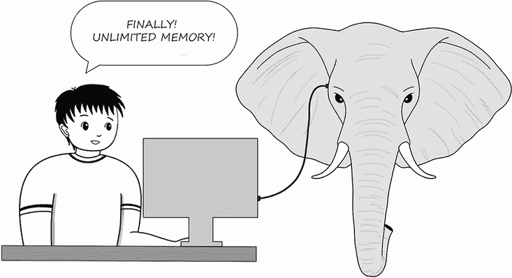

图 E.1 应用程序的内存是一种有限的资源。没有魔法解决方案可以让我们为应用程序分配无限的内存。在构建应用程序时，我们需要谨慎对待内存消耗，避免无端浪费。应用程序有时可能会出现内存问题。如果某个功能使用过多的内存，它可能会引起性能问题，甚至导致完全失败。您需要准备好找到这些问题的原因并妥善解决它们。

我们将涵盖内存管理的必要方面。在第 E.1 节中，我们将讨论 JVM 如何为执行进程组织内存。您将了解三种分配应用程序内存的方式：栈、堆和元空间。在第 E.2 节中，我们将讨论栈，这是线程用于存储局部声明的变量及其数据的空间。第 E.3 节讨论堆以及应用程序在内存中存储对象实例的方式。我们的讨论将在第 E.4 节结束，涉及元空间，这是应用程序存储对象类型元数据的位置。

请注意，Java 应用程序的内存管理是复杂的。在本附录中，我将仅介绍您需要了解以理解书中所讨论内容的细节。

## E.1 JVM 如何组织应用程序的内存

在本节中，我们将讨论 JVM 如何在不同内存位置组织数据，这些位置分别以不同的方式管理。理解 JVM 如何管理内存对于调查与内存相关的问题至关重要。我们将使用一些视觉元素来讨论与内存管理相关的关键方面，您将了解在 Java 应用程序的内存中哪些数据存储在哪里。然后，我们将详细说明每个内存位置的内存管理。

目前（为了简化讨论），让我们假设一个 Java 应用程序在执行过程中管理其存储的数据有两种方式：栈和堆。根据数据的定义方式，应用程序将分别在栈或堆中管理它。但在讨论哪些数据放在哪里之前，请记住一个基本细节：应用程序有多个线程，允许它并发处理数据。堆是一个单独的内存位置，应用程序的所有线程都使用它。然而，每个线程都有自己的内存位置，称为栈。这可能会在开发者第一次学习内存管理时造成困惑。图 E.2 以视觉方式展示了这些细节。

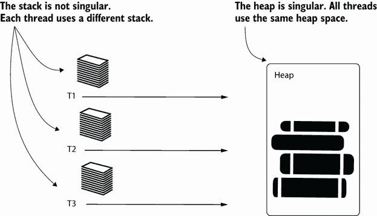

图 E.2 T1、T2 和 T3 都是 Java 应用程序的线程。所有这些线程使用相同的堆。堆是应用程序存储对象实例数据的内存位置。然而，每个线程都使用自己的内存位置，称为栈，来存储局部声明的数据。

栈是线程拥有的内存位置。每个线程都拥有一个特定的栈，该栈不与其他线程共享。线程将任何在代码块中局部声明的数据存储在这个内存位置，并由该线程执行。假设你有一个像下面代码片段中展示的方法。参数`x`和`y`以及方法代码块内声明的变量`sum`都是局部变量。当方法执行时，这些值将存储在线程的栈中：

```
public int sum(int x, int y) {  ❶
   int sum = x + y;             ❶
   return sum;
}
```

❶ 变量 x、y 和 sum 将存储在栈中。

堆是应用程序存储对象实例数据的内存位置。假设你的应用程序声明了一个类，例如下面代码片段中展示的`Cat`类。每次你使用类的构造函数`new Cat()`创建实例时，该实例都会进入堆：

```
public class Cat {
}
```

如果类声明了实例属性，JVM 也会将这些值存储在堆中。例如，如果`Cat`类看起来像下面代码片段中展示的那样，JVM 将存储每个实例的名称和年龄在堆中：

```
public class Cat {

  private String name;   ❶
  private int age;       ❶

}
```

❶ 对象的属性存储在堆中。

图 E.3 以视觉方式展示了一个数据分配的例子。注意，局部声明的变量及其值（`x`和`c`）存储在线程的栈中，而`Cat`实例及其数据存储在应用程序的堆中。`Cat`实例的引用将存储在变量`c`的线程栈中。甚至存储`String`数组引用的方法参数也将成为栈的一部分。

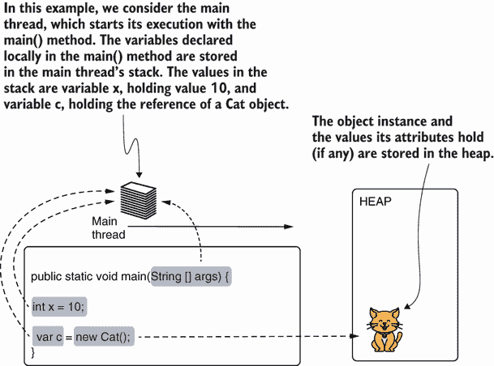

图 E.3 应用程序在线程的栈中保留局部声明的变量，以及在堆中定义的对象实例的数据。一个线程栈中的变量可能指向堆中的对象。在这个例子中，变量`x`持有值 10，变量`c`持有`Cat`实例的引用，它们都是线程栈的一部分。

## E.2 线程用于存储局部数据的栈

在本节中，我们将更深入地分析栈背后的机制。在 E.1 节中，你了解到局部变量存储在栈中，并且每个线程都有自己的栈位置。现在让我们弄清楚这些值是如何存储的，以及应用何时从内存中移除它们。我们将通过一个简短的代码示例逐步使用视觉描述这个过程。一旦我们阐明了栈内存管理的机制，我们将讨论可能出错的地方以及与之相关的问题。

首先，为什么这个内存位置被称为“栈”？线程的栈使用栈数据结构的原则。*栈*是一个有序集合，其中你可以始终移除最近添加的元素。我们通常将此类集合可视化为一层层的堆叠，其中每一层都存储在另一层之上。你只能将新层添加到所有现有层之上，并且你只能移除顶层。这种添加和移除元素的方法也称为*后进先出*（LIFO）。图 E.4 通过一系列添加和移除步骤演示了栈是如何工作的。为了使示例更简单，数字是栈中的值。

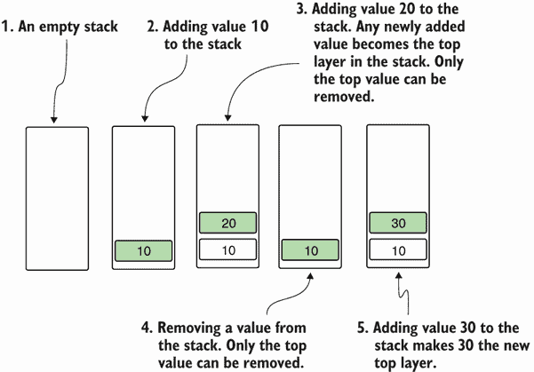

图 E.4 展示了如何向栈中添加和移除值。栈是一个按顺序排列的集合，遵循后进先出（LIFO）原则。当你向栈中添加一个值时，它成为顶层——唯一可以移除的层。

你会在应用如何管理线程栈中的数据时认识到相同的行为。每当执行达到代码块的开头时，它就会在线程栈中创建一个新的层。遵循常见的栈原则，任何新的层都成为顶层，并且是第一个被移除的。在图 E.5、E.6、E.7 和 E.8 中，我们逐步跟踪一个简单代码片段的执行，以观察线程栈是如何变化的：

```
public static void main(String [] args) {
  int x = 10;
  a();
  b();
}

public static void a() {
  int y = 20;
}

public static void b() {
  int y = 30;
}
```

执行从`main()`方法开始（图 E.5）。当执行达到`main()`方法的开始时，第一个层被添加到线程的栈中。这个层是一个内存位置，其中存储了代码块中声明的所有局部变量。在这种情况下，代码块声明了一个变量`x`，并用值`10`初始化该变量。这个变量将存储在这个新创建的线程栈层中。当方法结束执行时，这个层将从栈中移除。

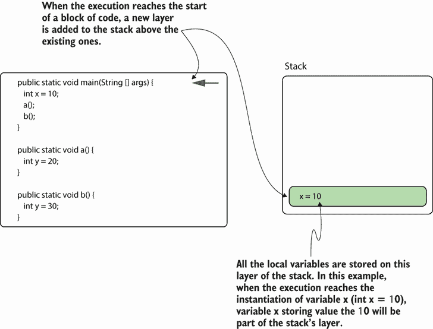

图 E.5 展示了当执行达到代码块的开头时，在线程的栈中创建了一个新的层。代码块定义的所有变量都存储在这个新层中。当代码块结束时，这个层将被移除。这样，我们知道当这部分内存不再需要时，其中的值就会被释放。

代码块可以调用其他代码块。例如，在这种情况下，方法 `main()` 调用方法 `a()` 和 `b()`，它们的工作方式类似。当执行到达它们代码块的开头时，栈中会添加一个新的层。这个新层是存储所有声明为局部数据的内存位置。图 E.6 展示了执行到达方法 `a()` 时发生的情况。

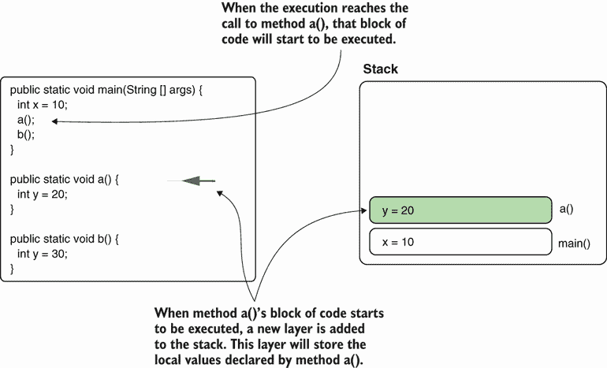

图 E.6 另一个代码块可以从正在执行的代码块中调用。在这种情况下，方法 `main()` 调用方法 `a()`。由于 `main()` 没有完成，其层仍然是栈的一部分。方法 `a()` 创建自己的层，其中存储它定义的局部值。

当方法 `a()` 结束执行并返回到 `main()` 时，线程栈中预留的层也被移除（图 E.7）——这意味着它存储的数据不再在内存中。这样，不再需要的内存被释放，为新数据存储腾出空间。代码块在执行到达其最后一条指令、给出 `return` 指令或抛出异常时结束。请注意，当代码块结束时，其层总是栈顶的，符合后进先出（LIFO）原则。

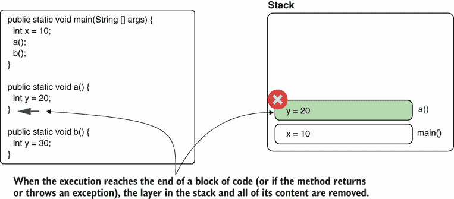

图 E.7 当执行到达代码块末尾时，为该代码块打开的栈层及其包含的所有数据将被移除。在这种情况下，当方法 `a()` 返回时，其栈层被移除。这样，我们确保不再需要的数据从内存中移除。

方法 `main()` 通过调用方法 `b()` 继续执行。就像方法 `a()` 所做的那样，方法 `b()` 在栈中预留一个新的层来存储它声明的局部数据（图 E.8）。

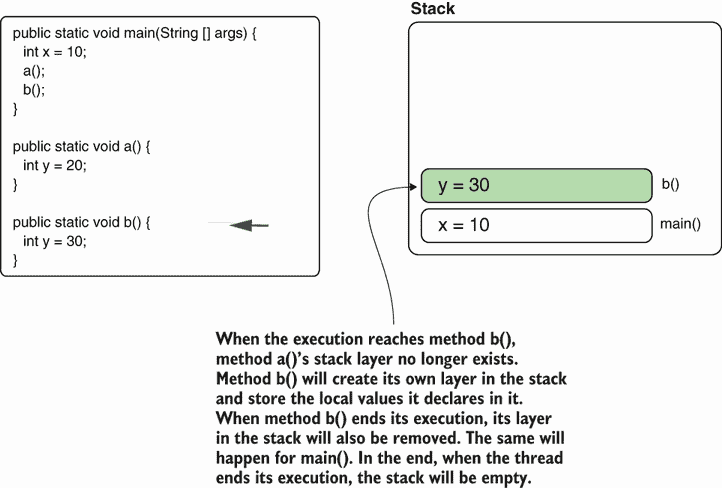

图 E.8 就像方法 `a()` 一样，当调用方法 `b()` 并且执行到达其代码块的开头时，栈中会添加一个新的层。该方法可以使用这个层来存储局部数据，直到方法返回并且层被移除。

当方法 `main()` 最终到达其末尾时，线程结束执行，栈保持为空并且被完全移除。同时，线程进入其生命周期中描述的死亡状态，如附录 D 所述。

栈有一个默认的内存空间分配。您可以根据使用的 JVM 在这里找到精确的值：[`mng.bz/JVYp`](http://mng.bz/JVYp)。此限制也可以调整，但您无法将其设置为无限。栈的一个常见问题是 `StackOverflowError`，这意味着栈已完全填满，无法添加更多层。当发生这种情况时，代码会抛出 `StackOverflowError`，并且栈已满的线程会完全停止。一个递归（或递归实现），一个在给定条件满足之前不断调用自身的函数，如果停止条件错误通常会导致此类问题。如果这个条件缺失或允许方法调用自身太多次数，栈可能会被方法在每次执行开始时创建的层填满。图 E.9 以视觉方式展示了由两个相互调用的方法引起的无限递归创建的栈。

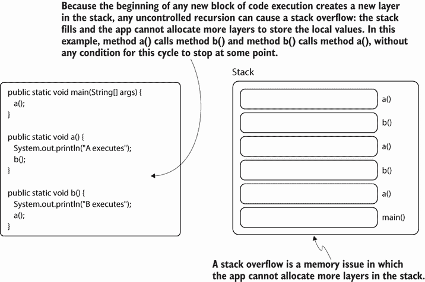

图 E.9 每次方法的新执行都会在栈中创建一个新的层。在递归的情况下，如果方法被调用太多次数，它可能会填满栈。当栈满时，应用程序会抛出 `StackOverflowError`，并且当前线程会停止。

由于每个线程都有自己的栈，`StackOverflowError` 只会影响栈已满的线程。进程可以继续执行，其他线程不会受到影响。此外，`StackOverflowError` 生成堆栈跟踪，您可以使用它来识别导致问题的代码。图 E.10 展示了此类堆栈跟踪的示例。您可以使用书中提供的项目 da-app-e-ex1 来复制此堆栈跟踪。

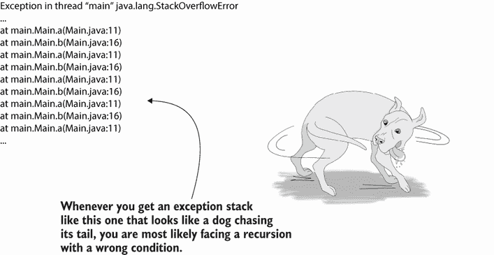

图 E.10 由 `StackOverflowError` 引起的堆栈跟踪。通常，`StackOverflowError` 很容易识别。堆栈跟踪显示了方法反复调用自身或一组相互调用的方法，就像这个例子一样。您可以直接进入这些方法，找出它们是如何无限期地相互调用的。

## E.3 应用程序使用的堆来存储对象实例

在本节中，我们将讨论堆：Java 应用程序中所有线程共享的内存位置。堆存储对象实例数据。正如您在本节中将要看到的，堆比堆栈更容易引起问题。此外，堆相关问题的根本原因更难以找到。我们将分析对象在堆中的存储方式以及谁可以保留对它们的引用，这对于理解它们何时可以从内存中移除是相关的。此外，我们还将讨论与堆相关的问题的主要原因。您需要了解这些信息，以便理解第七章到第九章中讨论的调查技术。

注意：堆具有复杂结构。由于您不会立即需要所有这些细节，我们不会讨论所有堆的细节。我们也不会讨论字符串池或堆代际等细节。

你需要记住关于堆的第一件事是，它是由所有线程共享的内存位置（图 E.11）。这不仅允许线程相关的问题，如竞态条件发生（在附录 D 中讨论），而且还使得内存问题更难以调查。由于所有线程都在相同的内存位置添加它们创建的对象实例，一个线程可能会影响其他线程的执行。如果一个线程遭受内存泄漏（这意味着它在内存中添加实例但从未移除它们），它会影响整个进程，因为其他线程也会因为内存不足而受到影响。

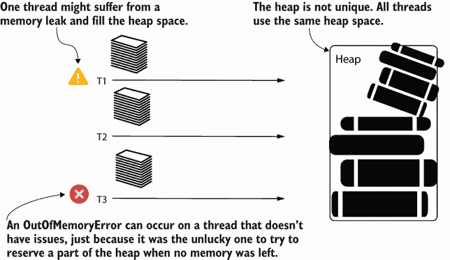

图 E.11 所有线程使用相同的堆位置。如果一个线程由于问题导致堆变满（内存泄漏），另一个线程可能会发出问题信号。这种情况很常见，因为问题将由第一个无法在堆中存储数据的线程报告。因为任何线程都可以发出问题信号，并且不一定是导致问题的那个线程，所以与堆相关的问题更难以解决。

在大多数情况下，当发生`OutOfMemoryError`时，如图 E.11 所示，这种情况是由受问题根本原因（内存泄漏）影响的线程之外的其他线程发出的信号。`OutOfMemoryError`是由第一个试图在内存中添加内容但无法添加的线程发出的。

垃圾回收器（GC）是通过移除不再需要的数据来释放堆的机制。当没有任何引用指向一个对象实例时，垃圾回收器知道该对象实例不再需要。因此，如果一个对象不再需要但应用程序未能移除所有引用，垃圾回收器就不会移除该对象。当应用程序持续未能移除新创建对象的引用，直到它们填满内存（导致`OutOfMemoryError`）时，我们说该应用程序有内存泄漏。

一个对象实例可能从堆中的另一个对象中引用（图 E.12）。内存泄漏的一个常见例子是我们持续添加对象引用的集合。如果这些引用没有被移除，那么只要这个集合在内存中，垃圾回收器就不会移除它们；它们就变成了内存泄漏。你应该特别注意静态对象（从静态变量引用的对象实例）。这些变量一旦创建就不会消失，所以除非你显式地移除引用，否则你可以假设从静态变量引用的对象将保持整个进程的生命周期。如果该对象是一个引用其他对象且这些对象永远不会被移除的集合，它可能成为潜在的内存泄漏。

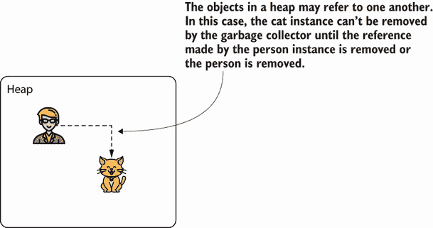

图 E.12 堆中的任何对象都可以保持对堆中其他对象的引用。垃圾回收器只有在没有任何引用存在时才能移除一个对象。

一个对象实例也可以从堆栈中引用（如图 E.13）。通常情况下，从堆栈中的引用不会导致内存泄漏，因为（如 E.2 节所述）当执行到达为应用创建该层的代码块末尾时，堆栈层会自动消失。但在某些特定情况下，当与其他问题结合时，堆栈中的引用也可能引起麻烦。想象一下，一个死锁阻止了执行通过整个代码块。堆栈中的层不会被移除，如果它继续引用对象，这也可能成为内存泄漏。

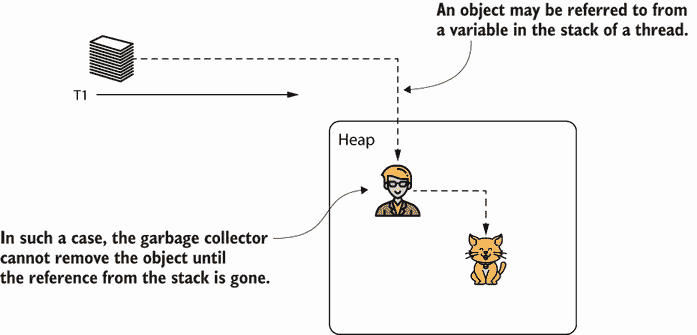

图 E.13 堆栈中的变量也可以引用堆中的实例，直到所有引用都消失（包括堆栈中的引用）才能被移除。

## E.4 存储数据类型的元空间内存位置

元空间是 JVM 用来存储用于创建堆中存储的实例的数据类型的内存位置（如图 E.14）。应用需要这些信息来处理堆中的对象实例。有时，在特定条件下，`OutOfMemoryError` 也可以影响元空间。如果元空间满了，没有更多空间供应用存储新的数据类型，应用会抛出 `OutOfMemoryError`，宣布元空间已满。根据我的经验，这些错误很少见，但我希望您对此有所了解。

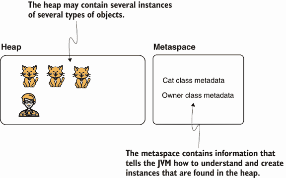

图 E.14 元空间是应用存储数据类型描述符的内存位置。它包含了定义堆中存储的实例的蓝图。
