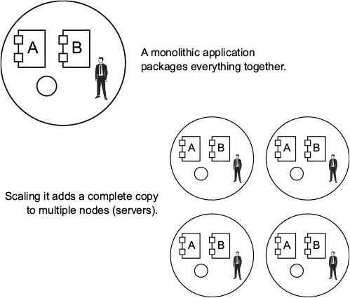
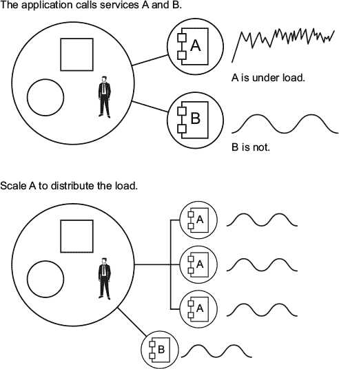
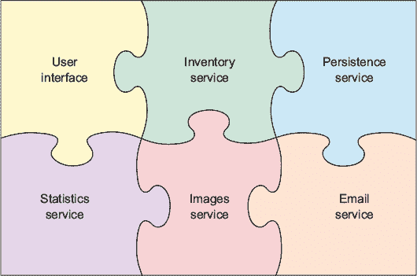
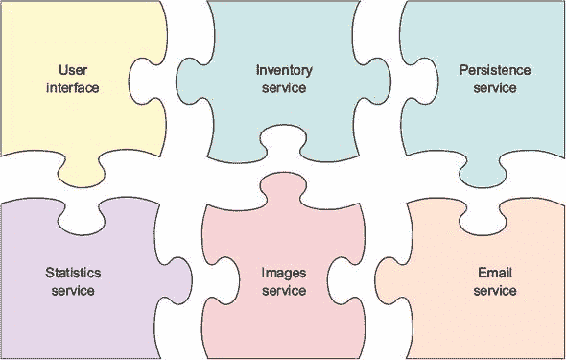
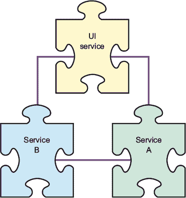
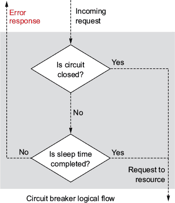
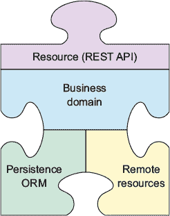
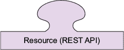
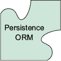
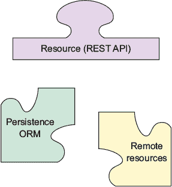

## 第一章。微服务简介

*本章涵盖*

+   为什么要转向新的微服务架构？

+   今天微服务是什么，以及未来可能的发展方向

+   微服务的基本组件构成

+   测试策略

传统的单体应用程序通常作为一个单一包部署，通常是一个 Web 或企业存档文件（WAR 或 EAR）。它们包含完成多个任务所需的所有业务逻辑，通常还包含渲染*用户界面*（UI，或 GUI，即*图形用户界面*）所需的组件。在扩展时，这通常意味着将整个应用程序存档的完整副本复制到新的服务器节点上（基本上，将其部署到集群中的另一个服务器节点）。无论负载或瓶颈发生在哪里；即使它只出现在应用程序的一个小部分，这种扩展方式都是一种全有或全无的方法。微服务专门设计用来针对和改变这种全有或全无的方面，通过允许您将业务逻辑分解成更小、更易于管理的元素，这些元素可以用多种方式使用。

这本书的目的不是介绍今天可用的各种微服务架构；我们假设您对这一主题有一些了解。相反，我们将帮助您克服测试所有微服务应用程序共享的常见功能所涉及到的挑战。为了做到这一点，在本章中，我们将确立一些关于微服务是什么的共识，这样您就可以在后面的章节中讨论这些话题时，了解我们的出发点。

转向越来越受欢迎的微服务架构意味着您需要在开发、测试、重构/重构和重构方面采用新的策略，并远离一些纯粹的单体应用程序实践。

微服务为您提供能够扩展单个服务的优势，以及能够使用多个团队并行开发和维护多个服务的能力，但它们在测试方面仍然需要一种稳健的方法。

在这本书中，我们将讨论使用这种新的、更专注的方式来交付紧密打包的“微”服务的各种方法，以及如何解决维护多个团队稳定性的复杂测试场景。后面的章节将介绍一个示例应用程序及其测试策略的开发；这将帮助您更好地理解如何创建自己的测试环境。

您将看到并使用 Arquillian 测试框架的许多功能，该框架专门设计用来解决您将面临的大多数常见测试挑战。多年来已经开发了一系列成熟的扩展，尽管其他工具也可用，但 Arquillian 是我们的首选工具——因此请期待一些偏见。话虽如此，Arquillian 还提供了与您可能已经熟悉的许多测试工具的紧密集成。

| |
| --- |

**关于软件版本的一个注意事项**

本书使用了许多不同的软件包和工具，这些工具都会定期更新。我们试图在整本书中展示不会因这些变化而受到很大影响的示例和技术。所有示例都需要 Java 8，尽管当我们完成这本书时，Java 10 已经发布。我们没有更新示例，因为在测试微服务方面，这个版本并没有增加任何新功能。对于 JUnit 5 也是如此。所有示例都是使用 JUnit 4.12 编写的，因为当我们开始写这本书时，JUnit 5 还没有开发出来。在我们完成这本书的时候，这里解释的所有框架还没有官方支持 JUnit 5，所以我们决定跳过更新 JUnit 版本。其他库，如 Spring Boot 和 Docker (Compose)，在本书的开发过程中也发生了演变，但这些变化对编写测试的方式没有重大影响。

| |
| --- |

### 1.1\. 什么是微服务，为什么使用它们？

在本节中，我们展示了我们认为目前对这些问题的现有答案的合理解释。你所学的知识将为理解微服务架构提供一个坚实的基础，但请期待随着时间的推移会有创新。我们不会做出任何预测：正如所述，本书的主要关注点是测试微服务，这不太可能发生任何重大变化。

在这个阶段，你完全理解微服务架构并不重要。但如果阅读完这一章后，“微服务”这个术语对你来说仍然是一个模糊的概念，我们鼓励你从自己的渠道获取更多信息。

| |
| --- |

##### 提示

你可能会发现加入 MicroProfile（[`microprofile.io`](http://microprofile.io)）的公开讨论很有用。这是由 IBM、伦敦 Java 社区（LJC）、RedHat、Tomitribe、Payara 和 Hazelcast 等公司发起的一项倡议，旨在为微服务开发一个共享的企业 Java 定义，目标是标准化。

| |
| --- |

#### 1.1.1\. 为什么使用微服务？

在我们深入探讨微服务的本质之前，让我们先回答“为什么”这个问题。直到最近，开发单体应用是很常见的，对于不需要扩展的应用来说，这仍然完全可接受。扩展任何类型单体应用的问题很简单，如图 1.1 所示。微服务并不是要告诉你其他一切都是不好的；相反，它们提供了一个比单体更具有未来变化适应性的架构。

##### 图 1.1\. 扩展单体应用

微服务使你能够隔离和扩展应用的小部分，而不是整个应用。想象一下，你将应用中的一些核心业务逻辑提取到了服务 A 和 B 中。假设服务 A 提供对商品库存的访问，而 B 提供简单的统计数据。你会发现，平均每小时服务 A 被调用一百万次，而服务 B 每天只被调用一次。扩展单体应用意味着添加一个包含服务 A 和 B 的应用的新节点。

如果你只需要扩展服务 A，岂不是更好？这就是微服务的潜力显现的地方：在新架构中，如图 1.2 所示，服务 A 和 B 变成了微服务 A 和 B。你仍然可以扩展应用，但这种额外的灵活性是关键：你现在可以选择在负载最大的地方进行扩展。更好的是，你可以指派一个开发团队来维护微服务 A，另一个团队来维护微服务 B。你不需要触及应用来添加功能或修复 A 或 B 中的错误，它们也可以完全独立地相互推出。

##### 图 1.2. 独立于主应用扩展微服务

Netflix、Google、Amazon 和 eBay 等公司已经将它们的大部分平台建立在微服务架构之上，并且他们都足够慷慨，愿意免费分享这些信息的大部分内容。尽管对 Web 应用的关注很多，但你也可以将微服务架构应用于任何应用。我们希望这能激发你的兴趣！

#### 1.1.2. 什么是微服务？

初看，术语“微”可能会让人联想到一个体积小、占用空间小的应用。但就应用大小而言，没有固定的规则，除了一个经验法则。一个微服务可能由几个、几百个，甚至几千行代码组成，这取决于你具体的业务需求；经验法则是保持逻辑足够小，以便单个团队管理。理想情况下，你应该专注于单个端点（这可能会提供多个资源）；但同样，也没有硬性规定。这是你的派对。

最常见的概念是，单个应用应该是微服务的上限。在典型应用服务器运行多个应用的背景下，这意味着将应用拆分，以便它们在单个应用服务器上运行。理论上，将你的第一个微服务视为拼图的一块，并尝试想象它如何与下一块拼合在一起。

你可以将单体应用程序分解为其逻辑部分，如图 1.3 所示 figure 1.3。每个拼图块中应该包含足够的信息，以便你能够构建更大的图景。在微服务架构中，这些部分耦合得更加松散；参见 figure 1.4。

##### 图 1.3\. 每个服务都是大图景的一部分。

##### 图 1.4\. 每个微服务仍然是图景的一部分，但被隔离在单独的环境中。

#### 1.1.3\. 持续集成、部署和 Docker

将应用程序元素*解耦*到可扩展的微服务意味着你将不得不从早期阶段开始考虑*持续集成(CI)*和*持续交付(CD)*管道。你将需要多个独立的构建，这些构建必须被缝合在一起进行集成测试和部署到不同的主机。

你会发现所需的工作远比你想象的要少。这主要归因于这样一个事实，即微服务在本质上就像任何其他应用程序一样。唯一的区别是微服务将应用程序与其运行环境打包在一起。今天最简单、最公认的方法是将微服务作为 Docker 镜像([www.docker.com](http://www.docker.com))创建和部署。

| |
| --- |

##### 注意

Docker 是世界上领先的软件容器化平台。如果你不确定 Docker 是什么，那么在某个时候请访问[www.docker.com](http://www.docker.com)并遵循“什么是 Docker？”教程。不过，不用担心——当我们把所有微服务元素组合在一起，在本书的结尾部分，我们将引导你通过这个管道。

| |
| --- |

重型 CI/CD 竞争者包括 Travis([`travis-ci.org`](https://travis-ci.org))、Bamboo([`de.atlassian.com/software/bamboo`](https://de.atlassian.com/software/bamboo))和 Jenkins([`jenkins.io`](https://jenkins.io))。它们都为微服务和 Docker 镜像的部署管道提供了很好的支持；但在这本书中，我们将使用 Jenkins，因为它开源并且拥有庞大的社区。它可能不是最容易使用的，但它通过插件提供了最丰富的功能。在第八章[kindle_split_017_split_000.xhtml#ch08]中，我们将详细介绍所有涉及的技术，并指导你开发一个可行的 CI/CD 管道。

### 1.2\. 微服务网络和特性

微服务是*松散耦合*的，这引发了一些新问题。微服务是如何耦合的，这种架构提供了哪些特性？在接下来的章节中，我们将探讨一些答案。但无论如何，每个微服务都是由网络边界隔离的。

#### 1.2.1\. 微服务网络

微服务通常通过 RESTful (表示状态转移) API 使用 HTTP 或 HTTPS 进行集成，但它们可以通过任何被认为是一种协议来连接，以访问资源或函数的端点。这是一个广泛的话题，所以我们只将讨论和演示使用 JAX-RS 的 Java REST。

|  |
| --- |

##### 小贴士

如果你还不熟悉使用 JAX-RS 的 RESTful 网络服务([`jax-rs-spec.java.net`](https://jax-rs-spec.java.net))，现在正是学习这些主题的好时机。

|  |
| --- |

在获得这些信息后，你对微服务的初步想法应该开始成形。让我们继续之前的例子。微服务 A，库存服务，通过网络层与 UI 和微服务 B，统计服务隔离。B 通过定义的请求-响应协议与 A 通信以收集统计数据。它们各自拥有自己的领域和外部资源，并且在其他方面完全独立。UI 服务能够调用 A 和 B，以人类可读的形式、一个网站或一个重型客户端展示信息，如图 1.5figure 1.5 所示。

##### 图 1.5\. 每个服务通过定义的协议进行通信。

|  |
| --- |

**超媒体**

应该考虑使用 *超媒体* 来开发服务。这是最新的热门词汇；它意味着服务在其架构中应该是自文档化的，通过在任何响应中提供相关资源的链接。目前在这个类别中还没有赢家，现在开始下注是不公平的，但你可以看看领跑者并做出明智的猜测：JSON-LD ([`json-ld.org`](http://json-ld.org))、JSON Hypertext Application Language (HAL, [`tools.ietf.org/html/draft-kelly-json-hal-08`](https://tools.ietf.org/html/draft-kelly-json-hal-08))、Collection+JSON ([`github.com/collection-json/spec`](https://github.com/collection-json/spec)) 和 Siren ([`github.com/kevinswiber/siren`](https://github.com/kevinswiber/siren))。

|  |
| --- |

测试必须设计得能够全面覆盖与外部服务的任何交互。这一点非常重要，因为网络交互总会带来它自己的一套挑战。我们将在第五章 chapter 5 中对此进行详细讨论。

到现在为止，应该很清楚，微服务在应用大小方面可以很大，而“微”指的是应用的公共接口面积。如今云空间便宜，所以微服务的物理大小不如过去那么重要。

我们经常听到的另一个担忧是，“关于网络速度怎么办？”微服务通常托管在同一本地网络中，这通常是千兆以太网或更好。因此，从客户端的角度来看，考虑到微服务的易于扩展，响应时间可能会比预期的要好得多。再次强调，不要只听我们的话；想想 Netflix、Google、Amazon/AWS 和 eBay。

#### 1.2.2\. 微服务特性

在我们的例子中，微服务 A 和 B 都可以独立开发并由两个完全不同的团队部署。每个团队只需要了解他们正在工作的微服务的资源组件层，而不是整个业务域组件。这是第一个重大胜利：在给定上下文中，开发可以更快且更容易理解。

JavaScript 对象表示法（JSON，[www.json.org](http://www.json.org)）和可扩展标记语言（XML，[www.w3.org/XML](http://www.w3.org/XML)）是常见的资源语言，因此编写此类服务的客户端很容易。在某些情况下，可能需要不同的方法，但基本场景基本上是相同的：端点可以通过定义的协议从多种设备和客户端访问。

多个微服务形成一个连接的应用程序网络，其中每个单独的微服务都可以独立扩展。云上的弹性部署现在很常见，这使得单个服务可以根据负载自动扩展或缩减。

微服务的其他一些有趣的好处是提高了故障隔离和内存管理。在单体应用中，单个组件的故障可能会使整个服务器崩溃。具有弹性的微服务，大部分功能将继续运行，直到出现问题的服务问题得到解决。在图 1.6 中，统计服务对于整个应用的功能是否真的必要，或者你可以在一段时间内没有它？

##### 图 1.6\. 使用断路器的弹性设计

当然，正如所有美好事物的本质一样，微服务也有其缺点。开发者需要学习和理解开发分布式应用的复杂性，包括如何最好地使用 IDE，这些 IDE 通常面向单体开发。开发跨越多个服务且不包含在分布式事务中的用例需要比单体应用更多的思考和规划。而且测试通常更困难，至少对于连接的元素来说是这样，这也是我们编写这本书的原因。

### 1.3\. 微服务架构

微服务的结构可能多种多样，如图 1.7 所示，但设计上的相似性是必然的。这些元素可以组合在一起形成应用程序组件层。在每个层提供测试覆盖率很重要，你可能会在过程中遇到新的挑战；我们将在整本书中解决这些挑战并提供解决方案。

##### 图 1.7\. 基本微服务组件

让我们从上到下看看这些微服务组件层。

|  |
| --- |

##### 注意

微服务应该封装并暴露一个定义良好的逻辑区域作为服务。这并不意味着你不能通过其他方式允许其他系统进行交互。例如，你的服务可能公开了存储在 Elasticsearch（ES）中的特定文档。在这种情况下，其他应用程序直接与 ES 通信以初始化文档是完全合法的。

|  |
| --- |

#### 1.3.1\. 资源组件

资源负责通过选定的协议公开服务交互。这种交互使用映射对象进行，通常使用 JSON 或 XML 进行序列化。这些映射对象代表业务域的输入和/或输出。对传入对象的净化和协议特定响应的构建通常发生在这一层；参见图 1.8。

##### 图 1.8\. 资源组件公开暴露服务。

|  |
| --- |

##### 注意

现在我们已经在这里，值得提一下，资源组件层是使“微”服务成为“微服务”的层。

|  |
| --- |

在本书的其余部分，为了简单起见，我们将关注今天最常见的资源提供者形式：*RESTful 端点*^([1])。如果你不熟悉 RESTful Web 服务，请花时间研究和理解这个重要主题。

> ¹
> 
> 请参阅 Java EE 6 教程中的“什么是 RESTful Web 服务？”，[`mng.bz/fIa2`](http://mng.bz/fIa2)。

#### 1.3.2\. 业务域组件

业务域组件是您服务应用程序的核心焦点，并且对于服务正在开发的具体逻辑任务非常具体。域可能需要与各种其他服务（包括其他微服务）进行通信，以便计算响应或处理来自资源组件的请求和响应；参见图 1.9。

##### 图 1.9. 业务域组件是您服务业务逻辑。

在域组件和资源组件之间，以及可能还有远程组件之间，可能需要一个桥梁。大多数微服务都需要在某个时候与其他微服务进行通信。

#### 1.3.3\. 远程资源组件

这个组件层是您的拼图碎片可能需要连接到图片的下一部分或几部分的地方。它由一个客户端组成，该客户端了解如何向其他微服务端点发送和接收资源对象，并将其转换为业务组件层中的使用；参见 图 1.10。

##### 图 1.10\. 远程资源组件是通往其他服务的入口。

由于远程资源的特点，你必须特别注意创建一个具有弹性的设计。一个弹性的框架旨在在发生故障时提供诸如断路器和超时回退等特性。不要试图重新发明轮子：有多个弹性的框架可供选择，包括我们的首选，Hystrix ([`github.com/Netflix/Hystrix/wiki`](https://github.com/Netflix/Hystrix/wiki))，这是一个开源项目，由 Netflix 贡献。

网关服务应充当领域组件和客户端组件之间的桥梁。它负责通过客户端将请求和响应调用翻译为任何远程资源。如果资源无法访问，这是提供优雅失败的最佳位置。

客户端负责使用您选择的协议进行通信。十有八九，这将是通过 HTTP/S 的 JAX-RS ([`jax-rs-spec.java.net`](https://jax-rs-spec.java.net)) 用于 RESTful 网络服务。

我们强烈推荐开源服务框架 Apache CXF ([`cxf.apache.org`](http://cxf.apache.org)) 用于此层，因为它完全符合 JAX-WS、JAX-RS 等标准，并且不会将您绑定到特定平台。

#### 1.3.4\. 持久性组件

更多时候，应用程序需要某种类型的持久性或数据检索（参见 图 1.11）。这通常以对象关系映射（ORM）机制的形式出现，例如 Java 持久性 API（JPA），^([2])，但也可能是像嵌入式数据库或属性文件这样简单的东西。

> ²
> 
> 请参阅“Hibernate ORM：什么是对象/关系映射？” [`hibernate.org/orm/what-is-an-orm`](http://hibernate.org/orm/what-is-an-orm)。
> 
> ³
> 
> 请参阅 Java EE 6 教程中的“Java 持久性 API 简介”，[`mng.bz/Cy69`](http://mng.bz/Cy69)。

##### 图 1.11\. 持久性组件用于数据存储。

### 1.4\. 微服务单元测试

第三章 将深入探讨实际的单元测试场景。接下来的几段将介绍我们将使用的术语以及您在开发测试策略时可以期待的内容。

典型的单元测试旨在尽可能小，并测试一个微不足道的项目：*工作单元*。在微服务环境中，这个工作单元可能更难表示，因为服务通常比乍看之下有更多的底层复杂性。

单元测试往往会导致您需要重构代码以降低被测试组件的复杂性。这也使得测试作为一个设计工具变得有用，尤其是在您使用测试驱动开发（TDD）时。单元测试的一个有益副作用是，它让您在检测回归的同时继续开发应用程序。

虽然您可能会在过程中遇到更详细的场景，但基本上有两种单元测试风格：*社交*和*独立*。这些风格松散地基于单元测试是否与其底层协作者隔离。两种风格都不是排他的，并且它们很好地互补。您应该根据测试挑战的性质使用两者。我们将在整本书中扩展这些概念。

#### 1.4.1\. 独立单元测试

独立单元测试应专注于单个对象类的交互。测试应仅涵盖该类自己的依赖项或对该类的依赖项。您通常会使用独立测试来测试资源、持久性和远程组件，因为这些组件很少需要相互协作；参见图 1.12。

##### 图 1.12\. 主要为独立单元测试组件

您需要通过模拟或存根化该类中所有协作者来隔离单个类进行测试。您应该测试该类的所有方法，但不要跨越到其他具体类的边界。基本上，这意味着所有注入的字段都应该接收一个模拟或存根化的实现，该实现只返回预定义的响应。主要目标是使被测试类的代码覆盖率尽可能高。

#### 1.4.2\. 社交单元测试

社交单元测试侧重于通过观察其状态的变化来测试模块的行为。这种方法将单元测试视为一个完全通过其接口测试的黑盒。领域组件几乎总是社交测试的候选者，因为它需要协作以处理请求并返回响应；参见图 1.13。

##### 图 1.13\. 主要为社交单元测试组件

你可能仍然需要模拟或伪造测试中类的一些复杂协作者，但这应该在协作对象层次结构中尽可能远。你不应该只测试特定类是否发送和接收正确的有效载荷，还应该测试类协作者在**类内部**是否按预期操作。测试覆盖率应理想地包括所有模型、变量和字段以及类协作者。测试该类能够正确处理任何响应，包括无效响应（负面测试）也很重要。

### 摘要

+   微服务是单体应用的一部分，已经被分解成更小的逻辑元素。

+   微服务通过允许有针对性的扩展和专注的开发，使你的应用程序受益。

+   微服务通过提供能力来扩展性能所需的**位置**和**时间**，提供了一种逻辑上满足可扩展性要求的方法。

+   你可以将单体应用拆分成更小的元素，这些元素可以用作微服务。

+   微服务允许几个团队专注于构成更大图景的个别、非冲突任务。

+   单独的单元测试用于那些不需要存储状态或不需要协作以进行测试的组件。

+   社交单元测试用于那些必须协作或存储状态以进行测试的组件。
