## 第二章\. 测试中的应用程序

*本章涵盖*

+   探索一个示例应用程序

+   理解代码的关键部分

+   使用 Java EE 和 Spring Boot 开发微服务

上一章向您介绍了微服务，包括它们的基本结构和架构。这个介绍旨在让您了解您可能需要为基于微服务架构编写的测试类型。

本章介绍了将在整本书中用于演示微服务架构开发和测试的应用程序。我们的目标是提供一个易于遵循的示例，以帮助您了解将要应用的各种测试的相关性。我们试图遵循微服务架构的最佳实践，但为了简单起见，也为了纯粹的教育目的，我们做出了一些设计选择。例如，我们可能会使用比必要的更多技术，或者简化微服务中使用的层数，因为它们从测试的角度来看没有增加价值。在这种情况下，我们会指出采取特定方法的原因，并讨论如何在现实世界的编程中执行这些任务。最终，作为开发者，选择合适的工具是您的责任，但我们始终提供推荐的方法。

### 2.1\. 开始

示例应用程序 Gamer 是一个简单的软件门户，面向玩家。其目的是公开软件游戏的信息，并让玩家不仅能够阅读有关游戏的重要事实和观看游戏播放的视频，还能够对已玩的游戏进行评论并留下星级评分。尽管这个应用程序故意很简单，但它涵盖了展示微服务架构所需的所有主要主题。在整本书中，我们将引导你了解为基于微服务架构的应用程序编写的各种测试。

我们将首先提供一些关于 Gamer 应用程序的使用案例，以获得玩家可以采取的高层次视图。玩家希望能够做以下事情：

+   通过名称搜索游戏，以便他们可以看到符合他们兴趣的游戏列表

+   了解游戏的重要方面，如发布日期和哪些平台支持

+   阅读其他玩家对游戏的评论，以帮助他们决定是否喜欢它并想购买它

+   对游戏写评论，以便其他玩家可以从他们的评估中受益

+   为游戏分配星级评分，并快速查看评分最高的游戏

+   观看与游戏相关的视频，如预告片、教程和实际游戏中的玩法

让我们先定义这个应用程序所需的数据。我们目前不会关注技术细节——本节仅描述概念数据模型。

主要实体是 *游戏*。表 2.1 展示了构成游戏的部分。

##### 表 2.1\. 游戏的组成部分

| 字段 | 描述 |
| --- | --- |
| 标题 | 表示游戏名称的字符串 |
| 封面 | 游戏封面的图片 URL |
| 发布日期 | 游戏的发布日期 |
| 发行商 | 游戏的发行商 |
| 开发者 | 游戏的开发者 |

表 2.2 展示了构成一个 *发布日期* 的部分。

##### 表 2.2\. 发布日期的组成部分

| 字段 | 描述 |
| --- | --- |
| 平台 | 游戏发布的平台名称 |
| 日期 | 游戏在平台上发布的日期（日、月和年） |

表 2.3 展示了构成一个 *注释* 的部分。

##### 表 2.3\. 注释的组成部分

| 字段 | 描述 |
| --- | --- |
| 注释 | 包含注释信息的字符串 |
| 评分 | 从 1 到 5 的星级评分，表示游戏的整体质量 |

现在你已经了解了 Gamer 应用将管理的数据类型，我们可以进一步深入，检查应用架构。

### 2.2\. 前提条件

本书不是 Java 教程。如果你对 Java 语言不熟悉，那么你很可能不会享受阅读。话虽如此，我们希望提供对所有兴趣水平读者都有用的信息。[`docs.oracle.com/javase/tutorial`](https://docs.oracle.com/javase/tutorial) 上的 Java 教程是任何有志于成为 Java 开发者的优秀资源，也是所有使用 Java 的人的绝佳参考。

本书也不是学术杰作。作者主要是开发者，对我们中的一些人来说，英语不是第一语言。我们喜欢亲自动手，也希望你也是如此。我们希望你保持开放的心态，并理解并非所有人都会分享我们的观点。没有一种方式是完全正确或完全错误的，我们的建议是为了激发你的创造性思维。

|  |
| --- |

##### 注意

大部分源代码是基于在打印页面上呈现的限制进行格式化的。这可能导致冗长的布局。请随意调整代码格式以符合你的偏好。

|  |
| --- |

#### 2.2.1\. Java 开发工具包

你至少需要 Java 开发工具包（JDK）的 SE（标准版）8 版本来编译和运行本书中的代码。你可以在[`mng.bz/83Ct`](http://mng.bz/83Ct)找到最新的 Oracle JDK（推荐）或在[`openjdk.java.net`](http://openjdk.java.net)找到 OpenJDK。

要测试 Java，运行以下命令，它应该显示类似于以下的结果，具体取决于你的安装版本：

```
$ java -version

java version "1.8.0_121"
Java(TM) SE Runtime Environment (build 1.8.0_121-b13)
Java HotSpot(TM) 64-Bit Server VM (build 25.121-b13, mixed mode)
```

#### 2.2.2\. 构建工具

我们使用 Apache Maven ([`maven.apache.org`](https://maven.apache.org)) 和 Gradle ([`gradle.org`](https://gradle.org)) 来构建项目的几个模块。请确保你已按照相应网站上的说明安装了这两个工具。

要测试 Maven 是否正确安装，运行以下命令：

```
$ mvn -version

Apache Maven 3.3.9
...
```

对于 Gradle，运行以下命令：

```
$ gradle -v

------------------------------------------------------------
Gradle 3.2.1
------------------------------------------------------------
```

#### 2.2.3\. 环境变量

完整的应用程序需要两个 API 密钥才能访问一些远程资源。API 密钥注册到个人用户账户，因此我们无法在此提供共享密钥。

运行本书中提供的测试示例中的大多数示例不需要获取这些密钥。但如果你希望实验代码，我们建议你获取密钥并创建相应的环境变量。要获取 YouTube 的 API 密钥，请访问[`developers.google.com/youtube/v3/getting-started`](https://developers.google.com/youtube/v3/getting-started)并遵循“开始之前”部分的说明。要获取互联网游戏数据库（IGDB）的 API 密钥，请访问[`igdb.github.io/api/about/welcome`](https://igdb.github.io/api/about/welcome)或直接访问[`api.igdb.com`](https://api.igdb.com)注册访问。

一旦您有了自己的 API 密钥，请将它们添加到您的环境变量中。在 Linux 上，请在/home/profile 中添加以下内容：

```
...
export YOUTUBE_API_KEY="Your-Key"
export IGDB_API_KEY="YourKey"
```

Windows 用户可能会发现以下链接在配置环境变量时很有用：[`mng.bz/1a2K`](http://mng.bz/1a2K).^([1])

> ¹
> 
> William R. Stanek，"配置系统和用户环境变量"，MSDN，来自 *Microsoft Windows 2000*（Microsoft Press，2002 年）。

#### 2.2.4\. 集成开发环境 (IDE)

应用程序代码中没有任何部分*要求*您使用 IDE。记事本就足够了。

当然，您可以自由地使用您喜欢的 IDE（支持基于 Maven 和 Gradle 的项目）打开项目。如果您想在代码中添加断点以跟踪执行路径（强烈推荐），那么我们建议使用 IDE。

我们在以下 IDE 中测试了代码，没有特别的偏好顺序：

+   *IntelliJ IDEA* ([www.jetbrains.com/idea](http://www.jetbrains.com/idea))

+   *NetBeans* ([`netbeans.org`](https://netbeans.org))

+   *Eclipse* ([www.eclipse.org/downloads](http://www.eclipse.org/downloads))

### 2.3\. 架构

如本章开头所述，Gamer 应用程序遵循微服务架构。首先要做的是确定哪些服务构成了应用程序。对于这个应用程序，我们得出结论，需要将领域划分为四个不同的微服务：

+   *游戏服务*—提供与游戏相关的所有信息。它包括通过特定名称获取游戏 ID 的查询，或返回特定游戏 ID 的信息。

+   *评论服务*—为特定游戏添加星级评分和评论，以及检索它们。

+   *视频服务*—返回特定游戏的三个最突出的视频的位置。

+   *聚合服务*—调用上述命名的服务，并将每个服务的数据聚合到单个响应中。

应用程序架构如图 2.1 所示。figure 2.1。

##### Figure 2.1\. 游戏应用程序架构

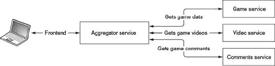

如您所见，前端（通常是浏览器）消耗 Gamer API 提供的信息。入口点是聚合服务，它与游戏、视频和评论服务通信，以获取或插入游戏所需的数据。聚合服务将所有数据编译成单个响应，并将其返回给前端。你现在可以理解应用程序架构以及每个服务做出决策的技术原因。

| |
| --- |

##### 注意

首先，当你从命令行或 IDE 构建应用程序时，请先跳过测试。为了说明一个观点，并提供练习，一些测试可能不会按照提供的方式完成。随着你在本书中的知识积累，你将处于更好的位置来玩转和扩展示例代码。

| |
| --- |

#### 2.3.1. 游戏服务

使用以下代码安装游戏服务：

```
cd ./game
mvn install -DskipTests
```

游戏服务是一个运行在 WildFly Swarm 上的 Java EE 7 应用程序，负责提供所有与游戏相关的信息。它提供了两个操作来检索这些信息：

+   通过标题获取游戏列表（多个游戏可能具有相同的标题）。为此端点提供的信息必须是最少的：例如，只有游戏的标识符和/或标题。

+   通过指定已知的游戏标识符来返回有关游戏的详细信息。

你可能已经注意到没有插入游戏的操作。这是因为游戏服务充当外部服务 API 的代理/缓存。*外部服务*是一个超出当前应用程序范围的服务，由第三方开发和维护，而你只是订阅者。这些服务的典型例子包括搜索引擎、天气预报和地理空间计算。

此服务示例依赖于互联网游戏数据库网站（[www.igdb.com](http://www.igdb.com)）来提供所有必需的游戏数据。

| |
| --- |

**互联网游戏数据库 API**

IGDB 是一个视频游戏数据库，旨在供游戏消费者和视频游戏专业人士使用。除了作为获取游戏信息的门户外，该网站还提供了一个公共 REST API（[www.igdb.com/api](http://www.igdb.com/api)），允许您访问网站上注册的游戏数据。

要授权访问 REST API，您需要在网站上注册并请求一个新的 API 密钥。此密钥必须在每次调用中作为 HTTP 头传递。

在本书的过程中，我们提供了更多关于 IGDB REST API 的信息，例如如何对 IGDB 进行身份验证，以及资源端点的所需格式。

| |
| --- |

当你依赖第三方服务的外部调用时，始终很重要（如果可能的话）尽可能多地缓存外部服务的数据。这有三个原因很重要：

+   你避免了往返外部网络的来回，这通常是一个慢速操作。

+   如果你对外部 API 有配额/计费访问权限，你可以节省对服务的访问次数。

+   如果外部服务出现故障，您的应用程序可以继续使用缓存数据工作。

|  |
| --- |

##### 警告

通常，缓存仅在外部数据不经常更改或您可以在您的系统上复制所有数据的情况下使用。为了保持外部数据的一致性，您应该对缓存应用定期刷新策略，以防止其过时。为了简化，示例应用程序中没有实现刷新策略，但在实际场景中这是一个需要考虑的问题。

|  |
| --- |

在这个微服务中，使用轻量级 SQL 数据库 H2 ([www.h2database.com/html/main.html](http://www.h2database.com/html/main.html)) 实现了一个缓存持久化层系统。游戏服务中使用的实体-关系（ER）模型由四个实体组成，在表 2.4–2.7 中进行了描述。图 2.2 以图形方式展示了这一点。

##### 表 2.4. `Game`表

| 字段 | 数据类型 | 描述 |
| --- | --- | --- |
| id | Long | 游戏标识符。 |
| version | Int | 用于避免乐观锁冲突的内部字段。 |
| title | String | 游戏名称。此值是唯一的。 |
| cover | String | 游戏封面的 URL，如果没有封面则为 null。 |
| 发布日期 | ReleaseDate | 类型为 ReleaseDate 的一对多关系。 |
| Publishers | 字符串集合 | 出版商与游戏名称之间的一对多关系。 |
| Developer | 字符串集合 | 开发者与游戏名称之间的一对多关系。 |

##### 表 2.5. `ReleaseDate`表

| 字段 | 数据类型 | 描述 |
| --- | --- | --- |
| OwnerId | Long | 游戏标识符。此字段作为外键。 |
| platformName | String | 游戏发布的平台名称。 |
| releaseDate | String | 游戏在此平台上发布的日期，格式为 YYYY/MM/DD。 |

##### 表 2.6. `Publisher`表

| 字段 | 数据类型 | 描述 |
| --- | --- | --- |
| OwnerId | Long | 游戏标识符。此字段作为外键。 |
| publisherName | String | 出版社名称。 |

##### 表 2.7. `Developer`表

| 字段 | 数据类型 | 描述 |
| --- | --- | --- |
| OwnerId | Long | 游戏标识符。此字段作为外键。 |
| developer | String | 开发者名称。 |

##### 图 2.2. 游戏应用实体关系

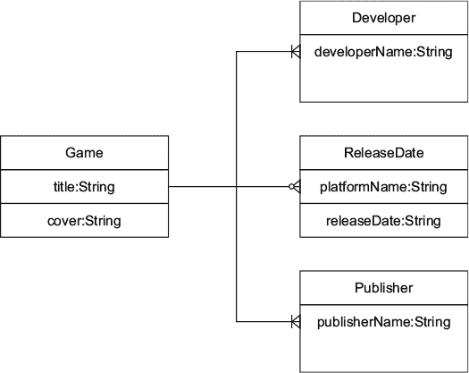

图 2.2 中的实体-关系模式显示，一个游戏由一个标题和一个封面组成，由一个或多个开发者制作，由一个或多个出版商出版，并且每个平台都有零个或多个发布日期。

|  |
| --- |

##### 备注

对于微服务架构的缓存数据，还有其他一些很好的选择，例如 Infinispan、Hazelcast 和 Redis。它们不仅提供*生存时间*（TTL）功能，这使得刷新逻辑更加简单，而且在分布式（集群）环境中也能工作，这在微服务架构中很典型。为了教学目的，在这本书中我们使用 SQL 数据库。这种方法很简单，并使用您可能熟悉的技术。这也使我们能够介绍一个重要功能：ORM 的持久化测试。

| |
| --- |

在服务器层，游戏服务运行在 WildFly Swarm 应用程序服务器上。该服务的整体架构图显示在图 2.3 中。持久化层使用 H2 SQL 数据库来存储和检索游戏的缓存数据。最后，该服务连接到外部网站（IGDB.com）以获取尚未在系统中缓存的游戏的详细信息。

##### 图 2.3\. 游戏服务概览

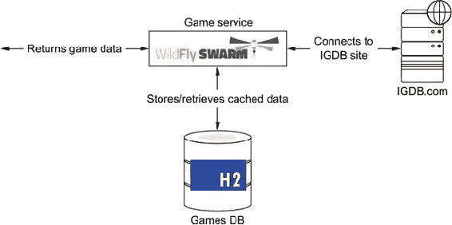

| |
| --- |

**WildFly Swarm**

WildFly Swarm ([`wildfly-swarm.io`](http://wildfly-swarm.io))提供了一种打包和运行 Java EE 应用程序的方法，通过生成 uber-JAR（`java -jar MyApp.jar`），将应用程序与服务器运行时打包在一起以运行。

它还内置了对 Logstash、Netflix 项目如 Hystrix 和 Ribbon、Red Hat 项目如 Keycloak 和 Hawkular 等应用程序和框架的支持。

| |
| --- |

#### 2.3.2\. 评论服务

使用以下代码构建和打包评论服务：

```
cd ./comments
./gradlew war -x test
```

评论服务是一个运行在 Apache TomEE 上的 EE 7 应用程序。它负责管理特定游戏的评论以及游戏评分。评分是一个介于 1（最低评分）和 5（最高评分）之间的数字。请注意，此功能不是由 IGDB 提供的；这是您将添加到门户中使其更具参与性的功能。此服务提供两个端点：

+   一条添加评论和游戏评分

+   第二个返回所有为游戏编写的评论以及平均游戏评分

此服务的持久化层使用面向文档的 NoSQL 数据库来存储服务所需的所有数据。我们特别选择了 MongoDB NoSQL 数据库，因为它具有开箱即用的聚合框架。这对于计算给定游戏的平均评分是一个完美的解决方案。

| |
| --- |

##### 注意

可以使用传统的 SQL 数据库实现类似的逻辑，但如今由于在某些情况下性能更好，使用 NoSQL 数据库并不罕见。此服务使用 NoSQL 数据库来展示示例。

| |
| --- |
| |

**MongoDB**

MongoDB 是一个面向文档的 NoSQL 数据库。它不使用关系型数据库结构，而是在集合中以动态架构存储类似 JSON 的文档。具有相似目的的文档存储在同一个集合中。你可以将集合视为与 RDBMS 表等效，但不需要强制架构。

除了存储文档外，MongoDB 还提供索引、复制、水平分片负载均衡和聚合框架等功能。

|  |
| --- |

MongoDB 将文档组织成 *集合*。对于评论服务，这个集合被命名为 *comments*。每个代表评论的文档具有以下架构，并包含游戏的 ID、评论本身以及游戏的评分（见 图 2.4）：

```
{
  "gameId": 1234,
  "comment": "This game is awesome",
  "rate": 3
}
```

##### 图 2.4\. 评论集合

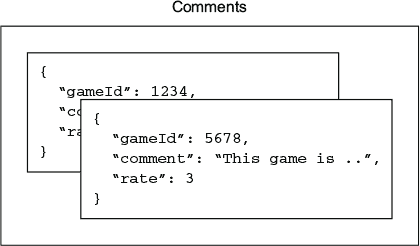

评论服务的整体架构在 图 2.5 中展示。在服务器层，它运行在 Apache TomEE 应用服务器上（[`tomee.apache.org`](http://tomee.apache.org)）；对于持久化层，它使用 MongoDB NoSQL 数据库来存储和检索与游戏相关的评论。

##### 图 2.5\. 评论服务概览

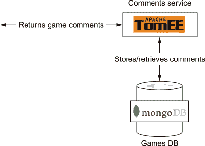

|  |
| --- |

**Apache TomEE**

Apache TomEE ([`tomee.apache.org`](http://tomee.apache.org))，发音为“Tommy”，是一个全 Apache Java EE 6 Web Profile 认证和 EE 7 启用的堆栈，其中 Apache Tomcat 是主要角色。Apache TomEE 是从普通的 Apache Tomcat 压缩文件构建而成的。从 Apache Tomcat 开始，TomEE 添加了自己的 JAR 文件，并将剩余的文件压缩起来。结果是添加了 EE 功能的 Tomcat——因此得名 TomEE。

|  |
| --- |

#### 2.3.3\. 视频服务

使用以下代码构建视频服务：

```
cd video
./gradlew build -x test
```

视频服务是一个 Spring Boot 应用程序，负责检索与给定游戏相关的三个最突出的视频。请注意，此功能不是由 IGDB 提供的；这是你将添加到门户中，使其对最终用户更具吸引力的内容。显然，此服务不会通过创建新的视频分享/流媒体网站来重新发明轮子，因此它使用 YouTube 来检索视频。

|  |
| --- |

**YouTube**

YouTube 是一个全球性的视频分享网站。你可以将 YouTube 功能添加到任何网站，甚至可以搜索内容。

*YouTube 数据 API* 是 YouTube 为用户提供以连接其系统并执行上传视频、修改视频和搜索匹配特定术语的视频等操作而提供的 REST API。有关如何使用 YouTube 数据 API 的信息，请参阅本书附录。

|  |
| --- |

此服务提供了一个单一端点，返回指定游戏的三个最突出的视频链接。

这个微服务在系统中长期存储数据的持久层方面没有。对于这个微服务，使用一个键值对的 NoSQL 内存数据库来缓存从 YouTube 搜索结果。当您需要缓存分布式数据且需要可选的持久性时，键值数据库是最佳选择，因为它们完美地满足这一需求。采用这种方法，您可以节省时间，因为外部网络请求比内部请求更昂贵。您还可以节省 YouTube 数据 API 分配的请求配额。在视频服务中，用作缓存系统的键值数据库是 Redis 数据库。

|  |
| --- |

**Redis**

Redis 是一个内存数据结构存储，可以用作数据库、缓存系统或消息代理。它支持字符串、散列、列表、集合、范围查询的有序集合、位图、HyperLogLogs 和具有半径查询的地理空间索引等数据结构。

Redis 提供集群功能、主从复制和事务，在不持久化数据时具有极好的性能。

|  |
| --- |

用于此微服务的 Redis 结构是一个*列表*。这个基本结构为给定键存储一个字符串值列表，并可选地带有 TTL。在这种情况下，键是游戏 ID，列表中每个元素的值是与游戏相关的视频 URL。如图 2.6 所示，Redis 结构存储了一个游戏 ID 和三个 YouTube URL 的列表。

|  |
| --- |

**Spring Boot**

Spring Boot ([`projects.spring.io/spring-boot`](http://projects.spring.io/spring-boot)) 使创建独立、生产级别的基于 Spring 的应用程序变得简单，您可以“直接运行”。它采用 uber(fat)-JAR 方法，将应用程序打包到一个单一的 JAR 文件中，该文件包含运行时（嵌入服务器加应用程序）和一个`Main`类来运行它。它与 Spring 生态系统中的其他产品（如 Spring Data 和 Spring Security）很好地集成。

|  |
| --- |

##### 图 2.6\. Redis 中缓存的视频 URL

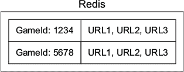

该服务的整体架构如图 2.7 所示。figure 2.7。您可以看到视频服务是一个 Spring Boot 应用程序，它使用的缓存层是 Redis。该服务连接到外部网站（youtube.com）以获取特定游戏的视频链接。

##### 图 2.7\. 视频服务

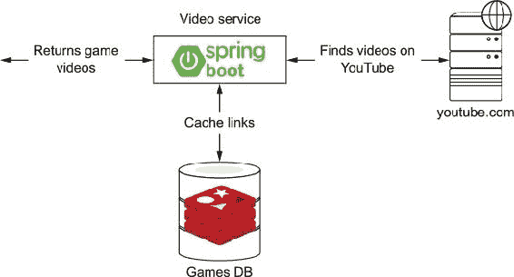

#### 2.3.4\. 聚合服务

使用以下代码构建和打包聚合服务：

```
cd aggregator
./gradlew war -x test
```

此服务是一个 EE 7 应用程序，负责对游戏和评论服务进行调用，将两个调用的结果合并成一个文档，并将此文档返回给调用者。此服务提供三个端点：

+   一个用于添加评论和游戏评分

+   返回所有具有指定名称的游戏的第二个

+   一个返回与指定游戏相关的所有数据、所有用户评论和评分以及该游戏最重要的三个视频的第三个

聚合器服务整体架构如图图 2.8 所示。它没有持久化层。该服务在 Apache Tomcat 服务器内运行，并连接到所有其他服务。

| |
| --- |

**Apache Tomcat**

Apache Tomcat 服务器是 Java Servlet、JavaServer Pages、Java Expression Language 和 Java WebSocket 技术的开源实现。

| |
| --- |

##### 图 2.8\. 游戏聚合器服务与其他服务的关系

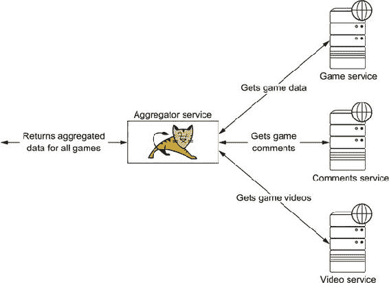

#### 2.3.5\. 总体架构

总结来说，Gamer 应用程序由三个服务组成。每个服务都部署在不同的平台上，从轻量级应用程序服务器 Apache TomEE 到 WildFly Swarm uber-JAR。持久化层使用了两种不同的数据库引擎：H2，一种传统的 SQL 数据库，以及 MongoDB，它属于 NoSQL 数据库家族。

这是一个广泛的技术范围。我们选择使用这些各种技术，具体是为了扩大本书的说明范围。在现实世界中，你的应用程序可能基于更相似的技术。但是，如前所述，不同团队工作在不同微服务上并不罕见。

Gamer 应用程序的整体架构可以在图 2.9 的架构图中看到。在架构图上，所有组件如何连接起来以组成一个完全功能化的、基于微服务的应用程序是非常重要的。

##### 图 2.9\. 我们项目的架构图

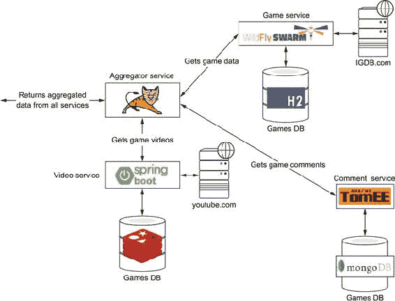

### 2.4\. 应用设计模式

在前面的章节中，你已经从高层次的角度了解了 Gamer 应用程序，并且我们从业务角度对应用程序的要求给予了极大的关注。在接下来的章节中，我们将深入探讨应用程序的技术层面。

#### 2.4.1\. 解剖

Gamer 应用程序通过在架构层面应用单一职责原则（SRP），遵循微服务架构，使每个服务在部署、技术和语言方面都独立。总的来说，每个微服务都是按照图 2.10 中显示的架构进行构建的。让我们看看 Gamer 应用程序中每个部分是如何实现的。

##### 图 2.10\. 详细微服务结构

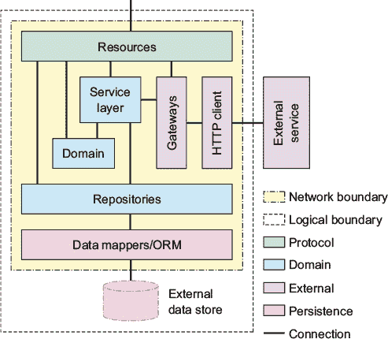

##### 资源组件

*资源组件*是应用程序的一个薄层，它作为传入消息（通常是 JSON 文档）和领域组件中的业务逻辑之间的映射器。它还根据业务逻辑产生的结果，使用所需的协议提供响应。

在 Java EE 中，此组件通常使用 Java API for RESTful Web Services (JAX-RS)实现，该 API 为遵循 REST 架构模式的 Web 服务创建提供支持。一个资源组件的示例代码位于评论服务中（code/comments/src/main/java/book/comments/boundary/CommentsResource.java）。

##### 列表 2.1\. 资源组件

```
@Path("/comments")                                                    *1*
@Singleton
@Lock(LockType.READ)
public class CommentsResource {

    @Inject
    private Comments comments;

    @Inject
    private DocumentToJsonObject transformer;

    @GET                                                              *2*
    @Path("/{gameId}")
    @Produces(MediaType.APPLICATION_JSON)                             *3*
    public Response getCommentsOfGivenGame(@PathParam("gameId")
                                               final Integer
                                                       gameId) {      *4*
        final Optional<Document>; commentsAndRating = comments
                .getCommentsAndRating(gameId);

        final JsonObject json = transformer.transform
                (commentsAndRating.orElse(new Document()));
        return Response.ok(json).build();                             *5*
    }
}
```

+   ***1* 设置类或方法的相对路径**

+   ***2* 指示该方法服务 HTTP GET 请求类型**

+   ***3* 设置响应 MIME 类型**

+   ***4* 将参数绑定到路径段**

+   ***5* 返回带有 HTTP 响应代码 OK (200)的内容**

默认情况下，请求处理以同步方式进行；这意味着客户端请求从开始到结束由单个容器 I/O 线程处理。这种阻塞方法适用于执行时间短的业务逻辑。

但对于长时间运行的任务，容器线程将保持占用状态，直到任务完成。这可能会对服务器的吞吐量产生重大影响，因为新的连接可能会比预期更长地被阻塞，等待处理积压队列。

为了解决这个问题，JAX-RS 有一个异步模型。这允许容器线程在客户端连接关闭之前释放，以接受新的连接。长时间运行的任务在另一个线程中运行，容器 I/O 线程可以由另一个在积压队列中等待的连接使用。

异步资源组件的示例代码位于游戏服务中（code/game/src/main/java/book/games/boundary/GamesResource.java），因为连接到外部资源可能需要相当长的时间才能完成。

##### 列表 2.2\. 异步资源组件

```
@Path("/")
@javax.ejb.Singleton                                                    *1*
@Lock(LockType.READ)
public class GamesResource {

    @Inject
    GamesService gamesService;

    @Inject                                                             *2*
    ExecutorServiceProducer managedExecutorService;

    @GET
    @Produces(MediaType.APPLICATION_JSON)
    @javax.ejb.Asynchronous                                             *3*
    public void searchGames(@Suspended final AsyncResponse
                                        response,                       *4*
                            @NotNull @QueryParam("query") final
                            String query) {

        response.setTimeoutHandler(asyncResponse ->; asyncResponse
                .resume(Response.status(Response.Status
                        .SERVICE_UNAVAILABLE).entity("TIME OUT !")
                        .build()));
        response.setTimeout(15, TimeUnit.SECONDS);

        managedExecutorService.getManagedExecutorService().submit(
                () ->; {                                                *5*
            try {

                final Collector<JsonObject, ?, JsonArrayBuilder>;
                        jsonCollector = Collector.of
                        (Json::createArrayBuilder,
                                JsonArrayBuilder::add, (left,
                                                        right) ->; {
                    left.add(right);
                    return left;
                });

                final List<SearchResult>; searchResults =
                        gamesService.searchGames(query);

                final JsonArrayBuilder mappedGames = searchResults
                        .stream().map(SearchResult::convertToJson)
                        .collect(jsonCollector);

                final Response.ResponseBuilder ok = Response.ok
                        (mappedGames.build());
                response.resume(ok.build());                           *6*
            } catch (final Throwable e) {
                response.resume(e);                                    *7*
            }
        });
    }
}
```

+   ***1* 资源标记为 Singleton EJB，因此端点变为事务性的**

+   ***2* 注入容器提供的执行器服务**

+   ***3* 将方法指定为异步。仅当它是 EJB 时有效。**

+   ***4* 指示 JAX-RS 运行时此方法是异步的，并注入 AsyncResponse**

+   ***5* 在不同的线程中执行逻辑**

+   ***6* 当结果准备好时，连接将恢复。**

+   ***7* 在出现错误的情况下，也应恢复通信。**

对于 Spring 应用程序，资源使用 Spring Web 模型-视图-控制器（MVC）框架实现。此框架围绕`DispatcherServlet`类构建，并将请求调度到配置的处理程序以执行业务逻辑。

为 Spring Web MVC 框架编写的资源示例代码位于视频服务中（code/video/src/main/java/book/video/boundary/VideosResource.java）。

##### 列表 2.3\. Spring 资源

```
package book.video.boundary;

import book.video.controller.VideoServiceController;
import org.springframework.beans.factory.annotation.Autowired;
import org.springframework.http.ResponseEntity;
import org.springframework.web.bind.annotation.CrossOrigin;
import org.springframework.web.bind.annotation.RequestMapping;
import org.springframework.web.bind.annotation.RequestParam;
import org.springframework.web.bind.annotation.RestController;

import java.util.List;

@CrossOrigin(origins = {"http://localhost:8080",
        "http://localhost:8181", "http://localhost:8282",
        "http://localhost:8383"})

@RestController                                                           *1*
public class VideosResource {

    @Autowired                                                            *2*
    VideoServiceController videoServiceController;

    @RequestMapping(value = "/", produces = "application/json")           *3*
    public ResponseEntity<List<String>;>; getVideos(
                      @RequestParam ("videoId") final long videoId,
                      @RequestParam("gameName") final String gameName) {
        final List<String>; linksFromGame = videoServiceController
                .getLinksFromGame(Long.toString(videoId), gameName);
        return ResponseEntity.ok(linksFromGame);
    }
}
```

+   ***1* 资源标记为 Spring Rest 控制器。**

+   ***2* 注入视频服务逻辑**

+   ***3* 配置端点方法**

##### 领域模型

领域模型是一个表示或抽象现实世界中属于领域且需要在软件中建模的概念。领域中的每个对象都包含对象的数据和行为。

在 Java EE 和 Spring 应用程序中，如果领域需要持久化到 SQL 数据库，则领域会被标注为 Java 持久化 API（JPA）注解。我们将在第四章和第五章中深入讨论 JPA。

以游戏服务（code/game/src/main/java/book/games/entity/Game.java）为例，其中的领域模型是`Game`。

##### 列表 2.4\. 领域模型

```
@Entity
public class Game implements Serializable {

    @Id
    @Column(name = "id", updatable = false, nullable = false)
    private Long id;
    @Version
    @Column(name = "version")
    private int version;

    @Column                                                               *1*
    private String title;

    @Column
    private String cover;

    @ElementCollection
    @CollectionTable(name = "ReleaseDate", joinColumns =
    @JoinColumn(name = "OwnerId"))
    private List<ReleaseDate>; releaseDates = new ArrayList<>;();

    @ElementCollection
    @CollectionTable(name = "Publisher", joinColumns = @JoinColumn
            (name = "OwnerId"))
    private List<String>; publishers = new ArrayList<>;();

    @ElementCollection
    @CollectionTable(name = "Developer", joinColumns = @JoinColumn
            (name = "OwnerId"))
    private List<String>; developers = new ArrayList<>;();

    public JsonObject convertToJson() {                                   *2*

        final JsonArrayBuilder developers = Json.createArrayBuilder();
        this.getDevelopers().forEach(developers::add);

        final JsonArrayBuilder publishers = Json.createArrayBuilder();
        this.getPublishers().forEach(publishers::add);

        final JsonArrayBuilder releaseDates = Json
                .createArrayBuilder();
        this.getReleaseDates().forEach(releaseDate ->; {
            final String platform = releaseDate.getPlatformName();
            final String date = releaseDate.getReleaseDate().format
                    (DateTimeFormatter.ISO_DATE);
            releaseDates.add(Json.createObjectBuilder().add
                    ("platform", platform).add("release_date", date));
        });

        return Json.createObjectBuilder().add("id", this.getId())
                .add("title", this.getTitle()).add("cover", this
                        .getCover()).add("developers", developers)
                .add("publishers", publishers).add("release_dates",
                        releaseDates).build();
    }
}
```

+   ***1* 领域对象有字段描述其在系统中的属性。**

+   ***2* 对象操作方法应位于对象内部。**

##### 服务层

服务层中的服务负责协调各个领域活动以及与其他子系统的交互。例如，这些服务通过持久化组件处理数据库交互，并通过远程资源组件调用外部服务。

在 Java EE 和 Spring 中，这一层通常实现为一个简单的 Java 类，通过注解使其有资格通过*上下文依赖注入*（CDI）或 Spring 组件中的自动装配进行注入。服务应该可以在构成微服务的任何元素中注入。

一个 Java EE 服务的示例可以在游戏服务（code/game/src/main/java/book/games/control/GamesService.java）中找到。此服务负责检查游戏是否缓存在 Gamer 本地数据库中，或者是否必须首先从 IGDB API 检索。

##### 列表 2.5\. Java EE 服务

```
@Dependent                                                                *1*
public class GamesService {

    @EJB                                                                  *2*
    Games games;

    @EJB
    IgdbGateway igdbGateway;
    public Game searchGameById(final long gameId) throws IOException {

        final Optional<Game>; foundGame = games.findGameById(gameId);     *3*
        if (isGameInSiteDatabase(foundGame)) {
            return foundGame.get();
        } else {
            final JsonArray jsonByGameId = igdbGateway
                    .searchGameById(gameId);                              *4*
            final Game game = Game.fromJson(jsonByGameId);
            games.create(game);
            return game;
        }

    }
}
```

+   ***1* 将此类设置为 CDI 容器中依赖范围的合格**

+   ***2* 其他元素可以注入到服务中。**

+   ***3* 在数据库中查找游戏**

+   ***4* 如果找不到游戏，则从 IGDB 获取**

Spring 服务的一个示例可以在视频服务（code/video/src/main/java/book/video/boundary/YouTubeVideos.java）中找到。

##### 列表 2.6\. Spring 服务

```
package book.video.boundary;

import org.springframework.beans.factory.annotation.Autowired;
import org.springframework.data.redis.core.ListOperations;
import org.springframework.data.redis.core.StringRedisTemplate;
import org.springframework.stereotype.Service;

import java.util.List;

@Service
public class YouTubeVideos {

    @Autowired
    StringRedisTemplate redisTemplate;

    public void createYouTubeLinks(final String gameId, final
    List<String>; youtubeLinks) {
        final ListOperations<String, String>;
                stringStringListOperations = redisTemplate
                .opsForList();
        stringStringListOperations.leftPushAll(gameId, youtubeLinks);
    }

    public boolean isGameInserted(final String gameId) {
        final ListOperations<String, String>;
                stringStringListOperations = redisTemplate
                .opsForList();
        return stringStringListOperations.size(gameId) >; 0;
    }

    public List<String>; getYouTubeLinks(final String gameId) {
        final ListOperations<String, String>;
                stringStringListOperations = redisTemplate
                .opsForList();
        final Long size = stringStringListOperations.size(gameId);
        return stringStringListOperations.range(gameId, 0, size);

    }

}
```

##### 仓库

*仓库*作用于领域实体集合，通常作为入口点或到持久化组件后端的桥梁。

| |
| --- |

##### 提示

如果你只打算管理单个实体，我们不推荐添加仓库层，因为这会增加不必要的开销。也没有必要将对象通过从未与之交互的层传递。为了教育目的，我们实现了一个简单的仓库层，以展示如何在现实世界场景中最佳地测试该类。

| |
| --- |

当在 Java EE 容器中使用 JPA 的 SQL 数据库时，你应该使用企业 JavaBeans（EJBs），因为它们提供了开箱即用的事务感知、并发管理和安全性。

游戏服务（code/game/src/main/java/book/games/boundary/Games.java）中可以找到一个示例仓库层。

##### 列表 2.7\. 仓库层

```
@Stateless                                               *1*
public class Games {

    @PersistenceContext                                  *2*
    EntityManager em;

    public Long create(final Game request) {
        final Game game = em.merge(request);             *3*
        return game.getId();
    }

    public Optional<Game>; findGameById(final Long gameId) {
        Optional<Game>; g = Optional.ofNullable(em.find(Game.class,
                gameId));

        if (g.isPresent()) {
            Game game = g.get();
            game.getReleaseDates().size();
            game.getPublishers().size();
            game.getDevelopers().size();
            em.detach(game);
        }

        return g;
    }

}
```

+   ***1* EJBs 确保类默认具有事务感知性。**

+   ***2* 注入 EntityManager 以进行数据库操作**

+   ***3* 创建一个新的游戏**

当您使用 Spring 时，通常会编写仓库以使用 Spring Data 项目。这为数据访问提供了熟悉、一致的基于 Spring 的编程模型，无论是访问关系型和非关系型数据存储，还是映射-减少框架和基于云的数据服务。一个利用 Spring Data 的仓库示例可以在视频服务代码中找到，用于访问 Redis。

##### 数据映射和对象关系映射

几乎所有微服务都需要将某种类型的数据持久化到持久存储中。在 Java EE 中，当持久化后端是 SQL 数据库时，通过对象关系映射（ORM）工具使用 JPA 规范。*ORM*是将面向对象编程（OOP）语言的类转换为关系数据库系统（RDBSs）的关系表的技术。

|  |
| --- |

##### 提示

一些供应商还提供对象映射到 NoSQL 数据库，但此功能不在规范中。

|  |
| --- |

一个展示此功能的 JPA 数据映射示例可以在游戏服务中找到（code/game/src/main/java/book/games/entity/Game.java）。

##### 列表 2.8\. 数据映射

```
@Entity
public class Game implements Serializable {

    @Id
    @Column(name = "id", updatable = false, nullable = false)
    private Long id;
    @Version
    @Column(name = "version")
    private int version;

    @Column                             *1*
    private String title;

    @Column
    private String cover;

    @ElementCollection
    @CollectionTable(name = "ReleaseDate", joinColumns =
    @JoinColumn(name = "OwnerId"))
    private List<ReleaseDate>; releaseDates = new ArrayList<>;();

    @ElementCollection
    @CollectionTable(name = "Publisher", joinColumns = @JoinColumn
            (name = "OwnerId"))
    private List<String>; publishers = new ArrayList<>;();

    @ElementCollection
    @CollectionTable(name = "Developer", joinColumns = @JoinColumn
            (name = "OwnerId"))
    private List<String>; developers = new ArrayList<>;();
}
```

+   ***1* 对象属性映射到关系表元素。**

##### 网关和 HTTP 客户端

当一个服务与一个或多个微服务协作时，必须实现逻辑来与这些外部服务进行通信。一个*网关*封装了连接到远程服务的所有逻辑，并负责底层的协议以及将对象从领域对象到和从领域对象进行序列化和反序列化。REST 架构通常使用 RESTful-web-services 方法，因此网关通常会使用 HTTP 客户端来连接到外部服务。在 Java EE 中，JAX-RS 规范提供了用于消费 RESTful web 服务的客户端类。

Spring 提供了一个简单但功能强大的类`RestTemplate`，它提供了消费其他 REST 服务的各种方法。一个与另一个微服务通信的网关示例可以在聚合器服务中找到（code/aggregator/src/main/java/book/aggr/GamesGateway.java）。

##### 列表 2.9\. 网关

```
public class GamesGateway {

    private final Client client;
    private final WebTarget games;
    private final String gamesHost;

    public GamesGateway() {
        this.client = ClientBuilder.newClient();

        this.gamesHost = Optional.ofNullable(System.getenv
                ("GAMES_SERVICE_URL")).orElse(Optional.ofNullable
                (System.getProperty("GAMES_SERVICE_URL")).orElse
                ("http://localhost:8181/"));

        this.games = this.client.target(gamesHost);                      *1*
    }

    public Future<JsonObject>; getGameFromGamesService(final long
                                                              gameId) {
        return this.games.path("{gameId}").resolveTemplate
                ("gameId", gameId)                                       *2*
                .register(JsonStructureBodyReader.class)                 *3*
                .request(MediaType.APPLICATION_JSON).async()             *4*
                .get(JsonObject.class);
    }

}
```

+   ***1* 创建到指定服务器的客户端连接**

+   ***2* 定义端点 URL**

+   ***3* 注册反序列化器**

+   ***4* 通常，聚合器希望以异步模式执行调用。**

在本节中，我们向您介绍了微服务的层次结构。现在让我们看看如何将这些元素引入 Java 空间。

#### 2.4.2\. ECB 模式

为 Gamer 应用程序开发的每个微服务都遵循实体控制边界（ECB）模式。ECB 是众所周知的 MVC 模式的变体，但与 MVC 不同，它不仅负责处理用户界面，还负责没有 UI 的应用程序（在我们的案例中，微服务）。

ECB 模式由三个元素（或关键视角）组成：*实体*、*控制*和*边界*。微服务的每个元素都可以组装成这三个视角之一：

+   *实体*—表示领域模型的对象。它主要包含领域所需的数据（属性），同时也执行与实体相关的行为操作，例如验证数据和执行业务操作。

+   *控制*—作为边界和实体之间中介的对象。它管理场景的端到端行为。

+   *边界*—位于系统边界的对象。一些边界对象可能负责系统的前端：例如，REST 端点。其他可能负责后端，管理与其他外部元素（如数据库或其他服务）的通信，例如。

图 2.11 展示了这些元素是如何组合在一起的。

##### 图 2.11\. ECB 模式

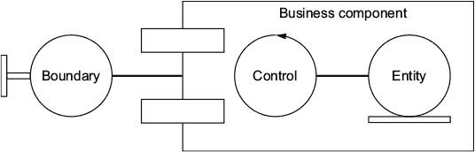

这三个元素可以有一定的适当交互；其他交互*不应*发生。实体、控制和边界对象之间的关系可以总结如下：

+   *元素*可以与其他相同类型的元素通信。

+   *控制*可以与*实体*和*边界*元素通信。

+   *边界*和*实体*元素不应直接通信。

表 2.8 说明了这些关系。

##### 表 2.8\. 实体、控制和边界对象之间的通信

|   | 实体 | 边界 | 控制 |
| --- | --- | --- | --- |
| 实体 | X |   | X |
| 边界 |   | X | X |
| 控制 | X | X | X |

您可以看到，ECB 模式非常适合微服务的结构。例如，将 ECB 模式应用于 Gamer 微服务可能看起来像这样：

+   *资源*、*仓库*和*网关*可能被放置在*边界*中。

+   *服务层*可能被放置在*控制*中。

+   *领域*（以及当提供多个对象时*ORM*）可能被放置在*实体*中。

图 2.12 中的架构图展示了微服务中的每个元素是如何映射到 ECB 模式的。

##### 图 2.12\. 将 ECB 模式应用于 Gamer 微服务的示例

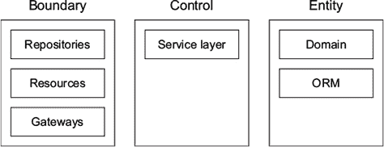

#### 2.4.3\. 其他模式

到目前为止，您已经看到了如何将资源、数据映射器和网关等模式应用于微服务架构，以及这些模式如何适应 ECB 模式。Gamer 微服务还使用了其他值得注意的模式。

##### 聚合模式

*聚合模式*在微服务架构中使用，但这在软件开发中并不是什么新事物：它来自企业集成模式目录。这种模式的目标是在几个服务的响应之间充当聚合器。一旦收到所有响应，聚合器将它们关联起来，并将单个响应发送回客户端进行处理，如图 2.13 所示 figure 2.13。

##### 图 2.13\. 聚合模式

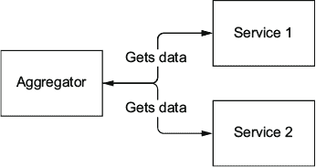

这种模式的例子可以在游戏聚合服务（code/aggregator/src/main/java/book/aggr/GamersResource.java）中找到。正如其名称所暗示的，它负责聚合游戏玩家可能想要看到的所有信息：游戏数据和评论。

##### 列表 2.10\. 聚合模式

```
@Inject
private GamesGateway gamesGateway;                                  *1*

@Inject
private CommentsGateway commentsGateway;

private final Executor executor = Executors.newFixedThreadPool(8);

@GET
@Path("{gameId}")
@Produces(MediaType.APPLICATION_JSON)
public void getGameInfo(@Suspended final AsyncResponse
                                    asyncResponse, @PathParam
        ("gameId") final long gameId) {

    asyncResponse.setTimeoutHandler(ar ->; ar.resume(Response
            .status(Response.Status.SERVICE_UNAVAILABLE).entity
                    ("TIME OUT !").build()));
    asyncResponse.setTimeout(15, TimeUnit.SECONDS);

    final CompletableFuture<JsonObject>; gamesGatewayFuture =
            Futures.toCompletable(gamesGateway
                    .getGameFromGamesService(gameId), executor);
    final CompletableFuture<JsonObject>; commentsGatewayFuture =
            Futures.toCompletable(commentsGateway
                    .getCommentsFromCommentsService(gameId),
                    executor);

    gamesGatewayFuture.thenCombine(commentsGatewayFuture,            *2*
            (g, c) ->; Json.createObjectBuilder()                    *3*
                    .add("game", g).add("comments", c).build())
            .thenApply(info ->; asyncResponse.resume(Response.ok
                    (info).build())                                  *4*
    ).exceptionally(asyncResponse::resume);

}
```

+   ***1* 网关模式与另一个服务进行通信。**

+   ***2* 游戏和评论异步检索。**

+   ***3* 当可用时，将两个响应合并。**

+   ***4* 响应组合完成后，将其发送回调用者。**

##### 客户端连接作为环境变量

建议通过环境变量配置客户端连接的 URL，并提供默认/回退值。虽然这不能算作一种模式，但在开发微服务时，这是一个好的实践。

根据我们的经验，配置客户端连接的最佳方式是使用环境变量，因为它们定义简单，并且被本地操作系统、构建工具和系统配置脚本所支持。您无需重新发明轮子。

任何简化运行时配置管理的东西都将是有用的。而不是在项目中分散多个配置文件，每个环境都有不同的硬编码值，您可以使用一个在构建时从环境生成的配置。例如，当使用 Docker 时，您有一个 docker-composition 文件。这可以通过使用构建环境属性从资源生成，以设置组合中的运行时环境值。以其他方式做这件事意味着系统配置脚本必须负责将正确的文件，带有正确的值，复制到正确的位置。

您可以将这种方法进一步扩展，并添加对 Java 系统属性的回退支持（或反之亦然）。Java 系统属性可以通过命令行使用`-D`选项设置：例如，`-DmyVey=myValue`。这意味着当涉及到配置微服务时，DevOps 团队都可以使用这两种选项。使用这种方法，在部署期间可以完全自由地调整微服务配置。

这种例子在其他地方也有出现，例如聚合服务（code/aggregator/src/main/java/book/aggr/CommentsGateway.java）。此服务需要部署的游戏和评论服务的 URL。

##### 列表 2.11\. 环境变量

```
String commentsHost = Optional.ofNullable(System.getenv
        (COMMENTS_SERVICE_URL))                                *1*
        .orElse(Optional.ofNullable(System.getProperty
                ("COMMENTS_SERVICE_URL")).orElse
                ("http://localhost:8282/comments-service/"));
```

+   ***1* 使用 Optional 类设置属性优先级**

### 2.5\. 设计决策

本书是关于如何为微服务架构编写测试。因此，我们简化了许多示例，以便它们尽可能易于阅读。这些简化意味着我们没有遵循编写微服务的最佳实践：

+   在某些情况下（这些情况已被识别和解释），我们尽可能包含尽可能多的不同技术，以展示一个原则。因此，我们并不总是使用最适合当前任务的最佳技术。

+   一些层，如 API 网关、负载均衡和缓存，已被移除，因为它们对测试特定范围没有提供任何帮助。

我们强烈建议您遵循可用的最佳实践实施微服务架构。当我们跳过一个主题时，我们会提供相关的笔记、见解和进一步阅读的链接。

### 摘要

+   我们已经有序地展示了本书示例应用程序的业务领域细节，现在你应该理解了应用程序的目标。

+   我们展示了应用程序的技术细节，包括它使用的容器和数据库；我们做出这些选择是为了展示更广泛的解决方案范围。我们还展示了应用程序代码的片段，在这些片段中，理解为什么在编写特定测试时使用特定方法是很重要的。

+   示例应用程序中关于微服务模式的介绍是基础的。随着我们开发各种测试技术和策略，我们将在以下章节中扩展这些模式。
