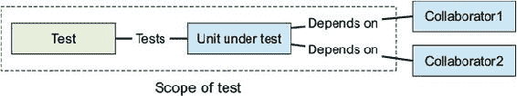
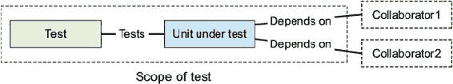

## 第三章\. 單元測試微服務

*本章涵蓋*

+   在微服務架構中應用單元測試技術

+   確定哪些工具最適合编写單元測試

+   理解獨立與社交單元測試

+   编写可讀、健壯的單元測試

到目前为止，你已经熟悉了开发微服务时使用的基礎架構、解剖結構以及典型模式。你也已經被介紹了 Gamer 應用程序，這是整本書中使用的參考應用程序，我們將為其编写一些測試。在本章中，你將學習如何為基於微服務的架構编写單元測試。

### 3.1\. 單元測試技術

如你所知，*單元測試*是一種測試技術，測試應用程序的代碼應該是最小的可能片段，以產生所需的行為。單元測試的另一個主要特點是它應該盡可能快地執行，以便在對代碼庫進行任何添加或重构後，開發者都能獲得快速的反饋。

重要的是要記住，單元測試不僅是一種測試技術——當你使用*測試驅動開發*（TDD）方法時，單元測試也是一個強大的設計工具，我們非常推薦這種方法。

| |
| --- |

##### 提示

编写單元測試應該是一個簡單的任務。TDD 幫助設計可測試的類別；如果你在编写單元測試時遇到困難，那麼問題可能不在單元測試，而在被測試的代碼中。在這種情況下，這通常是一個標誌，表明你的代碼設計應該以某種方式進行更改。

| |
| --- |

單元測試應該涵蓋的範圍在單元測試的歷史中已經被廣泛討論，答案可能會根據語言范式而有所不同。例如，在過程式語言的情況下，單元測試通常涵蓋一個單個函數或過程。對於面向對象的語言，單元測試通常涵蓋一個類別。但這裡暴露的範圍僅僅是指示性的。根據項目、團隊、測試的代碼和架構，你可能會決定擴大或縮小單元測試的範圍，在一個測試中涉及更多的或更少的業務類別。始終，這是需要整個團隊研究、討論並達成共識的事情。

| |
| --- |

##### 警告

因為 Java 是一種面向對象的語言，我們在測試的單元（一個通用術語）和測試的*類別*之間建立了一個等價關係，這是面向對象語言的具體測試單元。

| |
| --- |

自然地，单元测试将根据要测试的代码是否与其依赖隔离而有所不同——只测试单元测试本身，不考虑任何协作者——或者将单元测试的协作者作为测试范围的一部分。Jay Fields，*《与单元测试有效工作》*（Leanpub，2015）的作者，为这两种编写单元测试的方法提供了名称。与依赖协作的测试被称为*社交单元测试*，而独立风格则恰当地命名为*独立单元测试*。

#### 3.1.1\. 社交单元测试

社交单元测试通过考虑状态变化来关注测试类的行为及其依赖和协作者。显然，当使用这种方法时，你将单元测试视为一个外观接口，其中提供了一些输入。之后，单元测试使用其协作者来计算输出，最后，通过断言验证输出。

使用这类测试，你构建了一个*黑盒*环境，因为所有测试都是通过要测试的类进行的。这种方法是测试属于*业务域组件*的类的一个很好的方式，在这些类中，通常暴露计算和状态转换。

因为业务域对象是现实世界概念的表示，它们包含模型的数据和改变模型状态的行为。域对象是基于状态的，以独立方式测试它们没有实际价值。因此，社交单元测试最适合测试业务域逻辑。

图 3.1 说明了社交单元测试的构成。你可以看到测试类和要测试的类都包含在测试范围内。与独立测试一样，要测试的类的依赖（和协作者）在范围之外。社交测试与使用测试替身进行的独立测试的主要区别在于，依赖（和协作者）是真实类。

##### 图 3.1\. 社交单元测试



#### 3.1.2\. 测试替身

正如你在 3.1 节中看到的，关于单元测试应该覆盖的范围有两种方法。第一种方法是独立单元测试，其中要测试的类与其所有依赖和协作者隔离，第二种方法是社交单元测试，其中要测试的类涉及其协作者。

可能你已经开始思考以下问题：“如果我要测试的类有一个协作者，而我想要使用独立的单元测试方法来编写单元测试，我该如何隔离要测试的类？”

如果你什么都不做，那么测试可能最多会在`NullPointerException`上完成，因为没有可用的协作者实例进行测试。因此，对这个问题的答案是使用测试替身。

*测试替身*是在用简化类双用来替换生产对象（通常是正在测试的类的协作者）进行测试时使用的通用术语。一般来说，根据 Gerard Meszaros 在《xUnit Test Patterns: Refactoring Test Code》（Addison-Wesley，2007）中确定的，有五种测试替身类型：

+   *哑元*—哑元对象被传递但从未使用。它只是用来填充所需的方法参数。

+   *伪造*—伪造对象是协作者的实现，但它采取了一些捷径以提高性能。通常，伪造对象不适合生产。一个众所周知的例子是*内存数据库*。

+   *存根*—存根在测试期间为调用提供预定义的答案。

+   *模拟*—模拟是一个具有预编程期望的对象。期望可以是离散值或异常。与存根不同，模拟执行运行时行为验证。不存储任何状态。

+   *间谍*—间谍对象是在对其调用期间记录信息的存根。例如，一个电子邮件网关存根可能能够返回它“发送”的所有消息。

通常，测试替身是可预测的（这对于模拟来说尤其如此）。这意味着使用测试替身可以使你的单元测试更加健壮，因为协作者在每次执行中都会以完全相同的方式表现。使用测试替身时的执行速度也是一个很大的优势。它们不是真实实现，所以性能良好。这使得你的测试套件性能良好，同时也为开发者提供了快速的反馈。

|  |
| --- |

**模拟与存根（以及间谍）**

根据我们的经验，大多数情况可以使用*模拟*或*间谍*进行测试；唯一的区别是你在测试中提出的断言以及这个断言给你带来的信心水平。

让我们用一个具体的例子来说明。假设你想测试一个类，其中一个协作者用于发送电子邮件。这是你如何*间谍*协作者的方法：

```
public interface MailService {
  void sendEmail(Message msg);
}

public class MailServiceStub implements MailService {

  List<Message> messages = new ArrayList<>();

  void sendEmail(Message msg) {
    messages.add(msg);
  }

  boolean hasSentMessage(Message msg) {
    return messages.contains(msg);
  }

}
```

现在，你可以使用之前的类来编写测试：

```
Registration r = new Registration();
MailServiceStub mss = new MailServiceStub();
r.setMailService(mss);

User u = ....
r.register(u);

Message expectedEmailMessage = ...;
assertThat(mss.hasSentMessage(expectedEmailMessage),
                is(true));
assertThat(mss.numberOfSentMessage(), is(1));
```

注意，这个测试验证了间谍的状态：在这种情况下，预期的消息已被发送。

以类似的方式，*模拟*协作者使用一个看起来像这样的测试：

```
Registration r = new Registration();
MailService mss = mock(MailService.class);
r.setMailService(mss);

User u = ....
r.register(u);

Message expectedEmailMessage = ...;
verify(mss).sendEmail(expectedEmailMessage);
```

注意，最大的区别是，这个测试只验证了交互，因此它执行行为验证。另一个很大的区别是，测试依赖于协作方法调用。同时，间谍和存根的情况需要额外的方法来帮助验证状态变化。

如前所述，选择存根/间谍和模拟取决于你的单元需要哪种类型的测试。如果你需要状态验证或协作者的自定义测试实现，那么间谍是最好的选择。另一方面，如果你只需要行为验证而没有任何自定义实现，那么模拟通常是最好的选择。

根据我们的经验和在存在疑问的情况下，最好的开始方式是使用模拟。这可以更快地开始，你只需要记录期望，通常它涵盖了要测试的使用案例。

|  |
| --- |

#### 3.1.3\. 独立单元测试

独立单元测试专注于以隔离和受控的方式测试单元或工作。单元的协作者被测试替身或模拟所取代。

这种方法是一个很好的方法来避免与被测试类无关的测试失败，但与它的某个依赖项有关。这通常远远超出了测试的范围。

此外，独立单元测试在以下情况下也很有用，即被测试的类有一个需要与网络、数据库、电子邮件服务或甚至另一个微服务建立物理连接的依赖项。在这些情况下使用真实依赖项是两方面的坏处：

+   对 I/O 的访问是一个相对较慢的操作，单元测试应该是快速的。

+   远程服务随时可能失败（由于服务器故障、网络故障、防火墙规则等），这意味着测试可能因为除了代码错误以外的其他原因而失败。

因此，你应该努力在以下场景中使用独立单元测试：

+   *当被测试单元的协作者运行缓慢*——这可能是由于 I/O 访问，但也可能是由于长时间运行的计算。

+   *当被测试单元的协作者包含可能经常变化的逻辑*——在这种情况下，测试可能失败并不是因为被测试的类，而是因为其中一个协作者失败了。

+   *当你想要测试那些使用真实实例难以测试的边缘情况*——例如，磁盘满的测试用例。

图 3.2 展示了独立单元测试的样子。你可以看到测试类和被测试单元在测试范围内。被测试类的依赖项（和协作者）在范围之外，并且它们不是真正的类——它们被测试替身所取代。

##### 图 3.2\. 独立单元测试



#### 3.1.4\. 微服务中的单元测试

我们已经介绍了单元测试是什么，你可能采取的不同方法——例如独立或社交——以及测试替身以及它们如何帮助你编写更好的单元测试。在本节中，你将看到如何将单元测试概念应用于微服务架构。在我们查看具体示例之前，让我们回顾一下微服务的结构。

##### 资源和服务组件层

资源和服务通常包含网关、领域对象和存储库之间的协调代码，以及模块之间的消息转换。我们强烈建议为资源和服务使用独立的单元测试。原因是资源和服务的协作者通常反应较慢。这会影响测试的鲁棒性（例如，网络可能中断，导致假阴性）。在网关的情况下，它们通常与部署在另一台服务器上的服务进行通信，这意味着又要触及网络。使用存储库的情况也类似，因为磁盘 I/O 几乎与网络流量相似。因此，在处理资源和服务时，使用测试替身，更具体地说，使用模拟对象，是最佳选择。

|  |
| --- |

##### 小贴士

有时，资源和服务充当着门面，在协作者之间传递消息。在这种情况下，单元测试可能不会带来回报——其他测试级别，如组件测试，可能更有价值。

|  |
| --- |

##### 网关组件

网关组件层包含连接到外部服务的逻辑，通常使用 HTTP/S 客户端。在这种情况下，使用模拟或存根进行独立的单元测试是避免在单元测试中触及网络的最佳方式。

在这一层要测试的项目如下：

+   在底层协议和业务对象之间的映射逻辑

+   强制错误条件，这些条件可能难以使用真实服务进行模拟（负面测试）

##### 领域组件

我们在第 3.1.1 节中讨论了如何测试领域层。*领域逻辑*暴露了计算和状态转换。由于领域对象基于状态，以独立方式测试它们没有价值。因此，社交单元测试是测试领域逻辑的最佳策略。

##### 存储库组件

存储库通常通过连接到数据库、执行查询并将输出调整为领域对象来充当持久层的“网关”。存储库也可以是属性文件，或 Elasticsearch 等。列表无穷无尽。

持久层通常使用 ORM（如 JPA）实现，因此在大多数情况下，这一层仅处理系统的核心类。（在 JPA 的情况下，这是`EntityManager`。）如果你决定为持久化对象编写单元测试不会带来回报，那么至少为它们编写集成测试。但如果某些逻辑包含在映射响应中，那么对核心类（如`EntityManager`）进行独立的单元测试和模拟应该足够提供映射对象。

##### 独立还是社交？

表 3.1 总结了何时使用独立方法以及何时使用社交方法。

##### 表 3.1. 独立与社交单元测试的比较

| 组件 | 独立 | 社交 |
| --- | --- | --- |
| 资源 | X |   |
| 服务 | X |   |
| 网关 | X |   |
| 领域 |   | X |
| 仓库 | X |   |

### 3.2\. 工具

我们已经介绍了如何将单元测试风格与微服务架构的各个组件最佳匹配。现在，让我们看看用于编写单元测试的工具。有许多这样的工具可用，但据我们观察，以下是目前最广泛采用并被 Java 社区接受的。

#### 3.2.1\. JUnit

*JUnit* 是一个 Java 单元测试框架。目前，它被其他工具扩展，用于编写不同级别的测试，如集成和组件测试。

JUnit 测试是一个带有特殊注解的 Java 对象，用于标记方法为测试。旧版本提供了可以扩展的对象，但注解方法更灵活。

下面的代码片段展示了典型的 JUnit 测试的结构：

```
public class MyTest {

  @BeforeClass                                               *1*
  public static void setUpClass() throws Exception {
  }

  @Before                                                    *2*
  public void setUp() throws Exception {
  }

  @Test                                                      *3*
  public void testMethod() {
    assertEquals("Hello World", message);                    *4*
    assertTrue (17 < age);
  }

  @After                                                     *5*
  public void tearDown() throws Exception {
  }

  @AfterClass                                                *6*
  public static void tearDownClass() throws Exception {
  }

}
```

+   ***1* 该方法在类中定义的测试之前执行。**

+   ***2* 该方法在类中的每个测试之前执行。**

+   ***3* 将方法标记为测试方法**

+   ***4* JUnit 提供了断言结果的方法。**

+   ***5* 该方法在类中的每个测试之后执行。**

+   ***6* 该方法在类中所有测试执行之后执行。**

#### 3.2.2\. AssertJ

几个重要的特性对于编写好的单元测试至关重要。单元测试应该是*快速*和*隔离*的；我们之前已经讨论过这一点。但同样重要的是，它们应该是*可读*的。

任何阅读测试的人都应该能够快速识别测试的内容以及预期的结果。前一个节中的代码片段使用了`assertEquals`和`assertTrue`这样的语句——这些都是清晰的表述。

使用这些语句是有效的，但它们在可读性方面提出了挑战。让我们探讨一些这些问题：

+   你不会立即知道哪个参数是预期值，哪个是结果值。假设`assertEquals(val1, val2)`，第一个参数是预期值还是计算值？它是预期值。这很重要，因为在失败的情况下，错误信息是使用这些参数构建的。

+   断言简单的条件可能难以阅读和编写。`assertTrue (17 < age)`看起来不太自然。

+   通常，方法返回更复杂的对象或对象列表。请注意，`assertTrue(games.contains(zelda))`有两个问题。首先，断言的可读性不高；其次，如果`zelda`对象没有实现`equals`，或者以对断言逻辑有害的方式实现它，会发生什么？*断言*可能变成了*假设*。

为了避免所有这些问题，开发了 AssertJ ([`joel-costigliola.github.io/assertj`](http://joel-costigliola.github.io/assertj))，以便开发者在测试中使用流畅的断言。AssertJ 在提供丰富的断言集合方面表现出色，这些断言有助于编写复杂元素的假设，同时提高可读性。

你需要使用的静态导入是 `import static org.assertj.core.api.Assertions.*`。如果你愿意，你仍然可以使用 `assertEquals` 和 `assertTrue`，但让我们比较一下使用 AssertJ 和之前的例子。

你可以不用写 `assertEquals(val1, val2)`，而是使用 AssertJ 写成 `assertThat(val1).isEqualTo(val2)`。注意，现在断言对读者来说是明确的，而且关于预期值和实际值应该是什么没有歧义。

你可以使用 `assertTrue (17 < age)`，但用 AssertJ 重新编写它看起来像 `assertThat(age).isGreaterThan(17)`。你以为我们用了糟糕的例子！

最后，AssertJ 可以帮助进行复杂的验证。你不用使用 `assertTrue(games.contains(zelda))`，这依赖于 `equals` 方法，而是可以用 AssertJ 重新编写成类似 `assertThat(games).extracting ("name").contains("Zelda")` 的形式。这没有 `equals` 方法的任何歧义，同时，它也提高了可读性。

| |
| --- |

##### 注意

你可能会想知道 AssertJ 和 Hamcrest（JUnit 的一部分）之间的区别是什么。这两个项目都是为了同一个目的而创建的：提高测试的可读性。但它们之间最重要的区别是，虽然 AssertJ 使用流畅的断言，使得在 IDE 中编写断言变得容易，而在 Hamcrest 中，你编写的断言就像洋葱的层一样，一层套一层，这在 IDE 中阅读和编写起来不太自然。

| |
| --- |

你可能会同意，在测试中使用 AssertJ 不仅是一种提高可读性的好方法，而且还可以避免在测试中编写繁琐的代码。我们将使用所有这些，并将选择权留给你自己，决定在你的代码中更喜欢哪一个。

#### 3.2.3\. Mockito

在 第 3.1.2 节 中，你看到了用测试对象替换生产对象的几种不同策略。有五种类型的测试双胞胎：哑元、伪造、存根、间谍和模拟。

在单元测试中，间谍和模拟是最常用的。间谍通常实现为一个带有自定义代码的接口。对于模拟，你需要一个框架，让你可以记录调用时的预设答案。

在 Java 中，有几个模拟框架，例如 *JMockit*、*EasyMock* 和 *Mockito*。在这本书中，我们将关注的模拟框架是 Mockito ([`site.mockito.org`](http://site.mockito.org))——使用多个可能会让人困惑。根据对 30,000 多个 Java 项目的分析，Mockito 是 Java 项目中第四常用的库，因此我们可以将其视为 Java 中事实上的模拟框架。这是一个快速发展的项目，将超过本书的内容，所以请确保在线关注该项目。但请随意分析和选择你偏好的模拟框架。

Mockito 是一个用 Java 编写的模拟框架，它允许使用干净、简单的 API 创建测试双倍（模拟对象）。此外，Mockito 与其他模拟框架区分开来的一个特性是，你可以在不事先定义期望的情况下验证单元测试的行为，这使得测试更加简单，并减少了测试代码与单元测试之间的耦合。

以下片段展示了 Mockito 测试的典型结构：

```
import static org.mockito.Mockito.*;

List mockedList = mock(List.class);                    *1*

mockedList.add("one");                                 *2*
mockedList.clear();

verify(mockedList).add("one");                         *3*
verify(mockedList).clear();

List mockedList2 = mock(List.class);
when(mockedList2.get(0)).thenReturn("first");          *4*
System.out.println(mockedList2.get(0));                *5*
```

+   ***1* 创建一个代理来模拟你想要模拟的接口（或类）**

+   ***2* 模拟对象的调用方式与任何其他方法相同。**

+   ***3* 验证在测试执行期间是否产生了预期的交互**

+   ***4* 当此方法使用给定参数调用时产生答案**

+   ***5* 返回“first”作为 canned response**

该片段仅展示了 Mockito 的基本用法；更多功能将在书中根据需要解释。

现在你已经了解了单元测试工具，让我们看看你需要做什么才能开始使用它们。

#### 3.2.4\. 构建脚本修改

为了使用 JUnit、AssertJ 或 Mockito 这样的测试框架，你需要在构建脚本中将它定义为测试依赖项。在 Maven 的情况下，这个信息位于 pom.xml 中的 `dependencies` 块内：

```
<dependency>
  <groupId>junit</groupId>
  <artifactId>junit</artifactId>
  <version>4.12</version>
  <scope>test</scope>                    *1*
</dependency>
<dependency>
  <groupId>org.assertj</groupId>
  <artifactId>assertj-core</artifactId>
  <version>3.5.2</version>
  <scope>test</scope>
</dependency>
<dependency>
  <groupId>org.mockito</groupId>
  <artifactId>mockito-core</artifactId>
  <version>2.8.47</version>
  <scope>test</scope>
</dependency>
```

+   ***1* 在测试范围内定义一个依赖项**

|  |
| --- |

##### 警告

Mockito 之前错误地提供了一个与 JUnit 一起提供的 Hamcrest 库版本，这导致了冲突。尽管在 Mockito 2 中已经修复了这个问题，但请注意，较旧的项目可能需要升级。

|  |
| --- |

在构建脚本中注册依赖项后，你可以开始编写单元测试。

### 3.3\. 为 Gamer 应用编写单元测试

在讨论了单元测试是什么，可以使用哪些工具，以及你可以遵循的每个微服务层的策略，并在项目中注册这些工具之后，现在是时候开始编写单元测试了。

通常，单元测试是在名为 src/test/java 的既定测试目录下创建的。我们建议你坚持这个模式。

#### 3.3.1\. YouTubeVideoLinkCreator 测试

让我们看看如何编写 `YouTubeVideoLinkCreator` 类的单元测试（code/video/src/main/java/book/video/controller/YouTubeVideoLinkCreator.java）。这是一个简单的 `controller` 类，它不依赖于任何其他类，因此不需要任何测试双倍。这个类负责创建 YouTube 视频 ID 的嵌入 URL。

##### 列表 3.1\. `YouTubeVideoLinkCreator` 类

```
public class YouTubeVideoLinkCreator {

    private static final String EMBED_URL = "https://www.youtube" +
            ".com/embed/";

    public URL createEmbeddedUrl(final String videoId) {
        try {
            return URI.create(EMBED_URL + videoId).toURL();
        } catch (final MalformedURLException e) {
            throw new IllegalArgumentException(e);
        }
    }
}
```

对于这个类，只需要一个测试方法来测试 URL 的创建是否正确（code/video/src/test/java/book/video/controller/YouTubeVideoLink CreatorTest.java）。

##### 列表 3.2\. `YouTubeVideoLinkCreator` 的单元测试

```
public class YouTubeVideoLinkCreatorTest {

    @Test                                                               *1*
    public void shouldReturnYouTubeEmbeddedUrlForGivenVideoId() {       *2*
        final YouTubeVideoLinkCreator youTubeVideoLinkCreator = new
                YouTubeVideoLinkCreator();                              *3*

        final URL embeddedUrl = youTubeVideoLinkCreator
                .createEmbeddedUrl("1234");                             *4*

        assertThat(embeddedUrl).hasHost("www.youtube.com").hasPath
                ("/embed/1234");                                        *5*
    }
}
```

+   ***1* 测试方法必须使用 @Test 注解。**

+   ***2* 描述性测试方法名称：直接称呼即可。**

+   ***3* 测试中的类**

+   ***4* 调用 createEmbeddedUrl**

+   ***5* 断言 YouTube 链接是有效的**

你可以看到测试方法被注解为`@Test`，并且它使用众所周知的 Given-When-Then 结构进行结构化，这本质上将测试用例分为三个部分。*Given*是测试的前提条件，*When*是测试的刺激，*Then*描述了测试的期望。

| |
| --- |

##### 提示

注意，当前尚未测试捕获代码（`IllegalArgumentException`）。它提供的反馈不值得测试的努力。

| |
| --- |

#### 3.3.2\. YouTubeLink 测试

让我们为`YouTubeLink`类编写一个单元测试（code/video/src/main/java/book/video/entity/YoutubeLink.java）。这个类是一个域对象，它有一个协作者（`YouTubeVideoLinkCreator`），该协作者使用此域对象实现逻辑。

##### 列表 3.3\. `YouTubeLink`类

```
public class YouTubeLink {

    private final String videoId;
    Function<String, URL> youTubeVideoLinkCreator;                   *1*

    public YouTubeLink(final String videoId) {
        this.videoId = videoId;
    }

    public void setYouTubeVideoLinkCreator(final Function<String,
            URL> youTubeVideoLinkCreator) {
        this.youTubeVideoLinkCreator = youTubeVideoLinkCreator;
    }

    public URL getEmbedUrl() {
        if (youTubeVideoLinkCreator != null) {
            return youTubeVideoLinkCreator.apply(this.videoId);
        } else {
            throw new IllegalStateException
                    ("YouTubeVideoLinkCreator not set");
        }
    }

    public String getVideoId() {
        return videoId;
    }

}
```

+   ***1* 行为逻辑实现为 Java 8 功能接口。**

注意，编写此测试有两种选择：

+   一种独立测试方法，即模拟`YouTubeVideoLinkCreator`类

+   一种社交测试方法，即使用真实的`YouTubeVideoLinkCreator`类

这个案例很典型，因为它不值得嘲笑依赖，使用真实的依赖项更好。

##### 列表 3.4\. `YouTubeLink`的单元测试

```
public class YouTubeLinkTest {

    @Test
    public void shouldCalculateEmbedYouTubeLink() {
        final YouTubeLink youtubeLink = new YouTubeLink("1234");

        final YouTubeVideoLinkCreator youTubeVideoLinkCreator = new
                YouTubeVideoLinkCreator();                            *1*
        youtubeLink.setYouTubeVideoLinkCreator
                (youTubeVideoLinkCreator::createEmbeddedUrl);         *2*

        assertThat(youtubeLink.getEmbedUrl()).hasHost("www.youtube" +
                ".com").hasPath("/embed/1234");
    }

}
```

+   ***1* 创建真实依赖**

+   ***2* 注入逻辑**

这个单元测试看起来和上一个一样。但由于它是一个社交测试，创建了两个实例：一个用于测试类，另一个作为它的依赖。

| |
| --- |

##### 注意

在 YouTube 链接案例中，测试看起来很简单，你可能想知道是否值得编写它：毕竟，`YouTubeVideoLinkCreator`已经在自己的测试中进行了测试。这里测试的不是为视频创建 YouTube 嵌入链接的能力，而是`YouTubeLinkTest`的域对象能够使用自己的数据生成正确的 YouTube 嵌入链接。

| |
| --- |

#### 3.3.3\. 游戏测试

到目前为止，我们编写了不需要模拟任何依赖的单元测试。让我们为*仓库*元素编写一个单元测试。在这种情况下，我们将使用`Games`类（code/game/src/main/java/book/games/boundary/Games.java）。

##### 列表 3.5\. `Games`类

```
@Stateless                                         *1*
public class Games {

    @PersistenceContext                            *2*
    EntityManager em;

    public Long create(final Game request) {
        final Game game = em.merge(request);       *3*
        return game.getId();
    }

    public Optional<Game> findGameById(final Long gameId) {
        Optional<Game> g = Optional.ofNullable(em.find(Game.class,
                gameId));

        if (g.isPresent()) {
            Game game = g.get();
            game.getReleaseDates().size();
            game.getPublishers().size();
            game.getDevelopers().size();
            em.detach(game);
        }

        return g;
    }

}
```

+   ***1* EJB 默认使类具有事务感知性。**

+   ***2* 注入 EntityManager 以进行数据库操作。**

+   ***3* 创建一个新的游戏**

单元测试中最重要的事情之一是保持良好的执行速度。因为这个仓库是用 JPA 实现的，所以你需要模拟这部分。

##### 列表 3.6\. `Games`的单元测试

```
@RunWith(MockitoJUnitRunner.class)                              *1*
public class GamesTest {

    private static final long GAME_ID = 123L;

    @Mock                                                       *2*
    EntityManager entityManager;

    @Test
    public void shouldCreateAGame() {
        final Game game = new Game();
        game.setId(GAME_ID);
        game.setTitle("Zelda");

        final Games games = new Games();

        when(entityManager.merge(game)).thenReturn(game);       *3*
        games.em = entityManager;                               *4*

        games.create(game);                                     *5*

        verify(entityManager).merge(game);                      *6*

    }
}
```

+   ***1* Mockito 运行器初始化@Mock 字段。**

+   ***2* 将字段标记为模拟**

+   ***3* 当调用模拟时记录答案**

+   ***4* 设置模拟依赖**

+   ***5* 对测试类中的类的正常调用**

+   ***6* 验证 merge 方法是否以预期的游戏调用**

这个测试与之前的测试略有不同。首先要注意的是，它使用了一个自定义的 JUnit 运行器。这个运行器由 Mockito 框架提供，负责初始化所有带有`@Mock`注解的字段，以及其他一些功能。你可以使用 Mockito 而不使用 JUnit 运行器，就像在 Mockito 部分的介绍中所示；但据我们意见，使用运行器时单元测试看起来更清晰。

第二个区别是，现在在测试方法中，为`EntityManager`类记录了一些预设答案。最后，除了断言预期值外，测试还验证了被模拟的方法也被调用。这很重要，这样你可以确信正在测试的类调用了预期的依赖方法，而不是与测试无关的其他方法。

对于其他方法也可以做类似的事情。

##### 列表 3.7\. GamesTest.java 中的附加测试方法

```
@Test
public void shouldFindAGameById() {
    final Game game = new Game();
    game.setId(GAME_ID);
    game.setTitle("Zelda");

    final Games games = new Games();
    when(entityManager.find(Game.class, GAME_ID)).thenReturn(game);
    games.em = entityManager;

    final Optional<Game> foundGame = games.findGameById(GAME_ID);      *1*

    verify(entityManager).find(Game.class, GAME_ID);
    assertThat(foundGame).isNotNull().hasValue(game)
            .usingFieldByFieldValueComparator();                       *2*
}

@Test
public void shouldReturnAnEmptyOptionalIfElementNotFound() {
    final Game game = new Game();
    game.setId(GAME_ID);
    game.setTitle("Zelda");

    final Games games = new Games();
    when(entityManager.find(Game.class, GAME_ID)).thenReturn(null);
    games.em = entityManager;

    final Optional<Game> foundGame = games.findGameById(GAME_ID);

    verify(entityManager).find(Game.class, GAME_ID);
    assertThat(foundGame).isNotPresent();                              *3*
}
```

+   ***1* ID 必须与 when 函数中记录的相同。**

+   ***2* 验证 find 被调用，但也返回所需的 Optional**

+   ***3* 断言 Optional 没有值**

|  |
| --- |

##### 小贴士

有时候编写单元测试对仓库来说并不划算，因为从单元测试的角度来看，它们只充当一个桥梁。在这种情况下，不编写单元测试，只为仓库层编写集成测试是值得的。

|  |
| --- |

#### 3.3.4\. GamesService 测试

你已经看到了如何在简单场景中使用 JUnit、AssertJ 和 Mockito。现在，让我们为`searchGameById(gameId)`方法编写一个单元测试，这个方法稍微复杂一些（code/game/src/main/java/book/games/control/GamesService.java）。这个方法负责控制游戏信息是否存在于数据库系统中，或者是否需要从官方 IGDB 网站上检索。

##### 列表 3.8\. `searchGameById(gameId)`方法

```
@Dependent                                                              *1*
public class GamesService {

    @EJB                                                                *2*
    Games games;

    @EJB
    IgdbGateway igdbGateway;
    public Game searchGameById(final long gameId) throws IOException {

        final Optional<Game> foundGame = games.findGameById(gameId)     *3*
        if (isGameInSiteDatabase(foundGame)) {
            return foundGame.get();
        } else {
            final JsonArray jsonByGameId = igdbGateway
                    .searchGameById(gameId);                            *4*
            final Game game = Game.fromJson(jsonByGameId);
            games.create(game);
            return game;
        }

    }
}
```

+   ***1* 将此类设置为 CDI 容器中依赖范围的合格类**

+   ***2* 其他元素也可以注入到服务中。**

+   ***3* 在数据库中查找游戏**

+   ***4* 如果找不到游戏，则从 IGDB 网站上获取它。**

如果你仔细查看`GamesService`的逻辑，你会看到`Game`实体的`convertToJson`和`fromJson`方法被调用。再次，你可能想知道调用这些真实方法，还是模拟实体更有意义。

在我们的经验中，如果管理它们的行为并不复杂，那么最好的做法是使用*真实*实体（即社交测试方法）而不是模拟它们。需要注意的是，这个测试并不代替对实体对象的测试，因为它专注于测试`GameService`类而不是`Game`。正如你在上一节中看到的，`Game`类必须有自己的测试类，在那里你可以深入测试它。

让我们看看一个测试，验证如果您在内部数据库中有游戏数据，它将从那里检索，而不是通过访问 IGDB 网站（code/game/src/test/java/book/games/control/GamesServiceTest.java）。

##### 列表 3.9\. 游戏缓存单元测试

```
@RunWith(MockitoJUnitRunner.class)
public class GamesServiceTest {

    @Mock
    Games games;

    @Mock
    IgdbGateway igdbGateway;

    @Test
    public void shouldReturnGameIfItIsCachedInInternalDatabase()
            throws IOException {

        final Game game = new Game();
        game.setId(123L);
        game.setTitle("Zelda");
        game.setCover("ZeldaCover");

        when(games.findGameById(123L)).thenReturn(Optional.of(game));

        final GamesService gamesService = new GamesService();
        gamesService.games = games;
        gamesService.igdbGateway = igdbGateway;

        final Game foundGame = gamesService.searchGameById(123L);
        assertThat(foundGame).isEqualToComparingFieldByField(game);   *1*
        verify(igdbGateway, times(0)).searchGameById(anyInt());       *2*
        verify(games).findGameById(123L);

    }
}
```

+   ***1* 返回的游戏应该是记录在模拟对象中的那个。**

+   ***2* 验证没有与 IGDB 网站的交互**

这个测试与之前的测试非常相似，但有一个简单而强大的变化。请注意，这个测试不仅验证了某些事情*已经发生*——在这个例子中，通过从数据库中调用搜索方法检索游戏——而且还验证了某些事情*没有发生*，在这个例子中是 IGDB 网关方法没有被调用。

以类似的方式，您可以测试其他情况：当游戏数据不在内部数据库中，需要从 IGDB 检索时。

##### 列表 3.10\. 游戏检索单元测试

```
@Test
public void
shouldReturnGameFromIgdbSiteIfGameIsNotInInternalDatabase()
        throws IOException {

    final JsonArray returnedGame = createTestJsonArray();

    when(games.findGameById(123L)).thenReturn(Optional.empty());
    when(igdbGateway.searchGameById(123L)).thenReturn
            (returnedGame);

    final GamesService gamesService = new GamesService();
    gamesService.games = games;
    gamesService.igdbGateway = igdbGateway;

    final Game foundGame = gamesService.searchGameById(123L);
    assertThat(foundGame.getTitle()).isEqualTo("Battlefield 4");

    Assertions.assertThat(foundGame.getReleaseDates())             *1*
            .hasSize(1).extracting("platformName",
            "releaseDate").contains(tuple("PlayStation 3",
            LocalDate.of(2013, 10, 29)));

    assertThat(foundGame.getDevelopers()).hasSize(1).contains
            ("EA Digital Illusions CE");

    assertThat(foundGame.getPublishers()).hasSize(1).contains
            ("Electronic Arts");

    verify(games).create(anyObject());                             *2*
    verify(igdbGateway).searchGameById(123L);                      *3*

}
```

+   ***1* 断言发布日期元组是正确的**

+   ***2* 验证游戏是否存储在内部数据库中**

+   ***3* 验证游戏是否从 IGDB 检索**

但在某些情况下，事情可能会变得更加复杂。在下一个测试中，我们将引入`ArgumentCaptor`功能和异常测试。

#### 3.3.5\. GamesResource 测试

如您在之前的章节中看到的，Mockito 对于模拟测试单元的依赖项非常有帮助。但在异常场景和特殊验证情况等情况下，测试可能会更加复杂。

让我们为`GamesResource`编写一个单元测试（code/game/src/main/java/book/games/boundary/GamesResource.java）。记住，这个类是关于游戏操作的 REST 端点的定义。

##### 列表 3.11\. `GamesResource` 类

```
@Path("/")
@javax.ejb.Singleton                                                    *1*
@Lock(LockType.READ)
public class GamesResource {

    @Inject
    GamesService gamesService;

    @Inject                                                             *2*
            ExecutorServiceProducer managedExecutorService;

    @GET
    @Produces(MediaType.APPLICATION_JSON)
    @javax.ejb.Asynchronous                                             *3*
    public void searchGames(@Suspended final AsyncResponse
                                        response,                       *4*
                            @NotNull @QueryParam("query") final
                            String query) {

        response.setTimeoutHandler(asyncResponse -> asyncResponse
                .resume(Response.status(Response.Status
                        .SERVICE_UNAVAILABLE).entity("TIME OUT !")
                        .build()));
        response.setTimeout(15, TimeUnit.SECONDS);

        managedExecutorService.getManagedExecutorService().submit(
                () -> {                                                 *5*
            try {

                final Collector<JsonObject, ?, JsonArrayBuilder>
                        jsonCollector = Collector.of
                        (Json::createArrayBuilder,
                                JsonArrayBuilder::add, (left,
                                                        right) -> {
                    left.add(right);
                    return left;
                });

                final List<SearchResult> searchResults =
                        gamesService.searchGames(query);

                final JsonArrayBuilder mappedGames = searchResults
                        .stream().map(SearchResult::convertToJson)
                        .collect(jsonCollector);

                final Response.ResponseBuilder ok = Response.ok
                        (mappedGames.build());
                response.resume(ok.build());                            *6*
            } catch (final Throwable e) {
                response.resume(e);                                     *7*
            }
        });
    }
}
```

+   ***1* 资源被标记为单例 EJB，因此端点变为事务性**

+   ***2* 注入容器提供的执行器服务**

+   ***3* @Asynchronous 将方法指定为异步。只有当它是 EJB 时才有效。**

+   ***4* @Suspended 指示 JAX-RS 运行时该方法异步，并注入 AsyncResponse。**

+   ***5* 在另一个线程中执行逻辑**

+   ***6* 一旦结果准备就绪，连接将恢复。**

+   ***7* 在出现错误的情况下，通信也应恢复。**

注意，这个待测试的类有一些与其他类略有不同的元素。第一个值得注意的事项是，该方法返回`void`。这并不意味着该方法不返回*任何东西*，而是它使用异步方法`response.resume()`返回响应。第二个不同之处在于，如果抛出异常，会有特殊处理。

为了解决第一个问题，你可以使用之前测试中看到的 `verify` 方法，但 `verify` 方法只是通过调用 `equals` 方法以自然风格检查参数的相等性。这是当你控制被验证的对象时匹配参数的推荐方式，因为你可以决定 `equals` 方法是否有变化。但是，当对象不在你的控制之下，比如 `javax.ws.rs.core.Response`，那么使用默认的 `equals` 方法可能不起作用，使用 `ArgumentCaptor` 是值得的，它允许你在验证后对某些参数进行断言，而不是使用 `equals` 实现来断言。

##### 列表 3.12\. 使用 `ArgumentCaptor` 的单元测试

```
@RunWith(MockitoJUnitRunner.class)
public class GamesResourceTest {

    @Mock
    GamesService gamesService;

    @Mock
    ExecutorServiceProducer executorServiceProducer;

    @Mock
    AsyncResponse asyncResponse;                                     *1*

    @Captor                                                          *2*
    ArgumentCaptor<Response> argumentCaptorResponse;

    private static final ExecutorService executorService =
            Executors.newSingleThreadExecutor();                     *3*

    @Before
    public void setupExecutorServiceProducer() {
        when(executorServiceProducer.getManagedExecutorService())
                .thenReturn(executorService);
    }

    @AfterClass                                                      *4*
    public static void stopExecutorService() {
        executorService.shutdown();
    }

    @Test
    public void restAPIShouldSearchGamesByTheirNames() throws
            IOException, InterruptedException {

        final GamesResource gamesResource = new GamesResource();
        gamesResource.managedExecutorService =
                executorServiceProducer;
        gamesResource.gamesService = gamesService;

        when(gamesService.searchGames("zelda")).thenReturn
                (getSearchResults());

        gamesResource.searchGames(asyncResponse, "zelda");
        executorService.awaitTermination(2, TimeUnit.SECONDS);       *5*

        verify(asyncResponse).resume(argumentCaptorResponse.capture
                ());                                                 *6*

        final Response response = argumentCaptorResponse.getValue()
                ;                                                    *7*

        assertThat(response.getStatusInfo().getFamily()).isEqualTo
                (Response.Status.Family.SUCCESSFUL);

        assertThat((JsonArray) response.getEntity()).hasSize(2)
                .containsExactlyInAnyOrder(Json.createObjectBuilder
                        ().add("id", 1).add("name", "The Legend Of " +
                        "" + "Zelda").build(), Json
                        .createObjectBuilder().add("id", 2).add
                                ("name", "Zelda II: The " +
                                        "Adventure of Link").build()

        );
    }

}
```

+   ***1* 创建一个模拟对象作为 JAX-RS 端点的参数**

+   ***2* 使用 @Captor 创建 ArgumentCaptor**

+   ***3* 创建一个单线程池**

+   ***4* 终止 ExecutorService**

+   ***5* 等待方法在分离的线程中执行**

+   ***6* 验证是否调用了 `resume`，并捕获调用期间使用的对象**

+   ***7* 获取捕获的对象，并使用预期值进行断言**

这个测试比为你写的其他类的测试更复杂。首先要注意的是，它使用了 `ArgumentCaptor`。在这种情况下很有用，因为你只对响应的家族感兴趣。你不知道 `equals` 方法是如何实现的，以及它将来可能会如何改变，因此在测试中捕获和操作对象是最安全的方式。捕获器是通过使用 `@Captor` 注解而不是 `@Mock` 来初始化的。捕获器要求你设置将要捕获的数据类型：在这种情况下，是 `javax.ws.rs.core.Response`。

其次，这个案例使用了一个社交测试，通过使用“真实”的 `java.util.concurrent.ExecutorService`。模拟一个执行器服务意味着在测试中不执行任何逻辑，这将使测试变得无用。

你可以争论说，`submit` 方法中的逻辑可以添加到它自己的类中。在这种情况下，你可以编写一个与 `ExecutorService` 分离的单元测试。这种方法也是有效的，但事实是，随着 Java 8 中函数式接口的引入，示例中采用的方法是有效且被广泛接受的。

最后要注意的是 `ArgumentCaptor` 的生命周期，可以总结如下：

> **1**.  捕获器被初始化，在这个测试中是通过使用 `@Captor` 注解来实现的。
> 
> **2**.  捕获在模拟方法中使用的参数值。在这个测试中，重要的值是传递给 `AsyncResponse` 的 `resume` 方法的响应。为此，你需要验证该方法是否被调用，如果被调用，则捕获其参数。在测试中，这是通过调用 `verify(asyncResponse).resume(argumentCaptorResponse.capture())` 来实现的。
> 
> **3**.  获取捕获器的值。在这个测试中，捕获了一个 `Response` 对象。要获取它，你需要调用 `getValue` 方法。

以类似的方式，您可以测试异常场景。

|  |
| --- |

**JSON 处理 API 依赖**

`GamesResource` 类使用了由应用服务器提供的 JSON 处理 API。由于单元测试不在应用服务器上运行，您需要提供一个 JSON 处理规范的实现。对于这个例子，因为您正在使用 WildFly Swarm，您将添加 WildFly 中使用的那个：

```
<dependency>
  <groupId>org.jboss.resteasy</groupId>
  <artifactId>resteasy-client</artifactId>
  <version>3.0.21.Final</version>
  <scope>test</scope>
</dependency>
```

|  |
| --- |

##### 列表 3.13\. 测试异常场景的单元测试

```
@Test
public void exceptionShouldBePropagatedToCaller() throws
        IOException, InterruptedException {
    final GamesResource gamesResource = new GamesResource();
    gamesResource.managedExecutorService =
            executorServiceProducer;
    gamesResource.gamesService = gamesService;

    when(gamesService.searchGames("zelda")).thenThrow
            (IOException.class);                                 *1*

    gamesResource.searchGames(asyncResponse, "zelda");
    executorService.awaitTermination(1, TimeUnit.SECONDS);

    verify(gamesService).searchGames("zelda");
    verify(asyncResponse).resume(any(IOException.class));        *2*
}
```

+   ***1* 当调用 searchGames("zelda") 方法时抛出 IOException**

+   ***2* 验证 resume 是否被 IOException 实例调用**

这是我们将向您展示的最后一个单元测试。下一节建议您编写一些测试以确保您理解了所学的知识。

### 练习

在阅读本章之后，您可能已经准备好为 `book.video.boundary.YouTubeGateway` 和 `book.games.entity.Game` 类编写测试。在第一个测试中，我们建议使用独立测试方法，并使用 Mockito 进行依赖项测试。对于第二个测试，尝试使用社交测试方法。

### 摘要

+   我们开始探讨如何将单元测试原则应用于微服务架构，并使用最佳策略编写单元测试。

+   总是尝试开发尽可能快、健壮和可读的单元测试是很重要的。

+   您应该知道在哪些情况下最好使用测试替身，遵循示例中介绍的基本原则。

+   JUnit、AssertJ 和 Mockito 技术可以一起使用来创建强大的单元测试。
