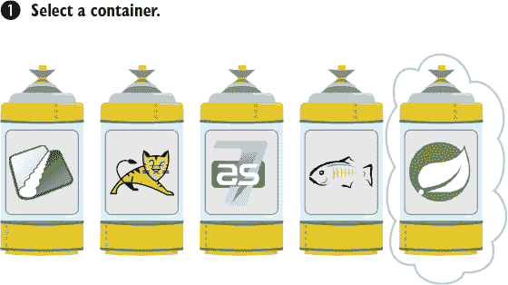
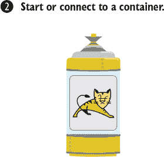
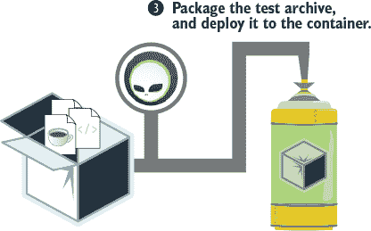
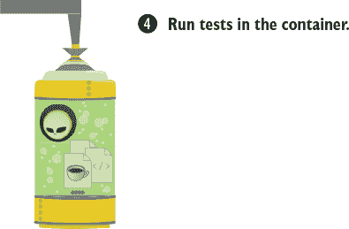
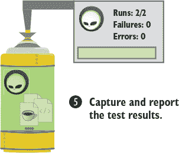
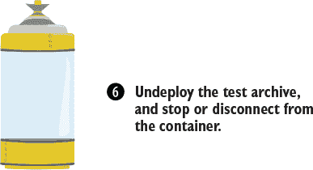

## 第四章\. 组件测试微服务

*本章涵盖*

+   介绍 Arquillian 测试框架

+   使用 Arquillian 扩展进行 RESTful Web 服务和 Spring 的开发

+   测试资源、领域和远程组件

你已经了解了微服务的基本组件构成和各种基本测试技术。现在，是时候深入探讨哪种测试风格最适合每个组件，以及你应该如何实现这些测试了。

组件测试应该设计为验证微服务内部模块的功能以及它们之间的功能，但有一个例外：外部面向公众的资源组件。你想要确保面向公众的服务以你计划的方式对世界开放，因此你需要定义一个基于客户端的测试来确保这一点。组件测试不应该跨越本地机器之外的远程边界。

你需要良好的独立和社交测试混合，以覆盖正在测试的微服务的所有内部交互。测试应使用替身来替换通常与外部资源协作的交互。

我们确信在某个时刻，你曾编写过一个测试来确保一段代码的正确性，但后来在部署到预发布或生产环境时，代码却失败了。这种情况我们都遇到过！通常这与生产环境中在开发阶段不明显的问题有关。在所谓的*生产近环境*中测试组件可以确保它们以你期望的方式反应。接下来，我们将关注这个场景：使用 Arquillian 测试框架开发生产近测试。

### 4.1\. Arquillian 测试框架

Arquillian 最初是为测试在 Java EE 容器中运行的应用程序而创建的，例如 Apache TomEE、JBoss AS、IBM Liberty Profile、Payara、Red Hat WildFly 以及许多其他容器。自那时起，该框架已经发展，不仅包括 Java EE，还包括 Spring 和 Docker 环境。你可以在 Arquillian 网站上找到完整的历史记录：[www.arquillian.org](http://www.arquillian.org)。

| |
| --- |

##### 注意

尽管我们经常在网上或会议上宣传 Arquillian，但我们不希望你认为我们推广这个框架是因为我们得到了赞助。我们推广它是因为在过去的几年里，我们发现它是我们解决许多个人测试挑战的最佳工具。我们希望你会像我们一样享受学习和使用它。

| |
| --- |

Arquillian 是一个可以用于各种软件测试的框架。当涉及到测试微服务、Java EE 或 Spring Boot 时，Arquillian 测试框架是自切片面包以来最好的东西。找到不将你绑定到特定产品或实现的工具很重要。如果我们知道软件工程中的任何事情，那就是事情会变化。Arquillian 从一开始就被设计成在变化方面尽可能灵活，但在使用上尽可能简单。

通过使用扩展，框架可以扩展以满足新的需求。因此，它可以整合许多其他知名的测试组件，如 Mockito 和 PowerMock。它并不试图与这些技术竞争，而是将它们的使用纳入标准化的生命周期中。

你已经理解了单元测试和`@Test`注解，因此尝试引入一个全新的概念将是错误的方向。Arquillian 将你已知的知识融入其中，并利用新特性丰富了这种共同知识。因此，如果你不是在几分钟内，你可以在几小时内开始运行。

在我们查看真实测试之前，你应该了解 Arquillian 测试生命周期。测试本身可能看起来很简单，但在底层有很多事情在进行。你不需要确切地知道它是如何工作的，但如果你遇到问题，基本的理解可能会在将来帮助你。图 4.1（kindle_split_013_split_001.xhtml#ch04fig01）至图 4.6（kindle_split_013_split_001.xhtml#ch04fig06）中的图表概述了基本的 Arquillian 自动化生命周期。

##### 图 4.1\. 选择测试容器



| |
| --- |

##### 注意

从所有目的和意义上讲，*容器*是你选择的应用服务器的另一个名称。无论何时你看到“容器”这个词，只需想到“应用服务器”。

| |
| --- |

如前所述，我们不会将你限制在特定的容器上。第一阶段是选择用于当前测试的容器（图 4.1）。你可以同时针对多个容器运行测试，正如我们将在第五章中讨论的那样。

要么由 Arquillian 启动选定的容器，要么你可以连接到现有的容器（图 4.2）。连接到正在运行的容器意味着测试可以避免容器的启动成本。这一点将在本章后面的 4.6.1 节中详细说明。

##### 图 4.2\. 激活容器环境



需要将测试类以某种方式部署到容器中。Arquillian 知道如何将你的测试类部署到选定的容器中运行测试。这个任务的复杂性被框架隐藏了。你可以使用一个名为 *ShrinkWrap* 的极其强大的工具来打包你的测试应用程序，使其符合容器的期望（图 4.3）。

##### 图 4.3\. 使用 ShrinkWrap 打包测试应用程序并将其部署到容器



一旦 ShrinkWrap 打包并部署了你的测试，测试就会在容器上运行（图 4.4）。测试环境中属于许多元素的内容都会被代理，并且可以使用 CDI 从本地上下文中访问。你很快就会看到这个极其强大的功能是如何发挥作用的。

##### 图 4.4\. 部署的测试应用程序在容器中运行。



在测试运行过程中，需要捕获和收集结果。同样，框架会隐藏这种复杂性，并与你熟悉的常见单元测试紧密协作。IDE 或构建环境会以与正常测试完全相同的方式显示结果（图 4.5）。

##### 图 4.5\. 捕获结果并将其返回到测试环境



一旦所有测试完成，整个测试周期中使用的资源都会被安全地处置（图 4.6）。这可能包括关闭应用程序服务器、数据库和其他在测试期间使用的远程连接。

##### 图 4.6\. 清理资源和关闭容器



|  |
| --- |

##### 警告

如果容器由 Arquillian 启动并且测试发生灾难性故障，请注意服务器可能作为悬挂进程继续运行。这通常表现为下一次测试运行时的端口冲突。如果发生这种情况，你需要找到错误的容器进程并将其手动终止。

|  |
| --- |

### 4.2\. 介绍 @RunWith(Arquillian.class) 注解

在本章中，我们将介绍几个相互关联的概念：*构建脚本*依赖项、`@RunWith(Arquillian.class)` 注解和 *arquillian.xml* 配置文件。目前，请记住，尽管 Arquillian 配置文件对于测试是可选的，但你最终可能需要自定义内部配置的默认设置。阅读本章后，这会变得清晰；现在不必担心容器是如何配置的或需要哪些构建脚本修改。

|  |
| --- |

##### 注意

在这个例子中，我们保留了 `imports` 以便你可以看到相关的命名空间。在后续的例子中，为了简洁起见，我们省略了这些内容的大部分。所有演示应用程序的源代码都随书提供作为参考；请参阅 [www.manning.com/books/testing-java-microservices](http://www.manning.com/books/testing-java-microservices)。

|  |
| --- |

以下列表显示了一个简单的 Arquillian 测试（code/game/src/test/java/book/games/arquillian/ArquillianBasicTest.java）。

##### 列表 4.1\. Arquillian 测试

```
package book.games.arquillian;

import book.games.boundary.Games;
import book.games.boundary.IgdbGateway;
import book.games.control.GamesService;
import book.games.entity.Game;
import book.games.entity.ReleaseDate;
import book.games.entity.SearchResult;
import org.jboss.arquillian.container.test.api.Deployment;
import org.jboss.arquillian.junit.Arquillian;
import org.jboss.shrinkwrap.api.ShrinkWrap;
import org.jboss.shrinkwrap.api.asset.EmptyAsset;
import org.jboss.shrinkwrap.api.spec.WebArchive;
import org.junit.Assert;
import org.junit.Test;
import org.junit.runner.RunWith;

import javax.ejb.EJB;
import javax.inject.Inject;
import javax.persistence.EntityManager;
import javax.persistence.PersistenceContext;

@RunWith(Arquillian.class)                                            *1*
public class ArquillianBasicTest {

    @Deployment                                                       *2*
    public static WebArchive createDeployment() {

        //return ShrinkWrap.create(JavaArchive.class                  *3*
        //return ShrinkWrap.create(EnterpriseArchive.class            *3*
        return ShrinkWrap.create(WebArchive.class,                    *3*
                ArquillianBasicTest.class.getName() + ".war")         *3*
                .addClasses(IgdbGateway.class, GamesService.class,    *3*
                        SearchResult.class, Games.class, Game         *3*
                                .class, ReleaseDate.class)            *3*
                .addAsResource("test-persistence.xml",                *3* *4*
                        "META-INF/persistence.xml")                   *3*
                                                                      *3*
                .addAsWebInfResource(EmptyAsset.INSTANCE,             *3*
                        "beans" + ".xml");                            *3* *5*
    }

    @Inject                                                           *6*
    private GamesService service;

    @EJB                                                              *7*
    private Games games;

    @PersistenceContext                                               *8*
    private EntityManager em;

    @Test                                                             *9*
    public void test() {
        Assert.assertNotNull(this.service);                           *10*
        Assert.assertNotNull(this.games);                             *10*
        Assert.assertNotNull(this.em);                                *10*
    }
}
```

+   ***1* 将此定义为 Arquillian 测试**

+   ***2* 定义部署**

+   ***3* 构建应用程序存档**

+   ***4* 添加 test-persistence.xml 以启用 JPA**

+   ***5* 生成并添加 beans.xml 文件以启用 CDI**

+   ***6* 将 GamesService bean 的运行时实例注入到测试类中**

+   ***7* 在运行时将事务感知的 Games EJB 实例注入到测试类中**

+   ***8* 在运行时将运行时 JPA EntityManager 实例注入到测试类中**

+   ***9* 指示该方法是一个测试**

+   ***10* 断言以证明注入已成功**

让我们逐一了解构建这个 Arquillian 测试所需的所有元素。以下步骤对应于列表 4.1 中的注解：

> **1**. 你将这个测试类定义为 Arquillian 测试，并通知 JUnit 在任何测试运行之前有一些连接要做。
> 
> **2**. @Deployment 定义了测试运行在容器中所需的所有内容的部署。这是要物理部署到容器的 shrink-wrapped 应用程序。定义方法必须是静态的。
> 
> **3**. 使用 ShrinkWrap 构建应用程序存档。这可能会有些令人困惑，但第 4.3 节讨论了如何使用 ShrinkWrap 构建部署存档。在这里，你正在构建一个 WAR 文件，所以忽略注释。你只需添加构成测试的类；应用程序可能要大得多。
> 
> **4**. 在应用程序的 META-INF 目录下添加 test-persistence.xml 的副本以启用 JPA。test-persistence.xml 位于项目的 test/resources 目录中。它将被复制到自动创建的目录并重命名为 persistence.xml。你的测试可能不需要持久化，但在这里添加资源很容易。
> 
> **5**. 在存档 WEB-INF 目录中生成并添加一个空的 beans.xml 文件以启用 CDI（上下文和依赖注入—EE6）。EmptyAsset.INSTANCE 告诉 ShrinkWrap 创建一个空文件，但在步骤 4 中你看到了如何添加本地文件。
> 
> **6**. 当 JUnit 运行测试时，通过 CDI 将 GamesService bean 的运行时实例注入到测试类中。你可以在测试环境中调用这个实例，就像你从应用程序中调用一样。这有多酷？这就是你第一次尝到 Arquillian 框架有多强大的味道。
> 
> **7**. 在运行时将事务感知的 Games EJB 实例注入到测试类中。类似于 CDI，直接将容器托管的 EJB 注入到测试类中，可以让你完全访问运行时 bean。
> 
> **8**. 在运行时将 JPA `EntityManager`实例注入到测试类中。此示例允许在测试中直接访问应用程序持久层。
> 
> **9**. 常规的`@Test`注解表示该方法是一个测试。前几个步骤显然是可选的，例如 CDI 和 JPA，并提供了一些从 Arquillian 可以期待的内容的示例。
> 
> **10**. 简单的断言证明了注入是有效的。

想象一下，现在在几行代码中，你的微服务测试可以多么彻底。正如你所见，添加`@RunWith(Arquillian.class)`、`@Deployment`和`@Test`注解创建了一个非常强大的测试环境。

即使你的应用程序是一个微服务，可以说部署不太可能只包含几个类。在这个基本测试中，你单独添加类——在一个更大的应用程序中这将很繁琐。下一节将深入探讨 ShrinkWrap 的强大功能；它将使你能够添加你归档中可能需要的任何东西——甚至更多！

### 4.3. ShrinkWrap 实用工具类

与 Arquillian 宇宙中的许多组件一样，ShrinkWrap 从基本需求发展成为一个强大的工具。在 Arquillian 的开发初期，很明显需要一个工具来构建包含所有所需依赖项的 Java 归档，并且还需要一种将归档部署到应用服务器的手段。

依赖于应用程序的构建过程是不可行的。构建过程可能很慢，生成的可部署归档可能很大，并且与每个可能的构建过程集成将非常困难，如果不是不可能的。Arquillian 需要更简单、更快、更隔离的东西。ShrinkWrap 通过管理一个可以导出为 Java 归档的虚拟文件系统来实现这一点。该归档的所有可能的条目类型都被建模并暴露给你，因此你可以构建包含任何测试所需内容的任何类型的归档。

我们相信你对常见的网络部署归档格式很熟悉，包括 Java 归档（JAR）、网络归档（WAR）、企业归档（EAR）和 Roshal 归档（RAR）文件。ShrinkWrap 对这些格式理解得非常好，但它可以构建任何基于 zip 的归档。

理念是将你的应用程序分解成实现测试目标所需的最小归档格式：

```
Archive jar = ShrinkWrap.create(JavaArchive.class, "service-provider.jar")
    .addClass(MyService.class);                                            *1*

WebArchive war = ShrinkWrap.create(WebArchive.class, "web-library.war")
    .addClass(MyResource.class)
    .addAsLibrary(jar);                                                    *2*

EnterpriseArchive ear = ShrinkWrap
    .create(EnterpriseArchive.class, "application.ear")
    .addAsModule(war);                                                     *3*
```

+   ***1* 创建一个简单的 JAR 文件，并添加一个类**

+   ***2* 创建一个更复杂的 WAR 文件格式，并添加一个 JAR 文件**

+   ***3* 创建一个 EAR 文件，并添加一个 WAR 文件**

对于 Arquillian 来说，ShrinkWrap 是用于创建测试运行时所需的*微部署*的库。你几乎可以称这些微部署为微服务，因为本质上就是这样。但 ShrinkWrap 可以做更多，也可以作为一个独立的实用工具使用。这超出了本书的范围，所以我们不会涉及它；如果你想要了解更多信息，请随意进行研究 ([`arquillian.org/modules/shrinkwrap-shrinkwrap/`](http://arquillian.org/modules/shrinkwrap-shrinkwrap/))).

ShrinkWrap 基本上管理了一个 Java 存档的内存表示，无论格式如何。这个表示可以通过添加或删除条目来通过强大的 API 进行修改。存档构建到满足你的要求后，可以将其交给 Arquillian 进行部署到容器中。我们将在第 4.5.1 节中介绍添加所需的依赖项，但在达到那个阶段之前，了解你将要添加的内容以及为什么这样做是很重要的。

#### 4.3.1\. 使用 ShrinkWrap 构建存档

创建存档很简单。你使用`org.jboss.shrinkwrap.api.ShrinkWrap`类的静态`create()`方法创建一个空存档：

```
Archive jar = ShrinkWrap.create(GenericArchive.class, "my-first-archive.jar");
```

当然，所有这些只是创建了一个带有名称的空存档，但你已经创建了你的第一个 ShrinkWrap 存档。恭喜你！

接下来，你可能会想要向存档中添加更多资产。在你这样做之前，你可能发现这个片段很有用，可以帮助你在开发过程中查看存档的内容：

```
System.out.println(jar.toString());               *1*
// OUTPUT: my-first-archive.jar: 0 assets
System.out.println(jar.toString(true));           *2*
// OUTPUT: my-first-archive.jar:
```

+   **1** 使用`toString()`是一种查看你的存档包含什么内容的好方法。这是一个普通的 Java `toString()`调用。

+   **2** 也可以使用其他形式的`toString()`。使用你的 IDE 来发现更多。

#### 4.3.2\. 向 ShrinkWrap 存档添加内容

`GenericArchive`在向存档添加资产方面并不做什么。但 ShrinkWrap 可以创建比简单的`GenericArchive`更多！

要创建不同类型的存档，你只需要在方法中传递你想要创建的`Archive`子类。当使用更具体的子类型时，可用于向存档添加内容的选择会更多。

例如，对于 JAR 文件，你可以添加类、包、META-INF 资源等。其他类型也有类似的功能：WAR 有添加 Web 内容、库和 web.xml 的方法。EAR 可以添加模块、应用程序资源、application.xml，以及库和清单资源。你可以通过探索 ShrinkWrap API 来了解更多。

你会注意到这些方法中有多个重载。你可能不会使用所有这些方法，但每个方法都有其用途。如果你发现自己正在做某件事，感觉可能更简单，那么看看你不太常用的方法重载——可能有一些东西可以使你的任务更容易。

使用存档时，你首先想要做的是向其中添加类：

```
ShrinkWrap.create(WebArchive.class, "my-first-archive.jar").
add
addAsDirectories
addAsDirectory
addAsLibraries
addAsLibrary
addAsManifestResource
addAsManifestResources
addAsResource
addAsResources
addAsServiceProvider
addAsServiceProviderAndClasses
addAsWebInfResource
addAsWebInfResources
addAsWebResource
addAsWebResources
addClass                *1*
addClasses
addDefaultPackage
addHandlers
addManifest
addPackage              *2*
addPackages
...
```

+   **1** 所有添加方法都是直观的，但你可能想要添加类。

+   ***2* 您可能还想添加包。**

|  |
| --- |

##### 注意

复数形式的 `add` 方法是单数形式的 `vararg` 版本，可以一次添加多个项目：例如，`addClasses` 和 `addPackages`。

|  |
| --- |

以下是一个使用 *单数* `addClass` 方法的示例：

```
Archive jar = ShrinkWrap.create(JavaArchive.class, "my.jar").addClass
   (HelloWorld.class);

System.out.println(jar.toString(true));
/*
OUTPUT:
my.jar:
/org/
/org/example/
/org/example/shrinkwrap/
/org/example/shrinkwrap/HelloWorld.class
*/
```

您在这里添加名称：my.jar。如果您不添加名称，将生成一个格式为 UUID.jar 的名称，因此我们建议从一开始就使用描述性名称。它们在您在控制台输出或日志文件中直观扫描时更有意义。

|  |
| --- |

##### 小贴士

使用测试类名作为存档名称的一部分：this.getClass().getName() + .jar。这将有助于在控制台输出中直观地分离测试存档。

|  |
| --- |

有时将整个命名空间包添加到存档中会更方便。正如您现在应该预料到的，有一个简单的调用可以做到这一点——`addPackages`：

```
Archive jar = ShrinkWrap.create(JavaArchive.class, "my.jar")
    .addPackages(true, "org.example");                         *1*

System.out.println(jar.toString(true));
/*
package-jar.jar:
/org/
/org/example/
/org/example/shrinkwrap/
/org/example/shrinkwrap/util/
/org/example/shrinkwrap/util/StringUtils.class
/org/example/shrinkwrap/GoodbyeWorld.class
/org/example/shrinkwrap/ShrinkWrapUsage.class
/org/example/shrinkwrap/HelloWorld.class
*/
```

+   ***1* 此方法最有用的版本，其中 true 表示递归调用，添加所有子包和类**

#### 4.3.3\. 添加资源

您不可避免地需要知道如何将资源添加到存档。这些包括以下内容：

+   CDI 的 beans.xml 文件

+   JPA 的 persistence.xml 文件

+   服务实现

+   标签库描述符

+   其他常见配置文件

这是将这些项目添加到存档的方法：

```
Archive jar = ShrinkWrap.create(JavaArchive.class, "my.jar")
    .addPackages(true, "org.example")
    .addAsResource("test-persistence.xml", "META-INF/persistence.xml")   *1*
    .addAsWebInfResource(EmptyAsset.INSTANCE, "beans.xml");              *2*

//Alternative methods...

URL persistenceXml = getClass().getClassLoader()
    .getResource("test-persistence.xml");                                *3*

jar.addAsResource(persistenceXml
    , new BasicPath("META-INF/persistence.xml"));                        *4*
```

+   ***1* 将测试资源 test-persistence.xml 添加到存档中的 META-INF/persistence.xml**

+   ***2* 创建一个空文件资产，并将其添加到存档中的 beans.xml**

+   ***3* 从测试类路径中定位和添加资源的替代方法**

+   ***4* 使用 BasicPath 描述符将替代资源添加到存档**

这两种方法产生相同的输出：

```
System.out.println(jar.toString(true));
/*
my.jar:
/META-INF/
/META-INF/beans.xml
/META-INF/persistence.xml
*/
```

如您所见，ShrinkWrap 有许多方法可以达到相同的结果。您现在不必知道如何使用所有这些方法，但知道几乎总是有简单的方法来做您想做的事情是很好的。

#### 4.3.4\. 添加库和依赖项

您的应用程序可能需要额外的库和第三方依赖项，例如 Apache Commons 库 ([`commons.apache.org`](https://commons.apache.org))。将一些项目添加到存档中是相当简洁的：

```
Archive jar = ShrinkWrap.create(JavaArchive.class, "service-provider.jar")
.addClass(CdiExtension.class)
.addAsServiceProvider(Extension.class, CdiExtension.class);                *1*

WebArchive war = ShrinkWrap.create(WebArchive.class, "web-library.war")
.addClass(StringUtils.class)                                               *2*
.addAsWebResource(new File("src/main/webapp/images/1.gif")
    , "/images/1.gif")                                                     *3*
.addAsLibrary(jar);                                                        *4*

System.out.println(war.toString((true)));
/*
web-library.war:
/WEB-INF/
/WEB-INF/lib/
/WEB-INF/lib/service-provider.jar
/WEB-INF/classes/
/WEB-INF/classes/org/
/WEB-INF/classes/org/example/
/WEB-INF/classes/org/example/shrinkwrap/
/WEB-INF/classes/org/example/shrinkwrap/util/
/WEB-INF/classes/org/example/shrinkwrap/util/StringUtils.class
/images/
/images/1.gif
*/
```

+   ***1* 创建一个 JAR 文件，在本例中是一个 SPI（关于 SPI 的更多信息将在下一节中介绍）**

+   ***2* 添加单个类。ShrinkWrap 知道在哪里将其添加到 WAR 文件中 (/WEB-INF/classes/)。**

+   ***3* 将标准资源添加到定义的路径**

+   ***4* 将 JAR 文件添加到 WAR 文件中。同样，ShrinkWrap 会自动将其添加到正确的路径 (/WEB-INF/lib/)。**

如您所料，ShrinkWrap 提供了简单的方法来实现复杂的功能。但您的应用程序如果远不止一个 Hello World 示例呢？ShrinkWrap 单独是不够的。这引出了下一个主题。

#### 4.3.5\. 使用 Maven 解析器添加复杂依赖项

*Maven 解析器* 是另一个强大的实用工具类，允许你向存档添加重量级选项。它旨在补充你已经了解的 ShrinkWrap 实用工具类。我们只会简要介绍其基本使用方法；你可以在项目的网站上获得更深入的见解，[`github.com/shrinkwrap/resolver`](https://github.com/shrinkwrap/resolver)。

使用解析器很简单，最好通过一个示例来描述：

```
import org.jboss.shrinkwrap.resolver.api.maven.Maven;            *1*
....
String hibernate = "org.hibernate:hibernate-core:5.2.3.Final";   *2*

File[] files = Maven.resolver().resolve(hibernate)               *3*
.withTransitivity()                                              *4*
.asFile();                                                       *5*

WebArchive war = ShrinkWrap.create(WebArchive.class, "my.war")
.addAsLibraries(files);                                          *6*
```

+   ***1* 导入 Maven 实用工具类**

+   ***2* 定义使用 groupId:artifactId:version (GAV) 格式要解析的 Maven 坐标**

+   ***3* 解析定义的 GAV 坐标**

+   ***4* 此外，检索主工件的所有临时（相关）依赖项**

+   ***5* 将完整的依赖项列表作为一个文件数组添加**

+   ***6* 将所有依赖项添加到 WAR 存档中**

如果你知道资源的类型，解析器可以返回不仅仅是文件。除了 GAV，你还可以指定包类型（P，用于如 WAR 或 JAR 的存档）和分类器（C，用户定义的名称）。以下是写作时的完整资源类型列表：

```
Maven.resolver().resolve("G:A:V").withTransitivity()
    .as(File.class);

Maven.resolver().resolve("G:A:V").withTransitivity()
    .as(InputStream.class);

Maven.resolver().resolve("G:A:V").withTransitivity()
    .as(URL.class);

Maven.resolver().resolve("G:A:V").withTransitivity()
    .as(JavaArchive.class);

Maven.resolver().resolve("G:A:P:V").withoutTransitivity()
    .asSingle(WebArchive.class);

Maven.resolver().resolve("G:A:P:C:V").withTransitivity()
    .as(MavenCoordinate.class);
```

`MavenCoordinate.class` 提供了有关指定工件详细元信息。如果你不确定工件提供了哪些资源，可以使用这个类来发现详细信息。

| |
| --- |

##### 注意

你负责关闭检索到的 `InputStream` 类型。该流是直接连接到仓库工件。

| |
| --- |

尽管解析器功能强大，但你可能已经注意到有一个小的潜在缺点：工件版本号在 GAV 坐标字符串中是硬编码的。对于少量固定的依赖项，保持它们同步可能不是问题；但如果你的应用程序一直在发展，这可能会成为一个问题。不用担心：API 提供了一个解决方案。解析器理解 Maven *pom.xml* 文件 ([`maven.apache.org/pom.html`](https://maven.apache.org/pom.html))。你可以从任何 pom.xml 文件位置导入依赖项，所以它可以是你的项目 POM，也可以是完全独立于你的构建的：

```
Maven.resolver().loadPomFromFile("/path/to/pom.xml")      *1*

.importRuntimeAndTestDependencies()                       *2*

.resolve().withTransitivity().asFile();                   *3*
```

+   ***1* 指定要加载的 pom.xml 文件路径**

+   ***2* 定义要导入的范围（有多种方法可以覆盖所有范围）**

+   ***3* 将完整的依赖列表解析为一个文件数组**

#### 4.3.6. 添加服务实现

*服务提供者实现*（SPIs，mng.bz/i7QX）是一种以标准方式扩展应用程序的方法。ShrinkWrap 理解这种机制，并且可以移除添加已知 SPI 到存档所需的大部分标准样板代码。

各种 `addAsServiceProvider` 方法对于让 ShrinkWrap 为指定的接口和类创建服务文件非常有用。以下代码将创建 javax.enterprise.inject.spi.Extension 文件，将服务类的名称添加到其中，然后将文件放置在标准的 META-INF 文件结构中：

```
Archive jar = ShrinkWrap.create(JavaArchive.class, "service-provider.jar")
.addAsServiceProviderAndClasses(Extension.class, CdiExtension.class);      *1*

System.out.println(jar.toString(true));
/*
service-provider.jar:
/javax/
/javax/enterprise/
/javax/enterprise/inject/
/javax/enterprise/inject/spi/
/javax/enterprise/inject/spi/Extension.class                               *2*
/org/
/org/example/
/org/example/shrinkwrap/
/org/example/shrinkwrap/CdiExtension.class
/META-INF/
/META-INF/services/
/META-INF/services/javax.enterprise.inject.spi.Extension
*/

Archive jar2 = ShrinkWrap.create(JavaArchive.class, "service-provider-2.jar")
.addClass(CdiExtension.class)
.addAsServiceProvider(Extension.class, CdiExtension.class);                *3*

System.out.println(jar2.toString(true));
/*
service-provider-2.jar:
/org/
/org/example/
/org/example/shrinkwrap/
/org/example/shrinkwrap/CdiExtension.class
/META-INF/
/META-INF/services/
/META-INF/services/javax.enterprise.inject.spi.Extension
*/
```

+   ***1* 添加了 SPI 所需的结构**

+   ***2* 有时，附加的接口是由容器提供的。**

+   ***3* 通常最好使用 addAsServiceProvider 方法并单独添加类。**

提供两种添加 SPI 的方法为你提供了添加任何实现所需的所有灵活性。

### 4.4. 编写一次，重用你的代码

现在你已经了解了如何创建存档，你可能想知道为什么你要费这么大的劲，因为你的构建工具可以为你做所有这些。除了显而易见的答案——“这就是 Arquillian 的做法”——还有许多很好的理由。最重要的理由是 Arquillian 显著降低了执行集成和功能测试的门槛。即使你没有选择使用 Arquillian，你仍然需要做以下事情：

+   创建一个可以部署的存档。

+   将存档部署到正在运行的容器/应用程序服务器。

+   在已部署的存档中运行测试。

+   从容器中检索测试结果。

+   取消部署存档。

+   关闭容器。

Arquillian 以透明的方式为你处理这些。为所有测试创建一个抽象基类以扩展、覆盖和重用是微不足道的：

```
public class MyTest extends MyAbstractTest {
  ....
  @Deployment
  public static WebArchive createDeployment() {
        WebArchive w = createMyBaseDeployment();         *1*
        w.addClass(MyExtra.class);
        return w;
  }
  ....
}
```

+   ***1* 调用一个静态父方法或实用工具方法，该方法提供了一个现成的 WebArchive 以添加额外的需求**

这个基类概括了你的应用程序，测试类只需要添加额外的需求。你甚至可以为此创建自己的实用工具类。

|  |
| --- |

##### 小贴士

大多数，如果不是所有，应用程序都有可以提取到抽象类中的共同基础。在测试方面也是如此。识别出你测试策略中通用的代码，并做完全相同的事情——创建一个抽象测试类。这将在长期内为你节省时间。

|  |
| --- |

你的构建可能有助于创建存档，但你需要确保添加了所有的测试依赖项，这通常需要相当多的额外配置。创建这些较小的部署，*微部署*，有助于隔离测试与其他应用程序部分。这也帮助你从最小的可测试工作单元的角度思考。

微部署还允许你跳过完整的构建，这既是使用它们的原因，也是副作用。如果你的完整构建需要一分钟来创建可测试的存档，那么你将需要额外一分钟来运行测试！当你进行测试时，这段时间会迅速增加，尤其是如果你是在本地运行测试。副作用是，你不仅跳过了构建，如果你使用的是增量编译器，你也会跳过一个隐式的编译阶段。这可以节省大量时间！

### 4.5. 修改构建脚本

你现在已经很好地掌握了添加到基本 JUnit 测试中以使其成为 Arquillian 测试的元素，但这些元素都是从哪里来的呢？答案是：依赖项！

由于存在众多构建环境，因此几乎不可能涵盖所有内容。我们在示例项目中使用了两个最流行的系统：Maven 和 Gradle。详细说明这两个系统将为您提供足够的信息来配置任何其他系统，因为它们与 Maven GAV 坐标系统紧密相关，并且允许在需要时指定打包和分类器：

```
groupId:artifactId:packaging:classifier:version
```

Arquillian、ShrinkWrap 和 Resolver 都提供了 Maven *物料清单*（BOM）pom.xml 文件。1 BOM 定义了您将需要的所有依赖关系，包括版本号。这消除了需要大量单个依赖关系声明。Arquillian BOM 导入了 ShrinkWrap 和 Resolver BOM，因此您只需在项目 pom.xml 的 `<dependencyManagement>` 部分包含 Arquillian BOM 即可。

> ¹
> 
> 请参阅“依赖机制简介”，*Apache Maven 项目*（[`mng.bz/OR0F`](http://mng.bz/OR0F)）。

#### 4.5.1\. 定义 Maven 依赖关系

如果您使用 Maven 进行构建，添加 Arquillian 的依赖关系非常简单。在项目 pom.xml 的 `<dependencyManagement>` 部分使用 `import` 范围声明 BOM。您可以在以下列表中看到提供了一个 WildFly ([`wildfly.org`](http://wildfly.org)) BOM。BOM 非常有用！

##### 列表 4.2\. code/game/pom.xml: `<dependencyManagement>`

```
<dependencyManagement>
    <dependencies>
        <dependency>
            <groupId>org.wildfly.swarm</groupId>
            <artifactId>bom</artifactId>
            <version>${version.wildfly.swarm}</version>
            <scope>import</scope>
            <type>pom</type>
        </dependency>
        <dependency>
            <groupId>org.jboss.arquillian</groupId>
            <artifactId>arquillian-bom</artifactId>
            <version>1.1.13.Final</version>
            <scope>import</scope>
            <type>pom</type>
        </dependency>
    </dependencies>
</dependencyManagement>
```

|  |
| --- |

##### 注意

BOM（Bill of Materials）用于定义项目中可能使用的特定工件版本和临时依赖关系。在多模块构建中，`<dependencyManagement>` 应该位于父 pom.xml 中，并作为所有子模块的合同。实际的依赖关系定义在 `<dependencies>` 部分，其中省略了 `<version>` 定义。

|  |
| --- |

您还需要将 Arquillian 容器适配器和实现添加到项目的 `<dependencies>` 部分。此示例使用 Red Hat 的 WildFly 容器适配器（[www.redhat.com](http://www.redhat.com)），但可以是您喜欢的任何适配器实现，例如 Apache TomEE 适配器（[`mng.bz/O5fo`](http://mng.bz/O5fo)）。

##### 列表 4.3\. code/game/pom.xml: `<dependencies>`

```
<dependency>
    <groupId>org.jboss.arquillian.junit</groupId>
    <artifactId>arquillian-junit-container</artifactId>
    <scope>test</scope>
</dependency>
<dependency>
    <groupId>org.wildfly.swarm</groupId>
    <artifactId>arquillian</artifactId>
    <scope>test</scope>
</dependency>
```

|  |
| --- |

##### 提示

仅仅在测试类路径上有一个适配器实现就足以让 Arquillian 找到并使用它。您可以使用 Maven 构建配置文件定义多个实现——我们将在第五章中进一步讨论这一点。

|  |
| --- |

您可以通过在互联网上搜索 “[容器名称]+arquillian” 来始终找到您应用程序服务器的适配器。请注意，定义的 `<scope>` 是 `test`，因为您应该只使用 Arquillian 进行测试。

|  |
| --- |

##### 注意

`arquillian-junit-container` 艺术品会拉入 ShrinkWrap 和 resolvers 作为临时依赖。如果您想在您的应用程序中使用 ShrinkWrap 或 resolvers，您需要单独定义它们，使用所需的范围。

|  |
| --- |

#### 4.5.2\. 定义 Gradle 依赖

Gradle 默认不支持 BOM 的概念。幸运的是，一些插件启用了此功能——否则，您必须单独添加所有依赖项。您仍然需要添加一些额外的依赖定义，但 BOM 会为您声明所有版本和临时依赖。

|  |
| --- |

##### 注意

我们已经为本书格式化了长坐标行，因此请将 `o.j.s` 替换为 `org.jboss.shrinkwrap`，将 `o.j.a` 替换为 `org.jboss.arquillian`，将 `o.g` 替换为 `org.glassfish`。如有疑问，请检查示例代码。

|  |
| --- |

以下列表展示了从 aggregatorservice 应用程序（code/aggregator/build.gradle）中提取的示例 build.gradle 文件。

##### 列表 4.4\. 示例 build.gradle 文件

```
plugins {                                                                *1*
    id "io.spring.dependency-management" version "0.6.1.RELEASE"
}

dependencyManagement {                                                   *2*
    imports {
        mavenBom 'o.j.a:arquillian-bom:1.1.13.Final'
        mavenBom 'o.j.s:shrinkwrap-bom:1.2.6'
        mavenBom 'o.j.s.resolver:shrinkwrap-resolver-bom:2.2.4'
    }
}

apply plugin: 'war'

group = 'org.gamer'
version = '1.0-SNAPSHOT'
war.archiveName = "gameaggregatorservice.war"

sourceCompatibility = 1.8
targetCompatibility = 1.8

dependencies {                                                           *3*

    testCompile 'junit:junit:4.12'

    testCompile group: 'o.j.a.junit',name: 'arquillian-junit-container'  *4*

    testCompile 'o.j.a.container:arquillian-tomcat-embedded-8:1.0.0'     *5*

    testCompile 'o.j.s:shrinkwrap-api'                                   *6*
    testCompile 'o.j.s:shrinkwrap-spi'                                   *6*
    testCompile 'o.j.s:shrinkwrap-impl-base'                             *6*

    testCompile 'o.j.s.resolver:shrinkwrap-resolver-api'                 *7*
    testCompile 'o.j.s.resolver:shrinkwrap-resolver-spi'                 *7*
    testCompile 'o.j.s.resolver:shrinkwrap-resolver-api-maven'           *7*
    testCompile 'o.j.s.resolver:shrinkwrap-resolver-spi-maven'           *7*
    testCompile 'o.j.s.resolver:shrinkwrap-resolver-api-maven-archive'   *7*
    testCompile 'o.j.s.resolver:shrinkwrap-resolver-impl-maven'          *7*
    testCompile 'o.j.s.resolver:shrinkwrap-resolver-impl-maven-archive'  *7*

    compile 'o.g.jersey.containers:jersey-container-servlet:2.22.2'
    compile 'o.g.jersey.core:jersey-client:2.22.2'
    compile 'o.g:javax.json:1.0.4'
    compile 'o.g:jsonp-jaxrs:1.0'
}
```

+   ***1* 定义了依赖管理插件，允许您使用 Maven BOM 导入**

+   ***2* 使用插件导入 Arquillian、ShrinkWrap 和 resolver 依赖**

+   ***3* 声明应用程序所需的全部依赖**

+   ***4* 添加 Arquillian 依赖。因为 BOM 定义了所有必需的版本号，所以您不需要在这里包含它们（除非需要覆盖）。**

+   ***5* 添加任何容器实现。在这里，您使用嵌入式的 Apache Tomcat 容器。**

+   ***6* 添加 BOM 中声明的 ShrinkWrap 依赖**

+   ***7* 添加 BOM 中声明的 Resolver 依赖**

### 4.6\. 覆盖默认的 Arquillian 配置

我们现在已经涵盖了运行标准 Arquillian 单元测试所需的所有元素。这包括使用必需的注解、打包和部署应用程序存档，以及在构建脚本中包含所有必需的依赖项。如本章开头所述，所有这些都依赖于尚未公开的默认配置。

有时候，默认配置可能需要定制。例如，您可能需要在一个不同于默认端口的端口上启动容器（以避免端口冲突）或以 HTTPS 模式（以测试安全性），或指定选项，如密钥库文件。

Arquillian 会检查类路径根目录下名为 arquillian.xml 的配置设置文件。如果此文件存在，则将其加载；否则，使用默认值。到目前为止，Arquillian 一直在后台透明地使用默认的配置选项集。这些默认选项由类路径上找到的特定供应商的容器适配器实现提供。

在典型的 Maven 项目中，此文件通常位于 [project]/src/test/resources/arquillian.xml。此测试资源目录中的文件仅在运行时才可在测试类路径上使用，这通常是必需的场景。以下列表展示了示例。

##### 列表 4.5\. 包含两个容器的示例 arquillian.xml 文件

```
<?xml version="1.0" encoding="UTF-8"?>
<arquillian>                                                     *1*

    <!-- Configuration of container one -->
    <container qualifier="widlfly-remote">                       *2*
        <configuration>
        <property name="javaVmArguments">
            -Dprop=val
        </property>
        </configuration>
    </container>

    <!-- Configuration of container two -->
    <container qualifier="widlfly-managed" default="true">       *3*
        <configuration>
        <property name="javaVmArguments">
            -Dprop=val                                           *4*
        </configuration>
    </container>
</arquillian>
```

+   ***1* 在遵循标准 XML 声明之后是 <arquillian>，带有模式引用的主体定义。**

+   ***2* 通常只有一个 <container qualifier=“[name]”>；我们将在稍后解释为什么这里有两个。**

+   ***3* 第二个容器，标记为默认**

+   ***4* 容器属性定义——可以有多个属性**

此配置是 XML 格式，因此在布局上没有惊喜。让我们更深入地看看最重要的配置选项。

|  |
| --- |

##### 注意

因为每个容器都是供应商特定的，所以 arquillian.xml 文件中的一些内容将包含供应商特定的选项。以列表 4.5 中的信息为例，但请确保你使用你选择的容器的正确选项。我们将在本节中突出需要关注的区域。

|  |
| --- |

#### 4.6.1\. 容器定义

在第 4.5.1 节中，你学习了如何使用 Maven 坐标向测试类路径添加默认容器适配器。`<container qualifier="[name]">` 是你为将要测试的特定运行时容器做出声明的位置。如果 Arquillian 只找到一个容器定义，它将始终用作默认值。

我们将在第七章中深入讨论使用多个容器。简而言之，如果存在多个容器定义，Arquillian 会寻找两个东西：

+   带有 `default="true"` 属性的容器。这个容器将被用作默认值——这是有道理的。

+   系统属性 `arquillian.launch`，其中包含用于当前运行时的容器名称。

可以使用 Maven 配置文件定义或覆盖 `arquillian.launch` 系统属性。

#### 4.6.2\. 指定容器属性

容器属性很简单：`<property name="[name]">[value]</property>`。你可以在 `<configuration>` 元素中添加任意数量的容器属性。正如我们在本章前面警告的那样，这些属性是供应商特定的。

容器属性最常见的用途是定义一个要绑定的服务器端口，以防止冲突。一些提供商允许使用随机端口，这是一个很酷的功能，因为它允许测试并行运行。示例列表 4.5 为 WildFly 容器定义设置了系统属性 `javaVmArguments`。你将在本节后面看到这一点的重要性。正如你可以想象的那样，在这里列出所有可用的容器实现的所有可用属性是不可能的。表 4.1 给出了一些；请花时间找到你选择的容器可用的属性。

##### 表 4.1\. 常见容器和属性

| 容器 | 属性 | 值 |
| --- | --- | --- |
| Apache TomEE | httpPort | -1 (随机) |
| Apache TomEE | stopPort | -1 (随机) |
| WildFly | serverConfig | server.xml (文件) |
| GlassFish | bindHttpPort | [端口号] |
|  |

##### 小贴士

当你使用嵌入式容器（远程容器适配器总是这样命名）时，你也可以通过`maven-surefire-plugin`设置系统属性。参见[`mng.bz/cI7V`](http://mng.bz/cI7V)。

|  |
| --- |

### 4.7\. 使用 Arquillian REST 扩展

REST 网络服务现在很常见，而且越来越不可能有一个基于 Web 或微服务应用今天不使用这项技术。这并不意味着微服务不能使用不同的协议（远非如此）；但这将是一个边缘情况，并且特定于业务范围。在这里，我们将关注 HTTP/S 上的 REST，以及 Arquillian 如何在构建测试环境时减轻负担。

有两个模块可用。REST 客户端扩展旨在用于黑盒测试环境：客户端完全与应用程序隔离，并且仅将端点视为真实远程客户端。Warp REST 模块用于更复杂的测试，其中你想要拦截传入和传出的 REST 请求和响应。接下来的两个部分将介绍这些模块。

#### 4.7.1\. Arquillian REST 客户端扩展

有时你需要在一个黑盒环境中测试 REST 应用程序，测试行为就像是一个真实客户端，以确保当由外部源调用时，你的端点按预期工作。当你知道接口（合同）并且你有明确定义的输入，你还知道从资源调用中期望得到什么结果时，Arquillian REST 客户端扩展将对你很有用。让我们看看一个简洁的例子（code/comments/src/test/java/book/comments/boundary/CommentsResourceTest.java）。

##### 列表 4.6\. 使用 Arquillian REST 客户端扩展

```
@RunWith(Arquillian.class)                                               *1*
public class CommentsResourceTest {

    @Deployment(testable = false)                                        *2*
    public static WebArchive createDeployment() {

        final WebArchive webArchive = ShrinkWrap
            .create(WebArchive.class)
            .addPackage(CommentsResource.class.getPackage())
            .addClass(MongoClientProvider.class)
            .addAsWebInfResource("test-resources.xml","resources.xml")
            .addAsWebInfResource(EmptyAsset.INSTANCE, "beans.xml")
            .addAsLibraries(Maven.resolver()
                .resolve("org.mongodb:mongodb-driver:3.2.2")
                .withTransitivity().as(JavaArchive.class));

        System.out.println("webArchive = " +
        webArchive.toString(true));

        return webArchive;
    }

    @Test
    public void getCommentsOfGivenGame(
        @ArquillianResteasyResource final CommentsResource resource)     *3*
            throws Exception {

        Assert.assertNotNull(resource);

        final Response game = resource.getCommentsOfGivenGame(1);        *4*
        Assert.assertNotNull(game);
    }

}
```

+   ***1* 现在非常熟悉的@RunWith(Arquillian.class)测试注解**

+   ***2* 当你知道一个类中的所有测试都将作为黑盒客户端执行时，使用 testable = false 选项，而不是@RunAsClient。这里的打包添加了 REST CommentsResource.class 和所需的依赖项。**

+   ***3* 使用@ArquillianResteasyResource 注解直接将 CommentsResource.class REST 资源接口注入到测试方法中**

+   ***4* 在测试方法中直接使用 CommentsResource.class REST 资源接口**

如果你曾经在使用基于 REST 的测试中使用过 JAX-RS `ClientBuilder`，那么在这里使用`@ArquillianResteasyResource`注解替换了多少样板代码应该很清楚。可以说，这个扩展已经移除了一大部分访问端点所需的代码。在底层，执行真实的 HTTP 请求和响应，但现在接口充当了一个简化的代理。

|  |
| --- |

##### 小贴士

你会在本书的代码中找到几个使用 JAX-RS `ClientBuilder`测试资源的测试。对于更精细的测试，它比`@ArquillianResteasyResource`更有用。你可以决定走哪条路——两者都有其优点。

| |
| --- |

如果你想在你的测试中使用 REST 扩展，你需要在你的构建脚本中添加以下依赖项：

```
org.jboss.arquillian.extension:arquillian-rest-client-api:1.0.0.Alpha4
org.jboss.arquillian.extension:arquillian-rest-client-impl-3x:1.0.0.Alpha4
```

| |
| --- |

##### 注意

在撰写本文时，我们使用了最新可用的版本。它被标记为 alpha 版本，但非常稳定。请尽可能检查并使用最新版本。

| |
| --- |

#### 4.7.2\. Warp REST 扩展

Arquillian Warp REST 扩展允许你在服务器端测试你的 RESTful 应用程序。此扩展提供了拦截执行服务状态的实用工具，并在服务调用之前或之后可能执行的容器测试中提供状态。它支持包括 1.1 和 2.0 在内的 JAX-RS 主要版本以及最流行的实现。

这个主题是高级的，需要很好地理解底层协议才能有用。以下测试在端点调用后添加了一个检查（code/comments/src/test/java/book/comments/boundary/CommentsWarpTest.java）。内部，一个 REST 端点由一个理解客户端/服务器协议的 servlet 调用。可以在方法上使用 Warp 注解`@AfterServlet`和`@BeforeServlet`来访问当前的协议状态。

##### 列表 4.7\. 在端点之后添加检查

```
@WarpTest                                                           *1*
@RunWith(Arquillian.class)
public class CommentsWarpTest {

    @BeforeClass
    public static void beforeClass() {                              *2*
        RegisterBuiltin.register(ResteasyProviderFactory
                .getInstance());
    }

    @Deployment
    @OverProtocol("Servlet 3.0")                                     *3*
    public static WebArchive createDeployment() {
        final WebArchive webArchive = ShrinkWrap.create(WebArchive
                .class).addPackage(CommentsResource.class
                .getPackage()).addClass(MongoClientProvider.class)
                .addAsWebInfResource("test-resources.xml",
                        "resources.xml").addAsWebInfResource
                        (EmptyAsset.INSTANCE, "beans.xml")
                .addAsLibraries(Maven.resolver().resolve("org" +
                        ".mongodb:mongodb-driver:3.2.2")
                        .withTransitivity().as(JavaArchive.class));

        System.out.println("webArchive = " + webArchive.toString
                (true));

        return webArchive;
    }

    private CommentsResource resource;

    @ArquillianResource
    private URL contextPath;                                         *4*

    @Before
    public void before() {                                           *5*
        final ResteasyClient client = new ResteasyClientBuilder()
                .build();
        final ResteasyWebTarget target = client.target(contextPath
                .toExternalForm());
        resource = target.proxy(CommentsResource.class);
    }

    @Test
    @RunAsClient                                                     *6*
    public void getCommentsOfGivenGame() {

        Warp.initiate(() -> {                                        *7*

            final Response commentsOfGivenGame = resource
                    .getCommentsOfGivenGame(1);
            Assert.assertNotNull(commentsOfGivenGame);

        }).inspect(new Inspection() {

            private static final long serialVersionUID = 1L;

            @ArquillianResource
            private RestContext restContext;                         *8*

            @AfterServlet                                            *9*
            public void testGetCommentsOfGivenGame() {

                assertEquals(HttpMethod.GET, restContext
                        .getHttpRequest().getMethod());               *10*
                assertEquals(200, restContext.getHttpResponse()
                        .getStatusCode());
                assertEquals("application/json", restContext
                        .getHttpResponse().getContentType());
                assertNotNull(restContext.getHttpResponse()
                        .getEntity());
            }
        });
    }
}
```

+   ***1* 使用 @WarpTest 注解将测试类标记为 Warp 启用测试**

+   ***2* 确保 REST 环境对测试类可用**

+   ***3* 使用 @OverProtocol 注解定义底层协议**

+   ***4* 注入用于访问服务器的 REST 上下文路径**

+   ***5* 配置 REST 客户端代理到服务器资源**

+   ***6* 使用 @RunAsClient 注解在黑盒环境中隔离测试方法**

+   ***7* 启动 REST 调用并添加检查**

+   ***8* 提供 REST 调用上下文以访问协议信息**

+   ***9* 指示该方法应在 servlet 调用之后直接调用**

+   ***10* 访问协议状态允许测试。**

如果你想在你的测试中使用 REST Warp 扩展，你需要在你的构建脚本中添加以下依赖项：

```
org.jboss.arquillian.extension:arquillian-warp-api:[version]
org.jboss.arquillian.extension:arquillian-rest-warp-impl-jaxrs-[version]
```

| |
| --- |

##### 注意

如前所述，在撰写本文时，我们使用了代码中可用的最新版本。尽管这被标记为 alpha 版本，但它对测试来说非常稳定。请尽可能检查并使用最新版本。

| |
| --- |

### 4.8\. 使用 Arquillian 测试 Spring 应用程序

我们在第一章中提到的微服务架构的关键优势之一是能够将服务开发委托给多个团队，使用多种技术。在多技术环境中，唯一重要的方面是资源组件可以通过定义的协议访问，在这种情况下是通过 HTTP 上的 REST。从团队到团队的角度来看，实际服务的实现是不相关的。为了演示这个原则，书中演示应用程序的视频服务是一个 Spring Boot 应用程序。您仍然需要像测试任何其他应用程序一样测试这个应用程序。

Arquillian 提供了一个 Spring v4+扩展，可用于辅助测试。

#### 4.8.1\. Arquillian Spring 框架扩展

Spring 框架扩展的工作方式类似于`@SpringJUnit4ClassRunner`，但它保持在 Arquillian 测试环境上下文中，并且启动测试时需要更少的样板代码。如果您已经熟悉 Spring JUnit 集成，我们建议您查看这种方法，并在将其摒弃之前进行有根据的评价。如果您不熟悉，那么这可能是您开始时最容易的方法，因为设置比 Spring 运行器更简洁。扩展支持以下实现：

+   将 Spring bean 注入测试类

+   从 XML 和 Java 配置中配置

+   向测试中注入配置在 Web 应用程序中（例如，`DispatcherServlet`）的 bean，这些测试使用了`@SpringWebConfiguration`注解

+   支持 Spring（`@Autowired`、`@Qualifier`、`@Required`）和 JSR 330（`@Inject`、`@Named`）注解

+   支持 bean 初始化（`@PostConstruct`）

+   自动打包`spring-context`和`spring-web`组件

要将 Spring 扩展添加到您的项目中，您需要在构建脚本中添加以下组件（使用来自[`arquillian.org/modules/spring-extension`](http://arquillian.org/modules/spring-extension)的最新版本）：

```
<dependency>                                                               *1*
    <groupId>org.jboss.arquillian.extension</groupId>
    <artifactId>arquillian-service-integration-spring-inject</artifactId>
    <version>${arquillian.spring.version}</version>
    <scope>test</scope>
</dependency>
<dependency>                                                               *2*
    <groupId>org.jboss.arquillian.extension</groupId>
    <artifactId>arquillian-service-integration-spring-javaconfig</artifactId>
    <version>${arquillian.spring.version}</version>
    <scope>test</scope>
</dependency>
```

+   ***1* 必需的基本组件***

+   ***2* 可选组件，当使用基于注解的配置时需要（推荐）***

我们不会查看基于文件的配置，因为我们确信即使是经验最丰富的 Spring 大师现在也在使用基于注解的配置。让我们看看一个包含所有相关元素的基本测试（code/video/i-tests/src/test/java/book/video/YoutubeVideosArquillianTest.java）。

##### 列表 4.8\. 使用 Spring 框架扩展

```
@RunWith(Arquillian.class)
@SpringAnnotationConfiguration(classes =                               *1*
        {YoutubeVideosArquillianTest.class, ControllerConfiguration    *1*
                .class, ThreadExecutorConfiguration.class})            *1*
@Configuration
public class YoutubeVideosArquillianTest {

    @Bean                                                              *2*
    public JedisConnectionFactory jedisConnectionFactory() {
        final JedisConnectionFactory jcf = new
                JedisConnectionFactory();
        jcf.setHostName("localhost");
        return jcf;
    }

    @Primary
    @Bean
    public YouTubeVideos getYouTubeVideos() {
        return new YouTubeVideos();
    }

    @Deployment                                                        *3*
    public static JavaArchive createTestArchive() {
        return ShrinkWrap.create(JavaArchive.class, "spring-test" +
                ".jar").addClasses(YouTubeVideos.class);
    }

    @Autowired                                                         *4*
    private YouTubeVideos youtubeVideos;

    @Test                                                              *5*
    public void test() {
        Assert.assertNotNull(this.youtubeVideos);
    }

}
```

+   ***1* 列出所有产生`@Bean`实现的类（Spring 对 Java EE `@Produces`注解的等效）***

+   ***2* 典型的`@Bean`生产者——如果需要，这是一个创建模拟的理想位置***

+   ***3* 常规的 Arquillian 部署归档***

+   ***4* 使用`@Autowired`注解注入实现***

+   ***5* 可以使用注入资源的标准测试***

这涵盖了您需要了解的所有关于测试标准 Spring 应用程序的知识。还有一些更高级的注释，这些注释超出了本书的范围，几乎需要 Spring 教程；访问扩展网站 mng.bz/Y4J8 以更好地了解可用的内容。以下注释受支持，并且 Spring 开发者会感到熟悉：

+   `@SpringWebConfiguration`—用于 MVC 测试

+   `@EnableWebMvc`—也用于 MVC 测试

+   `@ComponentScan`—扫描带有`@Component`注释的 Bean，而不是`@Bean`生产者

+   `@OverProtocol`—用于定义底层协议

#### 4.8.2\. 测试 Spring Boot 应用程序

Spring Boot 是一种迅速增长的流行技术。在撰写本文时，只有基于 Spring Boot 应用程序的 Spring 框架扩展的实验性 Arquillian 集成。

有可能创建一个忽略或绕过定义`@SpringBootApplication`注释的测试，但这将是作弊行为。目前，了解和理解如何测试旨在作为微服务运行的 Spring Boot 应用程序是有帮助的。该应用程序由一个带有`@SpringBootApplication`注释的`Main`类组成。这清楚地表明了 Spring Boot 应用程序的开始，并启动了类路径扫描和发现。这就是我们所说的绕过——您可以为经验丰富的 Spring 开发者创建一个模拟`@SpringBootApplication`执行的自动配置的 Arquillian 测试。我们将把这个留作经验丰富的 Spring 开发者的练习。

这里是书中视频服务项目使用的`Main`类。

##### 列表 4.9\. code/video/src/main/java/book/video/Main.java

```
package book.video;

import org.springframework.boot.actuate.system
        .ApplicationPidFileWriter;
import org.springframework.boot.autoconfigure.SpringBootApplication;
import org.springframework.boot.builder.SpringApplicationBuilder;
import org.springframework.scheduling.annotation.EnableAsync;

import java.util.HashMap;
import java.util.Map;

@SpringBootApplication                                          *1*
@EnableAsync
public class Main {

    public static void main(final String[] args) {              *2*

        final Map<String, Object> map = new HashMap<>();
        map.put("endpoints.shutdown.enabled", true);
        map.put("endpoints.shutdown.sensitive", false);

        new SpringApplicationBuilder(Main.class).listeners(new
                ApplicationPidFileWriter("./video.pid"))
                .logStartupInfo(true).properties(map).run(args);
    }
}
```

+   ***1* 将 Main 类标记为——您猜对了——Spring Boot 应用程序**

+   ***2* 一个可运行的 Java 应用程序类的标准静态 void main 方法**

下一步是告诉测试类在哪里可以找到`Main`类。这是通过添加指向当前类的`@SpringApplicationConfiguration`来完成的（code/video/i-tests/src/test/java/book/video/YoutubeVideosTest.java）。

##### 列表 4.10\. 添加`@SpringApplicationConfiguration`

```
@RunWith(SpringJUnit4ClassRunner.class)                             *1*
@SpringBootTest(classes = {Main.class})                             *2*
public class YoutubeVideosTest {

    private static RedisServer redisServer;

    @BeforeClass
    public static void beforeClass() throws Exception {
        redisServer = new RedisServer();
        redisServer.start();
    }

    @AfterClass
    public static void afterClass() {
        redisServer.stop();
    }

    @Rule
    public RedisRule redisRule
        = new RedisRule(newManagedRedisConfiguration().build());

    @Autowired                                                      *3*
    YouTubeVideos youtubeVideos;

    @Test
    @UsingDataSet(loadStrategy = LoadStrategyEnum.DELETE_ALL)       *4*
    @ShouldMatchDataSet(location = "expected-videos.json")
    public void shouldCacheGamesInRedis() {
        youtubeVideos.createYouTubeLinks("123", Collections
                .singletonList("https://www.youtube.com/embed/7889"));
    }
}
```

+   ***1* 使用 Spring JUnit 类初始化单元测试，而不是 Arquillian**

+   ***2* 指向 Spring Boot 应用程序类，Main.java**

+   ***3* 注入一个 Bean 类**

+   ***4* 从现在开始，测试将完全按照您预期的那样工作。**

### 4.9\. 更复杂的 Arquillian 测试示例

接下来的几节将简要介绍一些示例测试，这些测试基于我们刚刚解释的内容。如果您看到尚未讨论的内容，请不要担心：记下来，并尝试通过阅读代码来找出它是做什么的。Arquillian 试图尽可能容易理解，但丰富的插件有时会增加学习曲线。以下章节在介绍这些高级插件功能的同时进行。

#### 4.9.1\. 测试远程组件

远程组件是您的微服务领域组件接触任何可能被认为是远程资源的地方。这不会包括像远程数据库这样复杂的东西，因为那属于持久化范围，并且被 ORM 层或其他传统 API 所掩盖。更多地考虑那些您必须专门编写客户端访问代码的情况——您的远程 API。

您想要测试微服务领域组件与远程组件之间的交互；而不是远程组件与实际远程资源之间的交互——这将被视为合同测试，它包含在第六章（chapter 6）中。在组件测试中，您不允许在本地机器之外进行调用。

以下列表是一个代码重用的示例（code/game/src/test/java/book/games/arquillian/ArquillianAbstractTest.java）。您将把它用作一些测试的基础类：创建基本部署存档和模拟远程调用。快速浏览一下，然后我们将进行解释。

##### 列表 4.11\. 远程组件的测试

```
...
import static com.github.tomakehurst.wiremock.client.WireMock.aResponse;
import static com.github.tomakehurst.wiremock.client.WireMock.equalTo;
import static com.github.tomakehurst.wiremock.client.WireMock.get;
import static com.github.tomakehurst.wiremock.client.WireMock.stubFor;
import static com.github.tomakehurst.wiremock.client.WireMock.urlPathEqualTo;
...
public abstract class ArquillianAbstractTest {

    @Before
    public void before() {
        stubFor(get(anyUrl()).withQueryParam("search", equalTo          *1*
                ("The" + " Legend of Zelda: Breath of the Wild"))       *1*
                .willReturn(aResponse().withStatus(200).withHeader      *1*
                        ("Content-Type", "application/json")            *1*
                        .withBody("[{\"id\":7346,\"name\":\"The " +     *1*
                                "Legend of Zelda: Breath of the " +     *1*
                                "Wild\"}]")));                          *1*
    }

    @Rule                                                               *2*
    public WireMockRule wireMockRule = new WireMockRule(8071);

    public static WebArchive createBaseDeployment(final String name) {  *3*
        return ShrinkWrap.create(WebArchive.class, name + ".war")
                .addClasses(GamesResource.class,
                        ExecutorServiceProducer.class, GamesService
                                .class, IgdbGateway.class,
                        SearchResult.class, Games.class, Game
                                .class, ReleaseDate.class)
                .addAsResource("test-persistence.xml",
                        "META-INF/persistence.xml")
                .addAsWebInfResource(EmptyAsset.INSTANCE, "beans" +
                        ".xml");
    }
}
```

+   ***1* 在每个测试之前（@Before）对 [`www.igdb.com/`](https://www.igdb.com/) API 远程调用进行 WireMock 模拟**

+   ***2* WireMock 规则定义了要监听的端口。该规则可以做的不仅仅是定义端口。**

+   ***3* 创建用于测试的最小存档的实用方法。您可以在实现中使用此存档，并使用 ShrinkWrap 方法向其中添加更多项目。**

WireMock 基本上是一个真实的 HTTP 代理服务器，它监听一个定义的端口（使用 `WireMockRule`）。IGDB API 定义良好且版本稳定。它是一个 REST API，就像微服务资源组件所描述的那样。这意味着您可以在定义的端口上拦截远程调用并模拟运行时响应。您不需要在运行时类中更改任何一行代码！

在 列表 4.11 中，`stubFor` 是一个综合用例，它拦截了对已知 API 路径 /games/search 的 GET 调用，使用查询参数 `q` 的值为 `"Zelda"`，以及 HTTP `Authorization` 标头等于“Token ...”。如果一切匹配，它将返回一个包含特定正文内容的 JSON 响应，正文内容由 IGDB API 定义（[`mng.bz/xVF4`](http://mng.bz/xVF4)）。

|  |
| --- |

**WireMock 的力量**

在 列表 4.11 中，WireMock ([`wiremock.org`](http://wiremock.org)) 进行了一些相当强大的操作。在应用程序中，您会找到一个名为 `IgdbGateway.class` 的类——这是微服务远程资源组件 `GamesService.class` 所封装/使用的网关组件，用于对 [www.igdb.com](http://www.igdb.com) API 进行真实的远程调用。

这是一个没有接口的具体类，被注入到应用程序中。如果你想要模拟这个类，你会怎么做？如果没有提取接口并分离实现，以便可以使用虚拟实现进行测试，你会遇到困难。在过去，这正是你可能会做的事情；或者你可能需要想出另一个复杂的解决方案，比如在测试中使用 CDI 替代方案，只是为了运行单元测试。

另一种方法可能是使用类似于 Mockito 的`when([方法调用]).thenReturn([响应])`，这对于模拟接口和*某些*对象来说非常好。我们说*某些*，因为模拟一个具体对象可能会产生许多未知的副作用，这需要适当的分析和对当前类的良好理解。即使你做到了这一点，当这个模拟对象被打包并部署到容器中时会发生什么？简单的答案是，试试看。长答案超出了本书的范围。

|  |
| --- |

为了看到`stubFor` WireMock 拦截器的重要性，让我们看看一个使用它的测试：`ArquillianRemoteTest`类（code/game/src/test/java/book/games/arquillian/ArquillianRemoteTest.java）。

##### 列表 4.12\. 在测试中使用 WireMock 拦截器

```
@RunWith(Arquillian.class)
public class ArquillianRemoteTest extends ArquillianAbstractTest {     *1*

    @Deployment                                                        *2*
    public static WebArchive createDeployment() {
        return createBaseDeployment(ArquillianRemoteTest.class
                .getName()).addClass(ArquillianRemoteTest.class)
                .addClass(ArquillianAbstractTest.class)
                .addAsLibrary(Maven.resolver().resolve("com.github"
                        + ".tomakehurst:wiremock-standalone:2.2.1")
                        .withoutTransitivity().asSingleFile());
    }

    @Inject                                                            *3*
    private IgdbGateway gateway;

    @Test                                                              *4*
    public void testSearchGames() throws Exception {
        Assert.assertNotNull(this.gateway);

        final JsonArray json = gateway.searchGames("The Legend of "
                + "Zelda: Breath of the Wild");
        Assert.assertNotNull(json);

        final JsonObject game = json.getJsonObject(0);

        Assert.assertEquals("Unexpected id", 7346, game
                .getJsonNumber("id").intValue());
        Assert.assertEquals("Unexpected name", "The Legend of " +
                "Zelda: Breath of the Wild", game.getString("name"));
    }
}
```

+   ***1* 测试类扩展了基类，并按照常规方式进行注解。**

+   ***2* 使用实用方法创建存档，并添加特定于此测试的元素——特别是 WireMock 独立库**

+   ***3* 注入未更改的具体 IgdbGateway 类**

+   ***4* 指导对具体类方法的测试，该方法被 WireMock 代理拦截**

|  |
| --- |

##### 注意

在此阶段，你可以注入并测试`GamesService.class`，这在实际意义上是微服务远程资源组件。示例中相反地注入了`IgdbGateway.class`来演示对具体类的 WireMock 存根。

|  |
| --- |

你可能会想知道`IgdbGateway`类是如何知道调用代理的。你可能记得在讨论`arquillian.xml`文件时，我们提到了`javaVmArguments`属性的的重要性。此属性使用标准的 Java 命令行选项`-D`定义 JVM 系统属性。`IgdbGateway`定义了`IGDB_API_KEY`属性来设置 API 密钥，以及`IGDB_HOST`属性来设置主机 URL，以访问真实服务：

```
...
<property name="javaVmArguments">
    -DIGDB_API_KEY=dummyKey -DIGDB_HOST="http://127.0.0.1:8071/"
</property>
...
```

当测试运行时，Arquillian 启动容器并通过配置提供参数。`IgdbGateway`类读取属性，并使用虚拟密钥和 URL 进行远程调用。这些真实远程调用被本地的 WireMock 代理拦截，并返回构造的响应。这有多酷？你将在本书的其余部分看到更多关于 WireMock 的内容。

#### 4.9.2\. 测试资源组件

资源组件是你通过 RESTful 端点公开微服务功能的地方——就像你自己的 API。为了正确测试这个组件，你必须像客户端应用程序一样思考。客户端会如何调用野外端点的资源？

让我们尽可能保持这个测试的简单性。类似于之前的测试，这个测试通过扩展`ArquillianAbstractTest`来重用存档和 WireMock 代理。让我们首先看看测试，然后我们将解释正在发生的事情（code/game/src/test/java/book/games/arquillian/ArquillianResourceTest.java）。

##### 列表 4.13\. 资源组件的测试

```
@RunWith(Arquillian.class)
public class ArquillianResourceTest extends ArquillianAbstractTest       *1*
{

    @Deployment(testable = false)                                        *2*
    public static WebArchive createDeployment() {
        return createBaseDeployment(ArquillianResourceTest.class
                .getName());
    }

    @Test
    @RunAsClient                                                         *3*
    public void testSearch(@ArquillianResource final URL url)            *4*
            throws Exception {
        final Client client = ClientBuilder.newBuilder().build();        *5*
        final WebTarget target = client.target(url.toExternalForm()
                + "?query=The Legend of Zelda: Breath of the Wild");

        final Future<Response> futureResponse = target.request()         *6*
                .async().get();                                          *6*
        final Response response = futureResponse.get(5, TimeUnit         *6*
                .SECONDS);                                               *6*

        final List<SearchResult> results
           = response.readEntity(new GenericType<List<SearchResult>>(){  *7*
        });

        Assert.assertEquals("Unexpected title", "The Legend of " +
                "Zelda: Breath of the Wild", results.get(0).getName
                ());
    }
}
```

+   ***1* 通过扩展提供基线测试环境的基础类来重用代码**

+   ***2* 新的注解选项，用于创建部署存档**

+   ***3* 新的 @RunAsClient 注解用于测试方法**

+   ***4* 新的注解参数 @Arquillian-Resource，用于注入 URL**

+   ***5* 使用注入的 URL 构建 JAX-RS 目标进行调用**

+   ***6* 从服务器获取并等待异步响应**

+   ***7* 从响应中检索强类型集合以进行测试**

在这里有几个新的元素需要讨论。首先，我们将讨论`@Deployment(testable = false)`和`@RunAsClient`注解，因为它们或多或少意味着相同的事情。将`testable`设置为`false`定义的存档将完全与测试类隔离。这是一个黑盒测试，Arquillian 对存档包含的内容一无所知，并按原样部署存档。你无法在测试类中注入或使用存档中的任何内容，这使得这个类成为当前用例的完美示例。使用`@Deployment(testable = false)`实际上意味着这个类中的所有测试方法都将作为一个独立的客户端运行。

为什么需要在测试方法上使用`@RunAsClient`注解？你不需要！这个例子中包含它只是为了缩短练习。`@RunAsClient`基本上意味着，“从这个测试中独立运行这个特定的测试方法。”你通常会在测试类中使用一种或另一种方法，但不会同时使用两种。`@RunAsClient`的优势因此变得明显。你会在具有多个混合模式测试方法的测试类中使用它，其中一些运行独立，而另一些则使用注入的资源。

下一个新注解`@ArquillianResource`可以用作字段注解，或者，如你所见，用作方法注解。你可以编写自己的`ArquillianResource`提供程序，以便几乎可以通过这个注解注入任何内容。在这里描述它将超出范围；如果你想了解更多，请在互联网上搜索“arquillian-extension-producer”。

默认情况下，你可以注入一个与测试范围相关的资源 URL。你已经知道如何配置服务器和更改监听端口，例如。但是你的独立客户端测试如何知道这一点呢？你可以尝试扫描并读取配置，但这会容易出错，如果容器配置为使用随机端口，这也会变得毫无用处。现在你知道你可以使用`@ArquillianResource`注解来注入你的 URL。

#### 4.9.3\. 测试领域组件

从测试的角度来看，描述领域组件是有些棘手的，不是因为测试它很难，而是因为它特定于你的应用程序。需要记住的主要点是无论怎样你都需要对其进行测试。Arquillian 可能对这个任务有用也可能没有用。

你应该始终遵循以下基本规则：

+   使用单独的单元测试。

+   永远不要跨越边界。

+   如果可能的话，被测试的类应该是测试中唯一的具体类。

#### 4.9.4\. 测试持久化组件

你将要编写的几乎每个应用程序都将包含某种持久化层。这可能只是一个简单的属性文件来存储应用程序设置，或者，在相反的一端，像 SAP 持久化服务。通常情况下，你会使用数据库。如今，尤其是在 Java EE 中，你可能会想要在对象关系映射（ORM）系统后面隐藏本地数据库实现。我们假设你已经熟悉诸如 Java 持久化 API（JPA）和 SQL 等主题。如果你不熟悉，请在继续到第五章之前，花些时间了解这些重要主题，其中详细介绍了在完全集成测试中测试持久化组件。

你知道你不允许在本地机器之外跨越远程边界，那么你如何应对这个挑战并使用数据库呢？你不想改变持久化上下文的语义，因此你可以模拟`EntityManager`或针对嵌入式数据库进行测试。对于需要测试持久化的组件测试来说，模拟`EntityManager`并不是一个好主意，因为它绕过了持久化。因此，使用嵌入式数据库是我们的首选选项。

Java 生态系统中存在几个嵌入式数据库，一些在 SQL 空间，其他在 NoSQL 生态系统中。其中一些数据库使用磁盘存储，而其他则使用易失性的内存存储。由于它们的高性能，如果可能的话，我们建议你使用内存数据库进行测试。表 4.2 列出了 Java 生态系统中提供嵌入式/内存数据库的几个供应商。

##### 表 4.2\. 数据库供应商

| 类型 | 项目 | 网站 |
| --- | --- | --- |
| SQL | HyperSQL | [`hsqldb.org`](http://hsqldb.org) |
| SQL | H2 | [www.h2database.com/html/main.html](http://www.h2database.com/html/main.html) |
| SQL | Derby | [`db.apache.org/derby`](http://db.apache.org/derby) |
| NoSQL MongoDB | Fongo | [`github.com/fakemongo/fongo`](https://github.com/fakemongo/fongo) |
| NoSQL Neo4J | Neo4J | [`neo4j.com/`](https://neo4j.com/) |
| NoSQL Infinispan | Infinispan | [`infinispan.org/`](http://infinispan.org/) |

注意，目前，在 SQL 领域，你可以在开箱即用的基础上从几个选项中进行选择。对于 NoSQL 生态系统，你需要依赖供应商对嵌入式模式的版本支持。

根据我们的经验，用于测试目的的最佳 SQL 嵌入式内存数据库是 H2。它为读写操作都提供了良好的性能，并为 IBM DB2、MS SQL Server、MySQL、Oracle 和 PostgreSQL 等主要 SQL 供应商提供了兼容模式。所有这些加上仅 1 MB 的小体积使其难以被超越。

示例 Gamer 应用程序使用一个 SQL 数据库和两个 NoSQL 数据库（Redis 和 MongoDB）。不幸的是，没有嵌入式 Redis 的支持；在无法以光速运行组件测试的情况下，我们建议你跳过它们，而是编写一个集成测试。你将在第五章（kindle_split_014_split_000.xhtml#ch05）中了解更多关于这一点。

要使用 H2，你需要使用你选择的构建工具将 `com.h2database:h2:<version>` 依赖项导入你的项目，范围设置为 `test`。下一步是使用 H2 特定的参数配置 JDBC 驱动程序；例如：

```
<?xml version="1.0" encoding="UTF-8"?>
<persistence version="2.1" 

 xsi:schemaLocation="http://xmlns.jcp.org/xml/ns/persistence
 http://xmlns.jcp.org/xml/ns/persistence/persistence_2_1.xsd">
  <persistence-unit name="pu" transaction-type="RESOURCE_LOCAL">
    <properties>
      <property name="javax.persistence.jdbc.driver" value="org.h2.Driver"/>
      <property name="javax.persistence.jdbc.url" value="jdbc:h2:mem:test"/> *1*
      <property name="javax.persistence.jdbc.user" value="sa"/>
      <property name="javax.persistence.jdbc.password" value=""/>
    </properties>
  </persistence-unit>
</persistence>
```

+   ***1* 最后的 URL 参数（test）用作数据库标识符或名称。**

要使用 H2，你需要将 H2 JDBC 驱动程序设置为 `org.h2.Driver`，并将连接的 URL 设置为 `jdbc:h2:mem:test`。此 URL 定义了 `mem` 关键字，它告诉 H2 驱动程序以内存模式工作。URL 的最后一个参数是数据库标识符，它用于在同一个 JVM 中启动多个内存数据库时避免冲突。最后，你需要设置用户名和密码（对于测试，可以使用 `sa` 作为用户名，空密码）。按照这些步骤重新配置持久层（边界）以使用 H2 数据库而不是为生产配置的数据库。

应用程序中所有使用 SQL 数据库的服务都应该使用 H2 为持久边界编写组件测试，这将确保测试性能不受影响。使用 ShrinkWrap 微部署功能将测试持久性配置包含到部署文件中：

```
return ShrinkWrap.create(WebArchive.class, "test.war")
                 .addAsResource(
                     "test-persistence.xml",
                     "META-INF/persistence.xml");
```

ShrinkWrap 将 src/test/resources 中的 test-persistence.xml 复制并添加到微部署文件中的位置为 META-INF/persistence.xml。

评论服务在持久层使用 MongoDB 数据库。MongoDB 也不是嵌入式解决方案，所以每次需要使用它时，你都需要启动一个 `mongod` 进程。为了避免在测试期间出现这个问题，Fongo 项目被建立。

*Fongo* 是 MongoDB 的内存中 Java 实现。它拦截了对标准`mongo-java-driver`的查找、更新、插入、删除和其他几个有用方法的调用。尽管它有一些限制，但它支持使用 MongoDB 所需的大部分常见操作。要使用 Fongo，你需要将`com.github.fakemongo:fongo:<version>`依赖项导入你的项目中，范围设置为`test`，使用你选择的构建工具。

下一步是实例化`com.github.fakemongo.Fongo`类，并获取一个`com.mongodb.DB`对象引用，在这种情况下是一个 Fongo 自定义实现：

```
Fongo fongo = new Fongo("test server");              *1*

com.mongodb.DB db = fongo.getDB("mydb");             *2*
com.mongodb.MongoClient mongo = fongo.getMongo();
```

+   ***1* 创建一个 Fongo 实例**

+   ***2* 获取覆盖的 MongoDB 驱动程序类**

最重要的一步是创建 Fongo 实例。之后，你可以从 Java 驱动程序中获取覆盖的 MongoDB 类，然后将它们传递给边界而不是真实类。

在第五章中，我们将更深入地探讨这个主题，并突出你在编写持久性测试时可能遇到的一些问题，以及如何解决这些问题。你刚刚学到的东西和第五章中的讨论之间的唯一区别是，这个示例使用了一个内存中的嵌入式数据库，而后来你将使用一个*真实*的远程数据库。概念是相同的。

当你阅读第五章时，请记住在这里学到的内容。同时，仔细查看示例代码，并将其作为你自己的测试模板使用。

### 练习

将本章内容付诸实践可能现在看起来有些令人畏惧，所以从小处着手，利用 ShrinkWrap 实用工具和 Arquillian 测试框架逐步建立信心。作为一个简单的练习，为了开始，找到示例代码中所有`ShrinkWrap.create`的使用；然后，使用生成的归档`toString`方法，将内容打印到控制台。这样做将帮助你理解归档是如何组成的，以及执行有用的 Arquillian 测试所需的内容。

对于一个更高级的任务，回顾游戏服务项目中的`ArquillianResourceTest`。你会看到它使用`ClientBuilder`来创建 REST 客户端。对于一个测试方法来说，这有很多样板代码，但你知道 Arquillian 可以在这里让你轻松一些。尝试将这个测试转换为使用 Arquillian REST 客户端，并看看你可以移除多少样板代码。

### 摘要

+   使用 Arquillian 工作流尽可能自动化你的测试。

+   使用 Arquillian 特定的注解注释一个标准测试类，以删除样板代码。

+   在基类或工具类中定义部署归档的重复元素——编写一次，即可重用。

+   将可测试的元素注入到测试类中以进行测试。

+   使用 Maven 配置文件为插件创建针对多个容器的灵活测试环境。

+   在 arquillian.xml 文件中覆盖默认的容器选项。

+   使用 Arquillian 扩展提供功能丰富的测试环境。
