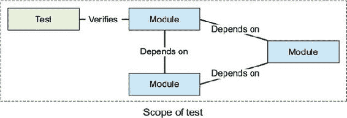
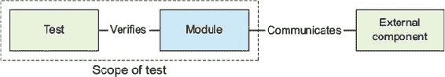
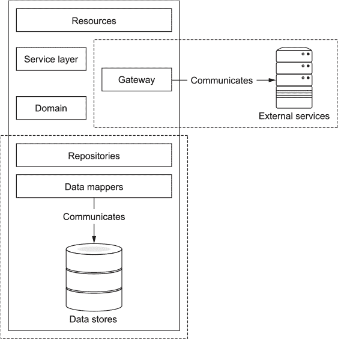
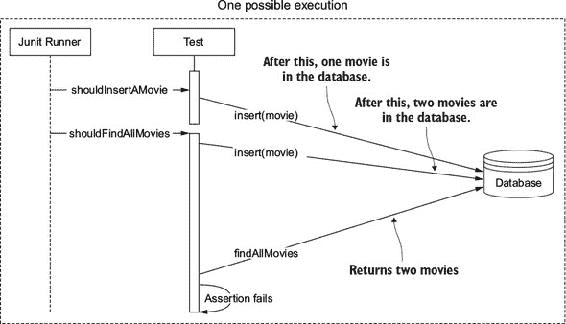
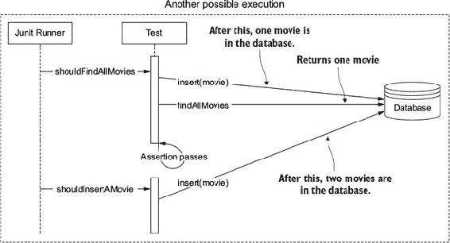
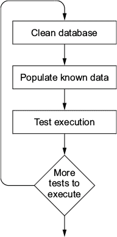
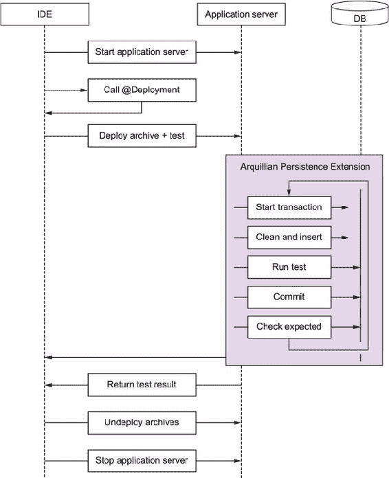
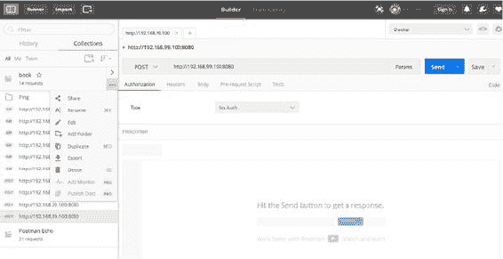

## 第五章\. 集成测试微服务

*本章涵盖*

+   在微服务架构背景下理解集成测试

+   区分集成测试和组件测试

+   为持久层和网关层编写集成测试

+   在 Arquillian 中操作多个部署

在前面的章节中，你学习了如何为基于微服务架构编写*单元*和*组件*测试。还有*集成*测试，在微服务世界中，其含义与其他架构略有不同。

集成测试检查不同模块（或类）之间的交互，通常属于同一个子系统，以验证它们在提供高级功能时是否按预期协作。集成测试还检查通过子系统执行的所有通信路径是否正确，并检测每个模块可能对同伴如何行动的预期有任何不正确的假设。

|  |
| --- |

##### 注意

通常，在面向对象语言中，一个模块被认为是一个*类*。

|  |
| --- |

通常来说，集成测试本身并不慢，但它们的速度取决于逻辑以及与被测试子系统模块的交互，这些交互会影响测试性能。由于这样的子系统通常需要一个或多个容器来运行（如 servlet 容器、CDI 容器、Spring 容器等），因此集成测试比单元测试慢，因为它们需要启动和停止所需的容器。

图 5.1 展示了集成测试可能的样子。如图所示，测试至少涉及调用一个模块（或类）及其所有相关联的同伴。此类测试的目的是验证的不是每个模块的行为，而是模块之间的通信。

##### 图 5.1\. 涉及不同模块的集成测试



在对集成测试的概念进行简要介绍之后，让我们看看集成测试如何应用于微服务架构。

### 5.1\. 微服务架构中的集成测试

你已经了解了集成测试是什么；在本节中，你将看到如何将集成测试概念应用于微服务架构。集成测试可以编写来测试任何子系统。对于微服务架构，集成测试通常集中在验证负责与外部组件（如数据存储和/或其他（微）服务）通信的子系统之间的交互。

微服务中集成测试的目标是验证子系统（或具体模块）可以正确通信，而不是测试外部元素。因此，这些测试应仅涵盖子系统与外部组件之间集成的基本成功和错误路径。

图 5.2 展示了微服务场景中集成测试的架构。你可以看到测试是如何验证一个模块（或类）可以与外部组件通信，但又不测试外部组件。

##### 图 5.2\. 微服务中的集成测试



|  |
| --- |

##### 注意

由于你正在测试微服务所属的子系统与外部服务之间的通信是否可行，因此*理想*的情况是*不*使用任何测试替身（test doubles）来模拟外部组件。

|  |
| --- |

请记住以下重要事项：

+   集成测试验证内部模块与*外部*组件（如数据库或其他（微）服务）之间的连接，而不是其他*内部*模块。

+   集成测试使用真实的外部组件来验证与真实服务的通信是否可行。

+   准备测试执行的环境可能会很困难且/或繁琐。

在我们查看具体示例之前，以下部分回顾了在微服务架构中应该使用集成测试测试微服务解剖学的哪些部分。在图 5.3 中，它们被虚线包围。

##### 图 5.3\. 在微服务架构中编写集成测试的层



#### 5.1.1\. 网关组件层

网关层包含连接到外部服务的逻辑，通常使用 HTTP/S 客户端。它们连接到系统中的另一个微服务或部署在你本地基础设施之外的服务。

集成测试负责验证服务连接以及检测任何协议问题，例如缺少 HTTP 头部、错误的 SSL 处理或请求/响应体不匹配。必须测试所有错误处理情况，以确保在出现此类条件时，服务和协议客户端的行为符合预期。

有时很难验证外部组件的异常行为，如超时或缓慢的响应。在第九章（kindle_split_018_split_000.xhtml#ch09）中，你将学习如何在不使用测试替身的情况下引发这些情况。

#### 5.1.2\. 数据映射器和仓库

仓库通过连接到数据源、在它们上执行查询以及将输出适配到领域对象模型来充当数据源的门径。集成测试负责验证数据源模式是否与代码期望的一致。在 NoSQL 数据库的情况下，这个假设尤为重要。因为它们没有模式，所以被认为是*无模式的*。你需要确保代码知道如何处理这种情况。当你使用 JPA 等对象关系映射（ORM）工具时，这些测试也让你有信心，任何在实体上配置的映射都是正确的。

现在你已经知道了如何将单元测试技术应用到微服务架构中，让我们看看你可以使用哪些工具来编写这些测试。

|  |
| --- |

##### 注意

许多用于编写集成测试的工具都可用，但本章我们将探讨的工具是目前 Java 社区最广泛采用和接受的。以下几节假设你已经阅读了 第四章，并且至少理解了 Arquillian 框架的基本知识。

|  |
| --- |

### 5.2\. 使用 Arquillian 持久化扩展进行持久化测试

为持久化层编写集成测试比简单的单元测试要复杂一些。因为存储系统中的结果都是持久的，任何测试的执行都可能通过改变数据而影响后续测试的执行。这可能会引起担忧：测试不再完全 *隔离*。它们通过数据相互连接。

在所有但少数边缘情况下，测试应该独立于外部因素以及彼此，因为一个测试执行的数据更改可能会以通常难以诊断的微妙方式导致其他测试失败。让我们看看一个简单的持久化测试中这种情况是如何发生的。假设你有一个具有两个方法的对象：一个用于创建新电影，另一个用于查找所有电影。一个可能的测试类可能如下所示：

```
@Test
public void shouldInsertAMovie() {
  Movie insertedMovie = movieRepository.insert(movie);
  assertThat(insertedMovie.getId(), notNullValue());         *1*
  //You can add more assertions here
}

@Test
public void shouldFindAllMovies() {
  movieRepository.insert(movie);
  List<Movie>; movies = movieRepository.findAllMovies();
  assertThat(movies, hasSize(1));                           *2*
}
```

+   ***1* 根据独特的约束条件，这个测试可能在第二次执行时失败。**

+   ***2* 根据执行顺序，可能已经插入了一个或多个电影。**

如你所见，这个测试是不可预测的。尽管存储库代码可能编写正确，但测试可能会根据测试执行顺序而失败。如果 `shouldInsertAMovie` 测试方法最后执行（没有保证任何执行顺序），那么 `shouldFindAllMovies` 测试方法将失败，因为数据库中没有存储电影，而预期有一个。这证实了每个测试执行在数据方面相互隔离的重要性。图 5.4 说明了导致 `shouldFindAllMovies` 测试失败的测试执行。

##### 图 5.4\. 测试执行失败



图 5.5 展示了一个假阳性场景，其中所有测试都通过。一个 *假阳性* 可能会让你产生一种虚假的安全感。你可以看到这个测试在任意一次运行中都有可能失败，但你能否立刻发现原因？

##### 图 5.5\. 测试执行成功



使用正确的工具很容易解决这个问题：你只需要在每个测试方法执行之前将数据库数据回滚到已知和可预测的状态。这意味着在每次执行之前，数据库必须通过清理/回滚之前的修改来修改；然后通过为测试插入一些已知/预期的数据来重新创建数据库到一个已知的状态。遵循此策略，每个测试都将始终找到一个具有相同数据的数据库，独立于测试执行顺序，如图 5.6 所示。

##### 图 5.6\. 安全持久化测试的生命周期



在每次测试执行之前，数据库将清除之前所做的任何数据更改。然后，插入测试预期所需的所有数据；例如，一个测试可能验证一些预期的查询结果。在此回滚之后，你可以认为数据库处于一个已知状态。它只包含你期望存在的数据，每个测试都可以以一致的方式进行执行。

即使这个解决方案也有两个方面使其不完美并且可以改进：

+   维护数据库到一个已知状态涉及大量的样板代码，这些代码将在每个持久化测试之前重复。

+   没有标准机制来插入数据，因此你可能不得不反复编写 SQL 语句。

幸运的是，*Arquillian 持久化扩展*极大地改善了使用 Arquillian 编写持久化测试。Arquillian 持久化扩展可以帮助你正确地编写持久化测试。它提供了以下功能：

+   每个测试都包含在一个独立的交易中

+   使用 DbUnit 在类或方法级别进行数据库初始化

+   支持 SQL、JPA、NoSQL 等更多

+   支持 XML、Excel（XLS）、YAML 和 JSON 数据集格式

+   在每个测试方法执行之前清理数据库

+   使用 SQL 文件直接进行自定义

+   使用已知最终数据集在每次测试结束时比较数据库状态，这也支持列排除

+   统一程序性（DSL）和声明性（注解）的数据初始化方式

此扩展可以帮助你避免为每个测试编写大量的样板代码。

#### 5.2.1\. 声明式方法

使用 Arquillian 持久化扩展编写的测试可能看起来像以下这样：

```
@RunWith(Arquillian.class)                                       *1*
public class GamesPersistenceTest {

    @Deployment                                                  *2*
    public static WebArchive createDeploymentPackage() {}

    @EJB                                                         *3*
    Games gamesService;

    @Resource
    javax.transaction.UserTransaction userTransaction;

    @Test
    @UsingDataSet("datasets/games.yml")                          *4*
    public void shouldFindAllGames() {}

    @Test
    @ApplyScriptBefore("scripts/drop-referential-integrity.sql") *5*
    @ShouldMatchDataSet("datasets/expected-games.yml")           *6*
    public void shouldInsertGames() {}
}
```

+   ***1* 将测试定义为 Arquillian 测试**

+   ***2* 定义要使用的 ShrinkWrap 部署文件**

+   ***3* 注入任何 EJB 或甚至 UserTransaction**

+   ***4* 在执行测试方法之前用指定数据填充数据库**

+   ***5* 在执行测试方法之前应用给定的 SQL 脚本**

+   ***6* 验证在执行测试方法之后数据库内容是否与文件中定义的一致**

注意，Arquillian 持久化扩展严重依赖于注解，这意味着你不需要在测试中编写任何样板代码。只需让扩展为你维护数据库到一个已知状态。

在示例中，使用 YAML 格式来填充和验证数据库。对于 YAML 数据集，文档最左侧的元素是表名。此元素可以包含一个元素列表（或数组）。YAML 中每个元素的列表用连字符（`-`）符号表示。每个元素是数据库中的一行。最后，每个元素包含表示列名和值的属性：

```
table1:
  - column1: value1
    column2: value2
  - column1: value3
    column2: value4
table2:
```

此示例定义了两个表。在 `table1` 中插入两行，向 `column1` 和 `column2` 添加值。

|  |
| --- |

##### 注意

您可以使用 `null` 关键字显式地为给定列设置 `null` 值。例如，`producedBy: "[null]"`。

|  |
| --- |

在 图 5.7 的时序图中，您可以看到当执行 Arquillian 持久化扩展测试时内部发生的情况。首先，启动您选择的应用程序服务器，并且通过 ShrinkWrap 打包由部署方法定义的存档并部署。然后，测试开始执行，并且以下步骤为每个测试方法发生：

##### 图 5.7\. Arquillian 持久化扩展生命周期



> **1**. 数据库被清理，以确保之前的执行不会影响当前的测试方法。
> 
> **2**. 整个测试在事务中执行。
> 
> **3**. 如果存在 `@UsingDataSet` 注解，数据库将使用已知数据集进行初始化。
> 
> **4**. 执行测试主体。
> 
> **5**. 如果存在 `@ShouldMatchDataSet` 注解，则验证数据库的最终状态。

在执行所有测试之后，部署文件将被卸载，并且应用程序服务器将被终止。

您现在知道如何为 SQL 系统编写持久化测试。让我们看看如何为 NoSQL 数据库执行此操作。

#### 5.2.2\. 编程方法

您已经看到了如何通过使用注解来使用一些数据填充您贫血的环境。Arquillian 持久化扩展还允许您使用编程方法来填充数据。这种方法仅在以客户端模式使用 Arquillian（或使用 `standalone` 依赖项）时有效。编程方法的一个重要方面是您可以使用 Arquillian 运行器（`@RunWith(Arquillian.class)`）或者，作为替代，注册一个 *JUnit 规则*（`@Rule public ArquillianPersistenceRule arquillianPersistenceRule = new ArquillianPersistenceRule();`）。

|  |
| --- |

##### 注意

在撰写本文时，注解方法只能与 DbUnit 一起使用。

|  |
| --- |

##### 标准关系型数据库管理系统

支持两种不同的技术来填充关系型数据库中的数据。第一种是前面章节中介绍的 DbUnit，第二种是 *Flyway*，这是一个用于描述数据库迁移的 Java 工具。

让我们通过 DbUnit 的一个示例来查看：

```
@RunWith(Arquillian.class)
public class DbUnitTest {

  @DbUnit                                                                   *1*
  @ArquillianResource
  RdbmsPopulator rdbmsPopulator;

  @Test
  public void should_find_all_persons() {
    rdbmsPopulator.forUri(URI.create("jdbc:h2:mem:test;DB_CLOSE_DELAY=-1")) *2*
        .withDriver(Driver.class)
        .withUsername("sa")
        .withPassword("")
        .usingDataSet("test.json")
        .execute();                                                         *3*

    // Testing part

    rdbmsPopulator.forUri(URI.create("jdbc:h2:mem:test;DB_CLOSE_DELAY=-1"))
        .withDriver(Driver.class)
        .withUsername("sa")
        .withPassword("")
        .usingDataSet("test.json")
        .clean();                                                           *4*
  }
}
```

+   ***1* 设置 DbUnit 作为后端的 DbUnit 注解**

+   ***2* 配置 JDBC 连接，使用提供的数据集更新数据库**

+   ***3* 使用提供的数据集更新数据库**

+   ***4* 在下一次执行之前清理数据库**

如你所见，这个测试与任何其他 Arquillian 测试非常相似，只有一个细微的差别：测试通过添加一个`RdbmsPopulator`实例来丰富。该实例负责为所需的 RDBMS 后端填充数据集。DbUnit 填充器被注入到测试中，并且位于类路径根目录的 test.json 文件被用来初始化给定的 SQL 数据库实例。以类似的方式，你可以通过注解一个字段为`@Flyway`来使用 Flyway，它指向数据集迁移目录。

##### NoSQL 系统

接下来，让我们看看如何使用相同的方法来填充 NoSQL 数据库的数据集。Arquillian 持久化扩展在底层使用*NoSQLUnit*来处理数据集格式和填充数据。（我们将在本章后面更深入地介绍这个主题。）目前，你需要知道的是，NoSQLUnit 类似于 DbUnit，但适用于 NoSQL 数据库。

目前，Arquillian 持久化扩展支持以下 NoSQL 数据库：Couchbase、MongoDB、Vault 和 Redis。以下示例使用 MongoDB：

```
@RunWith(Arquillian.class)
public class MongoDbTest {

  @MongoDb                                     *1*
  @ArquillianResource
  NoSqlPopulator populator;

  @Test
  public void should_populate_mongodb() {

    populator.forServer("localhost", 27017)    *2*
              .withStorage("test")
              .usingDataSet("books.json")
              .execute();                      *3*

    // Testing part

    populator.forServer(hostIp, port)
        .withStorage("test")
        .clean();                              *4*

  }

}
```

+   ***1* 设置 MongoDB 作为后端的 MongoDB 注解**

+   ***2* 配置 MongoDB 连接**

+   ***3* 使用提供的数据集更新数据库**

+   ***4* 在下一次执行前清理数据库**

这个测试与 SQL 数据库的测试类似。测试通过添加一个`NoSqlPopulator`实例来丰富，该实例负责为所需的 NoSQL 后端填充数据集。MongoDB 填充器被注入到测试中，并且位于类路径根目录的 books.json 文件被用来初始化指定的 NoSQL 数据库实例。

以类似的方式，你可以配置你的测试以使用任何其他支持的 NoSQL 数据库。

|  |
| --- |

##### 注意

每个支持的填充器都有自己的工件。例如，要使用 MongoDB 填充器，你需要在构建脚本中注册`org.arquillian.ape:arquillian-ape-nosql-mongodb`工件。

|  |
| --- |

##### REST 服务

你已经学会了如何在执行测试之前将数据填充到持久存储中，以及如何在执行后清理环境。在微服务架构中，服务 A 通常调用服务 B 以获取数据是很常见的。在这种集成测试中，你需要在测试服务 A 的*网关*之前向服务 B 填充一些数据。Arquillian 持久化扩展也支持这种测试场景，使用与前面章节相同的方法。

对于 REST 服务，Postman ([www.getpostman.com](http://www.getpostman.com)) Collection Format v2 ([`schema.getpostman.com/json/collection/v2.0.0/docs/index.html`](https://schema.getpostman.com/json/collection/v2.0.0/docs/index.html)) 是用于设置要执行的操作数据集的格式。

|  |
| --- |

**关于 Postman**

Postman 是一个 GUI 程序，允许您开发并测试（REST）API。它还支持从不同的格式（如 RAML 和 Swagger）导入 REST 定义。

在 Postman 中，集合是存储单个请求和响应的主要地方，以便可以组织以准确反映 API。从用户的角度来看，一个*集合*是一组可以逐个或全部执行的请求。一个集合可以导出为遵循[`schema.getpostman.com`](https://schema.getpostman.com)中定义的 JSON 模式的 JSON 文件。

| |
| --- |

Arquillian 持久性扩展用于 REST 服务读取遵循 Collection v2 格式的 JSON 文件，并使用所有定义的请求对指定的服务进行响应。要创建此文件，您可以遵循两种可能的方法：

+   从头开始创建一个遵循 Collection v2 模式的 JSON 文件。

+   使用 Postman 创建一个集合，并导出它（见图 5.8）。我们推荐使用这种方法，因为它是最简单、最快创建文件的方式。

##### 图 5.8. 导出集合的示例



让我们看看一个使用 Postman 集合向服务填充 Hello 消息的示例。

##### 列表 5.1. `PostmanTest`

```
@RunWith(Arquillian.class)
public class PostmanTest {

  @Postman                                      *1*
  @ArquillianResource
  RestPopulator populator;

  @Test
  public void should_get_messages() {

    populator.forServer("example.com", 8080)    *2*
        .usingDataSets("message.json")
        .execute();                             *3*

    // Testing part

  }
}
```

+   ***1. 将 Postman 设置为后端以填充数据***

+   ***2. 配置要更新的服务位置***

+   ***3. 向配置的服务发送 REST 调用***

此测试类似于数据库的测试。它通过一个负责为所需服务填充数据集的`RestPopulator`实例进行了丰富。Postman 填充器被注入到测试中，并且位于类路径根目录的 message.json Postman 集合文件被用来对配置的服务重放文件中定义的所有请求。

下一个展示的是 message.json 文件。

##### 列表 5.2. message.json

```
{
  "variables": [],
  "info": {
    "name": "Messenger",
    "_postman_id": "1803c743-318a-8751-b982-4f9475a00cea",
    "description": "",
    "schema": "https://schema.getpostman.com/json/collection/v2.0.0/collectio
     n.json"
  },
  "item": [
    {
      "name": "My message",
      "request": {
        "url": "http://localhost:8080/message",
        "method": "POST",
        "header": [
          {
            "key": "Content-Type",
            "value": "text/plain",
            "description": ""
          }
        ],
        "body": {
          "mode": "raw",
          "raw": "Message in a Bottle"
        },
        "description": ""
      }
    }
  ]
}
```

这个集合只包含一个请求（但可以包含多个列表），名称为`My message`。这将在指定的`url`上创建一个带有`Content-Type`头为`text/plain`和正文内容`Message in a Bottle`的`POST`请求，该请求在调用`RestPopulator`类的`execute`方法时执行。

| |
| --- |

##### 注意

在此示例中，URL 字段指向`localhost`。同时，测试指向 example.com。这是可以的，因为 Arquillian 持久性扩展会根据`RestPopulator`中配置的来适配请求的`url`字段（主机和端口）。因此，在 message.json 请求中，运行时将 http://localhost:8080/message 替换为 http://example.com:8080/message。

| |
| --- |

现在您已经看到了如何使用 Arquillian 持久性扩展，让我们更深入地了解 NoSQLUnit 是如何工作的。

#### 5.2.3. 使用 NoSQLUnit 进行持久性测试

在 NoSQL 数据库中，你面临与 SQL 数据库相同的问题，包括隔离问题。由于 NoSQL 数据库从测试生命周期的角度来看是持久的（尽管分布式缓存通常不是持久的），这些测试仍然需要管理数据库，以便将其恢复到已知状态。

要为 NoSQL 数据库编写持久化测试，有一个与 DbUnit 相当的项目，称为 NoSQLUnit。NoSQLUnit 是一个 JUnit 扩展，它帮助你按照 DbUnit 采取的相同方法编写 NoSQL 持久化测试，但适应了常见的 NoSQL 数据库。它具有以下功能：

+   管理数据库的生命周期，包括启动和停止周期。

+   在类或方法级别上初始化数据库。由于 NoSQL 空间的异构性，每个实现都有自己的格式。

+   在每个测试方法执行之前清理数据库。

+   使用已知的最终数据集比较每个测试结束时的数据库状态，并支持列排除。

+   支持 Cassandra、Couchbase、CouchDB、Elasticsearch、HBase、Infinispan、MongoDB、Vault、Neo4J 和 Redis。

再次强调，NoSQLUnit 可以帮助你避免为每个测试编写大量的样板代码。以下列表显示了一个使用 NoSQLUnit 编写的示例测试。

##### 列表 5.3\. CommentsPersistenceTest.java

```
public class CommentsPersistenceTest {

  @ClassRule
  public static InMemoryMongoDb inMemoryMongoDb =
        newInMemoryMongoDbRule().build();                      *1*

  @Rule
  public MongoDbRule embeddedMongoDbRule = newMongoDbRule()
        .defaultEmbeddedMongoDb("test");                       *2*

  @Test
  @UsingDataSet(locations="initialData.json")                  *3*
  @ShouldMatchDataSet(location="expectedData.json")            *4*
  public void shouldInsertComment() {}

}
```

+   ***1* 启动 MongoDB（FongoDB 项目）的内存实例**

+   ***2* 配置用于测试的数据库连接**

+   ***3* 在每个测试之前将 JSON 文档填充到 MongoDB 实例中**

+   ***4* 验证测试方法执行后数据库的内容是否符合文件定义**

对于 MongoDB，NoSQLUnit 预期一个具有以下模式的 JSON 文件来填充和验证数据：

```
{
   "collection1":{              *1*
      "indexes":[               *2*
         {
            "index":{           *3*
               "code":1
            }
         }
      ],
      "data":[                  *4*
         {
            "id":1,
            "code":"JSON dataset"
         },
         {
            "id":2,
            "code":"Another row"
         }
      ]
   }
}
```

+   ***1* 指定文档存储的集合**

+   ***2* 为集合注册索引**

+   ***3* 为代码字段定义一个索引**

+   ***4* 存储原始 JSON 文档的数组**

任何根元素都代表一个可以插入文档的集合；在这种情况下，定义了集合 `collection1`。之后，你定义一个包含两种文档的数组：一种定义在集合中创建哪些索引，以及存储在集合中的原始 JSON 文档数组。

注意 NoSQLUnit 在执行每个测试方法之前清理数据库，然后使用给定数据填充数据库的方法与 Arquillian 持久化扩展类似。它还可以验证在测试方法执行后数据库的状态是否符合预期。

|  |
| --- |

##### 注意

没有任何阻止你在 Arquillian 运行器之外使用 NoSQLUnit 独立版本（使用 NoSQLUnit JUnit 运行器）。但我们鼓励你将 Arquillian 持久化扩展与 NoSQLUnit 一起使用。

|  |
| --- |

现在您已经看到了如何使用 NoSQLUnit 与 MongoDB 一起使用。但每个 NoSQL 数据库都是不同的，很容易看出，与 Neo4J 这样的图数据库相比，MongoDB 的数据模型完全不同：一个处理节点及其之间的关系，而另一个在“桶”中存储数据。

接下来，让我们看看 NoSQLUnit 如何与 Redis 一起工作。第一步是配置一个 Redis 连接。与上一个示例中使用嵌入式连接不同，您将直接连接到一个已经运行的 Redis 实例。

##### 列表 5.4\. RedisPersistenceTest.java

```
public class RedisPersistenceTest {

  @Rule                                                  *1*
  public RedisRule redisRule = new RedisRule(
            RemoteRedisConfigurationBuilder.newRemoteRedisConfiguration()
              .host("192.168.1.1")
            .build());                                   *2*

  @Test
  @UsingDataSet(locations="initialData.json")            *3*
  public void shouldGetData() {}

}
```

+   ***1* 定义连接细节的规则**

+   ***2* 连接到一个已经运行的 Redis 服务**

+   ***3* 填充给定数据**

当使用 Redis 时，NoSQLUnit 期望一个 JSON 文件，其模式如下，用于填充和验证数据：

```
{
"data":[
        {"simple": [                                           *1*
            {
                "key":"key1",
                "value":"value1"
            }
            ]
        },
        {"list": [{                                            *2*
                    "key":"key3",
                    "values":[
                        {"value":"value3"},
                        {"value":"value4"}
                    ]
                  }]
        },

        {"sortset": [{                                         *3*
                  "key":"key4",
                  "values":[
                        {"score":2, "value":"value5" },
                        {"score":3, "value":1 },
                        {"score":1, "value":"value6" }]
              }]
        },
        {"hash": [                                             *4*
                    {
                        "key":"user",
                        "values":[
                            {"field":"name", "value":"alex"},
                            {"field":"password", "value":"alex"}
                        ]
                    }
                ]
        },
        {"set":[{                                              *5*
                    "key":"key3",
                    "values":[
                        {"value":"value3"},
                        {"value":"value4"}
                    ]
                  }]
        }
]
}
```

+   ***1* 简单的键/值**

+   ***2* 键和值列表**

+   ***3* 按分数排序的键和值集合**

+   ***4* 包含键/值元素的哈希**

+   ***5* 包含唯一值的键集合**

根元素必须命名为`data`。根据您需要存储的结构化数据类型，根元素后面应跟一个或多个子元素。`key`字段设置元素的键，`value`字段用于设置值。您可以存储以下类型的元素：

+   `simple`—包含一个简单的键/值条目数组。

+   `list`—包含一个`key`字段用于键名和一个`value`字段，其中包含一个值数组。

+   `set`—在集合中存储一个键（不允许重复）。结构与`list`元素相同。

+   `sortset`—在排序集合中存储一个键。每个值还有一个`score`字段，其类型为`Number`，用于指定其在排序集合中的顺序。

+   `hash`—在字段/值映射中存储一个键。`field`字段设置字段名称，`value`设置字段的值。

显然，根据定义的 NoSQL 数据库，数据填充文件可能非常不同。

现在我们已经介绍了两种用于编写数据映射器和存储库测试的技术，让我们看看另外两种将帮助您执行网关的集成测试。

#### 5.2.4\. 使用 Arquillian 多部署进行持久性测试

到目前为止，本书中的每个测试类都有自己的部署方法。但当你编写网关组件的集成测试时，您可能需要部署两个存档：一个包含网关类及其相关类，另一个包含网关连接到的服务。

当然，只有当您能够将测试部署到其他微服务时，您才能有多个部署。例如，如果您正在与一个位于您项目控制之外的外部服务通信，例如 YouTube 或 IGDB 网站，您需要直接使用该外部服务。

此外，有时一个服务无法使用 Arquillian 进行部署；可能是因为它不是用 Java 编写的，或者它是由外部团队编写的，您没有访问权限，因此无法部署它。在这些情况下，您需要使用一个已部署服务的预发布服务器，以测试网关对真实服务的测试。

到目前为止的示例都使用了单个部署进行测试。Arquillian 允许每个测试类有多个部署，并且还允许您在每个测试方法上操作多个部署。`@Deployment`注解有一个在多部署使用中必需的属性：`name`。为存档设置自己的名称将覆盖默认的`DEFAULT`值。`order`属性在针对多个部署进行测试时也可能很有用；它定义了部署发送到容器的顺序，如果顺序很重要。您还需要使用`@OperateOnDeployment` Arquillian 注解来指定测试使用的部署上下文。此注解接受一个字符串，该字符串必须与`@Deployment`注解中指定的名称匹配。

这里是一个多部署的例子：

```
@Deployment(name = "X", order = 1)                              *1*
public static WebArchive createDep1() {}

@Deployment(name = "Y", order = 2)                              *2*
public static WebArchive createDep2() {}

@ArquillianResource @OperateOnDeployment("X")                   *3*
private URL firstDeployment

@Test @OperateOnDeployment('X')                                 *4*
public void test(@ArquillianResource @OperateOnDeployment("Y")
                    URL secondDeployment) {}                    *5*
```

+   ***1* 部署第一个部署文件**

+   ***2* 部署第二个部署文件**

+   ***3* 首次部署的 URL**

+   ***4* 在 X 部署上下文中运行的测试**

+   ***5* 第二次部署的 URL**

在这里，两个存档被部署到应用程序服务器。随后，您可以使用`@OperateOnDeployment`注解通过它们部署的`URL`引用每个存档，或者为测试选择部署上下文。

|  |
| --- |

##### 警告

Arquillian 多部署仅在您为所有部署工件使用相同容器时才有效。您不能在同一个测试中混合两个或更多不同的容器。如果您为每个微服务使用不同的应用程序服务，这是一个限制；如果您使用相同的应用程序服务，则可以使用这种方法为网关应用程序编写集成测试。

|  |
| --- |
|  |

##### 注意

您可以使用 Arquillian 多部署来测试集群功能或集群的配置。

|  |
| --- |

Arquillian 多部署对于编写验证两个服务之间通信的集成测试非常有用。但另一个 Arquillian 特性可能有助于您测试网关组件对其他服务的测试：一个 Arquillian 序列。

#### 5.2.5\. 使用 Arquillian 序列进行持久性测试

有时候，当您为与另一个服务通信的网关编写测试时，您可能想要设置集成测试的执行顺序。一个典型的例子是身份验证：在访问外部服务之前，您可能需要对其进行身份验证。因此，似乎登录服务的测试应该在任何其他测试之前执行。测试依赖于执行顺序。

有许多不同的策略来解决这个问题，但在 Arquillian 中，您可以使用 `InSequence` 注解。`InSequence` 强制 JUnit 测试的方法执行顺序。它接收一个整数作为参数，该参数表示每个测试方法的执行顺序：

```
@Test
@InSequence(1)                *1*
public void login() {}

@Test
@InSequence(2)
public void logout() {}
```

+   ***1* 设置执行顺序**

此示例使用 `@InSequence` 首先执行 `login` 测试，然后执行 `logout` 测试。

|  |
| --- |

##### 注意

您可以从您的 IDE 中单独运行 `login` 和 `logout` 测试。当完整测试类执行时，`InSequence` 注解非常有用。

|  |
| --- |

现在您已经熟悉了集成测试工具，让我们看看您需要做什么才能开始使用它们。

#### 5.2.6\. 构建脚本修改

要使用 Arquillian Persistence Extension 或 NoSQLUnit，您需要在您的构建脚本中将它们定义为测试依赖项。在 Gradle 的情况下，此信息位于 `dependencies` 块中。

要使用 Arquillian 多部署或 `@InSequence` 注解，您不需要添加额外的依赖项——只需 Arquillian 依赖项，因为此功能来自 Arquillian 核心。正如您在 第四章 中所看到的，要使用 Arquillian，您需要注册一个 Arquillian BOM 文件和一个 Arquillian JUnit 依赖项；如果您使用 WildFly Swarm，您需要添加 WildFly Swarm Arquillian 扩展。在添加 Arquillian 作为依赖项后，您就可以开始编写 Arquillian 测试并使用多部署和序列功能。

如果您需要为 SQL 持久层编写集成测试，您必须添加 Arquillian Persistence Extension 依赖项：

```
dependencies {
  testCompile group: 'org.jboss.arquillian.extension',
              name: 'arquillian-persistence-dbunit',
              version: '1.0.0.Alpha7'
}
```

最后，为了编写 NoSQL 数据库的集成测试，您需要添加 NoSQLUnit 依赖项。因为 NoSQL 数据库根据定义是异构的，每个 NoSQLUnit 支持的数据库都有自己的依赖项。这是 MongoDB 的依赖项：

```
dependencies {
  testCompile 'com.lordofthejars:nosqlunit-mongodb:1.0.0-rc.5'
}
```

这是 Redis 的依赖项：

```
dependencies {
  testCompile 'com.lordofthejars:nosqlunit-redis:1.0.0-rc.5'
}
```

一旦在构建脚本中注册了依赖项，您就可以开始编写存储库和网关的集成测试。

### 5.3\. 为 Gamer 应用程序编写集成测试

在本节中，您将为 Gamer 应用程序编写集成测试。通常，单元测试是在事实上的测试目录 src/test/java 中创建的。对于集成测试，您可以遵循三种不同的策略：

+   在 src/test/java 中创建一个特殊的包，例如，`integration-tests`。

+   在项目中创建另一个源文件夹，例如，src/integrationTests/java。

+   在主项目中创建一个新的模块/子项目，例如，`integration-tests`。

这些策略中的每一个都有其优缺点，可能需要您修改您的构建脚本。我们没有关于哪种策略最好的强烈意见；这取决于您的团队感到舒适的程度。在这本书中，您将使用第一种和第三种策略，因为它们是最常见且最容易与构建工具集成的。

#### 5.3.1\. 测试 Comments 类

让我们看看如何编写 `book.comments.boundary.Comments` 类的集成测试。这个简单的类，如下一列表所示，实现了在 MongoDB 中存储评论和从 MongoDB 获取带评分的评论的逻辑（code/comments/src/main/java/book/comments/boundary/Comments.java）。它还从 resources.xml 文件中提供的配置创建 MongoDB 连接。

##### 列表 5.5\. `Comments` 类

```
@Dependent
public class Comments {

    private static final String COMMENTS_COLLECTION = "comments";
    private static final String MATCH = "{$match:{gameId: %s}}";
    private static final String GROUP = "{ $group : " + "          " +
            "  { _id : \"$gameId\", " + "            comments: { " +
            "$push: \"$comment\" }, " + "            rate: { $avg: " +
            "\"$rate\"} " + "            count: { $sum: 1 } " + "  " +
            "          }" + "}";

    @Resource(name = "mongodb")
    private MongoClientProvider mongoDbProvider;

    private MongoCollection<Document>; commentsCollection;

    @PostConstruct
    public void initComentsCollection() {
        commentsCollection = mongoDbProvider.getMongoClient()
                .getDatabase(mongoDbProvider.getDatabase())
                .getCollection(COMMENTS_COLLECTION);
    }

    public String createComment(final Document comment) {
        commentsCollection.insertOne(comment);
        return comment.getObjectId("_id").toHexString();
    }

    public Optional<Document>; getCommentsAndRating(final int gameId) {
        final AggregateIterable<Document>; result =
                commentsCollection.aggregate
                        (createAggregationExpression(gameId));
        return Optional.ofNullable(result.first());
    }

    private java.util.List<Document>; createAggregationExpression
            (final int gameId) {
        return Arrays.asList(Document.parse(String.format(MATCH,
                gameId)), Document.parse(GROUP));
    }

}
```

列表 5.6 展示了对 `createComment` 逻辑的测试（code/comments/i-tests/src/test/java/book/comments/CommentsTest.java）。在这个持久性测试中，你需要三个元素：

+   一个正在运行的 MongoDB 实例。它可以手动启动或使用构建脚本启动。在 第八章 中，你将了解另一种使用 Docker 的方法。

+   一个空的 MongoDB `comments` 集合，用于插入数据。在空集合中创建一个文档很重要，以避免任何约束违规的可能性。

+   预期数据集，以验证 `comments` 集合具有预期数据。

##### 列表 5.6\. 测试 `createComment` 逻辑

```
@RunWith(Arquillian.class)                                               *1*
public class CommentsTest {

    @Deployment
    public static WebArchive createDeployment() {
        final WebArchive webArchive = ShrinkWrap.create(WebArchive
                .class).addClasses(Comments.class,
                MongoClientProvider.class).addAsWebInfResource
                (EmptyAsset.INSTANCE, "beans.xml").addAsLibraries(       *2*
                Maven.resolver().resolve("org" +
                        ".mongodb:mongodb-driver:3.2.2", "com" +
                        ".lordofthejars:nosqlunit-mongodb:0.10.0")
                        .withTransitivity().as(JavaArchive.class))
                .addAsWebInfResource("resources-test.xml",
                        "resources.xml")                                 *3*
                .addAsWebInfResource("expected-insert-comments" +
                        ".json",
                        "classes/book/comments/expected-insert" +
                                "-comments.json");                       *4*

        return webArchive;
    }

    @Rule                                                                *5*
    public MongoDbRule remoteMongoDbRule = new MongoDbRule(mongoDb
            ().databaseName("test").host("localhost").build());

    @Inject                                                              *6*
    private Comments comments;

    @Test
    @UsingDataSet(loadStrategy = LoadStrategyEnum.DELETE_ALL)            *7*
    @ShouldMatchDataSet(location = "expected-insert-comments.json")      *8*
    public void shouldInsertAComment() {
        final Document document = new Document("comment", "This " +
                "Game is Awesome").append("rate", 5).append
                ("gameId", 1);

        comments.createComment(document);
    }

}
```

+   ***1* 将测试设置为 Arquillian 测试**

+   ***2* 添加 NoSQLUnit 库存档，因为测试是在容器上执行的**

+   ***3* 将 MongoDB 测试配置文件 resources-test.xml 重命名为正确的名称和位置**

+   ***4* 将预期数据集添加到包中**

+   ***5* 注册 NoSQLUnit MongoDB 规则**

+   ***6* 将注释边界类注入到测试中**

+   ***7* 在执行测试之前清理 MongoDB 数据库**

+   ***8* 在注释集合中设置预期数据**

关于持久性测试需要注意以下事项：

+   这是一个正常的 Arquillian 测试，它执行 NoSQLUnit JUnit 规则。

+   测试是在容器端执行的，这意味着你必须将所有需要的添加到 `WebArchive` 的类路径中。

+   `UsingDataSet` 和 `ShouldMatchDataSet` 通过断言测试始终处于已知/期望的状态来简化持久性状态的管理。

预期数据集如下所示（code/comments/i-tests/src/test/resources/expected-insert-comments.json）。

##### 列表 5.7\. 数据集

```
{
  "comments": [
      {
        "comment" : "This Game is Awesome",
        "rate": 5,
        "gameId": 1
      }
    ]
}
```

在这里，你设置测试执行后 MongoDB 数据库的期望状态。在这种情况下，数据库应包含一个名为 `comments` 的集合，该集合包含一个具有以下三个属性的文档：

+   `comment`，其值为 `"This Game is Awesome"`。

+   `rate`，其值为 `5`

+   `gameId`，其值为 `1`

执行测试后，如果 MongoDB 数据库处于给定的状态，则测试将成功；如果不处于该状态，则测试将失败。

#### 5.3.2\. 测试 CommentsGateway 类

现在，让我们看看如何为`book.aggr.CommentsGateway`类编写集成测试。这个类，如列表 5.8 所示，是一个简单的`boundary`类，充当聚合服务与评论服务之间的网关（code/aggregator/src/main/java/book/aggr/CommentsGateway）。它负责与评论服务通信，以创建新评论或获取有关它们的详细信息。

|  |
| --- |

##### 注意

HK2 是一个轻量级、动态的 DI 框架，可以与 Jersey 一起使用。

|  |
| --- |

##### 列表 5.8\. `CommentsGateway`类

```
@Service                                                                 *1*
public class CommentsGateway {

    public static final String COMMENTS_SERVICE_URL =
            "COMMENTS_SERVICE_URL";
    private Client client;
    private WebTarget comments;

    public CommentsGateway() {                                           *2*

        String commentsHost = Optional.ofNullable(System.getenv
                (COMMENTS_SERVICE_URL))                                  *3*
                .orElse(Optional.ofNullable(System.getProperty
                        ("COMMENTS_SERVICE_URL")).orElse
                        ("http://localhost:8282/comments-service/"));
        initRestClient(commentsHost);
    }

    void initRestClient(final String host) {
        this.client = ClientBuilder.newClient().property("jersey" +
                ".config.client.connectTimeout", 2000).property
                ("jersey.config.client.readTimeout", 2000);
        this.comments = this.client.target(host);
    }

    public Future<Response>; createComment(final JsonObject comment)
    {                                                                    *4*
        return this.comments.path("comments").register
                (JsonStructureBodyWriter.class)                          *5*
                .request(MediaType.APPLICATION_JSON).async()             *6*
                .post(Entity.entity(comment, MediaType
                        .APPLICATION_JSON_TYPE));                        *7*
    }

    public Future<JsonObject>; getCommentsFromCommentsService(final
                                                             long gameId) {
        return this.comments.path("comments/{gameId}")
                .resolveTemplate("gameId", gameId).register
                        (JsonStructureBodyReader.class).request
                        (MediaType.APPLICATION_JSON).async().get
                        (JsonObject.class);
    }

    @PreDestroy
    public void preDestroy() {
        if (null != client) {
            client.close();
        }
    }
}
// end:test[]
```

+   ***1* 标注在要自动添加到 HK2 的类上**

+   ***2* 建立与评论服务的连接**

+   ***3* 获取连接到评论服务的 URL**

+   ***4* 创建一条评论**

+   ***5* 注册一个 marshaller 以将 JsonObject 转换为 JSON**

+   ***6* 执行一个异步调用，该调用返回 java.util.concurrent.Future 类**

+   ***7* 执行一个 POST 请求**

让我们为`createComment`方法编写一个测试：请参阅列表 5.9（code/aggregator/i-tests/src/test/java/book/aggr/CommentsGatewayTest.java）。请注意，在这种情况下，你需要执行以下操作：

> **1**.  在 Tomcat 中部署评论服务。
> 
> **2**.  启动一个 MongoDB 实例，因为它是该服务使用的存储服务器。
> 
> **3**.  从聚合服务执行针对`CommentsGateway`类的测试。

理想情况下，这个测试应该部署两个工件：评论服务部署在其应用程序服务器（Apache Tomcat）中；从聚合器来看，`CommentsGateway`应该部署在其应用程序服务器（Apache TomEE）中。这似乎非常适合 Arquillian 的多部署功能。

问题在于在这种情况下你不能使用该功能。聚合服务运行在 Apache Tomcat 服务器上，而评论服务运行在 Apache TomEE 服务器上——Arquillian 多部署仅在所有部署使用相同服务器时才有效。尽管存在这种限制，你可以在客户端模式下使用 Arquillian，并在自己的服务器（Apache TomEE）上部署整个评论服务，同时也可以在客户端模式下使用`CommentsGateway`而不是部署它。

这个测试具有以下功能：

+   一个带有`testable`属性设置为`false`的`@Deployment`方法，以便测试以客户端模式运行

+   部署整个应用程序，而不是微部署

+   使用`CommentsGateway`类的测试

##### 列表 5.9\. 测试`createComment`方法

```
@RunWith(Arquillian.class)
public class CommentsGatewayTest {

    @Deployment(testable = false)                                     *1*
    public static WebArchive createCommentsDeployment() {
        return ShrinkWrap.create(EmbeddedGradleImporter.class,
                CommentsGatewayTest.class.getName() + ".war")         *2*
                .forProjectDirectory("../../comments")
                .importBuildOutput().as(WebArchive.class);
    }

    @ArquillianResource                                               *3*
    private URL url;

    @Test
    public void shouldInsertCommentsInCommentsService() throws
            ExecutionException, InterruptedException {

        final JsonObject commentObject = Json.createObjectBuilder()
                .add("comment", "This Game is Awesome").add("rate",
                        5).add("gameId", 1234).build();

        final CommentsGateway commentsGateway = new CommentsGateway
                ();                                                   *4*
        commentsGateway.initRestClient(url.toString());

        final Future<Response>; comment = commentsGateway
                .createComment(commentObject);

        final Response response = comment.get();
        final URI location = response.getLocation();

        assertThat(location).isNotNull();
        final String id = extractId(location);

        assertThat(id).matches("[0-9a-f]+");                          *5*

    }

}
```

+   ***1* 将测试设置为客户端模式**

+   ***2* 通过在评论服务中运行 Gradle assemble 任务来构建一个工件**

+   ***3* 注入评论服务部署的 URL**

+   ***4* 实例化一个新的 CommentsGateway 类，并执行创建方法**

+   ***5* 断言返回的 ID 是 MongoDB 对象 ID**

这个测试在客户端模式下运行。这意味着 Arquillian 将测试存档“原样”部署到容器中，并在与测试运行器相同的 JVM 中运行测试。

测试还演示了另一种使用 ShrinkWrap 项目的途径。在前一章中，你看到了如何使用 ShrinkWrap 创建微部署（只包含应用程序部分的应用程序部署文件）。但在这个例子中，你通过使用 `EmbeddedGradleImporter` 动态创建项目。使用 `EmbeddedGradleImporter`，你设置 build.gradle 文件所在的根目录，ShrinkWrap 负责调用 Gradle 任务来组装项目，并将其作为有效的存档返回。默认情况下，它忽略测试步骤，以避免可能的无穷递归。

如果项目将由 Maven 管理，你也可以使用 `MavenImporter` 类。

|  |
| --- |

##### 小贴士

你可以使用 *Maven 解析器* 从你的工件仓库中解析工件，而不是每次都构建它。这样的调用示例是 `Maven.resolver().resolve("org.gamer:game-aggregator:war:1.0.0").withTransitivity().as(WebArchive.class);`。

|  |
| --- |

集成测试还应涵盖意外行为，如超时、外部通信缓慢响应和内部错误。这些情况可能难以重现，因此最佳方法是使用 WireMock 的外部组件的模拟版本，我们在第四章中介绍了它。最好将这些边缘测试案例放在一个不同于验证网关在正常条件下工作的测试类的类中。将测试类分为预期和异常行为提供了几个优点：

+   你可以并行运行这些测试。

+   对于外部读者来说，更容易理解该类在正常情况下的工作方式。

+   你不会混合基础设施代码。在一个案例中，你部署的是真实服务；在另一个案例中，你部署的是模拟服务。

以下集成测试检查 `CommentsGateway` 类（code/aggregator/i-tests/src/test/java/book/aggr/CommentsNegativeTest.java）的异常情况。

##### 列表 5.10\. 测试意外行为

```
public class CommentsNegativeTest {

    @Rule
    public WireMockRule wireMockRule = new WireMockRule(8089);            *1*

    @Test
    public void
    shouldReturnAServerErrorInCaseOfStatus500WhenCreatingAComment()
            throws ExecutionException, InterruptedException {
        stubFor(                                                          *2*
                post(urlEqualTo("/comments")).willReturn(aResponse
                        ().withStatus(500).withBody("Exception " +
                        "during creation of comment")));

        CommentsGateway commentsGateway = new CommentsGateway();
        commentsGateway.initRestClient("http://localhost:8089"); //       *3*

        final JsonObject commentObject = Json.createObjectBuilder()
                .add("comment", "This Game is Awesome").add("rate",
                        5).add("gameId", 1234).build();

        final Future<Response>; comment = commentsGateway
                .createComment(commentObject);
        final Response response = comment.get();

        assertThat(response.getStatus()).isEqualTo(500);
        assertThat(response.getStatusInfo().getReasonPhrase())
                .isEqualTo("Server Error");                               *4*
    }

    @Test
    public void shouldThrowAnExceptionInCaseOfTimeout() throws
            ExecutionException, InterruptedException {
        stubFor(post(urlEqualTo("/comments")).willReturn(aResponse
                ().withStatus(201).withHeader("Location",
                "http://localhost:8089/comments/12345")
                .withFixedDelay(1000)                                     *5*
        ));

        CommentsGateway commentsGateway = new CommentsGateway();
        commentsGateway.initRestClient("http://localhost:8089");

        final JsonObject commentObject = Json.createObjectBuilder()
                .add("comment", "This Game is Awesome").add("rate",
                        5).add("gameId", 1234).build();

        final Future<Response>; comment = commentsGateway
                .createComment(commentObject);

        try {
            comment.get();
        } catch (Exception e) {
            assertThat(e).isInstanceOf(ExecutionException.class);         *6*
            final Throwable processingException = e.getCause();
            assertThat(processingException).isInstanceOf
                    (ProcessingException.class);
            assertThat(processingException.getCause()).isInstanceOf
                    (SocketTimeoutException.class);
        }

    }
}
```

+   ***1* 启动 WireMock 服务器**

+   ***2* 记录模拟执行**

+   ***3* 配置 CommentsGateway 使用 WireMock 模拟**

+   ***4* 验证错误代码和消息使用内部服务器错误类型**

+   ***5* 设置响应时间为 1 秒**

+   ***6* 验证是否抛出超时异常**

在这种情况下，你正在测试两种场景：当外部服务返回服务器错误时，网关的行为，以及当外部服务返回响应所需时间超过预期时，网关的行为。对于后一种情况，你配置了 1 秒的固定延迟：这已经足够了，因为 `CommentsGateway` 配置了半秒的超时。

你可以用类似的方式测试其他异常情况。这个测试演示了最常见的使用案例。

这是我们将向您展示的最后一个集成测试。正如您所学的，您可以编写集成测试来验证与服务的其他外部元素（如其他服务或持久化服务器）的通信。

### 5.4\. 练习

在阅读本章之后，您就可以为位于聚合服务中的`book.games.boundary.IgdbGateway`编写测试了。这个网关连接到一个外部公开服务：IGDB 网站。

对于这次测试，我们建议您使用在第四章中学到的关于 Arquillian 和 WildFly Swarm 的知识：将网关类部署到 WildFly Swarm 中，因为网关连接的服务已经部署，并测试这些方法。为了测试异常行为，使用 WireMock，就像您在本章早期测试评论网关时做的那样。

还尝试编写一个针对视频服务中的`book.video.boundary.YouTubeVideos`的测试。这是一个使用 Redis 作为后端存储的持久化测试。使用您在第四章和第 5.2 节中学到的关于 Spring Boot 测试框架的知识。

### 概述

+   集成测试负责测试微服务与其数据存储或外部组件之间的通信。

+   您可以为隔离执行的 SQL 和 NoSQL 数据库开发持久化测试。

+   网关类的测试可能需要与外部服务进行通信。

+   您可以在测试中从工件存储库解析工件，或者在执行测试之前构建它们。

+   集成测试的主要困难在于外部组件和数据存储的部署、启动和运行。例如，您可能需要在测试环境中安装生产中使用的存储，或者以与生产相同的方式部署外部服务。

+   Arquillian 提供了一个多部署功能，但它有限，因为您需要在同一应用服务器上运行部署。一个可能的解决方案是使用 Arquillian 和 ShrinkWrap 解析器部署整个应用程序，并使用容器外的网关类。这是一个有效的方法，但您仍然受限于网关和外部组件实现中使用的技术。
