## 第六章. 合约测试

*本章涵盖*

+   理解和编写合约测试

+   使用消费者驱动的合约

+   与 Pact JVM 合作

+   与 Arquillian 集成

到目前为止，在这本书中，你已经学习了单元测试、组件测试和集成测试。它们共同的一点是它们不测试整个应用程序，而是测试其隔离的部分。使用单元测试，被测试的单元只包含一个或几个类；使用集成测试，你测试边界是否可以连接到真实的服务。这是你将第一次编写测试来理解整个应用程序的章节。在本章中，你将了解为什么使用合约测试来验证整个系统很重要，以及如何编写它们。

### 6.1. 理解合约

微服务架构涉及微服务之间的大量交互。在本书的 Gamer 示例中，你看到了聚合服务、视频服务、评论服务等的交互。这些交互实际上形成了服务之间的合约：这个合约包括对输入和输出数据的期望以及前置和后置条件。

对于每个从其他服务消费数据的 *消费* 数据的服务，都会形成一个合约，该服务基于第一个服务的需求提供（或 *生产*）数据。如果生成数据的服务可以随时间变化，那么确保与每个消费其数据的服务的合约继续满足期望是很重要的。*合约测试* 提供了一种机制，可以显式验证组件是否满足合约。

#### 6.1.1. 合约与单体应用程序

在单体应用程序中，服务是在同一个项目中，并排开发的。使它们看起来不同的地方是，每个服务都是在独立的模块或子项目中开发的，在相同的运行时下运行。

在这类应用中，你不需要担心服务之间合约（或兼容性）的破坏，因为有一个无形验证器，称为 *编译器*。如果一个服务更改了其合约，编译器将因为编译错误而拒绝该构建。让我们看看一个例子。这是 serviceA.jar：

```
public class ServiceA {
  void createMessage(String parameterA, String parameterB) {}
}
```

这是 serviceB.jar：

```
public class ServiceB {
  private ServiceA serviceA;

  public void callMessage() {
    String parameterA;
    String parameterB;
    // some logic for creating message
    serviceA.createMessage(parameterA, parameterB);
  }

}
```

这两个服务，服务 A 和服务 B，是在两个不同的 JAR 文件中开发的。服务 A 通过调用其方法 `createMessage` 来调用服务 B，该方法要求你传递两个 `String` 参数。正是这个方法构成了两个服务之间的合约。

但如果服务 A 将其合约更改为以下内容呢？

```
public class ServiceA {
  void createMessage(String parameterA, Integer parameterB) {}
}
```

方法签名已更改，以接收一个 `String` 和一个 `Integer`。这破坏了与服务 B（服务的消费者）的兼容性。在单体应用程序中这不是问题，因为你会得到一个编译错误，告诉你方法 `createMessage` 需要的是 `(String, Integer)`，但找到的是 `(String, String)`。因此，当合约被破坏时，检测起来既快又简单。

从测试的角度来看，可以通过使用 `new` 关键字实例化它们或在具有容器支持（如上下文依赖注入（CDI）或 Spring 控制反转（IoC））的情况下，使用 Arquillian 或 Spring 测试框架来设置模块在测试逻辑中。但在微服务架构中，事情变得更加复杂，也更难检测。如果两个服务之间的合同被破坏，可能需要相当长的时间才能检测到。

#### 6.1.2。合同和微服务应用

每个微服务都有自己的生命周期，在自己的运行时中部署，并且与其他微服务远程运行。在这种情况下，对某个服务合同的任何更改都无法被编译器捕获。图 6.1 说明了每个服务如何在不同的运行时中运行。

##### 图 6.1。示例应用程序的大图概览

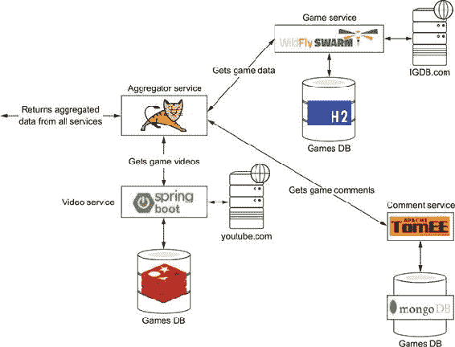

服务之间的兼容性破坏可能发生，并且很难检测。由于你没有直接的反馈来确认某些东西已经被破坏，因此破坏兼容性更容易。由于你运行的是（或缺少）测试的类型，你可能在（预）生产环境中发现问题，因此检测你已破坏兼容性更难。

通常，每个服务都是由不同的团队开发的，如果没有良好的团队间沟通，兼容性问题就更加难以检测。根据我们的经验，最常见的问题来自提供方的一处更改，使得消费者无法与提供方交互。

最常见的问题如下：

+   一个服务重命名了其端点 URL。

+   一个服务添加了一个新的必填参数。

+   一个服务更改/删除了现有的参数。

+   一个服务更改了输入参数的验证表达式。

+   一个服务更改了其响应类型或状态码。

考虑一个例子，其中你有两个服务，生产者和消费者 A。生产者服务以 JSON 格式公开一个博客文章资源，该资源被消费者 A 消费。

该文档的一个可能的表示可能是这样的：

```
{
  "id" : 1,
  "body" : "Hello World",
  "created" : "05/12/2012",
  "author" : "Ada"
}
```

消息包含四个属性：`id`、`body`、`created` 和 `author`。消费者 A 仅与 `body` 和 `author` 字段交互，忽略其他字段。这总结在图 6.2 中。

##### 图 6.2。生产者和消费者 A 之间的数据交换

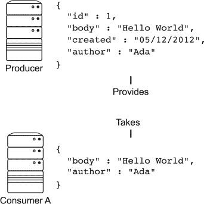

经过一段时间后，一个新的消费者开始使用生产者资源 API。这个新的消费者，消费者 B，需要 `author` 和 `body` 字段，以及一个新的字段（`author id`），它是博客文章作者的标识符。

在这一点上，生产者服务的维护者可以采取两种不同的方法：

+   在根级别添加一个新字段。

+   使用 `author` 字段创建一个复合对象。

第一种方法是在文档中添加一个新的字段，称为 `authorId`，与 `author` 字段处于同一级别。该文档的一个表示可能如下所示：

```
{
  "id" : 1,
  "body" : "Hello World",
  "created" : "05/12/2012",
  "author" : "Ada",
  "authorId" : "123"
}
```

这种改变满足了消费者 B 的需求。如果消费者 A 遵循*Postel 定律*，它将能够继续从生产者服务消费消息。

| |
| --- |

**鲁棒性原则**

*鲁棒性原则*，也称为*Postel 定律*，来源于 Jon Postel。他撰写了 TCP 协议的早期规范，并提出了以下观点：

> *在行动上要保守，在接受他人时要宽容。*
> 
> *Jon Postel*

当应用于 HTML 时，这是一个糟糕的原则，因为它导致了现在主要由更严格的 HTML5 规范在很大程度上解决的荒谬的浏览器之战。但对于有效载荷解析来说，这个原则仍然适用。换句话说，适应我们的情况，生产者和消费者应该忽略任何对他们不重要的有效载荷字段。

| |
| --- |

图 6.3 显示，两个消费者仍然可以消费来自提供者的消息。但假设维护者决定采用第二种方法，并从`authorInfo`字段创建一个组合对象：

```
{
  "id" : 1,
  "body" : "Hello World",
  "created" : "05/12/2012",
  "author" : {
      "name" : "Ada",
      "id" : "123"
  }
}
```

##### 图 6.3\. 生产者与消费者 A 和 B 之间的数据交换

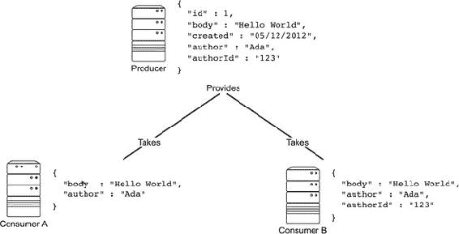

这种改变满足了消费者 B 的需求，但破坏了与消费者 A 的兼容性。在图 6.4 中，你可以看到，尽管消费者 B 可以处理来自提供者的消息，但消费者 A 不能，因为它期望一个类型为`string`的`author`字段。

##### 图 6.4\. 更新的数据交换方案

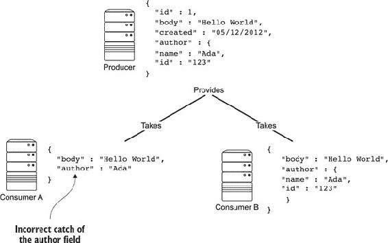

如果你使用的是单体方法，这个问题会在编译时被发现，但在这个情况下，你不会立即知道它。从生产者的角度来看，即使所有测试都通过，你仍然不知道合同已被破坏。

当新的生产者服务部署到包含所有服务正常运行的全环境时，这个问题会在消费者服务中出现。此时，消费者将开始错误地运行，因为合同已被破坏。应该为所有已适应生产者 API 但现在失败的消费者服务开发一个新的补丁。

你发现错误的时间越晚，修复它就越困难——并且，根据应用程序部署的阶段，紧迫性可能会非常严重。假设你在生产环境中发现了这个错误。在这个阶段，你需要将新的生产者服务回滚到旧版本，以及所有已更新的消费者，以使环境重新运行。然后你需要花费大量时间确定部署失败的原因并修复它。图 6.5 显示了在项目不同阶段发现错误的成本。

##### 图 6.5\. 在特定开发阶段修复错误的成本

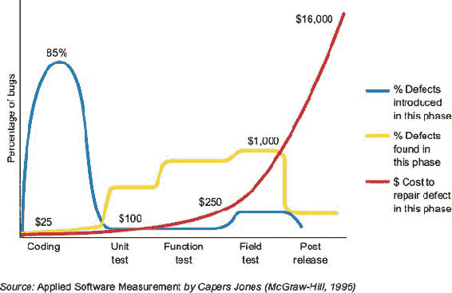

使用微服务架构意味着改变服务测试的方式，以便在部署新的生产者服务之前检测到这些问题。理想情况下，应该在 CI/交付运行期间的测试阶段检测到错误。

|  |
| --- |

**弃用方法**

您也可以通过弃用`author`字段而不是删除它来混合两种解决问题的方法。新的文档看起来像这样：

```
{
  "id" : 1,
  "body" : "Hello World",
  "created" : "05/12/2012",
  "author" : "Ada",
  "authorInfo" : {
      "name" : "Ada",
      "id" : "123"
  }
}
```

已创建一个新的字段`authorInfo`，而`author`仍然有效但已弃用。这种方法不会替换任何测试，因为无论何时决定删除弃用的字段，你都会遇到相同的问题。但至少有一个过渡，并且消费者维护者可能有时间被告知更改并适应它。

|  |
| --- |

#### 6.1.3\. 使用集成测试进行验证

在第五章中，你看到您使用集成测试来测试一个系统是否可以与另一个系统通信。用合约术语表达，你正在测试给定消费者中的*边界*或*网关*类是否可以正确与提供者通信以获取或发布一些数据。

你可能会认为集成测试涵盖了合约被破坏的使用场景。但这种方法存在一些问题，使得对服务进行此类测试变得困难。

首先，消费者必须知道如何启动提供者。其次，消费者可能依赖于多个提供者。每个提供者可能有不同的要求，例如数据库或其他服务。因此，启动提供者可能意味着启动多个服务，并且在不经意间将集成测试转换为端到端测试。

第三个也是最重要的问题是，您需要在生产者和所有消费者之间创建直接关系。当对生产者进行任何更改时，必须运行与该生产者相关的所有消费者的集成测试，以确保它们仍然可以与提供者通信。这种安排难以维护，因为对于每个新的消费者，您需要通知生产者团队并提供一组新的运行测试。

尽管集成测试可能是一种验证一个生产者的消费者可以连接的解决方案，但这些测试并不总是最佳的方法。

#### 6.1.4\. 什么是合约测试？

如前所述，合约是一系列协议，由充当客户端（或消费者）的服务与充当提供者的另一个服务之间达成。定义每个消费者与其提供者之间交互的合约的存在，解决了第 6.1.3 节中描述的所有问题。

在图 6.6 中，定义了消费者和供应商之间的合同——比如说，通过一个文件来描述它——因此供应商和消费者都有遵守合同的协议。现在，消费者和供应商之间的关系是间接的，因为从生产者的角度来看，你只需要验证它是否符合合同中描述的协议。供应商不需要运行消费者的集成测试；它只需要测试消费者能否根据合同消费请求并生成响应。

##### 图 6.6\. 供应商和消费者交互

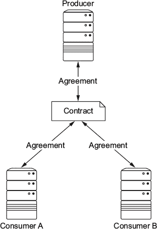

在这种情况下，每个供应商与其提供数据的所有消费者之间都有一个/多个合同。对于对供应商所做的每个更改，都会验证所有合同以检测任何中断，而无需运行集成测试。

合同也在消费者端进行验证，验证其客户端类（*网关*）是否遵循合同。请注意，再次强调，你不需要知道生产者是如何启动的或启动任何可能依赖于它的外部依赖项，因为验证合同并不意味着启动生产者；你只是在验证消费者是否也符合合同。

验证合同的测试被称为*合同测试*。下一个大问题是，谁负责创建和维护合同文件？我们将在下一节中讨论这个问题。

#### 6.1.5\. 谁拥有合同？

正如你刚刚学到的，验证消费者和供应商能否正确且持续地通信的最佳方式是在它们之间定义一个合同。但我们还没有解决这个合同的拥有权问题：是消费者团队还是供应商团队。

##### 供应商合同是什么？

如果合同的拥有权属于开发供应商的团队，这意味着他们不仅了解自己服务（供应商）的商业行为，还了解其服务支持的所有消费者的需求。这种合同被称为*供应商合同*，因为合同属于供应商，消费者只是它的查看者（参见图 6.7）。这种合同可能有益的例子之一是内部安全认证/授权服务，其中消费服务必须符合供应商合同。

##### 图 6.7\. 供应商合同

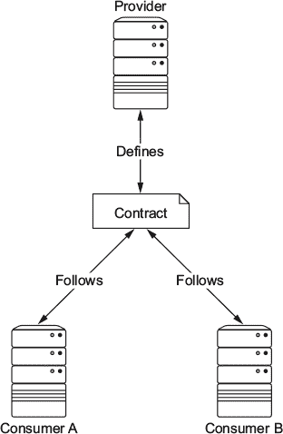

供应商合同定义了供应商将向消费者提供的内容。每个消费者都必须适应供应商提供的内容。自然地，这表明消费者与供应商耦合。如果供应商团队开发的合同不再满足消费者的需求，消费者团队必须与供应商服务的维护者开始对话，以解决这一缺陷。

##### 消费者合同是什么？

另一方面，为了解决一刀切合同的问题，而不强迫提供商团队定义一个完整的合同，你可以通过让消费者服务的开发者定义他们所需的内容，并将该合同发送给提供商团队以实施，来改变合同的所有权。这种合同被称为**消费者合同**，因为它属于消费者。

消费者合同从消费者的角度定义了消费者的需求。因此，此合同仅适用于该单个消费者及其特定用例。消费者合同可以用来完成现有的提供商合同（如果有的话），或者它们可以帮助开发一个新的合同。图 6.8 显示，对于每个提供商-消费者关系都有一个消费者合同，而不是为所有消费者提供一个单一的合同。

##### 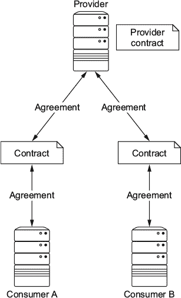


例如，消费者合同可能对组织内部结账服务有益，其中服务的演变速度将由提供商控制，但从该服务提取的数据用于不同的上下文中。这些上下文可能各自演变，但存在一个内部的控制点和演变点。

##### 什么是消费者驱动的合同？

一个**消费者驱动的合同**代表了一个提供商与其所有消费者之间所有合同的聚合（见图 6.9）。显然，只要满足对所有消费者的义务，提供商可以通过创建一个提供商合同来演变或扩展消费者的合同。

##### 图 6.9. 消费者驱动的合同

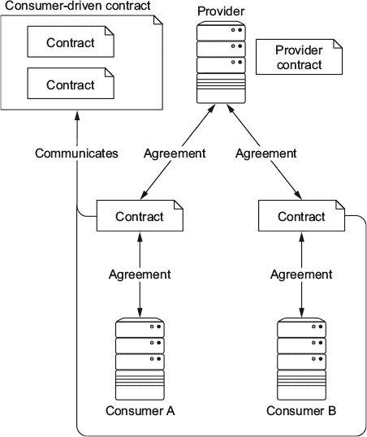

消费者驱动的合同确立了一个服务提供商是从其消费者的角度开发的。每个消费者都会向其提供商传达满足该消费者用例的具体要求。这些要求在提供商一方产生义务，以满足所有消费者的期望。

理想情况下，合同测试是由消费者团队开发的，捆绑后发送给生产团队，以便他们可以开发生产服务。通过将消费者合同的所有权分配给消费者团队，你确保了提供商的消费者驱动的合同是消费者所需的，而不是提供商对消费者期望的解释。此外，当生产服务的维护者更改提供商-服务代码库时，他们知道他们的更改对消费者的影响，确保在部署提供服务的最新版本时运行时没有通信失败。 

消费者端也有一些义务。提供者必须遵守消费者驱动的合同，而消费者必须确保他们遵守合同的一部分——不多也不少。消费者应该只从提供者端消费他们所需的内容。这样，消费者可以保护自己免受提供者合同因提供者添加内容而产生的演变。

消费者驱动合同可能有益的一个例子是，一个*外部*（对外部组织开放）或*内部*用户服务，该服务在整个组织中使用。数据从这个服务中提取用于多个其他上下文。这些上下文都各自发展，存在一个外部控制/演化的焦点。

到目前为止，在本章中，我们讨论了服务在不同运行时运行的问题，为什么集成测试不够，以及为什么消费者驱动合同有助于你修复在更新生产者服务时可能出现的通信问题。让我们看看如何实践这些原则，以及哪些工具可以帮助你使用消费者驱动合同模式为微服务架构。

### 6.2\. 工具

我们已经解释了为什么在微服务架构中编写合同测试很重要，以避免在服务部署到生产环境时出现意外。接下来，让我们看看你可以用来编写合同测试的工具。这些是最受欢迎的三种工具：

+   *Spring Cloud Contract*——一个在 Spring 生态系统下开发的测试框架，使用 Groovy 编写。尽管它与 Spring 产品集成良好，但任何使用 JVM 语言开发的应用程序都可以使用它。

+   *Pact*——一组提供消费者驱动合同测试支持的测试框架。它为 Ruby、JVM 语言、.NET、JavaScript、Go、Python、Objective-C、PHP 和 Swift 语言提供了官方实现。

+   *Pacto*——一个用于开发消费者驱动合同测试和/或文档驱动合同的测试框架。它使用 Ruby 编写，尽管可以通过使用 Pacto 服务器与多种语言（如 Python 和 Java）一起使用。

在我们看来，Pact ([`docs.pact.io`](https://docs.pact.io)) 是合同测试场景中最广泛采用和最成熟的项目之一。其主要优势之一是它支持今天用于编写微服务的几乎所有主要语言；相同的概念可以独立于编程语言重用，从前端到后端。因此，我们坚信 Pact 是编写消费者驱动合同的通用解决方案。它很好地适应了在 Java 中开发的微服务架构。

下一节将深入探讨 Pact 的工作原理以及如何使用 Pact 编写合同测试。

#### 6.2.1\. Pact

Pact 框架通过提供模拟 HTTP 服务器和流畅 API 来定义从消费者到服务提供商的 HTTP 请求以及预期的 HTTP 响应，允许你在消费者端编写合同。这些 HTTP 请求和响应用于模拟 HTTP 服务器来模拟服务提供商。然后，这些交互用于生成服务消费者和服务提供商之间的合同。

Pact 还提供了验证合同与提供商端逻辑。消费者上发生的所有交互都在“真实”服务提供商上回放，以确保提供商为给定的请求产生消费者期望的响应。如果提供商返回了意外的内容，Pact 将交互标记为失败，并且合同测试失败。

任何合同测试都由两部分组成：一部分是消费者，另一部分是提供商。此外，合同文件从消费者发送到提供商。让我们使用 Pact 来查看合同测试的生命周期：

> **1**. 消费者预期在模拟 HTTP 服务器上使用流畅 API 设置。消费者与模拟 HTTP 服务器进行通信，处理 HTTP 请求/响应，但从不与提供商交互。这样，消费者不需要知道如何部署提供商（因为这可能不是一件简单的事情，并且可能结果是在编写端到端测试而不是合同测试）。消费者验证其客户端/网关代码可以与定义的交互通信的模拟 HTTP 服务器。
> 
> 当运行消费者测试时，所有交互都写入一个 pact 合同文件，该文件定义了消费者和提供商必须遵循的合同。
> 
> **2**. 将 pact 合同文件发送到提供商项目，以便在提供商服务上回放。合同在真实提供商上回放，并检查提供商的真实响应与合同中定义的预期响应是否一致。
> 
> 如果消费者能够生成一个 pact 合同文件，并且提供商满足所有预期，那么合同已经由双方验证，他们就能够进行通信。

这些步骤在图 6.10 中进行了总结。

##### 图 6.10\. Pact 生命周期

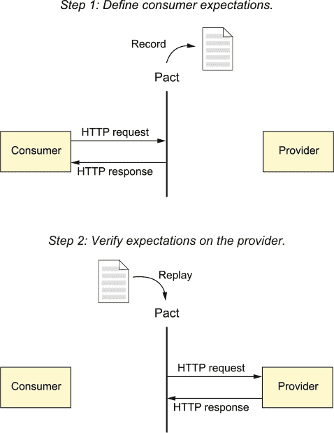

总结来说，Pact 提供了以下功能：

+   一个模拟的 HTTP 服务器，这样你就不必依赖提供商。

+   一个 HTTP 客户端，用于自动回放预期。

+   在回放预期之前，将期望的状态从消费者端传达给提供商。例如，一个交互可能要求在回放预期之前，提供商数据库中必须包含一个名为*Alexandra*的用户。

+   *Pact Broker* 是合同的存储库，允许您在消费者和提供者之间共享 pact，对 pact 合同文件进行版本控制，以便提供者可以针对合同的固定版本进行验证，并为每个 pact 提供文档以及服务之间关系的可视化。

接下来，我们将探讨 Pact JVM：Pact 在 Java 虚拟机中的实现。

#### 6.2.2. JVM 语言中的 Pact

Pact JVM 部分是用 Scala、Groovy 和 Java 编写的，但它可以与任何 JVM 语言一起使用。它与 Java、Scala、Groovy、Grails（提供用于定义合同的 Groovy DSL）和 Clojure 完美集成。此外，它还提供了与测试框架（如 JUnit、Spock、ScalaTest 和 Specs2）以及构建工具（如 Maven、Gradle、Leiningen 和 sbt）的紧密集成。本书侧重于 Java 工具，但请记住，如果您计划使用任何其他 JVM 语言，您仍然可以使用 Pact JVM 进行消费者驱动的合同测试。

让我们看看如何使用 Pact JVM 编写消费者和提供者测试。

##### 使用 Pact JVM 进行消费者测试

Pact JVM 提供了一个模拟 HTTP 服务器和一个 Java 领域特定语言 (DSL)，用于编写模拟 HTTP 服务器的预期。当消费者测试通过时，这些预期将实现为 pact 合同文件。

Pact JVM 与 JUnit 集成，提供 DSL 和基类，用于与 JUnit 一起构建消费者测试。使用 JUnit 编写消费者测试的第一件事是注册 `PactProviderRule` JUnit 规则。此规则执行以下操作：

+   启动和停止模拟 HTTP 服务器

+   配置具有定义预期的模拟 HTTP 服务器

+   如果测试通过，则从定义的预期生成 pact 合同文件

下面是一个示例：

```
@Rule
public PactProviderRule mockProvider =
                            new PactProviderRule("test_provider",
                                                 "localhost", 8080,
                                                 this);
```

第一个参数是当前消费者合同定义的提供者名称。此名称用于引用给定合同的提供者。接下来是两个可选参数：模拟 HTTP 服务器绑定的主机和监听端口。如果没有指定值，则分别使用 `localhost` 和 `8080`。最后，`this` 实例是测试本身。

接下来，您通过使用 `au.com.dius.pact.consumer.Pact` 注解一个方法来定义预期。此方法必须接收一个类型为 `PactDslWithProvider` 的类，并返回一个 `PactFragment`。`PactDslWithProvider` 是一个围绕 DSL 模式构建的 Java 类，用于描述当使用模拟 HTTP 服务器时预期接收到的请求。正如其名称所示，`PactFragment` 对象是合同的一部分。它用作模拟 HTTP 服务器中的预期，并用于生成 pact 合同文件，该文件用于验证提供者。片段可以是完整的合同，也可以只是其中的一部分。如果在同一测试类中定义了多个片段，则 pact 合同文件由所有片段的聚合组成。

`@Pact` 方法必须具有以下签名：

```
@Pact(provider="test_provider", consumer="test_consumer")
public PactFragment createFragment(PactDslWithProvider builder) {
  //...
}
```

注意，在 `@Pact` 注解中，您设置了应遵循合同的提供者名称以及定义合同的消费者名称。这些信息对于提供者测试执行很重要，以确保提供者端测试针对所有提供数据的消费者执行。

下一个片段定义了一个请求/响应期望。`PactDslWithProvider` 有几个选项可以定义：

```
return builder
    .uponReceiving("a request for something")         *1*
        .path("/hello")                               *2*
        .method("POST")
        .body("{\"name\": \"Ada\"}")                  *3*
    .willRespondWith()                                *4*
        .status(200)                                  *5*
        .body("{\"hello\": \"Ada\"}")                 *6*
    .uponReceiving("another request for something")
        .matchPath("/hello/[0-9]+")                   *7*
        .method("POST")
        .body("{\"name\": \"Ada\"}")
    .willRespondWith()
        .status(200)
        .body("{\"hello\": \"Ada\"}")
    .toFragment();
```

+   ***1* 定义一个新的请求交互**

+   ***2* 对 HTTP POST 的 /hello 路径做出响应**

+   ***3* 请求体必须包含给定的 JSON 文档。**

+   ***4* 定义对先前请求的响应**

+   ***5* 返回 HTTP 状态码 200**

+   ***6* 响应体的内容是给定的 JSON 文档。**

+   ***7* 对以 /hello/ 开头的任何路径以及任何数字做出响应**

此示例定义了两个期望。第一个请求发生在消费者使用 `POST` 方法在 /hello 发送请求时。消息体必须包含确切的 JSON 文档 `{"name": "Ada"}`。如果发生这种情况，则响应是 JSON 文档 `{"hello": "Ada"}`。第二个请求发生在路径以 /hello 开头并跟随着任何有效数字时。条件与第一个请求相同。

注意，您可以定义所需数量的交互。每个交互都以 `uponReceiving` 开头，后面跟着 `willRespondWith` 以记录响应。

|  |
| --- |

##### 小贴士

为了使您的测试尽可能可读和简单，并保持专注于“一种方法，一项任务”的方法，我们建议为所有交互使用多个片段，而不是定义一个返回所有内容的大的 `@Pact` 方法。

|  |
| --- |

之前定义的一个重要方面是，正文内容必须与合同中指定的内容相同。例如，`请求某物` 有一个强烈的要求，即只有当 JSON 文档是 `{"name": "Ada"}` 时才提供响应。如果名称不是 `Ada`，则不生成响应。对于返回的正文也是如此。因为 JSON 文档是静态的，所以响应总是相同的。

这可能是在无法设置静态值的情况下的一种限制，尤其是在运行针对提供者的合同时。因此，构建器的 `body` 方法可以接受一个 `PactDslJsonBody`，它可以用来动态构建 JSON 正文。

|  |
| --- |

**PactDslJsonBody 类**

`PactDslJsonBody` 构建器类实现了 DSL 模式，您可以使用它来动态构建 JSON 正文，以及为字段定义正则表达式和类型匹配器。让我们看看一些示例。

下面的片段生成一个没有数组的简单 JSON 文档：

```
DslPart body = new PactDslJsonBody()
  .stringType("name") *1*
  .booleanType("happy") *2*
  .id()
  .ipAddress("localAddress")
  .numberValue("age", 100); *3*
```

+   ***1* 定义一个名为 name 的字段，类型为字符串，其值不重要**

+   ***2* 定义一个名为 happy 的字段，类型为布尔型，其值不重要**

+   ***3* 定义一个名为 age 的字段，类型为数字，其特定值为 100**

使用 *xType* 表单，你还可以设置一个可选的值参数，用于在返回模拟响应时生成示例值。如果没有提供示例，将生成一个随机的值。

之前的 `PactDslJsonBody` 定义将匹配任何这样的体：

```
{
  "name" : "QWERTY",
  "happy": false,
  "id" : 1234,
  "localAddress" : "127.0.0.1",
  "age": 100,
}
```

注意，任何包含所需类型所有必需字段的文档，并且具有值为 `100` 的 `age` 字段都是有效的。

`PactDslJsonBody` 还提供了定义数组匹配器的方法。例如，你可以验证列表具有最小或最大大小，或者列表中的每个项目与给定的示例匹配：

```
DslPart body = new PactDslJsonBody()
    .minArrayLike("products", 1)                      *1*
        .id()                                         *2*
        .stringType("name")
        .stringMatcher("barcode", "a\\d+", "a1234")
        .closeObject()
    .closeArray();
```

+   ***1* 定义列表必须至少包含一个元素**

+   ***2* 指定列表中的每个文档必须包含一个 ID、一个名称和一个条形码**

在这里，`products` 数组不能为空，并且每个产品都应该有一个标识符和一个类型为 `string` 的名称，以及一个匹配形式 `"a"` 加上一个数字列表的条形码。

如果元素的大小不重要，你可以这样做：

```
PactDslJsonArray.arrayEachLike()
    .date("expireDate", "mm/dd/yyyy", date)
    .stringType("name")
    .decimalType("amount", 100.0)
    .closeObject()
```

在这个例子中，每个数组必须包含三个字段：`expireDate`、`name` 和 `amount`。此外，在模拟响应中，每个元素将在 `expireDate` 字段中包含一个 `date` 变量值，在 `name` 字段中包含一个随机的 `string`，在 `amount` 中包含值 `100.0`。

如你所见，使用 `DslPart` 生成体让你可以定义字段类型而不是具体的特定字段/值对。这使得你的合约在提供者端的合约验证期间更具弹性。假设你在提供者验证阶段设置了 `.body("{'name': 'Ada'}")`：你期望提供者生成具有相同值的相同 JSON 文档。这在大多数情况下可能是正确的；但如果测试数据集发生变化，并且不是返回 `.body("{'name':'Ada'}")`，而是返回 `.body("{'name':'Alexandra'}")`，测试将失败——尽管从合约的角度来看，这两个响应都是有效的。

|  |
| --- |

现在你已经看到了如何在消费者端使用 Pact 编写驱动型合约，让我们看看如何编写测试的提供者部分。

##### 使用 Pact JVM 进行提供者测试

在执行测试的消费者部分并生成和发布 pact 合约文件后，你需要将合约回放到一个真实的提供者。这部分测试在提供者端执行，Pact 提供了几个工具来完成这项工作：

+   *JUnit*—在 JUnit 测试中验证合约

+   *Gradle, Lein, Maven, sbt*—用于验证运行中提供者的插件

+   *ScalaTest*—用于验证运行中提供者的扩展

+   *Specs2*—用于验证运行中提供者的扩展

通常，所有这些集成都提供了两种检索已发布合约的方式：通过使用 Pact Broker 和指定一个具体的位置（一个文件或一个 URL）。配置检索方法的方式取决于你选择如何回放合约。例如，JUnit 使用注解方法，而在 Maven 中，插件配置部分用于此目的。

让我们来看看如何使用 Maven、Gradle 和 JUnit 实现提供者验证。

##### 使用 Maven 验证契约

Pact 为验证提供者与契约提供了 Maven 插件。要使用它，请将以下内容添加到 pom.xml 的 `plugins` 部分。

##### 列表 6.1\. 添加 Maven 插件

```
<plugin>
  <groupId>au.com.dius</groupId>
  <artifactId>pact-jvm-provider-maven_2.11</artifactId>
  <version>3.5.0</version>
</plugin>
```

然后你需要配置插件，定义你想要验证的所有提供者以及你想要用来检查它们的消费者契约的位置。

##### 列表 6.2\. 配置 Maven 插件

```
<plugin>
  <groupId>au.com.dius</groupId>
  <artifactId>pact-jvm-provider-maven_2.11</artifactId>
  <version>3.2.10</version>
  <configuration>
    <serviceProviders>
      <serviceProvider>                                           *1*
        <name>provider1</name>
        <protocol>http</protocol>
        <host>localhost</host>
        <port>8080</port>
        <path>/</path>                                            *2*
        <pactFileDirectory>path/to/pacts</pactFileDirectory>      *3*
      </serviceProvider>
    </serviceProviders>
  </configuration>
</plugin>
```

+   ***1* 要验证的提供者（或提供者）**

+   ***2* 提供者的名称（必须是唯一的）以及它部署的位置**

+   ***3* 存储所有 Pact 契约的目录**

要验证契约，执行 `mvn pact:verify`。Maven 插件将加载给定目录中定义的所有 Pact 契约，并重新播放与给定提供者名称匹配的契约。如果所有契约都通过提供者验证，则构建将成功完成；如果不通过，则构建将失败。

##### 使用 Gradle 验证契约

Gradle 插件使用与 Maven 类似的方法来验证契约与提供者。要使用它，请将以下内容添加到 .build.gradle 的 `plugins` 部分。

##### 列表 6.3\. 添加 Gradle 插件

```
plugins {
  id "au.com.dius.pact" version "3.5.0"
}
```

然后配置插件，定义你想要验证的提供者以及你想要用来检查它们的消费者契约的位置。

##### 列表 6.4\. 配置 Maven 插件

```
pact {

  serviceProviders {

    provider1 {                                        *1*
      protocol = 'http'
      host = 'localhost'
      port = 8080
      path = '/'                                       *2*

      hasPactsWith('manyConsumers') {                  *3*
        pactFileLocation = file('path/to/pacts')
      }
    }
  }
}
```

+   ***1* 要验证的提供者（或提供者）**

+   ***2* 提供者的名称（必须是唯一的）以及它部署的位置**

+   ***3* 存储所有 Pact 契约的目录**

要验证契约，执行 `gradlew pactVerify`。Gradle 插件将加载给定目录中定义的所有 Pact 契约，并重新播放与给定提供者名称匹配的契约。如果所有契约都通过提供者验证，则构建将成功完成；如果不通过，则构建将失败。

最后，让我们看看如何通过使用 JUnit 而不是依赖构建工具来验证提供者。

##### 使用 JUnit 验证契约

Pact 为验证提供者与契约提供了 JUnit 运行器。此运行器提供了一个 HTTP 客户端，它将自动重新播放所有契约以针对配置的提供者。它还提供了使用注解加载契约的方便方法。

使用 JUnit 方法，你需要注册 `PactRunner`，使用 `@Provider` 注解设置提供者的名称，并设置契约的位置。然后，你创建一个类型为 `au.com.dius.pact.provider.junit.target.Target` 的字段，该字段带有 `@TestTarget` 注解，并实例化 `au.com.dius.pact.provider.junit.target.HttpTarget` 以将 pact 契约文件作为 HTTP 请求播放并断言响应，或者实例化 `au.com.dius.pact.provider.junit.target.AmqpTarget` 以将 pact 契约文件作为 AMQP 消息播放。

| |
| --- |

**注意**

*高级消息队列协议* (AMQP) 是一种面向消息的中间件的应用层协议。它定义的功能包括消息导向、排队、路由、可靠性和安全性。

| |
| --- |

让我们看看一个使用`HttpTarget`的例子，来自 PactTest.java。

##### 列表 6.5\. 使用 JUnit 运行器

```
@RunWith(PactRunner.class)                                         *1*
@Provider("provider1")                                             *2*
@PactFolder("pacts")                                               *3*
public class ContractTest {

  @TestTarget                                                      *4*
  public final Target target = new HttpTarget("localhost", 8332);  *5*
}
```

+   ***1* 注册 PactRunner**

+   ***2* 设置提供者的名称**

+   ***3* 设置合约文件的存储位置。在这种情况下，位置解析为 src/test/resources(pacts)。**

+   ***4* 设置测试的目标**

+   ***5* 配置提供者的位置**

注意，没有使用`@Test`注解的测试方法。这不是必需的，因为这里不是单个测试，而是许多测试：消费者和提供者之间每个交互的一个测试。

当这个测试执行时，JUnit 运行器会从 pacts 目录获取所有合约文件，并针对在`HttpTarget`实例中指定的提供者位置重新播放其中定义的所有交互。

`PactRunner`自动根据测试类上的注解加载合约。Pact 为此提供了三个注解：

+   `PactFolder`—从项目文件夹或资源文件夹检索合约；例如，`@PactFolder("subfolder/in/resource/directory")`。

+   `PactUrl`—从 URL 检索合约；例如，`@PactUrl(urls = {"http://myserver/contract1.json"})`。

+   `PactBroker`—从 Pact Broker 检索合约；例如，`@PactBroker (host="pactbroker", port = "80", tags = {"latest", "dev"})`。

+   `Custom`—要实现自定义检索器，创建一个实现`PactLoader`接口的类，并具有一个默认空构造函数或一个参数类型为`Class`（代表测试类）的构造函数。像这样注解测试：`@PactSource(CustomPactLoader.class)`。

您也可以轻松实现自己的方法。

##### Pact 状态

在测试时，每个交互都应该在隔离的情况下进行验证，不包含之前交互的上下文。但是，在使用消费者驱动的合约时，有时消费者希望在交互运行之前在提供者端设置某些内容，以便提供者可以发送与消费者期望相匹配的响应。一个典型的场景是设置带有预期数据的数据源。例如，在测试认证操作的合约时，消费者可能要求提供者在交互发生之前将具体的登录名和密码插入到数据库中，以便当交互发生时，提供者逻辑可以适当地对数据进行响应。图 6.11 总结了消费者、状态和提供者之间的交互。

##### 图 6.11\. 消费者和提供者之间的交互

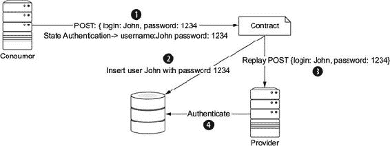

首先，消费者端定义了应该使用包含 JSON 主体的`POST`方法来完成认证过程：

```
{
  "login": "John",
  "password": "1234"
}
```

因为这个片段将在与提供商回放合约时使用，所以消费者需要提醒提供商在执行此交互之前，应该使用给定信息准备数据库。因此，消费者创建了一个包含所有必要数据的名为*状态认证*的状态。状态信息存储在合约中。

当合约与提供商回放时，在交互发生之前，状态数据被注入到测试中，以便测试可以准备合约验证的环境。最后，使用包含预期用户信息的数据库执行合约验证。

要从消费者端定义状态，您需要在定义合约时使用特殊方法 `given`：

```
@Override
protected PactFragment createFragment(PactDslWithProvider builder) {
  Map<String, Object> parameters = new HashMap<>();                    *1*
  parameters.put("login", "John");
  parameters.put("password", "1234")
  builder
    .given("State Authentication", parameters)                         *2*
    .uponReceiving("")
    ....
```

+   ***1* 定义状态中所需的数据**

+   ***2* 在合约中以名称和参数注册状态**

要对提供商端的状态做出反应，您需要创建一个带有 `@State` 注解的方法：

```
@State("State Authentication")                                 *1*
public void testStateMethod(Map<String, Object> params) {      *2*
  //Insert data
}
```

+   ***1* 设置要响应的状态名称**

+   ***2* 该方法接收消费者定义的参数的 Map。**

注意，使用状态，您可以在消费者和提供商之间共享信息，因此您可以在交互之前配置测试的状态。Pact 状态是从消费者端准备提供商状态的推荐方式。

Maven 和 Gradle 集成还提供了在提供商端设置状态的方法。在这些情况下，对于每个提供商，您指定一个用于更改提供商状态的状态更改 URL。此 URL 在每次交互之前通过 POST 方法接收来自 pact 合约文件的 `providerState` 描述。

#### 6.2.3\. 使用 Algeron 将 Pact JVM 集成到 Arquillian 生态系统

*Arquillian Algeron* 是一个 Arquillian 扩展，它将 Arquillian 与合约测试集成。它为将 Arquillian 与合约测试框架集成提供了一个共同的基础。

*Arquillian Algeron Pact* 是将 Arquillian 理念和扩展集成到使用 Pact JVM 核心的消费者驱动合约方法中。通过使用 Arquillian Algeron Pact，您可以兼得两者之优：您可以使用 Pact-JVM 方法验证消费者和提供商，并且可以使用 Arquillian 在类似生产的环境下运行测试。让我们看看 Arquillian Algeron Pact 如何适应消费者和提供商端。

要使用 JAX-RS 客户端实现消费者网关，代码仅使用 API 接口（实现通常由应用服务器提供）。要运行您的测试，您需要定义一个 JAX-RS 的实现；Apache CXF ([`cxf.apache.org`](http://cxf.apache.org)) 是一个不错的选择。您可以在构建工具中提供实现，或者您可以编写一个 Arquillian 测试。在 Arquillian 中，测试和业务代码将与您在生产中使用相同的 JAX-RS 实现和版本一起部署和运行在应用服务器上。

在提供者端，你需要将合同回放到一个正在运行的提供者。你可以依赖构建脚本来打包和部署提供者应用程序，或者你可以使用 Arquillian 在测试中打包和部署应用程序，从而避免对构建工具的依赖。

|  |
| --- |

##### 小贴士

当你在验证提供者端时，你不需要使用真实数据库或真实的外部服务来运行提供者；你可以使用内存数据库或存根。因此，使用 Arquillian 微部署可以帮助你创建包含配置文件和指向内存数据库或存根实现的类的部署文件。

|  |
| --- |

Arquillian Algeron 除了提供 Pact 和 Arquillian 之间的集成外，还提供其他功能：

+   *发布者*—在消费者端，你可以配置它将合同发布到指定的存储库，如果它们成功生成。目前支持的发布者是 *文件夹*、*URL*、*Git 服务器* 和 *Pact Broker*，但你也可以创建自己的。

+   *检索者*—与 JUnit 类似，你可以配置合同加载器。除了 Pact JUnit 已支持的那些（*文件夹*、*URL* 和 *Pact Broker*）之外，Arquillian Algeron 还支持 *Git 服务器* 和 *Maven 软件包*。

+   *配置*—发布者和检索者可以在 arquillian.xml 文件中进行配置，这样所有配置都在一个中心位置，而不是每个测试类中。请注意，检索者还支持基于注解的方法。

+   *TestNG*—由于 Arquillian 是测试框架无关的，你可以使用 Pact 和 TestNG。

之后，我们将深入探讨 *发布者* 和 *检索者* 以及如何使用它们。

|  |
| --- |

##### 小贴士

在消费者和提供者端使用 Arquillian Algeron Pact 不是强制性的。你可以在消费者或提供者端使用 Pact JVM 或任何语言的 Pact 实现，并在另一端使用 Arquillian Algeron Pact。

|  |
| --- |

与 Pact JVM 类似，Arquillian Algeron Pact 被分为消费者和提供者两部分。

|  |
| --- |

##### 警告

由于 Arquillian Algeron 使用 Pact Core 而不是 Pact JUnit，因此注解是特定于 Arquillian Algeron 的，并且与 Pact JUnit 中的不同。

|  |
| --- |

##### 使用 Arquillian Algeron Pact 编写消费者端

下面是使用 Arquillian Algeron Pact 的消费者部分的示例，来自 ClientGatewayTest.java。

##### 列表 6.6\. Arquillian Algeron Pact，消费者端

```
@RunWith(Arquillian.class)                                      *1*
@Pact(provider="provider", consumer="consumer")                 *2*
public class ClientGatewayTest {

  @Deployment                                                   *3*
  public static JavaArchive createDeployment() {
    return ShrinkWrap.create(JavaArchive.class)
      .addClasses(ClientGateway.class);
  }

  public PactFragment createFragment(PactDslWithProvider builder) {
    return builder
      ...
      .toFragment();                                            *4*
  }

  @EJB                                                          *5*
  ClientGateway clientGateway;

  @Test
  @PactVerification("provider")                                 *6*
  public void should_return_message() throws IOException {
    assertThat(clientGateway.getMessage(), is(....));           *7*
  }
}
```

+   ***1* Arquillian 运行器**

+   ***2* 定义合同，你需要在方法或类上注解 org.arquillian.algeron.pact.consumer.spi.Pact 并设置提供者和消费者名称。**

+   ***3* 定义你想要部署到定义的容器中的内容**

+   ***4* 返回合同的一部分（可能是整个合同）**

+   ***5* 典型的 Arquillian 扩展**

+   ***6* 定义在执行此测试方法时验证哪个提供者**

+   ***7* 断言网关可以读取提供者发送的消息类型**

在这里，您正在编写一个消费者合约测试，它定义了 `consumer` 和 `provider` 之间的合约。客户端网关使用 JAX-RS 客户端实现；它是一个 EJB，因此它知道在它将在生产中找到的相同运行时下运行该网关。因此，使用 Arquillian Algeron 而不是单独使用 Pact JVM 是一种很好的方法。

`@Pact` 注解定义了消费者和提供者之间的交互。该注解可以在类级别使用，这意味着在此测试中定义的所有合约都是针对同一提供者；或者，它可以在方法级别使用，这意味着您可以指定一个具体的 `PactFragment` 仅定义注解中定义的消费者-提供者元组的交互。因此，您可以在同一个消费者类中定义针对不同提供者的合约。当注解在方法级别定义时，它优先于在类级别定义的注解。

| |
| --- |

##### 小贴士

在同一个测试中为多个提供者定义合约不是我们推荐的做法，因为这样做会打破一个类应该测试一个事物的模式。

| |
| --- |

最后，对于每个测试用例，您需要指定在运行测试时验证哪个提供者。您可以通过使用 `@PactVerification` 并设置提供者名称来实现。请注意，如果您在类级别使用 `@Pact` 注解，则设置提供者名称不是强制性的，因为提供者名称将从那里解析。

当您使用 Arquillian Algeron Pact 消费者测试时执行的步骤与标准 Arquillian 测试类似：

> **1**. 启动所选的应用程序服务器。
> 
> **2**. 部署（微）应用程序文件。
> 
> **3**. 启动 Pact Stub HTTP 服务器。
> 
> **4**. 记录所有交互（`PactFragment`）。
> 
> **5**. 执行测试。
> 
> **6**. 对于成功的测试，生成合约文件。
> 
> **7**. 取消部署应用程序。
> 
> **8**. 停止应用程序服务器。

如果您正在实现多个返回 `PactFragment` 实例的方法，您需要在 `@PactVerification(.. fragment="createFragment")` 的 `fragment` 属性中使用，以指定针对该 `@Test` 方法正在测试哪个片段方法。

| |
| --- |

##### 小贴士

您可以使用 Arquillian 独立版与 Arquillian Algeron 一起使用，如果您想跳过部署步骤。这在您使用不依赖于您运行时任何功能的客户端网关时很有用。

| |
| --- |

##### 使用 Arquillian Algeron Pact 编写提供者端

现在，让我们看看如何使用 Arquillian Algeron Pact 编写提供者部分。因为 Arquillian Algeron 使用 Pact JVM，所以方法完全相同：它将合约中定义的所有请求回放至真实提供者，并验证响应是否为预期的。

##### 列表 6.7\. Arquillian Algeron Pact，提供者端

```
@RunWith(Arquillian.class)                                            *1*
@Provider("provider")                                                 *2*
@ContractsFolder("pacts")                                             *3*
public class MyServiceProviderTest {

  @Deployment(testable = false)                                       *4*
  public static WebArchive createDeployment() {
    return ShrinkWrap.create(WebArchive.class).addClass(MyService.class);
  }

  @ArquillianResource                                                 *5*
  URL webapp;

  @ArquillianResource                                                 *6*
  Target target;

  @Test
  public void should_provide_valid_answers() {
    target.testInteraction(webapp);                                   *7*
  }

}
```

+   ***1* Arquillian 运行器**

+   ***2* 设置测试中使用的提供者名称**

+   ***3* 配置获取 pact 合约文件的位置**

+   ***4* 测试必须作为客户端运行；将可测试性设置为 false。**

+   ***5* 应用程序部署的 URL**

+   ***6* 目标是一个类，它向提供者发送所有请求。Arquillian Algeron Pact 默认使用 HTTP 客户端目标。**

+   ***7* 执行对已部署应用的交互，并验证响应**

这个测试验证提供者是否符合消费者定义的期望。因为你需要部署一个真实的提供者，这是一个很好的方法，因为你可以使用 Arquillian 功能来打包、部署和启动应用程序。

在提供者测试中，你首先需要指定你正在验证的提供者。你可以通过使用 `org.arquillian.algeron.pact.provider.spi.Provider` 并设置在消费者测试中给出的提供者名称来完成此操作。

Arquillian Algeron 支持两种检索合约的方式：通过使用注解或在 arquillian.xml 中配置检索器。后者将在本章后面的“注册发布者和检索者”部分中介绍。在这个测试中，合约是通过使用 `org.arquillian.algeron.provider.core.retriever.ContractsFolder` 注解从 `pact` 中检索的，但也支持其他注解：

+   `org.arquillian.algeron.provider.core.retriever.ContractsUrl`—从 URL 中检索合约

+   `org.arquillian.algeron.pact.provider.loader.git.ContractsGit`—从 Git 仓库中检索合约

+   `org.arquillian.algeron.pact.provider.loader.maven.ContractsMavenDependency`—从 Maven 艺术品中检索合约

+   `org.arquillian.algeron.pact.provider.core.loader.pactbroker.PactBroker`—从 Pact Broker 服务器检索合约

重要的是使这个测试作为一个客户端运行，这意味着测试不是在应用服务器中执行的。你可以使用 Arquillian 作为部署者；但是重放交互必须从容器外部进行，就像任何其他消费者一样。

最后，你需要丰富测试，包括应用部署的 URL 和 `org.arquillian.algeron.pact.provider.core.httptarget.Target` 的实例，后者用于通过调用 `testInteraction` 方法重放所有交互。

在 Arquillian Algeron Pact 提供者测试中执行的步骤类似于标准的 Arquillian 测试：

> **1**. 启动了选定的应用服务器。
> 
> **2**. 部署了（微）部署应用程序文件。
> 
> **3**. 从给定位置检索合约。
> 
> **4**. 对于每个合约，Arquillian Algeron 提取每个请求/响应对，向提供者发送请求，并验证响应是否符合合约响应。
> 
> **5**. 应用程序被卸载。
> 
> **6**. 应用服务器被停止。

接下来，让我们看看如何使用 Arquillian Algeron 提供的自动发布合约并在提供者中检索合约的功能。

##### 注册发布者和检索者

如前所述，Arquillian Algeron 提供了将合约发布到存储库并检索它们进行验证的可能性。发布者配置在名为 arquillian.xml 的 Arquillian 配置文件中。检索器可以使用注解配置，正如您在上一节中看到的，或者在 arquillian.xml 中配置。

在撰写本文时，Arquillian Algeron 默认定义了四个发布者：

+   *Folders*—将合约复制到给定的文件夹

+   *Url*—向给定的 URL 发送 POST 请求，将合约作为正文

+   *Git*—将合约推送到 Git 存储库

+   *pact-broker*—将合约存储在 Pact Broker 中的特定发布者

|  |
| --- |

**微部署**

提供者也可以是其他服务的消费者，或者它可能依赖于数据源。这很麻烦，因为为了验证合约与提供者的兼容性，您可能必须启动其他提供者和数据源，这很困难，有时还会导致测试不稳定。

在以下图中，您可以看到提供者 1 也是一个两个服务的消费者，并需要数据库。

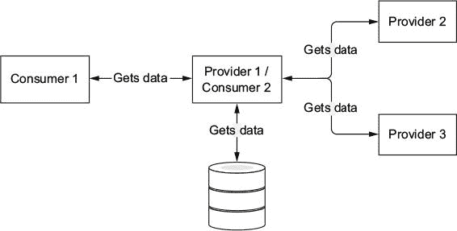

同时是提供者和消费者的提供者

避免测试中依赖项问题的解决方案取决于依赖项的类型。如果您正在处理另一个提供者，您可以使用 WireMock 的服务虚拟化方法，如第四章中所述。如果您正在使用数据源，您可以在数据库入口点使用自己的存根以及所需的数据，或者使用内存数据库，如第五章中所述。

但在所有情况下，您的部署文件都将与您在生产中使用的文件不同。它包含指向服务虚拟化实例的测试配置文件，并将它们配置为使用内存数据库或打包的替代类作为存根。在这种情况下，正如您在第四章中学到的，ShrinkWrap 和微部署有助于在测试中动态生成部署文件。

|  |
| --- |

Arquillian Algeron 还提供了一个 SPI，以便您可以实现自己的发布者，但这个主题超出了本书的范围。有关更多信息，请参阅 Arquillian Algeron 文档。

重要的是要注意，Arquillian Algeron 的消费者默认不会发布合约。这是一个安全预防措施，以避免每次在本地运行消费者测试时都发布合约。要修改此行为，您需要将 `publishContracts` 配置属性设置为 `true`。您只有在发布消费者的新版本时才应该这样做，并且此操作应由您的持续（CI/CD）环境执行。

|  |
| --- |

##### 小贴士

您可以通过使用 `${system_property}` 占位符或 `${env.environment_variable}` 占位符来使用系统属性或环境变量配置 arquillian.xml 属性。您可以通过在变量名称后跟一个冒号（`:`）和值来添加默认值。

| |
| --- |

下面是如何在 arquillian.xml 中配置 Git 发布者的一个示例：

```
<extension qualifier="algeron-consumer">
  <property name="publishConfiguration">
    provider: git                                                         *1*
    url: ${env.giturl}                                                    *2*
    username: ${env.gitusername}
    password: ${env.gitpassword}
    comment: New Contract for Version ${env.artifactversion:1.0.0}        *3*
    contractsFolder: target/pacts                                         *4*
  </property>
  <property name="publishContracts">${env.publishcontracts:false}</property>
</extension>
```

+   ***1* 设置发布者为 Git**

+   ***2* 从 giturl 环境变量中检索 Git 仓库的 URL**

+   ***3* 提交的注释字段包含版本号，如果没有提供，则为 1.0.0。**

+   ***4* 设置生成合同的目录**

此代码片段配置发布者将生成的合同推送到 Git 仓库。只有在环境变量`publishcontracts`设置为`true`时，才会执行发布过程；否则，合同将在本地目录中生成，但不会发布。

接下来，我们将探讨如何在 arquillian.xml 中配置检索器。在 arquillian.xml 中注册检索器的方法与注册发布者的方法相同。与第 6.2.3 节中提到的相同检索器，可以作为注解使用，这里也支持。

下面是如何配置检索器以从 Git 仓库获取合同的方法：

```
<extension qualifier="algeron-provider">
  <property name="retrieverConfiguration">
    provider: git
    url: ${env.giturl}
    username: ${env.gitusername}
    password: ${env.gitpassword}
  </property>
</extension>
```

格式与提供者部分的格式类似。显然，属性名和扩展名是不同的，因为检索器是提供者端的一个重要部分。

在对合同测试进行了彻底介绍之后，让我们探索如何将这些方法应用到书籍的示例中。

### 6.3\. 构建脚本修改

如你所知，合同测试在消费者端和提供者端之间分配。每个都有自己的依赖项。让我们看看使用 Pact JVM 或 Arquillian Algeron 时每个依赖项的情况。

#### 6.3.1\. 使用 Pact JVM 进行合同测试

如果你使用 Pact JVM 进行消费者驱动的合同，你需要添加依赖项。对于消费者部分，请添加以下依赖项：

```
dependencies {
  testCompile group: 'au.com.dius',
              name: 'pact-jvm-consumer-junit_2.11',
              version: '3.5.0'
}
```

对于提供者部分，请添加以下依赖项：

```
dependencies {
  testCompile group: 'au.com.dius',
              name: 'pact-jvm-provider-junit_2.11',
              version: '3.5.0'
}
```

#### 6.3.2\. 使用 Arquillian Algeron 进行合同测试

要使用 Arquillian Algeron 与 Pact JVM，你需要至少添加两个依赖项：Arquillian Algeron Pact 和 Pact 本身。

对于消费者部分，请添加以下依赖项：

```
dependencies {
  testCompile group: 'org.arquillian.algeron',
              name: 'arquillian-algeron-pact-consumer-core',
              version: '1.0.1'
  testCompile group: 'au.com.dius',
              name: 'pact-jvm-consumer_2.11',
              version: '3.5.0'
}
```

如果你使用的是 Git 发布者，也需要添加以下依赖项：

```
dependencies {
  testCompile group: 'org.arquillian.algeron',
              name: 'arquillian-algeron-consumer-git-publisher',
              version: '1.0.1'
}
```

对于提供者部分，请添加以下依赖项：

```
dependencies {
  testCompile group: 'org.arquillian.algeron',
              name: 'arquillian-algeron-pact-provider-core',
              version: '1.0.1'
  testCompile group: 'au.com.dius',
              name: 'pact-jvm-provider_2.11',
              version: '3.5.0'
}
```

如果你想与 AssertJ 集成，也请添加以下内容：

```
dependencies {
  testCompile group: 'org.arquillian.algeron',
              name: 'arquillian-algeron-pact-provider-assertj',
              version: '1.0.1'
  testCompile group: 'org.assertj',
              name: 'assertj-core',
              version: '3.8.0'
}
```

如果你使用的是 Git 检索器，请添加以下依赖项：

```
dependencies {
  testCompile group: 'org.arquillian.algeron',
              name: 'arquillian-algeron-provider-git-retriever',
              version: '1.0.1'
}
```

如果你使用的是 Maven 检索器，请添加以下依赖项：

```
dependencies {
  testCompile group: 'org.arquillian.algeron',
              name: 'arquillian-algeron-provider-maven-retriever',
              version: '1.0.1'
}
```

如果你使用的是 Pact Broker 检索器，也需要添加以下依赖项：

```
dependencies {
  testCompile group: 'org.arquillian.algeron',
              name: 'arquillian-algeron-pact-provider-pact-broker-loader',
              version: '1.0.1'
}
```

在你在构建脚本中注册了依赖项之后，你就可以开始编写合同测试了。

### 6.4\. 为 Gamer 应用程序编写消费者驱动的合同

让我们为当前应用程序中提供的唯一消费者编写一个合同测试：聚合服务。我们还将展示提供者端，它验证给定的合同。在这种情况下，测试是在主项目中的新模块/子项目中创建的，例如，称为 c-tests。

#### 6.4.1\. 评论服务的消费者端

聚合服务与游戏和评论等服务进行通信，因此它实际上是所有这些服务的消费者。让我们看看如何编写聚合服务与评论服务之间的合同。负责与评论服务通信的类是`book.aggr.CommentsGateway`。这是一个简单的`boundary`类，作为聚合服务与评论服务之间的网关。你将使用 Arquillian Algeron，以利用其发布功能。

首先，这是存储评论的合同（code/aggregator/c-tests/src/test/java/book/aggr/CommentsContractTest.java）。

##### 列表 6.8\. 存储评论

```
@RunWith(Arquillian.class)                                              *1*
@Pact(provider = "comments_service", consumer =
        "games_aggregator_service")                                     *2*
public class CommentsContractTest {

    private static final String commentObject = "{" + "  'comment' " +
            ": 'This Game is Awesome'," + "  'rate' : 5," + "  " +
            "'gameId': 1234" + "}";

    private static final String commentResult = "{" + "   'rate': " +
            "5.0," + "   'total': 1," + "   'comments': ['This Game" +
            " is Awesome']" + "}";

    public PactFragment putCommentFragment(PactDslWithProvider
                                                   builder) {           *3*
        final Map<String, String> headers = new HashMap<>();
        headers.put("Content-Type", "application/json");

        return builder.uponReceiving("User creates a new comment")
                .path("/comments").method("POST").headers(headers)
                .body(toJson(commentObject))                            *4*
                .willRespondWith().status(201).matchHeader
                        ("Location", ".*/[0-9a-f]+",
                                "/comments/1234").toFragment();
    }

    @Test
    @PactVerification(fragment = "putCommentFragment") //               *5*
    public void shouldInsertCommentsInCommentsService() throws
            ExecutionException, InterruptedException {

        final CommentsGateway commentsGateway = new CommentsGateway();
        commentsGateway.initRestClient(url.toString()); //
        //                                                              *6*

        JsonReader jsonReader = Json.createReader(new StringReader
                (toJson(commentObject)));
        JsonObject commentObject = jsonReader.readObject();
        jsonReader.close();

        final Future comment = commentsGateway
                .createComment(commentObject);

        final Response response = comment.get();
        final URI location = response.getLocation();

        assertThat(location).isNotNull();
        final String id = extractId(location);

        assertThat(id).matches("[0-9a-f]+");
        assertThat(response.getStatus()).isEqualTo(201);

    }
```

+   ***1* Arquillian 测试运行器**

+   ***2* 设置带有消费者和提供者名称的 Pact 注解**

+   ***3* 创建定义发布评论合同的 PactFragment**

+   ***4* 设置正文消息**

+   ***5* 将方法配置为 putCommentFragment 中定义的片段的合同验证器**

+   ***6* 连接到 HTTP 存根服务器**

这个测试使用 Arquillian standalone，因为没有`@Deployment`方法。在这个阶段，你不需要将任何内容部署到容器中。向评论服务发送评论的合同定义在`putCommentFragment`中，它定义了带有预期正文和预设响应的合同。最后，还有验证`CommentsGateway`类按预期工作的断言。

现在，让我们编写获取特定`gameId`评论的合同（code/aggregator/c-tests/src/test/java/book/aggr/CommentsContractTest.java）。在这种情况下，你需要设置一个状态，告诉提供者当合同与它验证时，你期望返回哪些数据。

##### 列表 6.9\. 获取游戏的评论

```
@StubServer
URL url;

public PactFragment getCommentsFragment(PactDslWithProvider
                                                builder) {

    final Map<String, String> headers = new HashMap<>();
    headers.put("Content-Type", "application/json");

    return builder.given("A game with id 12 with rate 5 and " +
            "message This Game is Awesome")                          *1*
            .uponReceiving("User gets comments for given Game")
            .matchPath("/comments/12").method("GET")
            .willRespondWith().status(200).headers(headers)
            .body(toJson(commentResult)).toFragment();

}

@Test
@PactVerification(fragment = "getCommentsFragment")
public void shouldGetComentsFromCommentsService() throws
        ExecutionException, InterruptedException {
    final CommentsGateway commentsGateway = new CommentsGateway();
    commentsGateway.initRestClient(url.toString());

    final Future<JsonObject> comments = commentsGateway
            .getCommentsFromCommentsService(12);
    final JsonObject commentsResponse = comments.get();

    assertThat(commentsResponse.getJsonNumber("rate")
            .doubleValue()).isEqualTo(5);                           *2*
    assertThat(commentsResponse.getInt("total")).isEqualTo(1);
    assertThat(commentsResponse.getJsonArray("comments"))
            .hasSize(1);

}
```

+   ***1* 设置状态信息**

+   ***2* 断言响应**

注意，合同的定义与上一个类似。最大的区别是使用了`given`方法来设置状态。在这种情况下，你正在设置在提供者端所需的数据。

最后，你需要配置 Arquillian Algeron，以便在共享位置发布合同，以便提供者可以检索和验证它们（code/aggregator/c-tests/src/test/resources/arquillian.xml）。为了简化，这里使用了文件夹方法，但在现实世界中你可能会使用 Git 仓库。

##### 列表 6.10\. 在共享位置发布合同

```
<?xml version="1.0"?>
<arquillian
xsi:schemaLocation="http://jboss.org/schema/arquillian
http://jboss.org/schema/arquillian/arquillian_1_0.xsd"

>
    <extension qualifier="algeron-consumer">
        <property name="publishConfiguration"> provider: folder
          outputFolder: /tmp/mypacts
          contractsFolder: target/pacts
        </property>
        <property name="publishContracts">
          ${env.publishcontracts:true}
        </property>
    </extension>
</arquillian>
```

现在你已经为消费者端写好了合同，让我们看看你需要做什么来验证它是否符合提供者端。

#### 6.4.2\. 评论服务的提供者端

为了验证消费者端生成的合约，您需要在提供者项目中创建一个测试，该测试下载合约并在提供者的运行实例上回放它们（code/comments/c-tests/src/test/java/book/comments/boundary/CommentsProviderTest.java）。您需要部署真实的评论服务，因此使用 Arquillian Algeron 是一个不错的选择：它负责创建部署文件并将其部署到应用程序服务器。合约存储在与前一个部分中讨论的`publishConfiguration`属性定义的同一文件夹中。

##### 列表 6.11\. 在提供者端测试评论服务

```
@RunWith(Arquillian.class)
@ContractsFolder(value = "/tmp/mypacts")                                 *1*
@Provider("comments_service")                                            *2*
public class CommentsProviderTest {

    static {                                                             *3*
        System.setProperty("MONGO_HOME",
                "/mongodb-osx-x86_64-3.2.7");
    }

    @ClassRule                                                           *4*
    public static ManagedMongoDb managedMongoDb =
            newManagedMongoDbRule().build();

    @Rule                                                                *5*
    public MongoDbRule remoteMongoDbRule = new MongoDbRule(mongoDb
            ().databaseName("test").host("localhost").build());

    @Deployment(testable = false)                                        *6*
    public static WebArchive createDeployment() {
        final WebArchive webArchive = ShrinkWrap.create(WebArchive
                .class).addPackage(CommentsResource.class
                .getPackage()).addClass(MongoClientProvider.class)
                .addAsWebInfResource("test-resources.xml",
                        "resources.xml").addAsWebInfResource
                        (EmptyAsset.INSTANCE, "beans.xml")
                .addAsLibraries(Maven.resolver().resolve("org" +
                        ".mongodb:mongodb-driver:3.2.2")
                        .withTransitivity().as(JavaArchive.class));

        return webArchive;
    }

    private static final String commentObject = "{" + "  'comment' " +
            ": '%s'," + "  'rate' : %d," + "  'gameId': %d" + "}";

    @State("A game with id (\\d+) with rate (\\d+) and message (.+)")
    public void insertGame(int gameId, int rate, String message)
            throws MalformedURLException {                               *7*

        RestAssured.given().body(toJson(String.format
                (commentObject, message, rate, gameId)))
                .contentType(ContentType.JSON).post(new URL
                (commentsService, "comments")).then().statusCode(201);

    }

    @ArquillianResource
    URL commentsService;

    @ArquillianResource                                                  *8*
    Target target;

    @Test
    @UsingDataSet(loadStrategy = LoadStrategyEnum.DELETE_ALL)            *9*
    public void should_provide_valid_answers() {
        PactProviderAssertions.assertThat(target).withUrl
                (commentsService).satisfiesContract();
    }
```

+   ***1* 设置合约位置**

+   ***2* 配置提供者**

+   ***3* 设置 MongoDB 主目录**

+   ***4* 使用 NoSQLUnit 管理的 MongoDB**

+   ***5* 配置 MongoDB 远程连接**

+   ***6* 确保测试以客户端模式运行**

+   ***7* 从合约定义中向提供者注入所需数据**

+   ***8* 注入用于回放合约的目标类**

+   ***9* 每次运行后清理数据库**

|  |
| --- |

##### 警告

在运行测试之前，务必将合约位置和 MongoDB 主目录适配到您的环境中。

|  |
| --- |

此测试通过启动 MongoDB 数据库和 Apache TomEE 来准备环境。然后它部署应用程序并针对配置的环境回放合约。请注意以下三个重要事项：

+   您使用 NoSQLUnit 来准备 MongoDB 环境。NoSQLUnit 可用于集成测试，正如您在第五章中看到的，以及任何其他类型的测试。

+   状态方法`insertGame`仅由定义消费者端状态的合约部分使用。这是合约中验证从服务接收评论的部分。

+   在状态方法中，测试使用 POST 方法填充数据，因此您实际上正在使用评论服务端点将数据插入数据库。您使用`RestAssured`测试框架来完成此目的。

图 6.12 总结了运行此测试时的生命周期。首先，Arquillian 测试使用 NoSQLUnit 启动系统属性/环境变量`MONGO_HOME`上安装的 MongoDB 的一个实例。然后，它启动 Apache TomEE 的一个实例并在其中部署评论服务。如果合约定义了一个形式为`A game with id (\d+) with rate (\d+) and message (.+)`的状态，则使用评论服务在 MongoDB 中填充一些数据。最后，测试回放每个合约，在每次执行前清理数据库。

##### 图 6.12\. 测试生命周期

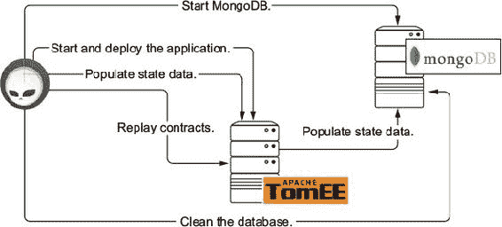

### 6.5\. 合约类型总结

以下表格总结了我们所讨论的合约类型。

##### 表 6.1\. 消费者、提供者和消费者驱动合约

| 合约 | 完成 | 数量 | 有界 |
| --- | --- | --- | --- |
| 提供者 | 是 | 单一 | 空间/时间 |
| 消费者 | 否 | 多个 | 空间/时间 |
| 消费者驱动 | 是 | 单一 | 消费者 |

提供者和消费者驱动的方案是**完整**的：它们提供了一套完整的功能。从系统可用的功能角度来看，消费者驱动的合同是不完整的。此外，提供者和消费者驱动的方案在表达业务功能方面是**单一**的；但消费者驱动的方案，每个消费者都有自己的合同。

### 练习

现在，你应该能够编写任何一对消费者/提供者测试。我们建议你尝试定义游戏服务的消费者端，然后是提供者端。

|  |
| --- |

##### 小贴士

请参阅第四章，其中介绍了使用 Arquillian 为 WildFly Swarm 编写测试。

|  |
| --- |

### 摘要

+   使用消费者驱动的合同可以提供测试的更快执行。

+   你不会得到不可靠的测试，因为使用 HTTP 存根服务器，你总是收到可靠的响应。

+   测试在消费者和提供者之间分割，因此更容易识别失败的原因。

+   将消费者驱动的合同纳入是设计过程的一部分。

+   消费者驱动的合同并不意味着**独裁者**驱动的合同。合同是协作努力的起点，始于消费者端，但双方都必须参与其中。

+   使用合同测试，你可以避免从消费者方面知道如何打包和部署提供者端。消费者端只需要知道如何部署其部分。当你验证提供者的合同时，提供者知道如何部署自己以及如何模拟/存根自己的依赖。这与端到端测试有巨大差异，在端到端测试中，你必须启动一个完整的环境才能运行测试。

+   消费者驱动的合同不一定总是最佳的方法。通常是的，但在某些情况下（如第 6.1.5 节中描述的情况），你可能想使用提供者驱动的合同或消费者合同。
