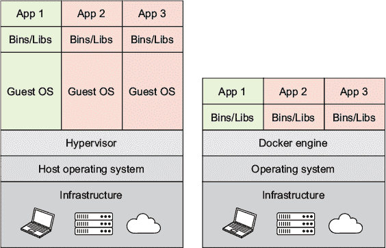
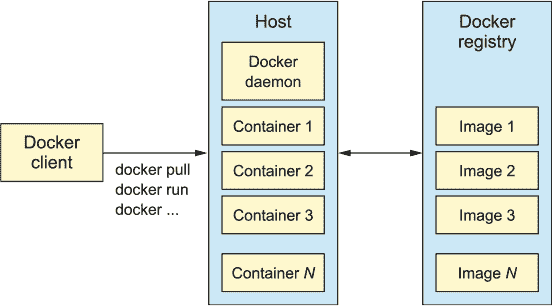
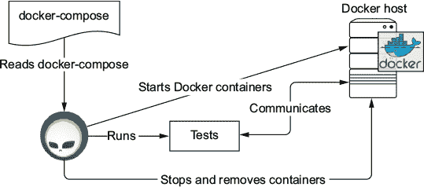
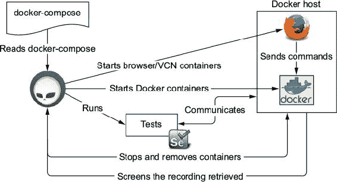
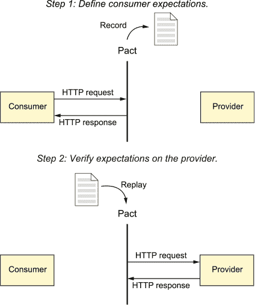
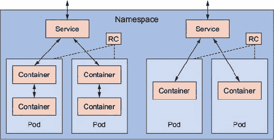
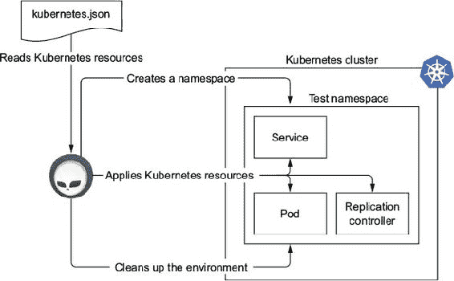

## 第八章\. Docker 与测试

*本章涵盖*

+   处理高级测试的困难

+   理解 Docker 如何帮助你进行测试

+   创建可重复的测试环境

+   与 Arquillian Cube 一起工作

本书传达的一个反复出现的消息，也是大多数开发者会同意的一个消息，就是高级测试意味着测试速度较慢——并且通常需要大量的努力来准备运行测试的环境。你在第五章中遇到了这种情况，你学习了要编写针对数据库的集成测试，你需要一个包含你将在生产中使用的数据库的环境。同样的事情发生在第七章中，你看到了你可能需要部署一个或多个微服务及其数据库。对于 Web 前端，你可能还需要安装特定的浏览器。

当你想测试应用程序的整体情况时，你需要在你的环境中添加更多组件来使其运行。以下是一些：

+   数据库

+   其他微服务

+   多个浏览器

+   分布式缓存

问题在于首先，你需要定义你的测试环境；其次，你必须提供一个运行时来运行此配置。这很可能不是你的开发机器，这对开发者来说是一个缺点，因为你将失去在本地重现或调试任何给定问题的可能性。远程调试，尽管不是不可能，但更加复杂。

使用 Docker 可以缓解这些问题。Docker 允许开发者在其本地机器上运行测试环境。

### 8.1\. Docker 生态系统中的工具

Docker 生态系统包括几个工具，如 Docker Compose、Docker Machine 以及与生态系统集成的库，如 Arquillian Cube。本节介绍了其中的一些概述。

#### 8.1.1\. Docker

Docker 是一个开源平台，它简化了在*容器*中创建、部署和运行应用程序的过程。想象一下，容器就像一个盒子，你可以在其中部署一个应用程序以及它需要的所有依赖项，整洁地打包。以这种方式打包应用程序，你可以确保应用程序将在一个定义良好的环境中运行（由容器提供），而不管底层操作系统是什么。这使得你可以将容器从一个机器移动到另一个机器——例如，从开发机器到生产机器——而不用担心外部配置。 

你可以将 Docker 想象成一个虚拟机，但不需要你自己安装和设置整个操作系统。Docker 无论容器实际在哪里运行，都重新使用相同的 Linux 内核。这种方法给你的启动时间带来了显著的性能提升，并减少了应用程序的大小。

图 8.1 显示了虚拟机与 Docker 容器的比较。主要区别在于，每个应用程序不需要一个客户操作系统，容器是在机器操作系统之上运行的。

##### 图 8.1\. 虚拟机与容器的比较



要运行 Docker 容器，您至少需要三个组件：

+   *Docker client*—一个命令行界面（CLI）程序，将用户的命令发送到安装/运行 Docker 守护进程的主机。

+   *Docker daemon*—一个在主机操作系统上运行的程序，执行所有主要操作，如构建、运输和运行 Docker 容器。在开发和测试阶段，Docker 守护进程和 Docker 客户端可能运行在同一台机器上。

+   *Docker registry*—一个用于共享 Docker 镜像的工件存储库。在[`hub.docker.com`](http://hub.docker.com)有一个公共 Docker 注册库。

| |
| --- |

##### 注意

镜像和容器的区别在于，*镜像*包含了所有组件，如应用程序和配置参数。它没有状态且永远不会改变。另一方面，*容器*是 Docker 守护进程上运行的镜像的运行实例。

| |
| --- |

图 8.2 显示了 Docker 架构的方案。Docker 客户端与 Docker 守护进程/主机通信以执行命令。如果主机上没有所需的 Docker 镜像，它将从 Docker 注册库下载。最后，Docker 主机从给定的镜像实例化一个新的容器。

##### 图 8.2\. Docker 架构方案



使用 Docker 客户端从 Docker 注册库检索镜像并在 Docker 主机上运行可能如下所示：

```
docker pull jboss/wildfly                           *1*
docker run -ti -p 8080:8080 jboss/wildfly           *2*
```

+   ***1* 从 Docker 注册库将镜像拉取（下载）到 Docker 主机**

+   ***2* 在 Docker 主机上启动 JBoss/WildFly 容器**

执行上述命令后，您可以在浏览器中导航到 http://<dockerHostIp>:8080，在那里您应该看到图 8.3 中显示的 WildFly 服务器欢迎页面。

##### 图 8.3\. 欢迎使用 WildFly


现在您已经了解了 Docker 的基本知识，让我们看看一个名为*Docker Machine*的 Docker 工具。

#### 8.1.2\. Docker Machine

*Docker Machine*帮助您在 VirtualBox 和 VMware 等虚拟化平台上创建 Docker 主机。它还支持大多数流行的基础设施即服务（IaaS）平台，如亚马逊网络服务（AWS）、Azure、DigitalOcean、OpenStack 和谷歌计算引擎。除了在指定主机上安装 Docker 外，它还配置 Docker 客户端以与它们通信。

通常情况下，在开发机器上使用 VirtualBox 的虚拟化方法是最佳选择。请注意，在这种情况下，您需要安装 VirtualBox，因为 Docker Machine 不会执行此安装步骤。

要创建安装了 Docker 的 VirtualBox 镜像，请运行以下命令：

```
docker-machine create --driver virtualbox dev
```

经过一段时间，所有内容都将安装并准备好在本地机器上使用。最后的步骤是开始创建 VirtualBox 镜像，并配置客户端指向该实例：

```
docker-machine start dev                *1*
eval $(docker-machine env dev)          *2*
```

+   ***1* 启动名为 dev 的主机**

+   ***2* 配置 Docker 客户端环境变量**

|  |
| --- |

**本地机器上的 Docker**

如果你想在本地机器上使用 Docker Machine，最佳入门方式是使用 Docker Toolbox。它适用于 Windows 和 macOS 系统。

Docker Machine 有一个安装程序，它安装以下工具：

+   Docker 客户端

+   Docker Machine

+   Docker Compose

+   Oracle VirtualBox

+   Kitematic (Docker GUI) 和预配置的 shell

|  |
| --- |

#### 8.1.3\. Docker Compose

*Docker Compose* 是一个由两个元素组成的容器多管理工具：

+   一种 YAML 格式，描述了一个或多个容器，它们协同工作以形成应用程序。它还指定了容器如何相互交互，以及一些其他信息，如网络、卷和端口。

+   一个 CLI 工具，用于读取 Docker Compose 文件并创建由文件定义的应用程序。

默认情况下，任何 Docker Compose 文件都应命名为 docker-compose.yml。一个简单的 docker-compose.yml 文件可能看起来像以下这样。

##### 列表 8.1\. docker-compose.yml

```
tomcat:                             *1*
  image: tutum/tomcat:7.0           *2*
  ports:                            *3*
    - "8081:8080"
  links:                            *4*
    - pingpong:pingpong

pingpong:
  image: jonmorehouse/ping-pong
```

+   ***1* 定义了一个容器名称**

+   ***2* 设置要使用的镜像**

+   ***3* 定义了一对绑定/暴露端口**

+   ***4* 定义了容器之间的链接，形式为 [service-name:alias]**

当你在 列表 8.1 中的文件上从终端运行 `docker-compose up` 时，将启动两个容器：*tomcat* 和 *pingpong*。它们通过名为 *pingpong* 的 `link` 连接在一起。Tomcat 服务的端口 8081 对 Docker 主机的客户端暴露，将所有流量转发到内部容器端口 8080。如果未指定别名，容器可以通过与别名或服务名称相同的主机名访问。

Docker Compose 最好的测试相关特性之一是扩展功能。它允许你在不同的文件之间共享常见的配置片段。

让我们看看使用 `extend` 关键字的 Docker Compose 文件的一个示例。你应该首先在 Docker Compose 文件中定义一个常见的或抽象的容器定义，其他容器可以扩展它，默认情况下，该文件不应命名为 docker-compose.yml。你应该努力遵循命名约定，即名为 docker-compose.yml 的文件是运行系统将使用的 *唯一* 文件，因此让我们将此文件命名为 common.yml。

##### 列表 8.2\. common.yml

```
webapp:
  image: myorganization/myservice
  ports:
    - "8080:8080"
  volumes:
    - "/data"
```

这里没有比之前定义的新内容，只是定义了一个名为 `webapp` 的新服务。现在，让我们定义 docker-compose.yml 文件以使用 common.yml，并为该服务设置新的参数。

##### 列表 8.3\. docker-compose.yml

```
web:
  extends:                 *1*
    file: common.yml       *2*
    service: webapp        *3*
  environment: #           *4*
    - DEBUG=1
```

+   ***1* 开始一个扩展部分**

+   ***2* 设置可扩展文件的存储位置**

+   ***3* 设置要扩展的元素**

+   ***4* 设置/覆盖属性**

你可以在终端中运行 `docker-compose`：

```
docker-compose -f docker-compose.test.yml up
```

如你所见，使用 Docker 和 Docker Compose，你可以轻松定义可以在任何需要运行测试的机器上使用的测试环境。使用这些工具结合的两个主要优势如下：

+   每个运行测试的环境都包含所需库、依赖项和/或服务器的确切版本。无论运行在哪些物理机器上：可能是开发、测试或预生产机器。它们都包含相同的运行组件。

+   除了 Docker 之外，你不需要在测试机器上安装任何东西。其他所有内容都在运行时解决。

|  |
| --- |

##### 注意

本章提供了一个关于 Docker Compose 的非常基本的介绍，我们鼓励你到 [`docs.docker.com/compose`](https://docs.docker.com/compose) 学习更多。

| |
| --- |

### 8.2\. Arquillian Cube

到目前为止，你已经了解到 Docker 和 Docker Compose 是测试的理想搭档。它们应该帮助你定义可靠且可重复的测试环境，这样每次执行测试时，你都知道环境已经正确设置。

问题在于你需要手动运行 `docker-compose up` 或在构建工具中添加一个步骤来启动它，然后再执行测试。你还需要处理 Docker 主机 IP 地址，它可能是 `localhost`——但并不一定是，因为它可能是一个 Docker 机器或远程 Docker 主机。

虽然手动启动 Docker Compose 可能是一个好的方法，但我们的观点是测试应该尽可能地自我执行，而不需要人工干预或复杂的运行时。你已经猜到了：有一个酷炫的 Arquillian 扩展可以帮助你实现目标。*Arquillian Cube* 是一个扩展，可以在 Arquillian 测试中管理 Docker 容器。它使用的方法类似于 Arquillian Core 用于应用服务器的方法，但进行了修改以适应 Docker 容器。Arquillian Cube 可以用于以下场景：

+   准备高级测试的测试环境

+   测试 Dockerfile 组合

+   验证 Docker Compose 组合

+   白盒和黑盒测试

如 图 8.4 所示，在执行测试之前，Arquillian Cube 读取 Docker Compose 文件并按正确顺序启动所有容器。然后 Arquillian 等待直到所有服务都启动并运行，以便它们能够接收传入的连接。之后，在测试环境中执行测试。执行完成后，所有正在运行的容器都会停止并被从 Docker 主机中移除。

##### 图 8.4\. Arquillian Cube 生命周期



使用 Arquillian Cube，您的基于 Docker 的测试将完全自动化。您可以使用 Docker Compose 格式定义您的测试环境，Arquillian 运行器将为您处理所有事情。这再次让您，作为开发者，有更多时间编写实际的测试。

|  |
| --- |

##### 注意

并非必须使用 Docker 进行生产。您也可以仅利用 Docker 准备一个有效的测试环境。

|  |
| --- |

当在生产环境中使用 Docker 时，您可以使用 Arquillian Cube 编写测试来验证您的容器镜像是否正确创建，或者例如，容器是否可启动并且可以从 Docker 主机外部访问。显然，在生产环境中，您可以使用几乎与创建测试环境相同的 Docker Compose 文件，并验证所有定义的容器是否可以相互通信以及环境变量是否设置正确。

其潜在用途是无限的，因为使用 Arquillian Cube 和 Docker 进行测试的方法有无数种。我们将在以下章节中介绍最常见的使用案例。

#### 8.2.1\. 设置 Arquillian Cube

Arquillian Cube 需要您设置几个参数。它使用一些默认参数，这些参数*可能*在大多数情况下都适用，还有一些参数是智能地从环境中推断出来的。有时您可能需要修改这些自动定义的参数。表 8.1 描述了可以在 arquillian.xml 文件中设置的最重要的配置属性。

##### 表 8.1\. Arquillian Cube 参数

| 属性 | 描述 | 默认行为 |
| --- | --- | --- |
| serverUri | 容器将要实例化的 Docker 主机的 URI。 | 如果设置了环境变量 DOCKER_HOST，则获取其值；否则，对于 Linux，它设置为 unix:///var/run/docker.sock，而在 Windows 和 macOS 上设置为 https://<docker_host_ip>;:2376。docker_host_ip 由 Arquillian Cube 自动解析，通过获取 boot2docker 或 docker machine IP。 |
| dockerRegistry | 设置从其中下载镜像的 Docker 仓库的位置。 | 默认情况下，这是公共 Docker 仓库 [`registry.hub.docker.com`](https://registry.hub.docker.com)。 |
| 用户名 | 设置连接到 Docker 仓库的用户名。（您需要一个账户。） |   |
| 密码 | 设置连接到 Docker 仓库的密码。（您需要一个账户。） |   |
| dockerContainers | 将 Docker Compose 内容作为 Arquillian 属性嵌入，而不是作为 Docker Compose 文件。 |   |
| dockerContainersFile | 设置 Docker Compose 文件的位置。位置相对于项目根目录；但也可以是一个 URI，它将被转换为 URL，因此您可以在远程站点上有效地拥有 Docker Compose 定义。 |   |
| dockerContainersFiles | 设置逗号分隔的 Docker Compose 文件位置列表。内部，所有这些位置都被追加到一个文件中。 |   |
| tlsVerify | 设置 Arquillian Cube 是否应使用传输层安全性 (TLS) 连接到 Docker 服务器的一个布尔值。 | 如果设置了 TLS_VERIFY 环境变量，则获取该值；否则，如果服务器 Uri 方案是 http，则自动设置为 false；如果是 https，则设置为 true。您可以通过设置此属性来强制设置一个值。 |
| certPath | 如果您使用 HTTPS，则证书存储的路径。 | 如果设置了 DOCKER_CERT_PATH 环境变量，则获取该值；否则，从 boot2docker 或 docker-machine 解析位置。您可以通过设置此属性来强制设置一个值。 |
| machineName | 如果您使用 Docker Machine 来管理您的 Docker 主机，则设置机器名称。 | 如果设置了 DOCKER_MACHINE_NAME 环境变量，则获取该值；否则，如果当前 Docker 机器实例中只有一个机器正在运行，则自动解析机器名称。您可以通过设置此属性来强制设置一个值。 |
| |

##### 提示

请记住，可以使用 `${system_property}` 占位符或 `${env.environment_variable}` 占位符通过系统属性或环境变量来配置 arquillian.xml 配置属性。

| |
| --- |
| |

**Arquillian Cube 连接模式**

测试环境会为每个测试套件启动和停止。这意味着，根据元素的启动时间，测试时间可能会受到影响，尤其是在小型测试套件中。

使用 Arquillian Cube，您可以选择绕过在具有相同容器名称的 Docker 主机上已运行的 Docker 容器的创建/启动。这允许您预先启动容器（例如，在持续集成 [CI] 构建脚本中或在工作开始之前），并连接到它们以避免测试执行期间的额外开销。

下面是一个如何配置 `connectionMode` 属性的示例：

```
<extension qualifier="cube">;
  <property name="connectionMode">;STARTORCONNECT</property>;
</extension>;
```

您可以为该属性设置以下模式：

+   `STARTANDSTOP`—默认模式，如果没有指定。创建并停止所有 Docker 容器。

+   `STARTORCONNECT`—如果已运行具有相同容器名称的容器且该容器在测试完成后不会被终止，则绕过创建/启动步骤。如果为 Cube 配置的容器尚未运行，则 Arquillian 将在执行结束时启动它*并停止它*，其行为类似于 `STARTANDSTOP` 模式。

+   `STARTORCONNECTANDLEAVE`—与 `STARTORCONNECT` 模式完全相同；但如果容器是由 Arquillian Cube 启动的，则在执行结束时它*不会停止*，因此可以在下一个周期中重用。

| |
| --- |

现在，您已经熟悉了 Arquillian Cube 中的常见配置参数，让我们来探索如何使用它编写测试。

#### 8.2.2\. 编写容器测试

我们将为 Arquillian Cube 覆盖的第一个用例是验证服务中定义的 Dockerfile 是否正确用于将应用程序容器化。尽管您可以执行多个检查，但最常见的是以下内容：

+   Docker 能够无错误地构建镜像。

+   服务暴露了正确的端口。

+   服务已正确启动并且可以正确地服务传入的请求。

首先，在 arquillian.xml 中配置 Docker，然后创建一个最小化的脚本，用于构建和运行测试中的镜像。

##### 列表 8.4\. 配置 Docker

```
<?xml version="1.0"?>;
<arquillian 

  xsi:schemaLocation="http://jboss.org/schema/arquillian
  http://jboss.org/schema/arquillian/arquillian_1_0.xsd">;

  <extension qualifier="docker">;
    <property name="machineName">;dev</property>;       *1*
    <property name="dockerContainers">;                 *2*
      myservice:
        build: ./docker
        ports:
          - "8080:8080"
    </property>;
  </extension>;

</arquillian>;
```

+   ***1* 只有在使用 Docker Machine 时才需要这一行。**

+   ***2* 在 Docker Compose 格式中定义如何构建和运行镜像**

当你使用 Docker Machine 并且有多个机器运行时，名为`dev`的机器用于构建和运行测试中的 Docker 容器。然后，使用`dockerContainers`属性，你嵌入一个 Docker Compose 容器定义，从位于 docker 目录中的预期 Dockerfile 构建镜像，并暴露端口 8080。如前所述，Dockerfile 是 Docker 定义的默认文件名。Dockerfile 可能看起来像以下这样：

```
FROM tomee:8-jdk-7.0.2-webprofile

ADD build/libs/myservice.war /usr/local/tomee/webapps/myservice.war
EXPOSE 8080
```

这里定义的镜像基于 Apache TomEE `tomee:8-jdk-7.0.1-webprofile` Docker 镜像。`ADD`命令将你的项目部署 WAR 文件添加到指定的镜像路径——在这个镜像中，TomEE 热部署路径是/usr/local/tomee/webapps/，因此在这里添加 WAR 文件将自动部署应用程序。最后，`EXPOSE`命令将 TomEE HTTP 端口 8080 暴露给外部世界。

使用这些信息，你可以编写一个测试来验证镜像是否正确构建，是否暴露了正确的端口，并且运行正确。

##### 列表 8.5\. 验证镜像

```
@RunWith(Arquillian.class)                                                 *1*
public class DockerImageCreationTest {

  @ArquillianResource                                                      *2*
  private DockerClient docker;

  @HostIp                                                                  *3*
  private String dockerHost;

  @HostPort(containerName = "myservice", value = 8080)                     *4*
  private int myservicePort;

  @Test
  public void should_expose_correct_port() throws Exception {
    assertThat(docker)
      .container("myservice")
      .hasExposedPorts("8080/tcp");                                        *5*
  }

  @Test
  public void should_be_able_to_connect_to_my_service() throws Exception {
    assertThat(docker)
      .container("myservice")
      .isRunning();                                                        *6*

    final URL healthCheckURL = new URL("http", dockerHost,
 myservicePort, "health");
    String healthCheck = getHealthCheckResult(healthCheckURL);
    assertThat(healthCheck).isEqualTo("OK");                               *7*
  }

}
```

+   ***1* Arquillian 运行器**

+   ***2* 测试中增加了 Docker 客户端以访问 Docker 主机。**

+   ***3* 测试中增加了 Docker 主机 IP。**

+   ***4* 获取容器 myservice 暴露的端口 8080 的绑定端口**

+   ***5* 断言构建的镜像正在暴露端口 8080**

+   ***6* 断言容器正在运行**

+   ***7* 断言健康检查端点返回服务正在运行和运行中**

关于这个测试有几个需要注意的点。首先，你应用了 Arquillian 运行器，但没有`@Deployment`方法。这是因为这些测试不需要在应用服务器中部署任何内容：容器镜像接收运行测试所需的部署文件，服务器已经启动。你实际上是在使用 Arquillian 提供的所有元素，但没有部署任何内容。

|  |
| --- |

##### 注意

任何没有使用`@Deployment`注解方法的测试都必须使用`arquillian-junit-standalone`或`arquillian-testng-standalone`依赖项，而不是`container`依赖项。所有测试都在 as-client 模式下运行，因为它们不能部署到应用服务器。

|  |
| --- |

第二点需要注意的是，Arquillian Cube 为测试提供了一些增强器。在这个测试中，注入了 `DockerClient` 对象。这个对象为你提供了一些强大的操作，用于与 Docker 主机通信并获取正在运行的容器的信息。此外，测试通过 `dockerHost` 变量增强了 Docker 主机 IP 或主机名。容器暴露的端口 8080 的绑定端口也作为 `myservicePort` 变量注入。这些变量提供了允许测试与 TomEE 服务器和托管应用程序通信的信息。

最后但同样重要的是，测试方法用于验证 Dockerfile 是否正确配置，构建是否正确，以及它所暴露的服务是否正确部署。Arquillian Cube 提供了自定义 AssertJ 断言。例如，你可以编写断言来断言在 Docker 主机中实例化了特定的 Docker 镜像，或者端口已暴露，或者特定进程按预期运行。

如果由 Dockerfile 定义的构建失败，Arquillian Cube 会抛出异常，导致测试失败。使用部署服务的端点健康检查来验证在 Docker 容器中部署的微服务是否正常运行。

测试执行后，Arquillian Cube 会从 Docker 主机中删除构建的镜像。这确保了每次运行测试时磁盘空间不会增加，并且确保每个测试都是独立于下一个测试运行的。

接下来，让我们看看如何使用 Arquillian Cube 来测试更复杂的场景，如集成测试。

#### 8.2.3. 编写集成测试

你在第五章中了解到，验证两个系统之间的连接是可能的，例如微服务与数据库（如 SQL 或 NoSQL）之间的通信，或者两个微服务之间的通信。在这种情况下，测试你的网关代码针对任何你将在生产中使用的真实系统是很正常的。与通常使用存根或模拟的 *组件测试* 相比，这是一个很大的不同。

集成测试的最大挑战是如何一致地设置环境来运行这些测试。例如，你可能需要在开发人员和 CI 机器上使用与生产中相同的数据库。你可能还需要一种方法来部署实际测试的微服务的所有依赖微服务。此外，确保所有环境中机器的版本保持一致并不是一个简单任务。在 Docker 之前，这种设置没有所有机器上的所有内容就很难实现。

你已经看到 Docker 和 Docker Compose 可以帮助你为测试准备一个一致的环境，以及 Arquillian Cube 如何帮助自动化这个过程。在本节中，我们将查看一个示例。

|  |
| --- |

**Arquillian 部署和 Docker**

正如我们在第四章中所述，Arquillian 有三种方式来管理应用服务器：

+   *嵌入式*—应用服务器与测试运行时（IDE、构建工具等）共享相同的 JVM 和类路径。

+   *管理*—应用服务器独立于测试运行时启动。它实际上创建了一个新的 JVM，与实际的测试 JVM 无关。

+   *远程*—Arquillian 不管理应用服务器的生命周期。它期望重用已经启动并运行的实例。

有了这个想法，你可以使用 Arquillian 将你的（微）部署文件部署到运行在 Docker 容器中的应用服务器中。从 Arquillian 的角度来看，这个应用服务器实例是一个远程实例，其生命周期由第三方（在这种情况下，Docker）管理。

回想一下，类路径中的运行时适配器是 Arquillian 知道如何管理应用服务器生命周期的方式。例如，在 Apache Tomcat 的情况下，对于远程模式，您需要定义 `org.jboss.arquillian.container:arquillian-tomcat-remote-7:1.0.0.CR7` 依赖项。

如您所见，可以利用（微）部署并使用 Docker 来设置（部分）环境。

|  |
| --- |

让我们使用 Arquillian Cube 创建一个集成测试，以测试服务与其数据库之间的集成。你将使用微部署方法来打包与持久层相关的类。为了添加到之前的 Docker Compose 文件格式，请确保使用 Docker Compose 格式版本 2 而不是版本 1。

以下列表显示了测试的外观。

##### 列表 8.6\. 集成测试

```
@RunWith(Arquillian.class)
public class UserRepositoryTest {

  @Deployment
  public static WebArchive create() {                                *1*
    return ShrinkWrap.create(WebArchive.class)
            .addClasses(User.class, UserRepository.class,
                                            UserRepositoryTest.class)
            .addAsWebInfResource(EmptyAsset.INSTANCE, "beans.xml")
            .addAsResource("test-persistence.xml", "META-INF/persistence.xml")
            .addAsManifestResource(new StringAsset(
                                          "Dependencies: com.h2database.h2\n"),
                                  "MANIFEST.MF");
  }

  @Inject
  private UserRepository repository;

  @Test
  public void shouldStoreUser() throws IOException {
    repository.store(new User("test"));
    User user = repository.findUserByName("test");

    assertThat(user.getName()).isEqualTo("test");
  }
}
```

+   ***1* 仅使用所需的持久层类和文件创建微部署**

这与运行任何其他 Arquillian 测试没有不同，因此测试不会知道它是在本地还是远程实例上运行。

|  |
| --- |

##### 提示

如果需要，您还可以在这些测试中受益于使用 Arquillian Persistence 扩展。

|  |
| --- |

下一步是定义一个 docker-compose.yml 文件，该文件启动服务器和数据库。

##### 列表 8.7\. 启动服务器和数据库

```
version: '2'
services:
  tomcat:
    env_file: envs                         *1*
    build: src/test/resources/tomcat       *2*
    ports:
      - "8089:8089"
      - "8088:8088"
      - "8081:8080"
  db:
    image: zhilvis/h2-db                   *3*
    ports:
      - "1521:1521"
      - "8181:81"
```

+   ***1* 从名为 envs 的文件中设置环境变量**

+   ***2* Tomcat 镜像是通过 Dockerfile 构建的**。

+   ***3* 使用 H2 服务器 Docker 镜像**

|  |
| --- |

##### 提示

总是注意 YAML 文件中的缩进。这是至关重要的！

|  |
| --- |

在此文件中，创建了一个默认网络，并在两个容器之间共享。容器名称是每个容器用来查找其他实例的主机名别名。例如，一个用于到达 `db` 的 `tomcat` 容器配置可能是 `jdbc:h2:tcp://`**`db`**`:1521/opt/h2-data/test`。

Dockerfile 应该添加一个 tomcat-users.xml 文件，其中包含一个具有部署远程应用所需角色的用户。您需要定义环境变量来配置 Tomcat 以动态接受部署外部应用，并设置密码：

```
CATALINA_OPTS=-Djava.security.egd=file:/dev/urandom             *1*
JAVA_OPTS= -Djava.rmi.server.hostname=dockerServerIp \          *2*
           -Dcom.sun.management.jmxremote.rmi.port=8088 \       *3*
           -Dcom.sun.management.jmxremote.port=8089
           -Dcom.sun.management.jmxremote.ssl=false
           -Dcom.sun.management.jmxremote.authenticate=false
```

+   ***1* 改变熵计算方式的小技巧，以便 Tomcat 快速启动**

+   ***2* dockerServerIp 参数在运行时自动替换为 Docker 主机 IP。**

+   ***3* JMX 控制台被配置为接受远程通信。**

|  |
| --- |

**熵**

在 Tomcat 配置片段中的熵技巧仅在 Linux 平台上使用，但它也可以提高 Windows 机器的启动速度。默认的`SecureRandom`实现非常慢，因为它必须等待操作系统建立熵——这可能会花费几分钟。指定`urandom`对于极端加密算法来说稍微不安全一些。在某些系统上，如果你仍然注意到显著的启动时间，你可能需要使用替代语法（注意额外的斜杠）：

```
-Djava.security.egd=file:/dev/urandom
```

其他选项还包括定义一个随机数的物理文件。在网上搜索 java.security.egd 以了解更多关于这个主题的信息。

|  |
| --- |

最后但同样重要的是，你需要配置 Arquillian Cube 扩展以加载提供的 Docker Compose 文件。你还需要配置远程适配器，将 tomcat-users.xml 文件中声明的用户设置为连接到 Tomcat 服务器并部署应用程序。

##### 列表 8.8\. 配置 Arquillian Cube 扩展和远程适配器

```
<?xml version="1.0"?>;
<arquillian 

  xsi:schemaLocation="http://jboss.org/schema/arquillian
  http://jboss.org/schema/arquillian/arquillian_1_0.xsd">;

  <extension qualifier="docker">;
    <property name="dockerContainersFile">;docker-compose.yml</property>;  *1*
  </extension>;

  <container qualifier="tomcat">;                                          *2*
    <configuration>;
        <property name="user">;admin</property>;
        <property name="pass">;mypass</property>;
    </configuration>;
  </container>;
</arquillian>;
```

+   ***1* 设置 Docker Compose 文件的定位。在本例中，它位于项目的根目录中。**

+   ***2* 配置 Tomcat 适配器，使用 admin 和 mypass 作为认证参数以部署**

这就是你需要配置的所有内容。Arquillian Cube 会自动处理 Tomcat 的运行位置，并将测试应用程序部署到正确的（远程）Docker 主机 IP。需要注意的是，这些步骤大多数是针对 Tomcat 的，使用其他容器可能需要不同的步骤并触及不同的文件。

|  |
| --- |

##### 警告

在 arquillian.xml 中的`qualifier`值必须与 docker-compose.yml 文件中定义的容器名称相同。在之前的例子中，容器名称是`tomcat`，而 qualifier 也是`tomcat`，这很有意义。

|  |
| --- |

当你运行这个测试时，以下步骤将被执行：

> **1**.  Arquillian Cube 读取 Docker Compose 文件，然后在 Docker 主机上构建和实例化指定的镜像。
> 
> **2**.  Arquillian Core 将包含持久层类的微部署文件部署到在 Docker 主机中运行的 Tomcat 容器实例中。
> 
> **3**.  测试是在整个测试环境设置并启动时执行的。
> 
> **4**.  在所有测试执行完毕后，微部署文件将被卸载。
> 
> **5**.  Docker 容器实例将被终止并从 Docker 主机中移除。

注意，这个测试现在运行在自己的测试环境中，该环境托管了生产中使用的所需数据库。你不需要在每个项目的实际开发环境或 CI 环境中安装任何软件依赖项。Docker 和 Arquillian Cube 会自动提供测试所需的依赖项。

现在你已经看到了如何使用 Arquillian Cube 编写集成测试，接下来让我们看看如何使用它进行端到端测试。

#### 8.2.4\. 编写端到端测试

第七章 解释了，理论上你可以通过模拟你的应用程序的真实世界用户，或者至少执行真实用户的操作来从始至终验证你的应用程序。在实践中，这些测试通常是最难编写的，因为它们覆盖了大量的交互——在大多数情况下（但并非总是）是与 UI 的交互。它们还要求你设置一个完整的测试环境，包含应用程序可能与之交互的所有可能元素，例如

+   服务器

+   数据库

+   分布式缓存

+   浏览器

你现在知道 Docker、Docker Compose 和 Arquillian Cube 可以帮助你准备测试环境。请注意，在端到端测试中，你可能不需要在测试中创建部署文件；你将重用现有、已版本化的应用程序核心的 Docker 镜像。因此，正如你在第四章中看到的，那里没有提供部署方法，你需要使用 Arquillian Core 的 `standalone` 依赖项。

让我们看看为你在第 8.2.3 节测试的相同应用程序的 docker-compose.yml 文件可能是什么样子。

##### 列表 8.9\. 用于端到端测试的 Docker Compose 文件

```
version: '2'
services:
  myservice:
    env_file: envs
    image: superbiz/myservice:${version:-latest}       *1*
    ports:
      - "8081:8080"
  db:
    image: zhilvis/h2-db
    ports:
      - "1521:1521"
      - "8181:81"
```

+   ***1* 使用系统属性或环境变量设置镜像版本。如果没有设置，则使用默认值“latest”，由冒号和短横线符号表示。**

在此文件中，你并不是构建一个新的 Docker 容器，而是在构建微服务的过程中重用已经构建的容器。每次运行端到端测试时，包含微服务的 Docker 镜像可能都是不同版本；因此，包含微服务的最终镜像名称在测试时通过设置名为 `version` 的系统属性或环境变量来动态生成。

配置文件（arquillian.xml）与之前的使用案例没有变化。

##### 列表 8.10\. 端到端测试的配置文件

```
<?xml version="1.0"?>;
<arquillian 

  xsi:schemaLocation="http://jboss.org/schema/arquillian
  http://jboss.org/schema/arquillian/arquillian_1_0.xsd">;

  <extension qualifier="docker">;
    <property name="dockerContainersFile">;docker-compose.yml</property>;  *1*
  </extension>;

</arquillian>;
```

+   ***1* 设置 docker-compose.yml 文件位置**

|  |
| --- |

**使用多个 Docker Compose 文件定义**

在简单的情况下，如果一个微服务不是另一个微服务的消费者，使用单个 Docker Compose 文件可能就足够了。但如果要测试的微服务本身是其他一个或多个微服务的消费者，您可能还需要在测试之前启动所有这些服务。这同样适用于您想要编写端到端测试的情况，不仅是为了给定的微服务及其所有依赖项（这些依赖项可以是其他微服务），而且是针对整个系统。

在这种情况下，您仍然可以依赖创建一个包含所有测试所需微服务和依赖项的单个 Docker Compose 文件。但从准备就绪、可维护性和反映微服务环境变化的角度来看，这可能不是一个好主意。

我们的观点是，每个微服务都应该定义自己的 Docker Compose 文件，以设置其运行所需的测试/生产环境。这使得端到端测试变得容易，因为您可以使用有用的 Arquillian Cube `dockerContainersFiles`属性合并所有定义。

在以下代码片段中，Arquillian Cube 下载所有远程 Docker Compose 文件并将它们合并成一个单一组合。然后 Arquillian Cube 启动所有定义的容器，之后执行测试：

```
<?xml version="1.0"?>;
<arquillian 

  xsi:schemaLocation="http://jboss.org/schema/arquillian
  http://jboss.org/schema/arquillian/arquillian_1_0.xsd">;

  <extension qualifier="docker">;
    <property name="dockerContainersFiles">;            *1*
      docker-compose.yml,
      http://myhub/provider1/test/docker-compose.yml,
      http://myhub/provider2/test/docker-compose.yml
    </property>;
  </extension>;

</arquillian>;
```

+   ***1* 存储 Docker Compose 文件的列表**

如您所见，没有必要在单一位置定义测试环境。每个微服务都可以定义自己的测试环境。

| |
| --- |

最后，您可以使用在第七章（chapter 7）中学到的知识编写端到端测试，使用那里公开的任何框架。您可以为每个测试添加不同的 Docker/容器环境值，例如 Docker 主机 IP，并解决给定公开端口的端口绑定值：

```
@HostIp                                               *1*
String ip;

@HostPort(containerName = "tomcat", value = 8080)     *2*
int tomcatPort;

@CubeIp(containerName = "tomcat")                     *3*
String ip;
```

+   ***1* 注入 Docker 主机的 IP**

+   ***2* 解析 tomcat 容器公开端口 8080 的绑定端口**

+   ***3* 注入 tomcat 容器的 IP**

在注入 Docker 主机 IP 和容器绑定端口后，您可以为端点测试配置任何测试框架，针对运行在 Docker 主机上的微服务进行配置。例如，您可以通过以下方式配置 REST Assured ([`rest-assured.io`](http://rest-assured.io))来测试一个运行在 Docker 主机上的微服务：

```
RestAssured.when()
           .get("http://" + ip + ":" + tomcatPort + "/myresource")
           .then()
           ....
```

这是一种通过构建所需 URL 来配置任何测试框架的方法。但 Arquillian Cube 提供了与 REST Assured 和 Arquillian Drone/Graphene 的紧密集成，因此您不需要在每次测试中都处理这个问题。

### 8.3. Rest API

因为 Arquillian Cube 提供了与 REST Assured 的集成，所以你不需要在所有使用 Docker 与 REST Assured 一起使用的测试中重复相同的配置代码。这种集成意味着你可以注入一个预配置了当前 Docker 主机 IP 和端口的`io.restassured.builder.RequestSpecBuilder`实例。（侧边栏“关于端口解析”解释了端口解析是如何工作的。）以下测试使用了 REST Assured 集成：

```
@RunWith(Arquillian.class)
public class MyServiceTest {

  @ArquillianResource                                       *1*
  RequestSpecBuilder requestSpecBuilder;

  @Test
  public void should_be_able_to_connect_to_my_service() {
    RestAssured
      .given()
      .spec(requestSpecBuilder.build())                     *2*
      .when()
      .get()
      .then()
      .assertThat().body("status", equalTo("OK"));
  }
}
```

+   ***1* 使用预定义的 Docker 参数的 RequestSpecBuilder**

+   ***2* REST Assured 配置了请求规范。**

如你所见，这个测试与使用 REST Assured 的任何测试类似。唯一的区别是现在你正在设置配置了 Docker 值的请求规范对象。

| |
| --- |

**关于端口解析**

Arquillian Cube REST Assured 集成尝试自动解析哪个端口是公共微服务的绑定端口。默认情况下，Arquillian Cube 扫描 Docker Compose 文件中定义的所有 Docker 容器，如果只有一个绑定端口，则使用该端口。

如果有多个绑定端口，那么必须为 Arquillian Cube 用于与微服务通信的暴露端口定义`port`配置属性。例如，如果你使用绑定配置 8080:80，其中暴露端口是 80，绑定端口是 8080，那么当你将`port`属性设置为`80`时，扩展将解析为 8080。

要设置`port`属性，你需要将其添加到`arquillian.xml`中：

```
<extension qualifier="restassured">;                       *1*
  <property name="port">;80</property>;              *2*
</extension>;
```

+   ***1* 设置 REST Assured 配置部分**

+   ***2* 暴露端口以解析**

如果没有暴露指定编号的端口，那么配置属性中指定的端口也被用作绑定端口。

| |
| --- |

### 8.4\. Arquillian Drone 和 Graphene

当你在运行涉及浏览器作为前端 UI 的端到端测试时，你可能会遇到的一个问题是设置测试环境。你需要在运行测试的每台机器上安装所有必需的要求，包括所需的浏览器（以及特定的版本）。

如你在第七章中学到的，事实上的工具用于 Web 浏览器测试是 Selenium WebDriver。Arquillian 生态系统提供了 Arquillian Drone 和 Graphene 作为使用 WebDriver 的集成扩展。

Selenium 项目为 Selenium 独立服务器提供了预装 Chrome 和/或 Firefox 的 Docker 镜像。因此，你实际上不需要在测试环境中安装浏览器，因为浏览器被当作任何其他由 Docker 管理的测试依赖项，例如数据库、分布式缓存和其他服务。

#### 8.4.1\. 集成 Arquillian Cube 和 Arquillian Drone

Arquillian Cube 通过自动执行几个繁琐的任务与 Arquillian Drone 集成：

+   如果尚未设置，则启动具有正确`browser`属性的 Docker 容器，`webdriver`扩展设置为`Firefox`。Selenium 镜像的版本与在测试类路径中定义的版本相同。

+   提供一个可以连接到容器的`WebDriver`。

+   创建一个虚拟网络计算（VNC）Docker 容器，记录每个浏览器容器中发生的所有测试执行，并将它们以 MP4 格式存储在本地机器上。

这些交互总结在图 8.5 中。

##### 图 8.5\. Arquillian 集成



表 8.2 描述了您可以在 arquillian.xml 中定义的最重要配置属性。

##### 表 8.2\. Arquillian Cube Graphene 配置参数

| 属性 | 描述 | 默认行为 |
| --- | --- | --- |
| recordingMode | 要使用的录制模式。有效值是 ALL、ONLY_FAILING 和 NONE。 | ALL |
| videoOutput | 存储视频的目录。 | 创建 target/reports/videos 或，如果 target 不存在，则创建 build/reports/videos。 |
| browserImage | 要用作自定义浏览器镜像的 Docker 镜像，而不是默认镜像。 |   |
| browserDockerfileLocation | 用于构建自定义 Docker 镜像的 Dockerfile 位置，而不是默认的 Dockerfile。此属性优先于 browserImage。 |   |
|  |

##### 注意

自定义镜像必须暴露端口 4444，以便`WebDriver`实例可以访问浏览器。如果使用 VNC，则必须也暴露端口 5900。

|  |
| --- |

这里是一个典型配置的示例：

```
<?xml version="1.0"?>;
<arquillian 

  xsi:schemaLocation="http://jboss.org/schema/arquillian
  http://jboss.org/schema/arquillian/arquillian_1_0.xsd">;

  <extension qualifier="docker">;                                         *1*
    <property name="dockerContainersFile">;docker-compose.yml</property>;
  </extension>;

  <extension qualifier="webdriver">;                                      *2*
    <property name="browser">;${browser:chrome}</property>;
  </extension>;

  <extension qualifier="cubedrone">;                                      *3*
    <property name="recordingMode">;NONE</property>;
  </extension>;

</arquillian>;
```

+   ***1* 典型的 Arquillian Cube 配置**

+   ***2* 从系统属性或环境变量中配置浏览器属性，默认使用“chrome”**

+   ***3* 禁用录制功能**

在这里，Arquillian Cube 被配置为启动 docker-compose.yml 文件中定义的所有容器。请注意，此文件不包含任何关于浏览器的信息，因为这由 Arquillian Cube Drone 集成自动解决。

通过将`browser`系统属性或环境变量设置为`firefox`或`chrome`来指定浏览器。如果没有定义，则默认使用`chrome`。最后，禁用录制功能。

|  |
| --- |

##### 警告

在撰写本文时，Selenium 项目仅提供 Firefox 和 Chrome 的镜像。创建 Internet Explorer 镜像仍然是留给用户的一项任务。

|  |
| --- |

在 列表 8.11（HelloWorldTest.java）中展示的实际测试看起来与任何 Drone 和 Arquillian Cube 测试类似，只有一个细微的区别。所有浏览器命令（因此，`WebDriver`）都是在 Docker 主机内部执行的，这意味着您受到 Docker 主机规则的约束。因此，在这个测试中，您不是使用 `HostIp` 来获取 Docker 主机的 IP 地址，而是使用 `CubeIp`，它返回给定容器的 *内部 IP 地址*。这是必需的，因为浏览器是在 Docker 主机内部运行的，并且要连接到同一 Docker 主机中的另一个容器，您需要主机名或内部 IP 地址。

##### 列表 8.11\. HelloWorldTest.java

```
@RunWith(Arquillian.class)
public class HelloWorldTest {

  @Drone                                                    *1*
  WebDriver webDriver;

  @CubeIp(containerName = "helloworld")                     *2*
  String ip;

  @Test
  public void shouldShowHelloWorld() throws Exception {
    URL url = new URL("http", ip, 80, "/");                 *3*
    webDriver.get(url.toString());
    final String message = webDriver.findElement(By.tagName("h1")).getText();
    assertThat(message).isEqualTo("Hello world!");
  }

}
```

+   ***1* 使用 Drone 注解注入 WebDriver 实例**

+   ***2* 注入 helloworld 容器的内部 IP**

+   ***3* 连接浏览器到微服务的 URL**

接下来，让我们看看 Arquillian Cube 和 Arquillian Graphene 是如何集成的。

#### 8.4.2\. 集成 Arquillian Cube 和 Arquillian Graphene

Arquillian Graphene 是 WebDriver API 的一组扩展，专注于在 Java 环境中的快速开发和可用性。它通过简化网页抽象（页面对象和页面片段）的使用来追求可重用测试。

Arquillian Graphene 依赖于 Arquillian Drone 来提供 `WebDriver` 的实例，因此 Arquillian Cube Docker（例如记录功能）之间的集成中有效的一切也适用于 Arquillian Cube Graphene。

区分在 Arquillian Drone 中编写的测试和在 Arquillian Graphene 中编写的测试的主要因素之一是后者测试会自动解析应用程序的主机和上下文。在 Arquillian Drone 中，您需要通过调用 `webdriver.get(...)` 方法显式设置它们。

Arquillian Graphene 提供的此自动解析功能仅在您以容器模式运行测试时才有效。（Arquillian 管理具有 `@Deployment` 方法的类的部署文件。）当您使用独立模式（没有 `@Deployment` 声明）时，这可能在端到端测试中是情况，您需要使用 `arquillian.xml` 配置 Arquillian Graphene，并指定应用程序部署的 URL：

```
<extension qualifier="graphene">;
  <property name="url">;http://localhost:8080/myapp</property>;        *1*
</extension>;
```

+   ***1* 设置 Graphene 测试使用的 URL**

问题在于，当您使用 Arquillian Cube 时，您可能在配置时间不知道 Docker 主机 IP 地址——只有在运行时阶段才知道。因此，您还不能可靠地设置它！

Arquillian Cube 通过提供可以在 `url` 属性中定义的特殊关键字 `dockerHost` 与 Arquillian Graphene 集成，该关键字在测试环境启动时由当前的 Docker 主机 IP 地址替换。此外，如果 `url` 的 *主机* 部分不是 `dockerHost` 或有效的 IP 地址，则该主机被认为是 Docker 容器名称，并将其替换为其容器内部 IP。

了解这一点后，前面的示例可以重写为 Arquillian Cube Graphene 兼容的形式：

```
<extension qualifier="docker">;
  <property name="dockerContainersFile">;docker-compose.yml</property>;
</extension>;

<extension qualifier="graphene">;
  <property name="url">;http://helloworld:8080/myapp</property>;        *1*
</extension>;
```

+   ***1* 设置 Graphene 使用的 URL**

基于这些信息，您现在知道以下内容：

+   URL 中的 `helloworld` 部分将被容器的内部 IP 地址替换。

+   应使用的端口是 `helloworld` 容器公开的端口。

您现在可以定义一个页面对象，就像在其他 Arquillian Graphene 测试中一样：

```
@Location("/")                                *1*
public class HomePage {

  @FindBy(tagName = "h1")
  private WebElement welcomeMessageElement;

  public void assertOnWelcomePage() {
    assertThat(this.welcomeMessageElement.getText().trim())
              .isEqualTo("Hello world!");
  }
}
```

+   ***1* 表示此页面对象的页面路径**

注意，在这种情况下，您没有设置任何有关实际主机名的信息，您只是设置了此页面的相对上下文位置。

最后，与正常测试相比，测试没有变化。所有内容都由 Arquillian Cube 在底层管理：

```
@RunWith(Arquillian.class)
public class HomePageTest {

  @Drone
  WebDriver webDriver;

  @Test
  public void shouldShowHelloWorld(@InitialPage HomePage homePage) {
    homePage.assertOnWelcomePage();
  }
}
```

如您所见，主机信息没有出现在任何测试中。它通过 `arquillian.xml` 文件解析并提供给环境。这使得测试可以在任何环境中重用，因为您可以在执行测试之前动态更改基本 URL。

|  |
| --- |

##### 注意

仅当您使用独立模式（使用独立依赖项）的 Arquillian 时，才需要 Arquillian Cube 的 Graphene 自动解析。如果您使用容器模式，URL 由部署方法解析，您不需要指定任何内容。在我们看来，使用 Docker（或更一般地）编写的端到端测试应该使用 Arquillian 独立模式；这更接近于模拟真实的生产环境，这正是您试图实现的目标。

|  |
| --- |

### 8.5. 并行化测试

当您针对单个 Docker 主机运行测试时，可能会遇到的一个问题是，在主机中运行的每个容器都必须有一个唯一名称。通常，这可能不是问题，但在某些情况下，它可能导致冲突：

+   如果您并行运行同一项目中定义的测试，那么，假设它们正在重用相同的 Docker Compose 文件，将使用相同的 Docker 主机。这将导致冲突，因为您为每个测试使用了相同的容器名称。

+   不同的项目在您的 CI 环境中运行测试并重用相同的 Docker 主机。例如，两个微服务定义了一个名为 `db` 的 Docker 容器，并且它们正在同时构建。

有一些解决方案可以减轻这些问题：

+   第一个问题可以通过在每个并行执行中设置 `arq.extension.docker.serverUri` 属性来解决，以使用不同的 Docker 主机。

+   第二个问题可以通过为每个项目使用一个代理/从机来解决，每个代理/从机都有自己的 Docker 主机。

与这些解决方案一起，Arquillian Cube 提供了一个名为 *星号操作符*（`*`）的有用工具。

星号操作符允许您向 Arquillian Cube 指示您想要随机生成 Docker 容器名称的一部分。所有生成的信息都会自动适应使用随机元素。您需要做的只是将一个星号字符（`*`）添加到 Docker Compose 文件中容器名称的末尾。以下是一个示例：

```
tomcat:
  image: tutum/tomcat:7.0
  ports:
    - "8081:8080"
  links:
    - pingpong*                     *1*

pingpong*:                          *2*
  image: jonmorehouse/ping-pong
  ports:
    - "8080:8080"
```

+   ***1* 设置部分随机容器名称的链接**

+   ***2* 将容器名称设置为部分随机**

给定这个 Docker Compose 文件，Arquillian Cube 将在运行时用 UUID 替换`*`字符，为每次执行生成。绑定端口被更改为随机端口（范围在 49152–65535）。同时，为容器提供了一个新的环境变量，该变量包含指向新主机位置的随机容器设置的链接；这个环境变量的形式是`<containerName>;_HOSTNAME`。

Arquillian Cube 应用更改后的 docker-compose.yml 文件可能看起来像这样：

```
tomcat:
  image: tutum/tomcat:7.0
  ports:
    - "8081:8080"
  links:
    - pingpong_123456                 *1*
  environment:
    - ping_HOSTNAME=ping_123456       *2*

pingpong_123456:                      *3*
  image: jonmorehouse/ping-pong
  ports:
    - "54678:8080"                    *4*
```

+   ***1* 将链接更新为随机容器名称**

+   ***2* 包含新容器主机名的环境变量**

+   ***3* 使用随机名称定义容器**

+   ***4* 绑定端口更新为随机端口**

| |
| --- |

##### 警告

使用星号运算符将使你的 Docker Compose 文件与`docker-compose` CLI 不兼容。此外，请注意，由`links`部分定义的 DNS 中的`hostname`条目也是随机生成的，因为容器名称已被更改。

| |
| --- |

星号运算符不是一个全有或全无的解决方案——你可以将它与其他方法一起使用。理想的情况是每个并行执行或奴隶/代理有一个 Docker 主机。

### 8.6\. Arquillian Cube 和 Algeron

在第六章中，你学习了关于消费者驱动的合约以及它们是如何使用 Arquillian Algeron 扩展运行的。你通过两个步骤执行它们：第一步是在消费者端，你启动一个 stub HTTP 服务器并向它发送请求；第二步是回放并验证所有针对真实提供者的交互。这些交互在图 8.6 中进行了总结。

##### 图 8.6\. Pact 生命周期



要运行提供者合约测试，你需要部署提供者服务，然后回放并验证所有交互。这正是 Docker 和 Arquillian Cube 可以帮助你的地方，通过简化提供者服务的部署阶段。

到目前为止，使用 Arquillian Algeron 与 Arquillian Cube 之间没有太大的区别。但让我们看看一个快速示例，其中引入了一个新的 Arquillian Cube 丰富方法：

```
@RunWith(Arquillian.class)                                          *1*
@Provider("provider")
@ContractsFolder("pacts")
public class MyServiceProviderTest {

  @ArquillianResource                                               *2*
  @DockerUrl(containerName = "helloworld", exposedPort = "8080",
 context = "/hello")
  URL webapp;

  @ArquillianResource                                               *3*
  Target target;

  @Test
  public void should_provide_valid_answers() {
    target.testInteraction(webapp);                                 *4*
  }

}
```

+   ***1* Arquillian Cube 和 Arquillian Algeron 注解**

+   ***2* 使用有效的 Docker 值丰富 URL**

+   ***3* 丰富 Arquillian Algeron 目标**

+   ***4* 对 Docker 容器进行回放验证**

这个测试基本上与任何其他 Arquillian Cube 和 Arquillian Algeron Pact 提供者相同，但在这个情况下，测试被添加了一个访问提供者的 URL。这个 URL 是通过解析`dockerHost`作为主机部分创建的。端口号是通过获取特定容器（在这种情况下是`"helloworld"`）的注解中设置的公开端口来附加的。然后附加由注解定义的上下文。例如，生成的 URL 可能具有`http://192.168.99.100:8081/hello`的值。测试的其余部分与其他测试基本相同。

| |
| --- |

##### 提示

你可以在任何 Arquillian Cube 独立测试中使用`@DockerUrl`注解，而不仅仅是当使用 Arquillian Algeron 时。但请注意，增强测试是在*独立*模式下进行的（没有`@Deployment`方法）。`@DockerUrl`增强仅在独立模式下运行 Arquillian 时才有效。

|  |
| --- |

当然，你仍然需要定义一个 Docker Compose 文件并配置 Arquillian Cube。但为了简化，并且因为你已经在前面的章节中看到了这些步骤，所以我们跳过了这些步骤。

### 8.7\. 使用容器对象模式

到目前为止，你已经看到了如何使用 Docker Compose 文件“编排”Docker 容器。Arquillian Cube 还提供了一种使用 Java 对象定义 Docker 容器的方法。

使用 Java 对象定义容器配置使你能够为 Docker 容器定义添加一些动态性，例如以编程方式修改 Dockerfile 的内容或模拟容器属性，如 IP 地址、用户名和密码。此外，因为你正在创建 Java 对象，你可以使用语言提供的任何资源，例如扩展定义、从测试中注入值或打包值为交付工件。

你可以将*容器对象*视为以可重用、可维护的方式对容器进行建模。因为它们是 Java 对象，所以没有任何东西阻止你在多个项目中重用它们。这减少了代码重复的数量，并且任何修复只需要在一个地方应用，而不是在多个项目中。

在我们向您展示如何实现容器对象之前，让我们看看一个它们有用的例子。假设你的微服务（或项目）需要向 FTP 服务器发送一个文件。你需要编写一个集成测试来验证你的业务代码能否正确执行此操作。

你的测试必须能够执行以下操作：

+   找到 FTP 服务器运行的 hostname/IP 和端口。

+   定义访问 FTP 服务器和存储文件所需的用户名和密码。

+   断言 FTP 服务器上文件的存在，以验证文件是否正确发送。

编写此测试的一种方法就是使用 Docker Compose 方法：

```
ftp:
  image: andrewvos/docker-proftpd
  ports:
    - "2121:21"
  environment:
    - USERNAME=alex
    - PASSWORD=aixa
```

这种方法有几个问题：

+   你需要将此 docker-compose.yml 文件复制到所有你想使用 FTP 服务器编写集成测试的项目中。

+   测试需要了解 Docker 容器的内部细节，例如用户名和密码。

+   测试包含特定于 Docker 容器的逻辑，例如如何验证文件是否已复制。

+   任何更改都需要传播到所有用例。

显然，这里有一个很好的候选者来编写一个封装所有与 FTP 服务器相关的逻辑的容器对象模式。以下列表显示了此容器对象可能的样子（FtpContainer.java）。

##### 列表 8.12\. 容器对象模式

```
@Cube(value = "ftp",
    portBinding = FtpContainer.BIND_PORT + "->;21/tcp")          *1*
@Image("andrewvos/docker-proftpd")                               *2*
@Environment(key = "USERNAME", value = FtpContainer.USERNAME)    *3*
@Environment(key = "PASSWORD", value = FtpContainer.PASSWORD)
public class FtpContainer {

    static final String USERNAME = "alex";
    static final String PASSWORD = "aixa";
    static final int BIND_PORT = 2121;

    @ArquillianResource                                          *4*
    DockerClient dockerClient;

    @HostIp
    String ip;

    public String getIp() {
        return ip;
    }

    public String getUsername() {
        return USERNAME;
    }

    public String getPassword() {
        return PASSWORD;
    }

    public int getBindPort() {
        return BIND_PORT;
    }

    public boolean isFilePresentInContainer(String filename) {   *5*

        InputStream file = null;

        try (
            file = dockerClient
              .copyArchiveFromContainerCmd("ftp", "/ftp/" + filename)
              .exec()){
            return file != null;
        } catch(Exception e){
            return false;
        } finally{
            if (null != file) {
                try {
                    file.close();
                } catch (IOException e) {
                    //no-op
                }
            }
        }
    }
}
```

+   ***1* 定义 Cube 名称和绑定端口**

+   ***2* 配置要在容器中设置的环境变量**

+   ***3* 设置 Docker 镜像**

+   ***4* 在容器对象中启用增强功能**

+   ***5* 封装与容器相关的操作**

如您在这个类中看到的，容器对象是一个普通的 Java 对象（POJO）。此对象使用`@Cube`注解标注了启动容器所需的配置参数，例如`name`和`bind`/`expose`端口，以及使用`@Image`注解映射的 Docker 镜像。您可以将迄今为止学到的任何 Arquillian 测试增强功能应用于容器对象，例如`host_ip`、`host_port`和`docker client`。

现在您已经看到了如何定义容器对象，以下是如何在测试（FtpClientTest.java）中使用它的方法。

##### 列表 8.13\. 在测试中使用容器对象

```
@RunWith(Arquillian.class)
public class FtpClientTest {

  public static final String REMOTE_FILENAME = "a.txt";

  @Cube                                                          *1*
  FtpContainer ftpContainer;

  @Rule
  public TemporaryFolder folder = new TemporaryFolder();

  @Test
  public void should_upload_file_to_ftp_server() throws Exception {

    // Given
    final File file = folder.newFile(REMOTE_FILENAME);
    Files.write(file.toPath(), "Hello World".getBytes());

    // When
    FtpClient ftpClient = new FtpClient(ftpContainer.getIp(),    *2*
              ftpContainer.getBindPort(),
              ftpContainer.getUsername(),
              ftpContainer.getPassword());
    try {
        ftpClient.uploadFile(file, REMOTE_FILENAME, ".");
    } finally {
        ftpClient.disconnect();
    }

    // Then
    final boolean filePresentInContainer = ftpContainer
      .isFilePresentInContainer(REMOTE_FILENAME);                *3*
    assertThat(filePresentInContainer, is(true));
   }
}
```

+   ***1* 容器对象使用@Cube 注解。**

+   ***2* 从注入的对象检索 FTP 属性**

+   ***3* 封装与容器相关的操作**

在 Arquillian Cube 测试中使用容器对象就像声明它并使用`@Cube`注解它一样简单。在执行时间，Arquillian Cube 检查所有带有`Cube`注解的字段，读取所有元信息，并启动定义的容器。测试执行后，容器将被停止。

如您所见，容器对象的生存周期与在 Docker Compose 文件中定义它并没有太大的不同。请注意，在这种情况下，不需要 Docker Compose 文件，尽管如果您愿意，您可以使用这两种方法一起使用。

|  |
| --- |

**更新默认值**

当您与 POJO 一起工作时，您可以使用常规 Java 语言约定覆盖它的任何部分。在以下示例中，测试覆盖了容器的名称，以及端口绑定配置：

```
@Cube(value = "myftp",
        portBinding = "21->;21/tcp")             *1*
FtpContainer ftpContainer;
```

+   ***1* 更新容器对象提供的默认值**

|  |
| --- |

Arquillian Cube 中容器对象模式提供的另一个功能是无需依赖于特定镜像。您可以使用`CubeDockerFile`注解从 Dockerfile 构建自己的镜像：

```
@Cube(value = "ftp",
        portBinding =  FtpContainer.BIND_PORT +  "->;21/tcp")
@CubeDockerFile("/docker")                                        *1*
@Environment(key = "USERNAME", value = FtpContainer.USERNAME)
@Environment(key = "PASSWORD", value = FtpContainer.PASSWORD)
public class FtpContainer {

}
```

+   ***1* 从配置的 Dockerfile 构建镜像**

`CubeDockerFile`注解设置了 Dockerfile 可以找到的位置，但它并不限制 Dockerfile 的内容。此位置必须可通过运行时`ClassLoader`访问，因此它必须存在于类路径上。

您还可以使用 ShrinkWrap Descriptors 领域特定语言（DSL）编程方式创建 Dockerfile。以下示例展示了如何使用容器对象中的 DSL 定义 Dockerfile：

```
@Cube(value = "ftp", portBinding = "2121->;21/tcp")
public class FtpContainer {

  @CubeDockerFile
  public static Archive<?>; createContainer() {                           *1*
    String dockerDescriptor = Descriptors.create(DockerDescriptor.class)
            .from("andrewvos/docker-proftpd")
            .expose(21)
            .exportAsString();                                            *2*
    return ShrinkWrap.create(GenericArchive.class)
            .add(new StringAsset(dockerDescriptor), "Dockerfile");        *3*
    }
}
```

+   ***1* 定义 Dockerfile 的静态方法**

+   ***2* 使用 ShrinkWrap Descriptors DSL 创建 Dockerfile 内容**

+   ***3* 使用所有必需内容构建存档**

构建 Dockerfile 的方法必须使用`CubeDockerFile`注解，并且它必须是公共的、静态的，且没有参数。此外，该方法需要返回一个 ShrinkWrap `Archive`实例。Dockerfile 不是直接返回的，因为在某些情况下，你可能需要添加构建 Docker 容器所需的额外文件。这在你需要在容器创建期间添加文件时尤其如此。

容器对象模式提供的最后一个功能是容器的聚合。聚合允许你在其他容器对象中定义容器对象。每个聚合对象都包含对其父对象的链接，因此所有参与方都可以相互通信。

这里是如何定义内部容器对象的方法：

```
@Cube
public class FirstContainerObject {
  @Cube("inner")
  LinkContainerObject linkContainerObject;
}
```

除了启动两个容器之外，Arquillian Cube 通过将`LinkContainerObject`的主机名设置为`inner`来在它们之间创建一个链接。可以通过使用`@Link`注解进一步配置链接：

```
@Cube("inner")
@Link("db:db")
TestLinkContainerObject linkContainerObject;
```

#### 8.7.1\. 使用灵活的容器对象 DSL

Arquillian Cube 还提供了一个通用的`Container`对象来生成 Cube 实例。使用这种方法编写定义更高效，但使用自定义容器对象方法重用代码或提供自定义操作会更困难一些。

让我们看看如何使用`Container` DSL 声明和启动 Docker 容器的一个简单示例：

```
@DockerContainer                                                *1*
Container pingpong = Container.withContainerName("pingpong")    *2*
                        .fromImage("jonmorehouse/ping-pong")
                        .withPortBinding(8080)
                        .build();

@Test
public void should_return_ok_as_pong() throws IOException {
   String response = ping(pingpong.getIpAddress(),
                          pingpong.getBindPort(8080));          *3*
   assertThat(response).containsSequence("OK");
}
```

+   ***1* 字段被注解为@DockerContainer。**

+   ***2* DSL 从`withContainerName`方法开始。**

+   ***3* 获取容器信息以连接**

要创建一个通用的容器对象，你只需要创建一个类型为`org.arquillian.cube.docker.impl.client.containerobject.dsl.Container`的字段，并使用`@DockerContainer`注解它。

你也可以使用 DSL 方法创建 Docker 网络：

```
@DockerNetwork                                                          *1*
Network network = Network.withDefaultDriver("mynetwork").build();       *2*
```

+   ***1* 字段被注解为@DockerNetwork。**

+   ***2* DSL 从`withDefaultDriver`方法开始。**

要使用 DSL 方法创建网络，你需要创建一个类型为`org.arquillian.cube.docker.impl.client.containerobject.dsl.Network`的字段，并使用`@DockerNetwork`注解它。

|  |
| --- |

**容器对象和 DSL JUnit 规则**

你可以使用*JUnit 规则*定义通用容器。这样，你可以使用任何 JUnit 运行器，如`SpringJUnit4ClassRunner`，与容器对象 DSL 并排使用。以下是如何定义 Redis 容器的方法：

```
@ClassRule
public static ContainerDslRule redis = new ContainerDslRule("redis:3.2.6")
                                                 .withPortBinding(6379);
```

|  |
| --- |
|  |

**Spring Data 和 Spring Boot**

使用 Spring Data，你通过环境变量配置数据库位置。要在测试中设置它们，你需要使用自定义的`ApplicationContextInitializer`。以下是一个示例：

```
@RunWith(SpringJUnit4ClassRunner.class)                          *1*
@SpringBootTest(classes = Application.class,
                webEnvironment = WebEnvironment.RANDOM_PORT)
@ContextConfiguration(initializers =
        SpringDataTest.Initializer.class)                        *2*
public class SpringDataTest {

  @ClassRule
  public static ContainerDslRule redis =
      new ContainerDslRule("redis:3.2.6")
      .withPortBinding(6379);                                    *3*
  public static class Initializer implements
              ApplicationContextInitializer
                <ConfigurableApplicationContext>; {
    @Override
    public void initialize(
              ConfigurableApplicationContext
                configurableApplicationContext) {                *4*
        EnvironmentTestUtils.addEnvironment("testcontainers",
                  configurableApplicationContext.getEnvironment(),
                  "spring.redis.host=" + redis.getIpAddress(),
                  "spring.redis.port=" + redis.getBindPort(6379)
    );
  }
 }
}
```

+   ***1* 带有 Boot 配置的 Spring JUnit 测试运行器**

+   ***2* 设置初始化器以配置环境变量**

+   ***3* 定义 Redis 容器**

+   ***4* 带有容器配置的初始化器实现**

注意，你必须添加`org.arquillian.cube:arquillian-cube-docker-junit-rule`依赖。你不需要添加任何其他的 Arquillian 依赖。

|  |
| --- |

到目前为止，你已经学习了如何使用 Docker 和 Arquillian Cube 来设置复杂的测试环境。在下一节中，我们将探讨如何在 Kubernetes 中使用和部署 Docker 镜像。

### 8.8\. 部署测试和 Kubernetes

在本章中，你看到了如何使用 Docker 进行测试，但也许你也在生产级别使用 Docker。Docker 容器本身可能难以管理和维护。复杂的应用程序通常需要在多台机器上启动多个容器（注意 Docker 主机运行在单个主机上）。你还需要一种方法来编排所有这些容器，并提供其他功能，如容错性、水平自动扩展、秘密的分布、跨所有机器的服务命名和发现、滚动更新和负载均衡。提供这些功能的一个突出工具是 Kubernetes。

Kubernetes 是一个用于管理 Docker 容器集群的开源系统。它由 Google 创建；包括 Red Hat 和 Microsoft 在内的其他公司对其做出了贡献。Kubernetes 提供了部署和扩展应用程序的工具，以及管理现有应用程序更改的工具，例如更新到新版本或在失败或健康检查的情况下回滚。此外，Kubernetes 的创建考虑了两个重要特性：可扩展性和容错性。

以下是你需要理解的主要 Kubernetes 概念（图 8.7 总结了这些概念）：

+   *Pod*—Kubernetes 中的最小组织单元。Pod 由一个或多个在同一主机机器上运行的容器组成，并且可以共享资源。

+   *Service*—一组 Pod 及其访问策略。Kubernetes 为服务提供稳定的 IP 地址和 DNS 名称，从而抽象出 Pod 的位置。因为 Pod 是短暂的，它们的 IP 地址可能会改变。服务通过始终转发到所需 Pod 的位置来响应这种变化。服务在所有 Pod 实例之间充当负载均衡器。

+   *Replication controller (RC)*—维护集群的期望状态。例如，如果你需要一个 Pod 的三个实例，RC 将管理给定的 Pod，并始终在集群上运行三个实例。

+   *Namespace*—一种创建由物理集群支持虚拟集群的方法。

##### 图 8.7\. Kubernetes 部署示例



通常，在 Kubernetes 中，你会在 JSON 或 YAML 文件中定义元素。例如，为了定义一个 Pod，你可以创建以下 pod-redis.json 文件：

```
{
  "kind": "Pod",
  "apiVersion": "v1",
  "metadata": {
    "name": "redis",
    "labels": {
      "app": "myredis"
    }
  },
  "spec": {
    "containers": [
      {
        "name": "key-value-store",
        "image": "redis",
        "ports": [
          {
            "containerPort": 6379
          }
        ]
      }
    ]
  }
}
```

此代码片段定义了一个简单的 Pod，使用名为`key-value-store`的`redis`容器，在 Pod 的 IP 地址上暴露端口号 6379。

在 Kubernetes 中，部署应用程序/服务不是通过手动完成，而是通过可编程和自动完成。这意味着你需要测试配置的是你期望部署的内容。

Arquillian Cube 为 Kubernetes 测试提供支持。Arquillian Cube 和 Kubernetes 集成的理念是消费和测试提供的服务，以及验证环境是否处于预期的状态。Arquillian Cube 和 Kubernetes 的集成生命周期总结在图 8.8 中。

|  |
| --- |

##### 警告

只有 Arquillian 独立模式在 Arquillian Cube 和 Kubernetes 集成中受支持。

|  |
| --- |

##### 图 8.8\. Arquillian Cube 和 Kubernetes 集成的生命周期



Arquillian Cube Kubernetes 创建一个临时命名空间，在隔离环境中部署所有 Kubernetes 资源。然后它在类路径中搜索名为 kubernetes.json 或 kubernetes.yaml 的文件，并在该临时命名空间上应用所需的全部 Kubernetes 资源。一切准备就绪后，它运行您的测试（使用黑盒方法）。测试完成后，它进行清理。

|  |
| --- |

##### 注意

Arquillian Cube Kubernetes 需要认证到 Kubernetes。为此，Arquillian Cube 从 ~/.kube/config 中读取用户信息（令牌和密码）。

|  |
| --- |

您可以在 arquillian.xml 中配置 Arquillian Cube Kubernetes 参数。表 8.3 列出了一些最有用的参数。

|  |
| --- |

##### 注意

Arquillian Cube Kubernetes 可以从环境变量中读取属性。等效的环境属性是全部大写的属性名，点（`.`）符号转换为下划线（`_`）：例如，`KUBERNETES_MASTER`。

|  |
| --- |

##### 表 8.3\. Arquillian Cube Kubernetes 参数

| 属性 | 描述 | 默认行为 |
| --- | --- | --- |
| kubernetes.master | Kubernetes 主机的 URL |  |
| env.config.url | Kubernetes JSON/YAML 文件的 URL | 默认为类路径资源 kubernates.json |
| env.dependencies | 以空格分隔的 URL 列表，指向多个 Kubernetes 定义文件 |  |
| env.config.resource.name | 选项用于选择不同的类路径资源 |  |
| namespace.use.existing | 标志指定不生成新的临时命名空间，而是重用已设置的命名空间 |  |
| env.init.enabled | 标志用于使用定义的 Kubernetes 资源初始化环境（与 namespace.use.existing 一起使用） | 默认情况下，创建 Kubernetes 资源 |
| namespace.cleanup.enabled | 指示扩展在测试套件结束后销毁命名空间 | 默认情况下，销毁命名空间以保持集群清洁 |

您可以通过在 arquillian.xml 中设置它来配置 `kubernetes.master`（如果未设置 `KUBERNETES_MASTER` 环境变量）：

```
<arquillian 

  xsi:schemaLocation="http://jboss.org/schema/arquillian
  http://jboss.org/schema/arquillian/arquillian_1_0.xsd">;

  <extension qualifier="kubernetes">;
    <property name="kubernetes.master">;http://localhost:8443</property>;
  </extension>;

</arquillian>;
```

任何 Arquillian Cube Kubernetes 测试都可以通过以下元素进行丰富：

+   一个 Kubernetes 客户端

+   一个包含测试会话信息（如临时创建的命名空间名称）的会话对象

+   一个 pod（通过其 ID）或测试启动的所有 pod 的列表

+   一个 RC（通过其 ID）或由测试启动的所有 RC 的列表

+   一个服务（通过其 ID）或由测试启动的所有服务的列表

+   服务的 URL

以下测试通过以下元素进行了增强：

```
@RunWith(Arquillian.class)
public class ResourcesTest {

  @ArquillianResouce             *1*
  @Named("my-serivce")
  Service service;

  @ArquillianResouce             *2*
  PodList pods;

  @Test
  public void testStuff() throws Exception {
  }
}
```

+   ***1* 在测试中增强名为 my-service 的服务**

+   ***2* 在测试中增强所有定义的 Pod**

在这个测试中，可以查询名为`my-service`的 Kubernetes 服务的所有信息。您还可以访问当前测试中定义的所有 Pod。以类似的方式，您可以使用`ServiceList`获取服务列表，或使用`@Named`和`Pod`对象获取具体的 Pod。对于 RC 对象也是如此。

要注入服务 URL，您这样做：

```
@Named("hello-world-service")         *1*
@PortForward
@ArquillianResource
URL url;
```

+   ***1* 服务名称**

此外，正如 Arquillian Cube Docker 所做的那样，Kubernetes 集成提供了与 AssertJ 的紧密集成，以提供一种可读的方式来编写关于环境的断言。以下是一个如何使用此集成的一个简单示例：

```
@RunWith(Arquillian.class)
public class RunningPodTest {

  @ArquillianResource                                                *1*
  KubernetesClient client;

  @Test
  public void should_deploy_all_pods() {
    assertThat(client).deployments().pods().isPodReadyForPeriod();   *2*
  }

}
```

+   ***1* Kubernetes 客户端增强**

+   ***2* AssertJ Kubernetes 集成的 assertThat 方法**

此测试断言当前`Deployment`至少创建一个 Pod，该 Pod 在一段时间内（默认为 30 秒）变为可用，并且在该时间段内（默认为 1 秒）保持`Ready`状态。这个测试很简单，但根据我们的经验，它捕获了在 Kubernetes 部署期间可能发生的多数错误。当然，这只是开始；您可以根据需要添加尽可能多的断言来验证应用程序是否按要求部署。此外，AssertJ Kubernetes 不仅为`KubernetesClient`提供自定义断言，还为 Pod、服务和 RC 提供。

|  |
| --- |

**Arquillian Cube Kubernetes 和 OpenShift**

Arquillian Cube Kubernetes 实现了一些额外的功能，以帮助通过 OpenShift 进行测试：

+   自动设置连接到非导出路由。

+   直接从测试触发构建作业/管道。这会将`@Deployment`工件推送到本地存储库并触发一个 OS 构建以进行部署。

因为 OpenShift 3 是一个 Kubernetes 系统，所以 Arquillian Cube Kubernetes 中所有有效的内容在 OpenShift 中也有效。

|  |
| --- |

在介绍如何使用 Docker 进行测试目的以及您可以使用哪些工具来自动化使用 Docker 的测试之后，让我们看看您需要做什么才能开始使用它们。

### 8.9\. 构建脚本修改

您已经看到 Arquillian Cube 与不同的技术（如 Docker、Kubernetes 和 OpenShift）有集成。每个都有自己的依赖项，以下部分将介绍如何将这些依赖项添加到您的测试中。

#### 8.9.1\. Arquillian Cube Docker

要使用 Cube Docker 集成，您需要添加以下依赖项：

```
dependencies {
  testCompile group: 'org.arquillian.cube',
              name: 'arquillian-cube-docker',
              version: '1.2.0'
}
```

要使用 Drone/Graphene 集成，您还需要添加以下内容：

```
dependencies {
  testCompile group: 'org.arquillian.cube',
              name: 'arquillian-cube-docker-drone',
              version: '1.2.0'
}
```

注意，在这种情况下，您需要添加 Selenium、Arquillian Drone 或 Arquillian Graphene 依赖项，就像在第七章中所做的那样。

要使用 REST Assured 集成，您还需要添加 REST Assured 依赖项：

```
dependencies {
  testCompile group: 'org.arquillian.cube',
              name: 'arquillian-cube-docker-restassured',
              version: '1.2.0'
}
```

最后，为了使用 AssertJ 集成，添加 AssertJ 依赖项：

```
dependencies {
  testCompile group: 'org.arquillian.cube',
              name: 'assertj-docker-java',
              version: '1.2.0'
}
```

#### 8.9.2\. Arquillian Cube Docker JUnit 规则

要使用具有 JUnit 规则支持的容器 DSL，添加以下依赖项：

```
dependencies {
  testCompile group: 'org.arquillian.cube',
              name: 'arquillian-cube-docker-junit-rule,
              version: '1.2.0'
}
```

#### 8.9.3\. Arquillian Cube Kubernetes

要使用具有 Kubernetes 支持的 Arquillian Cube，添加以下依赖项：

```
dependencies {
  testCompile group: 'org.arquillian.cube',
              name: 'arquillian-cube-kubernetes',
              version: '1.2.0'
}
```

要使用 AssertJ 集成，你还需要添加以下内容：

```
dependencies {
  testCompile group: 'io.fabric8',
              name: 'kubernetes-assertions',
              version: '2.2.101'
}
```

#### 8.9.4\. Arquillian Cube OpenShift

要使用 Arquillian Cube 与 OpenShift 的特定功能（不是 Kubernetes 部分），添加以下依赖项：

```
dependencies {
  testCompile group: 'org.arquillian.cube',
              name: 'arquillian-cube-openshift',
              version: '1.2.0'
}
```

### 8.10\. 测试视频服务的 Dockerfile

视频服务被打包成一个 Docker 镜像。要创建此镜像，请使用以下 Dockerfile（code/video/Dockerfile）。

##### 列表 8.14\. 视频服务 Dockerfile

```
FROM java:8-jdk

ADD build/libs/video-service-*.jar /video-service.jar

EXPOSE 8080
RUN bash -c 'touch /video-service.jar'
ENTRYPOINT ["java", "-Djava.security.egd=file:/dev/./urandom",
            "-jar","/video-service.jar"]
```

如你所见，这里没有发生任何特别的事情。Spring Boot 项目的输出被复制到镜像内部，当镜像被实例化时，服务也被启动。

接下来，你创建一个 Docker Compose 文件来自动化镜像的构建（code/video/c-tests/src/test/resources/arquillian.xml）。

##### 列表 8.15\. Docker Compose 文件

```
<?xml version="1.0"?>;
<arquillian 

            xsi:schemaLocation="http://jboss.org/schema/arquillian
  http://jboss.org/schema/arquillian/arquillian_1_0.xsd">;

    <extension qualifier="docker">;
        <property name="machineName">;dev</property>;
        <property name="dockerContainers">;                   *1*
            videoservice:
              build: ../.
              environment:
                - SPRING_REDIS_HOST=redis
                - SPRING_REDIS_PORT=6379
                - YOUTUBE_API_KEY=${YOUTUBE_API_KEY}
              ports:
                - "8080:8080"
              links:
                - redis:redis
            redis:
              image: redis:3.2.6
        </property>;
    </extension>;

</arquillian>;
```

+   ***1* 构建并定义服务的依赖项**

最后，你可以编写测试来验证镜像可以构建并且容器可以实例化（code/video/c-tests/src/test/java/book/video/VideoServiceContainerTest.java）。

##### 列表 8.16\. 验证图像和容器

```
@RunWith(Arquillian.class)
public class VideoServiceContainerTest {

    @ArquillianResource
    DockerClient docker;

    @Test
    public void should_create_valid_dockerfile() {
        DockerJavaAssertions.assertThat(docker).container
                ("videoservice").hasExposedPorts("8080/tcp")       *1*
                .isRunning();
    }

}
```

+   ***1* 验证 Docker 容器属性**

此测试使用 Docker AssertJ 集成。尽管这不是强制性的，但我们建议使用它以保持测试的可读性。

当执行此测试时，Arquillian Cube 指示 Docker 主机构建和运行给定的镜像。如果镜像可以构建，测试将验证应该公开的端口仍然公开（没有人更改 Dockerfile 中的它们），并最终验证容器正在运行。

| |
| --- |

##### 小贴士

你不需要每次都构建镜像。相反，你可以在 CD 构建中创建一次镜像，然后为每种测试重用它。

| |
| --- |

### 练习

现在你应该能够使用 Docker 设置测试环境来运行你的测试。使用视频服务示例，编写一个简单的端到端测试，使用 REST Assured。

### 摘要

+   你可以使用 Docker 来设置测试环境，用于测试目的。你还可以用它来测试在生产中使用 Docker 的应用程序。

+   你可以使用 Docker 和 Selenium/Arquillian Graphene 编写 UI 测试，以便将包括浏览器在内的所有内容容器化。

+   容器对象模式允许你以编程方式创建容器。

+   Docker 不强制你使用任何特定的语言或框架。这意味着你可以使用 Arquillian Cube 来测试任何用任何语言编写的应用程序，只要它是 Docker 化的。这对于微服务架构来说是一个完美的匹配，因为每个微服务可能用不同的语言编写。

+   如果一个微服务依赖于外部服务，你不应该使用真实的外部服务来设置测试环境（这样做可能会使你的测试变得不可靠）；你可以使用服务虚拟化来模拟外部服务。因为 WireMock 是一个 HTTP 服务器，你可以将其容器化并在 Docker 中使用。这样，你可以使用 Docker 来测试微服务（们），并在所需的级别上减少依赖，并通过 WireMock/Hoverfly 容器模拟响应。
