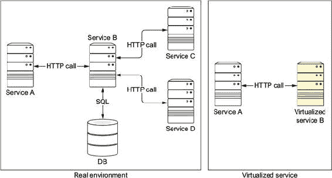
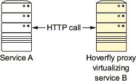
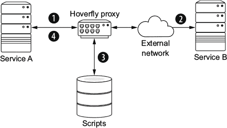
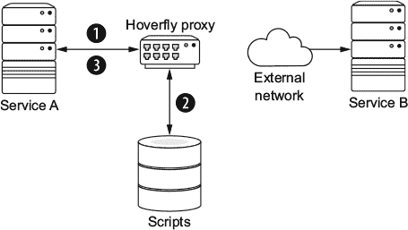
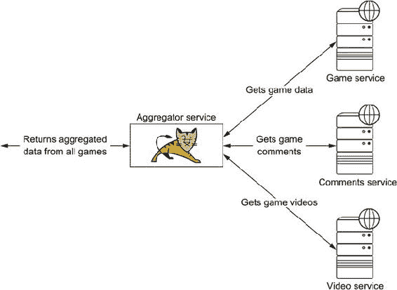

## 第九章\. 服务虚拟化

*本章涵盖*

+   欣赏服务虚拟化

+   模拟内部和外部服务

+   理解服务虚拟化和 Java

在微服务架构中，整个应用程序可以由许多相互连接的服务组成。这些服务可以是内部服务，例如同一应用域的成员，也可以是完全不受你控制的外部、第三方服务。

正如你在整本书中看到的，这种方法意味着当持续应用程序测试成为你的交付管道的一部分时，需要做出一些改变。在第七章中，我们观察到在测试微服务架构时面临的最大挑战之一是拥有一个干净且随时可用的测试环境。启动、运行并准备多个服务不是一件简单的事情。准备和执行测试需要时间，而且你很可能会有几个不可靠的测试——这些测试失败不是因为代码问题，而是因为测试环境中的失败。你可以采用的一种技术是服务虚拟化。

### 9.1\. 什么是服务虚拟化？

*服务虚拟化*是一种用于模拟基于组件的应用程序依赖项行为的技巧。一般来说，在微服务架构中，这些依赖项通常是基于 REST API 的服务，但这个概念也可以应用于其他类型的依赖项，如数据库、企业服务总线（ESBs）、Web 服务、Java 消息服务（JMS）或任何使用消息协议进行通信的系统。

#### 9.1.1\. 为什么使用服务虚拟化？

以下是一些你可能想要使用服务虚拟化的场景：

+   当当前服务（消费者）依赖于另一个尚未开发或仍在开发中的服务（提供者）时。

+   当为新实例配置所需的服务（提供者）困难或太慢，不适合测试目的时。

+   当配置服务（提供者）不是一个简单任务时。例如，你可能需要准备大量的数据库脚本以运行测试。

+   当不同团队需要并行访问服务，而这些团队有完全不同的设置时。

+   当提供者服务由第三方或合作伙伴控制，并且你每天有请求配额限制时。你不想用测试消耗配额！

+   当提供者服务仅在特定时间或夜间某些时间可用时。

服务虚拟化可以通过模拟所需服务的行怍来解决所有这些挑战。通过服务虚拟化，你可以建模和部署一个代表提供者服务的*虚拟资产*，模拟测试所需的各个部分。

图 9.1 展示了为运行测试而配置真实环境与虚拟化环境之间的差异。在左侧，你可以看到编写服务 A 的测试需要启动服务 B，包括其数据库。同时，你可能还需要启动*传递*服务，如服务 C 和 D。在右侧，你可以看到服务 B 及其所有依赖项都被一个模拟版本所取代，该版本模拟了服务 B 的行为。

##### 图 9.1\. 真实服务与虚拟化服务



重要的是要注意，这个图表与你在第三章学习模拟和存根时看到的图表并没有太大的不同；但与模拟类不同，你是在模拟服务调用。简化这个想法，你可以将服务虚拟化想象为在企业层面的模拟。

服务虚拟化不仅应该用于测试最佳路径情况，还应该用于测试边缘情况，以便测试整个应用程序（负面测试）。有时很难对真实服务进行边缘测试。例如，你可能想测试客户端在从提供者那里获得低延迟响应时的行为，或者当发送与预期不同的字符编码时它的行为。

想想 Gamer 应用程序——你不能要求 igdb.com 和 youtube.com 在下午关闭他们的 API，以便你进行负面测试。（好吧，你可以，但别抱太大希望得到答复！）在这种情况下，服务虚拟化的有用性应该很明显。

#### 9.1.2\. 何时使用服务虚拟化

本书介绍了许多不同类型的测试，从单元测试到端到端测试。何时使用服务虚拟化是有用的？

+   *单元测试*—对于单元测试，你不太可能需要服务虚拟化。在 99%的情况下，使用传统的模拟、虚拟和存根技术就足够了。

+   *组件测试*—这是服务虚拟化大放异彩的地方：你可以测试组件之间如何相互交互，而不依赖于外部服务。

+   *集成测试*—由于集成测试的本质是针对真实服务运行的，在测试用例中可能会遇到问题（例如边缘情况、第三方服务等），因此你可能选择使用服务虚拟化。

+   *契约测试*—当测试提供者的契约时，你可能需要服务虚拟化来模拟提供者服务的依赖项。

+   *端到端测试*—根据定义，端到端测试不应该依赖于服务虚拟化，因为你是针对真实系统进行测试的。在某些罕见的情况下，如果你依赖于不可靠的第三方服务，服务虚拟化可能仍然是一个可行的解决方案。

正如你所见，随着你转向更功能性的测试，虚拟资产逐渐被更多真实的服务所取代。

在第四章中，我们讨论了使用 WireMock 模拟外部服务的概念。在本章中，我们将介绍一个名为*Hoverfly*的新工具，它专门用于服务虚拟化。

### 9.2\. 使用 Hoverfly 模拟服务响应

悬停蝇 ([`hoverfly.readthedocs.io`](https://hoverfly.readthedocs.io)) 是一个用 Go 编程语言编写的开源、轻量级的服务虚拟化代理。它允许您模拟 HTTP 和 HTTPS 服务。如图 9.2 所示，悬停蝇启动了一个代理，该代理对请求返回存储（罐头）响应。这些响应应与真实服务为提供的请求生成的响应完全相同。如果这个过程执行正确，并且存储的响应对真实服务准确无误，悬停蝇将完美地模仿真实服务的响应，并且您的测试将准确无误。

##### 图 9.2\. Hoverfly 代理



|  |
| --- |

##### 注意

*Hoverfly Java* ([`hoverfly-java.readthedocs.io`](https://hoverfly-java.readthedocs.io)) 是 Hoverfly 的 Java 包装器，它抽象了您对实际二进制和 API 调用的操作，并提供了与 JUnit 的紧密集成。从现在起，当我们谈论 Hoverfly 时，我们指的是 Java 包装器。

|  |
| --- |

#### 9.2.1\. Hoverfly 模式

Hoverfly 有三种工作模式：

+   *捕获*—以正常方式对真实服务进行请求。请求和响应被 Hoverfly 代理拦截并记录，以便以后使用。

+   *模拟*—为提供的请求返回模拟响应。模拟可以从不同的来源加载，例如文件、类路径资源或 URL，或者使用 Hoverfly 领域特定语言（DSL）编程定义。这是开发中的服务的首选模式。

+   *捕获或模拟*—其他两种模式的组合。如果模拟文件不存在，代理以捕获模式启动，否则以模拟模式启动。当已经开发的服务或第三方服务可用时，此模式更受欢迎。

图 9.3 展示了捕获模式的方案：

> **1**.  使用真实服务执行请求，该服务可能部署在运行测试的机器之外。
> 
> **2**.  Hoverfly 代理将流量重定向到真实主机，并返回响应。
> 
> **3**.  Hoverfly 代理存储由真实服务交互生成的匹配请求和响应的脚本文件。
> 
> **4**.  将真实响应返回给调用者。

##### 图 9.3\. 悬停蝇捕获模式



图 9.4 阐述了模拟模式：

> **1**.  执行了一个请求，但调用不是路由到真实服务，而是路由到 Hoverfly 代理。
> 
> **2**.  Hoverfly 代理检查提供的请求对应的响应脚本。
> 
> **3**.  将预定义的响应回放给调用者。

##### 图 9.4\. 悬停飞虫模拟模式



|  |
| --- |

**Hoverfly 和 JVM 代理设置**

Hoverfly Java 设置网络 Java 系统属性以使用 Hoverfly 代理。这意味着如果您使用的客户端 API 识别这些属性，则无需更改任何内容即可与 Hoverfly 一起工作。如果不是这种情况，您需要将 `http.proxyHost`、`http.proxyPort`、`https.proxyHost`、`https.proxyPort` 以及可选的 `http.nonProxyHosts` 设置到您的客户端代理配置中。

当此覆盖生效时，Java 运行时与物理网络之间的所有通信（默认情况下除 `localhost` 外）将通过 Hoverfly 代理进行。例如，当使用尊重网络系统属性的 `okhttp` 客户端时，您可能这样做：

```
URL url = new URL("http", "www.myexample.com", 8080, "/" + name);
Request request = new Request.Builder().url(url).get().build();
final Response response = client.newCall(request).execute();
```

由于代理设置已被覆盖，请求是通过 Hoverfly 代理执行的。根据所选的配置模式，请求将发送到 www.myexample.com 或进行模拟。

|  |
| --- |

#### 9.2.2\. JUnit Hoverfly

让我们看看如何使用 Hoverfly 与 JUnit 的一些示例。

##### JUnit Hoverfly 模拟模式

Hoverfly 以 JUnit 规则的形式提供。您可以使用 `@ClassRule` 进行静态初始化，或 `@Rule` 对每个测试进行初始化。我们建议使用 `@ClassRule`，以避免每次测试方法执行时启动 Hoverfly 代理的开销。以下是一个示例：

```
import static io.specto.hoverfly.junit.core.SimulationSource.defaultPath;
import io.specto.hoverfly.junit.rule.HoverflyRule;

@ClassRule
public static HoverflyRule hoverflyRule = HoverflyRule
                    .inSimulationMode(defaultPath("simulation.json"));    *1*
```

+   ***1* 从默认的 Hoverfly 资源路径读取 simulation.json***

在这里，Hoverfly 代理启动，然后从默认的 Hoverfly 资源路径，src/test/resources/hoverfly，加载 simulation.json 模拟文件。之后，所有测试都执行完毕，Hoverfly 代理停止。

除了从文件加载模拟之外，您还可以使用 DSL 指定请求匹配器和响应，如下所示：

```
import static io.specto.hoverfly.junit.core.SimulationSource.dsl;
import static io.specto.hoverfly.junit.dsl.HoverflyDsl.service;
import static io.specto.hoverfly.junit.dsl.ResponseCreators.success;
import static io.specto.hoverfly.junit.dsl.ResponseCreators.created;

import io.specto.hoverfly.junit.rule.HoverflyRule;

@ClassRule
public static HoverflyRule hoverflyRule =
HoverflyRule.inSimulationMode(dsl(                                        *1*
      service("www.myexample.com")                                        *2*
          .post("/api/games").body("{\"gameId\": \"1\"}")                 *3*
          .willReturn(created("http://localhost/api/game/1"))

          .get("/api/games/1")                                            *4*
          .willReturn(success("{\"gameId\":\"1\"\}", "application/json"))
    ));
```

+   ***1* 使用 DSL 方法启动 Hoverfly***

+   ***2* 设置连接要建立的宿主***

+   ***3* 为 POST 方法创建请求和响应***

+   ***4* 为 GET 方法创建请求和响应***

|  |
| --- |

**请求字段匹配器**

Hoverfly 有 *请求字段匹配器* 的概念，它允许您在 DSL 元素中使用不同类型的匹配器。以下是一个示例：

```
service(matches("www.*-test.com"))              *1*
        .get(startsWith("/api/games/"))         *2*
        .queryParam("page", any())              *3*
```

+   ***1* 使用通配符匹配 URL***

+   ***2* 匹配以 /api/games/** 开头的请求路径***

+   ***3* 匹配页面查询参数的任何值***

|  |
| --- |

##### JUnit Hoverfly 捕获模式

在捕获模式下启动 Hoverfly 与在模拟模式下相同，但您使用 `inCaptureMode` 来指示您想要存储交互：

```
@ClassRule
public static HoverflyRule hoverflyRule
    = HoverflyRule.inCaptureMode("simulation.json");          *1*
```

+   ***1* 在捕获模式下启动 Hoverfly 并记录结果***

在此示例中，Hoverfly 以捕获模式启动。这意味着流量被重定向/路由到真实服务，但现在这些交互被记录在默认位于 src/test/resources/hoverfly/simulation.json 的文件中。

##### JUnit Hoverfly 捕获或模拟模式

此模式是前两种模式的组合，如果没有先前记录的文件，则使用捕获模式。生成的文件可以添加到您的版本控制中，以完成测试用例，供其他人使用而无需真实服务。以下是一个示例：

```
@ClassRule
public static HoverflyRule hoverflyRule
    = HoverflyRule.inCaptureOrSimulationMode("simulation.json");
```

#### 9.2.3. 配置 Hoverfly

Hoverfly 默认提供了一些可能适用于所有情况的配置，但您可以通过向先前方法提供一个 `io.specto.hoverfly.junit.core.HoverflyConfig` 实例来覆盖它们。例如，您可以通过设置 `inCaptureMode("simulation.json", HoverflyConfig.configs().proxyPort(8080))` 来更改 Hoverfly 代理启动的代理端口。

默认情况下，所有主机名都会被代理，但您也可以将此行为限制为特定的主机名。例如，`configs().destination("www.myexample.com")` 配置 Hoverfly 代理仅处理对 www.myexample.com 的请求。

默认情况下，本地主机调用不会被代理。但如果您的提供者服务运行在本地主机上，您可以通过使用 `configs().proxyLocalHost()` 配置 Hoverfly 来代理本地主机调用。

##### 配置 SSL

如果您的服务使用安全套接字层 (SSL)，Hoverfly 需要解密消息以便在捕获模式下将它们持久化到文件，或在模拟模式下执行匹配。实际上，您在客户端和 Hoverfly 代理之间有一个 SSL 连接，在 Hoverfly 代理和真实服务之间还有一个 SSL 连接。

为了简化，Hoverfly 附带了自己的自签名证书，客户端必须信任它。好消息是，当您实例化 Hoverfly 时，其证书会自动信任。

您可以使用 `HoverflyConfig` 类覆盖此行为并提供自己的证书和密钥：例如，`configs().sslCertificatePath("ssl/ca.crt").sslKeyPath("ssl/ca.key")`。请注意，这些文件相对于类路径。

##### 配置外部实例

您可以配置 Hoverfly 使用现有的 Hoverfly 代理实例。这种情况可能发生在您使用托管 Hoverfly 代理的 Docker 镜像时。同样，您可以通过使用 `HoverflyConfig` 类轻松配置这些参数：例如，`configs().remote().host("192.168.99.100").proxyPort(8081)`。

### 9.3. 构建脚本修改

现在，您已经了解了服务虚拟化和 Hoverfly，让我们看看涉及的依赖项。Hoverfly 只需要一个组、工件、版本（GAV）依赖项定义：

```
dependencies {
  testCompile "io.specto:hoverfly-java:0.6.2"
}
```

这会将所有必需的临时依赖项拉入测试范围。

### 9.4. 使用服务虚拟化处理 Gamer 应用程序

正如你在整本书中看到的，在 Gamer 应用程序中，聚合器服务与三个服务进行通信，以向最终用户组成包含所有游戏信息的最终请求，如图 9.5 所示。figure 9.5。让我们为连接到评论服务的代码编写一个组件测试。

##### 图 9.5\. 聚合器服务



在以下列表（code/aggregator/cp-tests/src/test/java/book/aggr/CommentsGatewayTest.java）中，评论服务在（预）生产环境中部署在 comments.gamers.com，你将使用捕获或模拟模式，以便初始请求发送到真实服务。所有后续调用都将进行模拟。

##### 列表 9.1\. 测试`CommentsGateway`类

```
public class CommentsGatewayTest {

    @ClassRule
    public static HoverflyRule hoverfly = HoverflyRule
        .inCaptureOrSimulationMode("simulation.json"); /                  *1*

    @Test
    public void shouldInsertComments()
        throws ExecutionException, InterruptedException {

        final JsonObject commentObject = Json.createObjectBuilder()
            .add("comment", "This Game is Awesome").add("rate",
                5).add("gameId", 1234).build();

        final CommentsGateway commentsGateway = new CommentsGateway
            ();
        commentsGateway.initRestClient("http://comments.gamers.com")
        ;                                                                 *2*

        final Future<Response>; comment = commentsGateway
            .createComment(commentObject);

        final Response response = comment.get();
        final URI location = response.getLocation();

        assertThat(location).isNotNull();
        final String id = extractId(location);
        assertThat(id).matches("[0-9a-f]+");                              *3*
    }
```

+   ***1* 实例化 Hoverfly 规则**

+   ***2* 调用真实主机**

+   ***3* 断言位置有效**

与其他测试用例相比，最大的不同之处在于，第一次运行此测试时，请求通过 Hoverfly 代理发送到部署在 comments.gamers.com 的评论服务，并记录请求和响应。由于该文件尚不存在，因此会创建 src/test/resources/hoverfly/simulation.json 文件。下次运行测试时，通信仍然通过 Hoverfly 代理进行代理，但由于该文件现在存在，将返回预定义的响应。

如果你好奇（我们知道你是），记录的文件看起来像下面的列表（src/test/resources/hoverfly/simulation.json）。

##### 列表 9.2\. 带有预定义响应的模拟文件

```
{
  "data" : {
    "pairs" : [ {
      "request" : {
        "path" : {
          "exactMatch" : "/comments"
        },
        "method" : {
          "exactMatch" : "POST"
        },
        "destination" : {"exactMatch" : "comments.gamers.com"},
        "scheme" : {
          "exactMatch" : "http"
        },
        "query" : {"exactMatch" : ""},
        "body" : {
          "jsonMatch" : "{\"comment\":\"This Game is Awesome\",
                        \"rate\":5,\"gameId\":1234}"
        }
      },
      "response" : {
        "status" : 201,
        "encodedBody" : false,
        "headers" : {
          "Content-Length" : [ "0" ],
          "Date" : [ "Thu, 15 Jun 2017 17:51:17 GMT" ],
          "Hoverfly" : [ "Was-Here" ],
          "Location" : [ "comments.gamers.com/5942c915c9e77c0001454df1" ],
          "Server" : [ "Apache TomEE" ]
        }
      }
    } ],
    "globalActions" : {
      "delays" : [ ]
    }
  },
  "meta" : {
    "schemaVersion" : "v2"
  }
}
```

### 摘要

+   服务虚拟化不是合同测试的替代品，而是一种与它们一起使用的东西，主要在提供者验证场景中使用。

+   服务虚拟化用于消除依赖于外部和可能不可靠服务的测试的不可靠性。

+   虚拟资产是你所模拟的服务。

+   你可以使用服务虚拟化来模拟现有服务之外的未完成服务，从而允许并行团队快速开发。

+   Hoverfly Java 负责所有网络重定向，让你继续编写测试。
