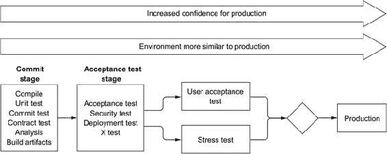
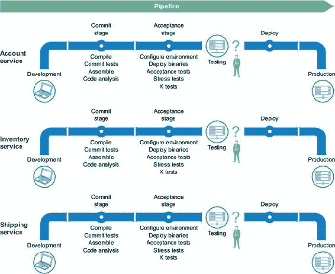
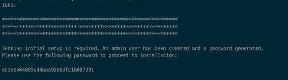
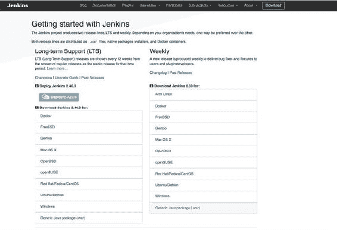
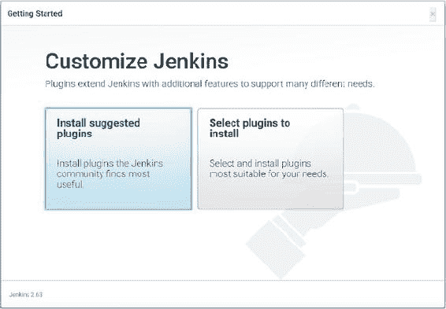
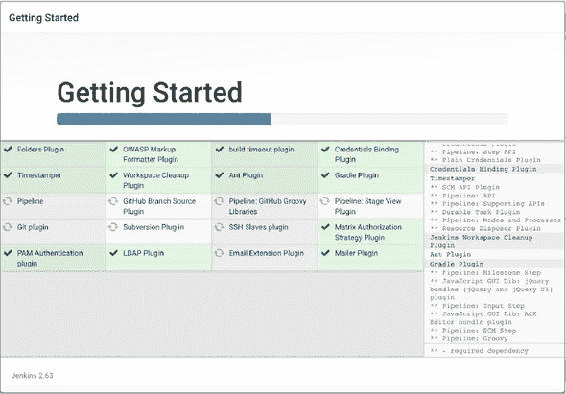
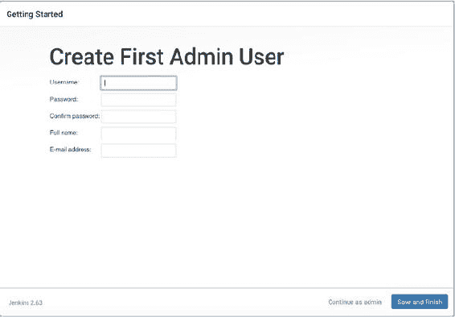
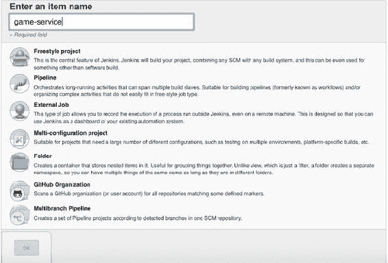
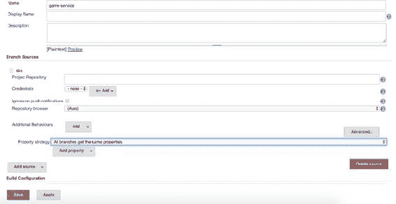
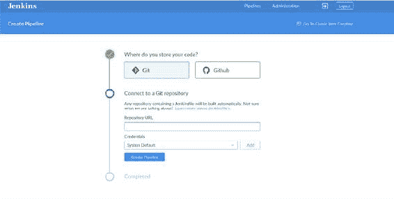

## 第十章\. 微服务中的持续交付

*本章涵盖*

+   在持续交付管道中使用微服务

+   在管道上执行测试

+   理解编码的管道

+   构建 Jenkins 管道

+   确定性地部署服务

我们希望这本书已经拓宽了您的视野，并扩展了您为开发微服务架构测试的技能集。这些测试的目的是确保在重构、修复错误或添加新功能时，不会引入任何回归。

现在的问题是何时执行测试，在哪里执行它们，以及测试如何与生产服务的部署相关。在本章中，您将了解传统的持续交付（CD）管道是如何演变为服务于微服务架构的，以及如何构建一个专注于测试执行的管道。

我们假设您在应用程序的 CD 方面有一些经验，并且可能对 Jenkins ([`jenkins.io`](https://jenkins.io)) 作为 CD 服务器有一些基本的使用。还有其他几个很好的构建自动化服务器，例如 Travis CI ([`travis-ci.org`](https://travis-ci.org)) 和 Bamboo ([www.atlassian.com/software/bamboo](http://www.atlassian.com/software/bamboo))，但我们不得不选择一个来集中关注，我们选择了 Jenkins。本章中描述的原则大致适用于您最终可能选择的任何 CD 服务器。

我们还假设您正在使用某种类型的源代码控制或源代码管理（SCM）服务器，例如 Git ([`git-scm.com`](https://git-scm.com)) 或 SVN ([`subversion.apache.org`](https://subversion.apache.org))，来管理您的源代码。如果不是这样，那么您真的很糟糕，您的源代码将与您的硬盘一起死亡！说真的，我们不会希望这种情况发生在任何人身上。

### 10.1\. 什么是持续交付？

*持续交付* 是一种围绕更快、更频繁地发布软件的方法。这种方法有助于降低可能影响用户体验的更改交付的成本、时间和风险。由于应用程序的交付是持续进行的，并且带有增量更新，因此更容易从最终用户那里收集反馈并相应地做出反应。

在持续集成（CD）中的主要概念是*部署管道*。正如其名所示，它是一系列步骤或程序，应用程序必须通过这些步骤或程序才能发布到生产环境。部署管道可能会根据您选择遵循的发布应用程序的过程而改变。例如，一些公司可能会在发布前进行手动测试/探索性测试阶段。其他公司可能会更进一步，将*持续部署*应用于管道，在构建成功后自动将每个更改发布到生产环境。另一方面，*持续交付*仅用于确保任何更改在任何时候*可能*发布（实际发布是手动决策）。

最常见、通用的部署管道如图 10.1 所示。通常，部署管道包括以下四个主要阶段：

> **1**.  *提交阶段*——发布过程的第一部分，在团队成员向源代码管理（SCM）服务器提交内容后触发。这个阶段包括编译过程、单元（和重要的其他）测试执行、代码质量分析和构建可交付成果。理想情况下，提交阶段不应超过 10 分钟。
> 
> **2**.  *自动化验收测试*——执行被认为是慢速的自动化测试，因为这些测试使用了被测试系统中的多个部分（例如，自动化 UI 测试）。
> 
> **3**.  *用户验收测试*——用户测试应用程序以确保其符合他们的期望。其中一些测试可能是自动的（例如，容量测试），但也可以采用其他手动测试，例如探索性测试。通常为代码分析定义质量门，如测试覆盖率、指标收集和技术债务的测量；这个总称是*完成定义（DoD）*。
> 
> **4**.  *发布*——基于每个阶段的全部反馈，关键用户决定将版本发布到生产环境或放弃该版本。这是最终的验收测试或标准。

##### 图 10.1\. 典型的部署管道



现在您已经熟悉了 CD 的基础知识，让我们继续探讨微服务架构如何与之结合。

### 10.2\. 持续交付与微服务架构

微服务在部署时应该具有以下特征：

+   每个微服务应该是一个小型、独立的部署单元。在相同的过程中一起部署微服务不被认为是最佳实践。

+   商业功能应该独立部署。需要注意的是，这意味着每个微服务都应该提供向后兼容性，当公共 API 发生变化时，通常通过版本化 API 来实现。

这些特性会影响部署管道。因为每个微服务都应该独立部署，所以你需要为每个微服务创建一个新的管道。图 10.2 展示了概述。

##### 图 10.2. 微服务架构部署管道



使用这种方法创建部署管道的主要优势如下：

+   管道更小，只包含单个微服务的步骤。

+   由于与第三方系统的集成较少，管道更容易设置。

+   由于测试数量较少，你能够更快地收到反馈。你正在执行单个微服务的测试，而不是整个应用程序的测试。

但也有一些缺点需要你注意：

+   每个微服务可能使用不同的技术栈进行开发。这意味着每个部署管道可能需要每个阶段不同的工具，使得代码的可重用性降低，维护更复杂。

+   微服务是应用程序、运行它的服务器、它需要的数据库以及任何其他所需基础设施的组合。这意味着部署微服务的流程可能因微服务而异。例如，部署 SQL 数据库模式与部署 NoSQL 数据库模式不同。

+   即使微服务经过单元测试、组件测试、契约测试、服务虚拟化等全面测试，你仍然会在将系统的新部分独立部署到已运行的系统中时面临不确定性。询问诸如“旧消费者能否与新的提供者通信？”和“新服务能否从其他提供者（包括新旧）那里消费数据？”这样的问题是正常的。

为了减轻这些缺点的风险，你可以遵循以下策略：

+   在与项目源代码相同的存储库中定义管道。这确保了管道是由开发微服务的同一团队创建和维护的。

+   使用蓝绿部署方法。这意味着你为每个新版本创建一个完整的集群。然后运行一些自动化测试或采用探索性测试方法来验证一切是否按预期工作。之后，切换到新集群。

+   可以使用金丝雀发布（借用煤矿工人的术语）。采用这种方法，每次只部署少量节点的新微服务。一些真实用户（最好是内部用户）在定义的时间内使用系统对抗新微服务。在这段时间内，你可以监控所选用户交互的结果，以确保新服务按预期运行。

+   创建一个易于快速应用于任何给定微服务的回滚策略，以便在出现故障时，可以尽快回滚到之前的状态。

+   经常发布。经常发布意味着一次发布较少的功能，这反过来意味着您一次只改变系统的一步。这意味着完全破坏系统更困难。更重要的是，更容易检测到问题所在。

如您所见，在微服务架构中的发布自动化与其他任何应用程序的要求相同：能够以确定性和速度进行部署。

### 10.3. Orchestrating continuous delivery

您已经看到，持续交付（CD）管道由几个阶段组成，每个阶段可能包含几个步骤。实现每个步骤的代码通常位于您的构建工具中。例如，*提交阶段*由 *编译*、*测试*、*代码质量* 和 *打包* 步骤组成，如图 10.3 所示。当您使用 Gradle 构建工具时，提交阶段执行的命令分别是 `gradle compileJava`、`gradle :test`、`gradle check` 和 `gradle assemble`。

##### 图 10.3. 提交阶段示例


您不希望每次想要执行提交阶段或任何其他阶段时都手动调用这些命令。您需要一个方法来编排所有这些命令的调用，并按正确的顺序运行它们以优化过程。（测试和静态代码分析步骤可以并行执行。）

*持续集成*（CI）服务器协调定义管道的所有步骤，管理构建过程，并为部署应用程序提供魔法。除了管理发布过程外，CI 服务器还提供了一个中心位置来检索管道执行的所有反馈，例如测试失败、每个环境的工件部署以及手动交互时挂起的构建过程。

#### 10.3.1. 与 Jenkins 合作

您需要一个持续集成（CI）服务器来管理整个构建过程。正如我们之前提到的，我们认为 Jenkins 是最广泛使用的服务器，用于管理满足与全系列系统集成要求的部署管道。

Jenkins 是一个跨平台、CI/CD 服务器。它提供了各种定义您的部署管道的方法，并且与大量的测试和部署技术集成良好。

这里只是众多可用集成中的一些：

+   *代码和提交*—Git、GitHub、Mercurial、Visual Studio、Eclipse 和 Nexus

+   *构建和配置*—Maven、Gradle、Docker、Chef、Ant、Vagrant、Ansible 和 AWS

+   *扫描和测试*—Gerrit、Sauce Labs、Sonar、Gatling、JUnit、FitNesse 和 Cucumber

+   *发布*—uDeploy、Serena 和 MidVision

+   *部署*—AWS、Docker、OpenShift、Kubernetes、OpenStack、GCE 和 Azure

如您所见，Jenkins 覆盖了您可能需要实现任何部署管道的所有步骤。让我们看看如何使用 Jenkins 管道使用代码定义部署管道。

#### 10.3.2. Jenkins 管道

*Jenkins 管道* 是一组插件，旨在帮助您将持续集成/交付/部署管道实现到 Jenkins 中。使用 Jenkins 管道，您可以在项目中以代码的形式定义您的交付管道，而不是依赖于过去的点对点用户界面。

通常，这个定义与你的服务位于同一个源代码管理（SCM）仓库中。这对于微服务架构来说非常完美，因为你可以将所有与该服务相关的所有内容放在一起。

编码的管道提供了一些好处。因为它是代码，您可以将其视为代码，您可以执行以下操作：

+   自动为所有分支和拉取请求创建管道

+   执行代码审查和管道的迭代改进

+   保持审计跟踪，因为更改也被提交到源代码管理（SCM）

+   启用协作，因为每个人都可以查看和编辑代码

在 Jenkins 中编写管道的默认文件名是 *Jenkinsfile*，它通常被检查到服务源代码管理（SCM）仓库的根目录中。Jenkinsfile 是一个包含通过 *Pipeline* DSL 交付服务/项目的所有步骤的文本文件。

截至 2.5 版本，Jenkins 管道支持两种离散的语法来定义管道：*声明式管道* 和 *脚本式管道*。在底层，两者都作为 Groovy DSL 实现。

##### 声明式管道

声明式管道提供了一个简化的、有偏见的语法，用于编写部署管道。这种简化限制了灵活性和可扩展性；但另一方面，它使得部署管道易于编写和阅读。根据我们的经验，声明式方法对于几乎所有情况都足够了。

所有声明式管道都必须包含在 `pipeline` 块中。每个块必须只包含 *部分*、*指令* 和 *赋值语句*。

这里是一个 Jenkinsfile 的例子：

```
pipeline {
    agent any                                  *1*
    stages {                                   *2*
        stage('Commit Test') {
            steps {                            *3*
                sh './gradlew check'           *4*
            }
        }
    }
    post {                                     *5*
        always {
            junit 'build/reports/**/*.xml'     *6*
        }
    }
}
```

+   ***1* 在任何可用的 Jenkins 代理（一个 Jenkins 进程）上执行管道**

+   ***2* 阶段是所有工作完成的地方。**

+   ***3* 阶段内执行的步骤**

+   ***4* Shell 指令命令**

+   ***5* 构建之后执行的章节（后构建步骤）**

+   ***6* 归档测试结果的指令**

根元素必须是 `pipeline`，它包围了当前管道的所有阶段。`agent` 指令指定整个管道或特定阶段将在哪里执行。

`any` 选项表示管道应该在任何可用的节点上执行。您还可以指定具有特定标签或特定 Docker 镜像的节点。

接下来，您定义一系列阶段。每个阶段都与您的部署管道的阶段相关，例如提交阶段、验收测试阶段等。每个阶段由负责执行工作的几个步骤组成。

执行结束时，`post` 指令被设置为始终注册 `junit` 结果。`post` 指令可以在顶层 `pipeline` 块和每个 `stage` 块中使用。请注意，`post` 支持条件块，如 `always`、`failure`、`success`、`changed` 和 `unstable`，这些块设置是否执行 `post` 操作。

在解释脚本管道之前，让我们看看一些声明式管道的简单示例。以下 Jenkinsfile 基于 Maven 镜像分配一个新的 Docker 容器。将工作区添加到镜像中，然后在其内部运行步骤：

```
pipeline {
    agent {
         docker 'maven:3-alpine'            *1*
    }
    stages {
        stage('Example Build') {
            steps {
                sh 'mvn -B clean verify'    *2*
            }
        }
    }
}
```

+   ***1* 执行构建的 Docker 镜像**

+   ***2* 在容器内执行的 Shell 命令**

你也可以在 Jenkinsfile 中与用户进行交互，如下例所示：

```
stage('Deploy - Staging') {
       steps {
           sh './deploy staging'
           sh './run-smoke-tests'
       }
}
post {
   failure {
     mail to: 'team@example.com',                                         *1*
          subject: "Failed Pipeline: ${currentBuild.fullDisplayName}",
          body: "Something is wrong with ${env.BUILD_URL}"
   }
}

stage('Sanity check') {
        steps {
            input "Does the staging environment look OK?"                 *2*
       }
}
```

+   ***1* 在失败时发送电子邮件**

+   ***2* 等待用户输入**

这个 Jenkinsfile 有两个阶段：一个用于部署服务，一个用于检查构建状态。还有一个错误处理程序。如果发生错误，将向团队发送电子邮件，通知他们失败情况。第二个阶段等待任何用户的批准：部署管道将暂停，直到用户点击“继续”按钮。

|  |
| --- |

**脚本指令**

`script` 步骤接受一段脚本管道代码块，并在声明式管道中执行它：

```
script {
  def zones = ['EMEA', 'US']
  for(inti=0;i< zones.size(); ++i) {
    echo "Deploying service to ${zones[i]} datacenter"
  }
}
```

对于非平凡大小或更复杂性的 `script` 块，应将其实现为一个共享库。

|  |
| --- |

##### 脚本管道

到目前为止，你已经看到了如何使用 Jenkins 声明式管道来定义管道。尽管这可能覆盖大多数用例，但如果你需要更多控制或需要执行更复杂的操作，那么 `scripted pipeline` 是最佳方法。声明式管道中涵盖的所有步骤在脚本管道中也是有效的。

脚本管道实际上是一个用 Groovy 构建的通用 DSL。这意味着 Groovy 语言中有效的多数功能在脚本管道中也是可用的。

这是一个 Jenkinsfile，展示了脚本管道的使用示例。

##### 列表 10.1\. Jenkinsfile

```
stage ('Compile') {
  node {                                              *1*
    checkout scm                                      *2*
    try {                                             *3*
      sh "./gradlew clean compile"
    } catch (ex) {
      mail to: 'team@example.com',
           subject: "Failed Pipeline: ${currentBuild.fullDisplayName}",
           body: "Something is wrong with ${env.BUILD_URL}"
    }
  }
}
stage ('Deploy') {
  node {
    if (env.BRANCH_NAME == 'master') {
      echo 'Proceed with deployment'
    } else {
      echo 'Only master branch can be deployed'
      currentBuild.result = "UNSTABLE"                *4*
    }
  }
}
```

+   ***1* 选择运行节点**

+   ***2* 从源代码管理（SCM）检出代码**

+   ***3* 使用 try/catch 进行安全的流程控制**

+   ***4* 改变构建结果**

你可以看到这个 Jenkinsfile 更像是一个 Groovy 脚本，而不是一个纯管道。

在脚本管道中，你定义阶段和节点。一个 *node* 是管道阶段将要执行的工作代理。你可以使用 `sh`、`checkout` 和 `mailto` 等步骤开始编写管道代码，或者使用 `try/catch` 和 `if/else` 等 Groovy 结构。

这只是展示如何编写部署管道代码的一个示例，以帮助你走上正确的道路——要全面了解 Jenkins 管道，需要整本书。要了解更多信息，你可以阅读[`jenkins.io/doc`](https://jenkins.io/doc)中的文档。

#### 10.3.3\. 确定性部署

在第六章中，你了解到*消费者驱动型契约*不仅仅是你的服务 API 的设计过程，也是分割服务依赖关系以便在隔离状态下进行测试的一种方式。契约首先针对消费者进行测试，然后针对该消费者的提供者进行测试。

这是在微服务架构中相对于端到端测试的一个大优势，因为在微服务架构中，由于环境准备复杂，尝试编写端到端测试可能会很复杂。此外，由于运行环境的复杂性（众多相互连接的服务、网络、不同的数据库等），这些测试可能成为不可靠或非确定性的候选者。

如果你没有使用端到端测试，如何独立部署新服务并确信没有出错？答案是，在部署管道中运行契约测试，针对环境矩阵进行测试。

在第六章中，你了解到第一步是编写一个契约。然后，你测试该契约与消费者和提供者的*头部*（当前开发）版本，以便你知道它们是兼容的。至少，这是在开发机器上的方法。

在 CD 阶段，服务是相互独立部署的（可能既有消费者也有/或提供者），这种方法就不够了。没有可靠的方法来回答以下问题：

+   消费者的头部版本是否与提供者的生产版本兼容？

+   提供者的头部版本是否与其消费者的生产版本兼容？

你需要在契约测试中更进一步，并验证契约与生产环境。

##### 部署新的消费者

在将新的消费者部署到生产环境之前，重要的是验证消费者生成的契约与其提供者的头部版本。这也适用于提供者的生产版本。你需要确保当新的消费者进入生产环境时，当前的生产提供者仍然能够接收输入并为该输入产生输出。

| |
| --- |

##### 注意

契约测试可以针对头部版本失败，但不能针对生产版本失败。尽管我们建议你修复这种情况，但这并不是阻止消费者部署到生产的障碍——至少，直到头部版本升级到生产版本。

| |
| --- |

##### 部署新的提供者

在将新的提供者部署到生产环境之前，你需要验证契约的头部版本是否仍然适用于提供者所依赖的消费者。同样，这也适用于生产契约版本。你需要确保当新的提供者进入生产环境时，已经部署到生产环境中的消费者仍然能够与其通信。

| |
| --- |

##### 注意

合同测试允许对头版本失败，但不能对生产中的版本失败。再次建议您修复此问题，但这不会阻止将提供者部署到生产环境。

| |
| --- |

### 10.4\. Jenkins

Jenkins 提供了大量的插件来支持 CD 流程的所有阶段。Jenkins 以多种格式分发，包括 WAR 文件、平台相关的安装程序和 Docker 容器。我们猜测，如果您已经走到这一步，您已经安装了 Java。但以防万一您还没有，让我们看看如何从 WAR 文件（一个仅需要 Java 运行的自包含可执行归档）下载、安装和进行 Jenkins 的初始设置。

| |
| --- |

##### 注意

在撰写本文时，Jenkins 的最新版本是 2.114。请检查并安装 Jenkins 的最新版本——该项目经常发布。

| |
| --- |
| |

**生成的密码**

在打开浏览器访问 Jenkins 控制台之前，请特别注意控制台输出，类似于以下片段。



初始密码

Jenkins 首次启动时，会生成一个默认密码。您需要复制或记下此密码，因为首次访问 Jenkins 网络控制台创建初始管理员账户时需要它。

| |
| --- |

按照以下步骤操作：

> **1**. 从 [`jenkins.io/download`](https://jenkins.io/download) 下载 Jenkins（参见图 10.4）。选择通用的 Java 包 (.war) 下载链接，并将文件本地保存。
> 
> ##### 图 10.4\. Jenkins 下载网站
> ##### 
> 
> 
> **2**. 打开终端，并将下载的 jenkins.war 文件移动到您希望服务运行的目标位置：例如，`mv ~/Downloads/jenkins.war /opt/jenkins`。
> 
> **3**. 通过运行 `java -jar jenkins.war` 启动 Jenkins。几秒钟后，Jenkins 将启动并运行。
> 
> **4**. 打开浏览器并访问 http://localhost:8080，系统会提示您提供新的默认管理员密码。
> 
> **5**. 输入新密码后，您将看到一个屏幕，您可以选择安装建议的插件或手动选择要安装的插件。为了简化操作，并且因为这对于大多数情况来说是一个很好的起点，请点击“安装建议插件”，如图图 10.5 所示。Jenkins 将下载并安装 Jenkins 生态系统中最常用的插件，包括 Jenkins Pipeline 插件。图 10.6 显示了插件安装窗口。
> 
> ##### 图 10.5\. 定制 Jenkins
> ##### 
> 
> 
> ##### 图 10.6\. 插件安装
> ##### 
> 
> 
> **6**. 所有插件安装完成后，您将看到一个屏幕来创建第一个管理员用户，如图图 10.7 所示。

##### 图 10.7\. 创建管理员用户



安装和设置已完成，您现在可以开始定义您的第一个 Jenkins 管道作业。

#### 10.4.1\. 定义管道

要创建管道，请按照以下步骤操作：

> **1**.  在 Jenkins 主页上点击新建项目链接，并为项目添加一个名称（例如，game-service）。
> 
> **2**.  选择多分支管道类型。此选项为（尚未指定的）项目中的每个检测到的分支创建一组管道项目（参见图 10.8）。
> 
> ##### 图 10.8\. 新的多分支管道项目
> ##### 
> 
> 
> **3**.  创建项目后，您可以配置管道作业。配置最重要的部分是分支源部分，其中定义了项目位置。点击添加源，然后选择 Git 选项。您将看到图 10.9 中所示的块。
> 
> ##### 图 10.9\. 项目配置块
> ##### 
> 
> 
> **4**.  将项目的完整 Git URL 添加到项目仓库字段，然后点击保存以完成注册新项目的流程。

在这一点上，Jenkins 将检测配置的存储库中的所有分支。如果分支包含 Jenkinsfile 文件，Jenkins 将使用该文件为该分支安排新的构建。

|  |
| --- |

**Blue Ocean**

在撰写本文时，Blue Ocean 是一个可用于 Jenkins 的插件，通过减少复杂性并提高管道的可视清晰度来改善 Jenkins 用户体验。它默认未安装，因此您需要通过 Jenkins 插件管理器进行安装。以下是一些显著功能：

+   CD 管道的可视化，以便快速轻松地检查管道的状态

+   用于创建管道的可视化流程编辑器

+   个性化以满足团队基于角色的需求

+   精确定位，显示需要关注的管道中的确切点

+   分支和拉取请求的原生集成

在 Blue Ocean 中创建新作业很简单：导航到 http://localhost:8080/blue，点击新建管道，并填写所需信息。



新的管道

在幕后，Jenkins 检测可用的 Jenkinsfiles 并相应地安排构建。

|  |
| --- |

#### 10.4.2\. Jenkins 管道的示例

10.2.3 节讨论了运行合同测试，以防止在发布新服务时破坏环境。想法是对头版本和生产版本运行合同测试，以确保所有服务在新的发布后都能相互通信。

让我们看看如何使用 Jenkins 和脚本管道有信心地发布一个 *消费者*。以下示例跳过了与编译和测试阶段相关的步骤，并专注于 *消费者* 交付管道的合同部分：

```
stage('Consumer Contract Tests') {
  withEnv(['publishContracts=true']) {        *1*
    sh "./gradlew :contract:test"             *2*
  }
}
```

+   ***1* 将 publishContracts 环境变量设置为 true**

+   ***2* 执行合同测试**

消费者合约测试（存储在 `contract` 模块中）正在运行，生成的合约被发布到合约仓库。这是因为以下 arquillian.xml 文件评估 `publishContracts` 环境变量，以使 Arquillian Algeron 扩展 ([`arquillian.org/arquillian-algeron`](http://arquillian.org/arquillian-algeron)) 发布创建的合约：

```
<extension qualifier="algeron-consumer">;
  <property name="publishConfiguration">;
    <!-- Information about repository-->;
  </property>;
  <property name="publishContracts">;${env.publishcontracts:false}</property>;
</extension>;
```

在这个阶段，消费者端的合约测试正在运行，验证新的消费者版本能否与最新的合约版本进行通信。

在将这个新的消费者部署到生产之前，您需要确保指定的消费者提供者与这个新合约兼容。以下 Jenkinsfile 片段展示了如何验证最新合约与头提供者和当前生产提供者。

##### 列表 10.2\. 验证最新合约

```
def headResult, productionResult
stage('Provider Contract Tests') {

  parallel (                                                           *1*
    headRun : {
      headResult = build job: 'comments-service',
        parameters: [string(name: 'commentsserviceurl', value: '')],
          propagate: false
      echo "Contract test against head Comments Service" +
            "${headResult.result}"
    },
    productionRun : {
      productionResult = build job: 'comments-service',
        parameters: [string(name: 'commentsserviceurl',
                          value: 'commentsservice:8090')],             *2*
          propagate: false
      echo "Contract test against production Comments Service" +
              "${productionResult.result}"
    }
  )
}

if (productionResult.result != 'SUCCESS') {
  currentBuild.result = 'FAILURE'                                      *3*
  echo "Game Service cannot be deployed to production" +
    "Comments Service is not compatible with current GameService."
} else {
  def lineSeparator = System.lineSeparator()
  def message = "Do you want to Deploy Game Service To Production?" +
  "${lineSeparator} Contract Tests against Production" +
  "${productionResult.result} ${lineSeparator} Contract Tests against" +
  "HEAD ${headResult.result}"

  stage('Deploy To Production?') {                                     *4*
    input "${message}"
    deploy()
  }
}
```

+   ***1* 头和生产的合约验证并行运行。**

+   ***2* 将生产位置作为参数传递**

+   ***3* 构建在生产提供者失败时失败。**

+   ***4* 如果生产正常，请求部署**

这个阶段验证最新合约对于提供者的头和生产版本也是有效的，在这个例子中，是评论服务。两个版本的验证是并行进行的。因为提供者的验证合约位于提供者项目中，所以需要触发构建。

对于生产运行，服务位置被定义为构建参数。在提供者版本成功通过最新合约验证后，用户会被提示部署新的消费者到生产环境。

|  |
| --- |

##### 小贴士

根据您的软件发布模型，管道脚本可能会根据项目而有所不同。因此，我们鼓励您访问 [`jenkins.io/doc/book/pipeline`](https://jenkins.io/doc/book/pipeline) 并深入了解 Jenkins 管道如何适应各种场景。

|  |
| --- |

### 摘要

+   每个服务都应该独立部署。

+   代码化管道简化了部署，并鼓励将服务的交付视为服务项目的一部分。

+   确保使用合约测试针对生产版本部署到生产环境。

+   Jenkins 涵盖了在微服务架构中实施持续交付的所有需求。
