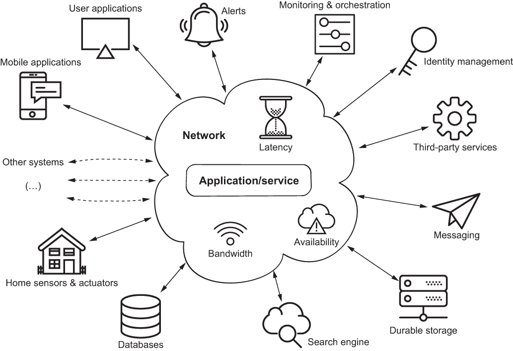
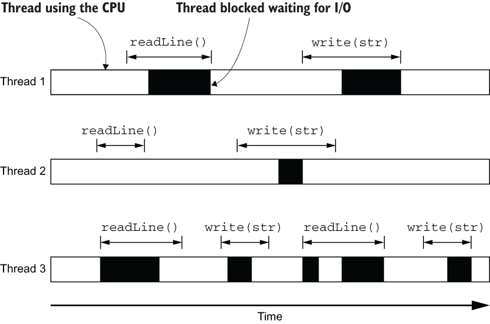
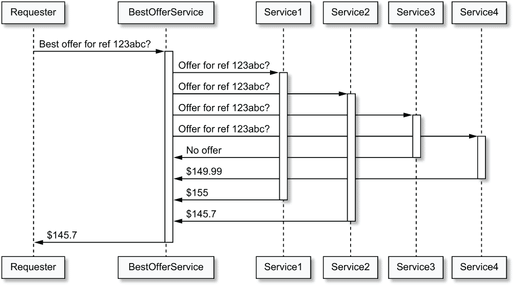
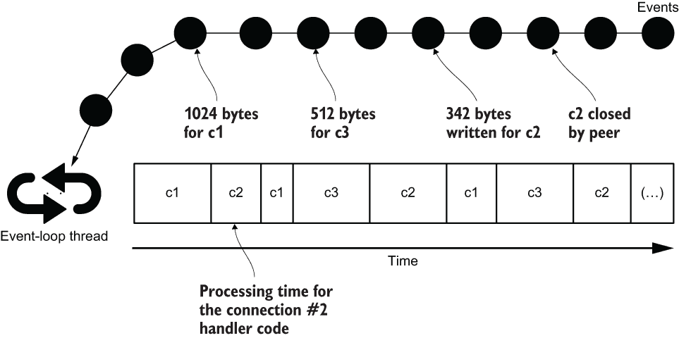
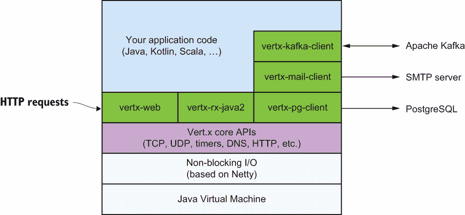

# 1 Vert.x、异步编程和反应式系统

本章涵盖

+   什么是 Vert.x

+   为什么分布式系统无法避免

+   编程资源高效网络应用程序的挑战

+   什么是异步和非阻塞编程

+   反应式应用程序是什么，以及为什么异步编程不够

+   Vert.x 的替代方案

我们开发者生活在充满术语、技术和实践炒作周期的行业中。我长期以来一直教授大学生设计、编程、集成和部署应用程序的要素，并且亲眼目睹了新来者如何在新技术的汪洋大海中导航可能会多么复杂。

*异步*和*反应式*是现代应用程序中的重要主题，我的目标是帮助开发者理解这些术语背后的核心概念，获得实践经验，并认识到*何时*这些方法有好处。我们将使用*Eclipse Vert.x*，这是一个用于编写异步应用程序的工具包，它还提供了针对“反应式”不同定义的解决方案。

在本书中，确保你理解这些概念是我的首要任务。虽然我希望你能够牢固地理解如何编写 Vert.x 应用程序，但我还想要确保你能够将在这里学到的技能应用到其他类似甚至可能竞争的技术中，无论是现在还是五年后。

## 1.1 分布式和网络化是常态

20 年前，部署可以在单机上独立运行并执行所有操作的业务应用是很常见的。这类应用通常具有图形用户界面，并拥有本地数据库或自定义文件管理来存储数据。当然，这只是一个夸张的说法，因为当时网络已经投入使用，并且业务应用可以利用网络上的数据库服务器、网络化文件存储以及各种远程代码操作。

现在，应用程序更自然地通过 Web 和移动界面向最终用户暴露。这自然引入了网络，因此产生了分布式系统。此外，*面向服务的架构*通过向其他服务发出请求来重用某些功能，这些服务可能由第三方提供商控制。例如，将消费者应用程序中的身份验证委托给流行的账户提供商，如 Google、Facebook 或 Twitter，或将支付处理委托给 Stripe 或 PayPal。

## 1.2 不生活在孤岛上

图 1.1 是现代应用程序的一个虚构描述：一组相互交互的网络服务。以下是一些这些网络化服务：

+   类似 PostgreSQL 或 MongoDB 这样的数据库存储数据。

+   类似 Elasticsearch 这样的搜索引擎允许查找之前已索引的信息，例如目录中的产品。

+   类似于 *Amazon S3* 的持久化存储服务提供文档的持久和复制数据存储。

+   消息服务可以是

    +   一个用于程序发送电子邮件的 *SMTP* 服务器。

    +   一个用于通过消息平台（如 Slack、Telegram 或 Facebook Messenger）与用户交互的机器人。

    +   用于应用程序到应用程序集成的集成消息协议，如 AMQP。

+   类似于 Keycloak 的身份管理服务为用户和服务交互提供身份验证和角色管理。

+   使用 Micrometer 等库进行监控可以暴露健康状态、指标和日志，以便外部编排工具可以维护适当的服务质量，可能通过启动新的服务实例或终止失败的服务实例来实现。



图 1.1 一个网络化应用程序/服务

在本书的后面部分，您将看到典型服务的示例，例如 API 端点、流处理程序和边缘服务。1 前面的列表当然不是详尽的，但关键点是服务很少孤立存在，因为它们需要通过网络与其他服务进行通信才能运行。

## 1.3 网络上没有免费的午餐

计算中可能出现问题的正是网络：

+   带宽可能会波动很大，因此服务之间密集的数据交互可能会受到影响。并非所有服务都能在同一个数据中心内享受快速带宽，即便如此，它仍然比同一台机器上进程之间的通信要慢。

+   延迟波动很大，因为服务需要与处理特定请求的附加服务进行通信，所以所有由网络引起的延迟都会加到总的请求处理时间上。

+   不可用性不应被视为理所当然：网络会失败。路由器会失败。代理会失败。有时有人碰到网络电缆并将其断开。当网络失败时，向另一个服务发送请求的服务可能无法确定是另一个服务还是网络出现了故障。

从本质上讲，现代应用程序是由分布式和网络化服务组成的。它们通过网络访问，这些网络本身会引入问题，每个服务都需要维护多个传入和传出的连接。

## 1.4 阻塞 API 的简单性

服务需要管理与其他服务和请求者的连接。管理并发网络连接的传统和广泛使用的模型是为每个连接分配一个线程。这是许多技术中的模型，例如 Jakarta EE 中的 Servlets（在版本 3 之前的添加）、Spring 框架（在版本 5 之前的添加）、Ruby on Rails、Python Flask 以及更多。这种模型的优势在于简单性，因为它具有 *同步* 的特性。

让我们来看一个例子，其中 TCP 服务器将输入文本回显给客户端，直到它看到 `/quit` 终端输入（如列表 1.3 所示）。

服务器可以使用书中的完整示例项目中的 Gradle `run`任务来运行（在终端中`./gradlew run -PmainClass=chapter1.snippets.SynchronousEcho`）。通过使用`netcat`命令行工具，我们可以发送和接收文本。

列表 1.1 `netcat`会话的客户端输出

```
$ netcat localhost 3000
Hello, Vert.x!           ❶
Hello, Vert.x!           ❷
Great
Great
/quit
/quit
$
```

❶ 这一行是命令行上的用户输入。

❷ 这一行是由 TCP 服务器发送的。

提示：您可能需要在您的操作系统上安装`netcat`（或`nc`）。

在服务器端，我们可以看到以下跟踪。

列表 1.2 服务器端跟踪

```
$ ./gradlew run -PmainClass=chapter1.snippets.SynchronousEcho
(...)
~ Hello, Vert.x!
~ Great
~ /quit
```

下面的列表中的代码提供了 TCP 服务器实现。这是`java.io`包的经典用法，该包提供了同步 I/O API。

列表 1.3 同步回显 TCP 协议

```
public class SynchronousEcho {
  public static void main(String[] args) throws Throwable {
    ServerSocket server = new ServerSocket();
    server.bind(new InetSocketAddress(3000));
    while (true) {                              ❶
      Socket socket = server.accept();
      new Thread(clientHandler(socket)).start();
    }
  }

  private static Runnable clientHandler(Socket socket) {
    return () -> {
      try (
        BufferedReader reader = new BufferedReader(
          new InputStreamReader(socket.getInputStream()));
        PrintWriter writer = new PrintWriter(
          new OutputStreamWriter(socket.getOutputStream()))) {
        String line = "";
        while (!"/quit".equals(line)) {
          line = reader.readLine();             ❷
          System.out.println("~ " + line);
          writer.write(line + "\n");            ❸
          writer.flush();
        }
      } catch (IOException e) {
        e.printStackTrace();
      }
    };
  }
}
```

❶ 主要应用程序线程扮演着接受线程的角色，因为它接收所有新连接的套接字对象。当没有挂起的连接时，操作会阻塞。为每个连接分配一个新的线程。

❷ 从套接字读取可能会阻塞分配给连接的线程，例如，当读取的数据不足时。

❸ 向套接字写入时也可能阻塞，例如，直到底层 TCP 缓冲区数据已通过网络发送。

服务器使用主线程来接受连接，并为每个连接分配一个新的线程来处理 I/O。I/O 操作是同步的，因此线程可能会在 I/O 操作上阻塞。

## 1.5 阻塞 API 浪费资源，增加成本

列表 1.3 中的代码的主要问题是它为每个传入连接分配一个新的线程，而线程并不是廉价的资源。线程需要内存，并且线程越多，对操作系统内核调度器的压力就越大，因为它需要为线程分配 CPU 时间。我们可以通过使用线程池在连接关闭后重用线程来改进列表 1.3 中的代码，但我们在任何给定时间点仍然需要*n*个线程来处理*n*个连接。



图 1.2 线程和阻塞 I/O 操作

这在图 1.2 中得到了说明，您可以看到三个并发网络连接的三个线程随时间变化的 CPU 使用率。如`readLine`和`write`之类的输入/输出操作可能会*阻塞*线程，这意味着线程被操作系统挂起。这种情况发生有两个原因：

+   读取操作可能正在等待从网络到达的数据。

+   如果缓冲区因之前的写操作而已满，写操作可能需要等待缓冲区被清空。

现代操作系统可以正确处理几千个并发线程。并非每个网络服务都会面临如此多的并发请求的负载，但当我们谈论数万个并发连接时，这种模型很快就会显示出其局限性。

还需要记住，我们通常需要的线程比传入的网络连接多。以一个具体的例子来说明，假设我们有一个提供特定产品最佳价格的 HTTP 服务，它是通过请求四个其他 HTTP 服务的价格来实现的，如图 1.3 所示。这类服务通常被称为 *边缘服务* 或 *API 网关*。按顺序请求每个服务并选择最低价格会使我们的服务非常慢，因为每个请求都会增加我们自己的服务延迟。有效的方法是从我们的服务开始四个并发请求，然后等待并收集它们的响应。这相当于启动四个额外的线程；如果我们有 1,000 个并发网络请求，在最坏的情况下，我们可能需要使用多达 5,000 个线程，这时所有请求都需要同时处理，我们没有使用线程池或从边缘服务到请求服务的持久连接。



图 1.3 边缘服务中的请求处理

最后但同样重要的是，应用程序通常部署到容器化或虚拟化环境中。这意味着应用程序可能看不到所有可用的 CPU 核心，并且它们分配的 CPU 时间可能有限。进程可用的内存也可能受到限制，因此拥有太多的线程也会消耗内存预算。这类应用程序必须与其他应用程序共享 CPU 资源，所以如果所有应用程序都使用阻塞 I/O API，那么在流量增加时，可能会有太多线程需要管理和调度，这需要启动更多的服务器/容器实例，这直接导致运营成本增加。

## 1.6 使用非阻塞 I/O 的异步编程

我们可以转向 *非阻塞* I/O 而不是等待 I/O 操作完成。你可能已经通过 C 中的 `select` 函数体验过这种非阻塞 I/O。

非阻塞 I/O 的理念是请求一个（阻塞的）操作，然后继续做其他任务，直到操作结果准备好。例如，非阻塞读取可能请求网络套接字上的多达 256 字节，执行线程会做其他事情（比如处理另一个连接），直到数据被放入缓冲区，准备在内存中消费。在这个模型中，许多并发连接可以在单个线程上复用，因为网络延迟通常超过读取传入字节所需的 CPU 时间。

Java 很早就有了 `java.nio` (Java NIO) 包，它提供了文件和网络上的非阻塞 I/O API。回到我们之前关于 TCP 服务回显传入数据的例子，列表 1.4 到 1.7 展示了使用 Java 非阻塞 I/O 的可能实现。

列表 1.4 异步版本的 echo 服务：主循环

```
public class AsynchronousEcho {
  public static void main(String[] args) throws IOException {
    Selector selector = Selector.open();

    ServerSocketChannel serverSocketChannel = ServerSocketChannel.open();
    serverSocketChannel.bind(new InetSocketAddress(3000));
    serverSocketChannel.configureBlocking(false);                     ❶
    serverSocketChannel.register(selector, SelectionKey.OP_ACCEPT);   ❷

    while (true) {
      selector.select();                                              ❸
      Iterator<SelectionKey> it = selector.selectedKeys().iterator();
      while (it.hasNext()) {
        SelectionKey key = it.next();
        if (key.isAcceptable()) {                                     ❹
          newConnection(selector, key);
        } else if (key.isReadable()) {                                ❺
          echo(key);
        } else if (key.isWritable()) {                                ❻
          continueEcho(selector, key);
        }
        it.remove();                                                  ❼
      }
    }
  }
  // (...)
```

❶ 我们需要将通道置于非阻塞模式。

❷ 选择器将通知传入的连接。

❸ 这收集了所有非阻塞 I/O 通知。

❹ 我们有一个新的连接。

❺ 套接字已收到数据。

❻ 套接字再次准备好写入。

❼ 需要手动删除选择键，否则它们将在下一次循环迭代中再次可用。

列表 1.4 展示了服务器套接字通道准备代码。它打开服务器套接字通道并将其设置为非阻塞，然后注册一个 NIO 键选择器以处理事件。主循环遍历已准备好处理事件的选择键，并根据事件类型（新连接、数据到达或数据可以再次发送）将它们调度到专门的方法。

列表 1.5 异步版本的 echo 服务：接受连接

```
private static class Context {                                    ❶
    private final ByteBuffer nioBuffer = ByteBuffer.allocate(512);
    private String currentLine = "";
    private boolean terminating = false;
  }

  private static final HashMap<SocketChannel, Context> contexts = 
  ➥ new HashMap<>();

  private static void newConnection(Selector selector, SelectionKey key) 
  ➥ throws IOException {
    ServerSocketChannel serverSocketChannel = (ServerSocketChannel) 
    ➥ key.channel();
    SocketChannel socketChannel = serverSocketChannel.accept();
    socketChannel
      .configureBlocking(false)
      .register(selector, SelectionKey.OP_READ);                  ❷
    contexts.put(socketChannel, new Context());                   ❸
  }
```

❶ Context 类保存与处理 TCP 连接相关的状态。

❷ 我们将通道设置为非阻塞并声明对读取操作的兴趣。

❸ 我们将所有连接状态保存在一个哈希表中。

列表 1.5 展示了如何处理新的 TCP 连接。对应于新连接的套接字通道被配置为非阻塞，然后在哈希表中跟踪以供进一步参考，其中它与某个 *上下文对象* 关联。上下文取决于应用程序和协议。在我们的情况下，我们跟踪当前行和连接是否正在关闭，并维护一个特定于连接的 NIO 缓冲区用于读取和写入数据。

列表 1.6 异步版本的 echo 服务：回显数据

```
private static final Pattern QUIT = Pattern.compile("(\\r)?(\\n)?/quit$");

  private static void echo(SelectionKey key) throws IOException {
    SocketChannel socketChannel = (SocketChannel) key.channel();
    Context context = contexts.get(socketChannel);
    try {
      socketChannel.read(context.nioBuffer);
      context.nioBuffer.flip();
      context.currentLine = context.currentLine + 
      ➥ Charset.defaultCharset().decode(context.nioBuffer);
      if (QUIT.matcher(context.currentLine).find()) {
        context.terminating = true;                             ❶
      } else if (context.currentLine.length() > 16) {
        context.currentLine = context.currentLine.substring(8);
      }
      context.nioBuffer.flip();                                 ❷
      int count = socketChannel.write(context.nioBuffer);
      if (count < context.nioBuffer.limit()) {                  ❸
        key.cancel();
        socketChannel.register(key.selector(), SelectionKey.OP_WRITE);
      } else {
        context.nioBuffer.clear();
        if (context.terminating) {
          cleanup(socketChannel);
        }
      }
    } catch (IOException err) {
      err.printStackTrace();
      cleanup(socketChannel);
    }
  }
```

❶ 如果我们找到一个以 /quit 结尾的行，我们将终止连接。

❷ Java NIO 缓冲区需要进行位置操作：缓冲区中有读取的数据，因此要将它写回客户端，我们需要翻转并返回到起始位置。

❸ 可能会发生的情况是并非所有数据都可以写入，因此我们停止寻找读取操作，并声明对通知的兴趣，该通知指示何时可以再次写入通道。

列表 1.6 包含 `echo` 方法的代码。处理非常简单：我们从客户端套接字读取数据，然后尝试将其写回。如果写入操作只是部分完成，我们停止进一步的读取，声明对知道套接字通道何时可写的兴趣，并确保所有数据都已写入。

列表 1.7 异步版本的 echo 服务：继续和关闭

```
private static void cleanup(SocketChannel socketChannel) throws IOException {
    socketChannel.close();
    contexts.remove(socketChannel);
  }

  private static void continueEcho(Selector selector, SelectionKey key) 
  ➥ throws IOException {
    SocketChannel socketChannel = (SocketChannel) key.channel();
    Context context = contexts.get(socketChannel);
    try {
      int remainingBytes = context.nioBuffer.limit() - context.nioBuffer.position();
      int count = socketChannel.write(context.nioBuffer);
      if (count == remainingBytes) {                       ❶
        context.nioBuffer.clear();
        key.cancel();
        if (context.terminating) {
          cleanup(socketChannel);
        } else {
          socketChannel.register(selector, SelectionKey.OP_READ);
        }
      }
    } catch (IOException err) {
      err.printStackTrace();
      cleanup(socketChannel);
    }
  }
}
```

❶ 我们保持在这个状态，直到所有数据都已写回。然后我们取消写入兴趣并声明读取兴趣。

最后，列表 1.7 展示了关闭 TCP 连接和完成写入缓冲区的方法的代码。在 `continueEcho` 中所有数据都已写入后，我们再次注册对读取数据的兴趣。

正如这个示例所示，使用非阻塞 I/O 是可行的，但与使用阻塞 API 的初始版本相比，它显著增加了代码的复杂性。echo 协议需要两个状态来读取和写回数据：读取或完成写入。对于更复杂的 TCP 协议，你可以很容易地预测需要更复杂的状态机。

还需要注意的是，与大多数 JDK API 一样，`java.nio`仅关注它所做的事情（在这里，I/O API）。它不提供高级协议特定的辅助工具，例如编写 HTTP 客户端和服务器。此外，`java.nio`不指定线程模型，这对于正确利用 CPU 核心仍然很重要，它也不处理异步 I/O 事件或阐述应用程序处理逻辑。

注意：这就是为什么在实际中，开发者很少直接处理 Java NIO。像 Netty 和 Apache MINA 这样的网络库解决了 Java NIO 的不足，许多工具包和框架都是建立在它们之上的。你很快会发现，Eclipse Vert.x 就是其中之一。

## 1.7 事件驱动处理的复用：事件循环的案例

处理异步事件的流行线程模型是事件循环。与我们在之前的 Java NIO 示例中那样轮询可能到达的事件不同，事件被推送到一个*事件循环*。

如图 1.4 所示，事件在到达时被排队。它们可以是 I/O 事件，例如数据准备好消费或缓冲区已完全写入套接字。它们也可以是任何*其他*事件，例如定时器触发。一个线程被分配给一个事件循环，处理事件不应执行任何阻塞或长时间运行的操作。否则，线程会阻塞，违背了使用事件循环的目的。



图 1.4 使用事件循环处理事件

事件循环非常流行：在浏览器中运行的 JavaScript 代码是在事件循环之上运行的。许多图形界面工具包，如 Java Swing，也有事件循环。

实现事件循环很简单。

列表 1.8 使用简单的事件循环

```
public static void main(String[] args) {
  EventLoop eventLoop = new EventLoop();
  new Thread(() -> {                                            ❶
    for (int n = 0; n < 6; n++) {
      delay(1000);
      eventLoop.dispatch(new EventLoop.Event("tick", n));
    }
    eventLoop.dispatch(new EventLoop.Event("stop", null));
  }).start();
  new Thread(() -> {                                            ❷
    delay(2500);
    eventLoop.dispatch(new EventLoop.Event("hello", "beautiful world"));
    delay(800);
    eventLoop.dispatch(new EventLoop.Event("hello", "beautiful universe"));
  }).start();
  eventLoop.dispatch(new EventLoop.Event("hello", "world!"));   ❸
  eventLoop.dispatch(new EventLoop.Event("foo", "bar"));
  eventLoop
    .on("hello", s -> System.out.println("hello " + s))         ❹
    .on("tick", n -> System.out.println("tick #" + n))
    .on("stop", v -> eventLoop.stop())
    .run();
  System.out.println("Bye!");
}

private static void delay(long millis) {                        ❺
  try {
    Thread.sleep(millis);
  } catch (InterruptedException e) {
    throw new RuntimeException(e);
  }
}
```

❶ 一个每秒向事件循环调度事件的第一个线程

❷ 一个每 2500 毫秒和 3300 毫秒调度两个事件的第二个线程

❸ 从主线程派发的事件

❹ 定义为 Java lambda 函数的事件处理器

❺ 此方法将可能抛出的检查异常包装为未检查异常，以避免将异常处理逻辑污染主方法代码。

列表 1.8 中的代码展示了使用事件循环 API 的使用情况，其执行会给出以下控制台输出。

列表 1.9 事件循环示例的控制台输出

```
hello world!
No handler for key foo
tick #0
tick #1
hello beautiful world
tick #2
hello beautiful universe
tick #3
tick #4
tick #5
Bye!
```

更复杂的事件循环实现是可能的，但以下列表中的实现依赖于事件队列和处理程序映射。

列表 1.10 简单事件循环实现

```
public final class EventLoop {
  private final ConcurrentLinkedDeque<Event> events = new ConcurrentLinkedDeque<>();
  private final ConcurrentHashMap<String, Consumer<Object>> handlers = new 
  ➥ ConcurrentHashMap<>();

  public EventLoop on(String key, Consumer<Object> handler) {     ❶
    handlers.put(key, handler);
    return this;
  }

  public void dispatch(Event event) { events.add(event); }        ❷
  public void stop() { Thread.currentThread().interrupt(); }

  public void run() {
    while (!(events.isEmpty() && Thread.interrupted())) {         ❸
      if (!events.isEmpty()) {
        Event event = events.pop();
        if (handlers.containsKey(event.key)) {
          handlers.get(event.key).accept(event.data);
        } else {
          System.err.println("No handler for key " + event.key);
        }
      }
    }
  }
}
```

❶ 处理器存储在一个映射中，其中每个键都有一个处理器。

❷ 调度是将事件推送到队列中。

❸ 事件循环查找事件并根据事件键找到处理器。

事件循环在调用`run`方法的线程上运行，可以使用`dispatch`方法从其他线程安全地发送事件。

最后但同样重要的是，一个事件简单来说就是一对键和数据的组合，如下所示，这是`EventLoop`的静态内部类。

列表 1.11 简单的事件循环实现

```
public static final class Event {
  private final String key;
  private final Object data;

  public Event(String key, Object data) {
    this.key = key;
    this.data = data;
  }
}
```

## 1.8 什么是反应式系统？

到目前为止，我们已经讨论了以下内容：

+   利用异步编程和非阻塞 I/O 来处理更多并发连接并使用更少的线程

+   使用一个线程模型进行异步事件处理（事件循环）

通过结合这两种技术，我们可以构建可伸缩和资源高效的程序。现在让我们讨论一下什么是*反应式系统*以及它是如何超越“仅仅”异步编程的。

反应式系统的四个特性在*《反应式宣言》*中得到了体现：*响应性*、*弹性*、*可伸缩性*和*消息驱动*([www.reactivemanifesto.org/](http://www.reactivemanifesto.org/))。我们不会在这本书中重述宣言，所以这里简要说明一下这些特性是什么：

+   *可伸缩性* -- 可伸缩性是应用程序能够与可变数量的实例一起工作的能力。这很有用，因为可伸缩性允许应用程序通过启动新实例和跨实例负载均衡流量来响应流量峰值。这对代码设计有有趣的影响，因为实例之间的共享状态需要被很好地识别和限制（例如，服务器端 Web 会话）。对于实例报告*指标*很有用，这样协调器就可以根据网络流量和报告的指标来决定何时启动或停止实例。

+   *弹性* -- 弹性部分是弹性的反面。当一个弹性实例崩溃时，通过将流量重定向到其他实例，弹性自然地实现了，如果需要的话，还可以启动一个新的实例。但话又说回来，弹性还有更多。当一个实例由于某些条件无法满足请求时，它仍然会尝试以*降级模式*进行响应。根据应用领域，它可能可以使用较旧的缓存值进行响应，甚至可以响应空或默认数据。也可能将请求转发到某些其他非错误实例。在最坏的情况下，实例可以响应错误，但必须及时。

+   *响应性* -- 响应性是弹性和弹性的结合结果。一致的反应时间提供了强大的服务级别协议保证。这既得益于在需要时启动新实例的能力（以保持可接受的反应时间），也得益于实例在出现错误时仍然能够快速响应。重要的是要注意，如果一个组件依赖于非可伸缩的资源，如单个中央数据库，则响应性是不可能的。确实，如果它们都向一个很快就会过载的资源发出请求，那么启动更多实例并不能解决问题。

+   *消息驱动* --使用异步消息传递而不是像远程过程调用这样的阻塞范式是弹性性和弹性的关键推动者，这导致了响应性。这也使得消息可以被发送到更多的实例（使系统具有弹性），并控制消息生产者和消息消费者之间的流量（这就是**反馈压力**，我们将在本书后面探讨它）。

一个反应式系统表现出这四个特性，这使得系统**可靠**且**资源高效**。

异步是否意味着反应式？

这是一个重要的问题，因为异步通常被宣传为软件问题的神奇疗法。显然，反应式意味着异步，但反之不一定成立。

作为（并非如此）虚构的例子，考虑一个购物网站应用程序，用户可以将商品放入购物车。这通常是通过将商品存储在服务器端 Web 会话中实现的。当会话存储在内存或本地文件中时，即使系统内部使用非阻塞 I/O 和异步编程，系统也不是反应式的。实际上，应用程序的一个实例不能接管另一个实例，因为会话是应用程序状态，在这种情况下，该状态没有被复制并在节点之间共享。

这个例子的一种反应式变体会使用内存网格服务（例如，Hazelcast、Redis 或 Infinispan）来存储 Web 会话，以便将传入的请求路由到任何实例。

## 1.9 反应式还意味着什么？

由于**反应式**是一个流行的术语，它也被用于非常不同的目的。您刚刚看到了**反应式系统**是什么，但还有两个其他流行的反应式定义，总结在表 1.1 中。

表 1.1 所有反应式事物

| 反应式？ | 描述 |
| --- | --- |
| 系统 | 依赖性强、消息驱动、弹性好、响应快的应用程序。 |
| 编程 | 一种对变化和事件做出反应的方式。电子表格程序是反应式编程的一个很好的例子：当单元格数据发生变化时，依赖于受影响单元格的公式所在的单元格会自动重新计算。在本书的后面部分，您将看到 RxJava，这是一个流行的 Java 反应式扩展 API，它极大地帮助协调异步事件和数据处理。还有函数式反应式编程，这是一种编程风格，我们在这本书中不会涉及，但 Stephen Blackheath 和 Anthony Jones 的《函数式反应式编程》（Manning, 2016）是一本极好的资源。 |
| 流 | 当系统交换连续的数据流时，会出现经典的生产者/消费者问题。提供反馈压力机制特别重要，以便消费者可以在发出太快时通知生产者。通过反应式流([www.reactive-streams.org](http://www.reactive-streams.org))，主要目标是实现系统之间最佳的数据吞吐量。 |

## 1.10 什么是 Vert.x？

根据 Vert.x 网站 ([`vertx.io/`](https://vertx.io/))，“Eclipse Vert.x 是在 JVM 上构建反应式应用程序的工具包。”

由 Tim Fox 于 2012 年发起，Vert.x 是一个现在由供应商中立的 Eclipse 基金会培养的项目。虽然最初的项目迭代旨在成为“JVM 上的 Node.js”，但 Vert.x 自那时起已经显著偏离，转向提供针对 JVM 特定性的异步编程基础。

Vert.x 的本质

如您从本章前面的部分所猜测的那样，Vert.x 的重点是处理异步事件，这些事件主要来自非阻塞 I/O，而线程模型在事件循环中处理事件。

非常重要的是要理解 Vert.x 是一个 *工具包* 而不是一个 *框架*：它不提供您应用程序的预定义基础，因此您可以在更大的代码库中使用 Vert.x 作为库。Vert.x 在您应该使用的构建工具、您想要如何结构化代码、您打算如何打包和部署它等方面几乎没有意见。一个 Vert.x 应用程序是模块的集合，提供您确切需要的东西，没有更多。如果您不需要访问数据库，那么您的项目就不需要依赖于数据库相关的 API。

Vert.x 项目的组织结构是可组合的模块，图 1.5 展示了一个随机 Vert.x 应用的结构：

+   一个核心项目，名为 `vertx-core`，提供了异步编程、非阻塞 I/O、流式处理以及方便访问网络协议（如 TCP、UDP、DNS、HTTP 或 WebSockets）的 API。

+   一组属于社区支持的 Vert.x 栈的模块，例如更好的 Web API (`vertx-web`) 或数据客户端 (`vertx-kafka-client`、`vertx-redis`、`vertx-mongo` 等)，为构建各种应用程序提供了功能。

+   一个更广泛的生态系统项目提供了更多的功能，例如与 Apache Cassandra 连接、非阻塞 I/O 在系统进程之间通信等。



图 1.5 Vert.x 应用程序结构的概述

Vert.x 是一种 *多语言* 支持，因为它支持大多数流行的 JVM 语言：JavaScript、Ruby、Kotlin、Scala、Groovy 等。有趣的是，这些语言不仅通过与 Java 的互操作性得到支持，而且正在生成惯用绑定，因此您可以编写在 Vert.x 中仍然感觉自然的 Vert.x 代码。例如，Scala 绑定使用 Scala future API，而 Kotlin 绑定利用自定义 DSL 和带命名参数的函数来简化某些代码结构。当然，您还可以在同一个 Vert.x 应用程序中混合和匹配不同的支持语言。

## 1.11 您的第一个 Vert.x 应用程序

我们终于可以编写 Vert.x 应用程序了！

让我们继续使用本章中已以各种形式使用的 echo TCP 协议。它仍然会在端口 3000 上公开一个 TCP 服务器，任何数据都会发送回客户端。我们将添加两个其他功能：

+   每隔五秒将显示打开的连接数。

+   在端口 8080 上运行的 HTTP 服务器将返回一个字符串，表示当前打开的连接数。

### 1.11.1 准备项目

虽然在这个例子中不是严格必要的，但使用构建工具会更简单。在这本书中，我将使用 Gradle 举例，但你可以在书籍的源代码 Git 仓库中找到等效的 Maven 构建描述符。

对于这个项目，我们需要的唯一第三方依赖项是 `vertx-core` 艺术品及其依赖项。这个艺术品位于 Maven Central 的 `io.vertx` 组标识符下。

一个集成开发环境（IDE）如 IntelliJ IDEA Community Edition 非常好，它知道如何创建 Maven 和 Gradle 项目。你也可以同样使用 Eclipse、NetBeans，甚至是 Visual Studio Code。

小贴士：[你还可以使用 Vert.x 启动器 Web 应用程序在](https://start.vertx.io) https://start.vertx.io 生成项目骨架以下载。

对于本章，让我们使用 Gradle。一个合适的 build.gradle.kts 文件看起来像下面的列表。

列表 1.12 构建 和 运行 `VertxEcho` 的 Gradle 配置

```
plugins {
  java
  application
}

repositories {
  mavenCentral()
}

dependencies {
  implementation("io.vertx:vertx-core:VERSION")    ❶
}

java {
  sourceCompatibility = JavaVersion.VERSION_1_8
}

application {
  mainClassName = "chapter1.firstapp.VertxEcho"    ❷
}
```

❶ 将 VERSION 替换为 Vert.x 的发布版本，如 3.9.1 或 4.0.0。

❷ 这是包含 main 方法的类的完全限定名称，这样我们就可以使用运行 Gradle 任务。

小贴士：你可能比 Gradle 更熟悉 Apache Maven。这本书使用 Gradle，因为它是一个现代、高效且灵活的构建工具。它还使用简洁的领域特定语言来编写构建文件，这在书籍的上下文中比 Maven XML 文件表现更好。你将在源代码 Git 仓库中找到与 Gradle 相当的 Maven 构建描述符。

### 1.11.2 `VertxEcho` 类

`VertxEcho` 类的实现如列表 1.15 所示。你可以使用 Gradle 的 `run` 任务（`gradle run` 或 `./gradlew run`）运行应用程序，如下所示。

列表 1.13 运行 `VertxEcho`

```
$ ./gradlew run

> Task :run
We now have 0 connections
We now have 0 connections
We now have 0 connections
We now have 1 connections
We now have 1 connections
Jul 07, 2018 11:44:14 PM io.vertx.core.net.impl.ConnectionBase
SEVERE: Connection reset by peer
We now have 0 connections
<=========----> 75% EXECUTING [34s]
> :run
```

小贴士：如果你更喜欢 Maven，请从书籍源代码 Git 仓库中的 chapter1 文件夹运行 `mvn compile exec:java` 而不是 `./gradlew run`。

你当然可以使用 `netcat` 命令与该服务交互以回显文本，你还可以通过以下列表中的示例发送 HTTP 请求来查看打开的连接数。

列表 1.14 通过 TCP 和 HTTP 与 `VertxEcho` 交互

```
$ netcat localhost 3000
Hello from Tassin-La-Demi-Lune, France
Hello from Tassin-La-Demi-Lune, France

$ http :8080
HTTP/1.1 200 OK
content-length: 25

We now have 0 connections
```

小贴士：`http` 命令来自 [`httpie.org`](https://httpie.org) 的 HTTPie 项目。这个工具是 `curl` 的开发者友好替代品，你可以在你的操作系统上轻松安装它。

让我们现在看看 `VertxEcho` 的代码。

列表 1.15 `VertxEcho` 类的实现

```
package chapter1.firstapp;

import io.vertx.core.Vertx;
import io.vertx.core.net.NetSocket;

public class VertxEcho {

  private static int numberOfConnections = 0;                        ❶

  public static void main(String[] args) {
    Vertx vertx = Vertx.vertx();

    vertx.createNetServer()
      .connectHandler(VertxEcho::handleNewClient)                    ❷
      .listen(3000);

    vertx.setPeriodic(5000, id -> System.out.println(howMany()));    ❸

    vertx.createHttpServer()
      .requestHandler(request -> request.response().end(howMany()))  ❹
      .listen(8080);
  }

  private static void handleNewClient(NetSocket socket) {
    numberOfConnections++;
    socket.handler(buffer -> {                                       ❺
      socket.write(buffer);
      if (buffer.toString().endsWith("/quit\n")) {
        socket.close();
      }
    });
    socket.closeHandler(v -> numberOfConnections--);                 ❻
  }

  private static String howMany() {
    return "We now have " + numberOfConnections + " connections";
  }
}
```

❶ 正如你将在下一章中看到的，事件处理器总是在同一个线程上执行，因此不需要 JVM 锁或使用 AtomicInteger。

❷ 创建 TCP 服务器需要为每个新连接传递一个回调。

❸ 这定义了一个周期性任务，回调每五秒执行一次。

❹ 与 TCP 服务器类似，HTTP 服务器通过提供为每个 HTTP 请求执行的回调来配置。

❺ 每当缓冲区准备好消费时，都会调用缓冲区处理器。这里我们只是将其写回，并使用方便的字符串转换助手来查找终止命令。

❻ 另一个事件是连接关闭。我们减少一个在连接时增加的连接计数器。

这个例子很有趣，因为它只有很少的代码行。它围绕着一个普通的 Java `main` 方法展开，因为没有框架来引导启动。我们只需要创建一个 `Vertx` 上下文，它进而提供了创建任务、服务器、客户端等方法，你将在下一章中了解到。

虽然在这里不明显，但事件循环正在管理事件的处理，无论是新的 TCP 连接、缓冲区的到达、新的 HTTP 请求，还是正在触发的周期性任务。此外，每个事件处理器都在同一个（事件循环）线程上执行。

### 1.11.3 回调的作用

正如你在列表 1.15 中看到的，*回调*是 Vert.x 用来通知应用程序代码异步事件并将其传递给某些处理器的首选方法。结合 Java 中的 lambda 表达式，回调为定义事件处理提供了一种简洁的方式。

你可能听说过或经历过臭名昭著的 *回调地狱*，其中回调嵌套在回调中，导致代码难以阅读和理解。

列表 1.16 回调地狱示例

```
dothis(a -> {
  dothat(b -> {
    andthis(c -> {
      andthat(d -> {
        alsothis(e -> {
          alsothat(f -> {
            // ...
          });
        });
      });
    });
  });
});
```

请放心：尽管 Vert.x 核心 API 确实使用回调，但 Vert.x 提供了对更多编程模型的支持。回调是事件驱动 API 中通知的规范手段，但正如你将在接下来的章节中看到的，可以在回调之上构建其他抽象，例如 future 和 promise、响应式扩展和协程。

虽然回调有其问题，但在嵌套级别较低的情况下，它们仍然是一个非常优秀的编程模型，具有最小的调度开销。

### 1.11.4 那这是一个响应式应用程序吗？

这是一个非常好的问题。重要的是要记住，虽然 Vert.x 是构建响应式应用程序的工具包，但使用 Vert.x API 和模块并不能“自动魔法”地使应用程序成为响应式的。然而，Vert.x 提供的基于事件驱动、非阻塞的 API 确实满足了第一个条件。

简短的回答是，不，这个应用程序不是响应式的。弹性不是问题，因为唯一可能出现的错误是 I/O 相关的——它们只是简单地导致丢弃连接。该应用程序也是响应式的，因为它不执行任何复杂的处理。如果我们对 TCP 和 HTTP 服务器进行基准测试，我们会得到非常好的延迟，低偏差和非常少的异常值。以下列表显示了使用 `wrk`（[`github.com/wg/wrk`](https://github.com/wg/wrk)）从终端运行的一个不完美但很有说明性的快速基准测试。

列表 1.17 使用 `wrk` 的基准测试会话输出

```
$ wrk --latency http://localhost:8080/
Running 10s test @ http://localhost:8080/
  2 threads and 10 connections
  Thread Stats   Avg      Stdev     Max   +/- Stdev
    Latency   136.98us  106.91us   7.26ms   97.37%
    Req/Sec    36.62k     4.09k   45.31k    85.64%
  Latency Distribution
     50%  125.00us
     75%  149.00us
     90%  199.00us
     99%  340.00us
  735547 requests in 10.10s, 44.89MB read
Requests/sec:  72830.90
Transfer/sec:      4.45MB
```

不响应的罪魁祸首显然是弹性。确实，如果我们创建新的实例，每个实例都会维护自己的连接计数器。计数器的范围是应用程序，因此它应该在所有实例之间共享的全局计数器。

正如这个示例所示，设计响应式应用程序比仅仅实现响应和资源高效的系统要微妙得多。确保应用程序可以运行尽可能多的可替换实例，这出人意料地更有吸引力，尤其是在我们需要考虑 *实例状态* 与 *应用程序状态* 以确保实例可以互换时。

如果我是 Windows 用户怎么办？

`wrk` 是一个在类似 Linux 和 macOS 的 Unix 系统上运行的命令行工具。

在这本书中，我们更倾向于使用 Unix 风格的工具和命令行界面，而不是图形用户界面。我们将使用功能强大、直观，并由活跃的开源社区维护的 Unix 工具。

幸运的是，您不必离开 Windows 就能从这些工具中受益！虽然其中一些工具在 Windows 上原生运行，但从 Windows 10 开始，您可以安装 Windows Subsystem for Linux (WSL) 并从真正的 Linux 环境中受益，同时保持您更传统的 Windows 桌面环境。微软将 WSL 作为 Windows 开发者的一个主要功能进行推广，我只能建议您花些时间熟悉它。您可以查看微软的 WSL 常见问题解答以获取更多详细信息：[`docs.microsoft.com/en-us/windows/wsl/faq`](https://docs.microsoft.com/en-us/windows/wsl/faq)。

## 1.12 什么是 Vert.x 的替代方案？

正如您将在本书中看到的那样，Vert.x 是构建端到端响应式应用程序的有力技术。响应式应用程序开发是一个热门话题，了解原则比盲目成为某一特定技术的专家更重要。您在本书中学到的知识可以轻松转移到其他技术，我强烈建议您去探索它们。

这里列出了 Vert.x 在异步和响应式编程中最受欢迎的替代方案：

+   *Node.js* -- Node.js 是一个用于编写异步 JavaScript 应用程序的事件驱动运行时环境。它基于 Google Chrome 所使用的 V8 JavaScript 引擎。乍一看，Vert.x 和 Node.js 有很多相似之处。然而，它们之间存在着很大的差异。Vert.x 默认运行多个事件循环，而 Node.js 则不是。此外，JVM 拥有更好的 JIT 编译器和垃圾回收器，因此 JVM 更适合长时间运行的过程。最后但同样重要的是，Vert.x 支持 JavaScript。

+   *Akka* -- Akka 是对 *actor* 模型的忠实实现。它运行在 JVM 上，主要提供 Scala API，尽管也在推广 Java 绑定。Akka 特别有趣，因为演员是消息驱动的且位置透明，演员还提供了对错误恢复感兴趣的管理功能。Akka 明确针对响应式应用程序的设计。正如你将在本书中看到的那样，Vert.x 在这项任务上同样能胜任。Vert.x 有一个名为 *verticles* 的概念，这是一种松散的演员形式，用于处理异步事件。有趣的是，Vert.x 在 TechEmpower 等现有基准测试（[www.techempower.com/benchmarks/](http://www.techempower.com/benchmarks/)）中比 Akka 和大多数替代品都要快得多。

+   *Spring Framework* -- 较老且广泛使用的 Spring Framework 现在集成了响应式堆栈。它基于 Project Reactor，这是一个与 RxJava 非常相似的响应式编程 API。Spring 响应式堆栈的焦点本质上在于响应式编程 API，但它并不一定导致端到端的响应式应用程序。Spring Framework 的许多部分都使用了阻塞 API，因此必须格外小心以限制对阻塞操作的暴露。Project Reactor 是 RxJava 的一个有吸引力的替代品，但 Spring 响应式堆栈与这个 API 相关联，并且可能并不总是表达某些异步结构的最优方式。Vert.x 提供了更多的灵活性，因为它支持回调、未来、Java `CompletionStage`、Kotlin 协程、RxJava 和纤维。这意味着使用 Vert.x，更容易为特定任务选择正确的异步编程模型。同样，与 Akka 类似，Vert.x 在 TechEmpower 基准测试中保持显著的速度优势，并且应用程序启动速度比基于 Spring 的应用程序更快。

+   *Quarkus* -- Quarkus 是一个用于开发在容器环境（如 Kubernetes）中运行得特别出色的 Java 应用程序的新框架（[` quarkus.io`](https://quarkus.io)）。确实，在这样的环境中，启动时间和内存消耗是关键的成本节约因素。Quarkus 在编译时采用技术，以便在运行传统的 Java 虚拟机和原生可执行文件时获得合理的收益。它基于流行的库，如 Hibernate、Eclipse MicroProfile、RESTEasy 和 Vert.x。Quarkus 统一了命令式和反应式编程模型，Vert.x 是该框架的基石。Vert.x 不仅用于提供网络堆栈的一些组件的动力；一些客户端模块直接基于 Vert.x 的那些，例如 Quarkus 邮件服务和反应式路由。你还可以在 Quarkus 应用程序中使用 Vert.x API，反应式和命令式之间的统一可以帮助你连接这两个世界。Vert.x 和 Quarkus 有不同的编程范式：Vert.x 将吸引那些更喜欢工具箱方法的开发者，或者那些对 Node.js 有亲和力的开发者。相比之下，Quarkus 将吸引那些更喜欢具有依赖注入和约定优于配置的偏见的堆栈方法的开发者。最终，这两个项目是协同工作的，你用 Vert.x 开发的任何内容都可以在 Quarkus 中重用。

+   *Netty* -- Netty 框架为 JVM 提供了非阻塞 I/O API。与使用原始 NIO API 相比，它提供了抽象和平台特定的错误修复。它还提供了线程模型。Netty 的目标是低延迟和高性能的网络应用程序。虽然你当然可以用 Netty 构建反应式应用程序，但 API 仍然相当低级。Vert.x 是建立在 Netty 之上的许多技术之一（Spring Reactive 和 Akka 都有 Netty 集成），你可以通过 Vert.x 的更简单 API 获得所有 Netty 的性能优势。

+   *脚本语言* -- 脚本语言，如 Python 和 Ruby，也提供了非阻塞 I/O 库，例如 Async（Ruby）和 Twisted（Python）。你当然可以用它们构建反应式系统。再次强调，JVM 性能是 Vert.x 的优势之一，同时它还支持使用替代 JVM 语言（Ruby 由 Vert.x 正式支持）。

+   *本地语言* -- 本地语言再次变得流行起来。不再使用传统的 C/C++ 语言，Go、Rust 和 Swift 正在获得越来越多的关注。它们都符合构建高度可扩展应用程序的要求，并且确实可以用于创建反应式应用程序。尽管如此，这些语言中最有效的库相当低级，最终基于 JVM 的 Vert.x/Netty 组合在基准测试中仍然具有优势。

以下书籍是许多先前主题的良好资源：

+   《Mike Cantelon、Marc Harter、T.J. Holowaychuk 和 Nathan Rajlich 著的 *Node.js in Action*》（Manning，2013 年）

+   *《Akka 实战》* 由 Raymond Roestenburg、Rob Bakker 和 Rob Williams 著（Manning, 2016）

+   *《响应式应用开发》* 由 Duncan K. DeVore、Sean Walsh 和 Brian Hanafee 著（Manning, 2018）

+   *《Spring 实战》* 第五版，由 Craig Walls 著（Manning, 2018）

+   *《Netty 实战》* 由 Norman Maurer 和 Marvin Allen Wolfthal 著（Manning, 2015）

+   *《Go 实战》* 由 William Kennedy 与 Brian Ketelsen 和 Erik St. Martin 合著（Manning, 2015）

+   *《Rust 实战》* 由 Tim McNamara 著（Manning, 2019）

+   *《Swift 深度解析》* 由 Tjeerd in 't Veen 著（Manning, 2018）

在下一章中，我们将剖析 Vert.x 异步编程的基础。

## 摘要

+   异步编程允许你在单个线程上多路复用多个网络连接。

+   管理非阻塞 I/O 比基于阻塞 I/O 的等效命令式代码更复杂，即使是对于简单的协议也是如此。

+   事件循环和反应器模式简化了异步事件处理。

+   一个响应式系统既可扩展又具有弹性，即使在负载和故障要求下，也能以一致的延迟产生响应。

+   Vert.x 是一个易于使用、高效的工具包，用于在 JVM 上编写异步和响应式应用程序。

* * *

1. 对于已经熟悉微服务模式的读者来说，在我看来，“边缘服务”比“API 网关”是一个更好的术语。
