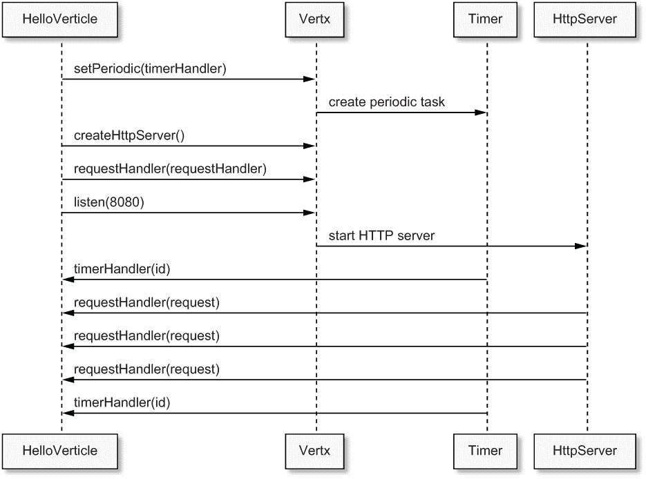
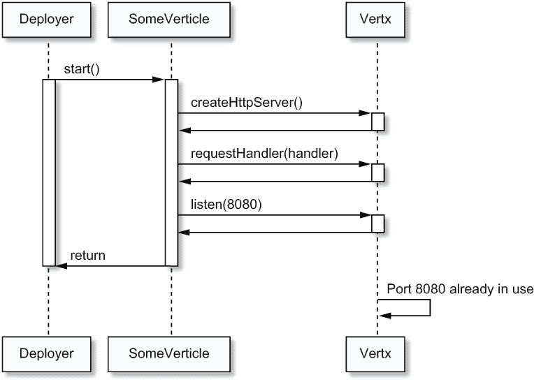
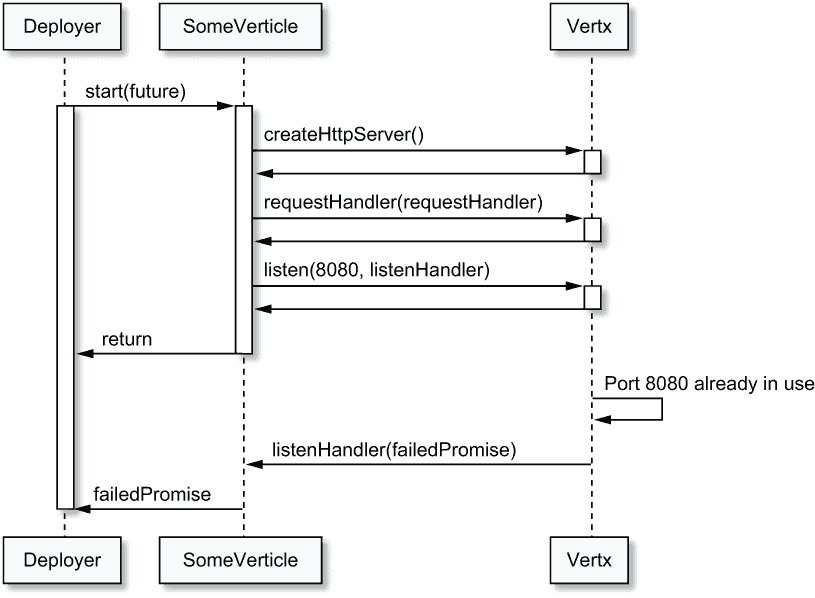
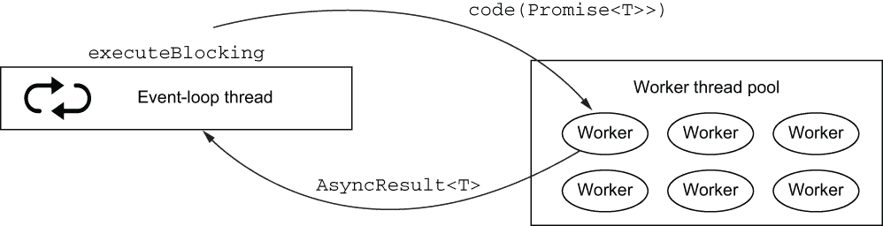
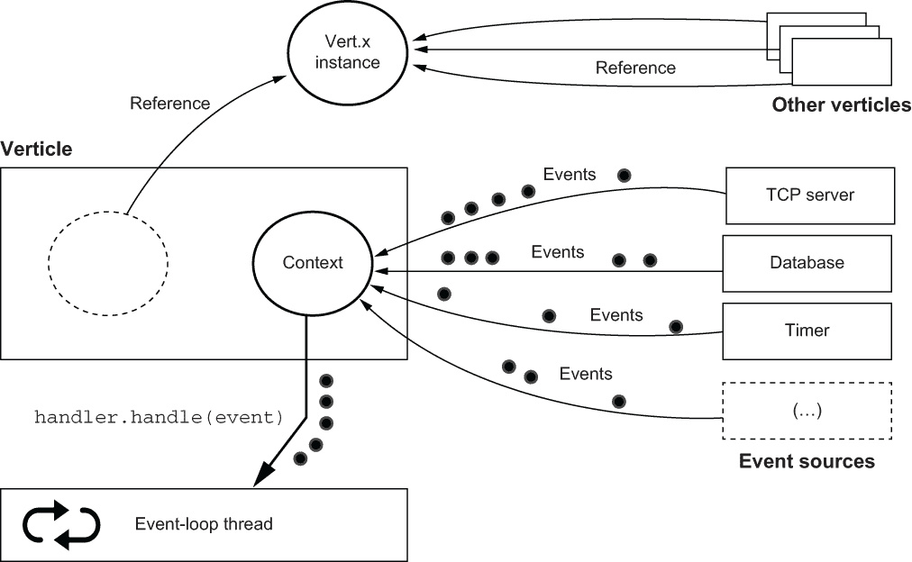
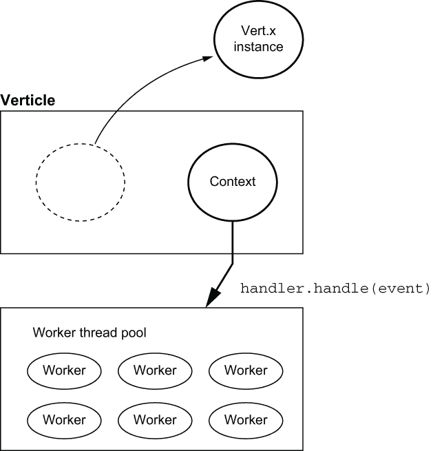

# 2 Verticles：Vert.x 的基本处理单元

本章涵盖

+   verticles 是什么

+   如何编写、配置和部署 verticles

+   Vert.x 的线程模型

+   如何混合 Vert.x 和非 Vert.x 线程

简单来说，*verticle*是 Vert.x 中的基本处理单元。verticle 的作用是封装一个*技术功能单元*以处理事件，例如暴露 HTTP API 并响应请求，在数据库之上提供存储库接口，或向第三方系统发出请求。与像 Enterprise JavaBeans 这样的技术中的组件类似，verticles 可以被部署，并且它们有自己的生命周期。

异步编程是构建响应式应用的关键，因为它们需要扩展，而 verticles 在 Vert.x 中对于结构（异步）事件处理代码和业务逻辑是基本的。

## 2.1 编写 verticle

如果您熟悉*actor 并发模型*，您将在 Vert.x verticles 和 actors 之间找到相似之处。1 简单来说，在 actor 模型中，自主实体（actors）通过发送和响应消息专门与其他实体通信。Vert.x verticles 和 actors 之间的相似性并非偶然巧合：verticles 具有可能在接收事件时更新的私有状态，它们可以部署其他 verticles，并且它们可以通过消息传递进行通信（下一章将详细介绍）。verticles 不一定遵循 actor 的正统定义，但公平地说，Vert.x 至少受到了 actor 的启发。

由于 verticles 是 Vert.x 中的一个关键概念，我们将探讨它们是如何工作的。在此之前，我们将编写一个小型 verticle 来处理两种类型的事件：周期性计时器和 HTTP 请求。

### 2.1.1 准备项目

我们将使用一个通用的项目来展示本章中的所有示例，并使用以下列表中的 Gradle 项目描述符。

列表 2.1 第二章示例的 Gradle `build.gradle.kts`

```
plugins {
  java
}

repositories {
  mavenCentral()
}

dependencies {
  implementation("io.vertx:vertx-core:VERSION")                   ❶
  implementation("ch.qos.logback:logback-classic:1.2.3")          ❷
}

tasks.create<JavaExec>("run") {                                   ❸
  main = project.properties.getOrDefault("mainClass", 
  ➥ "chapter2.hello.HelloVerticle") as String
  classpath = sourceSets["main"].runtimeClasspath
  systemProperties["vertx.logger-delegate-factory-class-name"] = 
  ➥ "io.vertx.core.logging.SLF4JLogDelegateFactory"              ❹
}

java {
  sourceCompatibility = JavaVersion.VERSION_1_8
}
```

❶ 这是 Vert.x 核心库依赖。将“VERSION”替换为最近的发布号，如 3.9.0。

❷ logback-classic 依赖提供了 SLF4J 日志记录器 API 和 logback 实现。

❸ 这将允许您从命令行运行使用 Gradle 的示例。

❹ 这确保了 Vert.x 本身也使用 SLF4J 日志记录。

Gradle 构建对于 Java 项目来说非常简单。由于我们将运行多个示例，我们不会依赖于 Gradle `application`插件，而是定义自己的自定义`run`任务，其中我们可以传递要执行的类的名称。我们还将使用它来确保日志配置正确且统一到 SLF4J。

列表 2.2 Logback 配置以减少 Netty 的冗余

```
<configuration>                                                        ❶
  <appender name="STDOUT" class="ch.qos.logback.core.ConsoleAppender">
    <encoder>
      <pattern>%level [%thread] %logger{0} - %msg%n</pattern>          ❷
    </encoder>
  </appender>

  <logger name="io.netty" level="warn"/>                               ❸

  <root level="debug">
    <appender-ref ref="STDOUT"/>
  </root>
</configuration>
```

❶ 这定义了一个将事件发送到控制台的后缀。

❷ 该模式定义了日志事件的样式。

❸ 我们丢弃比警告更冗余的 Netty 日志事件。

提示：Vert.x 使用 Netty，并且 Netty 的默认 Logback 配置中的日志记录相当详细。我们可以通过创建一个 src/main/resources/logback.xml 文件并添加配置来减少日志条目数量，如列表 2.2 中所示。为了使本书中的日志样本更短，我还删除了事件日期并缩短了记录器类名（`$logger{0}`）。请参阅 Logback 文档以了解如何配置它 ([`logback.qos.ch/manual/index.html`](https://logback.qos.ch/manual/index.html))。

### 2.1.2 组件类

整个组件和应用程序都包含在以下 Java 类中。

列表 2.3 一个示例组件

```
package chapter2.hello;

import io.vertx.core.AbstractVerticle;
import io.vertx.core.Vertx;
import org.slf4j.Logger;
import org.slf4j.LoggerFactory;

public class HelloVerticle extends AbstractVerticle {
  private final Logger logger = LoggerFactory.getLogger(HelloVerticle.class);
  private long counter = 1;

  @Override
  public void start() {
    vertx.setPeriodic(5000, id -> {                    ❶
      logger.info("tick");
    });

    vertx.createHttpServer()
      .requestHandler(req -> {                         ❷
        logger.info("Request #{} from {}", counter++, 
        ➥ req.remoteAddress().host());
        req.response().end("Hello!");
      })
      .listen(8080);
    logger.info("Open http://localhost:8080/");
  }

  public static void main(String[] args) {
    Vertx vertx = Vertx.vertx();                       ❸
    vertx.deployVerticle(new HelloVerticle());         ❹
  }
}
```

❶ 这定义了一个每五秒执行一次的周期性任务。

❷ HTTP 服务器会在每次请求时调用此处理器。

❸ 我们需要一个全局的 Vert.x 实例。

❹ 这是部署组件的最简单方法。

这个组件定义了两个事件处理器：一个用于每五秒执行一次的周期性任务，另一个用于处理 HTTP 服务器中的 HTTP 请求。`main` 方法实例化一个全局的 Vert.x 实例并部署一个组件实例。

在 Java 中定义组件通常是通过特化 `AbstractVerticle` 类来完成的。理论上您可以实现 `Verticle` 接口，但 `AbstractVerticle` 提供了 Vert.x 用户所需的所有事件处理、配置和执行管道。

注意：由于 Vert.x 是一个库而不是框架，您可以从 `main` 方法或任何其他类中创建 Vert.x 实例，然后部署组件。

组件的生命周期由启动和停止事件组成。`AbstractVerticle` 类提供了可以重写的 `start` 和 `stop` 方法：

+   `start` 方法通常包含处理器的设置和初始化，如列表 2.3 中设置周期性任务处理器和启动 HTTP 服务器。

+   当需要执行清理任务时，例如关闭打开的数据库连接，会实现 `stop` 方法。

默认情况下，这些方法不执行任何操作。

### 2.1.3 运行和初步观察

应用程序可以作为常规 Java 应用程序启动，通过 IDE 或命令行运行 `main` 方法。要在命令行中使用 Gradle 运行它，可以使用以下命令：

```
$ ./gradlew run -PmainClass=chapter2.hello.HelloVerticle
```

我再次假设您将从 Unix shell 中运行此程序，无论是 Linux、macOS 还是通过 WSL 的 Windows。如果您从传统的 Windows 终端运行命令，有一个 Gradle 的 .bat 文件，因此您需要将 `./gradlew` 替换为 `gradlew.bat`。

一旦应用程序运行，您可以使用网络浏览器在 http://localhost:8080/ 上执行几个 HTTP 请求，或者通过使用 curl 和 HTTPie 等命令行工具。日志将类似于以下列表中所示。

列表 2.4 运行 `HelloVerticle` 时的示例日志输出

```
INFO [vert.x-eventloop-thread-0] HelloVerticle - Open http://localhost:8080/❶
INFO [vert.x-eventloop-thread-0] HelloVerticle - tick                       ❷
INFO [vert.x-eventloop-thread-0] HelloVerticle - 
➥ Request #1 from 0:0:0:0:0:0:0:1                                          ❸
INFO [vert.x-eventloop-thread-0] HelloVerticle - 
➥ Request #2 from 0:0:0:0:0:0:0:1
INFO [vert.x-eventloop-thread-0] HelloVerticle - 
➥ Request #3 from 0:0:0:0:0:0:0:1
INFO [vert.x-eventloop-thread-0] HelloVerticle - 
➥ Request #4 from 0:0:0:0:0:0:0:1
INFO [vert.x-eventloop-thread-0] HelloVerticle - tick
```

❶ HTTP 服务器现在已准备就绪。

❷ 周期性任务事件日志

❸ HTTP 请求事件日志

提示：在一些剩余的示例中，我已经缩短了类定义。我特别移除了与列表 2.3 中类似的包定义、导入和`main`方法。要查看完整的源代码，请查阅本书的代码仓库。

我们使用的 Logback 配置显示了与事件相关联的线程名称。我们已经在日志条目中检查了 Vert.x 垂直结构的一个重要属性：事件处理发生在单个事件循环线程上。周期性任务和 HTTP 请求处理都发生在日志中显示为`vert.x -eventloop-thread-0`的线程上。

这种设计的明显好处是，垂直实例总是在同一线程上执行事件处理，因此不需要使用线程同步原语。在多线程设计中，更新`counter`字段可能需要`synchronized`块或使用`java.util.concurrent.AtomicLong`。这里没有这样的问题，因此可以安全地使用普通`long`字段。

准备方法，如`createHttpServer`或`setTimer`，可能从非 Vert.x 线程中调用。这可能会发生在你直接使用`Vertx`对象而没有垂直结构，或者当你编写单元测试时。然而，这并不是一个问题，因为`Vertx`类方法的使用是线程安全的。

图 2.1 显示了垂直结构、处理器、Vert.x 和事件源之间的（简化）交互。每条箭头代表参与者之间的方法调用。例如，`HelloVerticle`通过在`Vertx`对象上调用`setPeriodic`来创建周期性任务处理器，这反过来又使用内部 Vert.x 计时器创建周期性任务。然后，计时器定期回调`HelloVerticle`中的`timerHandler`处理器。



图 2.1 列表 2.3 的执行

注意，我将`requestHandler`和`listen`的调用表示为对`Vertx`对象的调用，这是一个快捷方式；实际上，它们是在实现`HttpServer`接口的对象上。实际类是 Vert.x 内部的，并且由于它不服务于添加另一个参与者，我将其合并到`Vertx`中。

## 2.2 关于垂直结构更多内容

关于编写和部署垂直结构，还有更多需要了解的内容：

+   当事件循环被阻塞时会发生什么？

+   在存在异步初始化工作的情况下，你如何延迟生命周期完成的通告？

+   你如何部署和卸载垂直结构？

+   你如何传递配置数据？

我们将使用非常简单但专注的示例来涵盖这些主题。

### 2.2.1 阻塞和事件循环

处理器回调是在事件循环线程上运行的。代码在事件循环上运行时，应尽可能少地占用时间，以便事件循环线程可以处理更多的事件。这就是为什么不应该在事件循环上发生长时间运行或阻塞 I/O 操作。

话虽如此，在第三方库中使用时，可能并不总是容易发现阻塞代码。Vert.x 提供了一个检查器，用于检测事件循环被阻塞的时间过长。

为了说明这一点，让我们看看当我们在一个事件处理程序回调中引入无限循环时会发生什么。

列表 2.5 一个事件循环被阻塞的示例

```
public class BlockEventLoop extends AbstractVerticle {

  @Override
  public void start() {
    vertx.setTimer(1000, id -> {
      while (true);                ❶
    });
  }

  public static void main(String[] args) {
    Vertx vertx = Vertx.vertx();
    vertx.deployVerticle(new BlockEventLoop());
  }
}
```

❶ 无限循环！

列表 2.5 中的代码定义了一个一秒定时器，并且处理程序回调进入了一个无限循环。

列表 2.6 运行列表 2.5 时的日志输出

```
WARN [vertx-blocked-thread-checker] BlockedThreadChecker - Thread 
➥ Thread[vert.x-eventloop-thread-0,5,main] has been blocked for 2871 
➥ ms, time limit is 2000
WARN [vertx-blocked-thread-checker] BlockedThreadChecker - Thread 
➥ Thread[vert.x-eventloop-thread-0,5,main] has been blocked for 3871 ms, 
➥ time limit is 2000                                                      ❶
(...)
WARN [vertx-blocked-thread-checker] BlockedThreadChecker - Thread 
➥ Thread[vert.x-eventloop-thread-0,5,main] has been blocked for 5879 
➥ ms, time limit is 2000
io.vertx.core.VertxException: Thread blocked
  at chapter2.blocker.BlockEventLoop.lambda$start$0(BlockEventLoop.java:11)
  at chapter2.blocker.BlockEventLoop$$Lambda$10/152379791.handle(Unknown 
  ➥ Source)
(...)
```

❶ 线程检查器不开心了。

列表 2.6 显示了运行列表 2.5 代码时的典型日志输出。如您所见，当事件循环线程运行无限循环时，开始出现警告，因此它无法处理其他事件。经过一些迭代（默认为五秒），警告中包含了堆栈跟踪转储，因此您可以清楚地识别出代码中的问题。请注意，这只是一个警告。事件循环线程检查器不能杀死执行时间过长的处理程序。

当然，有时您可能需要使用阻塞或长时间运行的代码，而 Vert.x 提供了解决方案来运行这样的代码而不阻塞事件循环。这是第 2.3 节的主题。

配置 Vert.x 阻塞线程检查器

默认情况下，在阻塞的线程检查器抱怨之前的时间限制是两秒，但可以配置为不同的值。在一些环境，例如嵌入式设备中，处理能力较慢，因此对于它们来说增加线程检查器的阈值是正常的。

您可以使用系统属性来更改设置：

+   `-Dvertx.options.blockedThreadCheckInterval=5000` 将间隔更改为五秒。

+   `-Dvertx.threadChecks=false` 禁用了线程检查器。

注意，这个配置是全局的，并且不能根据每个 verticle 进行微调。

### 2.2.2 生命周期事件的异步通知

到目前为止，我们已经查看了一些使用 `start()` 生命周期方法的示例。这些方法中的约定是，一个 verticle 成功完成了其 `start` 生命周期事件处理，除非方法抛出异常。`stop()` 方法也是如此。

然而，存在一个问题：`start` 或 `stop` 方法中的某些操作可能是异步的，因此它们可能在调用 `start()` 或 `stop()` 返回之后完成。

让我们看看如何正确通知延迟成功或失败的调用者。一个很好的例子是启动 HTTP 服务器，这是一个非阻塞操作。

列表 2.7 异步启动生命周期方法的示例

```
public class SomeVerticle extends AbstractVerticle {

   @Override
  public void start(Promise<Void> promise) {           ❶
    vertx.createHttpServer()
      .requestHandler(req -> req.response().end("Ok"))
      .listen(8080, ar -> {
        if (ar.succeeded()) {                          ❷
          promise.complete();                          ❸
        } else {
          promise.fail(ar.cause());                    ❹
        }
      });
  }
}
```

❶ Promise 是 void 类型，因为 Vert.x 只对部署完成感兴趣，没有值需要携带。

❷ 支持异步结果的 listen 变体指示操作是否失败。

❸ 使用 `complete()` 来标记 Promise 为完成状态（当 Promise 不是 void 类型时，可以传递一个值）。

❹ 如果监听操作失败，我们将 Promise 标记为失败并传播错误。

列表 2.7 展示了当 verticle 启动时报告异步通知的示例。这很重要，因为启动 HTTP 服务器*可能*会失败。确实，TCP 端口可能被另一个进程使用，在这种情况下，HTTP 服务器无法启动，因此 verticle 没有成功部署。为了报告异步通知，我们使用`listen`方法的变体，当操作完成时调用回调。

`AbstractVerticle`中的`start`和`stop`方法支持具有`io.vertx.core.Promise`类型参数的变体。正如其名所示，Vert.x 的`Promise`是对*future 和 promise*模型进行异步结果处理的改编。2 一个*promise*用于*写入*异步结果，而一个*future*用于*查看*异步结果。给定一个`Promise`对象，您可以调用`future()`方法来获取类型为`io.vertx.core.Future`的 future。

在列表 2.7 中，`Promise`对象被设置为在 verticle 成功完成其`start`或`stop`生命周期时完成。如果出现错误，`Promise`对象将因异常描述错误而失败，verticle 部署也会失败。



图 2.2 使用 Promise 和`listen`处理器的 HTTP 服务器启动序列图

为了更好地理解这里发生的情况，图 2.2 说明了 verticle、Vert.x 对象和负责调用`start`方法的内部 Vert.x 部署器对象之间的交互。我们可以检查部署器等待 Promise 完成以确定部署是否成功，即使在调用`start`方法返回之后也是如此。相比之下，图 2.3 显示了不使用接受`Promise`对象变体的`start`时的交互。部署器无法通知错误。



图 2.3 无 Promise 和`listen`处理器的 HTTP 服务器启动序列图

提示：使用异步方法变体，如列表 2.7 中的`listen`方法，来通知错误是一种良好的健壮性实践。如果这允许我减少代码示例的冗长性，我将在本书的其余部分不总是这样做。

### 2.2.3 部署 verticles

到目前为止，我们一直是从单个 verticle 类中嵌入的`main`方法部署 verticles。

Verticles 总是通过`Vertx`对象部署（和取消部署）。您可以从任何方法中这样做，但部署由 verticles 组成的应用的典型方式如下：

1.  部署`main` verticle。

1.  `main` verticle 部署其他 verticles。

1.  部署的 verticles 可以进一步部署其他 verticles。

注意，虽然这听起来像是分层结构，但 Vert.x 没有正式的父/子 verticles 概念。

为了说明这一点，让我们定义一些 verticles。

列表 2.8 一个用于部署的示例垂直结构

```
public class EmptyVerticle extends AbstractVerticle {
  private final Logger logger = LoggerFactory.getLogger(EmptyVerticle.class);

  @Override
  public void start() {
    logger.info("Start");    ❶
  }

  @Override
  public void stop() {
    logger.info("Stop");
  }
}
```

❶ 我们记录垂直结构启动时的情况。

列表 2.8 定义了一个简单的垂直结构。它除了在启动和停止时记录日志外，没有做任何有趣的事情。

列表 2.9 一个部署和卸载其他垂直结构的垂直结构

```
public class Deployer extends AbstractVerticle {
  private final Logger logger = LoggerFactory.getLogger(Deployer.class);

  @Override
  public void start() {
    long delay = 1000;
    for (int i = 0; i < 50; i++) {
      vertx.setTimer(delay, id -> deploy());                ❶
      delay = delay + 1000;
    }
  }

  private void deploy() {
    vertx.deployVerticle(new EmptyVerticle(), ar -> {       ❷
      if (ar.succeeded()) {
        String id = ar.result();
        logger.info("Successfully deployed {}", id);
        vertx.setTimer(5000, tid -> undeployLater(id));     ❸
      } else {
        logger.error("Error while deploying", ar.cause());
      }
    });
  }

  private void undeployLater(String id) {
    vertx.undeploy(id, ar -> {                              ❹
      if (ar.succeeded()) {
        logger.info("{} was undeployed", id);
      } else {
        logger.error("{} could not be undeployed", id);
      }
    });
  }
}
```

❶ 我们每秒部署一个新的 EmptyVerticle 实例。

❷ 部署垂直结构是一个异步操作，deploy 方法有一个支持异步结果的变体。

❸ 五秒后我们将卸载一个垂直结构。

❹ 卸载与部署非常相似。

列表 2.9 定义了一个垂直结构，它从 2.8 部署了`EmptyVerticle`类的 50 个实例。定时器的使用使我们能够将每个部署分开一秒。`deploy`方法使用另一个定时器在垂直结构部署五秒后卸载。部署为垂直结构分配一个唯一的标识符字符串，以后可以用于卸载。

列表 2.10 用于部署`Deployer`垂直结构的主体类

```
public static void main(String[] args) {
  Vertx vertx = Vertx.vertx();
  vertx.deployVerticle(new Deployer());
}
```

最后但同样重要的是，`Deployer`垂直结构本身可以从`main`方法和类中部署，如列表 2.10 所示。运行此示例会产生如下列表中的日志条目。

列表 2.11 运行列表 2.10 中代码的日志摘录

```
INFO [vert.x-eventloop-thread-1] EmptyVerticle - Start
INFO [vert.x-eventloop-thread-0] Deployer - Successfully deployed 
➥ 05553394-b6ce-4f47-9076-2c6648d65329                            ❶
INFO [vert.x-eventloop-thread-2] EmptyVerticle - Start
INFO [vert.x-eventloop-thread-0] Deployer - Successfully deployed 
➥ 6d920f33-f317-4964-992f-e712185fe514
(...)
INFO [vert.x-eventloop-thread-0] Deployer - 
➥ 8153abb7-fc64-496e-8155-75c27a93b56d was undeployed             ❷
INFO [vert.x-eventloop-thread-13] EmptyVerticle - Start
INFO [vert.x-eventloop-thread-0] Deployer - Successfully deployed 
➥ 0f69ccd8-1344-4b70-8245-020a4815cc96
(...)
```

❶ 已部署一个垂直结构。

❷ 已卸载一个垂直结构。

您可以从`vert.x-eventloop-thread-0`线程中看到日志条目；它们对应于`Deployer`垂直结构。然后您可以看到来自`EmptyVerticle`实例的生命周期日志事件；它们使用其他事件循环线程。

有趣的是，我们从`Deployer`部署了 50 个垂直结构，但日志中出现的垂直结构可能比线程少。默认情况下，Vert.x 创建的事件循环线程数是 CPU 核心数的两倍。如果您有 8 个核心，那么 Vert.x 应用程序有 16 个事件循环。垂直结构到事件循环的分配是循环分配的。

这给我们一个有趣的教训：虽然垂直结构始终使用相同的事件循环线程，但事件循环线程被多个垂直结构共享。这种设计导致运行应用程序的线程数量可预测。

小贴士：可以调整应有多少个事件循环可用，但无法手动将给定的垂直结构分配到特定的事件循环。在实际情况中，这不应该成为问题，但最坏的情况下，您总是可以计划垂直结构的部署顺序。

### 2.2.4 传递配置数据

应用程序代码通常需要配置数据。一个很好的例子是连接到数据库服务器的代码：它通常需要一个主机名、TCP 端口、登录名和密码。由于这些值从一个部署配置到另一个部署配置会有所不同，因此这种配置需要从*配置*API 中访问。

当 Vert.x 节点被部署时，可以传递此类配置数据。你将在本书的后面看到，可以使用一些更高级的配置形式，但 Vert.x 核心 API 已经提供了一种非常有用的通用 API。

配置需要以 JSON 数据的形式传递，使用 `io.vertx.core.json` 包中的 `JsonObject` 和 `JsonArray` 类实现的 Vert.x JSON API。

列表 2.12 将配置数据传递给节点

```
public class SampleVerticle extends AbstractVerticle {
  private final Logger logger = LoggerFactory.getLogger(SampleVerticle.class);

  @Override
  public void start() {
    logger.info("n = {}", config().getInteger("n", -1));           ❶
  }

  public static void main(String[] args) {
    Vertx vertx = Vertx.vertx();
    for (int n = 0; n < 4; n++) {
      JsonObject conf = new JsonObject().put("n", n);              ❷
      DeploymentOptions opts = new DeploymentOptions()
        .setConfig(conf)                                           ❸
        .setInstances(n);                                          ❹
      vertx.deployVerticle("chapter2.opts.SampleVerticle", opts);  ❺
    }
  }
}
```

❶ `config()` 返回 JsonObject 配置实例，访问器方法支持可选的默认值。在这里，如果 JSON 对象中没有“n”键，则返回 -1。

❷ 我们创建一个 JSON 对象，并为“n”键放入一个整数值。

❸ 部署选项允许对节点有更多的控制，包括传递配置数据。

❹ 我们可以一次性部署多个实例。

❺ 由于我们部署了多个实例，我们需要使用节点的完全限定类名（FQCN）来指向节点，而不是使用 new 操作符。对于仅部署一个实例，你可以选择使用 new 创建的实例或使用 FQCN。

列表 2.12 展示了部署多个节点并传递配置数据的示例。运行示例会给出列表 2.13 中的输出，你可以检查配置数据的不同值。

列表 2.13 当在列表 2.12 中运行代码时的示例执行输出

```
INFO [vert.x-eventloop-thread-2] SampleVerticle - n = 2
INFO [vert.x-eventloop-thread-5] SampleVerticle - n = 3
INFO [vert.x-eventloop-thread-4] SampleVerticle - n = 3
INFO [vert.x-eventloop-thread-1] SampleVerticle - n = 2
INFO [vert.x-eventloop-thread-3] SampleVerticle - n = 3
INFO [vert.x-eventloop-thread-0] SampleVerticle - n = 1
```

## 2.3 当代码需要阻塞时

在事件循环上运行代码的基本规则是，它不应该阻塞，并且应该运行“足够快”。你之前已经看到，默认情况下，Vert.x 会检测并警告事件循环被阻塞得太久。

必然会有一些情况，你很难避免阻塞代码。这可能是因为你正在使用具有另一种线程模型的第三方库，例如某些网络服务的驱动程序。Vert.x 提供了两种处理此类情况的方法：工作节点和 `executeBlocking` 操作。

### 2.3.1 工作节点

工作节点（Worker Verticles）是一种特殊的节点形式，它们不在事件循环上执行。相反，它们在*工作线程*上执行，即从特殊的工作线程池中取出的线程。你可以定义自己的工作线程池并将工作节点部署到它们中，但在大多数情况下，使用默认的 Vert.x 工作线程池就足够了。

工作节点处理事件的方式与事件循环节点相同，只不过它可能需要任意长的时间来完成。理解以下两点很重要：

+   工作节点不绑定到单个工作线程，因此与事件循环节点不同，连续的事件可能不会在同一个线程上执行。

+   工作节点在同一时间只能由单个工作线程访问。

简单来说，就像事件循环节点一样，工作节点是单线程的，但与事件循环节点不同的是，线程可能并不总是相同的。

列表 2.14 一个示例工作节点

```
public class WorkerVerticle extends AbstractVerticle {
  private final Logger logger = LoggerFactory.getLogger(WorkerVerticle.class);

  @Override
  public void start() {
    vertx.setPeriodic(10_000, id -> {
      try {
        logger.info("Zzz...");
        Thread.sleep(8000);                               ❶
        logger.info("Up!");
      } catch (InterruptedException e) {
        logger.error("Woops", e);
      }
    });
  }

  public static void main(String[] args) {
    Vertx vertx = Vertx.vertx();
    DeploymentOptions opts = new DeploymentOptions()
      .setInstances(2)
      .setWorker(true);                                  ❷
    vertx.deployVerticle("chapter2.worker.WorkerVerticle", opts);
  }
}
```

❶ 我们可以阻塞而不会收到警告！

❷ 创建一个工作垂直是一个部署选项标志。

列表 2.14 展示了这样一个例子：一个工作垂直部署了两个实例。每隔 10 秒，代码会阻塞 8 秒。运行此示例会产生类似于列表 2.15 的输出。正如您所看到的，不同的工作线程被用于连续的事件。

列表 2.15 运行列表 2.14 的示例输出

```
INFO [vert.x-worker-thread-2] WorkerVerticle - Zzz...
INFO [vert.x-worker-thread-3] WorkerVerticle - Zzz...
INFO [vert.x-worker-thread-3] WorkerVerticle - Up!
INFO [vert.x-worker-thread-2] WorkerVerticle - Up!
INFO [vert.x-worker-thread-5] WorkerVerticle - Zzz...
INFO [vert.x-worker-thread-4] WorkerVerticle - Zzz...
INFO [vert.x-worker-thread-4] WorkerVerticle - Up!
INFO [vert.x-worker-thread-5] WorkerVerticle - Up!
(...)
```

警告 当部署垂直时，有一个选项可以启用工作垂直的多线程，这允许垂直同时处理多个事件，打破了单线程处理的假设。这始终被认为是一种相当高级的使用方式，许多用户最终以错误的方式使用它并捕获并发错误。该功能不再公开文档化，甚至可能在未来的 Vert.x 版本中消失。鼓励用户简单地调整工作池大小以匹配工作负载，而不是启用工作多线程。

### 2.3.2 `executeBlocking`操作

工作垂直是运行阻塞任务的一个合理选项，但并不总是有意义将阻塞代码提取到工作垂直中。这样做可能会导致执行小任务的工人垂直类数量激增，而且每个类可能不是一个合理的独立功能单元。

运行阻塞代码的另一种选项是使用`Vertx`类的`executeBlocking`方法。此方法接受一些要执行的阻塞代码，将其卸载到工作线程，并将结果作为新事件发送回事件循环，如图 2.4 所示。



图 2.4 `executeBlocking`调用中的交互

下面的列表展示了其示例用法。

列表 2.16 使用`executeBlocking`

```
public class Offload extends AbstractVerticle {
  private final Logger logger = LoggerFactory.getLogger(Offload.class);

  @Override
  public void start() {
    vertx.setPeriodic(5000, id -> {
      logger.info("Tick");
      vertx.executeBlocking(this::blockingCode, this::resultHandler);   ❶
    });
  }

  private void blockingCode(Promise<String> promise) {                  ❷
    logger.info("Blocking code running");
    try {
      Thread.sleep(4000);
      logger.info("Done!");
      promise.complete("Ok!");                                          ❸
    } catch (InterruptedException e) {
      promise.fail(e);
    }
  }

  private void resultHandler(AsyncResult<String> ar) {                  ❹
    if (ar.succeeded()) {
      logger.info("Blocking code result: {}", ar.result());
    } else {
      logger.error("Woops", ar.cause());
    }
  }
}
```

❶ `executeBlocking`接受两个参数：要运行的代码和运行后的回调。

❷ 阻塞代码接受任何类型的 Promise 对象。它最终用于传递结果。

❸ Promise 对象需要完成或失败，以标记阻塞代码执行的结束。

❹ 在事件循环上处理结果只是另一个异步结果。

下面的列表展示了运行列表 2.16 中代码的一些示例输出。正如您所看到的，执行被卸载到工作线程，但结果处理仍然发生在事件循环上。

列表 2.17 运行列表 2.16 时的示例输出

```
INFO [vert.x-eventloop-thread-0] Offload - Tick
INFO [vert.x-worker-thread-0] Offload - Blocking code running
INFO [vert.x-worker-thread-0] Offload - Done!
INFO [vert.x-eventloop-thread-0] Offload - Blocking code result: Ok!
INFO [vert.x-eventloop-thread-0] Offload - Tick
INFO [vert.x-worker-thread-1] Offload - Blocking code running
INFO [vert.x-worker-thread-1] Offload - Done!
INFO [vert.x-eventloop-thread-0] Offload - Blocking code result: Ok!
INFO [vert.x-eventloop-thread-0] Offload - Tick
INFO [vert.x-worker-thread-2] Offload - Blocking code running
(...)
```

提示 默认情况下，连续的`executeBlocking`操作的结果会按照`executeBlocking`调用的顺序进行处理。`executeBlocking`有一个带有额外`boolean`参数的变体，当它设置为`false`时，结果一旦可用就会作为事件循环事件提供，而不考虑`executeBlocking`调用的顺序。

## 2.4 那么，垂直中到底有什么？

到目前为止，你已经看到了如何编写垂直，如何部署和配置它们，以及如何处理阻塞代码。通过在示例中使用信息日志，你已经看到了 Vert.x 线程模型中的元素。

现在是一个很好的时机来回顾一下垂直内部的结构，并确保你在离开这一章时对垂直的工作原理和如何正确使用它们有一个全面的理解。

### 2.4.1 垂直和它们的环境

图 2.5 给出了垂直及其环境之间关系的一个概述。

垂直对象本质上是由两个对象的组合：

+   垂直所属的 Vert.x 实例

+   一个专门上下文实例，允许事件被调度到处理器



图 2.5 事件循环垂直及其环境

Vert.x 实例公开了声明事件处理器的核心 API。我们已经在之前的代码示例中使用了它，例如 `setTimer`、`setPeriodic`、`createHttpServer`、`deployVerticle` 等方法。Vert.x 实例被多个垂直共享，并且通常每个 JVM 进程只有一个 `Vertx` 实例。

上下文实例持有执行处理器的线程访问权限。事件可能来自各种来源，如计时器、数据库驱动程序、HTTP 服务器等。因此，它们通常是从其他线程触发的，例如 Netty 接受线程或计时器线程。

用户定义回调中的事件处理通过上下文进行。上下文实例允许我们在垂直事件循环线程上调用处理器，从而尊重 Vert.x 线程模型。

工作垂直的情况并没有太大的不同，除了处理器是在工作线程池中的一个工作线程上执行的，如图 2.6 所示。它们仍然是垂直，就像它们的事件循环对应物一样，代码可以假设单线程访问。只是没有稳定性来决定哪个工作线程将被用于处理工作垂直的事件。



图 2.6 一个工作垂直和它的环境

### 2.4.2 更多关于上下文的内容

可以使用 `Vertx` 类中的 `getOrCreateContext()` 方法访问上下文对象。虽然上下文几乎总是与垂直相关联，但可以在垂直之外创建事件循环上下文。正如方法名所暗示的

+   从类似于垂直的上下文线程中调用 `getOrCreateContext()` 返回上下文。

+   从非上下文线程中调用 `getOrCreateContext()` 会创建一个新的上下文。

列表 2.18 展示了一个示例，其中创建了一个全局的 `Vertx` 实例，并在 JVM 进程的主线程上对 `getOrCreateContext` 进行了两次调用。每次调用之后都跟着一个对 `runOnContext` 的调用，这允许我们在上下文线程上运行一段代码块。

列表 2.18 创建无垂直方向的上下文

```
Vertx vertx = Vertx.vertx();

vertx.getOrCreateContext()
  .runOnContext(v -> logger.info("ABC"));    ❶

vertx.getOrCreateContext()
  .runOnContext(v -> logger.info("123"));
```

❷ Lambda 在 Vert.x 上下文线程上执行。

正如你在下一个列表中可以看到的，每个上下文都被分配到一个事件循环。

列表 2.19 运行列表 2.18 的示例输出

```
INFO [vert.x-eventloop-thread-1] ThreadsAndContexts - 123
INFO [vert.x-eventloop-thread-0] ThreadsAndContexts - ABC
```

上下文对象支持更多操作，例如持有上下文范围内的任意键/值数据并声明异常处理程序。以下列表展示了这样一个示例，其中 `foo` 键持有字符串 `bar`，并声明了一个异常处理程序来捕获和处理在事件循环线程上执行处理程序时的异常。

列表 2.20 使用上下文数据和异常处理

```
Vertx vertx = Vertx.vertx();
Context ctx = vertx.getOrCreateContext();
ctx.put("foo", "bar");

ctx.exceptionHandler(t -> {
  if ("Tada".equals(t.getMessage())) {
    logger.info("Got a _Tada_ exception");
  } else {
    logger.error("Woops", t);
  }
});

ctx.runOnContext(v -> {
  throw new RuntimeException("Tada");
});

ctx.runOnContext(v -> {
  logger.info("foo = {}", (String) ctx.get("foo"));
});
```

当事件处理分散在多个类中时，上下文数据可能很有用。否则，使用类字段会更简单（并且更快！）。

当事件处理可能抛出异常时，异常处理程序很重要。默认情况下，异常只是由 Vert.x 记录，但在执行自定义操作以处理错误时，覆盖上下文异常处理程序是有用的。

列表 2.21 运行列表 2.20 的示例输出

```
INFO [vert.x-eventloop-thread-0] ThreadsAndContexts - Got a _Tada_ exception
INFO [vert.x-eventloop-thread-0] ThreadsAndContexts - foo = bar
```

运行列表 2.20 中的代码会产生与列表 2.21 相似的输出。

### 2.4.3 桥接 Vert.x 和非-Vert.x 线程模型

在编写 Vert.x 应用程序时，你可能不需要处理 Vert.x 上下文。然而，有一种情况是最有意义的：当你必须使用具有自己线程模型的第三方代码，并且你想让它与 Vert.x 正确工作。

下一个列表中的代码示例展示了如何创建一个非-Vert.x 线程。通过传递从垂直结构中获取的上下文，我们能够从运行在非-Vert.x 线程上的代码中执行一些代码回到事件循环。

列表 2.22 混合不同的线程模型

```
public class MixedThreading extends AbstractVerticle {
  private final Logger logger = LoggerFactory.getLogger(MixedThreading.class);

  @Override
  public void start() {
    Context context = vertx.getOrCreateContext();     ❶
    new Thread(() -> {
      try {
        run(context);
      } catch (InterruptedException e) {
        logger.error("Woops", e);
      }
    }).start();                                       ❷
  }

  private void run(Context context) throws InterruptedException {
    CountDownLatch latch = new CountDownLatch(1);
    logger.info("I am in a non-Vert.x thread");
    context.runOnContext(v -> {                       ❸
      logger.info("I am on the event-loop");
      vertx.setTimer(1000, id -> {
        logger.info("This is the final countdown");
        latch.countDown();
      });
    });
    logger.info("Waiting on the countdown latch...");
    latch.await();
    logger.info("Bye!");
  }
}
```

❶ 我们获取垂直结构的上下文，因为 `start` 是在事件循环线程上运行的。

❷ 我们启动了一个普通的 Java 线程。

❸ `runOnContext` 确保我们在垂直结构事件循环线程上运行一些代码。

下面的列表中的日志显示了这一点。

列表 2.23 运行列表 2.22 的示例输出

```
INFO [Thread-3] MixedThreading - I am in a non-Vert.x thread
INFO [Thread-3] MixedThreading - Waiting on the countdown latch...
INFO [vert.x-eventloop-thread-0] MixedThreading - I am on the event-loop
INFO [vert.x-eventloop-thread-0] MixedThreading - This is the final countdown
INFO [Thread-3] MixedThreading - Bye!
```

当你需要将非-Vert.x 线程模型集成到你的应用程序中时，可以使用具有垂直结构上下文并发出 `runOnContext` 调用的技术。

小贴士：此示例展示了上下文的另一个重要属性：在定义处理程序时它们会被传播。确实，使用 `runOnContext` 运行的代码块在 1 秒后设置了一个定时器处理程序。你可以看到，处理程序是使用定义它的同一个上下文执行的。

下一章将讨论事件总线，这是垂直结构之间相互通信的特权方式，并在 Vert.x 应用程序中阐述事件处理。

## 摘要

+   垂直结构是 Vert.x 应用程序中异步事件处理的核心组件。

+   事件循环垂直结构处理异步 I/O 事件，应该避免阻塞和长时间运行的操作。

+   工作垂直结构可以用来处理阻塞 I/O 和长时间运行的操作。

+   通过使用事件循环上下文，可以混合使用 Vert.x 和非-Vert.x 线程的代码。

* * *

1. 关于演员并发模型，更多内容请参阅 Carl Hewitt、Peter Bishop 和 Richard Steiger 在 1973 年发表的文章，该文章介绍了该模型：“用于人工智能的通用模块化 ACTOR 形式化”，载于第 3 届国际人工智能联合会议（IJCAI’73）论文集，第 235-245 页（Morgan Kaufmann，1973 年）。

2. 介绍了承诺和未来概念的文章是 B. Liskov 和 L. Shrira 的“Promises：在分布式系统中对高效异步过程调用的语言支持”，载于 R.L. Wexelblat 编著的 ACM SIGPLAN 1988 年程序设计语言设计和实现会议（PLDI’88）论文集，第 260-267 页（ACM，1988 年）。
