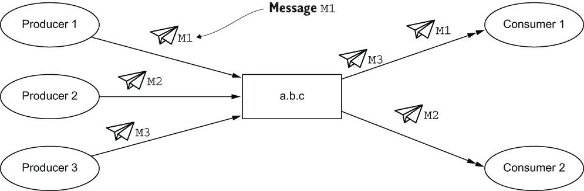
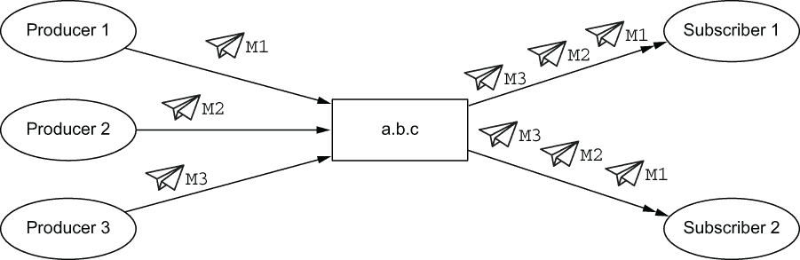
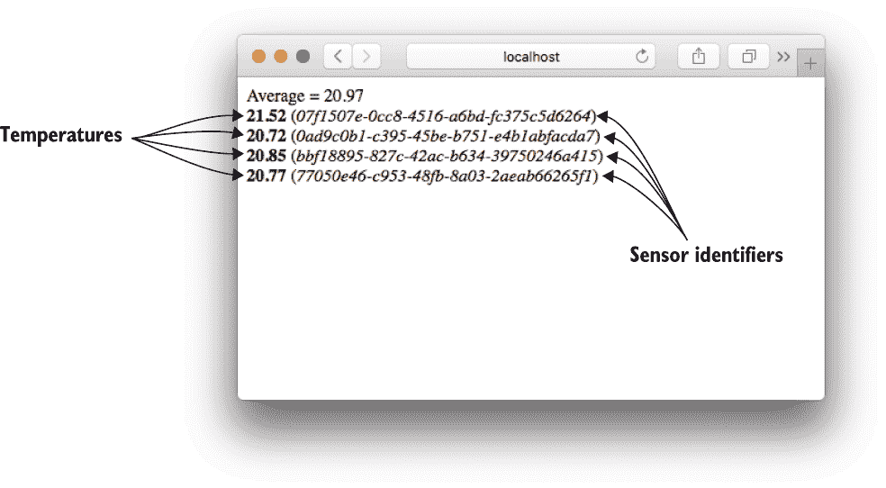
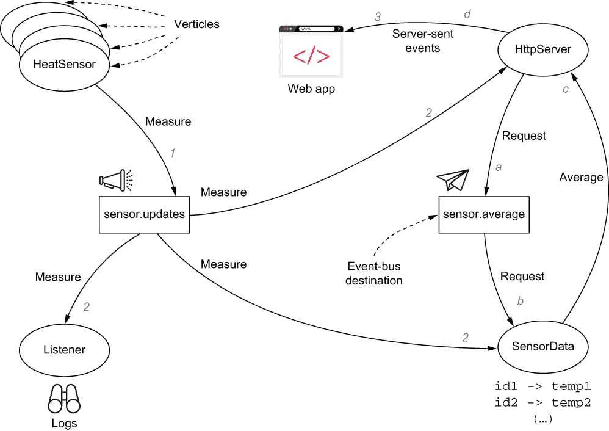
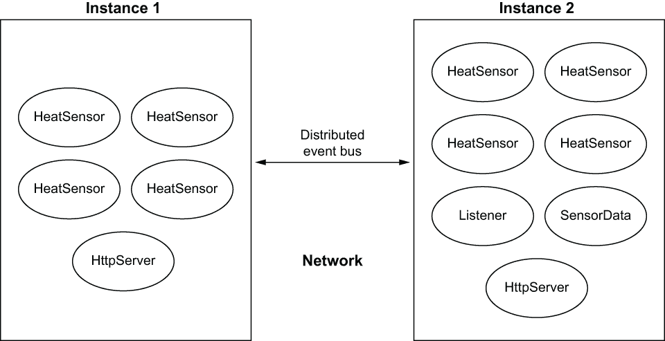
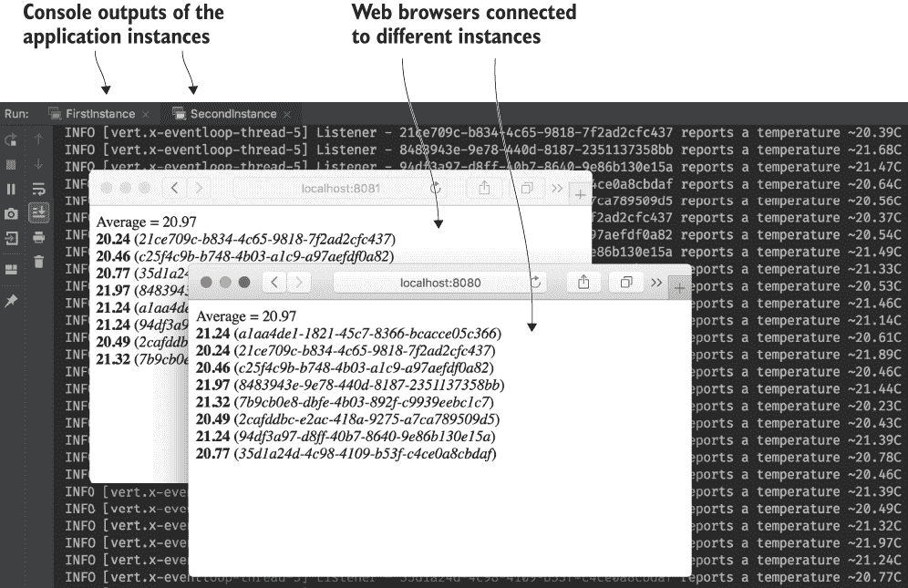

# 3 事件总线：Vert.x 应用程序的骨干

本章涵盖的内容

+   事件总线是什么

+   如何在事件总线上进行点对点、请求/响应和发布/订阅通信

+   用于网络中 verticle 到 verticle 通信的分布式事件总线

上一章介绍了*verticles*。Vert.x 应用程序由一个或多个 verticles 组成，每个 verticle 形成一个处理异步事件的单元。根据功能和技术的关注点专门化 verticles 是很常见的，例如，有一个 verticle 用于公开 HTTP API，另一个用于处理数据存储。这种设计也鼓励为了可扩展性目的部署给定 verticle 的多个实例。

我们尚未涵盖的是 verticles 如何相互通信。例如，如果更大的 Vert.x 应用程序要做任何有用的事情，HTTP API verticle 需要与数据存储 verticle“交谈”。

连接各个节点并确保它们可以协作是*事件总线*的作用。这在构建响应式应用程序时非常重要——事件总线提供了一种在进程内部以及跨多个节点通过网络透明地分配事件处理工作的方式。

## 3.1 什么是事件总线？

事件总线是一种以异步方式发送和接收消息的手段。消息被发送到并从*目的地*检索。目的地只是一个自由形式的字符串，例如`incoming.purchase.orders`或`incoming-purchase-orders`，尽管前者带有点号的格式更受欢迎。

消息有一个主体，可选的头部用于存储元数据，以及一个过期时间戳，在此之后如果尚未处理，它们将被丢弃。

消息主体通常使用 Vert.x JSON 表示法进行编码。使用 JSON 的优势在于它是一种易于通过网络传输的序列化格式，所有编程语言都理解它。还可能使用 Java 原始类型和字符串类型，特别是当用于编写 verticles 的 JVM 语言有直接绑定时。最后但同样重要的是，可以注册自定义编码器/解码器（codec）以支持更专业的消息主体序列化形式。例如，你可以编写一个将 Java 对象转换为自定义二进制编码的 codec。然而，这样做很少有用，JSON 和字符串数据覆盖了大多数 Vert.x 应用程序的需求。

事件总线允许在 verticles 之间解耦。不需要一个 verticle 访问另一个 verticle 类——所需的一切只是就目的地名称和数据表示达成一致。另一个好处是，由于 Vert.x 是多语言的，事件总线允许用不同语言编写的 verticles 之间进行通信，而无需任何复杂的语言互操作性层，无论是同一 JVM 进程内的通信还是跨网络的通信。

事件总线的一个有趣特性是它可以扩展到应用程序进程之外。你将在本章中看到事件总线也可以在集群的分布式成员之间工作。在本书的后面部分，你将看到如何将事件总线扩展到嵌入式或外部消息代理、远程客户端，以及运行在网页浏览器中的 JavaScript 应用程序。

通过事件总线进行的通信遵循三种模式：

+   点对点消息

+   请求/响应消息

+   发布/订阅消息

### 3.1.1 事件总线仅仅是另一个消息代理吗？

熟悉面向消息中间件的读者会发现事件总线与消息代理之间有明显的相似之处。毕竟，事件总线表现出熟悉的消息模式，如发布/订阅模式，这种模式在集成分布式和异构应用程序中很受欢迎。

简短的回答是，不，Vert.x 事件总线不是 Apache ActiveMQ、RabbitMQ、ZeroMQ 或 Apache Kafka 的替代品。更长的解释是，它是一个应用于应用程序内部 verticle 到 verticle 通信的*事件*总线，而不是应用于应用程序到应用程序通信的*消息*总线。正如你将在本书后面看到的那样，Vert.x 与消息代理集成，但事件总线不能替代此类中间件。具体来说，事件总线不执行以下操作：

+   支持消息确认

+   支持消息优先级

+   支持消息持久性以从崩溃中恢复

+   提供路由规则

+   提供转换规则（模式适应、分散/收集等）

事件总线简单地携带*易失性*事件，这些事件由 verticles 异步处理。

并非所有事件都是平等的，有些可能会丢失，而有些则不会。在我们编写*反应式应用程序*的过程中，你将看到在哪里使用数据复制或与事件总线结合使用消息代理，如 Apache Kafka。1

事件总线是一个简单且*快速*的事件传输器，我们可以利用它进行大多数 verticle 到 verticle 的交互，而对于不能丢失的事件，则转向更昂贵的中间件。

对于熟悉消息模式的读者，可能希望快速浏览下一三个小节，甚至跳过它们。

### 3.1.2 点对点消息

消息由生产者发送到目的地，例如图 3.1 中的`a.b.c`。目的地名称是自由形式的字符串，但在 Vert.x 社区中，惯例是使用分隔点。例如，我们可以使用`datastore.new-purchase-orders`将新的采购订单发送到数据库中存储。

在点对点消息中，一个可能的多消费者之一选择一条消息并处理它。图 3.1 展示了消息`M1`、`M2`和`M3`。



图 3.1 通过事件总线进行点对点消息

消息以轮询方式在消费者之间分发，因此它们以相等的比例分割消息处理。这就是为什么在图 3.1 中，第一个消费者处理`M1`和`M3`，而第二个消费者处理`M2`。请注意，没有公平机制来将更少的消息分配给过载的消费者。

### 3.1.3 请求-回复消息

在 Vert.x 中，请求-回复消息通信模式是点对点消息的一种变体。在点对点消息中发送消息时，可以注册一个*回复*处理程序。当你这样做时，事件总线生成一个临时目的地名称，该名称仅用于期望得到回复的请求消息生产者和最终将接收并处理消息的消费者之间的通信。

这种消息模式非常适合模拟远程过程调用，但由于响应是以异步方式发送的，因此不需要一直等待它返回。例如，一个 HTTP API verticle 可以向数据存储 verticle 发送请求以获取一些数据，而数据存储 verticle 最终返回一个回复消息。

这种模式在图 3.2 中得到了说明。当一条消息期望得到回复时，事件总线生成一个回复目的地，并在消息到达消费者之前将其附加到消息上。如果你想检查回复目的地名称，可以通过事件总线消息 API 进行，但你很少需要知道目的地，因为你只需在消息对象上调用一个`reply`方法。当然，消息消费者需要编程以在应用此模式时提供回复。


图 3.2 通过事件总线进行请求-回复消息

### 3.1.4 发布/订阅消息

在发布/订阅通信中，生产者和消费者之间的解耦程度更高。当一条消息发送到目的地时，所有订阅者都会收到它，如图 3.3 所示。消息`M1`、`M2`和`M3`分别由不同的生产者发送，所有订阅者都会收到这些消息，这与点对点消息的情况不同（见图 3.1）。在事件总线上，无法为发布/订阅通信指定回复处理程序。



图 3.3 通过事件总线进行发布/订阅消息

当你不确定有多少 verticle 和处理器会对特定事件感兴趣时，发布/订阅非常有用。如果你需要消息消费者返回到发送事件的实体，请选择请求-回复。否则，选择点对点与发布/订阅是功能需求的问题，主要是所有消费者是否应该处理一个事件，或者只有一个消费者应该处理。

## 3.2 示例中的事件总线

让我们使用事件总线并看看我们如何在独立的垂直结构之间进行通信。我们将使用的示例涉及几个温度传感器。当然，我们不会使用任何硬件。相反，我们将让温度通过伪随机数演变。我们还将提供一个简单的网络界面，其中温度及其平均值将实时更新。



图 3.4 网络界面截图

网络界面的截图如图 3.4 所示。它显示了四个传感器的温度，并保持它们的平均值最新。网络界面和服务器之间的通信将使用 *server-sent events*，这是一种简单而有效的协议，大多数网络浏览器都支持。2



图 3.5 示例架构概述

图 3.5 展示了应用架构的概述。图中显示了两个带有排序序列 `[1,` `2,` `3]`（正在发送温度更新）和 `[a,` `b,` `c,` `d]`（请求温度平均值计算）的并发事件通信。

应用程序围绕四个垂直结构构建：

+   `HeatSensor` 以非固定速率生成温度测量值，并将它们发布到订阅 `sensor.updates` 目的地的订阅者。每个垂直结构都有一个唯一的传感器标识符。

+   `Listener` 监控新的温度测量值并使用 SLF4J 记录它们。

+   `SensorData` 记录每个传感器的最新观测值。它还支持请求-响应通信：向 `sensor.average` 发送消息将触发基于最新数据的平均值计算，并将结果作为响应发送。

+   `HttpServer` 提供 HTTP 服务器并服务于网络界面。每当观察到新的温度测量值时，它都会将其推送到客户端，并定期请求当前平均值并更新所有已连接的客户端。

### 3.2.1 温度传感器垂直结构

以下列表显示了 `HeatSensor` 垂直结构类的实现。

列表 3.1 `Heatsensor` 垂直实现

```
public class HeatSensor extends AbstractVerticle {
  private final Random random = new Random();
  private final String sensorId = UUID.randomUUID().toString();   ❶
  private double temperature = 21.0;

  @Override
  public void start() {
    scheduleNextUpdate();
  }

  private void scheduleNextUpdate() {
    vertx.setTimer(random.nextInt(5000) + 1000, this::update);    ❷
  }

  private void update(long timerId) {
    temperature = temperature + (delta() / 10);
    JsonObject payload = new JsonObject()
      .put("id", sensorId)
      .put("temp", temperature);
    vertx.eventBus().publish("sensor.updates", payload);          ❸
    scheduleNextUpdate();                                         ❹
  }

  private double delta() {                                        ❺
    if (random.nextInt() > 0) {
      return random.nextGaussian();
    } else {
      return -random.nextGaussian();
    }
  }
}
```

❶ 传感器标识符使用 UUID 生成。

❷ 更新安排在 1 到 6 秒之间的随机延迟。

❸ 发布向订阅者发送消息。

❹ 我们安排下一次更新。

❺ 这计算一个随机正数或负数以略微修改当前温度。

`HeatSensor` 垂直结构类不使用任何真实的温度模型，而是使用随机增减。因此，如果你运行足够长时间，它可能会报告荒谬的值，但这在我们通过反应式应用程序的旅程中并不重要。

通过 `Vertx` 上下文和 `eventBus()` 方法访问事件总线。由于这个垂直结构不知道发布的值将用于什么，我们使用 `publish` 方法将它们发送到 `sensor.updates` 目的地的订阅者。我们还使用 JSON 编码数据，这是与 Vert.x 一致的。

现在我们来看一个消费温度更新的竖直类。

### 3.2.2 监听竖直类

下面的列表展示了 `Listener` 竖直类的实现。

列表 3.2 `Listener` 竖直类实现

```
public class Listener extends AbstractVerticle {
  private final Logger logger = LoggerFactory.getLogger(Listener.class);
  private final DecimalFormat format = new DecimalFormat("#.##");        ❶

  @Override
  public void start() {
    EventBus bus = vertx.eventBus();
    bus.<JsonObject>consumer("sensor.updates", msg -> {                  ❷
      JsonObject body = msg.body();                                      ❸
      String id = body.getString("id");
      String temperature = format.format(body.getDouble("temp"));
      logger.info("{} reports a temperature ~{}C", id, temp);            ❹
    });
  }
}
```

❶ 我们不需要完整的双精度值，所以我们将所有温度格式化为两位小数的字符串表示。

❷ `consumer` 方法允许订阅消息，一个回调处理所有事件总线消息。

❸ 消息负载在主体中。

❹ 我们只是记录日志。

`Listener` 竖直类的作用是记录所有温度测量值，所以它所做的只是监听在 `sensor.updates` 目标上接收到的消息。由于 `HeatSensor` 类中的发射器使用发布/订阅模式，`Listener` 不仅仅是唯一可以接收消息的竖直类。

在这个例子中，我们没有利用消息头，但可以使用它们来处理不属于消息体的任何元数据。一个常见的头是“操作”，以帮助接收者了解消息的内容。例如，给定 `database.operations` 目标，我们可以使用操作头来指定我们是否打算查询数据库、更新条目、存储新条目或删除之前存储的条目。

现在我们来看另一个消费温度更新的竖直类。

### 3.2.3 传感器数据竖直类

下面的列表展示了 `SensorData` 竖直类的实现。

列表 3.3 `Sensordata` 竖直类实现

```
public class SensorData extends AbstractVerticle {
  private final HashMap<String, Double> lastValues = new HashMap<>();   ❶

  @Override
  public void start() {                                                 ❷
    EventBus bus = vertx.eventBus();
    bus.consumer("sensor.updates", this::update);
    bus.consumer("sensor.average", this::average);
  }

  private void update(Message<JsonObject> message) {                    ❸
    JsonObject json = message.body();
    lastValues.put(json.getString("id"), json.getDouble("temp"));
  }

  private void average(Message<JsonObject> message) {                   ❹
    double avg = lastValues.values().stream()
      .collect(Collectors.averagingDouble(Double::doubleValue));
    JsonObject json = new JsonObject().put("average", avg);
    message.reply(json);                                                ❺
  }
}
```

❶ 我们通过每个传感器的唯一标识符存储其最新的测量值。

❷ `start` 方法只声明了两个事件总线目标处理器。

❸ 当接收到新的测量值时，我们从 JSON 主体中提取数据。

❹ 对于平均请求的传入消息没有使用，所以它可以只包含一个空的 JSON 文档。

❺ `reply` 方法用于回复消息。

`SensorData` 类有两个事件总线处理器：一个用于传感器更新，另一个用于平均温度计算请求。在一种情况下，它更新 `HashMap` 中的条目，在另一种情况下，它计算平均值并回复消息发送者。

下一个竖直类是 HTTP 服务器。

### 3.2.4 HTTP 服务器竖直类

HTTP 服务器很有趣，因为它通过事件总线从 `SensorData` 竖直类请求温度平均值，并实现了服务器发送事件协议来消费温度更新。

让我们从这个竖直类实现的骨干开始。

服务器实现

下面的列表展示了一个启动 HTTP 服务器并声明请求处理器的经典例子。

列表 3.4 HTTP 服务器竖直类实现的序言

```
public class HttpServer extends AbstractVerticle {
  @Override
  public void start() {
    vertx.createHttpServer()
      .requestHandler(this::handler)
      .listen(config().getInteger("port", 8080));        ❶
  }

  private void handler(HttpServerRequest request) {
    if ("/".equals(request.path())) {
      request.response().sendFile("index.html");         ❷
    } else if ("/sse".equals(request.path())) {
      sse(request);                                      ❸
    } else {
      request.response().setStatusCode(404);             ❹
    }
  }
// (...)
}
```

❶ HTTP 服务器端口默认配置为 8080。

❷ `sendFile` 方法允许将任何本地文件的内容流式传输到客户端。这会自动关闭连接。

❸ 服务器发送事件将使用 /sse 资源，我们提供了一个处理这些请求的方法。

❹ 任何其他触发都会返回 HTTP 404（未找到）响应。

处理器处理三种情况：

+   向浏览器提供 Web 应用程序

+   为服务器发送事件提供资源

+   对于任何其他资源路径返回 404 错误

提示：手动根据请求的资源路径和 HTTP 方法分发自定义操作是繁琐的。正如你稍后将会看到的，`vertx-web`模块提供了一个更友好的*路由器*API，方便声明处理器。

Web 应用程序

让我们现在看看客户端应用程序，它由 HTTP 服务器提供。Web 应用程序适合在以下列表中显示的单个 HTML 文档中（我移除了不相关的 HTML 部分，如页眉和页脚）。

列表 3.5 Web 应用程序代码

```
<div id="avg"></div>
<div id="main"></div>
<script language="JavaScript">
  const sse = new EventSource("/sse")                        ❶
  const main = document.getElementById("main")
  const avg = document.getElementById("avg")

  sse.addEventListener("update", (evt) => {                  ❷
    const data = JSON.parse(evt.data)                        ❸
    let div = document.getElementById(data.id);
    if (div === null) {
      div = document.createElement("div")                    ❹
      div.setAttribute("id", data.id)
      main.appendChild(div)
    }
    div.innerHTML = `<strong>${data.temp.toFixed(2)}</strong> 
    ➥ (<em>${data.id}</em>)`                                ❺
  })

  sse.addEventListener("average", (evt) => {                 ❻
    const data = JSON.parse(evt.data)
    avg.innerText = `Average = ${data.average.toFixed(2)}`
  })
</script>
```

❶ EventSource 对象处理服务器发送事件。

❷ 这个回调监听更新类型的服务器发送事件。

❸ 响应数据是纯文本，由于服务器将发送 JSON，我们需要解析它。

❹ 如果传感器没有用于显示数据的 div，我们创建它。

❺ 这将更新一个温度 div。

❻ 这个回调监听平均类型的服务器发送事件。

前面的列表中的 JavaScript 代码处理服务器发送事件并响应更新显示的内容。我们本可以使用许多流行的 JavaScript 框架之一，但有时回到基础是好的。

注意：你可能已经注意到列表 3.5 使用了现代版本的 JavaScript，有*箭头函数*、没有分号和字符串模板。这段代码应该在任何最近的 Web 浏览器上正常工作。我在 Mozilla Firefox 63、Safari 12 和 Google Chrome 70 上进行了测试。

支持服务器发送事件

让我们现在关注服务器发送事件的工作原理，以及如何使用 Vert.x 轻松实现它们。

服务器发送事件是一个非常简单但有效的协议，允许服务器向其客户端推送事件。该协议基于文本，每个事件都是一个包含事件类型和一些数据的块：

```
event: foo
data: bar
```

每个块事件由一个空行分隔，因此连续的两个事件看起来像这样：

```
event: foo
data: abc

event: bar
data: 123
```

使用 Vert.x 实现服务器发送事件非常简单。

列表 3.6 支持服务器发送事件

```
private void sse(HttpServerRequest request) {
  HttpServerResponse response = request.response();
  response
    .putHeader("Content-Type", "text/event-stream")             ❶
    .putHeader("Cache-Control", "no-cache")                     ❷
    .setChunked(true);

  MessageConsumer<JsonObject> consumer = 
  ➥ vertx.eventBus().consumer("sensor.updates");               ❸
  consumer.handler(msg -> {
    response.write("event: update\n");                          ❹
    response.write("data: " + msg.body().encode() + "\n\n");
  });

  TimeoutStream ticks = vertx.periodicStream(1000);             ❺
  ticks.handler(id -> {
    vertx.eventBus().<JsonObject>request("sensor.average", "", 
    ➥ reply -> {                                               ❻
      if (reply.succeeded()) {
        response.write("event: average\n");
        response.write("data: " + reply.result().body().encode() + "\n\n");
      }
    });
  });

  response.endHandler(v -> {                                    ❼
    consumer.unregister();
    ticks.cancel();
  });
}
```

❶ 服务器发送事件指定了 text/event-stream MIME 类型。

❷ 由于这是一个实时流，我们需要防止浏览器和代理缓存它。

❸ 我们调用没有处理器的消费者，因为我们需要一个对象在客户端断开连接时取消订阅。

❹ 发送事件块只是发送文本。

❺ 我们每秒更新一次平均值，因此需要一个周期性定时器。由于它需要取消，我们也使用一个没有处理器的形式来获取一个对象。

❻ 请求发送一个期望得到响应的消息。回复是一个异步对象，因为它可能失败了。

❼ 当客户端断开连接（或刷新页面）时，我们需要注销事件总线消息消费者并取消计算平均值的周期性任务。

列表 3.6 提供了处理对 `/sse` 资源 HTTP 请求的 `sse` 方法的实现。它为每个温度更新请求声明一个消费者，并推送新事件。它还声明了一个周期性任务，以请求-响应方式查询 `SensorData` verticle 并维护平均值。

由于这两个处理程序是针对 HTTP 请求的，我们需要能够在连接丢失时停止它们。这可能是由于浏览器标签页被关闭，或者简单地页面重新加载。为此，我们获取 *流* 对象，并为每个对象声明一个处理程序，就像我们处理接受回调的表单一样。你将在下一章中看到如何处理流对象，以及它们何时有用。

我们还可以使用命令行工具，如 HTTPie 或 curl，对运行中的应用程序进行操作，以查看事件流，如下所示。

列表 3.7 使用 HTTPie 列出 SSE 事件

```
$ http http://localhost:8080/sse --stream     ❶
HTTP/1.1 200 OK
Cache-Control: no-cache
Content-Type: text/event-stream
Transfer-Encoding: chunked

event: average                                ❷
data: {"average":21.132465880152044}          ❸

event: update
data: {"id":"3fa8321d-7600-42d3-b114-9fb6cdab7ecd","temp":21.043921061475107}

event: update
data: {"id":"8626e13f-9114-4f7d-acc3-bd60b00f3028","temp":21.47111113365458}

event: average
data: {"average":21.123126848463464}
```

❶ 使用 --stream 标志可以将响应流式传输到控制台，而不是等待服务器结束连接。

❷ 每个事件都有一个类型。

❸ 由于 JSON 只是文本，它作为事件数据传输得很好。

警告：在撰写本文时，除了微软的浏览器外，所有主流网页浏览器都支持服务器发送事件。有一些 JavaScript *polyfills* 提供了微软浏览器缺失的功能，尽管有一些限制。

### 3.2.5 启动应用程序

现在我们已经准备好了所有 verticle，我们可以将它们组装成一个 Vert.x 应用程序。以下列表显示了用于启动应用程序的主类。它部署了四个传感器 verticle 和每个其他 verticle 的一个实例。

列表 3.8 用于启动应用程序的主类

```
public class Main {
  public static void main(String[] args) {
    Vertx vertx = Vertx.vertx();
    vertx.deployVerticle("chapter3.HeatSensor", new 
    ➥ DeploymentOptions().setInstances(4));          ❶
    vertx.deployVerticle("chapter3.Listener");        ❷
    vertx.deployVerticle("chapter3.SensorData");
    vertx.deployVerticle("chapter3.HttpServer");
  }
}
```

❶ 我们启动了四个传感器。

❷ 我们正在使用使用反射实例化 verticle 类的 deployVerticle 的变体。

运行此类的 `main` 方法允许我们通过网页浏览器连接到 http://localhost:8080/。当你这样做时，你应该看到一个类似于图 3.4 的图形界面，并且有连续的实时更新。控制台日志也将显示温度更新。

## 3.3 聚类和分布式事件总线

到目前为止，我们使用的事件总线是 *本地* 的：所有通信都在同一个 JVM 进程内发生。更有趣的是使用 Vert.x *聚类* 并从 *分布式* 事件总线中受益。

### 3.3.1 Vert.x 中的聚类

Vert.x 应用程序可以在聚类模式下运行，其中一组 Vert.x 应用程序节点可以在网络上协同工作。它们可能是同一应用程序的节点实例，并具有相同的已部署 verticle 集合，但这不是必需的。一些节点可以有一组 verticle，而其他节点可以有不同的集合。

图 3.6 展示了 Vert.x 聚类的概览。一个 *集群管理器* 确保节点可以通过事件总线交换消息，从而实现以下功能集：

+   组成员资格和发现允许发现新的节点，维护当前节点的列表，并检测节点何时消失。

+   共享数据允许在集群范围内维护映射和计数器，以便所有节点共享相同的值。分布式锁对于节点之间的一些协调形式非常有用。

+   订阅拓扑允许知道每个节点对哪些事件总线目的地感兴趣。这对于在分布式事件总线中高效地分发消息非常有用。如果一个节点在目的地`a.b.c`上没有消费者，就没有必要从该目的地向该节点发送事件。

基于 Hazelcast、Infinispan、Apache Ignite 和 Apache ZooKeeper，有几个针对 Vert.x 的集群管理器实现。从历史上看，Hazelcast 曾是 Vert.x 的集群管理器，然后添加了其他引擎。它们都支持相同的 Vert.x 集群抽象，包括成员资格、共享数据和事件总线消息传递。它们在功能上是等效的，所以你必须根据你的需求和限制来选择一个。如果你不确定该选择哪一个，我建议选择 Hazelcast，这是一个好的默认选择。


图 3.6 Vert.x 集群概述

最后，如图 3.6 所示，节点之间的事件总线通信是通过直接 TCP 连接，使用自定义协议进行的。当一个节点向目的地发送消息时，它会与集群管理器一起检查订阅拓扑，并将消息分发给有该目的地订阅者的节点。

你应该使用哪个集群管理器？

对于“你应该使用哪个集群管理器”这个问题，没有好的答案。这取决于你是否需要与某个库进行特殊集成，以及你需要部署的环境类型。比如说，如果你需要在你的代码中使用 Infinispan API，而不仅仅是将 Infinispan 作为 Vert.x 的集群管理器引擎，你应该选择 Infinispan 来满足这两个需求。

你还应该考虑你的部署环境。如果你部署到使用 Apache ZooKeeper 的环境，也许选择依赖它作为 Vert.x 集群管理器也是一个不错的选择。

默认情况下，一些集群管理器使用多播通信进行节点发现，这在某些网络中可能被禁用，尤其是在像 Kubernetes 这样的容器化环境中。在这种情况下，你需要配置集群管理器以在这些环境中工作。

如前所述，如果有疑问，请选择 Hazelcast，并检查项目文档以获取特定的网络配置信息，例如在部署到 Kubernetes 时。你总是可以在以后切换到另一个集群管理器实现。

### 3.3.2 从事件总线到分布式事件总线

让我们回到本章前面开发的温度传感器应用程序。迁移到分布式事件总线对 verticles 来说是透明的。

我们将准备两个主类，具有不同的垂直部署，如图 3.7 所示：

+   四个`HeatSensor`实例，一个 8080 端口的`HttpServer`实例

+   四个`HeatSensor`实例，一个`Listener`实例，一个`SensorData`实例，以及一个 8081 端口的`HttpServer`实例（这样您就可以在同一主机上运行和测试它）



图 3.7 集群应用程序概述

目标是展示通过在集群模式下启动每种部署的一个实例，verticles 之间的通信就像它们在同一个 JVM 进程中运行一样。通过网页浏览器连接到任一实例将显示八个传感器的相同数据视图。同样，第二个实例上的`Listener` verticle 将从第一个实例获取温度更新。

我们将使用 Infinispan 作为集群管理器，但您也可以使用另一个。假设您的项目是用 Gradle 构建的，您需要将`vertx-infinispan`作为依赖项添加：

```
implementation("io.vertx:vertx-infinispan:version")
```

下面的列表显示了主类`FirstInstance`的实现，我们可以使用它来启动一个节点，该节点不部署所有应用程序 verticle。

列表 3.9 第一个实例的主类代码

```
public class FirstInstance {
  private static final Logger logger = 
  ➥ LoggerFactory.getLogger(FirstInstance.class);

  public static void main(String[] args) {
    Vertx.clusteredVertx(new VertxOptions(), ar -> {     ❶
      if (ar.succeeded()) {
        logger.info("First instance has been started");
        Vertx vertx = ar.result();                       ❷
        vertx.deployVerticle("chapter3.HeatSensor", 
        ➥ new DeploymentOptions().setInstances(4));
        vertx.deployVerticle("chapter3.HttpServer");
      } else {
        logger.error("Could not start", ar.cause());     ❸
      }
    });
  }
}
```

❶ 启动集群 Vert.x 应用程序是一个异步操作。

❷ 成功后，我们检索 Vertx 实例。

❸ 失败的可能原因是缺少集群管理器库。

如您所见，以集群模式启动应用程序需要调用`clusteredVertx`方法。其余部分只是经典的 verticle 部署。

第二个实例的主方法代码非常相似，如下所示。

列表 3.10 第二个实例的主类代码

```
public class SecondInstance {
  private static final Logger logger = 
  ➥ LoggerFactory.getLogger(SecondInstance.class);

  public static void main(String[] args) {
    Vertx.clusteredVertx(new VertxOptions(), ar -> {
      if (ar.succeeded()) {
        logger.info("Second instance has been started");
        Vertx vertx = ar.result();
        vertx.deployVerticle("chapter3.HeatSensor", 
        ➥ new DeploymentOptions().setInstances(4));
        vertx.deployVerticle("chapter3.Listener");
        vertx.deployVerticle("chapter3.SensorData");
        JsonObject conf = new JsonObject().put("port", 8081);     ❶
        vertx.deployVerticle("chapter3.HttpServer", 
        ➥ new DeploymentOptions().setConfig(conf));
      } else {
        logger.error("Could not start", ar.cause());
      }
    });
  }
}
```

❶ 我们使用不同的端口，以便您可以在同一主机上启动两个实例。

两个主类都可以在同一主机上运行，两个实例将相互发现。像以前一样，您可以从您的 IDE 启动它们，或者在不同的终端中运行`gradle run -PmainClass=chapter3.cluster.FirstInstance`和`gradle run -PmainClass= chapter3.cluster.SecondInstance`。

提示：如果您使用 IPv6 并遇到问题，可以将`-Djava.net.preferIPv4Stack=true`标志添加到 JVM 参数中。

默认情况下，Vert.x Infinispan 集群管理器配置为使用网络广播进行发现，因此当它们在同一台机器上运行时，两个实例会相互发现。您也可以使用同一网络上的两台机器。

警告：网络广播在云环境中和数据中心很少工作。在这些情况下，集群管理器需要配置为使用其他发现和组成员资格协议。在 Infinispan 的情况下，文档中有具体的细节，请参阅[`infinispan.org/documentation/`](https://infinispan.org/documentation/)。

图 3.8 显示了运行在一个浏览器连接到端口 8080 的实例，另一个浏览器连接到端口 8081 的第二个实例的应用程序，我们看到了来自后台`Listener` verticle 的日志。如图所示，两个实例都显示了来自八个传感器的事件，第一个实例的平均温度已更新，因此它可以与第二个实例上的`SensorData` verticle 进行交互。



图 3.8 集群模式下应用程序的截图

分布式事件总线是一个有趣的工具，因为它对 verticles 是透明的。

提示：事件总线 API 有`localConsumer`方法用于声明仅在集群运行时本地工作的消息处理器。例如，针对目的地`a.b.c`的消费者将不会接收到来自集群中另一个实例发送到该目的地的消息。

下一章讨论异步数据和事件流。

## 摘要

+   事件总线是 verticles 通信的首选方式，它使用异步消息传递。

+   事件总线实现了发布/订阅（一对多）和点对点（多对一）通信。

+   虽然它看起来像传统的消息代理，但事件总线不提供持久性保证，因此只能用于临时数据。

+   集群允许网络实例以透明的方式通过分布式事件总线进行通信，并将工作负载扩展到多个应用实例。

***

1.关于使用 Kafka 的详细讨论，请参阅 Dylan Scott 的《Kafka in Action》（Manning，2019）。

2.W3C 关于服务器发送事件的规范可在[www.w3.org/TR/eventsource](http://www.w3.org/TR/eventsource)找到。
