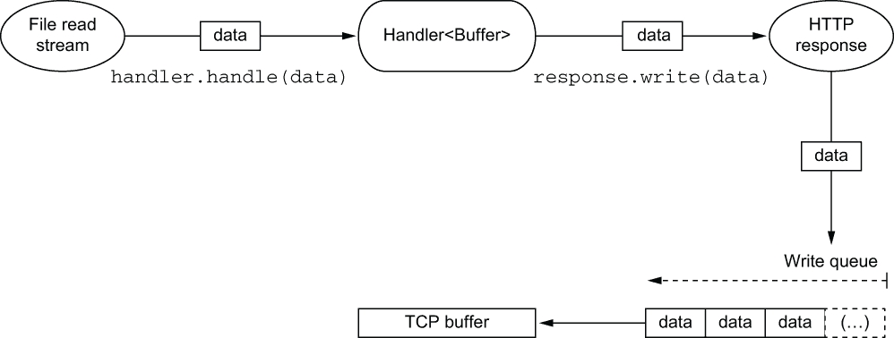
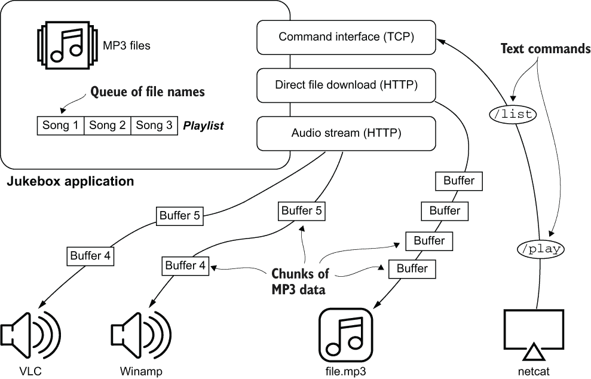
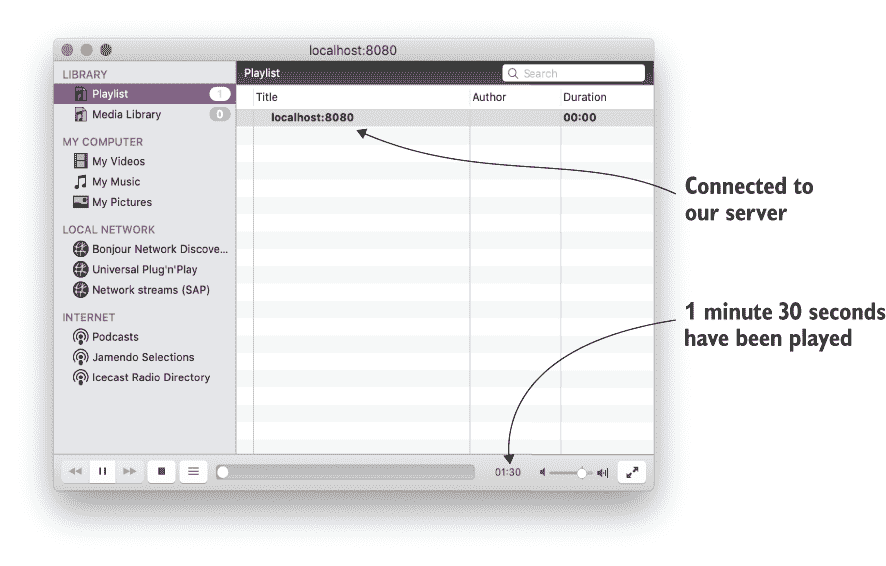
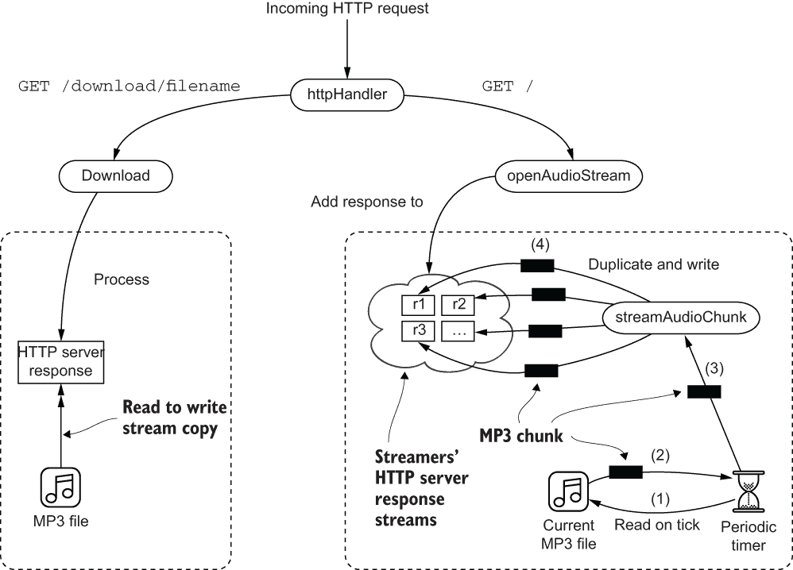
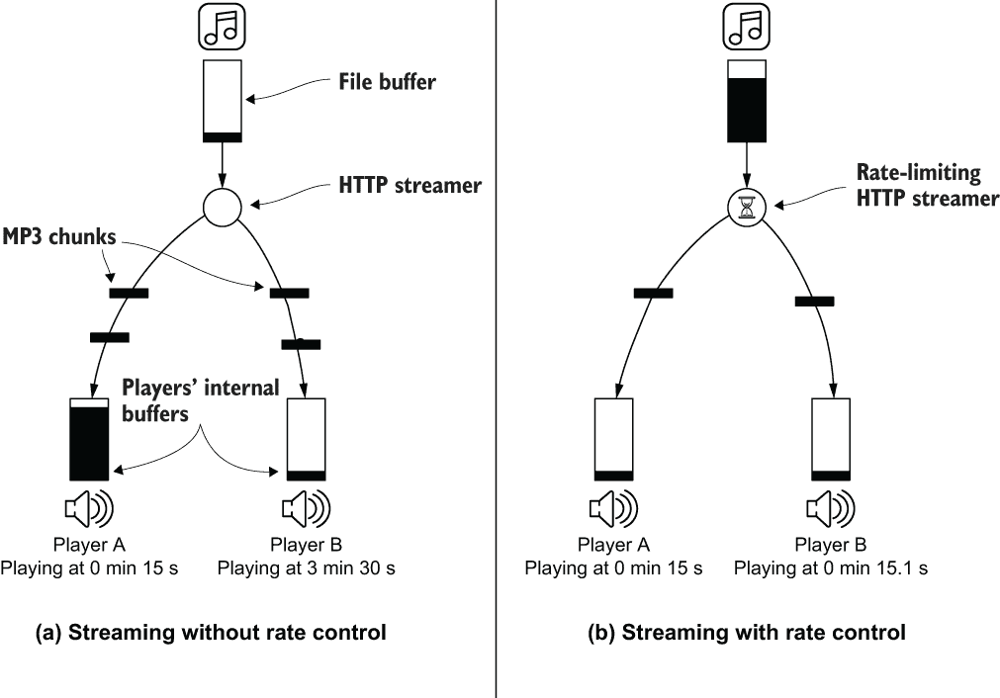

# 4 异步数据和事件流

本章涵盖

+   为什么流是在事件之上一个有用的抽象

+   背压是什么，以及为什么它是异步生产者和消费者基本的原因

+   如何从流中解析协议数据

到目前为止，我们一直在使用*回调*处理事件，来自各种来源，如 HTTP 或 TCP 服务器。回调允许我们一次处理一个事件。

处理来自 TCP 连接、文件或 HTTP 请求的传入数据缓冲区并不太不同：你需要声明一个回调处理程序，该处理程序*响应*每个事件并允许自定义处理。

话虽如此，大多数事件需要作为*一系列*而不是*孤立*的事件来处理。处理 HTTP 请求的主体是一个很好的例子，因为需要组装不同大小的多个缓冲区来重新构成完整的主体有效负载。

由于反应式应用程序处理非阻塞 I/O，高效且正确的流处理是关键。在本章中，我们将探讨为什么流会带来挑战，以及 Vert.x 如何提供全面的统一流模型。

## 4.1 统一流模型

Vert.x 提供了一种跨多种资源类型的统一流抽象，例如文件、网络套接字等。*读取流*是可读取的事件源，而*写入流*是发送事件的目的地。例如，HTTP 请求是一个读取流，而 HTTP 响应是一个写入流。

Vert.x 中的流涵盖了广泛的来源和目的地，包括表 4.1 中列出的那些。

表 4.1 Vert.x 常见读取和写入流

| 流资源 | 读取支持 | 写入支持 |
| --- | --- | --- |
| TCP 套接字 | 是 | 是 |
| UDP 数据报 | 是 | 是 |
| HTTP 请求和响应 | 是 | 是 |
| WebSockets | 是 | 是 |
| 文件 | 是 | 是 |
| SQL 结果 | 是 | 否 |
| Kafka 事件 | 是 | 是 |
| 定时器 | 是 | 否 |

读取和写入流是通过`io.vertx.core.streams`包中的`ReadStream`和`WriteStream`接口定义的。你将主要处理实现这两个接口的 API，而不是自己实现它们，尽管如果你想要连接到某些第三方异步事件 API，你可能必须这样做。

这些接口可以看作每个都包含两个部分：

+   读取或写入数据的基本方法

+   *背压*管理方法，我们将在下一节中介绍

表 4.2 列出了读取流的*基本*方法。它们定义了回调，用于通知三种类型的事件：读取了一些数据，发生了异常，以及流已结束。

表 4.2 `ReadStream`基本方法

| 方法 | 描述 |
| --- | --- |
| `handler(Handler<T>)` | 处理类型为`T`的新读取值（例如，`Buffer`，`byte[]`，`JsonObject`等） |
| `exceptionHandler(Handler<Throwable>)` | 处理读取异常 |
| `endHandler(Handler<Void>)` | 当流结束时调用，无论是所有数据都已读取还是因为发生了异常 |

类似地，列表 4.3 中列出的写入流的必要方法允许我们写入数据、结束流并在出现异常时通知我们。

表 4.3 `WriteStream` 必要方法

| 方法 | 描述 |
| --- | --- |
| `write(T)` | 写入类型为 `T` 的数据（例如，`Buffer`、`byte[]`、`JsonObject` 等） |
| `exceptionHandler(Handler<Throwable>)` | 处理写入异常 |
| `end()` | 结束流 |
| `end(T)` | 写入类型为 `T` 的数据，然后结束流 |

我们在之前的章节中已经操纵了流，而没有意识到这一点，例如使用 TCP 和 HTTP 服务器。

The `java.io` APIs form a classic stream I/O abstraction for reading and writing data from various sources in Java, albeit using blocking APIs. It is interesting to compare the JDK streams with the Vert.x non-blocking stream APIs.

假设我们想要读取文件的内容并将其输出到标准控制台输出。

列表 4.1 使用 JDK I/O API 读取文件

```
public static void main(String[] args) {
  File file = new File("build.gradle.kts");
  byte[] buffer = new byte[1024];
  try (FileInputStream in = new FileInputStream(file)) {   ❶
    int count = in.read(buffer);
    while (count != -1) {
      System.out.println(new String(buffer, 0, count));
      count = in.read(buffer);
    }
  } catch (IOException e) {
    e.printStackTrace();
  } finally {
    System.out.println("\n--- DONE");                      ❷
  }
}
```

❶ 使用 try-with-resources 我们确保无论执行是否正常完成或异常完成，都会调用 reader.close()。

❷ 读取完成后，我们在控制台插入两行。

列表 4.1 展示了使用 JDK I/O 流读取文件并将内容输出到控制台的经典示例，同时注意可能的错误。我们将数据读取到缓冲区中，然后立即将缓冲区内容写入标准控制台，然后再回收缓冲区以进行下一次读取。

以下列表显示了与列表 4.1 相同的代码，但使用 Vert.x 异步文件 API。

列表 4.2 使用 Vert.x 流读取文件

```
public static void main(String[] args) {
  Vertx vertx = Vertx.vertx();
  OpenOptions opts = new OpenOptions().setRead(true);          ❶
  vertx.fileSystem().open("build.gradle.kts", opts, ar -> {    ❷
    if (ar.succeeded()) {
      AsyncFile file = ar.result();                            ❸
      file.handler(System.out::println)                        ❹
        .exceptionHandler(Throwable::printStackTrace)          ❺
        .endHandler(done -> {                                  ❻
          System.out.println("\n--- DONE");
          vertx.close();
        });
    } else {
      ar.cause().printStackTrace();
    }
  });
}
```

❶ 使用 Vert.x 打开文件需要选项，例如文件是处于读取、写入、追加模式，等等。

❷ 打开文件是一个异步操作。

❸ AsyncFile 是 Vert.x 异步文件接口。

❹ 新缓冲区数据的回调

❺ 当出现异常时调用的回调

❻ 当流结束时调用的回调

在这种情况下，方法是声明式的，因为我们定义了读取流时不同类型事件的处理器。我们正在被*推送*数据，而在列表 4.1 中，我们从流中*拉取*数据。

这种差异乍一看可能只是外观上的，一个例子中数据是被拉入的，而另一个例子中数据是被推入的。然而，这种差异是重大的，我们需要理解它，以便掌握异步流，无论是使用 Vert.x 还是其他解决方案。

这引出了*背压*的概念。

## 4.2 什么是背压？

背压是一种机制，允许事件的*消费者*向事件的*生产者**信号*它正在以比消费者处理它们更快的速度发出事件。在反应式系统中，背压用于暂停或减慢生产者，以便消费者避免在无界内存缓冲区中积累未处理的事件，从而可能耗尽资源。

要了解为什么背压对异步流很重要，让我们以一个用于下载 Linux 发行版镜像的 HTTP 服务器为例，并考虑没有实施任何背压管理策略的实现。

Linux 发行版镜像通常以.iso 文件的形式分发，很容易达到几个 GB。实现一个能够分发此类文件的服务器将涉及以下操作：

1.  打开一个 HTTP 服务器。

1.  对于每个传入的 HTTP 请求，找到相应的文件。

1.  对于从文件中读取的每个缓冲区，将其写入 HTTP 响应体。

图 4.1 提供了使用 Vert.x 如何工作的说明，尽管这也适用于任何非阻塞 I/O API。数据缓冲区从文件流中读取，然后传递给处理器。处理器不太可能做任何事情，而是直接将每个缓冲区写入 HTTP 响应流。每个缓冲区最终被写入底层的 TCP 缓冲区，要么直接写入，要么作为更小的块。由于 TCP 缓冲区可能已满（要么是因为网络，要么是因为客户端正忙），因此有必要维护一个待写入的缓冲区缓冲区（图 4.1 中的写入队列）。记住，写入操作是非阻塞的，因此需要缓冲。这听起来是一个非常简单的处理管道，那么可能出什么问题呢？



图 4.1 无背压信号的情况下在流之间读取和写入数据

从文件系统中读取通常速度快且低延迟，并且给定几个读取请求，操作系统可能会将一些页面缓存到 RAM 中。相比之下，写入网络要慢得多，带宽取决于最弱的网络链路。延迟也会发生。

由于读取速度远快于写入速度，写入缓冲区，如图 4.1 所示，可能会迅速变得非常大。如果我们有数千个并发连接来下载 ISO 镜像，我们可能在写入缓冲区队列中积累了大量缓冲区。实际上，我们可能在 JVM 进程内存中有几个 GB 的 ISO 镜像，等待通过网络写入！写入队列中的缓冲区越多，进程消耗的内存就越多。

这里的风险显然是耗尽，要么是因为进程消耗了所有可用的物理内存，要么是因为它在内存受限的环境中运行，如容器。这增加了消耗过多内存甚至崩溃的风险。

如您可能猜到的，一个解决方案是*背压信号*，它使读取流能够适应写入流的吞吐量。在先前的例子中，当 HTTP 响应写入队列变得过大时，它应该能够通知文件读取流它正在运行得太快。在实践中，暂停源流是管理背压的好方法，因为它在不会积累新项目的同时，为写入写入缓冲区中的项目提供了时间。

提示 阻塞 I/O API 通过阻塞执行线程直到 I/O 操作完成来隐式地提供背压。当缓冲区满时，写入操作会阻塞，这阻止了阻塞的线程在写入操作完成之前拉取更多数据。

表 4.4 列出了`ReadStream`的背压管理方法。默认情况下，读取流尽可能快地读取数据，除非它被暂停。处理器可以暂停并恢复读取流以控制数据流。

表 4.4 `ReadStream` 背压管理方法

| 方法 | 描述 |
| --- | --- |
| `pause()` | 暂停流，防止进一步的数据被发送到处理器。 |
| `resume()` | 重新开始读取数据并将其发送到处理器。 |
| `fetch(n)` | 请求读取（最多）`n`个元素。在调用`fetch(n)`之前必须暂停流。 |

当读取流被暂停时，可以请求获取一定数量的元素，这是一种异步拉取的形式。这意味着处理器可以使用`fetch`请求元素，并设置自己的节奏。你将在本章的最后部分看到具体的例子。

在任何情况下，调用`resume()`都会使流尽可能快地开始推送数据。

表 4.5 显示了`WriteStream`对应的背压管理方法。

表 4.5 `WriteStream` 背压管理方法

| 方法 | 描述 |
| --- | --- |
| `setWriteQueueMaxSize(int)` | 定义在被视为满之前写入缓冲队列的最大大小。这是一个要写入的排队 Vert.x 缓冲区的大小，而不是实际字节数，因为排队缓冲区可能具有不同的大小。 |
| `boolean writeQueueFull()` | 指示写入缓冲队列的大小是否已满。 |
| `drainHandler(Handler<Void>)` | 定义一个回调，指示何时写入缓冲队列已排空（通常是在其最大大小的一半时）。 |

写缓冲队列达到最大大小时被认为是满的。写队列有默认大小，你很少需要调整它们，但如果你想的话可以这样做。注意，仍然可以进行写入，数据将在队列中积累。写入器应该在队列满时进行检查，但对于写入没有强制执行。当写入器知道写入队列已满时，可以通过*排水处理器*通知数据可以再次写入。通常这发生在写入队列的一半被排空时。

现在你已经看到了`ReadStream`和`WriteStream`提供的背压操作，以下是通过 HTTP 提供 ISO 镜像的示例中控制流的方法：

1.  对于每个读取缓冲区，将其写入 HTTP 响应流。

1.  检查写入缓冲队列是否已满。

1.  如果已满

    1.  暂停文件读取流。

    1.  安装一个排水处理器，当调用时恢复文件读取流。

注意，这种后压力管理策略并不总是你所需要的：

+   可能存在这样的情况，当写入队列满时丢弃数据在功能上是正确的，甚至可能是所希望的。

+   有时事件源不支持暂停，就像 Vert.x 的 `ReadStream` 一样，即使这可能导致内存耗尽，你也必须在丢弃数据或缓冲之间做出选择。

处理后压力的适当策略取决于你正在编写的代码的功能需求。一般来说，你将更喜欢 Vert.x 流提供的流控制，但如果没有可能，你需要采用另一种策略。

现在我们将所见的一切组装成一个应用程序。

## 4.3 制作音乐流式点唱机

我们将通过音乐流式点唱机的例子（见图 4.2）来说明 Vert.x 流和后压力管理。



图 4.2 点唱机应用程序概览

理念是点唱机存储了一些本地的 MP3 文件，客户端可以通过 HTTP 连接来收听流。单个文件也可以通过 HTTP 下载。反过来，播放、暂停和安排歌曲的时间是通过一个简单基于文本的 TCP 协议来控制的。所有连接的播放器都将同时收听相同的音频，除了由于播放器放置的缓冲造成的微小延迟。

此示例将使我们能够看到我们如何处理自定义流速度和不同的后压力管理策略，以及如何解析流。

### 4.3.1 特性和用法

我们将要构建的应用程序可以通过书籍 GitHub 仓库中的代码使用 Gradle 任务运行，如列表 4.3 的控制台输出所示。

note 如果你想让点唱机有音乐可播放，你需要将一些 MP3 文件复制到项目目录中名为 tracks/的文件夹中。

列表 4.3 运行点唱机应用程序

```
$ ./gradlew run -PmainClass=chapter4.jukebox.Main                 ❶

> Task :run
[vert.x-eventloop-thread-0] chapter4.jukebox.Jukebox - Start      ❷
[vert.x-eventloop-thread-1] chapter4.jukebox.NetControl - Start
```

❶ 主类是 chapter4.jukebox.Jukebox。

❷ 我们正在部署两个垂直结构。

在此应用程序中部署了两个垂直结构：

+   `点唱机` 提供了主要的音乐流式逻辑和 HTTP 服务器接口，供音乐播放器连接使用。

+   `NetControl` 提供了一个基于文本的 TCP 协议，用于远程控制点唱机应用程序。



图 4.3 VLC 连接到点唱机

要收听音乐，用户可以连接一个播放器，如 VLC（见图 4.3），或者甚至直接在 http://localhost:8080/ 打开网页浏览器。

另一方面，播放器可以通过像 `netcat` 这样的工具进行控制，使用纯文本命令列出所有文件、安排播放曲目以及暂停或重新启动流。列表 4.4 显示了使用 `netcat` 的交互会话。

列表 4.4 使用 `netcat` 控制点唱机

```
$ netcat localhost 3000                                     ❶
/list                                                       ❷
Daniela-La-Luz-Did-you-Ever-(Original-Mix).mp3
The-Revenge-Let-Love-Take-The-Blame-(Original-Mix).mp3
intro.mp3
SQL-Surrender-(Original-Mix).mp3
/schedule SQL-Surrender-(Original-Mix).mp3                  ❸
/pause                                                      ❹
/play                                                       ❺
/schedule Daniela-La-Luz-Did-you-Ever-(Original-Mix).mp3    ❻
^C                                                          ❼
```

❶ 控制 TCP 服务器监听在端口 3000。

❷ 此命令列出所有文件。

❸ 安排将文件添加到播放列表中。

❹ 这将暂停所有连接播放器的流。

❺ 这将恢复流。

❻ 当第一首歌曲结束后，我们安排另一首歌曲。

❼ 我们可以用 Ctrl+C 安全地退出 netcat 会话。

提示 `netcat` 可能在你的 Unix 环境中作为 `nc` 提供。我并不知道在 WSL 环境之外，有哪个友好且等效的工具适用于 Windows。

最后，我们希望能够通过 HTTP 下载我们知道的任何 MP3 文件名：

```
curl -o out.mp3 http://localhost:8080/download/intro.mp3
```

现在我们来剖析实现的各种部分。

### 4.3.2 HTTP 处理：整体视图

将会有许多代码片段涉及 HTTP 服务器处理，因此查看图 4.4 以了解接下来的代码片段如何组合在一起是很好的。



图 4.4 HTTP 服务器处理的整体视图

有两种类型的传入 HTTP 请求：客户端要么直接通过名称下载文件，要么想要加入音频流。处理策略非常不同。

在下载文件的情况下，目标是直接从文件读取流复制到 HTTP 响应写入流。这将通过背压管理来完成，以避免过度的缓冲。

流式传输稍微复杂一些，因为我们需要跟踪所有流式传输者的 HTTP 响应写入流。计时器定期从当前 MP3 文件中读取数据，并将数据复制并写入每个流式传输者。

让我们看看这些部分是如何实现的。

### 4.3.3 Jukebox 垂直基本

下一个列表显示 `Jukebox` 垂直类的状态是由播放状态和播放列表定义的。

列表 4.5 `Jukebox` 类的状态

```
private enum State {PLAYING, PAUSED}

private State currentMode = State.PAUSED;

private final Queue<String> playlist = new ArrayDeque<>();
```

枚举类型 `State` 定义了两种状态，而 `Queue` 保存所有计划播放的下一条曲目。再次强调，Vert.x 线程模型确保单线程访问，因此不需要并发集合和临界区。

`Jukebox` 垂直的 `start` 方法（列表 4.6）需要配置一些与可以从 TCP 文本协议使用的命令和动作相对应的事件总线处理程序。稍后我们将剖析的 `NetControl` 垂直处理 TCP 服务器的内部，并向事件总线发送消息。

列表 4.6 在 `Jukebox` 垂直中设置事件总线处理程序

```
@Override
public void start() {
  EventBus eventBus = vertx.eventBus();
  eventBus.consumer("jukebox.list", this::list);
  eventBus.consumer("jukebox.schedule", this::schedule);
  eventBus.consumer("jukebox.play", this::play);
  eventBus.consumer("jukebox.pause", this::pause);

  // (...more later!)
}
```

注意，因为我们已经抽象化了通过事件总线传输命令，所以我们很容易插入新的方式来控制 jukebox，例如使用移动应用程序、Web 应用程序等。

下一个列表提供了播放/暂停和调度处理程序。这些方法直接操作播放和播放列表状态。

列表 4.7 `Jukebox` 垂直中的播放/暂停和调度操作

```
private void play(Message<?> request) {
  currentMode = State.PLAYING;
}

private void pause(Message<?> request) {
  currentMode = State.PAUSED;
}

private void schedule(Message<JsonObject> request) {
  String file = request.body().getString("file");
  if (playlist.isEmpty() && currentMode == State.PAUSED) {    ❶
    currentMode = State.PLAYING;
  }
  playlist.offer(file);
}
```

❶ 这允许我们在没有播放曲目且安排了新的曲目时自动恢复播放。

列出可用文件稍微复杂一些，如下一个列表所示。

列表 4.8 列出 `Jukebox` 垂直中的所有可用文件

```
private void list(Message<?> request) {
  vertx.fileSystem().readDir("tracks", ".*mp3$", ar -> {   ❶
    if (ar.succeeded()) {
      List<String> files = ar.result()
        .stream()
        .map(File::new)
        .map(File::getName)
        .collect(Collectors.toList());
      JsonObject json = new JsonObject().put("files", new JsonArray(files));
      request.reply(json);                                 ❷
    } else {
      logger.error("readDir failed", ar.cause());
      request.fail(500, ar.cause().getMessage());          ❸
    }
  });
}
```

❶ 我们异步获取 tracks/ 文件夹中所有以 .mp3 结尾的文件。

❷ 我们构建一个 JSON 响应。

❸ 这是在事件总线上的请求/回复通信中发送失败代码和错误消息的示例。

### 4.3.4 进入 HTTP 连接

有两种类型的进入 HTTP 客户端：要么他们想要音频流，要么他们想要下载文件。

HTTP 服务器在垂直结构的`start`方法中启动（见下一条列表）。

列表 4.9 在`Jukebox`垂直结构中设置 HTTP 服务器

```
@Override
public void start() {
  EventBus eventBus = vertx.eventBus();
  eventBus.consumer("jukebox.list", this::list);
  eventBus.consumer("jukebox.schedule", this::schedule);
  eventBus.consumer("jukebox.play", this::play);
  eventBus.consumer("jukebox.pause", this::pause);

  vertx.createHttpServer()
    .requestHandler(this::httpHandler)
    .listen(8080);

   // (...more later!)    ❶
}
```

❶ 我们将在 MP3 流中进一步扩展这一点。

Vert.x HTTP 服务器使用的请求处理程序如下所示。它将 HTTP 请求转发到`openAudioStream`和`download`实用方法，这些方法完成请求并继续。

列表 4.10 HTTP 请求处理程序和分配器

```
private void httpHandler(HttpServerRequest request) {
  if ("/".equals(request.path())) {
    openAudioStream(request);
    return;
  }
  if (request.path().startsWith("/download/")) {
    String sanitizedPath = request.path().substring(10).replaceAll("/", "");❶
    download(sanitizedPath, request);
    return;
  }
  request.response().setStatusCode(404).end();                              ❷
}
```

❶ 此字符串替换防止了恶意尝试从其他目录读取文件（想想有人愿意读取 /etc/passwd）。

❷ 当没有匹配项时，我们返回 404（未找到）响应。

`openAudioStream`方法的实现如下所示。它将流准备为*分块*模式，设置适当的内容类型，并将响应对象保留以供以后使用。

列表 4.11 处理新的流播放器

```
private final Set<HttpServerResponse> streamers = new HashSet<>();   ❶

private void openAudioStream(HttpServerRequest request) {
  HttpServerResponse response = request.response()
    .putHeader("Content-Type", "audio/mpeg")
    .setChunked(true);                                               ❷
  streamers.add(response);
  response.endHandler(v -> {
    streamers.remove(response);                                      ❸
    logger.info("A streamer left");
  });
}
```

❶ 我们跟踪所有当前的流式传输者在一个 HTTP 响应的集合中。

❷ 它是一个流，因此长度是未知的。

❸ 当流退出时，它就不再被跟踪。

### 4.3.5 尽可能高效地下载

下载文件是一个完美的例子，其中可以使用背压管理来协调源流（文件）和汇流（HTTP 响应）。

下面的列表显示了如何查找文件，当文件存在时，我们将最终的下载任务转发到`downloadFile`方法。

列表 4.12 下载方法

```
private void download(String path, HttpServerRequest request) {
  String file = "tracks/" + path;
  if (!vertx.fileSystem().existsBlocking(file)) {      ❶
    request.response().setStatusCode(404).end();
    return;
  }
  OpenOptions opts = new OpenOptions().setRead(true);
  vertx.fileSystem().open(file, opts, ar -> {
    if (ar.succeeded()) {
      downloadFile(ar.result(), request);
    } else {
      logger.error("Read failed", ar.cause());
      request.response().setStatusCode(500).end();
    }
  });
}
```

❶ 除非你在一个网络文件系统上，否则可能的阻塞时间微乎其微，所以我们避免嵌套回调级别。

`downloadFile`方法的实现如下所示。

列表 4.13 下载文件

```
private void downloadFile(AsyncFile file, HttpServerRequest request) {
  HttpServerResponse response = request.response();
  response.setStatusCode(200)
    .putHeader("Content-Type", "audio/mpeg")
    .setChunked(true);

  file.handler(buffer -> {
    response.write(buffer);
    if (response.writeQueueFull()) {                ❶
      file.pause();                                 ❷
      response.drainHandler(v -> file.resume());    ❸
    }
  });

  file.endHandler(v -> response.end());
}
```

❶ 写得太快！

❷ 通过暂停读取流来应用背压

❸ 当排空时恢复

在两个流之间复制数据时处理背压。当策略是暂停源流而不丢失任何数据时，这通常这样做，因此相同的代码可以重写如下所示。

列表 4.14 管道辅助工具

```
HttpServerResponse response = request.response();
response.setStatusCode(200)
  .putHeader("Content-Type", "audio/mpeg")
  .setChunked(true);

file.pipeTo(response);         ❶
```

❶ 从文件到响应的数据管道

管道在可暂停的`ReadStream`和`WriteStream`之间复制数据时处理背压。它还管理源流和两个流上的错误。列表 4.14 的代码正好与列表 4.13 中显示的内容相同，但没有样板代码。还有其他`pipeTo`变体，用于指定自定义处理程序。

### 4.3.6 读取 MP3 文件，但不要太快

MP3 文件包含一个包含艺术家名称、流派、比特率等元数据的标题。随后是几个包含压缩音频数据的帧，解码器可以将这些数据转换为*脉冲编码调制*数据，最终可以转换为声音。

MP3 解码器对错误非常健壮，因此如果它们在文件中间开始解码，它们仍然能够确定比特率，并且将与下一个帧对齐以开始解码音频。你甚至可以将多个 MP3 文件连接起来并发送给玩家。只要所有文件都使用相同的比特率和立体声模式，音频就会被解码。

这对我们来说很有趣，因为我们正在设计一个音乐流媒体点唱机：如果我们的文件已经以相同的方式编码，我们只需依次推送播放列表中的每个文件，解码器就可以很好地处理音频。

为什么仅后压力是不够的

将 MP3 数据传输给许多连接的玩家并不像看起来那么简单。主要问题是确保所有当前和未来的玩家都大致在同一时间收听相同的音乐。所有玩家都有不同的本地缓冲策略，以确保即使在网络延迟的情况下也能流畅播放，但如果服务器简单地以尽可能快的速度推送文件，则并非所有客户端都会同步。更糟糕的是，当新玩家连接时，它可能什么也收不到可以播放的，而当前玩家在他们的缓冲区中可能还有几分钟的音乐剩余。为了提供合理的播放体验，我们需要控制读取文件的速度，为此我们将使用计时器。

这在图 4.5 中得到了说明，该图显示了在流中*没有*和*有*速率控制时会发生什么。在两种情况下，假设玩家 A 在开始时加入了流，而玩家 B 在 10 秒后加入。在没有读取速率控制的情况下，我们发现自己处于与下载 MP3 文件类似的情况。我们可能已经设置了后压力来确保在将 MP3 数据块复制到连接的客户端时高效地使用资源，但流式传输体验将会非常糟糕。



图 4.5 无速率控制和有速率控制的流

由于我们基本上是以尽可能快的速度流式传输数据，玩家 A 发现其内部缓冲区几乎充满了当前文件的所有数据。虽然它可能在 0 分 15 秒的位置播放，但它已经接收到了超过 3 分钟标记的数据。当玩家 B 加入时，它开始从文件中较远的位置接收 MP3 数据块，因此它从 3 分 30 秒的位置开始播放。如果我们将我们的推理扩展到多个文件，新加入的玩家可能根本接收不到数据，而之前已经连接的玩家可能在他们的内部缓冲区中有多首歌曲要播放。

相比之下，如果我们控制 MP3 文件的读取速率，从而控制 MP3 数据块被复制和写入连接玩家的速率，我们就可以确保它们都大致处于相同的位置。

在这里，速率控制主要是确保所有玩家都能以足够快的速度接收数据，以便他们可以不间断地播放，但又不能太快，以免缓冲过多的数据。

速率限制流实现

让我们看看完整的 `Jukebox` 垂直 `start` 方法，因为它显示了所需的计时器。

列表 4.15 `Jukebox` 垂直类 `start` 方法

```
@Override
public void start() {
  EventBus eventBus = vertx.eventBus();
  eventBus.consumer("jukebox.list", this::list);
  eventBus.consumer("jukebox.schedule", this::schedule);
  eventBus.consumer("jukebox.play", this::play);
  eventBus.consumer("jukebox.pause", this::pause);

  vertx.createHttpServer()
    .requestHandler(this::httpHandler)
    .listen(8080);

  vertx.setPeriodic(100, this::streamAudioChunk);     ❶
}
```

❶ `streamAudioChunk` 定期推送新的 MP3 数据（100 毫秒完全是经验值，所以请随意调整）。

除了连接事件总线处理程序和启动 HTTP 服务器之外，`start` 方法还定义了一个计时器，以便每 100 毫秒进行数据流传输。

接下来，我们可以看看 `streamAudioChunk` 方法的实现。

列表 4.16 流式传输文件块

```
private AsyncFile currentFile;
private long positionInFile;

private void streamAudioChunk(long id) {
  if (currentMode == State.PAUSED) {
    return;
  }
  if (currentFile == null && playlist.isEmpty()) {
    currentMode = State.PAUSED;
    return;
  }
  if (currentFile == null) {
    openNextFile();
  }
  currentFile.read(Buffer.buffer(4096), 0, positionInFile, 4096, ar -> {   ❶
    if (ar.succeeded()) {
      processReadBuffer(ar.result());                                      ❷
    } else {
      logger.error("Read failed", ar.cause());
      closeCurrentFile();
    }
  });
}
```

❶ 在 I/O 操作之间不能重用缓冲区，因此我们需要一个新的缓冲区。

❷ 这就是数据被复制到所有播放器的地方。

为什么是这些值？

为什么我们每 100 毫秒读取数据？为什么读取 4096 字节的缓冲区？

我在我的笔记本电脑上通过经验发现这些值对于 320 KBps 恒定比特率 MP3 文件来说效果很好。它们确保了测试中没有丢失，同时防止播放器缓冲过多数据，从而在音频流中结束几秒钟。

在运行示例时，请随意调整这些值。

`streamAudioChunk` 函数的代码读取最多 4096 字节的数据块。由于该方法每秒会被调用 10 次，因此它还需要检查是否正在播放任何内容。`processReadBuffer` 方法以如下所示的方式流式传输数据。

列表 4.17 将数据块流式传输到播放器

```
private void processReadBuffer(Buffer buffer) {
  positionInFile += buffer.length();
  if (buffer.length() == 0) {                       ❶
    closeCurrentFile();
    return;
  }
  for (HttpServerResponse streamer : streamers) {
    if (!streamer.writeQueueFull()) {               ❷
      streamer.write(buffer.copy());                ❸
    }
  }
}
```

❶ 这发生在文件末尾到达时。

❷ 再次遇到背压

❸ 记住，缓冲区不能被重用。

对于每个发送到播放器的 HTTP 响应流，该方法会复制读取的数据。请注意，我们在这里还有另一个背压管理的情况：当客户端的写入队列已满时，我们简单地丢弃数据。在播放器的端，这将导致音频丢失，但由于服务器上的队列已满，这意味着播放器将会有延迟或丢失。丢弃数据是可以的，因为 MP3 解码器知道如何恢复，并且这确保了播放将与其他播放器保持紧密的时间同步。

警告：一旦写入，Vert.x 缓冲区就不能被重用，因为它们被放置在写入队列中。重用缓冲区总会导致错误，所以在这里不要寻找不必要的优化。

最后，以下列表中的辅助方法可以启用文件的打开和关闭。

列表 4.18 打开和关闭文件

```
private void openNextFile() {
  OpenOptions opts = new OpenOptions().setRead(true);
  currentFile = vertx.fileSystem()
    .openBlocking("tracks/" + playlist.poll(), opts);    ❶
  positionInFile = 0;
}

private void closeCurrentFile() {
  positionInFile = 0;
  currentFile.close();
  currentFile = null;
}
```

❶ 再次，我们使用阻塞变体，但对于打开文件来说，这很少会成为问题。

## 4.4 简单流的解析

到目前为止，我们对音乐盒示例的分析主要集中在用于下载和流式传输 MP3 数据的 `Jukebox` 垂直上。现在是时候分析 `NetControl` 垂直了，它在一个 TCP 服务器上暴露端口 3000，用于接收文本命令以控制音乐盒播放的内容。从异步数据流中提取数据是一个常见的需求，Vert.x 提供了有效的工具来完成这项工作。

我们文本协议中的命令形式如下：

```
/action [argument]
```

这些是操作：

+   `/list`--列出可播放的文件

+   `/play`--确保流播放

+   `/pause`--暂停流

+   `/schedule file`--将 `file` 添加到播放列表的末尾

每个文本行可以恰好有一个命令，因此该协议被认为是*换行符*分隔的。

我们需要一个解析器来处理这个问题，因为缓冲区以块的形式到达，很少对应于每一行。例如，第一次读取的缓冲区可能包含以下内容：

```
ettes.mp3
/play
/pa
```

下一个可能看起来像这样：

```
use
/schedule right-here-righ
```

并且可能接着是：

```
t-now.mp3
```

我们实际上想要的是关于*行*的推理，所以解决方案是将到达的缓冲区连接起来，并在换行符上再次分割，这样我们就有每个缓冲区一行。而不是手动组装中间缓冲区，Vert.x 提供了一个方便的解析辅助工具，即 `RecordParser` 类。解析器消耗缓冲区，并以新的缓冲区形式发出解析后的数据，要么通过查找分隔符，要么通过处理固定大小的块。

在我们的情况下，我们需要在流中查找换行分隔符。以下列表显示了如何在 `NetControl` 竖线中使用 `RecordParser`。

列表 4.19 基于 TCP 服务器流的 `recordparser`

```
@Override
public void start() {
  vertx.createNetServer()
    .connectHandler(this::handleClient)
    .listen(3000);
}

private void handleClient(NetSocket socket) {
  RecordParser.newDelimited("\n", socket)                ❶
    .handler(buffer -> handleBuffer(socket, buffer))     ❷
    .endHandler(v -> logger.info("Connection ended"));
}
```

❶ 通过查找新行进行解析。

❷ 现在缓冲区是行。

解析器既是读取流也是写入流，因为它充当两个流之间的适配器。它消耗来自 TCP 套接字的中间缓冲区，并以新的缓冲区形式发出解析后的数据。这是相当透明的，简化了竖线其余部分的实现。

在下一个列表中，每个缓冲区都已知是一个行，因此我们可以直接处理命令。

列表 4.20 处理解析后的缓冲区

```
private void handleBuffer(NetSocket socket, Buffer buffer) {
  String command = buffer.toString();                         ❶
  switch (command) {
    case "/list":
      listCommand(socket);
      break;
    case "/play":
      vertx.eventBus().send("jukebox.play", "");
      break;
    case "/pause":
      vertx.eventBus().send("jukebox.pause", "");
      break;
    default:
      if (command.startsWith("/schedule ")) {
        schedule(command);
      } else {
        socket.write("Unknown command\n");
      }
  }
}
```

❶ 使用默认字符集进行缓冲区到字符串的解码

简单的命令在 `case` 子句中，其他命令在以下列表中显示的单独方法中。

列表 4.21 其他命令

```
private void schedule(String command) {
  String track = command.substring(10);                         ❶
  JsonObject json = new JsonObject().put("file", track);
  vertx.eventBus().send("jukebox.schedule", json);
}

private void listCommand(NetSocket socket) {
  vertx.eventBus().request("jukebox.list", "", reply -> {
    if (reply.succeeded()) {
      JsonObject data = (JsonObject) reply.result().body();
      data.getJsonArray("files")
        .stream().forEach(name -> socket.write(name + "\n"));   ❷
    } else {
      logger.error("/list error", reply.cause());
    }
  });
}
```

❶ 前面的 10 个字符用于 `/schedule` 和一个空格。

❷ 我们将每个文件名写入标准控制台输出。

## 4.5 解析复杂流

流可以比纯文本行更复杂，`RecordParser` 也可以简化我们与这些流的工作。让我们以键/值数据库存储为例，其中每个键和值都是字符串。

在此类数据库中，我们可能有条目如 `1 -> {foo}` 和 `2 -> {bar, baz}`，其中 `1` 和 `2` 是键。为这种类型的数据结构定义序列化方案有无数种方式，所以想象我们必须使用表 4.6 中的流格式。

表 4.6 数据库流格式

| 数据 | 描述 |
| --- | --- |
| 魔法标题 | 用字节序列 `1`, `2`, `3`, 和 `4` 来标识文件类型 |
| 版本 | 表示数据库流格式版本的整数 |
| 名称 | 以换行符结尾的字符串形式的数据库名称 |
| 密钥长度 | 表示下一个密钥字符数的整数 |
| 密钥名称 | 密钥名称的字符序列 |
| 值长度 | 表示下一个值字符数的整数 |
| 值 | 值的字符序列 |
| (...) | 剩余的 `{key, value}` 序列 |

格式混合了二进制和文本记录，因为流以魔数、版本号、名称开始，然后是一系列键和值条目。虽然格式本身在某些方面可能存在问题，但它是一个很好的例子，可以说明更复杂的解析。

首先，让我们有一个程序，它将数据库写入文件，包含两个键/值条目。下面的列表显示了如何使用 Vert.x 文件系统 API 打开文件、向缓冲区追加数据，然后写入它。

列表 4.22 将示例数据库写入文件

```
AsyncFile file = vertx.fileSystem().openBlocking("sample.db",
  new OpenOptions().setWrite(true).setCreate(true));
Buffer buffer = Buffer.buffer();

buffer.appendBytes(new byte[] { 1, 2, 3, 4});   ❶
buffer.appendInt(2);                            ❷
buffer.appendString("Sample database\n");       ❸

String key = "abc";                             ❹
String value = "123456-abcdef";
buffer
  .appendInt(key.length())
  .appendString(key)
  .appendInt(value.length())
  .appendString(value);

key = "foo@bar";                                ❺
value = "Foo Bar Baz";
buffer
  .appendInt(key.length())
  .appendString(key)
  .appendInt(value.length())
  .appendString(value);

file.end(buffer, ar -> vertx.close());
```

❶ 魔数

❷ 版本

❸ 数据库名称

❹ 第一个条目

❺ 第二个条目

在这个例子中，我们数据很少，所以我们使用了一个单独的缓冲区，我们在将其写入文件之前完全准备好了它，但我们同样可以使用一个用于头部的缓冲区，以及每个键/值条目的新缓冲区。

写入很简单，但如何读取它呢？`RecordParser` 的有趣特性是它的解析模式可以即时切换。我们可以开始解析固定大小为 5 的缓冲区，然后切换到基于制表符的解析，然后是 12 字节的数据块，等等。

解析逻辑通过将其分解为对应于解析状态的方法来表达得更好：一个用于解析数据库名称的方法，一个用于解析值条目的方法，等等。

下面的列表打开我们之前写入的文件，并将 `RecordParser` 对象置于固定模式，因为我们正在寻找表示魔数头部的四个字节的序列。我们安装的处理程序在读取到魔数时被调用。

列表 4.23 读取数据库流，步骤 1

```
AsyncFile file = vertx.fileSystem().openBlocking("sample.db",
  new OpenOptions().setRead(true));

RecordParser parser = RecordParser.newFixed(4, file);           ❶
parser.handler(header -> readMagicNumber(header, parser));
```

❶ 我们首先想读取魔数。

下一个列表提供了进一步方法的实现。

列表 4.24 读取数据库流，步骤 2

```
private static void readMagicNumber(Buffer header, RecordParser parser) {
  logger.info("Magic number: {}:{}:{}:{}", header.getByte(0), 
  ➥ header.getByte(1), header.getByte(2), header.getByte(3));
  parser.handler(version -> readVersion(version, parser));
}

private static void readVersion(Buffer header, RecordParser parser) {
  logger.info("Version: {}", header.getInt(0));
  parser.delimitedMode("\n");                            ❶
  parser.handler(name -> readName(name, parser));
}

private static void readName(Buffer name, RecordParser parser) {
  logger.info("Name: {}", name.toString());
  parser.fixedSizeMode(4);
  parser.handler(keyLength -> readKey(keyLength, parser));
}
```

❶ 解析器模式可以即时切换。

`readMagicNumber` 方法从缓冲区中提取魔数的前四个字节。我们知道缓冲区正好是四个字节，因为解析器处于固定大小模式。

下一个条目是数据库版本，它是一个整数，所以我们不需要更改解析器模式，因为整数是四个字节。一旦读取了版本，`readVersion` 方法切换到分隔符模式以提取数据库名称。然后我们开始查找键长度，因此在 `readName` 中需要一个固定大小的模式。

下面的列表读取键名、值长度和正确的值，`finishEntry` 将解析器设置为查找整数并委托给 `readKey`。

列表 4.25 读取数据库流，步骤 3

```
private static void readKey(Buffer keyLength, RecordParser parser) {
  parser.fixedSizeMode(keyLength.getInt(0));
  parser.handler(key -> readValue(key.toString(), parser));
}

private static void readValue(String key, RecordParser parser) {
  parser.fixedSizeMode(4);
  parser.handler(valueLength -> finishEntry(key, valueLength, parser));
}

private static void finishEntry(String key, Buffer valueLength, 
➥ RecordParser parser) {
  parser.fixedSizeMode(valueLength.getInt(0));
  parser.handler(value -> {
    logger.info("Key: {} / Value: {}", key, value);
    parser.fixedSizeMode(4);
    parser.handler(keyLength -> readKey(keyLength, parser));
  });
}
```

下一个列表显示了使用列表 4.23 到 4.25 中的解析方法读取数据库文件时的某些示例输出。

列表 4.26 读取数据库流的日志

```
DatabaseReader - Magic number: 1:2:3:4
DatabaseReader - Version: 2
DatabaseReader - Name: Sample database
DatabaseReader - Key: abc / Value: 123456-abcdef
DatabaseReader - Key: foo@bar / Value: Foo Bar Baz
```

这种即时解析模式和处理器更改形成了一种非常简单但有效的方法来解析复杂的流。

小贴士 你可能会想知道如何在解析器已经从读取流中获取了一些进一步数据的情况下，动态地更改解析模式。记住，我们处于事件循环中，因此解析器处理程序一次处理一个解析记录。当我们从，比如说，分隔符模式切换到固定大小模式时，下一个记录是通过基于字节数而不是查找字符串来处理剩余的流数据而发出的。同样的推理也适用于从固定大小模式切换到分隔符模式。

## 4.6 关于流获取模式的一则简短说明

在我们结束本章之前，让我们回到我故意留出的`ReadStream`接口的细节。

在 Vert.x 3.6 中引入的*获取*模式，我在本章前面提到，允许流消费者请求一定数量的数据项，而不是流将数据项推送到消费者。这是通过暂停流然后请求在需要时获取的变量数量的项目来实现的。

我们可以用获取模式重写点唱机文件流代码，但仍然需要一个计时器来控制节奏。在这种情况下，手动读取一个 4096 字节的缓冲区或请求获取 4096 字节并没有太大的区别。

相反，让我们回到数据库读取示例。列表 4.23 至 4.25 中的读取流推送了事件。切换到获取模式并拉取数据不需要太多更改。以下列表显示了流初始化代码。

列表 4.27 将读取流置于获取模式

```
RecordParser parser = RecordParser.newFixed(4, file);
parser.pause();                                           ❶
parser.fetch(1);                                          ❷
parser.handler(header -> readMagicNumber(header, parser));
```

❶ 流不会推送事件。

❷ 我们请求一个元素（在这里，是一个缓冲区）。

记住`RecordParser`装饰了文件流。它被暂停，然后`fetch`方法请求一个元素。由于解析器会发出解析数据的缓冲区，在这个例子中请求一个元素意味着请求一个四字节的缓冲区（魔术数字）。最终，解析器处理程序将被调用以处理请求的缓冲区，直到再次调用`fetch`方法之前不会发生任何事情。

以下列表显示了两个解析处理方法及其对获取模式的适应。

列表 4.28 按需获取流数据

```
private static void readMagicNumber(Buffer header, RecordParser parser) {
  logger.info("Magic number: {}:{}:{}:{}", header.getByte(0), 
  ➥ header.getByte(1), header.getByte(2), header.getByte(3));
  parser.handler(version -> readVersion(version, parser));
  parser.fetch(1);                                           ❶
}
// (...)

private static void finishEntry(String key, Buffer valueLength, 
➥ RecordParser parser) {
  parser.fixedSizeMode(valueLength.getInt(0));
  parser.handler(value -> {
    logger.info("Key: {} / Value: {}", key, value);
    parser.fixedSizeMode(4);
    parser.handler(keyLength -> readKey(keyLength, parser));
    parser.fetch(1);
  });
  parser.fetch(1);
}
```

❶ 这里的一项是一个解析记录。

这两种模式之间的唯一区别是我们需要通过调用`fetch`来请求元素。在编写 Vert.x 应用程序时，你可能不太需要玩转获取模式，但如果你需要手动控制读取流，它是一个有用的工具。

在许多情况下，只需要数据被*推送*，请求者可以通过在需要暂停时发出信号来管理背压。如果你有一个请求者更容易让源知道它能处理多少项的情况，那么*拉取*数据是管理背压的更好选择。Vert.x 流在这里非常灵活。

下一章将重点介绍 Vert.x 异步编程中除了回调以外的其他模型。

## 摘要

+   Vert.x 流模型异步事件和数据流，并且可以在**推送**和**拉取/获取**模式下使用。

+   压力反馈管理对于确保异步系统之间事件协调交换至关重要，我们通过多设备 MP3 音频流和直接下载来阐述了这一点。

+   流可以解析简单和复杂的数据，这里以音频流服务的网络控制界面为例。
