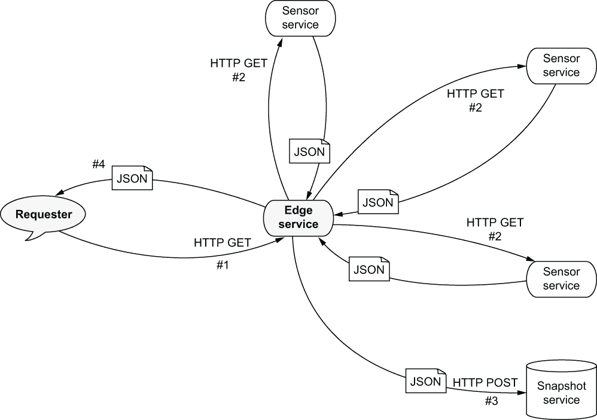
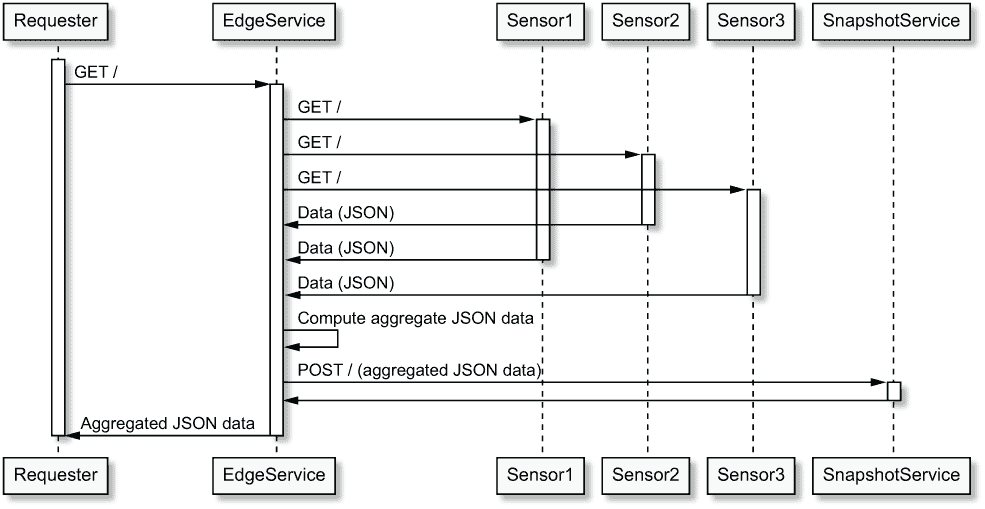
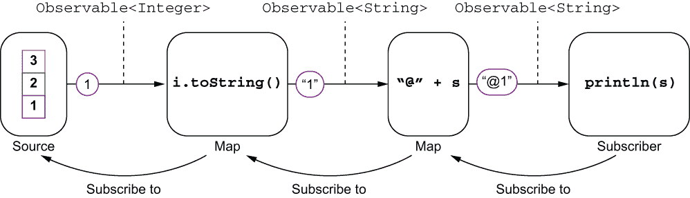

# 5 超越回调

本章涵盖

+   回调及其局限性，如网关/边缘服务示例所示

+   未来和承诺--一个简单的模型，用于链式异步操作

+   反应式扩展--一个更强大的模型，特别适合组合异步事件流

+   Kotlin 协程--对异步代码执行流程的语言级支持

在开发反应式应用程序时，您需要编写各种业务逻辑，并且并非所有逻辑都容易用异步形式表达。虽然回调是异步事件通知的简单形式，但它们很容易使异步代码变得复杂。

让我们看看为什么回调不总是最好的异步编程模型的实际例子。然后我们将探讨 Vert.x 支持的多种选项。

## 5.1 组合异步操作：边缘服务示例

我们将以一个 *边缘服务* 为例，说明如何使用不同的异步编程模型组合异步操作。

边缘服务也经常被称为 *API 网关*。它是一个充当其他服务门面的服务，因此请求者只需处理一个服务接口，而不是与每个服务交谈。边缘服务还可以执行其他任务，例如数据转换和与其他服务的交互，因此它不仅方便地聚合来自多个服务的数据。

### 5.1.1 场景

让我们回顾一下第三章中使用的热传感器垂直结构。假设我们有几个热传感器，我们想要公开一个 API 来获取和聚合所有传感器的热数据。这是一个非常简单但有效的边缘服务示例，因为它抽象了请求者需要了解和联系所有传感器的需求。为了使事情更有趣，我们还将有一个 *快照* 服务，在将传感器值返回给请求者之前捕获并记录这些值。整个场景如图 5.1 所示。



图 5.1 边缘服务场景

请求者向边缘服务发出请求，边缘服务随后从传感器服务中获取温度数据。每个传感器都公开了 HTTP/JSON API，边缘服务将所有响应聚合在一个更大的 JSON 文档中。然后，该文档被发送到快照服务，然后再发送回请求者。这些交互总结在图 5.2 中。



图 5.2 边缘、传感器和快照服务之间的交互

这个例子使我们能够对并行和顺序操作进行推理：

+   并行异步操作：获取热传感器数据

+   顺序异步操作：聚合热传感器数据，将其发送到快照服务，然后将其返回给请求者

### 5.1.2 热传感器垂直结构

我们可以将我们的热传感器作为多个独立进程部署，每个进程都公开一个 HTTP API。为了简化我们的示例，我们将它们部署在同一个进程中，尽管 HTTP 服务器监听不同的 TCP 端口。

以下 `HeatSensor` 类是对我们之前使用的类的简单修改。列表 5.1 显示了类的序言，直接从第三章的代码移植过来。

列表 5.1 热传感器垂直

```
public class HeatSensor extends AbstractVerticle {

  private final Random random = new Random();
  private final String sensorId = UUID.randomUUID().toString();     ❶
  private double temperature = 21.0;

  private void scheduleNextUpdate() {
    vertx.setTimer(random.nextInt(5000) + 1000, this::update);
  }

  private void update(long timerId) {
    temperature = temperature + (delta() / 10);
    scheduleNextUpdate();
  }

  private double delta() {
    if (random.nextInt() > 0) {
      return random.nextGaussian();
    } else {
      return -random.nextGaussian();
    }
  }
// (...)
```

❶ 每个传感器都有一个生成的唯一标识符。

代码保持了通过随机量更新温度的逻辑，随机延迟在一到六秒之间。

以下列表显示了添加以公开 HTTP API 的代码。

列表 5.2 热传感器垂直 HTTP API 代码

```
@Override
public void start() {
  vertx.createHttpServer()
    .requestHandler(this::handleRequest)
    .listen(config().getInteger("http.port", 3000));     ❶
  scheduleNextUpdate();
}

private void handleRequest(HttpServerRequest req) {
  JsonObject data = new JsonObject()
    .put("id", id)
    .put("temp", temp);
  req.response()
    .putHeader("Content-Type", "application/json")
    .end(data.encode());
}
```

❶ 服务器 TCP 端口是可配置的。

这是一个非常直接使用 Vert.x HTTP 服务器的例子，HTTP 端口通过配置传递。响应以 JSON 编码。

### 5.1.3 快照服务垂直

快照服务也公开了一个 HTTP 服务器，如下列所示。

列表 5.3 快照服务垂直

```
public class SnapshotService extends AbstractVerticle {
  private final Logger logger = LoggerFactory.getLogger(SnapshotService.class);

  @Override
  public void start() {
    vertx.createHttpServer()
      .requestHandler(req -> {
        if (badRequest(req)) {
          req.response().setStatusCode(400).end();
        }
        req.bodyHandler(buffer -> {                      ❶
          logger.info("Latest temperatures: {}", 
          ➥ buffer.toJsonObject().encodePrettily());
          req.response().end();
        });
      })
      .listen(config().getInteger("http.port", 4000));
  }

  private boolean badRequest(HttpServerRequest req) {
    return !req.method().equals(HttpMethod.POST) ||
      !"application/json".equals(req.getHeader("Content-Type"));
  }
}
```

❶ 这等待整个体被接收，而不是组装中间缓冲区。

HTTP 请求处理器期望一个 HTTP `POST` 请求，使用一个体处理器提取体，并记录接收到的数据。

定义了这两个垂直之后，现在可以开始有趣的部分了，我们可以看看如何制作我们的边缘服务。

## 5.2 回调

我们首先将使用回调函数来实现边缘服务，就像我们从这本书开始做的那样。

我们项目需要的依赖项是 *Vert.x Core*，*Vert.x Web Client*（简化 HTTP 请求的创建），以及 *Logback*。以下列表显示了 Gradle 构建的依赖项。当使用 Maven 或任何其他兼容的构建工具时，工件完全相同。

列表 5.4 边缘服务依赖项（回调版本）

```
dependencies {
  implementation("io.vertx:vertx-core:${vertxVersion}")         ❶
  implementation("io.vertx:vertx-web-client:${vertxVersion}")
  implementation("ch.qos.logback:logback-classic:1.2.3")
}
```

❶ 将 ${vertxVersion} 替换为您选择的当前 Vert.x 版本。

注意：除了 `chapter5.future.CollectorService` 类以外的所有类都在 Vert.x 3.9 上编译。此类需要较新的基于 Vert.x 4 的未来 API，如第 5.3.2 节中提到的 Vert.x 未来和承诺。

### 5.2.1 实现

我们将从 `CollectorService` 垂直类实现的序言开始。

列表 5.5 回调实现序言

```
public class CollectorService extends AbstractVerticle {

  private final Logger logger = 
  ➥ LoggerFactory.getLogger(CollectorService.class);
  private WebClient webClient;

  @Override
  public void start() {
    webClient = WebClient.create(vertx);     ❶
    vertx.createHttpServer()
      .requestHandler(this::handleRequest)
      .listen(8080);
  }
  // (...)
}
```

❶ Vert.x 网络客户端需要一个 vertx 上下文。

`start` 方法首先创建一个 `WebClient` 实例，然后在端口 8080 上启动一个 HTTP 服务器。Web 客户端类来自 `vertx-web-client` 模块，与 Vert.x 核心 API 中的 HTTP 客户端相比，大大简化了 HTTP 请求的创建。它特别简化了 HTTP 体处理和转换：你可以将体转换为纯文本、JSON 或通用 Vert.x 缓冲区。

HTTP 请求处理器是以下列表中显示的 `handleRequest` 方法。

列表 5.6 使用回调处理请求

```
private void handleRequest(HttpServerRequest request) {
  List<JsonObject> responses = new ArrayList<>();        ❶
  AtomicInteger counter = new AtomicInteger(0);          ❷
  for (int i = 0; i < 3; i++) {
    webClient
      .get(3000 + i, "localhost", "/")                   ❸
      .expect(ResponsePredicate.SC_SUCCESS)              ❹
      .as(BodyCodec.jsonObject())                        ❺
      .send(ar -> {
        if (ar.succeeded()) {
          responses.add(ar.result().body());
        } else {
          logger.error("Sensor down?", ar.cause());
        }
        if (counter.incrementAndGet() == 3) {            ❻
          JsonObject data = new JsonObject()
            .put("data", new JsonArray(responses));
          sendToSnapshot(request, data);
        }
      });
  }
}
```

❶ 我们需要一个列表来收集 JSON 响应。

❷ 我们还需要一个计数器来跟踪响应，因为当有错误时，响应的数量可能少于请求的数量。

❸ 这会在资源 / 上对 localhost 和端口 3000 + i 发出 HTTP GET 请求。

❹ 当 HTTP 状态码不在 2xx 范围内时，此谓词会触发错误。

❺ 这将体视为 JSON 对象并执行自动转换。

❻ 当所有请求（或错误）都已接收后，我们可以进行下一步操作。

此方法展示了使用网络客户端 API 执行 HTTP 请求是多么容易。主要困难在于协调并行 HTTP 请求。我们需要一个循环来发出请求，由于它们是异步的，我们还需要跟踪接收到的响应数量和响应值。这是通过有一个响应列表和使用响应计数器来完成的。请注意，我们在这里使用 `AtomicInteger` 不是因为并发，而是因为我们需要一个对象来从回调中增加一个整数。

一旦所有响应都已接收，我们可以进行下一步操作，即将数据发送到快照服务。

列表 5.7 向快照服务发送数据

```
private void sendToSnapshot(HttpServerRequest request, JsonObject data) {
  webClient
    .post(4000, "localhost", "/")
    .expect(ResponsePredicate.SC_SUCCESS)
    .sendJsonObject(data, ar -> {
      if (ar.succeeded()) {
        sendResponse(request, data);
      } else {
        logger.error("Snapshot down?", ar.cause());
        request.response().setStatusCode(500).end();      ❶
      }
    });
}
```

❶ 如果发生错误，我们在此处使用 500 状态码结束 HTTP 请求。

此方法实现简单地使用网络客户端发出 HTTP `POST` 请求。

成功后，代码将移动到 `sendResponse` 方法以结束 HTTP 请求，如下所示。

列表 5.8 发送响应

```
private void sendResponse(HttpServerRequest request, JsonObject data) {
  request.response()
    .putHeader("Content-Type", "application/json")
    .end(data.encode());                            ❶
}
```

❶ 提供紧凑的 JSON 文本表示

### 5.2.2 运行

要运行边缘服务，我们首先需要部署 verticles，如下所示。

列表 5.9 主方法

```
Vertx vertx = Vertx.vertx();

vertx.deployVerticle("chapter5.sensor.HeatSensor",
  new DeploymentOptions().setConfig(new JsonObject()
    .put("http.port", 3000)));                         ❶

vertx.deployVerticle("chapter5.sensor.HeatSensor",
  new DeploymentOptions().setConfig(new JsonObject()
    .put("http.port", 3001)));

vertx.deployVerticle("chapter5.sensor.HeatSensor",
  new DeploymentOptions().setConfig(new JsonObject()
    .put("http.port", 3002)));

vertx.deployVerticle("chapter5.snapshot.SnapshotService");
vertx.deployVerticle("chapter5.callbacks.CollectorService");
```

❶ 每个实例可以使用不同的端口号。

我们可以使用 HTTPie 来发出 HTTP 请求以测试服务，如下所示。

列表 5.10 调用边缘服务

```
$ http :8080                   ❶
HTTP/1.1 200 OK
Content-Type: application/json
content-length: 224

{
    "data": [
        {
            "id": "66e310a6-9068-4552-b4aa-6130b3e17cb6",
            "temp": 21.118902894421108
        },
        {
            "id": "3709b24b-cef2-4341-b64a-af68b11e2c0d",
            "temp": 20.96576368750857
        },
        {
            "id": "79f9fa27-b341-4ce5-a335-03caef6e8935",
            "temp": 21.01792006568459
        }
    ]
}
```

❶ 使用 HTTPie，:8080 是 http://localhost:8080 的快捷方式。

在服务器端，我们可以检查快照服务是否输出了一些日志，如下所示。

列表 5.11 边缘服务的日志

```
15:10:25.576 SnapshotService - Lastest temperatures: {    ❶
  "data" : [ {
    "id" : "66e310a6-9068-4552-b4aa-6130b3e17cb6",
    "temp" : 21.118902894421108
  }, {
    "id" : "3709b24b-cef2-4341-b64a-af68b11e2c0d",
    "temp" : 20.96576368750857
  }, {
    "id" : "79f9fa27-b341-4ce5-a335-03caef6e8935",
    "temp" : 21.01792006568459
  } ]
}
```

❶ 每个条目都有聚合的 JSON 数据。

### 5.2.3 “回调地狱”不是问题

当讨论回调时，许多人会尖叫“回调地狱！”。回调地狱是指使用嵌套回调来链式异步操作，导致代码难以理解，因为嵌套太深。使用嵌套回调进行错误处理尤其困难。

虽然这是真的，但可以通过为每个异步操作回调使用一个方法来轻松缓解回调地狱，就像我们在 `handleRequest`、`sendToSnapshot` 和 `sendResponse` 方法中所做的那样。每个方法只做一件事，我们避免了回调的嵌套。

以下列表显示了与前面等效的代码，但紧凑地作为一个带有嵌套回调的单个部分。

列表 5.12 嵌套回调的变体

```
List<JsonObject> responses = new ArrayList<>();
AtomicInteger counter = new AtomicInteger(0);
for (int i = 0; i < 3; i++) {
  webClient
    .get(3000 + i, "localhost", "/")
    .expect(ResponsePredicate.SC_SUCCESS)
    .as(BodyCodec.jsonObject())
    .send(ar -> {                                 ❶
      if (ar.succeeded()) {
        responses.add(ar.result().body());
      } else {
        logger.error("Sensor down?", ar.cause());
      }
      if (counter.incrementAndGet() == 3) {       ❷
        JsonObject data = new JsonObject()
          .put("data", new JsonArray(responses));
        webClient
          .post(4000, "localhost", "/")
          .expect(ResponsePredicate.SC_SUCCESS)
          .sendJsonObject(data, ar1 -> {          ❸
            if (ar1.succeeded()) {                ❹
              request.response()
                .putHeader("Content-Type", "application/json")
                .end(data.encode());
            } else {
              logger.error("Snapshot down?", ar1.cause());
              request.response().setStatusCode(500).end();
            }
          });
      }
    });
}
```

❶ 与其他并行发送传感器请求。

❷ 所有 HTTP 响应已接收。

❸ 向快照服务发送帖子。

❹ 回应请求者。

嵌套回调当然不会使代码更易读，但我认为真正的问题在于函数式代码与异步协调代码交织在一起。你需要从循环、回调和分支中解析出三个 HTTP 请求是并行进行的，并且它们的处理结果被组装、发送到第三方服务，然后作为响应返回。

回调并不完美，但一点点的纪律可以使代码更易读，尤其是当你只有异步操作的顺序组合时，比如`sendToSnapshot`将工作传递给`sendResponse`。

现在我们来看看其他可能比回调更有趣的异步编程模型。

## 5.3 Futures 和 promises

你已经因为 verticle `start`方法的签名而接触到了 Vert.x 的*futures*和*promises*。你也许在其他语言中，如 JavaScript，也接触到了它们。我们将进一步探讨这个模型，并看看它们是如何成为 Vert.x 中组合异步操作的有趣原语。

Vert.x 实现了一个与 Barbara Liskov 和 Liuba Shrira 原始研究成果一致的 futures 和 promises 模型。1 他们引入了 promises 作为异步远程过程调用的一种语言抽象。

Promise 持有某个计算的结果值，但目前还没有值。Promise 最终会完成，带有结果值或错误。在异步 I/O 的上下文中，Promise 是异步操作结果的理想选择。反过来，future 允许你读取最终可以从 Promise 中获取的值。

总结：Promise 用于写入最终值，future 用于在它可用时读取它。现在让我们看看它在 Vert.x 中是如何工作的。

### 5.3.1 Vert.x 中的 futures 和 promises

Promise 是由即将执行异步操作的代码创建的。例如，假设你想报告一个异步操作已完成，不是现在，而是在五秒后。在 Vert.x 中，你会使用计时器来做这件事，并使用 promise 来持有结果，如以下列表所示。

列表 5.13 从 promise 创建 promise

```
Promise<String> promise = Promise.promise();              ❶
vertx.setTimer(5000, id -> {                              ❷
  if (System.currentTimeMillis() % 2L == 0L) {
    promise.complete("Ok!");                              ❸
  } else {
    promise.fail(new RuntimeException("Bad luck..."));    ❹
  }
});
// (...)                                                  ❺
```

❶ 创建 promise。

❷ 异步操作

❸ 使用值完成 promise。

❹ 使用异常使 promise 失败。

❺参见列表 5.14。

这里异步操作是一个五秒的计时器，之后 promise 完成。根据当前时间是否为奇数或偶数，promise 会完成带有值或失败带有异常。这很好，但我们实际上如何从 promise 中获取值呢？

当结果可用时想要做出反应的代码需要一个 future 对象。Vert.x future 是从 promise 创建的，然后传递给想要读取值的代码，如下一列表所示，这是列表 5.13 的其余部分。

列表 5.14 从 promise 创建 future

```
Future<String> future = promise.future();                   ❶
return future;
// (...)

future
  .onSuccess(System.out::println)                           ❷
  .onFailure(err -> System.out.println(err.getMessage()));  ❸
```

❶ 从一个承诺中派生出一个未来，然后返回它。

❷ 当承诺完成时的回调

❸ 当未来失败时的回调

`Future` 接口定义了两个方法，`onSuccess` 和 `onFailure`，用于处理值和错误。当我们运行相应的代码时，我们会在五秒后看到打印出“Ok！”或“Bad luck...”。

我们可以使用未来执行更高级的异步操作，如下面的列表所示。

列表 5.15 高级未来组合操作

```
promise.future()
  .recover(err -> Future.succeededFuture("Let's say it's ok!"))   ❶
  .map(String::toUpperCase)                                       ❷
  .flatMap(str -> {                                               ❸
    Promise<String> next = Promise.promise();
    vertx.setTimer(3000, id -> next.complete(">>> " + str));
    return next.future();
  })
  .onSuccess(System.out::println);
```

❶ 使用另一个值从错误中恢复。

❷ 将一个值映射到另一个值。

❸ 与另一个异步操作组合。

当承诺失败时调用 `recover` 操作，它用于用另一个值替换错误。你可以将 `recover` 视为 Java 中的 `catch` 块的等价物，其中你可以处理错误。在这里，我们简单地使用一个成功的未来提供一个恢复值，但在更高级的情况下，当没有可以恢复的操作时，你也可以报告一个 *失败的* 未来。

`map` 操作使用一个函数转换一个值，而 `flatMap` 与另一个异步操作组合。你可以将 `flatMap` 视为“然后”。在这里，操作在三个秒后将字符串值前加上“>>>”。我们还可以看到典型的承诺/未来模式，我们首先创建一个承诺，然后执行一个最终完成承诺的异步操作，最后返回一个未来，以便值可以被其他代码消费。

### 5.3.2 Vert.x 4 中的基于未来的 API

Vert.x 4 将 Vert.x 的未来对象引入到核心 API 中，与回调一起使用。虽然回调仍然是标准模型，但大多数 API 都提供了返回 `Future` 的变体。

这意味着给定一个方法，`void doThis(Handler<AsyncResult<T>>)`，存在一个形式为 `Future<T> doThis()` 的变体。以下列表中展示了良好的示例，其中我们启动了一个 HTTP 服务器。

列表 5.16 使用未来方法启动 HTTP 服务器

```
@Override
public void start(Promise<Void> promise) {
  vertx.createHttpServer()
    .requestHandler(this::handleRequest)
    .listen(8080)                           ❶
    .onFailure(promise::fail)               ❷
    .onSuccess(ok -> {                      ❸
      System.out.println("http://localhost:8080/");
      promise.complete();
    });
}
```

❶ 返回一个 Future<HttpServer>

❷ 当服务器无法启动时调用

❸ 成功时调用

我们在早期示例中看到的 `listen` 方法接受了一个回调，而在这里它返回一个 `Future<HttpServer>`。然后我们可以链式调用 `onFailure` 和 `onSuccess` 来定义服务器启动或发生错误时应该做什么。

注意：您可以从 Vert.x 3.8 开始使用新的承诺/未来接口，但基于未来的 API 只在 Vert.x 4 中可用。

### 5.3.3 与 CompletionStage API 的互操作性

Vert.x 的未来对象也与 JDK 中 `java.util.concurrent` 包的 `CompletionStage` 接口互操作。`CompletionStage` 接口代表异步操作中的一个步骤，因此你可以将其视为一个未来，特别是有一个名为 `CompletableFuture` 的类实现了 `CompletionStage`。例如，Java 11 中的 HTTP 客户端 API 提供了返回 `CompletableFuture` 的 `sendAsync` 方法，以便进行异步 HTTP 请求。

当你需要与使用 `CompletionStage` 在其 API 中的库交互时，Vert.x futures 和 `CompletionStage` 之间的互操作性很有用。

注意：Vert.x `Future` 接口不是 `CompletionStage` 的子类型。在准备 Vert.x 4 的路线图时，Vert.x 团队考虑过这一点，但最终我们选择了自己的接口定义，因为 `CompletionStage` 对线程模型更为中立。确实，“async”后缀的方法提供了可以传递执行器（如 `CompletionStage<Void> thenRunAsync(Runnable,Executor)`）的变体，而无需执行器参数的变体默认调度到 `ForkJoinPool` 实例。这些方法允许轻易地从 Vert.x 事件循环或工作线程池中退出，因此我们选择提供互操作性，而不是在 Vert.x API 中直接使用 `CompletionStage`。

以下列表展示了如何从 Vert.x `Future` 转换到 `CompletionStage`。

列表 5.17 从 Vert.x `Future` 到 `CompletionStage`

```
CompletionStage<String> cs = promise.future().toCompletionStage();   ❶
cs
  .thenApply(String::toUpperCase)                                    ❷
  .thenApply(str -> "~~~ " + str)
  .whenComplete((str, err) -> {                                      ❸
    if (err == null) {
      System.out.println(str);
    } else {
      System.out.println("Oh... " + err.getMessage());
    }
  });
```

❶ 将 Future 转换为 CompletionStage

❷ `thenApply` 与 Vert.x Future 中的 `map` 类似。

❸ 接收一个值或一个错误

在这里，我们将字符串结果转换为大写，在其前面添加一个字符串，并最终调用 `whenComplete`。请注意，这是一个 `BiConsumer`，你需要测试哪个值或异常参数是 `null`，以确定承诺是否成功完成。同样重要的是要注意，除非你调用异步的 `CompletionStage` 方法，否则调用将在 Vert.x 线程上执行。

最后但同样重要的是，你可以将 `CompletionStage` 转换为 Vert.x `Future`，如下所示。

列表 5.18 从 `CompletionStage` 到 Vert.x `Future`

```
CompletableFuture<String> cf = CompletableFuture.supplyAsync(() -> {   ❶
  try {
    Thread.sleep(5000);
  } catch (InterruptedException e) {
    e.printStackTrace();
  }
  return "5 seconds have elapsed";
});

Future
  .fromCompletionStage(cf, vertx.getOrCreateContext())                 ❷
  .onSuccess(System.out::println)
  .onFailure(Throwable::printStackTrace);
```

❶ 从异步操作创建一个 CompletableFuture。

❷ 转换为 Vert.x future，并在 Vert.x 上下文中调度。

`CompletableFuture` 实现 `CompletionStage`，`supplyAsync` 将调用调度到默认的 `ForkJoinPool`。该池中的一个线程将被使用，在返回一个字符串之前将睡眠五秒钟，这个字符串将是 `CompletableFuture` 的结果。`fromCompletionStage` 方法将转换为 Vert.x `Future`。该方法有两个变体：一个带有 Vert.x 上下文以调用 `Future` 方法，如 `onSuccess` 在上下文中，另一个调用将在完成提供的 `CompletionStage` 实例的任何线程上发生。

### 5.3.4 使用 Vert.x futures 的收集器服务

回到边缘服务示例，我们可以利用使用 `Future` 的 Vert.x API。我们将使用列表 5.16 中的早期 verticle `start` 方法。

首先，我们可以在以下列表中定义 `fetchTemperature` 方法以从服务获取温度。

列表 5.19 使用基于未来的 API 获取温度

```
private Future<JsonObject> fetchTemperature(int port) {
  return webClient
    .get(port, "localhost", "/")
    .expect(ResponsePredicate.SC_SUCCESS)
    .as(BodyCodec.jsonObject())
    .send()                      ❶
    .map(HttpResponse::body);    ❷
}
```

❶ Future<HttpResponse>

❷ 提取并返回仅包含正文的内容。

此方法返回一个 `JsonObject` 的 future，为了实现这一点，我们使用了返回 future 的 `WebClient.send` 方法的变体，然后将结果映射以提取仅包含 JSON 数据。

温度数据在下面的 `handleRequest` 方法中收集。

列表 5.20 使用基于未来的 API 收集温度

```
private void handleRequest(HttpServerRequest request) {
  CompositeFuture.all(                                   ❶
    fetchTemperature(3000),                              ❷
    fetchTemperature(3001),
    fetchTemperature(3002))
    .flatMap(this::sendToSnapshot)                       ❸
    .onSuccess(data -> request.response()                ❹
      .putHeader("Content-Type", "application/json")
      .end(data.encode()))
    .onFailure(err -> {                                  ❺
      logger.error("Something went wrong", err);
      request.response().setStatusCode(500).end();
    });
}
```

❶ 组合多个未来。

❷ 获取温度。

❸ 与另一个异步操作链式调用。

❹ 处理成功情况。

❺ 处理失败情况。

你可以使用 `CompositeFuture` 将多个未来合并成一个。`all` 静态方法会生成一个当所有未来都完成时完成，任何未来失败时失败的未来。还有 `any` 和 `join` 方法，它们有不同的语义。

一旦所有温度都成功接收，`flatMap` 的调用会将数据发送到快照服务，这是一个异步操作。`sendToSnapshot` 方法的代码如下所示。

列表 5.21 使用基于未来的 API 向快照服务发送数据

```
private Future<JsonObject> sendToSnapshot(CompositeFuture temps) {
  List<JsonObject> tempData = temps.list();
  JsonObject data = new JsonObject()
    .put("data", new JsonArray()
      .add(tempData.get(0))
      .add(tempData.get(1))
      .add(tempData.get(2)));
  return webClient
    .post(4000, "localhost", "/")
    .expect(ResponsePredicate.SC_SUCCESS)
    .sendJson(data)                        ❶
    .map(response -> data);
}
```

❶ 基于未来的变体

这段代码与 `fetchTemperature` 的代码类似，因为我们使用了一个返回 `Future` 的 `WebClient` 方法。部署 verticles 的主方法代码与回调变体相同，只是我们部署了一个不同的 `CollectorService` verticle：

```
// (...)
vertx.deployVerticle("chapter5.future.CollectorService");
```

现在让我们继续探讨反应式扩展，另一种异步编程模型。

## 5.4 反应式扩展

反应式扩展是 *可观察* 设计模式的扩展形式。2 它们最初由 Erik Meijer 在 *Microsoft .NET* 生态系统中推广。现代应用程序越来越多地由异步事件流组成，不仅限于服务器，还包括 Web、桌面和移动客户端。3 事实上，我们可以将图形用户界面事件视为应用程序必须响应的事件流。

反应式扩展由三件事定义：

+   观察事件或数据流（例如，观察传入的 HTTP 请求）

+   通过组合操作符转换流（例如，将多个 HTTP 请求流合并为一个）

+   订阅流并对事件和错误做出反应

*ReactiveX* 创新为许多语言提供了通用的 API 和实现，包括后端和前端项目 ([`reactivex.io/`](http://reactivex.io/))。RxJS 项目为浏览器中的 JavaScript 应用程序提供反应式扩展，而像 RxJava 这样的项目为 Java 生态系统提供了一个通用的反应式扩展实现。

Vert.x 为 RxJava 1 和 2 版本提供绑定。建议使用版本 2，因为它支持背压，而版本 1 不支持。

### 5.4.1 RxJava 简述

让我们探索 RxJava 的基础知识，看看它做什么以及它如何与 Vert.x 优雅地集成。

tip Timo Tuominen 的 *RxJava for Android Developers* (Manning, 2019) 是学习 RxJava 的一个可靠资源。

可观察类型

首先，RxJava 2 提供了五种不同类型的可观察源，列在表 5.1 中。

表 5.1 RxJava 中的可观察类型

| 类型 | 描述 | 示例 |
| --- | --- | --- |
| `Observable<T>` | 类型为 `T` 的事件流。不支持背压。 | 计时事件，无法应用背压的观察源，如 GUI 事件 |
| `Flowable<T>` | 可以应用背压的类型为 `T` 的事件流 | 网络数据，文件系统输入 |
| `Single<T>` | 发出类型为 `T` 的确切一个事件的源 | 通过键从数据存储中获取条目 |
| `Maybe<T>` | 可能发出类型为 `T` 的一个事件，或没有 | 通过键从数据存储中获取条目，但键可能不存在 |
| `Completable` | 通知某些操作已完成，但没有给出任何值 | 删除文件 |

你有时会读到 *热* 和 *冷* 源。热源是一个无论是否有订阅者都会发出事件的源。冷源是一个只有在第一次订阅后才开始发出事件的源。周期性计时器是一个热源，而要读取的文件是一个冷源。对于冷源，你可以获取所有事件，但对于热源，你将只能获取订阅后发出的那些事件。

基本示例

我们将从列表 5.22 中的简单示例开始，如图 5.3 所示。



图 5.3 列表 5.22 的 RxJava 管道

列表 5.22 一个 RxJava 的第一个示例

```
Observable.just(1, 2, 3)              ❶
  .map(Object::toString)              ❷
  .map(s -> "@" + s)                  ❸
  .subscribe(System.out::println);    ❹
```

❶ 这是一个预定义序列的观察者。

❷ 我们将它们映射为字符串。

❸ 我们转换字符串。

❹ 对于每个项目，我们将其打印到标准输出。

运行列表 5.22 中的代码会产生以下控制台输出：

```
@1
@2
@3
```

这个示例创建了一个包含三个整数的观察者。`just` 工厂方法创建了一个 `Observable<Integer>` 源。然后我们使用两个 `map` 操作符来转换流。第一个将 `Observable<Integer>` 转换为 `Observable<String>`。第二个在每一项前添加 `@` 字符。最后，`subscribe` 执行订阅，对每个项目调用 `System.out.println`。

源可能会发出错误，在这种情况下，订阅者可以被通知。考虑以下列表中的观察者。

列表 5.23 使用 RxJava 进行错误处理

```
Observable.<String>error(() -> new RuntimeException("Woops"))   ❶
  .map(String::toUpperCase)                                     ❷
  .subscribe(System.out::println, Throwable::printStackTrace);  ❸
```

❶ 观察者发出一个错误。

❷ 这个方法永远不会被调用。

❸ 将打印堆栈跟踪。

字符串值的观察者将发出一个错误。`map` 操作符永远不会被调用，因为它只操作值，不操作错误。我们可以看到 `subscribe` 现在有两个参数；第二个是处理错误的回调。在这个例子中，我们只是打印堆栈跟踪，但在网络应用程序中，例如，我们会进行错误恢复。

注意：使用`just`工厂方法在示例和测试中非常好，但在现实场景中，你可能需要将更复杂的源适配以产生 RxJava 可观察类型的事件。为此，有一个通用的`Publisher`接口，你可以实现它来使用`fromPublisher`方法（而不是`just`）向订阅者发出项目。还有适配器方法用于 JDK 未来、可迭代对象以及从 JDK 可调用对象生成项目。

生命周期

之前的例子没有显示可观察对象的完整生命周期。一旦订阅发生，就会发出零个或多个项目。然后流以错误或完成通知结束。

让我们看看一个更详细的例子。

列表 5.24 在 RxJava 中处理所有生命周期事件

```
Observable
  .just("--", "this", "is", "--", "a", "sequence", "of", "items", "!")
  .doOnSubscribe(d -> System.out.println("Subscribed!"))               ❶
  .delay(5, TimeUnit.SECONDS)                                          ❷
  .filter(s -> !s.startsWith("--"))
  .doOnNext(System.out::println)                                       ❸
  .map(String::toUpperCase)
  .buffer(2)                                                           ❹
  .subscribe(
    System.out::println,
    Throwable::printStackTrace,
    () -> System.out.println(">>> Done"));                             ❺
```

❶ 可以插入操作，例如当发生订阅时。

❷ 这延迟了事件发射五秒钟。

❸ 另一个动作，在这里称为流中每个流动的项目

❹ 这组将事件 2 个一组。

❺ 当流完成时调用

运行前面的代码会得到以下输出。

列表 5.25 运行列表 5.24 的输出

```
Subscribed!           ❶
doOnNext: this
doOnNext: is
next: [THIS, IS]
doOnNext: a
doOnNext: sequence
next: [A, SEQUENCE]
doOnNext: of
doOnNext: items
next: [OF, ITEMS]
doOnNext: !
next: [!]
~Done~
```

❶ 这是五秒钟的唯一输出。然后出现下一行。

这个例子展示了`subscribe`的形式，其中可以处理所有事件：一个事件、一个错误和流的完成。该示例还展示了进一步的运算符：

+   `doOnSubscribe`和`doOnNext`是动作（可能有副作用），可以在项目通过流时触发。

+   `delay`允许在流中进一步发射事件时延迟。

+   `buffer`将事件（到列表中）分组，因此我们在这里以成对的事件接收。

当然，RxJava 的内容远不止我们在这个部分讨论的，但我们已经涵盖了足够的内容，可以深入到 Vert.x 和 RxJava 的集成。

### 5.4.2 RxJava 和 Vert.x

Vert.x 中的 RxJava 集成可在`vertx-rx-java2`模块中找到。在 Gradle（以及类似地，在 Maven 中），可以将依赖项添加为

```
implementation("io.vertx:vertx-rx-java2:version")
```

官方 Vert.x 堆栈中的所有项目 API 都支持 RxJava。RxJava API 是从核心 API 自动生成的。有几个习惯用法转换规则到 RxJava API，但作为一个简单的例子，当你有

```
void foo(String s, Handler<AsyncResult<String>> callback)
```

翻译到 RxJava 是

```
Single<String> foo(String s)
```

RxJava API 位于`io.vertx.reactivex`的子包中。例如，`AbstractVerticle`的 RxJava 版本是`io.vertx.reactivex.core.AbstractVerticle`。

让我们看看使用 RxJava API 的一个示例 verticle。

列表 5.26 RxJava 和 Vert.x API

```
public class VertxIntro extends AbstractVerticle {
  @Override
  public Completable rxStart() {                                 ❶

    Observable
      .interval(1, TimeUnit.SECONDS, RxHelper.scheduler(vertx))  ❷
      .subscribe(n -> System.out.println("tick"));

    return vertx.createHttpServer()
      .requestHandler(r -> r.response().end("Ok"))
      .rxListen(8080)                                            ❸
      .ignoreElement();                                          ❹
  }
}
```

❶ rxStart 使用 Completable 而不是 Future 通知部署成功。

❷ 调度器强制执行 Vert.x 线程模型。

❸ 这是一个 RxJava 的 listen(port, callback)变体。

❹ 这从 Single 返回一个 Completable。

这个例子打开了一个经典的 HTTP 服务器，对任何请求都回复 `Ok`。有趣的部分是 RxJava 的 `AbstractVerticle` 变体有一个 `rxStart`（和 `rxStop`）方法，用于通知部署成功。在我们的情况下，当 HTTP 服务器启动时，verticle 已成功部署，因此我们返回一个 `Completable` 对象。你可以检查以 `rx` 前缀开头的方法是否对应于支持 RxJava 的生成方法。如果你检查 RxJava API，你会注意到原始方法（包括回调）仍然存在。

这个例子中另一个有趣的部分是每秒发出事件的观察者。它本质上与 Vert.x 定时器类似。RxJava API 中有几个操作符方法接受一个 *scheduler* 对象，因为它们需要延迟异步任务。默认情况下，它们从它们管理的内部工作线程池中回调，这打破了 Vert.x 线程模型假设。我们可以始终传递一个 Vert.x 调度器以确保事件仍然在原始上下文事件循环中被回调。

### 5.4.3 RxJava 中的收集器服务

我们现在可以回到我们的边缘服务示例，并用 RxJava 重新编写 `CollectorService` verticle 类。

首先，我们将更新导入以使用 `io.vertx.reactivex.*` 包。由于 verticle 启动了一个 HTTP 服务器，我们可以利用 `rxStart` 如下。

列表 5.27 RxJava 收集器服务前缀

```
@Override
public Completable rxStart() {
  webClient = WebClient.create(vertx);
  return vertx.createHttpServer()
    .requestHandler(this::handleRequest)
    .rxListen(8080)                       ❶
    .ignoreElement();                     ❷
}
```

❶ 一个 Single<HttpServer>

❷ 一个 Completable

下一步是编写一个并行获取温度的方法，然后将响应组装成一个 JSON 对象。就像回调版本一样，我们可以有一个获取单个温度的方法。代码如下所示。

列表 5.28 使用 RxJava 获取温度

```
private Single<HttpResponse<JsonObject>> fetchTemperature(int port) {
  return webClient
    .get(port, "localhost", "/")
    .expect(ResponsePredicate.SC_SUCCESS)
    .as(BodyCodec.jsonObject())
    .rxSend();                    ❶
}
```

❶ 这返回一个 Single。

同样，与回调版本的区别在于我们使用 `rxSend`（它返回一个 `Single`）而不是 `send`（它使用回调）。

下一个列表展示了一个方法，该方法组合并行异步 HTTP 请求并根据响应组装一个 JSON 对象。

列表 5.29 使用 RxJava 收集温度请求

```
private Single<JsonObject> collectTemperatures() {
  Single<HttpResponse<JsonObject>> r1 = fetchTemperature(3000);
  Single<HttpResponse<JsonObject>> r2 = fetchTemperature(3001);
  Single<HttpResponse<JsonObject>> r3 = fetchTemperature(3002);

  return Single.zip(r1, r2, r3, (j1, j2, j3) -> {    ❶
    JsonArray array = new JsonArray()
      .add(j1.body())
      .add(j2.body())
      .add(j3.body());
    return new JsonObject().put("data", array);      ❷
  });
}
```

❶ zip 操作符组合了三个响应。

❷ 值是 zip 操作符的响应，封装在一个 Single 中。

通过使用 `fetchTemperature` 来获取单个响应，我们获得观察单个 HTTP 响应的 `Single` 对象。为了组合结果，我们使用 `zip` 操作符，它接受可分割的源并将结果组合为另一个 `Single` 对象。当所有 HTTP 响应都可用时，`zip` 操作符将值传递给一个必须产生值的函数（任何类型）。返回的值然后是 `zip` 操作符发出的 `Single` 对象。在这里，我们使用 Vert.x 网络客户端为我们转换成 JSON 的 HTTP 响应体构建一个 JSON 数组，然后我们将数组包装在一个 JSON 对象中。

注意，`zip` 函数有多个重载定义，参数数量不同，以应对两个来源、三个来源等情况。当代码需要处理未定义数量的来源时，有一个变体接受来源列表，并且传递给 `zip` 函数的函数接受值列表。

这引出了处理 HTTP 请求的方法的定义，该方法收集温度，发布到快照服务，然后响应请求者。代码如下所示。

列表 5.30 RxJava 收集器服务 HTTP 处理器

```
private void handleRequest(HttpServerRequest request) {
  Single<JsonObject> data = collectTemperatures();
  sendToSnapshot(data).subscribe(json -> {              ❶
    request.response()
      .putHeader("Content-Type", "application/json")
      .end(json.encode());
  }, err -> {                                           ❷
    logger.error("Something went wrong", err);
    request.response().setStatusCode(500).end();
  });
}
```

❶ 我们将数据发送到快照服务。

❷ 我们有一个错误管理的单一点。

此方法还执行订阅：成功返回 JSON 数据给请求者，失败则返回 HTTP 500 错误。重要的是要注意，订阅触发对传感器服务的 HTTP 请求，然后是对快照服务的请求，等等。在订阅之前，RxJava 可观察管道只是处理事件的“食谱”。

最后缺少的部分是将数据发送到快照服务的方法。

列表 5.31 使用 RxJava 向快照服务发送数据

```
private Single<JsonObject> sendToSnapshot(Single<JsonObject> data) {
  return data.flatMap(json -> webClient                              ❶
    .post(4000, "localhost", "")
    .expect(ResponsePredicate.SC_SUCCESS)
    .rxSendJsonObject(json)                                          ❷
    .flatMap(resp -> Single.just(json)));                            ❸
}
```

❶ 一旦我们有了 JSON 数据，我们就发出一个 HTTP 请求。

❷ 这发送一个 JSON 对象，然后报告 HTTP 请求响应。

❸ 这使我们能够返回 JSON 对象而不是 HTTP 请求响应。

此方法引入了 `flatMap` 操作符，这对于函数式编程爱好者来说很熟悉。如果你觉得 `flatMap` 听起来很神秘，不要担心；在组合顺序异步操作的情况下，你只需将`flatMap`读作“然后”即可。

由于 `data` 发射一个 JSON 对象，`flatMap` 操作符允许我们在 JSON 对象发射后使用网络客户端发出一个 HTTP 请求。在向快照服务发出 HTTP 请求并成功后，我们需要另一个（嵌套的）`flatMap`。确实，`rxSendJsonObject` 给出一个只发射 HTTP 响应的单个可观察对象。然而，我们需要 JSON 对象，因为它必须在将数据发送到快照服务成功后返回给请求者，所以第二个 `flatMap` 允许我们这样做，并将其重新注入到管道中。这是 RxJava 中非常常见的模式。

运行边缘服务的 RxJava 版本与运行回调版本没有区别。我们所需做的只是将 `CollectorService` 的部署更改如下：

```
vertx.deployVerticle("chapter5.reactivex.CollectorService");
```

与回调版本相比，与服务交互产生相同的结果。

`map` 和 `flatMap` 的区别

`flatMap` 来自“flatten”和“map”操作符。为了更好地理解其工作原理，让我们用 JavaScript 数组来阐述 `flatMap`（你可以使用 `node` 或直接从网页浏览器控制台测试它）。

使用 `let a = [1,` `2,` `3]`, `a` 是一个包含值 `1`, `2`, 和 `3` 的数组。现在假设对于每个值，我们想要将其乘以 `10` 和 `100`。使用 `map`，我们可以写出 `let b = a.map(x => [x * 10, x * 100])`，这将给我们一个数组的数组：`[[ 10, 100 ], [ 20, 200 ], [ 30, 300 ]]`。

如果我们只想得到值而不是嵌套数组，这并不太方便，因此我们可以“扁平化” `b`，`b.flat()`，这将给我们 `[10, 100, 20, 200, 30, 300]`。您可以直接使用 `a.flatMap(x => [x * 10, x * 100])` 得到相同的结果。

这直接转换为其他操作，如 HTTP 客户端请求或数据库调用，因为 `flatMap` 避免了嵌套的可观察对象的可观察对象。

## 5.5 Kotlin 协程

最后要探索的异步编程模型是 Kotlin 编程语言中的 *协程*。（有关 Kotlin 的更多信息，请参阅 Dmitry Jemerov 和 Svetlana Isakova 的 *Kotlin in Action* [Manning, 2017]）。

协程很有趣，因为它们在很多情况下允许我们编写看起来像常规非异步代码的异步代码。此外，Kotlin 有一个很好的协程实现，这对于 Java 开发者来说很容易理解，而且既然我们说 Vert.x 是多语言的，这本书在某些时候不得不展示没有 Java 的 Vert.x！

### 5.5.1 协程是什么？

术语 *协程* 首次出现在 Melvin Conway 在 1963 年关于 COBOL 编译器设计的论文中。4 许多语言都支持协程或某种形式的协程：Python（生成器）、C#（`async`/`await` 操作符）、Go（*goroutines*）以及更多。存在使用字节码插装实现的 Java，并且 Java 的未来版本将支持协程，归功于 Project Loom ([`openjdk.java.net/projects/loom/`](https://openjdk.java.net/projects/loom/))。

协程可以在未来的某个时间点挂起和恢复其执行。它可以被视为一个具有多个入口和出口点的函数，其执行堆栈可以被恢复。协程非常适合异步模型，因为它们可以在需要异步操作的结果时挂起，并在结果可用时恢复。

为了使事情更具体，让我们看看在 Kotlin 中使用协程。首先，考虑以下代码。

列表 5.32 协程 hello world

```
import kotlinx.coroutines.*

suspend fun hello(): String {     ❶
  delay(1000)                     ❷
  return "Hello!"
}

fun main() {
  runBlocking {                   ❸
    println(hello())
  }
}
```

❶ 此函数可以被挂起。

❷ 此函数是挂起的，并且不会阻塞调用线程。

❸ 这允许等待协程代码完成。

`delay` 函数的调用不会阻塞调用线程，因为该方法可以被挂起。当时间过去后，该方法会再次被调用，并在下一行继续执行，返回一个字符串。在回调世界中，`delay` 函数将需要一个回调参数，该参数将不得不将返回的字符串传递给调用者，可能使用另一个回调。

这里有一个更详细的例子。

列表 5.33 协程示例

```
fun main() = runBlocking {
  val job1 = launch { delay(500) }                 ❶
  fun fib(n: Long): Long = if (n < 2) n else fib(n - 1) + fib(n - 2)
  val job2 = async { fib(42) }                     ❷

  job1.join()                                      ❸
  println("job1 has completed")
  println("job2 fib(42) = ${job2.await()}")        ❹
}
```

❶ 启动一个任务

❷ 启动一个返回值的任务

❸ 等待任务完成

❹ 在任务完成时获取值

在这个例子中，`job1` 使用 `launch` 创建，它并行执行一些代码。它等待 500 毫秒。对 `job2` 也适用，除了 `async` 是用于返回值的代码块。它计算 42 的斐波那契值，这需要一些时间。作业上的 `join` 和 `await` 方法允许我们等待这些作业完成。最后但同样重要的是，`main` 函数被 `runBlocking` 调用包裹。这是因为正在调用挂起方法，所以执行必须等待所有协程完成。

我们只是对 Kotlin 和协程进行了初步了解，但这应该足以查看 Vert.x 集成。要深入了解 Kotlin，您还可以阅读 Pierre-Yves Saumont 的《Kotlin 的乐趣》（Manning，2019）。

### 5.5.2 Vert.x 和 Kotlin 协程

Vert.x 为 Kotlin 协程提供了一级支持。要在 Gradle 项目中使用它们，您需要以下列表中显示的依赖项和配置。

列表 5.34 Vert.x Kotlin 协程依赖项和配置摘录

```
import org.jetbrains.kotlin.gradle.tasks.KotlinCompile

plugins {
  kotlin("jvm") version "kotlinVersion"                                    ❶
}

dependencies {
  // (...)
  implementation("io.vertx:vertx-lang-kotlin:${vertxVersion}")
  implementation("io.vertx:vertx-lang-kotlin-coroutines:${vertxVersion}")  ❷
  implementation(kotlin("stdlib-jdk8"))                                    ❸
}

val compileKotlin: KotlinCompile by tasks
compileKotlin.kotlinOptions.jvmTarget = "1.8"                              ❹
// (...)
```

❶ 将 kotlinVersion 替换为当前的 Kotlin 版本（它们发布得很频繁）。

❷ 将 vertxVersion 替换为当前的 Vert.x 版本。

❸ 这引入了 JDK 8 Kotlin API。

❹ 默认情况下，Kotlin 编译为 JDK 6 字节码以实现 Android 兼容性。JDK 8 字节码更好。

再次强调，协程绑定是从回调 API 生成的。惯例是，对于任何具有回调的方法，都会生成一个带有后缀 `Await` 的 Kotlin 挂起方法。给定

```
void foo(String s, Handler<AsyncResult<String>> callback)
```

以下方法将存在于 Kotlin 协程绑定中：

```
suspend fun String fooAwait(String s)
```

有一个名为 `io.vertx.kotlin.coroutines.CoroutineVerticle` 的 verticle 基类，其中 `start` 和 `stop` 方法是挂起的，因此您可以直接从它们使用协程。通过使用 `CoroutineVerticle`，您还可以在 verticle 事件循环线程上而不是在工作池的线程上执行协程。默认的 Kotlin 协程是在工作池的线程上执行的。

提示：如果您用 Kotlin 编写 Vert.x 代码，您也可以直接从 Kotlin 使用 RxJava。还有一个辅助 RxKotlin 库，它使一些 RxJava API 在 Kotlin 中更加符合语言习惯。

### 5.5.3 使用协程的边缘服务

让我们看看使用 Kotlin 协程实现的边缘服务的一个示例。前言如下所示。

列表 5.35 协程收集服务前言

```
class CollectorService : CoroutineVerticle() {
  private val logger = LoggerFactory.getLogger(CollectorService::class.java)
  private lateinit var webClient: WebClient       ❶

  override suspend fun start() {
    webClient = WebClient.create(vertx)
    vertx.createHttpServer()
      .requestHandler(this::handleRequest)
      .listenAwait(8080)                          ❷
  }
  // (...)
}
```

❶ `lateinit` 表示该字段将在构造函数中不会被初始化。

❷ 这等待 HTTP 服务器启动；否则它将抛出一个包含错误的异常。

与其他实现相比，没有太大的区别，除了`start`方法是挂起的，HTTP 服务器使用`listenAwait`启动。由于该方法调用是挂起的，执行将在 HTTP 服务器运行时恢复，该方法返回 HTTP 服务器实例，我们在这里简单地忽略它。

下一个列表展示了`fetchTemperature`和`sendToSnapshot`方法针对协程的代码。

列表 5.36 HTTP 请求和协程

```
private suspend fun fetchTemperature(port: Int): JsonObject {
  return webClient
    .get(port, "localhost", "/")
    .expect(ResponsePredicate.SC_SUCCESS)
    .`as`(BodyCodec.jsonObject())              ❶
    .sendAwait()
    .body()
}

private suspend fun sendToSnapshot(json: JsonObject) {
  webClient
    .post(4000, "localhost", "/")
    .expect(ResponsePredicate.SC_SUCCESS)
    .sendJsonAwait(json)
}
```

❶ “as”是 Kotlin 中的一个关键字，所以当用作方法名时必须转义。

这两种方法现在看起来更像传统的命令式代码。`fetchTemperature`返回一个值（一个 JSON 对象），尽管它是异步的，因为在调用`sendAwait`时方法中的执行被挂起。

在以下列表中，异步操作看起来并不像异步操作，这种错觉更加明显，它包含了边缘服务的核心逻辑。

列表 5.37 协程收集器 HTTP 处理器

```
private fun handleRequest(request: HttpServerRequest) {
  launch {
    try {
      val t1 = async { fetchTemperature(3000) }                    ❶
      val t2 = async { fetchTemperature(3001) }
      val t3 = async { fetchTemperature(3002) }

      val array = Json.array(t1.await(), t2.await(), t3.await())   ❷
      val json = json { obj("data" to array) }                     ❸

      sendToSnapshot(json)
      request.response()
        .putHeader("Content-Type", "application/json")
        .end(json.encode())

    } catch (err: Throwable) {                                     ❹
      logger.error("Something went wrong", err)
      request.response().setStatusCode(500).end()
    }
  }
}
```

❶ 获取每个温度是异步的。

❷ 等待所有值

❸ Vert.x 有一个小的 Kotlin DSL 来简化 JSON 对象的创建。

❹ 使用经典 try/catch 结构进行错误管理

这段代码非常自然地表达了温度是异步获取的，它们的值被收集在一个 JSON 对象中，调用快照服务，最终结果被发送给请求者。尽管如此，异步操作中仍有许多暂停点。此外，错误管理是一个熟悉的`try/catch`结构。

你可能已经注意到了包裹整个方法代码的`launch`函数调用。这是因为虽然`start`方法是挂起的，但 HTTP 请求处理器不是挂起函数类型，它将在 Kotlin 协程上下文之外被调用。调用`launch`确保创建了一个协程上下文，因此可以调用挂起方法。此外，协程自动附加到一个上下文中，确保事件在 verticle 事件循环线程上运行（归功于`CoroutineVerticle`的内部机制）。

注意协程并非魔法，它们的实现需要特殊的编译器和运行时库支持。Kotlin 编译器将挂起函数分割成许多函数。分割点是挂起函数调用，其余的函数最终结束在另一个函数（称为“延续”）中。然后有一个有限状态机，它确定挂起函数恢复时调用哪个分割函数。Kotlin 协程的设计提案在 GitHub 上[`mng.bz/Qxvj`](http://mng.bz/Qxvj)。

## 5.6 我应该使用哪种模型？

我们刚刚介绍了三种不同的异步编程模型，这些模型通常比回调更好。对于编写 Vert.x 应用程序应该使用哪种模型，并没有明确的答案。选择哪种模型基本上取决于你试图实现什么。

这就是 Vert.x 的伟大之处：你可以用 RxJava 编写一个 verticle，因为它使该 verticle 的函数式需求代码更简单，你可以为另一个 verticle 使用 Kotlin 协程。你可以在同一应用程序中混合和匹配模型。

未来和承诺是组合异步操作的一种简单而有效的模型。它们从版本 4 开始内置到 Vert.x 核心 API 中，并提供处理异步结果的必要工具：转换值（`map`）、从错误中恢复（`recover`/`otherwise`）、链式（`flatMap`）和组合（`CompositeFuture`）。它们还提供了与 JDK 中的`CompletionStage`的互操作性。

RxJava 允许你以函数式和声明式的方式对事件流进行推理。它在错误管理和恢复方面特别强大。有操作符用于重试失败的操作、处理超时以及在出错的情况下将处理切换到另一个值或管道。然而，在构建长链（有时是嵌套的）操作符时，存在“单子地狱”的固有风险，这使得代码更难以阅读。将处理拆分为多个方法是好策略。如果你不熟悉函数式编程惯例，像`zip`、`flatMap`和`concatMap`这样的操作符可能并不一定有意义。此外，并非所有处理都容易表示为管道，尤其是在涉及条件分支的情况下。

Kotlin 协程的优势在于生成的代码看起来不像异步代码。简单的错误管理案例可以用熟悉的`try/catch`块来表示。尽管这里没有提到，但 Kotlin 协程支持类似于 Go 编程语言的通道和选择器，这允许协程之间的消息传递。然而，更复杂的错误管理，如重试，需要手动表示。最后但同样重要的是，了解协程和异步编程的工作方式仍然很重要。

再次强调，没有明确的答案，因为所有模型都有其优缺点，但凭借你自己的经验和偏好，你可能会认识到在特定情况下应该使用哪种模型。在本书的剩余部分，我们将根据所编写的示例使用不同的模型，但这并不意味着你不能用你偏好的模型重写它们。

## 摘要

+   当涉及到组合异步操作时，回调存在表达力的限制，并且如果不加以适当注意，它们可能会使代码更难以理解。

+   并行和顺序异步操作可以使用其他异步编程模型进行组合：未来和承诺、响应式扩展和协程。

+   响应式扩展有一套丰富的可组合操作符，并且它们特别适合于事件流。

+   未来和承诺非常适合简单链式异步操作。

+   Kotlin 协程提供了对异步操作的语言级别支持，这是另一个有趣的选择。

+   没有普遍适用的异步编程模型，因为它们各自都有它们偏好的用例。Vert.x 的好处是你可以根据你的问题域混合和匹配这些模型。

* * *

1.B. Liskov 和 L. Shrira, “承诺：在分布式系统中对高效异步过程调用的语言支持,” 在 R.L. Wexelblat 编，ACM SIGPLAN 1988 年程序设计语言设计和实现会议（PLDI’88）论文集，第 260-267 页 (ACM, 1988).

2.Erich Gamma, Richard Helm, Ralph Johnson, 和 John Vlissides, 设计模式：可重用面向对象软件的元素 (Addison-Wesley Professional, 1995).

3.Erik Meijer, “你的鼠标是一个数据库,” Queue 10, 3 (三月 2012), [`mng.bz/v96M`](http://mng.bz/v96M).

4.Melvin E. Conway, “可分离转换图编译器的设计,” Communications of the ACM 6, 7 (七月 1963), 396-408, [`mng.bz/4B4V`](http://mng.bz/4B4V).
