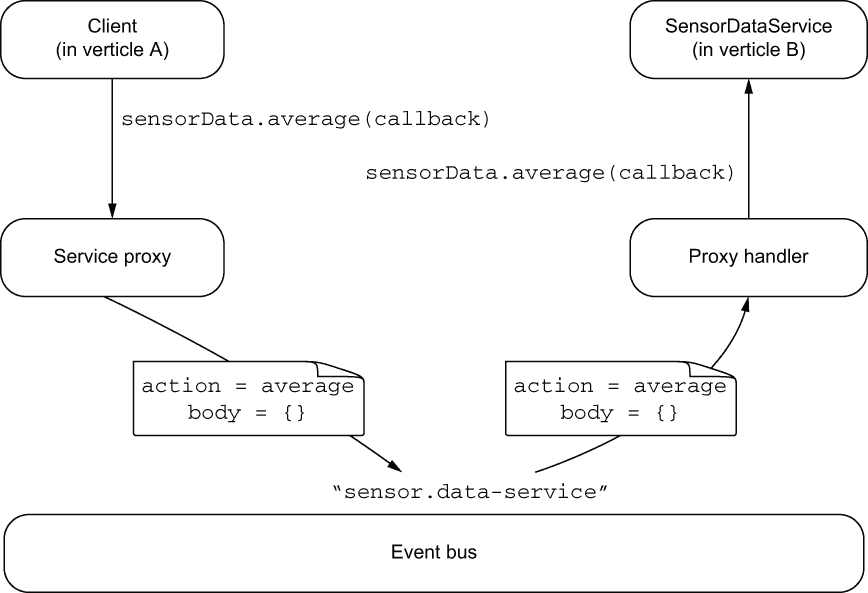
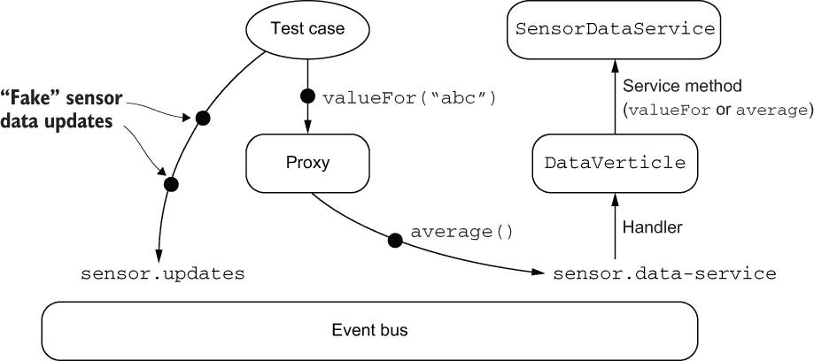
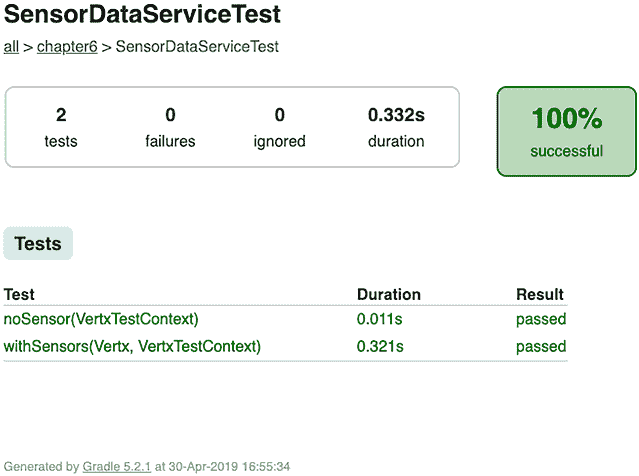

# 6 超越事件总线

本章涵盖

+   如何在事件总线之上暴露服务

+   对 verticles 和事件总线服务的异步测试

事件总线是 Vert.x 中表达事件处理的基本工具，但还有更多！事件总线服务对于暴露类型化接口而不是普通消息很有用，尤其是在预期事件总线目的地有多个消息类型时。测试也是一个重要的概念，我们将探讨与传统的测试相比，异步 Vert.x 代码测试的不同之处。

在本章中，我们将回顾一个早期的示例，将其重构为事件总线服务，并进行测试。

## 6.1 使用服务 API 回顾热传感器

在第三章中，我们使用热传感器作为示例。我们有一个`SensorData` verticle，它保存每个传感器的最后观察值，并使用事件总线上的请求/回复通信计算平均值。以下列表显示了用于计算温度平均值的代码。

列表 6.1 基于事件总线的事件平均计算 API

```
private void average(Message<JsonObject> message) {        ❶
  double avg = lastValues.values().stream()
    .collect(Collectors.averagingDouble(Double::doubleValue));
  JsonObject json = new JsonObject().put("average", avg);
  message.reply(json);                                     ❷
}
```

❶ 我们从事件总线接收事件。

❷ 我们回复事件。

此代码与 Vert.x 事件总线 API 紧密耦合，因为它需要接收消息并回复它。任何愿意调用`average`的软件组件都必须通过事件总线发送消息并期待响应。

但如果我们能够有一个带有可调用方法的常规 Java 接口，而不是必须通过事件总线发送和接收消息呢？下一条列表中提出的接口将完全与事件总线无关。

列表 6.2 热传感器 API 作为 Java 接口

```
public interface SensorDataService {
  void valueFor(String sensorId, Handler<AsyncResult<JsonObject>>     ❶
  void average(Handler<AsyncResult<JsonObject>> handler);             ❷
}
```

❶ 异步请求传感器值。

❷ 异步请求平均值。

提出的接口具有带有尾随回调参数的方法，因此调用者将异步地收到响应和错误的通知。`Handler<AsyncResult<T>>`类型在 Vert.x API 中常用于回调，其中`T`可以是任何类型，但通常是 JSON 类型。

列表 6.2 的界面是我们通过事件总线服务所追求的目标。让我们修改热传感器示例，将事件总线交互替换为`SensorDataService`类型的 Java 接口。

## 6.2 RPCs（远程过程调用）的回归

你可能已经熟悉*远程过程调用*，这是分布式计算中的一种流行抽象。1 RPCs 是在调用运行在另一台机器（服务器）上的函数时引入的，以隐藏网络通信。想法是本地函数充当代理，通过网络将带有调用参数的消息发送到服务器，然后服务器调用*真实*函数。然后，响应被发送回代理，客户端有一种调用常规、本地函数的错觉。

Vert.x 事件总线服务是一种*异步 RPC*形式：

+   服务封装了一组操作，如列表 6.2 中的`SensorDataService`。

+   服务通过常规 Java API 描述，其中包含公开操作的方法。

+   请求者或实现者都不需要直接处理事件总线消息。

图 6.1 展示了调用 `SensorDataService` 接口 `average` 方法时涉及的各个组件。客户端代码在服务代理上调用 `average` 方法。这是一个实现了 `SensorDataService` 接口的对象，然后向事件总线上的 `sensor.data-service` 目标（这可以配置）发送消息。消息正文包含方法调用参数值，因为 `average` 只接受回调，所以正文为空。消息还有一个 `action` 头，指示正在调用哪个方法。



图 6.1 服务代理的工作方式

代理处理器监听 `sensor.data-service` 目标，并根据消息的动作头和正文分发方法调用。这里使用实际的 `SensorDataService` 实现并调用 `average` 方法。然后，代理处理器通过 `average` 方法回调传递的值回复事件总线消息。反过来，客户端通过服务代理接收回复，该代理将回复传递给客户端调用上的回调。

这种模型可以简化处理事件总线，尤其是在需要公开许多操作时。因此，将 Java 接口定义为 API 而不是手动处理消息是有意义的。

## 6.3 定义服务接口

列表 6.2 包含了我们想要的 `SensorDataService` 接口，但还需要添加一些代码。为了开发事件总线服务，你需要

+   编写一个遵守一些约定的 Java 接口

+   编写实现

Vert.x 不依赖于运行时的字节码工程或反射进行魔法操作，因此需要编写和编译服务代理和处理器。幸运的是，Vert.x 提供了代码生成器，因此你将在编译时生成服务代理和处理器，而不是自己编写。

完整的 `SensorDataService` 接口在以下列表中详细说明。

列表 6.3 传感器数据服务

```
@ProxyGen                                                                  ❶
public interface SensorDataService {

  static SensorDataService create(Vertx vertx) {                           ❷
    return new SensorDataServiceImpl(vertx);
  }

  static SensorDataService createProxy(Vertx vertx, String address) {      ❸
    return new SensorDataServiceVertxEBProxy(vertx, address);
  }

  void valueFor(String sensorId, Handler<AsyncResult<JsonObject>> handler);❹

  void average(Handler<AsyncResult<JsonObject>> handler);                  ❺
}
```

❶ 此注解用于生成事件总线代理。

❷ 创建服务实例的工厂方法

❸ 创建代理的工厂方法

❹ 带参数和回调的操作

❺ 不带参数和回调的操作

使用 `@ProxyGen` 注解标记事件总线服务接口，以便生成代理代码。

你还需要定义一个 `package-info.java` 文件，并使用 `@ModuleGen` 注解来标记包定义以启用注解处理器，如以下列表所示。

列表 6.4 包信息文件和启用代码生成

```
@ModuleGen(groupPackage = "chapter6", name = "chapter6")     ❶
package chapter6;

import io.vertx.codegen.annotations.ModuleGen;
```

❶ 启用具有代码生成的模块。

服务接口中的方法需要遵循一些约定，特别是最后一个参数必须是回调。你可能会倾向于使用返回值而不是回调，但请记住，我们正在处理异步操作，所以我们需要回调！对于服务接口来说，既有服务实现（`create`）又有代理（`createProxy`）的工厂方法是惯用的。这些方法大大简化了获取代理或发布服务的代码。

`SensorDataServiceVertxEBProxy`类是由 Vert.x 代码生成器生成的，如果你查看它，你会看到事件总线操作。还有一个名为`SensorDataServiceVertxProxyHandler`的类也被生成，但只有 Vert.x 会使用它，而不是你的代码。

让我们现在看看`SensorDataServiceImpl`类中的实际服务实现。

## 6.4 服务实现

以下服务实现是第三章代码的直接改编。

列表 6.5 `SensorDataService`的实现

```
class SensorDataServiceImpl implements SensorDataService {

  private final HashMap<String, Double> lastValues = new HashMap<>();

  SensorDataServiceImpl(Vertx vertx) {                                    ❶
    vertx.eventBus().<JsonObject>consumer("sensor.updates", message -> {  ❷
      JsonObject json = message.body();
      lastValues.put(json.getString("id"), json.getDouble("temp"));
    });
  }

  @Override
  public void valueFor(String sensorId, Handler<AsyncResult<JsonObject>> 
  ➥ handler) {
    if (lastValues.containsKey(sensorId)) {
      JsonObject data = new JsonObject()
        .put("sensorId", sensorId)
        .put("value", lastValues.get(sensorId));
      handler.handle(Future.succeededFuture(data));                       ❸
    } else {
      handler.handle(Future.failedFuture("No value has been observed for " + 
      ➥ sensorId));
    }
  }

  @Override
  public void average(Handler<AsyncResult<JsonObject>> handler) {
    double avg = lastValues.values().stream()
      .collect(Collectors.averagingDouble(Double::doubleValue));
    JsonObject data = new JsonObject().put("average", avg);
    handler.handle(Future.succeededFuture(data));
  }
}
```

❶ 我们传递 Vert.x 上下文。

❷ 要接收传感器更新的通知，我们仍然需要订阅事件总线。

❸ 我们不传递回复的消息，而是使用异步结果。

与第三章的代码相比，我们主要用通过完成的未来对象传递异步结果来替换了事件总线代码。这段代码也不包含对服务代理处理程序代码的引用，该代码正在生成中。

提示 列表 6.5 中的代码没有异步操作。在更复杂的服务中，你很快就会遇到向数据库、HTTP 服务、消息代理或甚至通过事件总线到另一个服务的异步调用。一旦你有一个响应准备好，你将结果或错误传递给方法回调，就像我们在`SensorDataServiceImpl`中做的那样。

## 6.5 启用代理代码生成

服务代理生成是在编译时使用`javac`和`apt`注解处理完成的。需要两个 Vert.x 模块：`vertx-service-proxy`和`vertx-codegen`。

要使 Vert.x 代码生成与 Gradle 中的注解处理一起工作，你需要一个类似于以下配置的配置。

列表 6.6 代码生成的 Gradle 配置

```
dependencies {
  implementation("io.vertx:vertx-core:$version")
  implementation("io.vertx:vertx-codegen:$version")
  implementation("io.vertx:vertx-service-proxy:$version")

  annotationProcessor("io.vertx:vertx-service-proxy:$version")        ❶
  annotationProcessor("io.vertx:vertx-codegen:$version:processor")
  // (...)
}

tasks.getByName<JavaCompile>("compileJava") {
  options.annotationProcessorGeneratedSourcesDirectory = 
  ➥ File("$projectDir/src/main/generated")                           ❷
}
```

❶ 这是注解处理的范围。

❷ 这允许你自定义文件生成的位置。

现在每当 Java 类被编译时，都会生成代理类。你可以在项目的 src/main/generated 文件夹中看到这些文件。

如果你查看 `SensorDataServiceVertxProxyHandler` 的代码，你会在 `handle` 方法中看到一个 `switch` 块，其中使用 `action` 报头将方法调用调度到服务实现方法。同样，在 `SensorDataServiceVertxEBProxy` 的 `average` 方法中，你会看到发送消息通过事件总线调用该方法的代码。`SensorDataServiceVertxProxyHandler` 和 `SensorDataServiceVertxEBProxy` 的代码实际上是你必须编写的，如果你必须实现自己的事件总线服务系统。

## 6.6 部署事件总线服务

事件总线服务需要部署到 verticles，并且需要定义事件总线地址。以下列表显示了如何部署服务。

列表 6.7 部署服务

```
public class DataVerticle extends AbstractVerticle {

  @Override
  public void start() {
    new ServiceBinder(vertx)                                               ❶
      .setAddress("sensor.data-service")                                   ❷
      .register(SensorDataService.class, SensorDataService.create(vertx)); ❸
  }
}
```

❶ 将服务绑定到地址

❷ 服务的事件总线地址

❸ 我们公开了一个服务实现。

部署就像绑定到地址并传递服务实现一样简单。我们可以使用 `SensorDataService` 接口的 `create` 工厂方法来做这件事。

你可以在一个 verticle 上部署多个服务。部署功能相关的事件总线服务是有意义的，这样 verticle 就是一个连贯的事件处理单元。

通过调用相应的工厂方法并传递正确的事件总线目标，可以获取服务代理以发出方法调用，如下所示。

列表 6.8 获取服务代理

```
SensorDataService service = SensorDataService
  .createProxy(vertx, "sensor.data-service");

service.average(ar -> {
  if (ar.succeeded()) {
    System.out.println("Average = " + ar.result());
  } else {
    ar.cause().printStackTrace();
  }
});
```

服务接口遵循回调模型，因为这是对（异步）服务接口的规范定义。

## 6.7 超越回调的服务代理

在上一章中，我们探讨了除了回调之外的其他异步编程模型，但我们设计了具有回调的事件总线服务。好消息是，你可以利用代码生成来获取，比如说，RxJava 或 Kotlin 协程版本的服务代理。甚至更好的是，你不需要做很多额外的工作！

要使这生效，你需要将 `@VertxGen` 注解添加到你的服务接口中，如下所示。

列表 6.9 将 `@VertxGen` 添加到服务接口

```
@ProxyGen             ❶
@VertxGen             ❷
public interface SensorDataService {
  // (...)
}
```

❶ 生成服务代理

❷ 允许代码生成

当这个注解存在时，Vert.x Java 注解处理器将启用代码生成，所有合适的代码生成器在构建时都可用。

要生成 RxJava 绑定，我们需要添加以下列表中的依赖项。

列表 6.10 RxJava 代码生成的依赖项

```
dependencies {
  // (...)
  implementation("io.vertx:vertx-rx-java2:$version")             ❶
  annotationProcessor("io.vertx:vertx-rx-java2-gen:$version")    ❷
}
```

❶ Vert.x RxJava 2 模块

❷ RxJava 2 Vert.x 代码生成器

当我们编译项目时，会生成一个 `chapter6.reactivex.SensorDataService` 类。这是一个小的适配器，它将原始的回调 API 桥接到 RxJava。该类包含来自原始 `SensorDataService` API 的所有方法（包括 `create` 工厂方法），以及以 `rx` 前缀的方法。

给定接受回调的`average`方法，RxJava 代码生成器创建了一个没有参数的`rxAverage`方法，它返回一个`Single`对象。同样，`valueFor`被翻译为`rxValueFor`，这是一个接受`String`参数（传感器标识符）并返回`Single`对象的方法。

下一个列表展示了生成 RxJava API 的示例用法。

列表 6.11 使用`SensorDataService`的 RxJava 变体

```
SensorDataService service = SensorDataService
  .createProxy(vertx, "sensor.data-service");      ❶

service.rxAverage()                                ❷
  .delaySubscription(3, TimeUnit.SECONDS, RxHelper.scheduler(vertx))
  .repeat()
  .map(data -> "avg = " + data.getDouble("average"))
  .subscribe(System.out::println);
```

❶ chapter6.reactivex.SensorDataService 的一个实例

❷ `rxAverage()` 返回一个 `Single<JsonObject>`。

这里创建的 RxJava 管道每三秒创建一个新的订阅，并将平均值提取为字符串，然后显示在标准输出上。

注意：你必须始终使用回调 API 为接口和实现开发事件总线服务。然后代码生成器将其转换为其他模型。

现在你已经知道了如何开发事件总线服务，让我们转向测试 verticle 和服务的主题。

## 6.8 测试与 Vert.x

自动化测试在设计软件时至关重要，Vert.x 应用程序也需要进行测试。在测试 Vert.x 代码时，主要困难在于操作的异步性。除此之外，测试是经典的：它们有一个设置阶段和一个测试执行及验证阶段，随后是清理阶段。

由于事件总线，verticle 与其他系统部分相对隔离，这在测试环境中非常有用：

+   事件总线允许你向 verticle 发送事件，使其处于所需状态，并观察它产生的事件。

+   当 verticle 部署时传递给它的配置允许你为以测试为中心的环境调整一些参数（例如，使用内存数据库）。

+   可以部署具有可控行为的*mock* verticle 来替代具有许多依赖关系的 verticle（例如，数据库、连接到其他 verticle 等）。

因此，无论测试的 verticle 是在同一 JVM 内部署还是在集群模式下，测试 verticle 更多的是*集成测试*而不是*单元测试*。我们需要将 verticle 视为不透明的盒子，通过事件总线与之通信，并可能通过连接到 verticle 公开的网络协议。例如，当一个 verticle 公开 HTTP 服务时，我们可能会在测试中发出 HTTP 请求来检查其行为。

在这本书中，我们将只关注测试的 Vert.x 特定方面。如果你在更广泛的测试主题方面缺乏经验，我建议阅读 Lasse Koskela（Manning，2013 年）所著的《Effective Unit Testing》一书。

### 6.8.1 使用 JUnit 5 与 Vert.x 结合

Vert.x 支持经典的 JUnit 4 测试框架以及更近期的 JUnit 5。Vert.x 提供了一个名为 `vertx-junit5` 的模块，支持 JUnit 框架的 5 版本（[`junit.org/junit5/`](https://junit.org/junit5/)）。要在 Vert.x 项目中使用它，你需要添加 `io.vertx:vertx-junit5` 依赖项，以及可能的一些 JUnit 5 库。

在 Gradle 项目中，需要更新 `dependencies` 部分，如下所示。

列表 6.12 使用 JUnit 5 和 Vert.x 进行 Gradle 构建

```
dependencies {
  // (...)
  testCompile("org.junit.jupiter:junit-jupiter-api:$junit5Version")        ❶
  testCompile("io.vertx:vertx-junit5:$vertxVersion")                       ❷
  testCompile("org.assertj:assertj-core:3.11.1")
  testRuntimeOnly("org.junit.jupiter:junit-jupiter-engine:$junit5Version") ❸
}

tasks.named<Test>("test") {
  useJUnitPlatform()                                                       ❹
}
```

❶ JUnit 5 API 将 $junit5Version 替换为当前的 JUnit 5 版本。

❷ Vert.x JUnit 5 支持库

❸ 这被 Gradle 用于运行测试。

❹ 这使得 JUnit 5 在 Gradle 中得到支持。

`vertx-junit5` 库已经依赖了 `junit-jupiter-api`，但在构建中固定版本是一个好的实践。`junit-jupiter-engine` 模块需要在 Gradle 的 `testRuntime` 范围内。最后，JUnit 5 可以与任何断言 API 一起使用，包括其内置的 API，*AssertJ* 是其中之一。

### 6.8.2 测试 DataVerticle

我们需要两个测试用例来检查 `DataVerticle` 的行为，以及由此扩展的 `SensorDataService` 的行为：

+   当没有传感器时，平均值应该是 0，并且请求任何传感器标识符的值必须引发错误。

+   当有传感器时，我们需要检查平均值和单个传感器的值。

图 6.2 显示了测试环境的交互。测试用例有一个代理引用来调用 `SensorDataService`。实际的 `DataVerticle` verticle 在 `sensor.data-service` 目的地部署。它可以从测试中发出 `valueFor` 和 `average` 方法调用。由于 `DataVerticle` 在事件总线接收来自传感器的消息，我们可以发送任意消息，而不是部署我们无法控制的实际 `HeatSensor` verticle。模拟 verticle 通常就像发送它可能会发送的消息类型一样简单。



图 6.2 隔离 `SensorDataService`

下面的列表显示了测试类的前言。

列表 6.13 `SensorDataServiceTest` 的前言

```
@ExtendWith(VertxExtension.class)                                     ❶
class SensorDataServiceTest {

  private SensorDataService dataService;                              ❷

  @BeforeEach                                                         ❸
  void prepare(Vertx vertx, VertxTestContext ctx) {
    vertx.deployVerticle(new DataVerticle(), ctx.succeeding(id -> {   ❹
      dataService = SensorDataService.createProxy(vertx,
        "sensor.data-service");                                       ❺
      ctx.completeNow();                                              ❻
    }));
  }
// (,,,)
```

❶ Vert.x 的 JUnit 5 扩展

❷ 我们的代理引用

❸ 设置方法，在每个测试之前执行

❹ 我们部署了一个内部公开服务的 verticle，并期望部署成功（成功）。

❺ 我们获得一个代理引用。

❻ 我们通知设置已完成。

JUnit 5 支持扩展以提供额外的功能。特别是，扩展可以将参数注入测试方法中，并且它们可以拦截生命周期事件，如测试方法调用之前和之后。`VertxExtension` 类通过以下方式简化了测试用例的编写：

+   注入带有默认配置的 `Vertx` 的可使用实例

+   注入 `VertxTestContext` 对象以处理 Vert.x 代码的异步特性

+   确保等待 `VertxTestContext` 成功或失败

`prepare`方法在每次测试用例之前执行，以准备测试环境。我们在这里用它来部署`DataVerticle`垂直组件，然后获取服务代理并将其存储在`dataService`字段中。由于部署垂直组件是一个异步操作，`prepare`方法注入了一个`Vertx`上下文和一个`VertxTestContext`对象来通知其完成。为了避免测试永远等待，有一个超时（默认为 30 秒）。

提示 JUnit 5 之前版本的用户可能会对类和测试方法是包私有感到惊讶；这与 JUnit 5 的惯例相符。

你可以在以下列表中看到当没有部署传感器时的第一个测试用例。

列表 6.14 无传感器的测试用例

```
@Test
void noSensor(VertxTestContext ctx) {                                 ❶
  Checkpoint failsToGet = ctx.checkpoint();                           ❷
  Checkpoint zeroAvg = ctx.checkpoint();

  dataService.valueFor("abc", ctx.failing(err -> ctx.verify(() -> {   ❸
    assertThat(err.getMessage()).startsWith("No value has been observed");
    failsToGet.flag();
  })));

  dataService.average(ctx.succeeding(data -> ctx.verify(() -> {
    double avg = data.getDouble("average");
    assertThat(avg).isCloseTo(0.0d, withPercentage(1.0d));
    zeroAvg.flag();
  })));
}
```

❶ VertxTestContext 允许你在测试中处理异步操作，以报告成功和失败。

❷ 检查点主要用于确保异步操作在特定行通过。

❸ 失败是 Handler<AsyncResult>的帮助者，verify 封装了断言。

这个测试用例假设没有部署任何传感器，因此尝试获取任何传感器值都必须失败。我们通过查找不存在于传感器`abc`的温度值来检查这种行为。然后我们检查平均值是否为 0。

检查点被标记以标记测试执行达到了某些行。当所有声明的检查点都已标记时，测试成功完成。当断言失败、抛出意外异常或（可配置的）延迟过期且未标记所有检查点时，测试失败。

为什么异步测试是不同的

测试异步操作与你可能熟悉的常规测试略有不同。测试执行中的默认契约是测试运行器线程调用测试方法，当抛出异常时它们会失败。断言方法抛出异常来报告错误。

由于`deployVerticle`和`send`等操作是异步的，测试运行器线程在它们有机会完成之前就退出了方法。`VertxExtension`类通过等待`VertxTestContext`报告成功或失败来处理这个问题。为了避免测试永远等待，有一个超时（默认为 30 秒）。

最后，我们有一个当有传感器时的测试用例。

列表 6.15 有传感器的测试用例

```
@Test
void withSensors(Vertx vertx, VertxTestContext ctx) {
  Checkpoint getValue = ctx.checkpoint();
  Checkpoint goodAvg = ctx.checkpoint();

  JsonObject m1 = new JsonObject().put("id", "abc").put("temp", 21.0d);  ❶
  JsonObject m2 = new JsonObject().put("id", "def").put("temp", 23.0d);

  vertx.eventBus()                                                       ❷
    .publish("sensor.updates", m1)
    .publish("sensor.updates", m2);

  dataService.valueFor("abc", ctx.succeeding(data -> ctx.verify(() -> {
    assertThat(data.getString("sensorId")).isEqualTo("abc");
    assertThat(data.getDouble("value")).isEqualTo(21.0d);
    getValue.flag();
  })));

  dataService.average(ctx.succeeding(data -> ctx.verify(() -> {
    assertThat(data.getDouble("average")).isCloseTo(22.0, 
    ➥ withPercentage(1.0d));                                            ❸
    goodAvg.flag();
  })));
}
```

❶ 模拟传感器的消息

❷ 我们发送消息。

❸ AssertJ 为具有误差范围的浮点值提供了断言。

这个测试通过在事件总线发送*伪造*的传感器数据更新来模拟具有标识符`abc`和`def`的两个传感器，就像传感器会做的那样。然后我们在断言中有了确定性，可以检查`valueFor`和`average`方法的行为。

### 6.8.3 运行测试

你可以从你的 IDE 运行测试。你也可以使用 Gradle 运行它们：`gradlew test`。

Gradle 在 build/reports/tests/test/index.html 生成一个可读的测试报告。当你用网页浏览器打开文件时，你可以检查所有测试是否通过，如图 6.3 所示。



图 6.3 测试报告

注意，Gradle 的`test`任务是`build`任务的依赖，因此当项目完全构建时，测试总是会被执行。

## 摘要

+   事件总线服务和代理通过提供异步服务接口来抽象事件总线通信。

+   对于事件总线服务，除了回调之外，还可以生成其他类型的绑定：RxJava、Kotlin 协程等。

+   测试异步代码和服务比传统的命令式情况更具挑战性，Vert.x 为 JUnit 5 提供了专门的支持。

* * *

1. 布鲁斯·杰伊·尼尔森，“远程过程调用”，博士论文，卡内基梅隆大学，宾夕法尼亚州匹兹堡，美国。AAI8204168。
