# 7 设计一个反应性应用程序

本章涵盖

+   反应性应用程序是什么

+   介绍在第二部分中使用的反应性应用程序场景

本书的第一部分教你使用 Vert.x 进行 *异步编程*。这是编写可伸缩和资源高效应用程序的关键。

现在是时候探索是什么使一个应用程序 *具有反应性*，因为我们追求的是 *可伸缩性* 和 *可靠性*。为了做到这一点，我们将以下章节的重点放在从几个事件驱动的微服务中开发一个完全反应性应用程序上。在本章中，我们将指定这些服务。

## 7.1 什么是使应用程序具有反应性的因素

在前面的章节中，我们介绍了一些 *reactive* 的元素：

+   压力反馈，作为异步流处理中调节事件吞吐量的必要成分

+   反应式编程作为一种组合异步操作的方法

现在是时候探索最后一个方面：*反应性应用程序*。在第一章中，我总结了 *反应性宣言*，它宣称反应性应用程序是 *响应性*、*弹性*、*可伸缩性* 和 *消息驱动* 的。

反应性应用程序的关键特性是它们在面临繁重的工作负载和其他服务的故障时仍然保持 *响应性*。通过“响应性”，我们指的是服务响应的延迟保持可控。一个良好的响应性例子是一个在 99%的百分位数内响应时间在 500 毫秒内的服务，前提是考虑到服务的功能需求和操作限制，500 毫秒是一个合理的数字。

随着工作负载的增加，几乎总是会导致延迟降低，但在反应性应用程序的情况下，目标是避免在服务受到压力时发生延迟爆炸。本书的第一部分主要教你使用 Vert.x 进行异步编程，这是应对增长工作负载的关键成分。你看到异步处理事件允许你在单个线程上复用数千个打开的网络连接。这种模型（如果正确实现！）比传统的“每个连接一个线程”模型更加资源友好和可伸缩。

所以 Vert.x 为我们在 JVM 上进行异步编程提供了一个基础，以满足繁重的工作负载，但如何处理故障呢？这是我们必须要面对的另一个核心挑战，而且答案不是我们可以从货架上拿出的魔法工具。假设我们有一个与数据库通信的服务，由于内部问题（如死锁）变得无响应。在服务被通知错误之前，会有一些时间流逝，可能以 TCP 连接超时的方式出现。在这种情况下，延迟会爆炸。相比之下，如果数据库宕机，我们会立即收到 TCP 连接错误：延迟非常好，但由于服务无法与其数据库通信，它无法处理请求。

你将在本部分的最后一章中看到如何进行“当事情出错时会发生什么”的实验，我们将讨论保持服务响应性的可能解决方案。你可能倾向于对所有调用其他服务的调用（包括数据库）实施严格的超时，或者在每个地方使用*断路器*（更多内容将在最后一章中介绍），但更分析性的方法将帮助你看到如果需要，应该使用哪种解决方案，以及何时使用。同时，也很重要从服务功能需求和应用程序领域来审视失败：对失败的响应可能并不总是错误。例如，如果我们无法从传感器获取最新的温度更新，我们可能提供最后已知值并附上时间戳，以便请求者有所有必要的数据上下文。

现在是时候构建一个响应式应用程序了，这不仅是为了探索 Vert.x 堆栈的一些元素，也是为了学习如何具体构建*响应式*应用程序。

## 7.2 10k 步挑战场景

我们将在接下来的章节中实现的应用程序支持一个（并非那么）虚构的健身追踪器挑战。假设我们想要构建一个应用程序来跟踪和评分用户的步数，如图 7.1 所示。

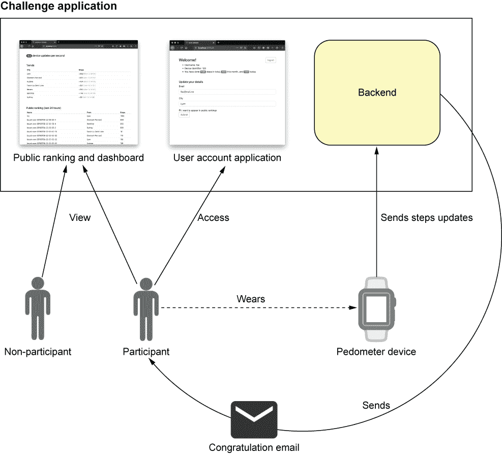

图 7.1 10k 步挑战应用程序和参与者概述

图 7.1 中描述的应用程序将按以下方式工作：

+   用户佩戴连接的计步器，以跟踪他们走了多少步。

+   计步器定期向管理挑战的应用程序发送步数更新。

+   目标是每天至少走 10,000 步，当用户这样做时，每天都会收到一封电子邮件。

+   用户可以选择在过去的 24 小时内公开列出步数排名。

+   参与者还可以连接到网络应用程序来查看他们的数据和更新他们的信息，例如他们的城市以及他们是否希望出现在公共排名中。

网络应用程序允许新用户通过提供他们的设备标识符以及一些基本信息（如他们的城市以及他们是否希望出现在公共排名中）来注册（图 7.2）。

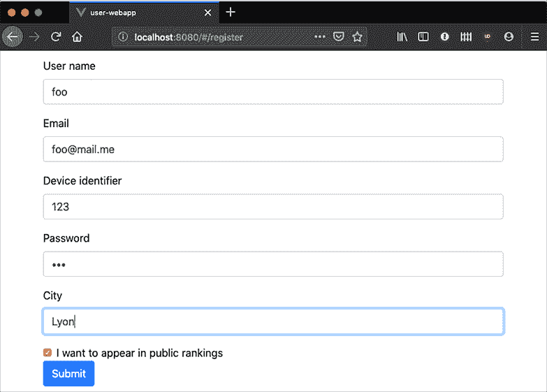

图 7.2 用户网络应用程序注册表单截图

连接后，用户可以更新一些基本详情，并提醒他们总步数、月步数和日步数（图 7.3）。

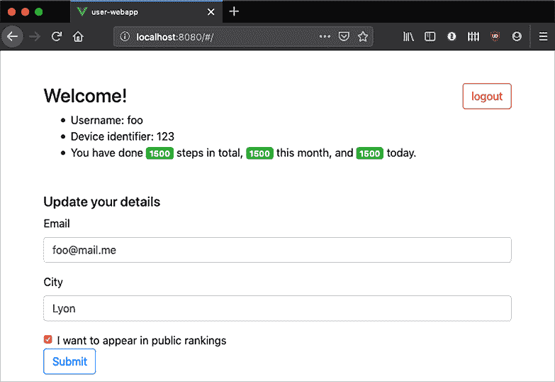

图 7.3 用户网络应用程序用户详情页截图

此外，还有一个独立的网络应用程序，提供公共仪表板（图 7.4）。


图 7.4 公共仪表板网络应用程序截图

仪表板提供了过去 24 小时内公共个人资料的排名、当前计步器设备更新吞吐量以及按城市划分的趋势。仪表板中显示的所有信息都是实时更新的。

## 7.3 一个应用程序，多种服务

应用程序被分解为一系列（微）服务，它们如图 7.5 所示相互交互。每个服务完成单一的功能目的，并且可能被另一个应用程序使用。有四个公共服务：两个面向用户的 Web 应用程序、一个用于接收计步器设备更新的服务以及一个用于公开 HTTP API 的服务。公共 API 被用户 Web 应用程序使用，同样，移动应用程序也可以连接到它。有四个内部服务：一个用于管理用户配置文件、一个用于管理活动数据、一个用于通过电子邮件祝贺用户，以及一个用于计算连续事件的各种统计数据。

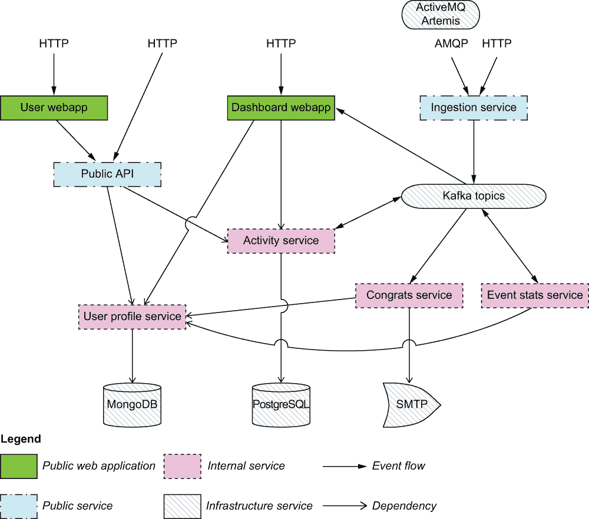

图 7.5 应用程序架构概述

注意：你可能听说过*命令查询责任分离*（CQRS）和*事件溯源*，这些是事件驱动架构中发现的模式。1 CQRS 定义了如何读取和写入信息，而事件溯源则是将应用程序状态作为一系列事实来体现。我们提出的应用架构与这两个概念都相关，但由于它并不严格符合定义，我更喜欢将其称为“事件驱动微服务架构”。

所有服务都由 Vert.x 提供支持，我们还需要一些第三方中间件，如图 7.5 中标记的“基础设施服务”。我们将使用两种不同类型的数据库：一种文档型数据库（MongoDB）和一种关系型数据库（PostgreSQL）。我们需要一个 SMTP 服务器来发送电子邮件，Apache Kafka 用于某些服务之间的事件流处理。由于摄入服务可能从 HTTP 和 AMQP 接收更新，我们还将使用 ActiveMQ Artemis 服务器。

图 7.5 中有两种类型的箭头。事件流显示了服务之间的重要事件交换。例如，摄入服务向 Kafka 发送事件，而事件统计服务既消费又生产 Kafka 事件。我还指出了依赖关系：例如，公共 API 服务依赖于用户配置文件和活动服务，而这些服务又依赖于它们自己的数据库以实现数据持久化。

我们可以通过观察设备更新如何影响仪表板 Web 应用的“城市趋势排名”，如图 7.6 所示，来展示服务之间交互的一个例子。

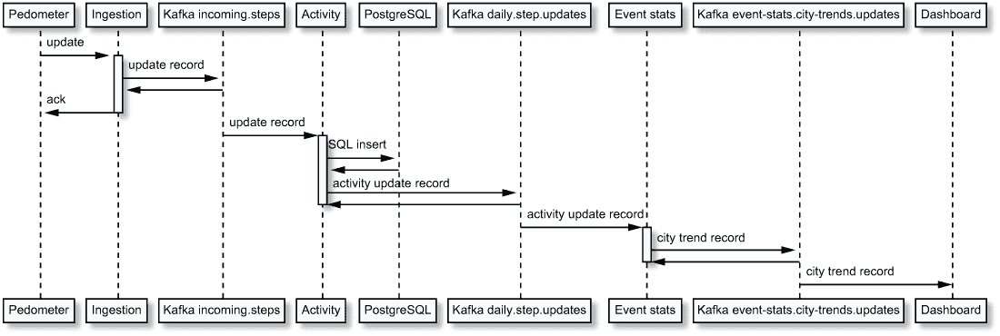

图 7.6 从设备更新到城市趋势更新

一切始于步数计向摄入服务发送更新，该服务验证更新是否包含所有所需数据。摄入服务然后将更新发送到 Kafka 主题，步数计设备得到确认，以便它知道更新已被接收并将被处理。更新将由多个在该特定 Kafka 主题上监听的消费者处理，其中之一是活动服务。该服务将数据记录到 PostgreSQL 数据库，然后向另一个 Kafka 主题发布一个记录，记录步数计当天记录的步数。此记录被事件统计服务拾取，该服务观察五个秒窗口内的更新，按城市分割它们，并汇总步数。然后，它发布一个更新，其中包含观察到的特定城市的步数增量作为另一个 Kafka 记录。然后，该记录被仪表板 Web 应用程序消费，最终向所有连接的 Web 浏览器发送更新，这些浏览器随后更新显示。

关于应用架构

当你深入研究服务的规范和实现时，你可能会发现分解有时有点人为。例如，用户配置文件和活动服务完全可以合并为一个，从而节省一些从两个服务中合并数据的请求。记住，分解是为了教学目的，并展示 Vert.x 堆栈的相关元素。

从（微）服务构建应用程序需要一些妥协，特别是当一些服务可能是预存在的，你必须按其现状处理它们，或者你有限的能力去进化它们。

你还可能会发现，提出的架构不是一个很好地分层的一个，有些服务很好地解耦，而有些其他服务对其他服务的依赖性更强。再次强调，这是出于教学目的故意为之。在大多数情况下，现实世界中的应用程序必须做出妥协，以交付可工作的软件，而不是追求架构的完美。

## 7.4 服务规范

让我们讨论应用服务的功能和技术规范。对于每个服务，我们将考虑以下要素：

+   功能概述

+   如果有的话，API 描述

+   技术要点，包括崩溃恢复

+   规模化和部署考虑因素

### 7.4.1 用户配置文件服务

用户配置文件服务管理唯一用户的配置文件数据。用户通过以下信息识别：

+   一个用户名（必须是唯一的）

+   一个密码

+   一个电子邮件地址

+   一个城市

+   步数计设备标识符（必须是唯一的）

+   用户是否希望出现在公共排名中

该服务公开一个 HTTP API，并将数据持久化在 MongoDB 数据库中（见图 7.7）。

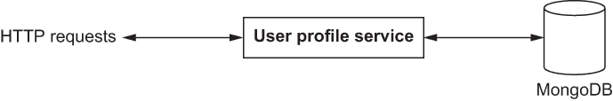

图 7.7 用户配置文件服务

此服务属于 CRUD（用于 *创建*、*读取*、*更新* 和 *删除*）服务的类别，这些服务位于数据库之上。表 7.1 识别了 HTTP API 的不同元素。

表 7.1 用户配置文件 HTTP API

| 目的 | 路径 | 方法 | 数据 | 响应 | 状态码 |
| --- | --- | --- | --- | --- | --- |
| 注册新用户 | `/register` | `POST` | 注册 JSON 文档 | N/A | 成功时返回 200，当用户名或设备标识符已存在时返回 409，技术错误时返回 500 |
| 获取用户详细信息 | `/<username>` | `GET` | N/A | JSON 格式的用户数据 | 成功时返回 200，用户名不存在时返回 404，技术错误时返回 500 |
| 更新某些用户详细信息 | `/<username>` | `PUT` | JSON 格式的用户数据 | N/A | 成功时返回 200，技术错误时返回 500 |
| 凭据验证 | `/authenticate` | `POST` | JSON 格式的凭据 | N/A | 成功时返回 200，认证失败时返回 401 |
| 通过设备查找用户 | `/owns/<deviceId>` | `GET` | N/A | 包含拥有设备用户名的 JSON 数据 | 成功时返回 200，设备不存在时返回 404，技术错误时返回 500 |

此服务不应公开暴露；它旨在由其他服务消费。没有设置认证机制。此服务旨在提供对数据库操作的伪装。服务和数据库都可以独立扩展。

注意：表 7.1 中描述的 API 不遵循 *表示状态转换*（REST）接口的架构原则。一个 *RESTful* 接口会暴露用户资源，例如 `/user/<username>`，而不是通过 `/register` 资源上的 `POST` 请求注册新用户。忠实于 REST 结构和更自由的 HTTP API 结构都是有效的选择。

### 7.4.2 数据摄取服务

数据摄取服务收集计步器设备更新，并将带有更新数据的记录转发到 Kafka 流，以便其他服务处理事件。服务从 HTTP API 或 AMQP 队列接收设备更新，如图 7.8 所示。该服务是一种 *协议适配器* 或 *调解者*，因为它将一个协议（HTTP 或 AMQP）的事件转换为另一个协议（Kafka 记录流）。

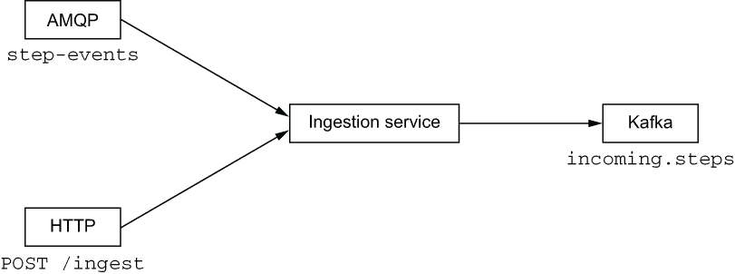

图 7.8 数据摄取服务

设备更新是一个包含以下条目的 JSON 文档：

+   设备标识符

+   一个同步标识符，它是一个单调递增的长整数，设备在每次成功同步时更新

+   自上次同步以来的步数

HTTP API 支持单个操作，如表 7.2 所示。

表 7.2 数据摄取服务 HTTP API

| 目的 | 路径 | 方法 | 数据 | 响应 | 状态码 |
| --- | --- | --- | --- | --- | --- |
| 摄入计步器更新 | `/ingest` | `POST` | JSON 文档 | N/A | 成功时返回 200，技术错误时返回 500 |

AMQP 客户端从 `step-events` 地址接收消息。HTTP API 和 AMQP 客户端中的 JSON 数据相同。

该服务旨在公开暴露，以便它可以接收计步器更新。我们假设将使用某些反向代理，提供加密和访问控制。例如，通过 HTTPS 的设备更新可以使用客户端证书检查来过滤掉未经授权或未打补丁的设备。

AMQP 和 HTTP 客户端只有在记录已写入 Kafka 后才会收到确认。在 HTTP 的情况下，这意味着设备只有在收到 HTTP 200 响应后才能认为同步成功。服务不会检查重复项，因此设备可以安全地认为摄取操作是幂等的。正如你将看到的，保持数据一致性的角色是活动服务，而不是摄取服务。

该服务可以独立于 AMQP 和 Kafka 服务器/集群进行扩展。如果服务在做出某种形式的确认之前崩溃，客户端可以安全地重试，因为操作是幂等的。

### 7.4.3 活动服务

活动服务跟踪计步器发送的步数活动更新。服务将事件存储到 PostgreSQL 数据库中，并提供 HTTP API 来收集一些统计数据，例如特定设备的每日、每月和总步数。更新来自 Kafka 主题，该主题由摄取服务提供数据（见图 7.9）。

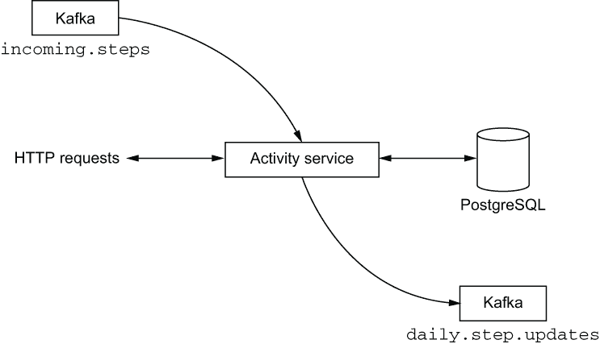

图 7.9 活动服务

活动服务还会发布关于当前日设备步数的事件。这样，其他服务可以订阅相应的 Kafka 主题并接收通知，而不是需要定期轮询活动服务以获取更新。

HTTP API 在表 7.3 中展示。

表 7.3 活动服务 HTTP API

| 目的 | 路径 | 方法 | 数据 | 响应 | 状态码 |
| --- | --- | --- | --- | --- | --- |
| 设备的总步数 | `/device id/total` | `GET` | N/A | JSON 文档 | 成功时返回 200，设备不存在时返回 404，技术错误时返回 500 |
| 特定月份设备的步数 | `/device id/year/month` | `GET` | N/A | JSON 文档 | 成功时返回 200，设备不存在时返回 404，技术错误时返回 500 |
| 特定日期设备的步数 | `/device id/year/month/day` | `GET` | N/A | JSON 文档 | 成功时返回 200，设备不存在时返回 404，技术错误时返回 500 |
| 过去 24 小时内按步数递减的设备排名 | `/ranking-last-24-hours` | `GET` | N/A | JSON 文档 | 成功时返回 200，技术错误时返回 500 |

大多数操作是对特定设备的查询。正如你将在另一章中看到的，最后一次操作提供了一个高效的查询，用于获取设备的排名，这在仪表板服务启动时非常有用。

发送到 `daily.step.updates` Kafka 主题的事件包含以下信息，在一个 JSON 文档中：

+   设备标识符

+   时间戳

+   当天记录的步数

对于每个传入的设备更新，需要按照以下顺序执行三个操作：

+   数据库插入

+   获取当前设备当天步数的数据库查询

+   Kafka 记录写入

这些操作中的每一个都可能失败，我们没有设置分布式事务代理。我们确保了幂等性和正确性，如下所示：

+   我们只在最后一个操作完成后才确认 Kafka 中的传入设备更新记录。

+   数据库模式对存储的事件施加了一些唯一性约束，因此如果事件正在再次处理，插入操作可能会失败。

+   我们将重复插入错误视为正常情况以实现幂等性，并继续执行后续步骤，直到它们全部完成。

+   成功将每日步数更新记录写入 Kafka 后，我们可以确认初始设备更新记录，系统可以继续处理其他传入的记录。

活动服务不打算公开，因此就像用户资料服务一样，没有设置身份验证。它可以独立于数据库进行扩展。

### 7.4.4 公共 API

此服务公开了一个公共 HTTP API，供其他服务消费。它本质上是对用户资料和活动服务的**门面**，如图 7.10 所示。


图 7.10 公共 API

该服务是一种**边缘服务**或**API 网关**，因为它将请求转发并组合到其他服务。由于这是一个公共 HTTP API，该服务需要对其大多数操作进行身份验证。为此，我们将使用*JSON Web Tokens* ([`tools .ietf.org/html/rfc7519`](https://tools.ietf.org/html/rfc7519))，我们将在第八章中讨论，包括服务实现。由于我们希望公共 API 可以从任何 HTTP 客户端使用，包括在网页浏览器中运行的 JavaScript 代码，我们需要支持*跨源资源共享*，或 CORS ([`fetch.spec.whatwg.org/#http-cors-protocol`](https://fetch.spec.whatwg.org/#http-cors-protocol))。我们将在适当的时候深入探讨细节。HTTP API 操作在表 7.4 中描述。

表 7.4 公共 API HTTP 接口

| 目的 | 路径 | 方法 | 数据 | 响应 | 状态码 |
| --- | --- | --- | --- | --- | --- |
| 注册新用户和设备 | `/register` | `POST` | JSON 格式的注册数据文档 | N/A | 成功时返回 200，否则返回 502 |
| 获取用于 API 的 JWT 令牌 | `/token` | `POST` | JSON 格式的凭据文档 | JWT 令牌（纯文本） | 成功时返回 200，否则返回 401 |
| 获取用户数据（需要有效的 JWT） | `/<username>` | `GET` | N/A | JSON 文档 | 成功时返回 200，未找到时返回 404，否则返回 502 |
| 更新用户数据（需要有效的 JWT） | `/<username>` | `PUT` | JSON 文档 | N/A | 成功时返回 200，未找到时返回 404，否则返回 502 |
| 用户总步数（需要有效的 JWT） | `/<username>/total` | `GET` | N/A | JSON 文档 | 成功时返回 200，未找到时返回 404，否则返回 502 |
| 用户一个月内的总步数（需要有效的 JWT） | `/<username>/<year>/<month>` | `GET` | N/A | JSON 文档 | 成功时返回 200，未找到时返回 404，其他情况返回 502 |
| 用户一天内的总步数（需要有效的 JWT） | `/<username>/<year>/<month>/<day>` | `GET` | N/A | JSON 文档 | 成功时返回 200，未找到时返回 404，其他情况返回 502 |

注意，请求路径将带有`/api/v1`前缀，因此请求令牌是向`/api/v1/token`的`POST`请求。在公共 API 的 URL 中始终有一些版本控制方案是一个好主意。JWT 令牌仅限于用于获取它的用户名，因此用户`B`不能执行，例如，向`/api/v1/A/ 2019/07/14`的请求。

公共 API 服务可以扩展到多个实例。在生产环境中，负载均衡 HTTP 代理应将请求分发到这些实例。在服务中不需要维护任何状态，因为它将请求转发和组合到其他服务。

### 7.4.5 用户 Web 应用程序

用户 Web 应用程序提供了一种方式，让用户可以注册、更新他们的详细信息，并检查一些关于他们活动的基本数据。如图 7.11 所示，有一个后端通过 HTTP 向 Web 浏览器提供 Web 应用程序的静态资源。

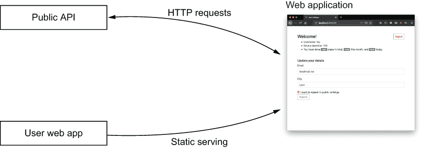

图 7.11 用户 Web 应用程序

前端是一个用 JavaScript 和 Vue.JS 框架编写的*单页应用程序*。它由用户 Web 应用程序服务提供，并且所有与应用程序后端的交互都通过调用公共 API 服务来完成。

因此，这个服务更像是 Vue.JS 应用程序而不是 Vert.x 应用程序，尽管看到 Vert.x 如何以最小的努力提供静态内容仍然很有趣。我们本可以选择其他流行的 JavaScript 框架，或者甚至完全不使用框架。我发现 Vue.JS 是一个简单而高效的选择。此外，由于 Vue.JS 拥抱*响应式惯用用法*，它使得从后端 API 到前端的应用程序完全响应。

该服务本身仅提供静态文件，因此可以扩展到多个实例，并在生产环境中放在负载均衡器后面。在服务器端也没有状态，无论是在服务中还是在使用的公共 API 中。是前端应用程序在用户的 Web 浏览器中存储一些状态。

### 7.4.6 事件统计服务

事件统计服务响应 Kafka 主题中选定的事件，生成统计数据并将它们作为 Kafka 记录发布给其他服务，如图 7.12 所示。

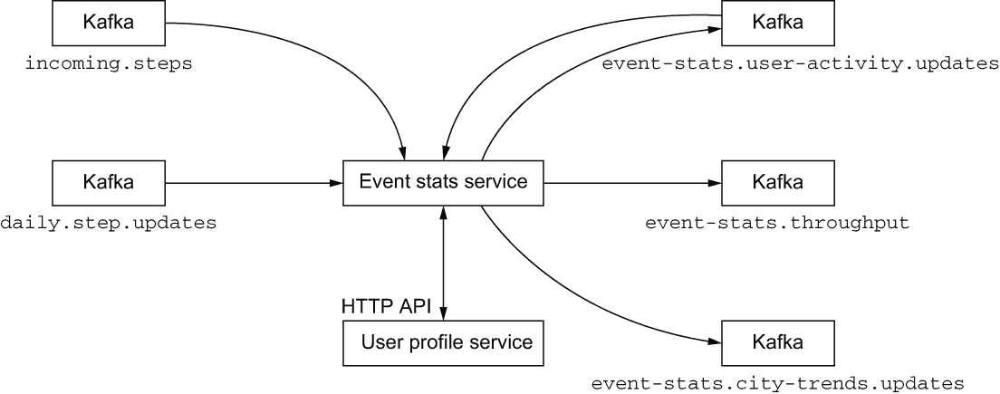

图 7.12 事件统计服务

该服务执行以下计算：

+   基于五秒的时间窗口，它根据接收到的`incoming.steps`主题上的事件数量计算设备更新的吞吐量，然后向`event-stats.throughput`主题发出记录。

+   在 `daily.step.updates` 主题上接收的事件包含来自设备当天步数的数量数据。这些数据缺少用户数据（姓名、城市等），因此对于每个事件，该服务查询用户配置文件服务以丰富原始记录的用户数据，然后将其发送到 `event-stats.user-activity.updates` 主题。

+   该服务通过处理来自 `event-stats.user-activity.updates` 主题的事件，在五秒的时间窗口内计算城市趋势，并为每个城市将其聚合的步数更新发布到 `event-stats.city-trends.updates` 主题。

Kafka 记录可以自动批量确认，因为再次处理记录几乎没有损害，尤其是对于吞吐量和城市趋势计算。为了确保活动更新恰好产生一个记录，可以进行手动确认，尽管偶尔的重复记录不应影响消费服务。

事件统计服务并不打算公开，它不提供任何接口供其他服务使用。最后，由于计算的性质，该服务应作为单个实例部署。

### 7.4.7 庆祝服务

庆祝服务的角色是监控设备在一天内达到至少 10,000 步的情况，然后向所有者发送祝贺电子邮件，如图 7.13 所示。

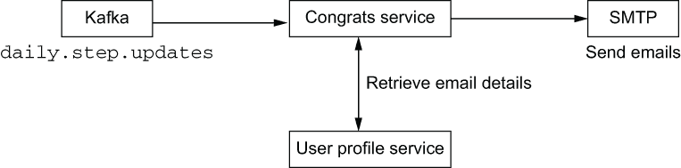

图 7.13 庆祝服务

该服务调用用户配置文件服务以获取与设备关联的用户的电子邮件，然后它联系 SMTP 服务器发送电子邮件。

注意，我们可以重用由事件统计服务提供数据的 `event-stats.user-activity.updates` Kafka 主题，因为它丰富了从 `daily.step.updates` 收到的消息，包括电子邮件地址。这两个主题的 Kafka 记录键的生产实现细节使得使用 `daily.step.updates` 中的记录，然后从用户配置文件服务获取电子邮件，来确保每天最多向用户发送一条消息变得简单。这也不会增加太多的网络和处理开销，因为用户只需在给定的一天内至少收到一条包含至少 10,000 步的活动更新电子邮件。

此服务不应公开，也不暴露任何 API。在生产环境中，单个实例应该足够，但该服务可以被扩展到多个实例，它们共享相同的 Kafka 消费者组，以便它们可以在彼此之间分配工作负载。

### 7.4.8 仪表板 Web 应用程序

仪表板 Web 应用程序提供有关传入更新吞吐量、城市趋势和公共用户排名的实时更新。如图 7.14 所见，该服务消费事件统计服务发出的 Kafka 记录，并定期将更新推送到 Web 应用程序。

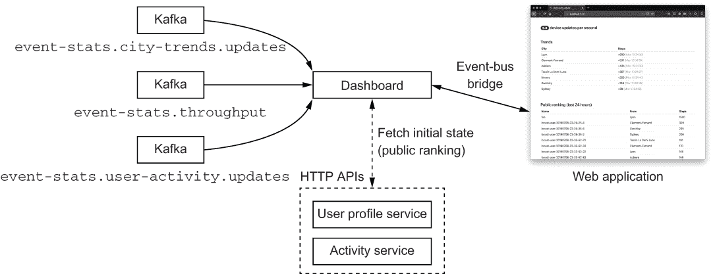

图 7.14 仪表板 Web 应用程序

Web 应用程序使用 Vue.JS 框架编写，就像之前描述的用户 Web 应用程序一样。前端和后端使用 Vert.x 事件总线连接，因此 Vert.x 和 Vue.JS 代码库可以使用相同的编程模型进行通信。

来自 Kafka 主题的吞吐量和城市趋势更新直接转发到 Vert.x 事件总线，因此连接的 Web 应用程序客户端可以实时接收更新。后端维护有关过去 24 小时内所有已公开其配置文件的用户步数的内存数据。排名每 5 秒更新一次，结果通过事件总线推送到 Web 应用程序，以便在连接的 Web 浏览器中更新排名。

由于后端是通过 Kafka 主题事件驱动的，一个很好的问题是当服务启动时（或从崩溃中恢复时）会发生什么。确实，在全新启动时，我们没有过去 24 小时的步数数据，我们只会从服务的启动时间接收更新。

当服务启动时，我们需要一个*水合*阶段，在这个阶段中，我们查询活动服务并获取过去 24 小时的排名。然后我们需要查询用户配置文件服务以获取排名中的每个条目，因为我们需要将每个设备与一个用户配置文件关联起来。这是一个可能代价高昂的操作，但这种情况不应该经常发生。

注意，等待水合完成并不会阻止处理用户活动更新，因为最终在更新内存数据时，只有来自 Kafka 记录或水合数据的最新值才会生效。

仪表板 Web 应用程序服务旨在公开暴露。如果需要，它可以扩展到多个实例，并且可以放在 HTTP 代理负载均衡器后面。

## 7.5 运行应用程序

要运行应用程序，您需要运行所有基础设施服务和所有微服务。应用程序的完整源代码可以在源代码仓库的 part2-steps-challenge 文件夹中找到。

首先，必须在您的机器上安装 Docker，因为构建应用程序需要在执行测试套件时启动容器。可以使用`gradle assemble`命令使用 Gradle 构建应用程序，或者如果您还想在构建过程中运行测试并且 Docker 正在运行，可以使用`gradle build`。

一旦构建了应用程序服务，您将需要运行所有基础设施服务，如 PostgreSQL、MongoDB、Apache Kafka 等。您可以通过从 Docker 容器运行它们来极大地简化任务。为此，`docker-compose.yml` 文件描述了要使用 Docker Compose 运行的几个容器，Docker Compose 是一个简单有效的工具，可以同时管理多个容器。运行 `docker-compose up` 将启动所有容器，而 `docker-compose down` 将停止并删除它们。您还可以在运行 Docker Compose 的终端中按 `Ctrl+C`，它将停止容器（但不会删除它们，因此可以再次以当前状态启动）。

提示：在 macOS 和 Windows 上，我建议安装 Docker Desktop。大多数 Linux 发行版都提供 Docker 作为软件包。请注意，`docker` 需要以 `root` 用户身份运行，因此在 Linux 上您可能需要将您的用户添加到特殊组中，以避免使用 `sudo`。官方 Docker 文档提供了故障排除说明（[`docs.docker.com/engine/install/linux-postinstall/`](https://docs.docker.com/engine/install/linux-postinstall/)）。在所有情况下，请确保您可以作为用户成功运行 `docker run hello-world` 命令。

我们需要运行的容器镜像如下：

+   MongoDB 配有初始化脚本以准备集合和索引

+   PostgreSQL 配有初始化脚本以创建模式

+   来自 Strimzi 项目的 Apache Kafka 和 Apache ZooKeeper 镜像（见 [`strimzi.io`](https://strimzi.io)）

+   ActiveMQ Artemis

+   MailHog，一个适合集成测试的 SMTP 服务器（[`github.com/mailhog/MailHog`](https://github.com/mailhog/MailHog)）

所有微服务都打包为自包含的可执行 JAR 文件。例如，您可以按以下方式运行活动服务：

```
$ java -jar activity-service/build/libs/activity-service-all.jar
```

话虽如此，手动启动所有服务并不方便，因此项目还包含一个 `Procfile` 文件来运行所有服务。该文件包含服务名称和相关 shell 命令的行。您可以使用 Foreman 工具来运行服务（[`github.com/ddollar/foreman`](https://github.com/ddollar/foreman)）或兼容的工具，如 Hivemind（[`github.com/DarthSim/hivemind`](https://github.com/DarthSim/hivemind)）：

```
$ foreman start
```

这非常方便，因为您可以从两个终端窗口运行所有服务，如图 7.15 所示。

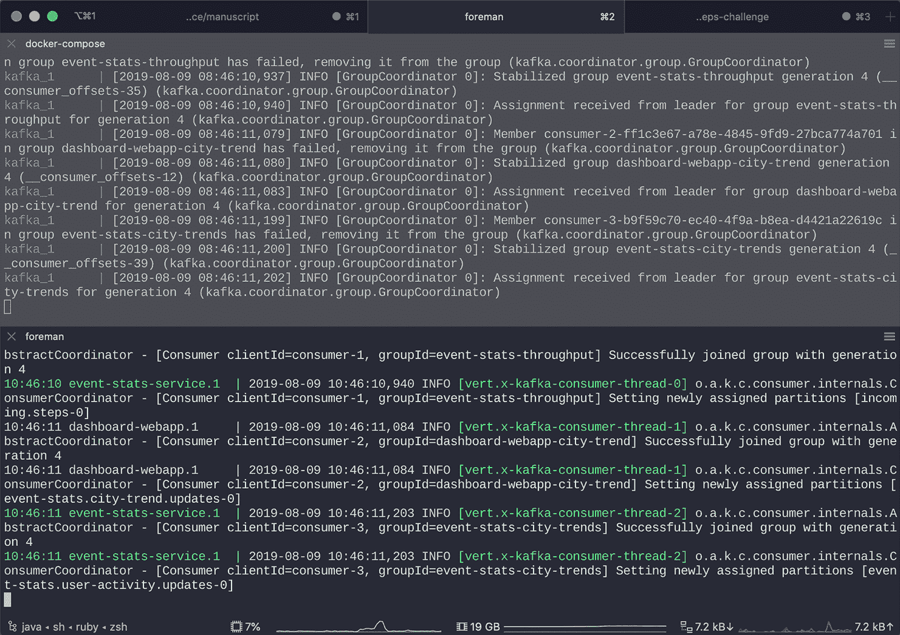

图 7.15 使用 Docker Compose 和 Foreman 运行微服务和基础设施服务

Foreman 还可以从 Procfile 生成各种系统服务描述符：initab、launchd、systemd 等。最后，Foreman 是用 Ruby 编写的，但在项目页面上还列出了其他语言的端口。

提示：Foreman 简化了运行所有服务的过程，但您不必使用它。您可以在命令行上单独运行每个服务。Procfile 的内容将显示每个服务的确切命令。

4. 下一章将通过构建一组（不完美！）覆盖 Web、API、消息、数据和连续流处理主题的微服务来阐述实现响应式应用的挑战。在下一章中，我们将探讨用于实现本章描述的一些服务的 Web 堆栈。

## 3. 摘要

+   6. 响应式应用专注于在各种工作负载和存在其他服务故障的情况下控制延迟。

+   2. 一个响应式应用可以被分解为一系列独立扩展的事件驱动微服务。

5. ***

1. 对于介绍，请参阅马丁·福勒关于 CQRS([`martinfowler.com/bliki/CQRS.html`](https://martinfowler.com/bliki/CQRS.html))和事件溯源([`martinfowler.com/eaaDev/EventSourcing.html`](https://martinfowler.com/eaaDev/EventSourcing.html))的文章。
