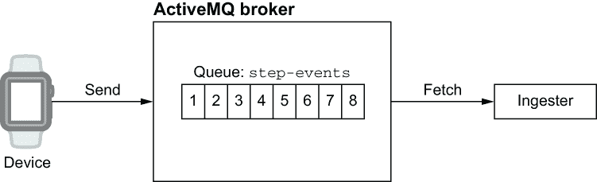
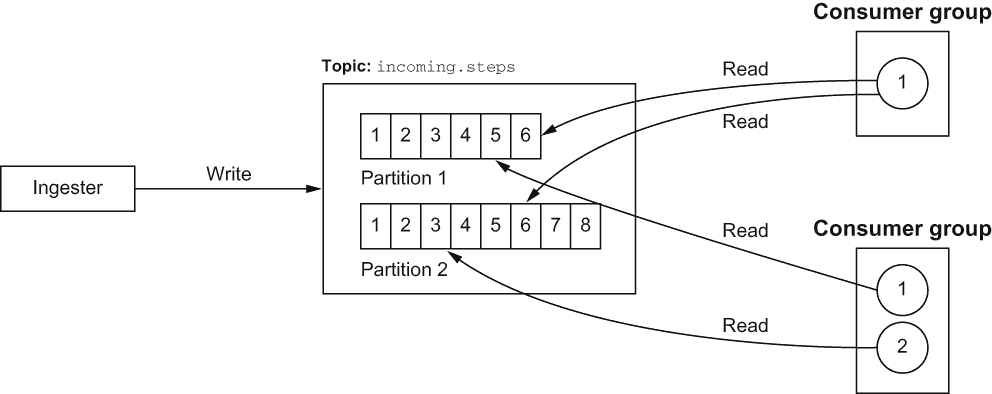
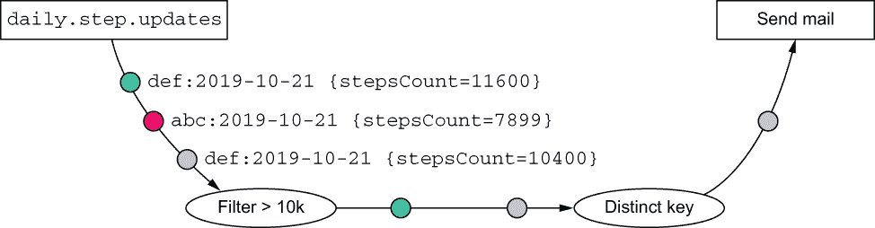
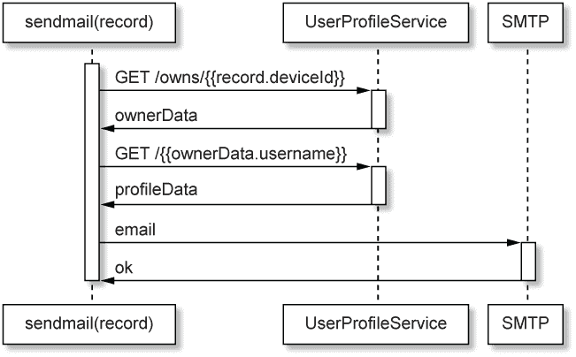
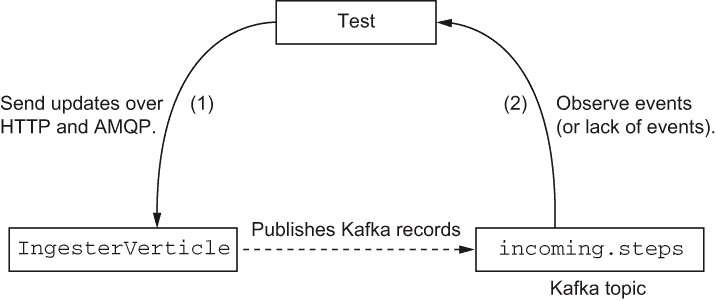
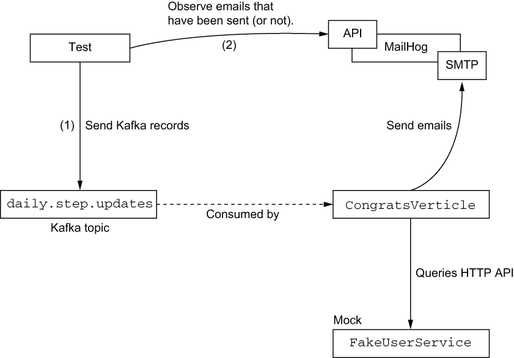

# 9 使用 Vert.x 进行消息和事件流

本章涵盖

+   使用 AMQP 进行消息传递

+   使用 Apache Kafka 进行事件流

+   发送电子邮件

+   使用消息和事件流中间件进行集成测试

反应式应用程序非常适合消息和事件流技术。到目前为止，我们主要关注的是暴露 HTTP API 的服务。但尽管 HTTP 是与服务交互的灵活和有效的协议，它不应该是唯一的选择。

使用消息和事件流集成 Vert.x 基于的服务有几种选择。本章介绍了 AMQP 消息代理和 Apache Kafka。我们还将讨论使用 SMTP 服务器发送电子邮件。

在本章中，我们将深入了解 ingester 和祝贺服务的实现。ingester 通过 HTTP 和 AMQP 从设备接收步骤更新，并将它们作为 Kafka 事件转发到系统中。祝贺服务监听特定的 Kafka 事件，以确定用户是否在一天内达到了 10,000 步，并发送祝贺电子邮件。

## 9.1 使用 Vert.x 超越 HTTP 的事件驱动服务

HTTP 是作为事件驱动服务的网络接口的明智选择，尤其是当服务提供 API 时。消息和事件流中间件为解耦和集成服务提供了有用的工具。它们通常比 HTTP 更适合在服务之间交换大量事件。

### 9.1.1 Vert.x 提供的内容

Vert.x 提供了消息代理、与 Apache Kafka 的事件流以及用于事件总线的通用 TCP 协议的客户端。

消息代理

消息中间件在服务到服务的通信中可能比 HTTP 更有效，具有更好的吞吐量，并且当消费者或生产者服务暂时不可用时，还可以提供持久性保证。Vert.x 提供了几个模块来进行与消息中间件的集成工作：

+   一个 *高级消息队列协议* (AMQP) 客户端

+   一个 *简单文本导向的消息协议* (STOMP) 客户端

+   一个 RabbitMQ 客户端

+   一个 *消息队列遥测传输* (MQTT) 客户端

AMQP 是消息中间件的标准协议，由 Apache ActiveMQ、JBoss A-MQ、Windows Azure Service Bus、RabbitMQ 等大量代理实现。Vert.x 为 RabbitMQ 和其扩展提供了一个专门的客户端。请注意，也可以使用 Vert.x AMQP 客户端与 RabbitMQ 一起使用，因为它除了 RabbitMQ 特定的服务器外，还公开了一个 AMQP 服务器。

STOMP 是一种基于文本的消息中间件协议。它的功能比 AMQP 少，但对于简单的消息传递可能已经足够。它得到了流行消息代理的支持。

MQTT 是一种为机器到机器的发布/订阅交互设计的协议。它因为使用低带宽而在嵌入式/物联网设备中非常流行。

Kafka 事件流

Vert.x 提供了对 Apache Kafka 的支持，它是事件流中间件的流行实现。

初看起来，事件流中间件类似于消息系统，但它允许有趣的架构模式，因为不同的服务可以以自己的节奏消费相同的事件集。消息代理支持发布/订阅机制，使多个服务能够消费相同的事件，但事件流中间件也有随意回放事件的能力。回滚事件流是一个独特的功能。事件流中间件还允许在不影响其他服务的情况下，将新服务插入到处理管道中。

您可以使用事件流中间件就像消息中间件一样，但它不仅仅是服务之间传递事件。

事件总线 TCP 适配器

最后但同样重要的是，Vert.x 通过简单的 TCP 协议提供事件总线适配器，支持 JavaScript、Go、C#、C 和 Python 的绑定。这使我们能够使用事件总线与非 Java 应用程序进行连接。本书中不会介绍此事件总线适配器，但您可以从官方 Vert.x 文档中轻松学习如何使用它。从 Vert.x 的角度来看，这实际上只是事件总线，只不过某些事件可以在 JVM 之外产生和消费。

### 9.1.2 我们将使用的中间件和服务

10k 步挑战应用程序使我们能够探索用于消息传递的 AMQP，用于事件流处理的 Kafka，以及通过 SMTP 服务器发送电子邮件：

+   摄取服务使用 AMQP，因为它通过 HTTP 或 AMQP 接收计步器设备更新。

+   Kafka 用于在应用程序的许多服务之间传递事件。

+   SMTP 用于向用户发送祝贺邮件。

如前一章所述，Docker Compose 可以用于启动本地开发所需的中间件服务：Apache Kafka（它还需要 Apache ZooKeeper）、Apache ActiveMQ Artemis 和 MailHog（一个友好的 SMTP 服务器测试）。当然，如果您想的话，您可以自己安装和运行每个服务，但使用 Docker 启动可丢弃的容器可以提供简化的开发体验。

在 Vert.x 方面，我们将使用以下模块来构建我们的服务：

+   `vertx-amqp-client`--AMQP 客户端

+   `vertx-kafka-client`--Apache Kafka 客户端

+   `vertx-mail-client`--将发送电子邮件的 SMTP 客户端

### 9.1.3 什么是 AMQP（以及消息代理）？

*高级消息队列协议*（AMQP）是一个广泛使用的网络协议，用于支持开放规范的消息中间件。该协议本身是二进制的，基于 TCP，并支持身份验证和加密。在项目中，我们将使用 Apache ActiveMQ，它支持 AMQP。

消息代理是服务集成的一种经典形式，因为它们通常支持消息队列和发布/订阅通信。它们允许服务通过消息传递进行通信，并且代理确保消息的持久性。

图 9.1 展示了设备、收集步数事件的 AMQP 队列和摄取服务之间的交互。



图 9.1 AMQP 队列概述

消息可以被设置为 *持久化*，这样即使代理崩溃也不会丢失。生产者和消费者可以使用确认来确保消息已被正确发送或检索并处理。代理还提供各种服务质量特性，例如过期日期和高级路由。根据代理的不同，消息可以从一种表示形式转换为另一种表示形式，例如从二进制格式转换为 JSON。一些代理还支持将多个消息聚合到一个消息中，或者相反，将一个消息分割成多个。

注意：如果您是 ActiveMQ 的初学者，我建议阅读 Bruce Snyder、Dejan Bosanac 和 Rob Davies 所著的 *ActiveMQ in Action*（Manning，2011 年）。

### 9.1.4 什么是 Kafka？

Apache Kafka 是基于分布式日志的事件流中间件。虽然这可能听起来很复杂，但您真正需要理解的是 Kafka 提供事件记录流，其中生产者可以追加新记录，消费者可以在流中前后移动。例如，来自计步器的步数更新形成了一个流，其中每个事件都是设备发送的更新，而摄入服务生成这些事件。另一方面，各种消费者可以查看该流上的事件，以填充数据库、计算统计数据等。事件在一段时间内保持流状态，或者直到流太大而必须丢弃其最旧的记录。

Kafka 支持分布式服务之间的发布/订阅交互，如图 9.2 所示。在 Kafka 集群中，事件从 *topics* 中 *发布* 和 *消费*，这些 topics 将相关事件分组。topics 被分割成 *复制分区*，它们是有序的事件序列。每个事件通过其在事件日志中的 *偏移量* 位置来标识，该位置实现了其分区。



图 9.2 Kafka 主题概述

消费者从分区中拉取事件。它们可以跟踪最后消费的偏移量，但也可以任意地定位到分区中的任何随机位置，甚至可以重放从开始以来的所有事件。此外，*消费者组*可以通过从不同的分区读取和并行处理事件来分担工作。

容易想到 Kafka 是一个像 ActiveMQ 一样的 *消息* 系统，在某些情况下 Kafka 确实是一个非常优秀的消息中间件，但它仍然应该被视为 *流* 中间件。

在消息代理中，当消息从队列中消费或过期时，消息会消失。Kafka 分区最终会驱逐记录，要么使用分区大小限制（例如 2 GB），要么使用某些驱逐延迟（例如两周）。Kafka 记录应被视为“半持久”，因为它们最终会消失。可以配置主题中的分区以永久保留事件，但这相当罕见，因为预期事件在消费时会产生持久效果。例如，接收服务生成传入的步数更新记录，活动服务将这些记录转换为数据库中的长期事实。Kafka 的另一个有趣特性是，可以随意重放主题，因此新服务可以以自己的节奏加入并消费流。

注意：如果您是 Apache Kafka 的新手，建议阅读 Dylan Scott 的《Kafka in Action》（Manning，2017）。

让我们现在深入了解接收服务。

## 9.2 通过 HTTP 和 AMQP 可靠地接收消息

一切都从接收服务开始，因为它接收计步器的步数更新。在我们的（虚构的）应用中，我们可以预期会有多种类型的计步器可用，并且它们具有不同的通信能力。例如，一些设备可以直接通过互联网与接收服务通信，而其他设备可能需要连接到一个网关，该网关将更新转发到接收服务。

正因如此，我们提供了两个接口来接收设备更新：

+   设备可以连接到接收服务提供的 HTTP API。

+   设备可以将更新转发到消息代理，接收服务从代理接收更新。

一旦收到更新，就必须对其进行验证，然后发送到 Kafka 主题。探索 AMQP 和 HTTP 接口都很有趣，因为我们可以在它们的实现中看到相似之处，同时也能看到在确认设备更新方面的差异。

### 9.2.1 从 AMQP 接收

我们将从 AMQP 接收开始。我们首先需要创建一个连接到代理的 AMQP 客户端。以下列表显示了客户端配置代码。

列表 9.1 AMQP 客户端配置

```
private AmqpClientOptions amqpConfig() {
  return new AmqpClientOptions()
    .setHost("localhost")
    .setPort(5672)
    .setUsername("artemis")                    ❶
    .setPassword("simetraehcapa");
}
// (...)

AmqpClientOptions amqpOptions = amqpConfig();
AmqpReceiverOptions receiverOptions = new AmqpReceiverOptions()
  .setAutoAcknowledgement(false)               ❷
  .setDurable(true);                           ❸
```

❶ 凭证是 Docker 镜像中的默认凭证。

❷ 我们将手动确认传入的消息。

❸ 我们希望使用持久消息。

我们在这里使用的 `amqpConfig` 方法提供了一个具有硬编码值的配置。这对于我们在本书中进行的测试来说很棒，但当然，对于生产环境，您需要从外部来源解决凭证、主机名和端口号。这些可以是环境变量或注册服务，例如 Apache ZooKeeper 或 Consul。我们还设置了持久消息的连接，并声明了手动确认，因为我们希望在写入 Kafka 主题失败时重试消息处理。

下一步是设置用于传入 AMQP 消息的事件处理管道。我们使用 RxJava 将消息调度到处理函数，记录错误并从错误中恢复，如下面的列表所示。

列表 9.2 AMQP 事件处理管道

```
AmqpClient.create(vertx, amqpOptions)                                      ❶
  .rxConnect()
  .flatMap(conn -> conn.rxCreateReceiver("step-events", receiverOptions))  ❷
  .flatMapPublisher(AmqpReceiver::toFlowable)                              ❸
  .doOnError(this::logAmqpError)                                           ❹
  .retryWhen(this::retryLater)                                             ❺
  .subscribe(this::handleAmqpMessage);                                     ❻
```

❶ 创建一个 AMQP 客户端。

❷ 从步骤事件目的地创建一个消息接收器。

❸ 创建一个 AMQP 消息的 `Flowable`。

❹ 错误记录

❺ 重试逻辑

❻ 分发传入消息的订阅

这个管道很有趣，因为它完全是声明式的。它从创建客户端开始，然后获取 `step-events` 持久队列的接收器和消息流。从那里我们声明在接收到消息或错误时要做什么。我们还通过使用 Java 方法引用而不是 lambda 表达式来保持代码简短和干净。但 `logAmqpError`、`retryLater` 和 `handleAmqpMessage` 方法具体做什么呢？

记录消息并不复杂。

列表 9.3 记录 AMQP 错误

```
private void logAmqpError(Throwable err) {
  logger.error("Woops AMQP", err);           ❶
}
```

❶ 记录错误和堆栈跟踪。

错误是会发生的。例如，我们可能会失去与 AMQP 代理的连接。在这种情况下，错误会沿着管道传递，`logAmqpError` 会记录它，但 `doOnError` 允许错误传播给订阅者。

然后，我们需要重新连接到 AMQP 代理并继续接收事件，这在 RxJava 中相当于重新订阅源。我们可以使用 `retryWhen` 操作符来实现，因为它允许我们定义自己的策略。如果你只想重试几次，甚至总是重试，那么 `retry` 就更简单。下面的列表显示了我们在重新订阅之前引入了 10 秒的延迟。

列表 9.4 使用延迟重新订阅从错误中恢复

```
private Flowable<Throwable> retryLater(Flowable<Throwable> errs) {
  return errs.delay(10, TimeUnit.SECONDS, RxHelper.scheduler(vertx));   ❶
}
```

❶ 使用调度器参数在 Vert.x 事件循环上处理事件是很重要的。

`retryLater` 操作符的工作方式如下：

+   它接受一个错误 `Flowable` 作为输入，因为我们处于 AMQP 消息的 `Flowable` 中。

+   它返回一个 `Flowable` 的 *任何东西*，其中

    +   发出 `onComplete` 或 `onError` 不会触发重新订阅。

    +   发出 `onNext`（无论值是什么）都会触发重新订阅。

为了延迟重新订阅 10 秒，我们使用 `delay` 操作符。它最终会发出一个值，因此 `onNext` 会被调用，并发生重新订阅。当然，你可以考虑更复杂的处理程序，比如限制重试次数或使用指数退避策略。我们将大量使用这种模式，因为它极大地简化了错误恢复逻辑。

### 9.2.2 将 AMQP 消息转换为 Kafka 记录

下面的列表包含处理传入 AMQP 消息、验证它们并将它们作为 Kafka 记录推送的方法。

列表 9.5 处理 AMQP 消息

```
private void handleAmqpMessage(AmqpMessage message) {
  if (!"application/json".equals(message.contentType()) || 
  ➥ invalidIngestedJson(message.bodyAsJsonObject())) {                     ❶
    logger.error("Invalid AMQP message (discarded): {}", 
    ➥ message.bodyAsBinary());
    message.accepted();
    return;
  }
  JsonObject payload = message.bodyAsJsonObject();
  KafkaProducerRecord<String, JsonObject> record = makeKafkaRecord(payload);❷
  updateProducer.rxSend(record).subscribe(
    ok -> message.accepted(),                                               ❸
    err -> {
      logger.error("AMQP ingestion failed", err);
      message.rejected();                                                   ❹
    });
}
```

❶ 检查有效的 JSON 消息。

❷ 准备 Kafka 记录。

❸ 确认 AMQP 消息。

❹ 拒绝 AMQP 消息。

`handleAmqpMessage`方法首先对传入的 AMQP 消息进行一些验证，然后准备一个 Kafka 记录。当 Kafka 记录被写入时，AMQP 消息被确认，如果记录无法写入，则被拒绝。

提示：在列表 9.5 及其后续服务中，我们将直接处理`JsonObject`数据表示。鉴于我们主要复制和转换数据，将 JSON 表示转换为 Java 域类（如`IngestionData`类）几乎没有意义。当然，如果您必须执行一些更复杂的业务逻辑，并且抽象的成本是合理的，您当然可以执行此类映射。

`invalidIngestedJson`方法检查 JSON 数据是否包含所有必需条目，如下所示。

列表 9.6 检查有效 JSON 数据

```
private boolean invalidIngestedJson(JsonObject payload) {
  return !payload.containsKey("deviceId") ||                ❶
    !payload.containsKey("deviceSync") ||
    !payload.containsKey("stepsCount");
}
```

❶ 检查 JSON 条目

下一个列表中的`makeKafkaRecord`方法将 AMQP 消息的 JSON 转换为针对`incoming-steps`主题的 Kafka 记录。

列表 9.7 准备 Kafka 记录

```
private KafkaProducerRecord<String, JsonObject> makeKafkaRecord(JsonObject 
➥ payload) {
  String deviceId = payload.getString("deviceId");
  JsonObject recordData = new JsonObject()                                  ❶
    .put("deviceId", deviceId)
    .put("deviceSync", payload.getLong("deviceSync"))
    .put("stepsCount", payload.getInteger("stepsCount"));
  return KafkaProducerRecord.create("incoming.steps", deviceId, recordData);❷
}
```

❶ 我们复制 JSON 数据。

❷ 包含 deviceId 键和 JSON 数据的记录

我们可以避免手动复制所有 JSON 条目，只需将 AMQP 消息中的 JSON 传递到 Kafka 记录中。然而，这有助于确保没有额外数据最终出现在 Kafka 记录中。

`updateProducer`字段的数据类型为`KafkaProducer<String, JsonObject>`，因为它使用字符串键和 JSON 有效负载来生成消息。通过以下方式传递来自`Map`的配置来创建`KafkaProducer`实例。

列表 9.8 配置 Kafka 生产者

```
Map<String, String> kafkaConfig() {
  Map<String, String> config = new HashMap<>();
  config.put("bootstrap.servers", "localhost:9092");
  config.put("key.serializer", 
  ➥ "org.apache.kafka.common.serialization.StringSerializer");      ❶
  config.put("value.serializer", 
  ➥ "io.vertx.kafka.client.serialization.JsonObjectSerializer");    ❷
  config.put("acks", "1");
  return config;
}
// (...)

// in rxStart()
updateProducer = KafkaProducer.create(vertx, kafkaConfig());         ❸
```

❶ 用于从字符串序列化值的类

❷ 用于从 Vert.x JsonObject 序列化值的类

❸ 创建一个 Vert.x Kafka 生产者。

配置特别指定了*序列化器*（或*反序列化器*）类，因为 Kafka 记录需要映射到 Java 类型。`StringSerializer`来自 Kafka 客户端库，它将 Java 字符串序列化为 Kafka 数据，而`JsonObjectSerializer`来自 Vert.x，它序列化`JsonObject`数据。您需要为您的键和值指定正确的序列化器类。类似地，当从 Kafka 主题读取时，您还需要配置反序列化器。

提示：Vert.x Kafka 模块封装了 Apache Kafka 项目的 Java 客户端，所有配置键/值对都与 Kafka Java 客户端文档中的匹配。

### 9.2.3 从 HTTP 摄取

从 HTTP 摄取的代码与使用 AMQP 摄取的代码非常相似。最显著的区别是需要设置 HTTP 状态码，以便发送更新的设备知道摄取已失败，必须稍后重试。

我们首先需要一个 HTTP 服务器和路由器。

列表 9.9 HTTP 服务器用于摄取

```
Router router = Router.router(vertx);
router.post().handler(BodyHandler.create());        ❶
router.post("/ingest").handler(this::httpIngest);

return vertx.createHttpServer()
  .requestHandler(router)
  .rxListen(HTTP_PORT)
  .ignoreElement();
```

❶ BodyHandler 解码 HTTP 请求体。

下一个列表显示了`httpIngest`方法，它与`handleAmqpMessage`非常相似。

列表 9.10 从 HTTP 摄取更新

```
private void httpIngest(RoutingContext ctx) {
  JsonObject payload = ctx.getBodyAsJson();
  if (invalidIngestedJson(payload)) {                                    ❶
    logger.error("Invalid HTTP JSON (discarded): {}", payload.encode());
    ctx.fail(400);                                                       ❷
    return;
  }
  KafkaProducerRecord<String, JsonObject> record = makeKafkaRecord(payload);
  updateProducer.rxSend(record).subscribe(
    ok -> ctx.response().end(),                                          ❸
    err -> {
      logger.error("HTTP ingestion failed", err);
      ctx.fail(500);                                                     ❹
    });
}
```

❶ 检查 JSON 条目。

❷ 坏 JSON；让请求者知道这一点。

❸ 成功摄取

❹ 摄取失败；让请求者知道这一点。

HTTP 状态码对于让客户端知道负载是否不正确（400），摄入是否由于某些（暂时性）错误而失败（500），或者摄入是否成功（200）非常重要。

摄入服务是使用不同输入协议进行集成的一个很好的例子。现在让我们通过祝贺服务来探索更多 Apache Kafka 与 Vert.x 的集成。

## 9.3 发送祝贺邮件

当摄入服务 *生产* Kafka 事件时，祝贺服务 *消费* Kafka 事件。

活动服务在收到设备更新时生成每日步数事件。每个事件包含当天为原始设备记录的步数。祝贺服务可以观察这些事件，当它们发送到 `daily.step.updates` Kafka 主题时，并且它可以针对步数超过 10,000 的事件。

### 9.3.1 监听每日步数更新事件

发送到 `daily.step.updates` Kafka 主题的事件是包含以下内容的 JSON 数据：

+   `deviceId` 是设备标识符。

+   `timestamp` 是事件在活动服务中被生产时的戳记。

+   `stepsCount` 是当天的步数。

Kafka 记录还有一个键，它是几个参数的连接：`deviceId:year-month-day`。在这个方案中，2019 年 10 月 6 日生产的设备 `1a2b` 的所有记录都有键 `1a2b:2019-10-06`。正如你很快就会看到的，键不仅有助于确保给定设备的事件按顺序消费，而且还有助于确保我们每天不会发送超过一封祝贺邮件。

处理每日步数事件的管道如图 9.3 所示。



图 9.3 从每日步数到祝贺邮件的管道

每日步数更新从 `daily.step.updates` Kafka 主题流出来，然后

1.  我们丢弃步数少于 10,000 的事件。

1.  我们丢弃已经处理过相同键的事件。

1.  我们发送邮件。

以下列表包含相应的 RxJava 管道。

列表 9.11 接收和处理每日步数更新的 Kafka RxJava 管道

```
KafkaConsumer.<String, JsonObject>create(vertx, 
➥ KafkaConfig.consumerConfig("congrats-service"))
  .subscribe("daily.step.updates")                            ❶
  .toFlowable()
  .filter(this::above10k)                                     ❷
  .distinct(KafkaConsumerRecord::key)                         ❸
  .flatMapSingle(this::sendmail)                              ❹
  .doOnError(err -> logger.error("Woops", err))
  .retryWhen(this::retryLater)                                ❺
  .subscribe(mailResult -> logger.info("Congratulated {}", 
➥ mailResult.getRecipients()));                              ❻
```

❶ 订阅 Kafka 主题。

❷ 过滤掉步数少于 10,000 的事件。

❸ 丢弃已经处理过相同键的先前事件。

❹ 异步操作发送邮件

❺ 错误时重试。

❻ 记录每次成功的祝贺。

前面的列表使用 RxJava 绑定将 Kafka 主题订阅为 `Flowable` Kafka 记录。然后我们使用 `filter` 组合器过滤掉步数少于 10,000 的记录，并使用以下列表中的断言方法。

列表 9.12 至少有 10,000 步事件的断言

```
private boolean above10k(KafkaConsumerRecord<String, JsonObject> record) {
  return record.value().getInteger("stepsCount") >= 10_000;                ❶
}
```

❶ 对 JSON 数据进行断言。

列表 9.11 中的 `distinct` 组合器确保在 `filter` 之后仅保留每个 Kafka 记录键的一个事件，这是为了避免在给定的一天向用户发送超过一封祝贺邮件，因为我们很容易有一个包含 10,100 步的第一事件，随后又有一个包含 10,600 步的另一个事件，等等。请注意，这种设计并非 100% 无懈可击，因为它需要在内存中存储已处理的键值，并且在服务重启时可能会意外地发送第二封电子邮件。与仅为了跟踪用户最后一次收到电子邮件的时间而使用持久数据存储相比，在我们的示例中这是一个合理的权衡。

管道中的其余部分使用类似的事件处理和 `retryWhen` 逻辑来在错误发生时重新订阅。`sendmail` 方法是一个发送电子邮件的异步操作——让我们看看它是如何工作的。

### 9.3.2 发送电子邮件

`vertx-mail-client` 模块提供了一个 SMTP 客户端。以下列表显示了如何创建这样的客户端。

列表 9.13 创建 SMTP 客户端

```
MailClient mailClient = MailClient.createShared(vertx, MailerConfig.config());❶
```

❶ 创建一个共享实例

与许多其他 Vert.x 客户端一样，我们通过工厂方法获取一个实例，传递一个 `Vertx` 上下文以及一些参数。

`MailerConfig` 类提供了一个方法来检索配置数据，如下所示。

列表 9.14 邮件客户端配置

```
class MailerConfig {
  static MailConfig config() {
    return new MailConfig()
      .setHostname("localhost")    ❶
      .setPort(1025);              ❷
  }
}
```

❶ 服务器主机

❷ 服务器端口

再次，这些硬编码的值对于测试目的和保持我们的代码简单是合适的。这些值是用于连接到 MailHog，即我们从 Docker 容器中使用的测试 SMTP 服务器。`MailConfig` 类支持更多的配置选项，如 SSL、认证方法、凭证等。

每日步骤更新 Kafka 事件适用于一个设备；它不包含所有者名称或电子邮件地址。在我们能够发送电子邮件之前，我们必须首先从用户配置文件服务中获取缺失的信息（名称和电子邮件）。因此，我们需要对该服务发出两个请求：

+   一个形式为 `/owns/deviceId` 的请求，用于获取用户名

+   一个形式为 `/username` 的请求，用于获取用户配置文件并检索电子邮件地址

`sendmail` 方法如下所示。

列表 9.15 `sendmail` 方法的实现

```
private Single<MailResult> sendmail(KafkaConsumerRecord<String, JsonObject> 
➥ record) {
  String deviceId = record.value().getString("deviceId");          ❶
  Integer stepsCount = record.value().getInteger("stepsCount");
  return webClient
    .get(3000, "localhost", "/owns/" + deviceId)                   ❷
    .as(BodyCodec.jsonObject())
    .rxSend()
    .map(HttpResponse::body)                                       ❸
    .map(json -> json.getString("username"))                       ❹
    .flatMap(this::getEmail)                                       ❺
    .map(email -> makeEmail(stepsCount, email))                    ❻
    .flatMap(mailClient::rxSendMail);                              ❼
}
```

❶ 提取设备标识符。

❷ 准备一个请求以查找设备的所有者。

❸ 提取正文，它是一个 JsonObject。

❹ 提取用户名值。

❺ 获取用户电子邮件的异步操作

❻ 准备电子邮件消息。

❼ 异步发送电子邮件。

`sendmail` 方法是另一个 RxJava 管道，它组合了异步操作和数据处理，如图 9.4 所示。



图 9.4 准备并发送祝贺邮件的异步操作

它首先向用户配置文件服务发出 HTTP 请求，找到设备所有者的用户名。然后准备另一个请求以获取用户配置文件数据以获取电子邮件地址。以下列表提供了`getEmail`方法的实现。

列表 9.16 请求检索电子邮件地址

```
private Single<String> getEmail(String username) {
  return webClient
    .get(3000, "localhost", "/" + username)
    .as(BodyCodec.jsonObject())
    .rxSend()                                ❶
    .map(HttpResponse::body)
    .map(json -> json.getString("email"));   ❷
}
```

❶ 发送请求。

❷ 仅保留电子邮件地址。

下一步是准备一个电子邮件，封装在`MailMessage`实例中，如下面的`makeEmail`方法的实现所示。

列表 9.17 准备电子邮件消息

```
private MailMessage makeEmail(Integer stepsCount, String email) {
  return new MailMessage()
    .setFrom("noreply@tenksteps.tld")                           ❶
    .setTo(email)                                               ❷
    .setSubject("You made it!")                                 ❸
    .setText("Congratulations on reaching " + stepsCount + " 
    ➥ steps today!\n\n- The 10k Steps Team\n");                ❹
}
```

❶ 发送者地址

❷ 收件人地址

❸ 主题

❹ 消息体

注意，对于更高级的电子邮件格式化，你可以使用模板引擎而不是文本。

现在你已经知道了如何在 Vert.x 中执行消息传递和事件流，让我们不要忘记集成测试，以确保摄入和祝贺服务都能正确工作。

## 9.4 集成测试

测试摄入服务包括通过 AMQP 和 HTTP 发送设备更新，并观察 Kafka 主题。相反，测试祝贺服务包括向 Kafka 主题发送事件，并观察电子邮件。

### 9.4.1 摄入测试

测试摄入服务需要通过 AMQP 或 HTTP 发送消息，然后检查是否已发出 Kafka 记录，如图 9.5 所示。



图 9.5 摄入集成测试概述

摄入服务源代码中的`IntegrationTest`类使用 JUnit 5 和 Docker 容器启动 AMQP 代理、Apache Kafka 和 Apache ZooKeeper。以下列表显示了测试准备。

列表 9.18 摄入测试准备

```
@BeforeEach
void setup(Vertx vertx, VertxTestContext testContext) {
  kafkaConsumer = KafkaConsumer.create(vertx, kafkaConfig());          ❶
  amqpClient = AmqpClient.create(vertx, amqClientOptions());          ❷
  KafkaAdminClient adminClient = KafkaAdminClient.create(vertx, 
  ➥ kafkaConfig());                                                   ❸
  vertx
    .rxDeployVerticle(new IngesterVerticle())                          ❹
    .delay(500, TimeUnit.MILLISECONDS, RxHelper.scheduler(vertx))
    .flatMapCompletable(id -> 
    ➥ adminClient.rxDeleteTopics(singletonList("incoming.steps")))    ❺
    .onErrorComplete()
    .subscribe(testContext::completeNow, testContext::failNow);
}
```

❶ Kafka 消费者

❷ AMQP 客户端

❸ 客户端管理 Kafka

❹ 部署摄入 verticle。

❺ 如果存在，删除所有`incoming.steps`主题。

准备包括部署`IngesterVerticle` verticle，然后删除任何现有的`incoming.steps`主题。这确保测试不会因剩余的 Kafka 事件而相互污染。注意`onErrorComplete`组合器：它确保进度，因为删除主题在它们不存在时会引发错误。我们希望在`incoming.steps`不存在时运行测试，这通常是第一个测试运行的情况。当然，`onErrorComplete`可能会掩盖`IngesterVerticle`部署失败，但我们在测试执行中会发现这一点。

以下列表显示了测试案例的前言，其中正在摄入格式良好的 AMQP 消息。

列表 9.19 AMQP 摄入测试前言

```
@Test
@DisplayName("Ingest a well-formed AMQP message")
void amqIngest(VertxTestContext testContext) {
  JsonObject body = new JsonObject().put("deviceId", "123")
    .put("deviceSync", 1L).put("stepsCount", 500);
  amqpClient.rxConnect()                                              ❶
    .flatMap(connection -> connection.rxCreateSender("step-events"))  ❷
    .subscribe(sender -> {
        AmqpMessage msg = AmqpMessage.create()                        ❸
          .durable(true)
          .ttl(5000)
          .withJsonObjectAsBody(body).build();
        sender.send(msg);                                             ❹
      },
      testContext::failNow);
  // (...)
}
```

❶ 打开 AMQP 客户端连接。

❷ 创建一个发送到步骤事件目标的发送者。

❸ 创建一个 AMQP 消息。

❹ 发送消息。

AMQP 客户端发送的消息格式良好，因为其体中包含所有必需的 JSON 条目。

完成此操作后，我们需要检查是否已发送 Kafka 记录，如下所示。

列表 9.20 AMQP 摄入测试：检查 Kafka 记录

```
kafkaConsumer.subscribe("incoming.steps")                      ❶
  .toFlowable()
  .subscribe(
    record -> testContext.verify(() -> {                       ❷
      assertThat(record.key()).isEqualTo("123");
      JsonObject json = record.value();
      assertThat(json.getString("deviceId")).isEqualTo("123");
      assertThat(json.getLong("deviceSync")).isEqualTo(1L);
      assertThat(json.getInteger("stepsCount")).isEqualTo(500);
      testContext.completeNow();                               ❸
    }),
    testContext::failNow);                                     ❹
```

❶ 订阅 Kafka 主题。

❷ 对 Kafka 记录执行断言。

❸ 测试通过。

❹ 在任何错误发生时失败测试。

当然，我们还需要测试发送不正确的消息会发生什么，比如一个空的 JSON 文档。我们必须检查没有 Kafka 记录被发出，如下所示。

列表 9.21 摄取一个坏的 JSON 文档

```
@Test
@DisplayName("Ingest a badly-formed AMQP message and observe no Kafka record")
void amqIngestWrong(Vertx vertx, VertxTestContext testContext) {
  JsonObject body = new JsonObject();                             ❶
  // (...)                                                        ❷

  kafkaConsumer.subscribe("incoming.steps")
    .toFlowable()
    .timeout(3, TimeUnit.SECONDS, RxHelper.scheduler(vertx))      ❸
    .subscribe(
      record -> testContext.failNow(new 
      ➥ IllegalStateException("We must not get a record")),
      err -> {
        if (err instanceof TimeoutException) {                    ❹
          testContext.completeNow();
        } else {
          testContext.failNow(err);
        }
      });
}
```

❶ 空的 JSON

❷ 发送它（与列表 9.20 中的代码相同）

❸ 等待三秒钟。

❹ 检查这确实是我们预期的错误！

在 RxJava 管道中的超时很重要，因为我们需要留出一些时间来确保没有 Kafka 记录被发送。`IntegrationTest` 类的其余部分相当相似，有两个针对 HTTP 摄取的测试用例：一个检查当发送正确的有效负载时会发生什么，另一个是有效负载是一个空的 JSON 文档。

### 9.4.2 庆祝邮件测试

测试庆祝服务的功能比摄取更复杂，因为测试环境中涉及更多的组件，如图 9.6 所示。



图 9.6 庆祝服务集成测试概览

目标是发送 Kafka 记录，然后观察发送的（或未发送的）电子邮件。有趣的是，MailHog 不仅仅是一个 SMTP 服务器；它还提供了一个 Web 界面和 HTTP API 来模拟电子邮件收件箱。这允许我们通过发送 Kafka 记录来执行测试，然后检查收件箱中接收到的电子邮件。

`CongratsTest` 类具有一个 `prepare` 初始化方法，该方法创建一个 Kafka 生产者（用于发送 Kafka 事件）和一个 Vert.x Web 客户端（用于查询收件箱）。`prepare` 方法中准备环境的步骤如下所示。

列表 9.22 准备庆祝服务集成测试

```
KafkaAdminClient adminClient = KafkaAdminClient.create(vertx, conf);
adminClient
  .rxDeleteTopics(Arrays.asList("incoming.steps", "daily.step.updates"))    ❶
  .onErrorComplete()
  .andThen(vertx.rxDeployVerticle(new CongratsVerticle()))                  ❷
  .ignoreElement()
  .andThen(vertx.rxDeployVerticle(new FakeUserService()))                   ❸
  .ignoreElement()
  .andThen(webClient.delete(8025, "localhost", "/api/v1/messages").rxSend())❹
  .ignoreElement()
  .subscribe(testContext::completeNow, testContext::failNow);
```

❶ 删除 Kafka 主题。

❷ 部署 verticle。

❸ 部署一个模拟用户账户服务。

❹ 从收件箱中删除所有消息。

我们首先删除现有的 Kafka 主题，然后部署要测试的 verticle。我们还部署了一个 verticle 来模拟用户配置文件服务，并通过向 MailHog 实例发送 HTTP `DELETE` 请求来删除收件箱中的所有消息。

在测试源中找到的 `FakeUserService` verticle 提供了一个具有最小功能级别的 HTTP 服务，以替换我们的测试中真实的用户配置文件服务。所有查找设备所有者的请求都指向用户 `Foo`，检索用户 `Foo` 的详细信息只提供用户名和电子邮件。以下列表显示了包含用于回答用户详细信息请求的 `Foo` 用户信息和 `CongratsVerticle` 运作所需的 JSON 条目的代码摘录。

列表 9.23 `FakeUserService` 类摘录

```
router.get("/:username").handler(this::username);             ❶
//(...)

private void username(RoutingContext ctx) {
  logger.info("User data request {}", ctx.request().path());
  JsonObject notAllData = new JsonObject()                    ❷
    .put("username", "Foo")
    .put("email", "foo@mail.tld");
  ctx.response()
    .putHeader("Content-Type", "application/json")
    .end(notAllData.encode());
}
```

❶ 用户配置文件信息路由

❷ 只包含服务测试所需数据的 JSON

这样我们就能为测试提供良好的祝贺服务隔离。我们也可以部署真实用户配置文件服务，但这将涉及到准备包含一些数据的数据库。当你能够这样做时，总是用模拟服务替换依赖服务更好。

下一个列表显示了检查在 Kafka 记录中少于 10,000 步的情况下没有发送电子邮件的完整测试用例。

列表 9.24 检查在少于 10,000 步的情况下没有发送邮件

```
@Test
@DisplayName("No email must be sent below 10k steps")
void checkNothingBelow10k(Vertx vertx, VertxTestContext testContext) {
  producer
    .rxSend(record("123", 5000))                                           ❶
    .ignoreElement()
    .delay(3, TimeUnit.SECONDS, RxHelper.scheduler(vertx))                 ❷
    .andThen(webClient
      .get(8025, "localhost", "/api/v2/search?kind=to&query=foo@mail.tld") ❸
      .as(BodyCodec.jsonObject()).rxSend())
    .map(HttpResponse::body)
    .subscribe(
      json -> {
        testContext.verify(() -> 
        ➥ assertThat(json.getInteger("total")).isEqualTo(0));             ❹
        testContext.completeNow();
      },
      testContext::failNow);
}
```

❶ 设备 123 的 Kafka 记录和 5000 步

❷ 在消息发送后等待三秒钟。

❸ 查询所有邮件，查找 foo@mail.tld 的电子邮件。

❹ 检查没有消息。

MailHog API 允许我们检查发送了哪些消息。接下来的列表检查是否发送了超过 10,000 步的电子邮件。

列表 9.25 检查是否发送了超过 10,000 步的电子邮件

```
producer
  .rxSend(record("123", 11_000))                                 ❶
  .ignoreElement()
  .delay(3, TimeUnit.SECONDS, RxHelper.scheduler(vertx))
  .andThen(webClient
    .get(8025, "localhost", "/api/v2/search?kind=to&query=foo@mail.tld")
    .as(BodyCodec.jsonObject()).rxSend())
  .map(HttpResponse::body)
  .subscribe(
    json -> {
      testContext.verify(() -> 
      ➥ assertThat(json.getInteger("total")).isEqualTo(1));     ❷
      testContext.completeNow();
    },
    testContext::failNow);
```

❶ 包含 11,000 步的记录

❷ 我们必须有一个消息。

`checkNotTwiceToday` 方法中的最后一个测试用例检查了对于超过 10,000 步的两个连续记录只发送了一封电子邮件。由于代码的冗长，我没有在这里重现代码，但你可以从书籍的源代码仓库中获取它。

这就完成了使用消息和事件流设计的两个服务的实现和测试。下一章将专注于 Vert.x 和数据源。

## 摘要

+   AMQP 是一个用于消息代理的标准协议，你看到了如何使用 Vert.x 和 Apache ActiveMQ 消费和产生 AMQP 消息。

+   Apache Kafka 是一种允许服务随意回放事件的流式事件中间件。Vert.x 提供了与 Kafka 的高效集成。

+   RxJava 允许你以声明式的方式编写事件处理管道，并具有内置的错误恢复功能。

+   我们通过从测试中发送消息来替换外部组件，探索了使用 AMQP、Kafka 和测试容器编写集成测试的策略。

+   MailHog 是一个测试友好的 SMTP 服务器，它提供了一个方便的 API 来检查发送了哪些电子邮件。
