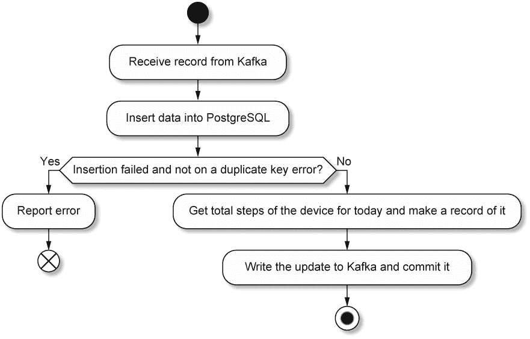
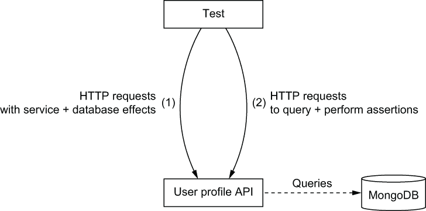
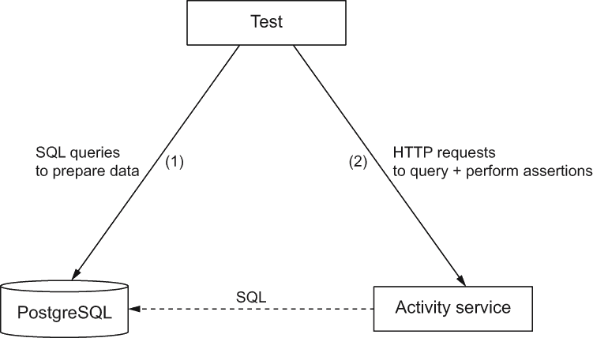
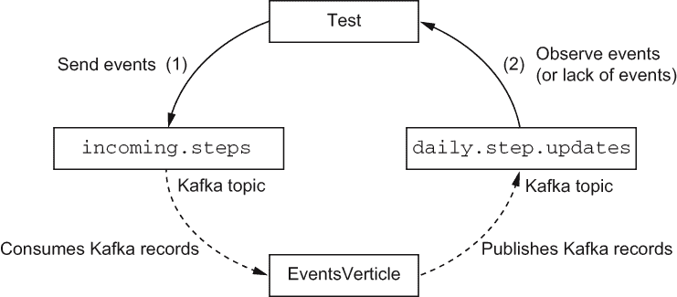

# 10 使用数据库进行持久状态管理

本章涵盖

+   使用 MongoDB 存储数据和认证用户

+   使用 Vert.x 从 PostgreSQL

+   测试与数据库交互的事件驱动服务的集成测试策略

反应式应用程序倾向于无状态设计，但状态必须被管理。

数据库在大多数应用程序中都是必不可少的，因为数据需要被存储、检索和查询。数据库可以存储各种数据，如应用程序状态、事实或用户凭证。市场上存在不同类型的数据库：有些是通用型的，而有些则针对某些类型的用例、访问模式和数据进行专门化。

在本章中，我们将通过深入了解用户和服务活动的实现来探索 Vert.x 的数据库和状态管理。这些服务将使我们能够使用面向文档的数据库（MongoDB）和关系型数据库（PostgreSQL）。你还将看到如何使用 MongoDB 进行用户认证，以及如何为数据驱动的服务编写集成测试。

## 10.1 数据库和 Vert.x

Vert.x 提供了广泛的客户端来连接数据源。这些客户端包含与服务器通信的驱动程序，并且可能提供高效的连接管理，如连接池。这对于构建各种服务很有用，从由数据源支持的 API 到混合数据源、消息和 API 的集成服务。

### 10.1.1 Eclipse Vert.x 堆栈提供的内容

Eclipse Vert.x 项目提供了表 10.1 中列出的数据客户端模块。

表 10.1 Eclipse Vert.x 支持的数据客户端模块

| 标识符 | 描述 |
| --- | --- |
| `vertx-mongo-client` | MongoDB 是一个面向文档的数据库。 |
| `vertx-jdbc-client` | 支持任何提供 JDBC 驱动程序的关系型数据库。 |
| `vertx-pg-client` 和 `vertx-mysql-client` | 通过专门的 Vert.x 反应式驱动程序访问 PostgreSQL 和 MySQL 关系型数据库。 |
| `vertx-redis-client` | Redis 是一种多用途的数据结构存储。 |
| `vertx-cassandra-client` | Apache Cassandra 是一个针对大量数据定制的数据库。 |

你可以在更大的 Vert.x 社区中找到其他类型数据源的驱动程序。这些超出了 Eclipse 基金会项目的范围。

MongoDB 是一个流行的面向文档的数据库；它与 Vert.x 很好地匹配，因为它操作 JSON 文档。Redis 是一个内存中的数据结构存储，具有可配置的磁盘数据快照，可以用作缓存、数据库和消息代理。Apache Cassandra 是一个多节点、复制的数据库，旨在存储大量数据。Cassandra 非常适合以数百个或甚至数个千兆字节计量的数据库。当然，你也可以用它来存储几个千兆字节的数据，但在这些情况下，更传统的数据库可能就足够了。

谈到“传统”的关系数据库，Vert.x 可以连接到任何有 JDBC 驱动的“东西”。话虽如此，JDBC 是一种基于多线程设计和阻塞 I/O 的较老协议。Vert.x 中的 JDBC 支持将数据库调用卸载到工作线程池，并将结果推回到事件循环上下文中。这是为了避免阻塞事件循环，因为 JDBC 调用确实会阻塞。这种设计限制了可伸缩性，因为需要工作线程，但对于中等负载来说应该没问题。

如果你使用 PostgreSQL 或 MySQL，Vert.x 提供了自己的反应式驱动程序。这些驱动程序实现了每个数据库服务器的网络协议，并且它们完全以异步方式构建，使用 Netty，这是 Vert.x 的网络基础。这些驱动程序在延迟和并发连接方面都提供了出色的性能。它们也非常稳定，并实现了数据库的当前协议和功能。你应该优先考虑 PostgreSQL 和 MySQL 的 Vert.x 反应式驱动程序客户端，并在需要连接到其他数据库时使用 JDBC 客户端。

如果你正在寻找一个可靠的数据库，PostgreSQL 可能是一个不错的选择。PostgreSQL 通用性强，多年来在各种小型和大型项目中都得到了应用。当然，你可以将其用作传统的关系数据库，但它也支持作为一等对象的 JSON 文档，以及通过 PostGIS 扩展的地理对象。

### 10.1.2 关于数据/对象映射的注意事项，以及为什么你可能并不总是需要它

在我们深入探讨使用 MongoDB 的用户配置文件服务设计和实现之前，我想简要讨论一些企业 Java 开发中已经确立的惯例，并解释为什么，在追求简单和效率的过程中，本章中的代码故意偏离了所谓的最佳实践。

10k 步挑战的代码可能会让你感到惊讶，因为它不执行对象数据映射，即任何数据都必须映射到表示应用域的某些 Java 对象模型，例如数据传输对象 (DTOs)。1 例如，一些表示计步器更新的 JSON 数据在进一步处理之前会被映射到 `DeviceUpdate` Java 类。在这里，我们将直接在 `JsonObject` 实例中操作数据，这些数据在 HTTP、Kafka 和数据库接口之间流动。我们不会将设备更新 JSON 数据映射到 `DeviceUpdate`；我们将使用该数据的 `JsonObject` 表示形式进行工作。

Vert.x 允许你从 Java 类中进行数据映射，但除非对象模型包含一些重要的业务逻辑或可以被第三方库中的某些处理利用，我认为进行任何形式的数据绑定都没有太大价值。我主张这种设计有几个原因：

+   它使我们免于编写除了暴露简单的获取器和设置器之外没有功能性的类。

+   它避免了为通常寿命较短的对象分配不必要的资源（例如，处理 HTTP 请求的生命周期）。

+   数据并不总是容易映射到对象模型，你可能对所有的数据不感兴趣，而只是对一些选定的条目感兴趣。

+   在关系型数据库的情况下，对象和模型之间有一些众所周知的不匹配，这可能导致复杂的映射和由于查询过多而导致的性能不佳。2

+   这最终导致代码更加*函数式*。

如果你有疑问，总是问问自己你是否真的需要一个对象模型，或者数据表示是否足够好，足以处理你正在进行的处理工作。如果你的对象模型只包含获取器和设置器，那么这可能是一个好迹象，表明（至少最初）你可能不需要它。

让我们深入了解在用户配置文件服务中使用 MongoDB。

## 10.2 使用 MongoDB 的用户配置文件服务

用户配置文件服务管理用户数据，如姓名、电子邮件和城市，并且它还用于验证用户的登录/密码凭据。此服务被其他需要检索和关联用户信息的数据服务使用。

用户服务利用 MongoDB 的两个目的：

+   存储用户数据：用户名、密码、电子邮件、城市、设备标识符以及数据是否应出现在公共排名中

+   验证用户名加密码组合

MongoDB 在这里是一个很好的选择，因为它是一个文档数据库；每个用户都可以表示为一个文档。我们将使用`vertx-mongo-client`模块连接到 MongoDB 实例，并使用`vertx-auth-mongo`模块进行身份验证。

### 10.2.1 数据模型

`vertx-auth-mongo`模块是一个现成的解决方案，用于在 MongoDB 数据库上执行用户身份验证，因为它管理了正确存储和检索凭据的所有复杂性。它实现了模块`vertx-auth-common`的通用身份验证接口。它特别处理存储带有*salt*值的密码加密哈希，因为存储实际密码从来不是一个好主意。根据`vertx-auth-mongo`模块中定义的约定，目标数据库中的每个用户都有一个文档，包含以下条目：

+   `username`--用户名的字符串

+   `salt`--一个用于保护密码的随机数据字符串

+   `password`--通过从实际密码加上`salt`值计算 SHA-512 哈希得到的字符串

+   `roles`--一个定义*角色*（例如“管理员”）的字符串数组

+   `permissions`--一个定义*权限*（例如“`can_access_beta`”）的字符串数组

在我们的案例中，我们不会使用角色和权限，因为所有用户都将平等，所以这些条目将是空数组。我们不需要处理盐和密码哈希处理的复杂性，因为这是由身份验证模块处理的。

虽然这个数据模型由`vertx-auth-mongo`指定，但并没有阻止我们向代表用户的文档中添加更多字段。因此，我们可以添加以下条目：

+   `city`--用户所在城市的字符串

+   `deviceId`--计步器设备标识符的字符串

+   `email`--用户电子邮件地址的字符串

+   `makePublic`--一个布尔值，表示用户是否希望出现在公共排名中

我们还将使用 MongoDB 索引强制执行两个完整性约束：`username`和`deviceId`必须在所有文档中是唯一的。这避免了重复的用户名以及两个用户使用相同的设备。这将在注册新用户时提出一个正确性挑战，因为我们无法使用任何事务机制。当`deviceId`唯一性约束阻止重复插入时，我们需要回滚部分数据插入。 

现在我们来看看如何使用 Vert.x MongoDB 客户端和 Vert.x 身份验证支持。

### 10.2.2 用户配置 API 垂直和初始化

`UserProfileApiVerticle`类公开了用户配置服务的 HTTP API。它包含三个重要字段：

+   `mongoClient`，类型为`MongoClient`，用于连接到 MongoDB 服务器。

+   `authProvider`，类型为`MongoAuthentication`，用于使用 MongoDB 执行身份验证检查。

+   `userUtil`，类型为`MongoUserUtil`，用于简化新用户的创建。

我们从`rxStart`垂直初始化方法中初始化这些字段（因为我们使用 RxJava），如下一列表所示。

列表 10.1 初始化 MonbgoDB 客户端和身份验证提供者

```
mongoClient = MongoClient.createShared(vertx, mongoConfig());   ❶

authProvider = MongoAuthentication.create(mongoClient,
  new MongoAuthenticationOptions());                            ❷

userUtil = MongoUserUtil.create(mongoClient,                    ❸
  new MongoAuthenticationOptions(), new MongoAuthorizationOptions());
```

❶ 基于某些配置创建一个客户端。

❷ 在 MongoDB 上创建一个身份验证提供者。

❸ 在 MongoDB 数据库中创建用户的辅助函数

身份验证提供者依赖于 MongoDB 客户端实例，配置方式如下一列表所示。我们为身份验证提供者传递空配置选项，因为我们遵循 Vert.x MongoDB 身份验证模块的约定。同样，对于帮助我们添加用户的实用工具也是如此。

列表 10.2 MongoDB 客户端配置方法

```
private JsonObject mongoConfig() {
  return new JsonObject()
    .put("host", "localhost")      ❶
    .put("port", 27017)
    .put("db_name", "profiles");   ❷
}
```

❶ 我们将在本地进行测试。

❷ `profiles`是数据库名称，但我们可以使用其他任何名称。

由于我们公开了 HTTP API，我们将使用 Vert.x web 路由器来配置服务要处理的各个路由，如下一列表所示。

列表 10.3 用户配置服务 HTTP 路由

```
Router router = Router.router(vertx);
BodyHandler bodyHandler = BodyHandler.create();
router.post().handler(bodyHandler);
router.put().handler(bodyHandler);
router.post("/register")
  .handler(this::validateRegistration)             ❶
  .handler(this::register);
router.get("/:username").handler(this::fetchUser);
router.put("/:username").handler(this::updateUser);
router.post("/authenticate").handler(this::authenticate);
router.get("/owns/:deviceId").handler(this::whoOwns);
```

❶ 处理逻辑被分为两个链式处理器。

注意，我们在注册时使用了两个链式处理器。第一个处理器用于数据验证，第二个处理器用于实际的处理逻辑。但验证逻辑中有什么？

### 10.2.3 验证用户输入

注册是一个关键步骤，因此我们必须确保数据有效。我们必须检查传入的数据（一个 JSON 文档）是否包含所有必需的字段，并且它们都是有效的。例如，我们需要检查电子邮件地址实际上是一个电子邮件地址，并且用户名不为空且不包含不想要的字符。

下面的列表中的 `validateRegistration` 方法将验证委托给辅助方法 `anyRegistrationFieldIsMissing` 和 `anyRegistrationFieldIsWrong`。

列表 10.4 注册验证方法

```
private void validateRegistration(RoutingContext ctx) {
  JsonObject body = jsonBody(ctx);
  if (anyRegistrationFieldIsMissing(body) || 
  ➥ anyRegistrationFieldIsWrong(body)) {
    ctx.fail(400);                          ❶
  } else {
    ctx.next();                             ❷
  }
}
```

❶ 注册失败，因此我们以状态码 400 结束 HTTP 请求。

❷ 调用链中的下一个处理器。

当任何验证步骤失败时，我们以 400 HTTP 状态码响应；否则，我们调用下一个处理器，在我们的例子中将是 `register` 方法。

`anyRegistrationFieldIsMissing` 方法的实现相当简单。我们检查提供的 JSON 文档是否包含所需的字段，如下所示。

列表 10.5 检查缺失的 JSON 字段

```
private boolean anyRegistrationFieldIsMissing(JsonObject body) {
  return !(body.containsKey("username") &&                         ❶
    body.containsKey("password") &&
    body.containsKey("email") &&
    body.containsKey("city") &&
    body.containsKey("deviceId") &&
    body.containsKey("makePublic"));
}
```

❶ 检查所有字段是否存在。

`anyRegistrationFieldIsWrong` 方法将检查委托给正则表达式，如下面的列表所示。

列表 10.6 验证特定字段

```
private final Pattern validUsername = Pattern.compile("\\w[\\w+|-]*");    ❶
// (...)
private boolean anyRegistrationFieldIsWrong(JsonObject body) {
  return !validUsername.matcher(body.getString("username")).matches() ||  ❷
    !validEmail.matcher(body.getString("email")).matches() ||
    body.getString("password").trim().isEmpty() ||                        ❸
    !validDeviceId.matcher(body.getString("deviceId")).matches();
}
```

❶ 有效的用户名正则表达式，如 `abc`、`a-b-c` 等。

❷ 正则表达式匹配

❸ `trim` 移除字符串开头和结尾的空白字符，然后检查是否为空。

`validDeviceId` 正则表达式与 `validUsername` 相同。验证电子邮件地址（`validEmail`）是一个更复杂的正则表达式。我选择使用来自 Open Web Application Security Project (OWASP) 的一个安全正则表达式来完成这个目的 ([www.owasp.org/index.php/OWASP_Validation_Regex_Repository](http://www.owasp.org/index.php/OWASP_Validation_Regex_Repository))。

现在我们已经验证了数据，是时候注册用户了。

### 10.2.4 在 MongoDB 中添加用户

在数据库中插入新用户需要两个步骤：

1.  我们需要请助手插入一个新用户，因为它还将处理其他方面，如哈希密码和盐值。

1.  我们需要更新用户文档以添加认证提供者模式不需要的额外字段。

由于这是一个两步数据插入过程，我们无法使用任何事务管理功能，因此我们需要自己确保数据完整性，如图 10.1 所示。


图 10.1 成功添加用户的步骤

幸运的是，RxJava 使得错误管理声明式，所以我们不需要处理异步操作的嵌套条件，这会使用回调或承诺/未来变得复杂。

`register` 方法首先从 HTTP 请求中提取 JSON 有效负载，然后是创建用户的用户名和密码，如下所示。

列表 10.7 `register` 方法的序言

```
private void register(RoutingContext ctx) {
  JsonObject body = jsonBody(ctx);               ❶
  String username = body.getString("username");
  String password = body.getString("password");

  userUtil
    .rxCreateUser(username, password)            ❷
  // (...)
}
```

❶ 提取 JSON 主体。

❷ 插入一个新用户。

记住，`register` 在验证之后被调用，所以我们期望 JSON 数据是好的。我们向身份验证提供者传递用户名和密码。还有一个表单，其中 `rxCreateUser` 接受两个额外的列表来定义角色和权限。然后助手用新的文档填充数据库。

接下来，我们必须运行一个查询来更新新创建的文档并附加新条目。MongoDB 查询在下面的列表中显示，并表示为 JSON 对象。

列表 10.8 更新新用户的 MongoDB 查询

```
JsonObject extraInfo = new JsonObject()
  .put("$set", new JsonObject()              ❶
    .put("email", body.getString("email"))
    .put("city", body.getString("city"))
    .put("deviceId", body.getString("deviceId"))
    .put("makePublic", body.getBoolean("makePublic")));
```

❶ 这是 MongoDB 的 `$set` 操作符。

因此，我们必须将 `rxInsertUser` 操作与 MongoDB 更新查询链式执行，知道 `rxInsertUser` 返回一个 `Single<String>`，其值是新文档的标识符。下面的列表展示了使用 RxJava 的完整用户添加处理过程。

列表 10.9 使用 RxJava 的完整用户添加处理

```
userUtil
  .rxCreateUser(username, password)                           ❶
  .flatMapMaybe(docId -> insertExtraInfo(extraInfo, docId))   ❷
  .ignoreElement()
  .subscribe(
    () -> completeRegistration(ctx),                          ❸
    err -> handleRegistrationError(ctx, err));                ❹
```

❶ 用户插入查询

❷ 更新查询

❸ HTTP 200

❹ 处理错误

`flatMapMaybe` 操作符允许我们链式执行两个查询。

下一个列表中展示了 `insertExtraInfo` 方法，它返回一个 `MaybeSource`，因为查找和更新文档可能在没有找到匹配文档的情况下不保留结果。

列表 10.10 `insertExtraInfo` 方法的实现

```
private MaybeSource<? extends JsonObject> insertExtraInfo(JsonObject 
➥ extraInfo, String docId) {
  JsonObject query = new JsonObject().put("_id", docId);
  return mongoClient
    .rxFindOneAndUpdate("user", query, extraInfo)     ❶
    .onErrorResumeNext(err -> {
      return deleteIncompleteUser(query, err);        ❷
    });
}
```

❶ 查找并更新文档。

❷ 手动回滚

注意，更新查询可能会失败；例如，如果另一个用户已经使用相同的标识符注册了设备。在这种情况下，我们需要手动回滚并移除由身份验证提供者创建的文档，否则数据库中会有一个不完整的文档。下面的列表展示了 `deleteIncompleteUser` 方法的实现。

列表 10.11 `deleteIncompleteUser` 方法的实现

```
private boolean isIndexViolated(Throwable err) {
  return err.getMessage().contains("E11000");         ❶
}

private MaybeSource<? extends JsonObject> deleteIncompleteUser(JsonObject 
➥ query, Throwable err) {
  if (isIndexViolated(err)) {
    return mongoClient
      .rxRemoveDocument("user", query)                ❷
      .flatMap(del -> Maybe.error(err));              ❸
  } else {
    return Maybe.error(err);                          ❹
  }
}
```

❶ 这是索引约束违规的技术代码。

❷ 移除文档。

❸ 将结果替换为原始异常并传播它。

❹ `err` 是另一种错误，我们需要传播它。

我们需要在异常消息中的技术代码来区分索引违规错误和其他类型的错误。在前一种情况下，必须删除先前数据，因为我们想处理它并恢复；在后一种情况下，这是另一种错误，我们无法做太多，所以我们需要传播它。

最后，下一个列表中显示的 `handleRegistrationError` 方法需要检查错误以响应适当的 HTTP 状态码。

列表 10.12 `handleRegistrationError` 方法的实现

```
private void handleRegistrationError(RoutingContext ctx, Throwable err) {
  if (isIndexViolated(err)) {
    logger.error("Registration failure: {}", err.getMessage());
    ctx.fail(409);                                              ❶
  } else {
    logger.error("Woops", err);
    ctx.fail(500);                                              ❷
  }
}
```

❶ 错误是因为用户提供了现有的用户名或设备标识符。

❷ 这是一个技术错误。

如果请求失败是因为用户名或设备标识符已被占用，或者由于某些技术错误而失败，那么通知请求者是很重要的。在一种情况下，错误是请求者的责任，在另一种情况下，服务是罪魁祸首，请求者可以稍后再次尝试。

### 10.2.5 用户认证

使用用户名和密码进行用户身份验证非常简单。我们只需要查询身份验证提供者，如果成功，它将返回一个 `io.vertx.ext.auth.User` 实例。在我们的案例中，我们对查询权限或角色不感兴趣——我们只想检查身份验证是否成功。

假设发送到 `/authenticate` 的 HTTP `POST` 请求有一个包含 `username` 和 `password` 字段的 JSON 主体，我们可以按以下方式执行身份验证请求。

列表 10.13 验证用户

```
private void authenticate(RoutingContext ctx) {
  authProvider.rxAuthenticate(jsonBody(ctx))                   ❶
    .subscribe(
      user -> completeEmptySuccess(ctx),
      err -> handleAuthenticationError(ctx, err));
}

private void completeEmptySuccess(RoutingContext ctx) {
  ctx.response().setStatusCode(200).end();                     ❷
}

private void handleAuthenticationError(RoutingContext ctx, Throwable err) {
  logger.error("Authentication problem {}", err.getMessage());
  ctx.response().setStatusCode(401).end();                     ❸
}
```

❶ 身份验证方法

❷ 成功

❸ 报告身份验证失败。

身份验证请求的结果是一个 `User`，或者如果失败，则是一个异常。根据结果，我们以 200 或 401 状态码结束 HTTP 请求。

### 10.2.6 获取用户数据

对 `/username` 的 HTTP `GET` 请求必须返回与该用户关联的数据（例如，`/foo`，`/bar` 等）。为此，我们需要准备一个 MongoDB 查询并以 JSON 响应返回数据。

我们需要一个 MongoDB “find” 查询来定位用户文档。为此，我们需要两个 JSON 文档：

+   基于数据库文档中 `username` 字段值进行查询的查询文档

+   一个文档用于指定应返回的字段。

以下代码执行此类查询。

列表 10.14 在 MongoDB 中获取用户数据

```
JsonObject query = new JsonObject()
  .put("username", username);               ❶

JsonObject fields = new JsonObject()
  .put("_id", 0)                            ❷
  .put("username", 1)                       ❸
  .put("email", 1)
  .put("deviceId", 1)
  .put("city", 1)
  .put("makePublic", 1);

mongoClient
  .rxFindOne("user", query, fields)         ❹
  .toSingle()
  .subscribe(
    json -> completeFetchRequest(ctx, json),
    err -> handleFetchError(ctx, err));
```

❶ 我们想要精确匹配用户名。

❷ 我们不想要文档标识符。

❸ 我们想要重复用户名。

❹ 查找一个文档。

指定哪些字段应包含在响应中，并对此进行明确是很重要的。在我们的案例中，我们不希望泄露文档标识符，因此我们在 `fields` 文档中将它设置为 `0`。我们还明确列出我们希望以 `1` 值返回的字段。这也确保了密码和盐值等身份验证字段不会意外泄露。

下一个列表显示了完成获取请求和 HTTP 响应的两个方法。

列表 10.15 完成用户获取请求

```
private void completeFetchRequest(RoutingContext ctx, JsonObject json) {
  ctx.response()
    .putHeader("Content-Type", "application/json")
    .end(json.encode());                                           ❶
}

private void handleFetchError(RoutingContext ctx, Throwable err) {
  if (err instanceof NoSuchElementException) {                     ❷
    ctx.fail(404);
  } else {
    fail500(ctx, err);
  }
}
```

❶ 通过转发 JSON 结果成功完成。

❷ 如果用户不存在，则返回 404 错误，如果遇到技术错误，则返回 500 错误。

正确处理错误情况并区分不存在用户和技术错误是很重要的。

让我们看看更新用户的案例。

### 10.2.7 更新用户数据

更新用户数据与获取数据类似，因为我们需要两个 JSON 文档：一个用于匹配文档，另一个用于指定需要更新的字段。以下列表显示了相应的代码。

列表 10.16 使用 MongoDB 更新用户数据

```
JsonObject query = new JsonObject().put("username", username);    ❶
JsonObject updates = new JsonObject();
if (body.containsKey("city")) {                                   ❷
  updates.put("city", body.getString("city"));
}
if (body.containsKey("email")) {
  updates.put("email", body.getString("email"));
}
if (body.containsKey("makePublic")) {
  updates.put("makePublic", body.getBoolean("makePublic"));
}

if (updates.isEmpty()) {                                          ❸
  ctx.response().setStatusCode(200).end();
  return;
}

updates = new JsonObject().put("$set", updates);                  ❹
mongoClient
  .rxFindOneAndUpdate("user", query, updates)                     ❺
  .ignoreElement()
  .subscribe(
    () -> completeEmptySuccess(ctx),
    err -> handleUpdateError(ctx, err));
```

❶ 我们想要通过用户名进行匹配。

❷ 我们选择性地检查每个允许的字段以进行更新。

❸ 如果未指定任何允许的字段，我们快速返回。

❹ 在 MongoDB 中使用 `$set` 操作符来更新数据。

❺ 我们搜索并更新一个文档。

由于更新请求是一个来自 HTTP 请求的 JSON 文档，如果我们不小心，总有可能遭受外部攻击。恶意用户可能会在请求中构建一个包含密码或用户名更新的 JSON 文档，因此我们测试更新中是否存在每个允许的字段：`city`、`email` 和 `makePublic`。然后我们创建一个仅包含这些字段的更新 JSON 文档，而不是重用通过 HTTP 收到的 JSON 文档，并向 Vert.x MongoDB 客户端发送更新请求。

我们现在已经涵盖了 Vert.x 中 MongoDB 的典型用法，以及如何将其用于认证目的。让我们继续讨论 PostgreSQL 和活动服务。

## 10.3 使用 PostgreSQL 的活动服务

活动服务存储从计步器接收到的所有步数更新。它是一个响应新步数更新事件（以存储数据）的服务，并且可以被其他服务查询以获取特定设备在特定日期、月份或年份的步数。

活动服务在设备更新被摄取服务接受后使用 PostgreSQL 存储活动数据。PostgreSQL 非常适合这个目的，因为 SQL 查询语言使得计算聚合数据变得容易，例如计算特定月份设备的步数。

服务被拆分为两个独立的垂直线：

+   `EventsVerticle` 监听来自 Kafka 的传入活动更新，然后将数据存储在数据库中。

+   `ActivityApiVerticle` 提供了一个用于查询活动数据的 HTTP API。

我们本可以将所有代码放在单个垂直线上，但这种解耦使得代码更易于管理，因为每个垂直线都有一个明确的目的。`EventsVerticle` 执行对数据库的写入操作，而 `ActivityApiVerticle` 执行读取操作。

### 10.3.1 数据模型

数据模型并不复杂，可以放入单个 *关系* `stepevent` 中。创建 `stepevent` 表的 SQL 指令如下所示。

列表 10.17 创建 `stepevent` 表的 SQL 指令

```
CREATE TABLE IF NOT EXISTS stepevent
(
  device_id VARCHAR,
  device_sync BIGINT,
  sync_timestamp timestamptz,            ❶
  steps_count INTEGER,
  PRIMARY KEY (device_id, device_sync)   ❷
);
```

❶ 带有时区的日期时间

❷ 复合主键

主键根据设备标识符（`device_id`）和设备同步计数器（`device_sync`）唯一标识活动更新。事件的时间戳被记录（`sync_timestamp`），最后存储步数（`steps_count`）。

提示：如果你来自一个大量使用 *对象关系映射器* (ORMs) 的背景，你可能会对前面的数据库模式感到惊讶，尤其是它使用的是复合主键而不是某个自动增长的数字。你可能首先需要考虑你的关系模型在范式方面的适当设计，然后再看看如何在代码中处理数据，无论是使用集合和/或反映数据的对象。如果你对这个主题感兴趣，维基百科提供了数据库规范化的良好介绍：[`en.wikipedia.org/wiki/Database_normalization`](https://en.wikipedia.org/wiki/Database_normalization)。

### 10.3.2 打开连接池

`vertx-pg-client` 模块包含了一个 `PgPool` 接口，该接口模拟了一个连接到 PostgreSQL 服务器的连接池，其中每个连接都可以用于后续的查询。`PgPool` 是客户端执行 SQL 查询的主要访问点。

以下列表显示了如何创建 PostgreSQL 连接池。

列表 10.18 创建 PostgreSQL 连接池

```
PgPool pgPool = PgPool.pool(vertx, PgConfig.pgConnectOpts(), 
➥ new PoolOptions());                             ❶
// (...)

public static PgConnectOptions pgConnectOpts() {   ❷
  return new PgConnectOptions()
    .setHost("localhost")
    .setDatabase("postgres")
    .setUser("postgres")
    .setPassword("vertx-in-action");
}
```

❶ 创建连接池。

❷ 连接配置

连接池的创建需要一个 Vert.x 上下文，一组连接选项，如主机、数据库和密码，以及池选项。池选项可以调整以设置最大连接数以及等待队列的大小，但这里默认值是足够的。

然后，使用 `pool` 对象执行对数据库的查询，正如你接下来将看到的。

### 10.3.3 设备更新事件的寿命

`EventsVerticle` 负责监听 `incoming.steps` 主题上的 Kafka 记录，其中每个记录是通过摄入服务从设备接收到的更新。对于每个记录，`EventsVerticle` 必须执行以下操作：

+   将记录插入到 PostgreSQL 数据库中。

+   生成包含设备每日步数的更新记录。

+   将其作为新的 Kafka 记录发布到 `daily.step.updates` Kafka 主题。

这在图 10.2 中得到了说明。



图 10.2 记录设备更新和生成更新事件的步骤

这些步骤由以下列表中定义的 RxJava 管道进行建模。

列表 10.19 `EventsVerticle` 中处理更新的 RxJava 管道

```
eventConsumer
  .subscribe("incoming.steps")                    ❶
  .toFlowable()
  .flatMap(this::insertRecord)                    ❷
  .flatMap(this::generateActivityUpdate)          ❸
  .flatMap(this::commitKafkaConsumerOffset)       ❹
  .doOnError(err -> logger.error("Woops", err))
  .retryWhen(this::retryLater)
  .subscribe();
```

❶ 订阅 Kafka 主题。

❷ 在数据库中插入一条新记录。

❸ 查询数据库以发布另一条记录。

❹ 将记录提交到 Kafka。

这个 RxJava 管道让人联想到我们在消息和事件堆栈中看到的那些，因为我们组合了三个异步操作。这个管道从 Kafka 读取，插入数据库记录 (`insertRecord`)，生成写入 Kafka 的查询 (`generateActivityUpdate`)，并将其提交 (`commitKafkaConsumerOffset`)。

### 10.3.4 插入新记录

下一个列表显示了插入记录的 SQL 查询。

列表 10.20 插入步事件 SQL 查询

```
static String insertStepEvent() {
  return "INSERT INTO stepevent VALUES($1, $2, current_timestamp, $3)";    ❶
}
```

❶ $n 是值元组的第 n 个条目。

小贴士 Vert.x 不指定任何对象关系映射工具。使用纯 SQL 是一个很好的选择，但如果您想将代码从数据库的特定性中抽象出来，并使用 API 来构建查询而不是使用字符串，我建议查看 jOOQ ([www.jooq.org/](http://www.jooq.org/))。您甚至可以在社区中找到一个 Vert.x/jOOQ 集成模块。

我们使用一个具有静态方法的类来定义 SQL 查询，因为它比我们代码中的普通字符串常量更方便。该查询将用作预处理语句，其中以`$`符号为前缀的值将从值元组中获取。由于我们使用预处理语句，这些值可以免受 SQL 注入攻击。

`insertRecord`方法为每个新的 Kafka 记录调用，方法体如下所示。

列表 10.21 `insertRecord`方法的实现

```
JsonObject data = record.value();     ❶

Tuple values = Tuple.of(              ❷
  data.getString("deviceId"),
  data.getLong("deviceSync"),
  data.getInteger("stepsCount"));

return pgPool
  .preparedQuery(insertStepEvent())   ❸
  .rxExecute(values)                  ❹
  .map(rs -> record)                  ❺
  .onErrorReturn(err -> {             ❻
    if (duplicateKeyInsert(err)) {
      return record;
    } else {
      throw new RuntimeException(err);
    }
  })
  .toFlowable();
```

❶ Kafka 记录的 JSON 体

❷ 元组结构

❸ 插入请求

❹ 使用参数执行请求。

❺ 在`generateActivityUpdate`方法中重新映射 Kafka 记录以进行处理。

❻ 优雅地处理重复插入。

我们首先从记录中提取 JSON 体，然后准备一个值元组作为参数传递给列表 10.20 中的 SQL 查询。查询的结果是一个行集，但由于这不是`SELECT`查询，所以我们不关心结果。相反，我们只是将结果重新映射到原始 Kafka 记录值，这样`generateActivityUpdate`方法就可以重用它。

`onErrorReturn`运算符允许我们优雅地处理重复插入。可能的情况是在服务重启后，我们将重新播放一些我们已处理的 Kafka 事件，因此`INSERT`查询将失败，而不是创建具有重复主键的条目。

下面的列表中的`duplicateKeyInsert`方法展示了我们如何区分重复键错误和其他技术错误。

列表 10.22 检测重复键错误

```
private boolean duplicateKeyInsert(Throwable err) {
  return (err instanceof PgException) &&
    "23505".equals(((PgException) err).getCode());    ❶
}
```

❶ 重复键插入尝试的技术代码错误

我们再次需要在异常消息中搜索技术错误代码，如果它与 PostgreSQL 重复键错误相对应，那么`onErrorReturn`将原始 Kafka 记录放入管道，而不是让错误传播。

### 10.3.5 生成设备的每日活动更新

在记录已插入到 RxJava 处理管道之后的下一步是查询数据库以找出当天已经执行了多少步。然后，这些信息被用来准备一个新的 Kafka 记录并将其推送到`daily.step.updates` Kafka 主题。

对应于该操作的 SQL 查询由以下列表中的`stepsCountForToday`方法指定。

列表 10.23 获取当前设备步骤计数的 SQL 查询

```
static String stepsCountForToday() {
  return "SELECT current_timestamp, coalesce(sum(steps_count), 0) 
➥ FROM stepevent WHERE " +                                       ❶
    "(device_id = $1) AND" +
    "(date_trunc('day', sync_timestamp) = date_trunc('day', 
    ➥ current_timestamp))";                                      ❷
}
```

❶ 如果没有匹配的条目，步骤计数将为 0。

❷ 匹配当前天的记录，截断小时、分钟和秒。

此请求计算给定设备标识符在当前日期所采取的步数之和（或 0）。

下一个列表显示了`generateActivityUpdate`方法的实现，它拾取`insertRecord`方法转发的原始 Kafka 记录。

列表 10.24 `generateActivityUpdate`方法实现

```
String deviceId = record.value().getString("deviceId");                    ❶
LocalDateTime now = LocalDateTime.now();
String key = deviceId + ":" + now.getYear() + "-" + now.getMonth() + "-" + 
➥ now.getDayOfMonth();                                                    ❷

return pgPool
  .preparedQuery(stepsCountForToday())
  .rxExecute(Tuple.of(deviceId))                                           ❸
  .map(rs -> rs.iterator().next())                                         ❹
  .map(row -> new JsonObject()                                             ❺
    .put("deviceId", deviceId)
    .put("timestamp", row.getTemporal(0).toString())
    .put("stepsCount", row.getLong(1)))
  .flatMap(json -> 
 ➥ updateProducer.rxSend(KafkaProducerRecord.create("daily.step.updates", 
 ➥ key, json)))                                                         ❻
  .map(rs -> record)
  .toFlowable();
```

❶ 从原始 Kafka 记录中提取设备标识符。

❷ 新 Kafka 记录的关键

❸ 包含一个值的元组的预处理语句

❹ 我们期望只有一行。

❺ 从行值创建一个新的 JsonObject。

❻ 组合 Kafka 发送操作。

这段代码展示了我们如何在`SELECT`查询之后操作行。查询的结果是`RowSet`，在这里通过第一个`map`运算符的`rs`参数物化，并且可以逐行迭代。由于查询返回单行，我们可以通过在`RowSet`迭代器上调用`next`直接访问第一行和唯一一行。然后我们通过类型和索引访问行元素，构建一个`JsonObject`，该对象创建发送到`daily.step.updates`主题的 Kafka 记录。

### 10.3.6 活动 API 查询

`ActivityApiVerticle`类公开了活动服务的 HTTP API--所有路由都导向 SQL 查询。我不会展示所有这些。我们将关注设备的月度步数，通过 HTTP `GET`请求到`/:deviceId/:year/:month`来处理。接下来的 SQL 查询将展示。

列表 10.25 月度步数 SQL 查询

```
static String monthlyStepsCount() {
  return "SELECT sum(steps_count) FROM stepevent WHERE" +
    "(device_id = $1) AND" +
    "(date_trunc('month', sync_timestamp) = $2::timestamp)";    ❶
}
```

❶ 需要将值合并为时间戳。

下一个列表显示了`stepsOnMonth`方法，它根据年和月路径参数执行 SQL 查询。

列表 10.26 处理月度步数请求

```
private void stepsOnMonth(RoutingContext ctx) {
  try {
    String deviceId = ctx.pathParam("deviceId");
    LocalDateTime dateTime = LocalDateTime.of(
      Integer.parseInt(ctx.pathParam("year")),
      Integer.parseInt(ctx.pathParam("month")),
      1, 0, 0);
    Tuple params = Tuple.of(deviceId, dateTime);           ❶
    pgPool.preparedQuery(SqlQueries.monthlyStepsCount())
      .rxExecute(params)
      .map(rs -> rs.iterator().next())
      .subscribe(
        row -> sendCount(ctx, row),                        ❷
        err -> handleError(ctx, err));                     ❸
  } catch (DateTimeException | NumberFormatException e) {  ❹
    sendBadRequest(ctx);
  }
}
```

❶ 查询参数元组

❷ 基于行数据的 JSON 响应

❸ 发送 HTTP 400 错误

❹ 当 URL 参数不是数字或不会产生有效日期时

查询结果再次是`RowSet`，我们从 SQL 查询中知道只能返回一行，所以我们使用`map`运算符来提取它。`sendCount`方法将数据作为 JSON 文档发送，而`handleError`方法产生 HTTP 500 错误。当年份或月份 URL 参数不是数字或不会产生有效日期时，`sendBadRequest`产生 HTTP 400 响应，让请求知道错误。

现在是时候转向集成测试策略了。当我们需要预先填充 PostgreSQL 数据库时，我还会向你展示一些其他数据客户端方法，例如 SQL 批查询。

## 10.4 集成测试

测试用户配置文件服务涉及向相应的 API 发出 HTTP 请求。活动服务有两个方面：一个涉及 HTTP API，另一个涉及构建 Kafka 事件并观察持久状态和产生事件的效应。

### 10.4.1 测试用户配置文件服务

用户配置文件测试依赖于发出影响服务状态和数据库的 HTTP 请求（例如，创建用户），然后发出进一步的 HTTP 请求来执行一些断言，如图 10.3 所示。



图 10.3 测试用户配置文件服务

集成测试再次依赖于 Testcontainers，因为我们需要一个运行的 MongoDB 实例。一旦容器运行，我们需要在运行任何测试之前将 MongoDB 数据库准备为 *干净状态*。这很重要，以确保测试不受先前测试执行留下的数据的影响。

`IntegrationTest` 类的 `setup` 方法执行测试准备。

列表 10.27 用户配置文件集成测试设置

```
@BeforeEach
void setup(Vertx vertx, VertxTestContext testContext) {
  JsonObject mongoConfig = new JsonObject()
    .put("host", "localhost")
    .put("port", 27017)
    .put("db_name", "profiles");
  mongoClient = MongoClient.createShared(vertx, mongoConfig);

  mongoClient
    .rxCreateIndexWithOptions("user", new JsonObject().put("username", 1),  ❶
      new IndexOptions().unique(true))
    .andThen(mongoClient.rxCreateIndexWithOptions("user",
      new JsonObject().put("deviceId", 1), new IndexOptions().unique(true)))❷
    .andThen(dropAllUsers())                                                ❸
    .flatMapSingle(res -> 
 ➥ vertx.rxDeployVerticle(new UserProfileApiVerticle()))
    .subscribe(
      ok -> testContext.completeNow(),
      testContext::failNow);
}
```

❶ 确保我们对 username 有索引。

❷ 确保我们对 deviceId 有索引。

❸ 删除所有用户。

我们首先连接到 MongoDB 数据库，然后确保我们有两个索引，用于 `username` 和 `deviceId` 字段。然后我们从 `profiles` 数据库中删除所有现有文档（见列表 10.28），并在成功完成初始化阶段之前部署 `UserProfileApiVerticle` 实例。

列表 10.28 删除 MongoDB 数据库中的所有用户

```
private Maybe<MongoClientDeleteResult> dropAllUsers() {
  return mongoClient.rxRemoveDocuments("user", new JsonObject());    ❶
}
```

❶ 无条件匹配一个空的 JSON 查询文档。

`IntegrationTest` 类提供了预期成功和预期失败的操作的不同测试用例。RestAssured 用于编写 HTTP 请求的测试规范，如下所示。

列表 10.29 测试验证缺失用户

```
@Test
@DisplayName("Failing at authenticating an unknown user")
void authenticateMissingUser() {
  JsonObject request = new JsonObject()    ❶
    .put("username", "Bean")
    .put("password", "abc");

  with()
    .spec(requestSpecification)
    .contentType(ContentType.JSON)
    .body(request.encode())
    .post("/authenticate")
    .then()
    .assertThat()
    .statusCode(401);                      ❷
}
```

❶ 此用户不存在。

❷ 我们期望得到一个 HTTP 401 状态码。

`authenticateMissingUser` 方法检查使用无效凭据进行身份验证是否会导致 HTTP 401 状态码。

另一个例子是以下测试，其中我们检查当我们尝试两次注册一个用户时会发生什么。

列表 10.30 测试两次注册用户

```
given()
  .spec(requestSpecification)
  .contentType(ContentType.JSON)
  .accept(ContentType.JSON)
  .body(basicUser().encode()))     ❶
  .when()
  .post("/register")
  .then()
  .assertThat()
  .statusCode(200);                ❷

given()
  .spec(requestSpecification)
  .contentType(ContentType.JSON)
  .accept(ContentType.JSON)
  .body(basicUser().encode())
  .when()
  .post("/register")
  .then()
  .assertThat()
  .statusCode(409);                ❸
```

❶ 此方法为用户返回一个预定义的 JSON 对象。

❷ 第一次尝试是正常的。

❸ 第二次尝试不正常！

我们也可以查看数据库并检查每次操作后存储的数据。由于我们需要覆盖 HTTP API 的所有功能用例，因此在集成测试中只关注 HTTP API 更为直接。然而，在某些情况下，数据库上的 API 可能不会暴露存储数据的一些重要影响，在这些情况下，您将需要连接到数据库以进行进一步的断言。

### 10.4.2 测试活动服务 API

测试活动服务 API 与测试用户配置文件服务非常相似，只是我们使用 PostgreSQL 而不是 MongoDB。

我们首先需要确保数据模式定义如列表 10.17 所示。为此，当 PostgreSQL 容器启动时，会自动运行 init/postgres/setup.sql 中的 SQL 脚本。这是因为容器镜像指定了在启动时将运行在 /docker-entrypoint-initdb.d/ 中找到的任何 SQL 脚本，而我们使用的 Docker Compose 文件将 init/postgres 挂载到 /docker-entrypoint-initdb.d/，因此 SQL 文件在容器中可用。

一旦数据库准备好了预定义的数据，我们就发出 HTTP 请求来进行断言，如图 10.4 所示。



图 10.4 测试活动服务 API

我们再次依赖 Testcontainers 启动一个 PostgreSQL 服务器，然后我们依赖测试设置方法来准备数据如下。

列表 10.31 准备活动服务 API 测试

```
String insertQuery = "INSERT INTO stepevent 
➥ VALUES($1, $2, $3::timestamp, $4)";                              ❶
LocalDateTime now = LocalDateTime.now();
List<Tuple> data = Arrays.asList(                                   ❷
  Tuple.of("123", 1, LocalDateTime.of(2019, 4, 1, 23, 0), 6541),
  Tuple.of("123", 2, LocalDateTime.of(2019, 5, 20, 10, 0), 200),
  Tuple.of("123", 3, LocalDateTime.of(2019, 5, 21, 10, 10), 100),
  Tuple.of("456", 1, LocalDateTime.of(2019, 5, 21, 10, 15), 123),
  Tuple.of("123", 4, LocalDateTime.of(2019, 5, 21, 11, 0), 320),
  Tuple.of("abc", 1, now.minus(1, ChronoUnit.HOURS), 1000),
  Tuple.of("def", 1, now.minus(2, ChronoUnit.HOURS), 100),
  Tuple.of("def", 2, now.minus(30, ChronoUnit.MINUTES), 900),
  Tuple.of("abc", 2, now, 1500)
);
PgPool pgPool = PgPool.pool(vertx, PgConfig.pgConnectOpts(), 
➥ new PoolOptions());

pgPool.query("DELETE FROM stepevent")                               ❸
  .rxExecute()
  .flatMap(rows -> 
➥ gPool.preparedQuery(insertQuery).rxExecuteBatch(data)            ❹
  .ignoreElement()
  .andThen(vertx.rxDeployVerticle(new ActivityApiVerticle()))       ❺
  .ignoreElement()
  .andThen(Completable.fromAction(pgPool::close))                   ❻
  .subscribe(testContext::completeNow, testContext::failNow);
```

❶ 插入数据的查询

❷ 数据库的条目集

❸ 确保没有事件被留下。

❹ 插入我们的数据。

❺ 部署 API 垂直服务。

❻ 关闭连接池。

我们希望有一个我们控制的数据库和数据集，其中包含设备 `123`、`456`、`abc` 和 `def` 在不同时间点的活动。例如，设备 `123` 在 2019/05/21 11:00 记录了 320 步，这是该设备与后端成功同步的第四次。然后我们可以执行以下列表中的 HTTP API 检查，检查 2019 年 5 月设备 `123` 的步数。

列表 10.32 检查设备 123 在指定月份的步数

```
JsonPath jsonPath = given()
  .spec(requestSpecification)
  .accept(ContentType.JSON)
  .get("/123/2019/05")                                 ❶
  .then()
  .assertThat()
  .statusCode(200)
  .extract()
  .jsonPath();

assertThat(jsonPath.getInt("count")).isEqualTo(620);   ❷
```

❶ 查询 URL

❷ 检查 JSON 结果。

活动 HTTP API 是服务的只读部分，因此现在让我们看看服务的另一部分。

### 10.4.3 测试活动服务的イベント处理

测试 `EventsVerticle` 的 Kafka 事件处理部分的技巧与我们在上一章中做的是非常相似的：我们将发送一些 Kafka 记录，然后观察服务产生的 Kafka 记录。

通过为特定设备发送多个步数更新，我们应该观察到服务产生了累积当前日步数的更新。由于服务既消费又产生反映数据库当前状态的 Kafka 记录，我们不需要执行 SQL 查询--观察是否产生了正确的 Kafka 记录就足够了。图 10.5 提供了测试的概述。



图 10.5 测试活动服务的事件处理

集成测试类 (`EventProcessingTest`) 再次使用 TestContainers 启动所需的服务：PostgreSQL、Apache Kafka 和 Apache ZooKeeper。在运行任何测试之前，我们必须使用以下列表中的测试准备代码从干净状态开始。

列表 10.33 事件处理集成测试的准备工作代码

```
consumer = KafkaConsumer.create(vertx, 
➥ KafkaConfig.consumer("activity-service-test-" + 
➥ System.currentTimeMillis()));
producer = KafkaProducer.create(vertx, KafkaConfig.producer());
KafkaAdminClient adminClient = KafkaAdminClient.create(vertx, 
➥ KafkaConfig.producer());
PgPool pgPool = PgPool.pool(vertx, PgConfig.pgConnectOpts(), 
➥ new PoolOptions());

pgPool.query("DELETE FROM stepevent")                            ❶
  .rxExecute()
  .flatMapCompletable(rs -> 
  ➥ adminClient.rxDeleteTopics(Arrays.asList("incoming.steps", 
  ➥ "daily.step.updates")))                                     ❷
  .andThen(Completable.fromAction(pgPool::close))                ❸
  .onErrorComplete()
  .subscribe(
    testContext::completeNow,
    testContext::failNow);
```

❶ 从数据库中删除数据。

❷ 删除 Kafka 主题。

❸ 关闭数据库连接池。

我们需要确保 PostgreSQL 数据库为空，并且我们用于接收和发送事件的 Kafka 主题已被删除。然后我们可以专注于测试方法，我们将为设备 `123` 发送两个步数更新。

在此之前，我们必须首先订阅 `daily.step.updates` Kafka 主题，其中 `EventsVerticle` 类将发送 Kafka 记录。以下列表显示了测试用例的第一部分。

列表 10.34 事件垂直测试用例的第一部分

```
consumer.subscribe("daily.step.updates")
  .toFlowable()
  .skip(1)                                           ❶
  .subscribe(record -> {                             ❷
    JsonObject json = record.value();
    testContext.verify(() -> {                       ❸
      assertThat(json.getString("deviceId")).isEqualTo("123");
      assertThat(json.containsKey("timestamp")).isTrue();
      assertThat(json.getInteger("stepsCount")).isEqualTo(250);
    });
    testContext.completeNow();
  }, testContext::failNow);
```

❶ 跳过第一次更新。

❷ 获取第二次更新。

❸ 执行一些断言。

由于我们发送了两个更新，我们跳过了发出的记录，并且只对第二个进行断言，因为它应该反映两个更新的步骤总和。前面的代码正在等待事件产生，因此我们现在需要部署`EventsVerticle`并发送以下两个更新。

列表 10.35 事件垂直测试用例的第二部分

```
vertx
  .rxDeployVerticle(new EventsVerticle())      ❶
  .flatMap(id -> {                             ❷
    JsonObject steps = new JsonObject()
      .put("deviceId", "123")
      .put("deviceSync", 1L)
      .put("stepsCount", 200);
    return producer.rxSend(KafkaProducerRecord.create("incoming.steps", 
    ➥ "123", steps));
  })
  .flatMap(id -> {                             ❸
    JsonObject steps = new JsonObject()
      .put("deviceId", "123")
      .put("deviceSync", 2L)
      .put("stepsCount", 50);
    return producer.rxSend(KafkaProducerRecord.create("incoming.steps", 
    ➥ "123", steps));
  })
  .subscribe(ok -> {
  }, testContext::failNow);
```

❶ 部署 EventsVerticle。

❷ 第一次更新

❸ 第二次更新

测试以`EventsVerticle`正确地向`daily.step.updates` Kafka 主题发送正确的更新而完成。我们再次注意到 RxJava 如何以声明式方式组合异步操作并确保错误处理被清楚地识别。我们实际上有两个 RxJava 管道，任何错误都会导致测试上下文失败。

note 如果第一次更新在午夜之前发送，第二次更新在午夜之后发送，则此测试可能会出现微小的漏洞窗口导致失败。在这种情况下，第二个事件将不会是两个事件步骤的总和。这种情况非常不可能发生，因为两个事件将在几毫秒内发出，但仍然，*可能*会发生。

谈到事件流，下一章将重点介绍 Vert.x 的高级事件处理服务。

## 摘要

+   Vert.x MongoDB 客户端允许您存储和查询文档。

+   Vert.x 还可以使用 MongoDB 进行身份验证并安全地存储用户凭据、角色和权限。

+   Vert.x 提供了一个高效的响应式驱动程序用于 PostgreSQL。

+   你并不总是需要一个对象关系映射器。直接使用 SQL 和关系数据可以简单且高效。

+   在执行集成测试之前确保数据库中的状态清洁是很重要的。

* * *

1.有关 DTO 的信息，请参阅 Martin Fowler 的“数据传输对象”文章，[`martinfowler.com/eaaCatalog/dataTransferObject.html`](https://martinfowler.com/eaaCatalog/dataTransferObject.html)。

2.参见 Ted Neward 的“计算机科学的越南”，[`blogs.tedneward.com/post/the-vietnam-of-computer-science/`](http://blogs.tedneward.com/post/the-vietnam-of-computer-science/)。
