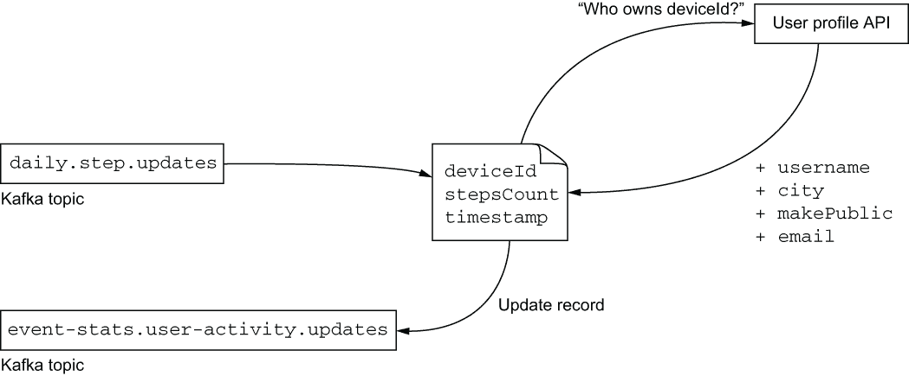
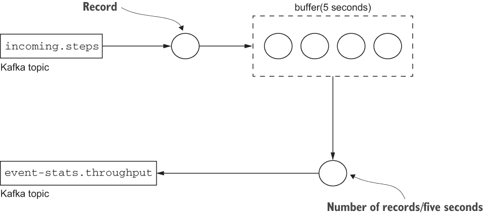
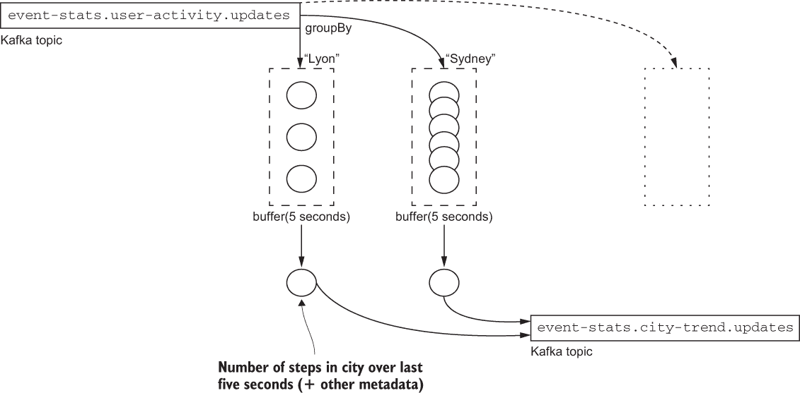
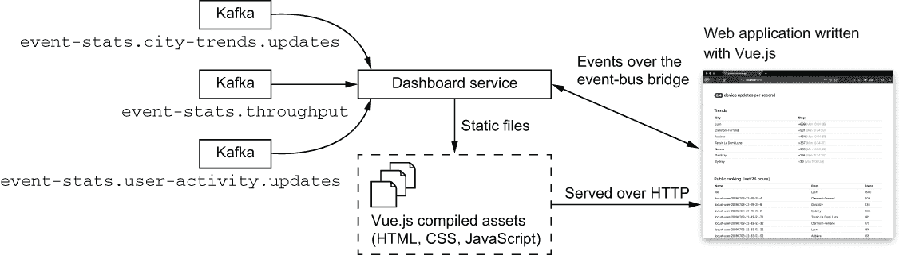

# 11 端到端实时反应式事件处理

本章涵盖

+   结合 RxJava 操作符和 Vert.x 客户端以支持高级处理

+   使用 RxJava 操作符在事件流上执行内容丰富和聚合数据处理

+   将 Vert.x 事件总线扩展到网络应用程序以统一后端和前端通信模型

+   在流处理环境中管理状态

在本章中，我们将探讨高级反应式流处理，其中应用程序状态根据事件进行实时变化。通过对事件进行转换和聚合，我们将计算有关更大 10k 步应用程序中正在发生的事情的实时统计数据。您还将看到事件流如何通过在 Vert.x 事件总线下统一 Java 和 JavaScript 代码来影响实时网络应用程序。

本章首先探讨使用 RxJava 操作符和 Vert.x 客户端的高级流处理。然后，我们将讨论通过事件总线连接的实时网络应用程序的主题，最后我们将讨论在连续事件的环境中正确处理状态（尤其是 *初始* 状态）的技术。

## 11.1 使用 Kafka 和 RxJava 进行高级流数据处理

在前面的章节中，我们使用了 RxJava 操作符来处理各种类型的事件：HTTP 请求、AMQP 消息和 Kafka 记录。RxJava 是一个多功能的响应式编程库，它特别适合使用 `Flowable` 类型处理背压流的事件流。Kafka 为事件流提供了坚实的中间件，而 Vert.x 提供了一个丰富的反应式客户端生态系统，这些客户端可以连接到其他服务、数据库或消息系统。

*事件统计* 服务是一个事件驱动的响应式服务，它消费 Kafka 记录并产生一些统计信息作为其他 Kafka 记录。我们将探讨如何使用 RxJava 操作符高效地处理事件流上的三个常见操作：

+   丰富数据

+   在时间窗口内聚合数据

+   通过使用键或函数对元素进行分组来聚合数据

### 11.1.1 丰富每日设备更新以生成用户更新

`daily.step.updates` Kafka 主题由活动服务发送的记录填充。这些记录包含三个条目：设备标识符、记录产生的时间戳和步数。

每当活动服务处理设备更新时，它将更新存储到 PostgreSQL 数据库中，然后产生一个 Kafka 记录，其中包含对应设备的当前天的步数。例如，当设备 `abc` 收到在 11:25 记录的 300 步更新时，它将向 `daily.step.updates` 发送一个 Kafka 记录，其中包含对应设备 `abc` 的当天步数。

事件统计服务消费这些事件，以便用用户数据丰富它们，这样其他服务就可以实时更新关于任何用户当前记录的步数。为此，我们从`daily.step.updates` Kafka 主题中获取记录，并添加来自用户 API 的数据：用户名、电子邮件、城市以及数据是否公开。丰富后的数据随后作为记录发送到`event-stats.user-activity.updates`主题。丰富数据的过程在图 11.1 中展示。



图 11.1 使用用户数据丰富设备更新

提示：这是 Gregor Hohpe 和 Bobby Woolf 在其开创性的《企业集成模式》（Addison-Wesley Professional，2003 年）一书中提出的*内容丰富器*消息模式的实现技术。

对于每个传入的 Kafka 记录，我们执行以下操作：

1.  向用户配置文件 API 发送请求以确定设备属于谁。

1.  向用户配置文件 API 发送另一个请求以获取用户的所有数据，并将其与传入的记录数据合并。

1.  将丰富后的记录写入`event-stats.user-activity.updates` Kafka 主题，并提交。

下一个列表显示了相应的 RxJava 管道。

列表 11.1 用于生成用户更新的 RxJava 管道

```
KafkaConsumer.<String, JsonObject>create(vertx, 
➥ KafkaConfig.consumer("event-stats-user-activity-updates"))
  .subscribe("daily.step.updates")                              ❶
  .toFlowable()
  .flatMapSingle(this::addDeviceOwner)                          ❷
  .flatMapSingle(this::addOwnerData)                            ❸
  .flatMapCompletable(this::publishUserActivityUpdate)          ❹
  .doOnError(err -> logger.error("Woops", err))
  .retryWhen(this::retryLater)
  .subscribe();
```

❶ 订阅源 Kafka 主题。

❷ 从记录中获取设备所有者信息。

❸ 获取用户数据并将其与记录合并。

❹ 提交到目标 Kafka 主题。

RxJava 管道使用`flatMapSingle`和`flatMapCompletable`组合异步操作。这是因为发送 HTTP 请求会产生一个（单一）结果，而提交 Kafka 记录是一个没有返回值的操作（因此它是可完成的）。您还可以看到来自早期章节的常见错误处理逻辑，包括延迟重新订阅。

下一个列表展示了`addDeviceOwner`方法的实现。

列表 11.2 添加设备所有者

```
private Single<JsonObject> addDeviceOwner(KafkaConsumerRecord<String, 
➥ JsonObject> record) {
  JsonObject data = record.value();                                    ❶
  return webClient
    .get(3000, "localhost", "/owns/" + data.getString("deviceId"))     ❷
    .as(BodyCodec.jsonObject())
    .rxSend()
    .map(HttpResponse::body)                                           ❸
    .map(data::mergeIn);                                               ❹
}
```

❶ 这是传入的 Kafka 记录。

❷ 向用户配置文件 API 发送 HTTP 请求。

❸ 提取 HTTP 响应体（一个 JsonObject）。

❹ 返回 JSON 数据合并。

此方法发送一个结果为 JSON 对象的 HTTP 请求，并返回源 Kafka 记录的 JSON 数据与请求结果数据的合并。

一旦完成，我们就知道记录中的设备属于谁，因此我们可以通过另一个请求从用户配置文件 API 获取用户数据，如下所示。

列表 11.3 添加所有者数据

```
private Single<JsonObject> addOwnerData(JsonObject data) {
  String username = data.getString("username");              ❶
  return webClient
    .get(3000, "localhost", "/" + username)                  ❷
    .as(BodyCodec.jsonObject())
    .rxSend()
    .map(HttpResponse::body)
    .map(data::mergeIn);                                     ❸
}
```

❶ 这是`addDeviceOwner`方法返回的数据。

❷ 发送 HTTP 请求。

❸ 合并数据。

此方法遵循与`addDeviceOwner`相同的模式，因为它将前一个操作的结果作为参数，向用户配置文件 API 发送 HTTP 请求，然后返回合并后的数据。

最后一个操作是`publishActivityUpdate`方法，如下所示。

列表 11.4 发布用户活动更新 Kafka 记录

```
private CompletableSource publishUserActivityUpdate(JsonObject data) {
  return producer.rxWrite(                                               ❶
    KafkaProducerRecord.create("event-stats.user-activity.updates", 
    ➥ data.getString("username"), data));
}
```

❶ 编写 Kafka 记录。

实现将 Kafka 记录写入目标 `event-stats.user-activity.updates` 主题。

### 11.1.2 使用时间窗口聚合计算设备更新摄入吞吐量

摄入服务接收来自 HTTP 和 AMQP 的传入设备更新，然后将它们发布到 `incoming.steps` Kafka 主题。摄入吞吐量是仪表板指标中典型的值，该值经常更新为每秒摄入的设备更新数量。这是衡量更大应用程序压力水平的好指标，因为每个更新都会触发其他微服务处理的事件。

为了计算摄入吞吐量，我们需要监听 `incoming.steps` 主题上的记录，在固定时间窗口内聚合记录，并计算接收到的记录数量。这如图 11.2 所示。



图 11.2 从摄入记录计算吞吐量

以下列表显示了计算吞吐量并将结果发布到 `event-stats.throughput` Kafka 主题的 RxJava 管道。

列表 11.5 计算摄入吞吐量的 RxJava 管道

```
KafkaConsumer.<String, JsonObject>create(vertx, 
➥ KafkaConfig.consumer("event-stats-throughput"))
  .subscribe("incoming.steps")                               ❶
  .toFlowable()
  .buffer(5, TimeUnit.SECONDS, RxHelper.scheduler(vertx))    ❷
  .flatMapCompletable(this::publishThroughput)               ❸
  .doOnError(err -> logger.error("Woops", err))
  .retryWhen(this::retryLater)
  .subscribe();
```

❶ 订阅源 Kafka 主题。

❷ 在五秒窗口中缓冲记录

❸ 计算并发布吞吐量。

`buffer` 操作符是 RxJava 中可用的几个聚合操作符之一。它会在一个时间段内聚合事件，然后将结果作为 `List` 传递。您可以看到我们从 `RxHelper` 类传递了一个 Vert.x 调度器；这是因为 `buffer` 会延迟事件处理，并且默认情况下将在 RxJava 特定的线程上调用下一个操作符。Vert.x 调度器确保操作符从原始 Vert.x 上下文中调用，以保留 Vert.x 线程模型。

一旦 `buffer` 聚合了最后五秒内的所有 Kafka 记录，`publishThroughput` 方法就会计算并发布吞吐量，如下所示。

列表 11.6 发布摄入吞吐量

```
private CompletableSource publishThroughput(List<KafkaConsumerRecord<String, 
➥ JsonObject>> records) {
  KafkaProducerRecord<String, JsonObject> record = 
➥ KafkaProducerRecord.create("event-stats.throughput",
    new JsonObject()                                             ❶
      .put("seconds", 5)
      .put("count", records.size())
      .put("throughput", (((double) records.size()) / 5.0d)));   ❷
  return producer.rxWrite(record);                               ❸
}
```

❶ 将有效载荷作为 JSON 对象

❷ 计算吞吐量。

❸ 写入 Kafka 记录。

给定 `records` 列表，我们可以轻松计算吞吐量并发布新的记录。我们注意指出记录数量和时间窗口大小（以秒为单位），以便事件消费者拥有所有信息，而不仅仅是原始结果。

### 11.1.3 使用聚合区分器和时间窗口计算每城市趋势

现在我们来看另一种基于 RxJava 操作符的数据聚合形式，通过计算每城市趋势。更具体地说，我们将定期计算当前每天每个城市记录了多少步。为此，我们可以重用由相同的事件统计服务发布的 `event-stats.user-activity.updates` Kafka 主题中的事件，因为它们包含了用户今天记录的步数，以及其他数据，包括城市。

我们可以重用 `buffer` 操作符，如列表 11.5 所示，然后遍历记录列表。对于每条记录，我们可以在一个散列表条目中更新，其中键是城市，值是步数。然后我们可以根据散列表中的值为每个城市发布一个更新。

然而，我们可以通过 `groupBy` 操作符编写一个更符合 RxJava 风格的处理管道，如下一列表和图 11.3 所示。

列表 11.7 使用 RxJava 管道计算每个城市的趋势

```
KafkaConsumer.<String, JsonObject>create(vertx, 
➥ KafkaConfig.consumer("event-stats-city-trends"))
  .subscribe("event-stats.user-activity.updates")
  .toFlowable()
  .groupBy(this::city)                                               ❶
  .flatMap(group -> 
  ➥ group.buffer(5, TimeUnit.SECONDS, RxHelper.scheduler(vertx)))   ❷
  .flatMapCompletable(this::publishCityTrendUpdate)                  ❸
  .doOnError(err -> logger.error("Woops", err))
  .retryWhen(this::retryLater)
  .subscribe();
```

❶ 按城市分组。

❷ 以五秒的窗口缓冲。

❸ 发布 Kafka 记录。



图 11.3 从用户活动记录中计算每个城市的趋势

当事件进入管道时，`groupBy` 操作符根据记录中找到的城市值将它们分配到 *组* 中（该 *判别器*）。你可以将 `groupBy` 视为 SQL 语句中 `GROUP BY` 的等价物。过滤函数 `city` 在下一列表中显示，并从 Kafka 记录中提取城市值。

列表 11.8 根据城市值进行过滤

```
private String city(KafkaConsumerRecord<String, JsonObject> record) {
  return record.value().getString("city");
}
```

列表 11.7 中的 `groupBy` 操作符返回一个 `GroupedFlowable` 的 `Flowable`，其中每个 `GroupedFlowable` 是一个为城市分组记录而专门设计的流式处理程序，这是通过 `groupBy` 使用 `city` 函数分发的。对于每个组，`flatMap` 操作符随后用于将事件分组到五秒的时间窗口中，这意味着每个城市的步数每五秒更新一次。

最后，`publishCityTrendUpdate` 方法准备一个新的记录，其中包含每个城市的更新统计数据，如下一列表所示。

列表 11.9 发布每个城市的统计数据

```
private CompletableSource 
➥ publishCityTrendUpdate(List<KafkaConsumerRecord<String, 
➥ JsonObject>> records) {
  if (records.size() > 0) {                                       ❶
    String city = city(records.get(0));                           ❷
    Long stepsCount = records.stream()
      .map(record -> record.value().getLong("stepsCount"))        ❸
      .reduce(0L, Long::sum);                                     ❹
    KafkaProducerRecord<String, JsonObject> record = 
    ➥ KafkaProducerRecord.create("event-stats.city-trend.updates", 
    ➥ city, new JsonObject()
      .put("timestamp", LocalDateTime.now().toString())
      .put("seconds", 5)
      .put("city", city)
      .put("stepsCount", stepsCount)
      .put("updates", records.size()));
    return producer.rxWrite(record);                              ❺
  } else {
    return Completable.complete();                                ❻
  }
}
```

❶ 检查时间窗口内是否已收到记录。

❷ 所有记录具有相同的城市，因此第一个识别它。

❸ 提取步数。

❹ 计算总和。

❺ 写入 Kafka 记录。

❻ 如果没有记录，则报告已完成的操作。

`publishCityTrendUpdate` 方法接收给定城市和时间窗口的 Kafka 记录列表。我们首先必须检查是否有记录，因为没有记录就没有事情可做。有了记录，我们可以使用 Java 流与 `reduce` 操作符计算总和，然后准备一个包含多个条目的 Kafka 记录：一个时间戳，时间窗口持续时间（以秒为单位），城市，记录的步数，以及时间窗口内观察到的更新数量。完成这些后，我们将记录写入 `event-stats.city-trend.updates` Kafka 主题。

现在我们已经了解了如何使用 RxJava 和 Vert.x 进行高级事件流处理，让我们看看我们如何将事件传播到反应式 Web 应用程序。

## 11.2 实时反应式 Web 应用程序

如第七章所述，仪表板 Web 应用程序从统计服务中消费事件并显示以下内容：

+   摄入吞吐量

+   公共用户的排名

+   每个城市的趋势

此应用程序实时更新，一旦接收到新数据，就在后端服务和网页浏览器之间实现了端到端集成的一个很好的案例。该应用程序是一个微服务，如图 11.4 所示。



图 11.4 反应式 Web 应用程序概述

仪表板服务由两部分组成：

+   Vue.js 应用程序

+   一个 Vert.x 服务执行以下操作：

    +   提供 Vue.js 资源

    +   连接到 Kafka 并将更新转发到 Vert.x 事件总线

    +   连接的网页浏览器和 Vert.x 事件总线之间的桥梁

让我们从 Kafka 到事件总线的转发开始。

### 11.2.1 将 Kafka 记录转发到 Vert.x 事件总线

通过率和城市趋势更新都直接转发到 Vue.js 应用程序代码。这些是在`event-stats.throughput`和`event-stats.city-trend.updates`Kafka 主题上接收到的记录。

在`DashboardWebAppVerticle`中，我们按照以下方式实施 RxJava 管道。

列表 11.10 转发通过率和城市趋势更新的 RxJava 管道

```
KafkaConsumer.<String, JsonObject>create(vertx, 
➥ KafkaConfig.consumerConfig("dashboard-webapp-throughput"))
  .subscribe("event-stats.throughput")                           ❶
  .toFlowable()
  .subscribe(record -> 
  ➥ forwardKafkaRecord(record, "client.updates.throughput"));   ❷

KafkaConsumer.<String, JsonObject>create(vertx, 
➥ KafkaConfig.consumerConfig("dashboard-webapp-city-trend"))
  .subscribe("event-stats.city-trend.updates")
  .toFlowable()
  .subscribe(record -> forwardKafkaRecord(record, 
  ➥ "client.updates.city-trend"));
```

❶订阅 Kafka 主题。

❷转发到事件总线。

这两个 RxJava 管道没有复杂的逻辑，因为它们将数据转发到`client.updates.throughput`和`client.updates.city-trend`事件总线目标。

下一个列表显示了`forwardKafkaRecord`方法的实现。

列表 11.11 将 Kafka 记录转发到事件总线

```
private void forwardKafkaRecord(KafkaConsumerRecord<String, JsonObject> 
➥ record, String destination) {
  vertx.eventBus().publish(destination, record.value());      ❶
}
```

❶ 发布到事件总线。

由于 Kafka 记录值是`JsonObject`类型，因此无需进行数据转换即可将其发布到 Vert.x 事件总线。

### 11.2.2 桥接事件总线和 Web 应用程序

仪表板 Web 应用程序启动一个 HTTP 服务器，如下面的摘录所示。

列表 11.12 仪表板服务 HTTP 服务器

```
Router router = Router.router(vertx);                             ❶
// (...) RxJava pipelines to forward Kafka records

// (...) Event bus bridge setup                                   ❷

router.route().handler(StaticHandler.create("webroot/assets"));   ❸
router.get("/*").handler(ctx -> ctx.reroute("/index.html"));      ❹

return vertx.createHttpServer()                                   ❺
  .requestHandler(router)
  .rxListen(HTTP_PORT)
  .ignoreElement();
```

❶一个 Vert.x 网络路由器用于分发 HTTP 请求

❷参见列表 11.13。

❸从 webroot/assets 资源文件夹中提供静态文件。

❹ 将流量重定向到/*到/index.html。

❺ 启动 HTTP 服务器。

列表 11.12 显示了一个用于提供静态文件的 HTTP 服务器。这只是一个摘录：我们现在需要了解 Vert.x 事件总线如何连接到 Web 应用程序。

Vert.x 使用 SockJS 库（[`github.com/sockjs`](https://github.com/sockjs)）提供事件总线集成。SockJS 是 WebSocket 协议（[`tools.ietf.org/html/rfc6455`](https://tools.ietf.org/html/rfc6455)）的模拟库，它允许浏览器和服务器在持久连接的基础上双向通信。Vert.x 核心 API 提供对 WebSocket 的支持，但 SockJS 很有趣，因为市场上并非所有浏览器都正确支持 WebSocket，一些 HTTP 代理和负载均衡器可能会拒绝 WebSocket 连接。SockJS 尽可能使用 WebSocket，并在必要时回退到其他机制，如 HTTP 长轮询、AJAX、JSONP 或 iframe。

Vert.x Web 模块提供了一个用于 SockJS 连接的处理器，它桥接事件总线，因此可以在服务器端（在 Vert.x 中）和客户端（在 JavaScript 中）使用相同的编程模型。以下列表显示了如何配置它。

列表 11.13 配置 SockJS 事件总线网桥

```
SockJSHandler sockJSHandler = SockJSHandler.create(vertx);       ❶
SockJSBridgeOptions bridgeOptions = new SockJSBridgeOptions()
  .addInboundPermitted(new PermittedOptions()
  ➥ .setAddressRegex("client.updates.*"))                       ❷
  .addOutboundPermitted(new PermittedOptions()
  ➥ .setAddressRegex("client.updates.*"));                      ❸
sockJSHandler.bridge(bridgeOptions);                             ❹
router.route("/eventbus/*").handler(sockJSHandler);              ❺
```

❶ SockJS 处理器

❷ 接受以 client.updates 开头的目标的事件总线消息。

❸ 接受以 client.updates 开头的目标的事件总线消息。

❹ 安装网桥。

❺ SockJS 客户端端点

网桥依赖于 SockJS 客户端连接的处理器，并设置了一组权限，仅允许桥接某些事件总线目标。确实，出于安全和性能原因，限制连接的 Web 应用程序和后端之间流动的事件非常重要。在这种情况下，我决定只有以 `client.updates` 开头的目标将可用。

在 Web 应用程序端，Vert.x 项目提供了 `vertx3-eventbus-client` 库，可以通过手动下载或使用 `npm`（Node 包管理器）等工具下载。使用这个库，我们可以连接到事件总线，如下面的列表所示。

列表 11.14 使用 JavaScript SockJS 事件总线客户端

```
import EventBus from 'vertx3-eventbus-client'              ❶

const eventBus = new EventBus("/eventbus")                 ❷
eventBus.enableReconnect(true)                             ❸

eventBus.onopen = () => {                                  ❹
  eventBus.registerHandler("a.b.c", (err, message) => {    ❺
    console.log(`Received: ${message.body}`)
  })

  eventBus.publish("d.e.f", {                              ❻
    book: "Vert.x in Action",
    comment: "A great book!"
  })
}
```

❶ 导入 JavaScript 模块。

❷ 连接到事件总线端点。

❸ 自动重连当连接丢失时。

❹ 当与事件总线的连接建立时被调用

❺ 注册事件总线目标处理器。

❻ 向事件总线发布消息。

在源代码仓库的 part2-steps-challenge/dashboard-webapp/src/App.vue 文件中，你可以找到使用 Vert.x 事件总线在 Vue.js 组件中的完整代码。正如你所见，JavaScript 代码中具有相同的编程模型；我们可以注册事件总线处理器并发布消息，就像在 Vert.x 代码中做的那样。

### 11.2.3 从 Kafka 到实时 Web 应用程序更新

仪表板使用 Vue.js，就像你之前看到的公共 Web 应用程序服务一样。整个应用程序基本上都包含在项目源代码中的 App.vue 组件中。组件数据模型由以下三个条目组成。

列表 11.15 Vue.js 组件的数据模型

```
data() {
  return {
    throughput: 0,        ❶
    cityTrendData: {},    ❷
    publicRanking: []     ❸
  }
},
```

❶ 当前吞吐量

❷ 城市趋势数据

❸ 公共排名

当从 Vert.x 事件总线接收到事件时，这些条目会被更新。为此，我们使用 Vue.js 的 `mounted` 生命周期回调来连接到事件总线，然后按照以下方式注册处理器。

列表 11.16 Vue.js 组件中的事件总线处理器

```
mounted() {
  eventBus.onopen = () => {
    eventBus.registerHandler("client.updates.throughput", (err, message) => {❶
      this.throughput = message.body.throughput                              ❷
    })
    eventBus.registerHandler("client.updates.city-trend", (err, message) => {
      const data = message.body
      data.moment = moment(data.timestamp)
      this.$set(this.cityTrendData, message.body.city, data)
    })
    eventBus.registerHandler("client.updates.publicRanking", (err, message) 
    ➥ => {
      this.publicRanking = message.body
    })
  }
},
```

❶ 订阅吞吐量更新。

❷ 更新模型。

处理器根据从事件总线接收到的内容更新模型。由于 Vue.js 是一个响应式 Web 应用程序框架，当数据模型发生变化时，界面也会更新。例如，当 `throughput` 的值发生变化时，下面列表中 HTML 模板显示的值也会变化。

列表 11.17 通过 Vue.js HTML 模板进行吞吐量

```
(...)
<h4>
  <span class="badge badge-pill badge-dark">{{ throughput }}</span>     ❶
  device updates per second
</h4>
(...)
```

❶ 绑定到吞吐量数据值

城市趋势视图的渲染是一个更复杂的模板。

列表 11.18 城市趋势 vue.js HTML 模板

```
<h4>Trends</h4>
<table class="table table-sm table-hover">
  <thead>
  <tr>
    <th scope="col">City</th>
    <th scope="col">Steps</th>
  </tr>
  </thead>
  <transition-group name="city-trends" tag="tbody">
    <tr v-for="item in cityTrendRanking" v-bind:key="item.city">     ❶
      <td scope="row">{{ item.city }}</td>                          ❷
      <td>
        +{{ item.stepsCount }}                                      ❸
        <span class="text-secondary font-weight-lighter">
        ({{ item.moment.format("ddd    hh:mm:ss") }})               ❹
        </span>
      </td>
    </tr>
  </transition-group>
</table>
```

❶ 遍历所有城市条目。

❷ 城市名称

❸ 步数

❹ 使用 Moment.js 库格式化时间戳。

该模板遍历所有城市数据并为每个城市渲染一个表格行。当一个城市有更新时，城市行会通过`item.city`绑定进行更新，这确保了由`v-for`循环生成的行中的唯一性。`transition-group`标签是 Vue.js 特有的，用于动画目的：当数据顺序改变时，行顺序会随着动画改变。循环遍历`cityTrendRanking`，这是一个在以下列表中显示的计算属性。

列表 11.19 计算排名属性

```
computed: {
  cityTrendRanking: function () {
    const values = Object.values(this.cityTrendData).slice(0)
    values.sort((a, b) => b.stepsCount - a.stepsCount)          ❶
    return values
  }
},
```

❶ 按步数排序。

`cityTrendRanking`计算属性根据步数对条目进行排名，因此仪表板显示步数最多的城市在最上面。

吞吐量和城市趋势每五秒更新一次，更新来自 Kafka 记录和 JSON 有效载荷被转发到仪表板 Web 应用程序。这效果很好，因为更新频繁且覆盖了聚合数据，但正如你将看到的，用户的排名会更复杂。

## 11.3 流和状态

仪表板 Web 应用程序显示了用户在过去 24 小时内所走步数的实时排名。用户可以根据事件统计服务产生的更新并发送到`event-stats.user-activity .updates` Kafka 主题的更新进行排名。

### 11.3.1 一系列更新

发送到`event-stats.user-activity.updates`的每个记录都包含给定用户的最新步数。仪表板服务可以观察这些事件，更新其状态以跟踪给定用户所走的步数，并相应地更新全局排名。问题在于我们需要一些初始状态，因为当它启动（或重启）时，仪表板服务不知道之前的更新。

我们可以将 Kafka 订阅者配置为从流的开始处重新启动，但这可能涉及几天甚至几周的数据。当仪表板服务启动时重新播放所有记录从理论上讲可以让我们计算准确的排名，但这将是一个昂贵的操作。此外，我们需要等待所有记录被处理完毕后再向连接的 Web 应用程序发送更新，因为这会在事件总线上产生大量流量。

另一种解决方案是先询问活动服务当前日的排名情况，这是一个内置在服务中的简单 SQL 查询。我们将这个阶段称为*激活*阶段。然后，我们可以随着从`event-stats.user-activity.updates` Kafka 主题接收更新来更新排名。

### 11.3.2 激活排名状态

仪表板服务维护一个`publicRanking`字段，它是一个映射，键是用户名，值是最新用户更新条目作为 JSON 数据。当服务启动时，此集合为空，因此第一步是用数据填充它。

要实现这一点，需要在`DashboardWebAppVerticle`初始化方法（`rxStart`）中调用`hydrate`方法，紧随 Kafka 消费者设置之后，如列表 11.10 所示。此方法通过调用活动和用户配置文件服务来组装排名数据，如下面的列表所示。

列表 11.20 `hydrate`方法的实现

```
WebClient webClient = WebClient.create(vertx);
webClient
  .get(3001, "localhost", "/ranking-last-24-hours")              ❶
  .as(BodyCodec.jsonArray())
  .rxSend()
  .delay(5, TimeUnit.SECONDS, RxHelper.scheduler(vertx))         ❷
  .retry(5)                                                      ❸
  .map(HttpResponse::body)
  .flattenAsFlowable(Functions.identity())
  .cast(JsonObject.class)
  .flatMapSingle(json -> whoOwnsDevice(webClient, json))         ❹
  .flatMapSingle(json -> fillWithUserProfile(webClient, json))   ❺
  .subscribe(
    this::hydrateEntryIfPublic,                                  ❻
    err -> logger.error("Hydration error", err),
    () -> logger.info("Hydration completed"));
```

❶ 活动服务排名端点

❷ 允许服务启动时的延迟。

❸ 如果活动服务不可用，允许重试五次。

❹ 对于每个设备排名条目，找到所有者。

❺ 填充用户详细信息。

❻ 只跟踪选择公开的用户。

`hydrate`方法的实现依赖于获取过去 24 小时内设备的排名。服务返回一个按步数数量排序的 JSON 数组。我们在发出请求前允许任意五秒的延迟，并在活动服务不可用时允许重试五次。一旦我们有了排名数据，`whoOwnsDevice`方法（列表 11.21）和`fillWithUserProfile`方法（列表 11.22）将计步器相关的数据与用户关联起来。最后，列表 11.23 中的`hydrateEntryIfPublic`方法使用选择公开排名的用户的数据填充`publicRanking`集合。

列表 11.21 查找设备所有者

```
private Single<JsonObject> whoOwnsDevice(WebClient webClient, 
➥ JsonObject json) {
  return webClient
    .get(3000, "localhost", "/owns/" + json.getString("deviceId"))    ❶
    .as(BodyCodec.jsonObject())
    .rxSend()
    .retry(5)
    .map(HttpResponse::body)
    .map(resp -> resp.mergeIn(json));                                 ❷
}
```

❶ 查找设备所有者的请求。

❷ 合并 JSON 数据。

`whoOwnsDevice`方法执行 HTTP 请求以确定设备的所有者，然后合并生成的 JSON 数据。此时，我们需要填充剩余的用户数据，这通过`fillWithUserProfile`方法完成，如下所示。

列表 11.22 向排名数据添加用户数据

```
private Single<JsonObject> fillWithUserProfile(WebClient webClient, 
➥ JsonObject json) {
  return webClient
    .get(3000, "localhost", "/" + json.getString("username"))   ❶
    .as(BodyCodec.jsonObject())
    .rxSend()
    .retry(5)
    .map(HttpResponse::body)
    .map(resp -> resp.mergeIn(json));                           ❷
}
```

❶ 获取用户数据。

❷ 合并 JSON 数据。

此代码与`whoOwnsDevice`方法的代码非常相似。

最后但同样重要的是，下面的列表中的`hydrateEntryIfPublic`方法向`publicRanking`集合添加数据。

列表 11.23 公开用户数据的水合

```
private void hydrateEntryIfPublic(JsonObject data) {
  if (data.getBoolean("makePublic")) {                      ❶
    data.put("timestamp", Instant.now().toString());        ❷
    publicRanking.put(data.getString("username"), data);    ❸
  }
}
```

❶ 只存储公开用户。

❷ 插入更新操作的本地时间戳。

❸ 存储用户数据。

水合是一个异步启动的过程，当 verticle 启动时，最终`publicRanking`集合将包含准确的数据。请注意，在这个阶段，我们尚未将任何排名数据推送到仪表板 Web 应用程序客户端。现在让我们看看接下来会发生什么。

### 11.3.3 从更新流中定期更新排名

用户排名每五秒更新一次。为此，我们收集五秒内的用户更新，更新公共排名数据，并将结果推送到仪表板 Web 应用程序。我们按五秒的时间跨度批量处理数据以控制仪表板刷新，但你可以减少时间窗口，甚至完全去掉它，如果你想要一个更活跃的仪表板。下一个列表展示了用于管理此过程的 RxJava 管道。

列表 11.24 用于更新用户排名的 RxJava 管道

```
KafkaConsumer.<String, JsonObject>create(vertx, 
➥ KafkaConfig.consumerConfig("dashboard-webapp-ranking"))
  .subscribe("event-stats.user-activity.updates")                ❶
  .toFlowable()
  .filter(record -> record.value().getBoolean("makePublic"))     ❷
  .buffer(5, TimeUnit.SECONDS, RxHelper.scheduler(vertx))        ❸
  .subscribe(this::updatePublicRanking);                         ❹
```

❶ 订阅更新。

❷ 仅保留公共用户。

❸ 在五秒内分组事件。

❹ 更新排名并推送数据。

使用 `filter` 操作符仅保留用户数据为公共的 Kafka 记录，而 `buffer` 操作符创建五秒的事件窗口。

下一个列表展示了处理这些事件批次的 `updatePublicRanking` 方法的实现。

列表 11.25 公共排名维护过程

```
private void updatePublicRanking(List<KafkaConsumerRecord<String, 
➥ JsonObject>> records) {
  copyBetterScores(records);                                                 ❶
  pruneOldEntries();                                                         ❷
  vertx.eventBus().publish("client.updates.publicRanking", computeRanking());❸
}
```

❶ 合并数据。

❷ 丢弃旧数据。

❸ 计算排名并发送到事件总线

该方法将过程描述为三个步骤：

1.  使用收集到的数据更新排名数据。

1.  丢弃旧条目。

1.  计算新的排名并通过事件总线发送到连接的 Web 应用程序。

下一个列表展示了 `copyBetterScores` 方法的实现。

列表 11.26 更新排名数据

```
private void copyBetterScores(List<KafkaConsumerRecord<String, JsonObject>> 
➥ records) {
  for (KafkaConsumerRecord<String, JsonObject> record : records) {
    JsonObject json = record.value();
    long stepsCount = json.getLong("stepsCount");                          ❶
    JsonObject previousData = publicRanking.get(json.getString("username"));
    if (previousData == null || previousData.getLong("stepsCount") < 
    ➥ stepsCount) {                                                       ❷
      publicRanking.put(json.getString("username"), json);
    }
  }
}
```

❶ 获取建议的步数更新数量。

❷ 仅在步数更多时更新。

前面的方法在收集到的条目步数高于前一个条目时更新 `publicRanking` 集合，因为可能存在水合过程和用户更新之间的冲突。

下一个列表展示了 `pruneOldEntries` 方法。

列表 11.27 修剪旧数据

```
private void pruneOldEntries() {
  Instant now = Instant.now();                                ❶
  Iterator<Map.Entry<String, JsonObject>> iterator = 
  ➥ publicRanking.entrySet().iterator();
  while (iterator.hasNext()) {                                ❷
    Map.Entry<String, JsonObject> entry = iterator.next();
    Instant timestamp = 
    ➥ Instant.parse(entry.getValue().getString("timestamp"));
    if (timestamp.until(now, ChronoUnit.DAYS) >= 1L) {        ❸
      iterator.remove();
    }
  }
}
```

❶ 获取当前时间。

❷ 遍历所有排名数据。

❸ 一天后删除条目。

此方法简单地遍历 `publicRanking` 集合中所有排名数据条目，并删除超过一天的条目。

排名由 `computeRanking` 方法生成，如下所示。

列表 11.28 计算排名

```
private JsonArray computeRanking() {
  List<JsonObject> ranking = publicRanking.entrySet()
    .stream()
    .map(Map.Entry::getValue)                          ❶
    .sorted(this::compareStepsCountInReverseOrder)     ❷
    .map(json -> new JsonObject()                      ❸
      .put("username", json.getString("username"))
      .put("stepsCount", json.getLong("stepsCount"))
      .put("city", json.getString("city")))
    .collect(Collectors.toList());
  return new JsonArray(ranking);                       ❹
}
```

❶ 提取 publicRanking 中的值。

❷ 按递减的步数排序。

❸ 复制值。

❹ 包装为 JSON 数组。

该方法对公共排名数据进行排序，并生成一个 JSON 数组，其中条目按逆序排列（第一个值是过去 24 小时内步数最多的用户，依此类推）。

用于比较和排序条目的 `compareStepsCountInReverseOrder` 方法如下所示。

列表 11.29 比较用户数据与其步数

```
private int compareStepsCountInReverseOrder(JsonObject a, JsonObject b) {
  Long first = a.getLong("stepsCount");
  Long second = b.getLong("stepsCount");
  return second.compareTo(first);          ❶
}
```

❶ 委托给 java.lang.Long 类中的 compareTo

当 `b` 的步数少于 `a` 时，比较返回 -1，当它们相等时返回 0，当 `b` 的步数多于 `a` 时返回 1。

下一个列表展示了用于渲染用户排名表的 Vue.js 模板。

列表 11.30 Vue.js 中的用户排名模板

```
<h4>Public ranking (last 24 hours)</h4>
<table class="table table-sm table-hover">
  <thead>
  <tr>
    <th scope="col">Name</th>
    <th scope="col">From</th>
    <th scope="col">Steps</th>
  </tr>
  </thead>
  <transition-group name="public-ranking" tag="tbody">
  <tr v-for="item in publicRanking" v-bind:key="item.username">     ❶
    <td scope="row">{{ item.username }}</td>
    <td>{{ item.city }}</td>
    <td>{{ item.stepsCount }}</td>
  </tr>
  </transition-group>
</table>
```

❶ 遍历数据。

Web 应用的 Vue.js 代码通过事件总线接收排名数组并更新`publicRanking`数据条目。每当发生这种情况时，显示都会更新以反映这些变化。就像城市趋势表一样，条目会根据它们的顺序变化使用动画移动。

这完成了从 Kafka 记录到反应式 Web 应用的端到端流处理。下一章将重点介绍反应式系统中的弹性和容错性。

## 摘要

+   RxJava 提供了高级操作符如`buffer`和`groupBy`，可以将它们组合起来执行聚合数据处理。

+   微服务不必暴露 HTTP API。事件统计服务仅消费和产生 Kafka 记录。

+   有一些流处理工作可以在流的任何位置开始，例如计算吞吐量，而其他工作则需要一些初始状态，例如维护过去 24 小时内用户的实时排名。

+   Vert.x 事件总线可以通过 SockJS 协议扩展到 Web 应用，提供跨服务和 Web 代码库相同的通信模型。

+   Vert.x 允许你构建端到端反应式系统，其中事件在服务中触发计算并影响面向用户的 Web 应用。
