# 12 通过负载和混沌测试实现响应性

本章涵盖

+   使用 Locust 模拟用户

+   使用 Hey 进行 HTTP 端点负载测试

+   使用 Pumba 进行混沌测试

+   使用显式超时、断路器和缓存来减轻故障

我们现在已经涵盖了 10k 步挑战应用程序的所有重要技术部分：如何构建 Web API、Web 应用程序和边缘服务，以及如何使用数据库和执行事件流处理。通过使用 Vert.x 的异步和响应式编程，我们可以期待构成应用程序的服务集是 *响应式的*：随着工作负载的增长而可扩展，并在发生故障时具有弹性。

我们构建的服务实际上是否是响应式的？现在让我们通过测试和实验来发现这一点，并看看我们可以在哪些方面做出改进以实现响应式。

为了做到这一点，我们将使用负载测试工具来对服务进行压力测试并测量延迟。然后，我们将使用混沌测试工具添加故障，以查看这如何影响服务行为，并将讨论几种修复我们识别出的问题的选项。您也将能够在自己的项目中应用这种方法。

软件版本

本章是用以下工具版本编写和测试的：

+   Locust 1.0.3

+   Python 3.8.2

+   Hey 0.1.3

+   Pumba 0.7.2

## 12.1 初始实验：性能是否良好？

本章大量基于实验，因此我们需要生成一些工作负载来评估应用程序如何应对繁重的工作负载和故障。有许多负载测试工具，而且并不总是容易选择一个。有些工具在针对特定请求（例如，“每秒发送 500 个请求到 /api/hello 的延迟是多少”）对服务进行压力测试方面非常出色。有些工具通过提供脚本功能提供了更多的灵活性（例如，“模拟一个登录的用户，然后向购物车添加项目，然后执行购买”）。最后，有些工具做了所有这些，但由于这些工具的实现方式，报告的指标可能不准确。

我已经选择了两个流行且易于使用的工具在本章中使用：

+   *Locust* --一个多功能的负载测试工具，通过用 Python 编写的脚本模拟用户 ([`locust.io/`](https://locust.io/))

+   *Hey* --一个可靠的 HTTP 负载生成器 ([`github.com/rakyll/hey`](https://github.com/rakyll/hey))

这两个工具可以一起使用，也可以单独使用。Locust 允许我们通过用 Python 编写的脚本模拟与应用程序交互的用户的工作负载，而 Hey 则为我们提供了在压力下特定 HTTP 端点行为的精确指标。

小贴士：Both Locust 和 Hey 都在 Linux、macOS 和 Windows 上工作。通常，如果您是 Windows 用户，我建议您使用 Windows Subsystem for Linux (WSL)。

### 12.1.1 负载测试前的考虑事项

在我们运行负载测试工具之前，我想讨论一些必须考虑的点，以确保获得具有代表性的结果。最重要的是，我们需要谨慎地解释它们。

首先，当你按照第七章概述的方式运行 10k 步骤应用时，所有服务都在本地运行，而第三方中间件和服务则在 Docker 容器中运行。这意味着实际上所有内容都在同一台机器上运行，避免了真正的网络通信。例如，当用户配置文件服务与 MongoDB 通信时，它将通过虚拟网络接口进行，但永远不会达到实际的网络接口，因此没有波动延迟或数据丢失。我们将在本章后面使用其他工具来模拟网络问题，并更精确地了解我们的服务行为。

接下来，你很可能会在你的笔记本电脑或台式机上执行这些实验。记住，真实的服务器在硬件和软件配置方面都不同于你的工作站，因此你可能会进行低于服务在生产环境中实际能够处理的负载测试。例如，当我们直接从容器中使用 PostgreSQL 时，我们不会进行任何调整，这在生产环境中我们会进行。更普遍地说，从容器中运行中间件服务对于开发目的来说很方便，但在生产中我们会以不同的方式运行它们，无论是否使用容器。此外，请注意，我们将不进行任何 JVM 调整来运行基于 Vert.x 的服务。在生产环境中，你至少需要调整内存设置并调整垃圾收集器。

此外，每个服务都将作为一个单独的实例运行，verticles 也将是单个实例。它们都已被设计为可以与多个实例一起工作，但部署，比如说，两个摄入服务的实例，也要求部署一个 HTTP 反向代理来在两个实例之间分配流量。

最后但同样重要的是，最好使用两台机器来运行负载测试：一台运行应用程序，另一台运行负载测试工具。如果你更方便的话，你可以在单台机器上执行测试，但请记住这些要点：

+   你将不会通过网络，这会影响结果。

+   被测试的服务和负载测试工具将竞争操作系统资源（CPU 时间、网络、打开的文件描述符等），这也影响结果。

我在本章中展示的结果是基于使用两台苹果 MacBook 笔记本电脑进行的实验，这些电脑几乎不能算作是生产级的服务器。我还使用了一个家庭 WiFi 网络，这不如以太网有线连接好，尤其是在稳定延迟方面。最后，macOS 对进程可以打开的文件描述符数量有非常低的限制（256），因此我必须使用 `ulimit` 命令来提高这些服务和负载测试工具的限制，否则可能会因为打开太多连接而产生与服务代码无关的错误。我将向您展示如何做到这一点，并且根据您的系统，您可能需要使用这种技术来运行实验。

### 12.1.2 使用 Locust 模拟用户

Locust 是一个通过模拟用户与服务交互来生成工作负载的工具。您可以使用它进行演示、测试和性能测量。

您的机器上需要安装 Python 的最新版本。如果您是 Python 新手，您可以阅读 Naomi Ceder 的 *Exploring Python Basics*（Manning，2019）或浏览网上众多的教程。在撰写本文时，我使用的是 Python 3.8.2。

您可以通过在命令行中运行 `pip install locust` 来安装 Locust，其中 `pip` 是标准的 Python 软件包管理器。

我们将要使用的 Locust 文件是 locustfile.py，它可以在书的 Git 仓库的 part2-steps-challenge/load-testing 文件夹中找到。我们将模拟图 12.1 中展示的用户行为：

1.  每个新用户都是通过随机数据和一组预定义的城市生成的。

1.  新创建的用户通过公共 API 进行注册。

1.  用户在注册后的第一次请求中获取 JWT 令牌，然后定期发送请求：

    +   用户发送步数更新（其请求的 80%）。

    +   用户获取其个人资料数据（其请求的 5%）。

    +   用户获取其总步数（其请求的 5%）。

    +   用户获取当前日期的步数（其请求的 10%）。

这种活动涵盖了大多数服务：触发事件交换，以及 API 查询触发对活动和服务用户资料的调用。

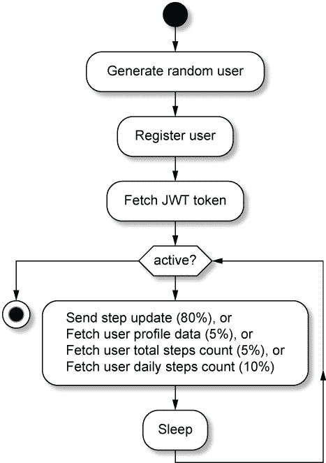

图 12.1 Locust 中模拟用户的活动

locustfile.py 文件定义了两个类。`UserBehavior` 定义了用户执行的任务，而 `UserWithDevice` 则在 0.5 到 2 秒的随机延迟之间运行这些任务。这是请求之间的相对较短延迟，以增加每秒请求的整体数量。

运行 Locust 测试有两个参数：

+   要模拟的用户数量

+   孵化率，即在初始爬坡阶段每秒创建的新用户数量

如第七章所述，你需要从 part2-steps-challenge 文件夹中使用终端中的`docker-compose up`命令运行容器服务。然后你可以在另一个终端中运行所有基于 Vert.x 的服务。如果你安装了 foreman，可以使用`foreman start`，或者可以使用 Procfile 中的命令运行所有服务。

下面的列表显示了执行初始预热运行的命令。

列表 12.1 Locust 预热运行

```
$ cd part2-steps-challenge/load-testing
$ ulimit -n 10000                                 ❶
$ locust --headless \                             ❷
    --host http://192.168.0.23 \                  ❸
    --users 50 --hatch-rate 1 --run-time 3m       ❹
```

❶ 将每个进程的打开文件描述符数量提高到 10,000 个。

❷ 不要启动 Locust 的 Web 界面。

❸ 将此替换为运行服务的机器的 IP 地址（或者在最坏的情况下，使用 localhost）。

❹ 50 个客户端，每秒 1 个新客户端，执行 3 分钟

进行这样的预热运行很重要，因为运行各种服务的 JVM 需要在开始高效运行代码之前有一些工作负载。之后，你可以运行更大的工作负载，以获得对你服务性能的第一估计。

下面的列表显示了运行 5 分钟测试的命令，使用 150 个客户端和每秒 2 个新用户的孵化率。

列表 12.2 Locust 运行

```
$ mkdir data/
$ locust --headless \
    --host http://192.168.0.23 \
    --users 150 --hatch-rate 2 --run-time 5m \
    --csv data/locust-run                        ❶
```

❶ 将结果输出到 CSV 文件中。

让我们运行实验并收集结果。我们将得到每种类型请求的各种指标，例如平均响应时间、最小/最大时间、中位数时间等。一个有趣的指标是给定百分比的延迟。

让我们以第 80 百分位的延迟为例。这是 80%的请求观察到的最大延迟。如果这个延迟是 100 毫秒，这意味着 80%的请求花费的时间少于 100 毫秒。同样，如果第 95 百分位的延迟是 150 毫秒，这意味着 95%的请求花费的时间最多为 150 毫秒。第 100 百分位揭示了观察到的最坏情况。

在测量性能时，我们通常对第 95 百分位和第 100 百分位之间的延迟感兴趣。假设第 90 百分位的延迟是 50 毫秒，但在第 95 百分位是 3 秒，在第 99 百分位是 20 秒。在这种情况下，我们明显存在性能问题，因为我们观察到大量不良延迟。相比之下，在第 90 百分位观察到 50 毫秒的延迟，在第 99 百分位观察到 70 毫秒的延迟，表明服务具有非常一致的行为。

在负载下，一个服务行为的延迟分布比平均延迟更能说明问题。我们真正感兴趣的不是最佳情况，而是那些我们观察到最差结果的情况。图 12.2 展示了我在 5 分钟内使用 150 个用户进行的一次运行延迟报告。

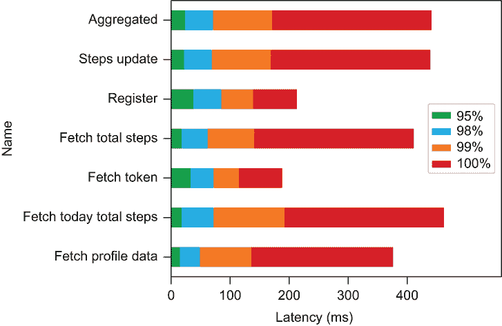

图 12.2 使用 Locust 在 5 分钟内观察到的 150 个用户的延迟

图表包含第 95、98、99 和 100 个百分位数的值。报告的延迟在所有请求的第 99 个百分位数下都低于 200 毫秒，这在条件不完美且没有调整的情况下听起来是合理的。第 100 个百分位数的值显示了观察到的最差响应时间，并且它们都在 500 毫秒以下。

我们可以增加用户数量以进一步增加应用程序的压力，但我们不会使用 Locust 进行精确的负载测试。如果你增加用户数量，你将很快看到延迟和错误开始增加。这并不是由于正在测试的应用程序，而是由于撰写本文时 Locust 的限制：

+   Locust 的网络堆栈效率不高，所以我们很快就会达到并发用户的限制。

+   与许多负载测试工具一样，Locust 受到“协调遗漏”问题的影响，这是一个由于忽略了请求实际发出之前的时间而导致的测量时间不正确的问题。1

为了进行准确的负载测试，我们因此必须使用另一个工具，而 Hey 就是一个不错的选择。

提示：Locust 仍然是一个很好的工具，可以产生少量负载，甚至可以自动化项目的演示。一旦启动并模拟用户，你就可以连接到仪表板 Web 应用程序并实时查看更新。

### 12.1.3 使用 Hey 进行 API 压力测试

Hey 比 Locust 简单得多，因为它不能运行脚本，它专注于对 HTTP 端点进行压力测试。然而，它是一个在压力下获取端点准确测量的优秀工具。

我们仍然会在旁边使用 Locust 来模拟少量用户。这将生成系统跨所有服务和中间件的活动，因此我们的测量不会在空闲系统中进行。

我们将使用两种不同的请求来对公共 API 端点进行压力测试：

+   获取用户的总步骤数。

+   进行身份验证并获取 JWT 令牌。

这很有趣，因为要获取用户的步骤数，公共 API 服务需要向活动服务发出 HTTP 请求，该服务随后查询 PostgreSQL 数据库。获取 JWT 令牌涉及更多工作，因为用户配置文件服务需要在进行一些加密工作之前查询两次，最后返回 JWT 令牌。因此，这些请求的总延迟受到 HTTP API、用户和活动服务以及最终数据库中完成的工作的影响。

注意：这里的目的是不是识别服务的最大吞吐量和最佳延迟的限制。我们想要有一个基线来观察服务在持续负载下的行为，这将在以后帮助我们描述各种类型故障和缓解策略的影响。

由于 Hey 不能运行脚本，我们必须专注于一个用户，并将对 Hey 的调用封装在 shell 脚本中。你将在 part2-steps-challenge/load-testing 文件夹中找到辅助脚本。第一个脚本是 create-user.sh，如下所示。

列表 12.3 创建用户的脚本

```
#!/bin/bash
http http://localhost:4000/api/v1/register \     ❶
  username="loadtesting-user" \
  password="13tm31n" \
  email="loadtester@my.tld" \
  deviceId="p-123456-abcdef" \
  city="Lyon" \
  makePublic:=true

for n in `seq 10`; do                            ❷
  http http://localhost:3002/ingest \
    deviceId="p-123456-abcdef" \
    deviceSync:=$n \
    stepsCount:=1200
done
```

❶ 注册 loadtesting-user 用户。

❷ 发布 10 次包含 1,200 步的更新。

此脚本确保用户 `loadtesting-user` 已创建，并且已记录了一些更新。

下面的列表中 run-hey-user-steps.sh 脚本使用 Hey 并获取用户 `loadtesting-user` 的总步数。

列表 12.4 运行 Hey 和负载测试以获取用户总步骤数的脚本

```
#!/bin/bash
hey -z $2 \                                           ❶
    -o csv \                                          ❷
    -H 'Authorization: Bearer <TOKEN>' \              ❸
    http://$1:4000/api/v1/loadtesting-user/total \    ❹
    > data/hey-run-steps-z$2.csv                      ❺
```

❶ 运行持续时间（`10s`、`5m` 等）

❷ 启用 CSV 输出。

❸ 传递用户 loadtesting-user 的 JWT 令牌。

❹ 服务的 URL，其中主机名是一个变量

❺ 将 CSV 输出重定向到文件。

下面的列表中 run-hey-token.sh 脚本类似，执行身份验证请求以获取 JWT 令牌。

列表 12.5 运行 Hey 和负载测试以获取 JWT 令牌的脚本

```
#!/bin/bash
hey -z $2 \
    -m POST \                ❶
    -D auth.json \           ❷
    -T application/json \    ❸
    -o csv \
    http://$1:4000/api/v1/token \
    > data/hey-run-token-z$2.csv
```

❶ 指定这是一个 HTTP POST 请求。

❷ 发送包含 loadtesting-user 用户凭证的 auth.json 文件内容。

❸ 指定有效载荷是某些 JSON 数据。

我们现在准备好对用户总步骤数端点进行运行。在我的情况下，我使用第二台笔记本电脑进行实验，而我的主要笔记本电脑运行服务，当我在测试时，它的 IP 地址是 192.168.0.23。首先，我们将使用 Locust 获取一些轻量级背景工作负载，再次确保系统不是完全空闲：

```
$ locust --headless --host http://192.168.0.23 --users 20 --hatch-rate 2
```

在另一个终端中，我们将使用 Hey 运行五分钟的测试：

```
./run-hey-user-steps.sh 192.168.0.23 5m
```

一旦我们收集了结果，分析它们最好的方式是处理数据并绘制图表。你将在 part2-steps-challenge/load-testing 文件夹中找到执行此操作的 Python 脚本。图 12.3 显示了此实验的图表。

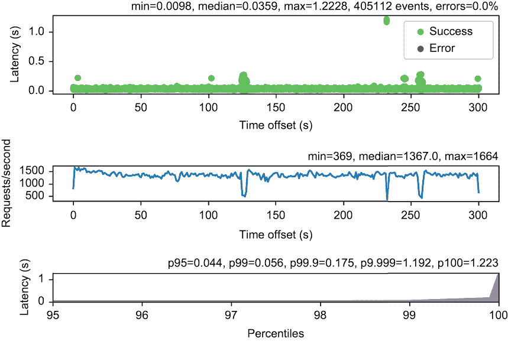

图 12.3 用户总步骤数负载测试报告

该图包含三个子图：

+   随时间变化的请求延迟的散点图

+   与请求延迟图具有相同刻度的吞吐量图

+   95% 到 100% 分位数的延迟分布

当吞吐量高时，99.99% 分位数的延迟非常好。与 Locust 的 100 用户负载相比，使用 Hey 我们可以得到更好的结果。我们可以看到一些与更高延迟响应相关的短吞吐量下降，但在这些条件下没有什么需要担心的。这些下降可能是由各种因素引起的，包括 PostgreSQL、WiFi 网络，或 JVM 垃圾收集器运行。使用更好的硬件（运行 Linux、有线网络、一些 JVM 调优和正确配置的 PostgreSQL 数据库服务器）很容易得到更好的结果。

我们可以运行另一个负载测试实验，获取 JWT 令牌：

```
./run-hey-token.sh 192.168.0.23 5m
```

结果显示在图 12.4 中。

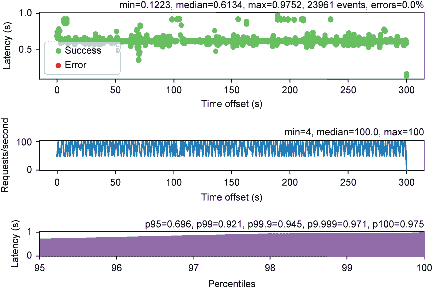

图 12.4 JWT 令牌负载测试报告

这些结果再次显示了一致的行为，尽管与步骤计数端点相比，延迟更高，吞吐量更低。这很容易解释，因为有两个 HTTP 请求到用户配置文件服务，然后必须生成并签名令牌。HTTP 请求主要是 I/O 密集型，而令牌签名需要在事件循环上执行 CPU 密集型工作。五分钟运行的结果是一致的。

可以安全地得出结论，测试的服务实现能够在负载下提供稳定的性能。你可以尝试增加 Hey 的工作者数量，看看在大负载下会发生什么（参见 `hey` 工具的 `-c` 标志）。你也可以使用增加的请求速率进行延迟测量（参见 `-q` 标志），但请注意，默认情况下 Hey 不进行速率限制，所以在之前的运行中 Hey 使用了默认的 50 个工作者（默认值）。

可伸缩性只是反应性的半部分，因此现在让我们看看我们的服务在出现故障的情况下，如何处理相同的工作负载。

## 12.2 让我们进行一些混沌工程

严格来说，*混沌工程*是指在生产系统中自愿引入故障的实践，以观察它们对意外应用程序、网络和基础设施故障的反应。例如，你可以尝试关闭数据库、停止服务、引入网络延迟，甚至中断网络之间的流量。而不是等待生产中出现故障，在周日早上 4 点叫醒值班的服务可靠性工程师，你可以选择主动地定期自己引入故障。

在软件投入生产之前，你还可以进行混沌工程，因为核心原则保持不变：运行带有一定工作负载的软件，引入某种形式的故障，并观察软件的表现。

### 12.2.1 测试计划

我们需要一个可重复的场景来评估服务，因为它们将在正常和故障阶段之间交替。我们将根据图 12.5 中的计划引入故障。

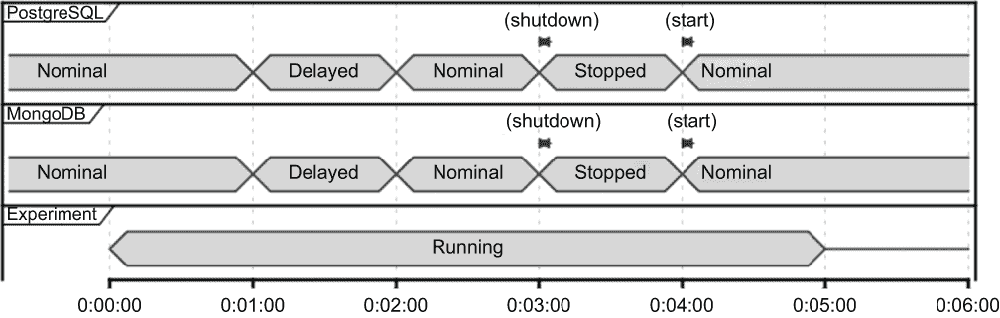

图 12.5 测试计划

我们将在五分钟的时间段内运行与之前章节相同的负载测试实验。变化之处在于，我们将将其分为五个阶段，每个阶段为一分钟：

1.  数据库在第一分钟内正常工作。

1.  我们将在第二分钟为所有数据库流量引入三秒（± 500 毫秒）的网络延迟。

1.  我们将在第三分钟恢复到正常性能。

1.  我们将停止两个数据库四分钟。

1.  我们将在第五和最后一分钟恢复到正常性能。

网络延迟增加了延迟，但它们也模拟了一个开始变得不响应的过载数据库或服务。在极端的延迟值下，它们还可以模拟一个不可达的主机，其中建立 TCP 连接需要很长时间才能失败。另一方面，停止数据库模拟了服务已关闭而其主机仍然在线的情况，这应该会导致快速的 TCP 连接错误。

我们将如何引入这些故障？

### 12.2.2 使用 Pumba 进行混沌测试

Pumba 是一个用于在 Docker 容器中引入故障的混沌测试工具 ([`github.com/alexei-led/pumba`](https://github.com/alexei-led/pumba))。它可以用于以下操作：

+   杀死、移除和停止容器

+   暂停容器中的进程

+   压力容器资源（例如，CPU、内存或文件系统）

+   仿真网络问题（数据包延迟、丢失、重复、损坏等）

Pumba 是一个非常方便的工具，你可以下载并在你的机器上运行。唯一的依赖是 Docker 必须运行。

在我们的测试计划中，我们关注两种类型的故障，因为它们对我们来说最相关。你可以轻松地玩其他类型的故障。

在本地运行 10k 步应用的情况下，让我们使用 Pumba 并对 MongoDB 数据库流量添加一些延迟。让我们使用 load-testing/fetch-token.sh 脚本获取 JWT 令牌，如下所示。

列表 12.6 获取 JWT 令牌

```
$ load-testing/fetch-token.sh      ❶
HTTP/1.1 200 OK
Content-Type: application/jwt
content-length: 528

<VALUE OF THE TOKEN>
```

❶ 位于 part2-steps-challenge 文件夹中

在另一个终端中，让我们使用以下命令引入延迟。

列表 12.7 使用 Pumba 引入一些网络延迟

```
$ pumba netem \                           ❶
    --duration 1m \                       ❷
    --tc-image gaiadocker/iproute2 \      ❸
    delay --time 3000 --jitter 500 \      ❹
    part2-steps-challenge_mongo_1         ❺
```

❶ netem 是网络问题仿真的子命令。

❷ 将会有一分钟延迟。

❸ 一个辅助 Docker 镜像

❹ 三秒延迟 ± 500 毫秒

❺ 目标容器的名称（你可以使用正则表达式来针对多个容器等）

Pumba 现在应该已经运行了一分钟。再次尝试获取 JWT 令牌；命令应该明显比之前花费更多时间，如下所示。

列表 12.8 带网络延迟获取令牌

```
$ time ./fetch-token.sh        ❶
HTTP/1.1 200 OK
Content-Type: application/jwt
content-length: 528

<TOKEN VALUE>

./fetch-token.sh  0.27s user 0.08s system 5% cpu 6.157 total
```

❶ 使用 time 来测量进程执行时间。

由于等待 I/O，进程花费了 6.157 秒来获取令牌。同样，你可以使用以下命令停止一个容器。

列表 12.9 使用 Pumba 停止容器

```
$ pumba stop --restart \       ❶
  --duration 1m \
  part2-steps-challenge_mongo_1
```

❶ 停止容器，然后重启。

如果你再次运行脚本以获取令牌，你将需要等待，而在日志中你会看到一些错误，因为 MongoDB 容器已关闭，如下所示。

列表 12.10 带停止的数据库服务器获取令牌

```
time ./fetch-token.sh
HTTP/1.1 200 OK
Content-Type: application/jwt
content-length: 528

<TOKEN VALUE>

./fetch-token.sh  0.25s user 0.07s system 0% cpu 57.315 total     ❶
```

❶ 这花了很长时间！

服务现在不响应。我的请求花费了 57.315 秒来完成，因为它必须等待数据库恢复。

通过运行测试计划，我们可以更清楚地了解，当这些故障发生并且系统处于负载测试之下时会发生什么。

### 12.2.3 我们（目前）还没有弹性

要运行这些实验，你将使用与本章前面相同的 shell 脚本启动 Hey。你最好使用两台机器。part2-steps-challenge/负载测试文件夹包含一个 run-chaos.sh shell 脚本，通过在正确的时间调用 Pumba 来自动化测试计划。关键是同时启动 run-chaos.sh 和 Hey 脚本（例如，run-hey-token.sh）。

图 12.6 显示了服务在获取用户总步数时的行为。结果显示，当 Pumba 运行时，响应性明显不足。

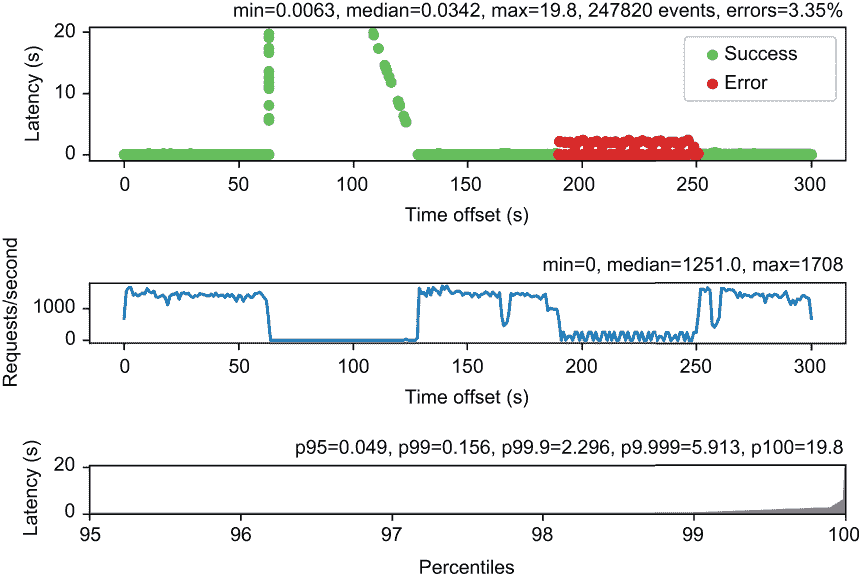

图 12.6 总步数负载测试失败情况

在网络延迟的阶段，我们看到延迟迅速增加，达到近 20 秒，之后吞吐量崩溃。这里发生的情况是，请求被排队等待在公共 API 和用户配置文件服务中响应，直到系统停止。数据库延迟在 2.5 秒到 3.5 秒之间，这在实践中可能会暂时发生。当然，由于负载测试，这个问题被大大放大了，但任何有一定持续流量的服务即使有较小的延迟也可能表现出这种行为。

在数据库关闭的阶段，我们看到了整个模拟故障期间的错误。虽然对错误感到惊讶很难，但我们也可以看到系统并没有完全停止。尽管如此，这还远非完美，因为降低的吞吐量是请求需要“一些”时间才能得到错误信号的一个迹象，而其他请求则等待超时，或者当数据库重新启动时最终完成。

现在我们来看看图 12.7，看看获取 JWT 令牌的过程。


图 12.7 JWT 令牌负载测试失败情况

网络延迟也会导致系统停止，但在散点图中我们没有观察到相同的形状。这是由于此类请求的服务本身吞吐量较低，以及需要两个 HTTP 请求的事实。请求堆积，等待响应到达，一旦延迟停止，系统再次开始运行。更有趣的是，我们在数据库停止的阶段没有观察到错误。因为系统正在等待数据库，所以不再有请求被服务。

从这两个实验中，我们可以看到在存在失败的情况下，服务变得无响应，因此它们不是反应式的。好消息是，有方法可以解决这个问题，所以让我们看看我们如何再次变得反应式，再次以公共 API 作为参考。你将能够将技术外推到其他服务。

## 12.3 从“可扩展”到“可扩展且具有弹性”

为了使我们的应用程序具有弹性，我们必须对公共 API 进行更改，并确保在检测到失败时能够快速响应。我们将探讨两种方法：强制执行超时，然后使用断路器。

### 12.3.1 强制执行超时

前面的实验观察表明，在等待数据库恢复到正常条件或 TCP 错误出现时，请求会堆积。一种初步的方法是在 HTTP 客户端请求中强制执行短超时，这样当用户配置文件或活动服务响应时间过长时，它们会快速失败。更改非常简单：我们只需要向 Vert.x 网络客户端发出的 HTTP 请求中添加超时，如图 12.11 所示。

提示：您可以在 Git 仓库的 chapter12/public-api-with-timeouts 分支中找到相应的代码更改。

列表 12.11 带超时的`totalSteps`方法实现

```
private void totalSteps(RoutingContext ctx) {
  String deviceId = ctx.user().principal().getString("deviceId");
  webClient
    .get(3001, "localhost", "/" + deviceId + "/total")
    .timeout(5000)                                      ❶
    .as(BodyCodec.jsonObject())
    .rxSend()
    .subscribe(
      resp -> forwardJsonOrStatusCode(ctx, resp),
      err -> sendBadGateway(ctx, err));
}
```

❶ 五秒后超时

`fetchUserDetails`和`token`方法中的更改相同。五秒的超时相对较短，并确保快速通知错误。

直观上看，这应该会提高公共 API 服务的响应性，并避免吞吐量停滞。让我们通过再次运行混沌测试实验来查看会发生什么，如图 12.8 所示。

与图 12.6 中的实验相比，我们在失败期间仍然有大幅降低的吞吐量，但至少我们看到了错误报告，这得益于超时强制执行。我们还看到最大延迟低于六秒，这与五秒的超时相符。

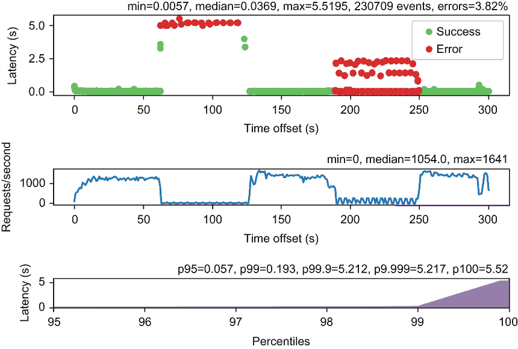

图 12.8 带有失败和超时的总步骤数负载测试

现在我们来看看 JWT 令牌负载测试的行为，如图 12.9 所示。这次运行确认了我们观察到的结果：超时被强制执行，确保在失败期间仍有部分请求被服务。然而，最坏情况下的延迟比没有超时的情况更差：网络延迟将向用户配置文件服务发送两个 HTTP 请求的时间拉长，因此较高的值对应于第二个请求超时的情况。

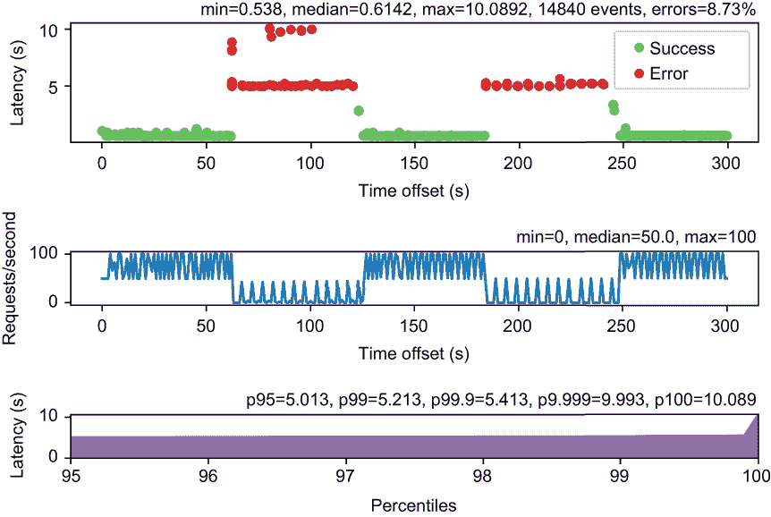

图 12.9 带有失败和超时的 JWT 令牌负载测试

在提高响应性方面，超时比没有超时更好，但我们不能将我们的公共 API 服务称为具有弹性。我们需要的是一种让服务“知道”正在发生故障的方法，这样它就会快速失败，而不是等待超时发生。这正是断路器的作用所在！

### 12.3.2 使用断路器

断路器的目的是防止前一部分中观察到的问题，即对无响应系统的请求堆积，导致分布式服务之间发生级联错误。断路器充当发出（网络）请求的代码（如 RPC 调用、HTTP 请求或数据库调用）与要调用的服务之间的代理形式。

图 12.10 展示了断路器作为有限状态机的工作方式。这个想法相当简单。断路器从 *关闭* 状态开始，对于每个请求，它观察请求是否成功。失败可能是由于报告了错误（例如，TCP 超时或 TCP 连接错误），或者是因为操作完成得太慢。

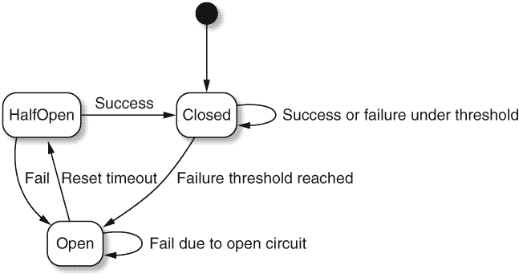

图 12.10 断路器状态机

一旦报告了一定数量的错误，断路器将进入 *开启* 状态。从这里开始，所有操作都会通知由于电路开启而导致的故障。这避免了向无响应的服务发出进一步请求，从而允许快速错误响应，尝试替代恢复策略，并减轻服务端和请求端的压力。

断路器在经过一些 *重置* 超时后离开 *开启* 状态并进入 *半开启* 状态。在 *半开启* 状态下的第一个请求确定服务是否已恢复。与 *开启* 状态不同，*半开启* 状态是我们再次开始执行实际操作的地方。如果成功，断路器将返回到 *关闭* 状态并继续正常服务。如果不成功，在它返回到 *半开启* 状态之前将开始另一个重置周期，并检查服务是否恢复。

提示：您可以在 Git 仓库的 chapter12/public-api-with-circuit-breaker 分支中找到这里讨论的代码更改。

Vert.x 提供了 `vertx-circuit-breaker` 模块，需要将其添加到公共 API 项目中。我们将使用两个断路器：一个用于令牌生成请求，另一个用于对活动服务的调用（例如获取用户的总步数）。以下列表显示了在 `PublicApiVerticlerxStart` 方法中创建断路器的代码。

列表 12.12 创建断路器

```
String tokenCircuitBreakerName = "token-circuit-breaker";
tokenCircuitBreaker = CircuitBreaker.create(
  tokenCircuitBreakerName, vertx, circuitBreakerOptions());                 ❶

tokenCircuitBreaker
  .openHandler(v -> this.logBreakerUpdate("open", tokenCircuitBreakerName));❷
tokenCircuitBreaker
  .halfOpenHandler(v -> this.logBreakerUpdate("half open", 
  ➥ tokenCircuitBreakerName));                                             ❸
tokenCircuitBreaker
  .closeHandler(v -> 
  ➥ this.logBreakerUpdate("closed", tokenCircuitBreakerName));             ❹
```

❶ 使用名称和选项创建断路器。

❷ 进入开启状态时的回调

❸ 进入半开启状态时的回调

❹ 进入关闭状态时的回调

`tokenCircuitBreakerName` 引用是一个 `CircuitBreaker` 类型的字段。还有一个名为 `activityCircuitBreaker` 的字段用于活动服务断路器，代码是相同的。可以在状态变化时可选地设置回调。为了诊断目的，记录这些状态变化是一个好主意。

以下列表显示了断路器配置。

列表 12.13 配置断路器

```
private CircuitBreakerOptions circuitBreakerOptions() {
  return new CircuitBreakerOptions()
    .setMaxFailures(5)                ❶
    .setMaxRetries(0)                 ❷
    .setTimeout(5000)                 ❸
    .setResetTimeout(10_000);         ❹
}
```

❶ 五次失败后开启。

❷ 不要重试失败的操作。

❸ 五秒后报告超时失败。

❹ 重置超时设置为 10 秒。

我们将在包括操作在五秒后超时（为了与前述实验保持一致）的五次失败后打开断路器。重置超时设置为 10 秒，这将让我们能够频繁地检查服务状态。这个值应该是多长取决于你的上下文，但你可以预期，长时间的超时会增加服务在降级模式或报告错误时运行的时间，而短值可能会降低使用断路器的有效性。

下面的列表显示了修改后的`token`方法，代码被封装在断路器调用中。

列表 12.14 使用断路器的 token 方法实现

```
private void token(RoutingContext ctx) {
  tokenCircuitBreaker.<String>rxExecute(promise -> {    ❶
    JsonObject payload = ctx.getBodyAsJson();
    String username = payload.getString("username");
    webClient                                           ❷
      .post(3000, "localhost", "/authenticate")
// (...)                                                ❸
      .subscribe(promise::complete, err -> {            ❹
        if (err instanceof NoStackTraceThrowable) {     ❺
          promise.complete("");
        } else {
          promise.fail(err);                            ❻
        }
      });
  }).subscribe(                                         ❼
    token -> sendToken(ctx, token),
    err -> handleAuthError(ctx, err));
}
```

❶ 执行返回字符串的操作。

❷ 定期网络客户端调用

❸ 网络客户端和 RxJava 操作符，如前述代码。

❹ 成功完成令牌。

❺ 检查服务是否返回了非 200 状态码并完成。

❻ 由于其他错误而失败。

❼ 发送令牌或处理认证错误。

断路器执行一个操作，这里是对用户配置文件服务发起两个 HTTP 请求，然后生成 JWT 令牌。操作的结果是一个 JWT 令牌值的`Single<String>`。执行方法传递一个承诺给封装的代码，以便它可以通知操作是否成功。

`handleAuthError`方法必须修改如下，以检查任何错误的来源。

列表 12.15 处理认证错误

```
private void handleAuthError(RoutingContext ctx, Throwable err) {
  if (err instanceof OpenCircuitException) {                               ❶
    logger.error("Circuit breaker is open: {}", tokenCircuitBreaker.name());
    ctx.fail(504);
  } else if (err instanceof TimeoutException) {                            ❷
    logger.error("Circuit breaker timeout: {}", tokenCircuitBreaker.name());
    ctx.fail(504);
  } else {                                                                 ❸
    logger.error("Authentication error", err);
    ctx.fail(401);
  }
}
```

❶ 断路器处于开启状态。

❷ 操作超时。

❸ 定期认证错误

断路器会报告开路条件和操作超时，并使用专用异常。在这些情况下，我们报告 HTTP 500 状态码或经典的 401，以便请求者知道失败是否由于凭证错误。

这很好，但断路器对我们系统的实际影响是什么？让我们通过在 JWT 令牌生成上运行实验来查看。结果如图 12.11 所示。

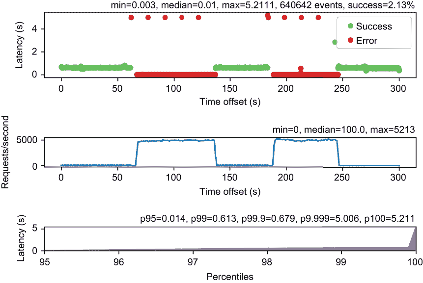

图 12.11 JTW 令牌负载测试，包括故障和断路器

断路器的影响是显著的：在故障期间，服务现在**高度**响应！在故障期间，我们获得了高吞吐量，因为当断路器打开时，服务现在会快速失败。有趣的是，我们可以看到当断路器处于半开状态时尝试发起请求：这些是定期出现的高延迟错误点。我们还可以看到，第 99.99 百分位数的延迟与之前的运行相比已经回到了较低的值。

这都很好，但关于获取用户总步骤数怎么办？

### 12.3.3 弹性和回退策略

断路器使 JWT 令牌生成即使在失败的情况下也能响应，因此端点现在是完全*响应式*的。然而，它并没有提供很多回退策略：如果我们无法与用户配置文件服务通信，我们就无法验证用户并生成 JWT 令牌。这就是为什么断路器总是报告错误。

我们可以在向活动服务发出请求时采用相同的策略，并简单地报告错误。然而，我们可以通过缓存数据和向请求者提供旧值来提供进一步的弹性。回退策略取决于功能需求：如果没有认证工作，我们无法生成 JWT 令牌，但如果我们有缓存中的旧步骤计数数据，我们当然可以提供一些。

我们将使用高效的内存中 Caffeine 缓存库 ([`github.com/ben-manes/caffeine`](https://github.com/ben-manes/caffeine))。这个库提供了管理缓存数据的可配置策略，包括计数、访问和基于时间的驱逐策略。我们可以在 Java `HashMap` 中缓存数据，但如果没有实施适当的驱逐策略，这会很快使我们面临内存耗尽问题。

下面的列表显示了如何创建最多包含 10,000 个条目的缓存，其中键是字符串，值是长整数。

列表 12.16 创建缓存

```
private Cache<String, Long> stepsCache = Caffeine.newBuilder()
  .maximumSize(10_000)                                          ❶
  .build();
```

❶ 缓存最多 10,000 个条目。

在下面的列表中，我们使用`cacheTotalSteps`方法向缓存中添加条目，当达到 10,000 个条目的限制时，Caffeine 会驱逐较旧的条目。

列表 12.17 缓存总步骤

```
private void cacheTotalSteps(String deviceId, HttpResponse<JsonObject> resp) {
  if (resp.statusCode() == 200) {
    stepsCache.put("total:" + deviceId, resp.body().getLong("count"));     ❶
  }
}
```

❶ 就像在常规 Java 映射中一样存储数据。

前面的方法用于下面的`totalSteps`方法，其中代码被断路器调用封装。

列表 12.18 使用断路器实现 `totalSteps` 方法

```
private void totalSteps(RoutingContext ctx) {
  String deviceId = ctx.user().principal().getString("deviceId");
  activityCircuitBreaker.<Void>executeWithFallback(promise -> {   ❶
    webClient
      .get(3001, "localhost", "/" + deviceId + "/total")
      .expect(ResponsePredicate.SC_OK)
      .as(BodyCodec.jsonObject())
      .rxSend()
      .subscribe(resp -> {
        cacheTotalSteps(deviceId, resp);                          ❷
        forwardJsonOrStatusCode(ctx, resp);
        promise.complete();
      }, err -> {
        tryToRecoverFromCache(ctx, deviceId);                     ❸
        promise.fail(err);
      });
  }, err -> {                                                     ❹
    tryToRecoverFromCache(ctx, deviceId);
    return null;
  });
}
```

❶ 执行的变体，带有一个回退

❷ 缓存总步骤。

❸ 尝试从缓存中恢复。

❹ 回退。

我们现在使用一个不返回任何值的断路器，因此使用`Void`参数类型。`executeWithFallback`方法允许我们在断路器打开时提供回退，这样我们就可以尝试从缓存中恢复一个值。这在上面的列表中的`tryToRecoverFromCache`方法中完成。

列表 12.19 缓存恢复的实现

```
private void tryToRecoverFromCache(RoutingContext ctx, String deviceId) {
  Long steps = stepsCache.getIfPresent("total:" + deviceId);
  if (steps == null) {                                        ❶
    logger.error("No cached data for the total steps of device {}", deviceId);
    ctx.fail(502);
  } else {                                                    ❷
    JsonObject payload = new JsonObject()
      .put("count", steps);
    ctx.response()
      .putHeader("Content-Type", "application/json")
      .end(payload.encode());
  }
}
```

❶ 将缓存数据作为成功响应发送。

❷ 发送错误，因为我们没有数据。

通过在`tryToRecoverFromCache`方法中从缓存中恢复，我们并不总是发送错误。如果我们有缓存中的数据，我们仍然可以提供响应，尽管可能是一个过时的值。

note 使用断路器回退直接在活动服务中缓存步骤计数和从旧值恢复也可以完成。

现在是时候检查服务在获取步骤计数时的行为。首先，让我们进行一次冷启动运行，其中数据库最初处于关闭状态，服务刚刚启动。图 12.12 显示了一分钟后的数据库启动后的两分钟运行。

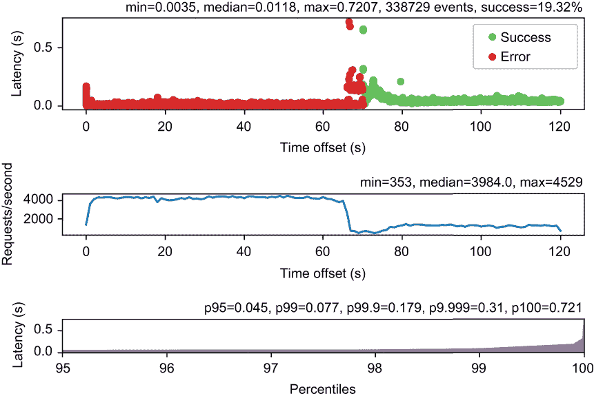

图 12.12 包含故障、断路器和冷启动的总步骤计数负载测试

服务立即开始出现一些错误，然后断路器打开，此时服务以非常低的延迟持续提供错误。请记住，服务还没有缓存任何数据。

当数据库启动时，我们可以看到延迟峰值，错误变为成功，然后服务能够正常响应。请注意，在前几秒钟的成功中，JVM 将开始优化与数据库通信的代码，因此吞吐量有所提高。

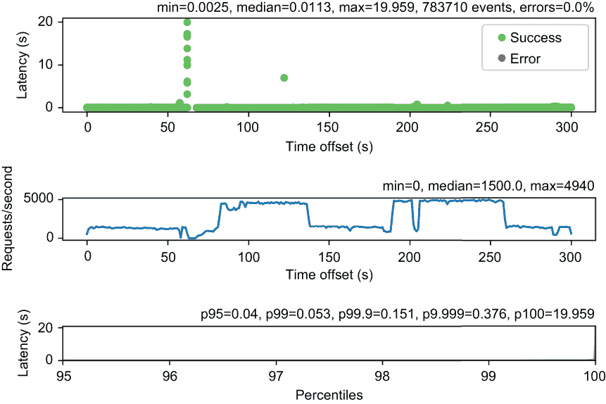

图 12.13 包含故障和断路器的总步骤计数负载测试

图 12.13 显示了整个五分钟测试计划中的服务行为。由于测试计划从数据库正常运行开始，服务成功缓存了测试用户的数据。这就是为什么在整个运行过程中我们没有出现任何错误。当网络延迟出现时，我们看到了一些成功，但延迟较高，这实际上影响了 99.99 百分位以上的最后几个百分位。这些是由于断路器在发起 HTTP 请求时报告超时，但请注意，断路器不能*取消*HTTP 请求。因此，我们有一些 HTTP 请求正在等待一个无响应的活动服务，而此时断路器同时使用一些缓存数据完成相应的 HTTP 响应。

图 12.14 显示了将断路器与五秒超时结合使用对 Web 客户端 HTTP 请求的影响（请参阅 Git 仓库的 chapter12/public-api-with-circuit-breaker-and-timeouts 分支）。

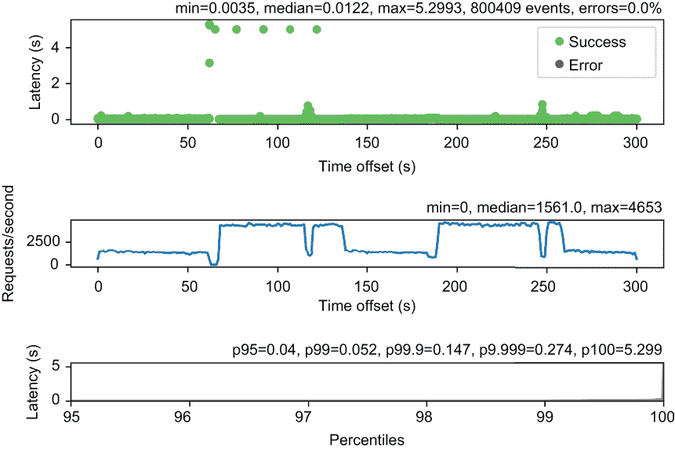

图 12.14 包含故障、超时和断路器的总步骤计数负载测试

这明显提高了结果，因为我们不再有大约 20 秒的最坏情况延迟。除此之外，延迟和吞吐量在整个运行过程中保持一致，并且几乎不受大约 4 分钟时数据库停止的影响。

备注：断路器是一个非常有用的工具，可以避免级联故障，但你不必将每个网络操作都包裹在断路器中。每个抽象都有成本，断路器确实增加了间接层次。相反，最好使用混沌测试并确定它们最有可能对整体系统行为产生积极影响的地方。

我们现在有一个反应式服务：它不仅资源高效且可扩展，而且对故障具有弹性。服务在所有情况下都能持续响应，延迟得到控制。

下一章和最后一章讨论在容器环境中运行 Vert.x 应用程序。

## 摘要

+   一个反应式服务不仅仅是可扩展的；它必须具有弹性和响应性。

+   压力测试和混沌测试工具是分析服务行为的关键，无论是处于正常条件下的操作，还是周围有它所依赖的网络和服务的故障。

+   断路器是保护服务免受无响应服务和网络故障影响的最有效工具。

+   一个具有弹性的服务不仅在能够快速通知错误时是响应的；它仍然可能能够成功响应，例如，如果应用程序领域允许，可以使用缓存数据。

***

1. Gil Tene，“如何不测量延迟”，2015 年在 Strange Loop 会议上发表的演讲；[www.youtube.com/watch?v=lJ8ydIuPFeU](https://www.youtube.com/watch?v=lJ8ydIuPFeU)。
