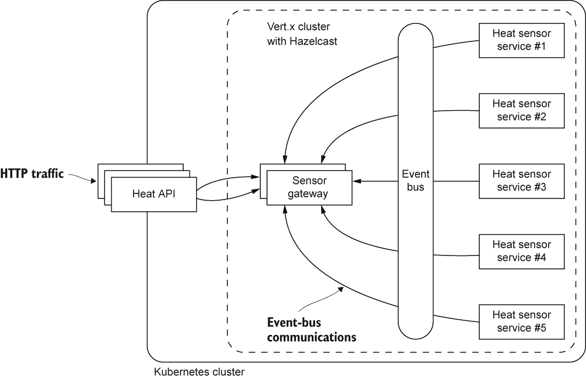
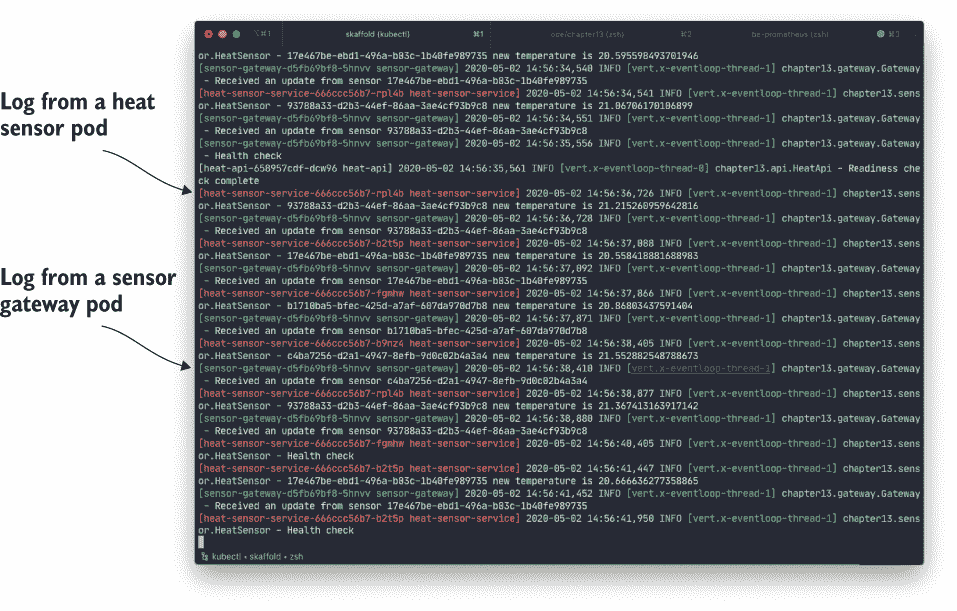
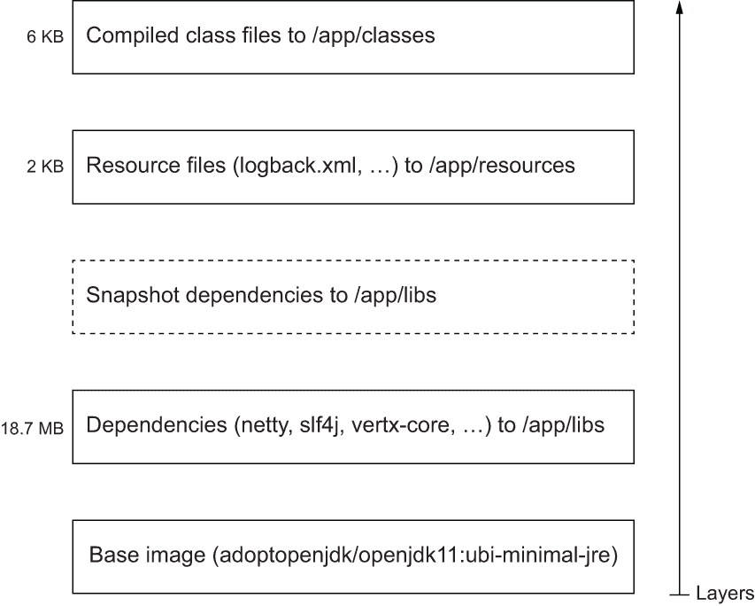
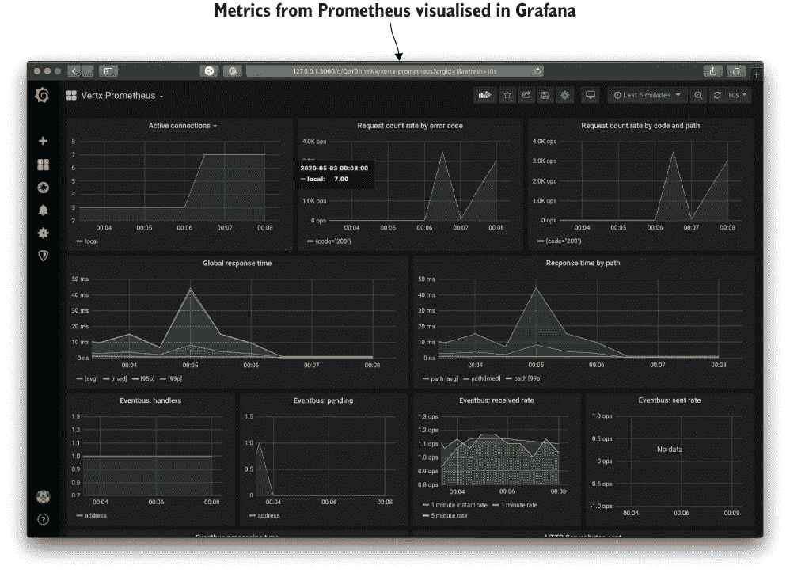

# 13 最终笔记：容器原生 Vert.x

本章涵盖

+   使用 Jib 高效构建容器镜像

+   配置 Vert.x 集群以在 Kubernetes 集群中工作

+   将 Vert.x 服务部署到 Kubernetes 集群

+   使用 Skaffold 和 Minikube 进行本地开发

+   公开健康检查和指标

到现在为止，您应该对反应式应用程序是什么以及 Vert.x 如何帮助您构建可扩展、资源高效和具有弹性的服务有一个坚实的理解。在本章中，我们将讨论与在 Kubernetes 集群容器环境中部署和运行 Vert.x 应用程序相关的一些主要问题。您将学习如何准备 Vert.x 服务以便在 Kubernetes 中良好运行，以及如何使用高效的工具打包容器镜像并在本地运行它们。您还将学习如何公开健康检查和指标，以更好地将服务集成到容器环境中。

考虑到本书的核心目标是教授您自我学习反应式概念和实践，本章是可选的。然而，Kubernetes 是一个流行的部署目标，学习如何使 Vert.x 应用程序成为此类环境中的首选公民是值得的。

在本章中，我将假设您对容器、Docker 和 Kubernetes 有基本的了解，这些内容在其他书籍中有深入介绍，例如 Marko Lukša 的 *Kubernetes in Action* 第二版（Manning，2020）和 Jeff Nickoloff 以及 Stephen Kuenzli 编著的 *Docker in Action* 第二版（Manning，2019）。如果您对这些问题了解不多，您仍然能够理解和运行本章中的示例，并且您将在学习过程中了解一些 Kubernetes 基础知识，但我不将花费时间解释 Kubernetes 的核心概念，如 *pods* 和 *services*，或描述 `kubectl` 命令行工具的细微差别。

工具版本

本章是在以下工具版本下编写和测试的：

+   Minikube 1.11.0

+   Skaffold 1.11.0

+   k9s 0.20.5（可选）

+   Dive 0.9.2（可选）

## 13.1 云中的热传感器

在本章的最后，我们将回到基于热传感器的用例，因为它将比处理 10k 步挑战应用程序更简单。

在这个场景中，热传感器会定期发布温度更新，可以使用 API 从所有传感器检索最新的温度，并且可以识别出温度异常的传感器。该应用程序基于三个微服务，您可以在源代码 Git 仓库中找到这些微服务，如图 13.1 所示。

这里是每个服务的作用：

+   `heat-sensor-service`--代表一个通过 Vert.x 事件总线发布温度更新的热传感器。它提供了一个 HTTP API 用于获取当前温度。

+   `sensor-gateway`--通过 Vert.x 事件总线收集所有热传感器服务的温度更新。它提供了一个 HTTP API 用于检索最新的温度值。

+   `heat-api`--一个用于检索最新温度值和检测温度不在预期范围内的传感器的 HTTP API。

热传感器服务需要扩展以模拟多个传感器，而传感器网关和 API 服务只需每个实例一个即可正常工作。换句话说，后两者不共享状态，因此如果工作负载需要，它们也可以扩展到多个实例。



图 13.1 用例概述

热 API 是唯一旨在集群外部暴露的服务。传感器网关是集群内部服务。热传感器服务应仅作为集群内部的实例部署，但它们不需要负载均衡器。Vert.x 集群管理器使用 Hazelcast。

让我们快速查看这些服务实现中值得注意的代码部分。

### 13.1.1 热传感器服务

热传感器服务基于本书早期章节中的代码，特别是第三章的内容。从`scheduleNextUpdate`方法中设置的定时器调用的`update`方法已更新如下。

列表 13.1 新的`update`方法

```
private void update(long tid) {
  temp = temp + (delta() / 10);
  vertx.eventBus().publish(targetDestination, makeJsonPayload());    ❶
  logger.info("{} new temperature is {}", id, temp);
  scheduleNextUpdate();
}

private JsonObject makeJsonPayload() {                               ❷
  return new JsonObject()
    .put("id", id)
    .put("timestamp", System.currentTimeMillis())
    .put("temp", temp);
}
```

❶ 发布到事件总线。

❷ 准备一个 JSON 温度更新有效负载。

我们仍然有相同的逻辑，并将 JSON 温度更新文档发布到事件总线。我们还引入了`makeJsonPayload`方法，因为它也用于 HTTP 端点，如下所示。

列表 13.2 通过 HTTP 获取热传感器数据

```
private void handleRequest(RoutingContext ctx) {
  ctx.response()
    .putHeader("Content-Type", "application/json")
    .end(makeJsonPayload().encode());                ❶
}
```

❶ 发送 JSON 数据

最后，我们在`HeatSensor` verticle 的`start`方法中从环境变量获取服务配置，如下所示。

列表 13.3 从环境变量获取传感器配置

```
Map<String, String> env = System.getenv();                                ❶
int httpPort = Integer.parseInt(env.getOrDefault("HTTP_PORT", "8080"));   ❷
targetDestination = env.getOrDefault("EB_UPDATE_DESTINATION", 
➥ "heatsensor.updates");                                                 ❸
```

❶ 访问环境变量。

❷ 获取 HTTP 端口。

❸ 获取事件总线目标。

环境变量很棒，因为当运行服务时很容易覆盖它们。由于它们以 Java `Map`的形式暴露，我们可以利用`getOrDefault`方法来设置默认值。

Vert.x 还提供了`vertx-config`模块（本书未涉及），如果您需要更高级的配置，如合并文件、环境变量和分布式注册表。您可以在 Vert.x 网站文档中了解更多信息（[`vertx.io/docs/`](https://vertx.io/docs/)）。然而，对于大多数情况，使用 Java `System`类解析几个环境变量要简单得多。

### 13.1.2 传感器网关

传感器网关通过 Vert.x 事件总线通信从热传感器服务收集温度更新。首先，它从环境变量中获取配置，如列表 13.3 所示，因为它需要一个 HTTP 端口号和一个事件总线目标来监听。`start`方法设置了一个事件总线消费者，如下所示。

列表 13.4 网关事件总线消费者

```
vertx.eventBus().<JsonObject>consumer(targetDestination, message -> {   ❶
  JsonObject json = message.body();
  String id = json.getString("id");
  data.put(id, json);                                                   ❷
  logger.info("Received an update from sensor {}", id);
});
```

❶ 注册一个处理程序。

❷ 将其放入映射中。

每个传入的 JSON 更新都放入一个`data`字段中，该字段是一个`HashMap<String, JsonObject>`，用于存储每个传感器的最后更新。

HTTP API 通过`/data`端点暴露收集到的传感器数据，该端点由以下代码处理。

列表 13.5 网关数据请求 HTTP 处理器

```
private void handleRequest(RoutingContext ctx) {
  JsonArray entries = new JsonArray();
  for (String key : data.keySet()) {                            ❶
    entries.add(data.get(key));
  }
  JsonObject payload = new JsonObject().put("data", entries);   ❷
  ctx.response()
    .putHeader("Content-Type", "application/json")
    .end(payload.encode());
}
```

❶ 在 JSON 数组中收集条目。

❷ 将数组放入 JSON 文档并发送。

此方法通过将所有收集到的数据组装成一个数组来准备 JSON 响应，然后将其包装在 JSON 文档中。

### 13.1.3 Heat API

此服务提供所有传感器数据，或者仅提供温度超出预期正确值范围的服务数据。为此，它向传感器网关发送 HTTP 请求。

配置再次通过环境变量提供，如下所示。

列表 13.6 Heat API 配置环境变量

```
Map<String, String> env = System.getenv();
int httpPort = Integer.parseInt(env.getOrDefault("HTTP_PORT", "8080"));
String gatewayHost = env.getOrDefault("GATEWAY_HOST", "sensor-gateway");     ❶
int gatewayPort = Integer.parseInt(env.getOrDefault("GATEWAY_PORT", "8080"));❷
lowLimit = Double.parseDouble(env.getOrDefault("LOW_TEMP", "10.0"));         ❸
highLimit = Double.parseDouble(env.getOrDefault("HIGH_TEMP", "30.0"));       ❹
```

❶ 传感器网关地址

❷ 传感器网关端口号

❸ 正确的温度下限

❹ 正确的温度上限

服务使用环境变量解析传感器网关地址以及正确的温度范围。正如你稍后将会看到的，我们可以在将服务部署到集群时覆盖这些值。

`start`方法配置 Web 客户端向传感器网关发送 HTTP 请求，并使用 Vert.x Web 路由器暴露 API 端点。

列表 13.7 Heat API Web 客户端和路由

```
webClient = WebClient.create(vertx, new WebClientOptions()
  .setDefaultHost(gatewayHost)                              ❶
  .setDefaultPort(gatewayPort));

Router router = Router.router(vertx);                       ❷
router.get("/all").handler(this::fetchAllData);
router.get("/warnings").handler(this::sensorsOverLimits);
```

❶ 预绑定 Web 客户端主机和端口以发送请求。

❷ 暴露 API 端点的路由器

数据通过 HTTP `GET`请求从传感器网关获取，如下所示。

列表 13.8 获取传感器数据

```
private void fetchData(RoutingContext routingContext, 
➥ Consumer<HttpResponse<JsonObject>> action) {
  webClient.get("/data")                                    ❶
    .as(BodyCodec.jsonObject())
    .expect(ResponsePredicate.SC_OK)
    .timeout(5000)
    .send(ar -> {
      if (ar.succeeded()) {
        action.accept(ar.result());                         ❷
      } else {
        routingContext.fail(500);                           ❸
        logger.error("Could not fetch data", ar.cause());
      }
    });
}
```

❶ 向/data 发送请求。

❷ 调用动作处理器。

❸ 处理错误。

`fetchData`方法通用，第二个参数提供了一个自定义动作，因此我们暴露的两个 HTTP 端点可以重用请求逻辑。

`fetchAllData`方法的实现如下所示。

列表 13.9 获取所有传感器数据

```
private void fetchAllData(RoutingContext routingContext) {
  fetchData(routingContext, resp -> {
    routingContext.response()
      .putHeader("Content-Type", "application/json")
      .end(resp.body().encode());
  });
}
```

此方法除了完成带有 JSON 数据的 HTTP 请求外，没有做任何特别的事情。

下面的`sensorsOverLimits`方法更有趣，因为它会过滤数据。

列表 13.10 过滤超出范围的传感器数据

```
private void sensorsOverLimits(RoutingContext routingContext) {
  Predicate<JsonObject> abnormalValue = json -> {
    Double temperature = json.getDouble("temp");
    return (temperature <= lowLimit) || (highLimit <= temperature);
  };
  fetchData(routingContext, resp -> {
    JsonObject data = resp.body();
    JsonArray warnings = new JsonArray();      ❶
    data.getJsonArray("data").stream()         ❷
      .map(JsonObject.class::cast)             ❸
      .filter(abnormalValue)                   ❹
      .forEach(warnings::add);                 ❺
    data.put("data", warnings);                ❻
    routingContext.response()
      .putHeader("Content-Type", "application/json")
      .end(data.encode());
  });
}
```

❶ 用于收集超出限制数据的数组

❷ 使用 Java 流过滤条目。

❸ 从 Object 转换为 JsonObject。

❹ 根据温度值进行过滤。

❺ 将其添加到数组中。

❻ 组装最终的 JSON 响应。

`sensorsOverLimits`方法仅保留温度不在预期范围内的条目。为此，我们采用功能处理方法，使用 Java 集合流，然后返回响应。请注意，如果所有传感器值都正确，响应 JSON 文档中的`data`数组可能为空。

现在你已经看到了三个服务实现中的主要有趣点，我们可以继续讨论如何在 Kubernetes 集群中实际部署它们。

### 13.1.4 在本地集群中部署

运行本地 Kubernetes 集群有许多方法。Docker Desktop 内嵌 Kubernetes，因此如果您已经在您的机器上运行它，可能只需要它来运行 Kubernetes。

Minikube 是 Kubernetes 项目提供的另一个可靠选项 ([`minikube.sigs.k8s.io/docs/`](https://minikube.sigs.k8s.io/docs/))。它在 Windows、macOS 或 Linux 上部署一个小型虚拟机，这使得它非常适合创建用于开发的可丢弃集群。如果发生任何问题，您可以轻松地销毁集群并重新开始。

Minikube 的另一个好处是它为 Docker 守护进程提供了环境变量，因此您可以将本地构建的容器镜像直接放在集群内部。在其他 Kubernetes 配置中，您需要将镜像推送到私有或公共注册表，这可能会减慢开发反馈循环，尤其是在通过慢速互联网连接将几百兆字节推送到公共注册表时。

我假设您将在这里使用 Minikube，但请随意使用任何其他选项。

提示：如果您之前从未使用过 Kubernetes，欢迎加入！尽管通过阅读本节您不会成为 Kubernetes 专家，但运行命令应该仍然能给您一个大致的了解。一旦超越庞大的生态系统和术语，Kubernetes 的主要概念相当简单。

下面的列表显示了如何创建具有四个 CPU 和 8 GB 内存集群的方法。

列表 13.11 创建 Minikube 集群

```
$ minikube start --cpus=4 --memory=8G --addons ingress       ❶
  minikube v1.9.2 on Darwin 10.15.4
  MINIKUBE_ACTIVE_DOCKERD=minikube
  Automatically selected the hyperkit driver. Other choices: 
  ➥ docker, virtualbox
  Starting control plane node m01 in cluster minikube
  Creating hyperkit VM (CPUs=4, Memory=8192MB, Disk=20000MB) ...
  Preparing Kubernetes v1.14.0 on Docker 19.03.8 ...
  Enabling addons: default-storageclass, ingress, storage-provisioner
  Done! kubectl is now configured to use "minikube"
```

❶ 启用 ingress 扩展。

标志和输出将根据您的操作系统和软件版本而有所不同。您可能需要通过查看当前的 Minikube 文档（在您阅读此章节时可能已更新）来调整这些设置。我分配了四个 CPU 和 8 GB 的内存，因为在我的笔记本电脑上这很舒适，但您可能只需要一个 CPU 和更少的 RAM。

您可以通过运行 `minikube dashboard` 命令来访问一个 Web 仪表板。使用 Minikube 仪表板，您可以查看各种 Kubernetes 资源，甚至执行一些（有限的）操作，例如调整服务的上下文或查看日志。

还有另一个我发现特别高效且可以推荐的仪表板：K9s ([`k9scli.io`](https://k9scli.io))。它作为一个命令行工具，可以非常快速地在 Kubernetes 资源之间切换，访问 pod 日志，更新副本数量等等。

Kubernetes 有一个名为 `kubectl` 的命令行工具，您可以使用它执行任何操作：部署服务、收集日志、配置 DNS 等。`kubectl` 是 Kubernetes 的瑞士军刀。我们可以使用 `kubectl` 应用每个服务 `k8s/` 文件夹中找到的 Kubernetes 资源定义。我将在稍后描述 `k8s/` 文件夹中的资源。如果您是 Kubernetes 新手，您现在需要了解的是，这些文件告诉 Kubernetes 如何部署本章中的三个服务。

有一个更好的工具可以改善您的本地 Kubernetes 开发体验，名为 Skaffold ([`skaffold.dev`](https://skaffold.dev))。与使用 Gradle（或 Maven）构建服务和打包它们，然后使用`kubectl`部署到 Kubernetes 相比，Skaffold 能够为我们完成所有这些工作，避免了不必要的构建使用缓存，执行部署，汇总所有日志，并在退出时清理一切。

您首先需要在您的机器上下载并安装 Skaffold。Skaffold 与 Minikube 无缝工作，因此不需要任何额外的配置。它只需要一个 skaffold.yaml 资源描述符，如下所示（并在 Git 仓库的第十三章文件夹的根目录中包含）。

列表 13.12 Skaffold 配置

```
apiVersion: skaffold/v1
kind: Config
metadata:
  name: chapter13
build:
  artifacts:
    - image: vertx-in-action/heat-sensor-service     ❶
      jib:
        type: gradle
        project: heat-sensor-service                 ❷
      context: .
    - image: vertx-in-action/sensor-gateway
      jib:
        type: gradle
        project: sensor-gateway
      context: .
    - image: vertx-in-action/heat-api
      jib:
        type: gradle
        project: heat-api
      context: .
deploy:
  kubectl:
    manifests:
      - "**/k8s/*.yaml"                              ❸
```

❶ 要生成的容器镜像的名称

❷ 包含源代码的项目

❸ 还应用 YAML 文件。

从第十三章文件夹中，您可以运行 `skaffold dev`，它将构建项目、部署容器镜像、公开日志以及监视文件更改。图 13.2 显示了 Skaffold 运行的截图。



图 13.2 Skaffold 运行服务的截图

恭喜，您现在已经在您的（本地）集群中运行了服务！

您不必使用 Skaffold，但为了获得良好的本地开发体验，这是一个您可以信赖的工具。它隐藏了一些`kubectl`命令行界面的复杂性，并且它弥合了项目构建工具（如 Gradle 或 Maven）与 Kubernetes 环境之间的差距。

以下列表显示了一些检查集群中部署的服务的命令。

列表 13.13 检查公开的服务

```
$ minikube tunnel                            ❶
$ kubectl get services                       ❷
NAME                 TYPE          CLUSTER-IP    EXTERNAL-IP   PORT(S)           AGE
heat-api             LoadBalancer  10.103.127.60 10.103.127.60 8080:31673/TCP    102s
heat-sensor-service  ClusterIP     None          <none>        8080/TCP,5701/TCP 102s
kubernetes           ClusterIP     10.96.0.1     <none>        443/TCP            42m
sensor-gateway       ClusterIP     10.108.31.235 <none>        8080/TCP,5701/TCP 102s
```

❶ 网络隧道，在单独的终端中运行

❷ 获取服务。

`minikube tunnel` 命令对于访问 `LoadBalancer` 服务非常重要，并且应该在单独的终端中运行。请注意，它可能需要您输入密码，因为该命令需要调整您当前的网络设置。

您还可以使用以下 Minikube 命令来获取`LoadBalancer`服务的 URL，而无需`minikube tunnel`：

```
$ minikube service heat-api --url
http://192.168.64.12:31673
```

提示：服务的 IP 地址在您的机器上可能会有所不同。随着您删除和创建新的服务，它们也会发生变化，所以不要对 Kubernetes 中的 IP 地址做出任何假设。

这之所以有效，是因为 Minikube 也将`LoadBalancer`服务作为`NodePort`暴露在 Minikube 实例 IP 地址上。当使用 Minikube 时，这两种方法都是等效的，但使用`minikube tunnel`的方法更接近您在生产集群中会得到的结果，因为服务是通过集群外部 IP 地址访问的。

现在您有了访问 heat API 服务的方法，您可以发出一些请求。

列表 13.14 与 heat API 服务交互

```
$ http 10.103.127.60:8080/all           ❶
HTTP/1.1 200 OK
Content-Type: application/json
content-length: 402

<JSON DATA>

$ http 10.103.127.60:8080/warnings      ❷
HTTP/1.1 200 OK
Content-Type: application/json
content-length: 11

<JSON DATA>
```

❶ 获取所有数据。

❷ 获取超出范围的传感器数据。

您还可以使用端口转发来访问传感器网关，如下所示。

列表 13.15 与传感器网关交互

```
$ kubectl port-forward services/sensor-gateway 8080     ❶
$ http :8080/data                                       ❷
HTTP/1.1 200 OK
Content-Type: application/json
content-length: 400

<JSON data>
```

❶ 从服务到本地端口的端口转发（在单独的终端中运行）。

❷ 调用服务。

必须在另一个终端中运行 `kubectl port-forward` 命令，并且只要它在运行，本地端口 8080 就会转发到集群内部的服务网关。这对于访问集群中运行的所有内容来说非常方便，而无需将其暴露为 `LoadBalancer` 服务。

最后，我们可以进行 DNS 查询以查看热传感器无头服务是如何解析的。以下列表使用了一个包含 `dig` 工具的第三方镜像，该工具可以用来发送 DNS 请求。

列表 13.16 DNS 查询以发现无头热传感器服务

```
$ kubectl run --image tutum/dnsutils dns -it --rm -- bash               ❶
root@dns:/# dig +short heat-sensor-service.default.svc.cluster.local    ❷
172.17.0.8
172.17.0.12
172.17.0.11
172.17.0.9
root@dns:/#
```

❶ 安装了 dig 的镜像

❷ 运行一个 DNS 查询。

现在如果我们增加副本的数量，如以下列表所示，我们可以看到 DNS 反映了这一变化。

列表 13.17 增加热传感器服务副本的数量

```
$ kubectl scale deployment/heat-sensor-service --replicas 5     ❶
$ kubectl run --image tutum/dnsutils dns -it --rm -- bash
root@dns:/# dig +short heat-sensor-service.default.svc.cluster.local
172.17.0.11
172.17.0.12
172.17.0.8
172.17.0.13
172.17.0.9
root@dns:/#
```

❶ 扩展到五个副本。

此外，如果我们像在列表 13.14 中那样发送 HTTP 请求，我们可以看到有来自五个传感器的数据。

现在我们已经部署了服务并与它们进行了交互，让我们看看 Kubernetes 中 Vert.x 服务的部署是如何工作的。

## 13.2 在 Kubernetes 中使服务工作

在 Kubernetes 中使服务 *工作* 对于大多数情况来说相当透明，特别是当它被设计为对目标运行时环境无感知时。无论它是在容器中、虚拟机中还是在裸机上运行，都不应该成为问题。尽管如此，由于 Kubernetes 的工作方式，仍有一些方面需要适应和配置。

在我们的情况下，唯一需要进行的重大适应是配置集群管理器，以便实例可以自我发现，并且可以在分布式事件总线之间发送消息。其余的只是构建服务的容器镜像并将 Kubernetes 资源描述符写入以部署服务的问题。

让我们从讨论构建容器镜像开始。

### 13.2.1 构建容器镜像

构建容器镜像有很多方法，技术上基于 *OCI Image Format* (OCIIF; [`github.com/opencontainers/image-spec`](https://github.com/opencontainers/image-spec))。构建此类镜像的最基本方法是编写一个 `Dockerfile` 并使用 `docker` `build` 命令来构建镜像。请注意，`Dockerfile` 描述符可以被其他工具如 Podman ([`podman.io/`](https://podman.io/)) 或 Buildah ([`github.com/containers/buildah`](https://github.com/containers/buildah)) 使用，因此实际上您不需要 Docker 来构建容器镜像。

因此，你可以选择一个带有 Java 的基础镜像，然后复制一个自包含的可执行 Jar 文件以运行。虽然这种方法简单且效果良好，但它意味着每次源代码发生变化时，你都需要构建一个新的镜像层，其大小与包含所有依赖项（如 Vert.x、Netty 等）的 Jar 文件大小相当。一个服务的编译类通常只有几千字节，而一个自包含的 Jar 文件则有几兆字节。

或者，你可以创建一个包含多个阶段和层的 `Dockerfile`，或者使用 Jib 这样的工具自动为你完成等效操作（[`github.com/GoogleContainerTools/jib`](https://github.com/GoogleContainerTools/jib)）。如图 13.3 所示，Jib 将不同的层组装成一个容器镜像。

项目依赖项放置在基础镜像之上；它们通常比应用程序代码和资源大，而且它们也不太经常改变，除非升级版本或添加新的依赖项。当一个项目有快照依赖项时，它们会作为固定版本依赖项之上的一个层出现，因为新的快照频繁出现。资源和类文件更改得更频繁，它们在磁盘上的使用通常较少，因此它们最终位于顶部。这种巧妙的分层方法不仅节省了磁盘空间，还提高了构建时间，因为层通常可以重用。



图 13.3 使用 Jib 的容器镜像层

Jib 提供了 Maven 和 Gradle 插件，并通过从项目中提取信息来构建容器镜像。Jib 还很棒，因为它完全用 Java 编写，并且不需要 Docker 来构建镜像，因此你可以不使用任何第三方工具来生成容器镜像。它还可以将容器镜像发布到注册表和 Docker 守护程序，这在开发中非常有用。

一旦应用了 Jib 插件，你只需要几个配置元素，如下所示为 Gradle 构建示例（Maven 版本类似，但使用 XML 实现）。

列表 13.18 配置 Jib Gradle 插件

```
jib {
  from {
    image = "adoptopenjdk/openjdk11:ubi-minimal-jre"     ❶
  }
  to {
    image = "vertx-in-action/heat-sensor"                ❷
    tags = setOf("v1", "latest")                         ❸
  }
  container {
    mainClass = "chapter13.sensor.HeatSensor"            ❹
    jvmFlags = listOf("-noverify", 
    ➥ "-Djava.security.egd=file:/dev/./urandom")        ❺
    ports = listOf("8080", "5701")                       ❻
    user = "nobody:nobody"                               ❼
  }
}
```

❶ 基础镜像

❷ 图片名称

❸ 镜像标签

❹ 要运行的主类

❺ JVM 调优标志

❻ 容器需要暴露的端口

❽ 以此用户身份运行。

基础镜像来自 AdoptOpenJDK 项目，该项目发布了多个 OpenJDK 构建（[`adoptopenjdk.net`](https://adoptopenjdk.net)）。在这里，我们使用 OpenJDK 11 作为 *Java 运行时环境*（JRE）而不是完整的 *Java 开发工具包*（JDK）。这节省了磁盘空间，因为我们只需要运行时，而 JDK 镜像比 JRE 镜像大。`ubi-minimal` 部分是因为我们使用基于 Red Hat Universal Base Image 的 AdoptOpenJDK 构建变体，其中“minimal”变体最小化了嵌入的依赖项。

Jib 需要知道要执行的主类以及要暴露在容器外的端口。在热量传感器和传感器网关服务的情况下，我们需要暴露端口 8080 以供 HTTP 服务使用，以及端口 5701 以供与 Hazelcast 的 Vert.x 聚合。JVM 调优仅限于禁用 JVM 字节码验证器，以便略微加快启动速度，并使用 /dev/urandom 进行随机数生成（默认的 /dev/random 伪文件可能在容器启动时由于熵不足而阻塞）。最后，我们以用户 `nobody` 和组 `nobody` 运行，以确保进程在容器内以非特权用户身份运行。

你可以构建一个镜像并按以下所示进行检查。

列表 13.19 将服务容器镜像构建到 Docker 守护进程

```
$ ./gradlew :heat-sensor-service:jibDockerBuild               ❶
(...)

$ docker image inspect vertx-in-action/heat-sensor:latest     ❷
(...)
```

❶ 为热量传感器服务构建一个容器镜像并将其推送到本地 Docker 守护进程。

❷ 检查容器镜像。

所有三种服务的容器镜像都是按照相同的方式构建的。唯一的配置差异是热量 API 服务只暴露端口 8080，因为它不需要集群管理器。

提示：如果你对生成容器镜像的三种服务的不同层的内容感兴趣，可以使用 Dive（[`github.com/wagoodman/dive`](https://github.com/wagoodman/dive)）这样的工具。

说到聚类，还有配置工作要做！

### 13.2.2 聚类和 Kubernetes

在第三章中使用的 Hazelcast 和 Infinispan 默认使用多播通信来发现节点。这对于本地测试和许多裸机服务器部署来说很棒，但在 Kubernetes 集群中无法使用多播通信。如果你在 Kubernetes 上以原样运行容器，热量传感器服务和传感器网关实例将无法通过事件总线进行通信。

当然，这些集群管理器可以被配置为在 Kubernetes 中执行服务发现。我们将简要介绍 Hazelcast 的情况，其中有两种可能的发现模式：

+   Hazelcast 可以连接到 Kubernetes API，以监听和发现与请求匹配的 pod，例如所需的标签和值。

+   Hazelcast 可以定期进行 DNS 查询以发现给定 Kubernetes（无头）服务的所有 pod。

DNS 方法更为有限。

相反，让我们使用 Kubernetes API 并配置 Hazelcast 使用它。默认情况下，Hazelcast Vert.x 集群管理器从 cluster.xml 资源中读取配置。以下列表显示了 heat-sensor-service/src/main/resource/cluster.xml 文件的相关配置摘录。

列表 13.20 Hazelcast 发现的 Kubernetes 配置

```
(...)
<join>
  <multicast enabled="false"/>                                              ❶
  <tcp-ip enabled="false" />
  <discovery-strategies>
    <discovery-strategy enabled="true"
     class="com.hazelcast.kubernetes.HazelcastKubernetesDiscoveryStrategy"> ❷
      <properties>
        <property name="service-label-name">vertx-in-action</property>      ❸
        <property name="service-label-value">chapter13</property>           ❹
      </properties>
    </discovery-strategy>
  </discovery-strategies>
</join>
(...)
```

❶ 禁用多播通信。

❷ 启用 Kubernetes 发现策略。

❸ 将服务与标签 vertx-in-action 匹配。

❹ 将服务与标签 vertx-in-action 的值 chapter13 匹配。

我们禁用了默认的发现机制，并启用了 Kubernetes 的发现机制。在这里，Hazelcast 形成了属于具有 `vertx-in-action` 标签且值为 `chapter13` 的服务的 pod 集群。由于我们打开了端口 5701，pod 将能够连接。请注意，配置对于传感器网关是相同的。

由于 Hazelcast 需要从 Kubernetes API 中读取，我们需要确保我们有使用 Kubernetes 基于角色的访问控制 (RBAC) 的权限。为此，我们需要应用以下列表中的 `ClusterRoleBinding` 资源和 k8s/rbac.yaml 文件。

列表 13.21 RBAC 授予 Kubernetes API 查看访问权限

```
apiVersion: rbac.authorization.k8s.io/v1
kind: ClusterRoleBinding                   ❶
metadata:
  name: default-cluster
roleRef:
  apiGroup: rbac.authorization.k8s.io      ❷
  kind: ClusterRole
  name: view
subjects:
  - kind: ServiceAccount
    name: default
    namespace: default
```

❶ 资源类型

❷ 查看角色参考

我们最后需要确保热传感器和网关服务在启用集群的情况下运行。在这两种情况下，代码是相似的。以下列表显示了热传感器服务的 `main` 方法。

列表 13.22 启用热传感器服务的集群功能

```
public static void main(String[] args) throws UnknownHostException {
  String ipv4 = InetAddress.getLocalHost().getHostAddress();         ❶
  VertxOptions options = new VertxOptions()
    .setEventBusOptions(new EventBusOptions()                        ❷
      .setHost(ipv4)                                                 ❸
      .setClusterPublicHost(ipv4));                                  ❹
  Vertx.clusteredVertx(options, ar -> {                              ❺
    if (ar.succeeded()) {
      ar.result().deployVerticle(new HeatSensor());
    } else {
      logger.error("Could not start", ar.cause());
    }
  });
}
```

❶ 获取主机的 IPv4 地址。

❷ 自定义事件总线选项。

❸ 设置主机地址。

❹ 设置其他节点需要通信的主机。

❺ 以集群模式启动 Vert.x。

我们启动一个集群化的 Vert.x 上下文，并传递选项来自定义事件总线配置。在大多数情况下，你在这里不需要进行任何额外的调整，但在 Kubernetes 的上下文中，集群可能会解析为 `localhost` 而不是实际的 IPv4 地址。这就是为什么我们首先解析 IPv4 地址，然后将事件总线配置的主机设置为该地址，这样其他节点就可以与之通信。

提示：列表 13.22 中执行的事件总线网络配置将在未来的 Vert.x 版本中自动完成。我在这里展示它是因为它可以帮助你在 Kubernetes 之外的环境中调试分布式事件总线配置问题。

### 13.2.3 Kubernetes 部署和服务资源

现在你已经知道如何将你的服务放入容器中，以及如何确保 Vert.x 集群在 Kubernetes 中工作，我们需要讨论资源描述符。实际上，Kubernetes 需要一些描述符来部署容器镜像到 pod 中并公开服务。

让我们从热传感器服务的 *部署描述符* 开始，如下所示。

列表 13.23 热传感器服务部署描述符

```
apiVersion: apps/v1
kind: Deployment                                                ❶
metadata:
  labels:
    app: heat-sensor-service
  name: heat-sensor-service                                     ❷
spec:
  selector:
    matchLabels:
      app: heat-sensor-service
  replicas: 4                                                   ❸
  strategy:
    type: RollingUpdate
    rollingUpdate:                                              ❹
      maxSurge: 1
      maxUnavailable: 1
  template:
    metadata:
      labels:
        app: heat-sensor-service
    spec:
      containers:
        - image: vertx-in-action/heat-sensor-service:latest     ❺
          name: heat-sensor-service
```

❶ 这是一个部署资源。

❷ 部署的名称

❸ 默认部署四个实例。

❹ Hazelcast 的滚动更新配置

❺ 部署的容器镜像

此部署描述符默认部署了四个 `vertx-in-action/ heat-sensor-service` 容器镜像的 pod。部署 pod 是一个好的第一步，但我们还需要一个 *服务定义* 来映射这些 pod。这对于 Hazelcast 尤为重要：记住，这些实例通过具有标签 `vertx-in-action` 且值为 `chapter13` 的 Kubernetes 服务来自我发现。

当部署通过逐步替换旧配置的 pod 为新配置的 pod 来更新时，Kubernetes 执行 *滚动更新*。最好将 `maxSurge` 和 `maxUnavailable` 的值设置为 `1`。这样做时，Kubernetes 会依次替换 pod，因此集群状态会平稳地转移到新 pod。您可以避免此配置，并让 Kubernetes 在滚动更新时更加激进，但集群状态可能在一段时间内不一致。

以下列表显示了 *服务资源定义*。

列表 13.24 热传感器服务定义

```
apiVersion: v1
kind: Service
metadata:
  labels:
    app: heat-sensor-service
    vertx-in-action: chapter13     ❶
  name: heat-sensor-service
spec:
  clusterIP: None                  ❷
  selector:
    app: heat-sensor-service       ❸
  ports:                           ❹
    - name: http
      port: 8080
    - name: hazelcast
      port: 5701
```

❶ 用于 Hazelcast 发现的标签

❷ 我们想要一个“无头”服务。

❸ 匹配具有此标签/值对的 pod

❹ 要公开的端口

服务描述符公开了一个 *无头* 服务，这意味着在 pod 之间没有负载均衡。因为每个服务都是一个传感器，它们不能互相替代。无头服务可以通过返回所有 pod 列表的 DNS 查询来发现。您在列表 13.16 中看到了如何使用 DNS 查询来发现无头服务。

传感器网关的部署描述符几乎与热传感器服务的描述符相同，您可以在下面的列表中看到。

列表 13.25 传感器网关部署描述符

```
apiVersion: apps/v1
kind: Deployment
metadata:
  labels:
    app: sensor-gateway
  name: sensor-gateway
spec:
  selector:
    matchLabels:
      app: sensor-gateway
  strategy:
    type: RollingUpdate
    rollingUpdate:
      maxSurge: 1
      maxUnavailable: 1
  template:
    metadata:
      labels:
        app: sensor-gateway
    spec:
      containers:
        - image: vertx-in-action/sensor-gateway:latest        ❶
          name: sensor-gateway
```

❶ 容器镜像

除了名称外，您还可以注意到我们没有指定副本计数，默认值为 1。服务定义如下所示。

列表 13.26 传感器网关服务定义

```
apiVersion: v1
kind: Service
metadata:
  labels:
    app: sensor-gateway
    vertx-in-action: chapter13
  name: sensor-gateway
spec:
  type: ClusterIP          ❶
  selector:
    app: sensor-gateway
  ports:
    - name: http
      port: 8080
    - name: hazelcast
      port: 5701
```

❶ 集群内部负载均衡

现在我们公开了一个进行负载均衡的服务。如果我们启动更多的 pod，流量将在它们之间进行负载均衡。`ClusterIP` 服务进行负载均衡，但它不会暴露在集群外部。

热 API 部署与我们已经完成的部署非常相似，除了有配置要传递环境变量。以下列表显示了 `spec.template.spec.containers` 部分描述符中的有趣部分。

列表 13.27 热 API 部署摘录

```
spec:
  containers:
    - image: vertx-in-action/heat-api:latest
      name: heat-api
      env:                                   ❶
        - name: LOW_TEMP                     ❷
          value: "12.0"
        - name: HIGH_TEMP
          value: "32.0"
        - name: GATEWAY_HOST
          valueFrom:
            configMapKeyRef:                 ❸
              name: sensor-gateway-config
              key: gateway_hostname
        - name: GATEWAY_PORT
          valueFrom:
            configMapKeyRef:
              name: sensor-gateway-config
              key: gateway_port
```

❶ 定义环境变量。

❷ 覆盖 LOW_TEMP 环境值。

❸ 从 ConfigMap 资源中获取值。

环境变量可以直接通过值传递，例如 `LOW_TEMP`，或者通过 `ConfigMap` 资源的中介传递，如下所示。

列表 13.28 配置映射示例

```
apiVersion: v1
kind: ConfigMap
metadata:
  name: sensor-gateway-config                                   ❶
data:
  gateway_hostname: sensor-gateway.default.svc.cluster.local    ❷
  gateway_port: "8080"
```

❶ `ConfigMap` 资源名称

❷ `gateway_hostname` 键的值

通过通过 `ConfigMap` 传递环境变量，我们可以更改配置，而无需更新 heat API 部署描述符。注意 `gateway _hostname` 的值：这是在 Kubernetes 集群内部使用 DNS 解析服务时使用的名称。在这里 `default` 是 Kubernetes 命名空间，`svc` 指定一个服务资源，而 `cluster.local` 解析为 `cluster.local` 域名（记住我们正在使用本地开发集群）。

最后，以下列表显示了如何将热传感器 API 作为外部负载均衡服务暴露出来。

列表 13.29 热 API 服务定义

```
apiVersion: v1
kind: Service
metadata:
  labels:
    app: heat-api
  name: heat-api
spec:
  type: LoadBalancer       ❶
  selector:
    app: heat-api
  ports:
    - name: http
      port: 8080
```

❶ 外部负载均衡。

`LoadBalancer`服务在集群外部暴露。它也可以通过*Ingress*映射到主机名，但这不是我们将要涵盖的内容。1

我们现在已经涵盖了将服务部署到 Kubernetes 的过程，所以你可能认为我们已经完成了。当然，服务在 Kubernetes 中运行得很好，但我们可以通过做两件事来使集成更好！

## 13.3 Kubernetes 的一等公民

正如你所见，我们部署的服务在 Kubernetes 中运行良好。但话虽如此，我们可以通过做两件事来使它们成为 Kubernetes 的一等公民：

+   暴露健康和就绪性检查

+   暴露指标

这很重要，以确保集群了解服务的行为，以便它可以重启服务或进行扩展和缩减。

### 13.3.1 健康检查

当 Kubernetes 启动一个 Pod 时，它假设它可以在公开的端口上处理请求，并且只要进程在运行，应用程序就运行良好。如果进程崩溃，Kubernetes 会重启其 Pod。此外，如果进程消耗了过多的内存，Kubernetes 会将其杀死并重启其 Pod。

我们可以通过让进程*通知* Kubernetes 其状态来做得更好。健康检查中有两个重要概念：

+   *活跃性检查* 允许一个服务报告它是否正在正确工作，或者它是否失败并需要重启。

+   *就绪性检查* 允许一个服务报告它已准备好接受流量。

活跃性检查很重要，因为一个进程可能正在运行，但可能卡在致命错误中，或者卡在，比如说，一个无限循环中。活跃性探测可以基于文件、TCP 端口和 HTTP 端点。当探测失败超过阈值时，Kubernetes 会重启 Pod。

热传感器服务和传感器网关可以使用 HTTP 提供简单的健康检查报告。只要 HTTP 端点在响应，就意味着服务正在运行。以下列表显示了如何向这些服务添加健康检查功能。

列表 13.30 简单 HTTP 健康检查探测

```
// In the verticle start method:
router.get("/health").handler(this::healthCheck);                          ❶

// (...)
private final JsonObject okStatus = new JsonObject().put("status", "UP");  ❷

private void healthCheck(RoutingContext ctx) {                             ❸
  logger.info("Health check");
  ctx.response()
    .putHeader("Content-Type", "application/json")
    .end(okStatus.encode());
}
```

❶ 为健康检查添加路由。

❷ JSON 有效负载表示服务正在运行

❸ 用于健康检查的 Vert.x Web 处理器

使用 HTTP 探测，Kubernetes 对响应的 HTTP 状态码感兴趣：200 表示检查成功，其他任何东西都表示存在问题。返回包含`status`字段和值`UP`或`DOWN`的 JSON 文档是一种松散的约定。文档中还可以包含其他数据，例如来自各种检查的消息。这些数据在用于诊断目的时最有用。

然后，我们必须让 Kubernetes 了解探测，如下列所示。

列表 13.31 热传感器服务活跃性探测

```
# (...)
spec:
  containers:
    - image: vertx-in-action/heat-sensor-service:latest
      name: heat-sensor-service
      livenessProbe:                  ❶
        httpGet:                      ❷
          path: /health
          port: 8080
        initialDelaySeconds: 15       ❸
        periodSeconds: 15             ❹
        timeoutSeconds: 5             ❺
```

❶ 定义活跃性探测。

❷ 指定 HTTP 端点。

❸ 在进行检查之前的初始延迟

❹ 检查之间的间隔

❺ 检查超时

在这里，活性和就绪性检查在 15 秒后开始，每 15 秒发生一次，并在 5 秒后超时。我们可以通过查看热传感器服务 Pod 的日志来检查这一点。

列表 13.32 日志中的健康检查

```
$ kubectl logs -f heat-sensor-service-6944f78b84-2tpnx | grep 
➥ 'Health check'                                               ❶
2020-05-02 17:27:54,218 INFO [vert.x-eventloop-thread-1] 
➥ chapter13.sensor.HeatSensor - Health check
2020-05-02 17:28:09,182 INFO [vert.x-eventloop-thread-1] 
➥ chapter13.sensor.HeatSensor - Health check
2020-05-02 17:28:24,181 INFO [vert.x-eventloop-thread-1] 
➥ chapter13.sensor.HeatSensor - Health check
2020-05-02 17:28:39,182 INFO [vert.x-eventloop-thread-1] 
➥ chapter13.sensor.HeatSensor - Health check
```

❶ Pod 名称在您的机器上可能会有所不同。

要获取 Pod 名称并检查日志，您可以查看 `kubectl logs` 的输出。在这里我们看到检查确实每 15 秒发生一次。

热 API 的情况更有趣，因为我们可以定义活性和就绪性检查。API 需要传感器网关，因此它的就绪性取决于网关的就绪性。首先，我们必须为活性和就绪性检查定义两个路由，如下一个列表所示。

列表 13.33 热 API 服务的健康检查路由

```
router.get("/health/ready").handler(this::readinessCheck);     ❶
router.get("/health/live").handler(this::livenessCheck);       ❷
```

❶ 就绪性检查

❷ 活性检查

`livenessCheck` 方法的实现与列表 13.30 相同：如果服务响应，则表示它处于活动状态。没有条件会导致服务响应但需要重启。然而，如果传感器网关不可用，服务可能无法接受流量，这将在以下就绪性检查中报告。

列表 13.34 热 API 服务的就绪性检查

```
private void readinessCheck(RoutingContext ctx) {
  webClient.get("/health")                                       ❶
    .expect(ResponsePredicate.SC_OK)
    .timeout(5000)
    .send(ar -> {
      if (ar.succeeded()) {
        logger.info("Readiness check complete");
        ctx.response().setStatusCode(200)                        ❷
          .putHeader("Content-Type", "application/json")
          .end(okStatus.encode());
      } else {
        logger.error("Readiness check failed", ar.cause());
        ctx.response().setStatusCode(503)                        ❸
          .putHeader("Content-Type", "application/json")
          .end(new JsonObject()
            .put("status", "DOWN")
            .put("reason", ar.cause().getMessage()).encode());   ❹
      }
    });
}
```

❶ 向传感器网关发送请求。

❷ 发送 200 状态。

❸ 报告一个失败。

❹ 在报告中给出错误信息。

要执行就绪性检查，我们向传感器网关的健康检查端点发送请求。我们实际上可以发送任何其他请求，以便我们知道服务是否可用。然后我们用 HTTP 200 或 503 响应就绪性检查。

部署资源中的配置如下所示。

列表 13.35 配置热 API 服务的健康检查

```
# (...)
spec:
  containers:
    - image: vertx-in-action/heat-api:latest
      name: heat-api
      # (...)
      livenessProbe:
        httpGet:
          path: /health/live
          port: 8080
        initialDelaySeconds: 1
        periodSeconds: 15
        timeoutSeconds: 5
      readinessProbe:           ❶
        httpGet:
          path: /health/ready
          port: 8080
        initialDelaySeconds: 5
        periodSeconds: 10
        timeoutSeconds: 5
```

❶ 定义一个就绪性探针。

如您所见，就绪性探针的配置与活性和就绪性探针非常相似。我们已定义 `initialDelaySeconds` 为五秒；这是因为初始 Hazelcast 发现需要几秒钟，所以传感器网关在此完成之前还没有部署其垂直结构。

我们可以通过关闭所有传感器网关的实例来检查效果，如下所示。

列表 13.36 将传感器网关缩放到 0 个副本

```
$ kubectl scale deployment/sensor-gateway --replicas 0     ❶
deployment.extensions/sensor-gateway scaled
$ kubectl get pods                                         ❷
NAME                                   READY   STATUS    RESTARTS   AGE
heat-api-5dbcc84795-ccb8d              0/1     Running   0          55m
heat-sensor-service-6946bc8f6f-2k7lv   1/1     Running   0          55m
heat-sensor-service-6946bc8f6f-d9hd8   1/1     Running   0          55m
heat-sensor-service-6946bc8f6f-rhdbg   1/1     Running   0          55m
heat-sensor-service-6946bc8f6f-xd28p   1/1     Running   0          55m
```

❶ 缩放到 0。

❷ 列出默认命名空间中的所有 Pod。

在列出 Pod 之前，您应该等待几秒钟，并观察热 API Pod 被标记为 `0/1` 就绪。这是因为就绪性检查失败了，所以 Pod 将不再接收流量。您可以尝试运行以下查询并立即看到错误：

```
$ http $(minikube service heat-api --url)/warnings
```

现在，如果我们缩放到一个实例，我们将恢复到工作状态，如下所示。

列表 13.37 将传感器网关扩展到 1 个副本

```
$ kubectl scale deployment/sensor-gateway --replicas 1      ❶
deployment.extensions/sensor-gateway scaled
$ kubectl get pods
NAME                                   READY   STATUS    RESTARTS   AGE
heat-api-5dbcc84795-ccb8d              1/1     Running   0          63m
heat-sensor-service-6946bc8f6f-2k7lv   1/1     Running   0          63m
heat-sensor-service-6946bc8f6f-d9hd8   1/1     Running   0          63m
heat-sensor-service-6946bc8f6f-rhdbg   1/1     Running   0          63m
heat-sensor-service-6946bc8f6f-xd28p   1/1     Running   0          63m
sensor-gateway-6b7cd8bbcb-btl4k        1/1     Running   0          2m18s
```

❶ 扩展到 1 个实例。

您现在可以再次成功发送 HTTP 请求。

note 执行健康或就绪性检查时采取的操作取决于您的服务做什么。作为一个一般规则，您应该执行一个没有副作用系统的操作。例如，如果您的服务需要在数据库连接断开时报告失败的健康检查，一个安全的操作是执行一个小型的 SQL 查询。相比之下，执行数据插入 SQL 查询有副作用，这可能不是您检查数据库连接是否工作的方式。

### 13.3.2 指标

Vert.x 可以配置为报告各种项目的指标，如事件总线通信、网络通信等。监控指标很重要，因为它们可以用来检查服务的表现并触发警报。例如，您可以为给定 URL 端点的吞吐量或延迟超过阈值时导致 Kubernetes 扩展服务的警报。

我将向您展示如何从 Vert.x 中暴露指标，但其他主题，如可视化、警报和自动扩展，非常复杂，并且超出了本书的范围。

Vert.x 通过 JMX、Dropwizard、Jolokia 和 Micrometer 等流行技术暴露指标。

我们将使用 Micrometer 和 Prometheus。Micrometer ([`micrometer.io/`](https://micrometer.io/)) 很有趣，因为它是一个在指标报告后端（如 InfluxDB 和 Prometheus）之上的抽象。Prometheus 是一个在 Kubernetes 生态系统中流行的指标和警报项目 ([`prometheus.io/`](https://prometheus.io/))。它还以 *拉取* 模式工作：Prometheus 被配置为定期从服务中收集指标，因此您的服务不会受到 Prometheus 不可用的影响。

当传感器网关接收事件总线和 HTTP 流量时，我们将添加指标；它是用例中最受请求的服务。为此，我们首先必须添加以下两个依赖项。

列表 13.38 添加指标支持

```
implementation("io.vertx:vertx-micrometer-metrics:$vertxVersion")           ❶
implementation("io.micrometer:micrometer-registry-prometheus:$mpromVersion")❷
```

❶ Vert.x Micrometer 支持

❷ Prometheus 的 Micrometer 支持

当从 `main` 方法启动 Vert.x 时，传感器网关需要集群和指标。我们需要按照以下方式启用指标。

列表 13.39 启用 Micrometer/Prometheus 指标

```
VertxOptions options = new VertxOptions()
  .setEventBusOptions(new EventBusOptions()              ❶
    .setHost(ipv4)
    .setClusterPublicHost(ipv4))
  .setMetricsOptions(new MicrometerMetricsOptions()      ❷
    .setPrometheusOptions(new VertxPrometheusOptions()
      .setPublishQuantiles(true)                         ❸
      .setEnabled(true))
    .setEnabled(true));
```

❶ 事件总线配置，就像之前一样

❷ 使用 Prometheus 启用 Micrometer 指标。

❸ 还发布指标分位数。

我们现在必须定义一个 HTTP 端点，以便指标可用。Vert.x Micrometer 模块提供了一个 Vert.x 网络处理程序，使其变得简单，如下面的列表所示。

列表 13.40 通过 HTTP 暴露指标端点

```
router.route("/metrics")                          ❶
  .handler(ctx -> {
    logger.info("Collecting metrics");            ❷
    ctx.next();
  })
  .handler(PrometheusScrapingHandler.create());   ❸
```

❶ 在 /metrics 路径上暴露。

❷ 记录请求。

❸ 预制处理程序

截获指标请求并记录它们是一个好主意。这在配置 Prometheus 以检查它是否正在收集任何指标时很有用。

您可以使用端口转发来测试输出。

列表 13.41 测试指标报告

```
$ kubectl port-forward services/sensor-gateway 8080     ❶

$ http :8080/metrics                                    ❷
```

❶ 在一个终端中进行端口转发

❷ 检查指标输出。

Prometheus 指标以简单的文本格式公开。正如你在运行前面的命令时可以看到的，默认情况下会报告许多有趣的指标，如响应时间、打开的连接等。你还可以使用 Vert.x Micrometer 模块 API 定义自己的指标，并像默认指标一样公开它们。

你可以在本书的 Git 仓库的 13/ k8s-metrics 文件夹中找到配置 Prometheus 操作员以从传感器网关消耗指标的说明和 Kubernetes 描述符。你还可以找到一个指向使用 Grafana 创建类似图 13.4 的仪表板的指针。



图 13.4 使用 Grafana 的指标仪表板

Grafana 是一个流行的仪表板工具，可以从许多来源消费数据，包括 Prometheus 数据库([`grafana.com/`](https://grafana.com/))。你所需要做的就是连接可视化和查询。幸运的是，仪表板可以作为 JSON 文档共享。如果你想重现图 13.4 中的仪表板，请检查 Git 仓库中的指针。

## 13.4 开始的结束

所有美好的事物都有结束的时候，这一章标志着我们使用 Vert.x 迈向反应式应用的旅程的结束。我们这本书从异步编程和 Vert.x 的基础开始。异步编程是构建可扩展服务的关键，但它也带来了挑战，你看到了 Vert.x 如何帮助使这种编程风格变得简单和愉快。本书的第二部分，我们使用一个现实的应用场景来研究 Vert.x 的关键模块，包括数据库、Web、安全、消息传递和事件流。这使得我们能够构建一个由多个微服务组成的端到端反应式应用。到本书结束时，你看到了一个基于负载和混沌测试组合的方法，以确保服务的弹性和响应性。这很重要，因为反应式不仅仅是关于可扩展性，还关于编写能够处理失败的服务。我们以在 Kubernetes 集群中部署 Vert.x 服务的注意事项结束，这是 Vert.x 非常适合的事情。

当然，我们没有涵盖 Vert.x 中的所有内容，但你可以轻松地在项目的网站和文档中找到你的路径。Vert.x 社区很欢迎，你可以通过邮件列表和聊天进行联系。最后但同样重要的是，你通过阅读这本书学到的许多技能可以应用到 Vert.x 以外的技术中。反应式技术不是你可以从货架上拿来的。像 Vert.x 这样的技术只能让你达到反应式的一半；在系统设计中，需要一种工艺和心态来实现稳定的可扩展性、容错性和最终的反应性。

在更个人化的方面，我希望您阅读这本书的经历和我写作这本书的经历一样愉快。我期待在在线讨论中收到您的反馈，如果我们有幸一起参加活动，我将非常高兴亲自见到您！

玩得开心，保重！

## 摘要

+   Vert.x 应用程序可以轻松部署到 Kubernetes 集群，无需 Kubernetes 特定的模块。

+   Vert.x 分布式事件总线通过配置集群管理器发现模式在 Kubernetes 中工作。

+   使用 Minikube、Skaffold 和 Jib 等工具，可以拥有快速、本地的 Kubernetes 开发体验。

+   在集群中操作服务时，公开健康检查和指标是一种良好的实践。

* * *

1.有关 Ingress 和其他 Kubernetes 主题的更多信息，请参阅 Marko Lukša 的《Kubernetes 实战》第二版（Manning，2020）。
