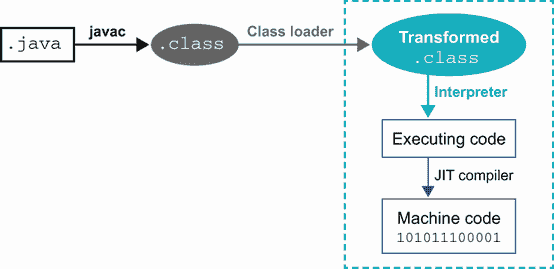
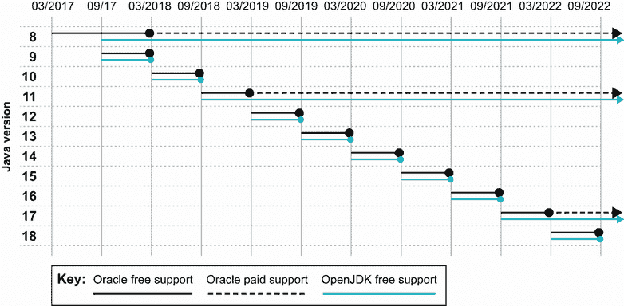
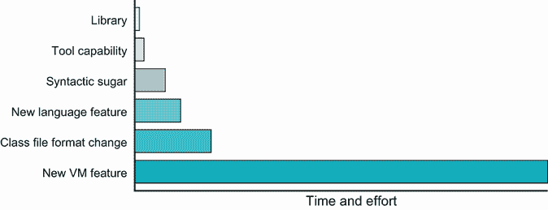
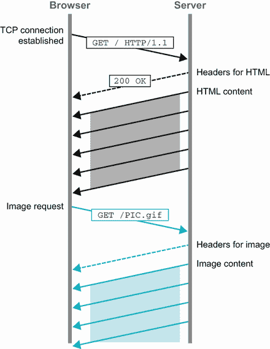
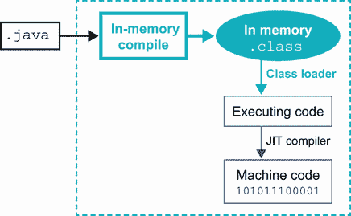

# 1 现代 Java 简介

本章涵盖

+   Java 作为平台和语言

+   新的 Java 发布模型

+   增强类型推断（var）

+   孵化和预览特性

+   更改语言

+   Java 11 中的小语言变化

欢迎来到 2022 年的 Java。这是一个激动人心的时刻。Java 17，作为最新的长期支持（LTS）版本，于 2021 年 9 月发布，最早和最具冒险精神的团队开始转向它。

在撰写本文时，除了少数先驱者外，Java 应用程序在运行在 Java 11（2018 年 9 月发布）和远早的 Java 8（2014 年）之间大致均衡分布。Java 11 提供了很多值得推荐的地方，特别是对于在云中部署的团队来说，但有些人对它的采用速度有点慢。

因此，在这本书的第一部分，我们将花一些时间介绍 Java 11 和 17 中出现的一些新特性。希望这次讨论能说服一些可能不愿意从 Java 8 升级的团队和经理们，新版本中的事物比以往任何时候都要好。

我们本章的重点将是 Java 11，因为 a)它是市场份额最大的 LTS 版本，b)目前还没有明显的 Java 17 采用。然而，在第三章中，我们将介绍 Java 17 的新特性，以便将您带到最新的版本。

让我们从讨论现代 Java 核心的“语言-平台”二分法开始。这是一个至关重要的观点，我们将在本书的多个地方回到这一点，因此从一开始就掌握它是至关重要的。

## 1.1 语言和平台

*Java*作为一个术语可以指代几个相关概念之一。特别是，它可能指的是人类可读的编程语言，或者是更广泛的“Java 平台”。

令人惊讶的是，不同的作者有时会给出略微不同的定义，以确定构成语言和平台的内容。这可能导致对两者之间的差异以及哪个提供应用程序代码使用的各种编程功能缺乏清晰性，并产生一些混淆。

让我们立即明确这一点，因为它触及了本书中许多主题的核心。以下是我们的定义：

+   *Java 语言*——Java 语言是我们轻描淡写地讽刺过的静态类型、面向对象的编程语言。希望它已经非常熟悉了。关于用 Java 语言编写的源代码的一个明显观点是，它是人类可读的（或者应该是这样的！）。

+   *Java 平台*——平台是提供运行时环境的软件。它是 JVM，它将链接并执行以（非人类可读的）类文件形式提供给它的代码。它不直接解释 Java 语言源文件，而是要求它们首先转换为类文件。

Java 作为软件系统成功的一个主要原因是它是一个标准。这意味着它有描述其应该如何工作的规范。标准化允许不同的供应商和项目组产生实现，理论上它们都应该以相同的方式工作。规范并不保证不同实现处理相同任务时的性能如何，但它们可以提供关于结果正确性的保证。

几个独立的规范管理着 Java 系统——其中最重要的是 Java 语言规范（JLS）和 JVM 规范（VMSpec）。在现代 Java 中，这种分离被非常认真地对待；事实上，VMSpec 不再直接引用 JLS。我们将在本书的后面部分更多地讨论这两个规范之间的差异。

注意：如今，JVM 实际上是一个相当通用的、与语言无关的运行程序的环境。这是规范分离的一个原因。

当你面对所描述的双重性时，一个明显的问题就是，“它们之间的联系是什么？”如果它们现在是分开的，它们是如何结合在一起形成 Java 系统的？

语言和平台之间的联系是共享的类文件格式定义（.class 文件）。对类文件定义的深入研究会给你带来回报（我们将在第四章提供一份）——实际上，这是优秀 Java 程序员开始成为杰出程序员的一种方式。在图 1.1 中，你可以看到 Java 代码的产生和使用过程的完整流程。



图 1.1 Java 源代码被转换成.class 文件，然后在加载时进行操作，最后进行 JIT 编译。

如图中所示，Java 代码最初以人类可读的 Java 源代码形式存在，然后由`javac`编译成.class 文件，并加载到 JVM 中。在加载过程中对类进行操作和修改是很常见的。许多流行的 Java 框架在加载类时会将其转换，以注入动态行为，例如代码插装或对要加载的类的替代查找。

注意：类加载是 Java 平台的一个基本特性，我们将在第四章中了解更多关于它的内容。

Java 是编译型语言还是解释型语言？Java 的标准形象是先编译成.class 文件，然后在 JVM 上运行。如果被追问，许多开发者也可以解释说字节码最初是由 JVM 解释的，但会在某个后期点进行即时（JIT）编译。然而，在这里，许多人对于字节码的理解变得有些模糊，认为字节码基本上是针对一个想象中的或简化的 CPU 的机器代码。

事实上，JVM 字节码更像是人类可读源代码和机器代码之间的中间状态。在编译器理论的技术术语中，字节码实际上是一种中间语言（IL），而不是实际的机器代码。这意味着将 Java 源代码转换为字节码的过程并不是像 C++ 或 Go 程序员理解的那种编译，`javac` 也不是像 `gcc` 那样的编译器——它实际上是为 Java 源代码生成类文件的生成器。Java 生态系统中的真正编译器是 JIT 编译器，如图 1.1 所示。

有些人将 Java 系统描述为“动态编译”。这强调了真正重要的编译是在运行时的 JIT 编译，而不是在构建过程中的类文件创建。

注意：源代码编译器 `javac` 的存在让许多开发者认为 Java 是一种静态编译语言。一个巨大的秘密是，在运行时，Java 环境实际上非常动态——只是隐藏在表面之下一点。

因此，“Java 是编译还是解释？”的真正答案是“两者都是”。随着语言和平台之间的区别现在更加清晰，让我们继续谈谈新的 Java 发布模型。

## 1.2 新的 Java 发布模型

Java 并非一直是一个开源语言，但在 2006 年 JavaOne 大会上的一个公告之后，Java 本身的源代码（除了 Sun 没有源代码的几个部分）被发布在 GPLv2+CE 许可证下 ([`openjdk.java.net/legal/gplv2+ce.html`](https://openjdk.java.net/legal/gplv2+ce.html))。

这大约是在 Java 6 发布的时候，因此 Java 7 是第一个在开源软件（OSS）许可证下开发的 Java 版本。从那时起，Java 平台开源开发的主要重点是 OpenJDK 项目 ([`openjdk.java.net`](https://openjdk.java.net))，并且这种情况一直持续到今天。

大部分的项目讨论都在涵盖整体代码库方面的邮件列表上进行。有“永久性”列表，如 core-libs（核心库），以及更多短暂的列表，这些列表作为特定 OpenJDK 项目（如 lambda-dev（lambda 表达式））的一部分形成，当特定项目完成后，这些列表就会变得不活跃。总的来说，这些列表一直是讨论可能未来功能的论坛，允许更广泛的社区的开发者参与到产生新的 Java 版本的过程中。

注意：Sun Microsystems 在 Java 7 发布前不久被 Oracle 收购。因此，Oracle 所有的 Java 发布版都是基于开源代码库的。

Java 的开源发布已经形成了以功能驱动的发布周期，其中单个突出功能实际上定义了发布（例如，Java 8 中的 lambda 表达式或 Java 9 中的模块）。

然而，随着 Java 9 的发布，发布模式发生了变化。从 Java 10 开始，Oracle 决定 Java 将按照严格的基于时间模型的发布。这意味着 OpenJDK 现在使用主线开发模型，包括以下内容：

+   新特性是在分支上开发的，只有当它们代码完成时才会合并。

+   发布可以在严格的时间周期内进行。

+   晚期特性不会延迟发布，但会留到下一个版本。

+   树干当前的头应该始终是可释放的（从理论上讲）。

+   如果有必要，可以在任何时间点准备和推出紧急修复。

+   使用独立的 OpenJDK 项目来探索和研究长期、未来的方向。

每隔六个月就会发布一个新的 Java 版本（“功能发布”）。各种提供商（Oracle、Eclipse Adoptium、Amazon、Azul 等）可以选择将其中任何一个版本作为长期支持（LTS）版本。然而，在实践中，所有供应商都遵循每三年发布一个 LTS 版本的策略。

注意：截至 2021 年底，正在讨论将 LTS 间隔从三年缩短到两年。我们可能会在 2023 年看到下一个 LTS 版本 Java 21，而不是在 2024 年的 Java 23。

第一个 LTS 版本是 Java 11，Java 8 被回顾性地包含在 LTS 版本集中。Oracle 的意图是 Java 社区定期升级，并随着新特性的出现而采用它们。然而，在实践中，社区（尤其是企业客户）已经证明对这个模型持抵制态度，更愿意从一个 LTS 版本升级到下一个版本。

当然，这种方法限制了新 Java 特性的采用并抑制了创新。然而，企业软件的现实就是这样，许多人仍然将 Java 版本的升级视为一项重大任务。



图 1.2 近期和未来发布的时序

这意味着，虽然图 1.2 所示的发布路线图每六个月有一个主要版本，但只有 LTS 版本具有显著的使用率——Java 17（刚刚在 2021 年 9 月发布），Java 11（在 2018 年 9 月发布），以及超过七年的预模块版本 Java 8。Java 8 和 Java 11 的市场份额大致相等，Java 11 最近已经占据了 50%以上，并且正在迅速增长。预计 Java 17 的采用速度将比从 Java 8 迁移到 Java 11 的速度快得多，因为早期迁移中引入的最困难的路障和安全性限制已经克服。

新发布模型中的另一个重大变化是，Oracle 更改了其分发的许可证。尽管 Oracle 的 JDK 是从 OpenJDK 源构建的，但二进制文件不是在 OSS 许可证下许可的。相反，Oracle 的 JDK 是专有软件，并且从 JDK 11 开始，Oracle 为每个版本提供为期六个月的支持和更新。这意味着许多依赖 Oracle 免费更新的人现在面临着一个选择：

+   为支持和服务向 Oracle 付费，或

+   使用产生开源二进制文件的不同发行版。

替代 JDK 供应商包括 Eclipse Adoptium（以前称为 AdoptOpenJDK）、阿里巴巴（Dragonwell）、亚马逊（Corretto）、Azul Systems（Zulu）、IBM、Microsoft、Red Hat 和 SAP。

注意：两位作者（Martijn 和 Ben）帮助创立了 AdoptOpenJDK 项目，该项目已发展成为构建和发布高质量、免费和开源 Java 二进制分发的供应商中立 Eclipse Adoptium 社区项目。有关更多详细信息，请参阅[adoptium.net](https://adoptium.net/)。

鉴于许可证变更和如此多的提供商，为您和您的团队选择正确的 Java 是一个需要谨慎做出的选择。幸运的是，Java 生态系统中的领导者已经编写了一些非常详细的指南，附录 A 为您总结了这些指南。

尽管 Java 发布模型已经改为使用定时发布，但绝大多数团队仍在使用 JDK 8 或 11。这些长期支持（LTS）版本由社区（包括主要供应商）维护，并且仍然会定期接收安全更新和错误修复。对 LTS 版本所做的更改故意范围较小，是“维护更新”。除了安全和小的错误修复外，只允许进行最小限度的更改。这些包括确保 LTS 版本在其预期使用寿命内继续正确工作的必要修复。这包括以下内容：

+   新增日本时代

+   时区数据库更新

+   TLS 1.3

+   添加 Shenandoah，适用于大型现代工作负载的低暂停垃圾回收器

另一个必要的更改是，macOS 的构建脚本需要更新以与苹果最近版本的 Xcode 工具兼容，以便它们可以在苹果操作系统的最新版本上继续工作。

在维护 JDK 8 和 11 的项目（有时称为“更新”项目）中，仍然存在一些空间可以回滚新功能，但这个空间非常小。例如，一个指导原则是，新移植的功能不得改变程序语义。允许的更改示例可能包括对 TLS 1.3 的支持或将 Java Flight Recorder 回滚到 Java 8u272。

现在我们已经通过阐明语言和平台之间的区别以及解释新的发布模型来设定了场景，让我们来认识现代 Java 的第一个技术特性。我们将要遇到的新特性是自从 Java 的第一个版本发布以来开发者一直要求的功能——减少编写 Java 程序所需输入量的方法。

## 1.3 增强类型推断（var 关键字）

Java 在历史上一直以冗长著称。然而，在最近的版本中，语言已经发展，越来越多地使用*类型推断*。这个源代码编译器的特性使得编译器能够自动处理程序中的一些类型信息。因此，不需要显式地告诉所有信息。

注意：类型推断的目的是减少样板内容，消除重复，并允许代码更加简洁易读。

这种趋势始于 Java 5，当时引入了泛型方法。泛型方法允许对泛型类型参数进行非常有限的形式的类型推断，因此，不需要显式提供所需的精确类型，如下所示：

```
List<Integer> empty = Collections.<Integer>emptyList();
```

泛型类型参数可以在右侧省略，如下所示：

```
List<Integer> empty = Collections.emptyList();
```

以这种方式编写泛型方法的调用如此熟悉，以至于许多开发者会努力记住带有显式类型参数的形式。这是一个好事——这意味着类型推断正在做它的工作，移除多余的样板内容，从而使代码的意义清晰。

Java 类型推断的下一个重大增强是在 Java 7 版本中实现的，它引入了处理泛型时的一个变化。在 Java 7 之前，常见的代码如下：

```
Map<Integer, Map<String, String>> usersLists =
                        new HashMap<Integer, Map<String, String>>();
```

这是一种非常冗长的声明方式，表明你有一些用户，你通过`userid`（这是一个整数）来识别他们，每个用户都有一个特定的属性集（建模为字符串到字符串的映射），这些属性属于该用户。

实际上，源代码中几乎有一半是重复的字符，它们并没有告诉我们任何信息。因此，从 Java 7 开始，我们可以这样写

```
Map<Integer, Map<String, String>> usersLists = new HashMap<>();
```

并让编译器在右侧确定类型信息。编译器正在确定右侧表达式的正确类型——它不仅仅是替换定义完整类型的文本。

注意：由于简化的类型声明看起来像菱形，这种形式被称为“菱形语法”。

在 Java 8 中，为了支持 lambda 表达式的引入，增加了更多的类型推断功能，例如这个例子中类型推断算法可以推断出`s`的类型是`String`：

```
Function<String, Integer> lengthFn = s -> s.length();
```

在现代 Java 中，随着*局部变量类型推断*（LVTI）的引入，也称为`var`，类型推断又前进了一步。这个特性是在 Java 10 中添加的，允许开发者推断*变量*的类型，而不是*值*的类型，如下所示：

```
var names = new ArrayList<String>();
```

这是通过将 `var` 实现为一个保留的、“魔法”类型名称而不是语言关键字来实现的。理论上，开发者仍然可以使用 `var` 作为变量、方法或包的名称。

注意：适当地使用 `var` 的重要副作用是，你的代码域再次成为焦点（与类型信息相反）。但是，权力越大，责任越大！请确保你仔细命名变量，以帮助未来的代码阅读者。

另一方面，之前使用 `var` 作为类型名称的代码将需要重新编译。然而，几乎所有的 Java 开发者都遵循一个约定，即类型名称应该以大写字母开头，因此被称为 `var` 的现有类型实例数量应该非常少。这意味着编写类似下一列表中所示代码是完全合法的。

列表 1.1 恶劣的代码

```
package var;

public class Var {
  private static Var var = null;

  public static Var var() {
    return var;
  }

  public static void var(Var var) {
    Var.var = var;
  }
}
```

然后可以这样调用它：

```
var var = var();
if (var == null) {
  var(new Var());
}
```

然而，仅仅因为某件事是 *合法的*，并不意味着它是 *合理的*。编写类似前述列表中的代码不会让你赢得任何朋友，并且不应该通过代码审查！

`var` 的目的是减少 Java 代码的冗长性，并使从其他语言转向 Java 的程序员感到熟悉。它不引入动态类型，Java 中的所有变量在所有时候都继续具有静态类型——你只是不需要在所有情况下都明确写出它们。

Java 中的类型推断是 *局部的*，在 `var` 的情况下，算法仅检查局部变量的声明。这意味着它不能用于字段、方法参数或返回类型。编译器应用一种 *约束求解* 形式来确定是否存在任何类型可以满足代码中所有要求。

注意：`var` 仅在源代码编译器（`javac`）中实现，并且没有任何运行时或性能影响。

例如，在上一个代码示例中 `lengthFn` 的声明中，约束求解器可以推断出方法参数 `s` 的类型必须与 `String` 兼容，这是作为 `Function` 参数的类型显式提供的。当然，在 Java 中，字符串类型是 `final` 的，因此编译器可以得出结论，`s` 的类型正好是 `String`。

为了让编译器能够推断类型，程序员必须提供足够的信息，以便解决约束方程。例如，这样的代码

```
var fn = s -> s.length();
```

这没有提供足够的信息供编译器推断 `fn` 的类型，因此它将无法编译。这种情况的一个重要例子是

```
var n = null;
```

这不能被编译器解决，因为空值可以被分配给任何引用类型的变量，因此没有关于 `n` 可能是什么类型的信息。我们说在这种情况下，推断器需要解决的类型约束方程是“欠确定的”——这是一个数学术语，它将需要解决的方程数量与变量的数量联系起来。

你可以想象一种类型推断方案，它不仅限于局部变量的初始声明，还会检查更多代码以做出推断决策，如下所示：

```
var n = null;
String.format(n);
```

一个更复杂的推断算法（或人类）可能能够得出结论，`n`的类型实际上是`String`，因为`format()`方法接受字符串作为第一个参数。

这可能看起来很有吸引力，但，就像软件中的其他一切一样，它代表了一种权衡。更多的复杂性意味着更长的编译时间和更多推断可能失败的方式。这反过来意味着程序员必须发展出更复杂的直觉，才能正确地使用非局部类型推断。

其他语言可能会选择做出不同的权衡，但 Java 很明确：只有声明被用来推断类型。局部变量类型推断旨在是一种有益的技术，可以减少样板文本和冗余。然而，它只应在必要时使用，以使代码更清晰，而不是作为一种在任何可能的情况下都可以使用的钝工具（“黄金锤”反模式）。

以下是一些关于何时使用 LVTI 的快速指南：

+   在简单的初始化器中，如果右侧是构造函数或静态工厂方法的调用

+   如果删除显式类型可以删除重复或冗余信息

+   如果变量名已经表明了它们的类型

+   如果局部变量的作用域和用途简短且简单

Java 语言的核心开发者之一 Stuart Marks 在他的 LVTI 使用风格指南中提供了一套完整的适用规则，可以在[`mng.bz/RvPK`](http://mng.bz/RvPK)找到。

为了总结本节，让我们看看`var`的另一种更高级的使用——所谓的*不可表示的类型*。这些类型在 Java 中是合法的，但不能作为变量的类型出现。相反，它们必须被推断为被分配的表达式的类型。让我们通过使用 Java 9 中引入的`jshell`交互式环境来举一个简单的例子：

```
jshell> var duck = new Object() {
   ...>     void quack() {
   ...>         System.out.println("Quack!");
   ...>     }
   ...> }
duck ==> $0@5910e440

jshell> duck.quack();
Quack!
```

变量`duck`有一个不寻常的类型——它实际上是`Object`，但扩展了一个名为`quack()`的方法。尽管这个对象可能像鸭子一样嘎嘎叫，但它的类型没有名称，所以我们不能将其用作方法参数或返回类型。

使用 LVTI，我们可以将其用作局部变量的推断类型。这允许我们在方法中使用该类型。当然，该类型不能在紧密的局部作用域之外使用，因此这种语言特性的整体效用有限。它更多的是一种好奇心，而不是其他。

尽管存在这些限制，这确实代表了 Java 对某些其他语言中存在的特性的看法——在静态类型语言中有时被称为*结构化类型*，在动态类型语言（尤其是 Python）中称为*鸭子类型*。

## 1.4 更改语言和平台

我们认为解释语言变化的“为什么”和“是什么”同样重要。在 Java 新版本的开发过程中，对新语言特性的兴趣通常很大，但社区并不总是理解要完全工程化并准备好投入使用的更改需要多少工作量。

你可能也注意到，在成熟的运行时环境如 Java 中，语言特性往往是从其他语言或库中演变而来，进入流行的框架，然后才被添加到语言或运行时本身。我们希望在这个领域提供一些启示，并希望在这个过程中消除一些误解。但如果你对 Java 的演变不太感兴趣，可以自由地跳到 1.5 节，直接进入语言变化的讨论。

在更改 Java 语言的过程中存在一个工作量曲线——一些可能的实现方式比其他方式需要更少的工程工作量。在图 1.3 中，我们试图表示不同的路径，并展示每个路径所需的相对工作量。



图 1.3 以不同方式实现新功能所涉及的相对工作量

通常，选择最省力的路线更好。这意味着如果可能的话，将新特性作为库来实现，你通常应该这样做。但并非所有特性都容易实现，或者甚至可能通过库或 IDE 功能来实现。一些特性必须在平台内部更深处实现。以下是一些最近特性如何适应我们新语言特性复杂度尺度的例子：

+   *库更改*—Collections 工厂方法（Java 9）

+   *语法糖*—数字中的下划线（Java 7）

+   *小型新语言特性*—try-with-resources（Java 7）

+   *类文件格式更改*—注解（Java 5）

+   *新的 JVM 特性*—Nestmates（Java 11）

+   *主要新特性*—Lambda 表达式（Java 8）

让我们仔细看看如何在复杂度尺度上做出变化。

### 1.4.1 撒上一些糖

有时用来描述语言特性的短语是“语法糖”。也就是说，提供语法糖形式是因为它对人类来说更容易操作，尽管语言中已经存在该功能。

按照惯例，被称为语法糖的特性在编译过程的早期就被从编译器对程序的表示中移除——它被说成是“去糖化”成了相同特性的基本表示。

这使得对语言进行语法糖（syntactic sugar）的更改更容易实现，因为它们通常涉及相对较少的工作量，并且仅涉及对编译器（在 Java 的情况下是`javac`）的更改。

在这个阶段可能会提出的一个问题是，“什么构成了对规范的微小更改？”Java 7 中最直接的一个更改是在 JLS 的第 14.11 节中添加了一个单词——“String”，这使得在 switch 语句中可以使用字符串。作为一个更改，你实际上无法做得更小，然而即使是这个更改也触及了规范的几个其他方面。任何变更都会产生后果，并且这些后果必须在整个语言设计中追踪。

### 1.4.2 更改语言

必须执行（或至少调查）的完整操作集（或至少是任何更改）如下：

+   更新 JLS。

+   在源编译器中实现原型。

+   添加对更改至关重要的库支持。

+   编写测试和示例。

+   更新文档。

此外，如果更改触及 JVM 或平台方面，必须执行以下操作：

+   更新 VMSpec。

+   实施 JVM 变更。

+   在类文件和 JVM 工具中添加支持。

+   考虑对反射的影响。

+   考虑对序列化的影响。

+   考虑对原生代码组件（如 Java 原生接口（JNI））的影响。

这不是一项小工作量，而且在考虑了整个语言规范中更改的影响之后！

在进行更改时，类型系统是一个棘手的问题区域。这并不是因为 Java 的类型系统很糟糕。相反，具有丰富静态类型系统的语言很可能在其类型系统的不同部分之间有许多可能的交互点。对这些交互点进行更改很容易产生意外的惊喜。

### 1.4.3 JSRs 和 JEPs

用于更改 Java 平台的两个主要机制是 *Java 规范请求*（JSR），由 *Java 社区进程*（JCP）指定。这用于确定标准 API——既包括外部库也包括主要内部平台 API。

这在历史上是更改 Java 平台的唯一方式，并且最好用于将已经成熟的技术的共识编码化。然而，在近年来，为了更快（并且以更小的单元）实施更改，导致了 *JDK 增强提案*（JEP）作为一种更轻量级的替代方案的开发。平台（也称为伞状）JSR 现在由针对下一个 Java 版本的 JEP 组成。JSR 流程用于为整个生态系统提供额外的知识产权保护。

当讨论新的 Java 功能时，通常很有用通过其 JEP 编号来引用即将推出或最近的功能。所有 JEP 的完整列表，包括已交付或撤回的，可以在 [`openjdk.java.net/jeps/0`](https://openjdk.java.net/jeps/0) 找到。

### 1.4.4 孵化和预览功能

在新的发布模型中，Java 在最终确定功能之前，在后续版本中尝试一个提议的功能有两种机制。这些机制的目标是通过从更广泛的用户群体收集反馈，以及在它成为 Java 永久部分之前可能更改或撤回功能，来提供更好的功能。

*孵化功能*是新 API 及其实现，它们在 simplest 形式下实际上只是作为一个自包含模块发布的新的 API（我们将在第二章中遇到 Java 模块的详细信息）。模块的命名是为了使其清楚表明该 API 是临时的，并且将在功能最终确定时发生变化。

注意：这意味着任何依赖于孵化功能非最终版本的代码，在功能最终确定时将不得不进行更改。

孵化功能的一个非常明显的例子是对 HTTP 协议第 2 版的新支持，通常称为 HTTP/2。在 Java 9 中，它作为孵化器模块`jdk.incubator.http`发布。该模块的命名以及使用`jdk.incubator`命名空间而不是`java`命名空间，清楚地表明该功能是非标准的，并且将在功能最终确定时发生变化。该功能在 Java 11 中标准化，当时它被移动到命名空间`java`部分的`java.net.http`模块中。

注意：当我们讨论 Foreign Access API 时，我们将在第十八章遇到另一个孵化功能，它是 OpenJDK 项目中一个名为 Panama 的项目的一部分。

这种方法的主要优势是孵化功能可以被隔离到单个命名空间中。开发者可以快速尝试该功能，甚至可以在生产代码中使用它，前提是他们愿意修改一些代码，并在功能标准化时重新编译和重新链接。

*预览功能*是近期 Java 版本提供的一种机制，用于发布尚未最终确定的功能。与孵化功能相比，它们更具侵入性，因为它们作为语言本身的一部分，在更深的层次上实现。这些功能可能需要以下方面的支持：

+   `javac`编译器

+   字节码格式

+   类文件和类加载

它们仅在向编译器和运行时传递特定标志时才可用。在没有启用标志的情况下尝试使用预览功能是错误的，无论是在编译时还是在运行时。

这使得它们处理起来更加复杂（与孵化功能相比）。因此，预览功能实际上不能用于生产。一方面，它们由一个尚未最终确定且可能永远不会由任何生产版本的 Java 支持的类文件格式表示。

这意味着预览功能仅适用于实验、开发者测试和熟悉。不幸的是，在几乎所有部署中，只有完全最终确定的功能才能用于旨在生产使用的代码。

Java 11 没有包含任何预览功能（尽管 Java 12 中出现了 *switch 表达式* 的第一个预览版本），因此很难在这个部分给出一个很好的例子。不过，当我们在第三章讨论 Java 17 时，我们会更深入地探讨预览版本。

## 1.5 Java 11 的小改动

自 Java 8 以来，在连续的版本中出现了相当多的新小功能。让我们快速浏览一下其中一些最重要的功能——尽管这绝对不是所有变化。

### 1.5.1 集合工厂（JEP 213）

常被请求的功能增强之一是扩展 Java 以支持一种简单的声明 *集合字面量* 的方法——一个简单的对象集合（例如列表或映射）。这看起来很有吸引力，因为许多其他语言都支持这种形式，Java 本身也一直有数组字面量，如下所示：

```
jshell> int[] numbers = {1, 2, 3};
numbers ==> int[3] { 1, 2, 3 }
```

然而，尽管表面上看起来很有吸引力，但在语言级别添加这个功能有一些显著的缺点。例如，尽管 `ArrayList`、`HashMap` 和 `HashSet` 是开发者最熟悉的实现，但 Java 集合的一个主要设计原则是它们被表示为接口，而不是类。其他实现也是可用的，并且被广泛使用。

这意味着，如果有一个新的语法直接与特定的实现耦合，无论多么常见，都将与设计意图相悖。相反，设计决策是在相关接口中添加简单的工厂方法，利用 Java 8 添加了在接口上定义静态方法的能力。生成的代码如下所示：

```
Set<String> set = Set.of("a", "b", "c");

var list = List.of("x", "y");
```

虽然这个方法在语言级别添加支持时稍微有点冗长，但在实现层面的复杂性成本却大大降低。这些新方法被实现为一组重载，如下所示：

```
List<E> List<E>.<E>of()
List<E> List<E>.<E>of(E e1)
List<E> List<E>.<E>of(E e1, E e2)
List<E> List<E>.<E>of(E e1, E e2, E e3)
List<E> List<E>.<E>of(E e1, E e2, E e3, E e4)
List<E> List<E>.<E>of(E e1, E e2, E e3, E e4, E e5)
List<E> List<E>.<E>of(E e1, E e2, E e3, E e4, E e5, E e6)
List<E> List<E>.<E>of(E e1, E e2, E e3, E e4, E e5, E e6, E e7)
List<E> List<E>.<E>of(E e1, E e2, E e3, E e4, E e5, E e6, E e7, E e8)
List<E> List<E>.<E>of(E e1, E e2, E e3, E e4, E e5, E e6, E e7, E e8, E e9)
List<E> List<E>.<E>of(E e1, E e2, E e3, E e4, E e5, E e6, E e7, E e8, E e9,
  E e10)
List<E> List<E>.<E>of(E... elements)
```

提供了常见的案例（最多 10 个元素），以及一个 varargs 形式，用于不太可能的情况，即集合中需要超过 10 个元素。

对于映射，情况要复杂一些，因为映射有两个泛型参数（键类型和值类型），因此，尽管简单的案例可以写成这样：

```
var m1 = Map.of(k1, v1);
var m2 = Map.of(k1, v1, k2, v2);
```

没有简单的方法来编写映射的 varargs 形式的等价形式。相反，使用不同的工厂方法 `ofEntries()` 与静态辅助方法 `entry()` 结合使用，以提供 varargs 形式的等价形式，如下所示：

```
Map.ofEntries(
    entry(k1, v1),
    entry(k2, v2),
    // ...
    entry(kn, vn));
```

开发者应该注意的一个最后一点是：工厂方法产生不可变类型的实例，如下所示：

```
jshell> var ints = List.of(2, 3, 5, 7);
ints ==> [2, 3, 5, 7]

jshell> ints.getClass();
$2 ==> class java.util.ImmutableCollections$ListN
```

这些类是 Java 集合接口的新实现，它们是不可变的——它们不是熟悉的可变类（例如 `ArrayList` 和 `HashMap`）。尝试修改这些类型的实例将导致抛出异常。

### 1.5.2 移除企业模块（JEP 320）

随着时间的推移，Java 标准版（即 Java SE）增加了一些模块，这些模块实际上是 Java 企业版（Java EE）的一部分，例如

+   JAXB

+   JAX-WS

+   CORBA

+   JTA

在 Java 9 中，以下实现这些技术的包被移动到非核心模块，并已弃用以供移除：

+   java.activation (JAF)

+   java.corba (CORBA)

+   java.transaction (JTA)

+   java.xml.bind (JAXB)

+   java.xml.ws (JAX-WS，以及一些相关技术)

+   java.xml.ws.annotation (通用注解)

作为简化平台的一部分，在 Java 11 中，这些模块已被移除。以下三个用于工具和聚合的相关模块也已从核心 SE 分发中移除：

+   java.se.ee (上述六个模块的聚合模块)

+   jdk.xml.ws (JAX-WS 工具)

+   jdk.xml.bind (JAXB 工具)

基于 Java 11 及以后版本的项目，如果想要使用这些功能，现在需要包含一个显式的外部依赖项。这意味着一些依赖于这些 API 的程序在 Java 8 下可以干净地构建，但在 Java 11 下构建需要修改其构建脚本。我们将在第十一章中更全面地研究这个问题。

### 1.5.3 HTTP/2 (Java 11)

在现代时代，HTTP 标准的新版本已经发布——HTTP/2。我们将探讨最终更新这个自 1997 年以来一直受到尊敬的 HTTP 1.1 规范（！）的原因。然后我们将看到 Java 11 如何为经验丰富的开发者提供对 HTTP/2 的新功能和性能的访问。

如您所料，对于 1997 年的技术，HTTP 1.1 已经显示出其年龄，尤其是在现代 Web 应用程序的性能方面。局限性包括如下问题：

+   首行阻塞

+   限制连接到单个站点

+   HTTP 控制头部的性能开销

HTTP/2 是对协议的 *传输层* 更新，专注于修复这些类型的根本性能问题，这些问题不适合当今网络的实际工作方式。它对性能的关注在于客户端和服务器之间字节流的流动，HTTP/2 实际上并没有改变许多熟悉的 HTTP 概念——请求/响应、头部、状态码、响应体——所有这些在 HTTP/2 与 HTTP 1.1 中在语义上保持相同。

首行阻塞

HTTP 中的通信发生在 TCP 套接字上。尽管 HTTP 1.1 默认重用单个套接字以避免重复不必要的设置成本，但协议规定请求必须按顺序返回，即使多个请求共享一个套接字（称为流水线；见图 1.4）。这意味着来自服务器的缓慢响应会阻塞后续请求，而理论上这些请求可以更早返回。这些影响在浏览器在下载资源时渲染停滞的地方很容易看到。每次一个响应-一次连接的行为也可以限制与基于 HTTP 的服务通信的 JVM 应用程序。



图 1.4 HTTP 1.1 传输

HTTP/2 从一开始就被设计为在相同的连接上多路复用请求，如图 1.5 所示。客户端和服务器之间的多个 *流* 总是得到支持。它甚至允许分别接收单个请求的头部和主体。


图 1.5 HTTP/2 传输

这从根本上改变了数十年来 HTTP 1.1 已经使许多开发者习以为常的假设。例如，长期以来人们普遍认为，在一个网站上返回大量的小资产比返回更大的包表现更差。JavaScript、CSS 和图片都有共同的技巧和工具，可以将许多较小的文件合并在一起以更有效地返回。在 HTTP/2 中，多路复用响应意味着你的资源不会因为其他缓慢的请求而被阻塞，并且较小的响应可能被更准确地缓存，从而提供更好的整体体验。

受限连接

HTTP 1.1 规范建议同时限制对服务器的连接数为两个。这被列为“应该”而不是“必须”，现代网络浏览器通常允许每个域名之间有六到八个连接。这种对网站并发下载的限制常常导致开发者从多个域名提供服务或实施前面提到的打包方式。

HTTP/2 解决了这种情况：每个连接可以有效地用于发送所需数量的并发请求。浏览器只对一个域名打开一个连接，但可以在同一连接上同时执行许多请求。

在我们的 JVM 应用程序中，我们可能会池化 HTTP 1.1 连接以允许更多的并发活动，HTTP/2 给我们提供了另一种内置的方式来挤出更多的请求。

HTTP 头部性能

HTTP 的一个显著特性是能够在请求中发送 *头部*。头部是 HTTP 协议本身无状态的关键部分，但我们的应用程序可以在请求之间保持状态（例如，用户已经登录）。

尽管如果客户端和服务器可以就算法达成一致（通常是 gzip），HTTP 1.1 有效载荷的主体可以被压缩，但头部并不参与。随着更丰富的网络应用程序发出越来越多的请求，越来越大的头部的重复可能会成为一个问题，特别是对于大型网站。

HTTP/2 通过为头部引入一个新的二进制格式来解决此问题。作为协议的用户，你不必过多考虑这一点——它只是内置到客户端和服务器之间传输头部的方式中。

TLS 的一切

在 1997 年，HTTP 1.1 进入了一个与今天截然不同的互联网。互联网上的商业刚刚开始起飞，而在早期的协议设计中，安全性并不总是首要考虑。计算系统也足够慢，以至于加密等做法通常过于昂贵。

HTTP/2 于 2015 年正式被接纳到一个对安全性更加重视的世界。此外，通过 TLS（在早期版本中称为 SSL）对 Web 请求进行普遍加密的计算需求足够低，以至于消除了大多数关于是否加密的争论。因此，在实践中，HTTP/2 仅支持 TLS 加密（该协议在理论上允许明文传输，但没有任何主要实现提供这种功能）。

这对部署 HTTP/2 有实际影响，因为它需要一个具有过期和续订生命周期的证书。对于企业来说，这增加了对证书管理的需求。Let’s Encrypt ([`www.letsencrypt.org`](https://www.letsencrypt.org)) 和其他私人选项已经随着这种需求而增长。

其他考虑因素

尽管未来趋势是采用 HTTP/2，但它在网络上的部署速度并不快。除了加密要求，这甚至影响了本地开发，这种延迟可能归因于以下粗糙边缘和额外复杂性：

+   HTTP/2 仅支持二进制格式；与不透明的格式一起工作具有挑战性。

+   需要更新以支持 HTTP/2 的 HTTP 层产品，如负载均衡器、防火墙和调试工具。

+   性能优势主要针对基于浏览器的 HTTP 使用。通过 HTTP 工作的底层服务可能看到更新带来的好处较少。

Java 11 中的 HTTP/2

在多年之后出现新的 HTTP 版本激励了 JEP 110 引入一个全新的 API。在 JDK 中，这取代了（但未删除）`HttpURLConnection`，旨在将可用的 HTTP API “打包”在一起，因为许多开发者已经转向外部库来满足他们的 HTTP 相关需求。

结果是，HTTP/2 和 WebSocket 兼容的 API 首先作为 Java 9 的孵化特性出现。JEP 321 将其移至 Java 11 的永久位置，在 `java.net.http` 下。新的 API 支持 HTTP/1.1 以及 HTTP/2，并且当被调用的服务器不支持 HTTP/2 时，可以回退到 HTTP/1.1。

与新 API 的交互从 `HttpRequest` 和 `HttpClient` 类型开始。这些类型通过构建器实例化，在发出实际的 HTTP 调用之前设置配置，如下所示：

```
var client = HttpClient.newBuilder().build();           ❶

var uri = new URI("https://google.com");
var request = HttpRequest.newBuilder(uri).build();      ❷

var response = client.send(                             ❸
    request,
    HttpResponse.BodyHandlers.ofString(                 ❹
        Charset.defaultCharset()));

System.out.println(response.body());
```

❶ 构建一个我们可以用来发送请求的 HttpClient 实例

❷ 使用 HttpRequest 实例构建一个针对 Google 的特定请求

❸ 同步发送 HTTP 请求并保存其响应。此行会阻塞，直到整个请求完成。

❹ 发送方法需要一个处理程序来告诉它如何处理响应体。这里我们使用一个标准处理程序将体作为 String 返回。

这展示了 API 的同步使用。在构建我们的请求和客户端之后，我们使用 `send` 方法发出 HTTP 调用。我们不会在完整的 HTTP 调用完成之前收到 `response` 对象，这与 JDK 中较旧的 HTTP API 类似。

第一个参数是我们设置的请求，但第二个参数值得更仔细地观察。`send` 方法期望我们提供一个 `HttpResponse.BodyHandler<T>` 接口的实现，以告诉它如何处理响应。`HttpResponse.BodyHandlers` 提供了一些有用的基本处理程序，可以将响应作为字节数组、字符串或文件接收。但自定义此行为只需实现 `BodyHandler` 即可。所有这些管道都是基于 `java.util.concurrent.Flow` 发布者和订阅者机制，这是一种称为反应式流的编程形式。

HTTP/2 最显著的优点之一是其内置的多路复用功能。仅使用同步的 `send` 真实情况下并不能获得这些好处，因此 `HttpClient` 也支持 `sendAsync` 方法也就不足为奇了。`sendAsync` 返回一个包裹着 `HttpResponse` 的 `CompletableFuture`，提供了一组丰富的功能，这些功能在其他平台的部分中可能很熟悉，如下所示：

```
var client = HttpClient.newBuilder().build();

var uri = new URI("https://google.com");
var request = HttpRequest.newBuilder(uri).build();           ❶

var handler = HttpResponse.BodyHandlers.ofString();
CompletableFuture.allOf(                                     ❷
    client.sendAsync(request, handler)                       ❸
        .thenAccept((resp) ->                                ❹
                      System.out.println(resp.body()),
    client.sendAsync(request, handler)                       ❺
        .thenAccept((resp) ->                                ❺
                      System.out.println(resp.body()),       ❺
    client.sendAsync(request, handler)                       ❺
        .thenAccept((resp) ->
                      System.out.println(resp.body())
).join();
```

❶ 如前所述创建客户端和请求

❷ 使用 `CompletableFuture.allOf` 等待所有请求完成

❸ `sendAsync` 启动一个 HTTP 请求，但返回一个未来，并不阻塞。

❹ 当未来完成时，我们使用 `thenAccept` 接收响应。

❺ 我们可以使用相同的客户端同时发出多个请求。

我们再次设置请求和客户端，但随后异步地分别调用三次。`CompletableFuture.allOf` 结合这三个未来，因此我们可以通过单个 `join` 等待它们全部完成。

这只是触及了此 API 的两个主要入口点。它提供了大量的功能和定制，从配置超时和 TLS，到接收 HTTP/2 服务器推送的高级异步功能，如通过 `HttpResponse.PushPromiseHandler`。

在未来的基础上，JDK 中的新 HTTP API 为 HTTP 空间中主导生态系统的庞大库提供了一个有吸引力的替代方案。设计时以现代异步编程为核心，`java.net.http` 使 Java 处于一个极佳的位置，无论网络未来如何发展。

### 1.5.4 单文件源代码程序（JEP 330）

Java 程序通常的执行方式是将源代码编译成类文件，然后启动一个充当执行容器的虚拟机进程来解释类的字节码。

这与 Python、Ruby 和 Perl 等语言非常不同，在这些语言中，程序的源代码是直接被解释的。Unix 环境有这些类型 *脚本语言* 的悠久历史，但 Java 传统上并不被认为属于这一类。

随着 JEP 330 的到来，Java 11 提供了一种执行程序的新方法。源代码可以在内存中编译，然后由解释器执行，而无需在磁盘上产生 .class 文件，如图 1.6 所示。



图 1.6 单文件执行

这为用户提供了类似于 Python 和其他脚本语言的用户体验。

该特性有一些限制，包括以下内容：

+   它仅限于存在于单个源文件中的代码。

+   它不能在同一个运行中编译额外的源文件。

+   它可以在源文件中包含任意数量的类。

+   它必须将源文件中声明的第一个类作为入口点。

+   它必须在入口点类中定义主方法。

该特性还使用 `--source` 标志来指示源代码兼容模式——本质上就是脚本的语言级别。

Java 文件命名约定必须遵循以执行，因此类名应与文件名匹配。然而，不应使用 .java 扩展名，因为这可能会使启动器产生混淆。

这些类型的 Java 脚本也可以包含一个 shebang 行，如下所示：

```
#!/usr/bin/java --source 11

public final class HTTP2Check {
    public static void main(String[] args) {
        if (args.length < 1) {
            usage();
        }
        // implementation of our HTTP callers...      ❶
    }
}
```

❶ HTTP2Check 的完整代码在项目资源中提供。

shebang 行提供了必要的参数，以便文件可以被标记为可执行，并直接调用，如下所示：

```
$ ./HTTP2Check https://www.google.com
https://www.google.com: HTTP_2
```

虽然这个特性并没有将脚本语言的全部体验带到 Java 中，但它可以是一种在 Unix 传统中编写简单、有用工具的有用方式，而无需引入另一种编程语言。

## 摘要

+   Java 语言和平台是 Java 生态系统中的两个独立（尽管关系紧密）的组件。平台支持许多语言，而不仅仅是 Java。

+   Java 8 之后，Java 平台采用了新的定时发布流程。新版本每六个月发布一次，每两到三年发布一个长期支持（LTS）版本。

+   当前长期支持版本为 11 和 17，Java 8 目前仍然得到支持。

+   由于其关注向后兼容性，对 Java 进行更改通常很困难。仅限于库或编译器的更改通常比需要更新虚拟机的更改要简单得多。

+   Java 11 引入了许多值得升级的功能：

    +   使用 `var` 关键字简化变量定义

    +   工厂方法以简化创建列表、映射和其他集合

    +   一个全新的 `HttpClient` 实现，支持完整的 HTTP/2

    +   可以直接运行而无需编译为类文件的单一文件程序
