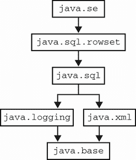

# 2 Java 模块

本章涵盖

+   Java 的平台模块

+   访问控制语义的变化

+   编写模块化应用程序

+   多版本 JAR

如第一章所述，Java 的版本，直到包括 Java 9，都是根据以功能驱动的发布计划交付的，通常包含一个定义或与发布强相关的主要新功能。

对于 Java 9，这个特性是 Java 平台模块（也称为 JPMS、Jigsaw 或简称为“模块”）。这是对 Java 平台的重大增强和改变，它已经讨论了很多年——它最初是在 2009/2010 年作为 Java 7 的一部分可能发布的。

在本章中，我们将解释为什么需要模块，以及用于阐述模块概念的新语法以及如何在您的应用程序中使用它们。这将使您能够在构建时使用 JDK 和第三方模块，以及将应用程序或库作为模块打包。

注意模块代表了一种新的代码打包和部署方式，采用它们会使您的应用程序变得更好。然而，如果您只想开始使用现代 Java 功能（11 或 17），您无需立即采用模块，除非您想这么做。

模块的出现对应用程序的架构有深远的影响，并且模块对关注诸如进程占用、启动成本和预热时间等方面的现代项目有许多好处。模块还可以帮助解决可能困扰具有复杂依赖的 Java 应用程序的所谓 JAR 地狱问题。让我们来了解它们。

## 2.1 设置场景

*模块*是 Java 语言中的一个基本新概念（截至 Java 9）。它是一个应用程序部署和依赖的单位，对运行时有语义意义。这与 Java 中现有的概念不同，以下是一些原因：

+   JAR 文件对运行时来说是不可见的——它们基本上只是包含类文件的压缩目录。

+   包实际上只是用于将类分组在一起以进行访问控制的命名空间。

+   依赖仅在类级别定义。

+   访问控制和反射以一种方式结合，产生了一个基本开放的系统，没有清晰的部署单元边界，并且执行力度最小。

另一方面

+   定义模块之间的依赖信息，以便在编译或应用程序启动时检测到各种解析和链接问题

+   提供适当的封装，因此内部包和类可以免受可能想要篡改它们的烦人用户的干扰

+   是一个具有元数据的适当部署单元，这些元数据可以被现代 Java 运行时理解和消费，并在 Java 类型系统中表示（例如，通过反射）。

注意：在模块之前，在核心语言和运行时环境中，没有聚合的依赖元数据。相反，它仅在 Maven 等构建系统或 JVM 既不知道也不关心的第三方模块系统（如 OSGI 或 JBoss 模块）中定义。

Java 平台模块代表了在版本 8 存在的 Java 世界中一个缺失概念的实现。

注意：Java 模块通常打包为特殊的 JAR 文件，但它们并不局限于该格式（我们将在后面看到其他可能的格式）。

模块系统的目标是使部署单元（模块）尽可能相互独立。想法是模块能够分别加载和链接，尽管在实践中，实际应用程序可能最终依赖于提供相关功能（如安全）的一组模块。

### 2.1.1 项目 Jigsaw

在 OpenJDK 中交付模块功能的项目的名称是*项目 Jigsaw*。它旨在提供一个功能齐全的模块化解决方案，包括以下目标：

+   模块化 JDK 平台源

+   减少进程占用

+   提高应用程序启动时间

+   使模块对 JDK 和应用代码都可用

+   首次在 Java 中实现真正的严格封装

+   向 Java 语言添加新的、以前不可能的访问控制模式

这些目标反过来又是由以下其他目标驱动的，这些目标更专注于 JDK 和 Java 运行时：

+   带来单一单体运行时 JAR（`rt.jar`）的终结

+   正确封装和保护 JDK 内部组件

+   允许进行重大内部更改（包括将破坏未经授权的非 JDK 使用的更改）

+   将模块作为“超级包”引入

这些次要目标可能需要更多的解释，因为它们与平台内部和实现方面更为紧密相关。

模块化而非单体化的 Java 运行时

传统的 JAR 格式本质上只是一个包含类的 zip 文件。它可以追溯到平台最早的日子，并且根本不是为 Java 类和应用程序优化的。放弃平台类对 JAR 格式的使用可以在多个领域提供帮助——例如，实现更好的启动性能。

模块提供了两种新的格式——*JMOD*和*JIMAGE*，它们在程序生命周期的不同时间（编译/链接时间和运行时）使用。

JMOD 格式与现有的 JAR 格式有些相似，但它已被修改以允许将本地代码作为单个文件的一部分包含进来（而不是像 Java 8 那样必须单独发送一个共享对象文件）。对于大多数开发者的需求，包括将模块发布到 Maven，将您自己的模块打包为模块化 JAR 而不是 JMOD 会更好。

JIMAGE 格式用于表示 Java 运行时图像。在 Java 8 之前，只有两种可能的运行时图像存在（JDK 和 JRE），但这在很大程度上是历史的一个偶然。Oracle 在 Java 8 中引入了*服务器 JRE*（以及*紧凑配置文件*）作为迈向完全模块化的垫脚石。这些图像基本上删除了一些功能（例如，GUI 框架），以提供更小的足迹，专门针对服务器端应用程序的需求。

模块化应用程序具有足够的元数据，可以在程序启动前知道确切的依赖集。这导致了一种可能性，即只需要加载所需的内容，这要高效得多。甚至可以更进一步，定义一个*自定义运行时图像*，它可以与应用程序一起分发，并且不包含完整的通用 Java 安装，而只包含应用程序所需的内容。我们将在本章末尾遇到`jlink`工具时遇到这种最后一种可能性。

目前，让我们来认识一下`jimage`工具，它可以用来显示 Java 运行时图像的详细信息。例如，对于一个 Java 15 完整运行时（即过去包含在 JDK 中的内容），请看以下代码示例：

```
$ jimage info $JAVA_HOME/lib/modules
 Major Version:  1
 Minor Version:  0
 Flags:          0
 Resource Count: 32780
 Table Length:   32780
 Offsets Size:   131120
 Redirects Size: 131120
 Locations Size: 680101
 Strings Size:   746471
 Index Size:     1688840
```

或者

```
$ jimage list $JAVA_HOME/lib/modules
jimage: /Library/Java/JavaVirtualMachines/java15/Contents/Home/lib/modules

Module: java.base
    META-INF/services/java.nio.file.spi.FileSystemProvider
    apple/security/AppleProvider$1.class
    apple/security/AppleProvider$ProviderService.class
    apple/security/AppleProvider.class
    apple/security/KeychainStore$CertKeychainItemPair.class
    apple/security/KeychainStore$KeyEntry.class
    apple/security/KeychainStore$TrustedCertEntry.class
    apple/security/KeychainStore.class
    com/sun/crypto/provider/AESCipher$AES128_CBC_NoPadding.class
    ... many, many lines of output
```

离开`rt.jar`可以提升启动性能，并针对应用程序所需的内容进行优化。新格式旨在对开发者透明，并且依赖于实现。现在已不再可能简单地解压`rt.jar`并恢复 JDK 的类库。然而，这只是使平台内部对 Java 程序员更不透明的一步，这也是模块系统的一个目标。

封装内部结构

Java 平台与其用户之间的合同原本旨在是一个 API 合同——向后兼容性将在接口级别得到保持，*而不是*在实现的细节中。

然而，Java 开发者并没有履行他们的承诺，相反，随着时间的推移，他们倾向于使用平台实现中从未打算公开消费的部分。

这是有问题的，因为 OpenJDK 平台开发者希望有修改 JVM 和平台类实现的自由，以使其面向未来和现代化——提供新功能和更好的性能，而无需担心破坏用户应用程序。

对平台内部进行重大更改的主要障碍是 Java 8 中存在的访问控制方法。Java 只定义了`public`、`private`、`protected`和`package-private`作为访问控制级别，并且这些修饰符仅应用于类级别及其更细的级别。

我们可以通过多种方式（如反射或在相关包中创建额外的类）来绕过这些限制，而且没有万无一失（或专家级）的方法来完全保护内部结构。

使用替代方案访问内部的功能在历史上往往是出于正当理由。然而，随着平台的成熟，已经添加了一种官方方式来访问几乎所有期望的功能。因此，未受保护的内部功能代表了平台未来的一个风险——而没有相应的利益——模块化是解决这个遗留问题的方法之一。

总结来说，Project Jigsaw 是一种同时解决几个问题的方法——主要是减少运行时大小、提高启动时间和整理内部包之间的依赖关系。这些问题是难以逐步解决的（或不可能解决）。这类“非局部”改进的机会并不常见，尤其是在成熟的软件平台上，因此 Jigsaw 团队希望利用他们的情况。

JVM 现在是模块化的了

为了看到这一点，考虑下一个非常简单的程序：

```
public class StackTraceDemo {
    public static void main(String[] args) {
        var i = Integer.parseInt("Fail");
    }
}
```

编译和运行此代码会产生一个运行时异常，如下所示：

```
$ java StackTraceDemo
Exception in thread "main" java.lang.NumberFormatException:
  For input string: "Fail"
    at java.base/java.lang.NumberFormatException.forInputString(
    NumberFormatException.java:65)
    at java.base/java.lang.Integer.parseInt(Integer.java:652)
    at java.base/java.lang.Integer.parseInt(Integer.java:770)
    at StackTraceDemo.main(StackTraceDemo.java:3)
```

然而，我们可以清楚地看到，堆栈跟踪的格式与 Java 8 中使用的格式有所不同。特别是，现在堆栈帧由模块名称（`java.base`）、包名、类名和行号限定。这清楚地表明，平台的模块化性质是普遍存在的，甚至在最简单的程序中也存在。

### 2.1.2 模块图

所有模块化的关键在于**模块图**，它表示模块之间是如何相互依赖的。模块通过一些新的语法来明确它们的依赖关系，而这些依赖关系是编译器和运行时可以依赖的硬性保证。一个非常重要的概念是模块图必须是一个**有向无环图**（DAG），在数学术语中，不能有任何循环依赖。

注意：重要的是要认识到，在现代 Java 环境中，所有应用程序都是在模块化的 JRE 之上运行的；不存在“模块模式”和“遗留类路径模式”。

虽然不是每个开发者都需要成为模块系统的专家，但一个扎实的 Java 开发者对一个新的子系统有实际了解是有意义的，这个子系统改变了所有程序在 JVM 上执行的方式。让我们看看模块系统的第一个视图，如图 2.1 所示，这是大多数开发者遇到的情况。



图 2.1 JDK 系统模块（简化视图）

在图 2.1 中，我们可以看到 JDK 中一些主要模块的简化视图。请注意，模块`java.base`始终是每个模块的依赖项。在绘制模块图时，对`java.base`的隐式依赖通常被消除，以减少视觉上的杂乱。

我们可以在图 2.1 中看到的干净且相对简单的模块边界需要与 Java 8 中 JDK 的状态进行对比。不幸的是，在模块出现之前，Java 的最高级代码单元是包——Java 8 在标准运行时中就有近 1000 个包。这基本上是无法绘制的，图中的依赖关系会如此复杂，以至于人类无法理解。

将预模块化的 JDK 重塑成我们今天看到的良好定义的形式并不容易实现，交付 JDK 模块化的道路也很长。Java 9 于 2017 年 9 月发布，但该功能的发展始于几年前的 Java 8 发布列车。特别是，有几个子目标是模块交付的必要第一步，包括以下内容：

+   模块化 JDK 中源代码布局（JEP 201）

+   模块化运行时图像结构（JEP 220）

+   解耦 JDK 包之间的复杂实现依赖

尽管模块功能直到 Java 9 才发布，但大部分清理工作是在 Java 8 期间进行的，甚至允许一个名为*紧凑配置文件*（我们将在本章末尾遇到）的功能作为该版本的一部分发布。

### 2.1.3 保护内部结构

模块需要解决的主要问题之一是用户 Java 框架与内部实现细节的过度耦合。例如，这段 Java 8 代码通过扩展一个内部类来获取访问低级*URL 规范器*的权限。

以下代码仅用于演示目的，以便我们可以有一个具体的例子来讨论模块和访问控制——你的代码永远不应该直接访问内部类：

```
import sun.net.URLCanonicalizer;

public class MyURLHandler extends URLCanonicalizer {

    public boolean isSimple(String url) {
        return isSimpleHostName(url);
    }
}
```

URL 规范器是一段代码，它将 URL 标准允许的多种形式之一转换为标准（规范）形式。目的是规范 URL 可以作为多个不同可能的 URL 访问的内容位置的单一来源。如果我们尝试使用 Java 8 编译它，`javac`会警告我们正在访问内部 API，如下所示：

```
$ javac MyURLHandler.java
MyURLHandler.java:1: warning: URLCanonicalizer is internal proprietary API
  and may be removed in a future release

import sun.net.URLCanonicalizer;
              ^
MyURLHandler.java:3: warning: URLCanonicalizer is internal proprietary API
  and may be removed in a future release

public class MyURLHandler extends URLCanonicalizer {
                                  ^
2 warnings
```

然而，默认情况下，编译器仍然允许访问，结果是用户类与 JDK 的内部实现紧密耦合。这种联系是脆弱的，如果被调用的代码移动或被替换，它就会断裂。

如果足够的开发者滥用这种开放性，那么这会导致一种难以或不可能对内部进行更改的情况，因为这样做会破坏已部署的库和应用。

注意：`URLCanonicalizer`类需要从多个不同的包中调用，而不仅仅是它自己的包，因此它必须是一个公开的类——不能是包私有——这意味着它对任何人都是可访问的。

解决这个非常普遍的问题的方法是对 Java 访问控制模型进行一次性的更改。这个更改既适用于调用 JDK 的用户代码，也适用于调用第三方库的应用程序。

### 2.1.4 新的访问控制语义

模块为 Java 的访问控制模型添加了一个新概念：*导出* 包的想法。在 Java 8 及更早版本中，任何包中的代码都可以调用任何包中任何公共类的公共方法。这有时被称为“猎枪隐私”，这是关于另一种编程语言的一个著名引言：

Perl 并没有对强制隐私的迷恋。它更希望你不进入它的客厅，因为你没有被邀请，而不是因为它有猎枪。

——拉里·沃德

然而，对于 Java 来说，猎枪隐私代表了一个重大问题。越来越多的库正在使用内部 API 来提供难以或无法以其他方式提供的功能，这可能会损害平台的长期健康。

截至 Java 8，无法在整个包中强制执行访问控制。这意味着 JDK 团队无法定义一个公共 API，并确信该 API 的客户端无法绕过它或直接链接到内部实现。

任何以 `java` 或 `javax` 开头的包中的内容都是公共 API，而其他所有内容仅限于内部，这种约定只是约定而已。没有虚拟机或类加载机制强制执行这一点，正如我们之前所看到的。

然而，随着模块的出现，这发生了变化。引入了 `exports` 关键字来指示哪些包被认为是模块的公共 API。在模块化 JDK 中，`sun.net` 包没有被导出，因此之前的 Java 8 URL 规范化代码将无法编译。以下是尝试使用 Java 11 时发生的情况：

```
$ javac src/ch02/MyURLHandler.java
src/ch02/MyURLHandler.java:3: error: package sun.net is not visible
import sun.net.URLCanonicalizer;
          ^
  (package sun.net is declared in module java.base, which does not export
     it to the unnamed module)
src/ch02/MyURLHandler.java:8: error: cannot find symbol
        return isSimpleHostName(url);
               ^
  symbol:   method isSimpleHostName(String)
  location: class MyURLHandler
2 errors
```

注意，错误信息的格式明确指出 `sun.net` 包现在不可见——编译器甚至看不到该符号。这是 Java 访问控制工作方式的一个根本性变化。只有导出包上的方法才是可访问的。公共类上的公共方法不再是自动对所有代码都可见的。

然而，这个变化可能对许多开发者来说并不明显。如果你是一个遵守规则的 Java 开发者，你永远不会直接调用内部包中的 API。然而，你可能会使用一个库或框架，它会这样做，因此了解实际上发生了什么并避免恐惧、不确定和怀疑是好的。

注意 正确的封装不是免费的，而且预模块化的 Java 实际上是一个非常开放的系统。面对模块提供的更结构化的系统，许多 Java 开发者可能会觉得一些额外的保护限制或令人沮丧。让我们来认识一下编码 Java 模块新语义的语法。

## 2.2 基本模块语法

Java 平台模块被定义为概念单元，它是一组声明和加载为单一实体的包和类。每个模块必须声明一个新的文件，称为*模块描述符*，表示为 module-info.java 文件，其中包含以下内容：

+   模块名称

+   模块依赖

+   公共 API（导出的包）

+   反射访问权限

+   提供的服务

+   消耗的服务

此文件必须放置在源层次结构中的合适位置。例如，在 Maven 风格的布局中，完整的模块名称`wgjd.discovery`直接位于 src/main/java 之后，包含 module-info.java 和包根，如下所示：

```
src
  └── main
       └── java
            └── wgjd.discovery
                 ├── wgjd
                 │      └── discovery
                 │              ├── internal
                 │              │      ├── AttachOutput.java
                 │              │      └── PlainAttachOutput.java
                 │              ├── VMIntrospector.java
                 │              └── Discovery.java
                 └── module-info.java
```

这当然与非线性模块的 Java 项目略有不同，后者通常将 src/main/java 指定为包目录的根。然而，在模块根下的包的熟悉层次结构仍然可见。

注意：当模块化项目构建时，模块描述符将被编译成一个类文件，module-info.class，但这个文件（尽管它的名字如此）实际上与我们在 Java 平台中看到的普通类文件有很大不同。

在本章中，我们将讨论描述符的基本指令，但不会深入探讨模块提供的所有功能。特别是，我们不会讨论模块的服务方面。

一个模块描述符的简单例子如下所示：

```
module wgjd.discovery {
  exports wgjd.discovery;

  requires java.instrument;
  requires jdk.attach;
  requires jdk.internal.jvmstat;
}
```

这包含三个新关键字——`module`、`exports`和`requires`——其语法对大多数 Java 程序员来说应该是启发性的。关键字`module`简单地声明声明的开始范围。

注意：模块-info.java 的名称让人联想到 package-info.java，并且它们有些相关。因为包对运行时来说实际上并不可见，所以需要一个解决方案（黑客技巧？）来提供应用于整个包的注解元数据的钩子。这个解决方案是`package-info.java`。在模块化的世界中，可以与模块关联更多的元数据，因此选择了类似的名字。新的语法实际上由*限制性关键字*组成，这在 Java 语言规范中是这样描述的：

另有十个字符序列被限制为关键字：`open`、`module`、`requires`、`transitive`、`exports`、`opens`、`to`、`uses`、`provides`和`with`。这些字符序列仅在它们出现在`ModuleDeclaration`和`ModuleDirective`产生式中的终端位置时被标记为关键字。

用更简单的语言来说，这意味着这些新关键字只会出现在模块元数据的描述符中，而不是在一般的 Java 源代码中被视为关键字。然而，避免将这些词用作 Java 标识符是一个好的实践，尽管在技术上使用它们是合法的。这与我们在第一章中看到的`var`的情况相同，并且我们将在本书的其余部分使用更宽松的语言，并将它们称为“关键字”。

### 2.2.1 导出和需求

`exports` 关键字期望一个参数，即包名称。在我们的例子中

```
exports wgjd.discovery;
```

意味着我们的示例发现模块导出了 `wgjd.discovery` 包，但由于描述符没有提及任何其他包，`wgjd.discovery.internal` 没有被导出，并且通常不可用于发现模块外的代码。

模块描述符中可以有多个 `exports` 行，实际上这是相当常见的。使用 `exports ... to ...` 语法也可以实现细粒度的控制，该语法仅指示某些外部模块可以访问此模块中指定的包。

注意一个模块 `exports` 一个或多个构成模块公共 API 的包，并且是其他模块中的代码可以访问的唯一包，除非使用覆盖（例如，命令行开关）。

`requires` 关键字声明了当前模块的依赖关系，并且总是需要一个参数，即一个 *模块* 名称，而不是包名称。`java.base` 模块包含了 Java 运行时最基础的包和类。我们可以使用 `jmod` 命令来查看，如下所示：

```
$ jmod describe $JAVA_HOME/jmods/java.base.jmod
java.base@11.0.3
exports java.io
exports java.lang
exports java.lang.annotation
exports java.lang.invoke
exports java.lang.module
exports java.lang.ref
exports java.lang.reflect
exports java.math
exports java.net
exports java.net.spi
exports java.nio
// ... many, many more lines of output
```

这些包被每个 Java 程序使用，因此 `java.base` 总是每个模块的隐式依赖，所以不需要在 `module-info.java` 中显式声明。这与 `java.lang` 是每个 Java 类的隐式 `import` 的方式非常相似。

模块名称的一些基本规则和约定如下：

+   模块存在于一个全局命名空间中。

+   模块名称必须是唯一的。

+   如果适用，请使用标准的 `com.company.project` 约定。

一个重要的基本模块概念是 *传递性*。让我们更仔细地看看这个概念，因为它不仅出现在模块的上下文中，也出现在 Java 更熟悉的库（即 JAR 文件）依赖中（我们将在第十一章中遇到）。

### 2.2.2 传递性

*传递性* 是一个非常通用的计算机术语，并不特指 Java，它描述了当代码单元需要其他单元以正确运行时的情况，而这些单元本身也可以需要其他单元。我们的原始代码可能甚至从未提及这些“一步之遥”的代码单元，但它们仍然需要存在，否则我们的应用程序将无法工作。

要理解为什么是这样——以及为什么这很重要——考虑两个模块 `A` 和 `B`，其中 `A` 依赖于 `B`。有两种不同的情况可能发生：

+   `A` 不导出任何直接提及 `B` 中类型的方法。

+   `A` 将 `B` 中的类型作为其 API 的一部分包含。

在 `A` 导出返回类型定义在 `B` 中的方法的情况下，这将导致 `A` 无法使用，除非 `A` 的客户端（那些需要 `A` 的模块）也要求 `B`。这对 `A` 的客户端来说是一个相当不必要的开销。

模块系统提供了一些简单的语法来解决这个问题：`requires transitive`。如果一个模块`A`需要另一个模块的传递性，那么任何依赖于`A`的代码也将隐式地获取传递性依赖。

尽管在某些用例中不可避免地要使用`requires` `transitive`，但在一般情况下，编写模块时，最小化使用传递性被认为是一种最佳实践。当我们讨论第十一章中的构建工具时，我们将有更多关于传递性依赖的内容要讲。

## 2.3 加载模块

如果你第一次遇到 Java 类加载是在第一章中我们简要提到它，并且你没有其他相关经验，不要担心。现在最重要的知道的事情是以下四种类型的模块存在，其中一些在加载时具有略微不同的行为：

+   平台模块

+   应用模块

+   自动模块

+   未命名的模块

另一方面，如果你已经熟悉类加载，你应该知道模块的出现已经改变了类加载操作的一些细节。

现代 JVM 具有模块感知的类加载器，JRE 类加载的方式与 Java 8 相比有很大不同。一个关键概念是*模块路径*，它是一系列指向模块（或包含模块的目录）的路径。这与传统的 Java 类路径类似，但却是分开的。

注意：我们将在第四章中详细介绍类加载，并向新读者和有经验的读者介绍现代的做法。

类加载模块化方法的根本原则如下：

+   模块是从模块路径解析的，而不是从旧的类路径解析的。

+   在启动时，JVM 解析一个模块图，该图必须是无环的。

+   一个模块是图的根，也是执行开始的地方。它包含具有主方法的类，该主方法将是入口点。

已经模块化的依赖项被称为*应用模块*，并放置在模块路径上。未模块化的依赖项放置在熟悉的类路径上，并通过迁移机制被纳入模块系统。

模块解析使用深度优先遍历，由于图必须是无环的，解析算法将终止（并且在线性时间内）。让我们更深入地探讨四种模块类型中的每一个。

### 2.3.1 平台模块

这些是来自模块化 JDK 本身的模块。在 Java 8 中，它们将是单体运行时（`rt.jar`）的一部分（或者可能是辅助 JAR 文件，如`tools.jar`）。我们可以通过`--list-modules`标志获取可用的平台模块列表，如下所示：

```
$ java --list-modules
java.base@11.0.6
java.compiler@11.0.6
...
java.xml@11.0.6
java.xml.crypto@11.0.6
jdk.accessibility@11.0.6
...
jdk.unsupported@11.0.6
...
```

此代码将提供一个未经删减的列表，而不是我们在图 2.1 中看到的部分集合。

注意：模块及其名称的确切列表将取决于所使用的 Java 版本。例如，在 Oracle 的 GraalVM 实现中，可能存在一些额外的模块，如`com.oracle.graal.graal_enterprise`、`org.graalvm.js.scriptengine`和`org.graalvm.sdk`。

平台模块大量使用了**合格导出**机制，其中一些包仅导出到指定的模块列表中，并不对一般用户公开。

在分发中最重要的模块是`java.base`，它是每个其他模块的隐式依赖。它包含`java.lang`、`java.util`、`java.io`以及各种其他基本包。该模块基本上对应于应用程序可能需要的最小 Java 运行时，同时仍然可以运行。

在另一端的是**聚合模块**，它们不包含任何代码，但作为允许应用程序通过传递方式引入非常广泛的依赖项的快捷机制。例如，`java.se`模块引入了整个 Java SE 平台。

### 2.3.2 应用程序模块

这类模块是应用程序的模块化依赖，或者是应用程序本身。这种模块有时也被称为**库模块**。

注意：平台模块和应用程序模块之间没有技术上的区别——区别纯粹是哲学上的——以及用于加载它们的类加载器，正如我们将在第四章中讨论的那样。

应用程序所依赖的第三方库将是应用程序模块。例如，用于操作 JSON 的 Jackson 库自 2.10 版本以来已经模块化，并被视为应用程序（也称为库）模块。

应用程序模块通常依赖于平台模块和其他应用程序模块。尽可能约束这些模块的依赖性是一个好主意，并尽量避免将其作为依赖项，例如`java.se`。

### 2.3.3 自动模块

模块系统的第三个设计特性是您不能从模块中引用类路径。这种限制似乎可能存在潜在问题——如果模块需要依赖于尚未模块化的某些代码，会发生什么？

解决方案是将非模块化的 JAR 文件移动到模块路径上（并从类路径中移除）。完成此操作后，JAR 成为了一个**自动模块**。模块系统将自动为您的模块生成一个名称，该名称是从 JAR 的名称派生出来的。

自动模块导出它包含的每个包，并自动依赖于模块路径中的所有其他模块。自动模块没有适当的模块依赖信息，因为它们既没有明确声明它们的依赖关系，也没有宣传它们的 API。这意味着它们不是模块系统中的第一类公民，并且不提供与真正的 Java 模块相同的保证。

可以显式声明一个名称，通过在 JAR 文件中的 MANIFEST.MF 文件中添加`Automatic-Module-Name`条目来实现。这通常是在迁移到 Java 模块时作为一个中间步骤完成的，因为它允许开发者为模块名称保留空间，并开始获得与模块化代码交互的一些好处。

例如，Apache Commons Lang 库尚未完全模块化，但它提供了`org.apache.commons.lang3`作为自动模块名称。其他模块可以声明它们依赖于这个自动模块，即使维护者还没有完成将其过渡到完全模块化的工作。

### 2.3.4 未命名的模块

类路径上的所有类和 JAR 文件都被添加到单个模块中，即未命名的模块或`UNNAMED`。这是为了向后兼容，但代价是模块系统可能不如它可能的那样有效，因为在未命名的模块中仍然有一些代码时。

对于完全非模块化应用程序的情况（例如，运行在 Java 11 运行时之上的 Java 8 应用程序），类路径的内容将被倒入未命名的模块中，而根模块被认为是`java.se`。

模块化代码不能依赖于未命名的模块，因此实际上，模块不能依赖于类路径中的任何内容。自动模块通常用于帮助解决这种情况。形式上，未命名的模块依赖于 JDK 中的所有模块和模块路径，因为它正在复制预模块化行为。

## 2.4 构建第一个模块化应用程序

让我们构建一个模块化应用程序的第一个示例。为此，我们需要构建一个模块图（这当然是一个有向无环图 DAG）。图中必须有一个*根模块*，在我们的例子中，是包含应用程序入口点类的模块。应用程序的模块图是根模块所有模块依赖的传递闭包。

对于我们的示例，我们将把我们在第一章末尾创建的 HTTP 站点检查工具改编成一个模块化应用程序。文件将按照以下方式布局：

```
.
└── wgjd.sitecheck
     ├── wgjd
     │      └── sitecheck
     │              ├── concurrent
     │              │      └── ParallelHTTPChecker.java
     │              ├── internal
     │              │      └── TrustEveryone.java
     │              ├── HTTPChecker.java
     │              └── SiteCheck.java
     └── module-info.java
```

我们将某些关注点（例如，`TrustEveryone`提供者）拆分到它们自己的类中，而不是像所有代码都需要生活在单个文件中时那样，将它们表示为静态内部类。我们还设置了单独的包，并且不会导出所有这些包。模块文件与我们在前面遇到的非常相似，如下所示：

```
module wgjd.sitecheck {
  requires java.net.http;
  exports wgjd.sitecheck;
  exports wgjd.sitecheck.concurrent;
}
```

注意对模块`java.net.http`的依赖。为了调查当错过依赖项时会发生什么，让我们取消注释对 HTTP 模块的依赖，并尝试使用以下方式使用`javac`编译项目：

```
$ javac -d out wgjd.sitecheck/module-info.java \
    wgjd.sitecheck/wgjd/sitecheck/*.java \
    wgjd.sitecheck/wgjd/sitecheck/*/*.java
wgjd.sitecheck/wgjd/sitecheck/SiteCheck.java:8: error:
  package java.net.http is not visible
import java.net.http.*;
               ^
  (package java.net.http is declared in module java.net.http, but
      module wgjd.sitecheck does not read it)
wgjd.sitecheck/wgjd/sitecheck/concurrent/ParallelHTTPChecker.java:4:
  error: package java.net.http is not visible
import java.net.http.*;
               ^

// Several similar errors
```

这个失败表明，模块的简单问题可能非常容易解决。模块系统已检测到缺失的模块，并试图通过建议解决方案来帮助：将缺失的模块作为依赖项添加。如果我们做出这个改变，那么，正如预期的那样，模块构建时不会有任何抱怨。然而，更复杂的问题可能需要更改编译步骤或通过开关手动干预来控制模块系统。

### 2.4.1 模块的命令行开关

在编译模块时，可以使用一些命令行开关来控制编译（以及稍后执行）的模块化方面。这些开关中最常见的是：

+   `list-modules`——打印所有模块的列表

+   `module-path`——指定包含您的模块的一个或多个目录

+   `add-reads`——向解析添加额外的`requires`

+   `add-exports`——向编译添加额外的`exports`

+   `add-opens`——启用运行时对所有类型的反射访问

+   `add-modules`——将模块列表添加到默认集合中

+   `illegal-access=permit|warn|deny`——更改反射访问规则

我们已经遇到了这些概念中的大多数——除了与反射相关的限定符，我们将在第 2.4.3 节中详细讨论。

让我们看看这些开关的实际应用。这将演示模块打包中常见的一个问题，并作为一个真实世界问题的例子，许多开发者在使用模块和自己的代码时可能会遇到。

当开始使用模块时，我们有时会发现我们需要打破封装。例如，一个从 Java 8 迁移的应用程序可能期望访问一个不再导出的内部包。

例如，让我们考虑一个使用*Attach API*动态连接到主机上运行的其他 JVM 并报告一些基本信息的简单结构的项目。它在磁盘上的布局如下，就像我们在前面的例子中看到的那样：

```
.
└── wgjd.discovery
     ├── wgjd
     │      └── discovery
     │              ├── internal
     │              │      └── AttachOutput.java
     │              ├── Discovery.java
     │              └── VMIntrospector.java
     └── module-info.java
```

编译项目时出现以下一系列错误：

```
$ javac -d out/wgjd.discovery wgjd.discovery/module-info.java \
  wgjd.discovery/wgjd/discovery/*.java \
  wgjd.discovery/wgjd/discovery/internal/*

wgjd.discovery/wgjd/discovery/VMIntrospector.java:4: error: package
  sun.jvmstat.monitor is not visible
import sun.jvmstat.monitor.MonitorException;
                  ^
  (package sun.jvmstat.monitor is declared in module jdk.internal.jvmstat,
    which does not export it to module wgjd.discovery)
wgjd.discovery/wgjd/discovery/VMIntrospector.java:5: error: package
  sun.jvmstat.monitor is not visible
import sun.jvmstat.monitor.MonitoredHost;
                  ^
  (package sun.jvmstat.monitor is declared in module jdk.internal.jvmstat,
    which does not export it to module wgjd.discovery)
```

这些问题是由项目中某些使用内部 API 的代码引起的，如下所示：

```
public class VMIntrospector implements Consumer<VirtualMachineDescriptor> {

    @Override
    public void accept(VirtualMachineDescriptor vmd) {
        var isAttachable = false;
        var vmVersion = "";
        try {
            var vmId = new VmIdentifier(vmd.id());
            var monitoredHost = MonitoredHost.getMonitoredHost(vmId);
            var monitoredVm = monitoredHost.getMonitoredVm(vmId, -1);
            try {
                isAttachable = MonitoredVmUtil.isAttachable(monitoredVm);
                vmVersion = MonitoredVmUtil.vmVersion(monitoredVm);
            } finally {
                monitoredHost.detach(monitoredVm);
            }
        } catch (URISyntaxException | MonitorException e) {
            e.printStackTrace();
        }

        System.out.println(
                vmd.id() + '\t' + vmd.displayName() + '\t' + vmVersion +
                  '\t' + isAttachable);
    }
}
```

尽管像`VirtualMachineDescriptor`这样的类是`jdk.attach`模块的导出接口的一部分（因为该类位于导出包`com.sun.tools.attach`中），但我们所依赖的其他类（如`sun.jvmstat.monitor`中的`MonitoredVmUtil`）则不可访问。幸运的是，工具提供了一种方法来软化模块边界，并提供对非导出包的访问。

为了实现这一点，我们需要添加一个开关——`--add-exports`——来强制访问`jdk.internal.jvmstat`模块的内部，这意味着我们通过这样做肯定是在打破封装。生成的编译命令行看起来像这样：

```
$ javac -d out/wgjd.discovery \
  --add-exports=jdk.internal.jvmstat/sun.jvmstat.monitor=wgjd.discovery \
  wgjd.discovery/module-info.java \
  wgjd.discovery/wgjd/discovery/*.java \
  wgjd.discovery/wgjd/discovery/internal/*
```

`--add-exports`的语法是我们必须提供我们需要的模块和包名，以及哪个模块正在被授予访问权限。

### 2.4.2 执行模块化应用程序

在模块出现之前，只有以下两种方法可以启动 Java 应用程序：

```
java -cp classes wgjd.Hello
java -jar my-app.jar
```

这些对于 Java 程序员来说应该是熟悉的，因为它们涉及到从 JAR 文件中启动类和主类。在现代 Java 中，又增加了两种启动程序的方法。我们在 1.5.4 节中遇到了启动单源文件程序的新方法，现在我们将遇到第四种模式：启动模块的主类。语法如下：

```
java --module-path mods -m my.module/my.module.Main
```

然而，就像编译一样，我们可能需要额外的命令行开关。例如，从我们之前的内省示例：

```
$ java --module-path out -m wgjd.discovery/wgjd.discovery.Discovery
Exception in thread "main" java.lang.IllegalAccessError:
  class wgjd.discovery.VMIntrospector (in module wgjd.discovery) cannot
    access class sun.jvmstat.monitor.MonitorException (in module
      jdk.internal.jvmstat) because module jdk.internal.jvmstat does not
        export sun.jvmstat.monitor to module wgjd.discovery
    at wgjd.discovery/wgjd.discovery.VMIntrospector.accept(
    VMIntrospector.java:19)
    at wgjd.discovery/wgjd.discovery.Discovery.main(Discovery.java:26)
```

为了防止这种错误，我们还必须向实际程序执行提供封装破坏开关，如下所示：

```
$ java --module-path out \
  --add-exports=jdk.internal.jvmstat/sun.jvmstat.monitor=wgjd.discovery \
  -m wgjd.discovery/wgjd.discovery.Discovery

Java processes:
PID    Display Name    VM Version    Attachable
53407    wgjd.discovery/wgjd.discovery.Discovery    15-ea+24-1168    true
```

如果运行时系统找不到我们请求的根模块，那么我们预计会看到如下异常：

```
$ java --module-path mods -m wgjd.hello/wgjd.hello.HelloWorld
Error occurred during initialization of boot layer
java.lang.module.FindException: Module wgjd.hello not found
```

即使这个简单的错误信息也显示我们对于 JDK 有新的认识，包括

+   包，包括 `java.lang.module`

+   异常，包括 `FindException`

这再次表明，模块系统确实已经成为每个 Java 程序执行的一个基本组成部分，即使它并不总是立即明显。

在下一节中，我们将简要介绍模块与反射的交互。我们假设你已经熟悉反射，但如果你不熟悉，现在可以自由跳过这一节，在阅读完包含类加载和反射介绍的第四章后回来。

### 2.4.3 模块和反射

在 Java 8 中，开发者可以使用反射访问运行时几乎任何内容。甚至有一种方法可以绕过 Java 的访问控制检查，例如，通过所谓的 `setAccessible()` 欺骗调用其他类的私有方法。

正如我们已经看到的，模块改变了访问控制的规则。这也适用于反射——默认情况下，只有导出的包应该被反射访问。

然而，模块系统的创建者意识到，有时开发者希望给予某些包的反射访问权限（但不是直接访问）。这需要显式的权限，并且可以通过使用 `opens` 关键字来提供对其他内部包的仅反射访问。开发者还可以通过使用 `opens ... to ...` 语法来指定细粒度访问，允许一组命名的包可以反射地打开到特定的模块，但不能更广泛地打开。

之前的讨论似乎暗示这些类型的反射技巧现在已被禁止。事实要复杂一些，最好通过讨论命令行开关 `--illegal-access` 来解释。此开关有三个设置——`permit|warn|deny`——用于控制对反射的检查的严格性。

模块系统的意图始终是随着时间的推移，整个 Java 生态系统应该朝着适当的封装方向发展，包括反射，并且在某一点上，默认的切换将变为`deny`（并且最终将被移除）。这种变化显然不可能一夜之间发生——如果反射切换突然设置为`deny`，Java 生态系统的大部分内容都会崩溃，并且*没有人会升级*。

然而，随着 Java 17 的发布，Java 9 已经发布了四年，这个警告第一次开始出现。这无疑已经足够多了，并且是一个合理的警告。因此，Java 16 中做出了决定，将`--illegal-access`的默认选项更改为`deny`，并在 Java 17 中完全移除该选项的效果。

注意：这种对反射封装语义的改变是为什么直接从 8 版本迁移到 17 版本的应用程序可能会遇到比执行两次升级跳转（8 到 11，然后 11 到 17）更多的麻烦。

仍然可以使用`--add-opens`命令行选项或`Add-Opens` JAR 清单属性来打开特定的包。这种用法可能对于一些始终使用反射且尚未完全模块化的特定库或框架是必需的。然而，在 Java 17 中已经移除了全局重新启用访问的暴力选项。

一个额外的有用概念可以帮助这个过渡，那就是*开放模块*。这个简单的声明用于允许完全开放的反射访问——它为反射打开了所有模块的包，但不允许编译时访问。这为现有的代码和框架提供了简单的兼容性，但是一种更宽松的封装形式。因此，最好避免使用开放模块，或者仅在迁移到模块化构建时作为过渡形式使用。在第十七章中，我们将讨论`Unsafe`的具体案例，这是一个很好的例子，可以表明模块化世界中反射的一些问题。

## 2.5 为模块构建架构

模块代表了打包和部署代码的一种全新的方式。团队确实需要采用一些新的实践来充分利用新的功能和架构优势。然而，好消息是，你不需要立即开始这样做，只是为了开始使用现代 Java。使用类路径和 JAR 文件的传统、老式方法将继续工作，直到团队准备好全心全意地采用模块。

事实上，Oracle 的 Java 首席架构师马克·雷诺尔德（Mark Reinhold）关于应用程序采用模块化的“必要性”是这样说的。

没有必要切换到模块。

从来没有必要切换到模块。

Java 9 及以后的版本支持在传统类路径上使用传统的 JAR 文件，通过未命名模块的概念，并且可能会这样做直到宇宙的热寂。

是否开始使用模块完全取决于你。

如果您维护一个大型遗留项目，而且这个项目变化不大，那么可能不值得付出努力。

—马克·雷诺尔德，[`stackoverflow.com/a/62959016`](https://stackoverflow.com/a/62959016)

在一个理想的世界里，模块应该是所有绿色字段应用程序的默认选项，但在实践中这正在证明是复杂的，因此作为一个替代方案，在迁移时遵循以下过程：

1.  升级到 Java 11（仅 classpath）。

1.  设置一个自动模块名称。

1.  引入一个包含所有代码的*单体模块*。

1.  根据需要将其拆分为单独的模块。

通常，在步骤 3 中，会暴露出过多的实现代码。这意味着，在步骤 4 的工作中，通常需要创建额外的包来存放内部和实现代码，并将代码重构到这些包中。

如果您仍在使用 Java 8，并且尚未准备好迁移到模块化构建，您仍然可以执行以下操作来为迁移准备您的代码：

+   在 MANIFEST.MF 中引入自动模块名称。

+   从您的部署工件中移除分割包。

+   使用`jdeps`和 Compact Profiles 来减少您不必要的依赖项的足迹。

首先考虑这些中的一个，使用显式的自动模块名称（如我们在本章前面讨论的）将简化过渡。自动模块名称将不被不支持模块的所有 Java 版本忽略，但仍然允许您为您的库保留一个稳定的名称，并将一些代码移出未命名的模块。它还有这样的优势，即您的库的消费者已经为模块的过渡做好了准备，因为您已经宣传了模块将使用的名称。让我们更详细地看看其他两个具体建议。

### 2.5.1 分割包

开发者在开始使用模块时遇到的一个常见问题是*分割包*——当两个或更多单独的 JAR 文件包含属于同一包的类。在非模块应用程序中，分割包没有问题，因为 JAR 文件和包对运行时没有任何特定的意义。然而，在模块世界中，一个包必须只属于一个模块，不能分割。

如果一个现有应用程序升级为使用模块并且有包含分割包的依赖项，这将必须得到修复——别无他法。对于团队控制的代码，这将是额外的工作，但并不太难。一种技术是有一个特定的工件（通常使用`-all`后缀），它由构建系统与非模块版本一起生成，包含分割包的所有部分。

对于外部依赖项，修复可能更复杂。可能需要将第三方开源代码重新打包成一个可以消费为自动模块的 JAR 文件。

### 2.5.2 Java 8 Compact Profiles

Compact 配置文件是 Java 8 的一个特性。它们是经过缩减的运行时环境，必须实现 JVM 和 Java 语言规范。它们是在 Java 8 中引入的，作为通向 Java 9 中即将到来的模块化故事的有用垫脚石。

一个 Compact 配置文件必须包含 Java 语言规范中明确提到的所有类和包。配置文件是包的列表，它们通常与完整 Java SE 平台中同名的包相同。存在非常少的例外，但它们被明确指出。

配置文件的主要用例之一是作为服务器应用程序或其他环境的基础，在这些环境中，部署不必要的功能是不受欢迎的。例如，历史上，大量安全漏洞与 Java 的 GUI 功能有关，尤其是在 Swing 和 AWT 中。通过选择不在不需要这些功能的程序中部署实现这些功能的包，我们可以获得一定程度的额外安全性，尤其是在服务器应用程序中。

注意：Oracle 曾经发布了一个缩减版的 JRE（“服务器 JRE”），它在某些方面与 Compact 1 非常相似。

Compact 1 是可以部署应用程序的最小包集。它包含 50 个包，从非常熟悉的

+   java.io

+   java.lang

+   java.math

+   java.net

+   java.text

+   java.util

到一些可能不那么意外的包，尽管如此，它们还是为现代应用程序提供了必要的类：

+   java.util.concurrent.atomic

+   java.util.function

+   javax.crypto.interfaces

+   javax.net.ssl

+   javax.security.auth.x500

Compact 2 的体积显著更大，包含 XML、SQL、RMI 和安全所需的包。Compact 3 更大，基本上是整个 JRE，除了窗口和 GUI 组件——类似于`java.se`模块。

注意：所有配置文件都包含由`Object`引用的所有类型以及语言规范中提到的所有类型的传递闭包。

Compact 1 配置文件与最小运行时最为接近，因此在某些方面它类似于`java.base`模块的原型形式。理想情况下，如果你的应用程序或库可以仅通过 Compact 1 作为依赖项运行，那么应该这样做。

为了帮助确定您的应用程序是否可以与 Compact 1 或其他配置文件一起运行，JDK 提供了 `jdeps`。这是一个静态分析工具，随 Java 8 和 11 一起提供，用于检查包或类的依赖关系。该工具可以以多种方式使用，从确定应用程序需要在哪个配置文件下运行，到识别调用未记录的、内部的 JDK API（例如 `sun.misc` 类）的开发者代码，再到帮助跟踪传递依赖。对于从 Java 8 迁移到 11 非常有帮助，并且与 JAR 和模块都兼容。在其最简单的形式中，`jdeps` 接收一个类或包，并提供一个简短的依赖包列表。例如，对于发现示例：

```
$ jdeps Discovery.class
Discovery.class -> java.base
Discovery.class -> jdk.attach
Discovery.class -> not found
   wgjd.discovery              -> com.sun.tools.attach      jdk.attach
   wgjd.discovery              -> java.io                   java.base
   wgjd.discovery              -> java.lang                 java.base
   wgjd.discovery              -> java.util                 java.base
   wgjd.discovery              -> wgjd.discovery.internal   not found
```

`-P` 开关显示一个类（或包）运行所需的配置文件，尽管当然，这仅适用于 Java 8 运行时。

让我们快速看一下另一个迁移技术，一个经验丰富的 Java 开发者应该了解的——使用 *多版本 JAR*。

### 2.5.3 多版本 JAR

这种新功能允许构建一个可以容纳在 Java 8 和现代、模块化 JVM 上运行的库和组件的 JAR 文件。例如，您可以使用仅在后续版本中可用的库类，但通过回退和存根方法仍然可以在早期版本上运行。

要创建多版本 JAR，必须在 JAR 的清单文件中包含以下条目：

```
Multi-Release: true
```

此条目仅对从版本 9 开始的 JVM 有意义，因此如果 JAR 在 Java 8（或更早）VM 上使用，则多版本特性将被忽略。

针对 Java 8 之后版本的类被称为 *变体代码*，并存储在 JAR 内部 `META-INF` 的一个特殊目录中，如下所示：

```
META-INF/versions/<version number>
```

该机制通过每个类的基础上进行覆盖来实现。Java 9 及以后的版本将寻找在 `versions` 目录中与主内容根目录中完全相同的类名。如果找到，则使用覆盖版本代替内容根目录中的类。

注意 Java 类文件带有创建它们的 Java 编译器的版本号——即 *类文件版本号*——而后来 Java 版本创建的代码在较旧的 JVM 上无法运行。

`META-INF/versions` 位置被 Java 8 及更早版本忽略，因此这提供了一个巧妙的技巧来规避多版本 JAR 中包含的一些代码的类文件版本过高，无法在 Java 8 上运行的事实。

然而，这也意味着内容根目录中的类及其覆盖变体的 API 必须相同，因为它们将以完全相同的方式在两种情况下链接。

示例：构建多版本 JAR

让我们看看提供一个示例功能：获取正在运行的 JVM 的进程 ID。不幸的是，在 Java 9 之前的版本中，这有些繁琐，并且需要在 `java.lang.management` 包中进行一些低级黑客操作。

Java 11 为 Process API 提供了一个获取 PID 的 API，因此我们想要设置一个简单的多版本 JAR，当可用时使用更简单的 API，并在必要时回退到基于 JMX 的方法。

主类看起来像这样：

```
public class Main {
    public static void main(String[] args) {
        System.out.println(GetPID.getPid());
    }
}
```

注意，具有版本相关实现的特性已被隔离到单独的类 `GetPID` 中。Java 8 版本的代码有些冗长，如下所示：

```
public class GetPID {
  public static long getPid() {
    System.out.println("Java 8 version...");                               ❶
    // ManagementFactory.getRuntimeMXBean().getName() returns the name that
    // represents the currently running JVM. On Sun and Oracle JVMs, this
    // name is in the format <pid>@<hostname>.

    final var jvmName = ManagementFactory.getRuntimeMXBean().getName();
    final var index = jvmName.indexOf('@');
    if (index < 1) {
        return 0;
    }

    try {
        return Long.parseLong(jvmName.substring(0, index));
    } catch (NumberFormatException e) {
        return 0;
    }
  }
}
```

❶ 我们包含这一行是为了可以看到这是 Java 8 版本。

这需要我们从 JMX 方法中解析字符串——即使如此，我们的解决方案也不能保证在 JVM 实现之间具有可移植性。相比之下，Java 9 及以后的版本在 API 中提供了一个更简单的标准方法，如下面的代码片段所示：

```
public class GetPID {
    public static long getPid() {
        // Use the ProcessHandle API, new in Java 9 ...
        var ph = ProcessHandle.current();
        return ph.pid();
    }
}
```

由于 `ProcessHandle` 类位于 `java.lang` 包中，我们甚至不需要 `import` 语句。

现在，我们需要安排多版本 JAR，以便在 JVM 版本足够高时，Java 11 代码包含在 JAR 中，并优先使用回退版本。一个合适的代码布局如下所示：

```
.
└── src
     ├── main
     │      └── java
     │              └── wgjd2ed
     │                      ├── Main.java
     │                      └── GetPID.java
     └── versions
          └── 11
               └── java
                    └── wgjd2ed
                         └── GetPID.java
```

代码库的主要部分需要使用 Java 8 编译，然后使用不同的 Java 版本编译 Java 8 之后的代码，最后将其手动打包到多版本 JAR 中（即，直接使用命令行 `jar` 工具）。

注意：此代码布局遵循 Maven 和 Gradle 构建工具的约定，我们将在第十一章中详细介绍。

让我们使用 JDK 版本的 `javac` 命令行编译代码，但通过 `--release` 标志将输出目标设置为 Java 8：

```
$ javac --release 8 -d out src/main/java/wgjd2ed/*.java
```

接下来，我们使用单独的输出目录 `out-11` 为针对 Java 11 的代码构建：

```
$ javac --release 11 -d out-11 versions/11/java/wgjd2ed/GetPID.java
```

我们还需要一个 MANIFEST.MF 文件，但我们可以使用（Java 11）`jar` 工具自动构建我们需要的文件，如下所示：

```
$ jar --create --release 11 \
      --file pid.jar --main-class=wgjd2ed.Main
      -C out/ . \
      -C out-11/ .
```

这将创建一个多版本 JAR，它也是可运行的（其中 `Main` 是入口点类）。在 Java 11 上运行 JAR 会得到以下输出：

```
$ java -version
openjdk version "11.0.3" 2019-04-16
OpenJDK Runtime Environment AdoptOpenJDK (build 11.0.3+7)
OpenJDK 64-Bit Server VM AdoptOpenJDK (build 11.0.3+7, mixed mode)

$ java -jar pid.jar
13855
```

在 Java 8 上：

```
$ java -version
openjdk version "1.8.0_212"
OpenJDK Runtime Environment (AdoptOpenJDK)(build 1.8.0_212-b03)
OpenJDK 64-Bit Server VM (AdoptOpenJDK)(build 25.212-b03, mixed mode)

$ java -jar pid.jar
Java 8 version...
13860
```

注意我们添加到 Java 8 版本中的额外横幅，这样您可以区分两种情况，并确保两个不同的类实际上正在运行。对于多版本 JAR 的实际用例，我们希望代码在这两种情况下都能执行相同的功能（如果我们正在将功能回退到 Java 8），或者在运行不支持该功能的 JVM 上以优雅或可预测的方式失败。

我们推荐遵循的一个重要架构模式是将特定 JDK 版本的代码隔离到包或一组包中，具体取决于功能范围的大小。

以下是项目的某些基本指南和原则：

+   主代码库必须能够使用 Java 8 构建。

+   Java 11 部分必须使用 Java 11 构建。

+   Java 11 部分必须在单独的代码根目录中，与主构建隔离。

+   最终结果应该是一个单一的 JAR 文件。

+   尽可能保持构建配置简单。

+   考虑将多版本 JAR 文件也模块化。

最后一点尤为重要，并且对于不可避免地需要适当构建工具（而不仅仅是 `javac` 和 `jar`）的更复杂项目来说，这一点依然成立。

## 2.6 超越模块

为了结束本章，让我们快速看一下模块之外的内容。回想一下，模块的整个目的就是向 Java 语言中引入一个缺失的抽象：具有依赖保证的部署单元，这些保证可以被源代码编译器和运行时依赖。

这种可信赖的模块化依赖信息在现代可部署软件世界中有着许多应用。在 Java 中，随着工具和生态系统的全面支持，模块的采用速度缓慢但稳定，它们所提供的优势也变得更为人所知。

让我们通过介绍平台新增的一项新功能来结束本章内容——与模块一起新增的*JLink*。这是将缩减版的 Java 运行时与应用程序打包在一起的能力。这为使用它的应用程序提供了以下好处：

+   将应用程序和 JVM 打包成一个单一的自包含目录。

+   减少应用程序和 JRE 打包的整体下载大小。

+   减少支持开销，因为不需要调试 Java 应用程序与主机安装的 JVM 之间的交互。

`jlink` 生成的自包含目录可以轻松地打包成可部署的工件（如 Linux 的 `.rpm` 或 `.deb`，Mac 的 `.dmg` 或 Windows 的 `.msi`），为现代 Java 应用程序提供简单的安装体验。

在某些方面，Java 8 中的 Compact Profiles 技术提供了 JLink 的早期版本，但与模块一起到来的版本更有用且更全面。例如，我们将重用本章早期部分的发现示例。它有一个简单的 `module-info.java`：

```
module wgjd.discovery {
  exports wgjd.discovery;

  requires java.instrument;
  requires java.logging;
  requires jdk.attach;
  requires jdk.internal.jvmstat;
}
```

可以通过以下命令将其构建成一个 JLink 打包文件：

```
$ jlink --module-path $JAVA_HOME/jmods/:out  --output bundle/ --add-modules
  wgjd.discovery
```

在我们的简单示例中，我们生成了一个可以以 TAR 包或打包成 Linux 软件包（如 .deb 或 .rpm）交付的 JLink 打包文件。实际上，我们可以更进一步，使用 *静态编译* 将这样的打包文件转换为本地可执行文件，但对此的全面讨论超出了本书的范围。

我们应该提出一个警告：JLink 是一项伟大的技术，但它有一些重要的限制，您应该了解：

+   它仅与完全模块化的应用程序一起工作。

+   它与非模块化代码不兼容。

+   即使是自动模块也不够。

这是因为，为了确保 JRE 的所有必要部分都包含在打包文件中，JLink 依赖于模块图中强声明性的信息，因此需要为每个依赖项提供一个 `module-info.class` 文件。没有这些信息，构建缩减版的 JRE 很可能是不安全的。

不幸的是，在现实世界中，许多应用程序所依赖的库仍然没有完全模块化。这大大降低了 JLink 的有用性。为了解决这个问题，工具制造商开发了插件，从非模块化库中重新打包和合成“真正的”模块。我们将在第十一章中讨论这些内容。然而，要使用这些工具需要使用构建系统。这意味着我们将推迟到第十一章介绍构建工具时再提供 JLink 的实际示例。

## 摘要

+   模块是 Java 中的新概念。它们将包分组并提供关于整个单元、其依赖项及其公共接口的元数据。然后，编译器和运行时会强制执行这些约束。

+   模块**不是**一种部署结构（例如，不同的文件格式）。模块化的库和应用程序仍然可以通过 JAR 文件分发并由标准构建工具下载。

+   转向模块需要改变我们开发 Java 应用程序的方式。

    +   `module-info.java` 文件中的新语法控制着类和方法在模块系统中的暴露方式。

    +   类加载器了解模块定义的限制并处理非模块化代码的加载。

    +   使用模块构建需要新的命令行标志以及更改 Java 项目的标准布局。

+   模块提供了许多好处作为对这种工作的回报。

    +   由于更细粒度的控制，模块是构建现代部署和未来可维护性应用程序的基本更好的方法。

    +   模块对于减少占用空间至关重要，尤其是在容器中。

    +   模块为其他新功能（如静态编译）铺平了道路。

+   迁移到模块可能具有挑战性，尤其是对于遗留的单体应用程序。即使第一个模块化运行时发布已经三年了，采用率仍然参差不齐且不完整。

+   多版本 JAR 和紧凑配置文件等工具可以帮助准备现有的 Java 8 项目以集成到模块化生态系统中，即使它们现在无法迁移。
