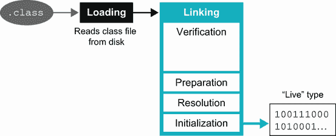
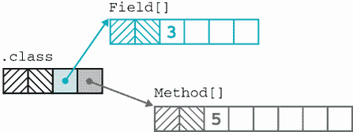
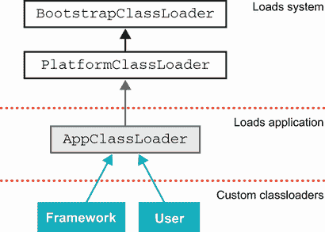
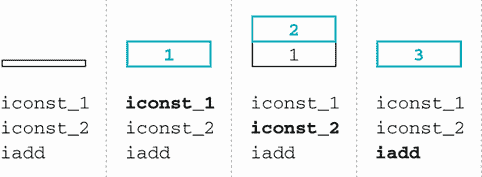

# 4 类文件和字节码

本章涵盖

+   类加载

+   反射

+   类文件的解剖结构

+   JVM 字节码及其重要性

成为一个更加扎实的 Java 开发者的一个经过验证的方法是提高你对平台工作原理的理解。熟悉核心功能，如类加载和 JVM 字节码的本质，将极大地帮助你实现这一目标。

考虑以下一个资深 Java 开发者可能会遇到的情况：想象一下，你有一个大量使用依赖注入（DI）技术（如 Spring）的应用程序，它在启动时出现问题，并带有难以理解的错误信息。如果问题不仅仅是简单的配置错误，你可能需要了解 DI 框架的实现方式，以便追踪问题。这意味着你需要理解类加载。

或者假设你正在与之合作的供应商倒闭了。你只剩下最后一点编译后的代码，没有源代码，文档也不完整。你如何探索编译后的代码，看看它包含什么？

除了最简单的应用外，所有应用都可能因为`ClassNotFoundException`或`NoClassDefFoundError`而失败，但许多开发者并不了解这些错误，也不知道它们之间的区别，甚至不知道它们为什么会发生。

本章重点介绍这些关注点背后的平台方面。我们还将讨论一些更高级的功能，但它们是为那些喜欢深入研究的人准备的，如果你时间紧迫，可以跳过这些内容。

我们将从类加载的概述开始——这是 JVM 定位和激活新类型以便在运行程序中使用的过程。该讨论的核心是代表 JVM 中类型的`Class`对象。接下来，我们将探讨这些概念如何构建成称为反射（或核心反射）的主要语言功能。

之后，我们将讨论用于检查和解剖类文件的工具。我们将使用与 JDK 一起提供的`javap`作为我们的参考工具。在完成类文件解剖课程之后，我们将转向字节码。我们将介绍 JVM 操作码的主要家族，并查看运行时在低级别是如何操作的。

让我们从讨论*类加载*开始——这是将新类纳入正在运行的 JVM 进程的过程。在本节中，我们将首先讨论“经典”类加载的基础，正如 Java 8 及之前版本所做的那样。在章节的后面部分，我们将讨论模块化 JVM 的出现如何对类加载带来一些（较小的）变化。

## 4.1 类加载和类对象

`.class`文件为 JVM 定义了一个类型，包括字段、方法、继承信息、注解和其他元数据。类文件格式由标准详细描述，任何希望在 JVM 上运行的语言都必须遵守它。

注意：类是 Java 平台将理解、接受和执行的程序代码的基本单元。

从一个初学 Java 开发者的角度来看，许多类加载机制是隐藏的。开发者提供可执行 JAR 文件或主应用程序类的名称（该名称必须存在于类路径上），然后 JVM 找到并执行该类。

任何应用程序依赖项（例如，除了 JDK 之外的库）也必须在类路径上，JVM 会找到并加载它们。然而，Java 规范没有说明这需要在应用程序启动时完成，还是根据需要稍后完成。

注意：Java 类加载系统向用户提供的 API 相对简单——很多复杂性都是故意隐藏的，我们将在本章后面讨论开发者可用的 API。

让我们从一个非常简单的例子开始：

```
Class<?> clazz = Class.forName("MyClass");
```

这段代码将加载一个名为 `MyClass` 的类到当前执行状态中。从 JVM 的角度来看，为了实现这一点，必须执行一系列步骤。首先，必须找到与 `MyClass` 名称对应的类文件，然后解析其中包含的类。这些步骤在本地代码中执行——在 HotSpot 中，本地方法被调用为 `JVM_DefineClass()`。

实际过程在高层上，是本地代码构建 JVM 的内部表示（称为 *klass*，它不是 Java 对象——我们将在第十七章中详细介绍）。然后，如果 klass 能够成功从类文件中提取出来，JVM 将构建一个 Java “镜像”的 klass，并将其作为 `Class` 对象传递回 Java 代码。

之后，代表类型的 `Class` 对象对运行系统可用，可以创建其新的实例。在先前的例子中，`clazz` 最终持有代表 `MyClass` 类型的 `Class` 对象。它不能持有 klass，因为 klass 是 JVM 内部对象，*不是* Java 对象。

注意：相同的流程也用于主应用程序类、所有依赖项以及程序启动后可能需要的任何其他类。

在本节中，我们将更详细地介绍 JVM 视角下的步骤，并介绍类加载器，它是控制整个过程的对象。

### 4.1.1 加载和链接

从一个角度来看，JVM 可以被视为一个执行容器。在这个观点下，JVM 的目的是消费类文件并执行其中包含的字节码。为了实现这一点，JVM 必须以字节流的形式检索类文件的内容，将其转换为可用的形式，并将其添加到运行状态中。这正是我们在这里所描述的过程。

这个相对复杂的过程可以以多种方式划分，但我们将它称为 *加载* 和 *链接*。

注意：我们关于加载和链接的讨论涉及一些特定于 HotSpot 代码的细节，但其他实现应该做类似的事情。

第一步是获取构成类文件的字节序列数据流。这个过程通常从一个从文件系统读取的字节数组开始（但其他替代方案肯定也是可能的）。

一旦我们有了数据流，就必须解析它以检查它是否包含有效的类文件结构（这有时被称为*格式检查*）。如果是这样，那么就会创建一个候选 klass。在这个阶段，当候选 klass 正在填充时，会执行一些基本检查（例如，正在加载的类实际上能否访问其声明的超类？它是否试图覆盖任何`final`方法？）。

然而，在加载过程结束时，对应于类的数据结构还不能被其他代码使用，特别是我们还没有一个完全功能的 klass。

要到达那里，类必须在被使用之前先进行链接和初始化。从逻辑上讲，这一步可以分为三个子阶段：验证、准备和解决。然而，在实际实现中，代码可能并没有被干净地分离出来，所以如果你打算阅读源代码，你应该意识到这里提供的描述是对过程的高层次或概念性描述，并不与实际实现代码有精确的对应关系。

考虑到这一点，验证可以理解为确认类符合 Java 规范的要求，并且不会在运行时引起错误或其他问题的阶段。这种链接阶段的相互关系可以在图 4.1 中看到。



图 4.1 加载和链接（链接的子阶段）

让我们依次了解每个阶段。

验证

验证是一个相当复杂的过程，由几个独立的部分组成。例如，JVM 需要检查常量池中包含的符号信息（在 4.3.3 节中详细讨论）是否自洽，并遵守常量的基本行为规则。

另一个主要关注点，可能是验证中最复杂的一部分，是检查方法的字节码。这涉及到确保字节码表现良好，并且不会试图绕过 JVM 的环境控制。

执行的一些主要检查如下：

+   确保字节码不会尝试以不允许或邪恶的方式操作栈。

+   确保每个分支指令（例如，从`if`或循环）都有一个适当的跳转指令。

+   确保方法调用使用正确的静态类型和正确数量的参数。

+   检查局部变量是否只分配了适合其类型的值。

+   检查每个可能抛出的异常都有一个合法的捕获处理器。

这些检查是出于几个原因，包括性能。这些检查使得运行时检查可以跳过，从而使解释代码运行更快。其中一些还可以在运行时将字节码编译成机器码（即时编译，我们将在第六章中介绍）时简化编译过程。

准备

准备类涉及分配内存并使类中的静态变量准备好初始化，但它不会初始化变量或执行任何 JVM 字节码。

解析

解析是链接的一部分，其中 JVM 检查正在链接的类的超类型（以及它实现的任何接口）是否已经链接，如果没有，则在继续链接此类之前进行链接。这可能导致任何以前未见过的新的类型出现递归链接过程。

注意：与类加载的这个方面相关的一个关键短语是类型的*传递闭包*。不仅包括类直接继承的类型，还包括所有间接引用的类型也必须链接。

一旦找到并解析了需要加载的所有附加类型，JVM 就可以初始化它最初请求加载的类。

初始化

在这个最终阶段，初始化任何静态变量，并运行任何静态初始化块。这是一个重要的点，因为只有现在 JVM 才最终从新加载的类中运行字节码。

当这一步完成时，类就完全加载并准备好使用。该类对运行时可用，并且可以创建其新实例。任何进一步引用此类的类加载操作现在将看到它已加载并可用。

### 4.1.2 类对象

链接和加载过程的结果是一个`Class`对象，它代表新加载和链接的类型。现在它在 JVM 中完全功能化，尽管出于性能原因，`Class`对象的某些方面仅在需要时初始化。

注意：`Class`对象是常规的 Java 对象。它们生活在 Java 堆中，就像任何其他对象一样。

您的代码现在可以继续使用新类型并创建新实例。此外，类型的`Class`对象提供了一些有用的方法，例如`getSuperclass()`，它返回对应于超类型的`Class`对象。

类对象可以使用反射 API 进行间接访问方法、字段、构造函数等。`Class`对象包含对`Method`、`Field`以及与类成员相对应的各种其他对象的引用。这些对象可以在反射 API 中使用，以提供对类功能的间接访问，正如我们将在本章后面看到的那样。您可以在图 4.2 中看到其高级结构。



图 4.2 `Class`对象和`Method`引用

到目前为止，我们还没有讨论运行时负责定位和链接将成为新加载类的字节流的哪个部分。这是由类加载器处理的——`ClassLoader`抽象类的子类，它们是我们接下来要讨论的主题。

## 4.2 类加载器

Java 是一个本质上面向对象的系统，具有动态运行时。其一个方面是 Java 的类型在运行时是活跃的，运行中的 Java 平台类型系统可以被修改——特别是通过添加新的类型。构成 Java 程序的类型在运行时可以由未知类型进行扩展（除非它们是`final`或新的`sealed`类）。类加载能力对用户是开放的。类加载器只是扩展`ClassLoader`的 Java 类——它们自身也是 Java 类型。

注意：在现代 Java 环境中，所有类加载器都是模块化的。加载类始终是在模块的上下文中完成的。

`ClassLoader`类有一些本地方法，包括负责对类文件进行低级解析的加载和链接方面，但用户类加载器无法覆盖类加载的这个方面。无法使用本地代码编写类加载器。

平台附带以下典型类加载器，它们在平台的启动和正常运行期间执行不同的任务：

+   `BootstrapClassLoader`（或*原初*类加载器）——这个类加载器在 JVM 启动过程中非常早就被实例化了，所以通常最好将其视为 JVM 本身的一部分。它通常用于加载绝对基本系统——本质上就是`java.base`。

+   `PlatformClassLoader`——在启动最基本系统之后，平台类加载器加载应用程序依赖的其他平台模块。这个类加载器是访问任何平台类的首选接口，无论它实际上是由这个加载器还是引导加载器加载的。它是一个内部类的实例。

+   `AppClassLoader`——应用程序类加载器——这是最广泛使用的类加载器。它加载应用程序类，并在大多数现代 Java 环境中执行大部分工作。在模块化 JVM 中，应用程序类加载器不再是`URLClassLoader`的实例（如 Java 8 及之前版本），而是一个内部类的实例。

让我们通过向第二章中`wgjd.sitecheck`模块的`SiteCheck`类的`main`方法顶部添加一些代码，来看看这些新的类加载器是如何工作的：

```
...
var clThis = SiteCheck.class.getClassLoader();
System.out.println(clThis);
var clObj = Object.class.getClassLoader();
System.out.println(clObj);
var clHttp = HttpClient.class.getClassLoader();
System.out.println(clHttp);
....
```

我们使用以下方式重新编译它：

```
$ javac -d out wgjd.sitecheck/module-info.java \
        wgjd.sitecheck/wgjd/sitecheck/*.java \
        wgjd.sitecheck/wgjd/sitecheck/*/*.java
```

并按如下方式运行：

```
$ java -cp out wgjd.sitecheck.SiteCheck http://github.com/well-grounded-java
```

注意使用“起始模块”语法而不是显式的起始类。

这会产生以下输出：

```
jdk.internal.loader.ClassLoaders$AppClassLoader@277050dc
null
jdk.internal.loader.ClassLoaders$PlatformClassLoader@12bb4df8
http://github.com/well-grounded-java: HTTP_1_1
```

`Object`类（位于`java.base`中）的类加载器报告为`null`。这是一个安全特性——引导类加载器不进行验证，并为它加载的每个类提供完全的安全访问。因此，在 Java 运行时中不表示和提供类加载器是没有意义的——这可能导致太多的错误或滥用。

除了它们的核心角色外，类加载器还经常用于从 JAR 文件或其他类路径上的位置加载资源（不是类的文件，如图像或配置文件）。这通常在结合 try-with-resources 模式时看到，如下所示：

```
try (var is = TestMain.class.getResourceAsStream("/resource.csv");
     var br = new BufferedReader(new InputStreamReader(is));) {
     // ...
}
// Exception handling elided
```

类加载器以几种不同的形式提供这种机制，返回一个`URL`或一个`InputStream`。

### 4.2.1 自定义类加载

更复杂的环境通常会有许多额外的*自定义类加载器*——这些是继承自`java.lang.ClassLoader`（直接或间接）的类。这是可能的，因为类加载器类不是最终的，并且开发人员实际上被鼓励编写针对他们特定需求的自己的类加载器。

自定义类加载器以 Java 类型表示，因此需要由类加载器加载，这通常被称为它们的*父类加载器*。这不应与类继承和父类混淆。相反，类加载器通过一种*委托*形式相互关联。

在图 4.3 中，您可以查看类加载器的委托层次结构以及不同的加载器是如何相互关联的。在某些特殊情况下，自定义类加载器可能具有不同的类加载器作为其父类加载器，但通常情况下，它是加载类加载器。



图 4.3 类加载器层次结构

自定义机制的关键在于`loadClass()`和`findClass()`方法，这些方法在`ClassLoader`上定义。主要入口点是`loadClass()`，下面是`ClassLoader`中相关代码的简化形式：

```
protected Class<?> loadClass(String name, boolean resolve)
        throws ClassNotFoundException
    {
        synchronized (getClassLoadingLock(name)) {
            // First, check if the class has already been loaded
            Class<?> c = findLoadedClass(name);
            if (c == null) {
                // ...
                try {
                    if (parent != null) {
                        c = parent.loadClass(name, false);
                    } else {
                        c = findBootstrapClassOrNull(name);
                    }
                } catch (ClassNotFoundException e) {
                    // ClassNotFoundException thrown if class not found
                    // from the non-null parent class loader
                }

                if (c == null) {
                    // If still not found, then invoke findClass in order
                    // to find the class.
                    // ...
                    c = findClass(name);

                    // ...
                }
            }
            // ...

            return c;
        }
    }
```

实际上，`loadClass()`机制会检查类是否已经加载，然后询问其父类加载器。如果类加载失败（注意`parent.loadClass(name, false)`调用周围的 try-catch），则加载过程委托给`findClass()`。`java.lang.ClassLoader`中`findClass()`的定义非常简单——它只是抛出一个`ClassNotFoundException`。

在这一点上，让我们回到我们在本章开头提出的问题，并探讨在类加载过程中可能遇到的异常和错误类型。

类加载异常

`ClassNotFoundException`的含义相对简单：类加载器尝试加载指定的类，但无法完成。也就是说，在请求加载时，该类对 JVM 来说是未知的，并且 JVM 无法找到它。

接下来是`NoClassDefFoundError`。请注意，这是一个*错误*而不是异常。这个错误表明 JVM 确实知道请求的类的存在，但在其内部元数据中找不到其定义。让我们快速看一下一个例子：

```
public class ExampleNoClassDef {

    public static class BadInit {
        private static int thisIsFine = 1 / 0;
    }

    public static void main(String[] args) {
        try {
            var init = new BadInit();
        } catch (Throwable t) {
            System.out.println(t);
        }
        var init2 = new BadInit();
        System.out.println(init2.thisIsFine);
    }
}
```

当它运行时，我们得到一些类似以下的输出：

```
$ java ExampleNoClassDef
java.lang.ExceptionInInitializerError
Exception in thread "main" java.lang.NoClassDefFoundError: Could
  not initialize class ExampleNoClassDef$BadInit
    at ExampleNoClassDef.main(ExampleNoClassDef.java:13)
```

这表明 JVM 试图加载`BadInit`类，但未能成功。尽管如此，程序捕获了异常并尝试继续执行。然而，当第二次遇到该类时，JVM 的内部元数据表显示该类已被识别，但没有加载有效的类。

JVM 在失败类加载尝试上有效地实现了*负缓存*——不会重试加载，而是抛出一个错误（`NoClassDefFoundError`）。

另一个常见的错误是`UnsupportedClassVersionError`，当类加载操作尝试加载由比运行时支持的 Java 源代码编译器更高版本的编译器编译的类文件时触发。例如，考虑一个用 Java 11 编译的类，我们尝试在 Java 8 上运行，如下所示：

```
$ java ScratchImpl
Error: A JNI error has occurred please check your installation and try again
Exception in thread "main" java.lang.UnsupportedClassVersionError:
  ScratchImpl has been compiled by a more recent version of the Java
    Runtime (class file version 55.0), this version of the Java Runtime
    only recognizes class file versions up to 52.0
    at java.lang.ClassLoader.defineClass1(Native Method)
    at java.lang.ClassLoader.defineClass(ClassLoader.java:763)
    at java.security.SecureClassLoader.defineClass(SecureClassLoader.java:142)
    at java.net.URLClassLoader.defineClass(URLClassLoader.java:468)
    at java.net.URLClassLoader.access$100(URLClassLoader.java:74)
    at java.net.URLClassLoader$1.run(URLClassLoader.java:369)
    at java.net.URLClassLoader$1.run(URLClassLoader.java:363)
    at java.security.AccessController.doPrivileged(Native Method)
    at java.net.URLClassLoader.findClass(URLClassLoader.java:362)
    at java.lang.ClassLoader.loadClass(ClassLoader.java:424)
    at sun.misc.Launcher$AppClassLoader.loadClass(Launcher.java:349)
    at java.lang.ClassLoader.loadClass(ClassLoader.java:357)
    at sun.launcher.LauncherHelper.checkAndLoadMain(LauncherHelper.java:495)
```

Java 11 格式的字节码可能包含运行时不支持的特性，因此继续尝试加载它是不安全的。请注意，因为这是一个 Java 8 运行时，它没有在堆栈跟踪中具有模块入口。

最后，我们还应该提到`LinkageError`，它是包含`NoClassDefFoundError`、`VerifyError`、`UnsatisfiedLinkError`以及几个其他可能性的类层次结构的基类。

第一个自定义类加载器

自定义类加载的最简单形式是简单地继承`ClassLoader`并重写`findClass()`方法。这允许我们重用之前讨论过的`loadClass()`逻辑，并简化我们的类加载器复杂性。

我们的第一个例子是`SadClassLoader`，如下一代码示例所示。它实际上并没有做什么，但它确保你知道它在技术上参与了该过程，并祝愿你一切顺利：

```
public class LoadSomeClasses {

    public static class SadClassloader extends ClassLoader {
        public SadClassloader() {
            super(SadClassloader.class.getClassLoader());
        }

        public Class<?> findClass(String name) throws
          ClassNotFoundException {
            System.out.println("I am very concerned that I
              couldn't find the class");
            throw new ClassNotFoundException(name);
        }
    }

    public static void main(String[] args) {
        if (args.length > 0) {
            var loader = new SadClassloader();
            for (var name : args) {
                System.out.println(name +" ::");
                try {
                    var clazz = loader.loadClass(name);
                    System.out.println(clazz);
                } catch (ClassNotFoundException x) {
                    x.printStackTrace();
                }
            }
        }
    }
}
```

在我们的例子中，我们设置了一个非常简单的类加载器以及一些使用它的代码来尝试加载可能已经或尚未加载的类。

注意：自定义类加载器的一个常见约定是提供一个无参数的构造函数，该构造函数调用超类构造函数并将加载类加载器作为参数（成为父类加载器）。

许多自定义类加载器并不比我们的例子复杂多少——它们只是重写`findClass()`方法以提供所需的特定功能。例如，这可能包括通过网络查找类。在一个难忘的案例中，一个自定义类加载器通过连接数据库（使用 JDBC）并访问加密的二进制列来获取将用于加载的字节来加载类。这是为了满足在高度监管环境中非常敏感代码的静态加密要求。

然而，不仅仅可以重写`findClass()`。例如，`loadClass()`不是 final 的，因此可以被重写，实际上，一些自定义类加载器正是为了改变我们之前遇到的通用逻辑而重写它。

最后，我们还有在`ClassLoader`上定义的`defineClass()`方法。这个方法是类加载的关键，因为它是一个用户可访问的方法，执行我们在本章中之前描述的“加载和链接”过程。它接受一个字节数组并将它们转换为类对象。这是在运行时加载不在类路径上的新类的主要机制。

只有当传递的字节缓冲区是正确的 JVM 类文件格式时，对`defineClass()`的调用才会成功。如果不是，它将失败加载，因为加载或验证步骤将失败。

注意：此方法可用于加载在运行时生成且没有源代码表示的类的高级技术。这种技术是 Java 中 lambda 表达式机制的工作方式。我们将在第十七章中对此主题有更多讨论。

`defineClass()`方法既是受保护的也是 final 的，并且定义在`java.lang.ClassLoader`上，因此只能由`ClassLoader`的子类访问。因此，自定义类加载器始终可以访问`defineClass()`的基本功能，但不能干扰验证或其他低级类加载逻辑。这一点很重要：无法更改验证算法是一个非常有用的安全特性——一个编写不良的自定义类加载器无法危害 JVM 提供的基本平台安全。

在 HotSpot 虚拟机（这是最常用的 JVM 实现）的情况下，`defineClass()`委托给本地方法`defineClass1()`，它进行一些基本检查，然后调用一个名为`JVM_DefineClassWithSource()`的 C 函数。

这个函数是进入 JVM 的入口点，它提供了访问 HotSpot 的 C 代码的权限。HotSpot 使用 C `SystemDictionary`通过 C++方法`ClassFileParser::parseClassFile()`来加载新的类。这段代码实际上运行了大部分链接过程，特别是验证算法。

一旦类加载完成，方法的字节码就被放置在 HotSpot 的表示方法的元数据对象中（它们被称为*methodOops*）。然后它们可供字节码解释器使用。这可以被视为一个方法缓存的概念，尽管出于性能原因，字节码实际上是由 methodOops 持有的。

我们已经遇到了`SadClassloader`。现在让我们看看几个自定义类加载器的例子，首先看看如何使用类加载来实现依赖注入。

示例：依赖注入框架

我们想强调以下两个与 DI 高度相关的核心概念：

+   系统内的功能单元有依赖项和配置信息，它们依赖于这些信息以实现正常功能。

+   许多对象系统都有难以或笨拙地在代码中表达依赖项。

你应该想象的是包含行为和配置的类以及外部于对象的依赖项。这部分通常被称为对象的*运行时连接*。在这个例子中，我们将讨论一个假设的 DI 框架如何使用类加载器来实现运行时连接。

注意：我们将采取的方法类似于 Spring 框架原始实现的简化版本。然而，现代的生产级依赖注入（DI）框架具有显著更高的复杂性。我们的例子仅用于演示目的。

让我们从如何在我们假想的 DI 框架下启动应用程序开始看起，如下所示：

```
java -cp <CLASSPATH> org.wgjd.DIMain /path/to/config.xml
```

`DIMain`类是 DI 框架的入口点类。它将读取配置文件，创建对象系统，并将它们连接起来（“连接它们”）。请注意，`DIMain`类不是一个应用程序类——它来自框架，并且是完全通用的。

我们还可以看到，应用程序的`CLASSPATH`必须包含三样东西：a) DI 框架的 JAR 文件，b) 在`config.xml`文件中引用的应用程序类，以及 c) 应用程序的其他（非 DI）依赖项。让我们看看下一个示例配置文件，如下所示：

```
<beans>

 <bean id="dao" class="app.ch04.PaymentsDAO">
  <constructor-arg index="0" value="jdbc:postgresql://db.wgjd.org/payments"/>
  <constructor-arg index="1" value="org.postgresql.Driver"/>
 </bean>

  <bean id="service" class="app.ch04.PaymentService">
    <constructor-arg index="0" ref="dao"/>
  </bean>

</beans>
```

DI 框架使用配置文件来确定要构造哪些对象。这个例子需要创建`dao`和`service`豆类，并且框架将需要调用每个豆类的构造函数，并传递指定的参数。

类加载分为两个独立阶段。第一阶段（由应用程序类加载器处理）加载`DIMain`类及其引用的任何框架类。然后`DIMain`开始运行，并将配置文件的路径作为`main()`参数接收。

到目前为止，框架已经在 JVM 中启动并运行，但`config.xml`中指定的用户类尚未被触及。事实上，直到`DIMain`检查配置文件，框架都没有办法知道要加载哪些类。

要加载`config.xml`中指定的应用程序配置，需要第二个阶段的类加载。在我们的例子中，这使用了一个自定义的类加载器。

首先，检查`config.xml`文件以确保其一致性并确保没有错误。然后，如果一切顺利，自定义类加载器尝试从`CLASSPATH`加载类型。如果其中任何一个失败，整个过程将被终止，导致运行时错误。

如果成功，DI 框架可以按正确的顺序（使用它们的构造函数参数）实例化所需的对象。最后，如果所有这些操作都正确完成，应用程序上下文就绪并可以开始运行。

值得重申的是，这个例子是假设性的和说明性的。完全有可能构建一个简单的 DI 框架，其工作方式如这里所描述。然而，实际实现真正的 DI 系统在实践中要复杂得多。让我们继续看看另一个例子。

示例：一个用于监控的类加载器

考虑一个在类加载时修改类字节码以添加额外监控信息的类加载器。当测试用例运行在转换后的代码上时，监控代码会记录测试用例实际测试了哪些方法和代码分支。从这些信息中，开发者可以了解一个类的单元测试是否全面。

这种方法曾是 EMMA 测试覆盖率工具的基础，该工具目前可以从[`emma.sourceforge.net/`](http://emma.sourceforge.net/)获取，尽管它现在相当过时，并且没有为现代 Java 版本更新。尽管如此，遇到使用专门类加载器转换加载时字节码的框架和其他代码是很常见的。

注意：在加载时修改字节码的技术也见于*java agent*方法，该方法被 New Relic 等工具用于性能监控、可观察性和其他目标。

我们简要地讨论了自定义类加载的一些用例。Java 技术领域的许多其他领域都是类加载和相关技术的重度使用者。以下是一些最著名的例子：

+   插件架构

+   框架（无论是供应商的还是自建的）

+   从非传统位置（非文件系统或 URL）检索类文件

+   Java EE

+   在 JVM 进程已经开始运行之后，可能需要添加新的、未知代码的任何情况

让我们继续讨论模块系统如何影响类加载并修改我们刚刚解释的经典图景。

### 4.2.2 模块和类加载

模块系统旨在在类加载的不同级别上运行，而类加载是平台中相对低级的一种机制。模块涉及程序单元之间的大规模依赖关系，而类加载涉及小规模。然而，了解这两种机制如何交叉以及模块的引入对程序启动造成的改变是很重要的。

回想一下，当在模块化 JVM 上运行时，为了执行程序，运行时会首先计算一个模块图，并尝试满足它。这被称为*模块解析*，它推导出根模块及其依赖项的传递闭包。

在此过程中，会执行额外的检查（例如，没有具有重复名称的模块，没有分割的包）。由于模块图的存在，预计运行时类加载问题会更少，因为现在可以在进程完全开始之前检测到模块路径上缺失的 JAR 文件。

除了这个之外，模块系统在大多数情况下并不会对类加载产生太大影响。有一些高级的可能性（例如通过反射动态加载服务提供者接口的模块实现），但这些不太可能被大多数开发者经常遇到。

## 4.3 检查类文件

类文件是二进制块，因此它们不容易直接处理。但在许多情况下，你会发现调查类文件是必要的。

假设你的应用程序需要额外的公共方法来允许更好的运行时监控（例如通过 JMX）。重新编译和重新部署似乎完成得很好，但当检查管理 API 时，方法并不在那里。额外的重建和重新部署步骤没有效果。

为了调试部署问题，你可能需要检查 `javac` 是否生成了你认为它应该生成的类文件。或者你可能需要调查一个你没有源代码的类，并且你怀疑文档是不正确的。

对于这些和类似的任务，你必须使用工具来检查类文件的内容。幸运的是，标准的 Oracle JVM 随带一个名为 `javap` 的工具，它非常适合查看内部和反汇编类文件。

我们将首先介绍 `javap` 以及它提供的一些基本开关，用于检查类文件的不同方面。然后我们将讨论 JVM 内部使用的一些方法名称和类型的表示形式。接下来，我们将查看常量池——JVM 的“有用之物宝箱”——它在理解字节码的工作方式中起着重要作用。

### 4.3.1 介绍 javap

从查看一个类声明的方法到打印字节码，`javap` 可以用于许多有用的任务。让我们检查 `javap` 的最简单使用形式，这是应用在章节前面提到的类加载示例：

```
$ javap LoadSomeClasses.class
Compiled from "LoadSomeClasses.java"
public class LoadSomeClasses {
  public LoadSomeClasses();
  public static void main(java.lang.String[]);
}
```

内部类已经被编译成单独的类，因此我们还需要查看这一点：

```
$ javap LoadSomeClasses\$SadClassloader.class
Compiled from "LoadSomeClasses.java"
public class LoadSomeClasses$SadClassloader extends java.lang.ClassLoader {
  public LoadSomeClasses$SadClassloader();
  public java.lang.Class<?> findClass(java.lang.String) throws
    java.lang.ClassNotFoundException;
}
```

默认情况下，`javap` 显示公共、受保护的和默认访问（包受保护）可见的方法。`-p` 开关也显示私有方法和字段。

### 4.3.2 方法签名的内部形式

JVM 在内部使用的方法签名形式与 `javap` 显示的供人类阅读的形式略有不同。随着我们更深入地了解 JVM，你将更频繁地看到这些内部名称。如果你热衷于继续前进，你可以跳过，但请记住，这一节在这里——你可能需要从后面的章节中参考它。

在紧凑形式中，类型名称被压缩。例如，`int` 被表示为 `I`。这些紧凑形式有时被称为 *类型描述符*。一个完整的列表在表 4.1 中提供（包括 `void`，它不是一个类型，但出现在方法签名中）。

表 4.1 类型描述符

| 描述符 | 类型 |
| --- | --- |
| B | Byte |
| C | Char（一个 16 位 Unicode 字符） |
| D | Double |
| F | Float |
| I | Int |
| J | 长整型 |
| L<类型名>; | 引用类型（例如，对于字符串，Ljava/lang/String;） |
| S | 短整型 |
| V | 无值 |
| Z | 布尔型 |
| [ | 数组 |

在某些情况下，类型描述符可能比源代码中出现的类型名称更长（例如，`Ljava/lang/Object;`比`Object`长，但类型描述符总是完全限定的，因此可以直接解析）。

`javap`提供了一个有用的开关`-s`，它会为你输出签名类型描述符，这样你就不必使用表格来计算它们。你可以使用`javap`的一个稍微高级的调用，来显示我们之前查看的一些方法的签名，如下所示：

```
$ javap -s LoadSomeClasses.class
Compiled from "LoadSomeClasses.java"
public class LoadSomeClasses {
  public LoadSomeClasses();
    descriptor: ()V

  public static void main(java.lang.String[]);
    descriptor: ([Ljava/lang/String;)V
}
```

对于内部类：

```
$ javap -s LoadSomeClasses\$SadClassloader.class
Compiled from "LoadSomeClasses.java"
public class LoadSomeClasses$SadClassloader extends java.lang.ClassLoader {
  public LoadSomeClasses$SadClassloader();
    descriptor: ()V

  public java.lang.Class<?> findClass(java.lang.String) throws
    java.lang.ClassNotFoundException;
    descriptor: (Ljava/lang/String;)Ljava/lang/Class;
}
```

如你所见，方法签名中的每个类型都由一个类型描述符表示。

在下一节中，我们将看到类型描述符的另一种用途。这是类文件中的一个非常重要的部分——常量池。

### 4.3.3 常量池

常量池是一个提供便捷快捷方式访问类文件中其他（常量）元素的区域。如果你研究过像 C 或 Perl 这样的语言，它们明确使用了符号表，你可以将常量池视为与 JVM 概念有些相似。

让我们在下一个列表中使用一个非常简单的例子来演示常量池，这样我们就不至于被细节淹没。下一个列表显示了一个简单的“playpen”或“scratchpad”类。通过在`run()`中编写一小段代码，它可以快速测试 Java 语法特性或库。

列表 4.1 示例 playpen 类

```
package wgjd.ch04;

public class ScratchImpl {

    private static ScratchImpl inst = null;

    private ScratchImpl() {

    }

    private void run() {

    }

    public static void main(String[] args) {
        inst = new ScratchImpl();
        inst.run();
    }
}
```

要查看常量池中的信息，你可以使用`javap -v`。这将打印出大量的附加信息——远不止常量池本身——但让我们专注于下一个示例中的常量池条目：

```
#1 = Class #2 // wgjd/ch04/ScratchImpl

#2 = Utf8 wgjd/ch04/ScratchImpl

#3 = Class #4 // java/lang/Object

#4 = Utf8 java/lang/Object

#5 = Utf8 inst

#6 = Utf8 Lwgjd/ch04/ScratchImpl;

#7 = Utf8 <clinit>

#8 = Utf8 ()V

#9 = Utf8 Code

#10 = Fieldref #1.#11 // wgjd/ch04/ScratchImpl.inst:Lwgjd/ch04/ScratchImpl;

#11 = NameAndType #5:#6 // instance:Lwgjd/ch04/ScratchImpl;

#12 = Utf8 LineNumberTable

#13 = Utf8 LocalVariableTable

#14 = Utf8 <init>

#15 = Methodref #3.#16 // java/lang/Object."<init>":()V

#16 = NameAndType #14:#8 // "<init>":()V

#17 = Utf8 this

#18 = Utf8 run

#19 = Utf8 ([Ljava/lang/String;)V

#20 = Methodref #1.#21 // wgjd/ch04/ScratchImpl.run:()V

#21 = NameAndType #18:#8 // run:()V

#22 = Utf8 args

#23 = Utf8 [Ljava/lang/String;

#24 = Utf8 main

#25 = Methodref #1.#16 // wgjd/ch04/ScratchImpl."<init>":()V

#26 = Methodref #1.#27 // wgjd/ch04/ScratchImpl.run:([Ljava/lang/String;)V

#27 = NameAndType #18:#19 // run:([Ljava/lang/String;)V

#28 = Utf8 SourceFile

#29 = Utf8 ScratchImpl.java
```

如你所见，常量池条目是分类型的。它们也相互引用，例如，类型为`Class`的条目将引用类型为`Utf8`的条目。`Utf8`条目意味着一个字符串，因此`Class`条目指向的`Utf8`条目将是类的名称。

表 4.2 展示了常量池条目的可能集合。常量池中的条目有时会使用`CONSTANT_`前缀进行讨论，例如`CONSTANT _Class`。这是为了在它们可能被混淆的情况下，明确指出它们不是 Java 类型。

表 4.2 常量池条目

| 名称 | 描述 |
| --- | --- |
| `Class` | 一个类常量。指向类的名称（作为一个`Utf8`条目）。 |
| `Fieldref` | 定义一个字段。指向此字段的`Class`和`NameAndType`。 |
| `Methodref` | 定义一个方法。指向此字段的`Class`和`NameAndType`。 |
| `InterfaceMethodref` | 定义一个接口方法。指向此字段的`Class`和`NameAndType`。 |
| `String` | 一个字符串常量。指向包含字符的`Utf8`条目。 |
| `Integer` | 一个整型常量（4 字节）。 |
| `Float` | 一个浮点常量（4 字节）。 |
| `Long` | 一个长常量（8 字节）。 |
| `Double` | 一个双精度浮点常量（8 字节）。 |
| `NameAndType` | 描述一个名称和类型对。类型指向包含类型描述符的`Utf8`。 |
| `Utf8` | 表示`Utf8`编码字符的字节流。 |
| `InvokeDynamic` | `invokedynamic`机制的一部分——见第十七章。 |
| `MethodHandle` | `invokedynamic`机制的一部分——见第十七章。 |
| `MethodType` | `invokedynamic`机制的一部分——见第十七章。 |

使用这个表格，你可以查看来自 playpen 常量池的一个示例常量解析。考虑第 10 个条目的`Fieldref`。要解析一个字段，你需要一个名称、一个类型以及它所在类的信息：第 10 个条目有值#1.#11，这意味着类#1 中的常量#11。很容易检查#1 确实是一个类型为`Class`的常量，而#11 是一个`NameAndType`。#1 指的是`ScratchImpl` Java 类本身，而#11 指的是#5:#6——一个类型为`ScratchImpl`的变量`inst`。因此，总的来说，#10 指的是`ScratchImpl`类本身中的静态变量`inst`（你可能已经从上面的输出中猜到了）。

在类加载的验证步骤中，有一个步骤来检查类文件中的静态信息是否一致。前面的例子显示了运行时在加载新类时将执行的那种完整性检查。

我们已经讨论了一些类文件的基本结构。让我们继续下一个主题，我们将深入字节码的世界。了解源代码是如何转换为字节码的，将帮助你更好地理解你的代码将如何运行。反过来，这将导致当我们达到第六章及以后时，对平台功能的更多洞察。

## 4.4 字节码

字节码在我们之前的讨论中一直是一个幕后玩家。让我们首先回顾一下我们已经学到的关于它的知识：

+   字节码是程序的中间表示，介于人类可读的源代码和机器码之间。

+   字节码由`javac`从 Java 源代码文件生成。

+   一些高级语言特性已经被编译掉了，不会出现在字节码中。例如，Java 的循环结构（`for`、`while`等）已经消失，变成了字节码分支指令。

+   每个操作码由一个字节表示（因此得名*字节码*）。

+   字节码是一种抽象表示，不是“一个虚构 CPU 的机器码。”

+   字节码可以进一步编译成机器码，通常是“即时”编译。

当解释字节码时，可能会出现一个轻微的“鸡生蛋，蛋生鸡”的问题。要完全理解正在发生的事情，你需要理解字节码及其执行的运行时环境。这是一个相当循环的依赖关系，因此为了解决这个问题，我们将首先深入探讨，并查看一个相对简单的例子。即使你在第一次阅读这个例子时并不理解所有内容，你可以在阅读了后续章节中关于字节码的更多内容后回过头来再看。

在示例之后，我们将提供一些关于运行时环境的背景信息，然后列出 JVM 的操作码，包括算术、调用、快捷形式等。最后，我们将通过一个基于字符串连接的例子来结束。让我们先看看如何从 `.class` 文件中检查字节码。

### 4.4.1 解析类

使用带有 `-c` 选项的 `javap`，你可以解析类。在我们的例子中，我们将使用之前遇到的 `ScratchImpl` 类。主要关注点将是检查构成方法的字节码。我们还将使用 `-p` 选项，这样我们就可以看到私有方法的字节码。

让我们逐节工作——`javap` 的输出中每个部分都有很多信息，很容易感到不知所措。首先，是标题。这里没有什么特别意外或令人兴奋的内容，如下所示：

```
$ javap -c -p wgjd/ch04/ScratchImpl.class

Compiled from "ScratchImpl.java"

public class wgjd.ch04.ScratchImpl extends java.lang.Object {
  private static wgjd.ch04.ScratchImpl inst;
```

接下来是静态块。这是放置变量初始化的地方，因此这表示将 `inst` 初始化为 `null`。敏锐的读者可能会猜测 `putstatic` 可能是一个将值放入静态字段的字节码：

```
static {};

Code:
  0: aconst_null
  1: putstatic #10 // Field inst:Lwgjd/ch04/ScratchImpl;
  4: return
```

上一段代码中的数字代表从方法开始到字节码流中的偏移量。所以字节 1 是 `putstatic` 操作码，字节 2 和 3 代表一个指向常量池的 16 位索引。在这种情况下，16 位索引的值是 10，这意味着值（在这种情况下，`null`）将被存储在常量池条目 #10 指示的字段中。从字节码流开始处的字节 4 是返回操作码——代码块的结束。

接下来是构造函数：

```
private wgjd.ch04.ScratchImpl();

Code:
  0: aload_0
  1: invokespecial #15 // Method java/lang/Object."<init>":()V
  4: return
```

记住，在 Java 中，void 构造函数将始终隐式调用超类构造函数。在这里，你可以从字节码中看到这一点——它是 `invokespecial` 指令。一般来说，任何方法调用都将转换为 JVM 的五个 `invoke` 指令之一，我们将在 4.4.7 节中遇到。

构造函数调用需要一个目标，这个目标由 `aload_0` 指令提供。它加载一个引用（一个地址）并使用快捷形式（我们将在 4.4.9 节中详细了解）来加载 0 号局部变量，即 `this`，当前对象。

`run()` 方法中基本上没有代码，因为这只是一个用于测试代码的临时类。此方法立即返回给调用者，并且不返回任何值（这是正确的，因为该方法返回 `void`）：

```
private void run();

Code:
  0: return
```

在主方法中，我们初始化 `inst` 并进行一些对象创建。这展示了我们可以学会识别的一些非常常见的基本字节码模式：

```
public static void main(java.lang.String[]);

Code:
  0: new #1 // class wgjd/ch04/ScratchImpl
  3: dup
  4: invokespecial #21 // Method "<init>":()V
```

这种由三个字节码指令组成的模式——`new`、`dup` 和调用名为 `<init>` 的方法的 `invokespecial`——始终代表创建一个新的实例。

`new` 操作码为新实例分配内存，并将对该实例的引用放置在栈顶。`dup` 操作码复制栈顶的引用（因此现在有两个副本）。为了完全创建对象，我们需要调用构造函数的主体。`<init>` 方法包含构造函数主体的代码，因此我们使用 `invokespecial` 调用该代码块。

当调用方法时，接收器对象的引用（如果有）以及任何方法参数都会从栈中消耗掉。这就是为什么我们需要先执行 `dup` 的原因——如果没有它，新分配的对象的唯一引用将被 `invoke` 消耗掉，并且在此之后将无法访问。

让我们看看主方法剩余的字节码：

```
  7: putstatic #10 // Field inst:Lwgjd/ch04/ScratchImpl;
 10: getstatic #10 // Field inst:Lwgjd/ch04/ScratchImpl;
 13: invokevirtual #22 // Method run:()V
 16: return
```

指令 7 保存已创建的单例实例的地址。指令 10 将其放回栈顶，以便指令 13 可以调用其方法。这是通过 `invokevirtual` 操作码完成的，该操作码执行 Java 的“标准”实例方法分派。

注意：一般来说，`javac` 生成的字节码是一种简单的表示——它并没有高度优化。总体策略是即时（JIT）编译器执行大量的优化，因此如果它们有一个相对简单和简单的起点，这会有所帮助。表达式“字节码应该是愚蠢的”描述了 JVM 实现者对从源语言生成的字节码的一般感觉。

`invokevirtual` 操作码包括检查对象继承层次结构中方法的覆盖情况。你可能觉得这有点奇怪，因为私有方法不能被覆盖。你可能猜测源代码编译器实际上可以发出 `invokespecial` 而不是 `invokevirtual` 用于私有方法。实际上，这曾经是情况，只是在最近的 Java 版本中才进行了更改。有关详细信息，请参阅第十七章关于嵌套成员的部分。

让我们继续讨论字节码所需的运行时环境。之后，我们将介绍我们将用来描述主要字节码指令家族的表格——加载/存储、算术、执行控制、方法调用和平台操作。然后我们将讨论操作码的可能快捷形式，然后再继续另一个示例。

### 4.4.2 运行时环境

理解 JVM 使用的堆栈机的操作对于理解字节码至关重要。JVM 不像硬件 CPU（如 x64 或 ARM 芯片）的一个最明显的原因是，JVM 没有处理器寄存器，而是使用堆栈进行所有计算和操作。这被称为*评估堆栈*（在 VM 规范中官方称为*操作数堆栈*，我们将交替使用这两个术语）。

评估堆栈是局部于方法的，当方法被调用时，会创建一个新的评估堆栈。当然，JVM 为每个 Java 线程都有一个*调用堆栈*，用于记录哪些方法已被执行（这构成了 Java 中堆栈追踪的基础）。保持每个线程调用堆栈和每个方法评估堆栈之间的区别是很重要的。

图 4.4 展示了如何使用评估堆栈对两个 int 常量执行加法操作。我们将在每个步骤下方显示等效的 JVM 字节码——我们将在本章后面遇到这个字节码，所以如果它现在看起来不完全合理，请不要担心。



图 4.4 使用堆栈进行数值计算

正如我们在本章前面讨论的，当一个类被链接到运行环境时，其字节码将被检查，其中很多验证都归结为分析堆栈上的类型模式。

注意：只有当堆栈上的值具有正确的类型时，对堆栈上值的操作才有效。如果，例如，我们将一个对象的引用压入堆栈，然后试图将其作为 int 处理并对其进行算术运算，可能会发生未定义或不良的事情。

类加载的验证阶段执行广泛的检查，以确保新加载的类中的方法不会滥用堆栈。这防止了格式不正确（或故意邪恶）的类被系统接受并造成问题。

当一个方法运行时，它需要一个内存区域作为评估堆栈，用于计算新值。此外，每个运行的线程都需要一个调用堆栈，用于记录当前正在执行的方法（堆栈追踪会报告的堆栈）。在某些情况下，这两个堆栈将相互作用。考虑以下这段代码：

```
var numPets = 3 + petRecords.getNumberOfPets("Ben");
```

为了评估这一点，JVM 将`3`压入操作数堆栈。然后它需要调用一个方法来计算本有多少宠物。为此，它将接收对象（方法被调用的对象——在这个例子中是`petRecords`）压入评估堆栈，然后是任何调用参数。

然后使用`invoke`操作码之一调用`getNumberOfPets()`方法，这将导致控制权转移到被调用的方法，并且刚刚进入的方法将出现在调用堆栈中。但是，当 JVM 进入新方法时，它开始使用一个新的操作数堆栈，因此调用者的操作数堆栈上的值不可能影响在调用方法中计算的结果。

当 `getNumberOfPets()` 完成时，返回值会被放置在调用者的操作栈上，作为 `getNumberOfPets()` 从调用栈中移除的过程的一部分。然后加法操作将这两个值相加。

现在我们转向检查字节码。这是一个大主题，有很多特殊情况，所以我们将提供一个主要功能的概述，而不是完整的处理。

### 4.4.3 指令集介绍

JVM 字节码由一系列操作码（指令集），可能跟随着每个指令的一些参数组成。指令集期望在给定状态下找到栈，并转换栈，以便参数被移除，结果被放置在那里。

每个指令集由一个单字节值表示，因此最多存在 255 个可能的指令集。目前，只有大约 200 个被使用。这太多了，我们无法一一列出（但完整列表可以在 [`mng.bz/aJaX`](http://mng.bz/aJaX) 找到）。幸运的是，大多数指令集都适合于几个基本家族之一，这些家族提供了类似的功能。我们将依次讨论每个家族，以帮助您了解它们。有些操作不适合任何家族，但它们出现的频率较低。

注意：JVM 不是一个纯粹面向对象的运行时环境。它了解原始类型。这在一些指令集家族中有所体现——一些基本的指令集类型（如 `store` 和 `add`）需要根据它们作用的原始类型具有不同的变体。

指令集表有以下四个列：

+   *名称*—这是指令集类型的一般名称。在许多情况下，几个相关的指令集会执行类似的功能。

+   *参数*—指令集所接受的参数。以 `i` 开头的参数是（无符号）字节，用于在常量池或局部变量表中形成查找索引。

注意：为了创建更长的索引，字节会被连接起来，所以 `i1,` `i2` 表示通过位移和加法“将这些两个字节组合成一个 16 位索引”：`((i1` `<<` `8)` `+` `i2)`

如果一个参数显示在括号中，这意味着并非所有指令集的形式都会使用它。

+   *栈布局*—这显示了指令集执行前后栈的状态。括号中的元素表示并非所有指令集的形式都会使用它们，或者这些元素是可选的（例如，对于调用指令集）。

+   *描述*—指令集执行的操作。

让我们通过检查 `getfield` 指令集的条目来查看表 4.3 中的一个示例行。这个指令集用于从对象字段中读取值。

| getfield | i1, i2 | [obj] -> [val] | 从栈顶对象获取常量池中指定索引的字段。 |
| --- | --- | --- | --- |

第一列给出了操作码的名称——`getfield`。下一列说明在字节码流中跟随操作码有两个参数。这些参数组合在一起形成一个 16 位的值，在常量池中查找以确定所需的字段（记住常量池索引总是 16 位）。栈布局列显示对象引用被字段的值所替换。

在操作过程中作为一部分移除对象实例的模式，仅仅是为了使字节码更加紧凑，避免进行大量繁琐的清理工作，并记得移除已经处理完毕的对象实例。

### 4.4.4 加载和存储操作码

加载和存储操作码系列关注于将值加载到栈上或从中检索。表 4.3 显示了加载/存储家族中的主要操作。

表 4.3 加载和存储操作码

| 名称 | 参数 | 栈布局 | 描述 |
| --- | --- | --- | --- |
| load | (i1) | [] -> [val] | 从局部变量加载一个值（原始类型或引用）到栈上。有快捷形式和类型特定的变体。 |
| ldc | i1 | [] -> [val] | 从池中加载一个常量到栈上。有类型特定的和宽变体。 |
| store | (i1) | [val] -> [] | 将值（原始类型或引用）存储在局部变量中，在此过程中从栈中移除。有快捷形式和类型特定的变体。 |
| dup |  | [val] -> [val, val] | 复制栈顶的值。有变体形式。 |
| getfield | i1, i2 | [obj] -> [val] | 从栈顶对象获取指定常量池索引的字段。 |
| putfield | i1, i2 | [obj, val] -> [] | 将值放入对象在指定常量池索引的字段中。 |
| getstatic | i1, i2 | [] -> [val] | 从指定的常量池索引获取静态字段的值。 |
| putstatic | i1, i2 | [val] -> [] | 将值放入指定常量池索引的静态字段中。 |

如我们之前所述，存在多种形式的加载和存储指令。例如，`dload`操作码从局部变量将双精度值加载到栈上，而`astore`操作码从栈中弹出一个对象引用到局部变量中。

让我们快速举例说明`getfield`和`putfield`。这个简单的类：

```
public class Scratch {
    private int i;

    public Scratch() {
        i = 0;
    }

    public int getI() {
        return i;
    }

    public void setI(int i) {
        this.i = i;
    }
}
```

将反编译为 getter 和 setter：

```
public int getI();
    Code:
       0: aload_0
       1: getfield      #7                  // Field i:I
       4: ireturn

  public void setI(int);
    Code:
       0: aload_0
       1: iload_1
       2: putfield      #7                  // Field i:I
       5: return
```

这显示了在将临时变量传输到堆存储之前，栈是如何用来存储它们的。

### 4.4.5 算术操作码

这些操作码在栈上执行算术运算。它们从栈顶获取参数，并对它们执行所需的计算。参数（总是原始类型）必须完全匹配，但平台提供了丰富的操作码来将一种原始类型转换为另一种类型。表 4.4 显示了基本的算术运算。

表 4.4 算术操作码

| 名称 | 参数 | 栈布局 | 描述 |
| --- | --- | --- | --- |
| add |  | [val1, val2] -> [res] | 将栈顶的两个值（必须是相同原始类型的值）相加，并将结果存储在栈上。具有快捷形式和特定类型的变体。 |
| sub |  | [val1, val2] -> [res] | 从栈顶减去两个值（相同原始类型的值）。具有快捷形式和特定类型的变体。 |
| div |  | [val1, val2] -> [res] | 将栈顶的两个值（相同原始类型的值）相除。具有快捷形式和特定类型的变体。 |
| mul |  | [val1, val2] -> [res] | 将栈顶的两个值（相同原始类型的值）相乘。具有快捷形式和特定类型的变体。 |
| (转换) |  | [value] -> [res] | 将值从一种原始类型转换为另一种类型。具有对应于每种可能转换的形式。 |

转换操作码具有非常短的名字，例如 `i2d` 用于 `int` 到 `double` 的转换。特别是，单词 *cast* 不出现在名称中，这就是为什么它在表中用括号括起来的原因。

### 4.4.6 执行流程控制操作码

如前所述，高级语言的控制结构不在 JVM 字节码中。相反，流程控制由少量原始操作处理，这些操作在表 4.5 中显示。

表 4.5 执行控制操作码

| 名称 | 参数 | 栈布局 | 描述 |
| --- | --- | --- | --- |
| if | b1, b2 | [val1, val2] -> [] 或 [val1] -> [] | 如果特定条件匹配，则跳转到指定的分支偏移量。 |
| goto | b1, b2 | [] -> [] | 无条件跳转到分支偏移量。有宽形式。 |
| tableswitch | {depends} | [index] -> [] | 用于实现 switch。 |
| lookupswitch | {depends} | [key] -> [] | 用于实现 switch。 |

与用于查找常量的索引字节类似，`b1, b2` 参数用于在此方法中构建一个字节码位置以跳转。它们不能用于跳转到方法外部——这在类加载时进行检查，会导致类验证失败。

`if` 操作码系列比你想象的要大一些——它有超过 15 条指令来处理各种源代码可能性（例如，数值比较、引用相等）。

注意：`if` 操作码系列还包含两个已弃用的指令，`jsr` 和 `ret`，这些指令不再由 `javac` 生成，并且在现代 Java 版本中是非法的。

`goto` 指令的宽形式（`goto_w`）需要 4 个字节的参数并构建一个偏移量，该偏移量可以大于 64 KB。这并不常见，因为它只会应用于非常大非常大的方法（并且这样的方法有其他问题，例如太大而不能被 JIT 编译）。还有 `ldc_w`，它可以用来引用非常大的常量池。

### 4.4.7 调用操作码

调用操作码包括四个用于处理一般方法调用的操作码，以及不寻常的`invokedynamic`操作码，该操作码是在 Java 7 中添加的。我们将在第十七章中更详细地讨论这个特殊情况。五个方法调用操作码如表 4.6 所示。

表 4.6 调用操作码

| 名称 | 参数 | 堆栈布局 | 描述 |
| --- | --- | --- | --- |
| invokestatic | i1, i2 | [(val1, ...)] -> [] | 调用一个静态方法。 |
| invokevirtual | i1, i2 | [obj, (val1, ...)] -> [] | 调用一个“正常”的实例方法。 |
| 调用接口 | i1, i2, count, 0 | [obj, (val1, ...)] -> [] | 调用一个接口方法。 |
| invokespecial | i1, i2 | [obj, (val1, ...)] -> [] | 调用一个“特殊”的实例方法，例如构造函数。 |
| invokedynamic | i1, i2, 0, 0 | [val1, ...] -> [] | 动态调用；请参阅第十七章。 |

通过一个扩展的例子，我们可以最容易地看到这些操作码之间的区别，如下所示：

```
long time = System.currentTimeMillis();

// This explicit typing is deliberate... read on
HashMap<String, String> hm = new HashMap<>();
hm.put("now", "bar");

Map<String, String> m = hm;
m.put("foo", "baz");
```

让我们使用`javap -c`来查看这个的字节码：

```
Code:
       0: invokestatic  #2  // Method java/lang/System.currentTimeMillis:()J
       3: lstore_1
       4: new           #3 // class java/util/HashMap
       7: dup
       8: invokespecial #4 // Method java/util/HashMap."<init>":()V
      11: astore_3
      12: aload_3
      13: ldc           #5 // String now
      15: ldc           #6 // String bar
      17: invokevirtual #7 // Method java/util/HashMap.put:(
                           //Ljava/lang/Object;Ljava/lang/Object;)
                           //Ljava/lang/Object;
      20: pop
      21: aload_3
      22: astore        4
      24: aload         4
      26: ldc           #8 // String foo
      28: ldc           #9 // String baz
      30: invokeinterface #10,  3 // InterfaceMethod java/util/Map.put:(
                                  //Ljava/lang/Object;Ljava/lang/Object;)
                                  //Ljava/lang/Object;
      35: pop
```

正如我们之前讨论的那样，Java 方法调用实际上被转换成了几种可能的`invoke*`字节码之一。让我们更仔细地看看：

```
       0: invokestatic  #2 // Method java/lang/System.currentTimeMillis:()J
       3: lstore_1
```

对`System.currentTimeMillis()`的静态调用被转换成了在字节码中位置为 0 的`invokestatic`。这个方法没有参数，因此在调用分发之前不需要将任何内容加载到评估堆栈上。

接下来，字节流中出现了两个字节`00 02`。这些字节组合成一个 16 位数字，用作常量池的偏移量。

反编译器方便地包含了一条注释，告知用户方法偏移量`#2`对应的是哪个方法。在这个例子中，正如预期的那样，它是`System .currentTimeMillis()`方法。

返回时，调用结果被放置在堆栈上，在偏移量 3 处，我们看到单个无参数操作码`lstore_1`，它将这个返回值保存到局部变量 1 中。

当然，人类读者能够看到变量`time`从未再次被使用。然而，`javac`的设计目标之一是尽可能忠实地表示 Java 源代码的内容，无论其是否有意义。因此，`System.currentTimeMillis()`的返回值被存储，即使在此之后的程序中没有被使用。

这就是“愚蠢的字节码”在起作用：记住，从平台的角度来看，类文件格式是真正重要的编译器的输入格式——即时编译器：

```
       4: new           #3 // class java/util/HashMap
       7: dup
       8: invokespecial #4 // Method java/util/HashMap."<init>":()V
      11: astore_3
      12: aload_3
      13: ldc           #5 // String now
      15: ldc           #6 // String bar
      17: invokevirtual #7 // Method java/util/HashMap.put:(
                          //Ljava/lang/Object;Ljava/lang/Object;)
                          //Ljava/lang/Object;
      20: pop
```

字节码 4 到 10 创建了一个新的`HashMap`实例，在指令 11 将它的副本保存到局部变量中之前。接下来，指令 12 到 16 使用`HashMap`对象和调用`put()`的参数设置堆栈。实际的`put()`方法调用由指令 17 到 19 执行。

这次使用的调用操作码是`invokevirtual`，因为局部变量的静态类型被声明为`HashMap`——一个类类型。我们将在稍后看到如果局部变量被声明为`Map`会发生什么。

实例方法调用与静态方法调用不同，因为静态调用没有方法被调用的实例（有时称为接收者对象）。

注意：在字节码中，实例调用必须通过将接收者和任何调用参数放置在评估堆栈上，然后发出调用指令来设置。

在这种情况下，`put()` 的返回值没有被使用，所以指令 20 丢弃它，如下所示：

```
      21: aload_3
      22: astore        4
      24: aload         4
      26: ldc           #8 // String foo
      28: ldc           #9 // String baz
      30: invokeinterface #10,  3 //InterfaceMethod java/util/Map.put:(
                                  //Ljava/lang/Object;Ljava/lang/Object;)
                                  //Ljava/lang/Object;
      35: pop
```

从 21 到 25 的字节序列一开始看起来相当奇怪。我们在指令 11 时创建并保存到局部变量 3 的 `HashMap` 实例现在被重新加载到堆栈上，并且其引用的副本被保存到局部变量 4。这个过程将其从堆栈中移除，因此在使用之前必须重新加载（从变量 4）。这种重新排列发生是因为在原始的 Java 代码中，我们创建了一个额外的局部变量（类型为 `Map` 而不是 `HashMap`），尽管它始终引用与原始变量相同的对象。这是字节码尽可能接近原始源代码的另一个例子。

在堆栈和变量重新排列之后，要在指令 26 到 29 之间加载要放入映射中的值。在堆栈准备好接收者和参数后，`put()` 的调用在指令 30 处分发。这次，指令是 `invokeinterface`，尽管实际上正在调用的是完全相同的方法。这是因为 Java 本地变量是 `Map` 类型——一个接口类型。再次，`put()` 的返回值通过指令 35 的 `pop` 被丢弃。

除了知道哪些 Java 方法调用会转换为哪些操作外，你还应该注意关于调用指令的一些其他细节。首先，`invokeinterface` 有额外的参数。这些参数是出于历史和向后兼容性原因而存在的，并且现在不再使用。`invokedynamic` 上的两个额外零是出于向前兼容性原因。

另一个重要点是常规和特殊实例方法调用的区别。常规调用是 *虚拟的*，这意味着确切要调用的方法是在运行时使用标准的 Java 覆盖规则查找的。

然而，存在一些特殊情况，包括对超类方法的调用。在这些情况下，你不想触发覆盖规则，因此需要一个不同的调用指令来允许这种情况。这就是为什么指令集需要为没有覆盖机制的方法调用提供一个指令——`invokespecial`——它确切地指示将被调用的方法。

### 4.4.8 平台操作指令集

指令集操作平台家族包括新的指令集，用于分配新的对象实例，以及与线程相关的指令集，例如 `monitorenter` 和 `monitorexit`。这个家族的详细信息可以在表 4.7 中查看。

表 4.7 平台指令集

| 名称 | 参数 | 堆栈布局 | 描述 |
| --- | --- | --- | --- |
| new | i1, i2 | [] -> [obj] | 为指定索引处常量指定的类型的新对象分配内存。 |
| monitorenter |  | [obj] -> [] | 锁定一个对象。参见第五章。 |
| monitorexit |  | [obj] -> [] | 解锁一个对象。参见第五章。 |

平台操作码用于控制对象生命周期的某些方面，例如创建新对象和锁定它们。重要的是要注意，新操作码只分配存储空间。对对象构造的高级概念也包括在构造函数中运行代码。

在字节码级别，构造函数被转换为一个具有特殊名称的方法——`<init>`。这个方法不能从用户 Java 代码中调用，但可以从字节码中调用。这导致了与对象创建直接对应的独特字节码模式——一个`new`后面跟着一个`dup`，然后是一个`invokespecial`来调用`<init>`方法，正如我们之前看到的。

`monitorenter`和`monitorexit`字节码对应于`synchronized`块的开始和结束。

### 4.4.9 简化操作码形式

许多操作码都有简化的形式，以节省一些字节。一般模式是某些局部变量会被比其他变量更频繁地访问，因此有一个特殊的操作码表示“直接在局部变量上执行通用操作”是有意义的，而不是必须指定局部变量作为参数。这导致了在加载/存储家族中的操作码，如`aload_0`和`dstore_2`，它们比等效的字节序列`aload 00`或`dstore 02`短 1 个字节。

注意：节省的一个字节可能看起来不多，但整个类中加起来就很重要了。Java 最初的使用案例是 applet，它们通常通过拨号调制解调器下载，速度为每秒 28.8 *千比特*。在这种带宽速度下，尽可能节省字节是很重要的。

要成为一个真正的经验丰富的 Java 开发者，你应该对你的某些自己的类运行`javap`，并学会识别常见的字节码模式。现在，带着对字节码的简要介绍，让我们继续解决我们的下一个主题——反射。

## 4.5 反射

一个经验丰富的 Java 开发者应该掌握的关键技术之一是*反射*。这是一个极其强大的功能，但许多开发者最初都会觉得它很陌生，因为它与大多数 Java 开发者对代码的看法不同。

反射是查询或*内省*对象的能力，在运行时发现（并使用）它们的特性。它可以被视为在上下文中不同的几件事情：

+   一种编程语言 API

+   一种编程风格或技术

+   一种启用该技术的运行时机制

+   语言类型系统的一个属性

在面向对象系统中，反射本质上是一种思想，即编程环境可以将程序的类型和方法表示为对象。这只有在具有支持此功能的运行时的语言中才可能，并且这是语言的一个基本动态特性。

在使用反射式编程风格时，可以在完全不使用它们的静态类型的情况下操作对象。这似乎是一个倒退，但如果我们可以不依赖于它们的静态类型来处理对象，那么这意味着我们可以构建可以与 *任何* 类型一起工作的库、框架和工具——包括在我们编写代码时甚至不存在的那种类型。

当 Java 还是一个年轻的语言时，反射是它带给主流的几个关键技术创新之一。尽管其他语言（特别是 Smalltalk）早在很久以前就引入了它，但在 Java 发布时，它并不是许多语言中常见的部分。

### 4.5.1 反射简介

反射的抽象描述常常显得令人困惑或难以理解。让我们通过 JShell 中的简单示例来尝试获得对反射更具体的概念：

```
jshell> Object o = new Object();
o ==> java.lang.Object@a67c67e

jshell> Class<?> clz = o.getClass();
clz ==> class java.lang.Object
```

这是我们对反射的第一瞥——`Object` 类型的类对象。实际上，`clz` 的实际类型是 `Class<Object>`，但当我们从类加载或 `getClass()` 获取类对象时，我们必须使用泛型中的未知类型 `?` 来处理它，如下所示：

```
jshell> Class<Object> clz = Object.class;
clz ==> class java.lang.Object

jshell> Class<Object> clz = o.getClass();
|  Error:
|  incompatible types: java.lang.Class<capture#1 of ? extends
  java.lang.Object> cannot be converted to java.lang.Class<java.lang.Object>
|  Class<Object> clz = o.getClass();
|                      ^----------^
```

这是因为反射是一个动态的运行时机制，真正的 `Class<Object>` 类型对源代码编译器来说是未知的。这个过程给使用反射的工作引入了不可减少的额外复杂性，因为我们不能依赖 Java 类型系统来帮助我们很多。另一方面，这种动态性质是反射的关键点——如果我们不知道在编译时某个类型是什么，并且必须以非常通用的方式处理它，我们可以利用这种灵活性来构建一个开放、可扩展的系统。

注意反射产生了一个根本上是开放的系统，正如我们在第二章中看到的，这可能会与 Java 模块试图引入平台的更封装的系统发生冲突。

许多熟悉的框架和开发工具严重依赖反射来实现其功能，例如调试器和代码浏览器。插件架构、交互式环境和 REPL 也广泛使用反射。事实上，如果没有反射子系统，JShell 本身也无法构建。让我们利用这一点，使用 JShell 探索反射的一些关键特性，如下所示：

```
jshell> class Pet {
   ...>   public void feed() {
   ...>     System.out.println("Feed the pet");
   ...>   }
   ...> }
|  created class Pet

jshell> var clz = Pet.class;
clz ==> class Pet
```

现在我们有一个代表 `Pet` 类型的对象，我们可以用它来进行其他操作，例如创建一个新的实例，如下所示：

```
jshell> Object o = clz.newInstance();
o ==> Pet@66480dd7
```

我们遇到的问题是`newInstance()`返回`Object`，这并不是一个非常有用的类型。我们当然可以将`o`回显式地转换为`Pet`，但这要求我们事先知道我们正在处理什么类型，这几乎抵消了反射动态特性的意义。所以让我们试试别的：

```
jshell> import java.lang.reflect.Method;

jshell> Method m = clz.getMethod("feed", new Class[0]);
m ==> public void Pet.feed()
```

现在我们有一个代表`feed()`方法的对象，但它将其表示为抽象元数据——它没有附加到任何特定的实例上。

对于代表方法的对象，自然的事情就是调用它。`java.lang.reflect.Method`类定义了一个`invoke()`方法，该方法的效果是调用`Method`对象代表的方法。

注意：在 JShell 中工作，我们避免了大量的异常处理代码。当编写使用反射的常规 Java 代码时，你必须以某种方式处理可能的异常类型。

为了使此调用成功，我们必须提供正确数量和类型的参数。此参数列表必须包括被反射调用的方法所在的*接收器对象*（假设该方法是一个实例方法）。在我们的简单示例中，它看起来是这样的：

```
jshell> Object ret = m.invoke(o);
Feed the pet
ret ==> null                        ❶
```

❶ 调用返回 null，因为 feed()方法实际上是 void。

除了`Method`对象外，反射还提供了代表 Java 类型系统和语言中其他基本概念的对象，例如字段、注解和构造函数。这些类位于`java.lang.reflect`包中，其中一些类（如`Constructor`）是泛型类型。

反射子系统也必须升级以处理模块。正如类和方法可以被反射处理一样，因此需要有一个用于处理模块的反射 API。关键类可能是出人意料的是`java.lang.Module`，我们可以直接从一个`Class`对象访问它，如下所示：

```
var module = String.class.getModule();
var descriptor = module.getDescriptor();
```

模块的描述符是`ModuleDescriptor`类型，它提供了对模块元数据的只读视图——基本上等同于`module-info .class`的内容。

在新的反射 API 中，也支持动态功能，例如模块的发现。这是通过`ModuleFinder`等接口实现的，但如何详细地使用模块系统进行反射操作超出了本书的范围——感兴趣的读者应参考 Nicolai Parlog 的书籍第十二章，*The Java Module System*（Manning，2019），[`mng.bz/gwGG`](http://mng.bz/gwGG)。

### 4.5.2 结合类加载和反射

让我们看看一个结合类加载和反射的例子。我们不需要遵循通常的`findClass()`和`loadClass()`协议的完整类加载器。相反，我们将仅通过子类化`ClassLoader`来访问受保护的`defineClass()`方法。

主要方法接受一个文件名列表，如果它们是 Java 类，它将使用反射依次访问每个方法并检测它是否是本地方法，如下所示：

```
public class NativeMethodChecker {

    public static class EasyLoader extends ClassLoader {
        public EasyLoader() {
            super(EasyLoader.class.getClassLoader());
        }

        public Class<?> loadFromDisk(String fName) throws IOException {
            var b = Files.readAllBytes(Path.of(fName));
            return defineClass(null, b, 0, b.length);
        }
    }

    public static void main(String[] args) {
        if (args.length > 0) {
            var loader = new EasyLoader();
            for (var file : args) {
                System.out.println(file +" ::");
                try {
                    var clazz = loader.loadFromDisk(file);
                    for (var m : clazz.getMethods()) {
                        if (Modifier.isNative(m.getModifiers())) {
                            System.out.println(m.getName());
                        }
                    }
                } catch (IOException | ClassFormatError x) {
                    System.out.println("Not a class file");
                }
            }
        }
    }
}
```

这些类型的例子可以很有趣，可以探索 Java 平台的动态性，并了解反射 API 是如何工作的。然而，一个扎实的 Java 开发者应该意识到，在反射工作时可能会遇到的限制和偶尔的挫败感。

### 4.5.3 反射的问题

反射 API 自 Java 平台 1.1 版本（1996 年）以来就是其一部分，自从它出现以来，已经出现了一些问题和弱点。以下是一些不便之处：

+   这是一个非常古老的 API，到处都是数组类型（它早于 Java 集合）。

+   确定调用哪个方法重载是痛苦的。

+   API 提供了两种不同的方法，`getMethod()`和`getDeclaredMethod()`，用于反射访问方法。

+   API 提供了`setAccessible()`方法，可以用来忽略访问控制。

+   反射调用中的异常处理很复杂——检查异常被提升为运行时异常。

+   为了进行传递或返回原始类型的反射调用，需要装箱和拆箱。

+   原始类型需要占位符类对象，例如，`int.class`，它实际上是`Class<Integer>`类型。

+   `void`方法需要引入`java.lang.Void`类型。

除了 API 中的各种尴尬角落，Java 反射由于几个原因（包括对 JVM 的 JIT 编译器的友好性不足）一直遭受性能不佳的困扰。

注意：解决反射调用性能问题是在第十七章中将要介绍的 Method Handles API 添加的主要原因之一。

反射还有一个最终问题，这或许更是一个哲学问题（或反模式）：开发者们在 Java 进阶过程中，经常会遇到反射作为第一个真正高级的技术。因此，它可能会被过度使用，或者变成一种*金锤*技术——用于实现过度灵活的系统，或者显示一个实际上并不需要的内部迷你框架（有时称为*内部框架*反模式）。这样的系统通常非常可配置，但代价是将领域模型编码到配置中，而不是直接在领域类型中。

反射是一项伟大的技术，一个扎实的 Java 开发者应该在他们的工具箱中拥有它，但它并不适合每种情况，大多数开发者可能只需要少量使用它。

## 摘要

+   类文件格式和类加载是 JVM 操作的核心。对于任何希望在 VM 上运行的语言来说，它们是必不可少的。

+   类加载的各个阶段在运行时既提供了安全特性，也提供了性能特性。

+   JVM 字节码被组织成具有相关功能的家庭。

+   使用`javap`反汇编类文件可以帮助你理解底层。

+   反射是一个主要特性，非常强大。
