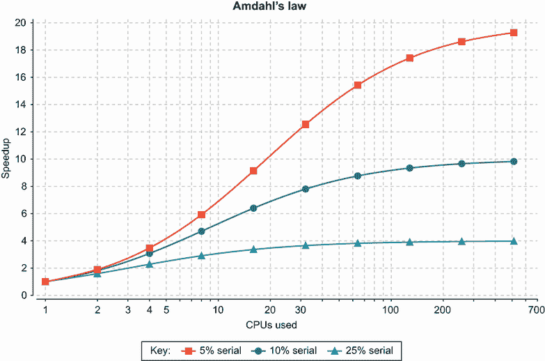
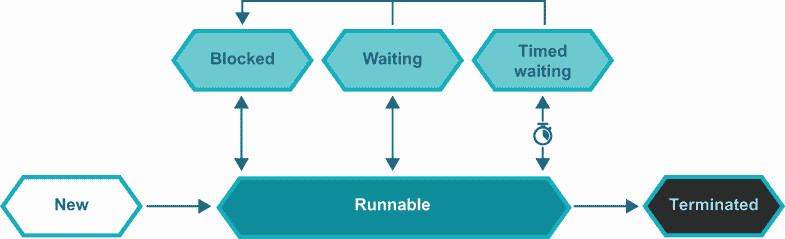
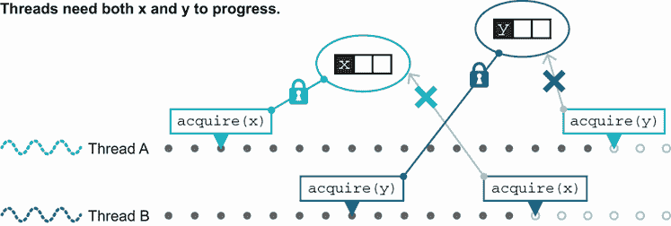
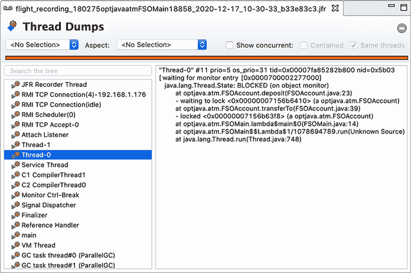
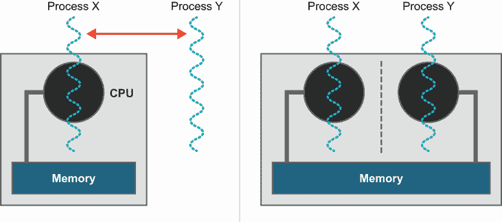
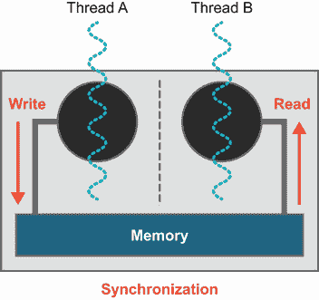
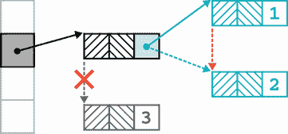
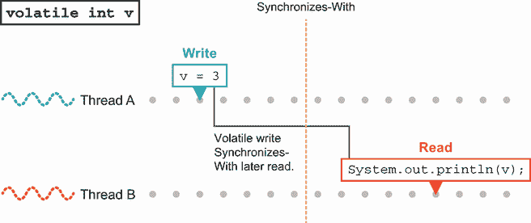
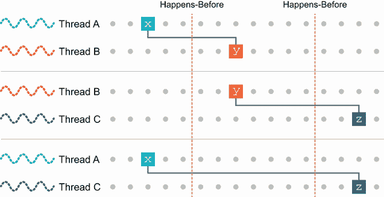

# 5 Java 并发基础

本章涵盖

+   并发理论

+   块结构并发

+   同步

+   Java 内存模型（JMM）

+   字节码中的并发支持

Java 有两个，主要独立的并发 API：较老的 API，通常被称为*块结构并发*或*基于同步的并发*，甚至“经典并发”，以及较新的 API，通常通过其 Java 包名`java.util.concurrent`来引用。

在这本书中，我们将讨论这两种方法。在本章中，我们将通过探讨这两种方法中的第一种方法开始我们的旅程。之后，在下一章中，我们将介绍 `java.util.concurrent`。稍后，我们将在第十六章“高级并发编程”中回到并发主题，该章节讨论了高级技术、非 Java JVM 语言中的并发以及并发与函数式编程之间的相互作用。

让我们开始吧，了解经典的并发方法。这是 Java 5 之前可用的唯一 API。正如你可能从其备选名称“基于同步的并发”中猜到的，这是一个内置到平台中的语言级 API，依赖于 `synchronized` 和 `volatile` 关键字。

这是一个低级 API，可能有些难以处理，但它非常值得理解。它为书中后续章节中解释其他并发类型和方面提供了坚实的基础。

事实上，如果没有至少对我们在本章中将要介绍的底层 API 和概念有实际了解，正确推理其他形式的并发是非常困难的。当我们遇到相关主题时，我们还将引入足够的理论来阐明我们在书中稍后讨论的其他并发观点，包括当我们遇到非 Java 语言中的并发时。

为了理解 Java 的并发编程方法，我们将从讨论一些理论开始。之后，我们将讨论“设计力量”在设计实现系统中的影响。我们将讨论其中两个最重要的力量，*安全性*和*活性*，并提及一些其他的力量。

一个重要的部分（也是本章中最长的一个部分）是关于块结构并发和底层线程 API 的细节。我们将通过讨论 Java 内存模型（JMM）来结束本章，然后使用我们在第四章中学到的字节码技术来理解并发 Java 编程中一些常见复杂性的真正来源。

## 5.1 并发理论入门

在我们遇到一些基本理论之前，让我们用一个警示故事开始我们的并发之旅。

### 5.1.1 但我已经知道关于线程的知识

这可能是开发者可能犯的最常见（并且可能致命）的错误之一：认为对 `Thread`、`Runnable` 和 Java 并发机制的语言级基本原语有所了解就足以成为一个合格的并发代码开发者。实际上，并发是一个很大的主题，良好的多线程开发困难重重，即使是经验丰富的开发者也会遇到问题。

事实上，并发领域目前正在进行大量的活跃研究——这至少已经持续了 5-10 年，并且没有减缓的迹象。这些创新可能会对 Java 以及您在职业生涯中使用的其他语言产生影响。

在本书的第一版中，我们提出了以下观点：“如果我们选择一个可能在五年内彻底改变行业实践的计算机计算基本领域，那么这个领域将是并发。”历史已经证实了这一观点，我们感到很舒服地将这个预测向前推进——接下来的五年将继续强调编程景观中现在已经是并发不同方法的重点。

因此，而不是试图成为并发编程每个方面的权威指南，本章的目标是让您了解解释 Java 并发工作方式的底层平台机制。我们还将涵盖足够的通用并发理论，以便您能够理解涉及的问题，并教授您在正确实现并发时所需的知识和难度。首先，我们将讨论每个扎实的 Java 开发者都应该了解的关于硬件和并发最重要的理论限制。

### 5.1.2 硬件

让我们从并发和多线程的一些基本事实开始：

+   并发编程在本质上关乎性能。

+   如果您运行的系统性能足够，以至于串行算法也能工作，那么实现并发算法基本上没有很好的理由。

+   现代计算机系统具有多个处理核心——即使是现在的手机也有两个或四个核心。

+   所有 Java 程序都是多线程的，即使那些只有单个应用程序线程的程序也是如此。

这最后一个观点是正确的，因为 JVM 本身就是一个多线程的二进制文件，可以使用多个核心（例如，用于 JIT 编译或垃圾回收）。此外，标准库还包括使用 *运行时管理的并发* 来实现某些执行任务的并发算法的 API。

注意：Java 应用程序仅通过升级其运行的 JVM，就有可能因为运行时的性能改进而运行得更快。

关于硬件的更详细讨论将在第七章进行，但这些基本事实是如此基础且与并发编程如此相关，我们希望立即介绍它们。

现在，让我们来认识一下*Amdahl 定律*，它是以早期 IBM 计算机科学家、Gene Amdahl 的名字命名的，有时被称为“大型机之父”。

### 5.1.3 Amdahl 定律

这是一个简单的、现成的模型，用于推理在多个执行单元之间共享工作的效率。在这个模型中，执行单元是抽象的，所以你可以把它们看作是线程，但它们也可能是进程，或者任何其他能够执行工作的实体。

注意：Amdahl 定律的设置或后果的细节并不取决于工作是如何完成的，或者执行单元的确切性质，或者计算系统是如何实现的。

基本前提是我们有一个可以拆分成更小处理单元的单个任务。这使我们能够使用多个执行单元来加快完成工作的时间。

因此，如果我们有`N`个处理器（或线程来完成工作），那么我们可能会天真地期望经过的时间是`T1 / N`（如果`T1`是单个处理器完成工作所需的时间）。在这个模型中，我们可以通过添加执行单元并增加`N`来尽快完成工作。

然而，将工作拆分并非没有代价！在任务的细分和重组过程中，会涉及到一个（希望是小的）额外开销。让我们假设这个*通信开销*（有时称为计算的*串行部分*）是一个相当于几个百分比的额外开销，我们可以用数字`s`（0 < `s` < 1）来表示它。因此，`s`的典型值可能是`0.05`（或 5%，您喜欢哪种表达方式都可以）。这意味着任务将始终至少需要`s * T1`的时间来完成——无论我们投入多少处理单元。

这假设`s`不依赖于`N`，当然，但在实践中，`s`所代表的任务拆分可能会变得更加复杂，并且随着`N`的增加需要更多的时间。很难想象一个系统架构，其中`s`随着`N`的增加而减少。因此，“`s`是常数”的简单假设通常被理解为一种*最佳情况*情景。

因此，思考 Amdahl 定律的最简单方法是：如果`s`在 0 和 1 之间，那么可以达到的最大加速比是`1 / s`。这个结果有些令人沮丧——这意味着如果通信开销仅为 2%，那么可以实现的最高加速比（即使有成千上万的处理器以全速工作）也只有 50 倍。

Amdahl 定律有一个稍微复杂一些的公式，表示如下：

```
T(N) = s + (1/N) * (T1 - s)
```

这在图 5.1 中可以直观地看到。注意，*x*轴是对数刻度——在线性刻度表示中，收敛到`1 / s`将非常难以看到。



图 5.1 Amdahl 定律

在硬件和第一个非常简单的并发模型的基础上设定了场景后，让我们深入了解 Java 如何处理线程的具体细节。

### 5.1.4 解释 Java 的线程模型

Java 的线程模型基于以下两个基本概念：

+   默认情况下可见的共享可变状态

+   操作系统执行的抢占式线程调度

让我们考虑这些想法最重要的几个方面：

+   对象可以很容易地在进程内的所有线程之间共享。

+   对象可以被任何持有其引用的线程所改变（“变异”）。

+   线程调度器（操作系统）可以在任何时候在核心之间切换线程，或多或少。

+   方法必须在运行时能够被替换出来（否则，一个无限循环的方法将永远占用 CPU）。

+   然而，这存在不可预测的线程交换风险，导致方法“半完成”和对象处于不一致的状态。

+   对象可以被*锁定*以保护易受攻击的数据。

最后一点至关重要——没有它，一个线程中做出的更改在其他线程中可能无法正确看到。在 Java 中，通过核心语言中的`synchronized`关键字提供了锁定对象的能力。

注意：从技术上讲，Java 为每个对象提供了*监视器*，它将锁（也称为互斥）与等待某个条件变为真的能力结合起来。

Java 基于线程和锁的并发性非常低级，通常很难处理。为了应对这种情况，引入了一套名为`java.util.concurrent`的并发库，这个名字来源于新类所在的新 Java 包。这提供了一套编写并发代码的工具，许多程序员发现这些工具比经典的块结构并发原语更容易使用。我们将在下一章讨论`java.util.concurrent`，现在我们将专注于语言级别的 API。

### 5.1.5 得到的教训

Java 是第一个主流支持多线程编程的语言。这在当时是一个巨大的进步，但现在，15 年后，我们关于如何编写并发代码的了解更多了。

结果表明，Java 的一些初始设计决策对于大多数程序员来说相当难以处理。这是不幸的，因为硬件的趋势正在向多核处理器发展，而利用这些核心的唯一好方法就是使用并发代码。在本章中，我们将讨论并发代码的一些困难。现代处理器自然需要并发编程的主题在第七章中进行了详细讨论，其中我们讨论了性能。

随着开发者对编写并发代码经验的增加，他们发现自己遇到了一些反复出现且对其系统重要的关注点。我们把这些关注点称为*设计力*。它们是存在于（并且通常相互冲突）实际并发面向对象系统设计中的高级概念。在接下来的几节中，我们将花一些时间来探讨一些最重要的这些力。

## 5.2 设计概念

下列最重要的设计力是由 Doug Lea 在他进行标志性的工作生产`java.util.concurrent`时编目：

+   安全性（也称为*并发类型安全*）

+   活跃性

+   性能

+   可复用性

让我们现在来看看这些力。

### 5.2.1 安全性和并发类型安全

安全性是确保对象实例在同时发生的任何其他操作中保持自洽性的问题。如果一个对象系统具有这种属性，那么它就被说成是*安全*或*并发类型安全*。

如你所猜测的，思考并发的一种方式是将它视为对常规对象建模和类型安全概念的扩展。在非并发代码中，你希望确保无论在对象上调用哪些公共方法，方法结束时对象都处于一个定义良好且一致的状态。通常的做法是将对象的所有状态保持为私有，并公开一个仅以对设计域有意义的方修改对象状态的公共 API。

并发类型安全与对象类型安全的基本概念相同，但应用于一个更为复杂的场景，即其他线程可能同时在不同的 CPU 核心上操作相同的对象。例如，考虑以下简单的类：

```
public class StringStack {
    private String[] values = new String[16];
    private int current = 0;

    public boolean push(String s) {
        // Exception handling elided
        if (current < values.length) {
            values[current] = s;
            current = current + 1;
        }
        return false;
    }

    public String pop() {
        if (current < 1) {
            return null;
        }
        current = current - 1;
        return values[current];
    }
}
```

当由单线程客户端代码使用时，这是没有问题的。然而，抢占式线程调度可能会引起问题。例如，在代码的此点可能会发生执行线程之间的上下文切换：

```
public boolean push(String s) {
        if (current < values.length) {
            values[current] = s;
            // .... context switch here     ❶
            current = current + 1;
        }
        return false;
    }
```

❶ 对象被留在不一致和不正确的状态。

如果从另一个线程查看该对象，状态的一部分（`values`）已经被更新，而另一部分（`current`）则没有。探索和解决这个问题是本章的主要主题。

通常，一种确保安全性的策略是永远不要在非私有方法中返回不一致的状态，并且永远不要在不一致的状态下调用任何非私有方法（当然，更不要调用任何其他对象的方法）。如果这种做法与一种在对象不一致时保护对象的方式（如同步锁或临界区）相结合，则可以保证系统是安全的。

### 5.2.2 活跃性

一个活跃的系统是指每个尝试的活动最终要么进展，要么失败。一个不活跃的系统基本上是停滞的——它既不会向成功进展，也不会失败。

定义中的关键字是*最终*——暂时性故障（即使它不是理想的，孤立地看也不是那么糟糕）和永久性故障之间有一个区别。暂时性故障可能由许多潜在问题引起，例如

+   锁定或等待获取锁

+   等待输入（例如，网络 I/O）

+   资源的暂时性故障

+   可用的 CPU 时间不足以运行线程

永久性故障可能由多种原因引起。以下是一些最常见的原因：

+   死锁

+   不可恢复的资源问题（例如，如果网络文件系统 [NFS] 不可用）

+   丢失信号

我们将在本章后面讨论锁定和这些问题中的几个，尽管你可能已经熟悉其中的一些或全部。

### 5.2.3 性能

系统的性能可以通过多种方式量化。在第七章中，我们将讨论性能分析和调优技术，并介绍一些你应该了解的其他指标。现在，将性能视为系统在给定资源下能完成多少工作的度量。

### 5.2.4 可重用性

可重用性形成第四个设计力，因为它并没有被其他任何考虑所涵盖。一个为易于重用而设计的并发系统有时是非常理想的，尽管这并不总是容易实现。一种方法是在可重用工具箱（如`java.util.concurrent`）上构建不可重用的应用程序代码。

### 5.2.5 如何以及为什么力会冲突？

设计力往往是相互对立的，这种紧张关系可以被视为设计良好的并发系统困难的一个核心原因，如下所述：

+   安全性与活跃性相对立——安全性是确保坏事不会发生，而活跃性要求取得进展。

+   可重用系统倾向于暴露其内部结构，这可能会引起安全问题。

+   一个天真编写的安全系统通常不会非常高效，因为它通常依赖于大量使用锁定来提供安全保证。

你最终应该努力达到的平衡是代码足够灵活，可以用于广泛的问题，足够封闭以确保安全，同时仍然合理活跃和高效。这是一项相当艰巨的任务，但幸运的是，一些实用的技术可以帮助实现这一点。以下是一些最常见的，按有用性大致排序：

1.  尽可能限制每个子系统的外部通信。数据隐藏是帮助确保安全的有力工具。

1.  尽可能使每个子系统的内部结构尽可能确定。例如，设计时考虑每个子系统中的线程和对象，即使子系统将以并发和非确定性的方式进行交互。

1.  应用客户端应用程序必须遵守的策略方法。这种技术很强大，但依赖于用户应用程序的合作，如果表现不佳的应用程序不遵守规则，调试可能会很困难。

1.  记录所需的行为。这是所有替代方案中最弱的，但有时如果代码要在非常通用的环境中部署，这是必要的。

开发者应该了解这些可能的安全机制中的每一个，并应使用最强可能的技巧，同时意识到在某些情况下，可能只能使用较弱的机制。

### 5.2.6 开销来源

并发系统的许多方面都可能对固有的开销做出贡献：

+   监视器（即，锁和条件变量）

+   上下文切换次数

+   线程数量

+   调度

+   内存局部性

+   算法设计

这应该成为你心中的清单基础。在开发并发代码时，你应该确保你已经考虑了清单上的每一项。

特别是，这些中的最后一个是算法设计，这是开发者可以真正脱颖而出的一块领域，因为了解算法设计将使你在任何语言中都能成为更好的程序员。

两本标准文本（作者强烈推荐）是 Cormen 等人所著的《算法导论》（MIT，2009 年）——不要被标题所欺骗；这是一部严肃的作品——以及 Skiena 所著的《算法设计手册》（第 3 版，Springer-Verlag，2020 年）。对于单线程和并发算法，这些书都是进一步阅读的绝佳选择。

我们将在本章和随后的章节（特别是关于性能的第七章）中提到许多这些开销的来源，但现在让我们转向下一个主题：对 Java 的“经典”并发进行回顾，并深入了解为什么使用它编程可能会很困难。

## 5.3 块结构并发（Java 5 之前）

我们关于 Java 并发的许多内容都是关于讨论语言级别、即基于块同步的、即*内在*的并发方法之外的替代方案。但为了最大限度地发挥对替代方案的讨论，了解经典并发观点的优缺点非常重要。

因此，在本章的剩余部分，我们将讨论使用 Java 的并发关键字（如`synchronized`、`volatile`等）处理多线程编程的原始、相当低级的方法。这次讨论将在设计力量和关注未来将发生什么的背景下进行。

在此基础上，我们将简要考虑线程的生命周期，然后讨论并发代码的常见技术（以及陷阱），例如完全同步的对象、死锁、`volatile`关键字和不可变性。让我们从同步的概述开始。

### 5.3.1 同步和锁

如你所知，`synchronized`关键字可以应用于代码块或方法。它表示在进入代码块或方法之前，线程必须获取适当的锁。例如，让我们考虑一个从银行账户提取资金的示例方法，如下所示：

```
public synchronized boolean withdraw(int amount) {     ❶
    // Check to see amount > 0, throw if not
    if (balance >= amount) {
        balance = balance - amount;
        return true;
    }

    return false;
}
```

❶ 同时只能有一个线程尝试从这个账户中提取资金。

方法必须获取对象实例所属的锁（或`static synchronized`方法所属的`Class`对象的锁）。对于代码块，程序员应指明要获取哪个对象的锁。

同时只能有一个线程可以进入对象的所有同步块或方法之一；如果其他线程尝试进入，它们将被 JVM 挂起。无论其他线程是尝试进入同一对象上的相同或不同的同步块，还是尝试进入不同对象上的同步块，这都是正确的。在并发理论中，这种结构有时被称为*临界区*，但这个术语在 C++中比在 Java 中更常用。

注意：你是否曾经想过为什么 Java 用于临界区的关键字是`synchronized`？为什么不叫“critical”或“locked”？正在被什么同步？我们将在 5.3.5 节中回到这个问题，但如果你不知道或者从未想过这个问题，你可能想在继续之前花几分钟思考一下。

让我们看看关于 Java 中同步和锁的一些基本事实。希望你已经掌握了这些（或大部分）：

+   只有对象——而不是原始数据类型——可以被锁定。

+   锁定对象数组不会锁定单个对象。

+   可以将同步方法视为等同于一个覆盖整个方法的 `synchronized (this) { ... }` 块（但请注意，它们在字节码中的表示方式不同）。

+   `static synchronized`方法锁定`Class`对象，因为没有实例对象可以锁定。

+   如果你需要锁定`Class`对象，仔细考虑你是否需要显式地这样做，或者使用`getClass()`，因为这两种方法在子类中的行为将不同。

+   内部类的同步与外部类无关（要了解为什么是这样，请记住内部类是如何实现的）。

+   `synchronized`不是方法签名的一部分，因此它不能出现在接口的方法声明中。

+   未同步的方法不会查看或关心任何锁的状态，并且它们可以在同步方法运行时继续执行。

+   Java 的锁是可重入的——持有锁的线程遇到同一锁的同步点（例如，一个`synchronized`方法在同一个对象上调用另一个`synchronized`方法）将被允许继续执行。

注意：非可重入锁定方案在其他语言中确实存在（也可以在 Java 中实现——如果你想知道详细情况，请参阅`java.util.concurrent.locks`中`ReentrantLock`的 Javadoc），但它们通常很难处理，最好避免使用，除非你真的知道自己在做什么。

对于 Java 的同步性，我们已经足够回顾了。现在让我们继续讨论线程在其生命周期中移动到的状态。

### 5.3.2 线程的状态模型

在图 5.2 中，你可以看到 Java 线程的状态模型。这决定了 Java 线程在其生命周期中的进展方式。



图 5.2 Java 线程的状态模型

Java 有一个名为`Thread.State`的枚举，它对应于上述状态模型，并且是在操作系统对线程状态的视图之上的一层。

注意：每个操作系统都有自己的线程版本，它们可能在细节上有所不同。在大多数情况下，现代操作系统具有相当相似的线程和调度实现，但这种情况并非总是如此（例如，Solaris 或 Windows XP）。

Java 线程对象最初处于`NEW`状态。此时，操作系统线程尚不存在（可能永远不存在）。要创建执行线程，必须调用`Thread.start()`。这会向操作系统发出创建线程的信号。

调度器将新线程放入运行队列，并在稍后的某个时刻找到一个运行它的核心（如果机器负载很重，可能涉及一些等待时间）。从那里，线程可以通过消耗其时间分配继续执行，并被放回运行队列以等待进一步的处理器时间片。这是我们第 5.1.1 节中提到的强制线程调度的动作。

在整个调度过程中，即被放置在核心上、运行，然后被放回运行队列中，Java `Thread`对象始终处于`RUNNABLE`状态。除了这个调度动作外，线程本身还可以表明它现在无法使用核心。这可以通过两种不同的方式实现：

1.  程序代码通过调用`Thread.sleep()`来指示线程应在继续之前等待固定的时间。

1.  线程意识到它必须等待直到某个外部条件得到满足，并调用`Object.wait()`。

在这两种情况下，线程都会立即被操作系统从核心中移除。然而，从那时起的行为在每个情况下都是不同的。

在第一种情况下，线程请求睡眠一定的时间。Java 线程进入`TIMED_WAITING`状态，操作系统设置一个计时器。当计时器到期时，睡眠的线程被唤醒，并准备好再次运行，并被放回运行队列。

第二种情况略有不同。它使用了 Java 对象监视器的条件方面。线程将进入`WAITING`状态并无限期等待。它通常不会在操作系统发出条件可能已满足的信号之前醒来——通常是通过其他线程在当前对象上调用`Object.notify()`来实现的。

除了这两个在线程控制下的可能性之外，线程还可以进入`BLOCKED`状态，因为它正在等待 I/O 或获取另一个线程持有的锁。最后，如果对应于 Java `Thread`的操作系统线程已停止执行，那么该线程对象将进入`TERMINATED`状态。让我们继续讨论解决同步问题的一个著名方法：完全同步对象的概念。

### 5.3.3 完全同步对象

在本章的早期，我们介绍了并发类型安全的概念，并提到了实现这一目标的一种策略。让我们看看这种策略的更完整描述，这通常被称为*完全同步对象*。如果遵守以下所有规则，该类被认为是线程安全的，也将是活跃的。

完全同步的类是满足以下所有条件的类：

+   所有字段在每一个构造函数中都被初始化为一致的状态。

+   没有公共字段。

+   对象实例在从任何非私有方法返回后都保证是一致的（假设在调用方法时状态是一致的）。

+   所有方法都能在有限的时间内终止。

+   所有方法都是同步的。

+   在不一致的状态下，任何方法都不会调用另一个实例的方法。

+   在不一致的状态下，任何方法都不会在当前实例上调用任何非私有方法。

列表 5.1 展示了来自银行系统后端的一个此类示例。`FSOAccount`类模拟了一个账户。FSO 前缀存在是为了清楚地表明这个实现使用了完全同步的对象。

这种情况提供了存款、取款和余额查询——这是读操作和写操作之间的一种经典冲突——因此使用同步来防止不一致性。

列表 5.1 一个完全同步的类

```
public class FSOAccount {
    private double balance;                                   ❶

    public FSOAccount(double openingBalance) {
        // Check to see openingBalance > 0, throw if not
        balance = openingBalance;                             ❷
    }

    public synchronized boolean withdraw(int amount) {        ❸
        // Check to see amount > 0, throw if not
        if (balance >= amount) {
            balance = balance - amount;
            return true;
        }

        return false;
    }

    public synchronized void deposit(int amount) {            ❸
        // Check to see amount > 0, throw if not
        balance = balance + amount;
    }

    public synchronized double getBalance() {                 ❸
        return balance;
    }
}
```

❶ 没有公共字段

❷ 所有字段都在构造函数中初始化。

❸ 所有方法都是同步的。

这看起来非常棒——这个类既安全又活跃。问题是性能。仅仅因为某件事是安全和活跃的，并不意味着它一定会非常快。你必须使用`synchronized`来协调对余额的所有访问（无论是获取还是放置），而这种锁定最终会减慢你的速度。这是处理并发方式的一个核心问题。

除了性能问题之外，列表 5.1 中的代码相当脆弱。你可以看到你从未在同步方法之外触摸`balance`，但这只可能是通过检查代码的少量来实现的。

在现实中的大型系统中，由于代码量很大，这种手动验证是不可能的。对于使用这种方法的较大代码库，很容易出现错误，这也是 Java 社区开始寻找更稳健方法的原因之一。

### 5.3.4 死锁

并发（不仅仅是 Java 的观点）的另一个经典问题是 *死锁*。考虑列表 5.2，它是先前示例的略微扩展形式。在这个版本中，除了模拟账户余额外，我们还有一个 `transferTo()` 方法，可以将资金从一个账户转移到另一个账户。

注意：这是一个构建多线程事务系统的天真尝试。它旨在演示死锁——你不应该将其作为真实代码的基础。

在下一个列表中，让我们添加一个方法来在两个 `FSOAccount` 对象之间转移资金，如下所示。

列表 5.2 死锁示例

```
public synchronized boolean transferTo(FSOAccount other, int amount) {
        // Check to see amount > 0, throw if not
        // Simulate some other checks that need to occur
        try {
            Thread.sleep(10);
        } catch (InterruptedException e) {
            Thread.currentThread().interrupt();
        }
        if (balance >= amount) {
            balance = balance - amount;
            other.deposit(amount);
            return true;
        }

        return false;
    }
```

现在，让我们在主类中实际引入一些并发性：

```
public class FSOMain {
    private static final int MAX_TRANSFERS = 1_000;

    public static void main(String[] args) throws InterruptedException {
        FSOAccount a = new FSOAccount(10_000);
        FSOAccount b = new FSOAccount(10_000);
        Thread tA = new Thread(() -> {
            for (int i = 0; i < MAX_TRANSFERS; i = i + 1) {
                boolean ok = a.transferTo(b, 1);
                if (!ok) {
                    System.out.println("Thread A failed at "+ i);
                }
            }
        });
        Thread tB = new Thread(() -> {
            for (int i = 0; i < MAX_TRANSFERS; i = i + 1) {
                boolean ok = b.transferTo(a, 1);
                if (!ok) {
                    System.out.println("Thread B failed at "+ i);
                }
            }
        });
        tA.start();
        tB.start();
        tA.join();
        tB.join();

        System.out.println("End: "+ a.getBalance() + " : "+ b.getBalance());
    }
}
```

初看，这段代码看起来是合理的。你有两个由不同线程执行的事务。这种设计看起来并不离谱——只是线程在两个账户之间转账——并且所有的方法都是 `synchronized`。

注意，我们在 `transferTo()` 方法中引入了一个小的睡眠。这是为了让线程调度器运行两个线程，并导致死锁的可能性。

注意：这里的睡眠是为了演示目的，并不是因为你在编写银行转账代码时实际上会这样做。它在那里是为了模拟实际中可能存在的代码——由数据库调用或授权检查引起的延迟。

如果你运行代码，你通常会看到一个死锁的例子——两个线程会运行一段时间，最终陷入停滞。原因是每个线程都需要其他线程在转移方法可以继续之前释放它持有的锁。这可以在图 5.3 中看到。



图 5.3 死锁线程

另一种看待这个问题的方式可以在图 5.4 中看到，其中我们展示了 JDK Mission Control 工具的线程转储视图（我们将在第七章中详细介绍这个工具，并展示如何找到这个有用的视图）。



图 5.4 死锁线程

两个线程被创建为 Thread-0 和 Thread-1，我们可以看到 Thread-0 锁定了一个引用，并且处于 `BLOCKED` 状态，等待锁定另一个。Thread-1 的对应线程转储将显示锁的相反配置，因此发生死锁。

注意：在完全同步对象方法方面，这个死锁是由于违反了“有限时间”原则而发生的。当代码调用 `other.deposit()` 时，我们无法保证代码将运行多长时间，因为 Java 内存模型没有给我们关于阻塞监视器何时释放的保证。

为了处理死锁，一种技术是在每个线程中始终以相同的顺序获取锁。在前面的例子中，第一个启动的线程以`A`、`B`的顺序获取它们，而第二个线程以`B`、`A`的顺序获取它们。如果两个线程都坚持按`A`、`B`的顺序获取锁，那么死锁就可以避免，因为第二个线程将无法运行，直到第一个线程完成并释放其锁。在本章的后面部分，我们将展示一种简单的方法来安排所有锁以相同的顺序获取，以及一种验证这确实得到满足的方法。

接下来，我们将回到我们之前提出的一个谜题：为什么 Java 中临界区的关键字被命名为`synchronized`。这将引导我们讨论`volatile`关键字。

### 5.3.5 为什么是`synchronized`？

并发编程的简单概念模型是 CPU 的时分共享——也就是说，线程在单个核心上开关。这种经典观点在图 5.5 中显示。



图 5.5 单核（左）和多核（右）并发和线程的思考

然而，现在许多年已经不再是对现代硬件的准确描述。二十年前，一个工作的程序员可以连续几年不遇到一个拥有超过一个或最多两个处理核心的系统。情况已经不再是这样了。

现在，任何大小等于或大于移动电话的设备都有多个核心，因此心智模型也应该不同，涵盖在同一物理时刻运行在不同核心上的多个线程（并且可能操作共享数据）。您可以在图 5.5 中看到这一点。为了效率，同时运行的每个线程可能都有自己的数据缓存副本。

注意：我们仍然会展示执行的理论模型，其中我们的假设计算机只有一个核心。这样做纯粹是为了让您看到我们讨论的非确定性并发问题固有的，而不是由硬件设计的特定方面引起的。

在这个图景中，让我们转向关于用于表示锁定部分或方法的关键字的选择问题。

我们之前问过，在列表 5.1 中的代码中，是什么被`synchronized`同步了？答案是：*被锁定对象在不同线程中的内存表示*。也就是说，在`synchronized`方法（或块）完成后，对被锁定对象所做的任何更改都会在释放锁之前刷新回主内存，如图 5.6 所示。



图 5.6 对象的更改通过主内存传播到线程之间。

此外，当一个同步块被进入，并且在获取锁之后，任何对锁定对象的更改都是从主内存中读取的，因此拥有锁的线程在锁定部分的代码开始执行之前与主内存中对象的观点同步。

### 5.3.6 `volatile` 关键字

Java 自从诞生之初（Java 1.0）就拥有了 `volatile` 关键字，它被用作处理对象字段并发处理的一种简单方式，包括原始数据类型。以下规则支配一个 `volatile` 字段：

+   线程看到的值总是在使用之前从主内存中重新读取。

+   线程写入的任何值总是在字节码指令完成之前通过主内存刷新。

这有时被描述为在单个操作周围有一个“小小的同步块”，但这种说法是误导性的，因为 `volatile` 不涉及任何锁定。`synchronized` 的作用是使用一个互斥锁在对象上，以确保只有一个线程可以执行该对象上的同步方法。同步方法可以在对象上包含许多读取和写入操作，并且它们将作为一个不可分割的单元（从其他线程的角度看）执行，因为直到方法退出并将对象刷新回主内存，其他线程看不到对象上方法执行的结果。

关于 `volatile` 的关键点是它只允许对内存位置进行 *一个* 操作，该操作将立即刷新到内存中。这意味着要么是单个读取，*或者* 是单个写入，但不会超过这个范围。我们在图 5.6 中看到了这两种类型的操作。

应该只在写入变量不依赖于变量的当前状态（读取状态）的情况下使用 `volatile` 变量来模拟变量。这是 `volatile` 保证只执行单个操作的结果。

例如，`++` 和 `--` 运算符在 `volatile` 上使用是不安全的，因为它们等价于 `v = v + 1` 或 `v = v – 1`。增量示例是一个经典的 *状态相关更新* 例子。

对于当前状态重要的情况，你必须始终引入一个锁来确保完全安全。因此，`volatile` 允许程序员在某些情况下编写简化的代码，但代价是每次访问都要进行额外的刷新。注意，由于 `volatile` 机制不引入任何锁，你不能使用 `volatile` 导致死锁——只能使用同步。在本章的后面部分，我们将遇到 `volatile` 的其他一些应用，并更详细地讨论该机制。

### 5.3.7 线程状态和方法

一个 `java.lang.Thread` 对象就是这样：一个存在于堆中的 Java 对象，它包含有关操作系统线程的元数据，该线程可能存在、曾经存在，或者将来可能存在。

Java 为线程对象定义了以下状态，这些状态对应于主流操作系统上的操作系统线程状态。它们与我们图 5.2 中看到的状态模型密切相关：

+   `NEW`—`Thread`对象已被创建，但实际的操作系统线程尚未创建。

+   `RUNNABLE`—线程可运行。操作系统负责调度它。

+   `BLOCKED`—线程未运行；它需要获取一个锁或处于系统调用中。

+   `WAITING`—线程未运行；它已经调用了`Object.wait()`或`Thread.join()`。

+   `TIMED_WAITING`—线程未运行；它已经调用了`Thread.sleep()`。

+   `TERMINATED`—线程未运行；它已经完成了执行。

所有线程都从`NEW`状态开始，无论线程的`run()`方法是否正常退出或抛出异常，最终都会结束于`TERMINATED`状态。

注意：Java 线程状态模型不区分一个`RUNNABLE`线程是否在那一刻实际物理执行或在等待（在*运行队列*中）。

线程的实际创建是通过`start()`方法完成的，该方法调用本地代码来执行相关的系统调用（例如 Linux 上的`clone()`）以创建线程，并在线程的`run()`方法中开始代码执行。

Java 的 Thread API 可以分为三组方法。我们不会包含每个方法的很多样板 Javadoc 描述，而是只列出它们，并让读者查阅 API 文档以获取更多详细信息。

第一个是读取线程元数据的一组方法：

+   `getId()`

+   `getName()`

+   `getState()`

+   `getPriority()`

+   `isAlive()`

+   `isDaemon()`

+   `isInterrupted()`

其中一些元数据（例如从`getId()`获取的线程 ID）将在线程的生命周期内保持固定。其中一些（例如线程状态和中断状态）会随着线程的运行而自然变化，而其中一些（例如名称和守护状态）可以被程序员设置。这引出了第二组方法：

+   `setDaemon()`

+   `setName()`

+   `setPriority()`

+   `setUncaughtExceptionHandler()`

对于程序员来说，在启动线程之前配置任何适当的线程属性通常更好。

最后，以下线程控制方法用于启动新线程并与其他正在运行的线程交互：

+   `start()`

+   `interrupt()`

+   `join()`

注意，`Thread.sleep()`没有出现在这个列表中，因为它是一个静态方法，仅针对当前线程。

注意：一些具有超时的线程方法（例如，带有超时参数的`Thread.join()`）实际上可能导致线程被放置在`TIMED_WAITING`状态而不是`WAITING`状态。

让我们看看一个示例，了解如何在简单多线程应用程序的典型生命周期中使用线程方法：

```
Runnable r = () -> {
    var start = System.currentTimeMillis();
    try {
        Thread.sleep(1000);
    } catch (InterruptedException e) {
        e.printStackTrace();
    }
    var thisThread = Thread.currentThread();
    System.out.println(thisThread.getName() +
        " slept for "+ (System.currentTimeMillis() - start));
};

var t = new Thread(r);            ❶
t.setName("Worker");
t.start();                        ❷
Thread.sleep(100);
t.join();                         ❸
System.out.println("Exiting");
```

❶ 创建线程的元数据对象。

❷ 操作系统创建了一个实际的线程。

❸ 主线程暂停并等待工作线程退出后再继续。

这相当简单：主线程创建工作线程，启动它，然后在达到 `join()` 调用之前至少等待 100 毫秒（给调度器一个运行的机会），`join()` 调用会导致它暂停，直到工作线程退出。与此同时，工作线程完成睡眠，再次醒来，并打印出消息。

注意：睡眠的经过时间很可能不会正好是 1000 毫秒。操作系统的调度器是非确定性的，因此操作系统提供的最佳保证是操作系统将尝试确保线程睡眠所需的时间，除非被唤醒。然而，多线程编程通常涉及处理意外情况，正如我们将在下一节中看到的那样。

中断线程

当与线程一起工作时，相对常见的是想要安全地中断线程正在执行的工作，`Thread` 对象上提供了用于此目的的方法。然而，它们可能不会像我们最初预期的那样表现。让我们运行以下代码，该代码创建了一个正在努力工作的线程，然后尝试中断它：

```
var t = new Thread(() -> { while (true); });    ❶
t.start();                                      ❶

t.interrupt();                                  ❷
t.join();                                       ❸
```

❶ 创建并启动一个将永远运行的新的线程

❷ 请求线程中断自己（即停止执行）

❸ 在主线程中等待另一个线程完成

如果你运行这段代码，你可能会惊讶地发现我们的 `join()` 将永久阻塞。这里发生的情况是线程中断是可选的——线程中调用的方法必须显式检查中断状态并对其做出响应，而我们的简单 `while` 循环从未进行过这样的检查。我们可以在循环中通过执行预期的检查来修复这个问题，如下所示：

```
var t = new Thread(() -> { while (!Thread.interrupted()); });   ❶
t.start();                                                      ❶

t.interrupt();
t.join();
```

❶ 检查当前线程的中断状态，而不是在 `true` 上循环

现在当请求时，我们的循环将退出，并且我们的 `join()` 方法不再永久阻塞。

在 JDK 中，方法通常是阻塞的——无论是 IO、等待锁还是其他场景，都普遍存在检查线程中断状态的情况。惯例是这些方法将抛出 `InterruptedException`，这是一个检查型异常。这解释了为什么例如 `Thread.sleep()` 需要你将 `InterruptedException` 添加到方法签名中或处理它。

让我们修改上一节中的示例，看看 `Thread.sleep()` 在被中断时的行为：

```
Runnable r = () -> {
    var start = System.currentTimeMillis();
    try {
        Thread.sleep(1000);
    } catch (InterruptedException e) {    ❶
        e.printStackTrace();
    }
    var thisThread = Thread.currentThread();
    System.out.println(thisThread.getName() +
        " slept for "+ (System.currentTimeMillis() - start));
    if (thisThread.isInterrupted()) {
        System.out.println("Thread "+ thisThread.getName() +" interrupted");
    }
};

var t = new Thread(r);
t.setName("Worker");
t.start();                                ❷
Thread.sleep(100);
t.interrupt();                            ❸
t.join();
System.out.println("Exiting");
```

❶ 我们的 `Runnable` 必须处理检查型 `InterruptedException`。当我们中断时，它打印堆栈，然后从这里继续执行。

❷ 创建工作线程

❸ 主线程中断工作线程并唤醒它。

当我们运行这段代码时，我们会看到一些类似以下的输出：

```
java.lang.InterruptedException: sleep interrupted
    at java.base/java.lang.Thread.sleep(Native Method)
    at examples.LifecycleWithInterrupt.lambda$main$0
     (LifecycleWithInterrupt.java:9)
    at java.base/java.lang.Thread.run(Thread.java:832)
Worker slept for 101
Exiting
```

如果你仔细观察，你会看到消息 `"Thread Worker interrupted"` 并没有出现。这揭示了关于我们在代码中处理中断的一个相关事实：检查线程的中断状态实际上会重置该状态。抛出标准 `InterruptedException` 的代码清除了中断，因为当异常被抛出时，它被认为是“已处理”。

注意：我们有以下两种方法来检查中断状态：一个静态的 `Thread.interrupted()`，它隐式地查看当前线程，以及一个线程对象的实例级别 `isInterrupted()`。静态版本在检查后清除状态，这是在抛出 `InterruptedException` 之前期望使用的。另一方面，实例方法不会改变状态。

如果我们想要保留我们的线程被中断的信息，我们必须直接处理它。对于我们的简单示例，我们只需要在线程代码的稍后部分使用状态，以下内容将有效：

```
Runnable r = () -> {
    var start = System.currentTimeMillis();
    var wasInterrupted = false;              ❶
    try {
        Thread.sleep(1000);
    } catch (InterruptedException e) {
        wasInterrupted = true;               ❷
        e.printStackTrace();
    }
    var thisThread = Thread.currentThread();
    System.out.println(thisThread.getName() +
        " slept for "+ (System.currentTimeMillis() - start));
    if (wasInterrupted) {
        System.out.println("Thread "+ thisThread.getName() +" interrupted");
    }
};

var t = new Thread(r);
t.setName("Worker");
t.start();
Thread.sleep(100);
t.interrupt();
t.join();
System.out.println("Exiting");
```

❶ 设置状态以记录可能的中断

❷ 记录中断

在更复杂的情况下，你可能希望确保为调用者重新抛出 `InterruptedException`，抛出某种自定义异常，执行自己的自定义逻辑，或者甚至将中断状态恢复到相关的线程上。所有这些都是可能的，具体取决于你的具体需求。

与异常和线程一起工作

另一个多线程编程的问题是处理可能从线程内部抛出的异常。例如，假设我们正在执行一个来源未知的 `Runnable`。如果它抛出异常并死亡，那么其他代码可能不会意识到这一点。幸运的是，Thread API 提供了在启动线程之前向线程添加未捕获异常处理器的功能，如下例所示：

```
var badThread = new Thread(() -> {
    throw new UnsupportedOperationException(); });

// Set a name before starting the thread
badThread.setName("An Exceptional Thread");

// Set the handler
badThread.setUncaughtExceptionHandler((t, e) -> {
    System.err.printf("Thread %d '%s' has thrown exception " +
                    "%s at line %d of %s",
            t.getId(),
            t.getName(),
            e.toString(),
            e.getStackTrace()[0].getLineNumber(),
            e.getStackTrace()[0].getFileName()); });

badThread.start();
```

处理器是 `UncaughtExceptionHandler` 的一个实例，它是一个函数式接口，定义如下：

```
public interface UncaughtExceptionHandler {
    void uncaughtException(Thread t, Throwable e);
}
```

此方法提供了一个简单的回调，允许线程控制代码根据观察到的异常采取行动——例如，线程池可能会重新启动以这种方式退出的线程，以保持池的大小。

注意：由 `uncaughtException()` 抛出的任何异常都将被 JVM 忽略。

在我们继续之前，我们需要讨论一些 `Thread` 的已废弃控制方法，这些方法不应该由应用程序员使用。

已废弃的线程方法

Java 是第一个支持多线程编程的主流语言。然而，这种“先行者”优势也有其阴暗面——许多并发编程中固有的问题首先是由在 Java 中工作的程序员遇到的。

这其中有一个不幸的事实，即原始 Thread API 中的某些方法实际上是不安全的，不适合使用，特别是 `Thread.stop()`。此方法基本上无法安全使用——它在不警告的情况下杀死另一个线程，并且没有让被杀死的线程确保任何锁定对象都变得安全的方法。

`stop()`的弃用紧随其在早期 Java 中的积极使用之后，因为停止另一个线程需要在另一个线程的执行中注入一个异常。然而，无法确切知道那个其他线程在执行中的确切位置。也许线程在开发者假设会完全运行的`finally`块中间被杀死，程序处于损坏状态。

机制是在被杀死的线程上触发未检查的`ThreadDeath`异常。代码无法通过 try 块来保护自己免受此类异常的影响（就像不可能可靠地保护自己免受`OutOfMemoryError`一样），因此异常会立即开始回滚被杀死线程的堆栈，并解锁所有监视器。这立即使可能受损的对象对其他线程可见，因此`stop()`的使用并不安全。

除了众所周知的`stop()`问题之外，还有其他几个方法也存在严重问题。例如，`suspend()`不会释放任何监视器，因此任何尝试访问被挂起线程锁定的同步代码的线程将永久阻塞，除非挂起线程被重新激活。这代表了一个重大的活跃性风险，因此`suspend()`和`resume()`永远不应该使用。`destroy()`方法从未实现过，但如果实现了，也会遇到相同的问题。

注意：这些危险的线程方法自 Java 1.2 以来就被弃用了——超过 20 年前，并且最近已被标记为即将删除（这将是一个破坏性变更，让你了解这个问题被如何看待得多么严重）。

从其他线程可靠地控制线程的真实解决方案最好通过我们在本章后面将要遇到的*Volatile Shutdown*模式来展示。现在让我们继续讨论在以并发方式编程时处理必须安全共享的数据时最有用的技术之一。

### 5.3.8 不可变性

一种非常有价值的技术是使用不可变对象。这些对象要么没有任何状态，要么只有最终字段（因此，必须在对象的构造函数中填充这些字段）。这些对象总是安全且活跃的，因为它们的状态不能被修改，所以它们永远不会处于不一致的状态。

一个问题是，任何需要用于初始化特定对象的值都必须传递给构造函数。这可能导致构造函数调用笨拙，参数众多。因此，许多编码者使用*工厂方法*。这可以简单到在类上使用静态方法而不是构造函数来生成新对象。构造函数通常被设置为受保护的或私有的，这样静态工厂方法就成为了实例化的唯一方式。例如，考虑一个简单的存款类，我们可能在银行系统中看到，如下所示：

```
public final class Deposit {
    private final double amount;
    private final LocalDate date;
    private final Account payee;

    private Deposit(double amount, LocalDate date, Account payee) {
        this.amount = amount;
        this.date = date;
        this.payee = payee;
    }

    public static Deposit of(double amount, LocalDate date, Account payee) {
        return new Deposit(amount, date, payee);
    }

    public static Deposit of(double amount, Account payee) {
        return new Deposit(amount, LocalDate.now(), payee);
    }
```

这具有类的字段，一个私有构造函数，以及两个工厂方法，其中一个是为创建今天的存款提供的便利方法。接下来是字段的访问器方法：

```
    public double amount() {
        return amount;
    }

    public LocalDate date() {
        return date;
    }

    public Account payee() {
        return payee;
    }
```

注意，在我们的示例中，这些是以记录风格呈现的，其中访问器方法的名称与字段的名称相匹配。这与 bean 风格形成对比，在 bean 风格中，getter 方法以`get`为前缀，setter 方法（对于任何非 final 字段）以`set`为前缀。

不变对象显然不能被更改，那么当我们想要更改其中一个时会发生什么？例如，如果存款或其他交易在特定一天无法进行，那么这笔交易通常会“滚动”到下一天。我们可以通过在类型上有一个实例方法来实现这一点，该方法返回一个几乎相同但某些字段已修改的对象，如下所示：

```
    public Deposit roll() {
        // Log audit event for rolling the date
        return new Deposit(amount, date.plusDays(1), payee);
    }

    public Deposit amend(double newAmount) {
        // Log audit event for amending the amount
        return new Deposit(newAmount, date, payee);
    }
```

不变对象可能存在的一个问题是，它们可能需要许多参数传递给工厂方法。这并不总是非常方便，尤其是在你需要在创建新的不变对象之前从多个来源累积状态时。

为了解决这个问题，我们可以使用构建器模式。这是两种结构的组合：一个实现泛型构建器接口的静态内部类，以及不变类本身的私有构造函数。

静态内部类是不变类的构建器，它为开发者提供了获取不变类型新实例的唯一方式。一个非常常见的实现是，`Builder`类与不变类具有完全相同的字段，但允许字段的可变。以下列表显示了如何使用这种方法来模拟存款的更复杂视图。

列表 5.3 不变对象和构建器

```
    public static class DepositBuilder implements Builder<Deposit> {
        private double amount;
        private LocalDate date;
        private Account payee;

        public DepositBuilder amount(double amount) {
            this.amount = amount;
            return this;
        }

        public DepositBuilder date(LocalDate date) {
            this.date = date;
            return this;
        }

        public DepositBuilder payee(Account payee) {
            this.payee = payee;
            return this;
        }

        @Override
        public Deposit build() {
            return new Deposit(amount, date, payee);
        }
    }
```

构建器是一个泛型顶层接口，通常定义如下：

```
public interface Builder<T> {
    T build();
}
```

我们应该注意关于构建器的一些事情。首先，它是一个所谓的 SAM 类型（代表“单个抽象方法”），从技术上讲，它可以作为 lambda 表达式的目标类型。然而，构建器的目的是生成不可变实例——它关于聚集状态，而不是表示一个函数或回调。这意味着尽管构建器*可以*用作功能接口，但在实践中，这样做永远不会有用。

因此，我们不会用`@FunctionalInterface`注解来装饰接口——这是“仅仅因为你可以做某事，并不意味着你应该这样做”的另一个好例子。

其次，我们还应该注意到构建器不是线程安全的。设计隐式假设用户知道不要在线程之间共享构建器。相反，正确的 Builder API 使用方式是一个线程使用构建器聚合所有需要的状态，然后生成一个可以与其他线程简单共享的不变对象。

注意：如果你发现自己想在多个线程之间共享一个构建器，请花点时间停下来重新考虑你的设计和你的领域是否需要重构。

不可变性是一个非常常见的模式（不仅限于 Java，也适用于其他语言，尤其是函数式语言），并且具有广泛的应用性。

关于不可变对象的一个最后要点：`final`关键字仅适用于直接指向的对象。正如你在图 5.7 中可以看到的，主对象的引用不能被分配以指向对象 3，但在对象内部，对对象 1 的引用可以被更新以指向对象 2。另一种说法是，`final`引用可以指向具有非 final 字段的对象。这有时被称为*浅不可变性*。



图 5.7 值与引用的不可变性

另一种看待这个问题的方式是，完全有可能写出以下内容：

```
final var numbers = new LinkedList<Integer>();
```

在这个声明中，引用`numbers`和列表中包含的整数对象是不可变的。然而，列表对象本身仍然是可变的，因为整数对象仍然可以被添加、删除和替换到列表中。

不可变性是一个非常强大的技术，你应该在可行的情况下使用它。然而，有时仅仅使用不可变对象是无法高效开发的，因为对象状态的任何更改都需要启动一个新的对象。因此，我们有时不得不处理可变对象。

在下一节中，我们将讨论经常被误解的 Java 内存模型（JMM）的细节。许多 Java 程序员对 JMM 有所了解，并且一直在根据自己的理解编写代码，而没有正式地介绍过它。如果你是这样的程序员，这种新的理解将建立在你的非正式认识之上，并将其建立在坚实的基础之上。JMM 是一个非常高级的话题，所以如果你急于进入下一章，可以跳过它。

## 5.4 Java 内存模型（JMM）

Java 语言规范（JLS）的第 17.4 节描述了 JMM。这是规范的一个正式部分，它使用同步操作和一些相当数学的概念来描述 JMM，例如操作的*偏序*。

从语言理论家和 Java 规范（编译器和 JVM 制造者）的角度来看，这是非常好的，但对于需要理解其多线程代码执行细节的应用程序开发者来说，这是更糟的。

我们不会重复正式的细节，而是将最重要的规则列在这里，以几个基本概念的形式：代码块之间的*同步于*和*发生之前*关系：

+   *发生之前*—这种关系表示一个代码块在另一个代码块开始之前完全完成。

+   *同步于*—在继续之前，一个操作将同步其对对象的视图与主内存。

如果你已经研究过面向对象编程的正式方法，你可能听说过用来描述面向对象构建块的 *Has-A* 和 *Is-A* 这些表达。一些开发者发现将 Happens-Before 和 Synchronizes-With 视为类似的基本概念构建块是有用的，但这是为了理解 Java 并发而不是面向对象。然而，我们应该强调这两组概念之间没有直接的技术联系。在图 5.8 中，你可以看到一个与后续读取访问（对于 `println()`）同步的易变写入示例。

JMM 有以下主要规则：

+   在监视器上的解锁操作将同步与后续的锁定操作。

+   向一个易变变量写入将同步与该变量的后续读取操作。

+   如果操作 A 与操作 B 同步，那么 A 发生在 B 之前。

+   如果在程序顺序中 A 在 B 之前发生，那么在同一个线程中，A 发生在 B 之前。




第一条和第二条规则的一般表述是“释放发生在获取之前。”换句话说，线程在写入时持有的锁在可以由其他操作（包括读取）获取之前被释放。例如，规则保证如果一个线程向一个易变变量写入值，那么任何稍后读取该变量的线程都将看到写入的值（假设没有其他写入发生）。

随后是关于合理行为的附加规则：

+   构造函数的完成发生在该对象的终结器开始运行之前（一个对象必须完全构建后才能进行终结）。

+   启动线程的操作与新线程的第一个操作同步。

+   `Thread.join()` 将同步与被加入线程的最后一个（以及所有其他）操作。

+   如果 X 发生在 Y 之前，并且 Y 发生在 Z 之前，那么 X 发生在 Z 之前（传递性）。

这些简单的规则定义了整个平台对内存和同步工作方式的看法。图 5.9 阐述了传递性规则。




注意：在实际应用中，这些规则是 JMM 做出的最小保证。实际的 JVM 可能在实际中表现得比这些保证更好。这对开发者来说可能是一个陷阱，因为特定 JVM 的行为所提供的虚假安全感可能会暴露出隐藏的并发错误。

从这些最小保证中，很容易看出不可变性是并发 Java 编程中的一个重要概念。如果对象不能被更改，那么就不会有与确保更改对所有线程可见相关的问题。

## 5.5 通过字节码理解并发

让我们通过一个经典示例来讨论并发：一个银行账户。假设客户的账户看起来像这样，并且可以通过调用方法进行提款和存款。我们已经提供了关键方法的同步和未同步实现：

```
public class Account {
    private double balance;

    public Account(int openingBalance) {
        balance = openingBalance;
    }

    public boolean rawWithdraw(int amount) {
        // Check to see amount > 0, throw if not
        if (balance >= amount) {
            balance = balance - amount;
            return true;
        }
        return false;
    }

    public void rawDeposit(int amount) {
        // Check to see amount > 0, throw if not
        balance = balance + amount;
    }

    public double getRawBalance() {
        return balance;
    }

    public boolean safeWithdraw(final int amount) {
        // Check to see amount > 0, throw if not
        synchronized (this) {
            if (balance >= amount) {
                balance = balance - amount;
                return true;
            }
        }
        return false;
    }

    public void safeDeposit(final int amount) {
        // Check to see amount > 0, throw if not
        synchronized (this) {
            balance = balance + amount;
        }
    }

    public double getSafeBalance() {
        synchronized (this) {
            return balance;
        }
    }
}
```

这组方法将使我们能够探索 Java 中许多常见的并发问题。

注意：我们之所以在这个阶段使用同步的块形式，而不是`synchronized`方法修饰符，是因为我们将在本章稍后解释原因。

我们还可以假设，如果需要，该类有两个类似这样的辅助方法：

```
    public boolean withdraw(int amount, boolean safe) {
        if (safe) {
            return safeWithdraw(amount);
        } else {
            return rawWithdraw(amount);
        }
    }
```

让我们首先遇到多线程系统显示的一个基本问题，这需要我们引入某种保护机制。

### 5.5.1 更新丢失

为了演示这个常见问题（或反模式），称为*更新丢失*，让我们看看`rawDeposit()`方法的字节码：

```
public void rawDeposit(int);
    Code:
       0: aload_0
       1: aload_0
       2: getfield      #2  // Field balance:D   ❶
       5: iload_1
       6: i2d
       7: dadd                                   ❷
       8: putfield      #2  // Field balance:D   ❸
      11: return
```

❶ 从对象中读取余额

❷ 添加存款金额

❸ 将新余额写入对象

让我们引入两个执行线程，称为`A`和`B`。然后我们可以想象同时尝试在同一个账户上存款。通过在指令前加上线程标签，我们可以看到不同线程上执行的单个字节码指令，但它们都影响同一个对象。

注意：请记住，一些字节码指令后面跟着参数，这会导致指令编号偶尔出现“跳过”。

更新丢失是由于应用程序线程的非确定性调度，可能出现这种读取和写入的字节码序列的问题：

```
A0: aload_0
     A1: aload_0
     A2: getfield      #2  // Field balance:D       ❶
     A5: iload_1
     A6: i2d
     A7: dadd

// ....           Context switch A -> B

         B0: aload_0
         B1: aload_0
         B2: getfield      #2  // Field balance:D   ❷
         B5: iload_1
         B6: i2d
         B7: dadd
         B8: putfield      #2  // Field balance:D   ❸
        B11: return

// ....           Context switch B -> A

     A8: putfield      #2  // Field balance:D       ❹
    A11: return
```

❶ 线程 A 从余额中读取一个值。

❷ 线程 B 读取与 A 相同的余额值。

❸ 线程 B 将新值写回余额。

❹ 线程 A 覆盖了余额——B 的更新丢失了。

更新后的余额是由每个线程使用评估栈计算的。`dadd` 操作码是将更新后的余额放置在栈上的点，但请记住，每个方法调用都有自己的、私有的评估栈。因此，在前一个流程中的`B7`点有`两个`更新后的余额副本：一个在 A 的评估栈中，一个在 B 的。然后执行`B8`和`A8`处的两个`putfield`操作，但`A8`覆盖了在`B8`处放置的值。这导致两个存款似乎都成功了，但实际上只有一个出现。

账户余额将记录存款，但代码仍然会导致账户中的钱消失，因为余额字段被读取两次（使用`getfield`），然后被写入和覆盖（通过两个`putfield`操作）。例如，在某些代码如下：

```
Account acc = new Account(0);
Thread tA = new Thread(() -> acc.rawDeposit(70));
Thread tB = new Thread(() -> acc.rawDeposit(50));
tA.start();
tB.start();
tA.join();
tB.join();

System.out.println(acc.getRawBalance());
```

最终余额可能是 50 或 70——但两个线程都“成功”存了钱。代码存入了 120，但丢失了一些——这是不正确多线程代码的一个经典例子。

注意这里展示的代码的简单形式。在这样一个简单的例子中，可能不会显示出非确定性的全部可能性。不要被这个例子所迷惑——当这段代码组合进一个大型程序中，错误肯定会显现出来。认为代码因为“太简单”就一定没问题，或者试图欺骗并发模型，最终结果必然是糟糕的。

注意：源代码库中有一个示例（`AtmLoop`）展示了这种效果，但它依赖于我们尚未遇到的一个类（`AtomicInteger`），所以我们在这里不会完全展示。因此，如果您需要确信，请去检查示例的行为。

通常，访问模式

```
A: getfield
B: getfield
B: putfield
A: putfield
```

或者

```
A: getfield
B: getfield
A: putfield
B: putfield
```

将会对我们的账户对象造成问题。

回想一下，操作系统实际上会导致线程的非确定性调度，因此这种交错总是可能的，Java 对象存在于堆中，因此线程正在操作共享的、可变的数据。

我们真正需要的是引入一种机制，以某种方式防止这种情况，并确保排序始终是以下形式：

```
...
A: getfield
A: putfield
...
B: getfield
B: putfield
...
```

此机制是同步，这是我们下一个主题。

### 5.5.2 字节码中的同步

在第四章中，我们介绍了 JVM 字节码，并简要地遇到了`monitorenter`和`monitorexit`。同步块被转换成这些操作码（我们稍后会讨论同步方法）。让我们通过查看我们之前看到的示例来观察它们的作用（我们正在重现 Java 代码，因此它就在手边）：

```
    public boolean safeWithdraw(final int amount) {
        // Check to see amount > 0, throw if not
        synchronized (this) {
            if (balance >= amount) {
                balance = balance - amount;
                return true;
            }
        }
        return false;
    }
```

这被转换成 40 字节 JVM 字节码：

```
public boolean safeWithdraw(int);
    Code:
       0: aload_0
       1: dup
       2: astore_2
       3: monitorenter                           ❶
       4: aload_0
       5: getfield      #2  // Field balance:D
       8: iload_1
       9: i2d
      10: dcmpl
      11: iflt          29                       ❷
      14: aload_0
      15: aload_0
      16: getfield      #2  // Field balance:D
      19: iload_1
      20: i2d
      21: dsub
      22: putfield      #2  // Field balance:D   ❸
      25: iconst_1
      26: aload_2
      27: monitorexit                            ❹
      28: ireturn                                ❺
      29: aload_2
      30: monitorexit                            ❹
      31: goto          39
      34: astore_3
      35: aload_2
      36: monitorexit                            ❹
      37: aload_3
      38: athrow
      39: iconst_0
      40: ireturn                                ❺
```

❶ 同步块的开始

❷ 检查余额的 if 语句

❸ 将新值写入余额字段

❹ 同步块的结束

❺ 方法返回值

留意细节的读者可能会在字节码中注意到几个奇怪之处。首先，让我们看看代码路径。如果余额检查成功，则字节码 0-28 被执行，没有跳转。如果失败，字节码 0-11 被执行，然后跳转到 29-31 和 39-40。

乍一看，没有任何一组情况会导致字节码 34-38 被执行。这种看似矛盾的情况实际上是由异常处理解释的——一些字节码指令（包括`monitorenter`）可以抛出异常，因此需要有一个异常处理代码路径。

第二个难题是方法的返回类型。在 Java 代码中，它被声明为`boolean`，但我们可以看到返回指令是`ireturn`，这是返回操作码的整数变体。实际上，对于字节、短整型、字符或布尔类型，不存在指令的变体形式。这些类型在编译过程中被替换为整型。这是一种*类型擦除*，这是 Java 类型系统（尤其是通常应用于泛型和类型参数的情况）被误解的一个方面。

总体而言，之前的字节码序列比非同步情况更复杂，但应该可以理解：我们将要锁定的对象加载到评估堆栈上，然后执行`monitorenter`以获取锁。让我们假设锁尝试成功。

现在，如果任何其他线程尝试在同一个对象上执行`monitorenter`，该线程将被阻塞，并且第二个`monitorenter`指令将不会完成，直到持有锁的线程执行`monitorexit`并释放锁。这就是我们处理“丢失更新”的方式——`monitor`指令强制执行以下顺序：

```
...
A: monitorenter
A: getfield
A: putfield
A: monitorexit
...
B: monitorenter
B: getfield
B: putfield
B: monitorexit
...
```

这提供了同步块之间的发生之前关系：一个同步块的结束发生在任何其他同步块的开始之前，这是由 JMM 保证的。

我们还应该注意，Java 源代码编译器确保每个包含`monitorenter`的方法中的代码路径都会在方法终止前执行一个`monitorexit`。不仅如此，在类加载时，类文件验证器会拒绝任何试图规避此规则的类。

我们现在可以看到“同步是 Java 中的合作机制”这一说法的基础。让我们看看当线程 A 调用`safeWithdraw()`而线程 B 调用`rawDeposit()`时会发生什么：

```
    public boolean safeWithdraw(final int amount) {
        // Check to see amount > 0, throw if not
        synchronized (this) {
            if (balance >= amount) {
                balance = balance - amount;
                return true;
            }
        }
        return false;
    }
```

我们再次重现了 Java 代码，以便于比较：

```
public boolean safeWithdraw(int);
    Code:
       0: aload_0
       1: dup
       2: astore_2
       3: monitorenter
       4: aload_0
       5: getfield      #2  // Field balance:D
       8: iload_1
       9: i2d
      10: dcmpl
      11: iflt          29
      14: aload_0
      15: aload_0
      16: getfield      #2  // Field balance:D
      19: iload_1
      20: i2d
      21: dsub
      22: putfield      #2  // Field balance:D
      25: iconst_1
      26: aload_2
      27: monitorexit
      28: ireturn
```

存款代码非常简单：只读取一个字段，进行算术运算，然后将结果写回同一个字段，如下所示：

```
public void rawDeposit(int amount) {
        // Check to see amount > 0, throw  if not
        balance = balance + amount;
    }
```

字节码看起来更复杂，但实际上并不复杂：

```
public void rawDeposit(int);
    Code:
       0: aload_0
       1: aload_0
       2: getfield      #2  // Field balance:D
       5: iload_1
       6: i2d
       7: dadd
       8: putfield      #2  // Field balance:D
      11: return
```

注意：`rawDeposit()`的代码中不包含任何`monitor`指令——没有`monitorenter`，锁将永远不会被检查。

在两个线程`A`和`B`之间，这种排序是完全可能的，如下所示：

```
      // ...
       A3: monitorenter
      // ...

      A14: aload_0
      A15: aload_0
      A16: getfield      #2  // Field balance:D

      // ... Context switch A -> B

       B0: aload_0
       B1: aload_0
       B2: getfield      #2  // Field balance:D
       B5: iload_1
       B6: i2d
       B7: dadd
       B8: putfield      #2  // Field balance:D    ❶

      // ... Context switch B -> A

      B11: return
      A19: iload_1
      A20: i2d
      A21: dsub
      A22: putfield      #2  // Field balance:D    ❷
      A25: iconst_1
      A26: aload_2
      A27: monitorexit
      A28: ireturn
```

❶ 通过非同步方法对余额的写入

❷ 通过同步对余额进行第二次写入

这只是我们熟悉的老朋友“丢失更新”，但现在它发生在一种方法使用同步而另一种方法没有使用同步的情况下。存款金额已经丢失——这对银行是个好消息，但对客户来说却不是那么好。不可避免的结论是：为了获得同步提供的安全保护，*所有*方法都必须正确使用它。

### 5.5.3 同步方法

到目前为止，我们一直在谈论同步块的情况，但同步*方法*的情况又如何呢？我们可能会猜测编译器会插入合成的`monitor`字节码，但实际上并非如此，正如我们通过将安全方法修改如下所示可以看到：

```
    public synchronized boolean safeWithdraw(final int amount) {
        // Check to see amount > 0, throw if not
        if (balance >= amount) {
            balance = balance - amount;
            return true;
        }
        return false;
    }

    // and the others...
```

实际上，方法上的`synchronized`修饰符并没有出现在字节码序列中，而是出现在方法的标志中，作为`ACC_SYNCHRONIZED`。我们可以通过重新编译方法并注意到`monitor`指令已经消失来看到这一点，如下所示：

```
    public synchronized boolean safeWithdraw(int);
    Code:
       0: aload_0
       1: getfield      #2  // Field balance:D
       4: iload_1
       5: i2d
       6: dcmpl
       7: iflt          23
      10: aload_0
      // ... no monitor instructions
```

当执行`invoke`指令时，字节码解释器首先检查的一件事是查看该方法是否是`synchronized`。如果是，则解释器沿着不同的代码路径进行——首先尝试获取适当的锁。如果没有`ACC_SYNCHRONIZED`，则不会进行此类检查。

这意味着，正如我们可能预期的，一个非同步方法可以与一个同步方法同时执行，因为只有一个方法执行了锁的检查。

### 5.5.4 非同步读取

Java 并发中一个非常常见的初学者错误是假设“只有写入数据的方法需要同步；读取是安全的。”这绝对不是真的，我们将证明这一点。

这种对读取操作的错误安全感有时发生，因为正在推理的代码示例过于简单。当我们向示例中引入一小笔 ATM 费用时——比如说，取款金额的 1%——会发生什么？

```
    private final double atmFeePercent = 0.01;

    public boolean safeWithdraw(final int amount, final boolean withFee) {
        // Check to see amount > 0, throw if not
        synchronized (this) {
            if (balance >= amount) {
                balance = balance - amount;
                if (withFee) {
                    balance = balance - amount * atmFeePercent;
                }
                return true;
            }
        }
        return false;
    }
```

这个方法的字节码现在稍微复杂一些：

```
public boolean safeWithdraw(int, boolean);
    Code:
       0: aload_0
       1: dup
       2: astore_3
       3: monitorenter
       4: aload_0
       5: getfield      #2  // Field balance:D
       8: iload_1
       9: i2d
      10: dcmpl
      11: iflt          49                            ❶
      14: aload_0
      15: aload_0
      16: getfield      #2  // Field balance:D
      19: iload_1
      20: i2d
      21: dsub
      22: putfield      #2  // Field balance:D        ❷
      25: iload_2
      26: ifeq          45
      29: aload_0
      30: aload_0
      31: getfield      #2  // Field balance:D
      34: iload_1
      35: i2d
      36: aload_0
      37: getfield      #5  // Field atmFeePercent:D
      40: dmul
      41: dsub
      42: putfield      #2  // Field balance:D        ❸
      45: iconst_1
      46: aload_3
      47: monitorexit
      48: ireturn
      49: aload_3
      50: monitorexit
      51: goto          61
      54: astore        4
      56: aload_3
      57: monitorexit
      58: aload         4
      60: athrow
      61: iconst_0
      62: ireturn
```

❶ 比较余额与金额

❷ 更新账户余额。

❸ 应用费用并再次更新余额。

注意，现在有两个`putfield`指令，因为`safeWithdraw()`方法接受一个`boolean`参数，用于确定是否应收费。两次单独更新的事实引发了并发错误的潜在可能性。

读取原始余额的代码非常简单：

```
public double getRawBalance();
    Code:
       0: aload_0
       1: getfield      #2  // Field balance:D
       4: dreturn
```

然而，这可以与带有费用的取款代码交织在一起，如下所示：

```
      A14: aload_0
      A15: aload_0
      A16: getfield      #2  // Field balance:D
      A19: iload_1
      A20: i2d
      A21: dsub
      A22: putfield      #2  // Field balance:D   ❶
      A25: iload_2
      A26: ifeq          45
      A29: aload_0
      A30: aload_0
      A31: getfield      #2  // Field balance:D

      // ... Context switch A -> B

       B0: aload_0
       B1: getfield      #2  // Field balance:D   ❷
       B4: dreturn

      // ... Context switch B -> A

      A34: iload_1
      A35: i2d
      A36: aload_0
      A37: getfield      #5  // Field atmFeePercent:D
      A40: dmul
      A41: dsub
      A42: putfield      #2  // Field balance:D
```

❶ 减去金额（但不是费用）后写入的余额

❷ 在完整取款处理过程中读取的余额

在非同步读取中，存在发生*不可重复读取*的可能性——一个实际上并不对应于系统真实状态的价值。如果你熟悉 SQL 数据库，这可能会让你想起在数据库事务进行中执行读取操作。

注意：你可能会想，“我知道字节码”，并基于此优化你的代码。你应该抵制这种诱惑，有几个原因。例如，当你将代码交给其他开发者维护，而这些开发者不了解看似无害的代码更改的上下文或后果时，会发生什么？

结论：对于“仅读取”没有逃避的途径。如果即使一个代码路径未能正确使用同步，生成的代码也不是线程安全的，因此在多线程环境中是不正确的。让我们继续前进，看看死锁如何在字节码中体现出来。

### 5.5.5 再次探讨死锁

假设银行想要将账户间转账的功能添加到我们的代码中。这个代码的初始版本可能看起来像这样：

```
    public boolean naiveSafeTransferTo(Account other, int amount) {
        // Check to see amount > 0, throw if not
        synchronized (this) {
            if (balance >= amount) {
                balance = balance - amount;
                synchronized (other) {
                    other.rawDeposit(amount);
                }
                return true;
            }
        }
        return false;
    }
```

这会产生相当长的字节码列表，所以我们通过省略检查余额是否支持取款以及一些合成异常处理块来缩短它。

注意：现在有两个账户对象，每个对象都有一个锁。为了安全起见，我们需要协调对两个锁的访问——属于`this`的锁和属于`other`的锁。

我们需要处理*两对*`monitor`指令，每一对处理不同对象的锁：

```
public boolean naiveSafeTransferTo(Account, int);
    Code:
       0: aload_0
       1: dup
       2: astore_3
       3: monitorenter                                 ❶

      // Omit the usual balance checking bytecode

      14: aload_0
      15: aload_0
      16: getfield      #2  // Field balance:D
      19: iload_2
      20: i2d
      21: dsub
      22: putfield      #2  // Field balance:D
      25: aload_1
      26: dup
      27: astore        4
      29: monitorenter                                 ❷
      30: aload_1
      31: iload_2
      32: invokevirtual #6  // Method rawDeposit:(I)V
      35: aload         4
      37: monitorexit                                  ❸
      38: goto          49

      // Omit exception handling code

      49: iconst_1
      50: aload_3
      51: monitorexit                                  ❹
      52: ireturn

      // Omit exception handling code
```

❶ 获取这个对象的锁

❷ 获取另一个对象的锁

❸ 释放另一个对象的锁

❹ 释放这个对象的锁

想象有两个线程正在尝试在相同的两个账户之间转账——让我们称这两个线程为`A`和`B`。进一步假设，这两个线程正在执行由发送账户标记的事务，因此线程`A`正在尝试从对象`A`向对象`B`转账，反之亦然：

```
       A0: aload_0
       A1: dup
       A2: astore_3
       A3: monitorenter                            ❶

       // Omit the usual balance checking bytecode

       B0: aload_0
       B1: dup
       B2: astore_3
       B3: monitorenter                            ❷

       // Omit the usual balance checking bytecode

      B14: aload_0
      B15: aload_0
      B16: getfield      #2  // Field balance:D
      B19: iload_2
      B20: i2d
      B21: dsub
      B22: putfield      #2  // Field balance:D
      B25: aload_1
      B26: dup
      B27: astore        4
      B29: ...                                     ❸
      A14: aload_0
      A15: aload_0
      A16: getfield      #2  // Field balance:D
      A19: iload_2
      A20: i2d
      A21: dsub
      A22: putfield      #2  // Field balance:D
      A25: aload_1
      A26: dup
      A27: astore        4
      A29: ...                                     ❹
```

❶ 线程 A 获取的账户对象 A 的锁（由线程 A 获取）

❷ 线程 B 获取的账户对象 B 的锁

❸ 线程 B 尝试获取对象 A 的锁。它失败了，然后阻塞。

❹ 线程 A 尝试获取对象 B 的锁。它失败了，然后阻塞。

执行这个序列后，两个线程都无法继续前进。更糟糕的是，只有线程 A 可以释放对象`A`的锁，只有线程 B 可以释放对象`B`的锁，所以这两个线程被同步机制永久阻塞，这些方法调用将永远不会完成。通过在字节码级别查看死锁反模式，我们可以清楚地看到它实际上是由什么引起的。

### 5.5.6 死锁解决，重新审视

为了解决这个问题，正如我们之前讨论的，我们需要确保每个线程总是以相同的顺序获取锁。一种方法是为线程创建一个排序——比如说，通过引入一个唯一的账户号并实施规则：“首先获取对应最低账户 ID 的锁。”

注意：对于没有数字 ID 的对象，我们需要做些不同的事情，但使用不明确的*总顺序*的一般原则仍然适用。

这种方法会产生一点更多的复杂性，为了完全正确地执行它，我们需要保证账户 ID 不会被重复使用。我们可以通过引入一个`static int`字段来实现，这个字段持有下一个要分配的账户 ID，并且只在一个`synchronized`方法中更新它，如下所示：

```
    private static int nextAccountId = 1;

    private final int accountId;

    private static synchronized int getAndIncrementNextAccountId() {
        int result = nextAccountId;
        nextAccountId = nextAccountId + 1;
        return result;
    }

    public Account(int openingBalance) {
        balance = openingBalance;
        atmFeePercent = 0.01;
        accountId = getAndIncrementNextAccountId();
    }

    public int getAccountId() {
        return accountId;
    }
```

我们不需要同步`getAccountId()`方法，因为字段是`final`的，不能改变，如下所示：

```
    public boolean safeTransferTo(final Account other, final int amount) {
        // Check to see amount > 0, throw if not
        if (accountId == other.getAccountId()) {
            // Can't transfer to your own account
            return false;
        }

        if (accountId < other.getAccountId()) {
            synchronized (this) {
                if (balance >= amount) {
                    balance = balance - amount;
                    synchronized (other) {
                        other.rawDeposit(amount);
                    }
                    return true;
                }
            }
            return false;
        } else {
            synchronized (other) {
                synchronized (this) {
                    if (balance >= amount) {
                        balance = balance - amount;
                        other.rawDeposit(amount);
                        return true;
                    }
                }
            }
            return false;
        }
    }
```

结果的 Java 代码当然有点不对称。

注意：通过避免持有任何锁超过必要的时间，可以清楚地知道代码的哪些部分实际上需要锁。

之前的代码产生了一个非常长的字节码列表，但让我们按部分来分解它。首先，我们检查账户 ID 的排序：

```
      // Elide balance and account equality checks
      13: aload_0
      14: getfield      #8   // Field accountId:I
      17: aload_1
      18: invokevirtual #10  // Method getAccountId:()I
      21: if_icmpge     91
```

如果`A < B`（确实如此），则继续执行到指令 24；否则，跳转到 91，如下所示：

```
      24: aload_0
      25: dup
      26: astore_3
      27: monitorenter                                ❶
      28: aload_0
      29: getfield      #3   // Field balance:D
      32: iload_2
      33: i2d
      34: dcmpl
      35: iflt         77                             ❷
```

❶ `synchronized(this)`的开始

❷ 如果资金不足，则跳转到偏移量 77（稍后）

让我们跟随发送账户有足够资金继续的分支，因此控制流通过字节码 38，这是 Java 代码中 `balance = balance - amount;` 语句的开始：

```
      38: aload_0
      39: aload_0
      40: getfield      #3   // Field balance:D
      43: iload_2
      44: i2d
      45: dsub
      46: putfield      #3   // Field balance:D
      49: aload_1
      50: dup
      51: astore        4
      53: monitorenter                                 ❶
      54: aload_1
      55: iload_2
      56: invokevirtual #9   // Method rawDeposit:(I)V
      59: aload         4
      61: monitorexit                                  ❷
      62: goto          73
      // Omit exception handling code
      73: iconst_1
      74: aload_3
      75: monitorexit                                  ❸
      76: ireturn
```

❶ synchronized (other) {} 的开始

❷ synchronized (other) {} 的结束

❸ synchronized (this) {} 的结束

为了完整性，让我们展示在发送账户余额不足的情况下的代码路径。我们基本上只是解锁 `this` 上的监视器并返回这个：

```
      77: aload_3
      78: monitorexit                    ❶
      79: goto          89
      // Omit exception handling code
      89: iconst_0
      90: ireturn
```

❶ synchronized (this) {} 的结束

注意，一些指令（如 `invoke` 和 `monitor` 指令）可能会抛出异常，所以我们，像往常一样，忽略这些异常的字节码处理器。方法的其余部分如下所示：

```
      91: aload_1
      // ...
      // Highly similar, but for the other branch
```

让我们看看两个线程会发生什么，记住账户 ID `A < B`。

现在我们有一个额外的复杂性：两个线程中的局部变量（在 `aload_0` 等指令中使用）是不同的。为了突出这种区别，我们将稍微修改字节码，通过将线程标签添加到局部变量上，以便我们用 `aload_A0` 和 `aload_A1` 来表示，以增加清晰度：

```
      A24: aload_A0
      A25: dup
      A26: astore_A3
      A27: monitorenter                                        ❶

      // Elide balance check

      A38: aload_A0
      A39: aload_A0
      A40: getfield      #3   // Field balance:D

// ....           Context switch A -> B

      B91: aload_B1
      B92: dup
      B93: astore_B3
      B94: monitorenter                                        ❷

// ....           Context switch B -> A

      A43: iload_A2
      A44: i2d
      A45: dsub
      A46: putfield      #3   // Field balance:D
      A49: aload_A1
      A50: dup
      A51: astore        A4
      A53: monitorenter                                        ❸
      A54: aload_A1
      A55: iload_A2
      A56: invokevirtual #9   // Method rawDeposit:(I)V
      A59: aload         A4
      A61: monitorexit                                         ❹
      A62: goto          73

      // Omit exception handling code

      A73: iconst_A1
      A74: aload_A3
      A75: monitorexit                                         ❺

// ....           Context switch A -> B

      B95: aload_B0
      B96: dup
      B97: astore        B4
      B99: monitorenter
      // ...
     B132: ireturn

// ....           Context switch B -> A

      A76: ireturn
```

❶ 线程 A 获取对象 A 的锁

❷ 线程 B 尝试获取对象 A 的锁：阻塞

❸ 线程 A 获取对象 B 的锁

❹ 线程 A 释放对象 B 的锁

❺ 线程 A 释放对象 A 的锁：线程 B 可以继续执行

毫无疑问，这是一个复杂的列表。关键洞察是 `A0 == B1`，因此锁定这两个对象将始终在第二个线程中引起阻塞调用。不变量 `A < B` 确保线程 B 被发送到替代分支。

### 5.5.7 可见性访问

在字节码中 `volatile` 看起来是什么样子？让我们通过查看一个重要的模式——*Volatile Shutdown*——来帮助回答这个问题。

Volatile Shutdown 模式有助于解决我们在遇到危险的已弃用 `stop()` 方法时提到的线程间通信问题。考虑一个负责执行一些工作的简单类。在最简单的情况下，我们将假设工作以离散的单位到来，每个单位都有一个定义良好的“完成”状态，如下所示：

```
public class TaskManager implements Runnable {
    private volatile boolean shutdown = false;

    public void shutdown() {
        shutdown = true;
    }

    @Override
    public void run() {
        while (!shutdown) {
            // do some work - e.g. process a work unit
        }
    }
}
```

该模式的意图希望是清晰的。只要 `shutdown` 标志为 `false`，工作单元将继续被处理。如果它变为 `true`，那么 `TaskManager` 在完成当前工作单元后，将退出 `while` 循环，线程将干净地退出，即“优雅关闭”。

更微妙的一点来自于 Java 内存模型：对任何 volatile 变量的写入都会在所有后续对该变量的读取之前发生。一旦另一个线程在 `TaskManager` 对象上调用 `shutdown()`，标志将变为 `true`，并且该变化的效果将保证在下一个读取标志时可见——在下一个工作单元被接受之前。

Volatile Shutdown 模式生成的字节码如下所示：

```
public class TaskManager implements java.lang.Runnable {
  private volatile boolean shutdown;

  public TaskManager();
    Code:
       0: aload_0
       1: invokespecial #1          // Method java/lang/Object."<init>":()V
       4: aload_0
       5: iconst_0
       6: putfield      #2          // Field shutdown:Z
       9: return

  public void shutdown();
    Code:
       0: aload_0
       1: iconst_1
       2: putfield      #2          // Field shutdown:Z
       5: return

  public void run();
    Code:
       0: aload_0
       1: getfield      #2          // Field shutdown:Z
       4: ifne          10
       7: goto          0
      10: return
}
```

如果你仔细观察，你会发现`shutdown`的 volatile 特性仅在字段定义中出现。在操作码中没有额外的线索——它使用标准的`getfield`和`putfield`操作码进行访问。

注意`volatile`是一种硬件访问模式，它产生一个 CPU 指令，指示忽略缓存硬件，而是直接从主内存中读取或写入。

唯一的区别在于`putfield`和`getfield`的行为——字节码解释器的实现将为 volatile 字段和标准字段提供不同的代码路径。

事实上，*任何*物理内存都可以以 volatile 的方式访问，并且——正如我们稍后将看到的——这并不是唯一的访问模式。volatile 只是访问语义的常见情况，James Gosling 和 Java 的原始设计者选择将其编码在语言的核心中，通过将其作为一个可以应用于字段的关键字。

并发是 Java 平台最重要的特性之一，一个优秀的开发者将越来越需要对其有一个坚实的理解。我们已经回顾了 Java 并发的底层原理以及多线程系统中出现的设计力量。我们讨论了 Java 内存模型以及平台实现并发的底层细节。

本章的目的并不是要完整地陈述你将需要了解的所有关于并发的知识——它足以让你开始学习，并让你了解你需要进一步学习的内容，以及在你编写并发代码时避免危险。但如果你想要成为一名真正一流的并发代码开发者，你需要了解的将远超我们在这里所能涵盖的内容。关于 Java 并发的优秀书籍有很多。其中之一是 Brian Goetz 和其他人合著的《Java 并发实践》（Addison-Wesley Professional，2006 年）。

## 摘要

+   Java 的线程是一个低级抽象。

+   多线程甚至存在于 Java 字节码中。

+   Java 内存模型非常灵活，但只提供最少的保证。

+   同步是一种协作机制——所有线程都必须参与以实现安全性。

+   永远不要使用`Thread.stop()`或`Thread.suspend()`。
