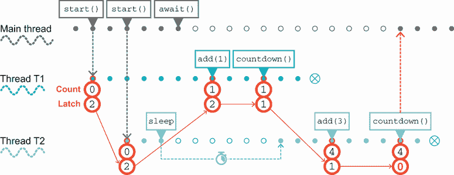
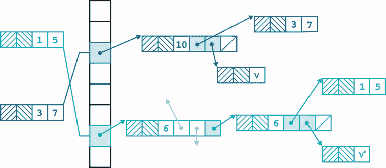
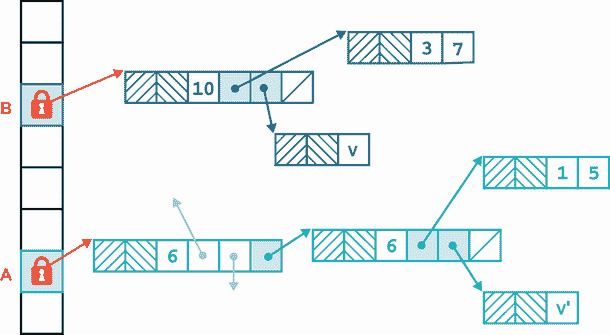
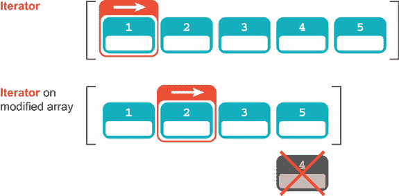
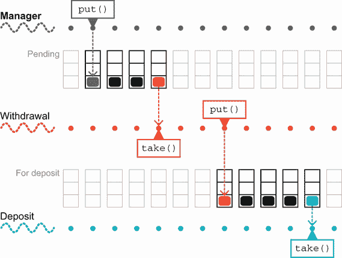
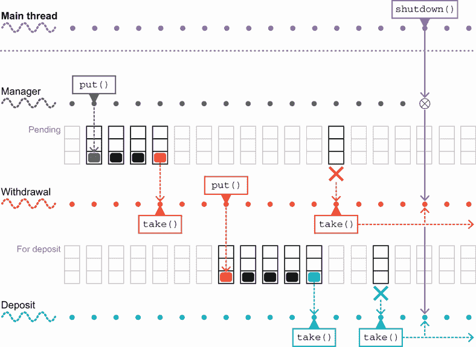
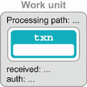
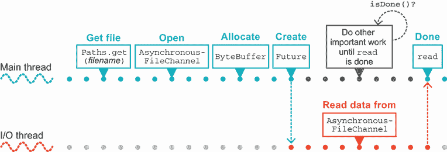
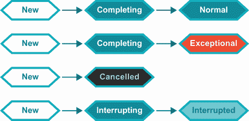
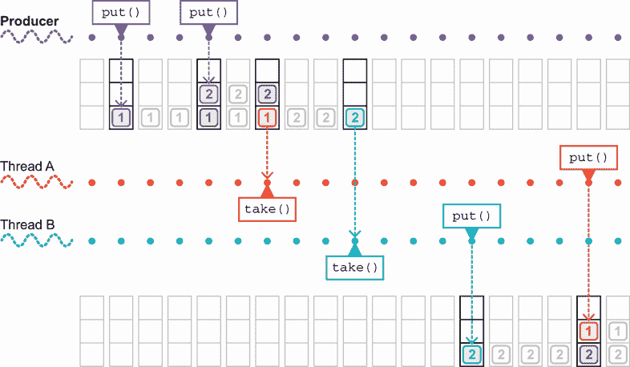

# 6 JDK 并发库

本章涵盖了

+   原子类

+   锁类

+   并发数据结构

+   阻塞队列

+   Futures 和 CompletableFuture

+   执行器

在本章中，我们将介绍每个有经验的开发者都应该了解的 `java.util.concurrent` 以及如何使用它提供的并发构建块工具箱。目标是到本章结束时，你将准备好在自己的代码中开始应用这些库和并发技术。

## 6.1 现代并发应用的基本构建块

正如我们在上一章所看到的，Java 从一开始就支持并发。然而，随着 Java 5 的出现（这本身已经超过 15 年了），Java 中关于并发的思考方式出现了一种新的方式。这由 `java.util.concurrent` 包引领，它包含了一套丰富的工具箱，用于处理多线程代码。

注意：这个工具箱在 Java 的后续版本中得到了增强，但 Java 5 中引入的类和包仍然以相同的方式工作，并且对工作开发者来说仍然非常有价值。

如果你（仍然！）有基于较老（Java 5 之前）方法的现有多线程代码，你应该考虑重构它以使用 `java.util.concurrent`。根据我们的经验，如果你有意识地将其迁移到较新的 API，你的代码将会得到改进——更高的清晰度和可靠性将值得所付出的迁移努力。

我们将游览 `java.util.concurrent` 和相关包中的一些主要类，例如原子和锁包。我们将帮助你开始使用这些类，并查看它们的使用案例。

你还应该阅读它们的 Javadoc，并尝试熟悉整个包。大多数开发者发现，它们提供的更高层次抽象使并发编程变得更加容易。

## 6.2 原子类

包 `java.util.concurrent.atomic` 包含了几个以 `Atomic` 开头的类，例如 `AtomicBoolean`、`AtomicInteger`、`AtomicLong` 和 `AtomicReference`。这些类是并发原语的最简单例子之一——一个可以用来构建可工作、安全并发应用的类。

警告：原子类不继承自同名的类，因此 `AtomicBoolean` 不能替代 `Boolean`，而 `AtomicInteger` 也不是 `Integer`（但它扩展了 `Number`）。

原子操作的目的在于提供线程安全的可变变量。这四个类中的每一个都提供了访问相应类型单个变量的接口。

注意：原子操作的实现被编写为利用现代处理器的特性，因此如果硬件和操作系统支持，它们可以是非阻塞的（无锁的），这在几乎所有现代系统中都是可行的。

提供的访问在几乎所有现代硬件上都是无锁的，因此原子操作的行为与 `volatile` 字段类似。然而，它们被封装在一个类 API 中，这个 API 超越了 `volatile` 的可能性。这个 API 包括适合操作的原子（意味着全有或全无）方法——包括依赖于状态更新（在没有使用锁的情况下，使用 `volatile` 变量是无法做到的）。结果是，原子操作可以是一个非常简单的方法，让开发者避免在共享数据上出现竞态条件。

注意：如果你对原子操作是如何实现的感兴趣，我们将在第十七章讨论细节，当我们讨论内部结构和 `sun.misc.Unsafe` 类时。

原子操作的一个常见用例是实现类似于序列号的功能，就像你可能在 SQL 数据库中找到的那样。这个功能可以通过在 `AtomicInteger` 或 `AtomicLong` 类上使用原子的 `getAndIncrement()` 方法来访问。让我们看看我们如何将第五章中的 `Account` 示例重写为使用原子操作：

```
    private static AtomicInteger nextAccountId = new AtomicInteger(1);

    private final int accountId;
    private double balance;

    public Account(int openingBalance) {
        balance = openingBalance;
        accountId = nextAccountId.getAndIncrement();
    }
```

每当创建一个对象时，我们都会在 `AtomicInteger` 的静态实例上调用 `getAndIncrement()`，它返回一个整数值并原子地增加可变变量。这种原子性保证两个对象不可能共享相同的 `accountId`，这正是我们想要的属性（就像数据库序列号一样）。

注意：我们可以将 `final` 标识符添加到原子操作中，但这是不必要的，因为字段是 `static` 的，并且类没有提供任何修改字段的方法。

作为另一个例子，以下是我们将如何重写我们的 `volatile` 关闭示例以使用 `AtomicBoolean`：

```
public class TaskManager implements Runnable {
    private final AtomicBoolean shutdown = new AtomicBoolean(false);

    public void shutdown() {
        shutdown.set(true);
    }

    @Override
    public void run() {
        while (!shutdown.get()) {
            // do some work - e.g. process a work unit
        }
    }
}
```

除了这些示例之外，`AtomicReference` 也可以用来实现对象的原子变更。一般模式是构建一些可能不可变的修改后的状态，然后可以通过在 `AtomicReference` 上使用 *比较并交换* (CAS) 操作来“交换”这些状态。

接下来，让我们考察 `java.util.concurrent` 如何对经典同步方法的核心——`Lock` 接口进行建模。

## 6.3 锁类

同步的块结构方法基于锁的简单概念。这种方法有一些缺点，如下所述：

+   只存在一种类型的锁。

+   这同样适用于锁定对象上的所有同步操作。

+   锁是在同步块或方法开始时获取的。

+   锁是在块或方法结束时释放的。

+   要么获取锁，要么线程无限期地阻塞——没有其他结果可能发生。

如果我们要重新设计锁的支持，我们可能会对几个方面进行改进：

+   添加不同类型的锁（例如读写锁）。

+   不要将锁限制在块中（允许一个方法获取锁，另一个方法释放锁）。

+   如果一个线程无法获取锁（例如，如果另一个线程持有锁），允许线程退出或继续或做其他事情——一个`tryLock()`。

+   允许一个线程尝试获取锁，并在一定时间后放弃。

实现所有这些可能性的关键是`java.util.concurrent.locks`中的`Lock`接口。此接口附带以下实现：

+   `ReentrantLock`—这本质上等同于 Java 同步块中使用的熟悉锁，但更灵活。

+   `ReentrantReadWriteLock`—在存在许多读者但很少写者的情况下，这可以提供更好的性能。

注意：其他实现存在，包括 JDK 内部和第三方编写的，但这些是最常见的。

`Lock`接口可以用来完全复制任何由块结构并发提供的功能。例如，列表 6.1 展示了第五章中如何避免死锁的示例，重写为使用`ReentrantLock`。

我们需要将锁对象作为字段添加到类中，因为我们不再依赖于对象的内建锁。我们还需要维护锁总是以相同顺序获取的原则。在我们的示例中，我们保持的简单协议是，具有最低账户 ID 的对象的锁首先获取。

列表 6.1 重写死锁示例以使用`ReentrantLock`

```
    private final Lock lock = new ReentrantLock();

    public boolean transferTo(SafeAccount other, int amount) {
        // We also need code to check to see amount > 0, throw if not
        // ...

        if (accountId == other.getAccountId()) {
            // Can't transfer to your own account
            return false;
        }

        var firstLock = accountId < other.getAccountId() ?
                lock : other.lock;
        var secondLock = firstLock == lock ? other.lock : lock;

        firstLock.lock();             ❶
        try {
            secondLock.lock();        ❷
            try {
                if (balance >= amount) {
                    balance = balance - amount;
                    other.deposit(amount);
                    return true;
                }
                return false;
            } finally {
                secondLock.unlock();
            }
        } finally {
            firstLock.unlock();
        }
    }
```

❶ 第一个锁对象具有较低的账户 ID。

❷ 第二个锁对象具有较高的账户 ID。

将对`lock()`的初始调用与一个`try ... finally`块结合的模式，在`finally`中释放锁，是您工具箱中的一个很好的补充。

注意：锁，就像`java.util.concurrent`中的许多内容一样，依赖于一个名为`AbstractQueuedSynchronizer`的类来实现其功能。

如果您正在复制一个类似于您会使用块结构并发的场景，这种模式工作得非常好。另一方面，如果您需要传递`Lock`对象（例如，通过从方法返回它），则不能使用此模式。

### 6.3.1 条件对象

`java.util.concurrent`提供的 API 的另一个方面是*条件对象*。这些对象在 API 中扮演的角色与原始内建 API 中的`wait()`和`notify()`相同，但更灵活。它们提供了线程能够无限期等待某些条件，并在该条件变为真时被唤醒的能力。

然而，与内建 API（其中对象监视器只有一个条件用于信号）不同，`Lock`接口允许程序员创建尽可能多的条件对象。这允许关注点的分离——例如，锁可以有多个不重叠的方法组，这些方法可以使用不同的条件。

通过在实现 `Lock` 接口的锁对象上调用 `newCondition()` 方法创建一个条件对象（它实现了 `Condition` 接口）。除了条件对象之外，API 还提供了一些 *闩锁* 和 *屏障* 作为并发原语，在某些情况下可能很有用。

## 6.4 CountDownLatch

`CountDownLatch` 是一个简单的并发原语，它提供了一个 *共识屏障*——它允许多个线程达到一个协调点并等待直到屏障释放。这是通过在创建 `CountDownLatch` 的新实例时提供一个整数值（`count`）来实现的。从那时起，使用两个方法来控制闩锁：`countDown()` 和 `await()`。前者将计数减 1，后者使调用线程阻塞，直到计数达到 0（如果计数已经是 0 或更少，则不执行任何操作）。在下面的列表中，闩锁被每个 `Runnable` 用于指示它已完成分配的工作。

列表 6.2 使用闩锁在线程间进行信号传递

```
    public static class Counter implements Runnable {
        private final CountDownLatch latch;
        private final int value;
        private final AtomicInteger count;

        public Counter(CountDownLatch l, int v, AtomicInteger c) {
            this.latch = l;
            this.value = v;
            this.count = c;
        }

        @Override
        public void run() {
            try {
                Thread.sleep(100);
            } catch (InterruptedException e) {
                Thread.currentThread().interrupt();
            }
            count.addAndGet(value);   ❶
            latch.countDown();        ❷
        }
    }
```

❶ 原子性地更新计数值

❷ 递减闩锁

注意，`countDown()` 方法是非阻塞的，因此一旦闩锁被递减，运行 `Counter` 代码的线程将退出。

我们还需要一些驱动代码，如下所示（省略了异常）：

```
var latch = new CountDownLatch(5);
var count = new AtomicInteger();
for (int i = 0; i < 5; i = i + 1) {
    var r  = new Counter(latch, i, count);
    new Thread(r).start();
}

latch.await();
System.out.println("Total: "+ count.get());
```

在代码中，闩锁被设置为法定人数值（在图 6.1 中，值为 2）。接下来，创建并初始化相同数量的线程，以便开始处理。主线程等待闩锁并阻塞，直到它被释放。每个工作线程在完成处理后将执行睡眠并调用 `countDown()`。主线程将不会继续进行，直到两个线程都完成其处理。这种情况在图 6.1 中显示。



图 6.1 使用 `CountDownLatch`

为了提供一个 `CountDownLatch` 的良好用例的另一个示例，考虑一个需要在服务器准备好接收传入请求之前预先填充几个缓存的参考数据的应用程序。我们可以通过使用一个共享的闩锁，每个缓存填充线程都持有该闩锁的引用，轻松地实现这一点。

当每个缓存加载完成时，填充它的 `Runnable` 会递减闩锁并退出。当所有缓存都加载完成后，主线程（它一直在等待闩锁打开）可以继续进行，并准备好将服务标记为启动并开始处理请求。

我们接下来要讨论的下一个类是多线程开发者工具箱中最有用的类之一：`ConcurrentHashMap`。

## 6.5 ConcurrentHashMap

`ConcurrentHashMap` 类提供了标准 `HashMap` 的并发版本。一般来说，映射是构建并发应用程序非常有用（且常见）的数据结构。这至少部分归因于底层数据结构的形状。让我们更仔细地看看基本的 `HashMap`，以了解为什么。

### 6.5.1 理解简化的 HashMap

如图 6.2 所示，经典的 Java `HashMap`使用一个函数（*哈希函数*）来确定它将存储键值对的哪个*桶*。这就是类名中“哈希”部分的原因。



图 6.2 经典的`HashMap`视图

键值对实际上存储在一个从通过哈希键获得的索引对应的桶开始的链表中（称为*哈希链*）。

在伴随本书的 GitHub 项目中，有一个`Map<String, String>`的简化实现——`Dictionary`类。这个类实际上是基于 Java 7 中作为一部分提供的`HashMap`的形式。

注意：现代 Java 版本提供的`HashMap`实现要复杂得多，因此在这个解释中，我们关注一个更简单的版本，其中设计概念更清晰可见。

基本类只有两个字段：主要数据结构和`size`字段，它为了性能原因缓存了映射的大小，如下所示：

```
public class Dictionary implements Map<String, String> {
    private Node[] table = new Node[8];
    private int size;

    @Override
    public int size() {
        return size;
    }

    @Override
    public boolean isEmpty() {
        return size == 0;
    }
```

这些依赖于一个名为`Node`的辅助类，它代表一个键值对并实现了`Map.Entry`接口，如下所示：

```
    static class Node implements Map.Entry<String,String> {
        final int hash;
        final String key;
        String value;
        Node next;

        Node(int hash, String key, String value, Node next) {
            this.hash = hash;
            this.key = key;
            this.value = value;
            this.next = next;
        }

        public final String getKey()        { return key; }
        public final String getValue()      { return value; }
        public final String toString() { return key + "=" + value; }

        public final int hashCode() {
            return Objects.hashCode(key) ^ Objects.hashCode(value);
        }

        public final String setValue(String newValue) {
            String oldValue = value;
            value = newValue;
            return oldValue;
        }

        public final boolean equals(Object o) {
            if (o == this)
                return true;
            if (o instanceof Node) {
                Node e = (Node)o;
                if (Objects.equals(key, e.getKey()) &&
                        Objects.equals(value, e.getValue()))
                    return true;
            }
            return false;
        }
    }
```

要在映射中查找值，我们使用`get()`方法，该方法依赖于几个辅助方法，`hash()`和`indexFor()`，如下所示：

```
    @Override
    public String get(Object key) {
        if (key == null)
            return null;
        int hash = hash(key);
        for (Node e = table[indexFor(hash, table.length)];
             e != null;
             e = e.next) {
            Object k = e.key;
            if (e.hash == hash && (k == key || key.equals(k)))
                return e.value;
        }
        return null;
    }

    static final int hash(Object key) {
        int h = key.hashCode();
        return h ^ (h >>> 16);                ❶
    }

    static int indexFor(int h, int length) {
        return h & (length - 1);              ❷
    }
```

❶ 一个位运算操作，以确保哈希值是正数

❷ 一个位运算操作，以确保索引在表的大小范围内

首先，`get()`方法处理了令人烦恼的 null 情况。随后，我们使用键对象的哈希码来构建一个指向数组`table`的索引。一个未写明的假设是`table`的大小是 2 的幂，因此`indexFor()`操作基本上是一个模运算，这确保了返回值是`table`的有效索引。

注意：这是一个人类思维可以确定异常（在这种情况下，`ArrayIndexOutOfBoundsException`）永远不会抛出的经典例子，但编译器不能。

现在我们有了`table`的索引，我们使用它来选择我们的查找操作的相关哈希链。我们从头部开始，沿着哈希链向下走。在每一步中，我们评估是否找到了我们的键对象，如下所示：

```
    if (e.hash == hash && ((k = e.key) == key || key.equals(k)))
        return e.value;
```

如果我们有，则返回相应的值。我们将键和值作为对（实际上是`Node`实例）存储，以便采用这种方法。

`put()`方法与之前的代码有些相似：

```
    @Override
    public String put(String key, String value) {
        if (key == null)
            return null;

        int hash = hash(key.hashCode());
        int i = indexFor(hash, table.length);
        for (Node e = table[i]; e != null; e = e.next) {
            Object k = e.key;
            if (e.hash == hash && (k == key || key.equals(k))) {
                String oldValue = e.value;
                e.value = value;
                return oldValue;
            }
        }

        Node e = table[i];
        table[i] = new Node(hash, key, value, e);

        return null;
    }
```

这种哈希数据结构的版本不是 100%的生产质量，但它的目的是演示基本行为和解决问题的方法，以便理解并发情况。

### 6.5.2 字典的限制

在我们继续讨论并发情况之前，我们应该提到，`Map` 中的一些方法在我们的玩具实现 `Dictionary` 中不受支持。具体来说，`putAll()`、`keySet()`、`values()` 或 `entrySet()`（因为该类实现了 `Map`）将简单地抛出 `UnsupportedOperationException()`。

我们不支持这些方法纯粹是因为复杂性。正如我们将在本书中多次看到的那样，Java 集合接口很大且功能丰富。这对于最终用户来说是个好事，因为他们有很多功能，但这意味着实现者必须提供更多的方法。

特别是像 `keySet()` 这样的方法需要 `Map` 实现提供 `Set` 实例，这通常会导致需要编写整个 `Set` 接口的实现作为内部类。这对于我们的示例来说太复杂了，所以我们只是不支持这些方法。

注意：正如我们将在本书后面看到的那样，集合接口的单体、复杂、命令式设计在详细考虑函数式编程时会出现各种问题。

简单的 `Dictionary` 类在其限制内工作得很好。然而，它没有防范以下两种情况：

+   随着存储元素数量的增加，需要调整 `table` 的大小

+   防御实现 `hashCode()` 的病态形式的键

这些方法中的第一个是一个严重的限制。散列数据结构的一个主要目的是将操作的预期复杂度从 `O(N)` 降低到 `O(log N)`，例如，对于值检索。如果表的大小不随映射中存储的元素数量增加而调整，这种复杂度优势就会丧失。实际实现必须处理随着映射增长而调整表大小的需求。

### 6.5.3 并发字典的实现方法

目前来看，`Dictionary` 显然不是线程安全的。考虑两个线程——一个尝试删除某个键，另一个尝试更新与其关联的值。根据操作顺序的不同，删除和更新都可能报告它们成功了，而实际上只有一个成功了。为了解决这个问题，我们有两种相当明显（如果有些天真）的方法来使 `Dictionary`（以及由此扩展的通用 Java `Map` 实现）实现并发。

首先是完全同步的方法，我们在第五章中遇到过。这个结论不难预测：由于性能开销，这种方法对于大多数实际系统来说不可行。然而，简要地看看我们如何实现它还是值得的。

在这里，我们有两种简单的方法来实现简单的线程安全。第一种是复制 `Dictionary` 类——让我们称它为 `ThreadSafeDictionary`，然后使所有的方法都同步。这可行，但涉及到大量的复制和粘贴代码。

或者，我们可以使用一个同步包装器来提供*委托*——也就是转发——到实际包含字典的底层对象。下面是如何做到这一点的方法：

```
public final class SynchronizedDictionary extends Dictionary {
    private final Dictionary d;

    private SynchronizedDictionary(Dictionary delegate) {
        d = delegate;
    }

    public static SynchronizedDictionary of(Dictionary delegate) {
        return new SynchronizedDictionary(delegate);
    }

    @Override
    public synchronized int size() {
        return d.size();
    }

    @Override
    public synchronized boolean isEmpty() {
        return d.isEmpty();
    }

    // ... other methods

}
```

这个例子有几个问题，其中最重要的是对象`d`已经存在并且没有同步。这是在为自己设置失败——其他代码可能在同步块或方法之外修改`d`，我们发现自己处于与上一章讨论的完全相同的情况。这不是并发数据结构的正确方法。

我们应该提到，实际上，JDK 提供了这样一个实现——`Collections`类中提供的`synchronizedMap()`方法。它的工作效果大致如此，并且像你预期的那样广泛使用。

第二种方法是诉诸不可变性。正如我们将说到的，并且还会再次说到的，Java Collections 是庞大而复杂的接口。这种表现方式之一是，可变性的假设贯穿于整个集合中。在没有任何意义上，它不是某些实现可以选择或选择不表达的可分离关注点——所有`Map`和`List`的实现都必须实现修改方法。

由于这种限制，我们可能会觉得在 Java 中无法建模一个既不可变又符合 Java Collections APIs 的数据结构——如果它符合 API，则该类还必须提供一个修改方法的实现。然而，存在一个令人非常不满意的解决方案。如果一个接口的实现没有实现某个方法，它总是可以抛出`UnsupportedOperationException`。从语言设计的角度来看，这当然是糟糕的。接口合约应该正好是那样——一个合约。

不幸的是，这种机制和惯例早于 Java 8（以及默认方法的到来），因此它代表了在 Java 语言中实际上不存在这种区分时，尝试编码“强制”方法和“可选”方法之间的差异。

这是一个糟糕的机制和做法（尤其是因为`UnsupportedOperationException`是一个运行时异常），但我们可以这样使用它：

```
public final class ImmutableDictionary extends Dictionary {
    private final Dictionary d;

    private ImmutableDictionary(Dictionary delegate) {
        d = delegate;
    }

    public static ImmutableDictionary of(Dictionary delegate) {
        return new ImmutableDictionary(delegate);
    }

    @Override
    public int size() {
        return d.size();
    }

    @Override
    public String get(Object key) {
        return d.get(key);
    }

    @Override
    public String put(String key, String value) {
        throw new UnsupportedOperationException();
    }

    // other mutating methods also throw UnsupportedOperationException

}
```

可以认为这是对面向对象原则的一种违反——用户的期望是这是一个有效的`Map<String, String>`实现，然而，如果用户尝试修改实例，则会抛出一个未经检查的异常。这可以合法地被视为一个安全隐患。

注意：这基本上是`Map.of()`必须做出的妥协：它需要完全实现接口，因此不得不求助于在修改方法调用时抛出异常。

这也不是这个方法唯一的问题。另一个缺点是，这当然也受我们之前看到的同步案例的基本缺陷的影响——仍然存在一个可变对象，并且可以通过该路径引用（并修改），违反了我们试图实现的基本标准。让我们对这些尝试画上一个句号，并尝试寻找更好的方法。

### 6.5.4 使用`ConcurrentHashMap`

在展示了简单的映射实现并讨论了我们可以用来使其并发的途径之后，现在是时候认识`ConcurrentHashMap`了。在某种程度上，这很简单：这是一个极其易于使用的类，在大多数情况下是`HashMap`的直接替代品。

关于`ConcurrentHashMap`的关键点在于它允许多个线程同时安全地更新它。为了了解为什么我们需要这一点，让我们看看当有两个线程同时向一个`HashMap`添加条目时会发生什么（省略了异常处理）：

```
var map = new HashMap<String, String>();
var SIZE = 10_000;

Runnable r1 = () -> {
    for (int i = 0; i < SIZE; i = i + 1) {
        map.put("t1" + i, "0");
    }
    System.out.println("Thread 1 done");
};
Runnable r2 = () -> {
    for (int i = 0; i < SIZE; i = i + 1) {
        map.put("t2" + i, "0");
    }
    System.out.println("Thread 2 done");
};
Thread t1 = new Thread(r1);
Thread t2 = new Thread(r2);
t1.start();
t2.start();

t1.join();
t2.join();
System.out.println("Count: "+ map.size());
```

如果我们运行这段代码，我们将看到我们老朋友，丢失更新反模式的另一种表现——`Count`的输出值将小于`2 * SIZE`。然而，在并发访问映射的情况下，情况实际上要糟糕得多。

在并发修改下，`HashMap`最危险的行为并不总是出现在小尺寸时。然而，如果我们增加`SIZE`的值，它最终会表现出来。

如果我们将`SIZE`增加到，比如说，`1_000_000`，那么我们很可能会看到这种行为。更新`map`的线程之一将无法完成。没错——一个线程可以（并将）陷入一个实际的无穷循环。这使得`HashMap`在多线程应用中使用时完全不安全（我们的示例`Dictionary`类也是如此）。

另一方面，如果我们用`ConcurrentHashMap`替换`HashMap`，那么我们可以看到并发版本的行为是正确的——没有无穷循环，也没有丢失更新的实例。它还有一个很好的特性，即无论你对它做什么，映射操作都不会抛出`ConcurrentModificationException`。

让我们简要地看看这是如何实现的。结果发现，图 6.2，它展示了`Dictionary`的实现，也指出了对`Map`的一个有用的多线程泛化，这个泛化比我们之前的两个尝试都要好。它基于以下洞察：在做出更改时，不需要锁定整个结构，只需要锁定正在更改或读取的哈希链（也称为桶）。

我们可以在图 6.3 中看到这是如何工作的。实现已经将锁下移到单个哈希链上。这种技术被称为*锁条带化*，它使得多个线程可以访问映射，前提是它们正在操作不同的链。



图 6.3 锁条带化

当然，如果两个线程需要操作同一个链，那么它们仍然会相互排除，但总的来说，这比同步整个映射提供了更好的吞吐量。

注意回想一下，随着映射中元素数量的增加，桶的表将进行缩放，这意味着随着越来越多的元素被添加到 `ConcurrentHashMap` 中，它将能够以更有效的方式处理越来越多的线程。

`ConcurrentHashMap` 实现了这种行为，但存在一些额外的低级细节，大多数开发者不需要过多担心。实际上，`ConcurrentHashMap` 的实现从 Java 8 开始发生了重大变化，现在它比我们在这里描述的设计更复杂。

使用 `ConcurrentHashMap` 可以几乎太简单了。在许多情况下，如果你有一个多线程程序并且需要共享数据，那么只需使用一个 `Map`，并让其实现为 `ConcurrentHashMap`。实际上，如果 `Map` 有可能被多个线程修改，那么你应该始终使用并发实现。它确实比普通的 `HashMap` 使用更多的资源，并且由于某些操作的同步，吞吐量会更差。然而，正如我们将在第七章中讨论的，与可能导致丢失更新或无限循环的竞态条件相比，这些不便微不足道。

最后，我们还应该注意，`ConcurrentHashMap` 实际上实现了 `ConcurrentMap` 接口，该接口扩展了 `Map`。它最初包含以下新方法，以提供线程安全的修改：

+   `putIfAbsent()`—如果键不存在，则将键值对添加到 `HashMap` 中。

+   `remove()`—如果键存在，则安全地删除键值对。

+   `replace()`—该实现为 `HashMap` 中的安全替换提供了两种不同形式的方法。

然而，随着 Java 8 的推出，其中一些方法被回滚到 `Map` 接口作为默认方法，例如：

```
default V putIfAbsent(K key, V value) {
        V v = get(key);
        if (v == null) {
            v = put(key, value);
        }

        return v;
    }
```

在 Java 的最新版本中，`ConcurrentHashMap` 和 `Map` 之间的差距有所缩小，但别忘了，尽管如此，`HashMap` 仍然是非线程安全的。如果你想在多线程之间安全地共享数据，你应该使用 `ConcurrentHashMap`。

总体而言，`ConcurrentHashMap` 是 `java.util.concurrent` 中最有用的类之一。它提供了比同步更高的多线程安全性和性能，并且在正常使用中没有任何严重的缺点。对于 `List` 的对应类是 `CopyOnWriteArrayList`，我们将在下一节中讨论。

## 6.6 CopyOnWriteArrayList

我们当然可以将我们在上一节中看到的两个不令人满意的并发模式应用到 `List` 上。完全同步和不可变（但具有抛出运行时异常的修改方法）的列表与映射一样容易编写，并且它们的效果也不比映射好。

我们能做得更好吗？不幸的是，列表的线性性质在这里没有帮助。即使在链表的情况下，多个线程尝试修改列表也会引发竞争的可能性，例如，在工作负载中有很大比例的追加操作时。

存在一个替代方案，那就是`CopyOnWriteArrayList`类。正如其名所示，这种类型是标准`ArrayList`类的替代品，它通过添加*写时复制（copy-on-write）语义*来提高线程安全性。这意味着任何修改列表的操作都将创建一个新副本，作为列表背后的数组（如图 6.4 所示）。这也意味着任何创建的迭代器都不必担心任何未预期的修改。



图 6.4 写时复制数组

迭代器保证不会抛出`ConcurrentModificationException`，并且不会反映自迭代器创建以来列表的任何添加、删除或更改——当然，除了（在 Java 中通常如此）列表元素仍然可以修改。只是列表本身不能。

这种实现通常对于一般用途来说太昂贵，但在遍历操作远多于变异操作，并且程序员不想处理同步的麻烦，但又想排除线程相互干扰的可能性时，可能是一个不错的选择。

让我们快速看一下核心思想是如何实现的。关键方法是`iterator()`，它始终返回一个新的`COWIterator`对象：

```
    public Iterator<E> iterator() {
        return new COWIterator<E>(getArray(), 0);
    }
```

以及`add()`、`remove()`和其他变异方法。变异方法始终用新的、克隆的并修改后的数组副本替换代表数组。保护数组必须在同步块内完成，因此`CopyOnWriteArrayList`类有一个内部锁，仅用作监视器（并注意其注释），如下所示：

```
    /**
     * The lock protecting all mutators.  (We have a mild preference
     * for builtin monitors over ReentrantLock when either will do.)
     */
    final transient Object lock = new Object();

    private transient volatile Object[] array;
```

然后，可以将像`add()`这样的操作保护如下：

```
     public boolean add(E e) {
        synchronized (lock) {
            Object[] es = getArray();
            int len = es.length;
            es = Arrays.copyOf(es, len + 1);
            es[len] = e;
            setArray(es);
            return true;
        }
    }
```

这使得`CopyOnWriteArrayList`在一般操作上比`ArrayList`效率更低，原因有几个：

+   变异操作的同步。

+   易失性存储（即`array`）。

+   `ArrayList`仅在需要调整底层数组的大小时才会分配内存；`CopyOnWriteArrayList`在每次变异时都会分配和复制。

创建迭代器时，会存储一个对该数组在那一刻存在的引用。进一步修改列表将导致创建一个新的副本，因此迭代器将指向数组的一个过去版本，如下所示：

```
     static final class COWIterator<E> implements ListIterator<E> {
        /** Snapshot of the array */
        private final Object[] snapshot;
        /** Index of element to be returned by subsequent call to next */
        private int cursor;

        COWIterator(Object[] es, int initialCursor) {
            cursor = initialCursor;
            snapshot = es;
        }
        // ...
    }
```

注意，`COWIterator`实现了`ListIterator`，因此根据接口合同，它必须支持列表变异方法，但为了简单起见，所有变异方法都抛出`UnsupportedOperationException`。

`CopyOnWriteArrayList` 对共享数据采取的方法，当快速、一致的数据快照（读者之间可能偶尔不同）比完美的同步更重要时可能很有用。这在涉及非关键数据的情况下相当常见，而写时复制的方法避免了与同步相关的性能损失。

让我们看看下一个列表中写时复制的实际示例。

列表 6.3 基于写时复制的示例

```
        var ls = new CopyOnWriteArrayList(List.of(1, 2, 3));
        var it = ls.iterator();
        ls.add(4);
        var modifiedIt = ls.iterator();
        while (it.hasNext()) {
            System.out.println("Original: "+ it.next());
        }
        while (modifiedIt.hasNext()) {
            System.out.println("Modified: "+ modifiedIt.next());
        }
```

这段代码专门设计来展示 `Iterator` 在写时复制语义下的行为。它产生如下输出：

```
Original: 1
Original: 2
Original: 3
Modified: 1
Modified: 2
Modified: 3
Modified: 4
```

通常，使用 `CopyOnWriteArrayList` 类比使用 `ConcurrentHashMap` 需要更多的思考，因为 `ConcurrentHashMap` 主要是由于性能问题而成为 `HashMap` 的并发替代品——写时复制的特性意味着如果列表被修改，整个数组必须被复制。如果列表的更改比读取访问更常见，这种方法不一定能提供高性能。

通常，`CopyOnWriteArrayList` 与 `synchronizedList()` 的权衡不同。后者在所有操作上同步，因此不同线程的读取可以相互阻塞，这在 COW 数据结构中并不成立。另一方面，`CopyOnWriteArrayList` 在每次变异时都会复制底层数组，而同步版本仅在底层数组满时才这样做（与 `ArrayList` 的行为相同）。然而，正如我们在第七章中反复所说的，从第一原理推理代码极其困难——唯一可靠地获得高性能代码的方法是测试、重新测试并衡量结果。

在第十五章中，我们将遇到**持久数据结构**的概念，这是另一种处理并发数据的方法。Clojure 编程语言非常重视持久数据结构，`CopyOnWriteArrayList`（以及 `CopyOnWriteArraySet`）是它们的实现示例之一。

让我们继续前进。`java.util.concurrent` 中并发代码的下一个主要常见构建块是 `Queue`。它用于在线程之间传递工作元素，并且它是许多灵活和可靠的多线程设计的基础。

## 6.7 阻塞队列

队列是并发编程的一个奇妙抽象。队列提供了一个简单且可靠的方式来分配处理资源给工作单元（或者根据你如何看待它，将工作单元分配给处理资源）。

多线程 Java 编程中的许多模式都严重依赖于 `Queue` 的线程安全实现，因此完全理解它是很重要的。基本的 `Queue` 接口在 `java.util` 中，因为它可以是一个重要的模式，即使在单线程编程中也是如此，但我们将关注多线程的使用案例。

一个非常常见的用例，也是我们将要关注的，是使用队列在线程之间传递工作单元。这种模式通常非常适合 `Queue` 的最简单的并发扩展——`BlockingQueue`。

`BlockingQueue` 是一个具有以下两个额外特殊属性的队列：

+   当尝试向队列 `put()` 时，如果队列已满，它将导致放置线程等待空间变得可用。

+   当尝试从队列中 `take()` 时，如果队列为空，它将导致获取线程阻塞。

这两个属性非常有用，因为如果一个线程（或线程池）的能力超过了另一个线程的能力，那么较快的线程将被迫等待，从而调节整个系统。这如图 6.5 所示。


图 6.5 `BlockingQueue`

Java 随带实现了两个基本的 `BlockingQueue` 接口：`LinkedBlockingQueue` 和 `ArrayBlockingQueue`。它们提供了一些不同的属性；例如，当队列的大小有一个确切的上限时，数组实现非常高效，而在某些情况下，链式实现可能稍微快一些。

然而，实现之间的真正区别在于隐含的语义。尽管链式变体可以构建一个大小限制，但它通常是不带限制创建的，这导致了一个队列大小为 `Integer.MAX_VALUE` 的对象。这实际上是无限的——在实际应用中，其队列中超过二十亿项的积压是无法恢复的。

因此，虽然在理论上 `LinkedBlockingQueue` 上的 `put()` 方法可能会阻塞，但在实践中，它从未这样做。这意味着正在向队列写入的线程可以有效地以无限的速度进行。

相比之下，`ArrayBlockingQueue` 的队列大小是固定的——支持它的数组的大小。如果生产线程将对象放入队列的速度比接收者处理的速度快，那么在某个时候，队列将完全填满，进一步调用 `put()` 的尝试将阻塞，生产线程将被迫降低任务生产的速度。

`ArrayBlockingQueue` 的这个属性是所谓的 *背压* 的一种形式，这是并发和分布式系统工程的一个重要方面。

让我们通过一个示例来看看 `BlockingQueue` 的实际应用：将账户示例修改为使用队列和线程。示例的目标是消除对账户对象进行锁定的需求。应用程序的基本架构如图 6.6 所示。



图 6.6 处理带队列的账户

我们首先通过以下列表引入一个具有这些字段的 `AccountManager` 类。

列表 6.4 `AccountManager` 类

```
public class AccountManager {
    private ConcurrentHashMap<Integer, Account> accounts =
        new ConcurrentHashMap<>();
    private volatile boolean shutdown = false;

    private BlockingQueue<TransferTask> pending =
        new LinkedBlockingQueue<>();
    private BlockingQueue<TransferTask> forDeposit =
        new LinkedBlockingQueue<>();
    private BlockingQueue<TransferTask> failed =
        new LinkedBlockingQueue<>();

    private Thread withdrawals;
    private Thread deposits;
```

阻塞队列包含 `TransferTask` 对象，这些是简单的数据载体，表示要进行的传输，如下所示：

```
public class TransferTask {
    private final Account sender;
    private final Account receiver;
    private final int amount;

    public TransferTask(Account sender, Account receiver, int amount) {
        this.sender = sender;
        this.receiver = receiver;
        this.amount = amount;
    }

    public Account sender() {
        return sender;
    }

    public int amount() {
        return amount;
    }

    public Account receiver() {
        return receiver;
    }

    // Other methods elided
}
```

转账没有额外的语义——该类只是一个笨拙的*数据载体*类型。

注意：`TransferTask`类型非常简单，在 Java 17 中可以写成记录类型（我们在第三章中遇到过）

`AccountManager`类提供了创建账户和提交转账任务的功能，如下所示：

```
    public Account createAccount(int balance) {
        var out = new Account(balance);
        accounts.put(out.getAccountId(), out);
        return out;
    }

    public void submit(TransferTask transfer) {
        if (shutdown) {
            return false;
        }
        return pending.add(transfer);
    }
```

`AccountManager`的实际工作由管理队列之间转账任务的两个线程处理。让我们首先看看提款操作：

```
    public void init() {
        Runnable withdraw = () -> {
            boolean interrupted = false;
            while (!interrupted || !pending.isEmpty()) {
                try {
                    var task = pending.take();
                    var sender = task.sender();
                    if (sender.withdraw(task.amount())) {
                        forDeposit.add(task);
                    } else {
                        failed.add(task);
                    }
                } catch (InterruptedException e) {
                    interrupted = true;
                }
            }
            deposits.interrupt();
        };
```

存款操作的定义与此类似，然后我们使用以下任务初始化账户管理器：

```
    Runnable deposit = () -> {
            boolean interrupted = false;
            while (!interrupted || !forDeposit.isEmpty()) {
                try {
                    var task = forDeposit.take();
                    var receiver = task.receiver();
                    receiver.deposit(task.amount());
                } catch (InterruptedException e) {
                    interrupted = true;
                }
            }
        };

        init(withdraw, deposit);
    }
```

`init()`方法的包私有重载用于启动后台线程。它作为一个单独的方法存在，以便更容易进行测试，如下所示：

```
    void init(Runnable withdraw, Runnable deposit) {
        withdrawals = new Thread(withdraw);
        deposits = new Thread(deposit);
        withdrawals.start();
        deposits.start();
    }
```

我们需要一些代码来驱动这个过程：

```
        var manager = new AccountManager();
        manager.init();
        var acc1 = manager.createAccount(1000);
        var acc2 = manager.createAccount(20_000);

        var transfer = new TransferTask(acc1, acc2, 100);
        manager.submit(transfer);                           ❶
        Thread.sleep(5000);                                 ❷
        System.out.println(acc1);
        System.out.println(acc2);
        manager.shutdown();
        manager.await();
```

❶ 从 acc1 提交转账到 acc2

❷ 睡眠以允许时间执行转账

这会产生如下输出：

```
Account{accountId=1, balance=900.0,
    lock=java.util.concurrent.locks.ReentrantLock@58372a00[Unlocked]}
Account{accountId=2, balance=20100.0,
    lock=java.util.concurrent.locks.ReentrantLock@4dd8dc3[Unlocked]}
```

然而，尽管调用了`shutdown()`和`await()`，代码仍然没有干净地执行，因为使用的调用具有阻塞性质。让我们看看图 6.7 来了解原因。



图 6.7 错误的关闭序列

当主代码调用`shutdown()`时，volatile 布尔标志被翻转成 true，所以后续对布尔值的每次读取都将看到这个值。不幸的是，由于队列是空的，提款和存款线程都阻塞在`take()`调用中。如果 somehow 将对象放入`pending`队列中，那么提款线程将处理它，然后将对象放入`forDeposit`队列（假设提款成功）。此时，提款线程将退出`while`循环，线程将正常终止。

然后，存款线程将看到`forDeposit`队列中的对象并唤醒，取走它，处理它，然后退出自己的`while`循环并正常终止。然而，这个干净的终止过程取决于队列中仍然有任务。在队列空的情况边缘，线程将永远坐在它们的阻塞`take()`调用中。为了解决这个问题，让我们探索阻塞队列实现提供的完整方法集。

### 6.7.1 使用 BlockingQueue API

`BlockingQueue`接口实际上提供了三种与它交互的独立策略。为了理解策略之间的差异，考虑以下场景中 API 可能显示的可能行为：一个线程尝试向一个当前无法容纳项目的容量受限队列中插入一个项目（即队列已满）。

从逻辑上讲，我们有以下三种可能性。插入调用可能

+   阻塞直到队列中有空间释放

+   返回一个值（可能是 Boolean false）以指示失败

+   抛出异常

当然，在相反的情况下（尝试从一个空队列中取出项），也会出现同样的三种可能性。这些可能性中的第一种是通过我们已遇到的`take()`和`put()`方法实现的。

注意：第二和第三是`Queue`接口提供的选项，它是`BlockingQueue`的超接口。

第二种选项提供了一个非阻塞的 API，它返回特殊值，并在`offer()`和`poll()`方法中体现。如果无法完成队列的插入，则`offer()`会快速失败并返回 false。程序员必须检查返回码并采取适当的行动。

类似地，`poll()`在无法从队列中检索时立即返回`null`。在名为`BlockingQueue`的类上使用非阻塞 API 可能看起来有些奇怪，但实际上是有用的（并且也是由于`BlockingQueue`和`Queue`之间的继承关系所要求的）。

实际上，`BlockingQueue`提供了非阻塞方法的额外重载。这些方法提供了带有超时的轮询或提供的功能，以便遇到问题的线程可以从与队列的交互中退出并做其他事情。

我们可以将列表 6.4 中的`AccountManager`修改为使用带有超时的非阻塞 API，如下所示：

```
    Runnable withdraw = () -> {
      LOOP:
      while (!shutdown) {
          try {
              var task = pending.poll(5,                 ❶
                                      TimeUnit.SECONDS);
              if (task == null) {
                  continue LOOP;                         ❷
              }
              var sender = task.sender();
              if (sender.withdraw(task.amount())) {
                  forDeposit.put(task);
              } else {
                  failed.put(task);
              }
          } catch (InterruptedException e) {
              // Log at critical and proceed to next item
          }
      }
      // Drain pending queue to failed or log
  };
```

❶ 如果计时器到期，`poll()`返回 null。

❷ 显式使用 Java 循环标签以清楚地表明正在继续什么。

同样，也需要对存款线程进行类似的修改。

这解决了我们在前一小节中概述的关闭问题，因为现在线程在检索方法中不会永远阻塞。相反，如果在超时之前没有对象到达，则`poll()`仍然会返回并提供值`null`。然后测试将继续循环，但 volatile 布尔值的可见性保证确保`while`循环条件现在得到满足，循环退出并且线程干净地关闭。这意味着，总的来说，一旦调用`shutdown()`方法，`AccountManager`将在有限的时间内关闭，这正是我们想要的行为。

为了结束对`BlockingQueue` API 的讨论，我们应该看看我们之前提到的第三种方法：如果队列操作无法立即完成，则抛出异常的方法。这些方法`add()`和`remove()`，坦白地说，由于几个原因而存在问题，其中最不重要的是它们在失败时抛出的异常（分别是`IllegalStateException`和`NoSuchElementException`）是运行时异常，因此不需要显式处理。

然而，异常抛出 API 的问题远不止于此。Java 中的一个普遍原则是，异常应该用于处理异常情况，即程序通常不认为它们是正常操作的一部分。然而，空队列的情况却是一个完全可能的情况。因此，对此情况抛出异常违反了有时被表述为“不要使用异常进行流程控制”的原则。

异常通常很昂贵，因为当异常实例化时需要构建堆栈跟踪，在抛出时需要执行堆栈回溯。因此，除非异常将立即被抛出，否则不创建异常是一个好的做法。出于这些原因，我们确实建议不要使用 `BlockingQueue` API 的异常抛出形式。

### 6.7.2 使用 WorkUnit

`Queue` 接口都是泛型的：它们是 `Queue<E>`、`BlockingQueue<E>` 等等。尽管这可能看起来有些奇怪，但有时利用这一点并引入一个人工的容器类来包装工作项是明智的。

例如，如果你有一个名为 `MyAwesomeClass` 的类，它代表你想要在多线程应用程序中处理的工作单元，那么你不会这样做：

```
BlockingQueue<MyAwesomeClass>
```

有时候，这样做可能更好：

```
BlockingQueue<WorkUnit<MyAwesomeClass>>
```

其中 `WorkUnit`（或 `QueueObject`，或你想要称谓的容器类）是一个包装类，可能看起来像这样：

```
public class WorkUnit<T> {
    private final T workUnit;

    public T getWork() {
        return workUnit;
    }

    public WorkUnit(T workUnit) {
        this.workUnit = workUnit;
    }

    // ... other methods elided
}
```

做这件事的原因是这种级别的间接性提供了一个地方来添加额外的元数据，而不会损害包含类型（在这个例子中是 `MyAwesomeClass`）的概念完整性。在图 6.8 中，我们可以看到外部元数据包装器是如何工作的。



图 6.8 使用工作单元作为元数据包装器

这非常实用。需要额外元数据的使用场景很多。以下是一些例子：

+   测试（例如显示对象的变更历史）

+   性能指标（例如到达时间或服务质量）

+   运行时系统信息（例如这个 `MyAwesomeClass` 实例是如何被路由的）

在事后添加这种间接性可能要困难得多。如果你后来发现某些情况下需要更多的元数据，那么在 `WorkUnit` 类中添加这些原本简单的更改可能需要进行重大的重构工作。让我们继续讨论期货，期货是表示 Java 中正在进行的（通常在另一个线程上）任务占位符的一种方式。

## 6.8 期货

`java.util.concurrent` 中的 `Future` 接口是对异步任务的一个简单表示：它是一个类型，它持有来自可能尚未完成但可能在未来的某个时刻完成的任务的结果。`Future` 上的主要方法如下：

+   `get()`—获取结果。如果结果尚未可用，将阻塞直到它可用。

+   `isDone()`—允许调用者确定计算是否已完成。它是非阻塞的。

+   `cancel()`——允许在完成之前取消计算。

还有一个版本的 `get()` 方法接受超时，它不会永远阻塞，类似于我们之前遇到的带有超时的 `BlockingQueue` 方法。下面的列表显示了在素数查找器中使用 `Future` 的一个示例。

列表 6.5 使用 `Future` 查找素数

```
Future<Long> fut = getNthPrime(1_000_000_000);
try {
    long result = fut.get(1, TimeUnit.MINUTES);
    System.out.println("Found it: " + result);
} catch (TimeoutException tox) {
    // Timed out - better cancel the task
    System.err.println("Task timed out, cancelling");
    fut.cancel(true);
} catch (InterruptedException e) {
    fut.cancel(true);
    throw e;
} catch (ExecutionException e) {
    fut.cancel(true);
    e.getCause().printStackTrace();
}
```

在这个片段中，你应该想象 `getNthPrime()` 返回一个在某个后台线程（甚至多个线程）上执行的未来，可能是我们将在本章后面讨论的执行器框架之一。

运行代码片段的线程进入带有超时的 get，并最多阻塞 60 秒等待响应。如果没有收到响应，则线程循环并进入另一个阻塞等待。即使在现代硬件上，这个计算也可能需要很长时间，因此你可能需要使用 `cancel()` 方法（尽管编写的代码没有提供取消请求的任何机制）。

作为第二个例子，让我们考虑非阻塞 I/O。图 6.9 显示了 `Future` 的实际应用，允许我们使用后台线程进行 I/O。



图 6.9 在 Java 中使用 `Future`

这个 API 已经存在了一段时间——它在 Java 7 中被引入——它允许用户执行类似这样的非阻塞并发操作：

```
try {
    Path file = Paths.get("/Users/karianna/foobar.txt");

    var channel = AsynchronousFileChannel.open(file);        ❶

    var buffer = ByteBuffer.allocate(1_000_000);             ❷
    Future<Integer> result = channel.read(buffer, 0);        ❷

    BusinessProcess.doSomethingElse();                       ❸

    var bytesRead = result.get();                            ❹
    System.out.println("Bytes read [" + bytesRead + "]");
} catch (IOException | ExecutionException | InterruptedException e) {
    e.printStackTrace();
}
```

❶ 异步打开文件

❷ 请求读取最多一百万字节

❸ 执行其他操作

❹ 当准备好时获取结果

这种结构允许主线程在另一个线程上执行 I/O 操作的同时 `doSomethingElse()`，这个线程是由 Java 运行时管理的。这是一个有用的方法，但它需要提供该功能的库的支持。这可能会有些限制——如果我们想创建自己的异步工作流怎么办？

### 6.8.1 CompletableFuture

Java 的 `Future` 类型被定义为一种接口，而不是一个具体的类。任何想要使用基于 `Future` 风格的 API 都必须提供一个具体的 `Future` 实现。

对于一些开发者来说，这些可能具有挑战性，并且在工具箱中存在明显的差距，因此从 Java 8 开始，JDK 中包含了一种新的未来方法——`Future` 的具体实现，它增强了功能，并在某些方面与其他语言中的未来（例如 Kotlin 和 Scala）更相似。

这个类被称为 `CompletableFuture`——它是一个实现了 `Future` 接口的具体类型，提供了额外的功能，并旨在作为构建异步应用程序的简单构建块。核心思想是我们可以创建 `CompletableFuture<T>` 类型的实例（它对返回值的类型是泛型的），创建的对象代表一个 *未完成*（或“未满足”）状态的未来。

之后，任何拥有可完成 `Future` 引用的线程都可以调用其上的 `complete()` 并提供值——这完成了（或“履行”）了未来。完成后的值立即对所有在 `get()` 调用上阻塞的线程可见。完成之后，任何进一步的 `complete()` 调用都将被忽略。

`CompletableFuture` 不能导致不同的线程看到不同的值。`Future` 要么未完成，要么已完成，如果已完成，则它持有的值是第一个调用 `complete()` 的线程提供的值。

这显然不是不可变性——`CompletableFuture` 的状态会随时间改变。然而，它只改变 *一次*——从未完成到完成。不同线程看到不一致状态的可能性是不存在的。

注意，Java 的 `CompletableFuture` 与其他语言（如 JavaScript）中的 *promise* 类似，这就是为什么我们除了“履行承诺”之外，还提到了“完成未来”的替代术语。

让我们来看一个示例并实现 `getNthPrime()`，这是我们之前遇到的：

```
public static Future<Long> getNthPrime(int n) {
    var numF = new CompletableFuture<Long>();     ❶

    new Thread( () -> {                           ❷
        long num = NumberService.findPrime(n);    ❸
        numF.complete(num);
    } ).start();

    return numF;
}
```

❶ 创建一个未完成的可完成 Future

❷ 创建并启动一个新线程以完成 Future

❸ 实际计算素数

`getNthPrime()` 方法创建一个“空”的 `CompletableFuture` 并将此容器对象返回给其调用者。为了驱动它，我们确实需要一些代码来调用 `getNthPrime()`——例如，列表 6.5 中显示的代码。

考虑 `CompletableFuture` 的一个方法是通过与客户端/服务器系统的类比。`Future` 接口只提供查询方法——`isDone()` 和阻塞的 `get()`。这相当于客户端的角色。`CompletableFuture` 的一个实例扮演服务器端的角色——它提供了对正在履行未来并提供值的代码的执行和完成的完全控制。

在示例中，`getNthPrime()` 在一个单独的线程中评估对数字服务的调用。当这个调用返回时，我们显式地完成未来。

实现相同效果的一种稍微更简洁的方法是使用 `CompletableFuture .supplyAsync()` 方法，传递一个表示要执行的任务的 `Callable<T>` 对象。此调用利用了由并发库管理的全局线程池，如下所示：

```
public static Future<Long> getNthPrime(int n) {
    return CompletableFuture.supplyAsync(
        () -> NumberService.findPrime(n));
}
```

这标志着我们对并发数据结构的初步探索的结束，这些数据结构是构建坚固的多线程应用程序的主要构建块之一。

注意，本书后面还将详细介绍 `CompletableFuture`，特别是在讨论高级并发和与函数式编程交互的章节中。

接下来，我们将介绍 *executors* 和 threadpools，它们提供了一种比基于 `Thread` 的原始 API 更高级、更方便的方式来处理执行。

## 6.9 任务和执行

`java.lang.Thread` 类自 Java 1.0 以来就存在了——Java 语言最初的一个亮点就是内置、语言级别的对多线程的支持。它功能强大，并以接近底层操作系统支持的形式表达并发。然而，它是一个处理并发的根本上是低级 API。

这种低级特性使得许多程序员难以正确或高效地使用它。在 Java 之后发布的其他语言从 Java 的线程经验中学习，并在此基础上提供了替代方法。其中一些方法反过来又影响了 `java.util.concurrent` 的设计以及 Java 并发方面的后续创新。

在这种情况下，我们的直接目标是让任务（或工作单元）能够在不为每个任务启动新线程的情况下执行。最终，这意味着任务必须被建模为可调用的代码，而不是直接表示为线程。

然后，这些任务可以调度到共享资源——一个线程池——上，该线程池执行任务直到完成，然后继续下一个任务。让我们看看我们是如何建模这些任务的。

### 6.9.1 任务建模

在本节中，我们将探讨两种不同的任务建模方法：`Callable` 接口和 `FutureTask` 类。我们也可以考虑 `Runnable`，但它并不总是那么有用，因为 `run()` 方法不返回值，因此它只能通过副作用执行工作。

任务建模的另一个重要方面虽然可能不明显——即如果我们假设我们的线程容量是有限的，那么任务必须在有限的时间内完成。

如果我们有无限循环的可能性，一些任务可能会“窃取”池中的一个执行线程，这将从那时起减少所有任务的总体容量。随着时间的推移，这最终可能导致线程池资源耗尽，无法进行进一步的工作。因此，我们必须小心，确保我们构建的任何任务确实遵守“在有限时间内终止”的原则。

可调用接口

`Callable` 接口代表一个非常常见的抽象。它代表了一段可以被调用并返回结果的代码。尽管这是一个直接的想法，但实际上这是一个微妙且强大的概念，可以导致一些极其有用的模式。

`Callable` 的一个典型用途是 lambda 表达式（或匿名实现）。这个片段的最后一行将 `s` 设置为 `out.toString()` 的值：

```
var out = getSampleObject();
Callable<String> cb = () -> out.toString();

String s = cb.call();
```

将 `Callable` 视为对 lambda 提供的单个方法 `call()` 的延迟调用。

FutureTask 类

`FutureTask` 类是 `Future` 接口的一个常用实现，它也实现了 `Runnable`。正如我们将看到的，这意味着 `FutureTask` 可以提供给执行器。`FutureTask` 的 API 基本上是 `Future` 和 `Runnable` 的组合：`get()`、`cancel()`、`isDone()`、`isCancelled()` 和 `run()`，尽管最后一个——实际执行工作的那个——将由执行器调用，而不是由客户端代码直接调用。

`FutureTask` 提供了两个便利的构造函数：一个接受 `Callable`，另一个接受 `Runnable`（它使用 `Executors.callable()` 将 `Runnable` 转换为 `Callable`）。这表明了一种灵活的任务处理方法，允许将工作编写为 `Callable`，然后将其包装到 `FutureTask` 中，这样就可以在执行器上调度（如果需要，还可以取消）它，这是由于 `FutureTask` 的 `Runnable` 特性。

该类提供了一个简单的任务状态模型，并通过该模型管理任务。可能的状态转换在图 6.10 中显示。



图 6.10 任务状态模型

这对于广泛的普通执行可能性是足够的。让我们来看看 JDK 提供的标准执行器。

### 6.9.2 执行器

有几个标准接口用于描述 JDK 中存在的线程池。第一个是 `Executor`，它非常简单，定义如下：

```
public interface Executor {

    /**
     * Executes the given command at some time in the future. The command
     * may execute in a new thread, in a pooled thread, or in the calling
     * thread, at the discretion of the {@code Executor} implementation.
     *
     * @param command the runnable task
     * @throws RejectedExecutionException if this task cannot be
     * accepted for execution
     * @throws NullPointerException if command is null
     */
    void execute(Runnable command);
}
```

应该注意，尽管这个接口只有一个抽象方法（即，它是一个所谓的 SAM 类型），但它并没有用 `@FunctionalInterface` 注解标记。它仍然可以用作 lambda 表达式的目标类型，但它并不打算用于函数式编程。

实际上，`Executor` 并不常用——更常见的是扩展 `Executor` 并添加 `submit()` 以及几个生命周期方法（如 `shutdown()`）的 `ExecutorService` 接口。

为了帮助开发者实例化和使用一些标准线程池，JDK 提供了 `Executors` 类，它是一组静态辅助方法（主要是工厂）。以下是最常用的四个方法：

```
newSingleThreadExecutor()
newFixedThreadPool(int nThreads)
newCachedThreadPool()
newScheduledThreadPool(int corePoolSize)
```

让我们逐一查看这些内容。在本书的后面部分，我们将深入探讨一些其他更复杂但同样提供的可能性。

### 6.9.3 单线程执行器

执行器中最简单的是单线程执行器。这本质上是一个封装的单线程和任务队列（这是一个阻塞队列）的组合。

客户端代码通过 `submit()` 将可执行任务放入队列。然后单个执行线程一次取一个任务，并运行到完成，然后再取下一个任务。

注意：执行器不是作为不同的类型实现的，而是表示在构建底层线程池时的不同参数选择。

在执行线程忙碌时提交的任务将被排队，直到线程可用。因为此执行器由单个线程支持，如果违反了之前提到的“在有限时间内终止”的条件，这意味着随后提交的作业将永远不会运行。

注意：此版本的执行器通常对测试很有用，因为它可以比其他形式更确定。

下面是一个如何使用单线程执行器的非常简单的例子：

```
var pool = Executors.newSingleThreadExecutor();
Runnable hello = () -> System.out.println("Hello world");
pool.submit(hello);
```

`submit()`调用通过将可运行的任务放置在执行器的作业队列上来传递任务。该作业提交是非阻塞的（除非作业队列已满）。

然而，仍然需要小心——例如，如果主线程立即退出，提交的作业可能没有时间被池线程收集，可能不会运行。为了避免立即退出，首先在执行器上调用`shutdown()`方法是明智的。

详细信息可以在`ThreadPoolExecutor`类中找到，但基本上这个方法启动了一个*有序关闭*，其中之前提交的任务将被执行，但不会接受新的任务。这有效地解决了我们在 6.4 列表中看到关于清空挂起事务队列的问题。

注意：一个无限循环的任务与有序关闭请求的组合将产生不良交互，导致线程池永远不会关闭。

当然，如果单线程执行器就是所有需要的东西，那么就没有必要深入理解并发编程及其挑战。因此，我们也应该看看利用多个执行器线程的替代方案。

### 6.9.4 固定线程池

通过`Executors.newFixedThreadPool()`的一个变体获得的固定线程池实际上是单线程执行器的多线程推广。在创建时，用户提供一个明确的线程数，并且线程池将使用这么多线程创建。

这些线程将被重用来运行多个任务，一个接一个。设计防止用户支付线程创建的成本。与单线程变体一样，如果所有线程都在使用中，新任务将存储在阻塞队列中，直到线程空闲。

如果任务流稳定且已知，并且所有提交的作业在计算持续时间方面大致相同，则此版本的线程池特别有用。它再次最容易通过适当的工厂方法创建，如下所示：

```
var pool = Executors.newFixedThreadPool(2);
```

这将创建一个由两个执行器线程支持的显式线程池。这两个线程将以非确定性的方式轮流从队列中接受任务。即使任务提交有严格的时序（基于时间的）顺序，也无法保证哪个线程将处理给定的任务。

这的一个后果是，在如图 6.11 所示的情况中，即使上游队列中的任务在时间上准确排序，下游队列中的任务也不能保证准确的时间顺序。



图 6.11 一个线程池和两个队列

固定线程池有其用途，但并非市场上唯一的游戏。一方面，如果其中的执行器线程死亡，它们不会被替换。如果提交的工作有抛出运行时异常的可能性，这可能导致线程池饥饿。让我们看看另一种选择，它做出了不同的权衡，但可以避免这种可能性。

### 6.9.5 缓存线程池

当工作负载的活动模式已知且相对稳定时，通常会使用固定线程池。然而，如果进入的工作更加不均匀或突发，那么固定数量的线程池可能不是最优选择。

`CachedThreadPool`是一个无界池，如果可用将重用线程，否则将根据需要创建新线程来处理进入的任务，如下所示：

```
var pool = Executors.newCachedThreadPool();
```

线程被保留在空闲缓存中 60 秒，如果它们在那个时间段结束时仍然存在，它们将被从缓存中移除并销毁。

当然，确保任务实际上能够终止仍然非常重要。如果不这样做，那么随着时间的推移，线程池将创建越来越多的线程，消耗越来越多的机器资源，最终崩溃或变得无响应。

通常，固定大小线程池和缓存线程池之间的权衡主要是在重用线程与创建和销毁线程以实现不同效果之间。`CachedThreadPool`的设计应该在小异步任务上提供比固定大小池更好的性能。然而，正如往常一样，如果认为效果显著，必须进行适当的性能测试。

### 6.9.6 ScheduledThreadPoolExecutor

我们将要查看的执行器的最后一个例子有一点不同。这是`ScheduledThreadPoolExecutor`，有时简称为 STPE，如下所示：

```
ScheduledExecutorService pool = Executors.newScheduledThreadPool(4);
```

注意，这里我们明确指出的是返回类型是`ScheduledExecutorService`。这与返回`ExecutorService`的其他工厂方法不同。

注意：`ScheduledThreadPoolExecutor`是一个令人惊讶的有能力的执行器选择，可以在广泛的情境中使用。

调度服务扩展了常规执行器服务并添加了一些新的功能：`schedule()`，在指定延迟后运行一次性的任务，以及两个用于安排周期性（即重复）任务的方法——`scheduleAtFixedRate()`和`scheduleWithFixedDelay()`。

这两个方法的行为略有不同。`scheduleAtFixedRate()`将在固定的时间表上激活任务的副本（无论之前的副本是否完成），而`scheduleWithFixedDelay()`只有在之前的实例完成并且指定的延迟时间过去之后才会激活任务的副本。

除了`ScheduledThreadPoolExecutor`之外，我们遇到的所有其他池都是通过为相当通用的`Thread-PoolExecutor`类选择略微不同的参数选择获得的。例如，让我们看看以下`Executors .newFixedThreadPool()`的定义：

```
    public static ExecutorService newFixedThreadPool(int nThreads) {
        return new ThreadPoolExecutor(nThreads, nThreads,
                                      0L, TimeUnit.MILLISECONDS,
                                      new LinkedBlockingQueue<Runnable>());
    }
```

当然，这是辅助方法的目的：提供一个方便的方式来访问线程池的一些标准选择，而无需与`ThreadPoolExecutor`的全部复杂性打交道。除了 JDK 之外，还有许多其他执行器和相关线程池的例子，例如来自 Tomcat web 服务器的`org.apache.catalina.Executor`类。

## 摘要

+   `java.util.concurrent`类应该是你所有新多线程 Java 代码的首选工具包：

    +   原子整数

    +   并发数据结构，特别是`ConcurrentHashMap`

    +   阻塞队列和闩锁

    +   线程池和执行器

+   这些类可以用来实现安全的并发编程技术，包括：

    +   解决`synchronized`锁的不灵活性

    +   使用阻塞队列进行任务传递

    +   使用闩锁在多个线程之间达成共识

    +   将执行分割成工作单元

    +   任务控制，包括安全关闭
