# 7 理解 Java 性能

本章涵盖

+   性能为什么重要

+   G1 垃圾收集器

+   即时编译（JIT）

+   JFR——JDK 飞行记录器

糟糕的性能会杀死应用程序——这对你的客户和应用程序的声誉都是有害的。除非你有一个完全受控的市场，否则你的客户会用他们的脚投票——他们已经出门，走向竞争对手。为了阻止糟糕的性能损害你的项目，你需要了解性能分析和如何让它为你工作。

性能分析和调整是一个巨大的主题，太多的处理方法都集中在错误的事情上。因此，我们将从告诉你性能调整的巨大秘密开始。这里就是——性能调整的最大秘密：*你必须进行测量。不测量，你无法正确调整。*

原因如下：当涉及到猜测系统中的慢速部分时，人脑几乎总是错误的。每个人的都是。你的，我的，詹姆斯·高斯林的——我们都受到我们无意识的偏见的影响，并倾向于看到可能并不存在的模式。事实上，对于“我的 Java 代码中哪部分需要优化？”这个问题，答案通常是“都不是。”

考虑一个典型的（如果相当保守的）电子商务网络应用程序，为注册客户提供服务。它有一个 SQL 数据库，Java 服务的前端是 Web 服务器，以及连接所有这些的相当标准的网络配置。非常常见的是，系统的非 Java 部分（数据库、文件系统、网络）是真正的瓶颈，但没有测量，Java 开发者永远不会知道这一点。开发者可能不会找到并修复真正的问题，而是浪费时间在微优化那些实际上并没有真正贡献到问题的代码方面。

你希望能够回答的基本问题类型是这些：

+   如果你有一个销售驱动，突然有 10 倍多的客户，系统是否有足够的内存来应对？

+   你的客户从你的应用程序中看到的平均响应时间是多少？

+   这与你的竞争对手相比如何？

注意，所有这些示例问题都是关于你的系统与你的客户——系统用户直接相关方面的。这里没有关于诸如

+   Lambda 和流比`for`循环更快吗？

+   正常方法（虚方法）比接口方法更快吗？

+   `hashcode()`函数的最快实现是什么？

经验不足的性能工程师经常会犯的错误是假设用户可见的性能强烈依赖于，或者与第二组问题解决的微观性能方面密切相关。

这个假设——本质上是一种还原论观点——在实践中实际上并不成立。相反，现代软件系统的复杂性导致整体性能成为系统及其所有层的**涌现**属性。特定的微观效应几乎无法隔离，并且对于大多数应用程序程序员来说，微观基准测试的效用非常有限。

相反，为了进行性能调优，你必须跳出猜测系统缓慢原因的领域——这里的“缓慢”意味着“影响客户的体验”。你必须开始了解，而唯一确定了解的方法就是测量。

你还需要了解性能调优**不是**什么。它不是以下内容：

+   一系列技巧和窍门

+   秘密配方

+   在项目结束时撒上的“魔法粉”

特别注意“技巧和窍门”的方法。事实是，JVM 是一个非常复杂且高度优化的环境，如果没有适当的环境，大多数这些技巧都是无用的（甚至可能是有害的）。随着 JVM 在优化代码方面变得越来越聪明，它们也很快就会过时。

性能分析实际上是一种实验科学。你可以把你的代码看作是一种科学实验，它有输入并产生“输出”——性能指标，这些指标表明系统执行所要求工作的效率。性能工程师的职责是研究这些输出并寻找模式。这使得性能调优成为应用统计学的一个分支，而不是一系列老妇人的传说和应用的民间传说。

本章旨在帮助你入门。这是 Java 性能调优实践的一个介绍。但这是一个很大的主题，我们只能给你一些基本理论和一些路标。我们将尝试回答以下最基本的问题：

+   性能为什么很重要？

+   为什么性能分析很难？

+   JVM 的哪些方面使其调优变得可能复杂？

+   应该如何思考和处理性能调优？

+   最常见的导致系统缓慢的根本原因是什么？

我们还将向你介绍 JVM 中以下两个子系统，当涉及到性能相关问题时，它们是最重要的：

+   垃圾回收子系统

+   JIT 编译器

这应该足以让你开始，并帮助你将这种（不可否认地有些理论性）知识应用到你在代码中面临的实际问题中。让我们快速浏览一些基本词汇，这将使你能够表达和界定你的性能问题和目标。

## 7.1 性能术语：一些基本定义

为了充分利用本章的讨论，我们需要将一些你可能已经了解的性能概念进行形式化。我们将从定义性能工程师词汇表中的以下一些重要术语开始：

+   延迟

+   吞吐量

+   利用率

+   效率

+   容量

+   可伸缩性

+   退化

Doug Lea 在多线程代码的背景下讨论了这些术语中的许多，但我们在这里考虑的是一个更广泛的背景。当我们谈论性能时，我们可能意味着从单个多线程进程到托管在云中的整个服务集群的任何事情。

### 7.1.1 延迟

*延迟*是在给定工作负载下处理单个工作单元所需的总时间。通常，延迟只是针对“正常”工作负载进行报价，但一个经常有用的性能指标是显示延迟作为增加工作负载函数的图表。

图 7.1 显示了随着工作负载的增加，性能指标（例如，延迟）的突然、非线性下降。这通常被称为性能拐点（或“曲棍球棒”）。

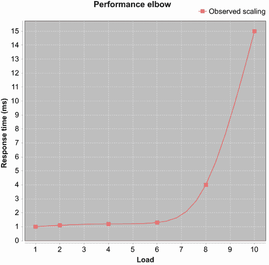

图 7.1 性能拐点

### 7.1.2 吞吐量

*吞吐量*是指系统在给定资源下在某个时间段内可以执行的工作单元数量。一个常见的引用数字是在某些参考平台（例如，具有指定硬件、操作系统和软件堆栈的特定品牌服务器）上的每秒事务数。

### 7.1.3 利用率

*利用率*表示可用于处理工作单元的资源百分比，而不是用于维护任务（或只是闲置）。人们通常会引用服务器的利用率，例如 10%。这指的是在正常处理时间内 CPU 处理工作单元的百分比。请注意，不同资源（如 CPU 和内存）的利用率水平之间的差异可能非常大。

### 7.1.4 效率

系统的*效率*等于吞吐量除以使用的资源。需要更多资源来产生相同吞吐量的系统效率较低。

例如，考虑比较两种聚类解决方案。如果方案 A 需要比方案 B 多两倍的服务器才能达到相同的吞吐量，那么它的效率只有一半。

记住，资源也可以从成本的角度来考虑——如果方案 A 的成本是方案 B 的两倍（或运行生产环境需要两倍的员工），那么它的效率只有一半。

### 7.1.5 容量

*容量*是指在任何时候可以通过系统传输的工作单元（如事务）的数量。也就是说，这是在指定延迟或吞吐量下可用的并发处理量。

### 7.1.6 可伸缩性

当向系统添加资源时，吞吐量（或延迟）将发生变化。这种吞吐量或延迟的变化是系统的*可伸缩性*。

如果方案 A 在服务器池中可用的服务器数量加倍时，其吞吐量也加倍，那么它以完美的线性方式扩展。在大多数情况下，完美线性扩展是非常、非常困难的——记住 Amdahl 定律。

你还应该注意，一个系统的可扩展性取决于许多因素，并且它不是恒定的。一个系统可以接近线性地扩展到某个点，然后开始严重退化。这是一种不同的性能拐点。

### 7.1.7 退化

如果你添加更多的工作单元，或者网络系统的客户端，而没有添加更多资源，你通常会看到观察到的延迟或吞吐量的变化。这种变化是在额外负载下系统退化的表现。

在正常情况下，退化将是负面的。也就是说，向系统中添加工作单元将导致性能下降（例如，导致处理延迟增加）。但在某些情况下，退化可能是正面的。例如，如果额外的负载导致系统的一部分超过阈值并切换到高性能模式，这可能会使系统工作得更有效率，并减少处理时间，尽管实际上还有更多的工作要做。JVM 是一个非常动态的运行时系统，其几个部分可能会对这种效果做出贡献。

前述术语是性能最常用的指标。其他指标偶尔也很重要，但这些是通常用于指导性能调整的基本系统统计指标。在下一节中，我们将阐述一种基于对这些数字的密切关注的做法，并尽可能地量化。

## 7.2 一种实用的性能分析方法

许多开发者在接近性能分析任务时，并没有一个清晰的关于通过分析想要实现什么目标的认识。当工作开始时，开发者或管理者通常只有一种模糊的感觉，即代码“应该运行得更快”。

但这是完全相反的。为了真正有效地进行性能调整，你应该在开始任何技术工作之前考虑一些关键领域。你应该知道以下事情：

+   你正在测量你代码的哪些可观察方面

+   如何衡量那些可观察量

+   可观察量的目标是什么

+   你将如何知道性能调整已经完成

+   性能调整的最大可接受成本（以开发者投入的时间和代码的额外复杂性来衡量）

+   优化时不应牺牲什么

最重要的是，正如我们将在本章中多次说到的，你必须进行测量。如果没有至少一个可观察量的测量，你就不在进行性能分析。

当你开始测量你的代码时，发现时间并没有花在你认为的地方，这也是非常常见的。缺少数据库索引或争用的文件系统锁可能是许多性能问题的根源。在考虑优化你的代码时，你应该始终记住，代码可能不是问题所在。为了量化问题的位置，你需要知道的第一件事是你正在测量什么。

### 7.2.1 了解你在测量什么

在性能调整中，你总是需要测量某些东西。如果你没有测量可观察的量，你就没有进行性能调整。坐着盯着你的代码，希望更快解决问题的方法会突然出现在你脑海中，这不是性能分析。

提示：要成为一名优秀的性能工程师，你应该了解诸如 *平均数、中位数、众数、方差、百分位数、标准差、样本大小* 和 *正态分布* 等术语。如果你不熟悉这些概念，你应该从快速网络搜索开始，并在需要时进行进一步阅读。Leonard Apeltsin 的 *数据科学 Bootcamp*（Manning，2021）的第五章是一个很好的起点。[`mng.bz/e7Oq`](http://mng.bz/e7Oq)。

在进行性能分析时，了解我们上节中描述的哪些可观察量对你来说很重要。你应该始终将你的测量、目标和结论与我们所介绍的一个或多个基本可观察量联系起来。以下是一些典型的可观察量，它们是性能调整的良好目标：

+   `handleRequest()` 方法运行的平均时间（在预热之后）

+   在 10 个并发客户端的情况下，系统端到端延迟的 90 分位数

+   当从 1 个增加到 1,000 个并发用户时，响应时间的下降

所有这些都代表了工程师可能想要测量和可能调整的量。为了获得准确和有用的数字，基本统计学知识是必不可少的。

知道你在测量什么，并对你所得到的数字的准确性有信心是第一步。但模糊或不明确的目标往往不会产生好的结果，性能调整也不例外。相反，你的性能目标应该是所谓的 SMART 目标（即 *具体、可衡量、达成共识、相关* 和 *时间限制*）。

### 7.2.2 了解如何进行测量

我们实际上只有以下两种方法来确定一个方法或其他 Java 代码运行的确切时间：

+   直接测量，通过在源类中插入测量代码来实现。

+   在类加载时转换要测量的类。

这两种方法分别被称为 *手动* 和 *自动* 仪器化。所有常用的性能测量技术都将依赖于其中一种（或两种）技术。

注意：还有 JVM 工具接口（JVMTI），它可以用来创建非常复杂的性能工具，但它也有一些缺点，尤其是它需要使用原生代码，这会影响使用它编写的工具的复杂性和安全性。

直接测量

直接测量是最容易理解的技术，但它也是侵入性的。在其最简单的形式中，它看起来像这样：

```
long t0 = System.currentTimeMillis();
methodToBeMeasured();
long t1 = System.currentTimeMillis();

long elapsed = t1 - t0;
System.out.println("methodToBeMeasured took "+ elapsed +" millis");
```

这将生成一条输出行，应该可以给出`methodToBeMeasured()`运行所需时间的毫秒级准确视图。不方便的是，像这样的代码必须添加到代码库的各个部分，随着测量数量的增加，避免被数据淹没变得越来越困难。

还存在其他问题——例如，如果`methodToBeMeasured()`的运行时间少于毫秒，会发生什么？正如我们将在本章后面看到的那样，还有冷启动效应需要担心：JIT 编译意味着方法的后续运行可能比早期运行更快。

还存在一些更微妙的问题：调用`currentTimeMillis()`需要调用本地方法和对系统时钟的系统调用。这不仅耗时，还可能从执行管道中清除代码，导致额外的性能下降，而这种下降在没有测量代码的情况下是不会发生的。

通过类加载进行自动插装

在第一章和第四章中，我们讨论了类是如何组装成执行程序的。其中经常被忽视的关键步骤之一是字节码在加载时的转换。这非常强大，并且它是 Java 平台许多现代技术的核心。

其中一个例子是方法的自动插装。在这种方法中，`methodToBeMeasured()`由一个特殊的类加载器加载，该类加载器在方法的开头和结尾添加字节码，以记录方法进入和退出的时间。这些时间通常写入共享数据结构，由其他线程访问。这些线程对数据进行操作，通常是将输出写入日志文件或联系基于网络的服务器，该服务器处理原始数据。

这种技术是许多专业级 Java 性能监控工具（如 New Relic）的核心，但填补相同空白且积极维护的开源工具却很少。随着 OpenTelemetry OSS 库和标准的兴起以及它们的 Java 自动插装子项目，这种状况可能正在改变。

注意：正如我们稍后将要讨论的，Java 方法最初是解释执行的，然后切换到编译模式。为了获得真正的性能数字，您必须丢弃在解释模式下生成的计时数据，因为这些数据可能会严重扭曲结果。稍后我们将更详细地讨论您如何知道方法何时切换到编译模式。

使用这两种技术之一，您可以为给定方法的执行速度生成数字。接下来的问题是，在调整完成后，您希望这些数字看起来是什么样子？

### 7.2.3 了解您的性能目标

没有什么比一个明确的目标更能集中注意力，因此了解要测量什么和了解并传达调整的最终目标同样重要。在大多数情况下，这应该是一个简单且精确陈述的目标，例如以下内容：

+   在 10 个并发用户的情况下，将 90%分位数的端到端延迟降低 20%

+   将`handleRequest()`的平均延迟降低 40%

在更复杂的情况下，目标可能是同时达到几个相关的性能目标。你应该意识到，你测量的和尝试调整的独立可观察量越多，性能练习可能变得越复杂。优化一个性能目标可能会对另一个目标产生负面影响。

有时候，在设定目标之前，比如让它们运行得更快，进行一些初步分析是必要的，比如确定哪些是重要的方法。这是可以的，但在初步探索之后，几乎总是最好在尝试实现它们之前停下来并明确你的目标。开发者经常会在不停止阐明他们的目标的情况下继续分析。

### 7.2.4 知道何时停止

理论上，知道何时停止优化很容易——当你达到你的目标时，你就完成了。然而，在实践中，很容易陷入性能调优的陷阱。如果一切顺利，继续努力做得更好的诱惑可能非常强烈。或者，如果你在努力达到目标时遇到困难，很难不尝试不同的策略来达到目标。

知道何时停止需要意识到你的目标，同时也需要有一种感觉，知道它们的价值。达到性能目标的 90%通常已经足够，工程师的时间可能更好地花在其他地方。

另一个重要的考虑因素是花费在很少使用的代码路径上的工作量。几乎总是浪费时间来优化只占程序运行时间 1%或更少的代码，但令人惊讶的是，许多开发者会参与这种行为。

这里有一套非常简单的指导原则，用于了解什么需要优化。你可能需要根据你的具体情况调整这些原则，但它们在许多情况下都适用：

+   优化重要的，而不是容易优化的。

+   首先击中最重要的（通常是调用最频繁的）方法。

+   遇到低垂的果实就摘取，但要注意代表这些代码的调用频率。

最后，再进行一轮测量。如果你没有达到性能目标，就要进行盘点。看看你离达到这些目标有多近，以及你所取得的进步是否对整体性能产生了预期的积极影响。

### 7.2.5 了解实现更高性能的成本

所有性能调整都有一个价格标签，如下所示：

+   这包括进行分析和开发改进所需的时间（而且值得记住，开发者时间的成本几乎总是任何软件项目中最高的开销）。

+   修复可能引入的额外技术复杂性。（也有性能改进可以简化代码，但它们并不是大多数情况。）

+   可能引入了额外的线程来执行辅助任务，以便允许主处理线程更快地运行，这些线程在更高负载下可能对整个系统产生不可预见的影响。

无论代价如何，都要注意它，并在完成一轮优化之前尝试确定它。

有时了解提高性能所能接受的最大成本是有帮助的。这可以设定为调整开发人员的时间限制，或者作为额外类或代码行的数量。例如，开发人员可以决定优化不应超过一周的时间，或者优化的类不应增长超过 100%（加倍其原始大小）。

### 7.2.6 了解过早优化的危险

关于优化的最著名引语之一来自 Donald Knuth（《使用 goto 语句的结构化编程》，《计算机评论》，6，第 4 期 [1974 年 12 月]）：

程序员在思考或担心程序非关键部分的运行速度上浪费了大量的时间，而这些试图提高效率的努力实际上有强烈的负面影响...过早优化是万恶之源。

这句话在社区中引起了广泛的讨论，在许多情况下，只有第二部分被记住。这有几个不幸的原因：

+   在引文的第一部分，Knuth 在隐晦地提醒我们需要测量，没有测量我们就无法确定程序的临界部分。

+   我们还需要再次记住，延迟可能不是由代码引起的——可能是环境中的其他东西。

+   在完整的引文中，很容易看出 Knuth 在谈论形成有意识、一致努力的优化。

+   简短的引文导致这句话被用作相当陈词滥调的借口，用于糟糕的设计或执行选择。

一些优化，特别是以下这些，实际上是良好风格的一部分：

+   不要分配你不需要的对象。

+   如果你永远不会需要它，就删除调试日志消息。

在下面的代码片段中，我们添加了一个检查，看看日志对象是否会处理调试日志消息。这种检查被称为*可记录性保护*。如果日志子系统没有为调试日志设置，则此代码永远不会构造日志消息，从而节省了调用`currentTimeMillis()`和用于日志消息的`StringBuilder`对象构造的成本：

```
if (log.isDebugEnabled()) {
  log.debug("Useless log at: "+ System.currentTimeMillis());
}
```

但如果调试日志消息确实毫无用处，我们可以通过完全删除代码来节省几个处理器周期（可记录性保护的成本）。这种成本微不足道，将在性能配置文件的其他部分的噪声中丢失，但如果它确实不是必需的，就将其删除。

性能调优的一个方面是首先编写好、性能良好的代码。更好地了解平台及其底层行为（例如，理解来自两个字符串连接的隐式对象分配）以及在编写代码时考虑性能方面，都会导致更好的代码。

我们现在有一些基本的词汇可以用来构建我们的性能问题和目标，以及如何解决问题的概述方法。但我们还没有解释为什么这是软件工程师的问题，以及这种需求是从何而来的。为了理解这一点，我们需要简要地深入到硬件的世界。

## 7.3 发生了什么问题？为什么我们必须关心？

在 2000 年中期之前的几年里，性能似乎并不是一个真正的问题。时钟速度在不断提高，似乎所有软件工程师需要做的只是等待几个月，改进的 CPU 速度就会给即使是写得不好的代码带来提升。

那么，事情为什么会变得如此糟糕？为什么时钟速度不再有太大的提升？更令人担忧的是，为什么一个 3 GHz 芯片的计算机似乎并不比一个 2 GHz 芯片的计算机快多少？这种软件工程师行业普遍关注性能的趋势是从何而来的？

在本节中，我们将讨论推动这一趋势的力量，以及为什么即使是纯粹的软件开发者也需要稍微关注一下硬件。我们将为本章剩余部分的主题设定舞台，并为您提供真正理解即时编译（JIT compilation）以及一些深入示例所需的概念。

你可能听说过“摩尔定律”这个词被广泛讨论。许多开发者都知道它与计算机速度提高的速率有关，但对细节并不清楚。让我们开始解释它确切的意思以及它可能在不久的将来结束的后果。

### 7.3.1 摩尔定律

摩尔定律是以英特尔创始人之一戈登·摩尔的名字命名的。以下是他的定律最常见的一种表述：*在经济上可生产的芯片上，晶体管的最大数量大约每两年翻一番。*

这条定律，实际上是对计算机处理器（CPU）趋势的观察，基于他在 1965 年撰写的一篇论文，他最初预测了 10 年——即直到 1975 年。它持续得如此之好，确实令人印象深刻。

在图 7.2 中，我们绘制了来自各个系列（主要是英特尔 x86 系列）的多个真实 CPU，从 1980 年到最新的（2021 年）苹果硅（图中的数据来自维基百科，略有编辑以增强清晰度）。该图显示了芯片的晶体管数量与其发布日期的关系。

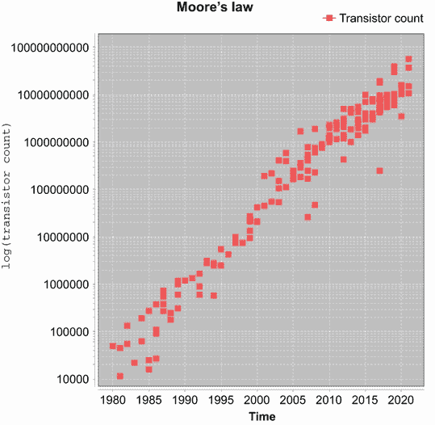

图 7.2 随时间变化的晶体管数量对数线性图

这是一个对数线性图，因此 *y* 轴上的每个增量是前一个的 10 倍。正如您所看到的，线条基本上是直的，大约需要六到七年才能跨越每个垂直级别。这证明了摩尔定律，因为用六到七年的时间增加十倍相当于大约每两年翻一番。

请记住，图中的 *y* 轴是对数刻度——这意味着 2005 年生产的主流英特尔芯片大约有 1 亿个晶体管。这是 1990 年生产的芯片的 *100 倍*。

重要的是要注意摩尔定律专门讨论的是晶体管数量。这是理解为什么摩尔定律本身不足以让软件工程师继续从硬件工程师那里获得免费午餐的基本点（参见 Herb Sutter，“The Free Lunch Is Over: A Fundamental Turn Toward Concurrency in Software，” *Dr. Dobb’s Journal* 30 (2005): 202–210）。

摩尔定律一直是过去的良好指南，但它是以晶体管数量来表述的，这并不是开发者应该从他们的代码中期望的性能的良好指南。正如我们将看到的，现实更加复杂。

注意晶体管数量并不等同于时钟速度，而且一个更高的时钟速度意味着更好的性能这种仍然普遍存在的想法也是一个过于简化的说法。

事实是，现实世界的性能取决于许多因素，所有这些因素都很重要。如果我们必须只选择一个，那么它将是：与后续指令相关的数据能够多快地定位？这是一个对性能至关重要的概念，我们应该深入探讨它。

### 7.3.2 理解内存延迟层次结构

计算机处理器需要数据来工作。如果要处理的数据不可用，那么 CPU 循环的速度有多快都没有关系——它只能等待，执行无操作 (NOP) 并基本上停滞，直到数据可用。

这意味着在处理延迟时，最基本的问题有两个，“CPU 核心需要工作的数据最近副本在哪里？”以及“到达核心可以使用数据的地方需要多长时间？”以下是一些主要可能性（在所谓的 *冯·诺依曼架构* 中，这是最常用的形式）：

+   *寄存器*—位于 CPU 上并准备立即使用的内存位置。这是指令直接操作的内存部分。

+   *主存储器*—通常是 DRAM。访问时间大约为 50 纳秒（但请参阅后面的细节，了解处理器缓存如何用于避免这种延迟）。

+   *固态硬盘 (SSD)*—访问这些磁盘需要 0.1 毫秒或更少的时间，但它们通常比传统硬盘更贵。

+   *硬盘*—访问磁盘并将所需数据加载到主存储器大约需要 5 毫秒。

摩尔定律描述了晶体管数量的指数增长，这也使内存受益——内存访问速度也呈指数增长。但这两个指数并不相同。内存速度的提高速度比 CPU 增加晶体管的速度慢，这意味着处理核心可能会因为缺乏处理所需的相关数据而闲置。

为了解决这个问题，在寄存器和主存储器之间引入了缓存——这是一种更快的内存（SRAM，而不是 DRAM）的小量。这种内存比 DRAM 在金钱和晶体管预算上都贵得多，这也是为什么计算机不会简单地使用 SRAM 作为它们整个内存的原因。

缓存被称为 L1 和 L2（一些机器也有 L3），数字表示缓存在物理上离核心有多近（更近的缓存会更快）。我们将在第 7.6 节（关于即时编译）中更多地讨论缓存，并展示一个关于 L1 缓存对运行代码的重要性示例。图 7.3 显示了 L1 和 L2 缓存比主存储器快多少。

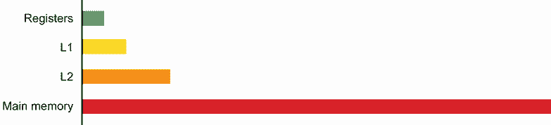

图 7.3 寄存器、处理器缓存和主存储器的相对访问时间（以时钟周期计）

除了添加缓存之外，20 世纪 90 年代和 21 世纪初广泛使用的一种技术是添加越来越复杂的处理器特性，试图克服内存的延迟。复杂的硬件技术，如指令级并行性（ILP）和芯片多线程（CMT），被用来试图保持 CPU 在数据上运行，即使在 CPU 能力和内存延迟之间的差距不断扩大的情况下。

这些技术最终消耗了 CPU 晶体管预算的大部分，它们对实际性能的影响是递减的。这种趋势导致了这样一个观点：CPU 设计的未来在于具有多个（或许多）核心的芯片。现代处理器基本上都是多核的——事实上，这是摩尔定律的二级后果之一：核心数量增加是为了利用可用的晶体管。

性能的未来与并发性紧密相连——一个系统可以使其整体性能更优的主要方法之一是利用更多的核心。这样，即使一个核心在等待数据，其他核心仍然可能继续进步（但请记住第五章中介绍的 Amdahl 定律的影响）。这种联系非常重要，所以我们再次强调：

+   实际上，几乎所有现代 CPU 都是多核的。

+   性能和并发性是紧密相连的。

我们只是触及了与软件和 Java 编程相关的计算机体系结构世界的表面。对了解更多信息感兴趣的读者应查阅专业文本，例如 Hennessy 等人所著的《计算机体系结构：定量方法》第 6 版（Morgan Kaufmann，2017 年 12 月）。

这些硬件问题并不特定于 Java 程序员，但 JVM 的托管特性引入了一些额外的复杂性。让我们继续前进，在下一节中查看这些内容。

## 7.4 为什么 Java 性能调优如此困难？

在 JVM（或实际上任何其他托管运行时）上进行的性能调优，本质上比未托管的代码要困难得多。在托管系统中，整个目的就是让运行时对环境进行一些控制，这样开发者就不必处理每个细节。这使得程序员在整体上更加高效，但也意味着必须放弃一些控制权。

这种重点的转移使得整个系统更难以推理，因为对开发者来说，托管运行时是一个不透明的盒子。另一种选择是放弃托管运行时带来的所有优势，迫使 C/C++等语言的程序员几乎一切都要自己来做。在这种情况下，操作系统只提供最基本的服务，例如基本的线程调度，这通常比额外的性能调优所需的努力要高得多。

Java 平台中一些最重要的方面，这些方面使得调优变得困难，包括：

+   线程调度

+   垃圾收集（GC）

+   即时编译（JIT）

这些方面可以以微妙的方式相互作用。例如，编译子系统使用计时器来决定编译哪些方法。候选方法集可能会受到诸如调度和 GC 等关注点的影响。编译的方法可能会在每次运行中有所不同。

正如你在本节中看到的，准确测量是性能分析决策过程的关键。因此，如果你想要认真进行性能调优，了解 Java 平台中时间处理的细节（以及局限性）非常有用。

### 7.4.1 时间在性能调优中的作用

性能调优需要你理解如何解释代码执行期间记录的测量结果，这意味着你还需要理解平台任何时间测量固有的局限性。

精度

时间量通常以某个尺度上的最近单位来报价。这被称为测量的*精度*。例如，时间通常测量到毫秒精度。如果重复测量给出围绕相同值的狭窄分布，则计时是精确的。

精度是给定测量中包含的随机噪声量的度量。我们将假设对特定代码片段的测量是正态分布的。在这种情况下，报价精度的常见方式是报价 95%置信区间的宽度。

准确性

测量的*准确性*（在我们的案例中，是时间）是获得接近真实值的能力。实际上，您通常不会知道真实值，因此准确性可能比精度更难确定。

准确性衡量测量中的系统误差。可能存在准确但不太精确的测量（因此基本读数是正确的，但存在随机环境噪声）。也可能存在精确但并不准确的结果。

理解测量

一个以纳秒精度表示的 5945 ns 间隔，来自精度为 1 *μ*s 的计时器，实际上可能在 3945–7945 ns 之间（95%的概率）。警惕那些看似过于精确的性能数字；始终检查测量的精度和准确性。

粒度

系统的真正*粒度*是最快计时器的频率——可能是中断计时器，在 10 ns 范围内。这有时被称为*可区分性*，即两个事件之间可以肯定地说它们“接近但不同时”的最短间隔。

随着我们通过操作系统、JVM 和库代码的各个层次前进，这些极其短时间的分辨率基本上变得不可能。在大多数情况下，这些非常短的时间对于应用程序开发者来说是不可用的。

网络分布式计时

我们关于性能调整的大部分讨论集中在所有处理都在单个主机上进行的系统。但您应该意识到，在跨网络的系统进行性能调整时，可能会出现一些特殊问题。网络同步和计时远非易事，不仅限于互联网——甚至以太网网络也会出现这些问题。

对网络分布式计时的全面讨论超出了本书的范围，但您应该知道，通常情况下，对于跨越多个盒子的工作流程，很难获得准确的计时。此外，即使是标准协议如 NTP 也可能对于高精度工作来说不够准确。

让我们回顾一下关于 Java 计时系统的最重要几点：

+   大多数系统内部都有几个不同的时钟。

+   毫秒级的计时是安全可靠的。

+   高精度时间需要谨慎处理，以避免漂移。

+   您需要意识到计时测量的精度和准确性。

在我们继续讨论垃圾回收之前，让我们看看我们之前提到的一个例子——内存缓存对代码性能的影响。

### 7.4.2 理解缓存未命中

对于许多高吞吐量的代码片段，降低性能的主要因素之一是执行应用程序代码时涉及的 L1 缓存未命中次数。列表 7.1 遍历一个 2MiB 数组，并打印执行两个循环之一所需的时间。第一个循环在`int[]`的每个 16 个条目中增加 1。几乎总是有 64 字节在一个 L1 缓存行中（Java 的`int`是 4 字节宽），这意味着只接触每个缓存行一次。

注意，在您能够获得准确结果之前，我们需要预热代码，这样 JVM 就会编译您感兴趣的方法。我们将在本章后面更详细地讨论 JIT 预热。

列表 7.1 理解缓存未命中

```
public class Caching {
    private final int ARR_SIZE = 2 * 1024 * 1024;
    private final int[] testData = new int[ARR_SIZE];

    private void touchEveryItem() {
        for (int i = 0; i < testData.length; i = i + 1) {
            testData[i] = testData[i] + 1;                    ❶
        }
    }

    private void touchEveryLine() {
        for (int i = 0; i < testData.length; i = i + 16) {
            testData[i] = testData[i] + 1;                    ❷
        }
    }

    private void run() {
        for (int i = 0; i < 10_000; i = i + 1) {              ❸
            touchEveryLine();
            touchEveryItem();
        }
        System.out.println("Line     Item");
        for (int i = 0; i < 100; i = i + 1) {
            long t0 = System.nanoTime();
            touchEveryLine();
            long t1 = System.nanoTime();
            touchEveryItem();
            long t2 = System.nanoTime();
            long el1 = t1 - t0;
            long el2 = t2 - t1;
            System.out.println("Line: "+ el1 +" ns ; Item: "+ el2);
        }
    }

    public static void main(String[] args) {
        Caching c = new Caching();
        c.run();
    }
}
```

❶ 涉及每个项目

❷ 涉及每个缓存行

❸ 预热代码

第二个函数`touchEveryItem()`增加数组中的每个字节，所以它比`touchEveryLine()`多做 16 倍的工作。但是，这里有一些来自典型笔记本电脑的样本结果：

```
Line: 487481 ns ; Item: 452421
Line: 425039 ns ; Item: 428397
Line: 415447 ns ; Item: 395332
Line: 372815 ns ; Item: 397519
Line: 366305 ns ; Item: 375376
Line: 332249 ns ; Item: 330512
```

这段代码的结果表明`touchEveryItem()`的运行时间并不比`touchEveryLine()`长 16 倍。是内存传输时间——从主内存到 CPU 缓存的加载——主导了整体性能轮廓。`touchEveryLine()`和`touchEveryItem()`有相同数量的缓存行读取，数据传输时间远远超过了实际修改数据所花费的周期。

注意：这证明了关键点：我们需要至少有一个工作理解（或心理模型）来了解 CPU 实际上是如何花费它的时间的。

我们接下来要讨论的是平台垃圾回收子系统的讨论。这是性能图中最重要的部分之一，它有可调整的部分，对于进行性能分析的开发者来说可能是非常重要的工具。

## 7.5 垃圾回收

自动内存管理是 Java 平台最重要的部分之一。在 Java 和.NET 等托管平台之前，开发者可以预期在他们的职业生涯中花费相当一部分时间来追踪由不完善的内存处理引起的错误。

然而，近年来，自动分配技术已经变得如此先进和可靠，以至于它们已经成为基础设施的一部分——大量的 Java 开发者对平台内存管理功能的工作原理、开发者可用的选项以及如何在框架约束内进行优化一无所知。

这标志着 Java 方法取得了多么大的成功。大多数开发者不知道内存和 GC 系统的细节，因为他们通常根本不需要知道。JVM 可以很好地处理大多数应用程序的内存，无需任何特殊调整。

那么，当你处于需要调整的情况时，你能做什么呢？首先，你需要了解 JVM 实际上是如何为您管理内存的。因此，在本节中，我们将介绍基本理论，包括

+   运行 Java 进程时的内存处理方式

+   标记-清除收集的基础

+   自 Java 9 以来，垃圾收集器（Garbage First，G1）一直是 Java 的默认收集器

让我们从基础知识开始。

### 7.5.1 基础知识

标准的 Java 进程既有栈也有堆。*栈* 是存储局部变量的地方。直接存储原始值的局部变量将原始值存储在栈中。

注意：原始值持有将被根据其类型解释的位模式，因此这两个字节 `00000000 01100001` 如果类型是 `char`，将被解释为 `a`；如果类型是 `short`，将被解释为 97。

另一方面，引用类型的局部变量将指向 Java 的 *堆* 中的一个位置，这是对象实际创建的地方。图 7.4 展示了各种类型变量存储的位置。

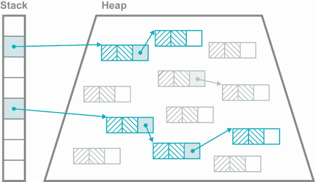

图 7.4 栈和堆中的变量

注意，对象的原始字段仍然在堆内的地址分配。随着 Java 程序的运行，会在堆中创建新的对象，对象之间的关系会发生变化（因为字段被更新）。最终，堆将没有足够的空间来创建新的对象。然而，许多已经创建的对象将不再需要（例如，在一个方法中创建但未传递给任何其他方法或返回给调用者的临时对象）。

因此，堆中的空间可以被回收，程序可以继续运行。平台通过恢复和重用不再由应用程序代码使用的堆内存的机制被称为 *垃圾收集*。

### 7.5.2 标记和清除

一个简单的垃圾收集算法的绝佳例子是 *标记和清除*，实际上，它是第一个被开发的（在 1965 年发布的 LISP 1.5 中）。

注意：其他自动内存管理技术存在，例如 Perl 等语言使用的引用计数方法，它们可能更简单（至少表面上），但它们实际上并不是垃圾收集（如 Guy L. Steele 在“Multiprocessing Compactifying Garbage Collection”*ACM 通讯* 18, no. 9 [1975 年 9 月] 中所述）。

标记-清除算法在其最简单形式下，会暂停所有正在运行的程序线程，并从已知为“活动”的对象集合开始——这些对象在任何用户线程的任何栈帧（无论该引用是局部变量、方法参数、临时变量还是一些更罕见的情况）中都有一个引用。然后，它遍历从活动对象开始的引用树，标记沿途找到的任何对象为活动状态。当这一过程完成后，剩下的所有东西都是垃圾，可以被收集（清除）。请注意，清除的内存返回给 JVM，而不是返回给操作系统。

那非确定性暂停怎么办？

对 Java（以及.NET 等其他环境）的批评之一是，标记-清除形式的垃圾回收不可避免地会导致“停止世界”（通常称为 STW）。在这些状态下，所有用户线程必须短暂停止，这会导致持续一段时间的不确定暂停。

这个问题通常被夸大了。对于服务器软件来说，很少有应用程序需要关心现代 Java 版本垃圾收集器显示的暂停时间。例如，在 Java 11 及以上版本中，默认的垃圾收集器是一个并发收集器，它的大部分工作与应用程序线程并行进行，并最小化暂停时间。

注意：开发者有时会想出复杂的方案来避免暂停，或者完全收集内存。在几乎所有情况下，都应该避免这些方案，因为它们通常弊大于利。

Java 平台为基本的标记-清除（mark-and-sweep）方法提供了一系列增强。其中最简单的一种是添加了*代际垃圾回收（generational GC）*。在这种方法中，堆（heap）不是一个统一的内存区域——堆内存的多个不同区域参与 Java 对象的整个生命周期。

根据对象的寿命长短，它们在收集过程中可以从一个区域移动到另一个区域。在对象的整个生命周期中，对其的引用可以指向几个不同的内存区域（如图 7.5 所示）。

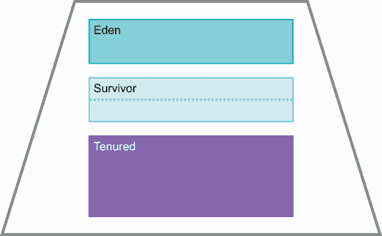

图 7.5 内存区域

这种安排（以及对象的移动）的原因是，对运行系统的分析表明，对象要么寿命短暂，要么非常长寿。堆内存的不同区域被设计成允许平台利用这一特性，通过将长寿对象与其他对象分开。

请注意，图 7.5 是一个简单的堆示意图，旨在说明代际区域的概念。真实 Java 堆的现实情况要复杂一些，这取决于所使用的收集器，我们将在本章后面解释。

### 7.5.3 内存区域

JVM 在对象自然生命周期期间使用以下不同的内存区域来存储对象：

+   *伊甸园（Eden）*—伊甸园是堆中所有对象最初分配的区域，对于许多对象来说，这将是它们唯一驻留的内存部分。

+   *幸存者*—这些空间是那些在垃圾回收周期中幸存下来的对象（因此得名）被移动的地方。最初，它们是从伊甸园（Eden）移动过来的，但在随后的垃圾回收（GC）过程中，它们也可能在幸存者空间之间移动。

+   *持久代（Tenured）*—持久代（也称为老年代）是那些被认为“足够老”的幸存对象被移动到的区域（逃离幸存者空间）。在年轻代收集期间不会收集持久代内存。

正如所提到的，这些内存区域也以不同的方式参与收集。例如，幸存者空间实际上是一个通用的捕获机制，以便在收集之前立即创建的短生命期对象能够得到适当的处理。

如果没有幸存者空间，那么非常新创建的（但短生命期的）对象会被 GC 标记为“活着的”，并提升到 Tenured。然后它们会立即死亡，但会继续占用 Tenured 空间，直到下一次它被收集。下一次收集也会因为实际上短生命期对象的错误提升而比必要的更早发生。从理论角度来看，代假设也引导我们想到有两种类型的收集：年轻和完整。

### 7.5.4 年轻集合

一个 *年轻集合* 尝试清除“年轻”空间（伊甸园和幸存者）。这个过程相对简单，如下所述：

+   在标记阶段发现的全部活着的对象都会被移动。

+   足够老的（那些在足够的 GC 运行中存活下来的）对象会进入 Tenured。

+   所有其他年轻、活着的对象都会进入一个空的幸存者空间。

+   最后，伊甸园和任何最近被清空的幸存者空间都准备好被覆盖和重用，因为它们除了垃圾什么都没有。

当伊甸园满时，会触发一个年轻集合。请注意，标记阶段必须遍历整个活着的对象图。如果一个年轻对象引用了一个 Tenured 对象，那么 Tenured 对象持有的引用也必须被扫描和标记。否则，可能会出现 Tenured 对象持有对伊甸园中对象的引用，但没有其他任何东西持有该引用。如果标记阶段没有完全遍历，这个伊甸园对象将永远不会被看到，并且不会被正确处理。在实践中，一些性能优化（例如 *卡片表*）被用来减少全标记遍历可能的高成本。

### 7.5.5 完整集合

当一个年轻集合无法将对象提升为 Tenured（由于空间不足）时，会触发一个完整集合。根据所使用的收集器，这可能会涉及在旧代内部移动对象。这样做是为了确保旧代有足够的空间在必要时分配一个大对象。这被称为 *压缩*。

### 7.5.6 安全点

垃圾收集不能在没有至少短暂暂停所有应用程序线程的情况下进行。然而，线程不能在任何任意时间停止以进行 GC，因为应用程序代码可以修改堆的内容。相反，在特定的时间点，JVM 可以确保堆处于一致状态，GC 可以发生——这些被称为 *安全点*。

safepoint 的一个简单例子是“字节码指令之间”。JVM 解释器一次执行一个字节码，然后循环从流中获取下一个字节码。在循环之前，那个解释器线程必须完成对堆的任何修改（例如，来自`putfield`的修改），所以如果线程在那里停止，它就是“安全的”。一旦所有应用程序线程达到 safepoint，垃圾收集就可以进行。

这是一个简单的 safepoint 示例，但还有其他示例。关于 safepoint 的更完整讨论，以及它们如何影响某些 JIT 编译器技术，可以在这里找到：[`mng.bz/Oo8a`](http://mng.bz/Oo8a)。让我们从理论讨论转向实际，了解 JVM 中的垃圾收集算法。

### 7.5.7 G1: Java 的默认收集器

G1 是 Java 平台的一个相对较新的收集器。它在 Java 8u40 时达到生产质量，并在 Java 9（2017 年）中被设置为默认收集器。它最初被设计为一个*低暂停*收集器，但在实践中已经发展成为一个通用收集器（因此成为默认状态）。

它不仅是一个代垃圾收集器，而且它是区域化的，这意味着 G1 Java 堆将堆分成大小相等的区域（例如，每个 1、2 或 4MB）。代仍然存在，但现在它们在内存中不再一定是连续的。堆中大小相等的区域的新排列如图 7.6 所示。

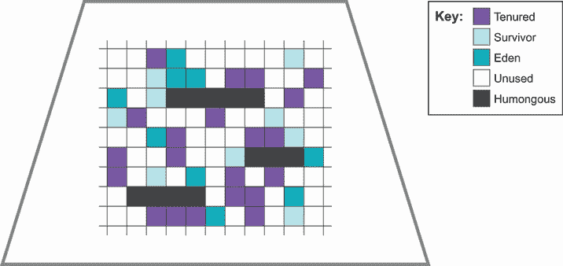

图 7.6 G1 如何划分堆

为了支持 GC 暂停的可预测性，引入了区域化。较老的收集器（如并行收集器）存在一个问题，一旦 GC 周期开始，它就需要运行到完成，不管这需要多长时间（即，它们是“全有或全无”的）。

G1 提供了一种收集策略，它不会导致较大堆的暂停时间更长。它被设计用来避免全有或全无的行为，而关键概念之一是*暂停目标*。这是程序在恢复执行之前可以暂停 GC 的时间长度。G1 会尽其所能，在合理范围内达到您的暂停目标。在暂停期间，幸存对象会被迁移到另一个区域（例如，将 Eden 对象移动到幸存空间），然后该区域被放置回空区域的*自由列表*。

G1 中的年轻收集是完全 STW（Stop-The-World）的，并且会运行到完成。这避免了收集线程和分配线程之间的竞争条件（如果年轻收集与应用程序线程并发运行，可能会发生这种情况）。

注意：代假设是，在年轻收集期间遇到的仅有一小部分对象仍然存活。因此，年轻收集所需的时间应该非常小，远小于暂停目标。

旧对象的集合与年轻集合具有不同的特性——首先，因为一旦对象达到旧代，它们往往能存活相当长的时间。其次，为旧代提供的空间往往比年轻代大得多。

G1 会跟踪移动到旧代的对象，当足够的老空间被填满（由`InitiatingHeapOccupancyPercent`或 IHOP 控制，默认为 45%）时，就会启动旧代收集。这是一个*并发*收集，因为它尽可能地与应用程序线程并发运行。

这个旧代收集的第一部分是一个并发标记阶段。这是基于 1978 年由迪杰斯特拉和兰波特首次描述的算法（见[`dl.acm.org/doi/10.1145/359642.359655`](https://dl.acm.org/doi/10.1145/359642.359655)）。一旦完成，就会立即触发年轻代收集。随后是一个*混合收集*，它根据区域中垃圾的数量（可以从并发标记期间收集的统计数据中推断出来）来收集旧区域。旧区域中幸存的对象会被疏散到新的旧区域（并进行压缩）。

G1 收集策略的性质还允许平台收集有关单个区域收集所需时间（平均）的统计数据。这就是暂停目标是如何实现的——G1 将只收集它有时间收集的区域（尽管如果最后一个区域收集时间比预期长，可能会出现超时）。

有可能整个旧代的收集无法在一个 GC 周期内完成。在这种情况下，G1 只收集一组区域，然后完成收集，释放用于 GC 的 CPU 核心。只要在一段持续的时间内，长生命对象的创建不会超过 GC 回收它们的能力，一切应该都会顺利。

在分配超过回收持续一段时间的情况下，作为最后的努力，GC 将执行 STW 完整收集，并完全清理和压缩旧代。在实践中，除非应用程序处于严重困境，否则这种行为是不会看到的。

另有一点值得提及：可以分配比单个区域更大的对象。在实践中，这意味着一个大数组（通常是字节或其他原始数据类型）。

注意：理论上可以人为构造一个具有如此多字段，以至于单个对象实例大于 1 MB 的类，但在实际、真实的系统中，这种情况永远不会发生。

这样的对象需要一个特殊类型的区域——一个*巨型区域*。这些区域需要 GC 的特殊处理，因为为大数组分配的空间在内存中必须是连续的。如果足够的空闲区域相邻，它们可以被转换成一个单一的巨型区域，数组就可以被分配。

如果内存中没有地方可以分配数组（甚至在年轻代收集之后），那么内存就被说成是*碎片化*的。GC 必须执行完全 STW 和压缩收集，以尝试为分配腾出足够的空间。

G1 被确立为在广泛的负载和应用类型中非常有效的收集器。然而，对于某些工作负载（例如，需要纯吞吐量或仍在运行 Java 8 的工作负载），另一个收集器，如并行收集器，可能是有用的。

### 7.5.8 并行收集器

并行收集器在 Java 8 之前是默认的，并且今天仍然可以用作 G1 的替代选择。Parallel 这个名字需要一点解释，因为*并发*和*并行*都用来描述 GC 算法的特性。它们听起来好像应该意味着相同的事情，但实际上它们有两个完全不同的含义，如以下所述：

+   *并发*——GC 线程可以与应用程序线程同时运行。

+   *并行*——GC 算法是多线程的，可以使用多个核心。

这些术语在没有任何方式上是等效的。相反，最好将它们视为两个其他 GC 术语的对立面——*并发*是 STW 的对立面，*并行*是*单线程*的对立面。

在某些收集器（包括并行收集器）中，堆不是区域化的。相反，代是连续的内存区域，可以根据需要增长和缩小。在这种堆配置中，有两个幸存空间。它们有时被称为*From*和*To*，除非正在进行收集，否则其中一个幸存空间总是空的。

注意：Java 的非常早期版本中有一个名为*PermGen*（或永久生成）的空间。这是为 JVM 的内部结构分配内存的地方，例如类和方法定义。PermGen 在 Java 8 中被移除，所以如果你发现任何提及它的资源，那么它们很可能是旧的并且可能已经过时。

并行收集器是一个非常高效的收集器——在主流 Java 中效率最高的一个——但它也有一个缺点：它没有真正的暂停目标能力，并且旧收集（STW）必须运行完成，不管需要多长时间。

一些开发者有时会询问关于 GC 算法的复杂度（即“大 O”）行为的问题。然而，这实际上并不是一个有用的问题。GC 算法非常通用，并且它们需要在整个可能的负载范围内表现出可接受的行为。仅仅关注它们的渐近行为并不是非常有用，而且绝对不是它们一般情况性能的合适代理。

垃圾回收总是关于权衡，G1 做出的权衡对大多数工作负载来说非常好（好到许多开发者可以完全忽略它们）。然而，权衡总是存在的，无论开发者是否意识到它们。有些应用程序不能忽略权衡，必须选择关注 GC 子系统的细节，无论是通过更改收集算法还是通过调整 GC 参数来微调。

### 7.5.9 GC 配置参数

JVM 随带了大量有用的参数（至少有一百个），可以用来定制 JVM 运行行为的许多方面。在本节中，我们将讨论一些与垃圾收集相关的基本开关。

如果一个开关以 `-X:` 开头，它是不标准的，可能无法跨 JVM 实现移植（例如 HotSpot 或 Eclipse OpenJ9）。如果它以 `-XX:` 开头，它是一个扩展开关，不建议用于日常使用。许多与性能相关的开关都是扩展开关。

一些开关在效果上是布尔值，并在前面带有 + 或 - 来打开或关闭。其他开关需要参数，例如 `-XX:CompileThreshold=20000`（这将设置方法需要被调用多少次才被认为是 JIT 编译的次数为 20000）。表 7.1 列出了基本的 GC 开关，并显示了开关的默认值（如果有）。

表 7.1 基本垃圾收集开关

| 开关 | 影响 |
| --- | --- |
| -Xms<size in MB>m | 堆的初始大小（默认为物理内存的 1/64） |
| -Xmx<size in MB>m | 堆的最大大小（默认为物理内存的 1/4） |
| -Xmn<size in MB>m | 堆中年轻代的大小 |
| -XX: `-DisableExplicitGC` | 防止对 `System.gc()` 的调用产生任何效果 |

一个不幸但常见的技巧是将 `-Xms` 的大小设置为与 `-Xmx` 相同。这意味着进程将以确切的堆大小运行，并且在执行期间不会调整大小。表面上，这似乎是有道理的，并且给开发者一种控制的错觉。然而，在实践中，这种方法是一种反模式。现代 GC 具有良好的动态大小算法，人工限制它们几乎总是弊大于利。

注意：在 2022 年，对于大多数工作负载，如果没有其他证据，最佳实践是设置 `Xmx` 而不设置 `Xms`。

还值得注意的是 JVM 在容器中的行为。对于 Java 11 和 17，“物理内存”意味着容器限制，因此堆的最大大小必须适合任何容器限制，并留有非 Java 堆内存和 JVM 以外的任何其他进程的空间。Java 8 的早期版本不一定尊重容器限制，因此建议始终升级到 Java 11，如果您在容器中运行应用程序。对于 G1 收集器，在调整练习期间可能还有两个其他设置可能有用——它们在表 7.2 中显示。

表 7.2 G1 收集器的标志

| 开关 | 影响 |
| --- | --- |
| -XX:MaxGCPauseMillis=50 | 告诉 G1 在一次收集期间尝试暂停不超过 50 毫秒 |
| -XX:GCPauseIntervalMillis=200 | 告诉 G1 在收集之间至少运行 200 毫秒 |

这些开关可以组合使用，例如，将最大暂停目标设置为 50 毫秒，暂停间隔不小于 200 毫秒。当然，GC 系统可以施加的压力是有限的。必须有一定的暂停时间来清理垃圾。每 100 年暂停 1 毫秒的目标显然是无法实现或被尊重的。

在下一节中，我们将探讨 JIT 编译。对于许多程序来说，这是产生高性能代码的主要贡献因素之一。我们将探讨 JIT 编译的一些基本知识，并在本节结束时解释如何开启 JIT 编译的日志记录，以便您知道哪些方法正在被编译。

## 7.6 HotSpot 的 JIT 编译

正如我们在第一章中讨论的，Java 平台最好被看作是“动态编译”的。一些应用程序和框架类在运行时进行进一步编译，以将它们转换为可以直接执行的机器代码。

这个过程被称为*即时（JIT）编译*，或简称 JITing，它通常一次只针对一个方法。理解这个过程通常是识别任何大型代码库重要部分的关键。

让我们看看关于 JIT 编译的一些基本事实：

+   几乎所有现代 JVM 都将拥有某种类型的 JIT 编译器。

+   与纯解释型 JVM 相比，速度非常慢。

+   编译方法比解释代码运行得快得多。

+   首先编译最频繁使用的方法是有意义的。

+   在进行即时编译（JIT）时，首先抓住低垂的果实总是很重要的。

这最后一点意味着我们应该首先查看编译后的代码，因为在正常情况下，任何仍然处于解释状态的方法都没有像编译过的那些方法运行得频繁。（偶尔一个方法会失败编译，但这非常罕见。）

方法最初是从它们的字节码表示形式进行解释的，JVM 会跟踪一个方法被调用的次数（以及一些其他统计数据）。当达到阈值值时，如果方法符合条件，JVM 线程将在后台将字节码编译成机器代码。如果编译成功，所有后续对该方法的调用都将使用编译后的形式，除非发生某些情况使其无效或导致去优化。

根据方法中代码的确切性质，编译后的方法可能比解释模式下的相同方法快得多。有时会给出“最多快 100 倍”的数字，但这只是一个非常粗略的经验法则。即时编译的本质会极大地改变执行代码，任何单一数字都是误导性的。理解程序中哪些方法是重要的，以及哪些重要的方法正在被编译，通常是提高性能的主要技术之一。

### 7.6.1 为什么要有动态编译？

有时会被问到的问题之一是，为什么 Java 平台要费心进行动态编译？为什么不像 C++那样在编译前完成所有编译？第一个答案通常是，拥有平台无关的工件（.jar 和.class 文件）作为部署的基本单元，比尝试处理每个目标平台的不同编译二进制文件要少很多麻烦。

另一个替代方案，并且更加雄心勃勃的答案是，使用动态编译的语言（如 Java）有更多的信息可供编译器使用。具体来说，AOT 编译的语言无法访问任何运行时信息，例如某些指令的可用性或其他硬件细节，或代码运行的任何统计数据。这开启了一个引人入胜的可能性，即动态编译的语言（如 Java）实际上可能比 AOT 编译的语言运行得更快。

注意：直接、AOT（Ahead-of-Time）编译 Java 字节码到机器代码（也称为“静态 Java”）是 Java 社区中的一个活跃研究领域，但不幸的是，它超出了本书的范围。

在本节关于 JIT 机制的其他讨论中，我们将具体讨论名为 HotSpot 的 JVM。许多一般性讨论将适用于其他虚拟机（VM），但具体细节可能会有很大差异。

我们将首先介绍随 HotSpot 一起提供的不同即时（JIT）编译器，然后解释 HotSpot 提供的两种最强大的优化——*内联*和*单态分发*。我们将通过展示如何开启方法编译的日志记录来结束本节，这样您就可以看到哪些方法正在被编译。让我们从介绍 HotSpot 开始。

### 7.6.2 热点（HotSpot）简介

HotSpot 是 Oracle 在收购 Sun Microsystems 时获得的 JVM（它已经拥有一个名为 JRockit 的 JVM，最初由 BEA Systems 开发）。HotSpot 是构成 OpenJDK 基础的 JVM。它能够在两种不同的模式下运行：客户端和服务器端。

在过去，可以通过在启动 JVM 时指定`-client`或`-server`开关来选择模式。每种模式都有不同的应用场景，可以根据需要选择。

C1（也称为客户端编译器）

C1 编译器最初是为了在 GUI 应用程序中使用而设计的。这是一个重视操作一致性的领域，因此 C1（有时称为*客户端编译器*）在编译时倾向于做出更保守的决定。它不能在撤销一个证明是错误的或基于错误假设的优化决策时意外地暂停。它的编译阈值相当低——一个方法必须执行 1500 次才能有资格进行编译——因此它的预热期相对较短。

C2（又称服务器编译器）

相比之下，*服务器编译器*（C2）在编译时做出大胆的假设。为了确保运行的代码始终正确，C2 添加了一个快速的运行时检查（通常称为*保护条件*），以验证它所做的假设是否有效。如果不是，它会撤销大胆的编译，并经常尝试其他方法。这种大胆的方法可以带来比相对风险规避的客户端编译器更好的性能。

C2 的内联阈值比 C1 高得多。默认情况下，一个方法必须达到 10,000 次调用才有资格进行 C2 编译，这意味着更长的预热时间。

实时 Java

从历史上看，开发了一种称为实时 Java 的 Java 形式，一些开发者想知道为什么需要高性能的代码不简单地使用这个平台（这是一个独立的 JVM，而不是 HotSpot 选项）。答案是，尽管有普遍的误解，实时系统并不一定是最快的系统。

实时编程实际上关于可以做出的保证。从统计学的角度来看，实时系统寻求减少执行某些操作所需时间的方差，并准备为此牺牲一定量的平均延迟。为了达到更一致的运行，整体性能可能会略有牺牲。寻求更高性能的团队通常在寻求更低的平均延迟，即使这意味着更高的方差，因此服务器编译器的大胆优化特别适合。

在现代 JVM 中，客户端和服务器编译器都得到使用——客户端编译器在早期使用，而高级服务器类优化在应用程序预热后使用。这种双重使用被称为*分层编译*。我们接下来要讨论的是所有 JIT 编译器广泛使用的一个主题。

### 7.6.3 内联方法

内联是 HotSpot 拥有的最强大的技术之一。它通过消除对内联方法的调用，并将被调用方法的代码放置在调用者内部来实现。

平台的一个优点是编译器可以根据关于方法调用频率和其他因素的合理运行时统计数据来决定是否内联（例如，这会使调用方法变得过大并可能影响代码缓存）。HotSpot 的编译器在决定内联方面比即时编译器能做出更明智的决定。

访问器方法怎么办？

一些开发者错误地认为，访问器方法（一个公共获取器访问私有成员变量）不能被 HotSpot 内联。他们的理由是，因为变量是私有的，方法调用不能被优化掉，因为对它的访问在类外是被禁止的。这是不正确的。

HotSpot 可以在编译方法到机器代码时忽略访问控制，并将访问器方法替换为直接访问私有字段。这并不损害 Java 的安全模型，因为所有的访问控制都是在类加载或链接时检查过的。

方法的内联是完全自动的，在几乎所有情况下，默认参数值都是合适的。有开关可以控制将内联的方法大小以及一个方法需要被调用多少次才能成为候选者。

这些开关主要用于好奇的程序员更好地理解内部工作的内联部分。它们通常对生产代码没有太大用处，应被视为一种最后的性能技术手段，因为它们可能会对运行时系统的性能产生其他不可预测的影响。

### 7.6.4 动态编译和单态调用

这种类型激进优化的一个例子是*单态调用*。这是一种基于观察的优化，即，在大多数情况下，对对象的方法调用，例如：

```
MyActualClassNotInterface obj = getInstance();

obj.callMyMethod();
```

将只被一种类型的对象调用。另一种说法是，调用点`obj.callMyMethod()`几乎永远不会同时遇到一个类及其子类。在这种情况下，Java 方法查找可以被替换为直接调用对应于`callMyMethod()`的编译代码。

注意：单态分派提供了 JVM 运行时分析的一个例子，允许平台执行 C++这样的 AOT 语言无法进行的优化。

没有技术原因说明为什么在某些情况下`getInstance()`方法不能返回`MyActualClassNotInterface`类型的对象，而在其他情况下返回某个子类的对象。为了防止这种情况发生，除非在每次调用位置都看到完全相同的类型，直到达到编译阈值，否则`getInstance()`方法不会用于单态优化。编译代码中还会插入一个运行时测试来检查`obj`的类型，以便于未来的调用。如果这个预期被违反，运行时会撤销优化，而程序不会注意到或做任何错误的事情。

这是一个相当激进的优化，仅由服务器编译器执行。客户端编译器不会这样做。

### 7.6.5 阅读编译日志

让我们通过一个例子来看看如何使用 JIT 编译器输出的日志消息。Hipparcos 星表列出了从地球可以观察到的恒星详情。我们的示例应用程序处理该目录以生成特定地点特定夜晚可见的恒星星图。

让我们看看一些示例输出，这些输出显示了在运行我们的星图应用程序时正在编译哪些方法。我们使用的关键 JVM 标志是`-XX:+Print-Compilation`。这是我们之前简要讨论过的一个扩展开关。将此开关添加到启动 JVM 时使用的命令行中，告诉 JIT 编译线程向标准日志添加消息。这些消息指示方法何时通过编译阈值并转换为机器代码，如下所示：

```
1 java.lang.String::hashCode (64 bytes)
2 java.math.BigInteger::mulAdd (81 bytes)
3 java.math.BigInteger::multiplyToLen (219 bytes)
4 java.math.BigInteger::addOne (77 bytes)
5 java.math.BigInteger::squareToLen (172 bytes)
6 java.math.BigInteger::primitiveLeftShift (79 bytes)
7 java.math.BigInteger::montReduce (99 bytes)
8 sun.security.provider.SHA::implCompress (491 bytes)
9 java.lang.String::charAt (33 bytes)
1% ! sun.nio.cs.SingleByteDecoder::decodeArrayLoop @ 129 (308 bytes)
...
39 sun.misc.FloatingDecimal::doubleValue (1289 bytes)
40 org.camelot.hipparcos.DelimitedLine::getNextString (5 bytes)
41 ! org.camelot.hipparcos.Star::parseStar (301 bytes)
...
2% ! org.camelot.CamelotStarter::populateStarStore @ 25 (106 bytes)
65 s java.lang.StringBuffer::append (8 bytes)
```

这是从`PrintCompilation`输出的典型输出。这些行指示哪些方法被认为足够“热”而被编译。正如你所期望的，首先被编译的方法很可能是平台方法（例如`String ::hashCode()`）。随着时间的推移，应用程序方法（例如示例中用于解析天文目录记录的`org.camelot.hipparcos .Star::parseStar()`方法）也将被编译。

输出行带有编号，这表示在这次运行中方法被编译的顺序。请注意，由于平台的动态特性，这个顺序可能在不同的运行之间略有变化。其他一些字段如下：

+   `s`—表示该方法被同步

+   `!`—表示该方法有异常处理器

+   `%`—栈上替换（OSR）

OSR 表示该方法已被编译并替换了运行代码中的解释版本。请注意，OSR 方法有自己的编号方案，从 1 开始。

小心僵尸

当查看使用服务器编译器（C2）运行的代码的示例输出日志时，你偶尔会看到“made not entrant”和“made zombie”这样的行。这些行意味着一个特定的方法，它已经被编译，但现在已被无效化，通常是因为类加载操作。

### 7.6.6 反优化

HotSpot 能够反优化基于一个最终证明是错误的假设的代码。在许多情况下，它将重新考虑并尝试另一种优化。因此，同一个方法可能被反优化和重新编译多次。

随着时间的推移，您会发现编译方法的数量会趋于稳定。代码达到一个稳定的编译状态，并大部分保持在那里。具体哪些方法会被编译可能取决于所使用的 JVM 版本和操作系统平台。认为所有平台都会产生相同的一组编译方法，并且给定方法的编译代码在各个平台上的大小大致相同是错误的。正如性能空间中的许多其他事情一样，这应该被衡量，结果可能会令人惊讶。即使是看起来相当无害的 Java 方法，JIT 编译生成的机器代码在 Mac 和 Linux 之间也证明了有五倍的性能差异。

测量始终是必要的。幸运的是，现代 JVM 预装了一些优秀的工具，以促进深入的性能分析。让我们来看看它们。

## 7.7 JDK 飞行记录器

从历史上看，飞行记录器和任务控制工具（通常称为 JFR 和 JMC）是在 2008 年 Oracle 收购 BEA Systems 时获得的。这两个组件协同工作——JFR 是一个低开销、基于事件的分析引擎，具有高性能的后端用于以二进制格式写入事件，而 JMC 是一个用于检查由 JFR 从单个 JVM 的遥测数据创建的数据文件的 GUI 工具。

这些工具最初是 BEA 的 JRockit JVM 工具集的一部分，在将 JRockit 与 HotSpot 合并的过程中被转移到 Oracle JDK 的商业版本中。JDK 9 发布后，Oracle 改变了 Java 的发布模式，并宣布 JFR 和 JMC 将成为开源工具。JFR 被贡献给了 OpenJDK，并在 JDK 11 中作为 JEP 328 提供。JMC 被分离出来成为一个独立的开源项目，现在作为一个单独的下载存在。

注意，Java 14 为 JFR 引入了一个新特性：JFR 能够产生一个连续的事件流。这一变化提供了一个回调 API，以便能够立即处理事件，而不是在事后解析文件。

然而，一个问题是因为 JFR 和 JMC 最近才成为开源工具，许多 Java 开发者并不了解它们的强大功能。让我们借此机会从开始介绍 JMC 和 JFR。

### 7.7.1 飞行记录器

JFR 首次作为 OpenJDK 11 的一部分以开源形式提供，因此要使用它，您需要运行该版本（或更高版本）。该技术也被回滚到 OpenJDK 8，并适用于 8u262 及更高版本。

创建 JFR 记录有多种方法，但我们将重点探讨两种：在启动 JVM 时使用命令行参数以及使用 `jcmd`。

首先，让我们看看在进程启动时需要哪些命令行开关来启动 JFR。关键开关如下：

```
-XX:StartFlightRecording:<options>
```

这可以是作为一次性转储文件或连续环形缓冲区，并且大量的单个命令行选项控制着正在捕获哪些数据。

此外，JFR 可以捕获一百多种不同的可能指标。其中大多数影响非常小，但有些确实会产生一些开销。单独管理所有这些指标的配置将是一项巨大的任务。

相反，为了简化过程，JFR 使用配置文件。这些是简单的 XML 文件，包含每个指标的配置以及是否应该捕获。标准的 JDK 下载包含两个基本文件：default.jfc 和 profile.jfc。

默认的记录级别旨在具有极低的开销，并且基本上可以由每个生产 Java 进程使用。profile.jfc 配置包含更详细的信息，但当然，这会带来更高的运行时成本。

注意：除了提供的两个文件，还可以创建一个自定义配置文件，其中只包含所需的数据点。JMC 工具有一个模板管理器，可以轻松创建这些文件。

除了设置文件，还可以传递其他选项，包括存储记录数据的文件名以及要保留的数据量（以数据点的年龄来衡量）。例如，一个整体的 JFR 命令行可能看起来像这样（给出在一行中）：

```
-XX:StartFlightRecording:disk=true,filename=svc/sandbox/service.jfr,
                         maxage=12h,settings=profile
```

注意：当 JFR 是商业构建的一部分时，可以通过`-XX:+UnlockCommercialFeatures`开关来解锁。然而，Oracle JDK 11+在使用`-XX:+UnlockCommercialFeatures`选项时会发出警告。这是因为所有商业功能都已开源，并且由于该标志从未是 OpenJDK 的一部分，继续使用它没有意义。在 OpenJDK 构建中，使用商业功能标志会导致错误。

JFR 的一个伟大特性是它不需要在进程启动时进行配置。相反，它可以通过`jcmd`命令从命令行进行控制，如下所示：

```
$ jcmd <pid> JFR.start name=Recording1 settings=default
$ jcmd <pid> JFR.dump filename=recording.jfr
$ jcmd <pid> JFR.stop
```

JFR 还提供了一个 JMX API 来控制 JFR 记录。然而，无论 JFR 如何激活，最终结果都是相同的——每个 JVM 的每个分析运行只有一个文件。该文件包含大量二进制数据，不便于人类阅读，因此我们需要某种工具来提取和可视化这些数据。

### 7.7.2 任务控制台

JDK 任务控制台（JMC）是一个图形工具，用于显示 JFR 输出文件中的数据。它可以通过`jmc`命令启动。这个程序曾经包含在 Oracle JDK 下载中，但现在可以从[`jdk.java.net/jmc/`](https://jdk.java.net/jmc/)单独获取。

任务控制台的启动屏幕如图 7.7 所示。在加载文件后，JMC 会对其进行一些自动分析，以识别记录运行中存在的任何明显问题。

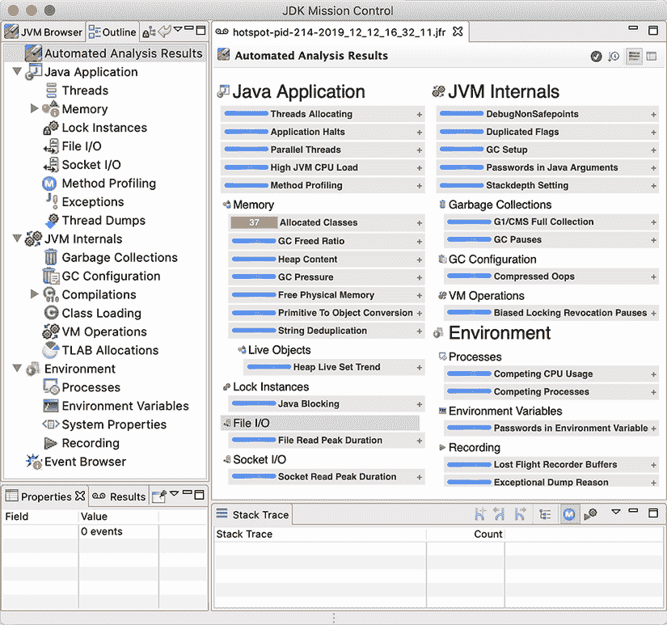

图 7.7 JMC 启动屏幕

注意：要进行分析，当然必须在目标应用程序上启用 Flight Recorder。除了使用之前创建的文件外，还可以在应用程序启动后动态地附加它。对于后者，JMC 在左上角面板的左侧提供了一个标签为 JVM 浏览器的选项卡，用于动态地将它附加到本地应用程序。

在 JMC 中遇到的第一个屏幕之一是概述遥测屏幕，它显示了 JVM 整体健康状况的高级仪表板。这可以在图 7.8 中看到。

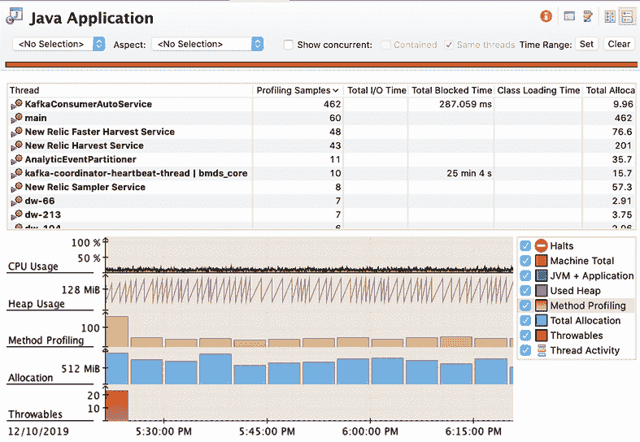

图 7.8 JMC 仪表板

JVM 的主要子系统都拥有专门的屏幕，以便进行深入分析。例如，垃圾回收有一个概述屏幕，用于显示 JFR 文件生命周期内的 GC 事件。底部的“最长暂停”显示允许用户查看在时间线中任何异常长的 GC 事件发生的位置，如图 7.9 所示。

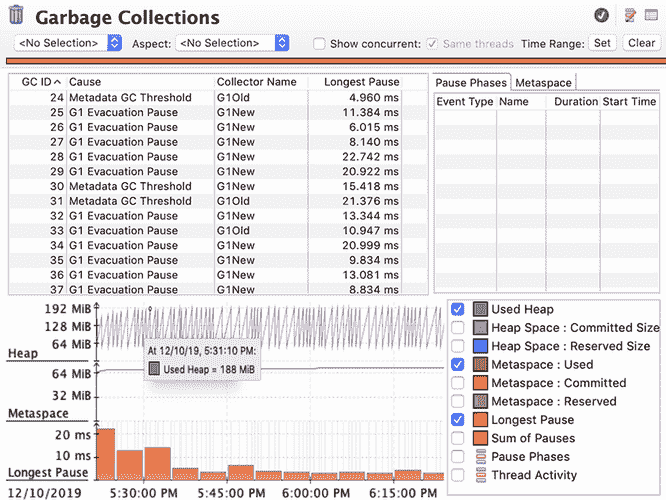

图 7.9 JMC 垃圾回收

在详细配置配置中，还可以看到将新的分配缓冲区（TLABs）分配给应用程序线程的单独事件。我们可以看到进程内分配的更精确视图。这个视图看起来就像图 7.10 中所示的那样。这个视图允许开发者轻松地看到哪些线程分配了最多的内存——在这个例子中，是一个正在消费 Apache Kafka 主题数据的线程。

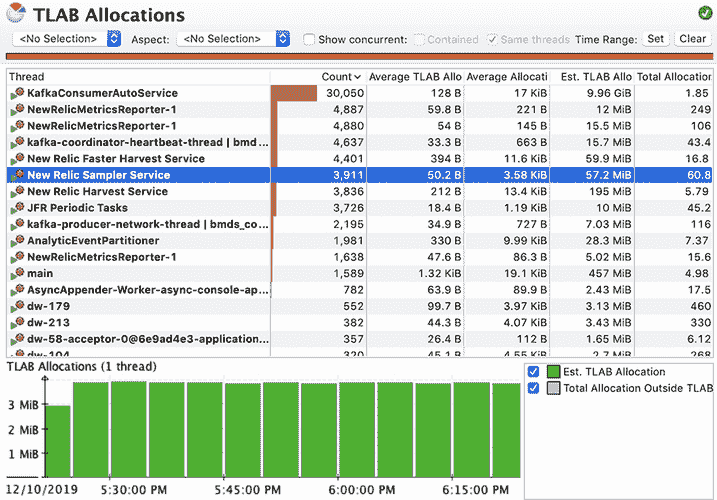

图 7.10 JMC TLAB 分配

JVM 的另一个主要子系统是 JIT 编译器，JMC 允许我们深入了解编译器的工作细节，如图 7.11 所示。

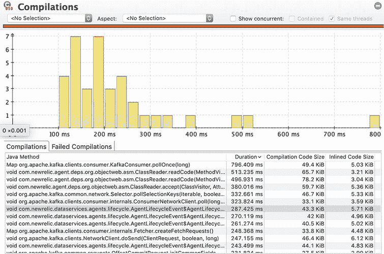

图 7.11 JMC JIT 编译

一个关键资源是 JIT 编译器的代码缓存中可用的内存。这是存储方法编译版本的区域。JMC 可以可视化代码缓存的使用情况——一个示例在图 7.12 中显示。

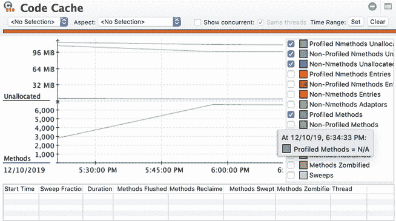

图 7.12 JMC JIT 代码缓存

对于拥有大量编译方法的过程，这个内存区域可能会耗尽，导致进程无法达到峰值性能。

JMC 还包括一个方法级分析器，其工作方式与 VisualVM 或 JProfiler 或 YourKit 等商业工具中的分析器非常相似。图 7.13 显示了一个典型的结果。

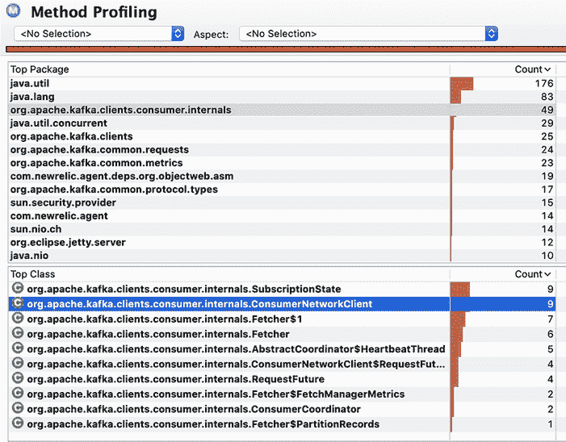

图 7.13 JMC 方法分析

JMC 中更高级的屏幕之一是 VM 操作视图，它显示了 JVM 执行的一些内部操作及其持续时间。这不是我们预期在每次分析中都需要查看的视图，但它对于检测某些不太常见的问题可能非常有用。我们可以在图 7.14 中看到一个典型的用法。

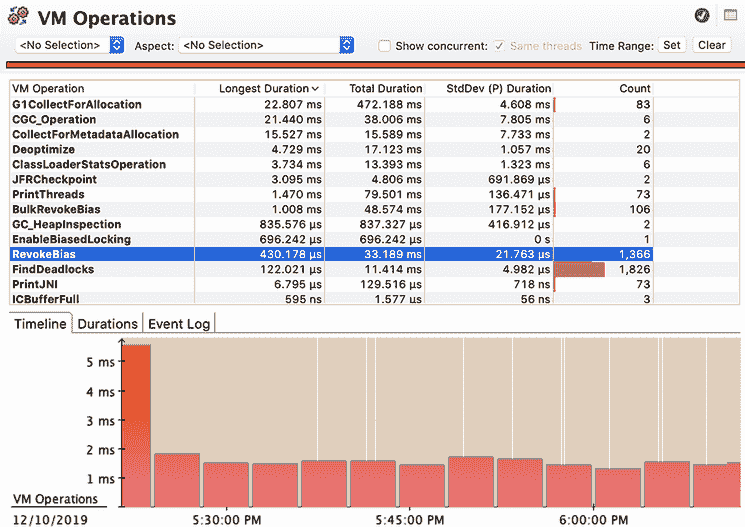

图 7.14 JMC JVM 操作

JMC 可以用来诊断单个 JVM，这是一个非常棒的功能。然而，这种用例并不能扩展到检查整个集群（或完整的应用程序）。此外，现代系统通常还需要监控或*可观察性*解决方案以及深入探究的能力。

经典的 JFR 记录文件模型（以及单文件 JVM）并不便于此。它并不适合通过网络传输到 SaaS 提供商或内部工具的遥测数据流。一些供应商（例如 New Relic 和 DataDog）确实提供了 JFR 功能，但使用这些技术的范围仍然相对狭窄。

幸运的是，Java 14 中引入的 JFR 流式 API 为可观察性用例以及深入探究提供了一个出色的构建块。然而，整个社区倾向于不采用 Java 的非 LTS 版本。这意味着，可能只有随着 Java 17（LTS 版本）的到来，我们才会看到支持 JFR 流式形式的 Java 版本得到广泛采用。

性能调优不是关于盯着你的代码祈祷获得启迪或应用现成的快速修复。相反，它关乎细致的测量、关注细节和耐心。它关乎在测试中持续减少错误来源，以便真正导致性能问题的根源显现出来。

在本章中，我们只能对丰富多样的主题进行简要介绍。还有更多内容值得探索，感兴趣的读者可以参考 Ben Evans、James Gough 和 Chris Newland 合著的《优化 Java》（O’Reilly Media，2018 年 5 月）等专门文本。

## 摘要

+   JVM 是一个极其强大且复杂的运行时环境。

+   JVM 的本质有时会使得优化其内部的代码变得具有挑战性。

+   您必须进行测量才能准确了解问题真正所在的位置。

+   特别注意垃圾回收子系统和即时编译器。

+   监控和其他工具确实能提供帮助。

+   学习阅读日志和其他平台指标——工具并不总是可用。
