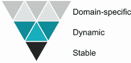
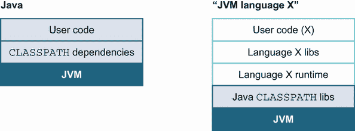
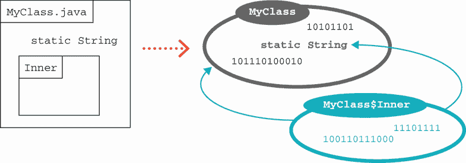

# 8 种替代 JVM 语言

本章涵盖

+   语言动物学

+   为什么你应该使用替代 JVM 语言

+   替代语言的选取标准

+   JVM 如何处理替代语言

如果你曾经使用 Java 做过任何规模的工作，你可能已经注意到它有时会显得有点冗长和笨拙。你甚至可能发现自己希望事情有所不同——以某种方式变得更容易。

幸运的是，正如你在前几章中看到的，JVM 真的很棒——实际上，它为除了 Java 之外的其他编程语言提供了一个自然的家园。在本章中，我们将向你展示为什么以及如何可能想要将另一种 JVM 编程语言混合到你的项目中。

在本章中，我们将介绍描述不同语言类型（如静态类型与动态类型）的方法，为什么你可能想要使用替代语言，以及在选择它们时应该寻找哪些标准。你还将被介绍到本书剩余部分我们将更深入探讨的两种语言（Kotlin 和 Clojure）。

## 8.1 语言动物学

编程语言有多种不同的风味和分类。另一种说法是，广泛的编程风格和方法体现在不同的语言中。当你了解如何分类语言之间的差异时，掌握这些不同的风格通常更容易。

注意：这些分类有助于思考语言的多样性。这些划分中的一些比其他划分更为明确，但没有任何分类方案是完美的。不同的人对如何安排分类有不同的看法。

近年来，一种趋势是语言从可能性范围中添加功能。通常，将一种语言视为“比另一种语言功能更少”或“动态类型但在需要时具有可选静态类型”是有帮助的。

我们将涵盖的分类包括“解释型与编译型”、“动态与静态”、“命令式与函数式”，以及语言的重新实现与原始版本。一般来说，这些分类是思考空间的方法，而不是完整精确的学术方案。

例如，我们可以这样说，Java 是一种运行时编译的、静态类型的、命令式语言，并具有一些函数式特性。它强调安全性、代码清晰度、向后兼容性和性能，并且愿意接受一定程度的冗长和*仪式感*（例如在部署中）来实现这些目标。

注意：不同的语言可能有不同的优先级；例如，动态类型语言可能强调部署速度。

让我们从解释型与编译型分类开始。

### 8.1.1 解释型语言与编译型语言

**解释型语言**是一种在执行源代码的每一步时直接执行，而不是在执行开始之前将整个程序转换为机器码的语言。这与编译型语言形成对比，编译型语言使用编译器将人类可读的源代码转换为二进制形式作为初始任务。

这种区别最近变得不那么明显了。在 20 世纪 90 年代初，这种划分相当清晰：C/C++、FORTRAN 及其朋友是编译型语言，而 Perl 和 Python 是解释型语言。但正如我们在第一章中提到的，Java 具有编译型和解释型语言的特点。字节码的使用进一步模糊了这个问题。字节码当然不是人类可读的，但也不是机器码。

在本书的这一部分，我们将研究 JVM 语言，我们将区分语言是否从源代码生成类文件并执行它。在后一种情况下，使用解释器（可能用 Java 编写）逐行执行源代码。一些语言提供编译器和解释器，而一些语言提供解释器和即时（JIT）编译器，该编译器将生成 JVM 字节码。

### 8.1.2 动态类型与静态类型

在动态类型语言中，一个变量可以在程序执行的不同时间包含不同的类型。作为一个例子，让我们看看一个在知名动态语言 JavaScript 中的简单代码片段。希望这个例子即使你不详细了解该语言也能理解：

```
var answer = 40;
answer = answer + 2;
answer = "What is the answer? " + answer;
```

这里使用的`var`关键字创建了一个新变量。在 JavaScript 的动态类型系统中，这个变量可以包含任何类型的值。这个变量最初被设置为`40`，当然是一个数值。然后我们向它添加`2`，得到`42`。然后我们稍微改变一下方向，让`answer`持有字符串值。这在动态语言中是一种常见的技术，并且不会引起语法错误。

JavaScript 解释器也能够区分`+`操作符的两种用法。`+`的第一个用法是数值加法——将`2`加到`40`上——而在下一行中，解释器根据上下文推断出开发者意图进行字符串连接。

让我们在 Java 中使用 JShell 再次尝试这个技巧：

```
jshell> var answer = 40;
answer ==> 40

jshell> answer = answer + 2;
answer ==> 42

jshell> answer = "What is the answer? " + answer;
|  Error:
|  incompatible types: java.lang.String cannot be converted to int
|  answer = "What is the answer? " + answer;
|           ^-----------------------------^
```

哗啦。尽管在两种语言中，完全相同的源代码看起来都是合法的，但 Java 的**静态类型系统**阻止了最后一行代码的执行。Java 的`var`关键字不仅仅创建了一个名为`answer`的变量。正如我们在 1.3 节中学到的，Java 的`var`还会从表达式的右侧推断出这个新变量的类型。我们不必显式指定`answer`的类型，但 Java 的静态类型系统会分配一个永远不会改变的类型。

注意：这里的关键点是，动态类型跟踪变量包含的**值**（例如，数字或字符串）的类型信息，而静态类型跟踪的是**变量定义**的类型信息。

静态类型对于编译型语言来说是一个很好的匹配，因为类型信息全部关于变量，而不是变量中的值。这允许在代码甚至有机会运行之前，在编译时对潜在的类型系统违规进行推理。

动态类型语言在变量持有的值上携带类型信息。这提供了很多灵活性，但意味着类型违规（例如，“我以为这是一个数字，但它是一个字符串”）会在执行期间发生。这可能导致更多的运行时错误，这些错误可能比编译时错误更难调试且成本更高。

### 8.1.3 命令式与函数式语言

Java 是一种命令式语言的经典例子。命令式语言可以被视为将程序的运行状态建模为可变数据并发布一系列指令以转换该运行状态的语言。因此，程序状态是命令式语言中占据中心舞台的概念。

命令式语言存在两种主要子类型。过程式语言，如 BASIC 和 FORTRAN，将代码和数据视为完全分离的，并具有简单的代码操作数据范式。另一种子类型是面向对象（OO）语言，其中数据和代码（以方法的形式）捆绑在一起形成对象。面向对象系统中的程序状态是程序中所有对象的状态。在 OO 语言中，通过元数据（如类信息）在更大或更小的程度上强加了额外的结构。然而，这些子类型之间的差异可能并不总是清晰的。例如，C++明确旨在支持 OO 和过程式编码，而一些 BASIC 的后期版本也具有面向对象的功能。

*函数式语言*认为计算本身是最重要的概念。函数在值上操作，就像过程式语言一样，但与改变它们的输入不同，函数被视为像数学函数一样行动，并返回新的值。以新的和独特的方式组合不同的函数也是这种模型的基本内容。

如图 8.1 所示，函数被视为“小处理机”，它们接受值并输出新的值。它们没有自己的状态，将它们与任何外部状态捆绑在一起实际上并不合理。以对象为中心的世界观与函数式语言的自然观点有些不一致。


图 8.1 命令式与函数式语言

函数式语言的一个关键特性是*一等函数*——将函数视为值的能力，将其分配给变量，传递给其他函数，甚至从其他函数返回函数。

这是一个我们之前讨论过的功能谱系的绝佳例子，因为 Java 8 添加了 lambda 表达式语法，这使得 Java 程序员可以将函数视为值。然而，作为一个较新的特性，这个特性并没有在平台的所有可能位置使用，而且用于获得类似行为的旧技术，如 `Runnable` 和 `Callable` 接口，仍然在使用中。

在接下来的两章中，我们将学习不同的语言，一个关键焦点将是它们如何支持函数式编程方法。使用 Kotlin，我们将看到即使是命令式语言也可以被设计成平滑地支持函数式思想。然后我们将探讨 Clojure，这是一种更加纯粹的函数式语言，它根本不再以面向对象为中心。

### 8.1.4 重新实现与原始版本

JVM 语言之间的另一个重要区别是，将它们分为现有语言的重新实现和专门为 JVM 编写的语言。一般来说，专门为 JVM 编写的语言在其类型系统和 JVM 的原生类型之间提供了更紧密的绑定。

以下三种语言是现有语言的 JVM 重新实现：

+   *JRuby* 是 Ruby 编程语言的 JVM 重新实现。Ruby 是一种动态类型面向对象语言，并具有一些函数式特性。它基本上是在 JVM 上进行解释，但最近版本已经包含了一个运行时 JIT 编译器，在有利条件下可以生成 JVM 字节码。

+   *Jython* 是由 Jim Hugunin 于 1997 年启动的，作为一种使用高性能 Java 库的方式。它是在 JVM 上对 Python 的重新实现，因此它是一种动态的、主要是面向对象的语言。它通过生成内部 Python 字节码，然后将其转换为 JVM 字节码来运行。遗憾的是，自 2015 年以来，该项目活动很少，并且只支持 Python 2.7，不支持当前的 Python 3。

+   *Rhino* 最初由 Netscape 开发，后来由 Mozilla 项目继续开发。它提供了 JVM 上的 JavaScript 实现，并一直随着 JDK 一起发布。

    +   JDK 8 包含了一个新的 JavaScript 引擎，*Nashorn*（“Nashorn”这个名字有点双关——它是德语中“犀牛”的意思），但随着 JavaScript 语言变化的加速，它被迫在 JDK 11 中弃用，并在 JDK 15 中移除。尽管未来的 JDK 不会直接提供 JavaScript 实现，但它们仍然可以独立找到。（Mozilla 的 Rhino ([`github.com/mozilla/rhino`](https://github.com/mozilla/rhino)）和 Nashorn ([`openjdk.java.net/projects/nashorn/`](https://openjdk.java.net/projects/nashorn/)) 作为独立的 OpenJDK 项目，它打算继续存在，并且应该在未来的 JDK 中得到支持。

注意：最早的 JVM 语言？最早的非 Java JVM 语言难以确定。当然，Kawa（Lisp 的一个实现）可以追溯到 1997 年左右。从那时起，我们看到了语言的爆炸性增长，以至于几乎不可能跟踪它们。

在撰写本文时，一个合理的猜测是至少有 200 种语言针对 JVM。并非所有都可以被认为是活跃的或广泛使用的（有些实际上非常细分），但大量表明 JVM 是一个非常活跃的语言开发和实现平台。

注意：在 Java 7 发布时首次亮相的语言和 VM 规范版本中，所有直接引用 Java 语言的条目都已从 VM 规范中删除。Java 现在只是许多在 JVM 上运行的许多语言之一——它不再享有特权地位。

使许多不同语言能够针对 JVM 的关键技术是类文件格式，正如我们在第四章中讨论的那样。任何可以生成类文件的语言都被认为是 JVM 上的编译语言。

让我们继续讨论多语言编程如何成为 Java 程序员感兴趣的一个领域。我们将解释基本概念以及为什么以及如何为您的项目选择替代 JVM 语言。

## 8.2 JVM 上的多语言编程

“在 JVM 上使用多语言编程”这个短语被用来描述使用一个或多个非 Java JVM 语言与 Java 代码核心一起使用的项目。思考多语言编程的一种常见方式是作为一种关注点分离的形式。如图 8.2 所示，可能存在三个层次，其中非 Java 技术可以发挥有用的作用。这个图表有时被称为多语言编程金字塔，它最初归功于 Ola Bini 的工作（[`olabini.com/blog/tag/polyglot/`](https://olabini.com/blog/tag/polyglot/))）。



图 8.2 多语言编程金字塔

在金字塔中，依赖关系只有一个方向——稳定层相对独立，动态层使用稳定层，领域特定代码可以从其下两个层中拉取。

在给定的系统中定义这些层并不总是容易的；存在灰色区域，并非所有系统都完美匹配。然而，这是一个有用的工具，可以识别不同部分系统有不同的需求，并可能从不同的语言中受益的接缝。

稳定层包含您系统的核心 API 和抽象。类型安全、彻底的测试和性能都是至关重要的。

动态层使用稳定层的抽象来创建一个工作系统。这可能包括如何一个系统通过 HTTP 公开自己或与其他后端系统交互的代码。编译时间和灵活性等问题可能使考虑在动态层使用不同的语言变得值得。

领域特定层处理特定于应用程序的关注点，例如展示、规则定制和处理的定制，或 CI/CD。这段代码完全关于应用程序领域的特定方面，可能从其他层中约束性的语言选择中受益。

注意：多语言编程是有意义的，因为不同的代码片段有不同的生命周期。银行中的风险计算引擎可能持续五年或更长时间。网站上的 JSP 页面可能持续几个月。初创公司中最短命的代码可能只存活几天。代码存活的时间越长，就越接近金字塔的稳定层。参见表 8.1。

表 8.1 多语言编程金字塔的三个层级

| 名称 | 描述 | 示例 |
| --- | --- | --- |
| 领域特定 | 领域特定语言。紧密耦合到应用程序的特定部分 | Apache Camel, DSLs, Drools, 网页模板 |
| 动态 | 功能的快速、高效、灵活的开发 | Clojure, Groovy, JRuby |
| 稳定 | 核心功能，稳定，经过充分测试，性能良好 | Java, Kotlin, Scala |

正如你所见，模式出现在层级中——静态类型语言倾向于向稳定层任务靠拢。相反，针对更具体目的的技术往往非常适合金字塔顶部的角色。

让我们深入探讨一下为什么 Java 不是金字塔中所有事物的最佳选择。我们将从讨论为什么你应该考虑使用非 Java 语言开始，然后我们将讨论在选择非 Java 语言时需要考虑的一些主要标准。

### 8.2.1 为什么使用非 Java 语言？

Java 作为通用、静态类型、编译型语言的本质提供了许多优势。这些品质使其成为在稳定层实现功能的一个很好的选择。但正如这里所描述的，这些相同的属性在金字塔的上层成为负担：

+   重新编译是费时的。

+   静态类型可能不够灵活。

+   部署是一个重量级的过程。

+   Java 的语法可能很严格，并且不适合产生领域特定语言（DSL）。

Java 项目的重新编译和重建时间通常达到 90 秒到两分钟。这已经足够长，足以严重破坏开发者的工作流程，而且对于可能只在生产环境中存活几周的项目来说，这不是一个好的选择。

Java 的严格语法

Java 语言具有非常严格的语法。基本语言组件是提供的关键字。你不能“创造新的语法”或创建任何可能被误认为是关键字的新的形式。

程序员可以创建新的类，这些类的功能包括在字段中存储状态以及在类或对象上调用方法。然而，这仅限于此——程序员不能创建任何类似控制结构的任何东西。换句话说，字段访问将始终看起来像以下这样：

```
anObject.someField
AClass.someStaticField
```

方法调用将始终看起来像这样：

```
anObject.someMethod(params)
AClass.someStaticMethod(params)
```

在 Java 中，方法参数从不可选（与某些其他语言不同，如 Kotlin），因此即使在字段访问和方法调用之间也不能模糊界限。例如，我们不能创建看起来像关键字的结构。例如，我们希望能够创建一个类似于以下的`when`：

```
when(value) {
  // action to be taken
}
```

但我们能做到的最好的事情可能就像这样：

```
import static when.When.when;

...

when(value, () -> {
  // action to be taken
});
```

这种不可重定义的语法在尝试使用 Java 创建领域特定语言（DSL）时也会显现出来。我们将在下一章中看到我们的非 Java 语言如何处理这个问题。

总体而言，一个实用的解决方案是发挥 Java 的优势。利用其丰富的 API 和库支持，在稳定层中为应用程序做大量工作。

即使在稳定层内，你也可能发现除了 Java 之外的其他语言可能更受欢迎，例如以下情况：

+   Java 的冗长可能会让一些开发者望而却步，它也可能隐藏某些类别的错误。

+   尽管 Java 越来越多地支持函数式编程，但应用某些模式仍然存在限制。

+   其他语言提供了 Java 中不存在的并发解决方案（Kotlin 中的协程，Clojure 中的代理）。

注意：即使你选择另一种语言来支持你的稳定层中的功能，也不应该为了使语言匹配而丢弃现有的代码。考虑使用新语言来添加新功能或低风险区域，我们将在本章后面讨论如何识别这些区域。

在这个阶段，你可能正在自问，哪些类型的编程挑战适合这些层级？我应该选择哪种语言？一个经验丰富的 Java 开发者知道没有一劳永逸的解决方案，但我们确实有一些标准来评估你的选择。

### 8.2.2 新兴语言

在本书的其余部分，我们选择了两种我们认为具有巨大潜力和影响力的语言。这两种语言都是运行在 JVM 上的（Kotlin 和 Clojure），在多语言程序员中已经建立了良好的认知度。为什么这些语言会受到青睐？让我们逐一分析。

Kotlin

Kotlin 是由 JetBrains（IntelliJ IDEA 的制作者）开发的一种命令式、静态类型、面向对象的编程语言。它的目标是解决 Java 最常见的问题，同时保持熟悉的开发生态。Kotlin 是一种编译型语言，它提供了比仅运行在 JVM 上更高级别的兼容性。

Kotlin 的关键特性包括简洁的语法、`null`安全性、与 Java 代码的极强互操作性，以及协程——一种 Java 传统线程模型的替代并发机制。Kotlin 的一些特性已经在最近的 Java 版本中得到了应用，这证实了这些变化对开发者带来的价值。

虽然它在多个领域确立了自身作为关键 JVM 语言选项的地位，但 Kotlin 在移动领域取得了特别的成功，2019 年，Android 平台将其作为推荐语言采用。Kotlin 也支持与 Groovy 相同的级别用于 Gradle 构建脚本。它还被许多其他框架所接受，例如 Spring。无论您的 JVM 运行在何处，开发者广泛的安全性和便利性改进都值得考虑。第九章介绍了 Kotlin。

Kotlin 将在第十一章中作为 Gradle 构建的主要脚本语言使用。我们还将重新审视它，以展示第十五章中函数式编程的独特方法以及第十六章中的并发编程（协程）。 

Clojure

Clojure，由 Rich Hickey 设计，是一种 Lisp 家族的语言。它继承了该遗产的许多语法特性（以及大量的括号）。它是一种动态类型、函数式语言，这与 Lisp 的常规做法一致。它是一种编译型语言，但通常以源代码形式分发，原因我们稍后会看到。它还为其 Lisp 核心添加了大量的新特性（特别是在并发领域）。

Lisp 通常被视为专家语言。Clojure 比其他 Lisp 更容易学习，但仍为开发者提供了强大的功能（并且非常适合测试驱动开发风格）。但它可能仍然处于主流之外，主要用于爱好者以及一些专业工作（例如，一些金融应用发现其功能组合非常吸引人）。

Clojure 最好将其视为位于动态层，但由于其并发支持和其他特性，它也可以被视为能够执行稳定层语言的大部分角色。第十章介绍了 Clojure。

我们将在第十五章中广泛使用 Clojure 来学习关于函数式编程的知识，这些知识超出了 Java 的能力。它还将出现在第十六章中介绍演员模型，这是并发编程中的一个强大替代方案。

### 8.2.3 我们本可以选择但未选择的语言

如前所述，存在大量我们可以考虑的语言。以下是一些其他可能的竞争者，您可能需要更深入地研究。

Groovy

Groovy 语言是由 James Strachan 于 2003 年发明的。它是一种动态、编译型语言，语法与 Java 非常相似，但更灵活。它被广泛用于脚本和测试。它是 Gradle 构建工具的原始语言，也用于配置 Jenkins，这是一种极其常见的 CI/CD 工具。它通常是开发人员或团队在 JVM 上调查的第一种非 Java 语言。Groovy 可以被视为位于动态层，并且也因其非常适合构建领域特定语言（DSLs）而闻名。

我们选择不更详细地介绍 Groovy，因为在框架和其他语言的改进面前，它在原型设计和应用程序使用案例中的市场份额正在下降。

Scala

Scala 是一种支持许多函数式编程方面的面向对象语言。它的起源可以追溯到 2003 年，当时马丁·奥德斯基在学术环境中开始研究它，这是在他之前与 Java 泛型相关项目之后。它是一种类似于 Java 的静态类型、编译型语言，并且执行大量的类型推断，因此它通常给人一种动态语言的感觉。

Scala 从 Java 中学到了很多，其语言设计“修复”了 Java 中一些常见的烦恼。然而，Scala 最终拥有一个非常大的功能集，与 Java 相比，它有一个更先进的类型系统。

编程可能很复杂，而且不容易彻底学习。因此，我们选择专注于 Kotlin，为那些只想改进 Java 语言状态的开发者。

GraalVM

Oracle Labs 开发了 GraalVM ([`www.graalvm.org/`](https://www.graalvm.org/))，他们将其描述为部分源自 Java 和 JVM 代码库的多语言虚拟机和平台。当前版本包括运行 Java 和其他 JVM 语言（作为字节码）以及支持 JavaScript 和 LLVM 位码（来自流行的 LLVM 编译器的中间表示），并提供 Ruby、Python、R 和 WASM 的测试版支持。

整个平台包括以下组件：

+   Java HotSpot 虚拟机

+   Node.js JavaScript 运行时环境

+   LLVM 运行时用于执行 LLVM 位码

+   Graal——用 Java 编写的 JIT 编译器

+   Truffle——构建语言解释器的工具包和 API

+   SubstrateVM——原生图像的轻量级执行容器

在 GraalVM 项目中，语言之间可以非常自由地相互桥接，目标是允许使用不同技术实现的组件在单个应用程序过程中组合和使用。这是一种与多语言编程非常不同的方法，但它足够接近我们感兴趣的主题，所以我们至少想提到它。

非 JVM 语言

本章重点介绍在 JVM 上运行的替代语言。然而，值得承认的是，有时多语言程序员可能有一个理由，使得他们的系统的一部分需要完全离开 JVM。

以下是一些在 JVM 之外有更广泛支持的技术的例子：

+   原生系统代码（C、Go 或 Rust）

+   机器学习（Python）

+   在用户的网络浏览器中运行（JavaScript）

虽然对于这些中的许多都有基于 JVM 的方法，但在尝试将每一行代码完全保留在 JVM 上之前，评估替代方案的成熟度和我们团队的构成是值得的。

现在我们已经概述了一些可能的选择，让我们讨论应该驱动您选择哪种语言的决策问题。

## 8.3 如何为您的项目选择非 Java 语言

一旦您决定在项目中尝试使用非 Java 语言，您需要确定哪些项目部分自然适合稳定、动态或特定领域的层。表 8.2 突出了可能适合每一层的任务。

表 8.2 适用于特定领域、动态和稳定层的项目领域

| 名称 | 示例问题领域 |
| --- | --- |
| 特定领域特定领域通常受益于专家的可读性，这些专家可能不知道 Java。软件生命周期工具也经常有特定领域的语言和配置。 | 构建、持续集成、持续部署 Dev-ops 业务规则建模 |
| 动态动态层的系统可能从其他语言中可用的更大灵活性和开发速度中受益。这尤其适用于内部面向的工具（测试和管理）。 | 快速 Web 开发原型交互式管理和用户控制台脚本测试 |
| 稳定稳定层的代码表达了系统的核心抽象。更严格的数据类型安全和测试值得额外的开发者开销。 | 并发代码应用容器核心业务功能 |

如您所见，存在广泛的使用替代语言用例。但确定可以用替代语言解决的问题只是开始。接下来，您需要评估使用替代语言是否合适。以下是我们考虑技术堆栈时考虑的一些有用标准：

+   项目领域是否存在低风险？

+   该语言与 Java 的互操作性如何？

+   该语言有哪些工具支持（例如，IDE 支持）？

+   学习这门语言的曲线陡峭吗？

+   招聘具有该语言经验的开发人员有多容易？

让我们深入探讨这些领域，以便您了解需要提出哪些类型的问题。

### 8.3.1 项目领域是否存在低风险？

假设您有一个核心支付处理规则引擎，每天处理数百万笔交易。这是一块稳定的 Java 软件，已经存在超过七年，但测试不多，代码中存在许多暗角。支付处理引擎的核心显然是一个高风险区域，引入新语言，尤其是在它运行成功且缺乏测试覆盖和完全理解它的开发者时。

但是，一个系统不仅仅是其核心处理。例如，这是一个更好的测试会明显有帮助的情况。Kotlin 有许多好的选择，包括 Spek 框架([`www.spekframework.org/`](https://www.spekframework.org/))和 Kotest ([`kotest.io`](https://kotest.io))，它们利用语言来启用清晰、可读的规范，而不需要典型的 JUnit 烂模板。或者，也许你的规则引擎会从*属性测试*中受益，其中测试是编写来验证生成的输入条件，Clojure 的 `test.check` ([`clojure.org/guides/test_check_beginner`](https://clojure.org/guides/test_check_beginner)) 将是混合中的宝贵工具。

或者，假设你需要构建一个网络控制台，以便操作用户可以管理支付处理系统背后的某些非关键静态数据。开发团队成员已经熟悉 Struts 和 JSF，但对这两种技术都没有任何热情。这是尝试新语言和技术栈的另一个低风险领域。Spring Boot 与 Kotlin 将是一个明显的选择。

通过在一个低风险领域进行有限的试点，如果新技术栈不适合，总有终止项目并转移到不同交付技术的选项，而不会造成太大的干扰。

### 8.3.2 语言与 Java 的交互操作如何？

你不希望丢失你已经编写的所有优秀 Java 代码的价值！这是组织犹豫在技术堆栈中引入新编程语言的主要原因之一。但是，使用在 JVM 上运行的替代语言，你可以扭转这一局面，使其成为最大化代码库中现有价值，而不是丢弃有效代码。

在 JVM 上运行的替代语言能够与 Java 清晰地交互操作，并且当然可以部署在现有的环境中。这对于避免影响部署的所有者来说尤为重要，无论是生产管理团队还是你团队中的 DevOps 人员。通过将非 Java JVM 语言作为你系统的一部分，你保留了组织的运营专业知识，这有助于减轻担忧并降低支持新解决方案的风险。

注意 DSL 通常使用动态（或在某些情况下，稳定的）层语言构建，因此许多 DSL 都是通过它们构建的语言在 JVM 上运行的。

一些语言与 Java 的交互比其他语言更容易。我们发现，大多数流行的 JVM 替代语言（如 Kotlin、Clojure、JRuby、Groovy 和 Scala）都与 Java 有良好的互操作性（对于某些语言，集成非常好，几乎无缝）。如果你是一个非常谨慎的商店，运行一些实验很快很容易，并确保你理解集成如何为你工作。

以 Kotlin 为例。你可以通过熟悉的导入语句直接将其代码中的 Java 包导入。从这里，你可以轻松地编写一个小型的 Kotlin 脚本，甚至可以使用交互式的 Kotlin shell 来检查你的 Java 模型对象，看看交互表面会是什么样子。我们将在接下来的语言章节中具体讨论 Java 互操作性。

### 8.3.3 这种语言有良好的工具和测试支持吗？

大多数开发者低估了他们在熟悉环境后节省的时间量。他们强大的 IDE 和构建及测试工具帮助他们快速生产高质量的软件。Java 开发者已经从多年的优秀工具支持中受益，因此记住其他语言可能并不处于完全相同的成熟水平是很重要的。

一些语言（如 Kotlin）长期以来一直支持 IDE 进行编译、测试和部署最终结果。其他语言可能具有尚未完全成熟的工具。

相关问题是，当一种替代语言为其自身开发了一个强大的工具（如 Clojure 的出色的 Leiningen 构建工具）时，这个工具可能并不适合处理其他语言。因此，团队需要仔细思考如何划分项目，尤其是在部署相互关联但独立的组件时。

### 8.3.4 学习这种语言有多难？

学习一门新语言总是需要时间，而且如果这种语言的范式不是你的开发团队所熟悉的，那么所需的时间还会增加。大多数 Java 开发团队如果新语言是面向对象且具有类似 C 语言的语法（例如 Kotlin），那么他们会比较容易掌握这门新语言。

当 Java 开发者逐渐远离这种范式时，事情会变得更加困难。在流行的替代语言中，像 Clojure 这样的语言可以带来极其强大的好处，但它也可能要求开发团队在学习和理解 Clojure 的函数式特性和 Lisp 语法时进行重大的再培训。

一种替代方案是查看那些是现有语言重新实现的 JVM 语言。Ruby 和 Python 是成熟的编程语言，为开发者提供了大量的资料来学习。这些语言的 JVM 实现可以为你的团队提供一个甜点，让他们开始使用易于学习的非 Java 语言。

### 8.3.5 有很多开发者使用这种语言吗？

组织必须务实；他们不能总是雇佣最顶尖的 2%（尽管他们的广告可能这么说），并且他们的开发团队在一年中会发生变化。有些语言，如 Kotlin 或 Scala，已经足够成熟，以至于有一个可供雇佣的开发者池。但像 Clojure 这样的语言可能会带来更多困难。管理者可能会反对使用非同寻常的东西，担心会创建一个难以维护的代码库，他们将为雇佣而感到困难。

注意：关于重新实现的语言的警告：例如，许多用 Ruby 编写的现有包和应用程序仅针对基于 C 的原生实现进行测试。当尝试在 JVM 上使用它们时可能会出现问题。在做出平台决策时，如果你计划利用用重新实现的语言编写的整个堆栈，你应该考虑额外的测试时间。

再次强调，重新实现的语言（如 JRuby、Jython 等）可能在这里有所帮助。可能很少有开发者的简历上有 JRuby，但由于它只是运行在 JVM 上的 Ruby，实际上有一个庞大的开发者池可供雇佣——一个熟悉 C 版本的 Ruby 开发者可以很容易地学习在 JVM 上运行引起的差异。

现在我们有一系列问题要问，当选择替代语言时，以及一些可用选项的概述。在这个时候，深入了解 JVM 如何支持多种语言是值得的。这次窥视揭示了某些设计选择和 JVM 上替代语言的限制的根源。

## 8.4 JVM 如何支持替代语言

一种语言可以在 JVM 上以两种可能的方式运行：

+   拥有一个生成类文件的源代码编译器。Kotlin 和 Clojure 都以这种方式运行。

+   拥有一个用 JVM 字节码实现的解释器。JRuby 就是这样实现的。

在这两种情况下，通常会有一个运行时环境，它为执行程序提供特定语言的支持。图 8.3 显示了 Java 和典型非 Java 语言的运行时环境堆栈。



图 8.3 非 Java 语言运行时支持

这些运行时支持系统在复杂性上有所不同，这取决于特定非 Java 语言在运行时需要多少手动操作。在几乎所有情况下，运行时都将实现为一组 JAR 文件或模块，执行程序需要在它的类路径上拥有这些文件。在解释器的情况下，解释器将在程序执行开始时启动引导，然后读取要执行的源文件。

### 8.4.1 性能

开发者经常对不同的语言提出一个问题，那就是它们相对于彼此的表现如何？虽然表面上看起来很有吸引力，但这个问题并不简单回答，实际上并不那么有意义。

正如我们在第七章中看到的，经验丰富的开发者知道性能是由测量驱动的。测量是在单个程序上进行的，而不是在编程语言的抽象概念上。将任何声称语言 X“性能优于”Y 的主张视为可疑，除非有伴随的可靠数据。

然而，在实践中，JVM 语言的某些整体性能特征可以通过语言实现的方式大致确定。编译型语言在运行时只是字节码，将以与 Java 相同的方式进行即时编译。解释型语言将具有非常不同的性能行为，因为要即时编译的代码是解释器，而不是程序本身。

注意：一些语言（例如，JRuby）采用混合策略——它们为脚本提供解释器，但也可以动态地将单个源方法编译成 JVM 字节码，然后由 JVM 的即时编译器将其编译成机器代码。

在这本书中，我们的重点是编译型语言。为了完整性，提到了像 Rhino 这样的解释型语言，但不会过多地涉及它们。因此，我们预计我们考虑的语言之间的性能将大致相似。要获得更详细的答案，你应该对特定的程序或工作负载进行详细分析。

在本节的其余部分，我们将讨论对替代语言（即使是编译型语言）的运行时支持的需求，然后讨论编译器虚构功能——由编译器合成的特定语言功能，这些功能可能不会出现在低级字节码中。

### 8.4.2 非 Java 语言的运行时环境

一种简单测量特定语言所需的运行时环境复杂性的方法是通过查看提供运行时实现的 JAR 文件的大小。使用这个指标，我们可以看到 Clojure 是一个相对轻量级的运行时环境，而 JRuby 是一个需要更多支持的编程语言。

这并不是一个完全公平的测试，因为一些语言的标准化库和附加功能比其他语言的标准化分布要大得多。然而，这可以是一个有用的（如果粗略的）经验法则。

通常，运行时环境的目的在于帮助非 Java 语言中的类型系统和其他方面实现所需的语义。替代语言并不总是与 Java 对基本编程概念有完全相同的看法。

例如，Java 对面向对象的方法并不被其他语言普遍接受。在 Java 中，所有特定类的实例都具有完全相同的方法集，并且这个集合在编译时是固定的。另一方面，在 Ruby 中，一个单独的对象实例可以在运行时附加额外的、在定义类时未知且不一定在其他相同类的实例上定义的方法。

注意：`invokedynamic` 字节码最初被添加到 JVM 中，是为了方便高效地实现这类语言特性。

这种动态添加方法的能力（有些令人困惑地称为“开放类”）需要由 JRuby 实现来复制。这只有在 JRuby 运行时提供一些高级支持的情况下才可能实现。

### 8.4.3 编译器虚构

某些语言特性是由编程环境和高级语言合成的，并不存在于底层的 JVM 实现中。这些被称为 *编译器虚构*。

注意：了解这些特性是如何实现的会有所帮助；否则，你可能会发现代码运行缓慢，在某些情况下甚至会导致进程崩溃。有时环境需要做大量工作来合成特定的特性。

Java 中的其他例子包括检查型异常和内部类（如果需要，总是转换为顶级类，并带有特别合成的访问方法，如图 8.4 所示）。如果你曾经使用 `jar tvf` 命令查看过 JAR 文件内部，并看到很多名字中带有 `$` 的类，这些就是已展开并转换为“常规”类的内部类。



图 8.4 内部类作为编译器虚构

其他语言也有编译器虚构的概念。在某些情况下，这些编译器虚构甚至构成了语言功能的核心部分。

在第 8.2 节中，我们介绍了函数式编程中的关键概念 *一等函数*——即函数应该是可以放入变量的值。本书第三部分的所有非 Java 语言在 Java 添加 lambda 表达式之前就支持了这个特性。当 JVM 只处理类作为代码和功能的最小单元时，它们是如何实现这一点的呢？

解决源代码和 JVM 字节码之间差异的原始方案是记住对象只是数据包，以及操作这些数据的方法。想象一个没有任何状态且只有一个方法的对象——例如，Java 的 `Callable` 的简单匿名实现。将这样的对象放入变量中，传递它，然后稍后调用它的 `call()` 方法，这在任何情况下都并不罕见：

```
Callable<String> myFn = new Callable<String>() {
    @Override
    public String call() {
        return "The result";
    }
};

System.out.println(myFn.call());
```

注意：在这个例子中，`myFn` 变量是一个匿名类型，因此编译后它将显示为类似于 `NameOfEnclosingClass$1.class` 的形式。类编号从 1 开始，对于编译器遇到的每个匿名类型都会递增。如果它们是动态创建的，并且数量很多（如 JRuby 等语言中有时发生的情况），这可能会对存储类定义的堆外内存造成压力。

Java 的 lambda 表达式实际上并不使用这种匿名类型的方法，而是建立在 JVM 的一种通用特性 `invokedynamic` 之上，我们将在第十七章中详细讨论。其他语言也在从它们的专用实现转向使用 `invokedynamic`。这是一个编译器虚构影响平台现实发展的有趣案例。

另一个例子，在下一章中，我们将遇到 Kotlin 的 *数据类*——这是一种语言特性，有助于减少声明“只是一堆字段”的类时所需的输入和 *仪式*。在今天的 Kotlin 中，这是一个编译器虚构，但 Java 17 添加了一个名为 *records* 的特性，这可能会最终为 Kotlin 提供构建数据类的基础。

## 摘要

+   在 JVM 上的替代语言已经走得很远，为某些问题提供了比 Java 更好的解决方案。

+   语言可以根据不同的方式分类（静态与动态、命令式与函数式、编译与解释），这有助于选择适合特定任务的正确语言。

+   多语言编程通常分为三个层次：稳定层、动态层和领域特定层。Java 和 Kotlin 适用于软件开发中的稳定层。Clojure 可能更适合动态层或领域特定层的工作。

+   现有生产应用程序的核心业务功能几乎永远不会是引入新语言的正确地方。为您的替代语言首次部署选择一个低风险区域。

+   团队和项目具有独特的特征，这将影响语言选择。这里没有普遍正确的答案。
