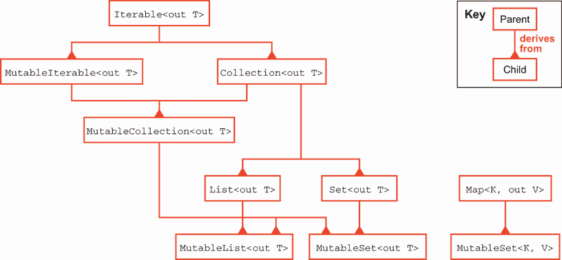

# 9 Kotlin

本章涵盖

+   为什么使用 Kotlin？

+   方便性和简洁性

+   安全性

+   并发

+   Java 互操作性

Kotlin 是由 JetBrains（[`jetbrains.com`](https://jetbrains.com)）创建的语言，JetBrains 是流行的 IntelliJ IDEA 的制造商。2011 年公开宣布，Kotlin 旨在填补他们在 Java 开发中感到的语言空白，而没有看到其他现有 JVM 语言中的摩擦。

Kotlin 在次年开源，并在 2016 年达到了 1.0 版本——由 JetBrains 提供保证的支持和维护水平。从那时起，它已成为 Android 平台的推荐语言，并在其他 JVM 编码圈子中积累了坚实的支持。2018 年宣布的 Kotlin 基金会，为语言带来了 JetBrains 和 Google 的长期支持。Kotlin 甚至超越了 JVM，以支持 JavaScript 和本地后端。

## 9.1 为什么使用 Kotlin？

作为替代语言，Kotlin 在 Java 之上提供了许多生活质量的改进，而不会彻底改变整个世界。它对便利性、安全性和良好互操作性的关注，为在现有 Java 项目中增量使用提供了很好的故事。在 IntelliJ IDEA 中，将文件从 Java 转换为 Kotlin 通常只需点击一下。

值得注意的是，一些最初仅在 Kotlin 中可用的功能已经回到了 Java 中。一个很好的例子是 Kotlin 脚本——Kotlin 可以直接运行源文件，通常带有`kts`扩展名，而无需开发者请求编译它。如果这听起来像我们在第一章中展示的 Java 11 的单文件功能，你并没有错！

在本章之后，我们将利用对 Kotlin 的新熟悉程度，在 11 章中将 Kotlin 作为构建 Gradle 项目的主要脚本语言。它也将在 15 章中再次被提及，届时我们将探讨 JVM 上的函数式编程，以及在 16 章中，Kotlin 内置的协程机制为 Java 中的经典多线程提供了一个令人信服的替代方案。让我们开始看看 Kotlin 能为我们提供什么。

### 9.1.1 安装

如果你使用 IntelliJ IDEA，Kotlin 通过插件提供。安装后，你就可以开始用 Kotlin 编写代码了，就像在 IDE 中支持的其他任何语言一样。

对于那些更倾向于裸机设置的人来说，Kotlin 还提供了一个命令行编译器(`kotlinc`)（见[`mng.bz/YGoa`](http://mng.bz/YGoa)）和交互式外壳(`kotlin`)。

将 Kotlin 添加到现有项目需要更新您的构建脚本。第十一章将使您更熟悉这些系统，但到目前为止，您可以参考 Kotlin 的优秀文档，以 Maven([`mng.bz/GEYJ`](http://mng.bz/GEYJ))或 Gradle([`mng.bz/z4vA`](http://mng.bz/z4vA))开始。Kotlin 准备好运行后，开始探索的好地方是了解其基本功能是如何工作和改进 Java 的。

## 9.2 方便性和简洁性

Java 以冗长著称。尽管它与 Java 保持了很多视觉上的相似性，但 Kotlin 不懈地简化了您必须编写的代码。

### 9.2.1 从更少开始

其简化性质的一个例子是简单的字符，分号。Kotlin 不需要分号来表示行结束，允许典型的换行符代替。分号是允许的——实际上，如果您想在单行上放置多个语句，例如，则必须使用分号——但大多数情况下并不需要。

Kotlin 利用其空白状态来改变其他在 Java 中难以更改的默认设置。尽管 Java 默认只导入 `java.lang`，但 Kotlin 在任何地方都提供了以下包：

+   `java.lang.*`

+   `kotlin.*`

+   `kotlin.annotation.*`

+   `kotlin.collections.*`

+   `kotlin.comparisons.*`

+   `kotlin.io.*`

+   `kotlin.ranges.*`

+   `kotlin.sequences.*`

+   `kotlin.text.*`

+   `kotlin.jvm.*`

几乎没有程序不需要集合、文本或 IO，因此这些包含节省了很多不必要的导入。

Java 的冗长性通常在类型上体现出来——我们在第一章中看到 `var` 关键字如何减少类型信息的重复。Kotlin 从一开始就采用了这种类型推断的风格，尽管这并不是唯一的思想来源。

### 9.2.2 变量

当引入变量时，Kotlin 甚至使用了与较新 Java 版本相同的关键字：`var`。它将从右侧的表达式推断出变量的类型，如下所示：

```
var i = 1          ❶
var s = "String"   ❷
```

❶ i 是 `kotlin.Int` 类型。

❷ s 是 `kotlin.String` 类型。

与 Java 不同的是，在 Kotlin 中 `var` 不仅仅是一个快捷方式。如果您想显式地指出变量的类型，`var` 仍然存在，但类型被添加到变量名称之后，如下面的代码片段所示。这有时被称为 *类型提示*：

```
var i: Int = 1
var s: String = "String"
var n: Int = "error"        ❶
```

❶ 此赋值将因编译错误而失败，错误：类型不匹配：推断类型为 String 但期望 Int。

在 Kotlin 中，`var` 有一个伙伴，即 `val` 关键字。使用 `val` 声明的变量是不可变的，并且在赋值后不能被写入。这相当于 Java 中的 `final var`——对于任何不期望重新分配的变量来说，这是一个高度推荐默认设置。Kotlin 优雅地将这种更安全的设置与可变替代方案一样简洁，如下所示：

```
var i = 1
i = 2              ❶

val s = "String"
s = "boom"         ❷
```

❶ 允许对 `var` 变量进行重新赋值。

❷ 编译错误，错误：`val` 不能重新赋值。

在 Kotlin 中，`var` 和 `val` 一致地用于变量和参数。默认倾向于不可变性的主题也是 Kotlin 的一个关键设计因素，我们将在整个语言中反复看到这一点。

一旦有了变量，自然就想比较它们。Kotlin 在相等性方面提供了一些新的帮助，这是值得了解的。

### 9.2.3 相等性

许多 Java 程序中常见的错误如下所示：

```
// Java
String s = retrieveString();   ❶
if (s == "A value") {
    // ...                     ❷
}
```

❶ 从某处接收一个字符串。注意，字符串字面量实际上可能被内部化到同一个对象中，这可能会在错误的比较中产生一种错误的安全感。

❷ 即使使用相同的值但不同的引用，也不会到达这里

我们很快就会了解到 Java 中的 `==` 比较的是 *引用*，而不是 *值*，所以这不会像许多其他语言那样做你所期望的事情。

Kotlin 消除了这个怪癖，并将 `==` 作为 `String` 等常见类型的值相等性处理。实际上，对 `==` 的调用相当于对 `equals` 的安全调用。这优化了更常见的编程情况，并避免了 Java 编程中一个巨大的错误原因，如下所示：

```
// Kotlin
var s: String = retrieveString()
if (s == "A value") {
    // ...                        ❶
}
```

❶ 如果 s 的值为“一个值”，则会到达这里

在罕见的情况下，你可能仍然有理由比较引用。当这些情况出现时，Kotlin 的 `===`（及其配对 `!==`）提供了 Java 中 `==` 和 `!=` 的行为。比较变量很重要，但如果你不调用其他代码或定义自己的子程序，你不会走得很远。

### 9.2.4 函数

有时在说话时，我们会互换使用“函数”和“方法”这两个术语，但实际上，Java 只有方法——你无法在类的作用域之外定义可重用的代码块。尽管 Kotlin 支持所有 Java 的面向对象优点——我们将在下一节中看到——但它也认识到有时你可能只需要一个单独的函数。

遵循 Kotlin 的简洁原则，一个最小化的函数定义看起来像这样：

```
fun doTheThing() {    ❶
  println("Done!")
}
```

❶ `fun` 在 Kotlin 中定义一个函数。当我们到达定义与类相关联的方法时，我们还会再次看到它。

这看起来与 Java 的做法略有不同，但仍然相当容易辨认。除了用于开始声明的 `fun` 关键字之外，最大的区别是缺少返回类型。在 Kotlin 中，如果你的函数不返回任何内容，而不是明确地声明 `void`，你可以说 nothing，返回类型将被视为 `Unit`（Kotlin 表示“没有返回值”的方式）。

如果我们确实想返回一个值，我们必须直接声明，如下所示：

```
fun doTheThing(): Boolean {   ❶
  println("Done!")
  return true                 ❷
}
```

❶ 声明我们的函数返回类型为 Boolean

❷ 返回我们的成功

函数如果没有参数就没有太大用处。Kotlin 用于此的语法与变量声明类似，如下所示：

```
fun doTheThing(value: Int): Boolean {   ❶
  println("Done $value!")               ❷
  return true
}
```

❶ 我们的功能现在接受一个类型为 Int 的单个参数。

❷ 参数在函数中像局部定义的变量一样出现。这里我们使用了 Kotlin 的便捷字符串插值。

即使是 Kotlin 中简单的函数定义也有一些技巧。有时函数参数的顺序可能不清楚，尤其是当参数类型相同时，如下例所示：

```
fun coordinates(x: Int, y: Int) {
  // ...
}
```

当我们调用这个函数时，我们必须记住参数的顺序——`x` 在 `y` 之前——否则可能会出现错误。Kotlin 通过 *命名参数* 解决了这个问题，如下所示：

```
fun coordinates(x: Int, y: Int) {
  // ...
}

coordinates(10, 20)           ❶
coordinates(y = 20, x = 10)   ❷
```

❶ 对函数的正常位置调用

❷ 尽管重新排序，但这个调用仍然有相同的结果，因为我们命名了参数。

注意：在调用 Java 函数或相反，从 Java 调用 Kotlin 函数时，不能使用命名参数。参数的名称在字节码中不被保留，以允许这样做。此外，更改参数名称在 Kotlin 代码中可能被视为破坏性 API 变更，而在 Java 中，只有类型、参数数量或顺序的改变会引起问题。

有时没有必要将所有参数传递给函数——存在合理的默认值。在 Java 中，我们通过具有不同参数集的多重方法重载来适应这种情况。尽管 Kotlin 也支持这一点，但我们可以使用更直接的方法来设置默认值，如下所示：

```
fun callOtherServices(value: Int, retry: Boolean = false) {
  // ...
}

callOtherServices(10)   ❶
```

❶ 函数中的重试默认值为 false，这是由于默认值的原因。

我们不需要提供两个 `callOtherServices` 的定义——一个带有单个参数，另一个带有两个——我们可以将所有相关部分保留在一个函数中，而不需要样板代码。

Kotlin 提供了语法支持的单行函数是另一种常见情况，如下面的代码所示。这些函数提供了封装，并为特定的计算或检查提供了一个名称。Kotlin 通过为这样的短函数提供另一种声明方式，支持这一简洁趋势：

```
fun checkCondition(n: Int) = n == 42
```

这种格式不仅因为省略了花括号而更短，也因为类型推断。可以省略返回类型，Kotlin 会自动推断表达式的类型。

这一特性暗示了 Kotlin 设计的更深层部分，即其对 *一等函数* 的支持。Kotlin 中的函数可以作为参数传递，存储在变量和属性中，并从其他函数中返回。尽管 Kotlin 并不被视为函数式编程语言，但对一等函数的支持使 Kotlin 能够从函数式编程的许多常见模式中受益。

将函数分配给变量可以采取几种不同的形式，具体取决于函数的来源。如果我们之前已经声明了函数，我们可以使用 `::` 操作符通过名称来引用它：

```
fun checkCondition(n: Int) = n == 42
val check = ::checkCondition
```

Kotlin 还具有 *lambda 表达式* 语法，可以即时创建匿名函数：

```
val anotherCheck = { n: Int -> n > 100 }
```

无论如何分配，函数引用可以像变量名一样调用函数本身。或者，如果这样更清晰，可以使用 `invoke` 函数，如下所示：

```
println(check(42))                 ❶
println(anotherCheck.invoke(42))   ❷
```

❶ 运行之前在 `checkCondition` 变量中声明的 fun 声明的检查条件，并打印 true

❷ 运行我们的 lambda 来查看我们是否大于 100 并打印 false

我们不仅限于将函数分配给局部变量。我们可以像传递任何其他值一样将它们作为参数传递给其他函数。这是具有一等函数的语言的关键特性之一。

正如我们之前看到的，Kotlin 要求声明参数的类型。函数也不例外，并且有特定的语法来表示函数的类型，如下所示：

```
fun callsAnother(funky: (Int) -> Unit) {        ❶
  funky(42)                                     ❷
}

callsAnother({ n: Int -> println("Got $n") })   ❸
```

❶ `callsAnother` 函数接受一个参数，该参数是一个接受 Int 并不返回任何内容的函数。

❷ callsAnother 调用它接收到的函数。

❸ 我们可以调用 callsAnother，传递一个与函数类型匹配的 lambda。

函数类型由两部分组成，由`->`分隔——它的参数列表在`()`中，以及返回类型。参数类型的列表可以是空的，但返回类型不能省略。如果你传递的函数不返回任何内容，其类型必须指定为`Unit`。

注意：当一个 lambda 只接受一个参数且类型可以推断时，可以使用标识符`it`，无需指定特定的名称，也不需要在 lambda 的开始处使用`->`。

函数参数必须指定它们期望调用者传递的类型，但 Kotlin 通过将类型推断应用于 lambda 来为调用者节省一些打字。以下都是我们之前对`callsAnother`的调用允许的形式，类型指定越来越不明确：

```
callsAnother({ n: Int -> println("Got $n") })   ❶
callsAnother({ n -> println("Got $n") })        ❷
callsAnother({ println("Got $it") })            ❸
```

❶ 使用完全指定的 lambda 类型调用 callsAnother 的原始调用

❷ Kotlin 可以推断出 n 必须是 Int 类型，因为调用 another 需要的就是这个类型。

❸ 将单个参数传递给 lambda 的模式非常常见，以至于 Kotlin 提供了特殊的支持，即隐式的 it 参数。

Kotlin 在传递 lambda 作为参数时还有一个技巧。如果一个函数调用的最后一个参数是一个 lambda，那么这个 lambda 可以出现在括号之后。如果一个函数的唯一参数是一个 lambda，你甚至可以完全不用括号！以下三个调用都是相同的：

```
callsAnother({ println("Got $it") })
callsAnother() { println("Got $it") }
callsAnother { println("Got $it") }
```

我们将在第十五章深入探讨 Kotlin 的函数式编程的更多细节，但现在让我们看看 Kotlin 是如何利用所有这些函数式优点来改善 Java 中常见的痛点——集合。

### 9.2.5 集合

集合是程序中最常见的几种数据结构之一。Java 的标准集合库，从最早的版本开始，就提供了大量的功能和灵活性。但是，语言本身的限制和向后兼容性通常会导致代码更加冗长，仪式感更强，尤其是在与 Python 这样的脚本语言或 Haskell 这样的函数式语言相比时。最近的 Java 版本大大改善了这种情况——参见第一章对集合工厂的介绍和附录 B 中的流——但 Java 原始集合设计中的困难仍然存在。

自然地，Kotlin 从这些错误中吸取了教训，并且从第一天起就提供了无缝的集合体验。下面展示的标准函数，在 Kotlin 中一直存在，用于创建最常见的集合类型——这是一个在 Java 中直到版本 9 才出现的特性：

```
val readOnlyList = listOf("a", "b", "c")                  ❶
val mutableList  = mutableListOf("a", "b", "c")           ❶

val readOnlyMap = mapOf("a" to 1, "b" to 2, "c" to 3)     ❷
val mutMap = mutableMapOf("a" to 1, "b" to 2, "c" to 3)   ❷

val readOnlySet = setOf(0, 1, 2)                          ❸
val mutableMap  = mutableSetOf(1, 2, 3)                   ❸
```

❶ 使用推断的类型 kotlin.collections.List<String>和 kotlin.collections.MutableList<String>创建列表

❷ 使用推断的类型 kotlin.collections.Map<String, Int>和 kotlin.collections.MutableMap<String, Int>创建映射。注意使用 to 关键字定义映射的内置语法。

❸ 创建具有推断类型`kotlin.collections.Set<String>`和`kotlin.collections.MutableSet<String>`的集合

默认函数返回其集合的只读副本——这对于性能和正确性来说是一个非常好的默认选择。你必须明确要求`mutable`版本才能得到一个具有修改接口的集合。Kotlin 再次旨在通过将代码推向不可变性作为更简单、更短的选择来保护你免受整个类别的错误。

你可能已经注意到这些集合的推断类型与标准 Java 对应项不同——尽管名称相似，但它们位于`kotlin.collections`包中。Kotlin 定义了自己的集合接口层次结构，如图 9.1 所示，但在底层，它重新使用了 JDK 的实现。这允许使用`kotlin.collections`接口提供更干净的 API，同时保留将我们的集合传递到 Java 代码中的能力，因为实现也支持`java.util`集合接口。



图 9.1 Kotlin 集合层次结构

这些集合参与所有标准的 Java 接口和模式。你可以使用`for ... in`来迭代它们，如下所示：

```
val l = listOf("a", "b", "c")

for (s in l) {
  println(s)
}
```

然而，迭代集合的`for`循环是语言中唯一的直接操作。许多其他关于集合的工作反复进行，Kotlin 的集合使用我们在上一节中看到的顶级函数具有大量功能。这些功能几乎总是返回一个新的集合，而不是修改它们被调用的集合。自 lambda 和流发布以来，你可能在 Java 中遇到了这种风格的集合代码，它们共享许多共同的想法。

经常我们会从一个集合中取一个值，并根据某些计算将每个元素转换成不同的值。`map`函数正是使用我们传递的函数来完成这个任务，如下所示：

```
val l = listOf("a", "b", "c")
val result = l.map { it.toUpperCase() }   ❶
```

❶ 结果包含“A”、“B”、“C”的列表。

另一个常见的操作是在进一步处理之前从集合中移除某些值。`filter`期望一个返回`Boolean`的 lambda 表达式。这个 lambda 表达式被称为*谓词*，`filter`会重复调用谓词来决定在新的集合中返回哪些元素，如下所示：

```
val l = listOf("a", "b", "c")
val result = l.filter { it != "b" }   ❶
```

❶ 结果包含“a”、“c”的列表。

如果你只关心一个集合是否满足某些条件，但不需要元素，那么`all`、`any`和`none`函数正是你所需要的。这些函数会避免复制数据，并在可能的情况下尽早返回（即对于`all()`在第一个`false`之后），如下所示：

```
val l = listOf("a", "b", "c")
val all  = l.all  { it.length == 1 }   ❶
val any  = l.any  { it.length == 2 }   ❷
val none = l.none { it == "a" }        ❸
```

❶ all == true

❷ any == false

❸ none == false

您可以使用`associateWith`和`associateBy`函数从列表构建映射。`associateWith`期望集合元素是结果映射中的键。`associateBy`假设集合元素是映射中的值。如果遇到这些函数中的任何一种重复项，则最后计算出的值获胜，如下一个代码片段所示：

```
val l = listOf("!", "-", "--", "---")

val resultWith = l.associateWith { it.length }   ❶
val resultBy   = l.associateBy   { it.length }   ❷
```

❶ resultWith 包含 mapOf(“!” to 1, “-” to 1, “--” to 2, “---” to 3)。

❷ resultBy 包含 mapOf(1 to “-”, 2 to “--”, 3 to “---”)。

这只是 Kotlin 中用于处理集合的丰富函数集的冰山一角。这些函数可以连在一起，以便对集合上的操作进行表达性、简洁的描述。文档非常优秀，提供了关于分组、排序、聚合和复制的其他主题的示例。请参阅[`kotlinlang.org/docs/collections-overview.html`](https://kotlinlang.org/docs/collections-overview.html)。

Kotlin 在保持代码片段之间紧密流动方面的关注也体现在其他基本特性上。优先使用表达式而非语句是 Kotlin 使代码边缘更加平滑的另一种方式。

### 9.2.6 表达自己

在学习编程时，我们遇到的第一个结构就是`if`。在 Java 中，`if`是一个用于控制程序执行流程的语句。Kotlin 也用`if`来达到这个目的，但与只是执行的单个`statement`不同，`if`是一个返回值的`expression`，如下所示：

```
val iffy = if (checkCondition()) {   ❶
  "sure"                             ❷
} else {
  "nope"                             ❸
}
```

❶ iffy 变量将根据选择的分支接收一个值。

❷ 如果 checkCondition()为真，则“sure”将被赋值给 iffy。

❸ 如果 checkCondition()为假，则“nope”将被赋值给 iffy。

就像任何其他变量赋值一样，Kotlin 允许我们推断类型。在这种情况下，每个分支的最后一行在确定类型时都被考虑在内。

`if`表达式足够强大，以至于 Kotlin 实际上放弃了一个 Java 从 C 继承来的特性——三元`condition ? "sure" : "nope"`运算符。三元运算符可以缩短代码，但它也有一个压缩到失去可读性的名声。尽管它有更多的字符，但 Kotlin 的版本在许多情况下更易于阅读，如下一个代码示例所示，并且当逻辑进一步增长时，自然转换为多行`if`：

```
val myTurn = if (condition) "sure" else "nope"
```

在第一章中，我们讨论了将*switch 表达式*引入 Java。这是 Kotlin 的设计先于 Java 类似增强的另一个例子。Kotlin 根本不使用传统的 C 样式`switch`语法，而是支持一个强大的替代方案，即使用关键字`when`，如下所示：

```
val w = when (x) {
  1 -> "one"         ❶
  2 -> "two"         ❷
  else -> "lots"     ❸
}
```

❶ 如果值 x 为 1，则将“one”赋值给 w。

❷ 如果值 x 为 2，则将“two”赋值给 w。

❸ 如果值 x 是任何其他值，则将“lots”赋值给 w。

`when`支持许多其他非常有用的形式。使用`in`关键字，您可以检查集合中的成员资格，如下所示：

```
val valid = listOf(1, 2, 3)
val invalid = listOf(4, 5, 6)

val w = when (x) {
  in valid   -> "valid"     ❶
  in invalid -> "invalid"   ❶
  else       -> "unknown"
}
```

❶ 检查 x 是否在每一个集合中——相当于调用 valid.contains(x) 和 invalid.contains(x)

Kotlin 还提供了对数值范围的语言级支持，这很好地与`when`和`in`一起使用，如下所示：

```
val w = when (x) {
  in 1..3 -> "valid"      ❶
  in 4..6 -> "invalid"    ❶
  else    -> "unknown"
}
```

❶ `..` 语法定义了一个包含范围，因此这段代码与先前的基于列表的示例等效。

值得注意的是，`when`的左侧条件可以是任何有效的表达式，只要类型与所需类型匹配即可。例如，可以使用函数调用，这是一个澄清复杂条件的不错技巧，如下所示：

```
fun theBest() = 1
fun okValues() = listOf(2, 3)

val message = when (incoming) {
  theBest()     -> "best!"        ❶
  in okValues() -> "ok!"          ❷
  else          -> "nope"
}
```

❶ 因为`theBest`的返回值被直接使用，所以它必须返回一个 Int 以与传入值进行比较。

❷ 因为`okValues`的返回值与`in`一起使用，所以它必须是一个集合。

关于`when`的最后一个要点，如果你还没有被它的超能力所说服，那就是安全性。我们所有的示例都提供了一个`else`情况。移除这些中的任何一个都会导致编译错误，抱怨我们没有处理所有的情况，如下所示：

```
error: 'when' expression must be exhaustive, add necessary 'else' branch
```

Kotlin 还有一个技巧可以用来替换 Java 中的语句结构——使用`try catch`进行错误处理，如下面的代码所示：

```
val message = try {
  dangerousCall()            ❶
  "fine"                     ❷
} catch (e: Exception) {
  "oops"                     ❸
}
```

❶ 可能会失败的函数调用

❷ 如果我们成功通过了危险调用，则`message`将被分配“fine”。

❸ 如果我们的危险调用抛出异常，则`message`将被分配“oops”。

这避免了在`try catch`之外声明变量这种尴尬的结构，所有路径内部都必须记住正确设置。这不仅更易于编写，而且更安全，因为编译器可以保证赋值是有效的。

虽然 Kotlin 和 Java 都采用了函数式编程的一些方面，但它们本质上仍然是面向对象的语言。接下来，我们将探讨在 Kotlin 中定义类和对象。

## 9.3 类和对象的另一种视角

Kotlin 的类提供了与 Java 非常相似的功能，从`class`关键字开始。但就像我们在其他地方看到的那样，代码是不同的，强调简洁和便利。

首先，Kotlin 不使用 `new` 关键字来创建类的实例。相反，它的语法更类似于使用类名调用函数，如下所示：

```
val person = Person()
```

Kotlin 并没有像 Java 那样真正有字段。相反，当我们声明类内的*属性*时，我们的朋友`val`和`var`就会出现。这些可以像 Java 字段一样内联初始化，如下所示：

```
import java.time.LocalDate

class Person {
  val birthdate = LocalDate.of(1996, 1, 23)     ❶
  var name = "Name Here"                        ❷
}
```

❶ 只读属性 birthdate

❷ 可变属性名

注意：正如我们在第四章中看到的，字段在 JVM 层级上是存在的，所以 Kotlin 的属性实际上在字节码中转换为字段访问。然而，在语言层面上，最好从属性的角度来思考。

Java 类中的主要样板代码来源是字段的获取器和设置器方法。Kotlin 通过默认提供属性访问器来解决此问题。更进一步，Kotlin 还允许我们像访问 Java 中的字段一样使用这些访问器方法，如下所示：

```
println("Hi ${person.name}. " +                    ❶
        "You were born on ${person.birthdate}")
person.name = "Somebody Else"                      ❷
// person.birthdate = LocalDate.of(2000, 1, 1)     ❸
```

❶ 在此处打印“Hi Name”。你出生于 1996-01-23。

❷ 变量属性也获得设置器，可以使用 = 使用。

❸ val 属性不能被设置。

在类设计中，状态数据的可见性是一个大问题，尤其是与 *封装* 相关。Kotlin 采取了一个稍微有争议的举措，将默认可见性设置为 `public`，这与 Java 的 *包保护* 默认设置不同。公开暴露所有属性并不被认为是良好的实践，但 Kotlin 的设计者发现，在实际代码中 `public` 需要被声明得更加频繁，因此将其作为默认设置具有重大简化效果。

Kotlin 支持以下四个可见级别，其中大多数与它们的 Java 对应项相匹配：

+   *私有*—仅对当前类或文件中的顶级函数可见

+   *受保护*—在类及其子类中可见

+   *内部*—可见于您一起编译的代码集

+   *公共*—对每个人可见

例如，如果我们想将 `birthdate` 设置为私有，它看起来会是这样：

```
class Person {
  private val birthdate = LocalDate.of(1996, 1, 23)
  var name = "Name Here"
}
```

由于 Kotlin 仅向程序员公开属性，而不是字段，因此它为 *委托属性* 开辟了可能性。当跟随 `by` 关键字时，属性可以提供其获取和设置行为的自定义实现。这种做法将在后续章节的许多高级技术中体现出来。

标准库中包含了一些有用的委托。例如，在调试时，想知道何时更改了值是很常见的。`Delegates.observable` 提供了这样的钩子，如下所示：

```
import kotlin.properties.Delegates

class Person {
  var name: String by Delegates.observable("Name Here") {
      prop, old, new -> println("Name changed from $old to $new")
  }
}
```

调用 `Delegates.observable` 时传递的值被视为属性的初始值。我们传递给 `Delegates.observable` 的 lambda 将在支持属性值更改后调用。一个属性本身的句柄，以及旧值和新值，将传递给 lambda，供我们操作。在这里，我们只是简单地打印出更改了什么。

与 Java 类似，Kotlin 支持为我们的类创建实例的构造函数，实际上，Kotlin 在构造方面有几个不同的形式。这些中的第一个是在类名顶部声明一个 *主构造函数*，如下所示。Kotlin 将此用作一个替代位置，您可以在此处指定您的属性：

```
class Person(
  val birthdate: LocalDate,                      ❶
  var name: String) {                            ❶
}

val person = Person(LocalDate.of(1996, 1, 23),   ❷
                    "Somebody Else")             ❷
```

❶ 在主构造函数中使用的 val 和 var 创建属性，因此我们不需要稍后声明它们。

❷ 由于我们没有提供默认值，参数必须在构造时传递。

如果您需要在构造函数上使用可见性修饰符或注解，您可以使用 `constructor` 关键字的较长语法。例如，如果我们想将我们的构造函数从世界中隐藏，我们可以这样做：

```
class Person private constructor(
  val birthdate: LocalDate,
  var name: String) {
}
```

如果我们想在所有对象构造期间运行其他逻辑，Kotlin 使用 `init` 关键字，如下所示：

```
class Person(
  val birthdate: LocalDate,
  var name: String) {

  init {
    if (birthdate.year < 2000) {    ❶
      println("So last century")
    }
  }
}
```

❶ `init` 在我们从构造函数分配属性之后运行，这样我们就可以在代码中访问它们。

一个类可以有多个 `init` 块，并且它们按照在类中定义的顺序执行，如下所示。在类体中定义的属性只有在定义之后才能被 `init` 块访问：

```
class Person(
  val birthdate: LocalDate,
  var name: String) {

  init {
    // println(nameParts)                         ❶
  }

  val nameParts: List<String> = name.split(" ")

  init {
    println(nameParts)                            ❷
  }
}
```

❶ 编译失败，错误：变量 `nameParts` 必须被初始化

❷ 如预期的那样工作，并打印出一个列表

如果我们需要额外的构造函数，我们可以在类体中使用 `constructor` 关键字定义它们，如下所示。这些被称为 *二级构造函数*：

```
class Person(
  val birthdate: LocalDate,
  var name: String) {

  constructor(name: String)
    : this(LocalDate.of(0, 1, 1), name) {   ❶
  }
```

❶ 当一个类有一个主构造函数时，二级构造函数必须通过 this（直接或通过其他二级构造函数）调用它。

注意：在 Java 中，许多存在多个构造函数重写以提供默认值的情况可以用 Kotlin 的默认参数值来处理。

虽然只有属性的类可能有用，但大多数时候，我们的类还有其他功能。下面的代码示例使用我们在本章前面已经见过的熟悉函数语法向类添加一个方法：

```
class Person(
  val birthdate: LocalDate,
  var name: String) {

  fun isBirthday(): Boolean {
    val today = LocalDateTime.now().toLocalDate()
    return today == birthdate
  }
}
```

如前所述，Kotlin 中的函数默认为 `public` 可见性。如果我们想隐藏一个函数，可以在它前面加上所需的访问修饰符，如下所示：

```
class Person(
  val birthdate: LocalDate,
  var name: String) {

  fun isBirthday(): Boolean {                   ❶
    return today() == birthdate
  }

  private fun today(): LocalDate {              ❷
    return LocalDateTime.now().toLocalDate()
  }
}
```

❶ `isBirthday` 对任何可以看到 `Person` 类的人来说都是可用的。

❷ `today` 只在 `Person` 类内部可用。

面向对象编程的另一个关键部分是 *继承*。Kotlin 没有使用 `extends` 关键字，而是通过我们在类型声明中已经看到的熟悉的 `:` 语法来表示继承，如下所示：

```
class Child(birthdate: LocalDate, name: String)   ❶
  : Person(birthdate, name) {                     ❷
}
```

❶ 子类构造函数的参数。注意这些参数没有被标记为 val 和 var，所以它们不会与父属性冲突，但可以作为局部变量传递给超类构造函数。

❷ 调用超类构造函数

继承需要对 `Parent` 类进行一项其他更改。为了鼓励仅在打算和计划的地方进行子类化，Kotlin 类默认是 *关闭的*。如果一个类可以被子类化，它必须使用 `open` 关键字，如下面的代码示例所示。这与 Java 中的情况相反，Java 中的类默认是开放的，并使用 `final` 来表示它们可能 *不能* 被子类化：

```
open class Person(             ❶
  val birthdate: LocalDate,
  var name: String) {
  //...
}
```

❶ `open` 关键字及其可见性修饰符位于类关键字之前。

同样的默认关闭原则也适用于方法。父类必须声明一个要重写的 `open` 方法，并且重写必须在子类中用 `override` 标记，如下所示：

```
open class Person(
  val birthdate: LocalDate,
  var name: String) {

  open fun isBirthday(): Boolean {               ❶
    return today() == birthdate
  }

  private fun today() : LocalDate {
    return LocalDateTime.now().toLocalDate()
  }
}

class Child(birthdate: LocalDate, name: String)
  : Person(birthdate, name) {

  override fun isBirthday(): Boolean {           ❷
    val itsToday = super.isBirthday()            ❸
    if (itsToday) {
      println("YIPPY!!")
    }
    return itsToday
  }
}
```

❶ `Person` 类声明 `isBirthday` 函数可以在子类中重写。

❷ 子类必须显式标记其方法为重写。

❸ `Child` 可以使用 `super` 调用父类的 `isBirthday` 实现。

与 Java 一样，Kotlin 只允许一个基类，但类可以继承多个接口，如以下代码所示。Kotlin 的接口允许函数有默认实现，就像 Java 从 8 版本以来所做的那样：

```
interface Greetable {
  fun greet(): String              ❶
}

open class Person constructor(
  val birthdate: LocalDate,
  var name: String): Greetable {   ❷

  override fun greet(): String {   ❸
    return "Hello there"
  }
}
```

❶ 定义我们的接口，包含一个返回问候语的函数

❷ Person 声明实现了 Greetable。

❸ 接口函数是开放的，因此它们的实现必须指定 `override`。

在典型的 Kotlin 风格中，实现接口使用了一种简洁的形式，看起来与我们用来扩展基类已经很相似——不再需要记住是否像在 Java 中那样使用 `extends` 或 `implements`。

### 9.3.1 数据类

虽然这些基本构造允许我们在 Kotlin 中创建丰富的对象模型，但有时你只是需要一个容器来传递数据。Kotlin 通过 *数据类* 提供了对这一点的支持。

注意：我们在第三章中遇到了 Java 的新 `record` 功能，Kotlin 数据类在某些方面与 Java 记录非常相似。

Kotlin 已经使属性方面变得无缝，但标准类的相等性问题仍然存在——默认的 `equals` 和 `hashCode` 实现是基于对象引用，而不是其属性的值。

当我们声明一个类型为 `data class` 时，Kotlin 将创建我们想要的相等函数（除非我们显式地提供实现），如下所示：

```
class PlainPoint(val x: Int, val y: Int)

val pl1 = PlainPoint(1, 1)
val pl2 = PlainPoint(1, 1)

println(pl1 == pl2)                           ❶

data class DataPoint(val x: Int, val y: Int)

val pd1 = DataPoint(1, 1)
val pd2 = DataPoint(1, 1)

println(pd1 == pd2)                           ❷
```

❶ 默认的 equals 方法比较引用相等性，因此这里打印出 false。

❷ 使用 Kotlin 的数据类实现，这里打印出 true。

数据类必须有一个至少包含一个 `val` 或 `var` 的主构造函数。它们不能是 `open` 的，因为在编译时 Kotlin 无法正确生成可能存在子类的类型的相等函数。数据类也不允许作为内部类。尽管如此，除了这些和一些更特殊的约束之外，它们仍然是普通的类，你可以在上面实现任何你想要的功能或接口。

来自 Java 的人可能在类中寻找的最后一个特性是声明一个属于整个类而不是实例的函数。然而，Kotlin 没有选择支持 `static`——函数要么是自由浮动的，要么是类型的成员。

然而，将函数与类关联的便利性是无法否认的，Kotlin 通过其 `companion object` 提供了类似的功能。这种语法声明了一个在类内部存在的单例对象。Kotlin 中的 `object` 声明是具有典型属性和函数的完整对象。这避免了 Java 中 `static` 方法所遭受的奇怪边缘问题（例如，测试困难），同时保持了将功能与类关联的便利性。

这些函数的常见用例是工厂方法，其中你希望保持对象的构造函数为私有，但允许通过更具体命名的函数进行受控的创建，如下所示：

```
class ShyObject private constructor(val name: String) {   ❶

  companion object {
    fun create(name: String): ShyObject {                 ❷
      return ShyObject(name)
    }
  }
}

ShyObject.create("The Thing")                             ❸
```

❶ ShyObject 声明其构造函数为私有，因此类外部的任何人都不可以使用它。

❷ 我们在伴随对象中的工厂方法属于 ShyObject 类的一部分，因此它可以访问私有构造函数。

❸ 在我们的类外部，ShyObject 伴随对象上的函数可以通过其类名直接访问。

作为 Java 的实用替代方案，Kotlin 带来了很多便利和样板代码的减少。但不仅如此，我们将在下一节中看到。

## 9.4 安全性

Kotlin 是建立在 JVM 之上的，因此它别无选择，只能遵守一些来自虚拟机设计的实际设计约束。例如，JVM 规范定义 `null` 为可以分配给任何引用类型变量的值。

尽管存在这些问题，Kotlin 语言试图解决一些常见的代码安全性问题，以尽量减少继承的痛苦和困扰。这通过将许多 Java 代码模式提升为语言特性来实现，使代码默认更安全。

### 9.4.1 可空性

在最常见的 Java 异常中，`NullPointerException` 是其中之一。这发生在我们尝试访问一个应该包含对象但实际为 `null` 的变量或字段时。Tony Hoare，快速排序算法的原始创造者，将 `null` 称为他的“十亿美元的错误”（参见 [`qconlondon.com/london-2009/qconlondon.com/london-2009/speaker/Tony+Hoare.html`](https://qconlondon.com/london-2009/qconlondon.com/london-2009/speaker/Tony+Hoare.html)），鉴于他在 ALGOL 中引入 `null` 引用方面的作用。

在其历史中，Java 已经发展出几种不同的方法来提供对 `null` 的保护。`Optional` 类型让你始终有一个具体对象，同时仍然表示一个“缺失”的值，而不必求助于 `null`。`@NotNull` 和 `@Nullable` 注解，由许多不同的验证和序列化框架支持，可以在我们的应用程序的关键点上确保值不会意外地变为 `null`。

如您所预期的那样，Kotlin 已经将这些常见模式直接烘焙到语言本身中。让我们回顾一下我们之前关于赋值变量的例子。当它们与 `null` 结合时，它们是如何表现的？

```
val i: Int = null      ❶
val s: String = null   ❶
```

❶ 尝试将这些类型赋值为 null 将导致编译失败。

这两种赋值都会导致编译错误，`error: null can not be a value of a non-null type Int`。尽管那些 `Int` 和 `String` 类型声明看起来像 Java 的，但实际上它们不允许 `null` 值。

注意 Kotlin 已经将可空性作为其类型系统的一部分。Kotlin 类型 `String` 实际上并不等同于允许 `null` 的 Java 类型 `String`。

要使 Kotlin 变量允许 `null`，我们必须明确声明，通过在类型后添加 `?` 后缀，如下所示：

```
val i: Int? = null      ❶
val s: String? = null   ❶
```

❶ 将我们的类型更改为 Int? 和 String? 将告诉 Kotlin 允许 `null`。

注意：在可能的情况下，请使用非空类型声明变量和参数。您可以放心，Kotlin 正在保护您免受那些 `NullPointerException` 痛苦。

尽管我们总是无法避免 `null`，但也许我们正在与 Java 代码交互，或者我们的类在设计时没有考虑到 `null` 安全性。即使我们已经涉足到可空性的危险，Kotlin 仍然尽力通知我们风险，如下所示：

```
val s: String? = null   ❶
println(s.length)       ❷
```

❶ 创建一个可空变量

❷ 尝试访问该变量的属性

Kotlin 认识到在调用 `s.length` 时解引用可能是不安全的，并拒绝编译，错误信息为 `error: only safe (?.) or non-null asserted (!!.) calls are allowed on a nullable receiver of type String?`。

Kotlin 建议的第一个选项是将此更正为安全操作符 `?.`。这个操作符检查其应用的对象。如果对象为 `null`，则返回 `null` 而不是进行进一步的函数调用，如下所示：

```
val s: String? = null
println(s?.length)       ❶
```

❶ `?.` 导致打印出 `null` 值。

安全操作符会提前返回，因此即使在嵌套调用链中也能正常工作。在我们以下示例中的任何一点都可以安全地返回 `null`，整个表达式将变为 `null`，如下所示：

```
data class Node(val parent: Node?, val value: String)   ❶

val node = getNode()                                    ❷
node.parent?.parent?.parent                             ❸
```

❶ 一个允许可选父节点的数据类

❷ 从某处检索一个节点

❸ 检查节点是否有曾祖父母节点

这可能很方便，但 `?.` 可能会隐藏数据问题。如果我们之前的曾祖父母节点检查返回了 `null`，没有进一步的检查，我们无法确定它来自我们层次结构的哪个级别。

我们编译失败的第二种选择（`error: only safe (?.) or non-null asserted (!!.) calls are allowed on a nullable receiver of type String?`）是在变量上使用 `!!`。这个操作符强制 Kotlin 判断对象是否为 `null`，如果值为 `null`，则会抛出熟悉的 `NullPointerException`，如下所示：

```
val s: String? = null
println(s!!.length)      ❶
```

❶ 抛出 NullPointerException

虽然这种情况可能需要得较少，但我们仍然可以检查变量是否为 `null`。实际上，Kotlin 通常可以注意到这样的检查，并让我们避免进一步的 `?.` 或 `!!`，如下所示：

```
val s: String? = null

if (s != null) {        ❶
  println(s.length)     ❷
}
```

❶ 在所有情况下检查 null

❷ 因为我们知道 s 不是 null，所以可以安全地引用。

我们在这里看到的是 Kotlin 的一个更深层功能，称为 *智能转换*，这值得更仔细地研究。

### 9.4.2 智能转换

虽然良好的面向对象设计试图避免直接检查对象类型，但有时这是必要的。我们系统边缘的数据格式可能对类型较为宽松（即 JSON）并且通常不受我们控制。在其他时候，我们可能有插件系统，必须动态探测对象的能力。

Kotlin 接受了这种需求，并在编译器如何支持常见模式方面更进一步。首先，Kotlin 使用 `is` 操作符来检查对象类型，如下所示：

```
val s: Any = "Hello"         ❶
if (s is String) {           ❷
  println(s.toUpperCase())   ❸
}
```

❶ `Any` 是 Java 的 Object 类型的等价物——所有对象的基础类型。

❷ 检查 s 是否包含一个 String 实例

❸ 使用变量 s 作为 String。如果编译器将其视为类型 Any 仍然在分支中，则 toUpperCase 将不可用。

如果你熟悉 Java 的 `instanceof` 构造，这段代码似乎遗漏了一个关键步骤——我们查看 `s` 是否是 `String` 类型，但随后在将其作为 `String` 处理之前没有进行转换。幸运的是，Kotlin 有所准备。在编译器可以确保我们有 `String` 的 `if` 块中，我们可以使用 `s` 作为 `String` 而不进行显式转换。这被称为 *智能转换*。

注意：Java 有一个名为 *模式匹配* 的新特性，作为 Amber 项目的一部分正在逐步推出。其中的一部分应用于 `instanceof` 并提供了与智能转换相同的一些好处。我们将在第十八章中更详细地讨论模式匹配。

Kotlin 的智能转换功能也允许在 `if` 条件语句中使用，如下所示：

```
val s: Any = "Hello"
if (s is String && s.toUpperCase() == "HELLO") {     ❶
  println("Got something")
}
```

❶ Kotlin 可以确保对 && 左侧的检查类型，因此它可以安全地不进行转换而转换为大写。

智能转换的触发条件存在限制。特别是，它不能与类上的 `var` 属性一起使用。这保护我们在智能转换检查执行后但在下一个块执行之前，属性不会并发地突变到不同的兼容子类型。

即使 Kotlin 不能直接做到这一点，我们仍然可以将类型转换为期望的类型——只是稍微不太方便，如下所示：

```
class Example(var s: Any) {
  fun checkIt() {
    if (s is String) {              ❶
      val cast = s as String        ❷
      println(cast.toUpperCase())
    }
  }
}
```

❶ 假设 s 是以我们无法智能转换的方式定义的

❷ `as` 转换到期望的类型。

当我们使用 `as` 时，我们回到了 Java 中进行转换时的同一个位置。如果类型实际上不兼容，我们将看到 `ClassCastException`。如果宁愿允许可空性而不是异常，Kotlin 提供以下替代方案：

```
val cast: String? = s as? String   ❶
if (cast != null) {                ❷
  println(cast.toUpperCase())
}
```

❶ `as?` 尝试进行转换但不会抛出异常。注意，结果类型是 String? 而不是 String。

❷ 如果 s 不能进行转换，则变量将为 null。

Kotlin 的许多功能来自于对 Java 开发者多年来一直在做的常见、实用编码的新审视。然而，语言在并发方面提供的不只是润色和保护，还有一个领域。Kotlin 提供了一种称为协程的技术，可以被视为 Java 中最广泛使用的经典线程方法的替代方案。

## 9.5 并发

正如我们在第五章中讨论的，自从 JVM 的最初版本以来，它就支持 `Thread` 类作为操作系统管理的线程模型。线程模型是众所周知的，但它带来了许多问题。

注意：尽管线程在 Java 语言和生态系统中根深蒂固，几乎不可能将其移除，但转向一种新的、非 Java 语言使我们有可能重新构想该语言可能使用的并发原语。

虽然 Kotlin 作为 JVM 语言仍然暴露线程，但它也引入了另一种称为*协程*的结构。在最简单的层面上，协程可以被看作是一个更轻量级的线程。这些协程在运行时实现和调度，而不是在操作系统级别，这使得它们对资源的消耗要小得多。启动数千个协程根本不是问题，而相同数量的线程可能会使系统停止运行。

注意：我们将在第十八章讨论 Project Loom 时遇到 Java 对协程的看法。

Kotlin 对协程的支持部分直接在语言中（`suspend`函数），但为了实际使用协程，还需要一个额外的库，即`kotlin-coroutine-core`。我们将在第十一章中看到更多关于引入这些类型依赖的内容，但到目前为止，在 Maven 中的添加看起来像这样：

```
<dependency>
    <groupId>org.jetbrains.kotlinx</groupId>
    <artifactId>kotlinx-coroutines-core</artifactId>
    <version>1.6.0</version>
</dependency>
```

在 Kotlin 风格的 Gradle 中，等效的代码如下：

```
dependencies {
    implementation("org.jetbrains.kotlinx:kotlinx-coroutines-core:1.6.0")
}
```

在 Java 中，线程是通过传递一个实现了`Runnable`接口的对象来启动的。Kotlin 中的协程也需要一种接收要运行代码的方式，但它们使用的是语言的 lambda 语法。

协程总是在一个*作用域*中启动，它控制着协程的调度和运行方式。我们将从最简单的选项开始，即`GlobalScope`，这是一个在整个应用程序运行期间都存在的范围。`GlobalScope`有一个`launch`函数，我们通过传递一个 lambda 表达式来调用它以开始运行，如下所示：

```
import kotlinx.coroutines.GlobalScope   ❶
import kotlinx.coroutines.launch        ❶

fun main() {
    GlobalScope.launch {                ❷
       println("Inside!")
    }
    println("Outside")                  ❸
}
```

❶ 导入我们将使用的协程函数和对象

❷ 在全局作用域中启动一个新的协程，该作用域与我们的程序一样长

❸ 在我们的协程外部，我们将打印出来以确认`main`仍在运行。

当我们运行这个示例时，大多数情况下你只会看到它输出以下内容：

```
Outside
```

为什么我们的协程没有工作？我们预期在某个时刻也会看到`Inside`被打印出来。然而，如果我们仔细思考事件的顺序，我们就能发现问题。`main`启动了我们的程序。然后我们异步地启动协程。接着，我们打印出`Outside`消息，然后程序结束。当`main`完成时，程序退出，不管是否有协程正在等待运行。

为了得到我们想要的结果，我们需要在程序结束前引入一个暂停。这可以通过循环或请求在控制台输入来实现。我们只是使用`Thread.sleep(1000)`来为所有事情足够的时间来稳定，如下所示：

```
import kotlinx.coroutines.GlobalScope
import kotlinx.coroutines.launch

fun main() {
    GlobalScope.launch {    ❶
       println("Inside!")
    }
    println("Outside")
    Thread.sleep(1000)      ❷
}
```

❶ 再次启动我们的协程

❷ 给协程运行留出时间

现在，我们将看到包含两条消息的输出，尽管顺序可能是非确定性的，这取决于协程启动的速度以及主线程正在做什么。

从高层次来看，这和使用线程来获得类似的并发执行代码看起来并没有太大的不同。但是，底层的实现需要更少的操作系统资源（每个协程没有自己的执行栈和本地存储），并且允许像取消协程这样的操作更安全。

要看到这个功能在实际中的表现，我们可以通过 `launch` 的返回值捕获协程的句柄。这个协程对象提供了一个 `cancel` 函数，如果我们想的话，可以立即调用，如下所示：

```
import kotlinx.coroutines.GlobalScope
import kotlinx.coroutines.delay
import kotlinx.coroutines.launch

fun main() {
    val co = GlobalScope.launch {   ❶
        delay(1000)                 ❷
        println("Inside!")
    }
    co.cancel()                     ❸
    println("Outside")
    Thread.sleep(2000)              ❹
}
```

❶ 捕获由 launch 返回的协程对象

❷ 在协程内部，我们可以调用 delay 来等待一段时间。

❸ 立即取消协程

❹ 在这里等待多长时间都可以——你永远不会看到协程的输出。

这段代码将安全地停止协程并只打印 `Outside`。这与我们在第五章讨论的 `java.lang.Thread` 上的 `stop()` 方法形成了鲜明的对比，因为 `stop()` 方法由于安全性极差而被弃用很久。

为什么协程能够安全地完成这项工作，而线程却不能？关键在于 `delay` 函数。它的声明被标记了一个特殊的修饰符：`suspend`。Kotlin 知道将 `suspend` 函数视为协程执行中的安全点，用于执行如切换到另一个任务或查找取消等操作。这被称为 *合作多任务处理*，而且正是因为我们协程内部的代码在其对挂起函数的调用中“合作”，它才能被取消。

这种合作带来的好处远不止于能够安全取消。例如，Kotlin 理解当一个协程（父协程）启动另一个协程（子协程）时。取消父协程会自动取消子协程，而无需我们进行额外的管理，如下所示：

```
import kotlinx.coroutines.GlobalScope
import kotlinx.coroutines.coroutineScope
import kotlinx.coroutines.delay
import kotlinx.coroutines.launch

fun main() {
    val co = GlobalScope.launch {  ❶
       coroutineScope {            ❷
          delay(1000)
          println("First")
       }
       coroutineScope {            ❸
          delay(1000)
          println("Second")
       }
    }
    co.cancel()                    ❹
    Thread.sleep(2000)             ❺
}
```

❶ 如前所述，启动我们的父协程

❷ 启动两个子协程。coroutineScope 将这些协程关联到封装作用域——在这种情况下，我们的全局协程。

❸ 启动两个子协程。coroutineScope 将这些协程关联到封装作用域——在这种情况下，我们的全局协程。

❹ 取消父协程

❺ 再次，我们可以在这里等待，但不会看到任何输出。

如果你已经看到了在 Java 中完成这种协调所需的实现，Kotlin 在这里带来的价值就非常明显了。

协程是 Kotlin 如何利用其作为独立语言并拥有自己的编译器的优势，与库一起工作以干净地完成许多复杂行为的绝佳例子。事实上，关于协程的内容足够多，我们将在第十六章进行更深入的探讨。

但没有一种语言是孤立存在的，尤其是在 JVM 上。Kotlin 因为其强烈关注与庞大的 Java 代码世界的互操作性而取得了巨大的成功和普及。

## 9.6 Java 兼容性

正如我们在第四章中学到的，类文件是 JVM 执行模型的核心。Kotlin 编译器（`kotlinc`）生成类文件的方式与 `javac` 为 Java 生成的类文件类似，如图 9.2 所示。


图 9.2 Kotlin 和 Java 并行工作以生成类文件

基本类定义在两种语言之间看起来相似，但当 Kotlin 提供了 Java 中不可用的功能时，我们在生成的类文件中会看到更多有趣的不同。这些都是编译器虚构的证据，我们在第八章中讨论了这一点。

例如，Kotlin 类外的顶级函数。这在 JVM 类文件格式中甚至没有直接支持。Kotlin 通过生成一个带有 `Kt` 后缀的类来弥合这个差距，该类以它的编译文件命名。该文件中的任何顶级函数都将出现在 `Kt` 类中。

注意：您可以使用 `.kt` 文件中的 `@file:JvmName("AlternateClassName")` 注解更改生成的类名。

例如：

```
// Main.kt                         ❶
package com.wellgrounded.kotlin    ❷

fun shout() {
  println("No classes in sight!")
}
```

❶ 默认情况下，文件名会影响生成的封装类名。

❷ 函数的使用者需要像往常一样从我们的包中导入。

编译后，这将生成一个包含我们的函数的类文件 `MainKt.class`。因为 Java 本身不提供顶级函数，所以从 Java 使用该函数必须通过这个中间类，如下所示：

```
// Help.java
import com.wellgrounded.kotlin.MainKt;       ❶

public class Help {
  public static void main(String[] args) {
    MainKt.shout();                          ❷
  }
}
```

❶ 导入 Kotlin 创建的用于封装函数的类

❷ 通过 Java 的静态方法语法调用函数

Kotlin 的另一个关键便利之处在于其对属性的内置处理。通过使用一点 `val` 和 `var`，我们永远不会写满屏幕的样板代码 getter 和 setter。从 Java 使用 Kotlin 类可以看出，在底层，这些方法一直都在那里——Kotlin 只是方便地封装了它们，如下所示：

```
// Person.kt
class Person(var name: String)               ❶

// App.java
public class App {
  public static void main(String[] args) {
    Person p = new Person("Some Body");      ❷
    System.out.println(p.getName());         ❸

    p.setName("Somebody Else");              ❹
    System.out.println(p.getName());
  }
}
```

❶ 我们的属性是 var，所以它是可变的。

❷ 当从 Java 使用时，Kotlin 类仍然使用 new 实例化。

❸ 在 Kotlin 中访问 Person.name，在 Java 中是 Person.getName()。

❹ 在 Kotlin 中访问 Person.name = “...”，在 Java 中是 Person.setName(“...”)。请注意，这个访问器之所以可用，是因为 Person 类将名称属性声明为 var，即可变的。如果名称被声明为 val，则只会生成 getName() 访问器。

注意：此示例表明，在幕后，Kotlin 一直在执行创建私有字段并封装对字段访问的标准模式。Kotlin 允许我们使用更自然的属性访问形式，而不必直接暴露字段的风险。

Kotlin 中的一些其他便利功能在使用其他 JVM 语言时不会在生成的代码中体现出来。命名参数是一个例子——Java 没有通过名称引用参数的方法，所以这种优雅性只存在于 Kotlin 代码中。

在表面层面上，默认值可能会遭受相同的命运——毕竟，从 Java 调用需要你明确传递所有参数给函数，如下所示：

```
// Person.kt
class Person(var name: String) {
  fun greet(words: String = "Hi there") {     ❶
    println(words)
  }
}

// App.java
public class App {
  public static void main(String[] args) {
    Person p = new Person("Some Body");
    // p.greet();                             ❷
    p.greet("Howdy");                         ❸
  }
}
```

❶ 对于参数单词的标准 Kotlin 默认值

❷ 我们不能使用默认值调用它，否则会得到编译错误，原因是实际参数列表和形式参数列表的长度不同。

❸ 我们可以传递自己的值。

然而，存在一个逃生门，这意味着我们不必放弃 Kotlin 的整洁性。`@JvmOverloads` 注解告诉 Kotlin 显式生成函数所需的必要变体，因此从其他 JVM 语言调用它看起来相同：

```
// Person.kt
class Person(var name: String) {
  @JvmOverloads                              ❶
  fun greet(words: String = "Hi there") {    ❶
    println(words)
  }
}

// App.java
public class App {
  public static void main(String[] args) {
    Person p = new Person("Some Body");
    p.greet();                               ❷
    p.greet("Howdy");                        ❸
  }
}
```

❶ 注释我们的 Kotlin 函数并提供默认值，与之前一样

❷ 运行正常并打印默认的“Hi there”

❸ 与之前一样运行，并打印我们传递的备用问候语

几个其他注释允许我们控制 Kotlin 代码在 JVM 层面的表现。我们已经在另一个上下文中看到的一个是 `@JvmName`。它适用于函数以及文件，以控制 Kotlin 之外最终命名的命名。`@JvmField` 允许我们在需要时避免属性包装器并向世界公开裸字段。

最后，但同样重要的是，是 `@JvmStatic`。正如我们之前所看到的，Kotlin 将顶层函数包装在特别命名的类中，这些类可以作为 Java 中的静态方法访问。在所有 Java 应用程序中都有一个突出的静态方法，即使你避免使用静态方法：启动应用程序的 `main` 方法。

如果我们想在 Kotlin 中创建一个应用程序，可以使用 `@JvmStatic` 定义其 `main` 方法，以避免在启动时出现任何奇怪的命名需求，如下所示：

```
class App {                                      ❶
  companion object {
    @JvmStatic fun main(args: Array<String>) {   ❷
      println("Hello from Kotlin")
    }
  }
}
```

❶ 我们将指定为主类的 App 类以启动。

❷ `@JvmStatic` 表示此函数将作为包含类上的静态方法呈现，而不仅仅是伴生对象上的。

在项目中更改语言通常是一个巨大的步骤。然而，Kotlin 通过依赖 JVM 多语言项目的标准模式来减轻这种负担。不出所料，如果你使用 IntelliJ IDEA，还有额外的工具。我们将在第十一章中查看标准项目布局，但就目前而言，只需知道项目通常将使用的语言嵌入到目录布局中，如下所示：

```
.
└── src
     └── main
          ├── java
          │      └── JavaCode.java
          └── kotlin
               └── KotlinCode.kt
```

这种分离使得构建工具很容易找到它们需要的东西，以便所有代码可以共存。

如果你正在使用 IntelliJ IDEA，JetBrains 的好人们已经将这一功能进一步扩展。通过在 Java 文件上右键单击，你会找到一个“转换”选项，可以直接将单个文件转换为 Kotlin。将 Java 代码粘贴到 Kotlin 文件中也会提供相同的转换功能。这使得从系统中的任何合理点开始转换都成为可能——也许是从测试或与应用程序其余部分不太紧密耦合的模块开始。

当需要时，IDE 会引导你完成额外的步骤，但转换确实需要比仅仅切换一些源文件更多的工作。你的构建工具需要知道 Kotlin 以便与现有代码一起编译它。此外，Kotlin 标准库`kotlin-stdlib`需要作为依赖项包含到你的项目中。我们将在第十一章中了解更多关于如何管理这类依赖项的内容。

注意：尽管 IntelliJ IDEA 提供了 Java 到 Kotlin 的翻译，但它不支持反向翻译。它的翻译可能也不是用 Kotlin 编写代码的理想方式。在开始大规模转换时，始终要保留源代码控制。

Kotlin 编译成类文件并提供大量附加功能通过库来实现，这意味着即使将这种新语言包含到你的项目中，也不会改变你只是在运行那个好用的旧 JVM。

## 摘要

+   Kotlin 是 JVM 上的一种实用且吸引人的替代语言。

+   Kotlin 从多年的生产级 Java 使用经验中汲取灵感，作为一个新语言，它做出了 Java 可能由于向后兼容性而无法复制的改变。

+   Kotlin 非常重视其简洁性。在 Java 中熟悉的构造在 Kotlin 中几乎总是可以用更少的代码来编写。

+   对于 Kotlin 来说，安全性至关重要，它直接将`null`安全性嵌入到语言中，以减少生产中的`NullPointerException`。

+   协程提供了对 Java 经典线程模型的引人注目的并发替代方案。

+   Kotlin 脚本（`kts`）使得以前动态语言或 shell 的领域也可以进行脚本编写。

+   即使是构建脚本也可以使用 Kotlin 编写，正如我们将在第十一章详细讨论 Gradle 时所见。
