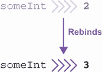
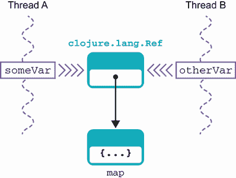
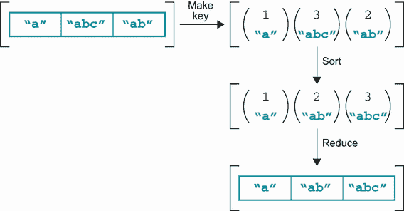

# 10 Clojure：对编程的不同看法

本章涵盖

+   Clojure 的标识和状态概念

+   Clojure 的 REPL

+   Clojure 语法、数据结构和序列

+   Clojure 与 Java 的互操作性

+   Clojure 宏

Clojure 与 Java 以及我们迄今为止研究过的其他语言相比，是一种非常不同的语言风格。Clojure 是 Lisp 这一最古老编程语言之一的 JVM 重启版本。如果你不熟悉 Lisp，不用担心。我们将教你所有关于 Lisp 语言家族的知识，以便你开始学习 Clojure。

注意：由于 Clojure 是一种非常不同的语言，在阅读本章时查阅额外的、针对 Clojure 的资源可能会有所帮助。几本优秀的书籍是《Clojure 实战》（Manning，2011；[`livebook.manning.com/book/clojure-in-action`](https://livebook.manning.com/book/clojure-in-action)）和《Clojure 的乐趣》（Manning，2014；[`livebook.manning.com/book/the-joy-of-clojure-second-edition`](https://livebook.manning.com/book/the-joy-of-clojure-second-edition)）。

除了从经典 Lisp 继承的强大编程技术之外，Clojure 还增加了与现代 Java 开发者非常相关的尖端技术。这种组合使 Clojure 成为 JVM 上的一门突出语言，也是应用开发的一个有吸引力的选择。Clojure 新技术的特定例子包括其并发工具包（我们将在第十六章中遇到）和数据结构（我们将在本章介绍，并在第十五章中进一步展开）。

对于迫不及待想要了解的读者，我们只需说：并发抽象使程序员能够编写比在 Java 中工作时更安全的线程代码。这些抽象可以与 Clojure 的 seq 概念（对集合和数据结构的不同看法）结合使用，以提供强大的开发者工具箱。

要访问所有这些功能，一些重要的语言概念在方法上与 Java 有根本的不同。这种方法的差异使 Clojure 的学习变得有趣，而且可能也会改变你对编程的看法。

注意：学习 Clojure 将帮助你在任何语言中成为一个更好的程序员。函数式编程很重要。

我们将从讨论 Clojure 对状态和变量的方法开始。在几个简单示例之后，我们将介绍语言的基本词汇——与 Java 等语言中的关键字等效的*特殊形式*。其中一小部分用于构建语言的其他部分。

我们还将深入研究 Clojure 的数据结构、循环和函数的语法。这将使我们能够介绍序列，这是 Clojure 最强大的抽象之一。

我们将通过探讨两个非常吸引人的特性来结束本章：紧密的 Java 集成和 Clojure 的惊人宏支持（这是 Lisp 非常灵活语法的关键）。在本书的后面部分，当我们讨论高级函数式编程（第十五章）和高级并发（第十六章）时，我们将遇到更多 Clojure 的优点（以及 Kotlin 和 Java 的示例）。

## 10.1 介绍 Clojure

Lisp 语法的基本单位是一个要评估的表达式。这些表达式通常表示为零个或多个括号内的符号。如果评估成功且没有错误，则该表达式被称为 *形式*。

注意 Clojure 是编译的，而不是解释的，但编译器非常简单。还要记住 Clojure 是动态类型的，所以不会有太多的类型检查错误来帮助你——它们将作为运行时异常出现。

表达式的简单例子包括：

```
0
(+ 3 4)
(list 42)
(quote (a b c))
```

语言的核心真正核心只有很少的内置形式（特殊形式）。它们是 Clojure 对应于 Java 关键字的，但请注意以下内容：

1.  Clojure 对 *keyword* 这个术语有不同的含义，我们稍后会遇到。

1.  Clojure（像所有的 Lisp 语言一样）允许创建与内置语法不可区分的构造。

当使用 Clojure 代码时，你使用的形式是特殊形式还是由它们构建的库函数几乎无关紧要。

让我们从查看 Clojure 与 Java 最重要概念性差异之一的形式开始。这是对状态、变量和存储的处理。如图 10.1 所示，Java（如 Kotlin）有一个涉及变量作为“盒子”（实际上是内存位置）的内存和状态模型，其内容可以随时间改变。


图 10.1 命令式语言内存使用

像 Java 这样的编程语言默认是 *可变的*，因为我们试图改变程序状态，在 Java 中，程序状态由对象组成。遵循此模型的语言通常被称为命令式语言，正如我们在第八章中讨论的那样。

Clojure 略有不同。重要的概念是 *值* 的概念。值可以是数字、字符串、向量、映射、集合或许多其他东西。一旦创建，值就不会改变。这非常重要，所以我们再重复一遍：*一旦创建，Clojure 的值就不能改变*——它们是 *不可变的*。

注意不可变性是用于函数式编程的语言的常见属性，因为它允许使用关于函数属性（例如相同的输入总是产生相同的输出）的数学推理技术。

包含可变内容的盒子的命令式语言模型并不是 Clojure 的工作方式。图 10.2 展示了 Clojure 如何处理状态和内存。它创建了一个名称和值之间的关联。


图 10.2 Clojure 内存使用

这被称为*绑定*，它使用`def`特殊形式来完成。让我们在这里看看`(def)`的语法：

```
(def <name> <value>)
```

不要担心语法看起来有点奇怪——这对于 Lisp 语法来说完全是正常的，你很快就会习惯的。现在你可以假装括号排列得稍微不同一些，并且你像这样调用一个方法：

```
def(<name>, <value>)
```

让我们用一个时间久远的例子来演示`(def)`，这个例子使用了 Clojure 交互环境。

### 10.1.1 Clojure 中的 Hello World

如果你还没有安装 Clojure，你可以在 Mac 上通过运行以下命令来安装：

```
brew install clojure/tools/clojure
```

这将使用 brew 从`clojure/tools`tap 安装命令行工具。对于其他操作系统，可以在[clojure.org](https://clojure.org/)网站上找到说明。

注意，Clojure 在 Windows 上的支持并不那么出色。例如，`clj`仍然处于 alpha 状态。请仔细遵循网站上的说明。

安装完成后，你可以使用`clj`命令启动 Clojure 交互会话。或者，如果你是从源代码构建 Clojure 的，请切换到安装 Clojure 的目录并运行以下命令：

```
java -cp clojure.jar clojure.main
```

无论哪种方式，这都会打开 Clojure 读取-评估-打印循环（REPL）的用户提示。这是交互会话，你通常会在开发 Clojure 代码时花费相当多的时间。它看起来像这样：

```
$ clj
Clojure 1.10.1
user=>
```

`user=>`部分是 Clojure 会话的提示，可以将其视为一个高级调试器或命令行。要退出会话（这将导致会话中累积的所有状态丢失），请使用传统的 Unix 序列`Ctrl-D`。让我们用 Clojure 编写一个“Hello World”程序：

```
user=> (def hello (fn [] "Hello world"))
#'user/hello

user=> (hello)
"Hello world"
user=>
```

在这段代码中，你首先将标识符`hello`绑定到一个值。`(def)`始终将标识符（Clojure 称为*symbols*）绑定到*values*。幕后，它还会创建一个称为*var*的对象，代表绑定（以及符号的名称），如下所示：

```
(def hello (fn [] "Hello world"))
 --- ----- ---------------------
  |    |             |
  |    |           value
  |  symbol
  |
special form
```

你绑定`hello`的值是什么？它就是

```
(fn [] "Hello world")
```

这是一个函数，在 Clojure 中是一个真正的值（因此，因此，不可变）。这是一个不接受任何参数并返回字符串“Hello world”的函数。空参数列表由`[]`表示。

注意，在 Clojure（但不在其他 Lisp 中），方括号表示一个称为向量的线性数据结构——在这种情况下，是函数参数的向量。

绑定后，你通过`(hello)`来执行它。这会导致 Clojure 运行时打印出函数评估的结果，即“Hello world”。

记住，在 Lisp 中，圆括号表示“函数评估”，所以这个例子基本上由以下内容组成：

+   创建一个函数，并将其绑定到符号`hello`。

+   调用绑定到符号`hello`的函数。

到目前为止，你应该输入 Hello World 示例（如果你还没有的话）并看到它表现得如描述的那样。一旦你做到了这一点，我们就可以进一步探索。

### 10.1.2 使用 REPL 开始

REPL 允许你输入 Clojure 代码并执行 Clojure 函数。它是一个交互式环境，早期评估的结果仍然存在。这使你可以进行一种称为*探索性编程*的编程类型，这基本上意味着你可以对代码进行实验。在许多情况下，正确的方法是在 REPL 中进行实验，一旦构建块正确，就构建更大和更大的函数。

注意子划分是函数式编程的关键技术——将问题分解成更小的部分，直到它变得可解或适合于可重用模式（可能已经在标准库中）。

让我们看看更多的 Clojure 语法。首先要注意的是，通过另一个对 `(def)` 的调用，可以更改符号到值的绑定，所以让我们在 REPL 中看看这个动作。我们将实际使用 `(def)` 的一个轻微变体，称为 `(defn)`，如下所示：

```
user=> (hello)
"Hello world"

user=> (defn hello [] "Goodnight Moon")
#'user/hello

user=> (hello)
"Goodnight Moon"
```

注意，直到你更改它，hello 的原始绑定仍然有效——这是 REPL 的一个关键特性。存在状态，即哪些符号绑定到哪些值，并且这种状态在用户输入的行之间持续存在。



图 10.3 Clojure 绑定随时间变化

改变符号绑定到哪个值的能力是 Clojure 对状态修改的替代方案。Clojure 允许符号在不同时间绑定到不同的不可变值，而不是允许存储位置（或“内存盒子”）的内容随时间变化。另一种说法是，var 可以在程序的生命周期内指向不同的值。一个例子可以在图 10.3 中看到。

注意这种可变状态和不同时间不同绑定之间的区别是微妙的，但这是一个重要的概念要掌握。记住，*可变状态*意味着盒子的内容发生变化，而*重新绑定*意味着在不同时间指向不同的盒子。

这在某种程度上类似于 Java 中的 `final` 引用概念。在 Java 中，如果我们说 `final int`，存储位置的内容无法更改。因为 `int` 以位模式存储，这意味着 `int` 的值无法更改。

然而，如果我们说 `final AtomicInteger`，存储位置的 内容再次无法更改。但这种情况是不同的，因为包含原子整数的变量实际上持有对象引用。堆中存储的原子整数对象可以更改其存储的值（而 `Integer` 不能），无论对象引用是否为 final。

我们还在上一个代码片段中巧妙地引入了另一个 Clojure 概念——`(defn)` “定义函数”宏。宏是 Lisp 类语言的关键概念之一。核心思想是尽可能减少内置构造和普通代码之间的区别。

注意：宏允许你创建类似内置语法的表单。宏的创建是一个高级主题，但掌握它们的创建将使你能够制作出非常强大的工具。

系统的真实语言原语（特殊形式）可以用来构建语言的核心，这样你几乎不会注意到两者之间的区别。

注意：`(defn)` 宏是这种类型的例子。它只是将函数值绑定到符号（当然，创建一个合适的变量）的一种稍微简单的方法。它不是一个特殊形式，而是一个由特殊形式 `(def)` 和 `(fn)` 组成的宏。

我们将在本章末尾正确介绍宏。

### 10.1.3 犯错

如果你犯了错误会发生什么？假设你试图声明一个函数，但意外地只 `def` 了一个值，如下所示：

```
user=> (def hello "Goodnight Moon")
#'user/hello

user=> (hello)
Execution error (ClassCastException) at user/eval137 (REPL:1).
class java.lang.String cannot be cast to class clojure.lang.IFn
(java.lang.String is in module java.base of loader 'bootstrap';
clojure.lang.IFn is in unnamed module of loader 'app')
```

这里有几个需要注意的地方。首先，错误是一个运行时异常。这意味着表单 `(hello)` 编译良好；只是在运行时失败了。从 Java 中等效的代码来看，它看起来有点像这样（我们简化了一些东西，以便让 Clojure 或语言实现的新手更容易理解）：

```
// (def hello "Goodnight Moon")
var helloSym = Symbol.of("user", "hello");
var hello = Var.of(helloSym, "Goodnight Moon");

// Or just
// var hello = Var.of(Symbol.of("user", "hello"), "Goodnight Moon");

// #'user/hello

// (hello)
hello.invoke();

// ClassCastException
```

其中 `Symbol` 和 `Var` 是 `clojure.lang` 包中的类，它提供了 Clojure 运行时的核心。它们看起来与以下基本实现相似，我们在这里进行了简化：

```
public class Symbol {
    private final String ns;
    private final String name;

    private Symbol(String ns, String name) {
        this.ns = ns;
        this.name = name;
    }
    // toString() etc
}

public class Var implements IFn {
    private volatile Object root;

    public final Symbol sym;
    public final Namespace ns;

    private Var(Symbol sym, Namespace ns, Object root) {
        this.sym = sym;
        this.ns = ns;
        this.root = root;
    }

    public static Var of(Symbol sym, Object root){
        return new Var(sym, Namespace.of(sym), root);
    }

    static public class Unbound implements IFn {
        final public Var v;
        public Unbound(Var v){
            this.v = v;
        }

        @Override
        public String toString(){
            return "Unbound: " + v;
        }
    }

    public synchronized void bindRoot(Object root) {
        this.root = root;
    }

    public synchronized void unBindRoot(Object root) {
        this.root = new Unbound(this);
    }

    @Override
    public Object invoke() {
        return ((IFn)root).invoke();
    }

    @Override
    public Object invoke(Object o1) {
        return ((IFn)root).invoke(o1);
    }

    @Override
    public Object invoke(Object o1, Object o2) {
        return ((IFn)root).invoke(o1, o2);
    }

    @Override
    public Object invoke(Object o1, Object o2, Object o3) {
        return ((IFn)root).invoke(o1, o2, o3);
    }
    // ...
}
```

非常重要的接口 `IFn` 看起来有点像这样：

```
public interface IFn {
    default Object invoke() {
        return throwArity();
    }
    default Object invoke(Object o1) {
        return throwArity();
    }
    default Object invoke(Object o1, Object o2) {
        return throwArity();
    }
    default Object invoke(Object o1, Object o2, Object o3) {
        return throwArity();
    }

    // ... many others including eventually a variadic form

    default Object throwArity(){
        throw new IllegalArgumentException("Wrong number of args passed: "
                + toString());
    }
}
```

`IFn` 是 Clojure 表单工作方式的关键——表单中的第一个元素被视为要调用的函数或函数名。其余元素是函数的参数，并且调用 `invoke()` 方法（具有适当的参数数量，即 arity）。

如果 Clojure 变量没有绑定到实现 `IFn` 的值，则在运行时会抛出 `ClassCastException`。如果值是 `IFn` 但表单尝试用错误的参数数量调用它，则会抛出 `IllegalArgumentException`（它实际上是一个子类型，称为 `ArityException`）。

注意：记住 Clojure 是动态类型的，正如你在几个地方可以看到的那样，例如，`IFn` 中方法的所有参数和返回类型都是 `Object`，并且 `IFn` 不是 Java 风格的 `@FunctionalInterface`，而是在其上定义了多个方法来处理许多不同的 arity。

这种对底层的窥视应该有助于澄清 Clojure 的语法以及它们是如何结合在一起的。然而，我们仍然有一些损坏的代码需要修复——但幸运的是，这并不太难！

发生的一切只是你的 `hello` 标识符绑定到了一个不是函数的东西上，因此不能被调用。在 REPL 中，你可以通过简单地重新绑定它来修复这个问题：

```
user=> (defn hello [] (println "Dydh da an Nor")) ; "Hello World" in Cornish
#'user/hello

user=> (hello)
Dydh da an Nor
nil
```

如您从前面的代码片段中猜测的那样，分号（`;`）字符表示该行末尾的所有内容都是注释，而`(println)`是打印字符串的函数。请注意，`(println)`，像所有函数一样，返回一个值，该值在函数执行结束时被回显到 REPL 中。

Clojure 没有像 Java 那样的语句，只有表达式，所以所有函数都必须返回一个值。如果没有值要返回，则使用`nil`，这基本上是 Clojure 中 Java 的`null`的等价物。在 Java 中将是`void`的函数在 Clojure 中会返回`nil`。

### 10.1.4 学习热爱括号

程序员的文化一直包含着大量的异想天开和幽默。其中最古老的笑话之一是 Lisp 代表的是*大量令人烦恼的愚蠢括号*（而不是更平淡无奇的真相——它是*列表处理*的缩写）。这个相当自嘲的笑话在一些 Lisp 程序员中很受欢迎，部分原因在于它指出了不幸的真相，那就是 Lisp 的语法有难以学习的名声。

实际上，这个障碍被夸大了。Lisp 的语法与大多数程序员习惯的不同，但它并不是有时被描述的那样一个障碍。此外，Clojure 有几个创新，进一步降低了入门的门槛。

让我们再次看看 Hello World 的例子。要调用返回值“Hello World”的函数，我们写了以下代码：

```
(hello)
```

如果我们想要带有参数的函数，而不是有`myFunction(someObj)`这样的表达式，在 Clojure 中我们写成`(myFunction someObj)`。这种语法称为*波兰记号*，因为它是在 20 世纪初由波兰数学家开发的（它也称为*前缀记号*）。

如果您研究过编译器理论，您可能会想知道这里是否与抽象语法树（AST）等概念有关。简短的答案是是的，有。用波兰记号（通常由 Lisp 程序员称为 s-*expression*）编写的 Clojure（或其他 Lisp）程序可以证明是那个程序 AST 一个非常简单和直接的表现。

注意 这一次又回到了 Clojure 编译器的简单本质。Lisp 代码的编译是一个非常便宜的操作，因为其结构非常接近 AST。

您可以将 Lisp 程序视为直接用其 AST（抽象语法树）编写的。表示 Lisp 程序的数据结构与代码之间没有真正的区别，因此代码和数据非常可互换。这就是为什么记法有些奇怪的原因：它被 Lisp 类语言用来模糊内置原语和用户及库代码之间的区别。这种能力非常强大，以至于它远远超过了新来的 Java 程序员眼中语法的一点点奇怪。让我们深入更多语法，并开始使用 Clojure 构建真实程序。

## 10.2 寻找 Clojure：语法和语义

在上一节中，你遇到了`(def)`和`(fn)`特殊形式（我们也遇到了`(defn)`，但它是一个宏，不是一个特殊形式）。你需要立即了解少量其他特殊形式，以提供语言的基本词汇。此外，Clojure 提供了大量有用的形式和宏，随着实践的深入，对这些形式的了解将更加深入。

Clojure 拥有多种有用的函数，可以执行各种可想象的任务。不要被吓倒——接受它。高兴的是，对于你可能在 Clojure 中遇到的许多实际编程任务，其他人已经为你做了大量的工作。

在本节中，我们将介绍特殊形式的基本工作集，然后过渡到 Clojure 的本地数据类型（Java 集合的等价物）。之后，我们将过渡到编写 Clojure 的自然风格——在这种风格中，函数而不是变量是舞台的中心。JVM 的面向对象性质仍然在表面之下存在，但 Clojure 对函数的强调在纯面向对象语言中并不明显，并且远远超出了`map()`、`filter()`和`reduce()`等基本功能。

### 10.2.1 特殊形式训练营

表 10.1 涵盖了 Clojure 一些最常用特殊形式的定义。为了最好地使用表格，现在快速浏览一下，并在达到 10.3 节及以后的某些示例时需要时参考它。该表格使用传统的正则表达式语法表示法，其中`?`代表单个可选值，`*`代表零个或多个值。

这不是特殊形式的完整列表，其中大部分都有多种使用方式。表 10.1 是一个基本用例的起始集合，并不是全面的。

表 10.1 Clojure 的一些基本特殊形式

| 特殊形式 | 含义 |
| --- | --- |
| `(def <symbol> <value?>)` | 将符号绑定到值（如果提供）；如果需要，为符号创建一个 var |
| `(fn <name>? [<arg>*] <expr>*)` | 返回一个函数值，它接受指定的参数并将它们应用到 exprs 上；通常与`(def)`结合成`(defn)`等形式 |
| `(if <test> <then> <else>?)` | 如果 test 评估为逻辑真，则评估并产生 then；否则，如果存在，评估并产生 else |
| `(do <expr>*)` | 按从左到右的顺序评估 exprs 并产生最后一个 expr 的值 |
| `(let [<binding>*] <expr>*)` | 将值别名到局部名称并隐式定义一个作用域；使别名在 let 的作用域内对所有 exprs 可用 |
| `(quote <form>)` | 返回形式而不进行任何评估；接受一个形式并忽略所有其他参数 |
| `(var <symbol>)` | 返回与符号对应的 var（返回 Clojure JVM 对象，而不是值） |

有几个要点需要进一步解释，因为 Clojure 代码的结构在第一眼看来可能非常不同于 Java 代码。首先，`(do)` 形式是构建在 Java 中会是一个语句块的最简单方法之一。

第二，我们需要更深入地探讨 var、值以及值（暂时）绑定的符号之间的区别。这段简单的代码创建了一个名为 `hi` 的 Clojure var。这是一个 JVM 对象（`clojure.lang.Var` 类型的实例），它生活在堆中——就像所有对象一样——并将其绑定到一个包含“hello”的 `java.lang.String` 对象上：

```
user=> (def hi "Hello")
#'user/hi
```

var 有一个 *符号* `hi`，它还有一个 *命名空间* `user`，Clojure 使用它来组织程序——有点像 Java 包。如果我们不加修饰地使用符号在 REPL 中，它将评估为它当前绑定的值，如下所示：

```
user=> hi
"Hello"
```

在 `(def)` 形式中，我们将新符号绑定到一个值，因此在这段代码中

```
user=> (def bye hi)
#'user/bye
```

符号 `bye` 绑定到当前绑定到 `hi` 的 *值*，如下所示：

```
user=> bye
"Hello"
```

实际上，在这个简单的形式中，`hi` 被评估，符号被替换为结果值。

然而，Clojure 给我们的可能性远不止这些。例如，符号绑定的值可以是任何 JVM 值。因此，我们可以将符号绑定到我们创建的 var 上，因为 var 本身就是一个 JVM 对象。这可以通过使用 `(var)` 特殊形式来实现，如下所示：

```
user=> (def bye (var hi))
#'user/bye

user=> bye
#'user/hi
```

这实际上利用了 Java/JVM 对象总是通过引用来处理的事实，正如我们在图 10.4 中所看到的。



图 10.4 Clojure var 通过引用操作

要获取 var 中包含的值，我们可以使用 `(deref)` 形式（简称“解引用”），如下所示：

```
user=> (deref bye)
"Hello"
```

此外，还有一个 `(ref)` 形式，用于 Clojure 中的安全并发编程——我们将在第十六章中遇到它。

从变量与其当前绑定值的区别来看，`(quote)` 形式应该更容易理解。它不是评估传入的表单，而是简单地返回一个包含未评估符号的表单。

现在你已经对一些基本特殊形式的语法有所了解，让我们转向 Clojure 的数据结构，并开始了解形式如何操作数据。

### 10.2.2 列表、向量、映射和集合

Clojure 有几个原生数据结构。最熟悉的是 *列表*，在 Clojure 中它是一个单链表。

注意：在某些方面，Clojure 列表与 Java 中的 `LinkedList` 类似，但 `LinkedList` 是一个双链表，其中每个元素都指向下一个元素和前一个元素。

列表通常被括号包围，这看似构成了一个轻微的语法障碍，因为圆括号也用于通用形式。特别是，括号用于函数调用的评估。这导致以下常见的初学者语法错误：

```
user=> (1 2 3)
Execution error (ClassCastException) at user/eval1 (REPL:1).
class java.lang.Long cannot be cast to class clojure.lang.IFn
(java.lang.Long is in module java.base of loader 'bootstrap';
clojure.lang.IFn is in unnamed module of loader 'app')
```

这里的问题是，由于 Clojure 对其值非常灵活，它期望第一个参数是一个函数值（或解析为函数的符号），因此它可以调用该函数并将 2 和 3 作为参数传递；1 不是一个函数值的值，所以 Clojure 不能评估这个表达式。我们说这个 *s* 表达式是无效的，并回忆一下，只有有效的 *s* 表达式才是 Clojure 表达式。

解决方案是使用我们在上一节中遇到的 `(quote)` 形式。它有一个方便的简写形式，即 `'`。这给我们提供了两种等效的写法来表示这个列表，它是一个包含三个不可变元素的列表，分别是数字 1、2 和 3，如下所示：

```
user=> '(1 2 3)
(1 2 3)

user=> (quote (1 2 3))
(1 2 3)
```

注意，`(quote)` 以特殊方式处理其参数。特别是，没有尝试评估参数，因此不存在由于第一个槽位缺少函数值而导致的错误。

Clojure 有向量，它们类似于数组（实际上，将列表视为类似于 Java 的 `LinkedList`，将向量视为 `ArrayList` 并不是太离谱）。它们有一个方便的文本形式，使用方括号，所以以下所有内容都是等效的：

```
user=> (vector 1 2 3)
[1 2 3]

user=> (vec '(1 2 3))
[1 2 3]

user=> [1 2 3]
[1 2 3]
```

我们已经遇到了向量。当我们声明 Hello World 函数和其他函数时，我们使用向量来指示声明函数所接受的参数。请注意，`(vec)` 形式接受一个列表并将其转换为向量，而 `(vector)` 是一个接受多个单独符号的格式，并返回它们的向量。

集合的 `(nth)` 函数接受两个参数：一个集合和一个索引。它可以看作类似于 Java 的 `List` 接口中的 `get()` 方法。它可以用于向量、列表，以及 Java 集合，甚至字符串，字符串被视为字符的集合。以下是一个示例：

```
user=> (nth '(1 2 3) 1)
2
```

Clojure 还支持具有这种简单文本语法的映射（你可以将其视为与 Java 的 `HashMap` 非常相似——实际上它们确实实现了 `Map` 接口）：

```
{key1 value1 key2 value2}
```

要从映射中获取值，下面的语法非常简单：

```
user=> (def foo {"aaa" "111" "bbb" "2222"})
#'user/foo

user=> foo
{"aaa" "111", "bbb" "2222"}

user=> (foo "aaa")              ❶
"111"
```

❶ 此语法相当于在 Java 中使用 get() 方法。

除了 `Map` 接口外，Clojure 的映射还实现了 `IFn` 接口，这就是为什么它们可以在 `(foo "aaa")` 这样的形式中使用而不抛出运行时异常。

一个非常有用的风格点是使用前面带有冒号的前缀键。Clojure 将这些称为 *关键字*。

注意：Clojure 中“关键字”的使用，当然与其他语言（包括 Java）中该术语的含义非常不同（在其他语言中，该术语意味着语言语法中保留的部分，不能用作标识符）。

以下是一些关于关键字和映射的有用要点，请记住：

+   Clojure 中的关键字是一个接受一个参数的函数，该参数必须是一个映射。

+   在映射上调用关键字函数会返回映射中对应的关键字函数的值。

+   当使用关键字时，语法中存在一种有用的对称性，因为 `(my-map :key)` 和 `(:key my-map)` 都是合法的。

+   作为值，关键字返回其自身。

+   关键字在使用前不需要声明或 `def`。

+   记住，Clojure 函数是值，因此可以作为映射中的键使用。

+   逗号可以用（但不必要）来分隔键值对，因为 Clojure 将其视为空白字符。

+   除了关键字之外，其他符号也可以用作 Clojure 映射的键，但关键字语法非常有用，并且值得在您的代码风格中强调。

让我们看看这里的一些实际应用：

```
user=> (def martijn {:name "Martijn Verburg", :city "London",
:area "Finsbury Park"})
#'user/martijn

user=> (:name martijn)   ❶
"Martijn Verburg"

user=> (martijn :area)   ❷
"Finsbury Park"

user=> :area             ❸
:area

user=> :foo              ❸
:foo
```

❶ 在映射上调用关键字函数

❷ 在映射中查找与关键字关联的值

❸ 展示了当作为值评估时，关键字返回其自身

除了映射字面量之外，Clojure 还有一个 `(map)` 函数。但不要被误导。与 `(list)` 不同，`(map)` 函数不会生成映射。相反，`(map)` 依次将提供的函数应用于集合中的每个元素，并从返回的新值中构建一个新的集合（实际上是一个 Clojure 序列，您将在第 10.4 节中详细了解），如下所示：

```
user=> (def ben {:name "Ben Evans", :city "Barcelona", :area
"El Born"})
#'user/ben

user=> (def authors [ben martijn])          ❶
#'user/authors

user=> (defn get-name [y] (:name y))
#'user/get-name

user=> (map get-name authors)               ❷
("Ben Evans" "Martijn Verburg")

user=> (map (fn [y] (:name y)) authors)     ❸
("Ben Evans" "Martijn Verburg")
```

❶ 创建一个包含作者数据的映射的向量

❷ 在数据上映射 get-name 函数

❸ 使用内联函数字面量交替形式

`(map)` 有其他形式可以同时处理多个集合，但接受单个集合作为输入的形式是最常见的。

Clojure 还支持集合，它们与 Java 的 `HashSet` 非常相似。它们有数据结构字面量的简短形式，不支持重复键（与 `HashSet` 不同），如下所示：

```
user=> #{"a" "b" "c"}
#{"a" "b" "c"}

user=> #{"a" "b" "a"}
Syntax error reading source at (REPL:15:15).
Duplicate key: a
```

这些数据结构为构建 Clojure 程序提供了基础。

对于 Java 原生用户来说，可能令人惊讶的是，没有立即提到对象作为一等公民。这并不是说 Clojure 不是面向对象的，但它并不像 Java 那样看待面向对象。Java 选择以静态类型的数据和代码包的形式来看待世界，这些数据类型在用户定义的数据类型的显式类定义中。Clojure 强调函数和形式，尽管这些在 JVM 后台作为对象实现。

Clojure 与 Java 之间的这种哲学区别在两种语言编写代码的方式中体现出来，要完全理解 Clojure 的观点，有必要在 Clojure 中编写程序并理解淡化 Java 的面向对象结构所带来的优势。

### 10.2.3 算术、相等和其他操作

Clojure 没有您可能在 Java 中期望的操作符。那么，例如，您会如何添加两个数字？在 Java 中很容易：

```
3 + 4
```

但 Clojure 没有操作符。我们将不得不使用一个函数，如下所示：

```
(add 3 4)   ❶
```

❶ 如果不提供添加函数，这段代码将无法正常工作。

这一切都很好，但我们能做得更好。因为 Clojure 中没有运算符，所以我们不需要为它们保留键盘上的任何字符。这意味着我们的函数名可以比 Java 中更奇特，因此我们可以写出这个：

```
(+ 3 4)   ❶
```

❶ 这实际上是前面讨论过的波兰表示法。

Clojure 的函数在许多情况下是 *可变参数*（它们接受可变数量的输入），所以例如，你可以写出这个：

```
(+ 1 2 3)
```

这将返回值 6。

对于等价形式（Java 中的 `equals()` 和 `==` 的等价物），情况要复杂一些。Clojure 有两个与等价相关的形式：`(=)` 和 `(identical?)`。请注意，这些都是 Clojure 中没有运算符的例子，这意味着函数名中可以使用的字符更多。此外，`(=)` 是一个等号，因为在 Java 类语言中不存在相同的赋值概念。

这段 REPL 代码设置了一个列表 `list-int` 和一个向量 `vect-int`，并像这样应用了等价逻辑：

```
user=> (def list-int '(1 2 3 4))
#'user/list-int

user=> (def vect-int (vec list-int))
#'user/vect-int

user=> (= vect-int list-int)
true

user=> (identical? vect-int list-int)
false
```

关键点是 `(=)` 形式在集合中检查集合是否包含相同顺序的相同对象（对于 `list-int` 和 `vect-int` 来说是真的），而 `(identical?)` 检查它们是否真的是同一个对象。

你可能还会注意到我们的符号名不使用驼峰式命名法。这在 Clojure 中很常见。符号通常全部小写，单词之间用连字符分隔（有时称为 *kebab case*）。

Clojure 中的真和假

Clojure 为逻辑假提供了两个值：`false` 和 `nil`。任何其他内容都是逻辑真（包括字面量 `true`）。这与许多动态语言（例如 JavaScript）中的情况相似，但对于第一次遇到这种情况的 Java 程序员来说可能有点奇怪。

在掌握了基本的数据结构和运算符之后，让我们将一些我们看到的特殊形式和函数组合起来，编写一些稍微长一点的 Clojure 函数示例。

### 10.2.4 在 Clojure 中处理函数

在本节中，我们将开始处理 Clojure 编程的一些主要内容。我们将开始编写作用于数据的函数，并将 Clojure 对函数的关注重点突出。接下来是 Clojure 的循环结构，然后是读取宏和调度形式。我们将通过讨论 Clojure 对函数式编程的方法及其对闭包的看法来结束本节。

开始做所有这些的最佳方式是通过示例，所以让我们从几个简单的示例开始，逐步构建 Clojure 提供的一些强大的函数式编程技术。

一些简单的 Clojure 函数

下一个列表定义了三个函数，其中两个是非常简单的单参数函数；第三个稍微复杂一些。

列表 10.1 定义简单的 Clojure 函数

```
(defn const-fun1 [y] 1)

(defn ident-fun [y] y)

(defn list-maker-fun [x f]      ❶
   (map (fn [z] (let [w z]      ❷
       (list w (f w))           ❸
   )) x))
```

❶ 列表生成器接受两个参数，第二个参数是一个函数。

❷ 一个内联的匿名函数

❸ 创建一个包含两个元素的列表：值和将 f 应用到值的结果

在这个列表中，`(const-fun1)`接受一个值并返回 1，而`(ident-fun)`接受一个值并返回相同的值。数学家会称这些为*常函数*和*恒等函数*。你还可以看到，函数的定义使用向量字面量来表示函数的参数和`(let)`形式。

第三个函数更复杂。函数`(list-maker-fun)`接受两个参数：首先是一个要操作的值向量，称为`x`，其次是一个函数（称为`f`）。如果我们用 Java 来写，它可能看起来像这样：

```
    public List<Object> listMakerFun(List<Object> x,
                                     Function<Object, Object> f) {
        return x.stream()
                .map(o -> List.of(o, f.apply(o)))
                .collect(toList());
    }
```

Clojure 中内联匿名函数的作用在 Java 代码中由 lambda 表达式扮演。然而，不要过分强调这两个代码列表（Clojure 和 Java）之间的等价性——Clojure 和 Java 是*非常*不同的语言。

注意：接受其他函数作为参数的函数称为高阶函数。我们将在第十五章中详细介绍它们。

让我们看看`(list-maker-fun)`是如何工作的。

列表 10.2 函数操作

```
user=> (list-maker-fun ["a"] const-fun1)
(("a" 1))

user=> (list-maker-fun ["a" "b"] const-fun1)
(("a" 1) ("b" 1))

user=> (list-maker-fun [2 1 3] ident-fun)
((2 2) (1 1) (3 3))

user=> (list-maker-fun [2 1 3] "a")
java.lang.ClassCastException: java.lang.String cannot be cast to
  clojure.lang.IFn
```

注意，当你将这些表达式输入到 REPL 中时，你是在与 Clojure 编译器交互。表达式`(list-maker-fun [2 1 3] "a")`无法运行（尽管它可以编译），因为`(list-maker-fun)`期望其第二个参数是一个函数，而字符串不是。所以尽管 Clojure 编译器为该形式输出了字节码，但它会因运行时异常而失败。

注意：在 Java 中，我们可以编写有效的代码，如`Integer.parseInt("foo")`，它将编译良好，但在运行时总是会失败。Clojure 的情况类似。

这个例子表明，在与 REPL 交互时，你仍然有一定程度的静态类型检查，因为 Clojure 不是一种解释型语言。即使在 REPL 中，每个被类型化的 Clojure 形式都会编译成 JVM 字节码，并链接到运行系统中。当定义 Clojure 函数时，它会编译成 JVM 字节码，因此`ClassCastException`是由于 JVM 中的静态类型违规而发生的。

列表 10.3 展示了更长的 Clojure 代码片段，即*Schwartzian 转换*。这是编程历史的一部分，在 20 世纪 90 年代由 Perl 编程语言普及。其想法是在向量上执行排序操作，不是基于提供的向量，而是基于向量元素的某些属性。要排序的属性值是通过在元素上调用*键函数*来找到的。

列表 10.3 中 Schwartzian 转换的定义调用了键函数`key-fn`。当你实际想要调用`(schwartz)`函数时，你需要提供一个用于键的函数。在这个代码示例中，我们使用了列表 10.1 中的老朋友`(ident-fun)`。

列表 10.3 Schwartzian 转换

```
user=> (defn schwartz [x key-fn]
  (map (fn [y] (nth y 0))             ❶
    (sort-by (fn [t] (nth t 1))       ❷
      (map (fn [z] (let [w z]         ❸
        (list w (key-fn w))
      )) x))))
#'user/schwartz

user=> (schwartz [2 3 1 5 4] ident-fun)
(1 2 3 4 5)

user=> (apply schwartz [[2 3 1 5 4] ident-fun])
(1 2 3 4 5)
```

❶ 使用键函数创建由对组成的列表

❷ 根据键函数的值对对进行排序

❸ 通过减少操作——只从每个对中取原始值来构建新的列表

这段代码正在执行三个独立的步骤，乍一看可能显得有些反直觉。这些步骤在图 10.5 中展示。



图 10.5 Schwartzian 转换

注意，在列表 10.3 中，我们引入了一个新的形式：`(sort-by)`。这是一个接受两个参数的函数：一个用于排序的函数和一个要排序的向量。我们还展示了 `(apply)` 形式，它接受两个参数：一个要调用的函数和一个传递给它的参数向量。

Schwartzian 转换的一个有趣方面是，为其命名的人故意模仿 Lisp，当他提出 Perl 版本时。在这里用 Clojure 代码表示它意味着我们已经回到了起点——再次回到了 Lisp！

Schwartzian 转换是一个有用的例子，我们稍后会再次提到它。它包含足够的复杂性来展示许多有用的概念。现在让我们继续讨论 Clojure 中的循环，这些循环的工作方式可能与你习惯的不同。

### 10.2.5 Clojure 中的循环

Java 中的循环相当直接：开发者可以从 `for`、`while` 和几种其他循环类型中选择。通常，中心概念是重复一组语句，直到满足一个条件（通常用可变变量来表示）。

这在 Clojure 中给我们带来了一点难题：当没有可变的变量可以作为循环索引时，我们如何表达 `for` 循环？在更传统的 Lisp 中，这种情况通常通过将迭代循环重写为使用递归的形式来解决。

然而，JVM 不保证优化尾递归（如 Scheme 和其他 Lisp 所需），因此天真地使用递归可能会导致堆栈溢出。我们将在第十五章中更多关于这个问题进行讨论。

相反，Clojure 提供了一些有用的构造，允许在不增加堆栈大小的情况下进行循环。其中最常见的是 `loop-recur`。下面的代码片段展示了如何使用 `loop-recur` 来构建一个类似于 Java for 循环的简单结构：

```
(defn like-for [counter]
  (loop [ctr counter]      ❶
    (println ctr)
    (if (< ctr 10)
      (recur (inc ctr))    ❷
      ctr
   )))
```

❶ 循环入口点

❷ 回跳的递归点

`(loop)` 形式接受一个局部符号名称的向量作为参数——实际上就像 `(let)` 一样是别名。然后，当执行达到 `(recur)` 形式时（在这个例子中，只有当 `ctr` 别名小于 10 时才会这样做），`(recur)` 将控制权分支回 `(loop)` 形式，但带有新的指定值。这类似于一个相当原始的 Java 循环结构，如下所示：

```
public int likeFor(int ctr) {
        LOOP: while (true) {
            System.out.println(ctr);
            if (ctr < 10) {
                ctr = ctr + 1;
                continue LOOP;
            } else {
                return ctr;
            }
        }
    }
```

然而，对于函数式程序员来说，提前返回的唯一常见原因是满足某些条件。然而，函数返回最后一个评估的表达式的结果，而 `(if)` 已经为我们做了这件事。

在我们的例子中，我们将 `(recur)` 放在 `if` 的主体中，将计数值放在 `else` 位置。这允许我们构建迭代式结构（例如 Java 的 `for` 和 `while` 循环的等效形式），同时仍然保持实现的函数式风格。我们现在将转向下一个主题，即探讨 Clojure 语法中有用的缩写，以帮助使您的程序更短、更简洁。

### 10.2.6 读取宏和分派

Clojure 有一些语法特性会令许多 Java 程序员感到惊讶。其中之一是缺乏运算符。这导致放松了 Java 对函数名中可以使用哪些字符的限制。您已经遇到了像 `(identical?)` 这样的函数，这在 Java 中是非法的，但我们还没有解决在符号中允许或不允许使用哪些字符的问题。

表 10.2 列出了不允许在 Clojure 符号中使用的字符。这些字符都是 Clojure 解析器为其自身使用保留的。它们通常被称为 *读取宏*，并且实际上是一个特殊的字符序列，当读取器（Clojure 编译器的第一部分）看到它时，会修改读取器的行为。

例如，`;` 读取宏是 Clojure 实现单行注释的方式。当读取器看到 `;` 时，它会立即忽略该行上剩余的所有字符，然后重置以获取下一行的输入。

注意：稍后我们将遇到 Clojure 的一般（或常规）宏。不要将读取宏与常规宏混淆。

读取宏仅用于语法简洁和方便，而不是提供完整的通用元编程能力。

表 10.2 读取宏

| 字符 | 名称 | 含义 |
| --- | --- | --- |
| `'` | 引用 | 展开为 `(quote)`；返回未经评估的形式 |
| `;` | 注释 | 标记注释直到行尾；类似于 Java 中的 `//` |
| `\` | 字符 | 生成一个字面字符，例如，`\n` 表示换行符 |
| `@` | 解引用 | 展开为 `(deref)`，它接受一个 var 对象并返回该对象中的值（`(var)` 表达式的相反操作）；在事务内存上下文中具有额外的意义（见第十五章） |
| `^` | 元数据 | 将元数据映射附加到对象上；有关详细信息，请参阅 Clojure 文档 |
| `` ` `` | 语法引用 | 常用于宏定义的引用形式；有关详细信息，请参阅宏部分 |
| `#` | 分派 | 有几个不同的子形式；见表 10.3 |

分派读取宏有几个不同的子形式，具体取决于 `#` 字符后面的内容。表 10.3 展示了不同的可能形式。

表 10.3 分派读取宏的子形式

| 分派形式 | 含义 |
| --- | --- |
| `#'` | 展开为 `(var)` |
| `#{}` | 创建一个集合字面量，如第 10.2.2 节所述 |
| `#()` | 创建一个匿名函数字面量；在单次使用时比 `(fn)` 更简洁 |
| `#_` | 跳过下一个形式；可以通过 #_( ... 多行 ...) 产生多行注释 |
| `#"<pattern>"` | 创建一个正则表达式字面量（作为 `java.util.regex.Pattern` 对象） |

从分派形式中可以得出几个额外的观点。下面的 var-quote (`#'`) 形式解释了为什么在 `(def)` 之后 REPL 的行为是这样的：

```
user=> (def someSymbol)

#'user/someSymbol
```

`(def)` 形式返回一个新创建的名为 `someSymbol` 的 var 对象，它位于当前命名空间中（在 REPL 中是 `user`），因此 `#'user/someSymbol` 是 `(def)` 返回的完整值。

匿名函数字面量 `#()` 也有一个重大的创新，可以减少冗余——它省略了参数向量，而是使用一种特殊的语法来允许 Clojure 读取器推断函数字面量所需的参数数量。该语法是 `%N`，其中 N 是函数参数的编号。

让我们回到一个早期的例子，看看如何使用匿名函数。回想一下 `(list-maker-fun)` 这个函数，它接受两个参数（一个列表和一个函数），并通过依次将函数应用于列表中的每个元素来创建一个新的列表：

```
(defn list-maker-fun [x f]
   (map (fn [z] (let [w z]
       (list w (f w))
   )) x))
```

而不是费尽心思定义一个单独的符号，我们可以如下使用内联函数调用这个函数：

```
user=> (list-maker-fun ["a" "b"] (fn [x] x))
(("a" "a") ("b" "b"))
```

但我们可以更进一步，并像这样使用紧凑的 `#()` 语法：

```
user=> (list-maker-fun ["a" "b"] #(do %1))
(("a" "a") ("b" "b"))
```

这个例子有点不寻常，因为我们使用了之前在基本特殊形式表中遇到过的 `(do)` 形式，但它确实有效。现在，让我们使用 `#()` 形式简化 `(list-maker-fun)` 本身：

```
(defn list-maker-fun [x f]
   (map #(list %1 (f %1)) x))
```

Schwartzian 转换也是一个很好的用例，可以展示如何在更复杂的示例中使用这种语法，如以下代码示例所示。

列表 10.4 重新编写的 Schwartzian 转换

```
(defn schwartz [x key-fn]
  (map #(nth %1 0)               ❶
    (sort-by #(nth %1 1)         ❶
      (map #(let [w %1]          ❶
        (list w (key-fn w))
      ) x))))
```

❶ 对应于三个步骤的匿名函数字面量

使用 %1 作为函数字面量参数的占位符（以及 %2、%3 等后续参数），使使用方式非常突出，并使代码更容易阅读。这个视觉线索对程序员来说确实很有帮助，类似于 Java 中 lambda 表达式使用的箭头符号。

正如你所见，Clojure 严重依赖于函数作为计算基本单元的概念，而不是像 Java 这样的语言中的对象。这种方法的自然环境是函数式编程，这是我们下一个主题。

## 10.3 函数式编程和闭包

现在，我们将转向 Clojure 中令人畏惧的函数式编程世界。或者，更确切地说，我们并没有，因为其实并没有那么可怕。事实上，我们已经在整个章节中进行了函数式编程；我们只是没有告诉你不要因此而感到沮丧。

正如我们在第 8.1.3 节中提到的，函数式编程是一个有些模糊的概念——它所能依赖的含义仅仅是一个函数是一个值。函数可以被传递、放置在变量中并像`2`或`"hello."`一样被操作。但这又如何呢？我们在我们的第一个例子中就做过：`(def hello (fn [] "Hello world"))`。我们创建了一个函数（一个不接受任何参数并返回字符串`"Hello world"`的函数），并将其绑定到符号`hello`。函数只是一个值，与像`2`这样的值没有本质的不同。

在第 10.3 节中，我们介绍了 Schwartzian 转换作为接受另一个函数作为输入值的函数的例子。同样，这只是一个接受特定类型作为其输入参数之一的函数。它唯一的不同之处在于它接受的类型是一个函数。

现在可能也是介绍`(filter)`形式的好时机，它应该会让你想起 Java Streams 中类似命名的方法：

```
user=> (defn gt4 [x] (> x 4))
#'user/gt4
user=> (filter gt4 [1 2 3 4 5 6])
(5 6)
```

此外，还有`(reduce)`形式，用于完成 filter-map-reduce 操作集。它最常见有两种变体，一种接受一个初始起始值（有时称为“零”），另一种则不：

```
user=> (reduce + 1 [2 3 4 5])
15
user=> (reduce + [1 2 3 4 5])
15
```

关于闭包呢？当然，它们一定很可怕，对吧？其实并没有那么可怕。让我们看看一个简单的例子，希望它能让你想起我们在第九章为 Kotlin 做的例子：

```
user=> (defn adder [constToAdd] #(+ constToAdd %1))
#'user/adder

user=> (def plus2 (adder 2))
#'user/plus2

user=> (plus2 3)
5

user=> 1:9 user=> (plus2 5)
7
```

你首先设置一个名为`(adder)`的函数。这是一个创建其他函数的函数。如果你熟悉 Java 中的工厂方法模式，你可以将其视为 Clojure 的类似物。函数返回其他函数作为其返回值并没有什么奇怪——这是函数只是普通值的概念的关键部分。

注意，这个例子使用了匿名函数字面量的缩写形式`#()`。`(adder)`函数接受一个数字并返回一个函数，而返回的函数接受一个参数。

然后，你使用`(adder)`来定义一个新的形式：`(plus2)`。这是一个接受一个数值参数并将其加 2 的函数。在`(adder)`内部绑定到`constToAdd`的值是`2`。现在让我们创建一个新的函数：

```
user=> (def plus3 (adder 3))
#'user/plus3

user=> (plus3 4)
7

user=> (plus2 4)
6
```

这表明你可以创建一个不同的函数`(plus3)`，它将不同的值绑定到`constToAdd`。我们说函数`(plus3)`和`(plus2)`已经*捕获*或*封闭*了它们环境中的值。请注意，`(plus3)`和`(plus2)`捕获的值是不同的，并且定义`(plus3)`对`(plus2)`捕获的值没有影响。

封闭其环境中的某些值的函数被称为*闭包*；`(plus2)`和`(plus3)`是闭包的例子。函数创建函数返回另一个更简单的函数，该函数已经封闭了某些内容，这种模式在具有闭包的语言中非常常见。

注意请记住，尽管 Clojure 会编译任何语法上有效的形式，但如果函数以错误数量的参数被调用，程序将抛出运行时异常。一个需要两个参数的函数不能在期望一个参数的地方使用。

我们将在第十五章中详细介绍关于在上下文中使用函数式编程的更多内容。现在，让我们转向 Clojure 的一个强大功能——序列。

## 10.4 介绍 Clojure 序列

Clojure 有一个强大的核心抽象，称为*序列*或更常见的是*seq*。

注意序列是利用 Clojure 语言优势编写代码的重要组成部分，并且它们将与 Java 处理类似概念的方式形成有趣的对比。

序列类型大致对应于 Java 中的集合和迭代器，但序列具有不同的属性。基本思想是序列本质上合并了 Java 这两种类型的一些特性到一个概念中。这是由想要以下三个东西所驱动的：

+   不可变性，允许序列在函数（和线程）之间传递而不会出现问题

+   一个更健壮的类似迭代器的抽象，特别是对于多遍算法

+   *延迟序列*的可能性（稍后详细介绍）

在这三者中，Java 程序员有时最难以理解的是不可变性。Java 的迭代器概念本质上是可变的，部分原因是因为它没有提供一个干净可分离的接口。事实上，Java 的`Iterator`违反了单一责任原则，因为当调用`next()`时，它执行以下两个逻辑上不同的操作：

+   它返回当前指向的元素。

+   它通过前进元素指针来突变迭代器。

序列基于函数式思想，并通过以不同的方式分割`hasNext()`和`next()`的能力来避免突变。让我们来认识 Clojure 最重要的接口之一的一个稍微简化的版本，即`clojure.lang.ISeq`：

```
interface ISeq {
    Object first();      ❶
    ISeq rest();         ❷
}
```

❶ 返回序列中的第一个对象

❷ 返回一个包含旧序列所有元素的新序列，除了第一个

现在，序列永远不会被突变。相反，每次我们调用`rest()`时，都会创建一个新的序列值，这是我们在迭代器移动到下一个值时应该执行的操作。让我们看看一些代码，以展示我们如何在 Java 中实现这一点：

```
public class ArraySeq implements ISeq {
    private final int index;                            ❶
    private final Object[] values;                      ❶

    private ArraySeq(int index, Object[] values) {
        this.index = index;
        this.values = values;
    }

    public static ArraySeq of(List<Object> objects) {   ❷
        if (objects == null || objects.size() == 0) {
            return Empty.of();
        }
        return new ArraySeq(0, objects.toArray());
    }

    @Override
    public Object first() {
        return values[index];
    }

    @Override
    public ISeq rest() {
        if (index >= values.length - 1) {
            return Empty.of();                          ❸
        }
        return new ArraySeq(index + 1, values);
    }

    public int count() {
        return values.length - index;
    }
}
```

❶ 最终字段

❷ 一个接受列表的工厂方法

❸ 需要一个空的实现

如您所见，我们需要一个特殊的序列来表示序列的末尾。让我们将其表示为`ArraySeq`内部的内部类，如下所示：

```
    public static class Empty extends ArraySeq {
        private static Empty EMPTY = new Empty(-1, null);

        private Empty(int index, Object[] values) {
            super(index, values);
        }

        public static Empty of() {
            return EMPTY;
        }

        @Override
        public Object first() {
            return null;
        }

        @Override
        public ISeq rest() {
            return of();
        }

        public int count() {
            return 0;
        }
    }
```

让我们看看它是如何付诸实践的：

```
ISeq seq = ArraySeq.of(List.of(10000,20000,30000));
var o1 = seq.first();
var o2 = seq.first();
System.out.println(o1 == o2);
```

如预期的那样，对`first()`的调用是*幂等的*——它们不会改变序列，并且会重复返回相同的值。

让我们看看我们如何使用`ISeq`在 Java 中编写循环：

```
while (seq.first() != null) {
    System.out.println(seq.first());
    seq = seq.rest();
}
```

这个例子展示了我们如何处理一些 Java 程序员有时对不可变序列方法提出的反对意见：“那么所有垃圾怎么办？”

确实，每次调用 `rest()` 都会创建一个新的序列，这是一个对象。然而，如果你仔细查看实现代码，你可以看到我们非常小心地没有复制 `values`——数组存储。复制那将是昂贵的，所以我们不做那件事。

我们在每一步实际上只是创建了一个包含整数和对象引用的小对象。如果这些临时变量没有存储在任何地方，当我们在序列中向下移动时，它们会超出作用域，并且很快就会成为垃圾回收的候选对象。

注意：`Empty` 的方法体不引用 `index` 或 `values`，因此我们可以自由地使用特殊值（-1 和 `null`），这些值无法通过 `ArraySeq` 的任何其他实例访问——这是一个调试辅助工具。

现在我们已经解释了使用 Java 解释序列理论的一些理论，让我们切换回 Clojure。

注意：所有 Clojure 序列实现的实际 `ISeq` 接口比我们之前遇到的情况要复杂一些，但基本意图是相同的。

表 10.4 展示了一些与序列相关的核心函数。请注意，这些函数都不会修改它们的输入参数；如果它们需要返回不同的值，它将是一个不同的序列。

表 10.4 基本序列函数

| 函数 | 影响 |
| --- | --- |
| `(seq <coll>)` | 返回一个序列，作为对所作用集合的“视图” |
| `(first <coll>)` | 如果需要，首先调用 (`seq`)，返回集合的第一个元素；如果集合为空，则返回 nil |
| `(rest <coll>)` | 返回一个新的序列，由集合生成，但不包含第一个元素 |
| `(seq? <o>)` | 如果 `o` 是一个序列（意味着，如果它实现了 `ISeq`），则返回 true |
| `(cons <elt> <coll>)` | 返回一个由集合生成的序列，额外元素被添加到前面 |
| `(conj <coll> <elt>)` | 返回一个新的集合，新元素被添加到适当的位置——对于向量是末尾，对于列表是头部 |
| `(every? <pred-fn> <coll>)` | 如果 `(pred-fn)` 对集合中的每个元素都返回逻辑真值，则返回 true |

Clojure 与其他 Lisp 语言不同，因为 `(cons)` 需要第二个参数是一个集合（或者，实际上是一个 `ISeq`）。一般来说，许多 Clojure 程序员更喜欢使用 `(conj)` 而不是 `(cons)`。以下是一些示例：

```
user=> (rest '(1 2 3))
(2 3)

user=> (first '(1 2 3))
1

user=> (rest [1 2 3])
(2 3)

user=> (seq ())
nil

user=> (seq [])
nil

user=> (cons 1 [2 3])
(1 2 3)

user=> (every? is-prime [2 3 5 7 11])
true
```

需要注意的一个重要观点是，Clojure 列表是它们自己的序列，但向量不是。理论上，你不应该能够在向量上调用 `(rest)`。你能够这样做的原因是 `(rest)` 在操作之前会调用 `(seq)` 来处理向量。

注意：许多序列函数接受比序列更通用的对象，并在开始之前调用 `(seq)`。

在下一节中，我们将探讨序列抽象的一些基本属性和用法，特别关注可变参数函数。稍后，在第十五章中，我们将遇到惰性序列——这是一种非常重要的函数技术。

### 10.4.1 序列和可变参数函数

我们一直推迟讨论 Clojure 对函数方法的强大功能之一，直到现在。这是函数自然具有可变数量参数的能力，有时称为函数的*arity*。接受可变数量参数的函数称为*可变参数*函数，它们在操作序列时经常被使用。

注意 Java 支持可变方法，其语法中方法的最后一个参数在类型上以`...`表示，以指示参数列表末尾允许任何数量的该类型参数。

作为一个非常简单的例子，考虑我们在列表 10.1 中讨论的常量函数`(const-fun1)`。这个函数接受一个参数并丢弃它，总是返回值 1。但是，考虑当你像这样传递多个参数给`(const-fun1)`时会发生什么：

```
user=> (const-fun1 2 3)
java.lang.IllegalArgumentException:
  Wrong number of args (2) passed to: user$const-fun1 (repl-1:32)
```

Clojure 编译器无法在编译时对`(const-fun1)`传递的参数数量（和类型）执行静态检查，因此我们不得不冒运行时异常的风险。

这似乎过于严格，尤其是对于一个简单地丢弃所有参数并返回一个常量值的函数。在 Clojure 中，一个可以接受任意数量参数的函数看起来会是什么样子？

下面的列表展示了如何为章节中较早提到的`(const-fun1)`常量函数的版本执行此操作。我们将其命名为`(const-fun-arity1)`，表示具有变量*arity*的*常量函数 1*。

注意实际上，这是一个 Clojure 标准函数库中提供的`(constantly)`函数的自制版本。

列表 10.5 可变参数函数

```
user=> (defn const-fun-arity1
  ([] 1)                        ❶
  ([x] 1)                       ❶
  ([x & more] 1)                ❶
)
#'user/const-fun-arity1

user=> (const-fun-arity1)
1

user=> (const-fun-arity1 2)
1

user=> (const-fun-arity1 2 3 4)
1
```

❶ 具有不同签名的多个函数定义

关键在于，函数定义后面不是函数参数的向量以及定义函数行为的表单。相反，有一系列成对出现的内容，每个成对由参数的向量（实际上是该版本函数的签名）和该版本函数的实现组成。

这可以被视为类似于 Java 中的方法重载的概念。或者，它也可以被视为与模式匹配（我们在第三章中遇到过的）相关。然而，由于 Clojure 是一种动态类型语言，没有类型模式的等价物，因此这种联系并不像可能的那样紧密。

通常的约定是定义几种特殊情况的形式（这些形式接受零个、一个或两个参数）以及一个额外的形式，其最后一个参数是一个序列。在列表 10.5 中，这是具有参数向量`[x & more]`的形式。`&`符号表示这是函数的可变版本。

序列是 Clojure 的一项强大创新。实际上，学习如何在 Clojure 中思考的大部分内容就是开始思考如何将 seq 抽象应用于解决你特定的编码问题。Clojure 的另一个重要创新是 Clojure 与 Java 之间的集成，这是下一节的主题。

## 10.5 在 Clojure 和 Java 之间进行互操作

Clojure 是从头开始设计的，旨在成为 JVM 语言，并且不试图完全隐藏 JVM 的特性给程序员。这些具体的设计选择在许多地方都很明显。例如，在类型系统级别，Clojure 的列表和向量都实现了 `List`——Java 集合库的标准接口。此外，从 Clojure 使用 Java 库以及反之亦然都非常容易。这些特性非常有用，因为 Clojure 程序员可以利用丰富的 Java 库和工具，以及 JVM 的性能和其他功能。

在本节中，我们将介绍这个互操作性决策的多个方面，特别是：

+   从 Clojure 调用 Java

+   Java 如何看待 Clojure 函数的类型

+   Clojure 代理

+   使用 REPL 进行探索性编程

+   从 Java 调用 Clojure

让我们通过查看如何从 Clojure 访问 Java 方法来开始探索这种集成。

### 10.5.1 从 Clojure 调用 Java

考虑以下在 REPL 中评估的 Clojure 代码片段：

```
user=> (defn lenStr [y] (.length (.toString y)))
#'user/lenStr

user=> (schwartz ["bab" "aa" "dgfwg" "droopy"] lenStr)
("aa" "bab" "dgfwg" "droopy")
```

在这个片段中，我们使用了 Schwartzian 转换来按字符串长度对字符串向量进行排序。为此，我们使用了 `(.toString)` 和 `(.length)` 形式，它们是 Java 方法。它们被调用在 Clojure 对象上。符号开头的点表示运行时应该在下一个参数上调用命名方法。这是通过使用我们尚未遇到的另一个宏 `(.)` 来实现的。

回想一下，所有通过 `(def)` 或其变体定义的 Clojure 值都被放置在 `clojure.lang.Var` 的实例中，它可以容纳任何 `java.lang.Object`，因此可以在 Clojure 值上调用任何可以在 `java.lang.Object` 上调用的方法。与其他与 Java 世界交互的形式一样

```
(System/getProperty "java.vm.version")
```

调用静态方法（在这种情况下是 `System.getProperty()` 方法）和

```
Boolean/TRUE
```

用于访问静态公共变量（例如常量）。

熟悉的“Hello World”示例看起来像这样：

```
user=> (.println System/out "Hello World")
Hello World
nil
```

注意，最后的 `nil` 是因为，当然，所有 Clojure 表达式都必须返回一个值，即使它们是对 `void` Java 方法的调用。

在这三个示例中，我们隐式地使用了 Clojure 的命名空间概念，这与 Java 包类似，并为常见情况（如前面所述）提供了从简写形式到 Java 包名的映射。

### 10.5.2 Clojure 调用的本质

Clojure 中的函数调用被编译成 JVM 方法调用。JVM 不保证优化掉尾递归，而 Lisp（尤其是 Scheme 实现）通常都会这样做。一些其他在 JVM 上的 Lisp 方言持有一个观点，即它们想要真正的尾递归，因此它们准备让 Lisp 函数调用在所有情况下都不完全等同于 JVM 方法调用。然而，Clojure 却完全拥抱 JVM 作为平台，即使这意味着完全遵守通常的 Lisp 实践。

如果你想在 Clojure 中创建一个新的 Java 对象实例并对其进行操作，你可以通过使用`(new)`形式轻松做到这一点。它有一个简短的替代形式，即类名后跟一个全点，这归结为`(.)`宏的另一种用法，如下所示：

```
(import '(java.util.concurrent CountDownLatch LinkedBlockingQueue))

(def cdl (new CountDownLatch 2))

(def lbq (LinkedBlockingQueue.))
```

在这里，我们也在使用`(import)`形式，它允许在单行中导入一个包中的多个 Java 类。

我们之前提到，Clojure 的类型系统与 Java 的类型系统有一定的对应关系。让我们更详细地看看这个概念。

### 10.5.3 Clojure 值的 Java 类型

从 REPL 中，查看一些 Clojure 值的 Java 类型非常简单，如下所示：

```
user=> (.getClass "foo")
java.lang.String

user=> (.getClass 2.3)
java.lang.Double

user=> (.getClass [1 2 3])
clojure.lang.PersistentVector

user=> (.getClass '(1 2 3))
clojure.lang.PersistentList

user=> (.getClass (fn [] "Hello world!"))
user$eval110$fn__111
```

首先要注意的是，所有 Clojure 值都是对象；JVM 的原始类型默认不暴露（尽管有方法可以获取性能敏感的原始类型）。正如你所期望的，字符串和数值值直接映射到相应的 Java 引用类型（`java.lang.String`、`java.lang.Double`等）。

匿名的“Hello world!”函数有一个表明它是动态生成类实例的名称。这个类将实现`IFn`接口，这是 Clojure 用来指示一个值是函数的非常重要的接口。

如我们之前讨论的，seqs 实现了`ISeq`接口。它们通常是抽象的`ASeq`的具体系列之一或懒实现`LazySeq`（我们将在第十五章讨论高级函数式编程时遇到懒加载）。

我们已经探讨了各种值的类型，但那些值的存储呢？正如我们在本章开头提到的，`(def)`将一个符号绑定到一个值，并在这样做的同时创建一个 var。这些 var 是类型为`clojure.lang.Var`的对象（它实现了`IFn`以及其他接口）。

### 10.5.4 使用 Clojure 代理

Clojure 有一个强大的宏叫做`(proxy)`，它允许你创建一个真正的 Clojure 对象，该对象扩展 Java 类（或实现接口）。例如，下一个列表回顾了一个早期的例子（使用第六章中的`ScheduledThreadPoolExecutor`），但由于 Clojure 更紧凑的语法，执行示例的核心现在只需很少的代码。

列表 10.6 重访计划执行器

```
(import '(java.util.concurrent Executors LinkedBlockingQueue TimeUnit))

(def stpe (Executors/newScheduledThreadPool 2))            ❶

(def lbq (LinkedBlockingQueue.))

(def msgRdr (proxy [Runnable] []                           ❷
  (run [] (.println System/out (.toString (.poll lbq))))
))

(def rdrHndl
  (.scheduleAtFixedRate stpe msgRdr 10 10 TimeUnit/MILLISECONDS))
```

❶ 创建执行器的工厂方法

❷ 定义一个匿名的 Runnable 实现

`(proxy)` 的一般形式如下：

```
(proxy [<superclass/interfaces>] [<args>] <impls of named functions>+)
```

第一个向量参数包含这个代理类应该实现的接口。如果代理类还应该扩展一个 Java 类（当然，它只能扩展一个 Java 类），那么这个类的名称必须是向量中的第一个元素。

第二个向量参数包含要传递给超类构造函数的参数。这通常是一个空向量，并且对于 `(proxy)` 形式只是实现 Java 接口的所有情况，它肯定是一个空向量。

在这两个参数之后，是表示接口或超类指定的单个方法实现的表单。在我们的例子中，代理只需要实现 `Runnable`，所以这是第一个向量参数中的唯一符号。不需要超类参数，所以第二个向量是空的（这通常也是这样）。

在两个向量之后，是一个定义代理将实现的方法的表单列表。在我们的情况下，这只是 `run()`，我们给它定义 `(run [] (.println System/out (.toString (.poll lbq)))))`。这当然是 Clojure 写这个 Java 代码块的方式：

```
public void run() {
    System.out.println(lbq.poll().toString());
}
```

`(proxy)` 形式允许简单地实现任何 Java 接口。这导致了一个引人入胜的可能性——使用 Clojure REPL 作为扩展的实验平台来实验 Java 和 JVM 代码。

### 10.5.5 使用 REPL 进行探索性编程

探索性编程的关键概念是，由于 Clojure 的语法，以及 REPL 提供的实时、交互式环境，REPL 可以是一个很好的环境，不仅用于探索 Clojure 编程，还可以用于学习 Java 库。

让我们考虑 Java 列表实现。它们有一个 `iterator()` 方法，返回一个 `Iterator` 类型的对象。但 `Iterator` 是一个接口，所以你可能想知道实际的实现类型是什么。使用 REPL，很容易找到，如下所示：

```
user=> (import '(java.util ArrayList LinkedList))
java.util.LinkedList

user=> (.getClass (.iterator (ArrayList.)))
java.util.ArrayList$Itr

user=> (.getClass (.iterator (LinkedList.)))
java.util.LinkedList$ListItr
```

`(import)` 形式从 `java.util` 包中引入了两个不同的类。然后你可以在 REPL 中使用 `getClass()` Java 方法，就像你在 10.5.3 节中所做的那样。正如你所看到的，迭代器实际上是由内部类提供的。这可能并不令人惊讶；正如我们在 10.4 节中讨论的，迭代器与它们所属的集合紧密相关，因此它们可能需要看到这些集合的内部实现细节。

注意，在先前的例子中，我们没有使用单个 Clojure 构造，只是稍微使用了一点语法。我们操作的一切都是真正的 Java 构造。但是，假设你想使用不同的方法，并在 Java 程序中使用 Clojure 提供的强大抽象。下一小节将向你展示如何实现这一点。

### 10.5.6 从 Java 使用 Clojure

回想一下，Clojure 的类型系统与 Java 的类型系统紧密对齐。Clojure 的数据结构都是真正的 Java 集合，实现了 Java 接口的强制性部分。可选部分通常不实现，因为它们通常涉及数据结构的修改，而 Clojure 不支持这种修改。

这种类型系统的对齐为在 Java 程序中使用 Clojure 数据结构打开了可能性。由于 Clojure 本身的性质——它是一种编译语言，具有与 JVM 匹配的调用机制，这使得这一点更加可行。这最小化了运行时方面，意味着从 Clojure 获得的类可以几乎像任何其他 Java 类一样处理。解释型语言会发现这要困难得多，并且通常需要一个最小的非 Java 语言运行时来支持。

下一个示例展示了如何使用 Clojure 的 seq 构造在普通的 Java 字符串上。为了使此代码运行，`clojure.jar`需要位于类路径中：

```
ISeq seq = StringSeq.create("foobar");

while (seq != null) {
  Object first = seq.first();
  System.out.println("Seq: "+ seq +" ; first: "+ first);
  seq = seq.next();
}
```

上述代码片段使用了`StringSeq`类的`create()`工厂方法。这为字符串的字符序列提供了一个 seq 视图。`first()`和`next()`方法返回新的值，而不是像我们在第 10.4 节中讨论的那样修改现有的 seq。

在下一节中，我们将继续讨论 Clojure 的宏。这是一种强大的技术，允许经验丰富的程序员有效地修改 Clojure 语言本身。这种能力在像 Lisp 这样的语言中很常见，但对于 Java 程序员来说却相当陌生，因此它值得单独一节来介绍。

## 10.6 宏

在第八章中，我们讨论了 Java 语言语法的刚性。相比之下，Clojure 提供并积极鼓励使用宏作为提供更灵活方法的机制，允许程序员编写更多或更少的普通程序代码，这些代码的行为与内置语言语法相同。

注意：许多语言都有宏（包括 C++），并且它们大多以类似的方式运作——通过提供一个特殊的源代码编译阶段，通常是第一个阶段。

例如，在 C 语言中，第一步是*预处理*，它移除注释、内联包含的文件，并展开宏，这些宏是不同的*预处理器指令*，如`#include`和`#define`。

然而，尽管 C 宏非常强大，但它们也使得工程师能够生成一些非常微妙且难以理解和调试的代码。为了避免这种复杂性，Java 语言从未实现过宏系统或预处理器。

C 宏通过在预处理阶段提供非常简单的文本替换功能来工作。Clojure 宏更安全，因为它们在 Clojure 本身的语法中工作。实际上，它们允许程序员创建一种特殊的函数，该函数在编译时（以特殊方式）进行评估。宏可以在所谓的*宏展开时间*期间在编译过程中转换源代码。

注意：宏的强大之处在于 Clojure 代码被写成有效的 Clojure 数据结构——具体来说，是一个形式的列表。

我们说 Clojure，就像其他 Lisp（以及一些其他语言）一样，是*homoiconic*的，这意味着程序以与数据相同的方式表示。其他编程语言，如 Java，将它们的源代码写成字符串，并且如果不解析这个字符串在 Java 编译器中，就无法确定程序的结构。

回想一下，Clojure 在遇到源代码时会编译源代码。许多 Lisp 是解释型语言，但 Clojure 不是。相反，当 Clojure 源代码被加载时，它会即时编译成 JVM 字节码。这可能会给人一种 Clojure 是解释型的表面印象，但实际上（非常简单的）Clojure 编译器隐藏在表面之下。

注意，Clojure 形式是一个列表，宏本质上是一个不评估其参数而是操作它们以返回另一个列表的函数，然后该列表将被编译为 Clojure 形式。

为了演示这一点，让我们尝试编写一个类似于`(if)`的反向操作的宏形式。在某些语言中，这会用`unless`关键字表示，所以在 Clojure 中它将是一个`(unless)`形式。我们想要的格式看起来像`(if)`，但行为是逻辑上的相反，如下所示：

```
user=> (def test-me false)
#'user/test-me

user=> (unless test-me "yes")
"yes"

user=> (def test-me true)
#'user/test-me

user=> (unless test-me "yes")
nil
```

注意，我们没有提供`else`条件的等效物。这使示例变得有些简单，而且“unless ... else”听起来也很奇怪。在我们的示例中，如果`unless`逻辑测试失败，该形式评估为`nil`。

如果我们尝试使用`(defn)`来编写，我们可以写一个简单的初步尝试，如下所示（剧透：实际上它不会正确工作）：

```
user=> (defn unless [p t]
  (if (not p) t))
#'user/unless

user=> (def test-me false)
#'user/test-me

user=> (unless test-me "yes")
"yes"

user=> (def test-me true)
#'user/test-me

user=> (unless test-me "yes")
nil
```

这看起来似乎没问题。然而，考虑一下我们希望`(unless)`以与`(if)`相同的方式工作——特别是，只有当布尔谓词条件为真时，`then`形式才应该被评估。换句话说，对于`(if)`，我们看到这种行为：

```
user=> (def test-me true)
#'user/test-me

user=> (if test-me (do (println "Test passed") true))
Test passed
true

user=> (def test-me false)
#'user/test-me

user=> (if test-me (do (println "Test passed") true))
nil
```

当我们尝试以相同的方式使用我们的`(unless)`函数时，问题变得明显，如下所示：

```
user=> (def test-me false)
#'user/test-me

user=> (unless test-me (do (println "Test passed") true))
Test passed
true

user=> (def test-me true)
#'user/test-me

user=> (unless test-me (do (println "Test passed") true))
Test passed
nil
```

无论谓词是真还是假，`then` 形式仍然会被评估，并且由于在我们的例子中它是 `(println)`，它会产生输出，这为我们提供了线索，让我们知道评估正在进行。为了解决这个问题，我们需要处理我们传递的表单而无需评估它们。这本质上是一种（略有不同）的惰性概念，这在函数式编程中非常重要（我们将在第十五章中详细描述）。特殊形式 `(defmacro)` 用于声明一个新的宏，如下所示：

```
(defmacro unless [p t]
  (list 'if (list 'not p) t))
```

让我们看看它是否做得正确：

```
user=> (def test-me true)
#'user/test-me

user=> (unless test-me (do (println "Test passed") true))
nil

user=> (def test-me false)
#'user/test-me

user=> (unless test-me (do (println "Test passed") true))
Test passed
true
```

现在它表现得就像我们希望的那样：本质上，`(unless)` 形式现在看起来和表现得就像内置的 `(if)` 特殊形式一样。

如你所见，编写宏的一个缺点是涉及到大量的引用。宏在编译时将其参数转换为一个新的大 Clojure 形式，因此输出应该是 `(list)` 是很自然的。

列表中包含在运行时将被评估的 Clojure 符号，因此在我们进行宏展开期间不需要显式评估的任何内容都必须被引用。这依赖于宏在编译时接收它们的参数，因此它们作为未评估的数据可用。

在我们的例子中，我们需要引用所有不是我们参数的内容——这些将在展开期间被字符串替换为符号。这很快就变得相当繁琐。我们能做得更好吗？

让我们认识一个可能指明正确方向的实用工具。在编写或调试宏时，`(macroexpand-1)` 形式非常有用。如果将这个形式传递给一个宏形式，它将展开宏并返回展开后的形式。如果传递的形式不是一个宏，它就只返回该形式，例如：

```
user=> (macroexpand-1 '(unless test-me (do (println "Test passed") true)))
(if (not test-me) (do (println "Test passed") true))
```

我们真正希望的是能够编写出看起来像它们的宏展开形式，而不需要像迄今为止示例中所见的那样大量的引用。

注意：使用 `(macroexpand)` 形式进行完全宏展开时，只需重复调用前面的、更简单的形式即可构建。当应用 `(macroexpand-1)` 时没有操作，宏展开就结束了。这种能力的关键是特殊的读取宏 ``` ``，它读作“语法引号”，我们在本章关于读取宏的部分中已经预览过它。语法引号读取宏通过基本上引用以下形式中的所有内容来工作。如果你想让某些内容不被引用，你必须使用语法非引号（`~`）运算符来免除一个值从语法引号中。这意味着我们的示例宏 `(unless)` 可以写成如下形式：

```
(defmacro unless [p t]
  `(if (not ~p) ~t))
```

现在这个形式现在更加清晰，更接近我们在宏展开时看到的形式。`~` 字符提供了一个很好的视觉线索，让我们知道那些符号将在宏展开时被替换。这与宏作为编译时代码模板的想法很好地吻合。

除了语法引用和取消引用之外，一些重要的特殊变量有时在宏定义中使用。其中，最常见的是以下两个：

+   `&form`—正在调用的表达式

+   `&env`—宏展开点的局部绑定映射

可以从每个特殊变量中获得的信息的详细信息可以在 Clojure 文档中找到。

我们还应该注意，在编写 Clojure 宏时需要小心。例如，可以创建递归展开而不终止而是*发散*的宏，如下面的示例所示：

```
(defmacro diverge [t]
  `((diverge ~t) (diverge ~t)))
#'user/diverge

user=> (diverge true)
Syntax error (StackOverflowError) compiling at (REPL:1:1).
null
```

作为最后的例子，让我们通过构建一个本质上充当从编译到运行时桥梁的闭包的宏来确认宏确实在编译时操作，如下所示：

```
user=> (defmacro print-msg-with-compile []
  (let [num (System/currentTimeMillis)]
    `(fn [t#] (println t# " " ~num))))
#'user/print-msg-with-compile

user=> (def p1 (print-msg-with-compile))
#'user/p1

user=> (p1 "aaa")
aaa   1603437421852
nil

user=> (p1 "bbb")
bbb   1603437421852
nil
```

注意 `(let)` 形式是在编译时评估的，因此当宏被评估时，`(System/currentTimeMillis)` 的值被捕获，绑定到符号 `num`，然后在展开形式中用绑定的值替换——实际上是一个在编译时确定的常量。

尽管我们在本章的最后介绍了宏，但实际上宏在 Clojure 中无处不在。事实上，Clojure 标准库的大部分内容都是作为宏实现的。有经验的开发者可以通过花时间阅读标准库的源代码并观察其关键部分的编写方式来学到很多东西。

在这一点上，一个警告也是及时的：宏是一种强大的技术，有些开发者可能会陷入一种诱惑（就像其他“提升”程序员思维的技术一样），那就是在不严格必要的情况下过度使用这种技术。

为了防止这种情况，我们强烈建议您牢记以下简单的通用规则，用于 Clojure 宏的使用：

+   当目标可以通过函数实现时，永远不要编写宏。

+   编写一个宏来实现语言或标准库中尚未存在的功能、能力或模式。

这些中的第一个当然是“你*可以*做某事并不意味着你*应该*”的另一种说法。

第二个是一个提醒，宏的存在是有原因的：你可以用它们做些其他方式真的无法做到的事情。熟练的 Clojure 程序员将能够在适当的地方有效地使用宏。

除了宏之外，还有更多关于 Clojure 的知识需要学习，例如语言对动态运行时行为的处理方式。在 Java 中，这通常是通过类和接口继承以及虚拟调度来处理的，但这些是基本面向对象的概念，并不特别适合 Clojure。

相反，Clojure 使用**协议**和**数据类型**——以及我们已经遇到的代理——来提供大部分这种灵活性。甚至还有更多可能性，例如使用**多方法**的定制分派方案。这些也是非常强大的技术，但不幸的是，它们超出了 Clojure 的这种入门级介绍。

作为一种语言，Clojure 可以说是我们探讨过的语言中最不同于 Java 的。它的 Lisp 血统、对不可变性的强调以及不同的方法似乎使它成为一个完全不同的语言。但与 JVM 的紧密集成、类型系统的对齐（即使它提供了替代方案，如 seqs），以及探索性编程的力量使它成为 Java 的一个非常互补的语言。

我们在本部分探讨的语言之间的差异清楚地显示了 Java 平台演变和继续成为应用开发可行目的地的力量。这也是对 JVM 的灵活性和能力的证明。

## 摘要

+   Clojure 是动态类型的，Java 程序员需要小心运行时异常。

+   探索性和基于 REPL 的开发与 Java IDE 的感觉截然不同。

+   Clojure 提供并推广了一种非常不可变风格的编程。

+   函数式编程贯穿 Clojure——比 Java 或 Kotlin 都要多。

+   Seqs 是 Java 的迭代器和集合的功能等价物。

+   宏定义了 Clojure 源代码的编译时转换。
