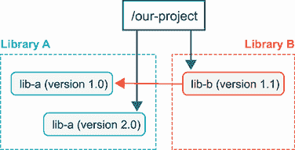
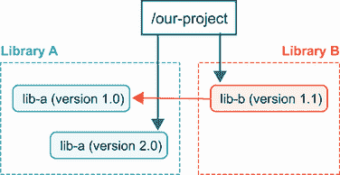
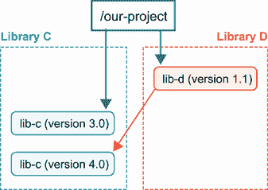
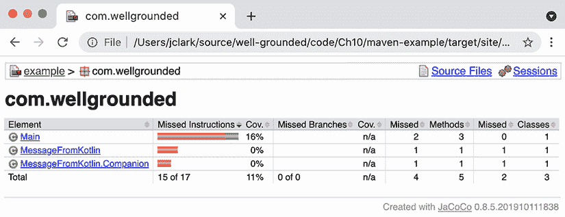
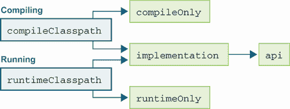

# 11 使用 Gradle 和 Maven 构建

本章涵盖

+   为什么构建工具对扎实的开发者很重要

+   Maven

+   Gradle

JDK 附带了一个编译器，可以将 Java 源代码转换为类文件，正如我们在第四章中看到的。尽管如此，很少有项目仅依赖于`javac`。让我们首先看看为什么扎实的开发者应该投资于熟悉这一层工具。

## 11.1 为什么构建工具对扎实的开发者很重要

构建工具之所以成为规范，有以下原因：

+   自动化繁琐操作

+   管理依赖项

+   确保开发者之间的一致性

尽管存在许多选项，但今天有两个选择主导着这个领域：Maven 和 Gradle。了解这些工具旨在解决的问题，深入了解它们如何完成任务，以及了解它们之间的差异——以及如何扩展它们——对于扎实的开发者来说将是有益的。

### 11.1.1 自动化繁琐操作

`javac`可以将任何 Java 源文件转换为类文件，但构建一个典型的 Java 项目不仅仅是这样。如果手动进行，仅将所有文件正确列出给编译器在大型项目中可能就是一项繁琐的工作。构建工具提供了查找代码的默认设置，并允许你轻松配置，如果你有一个非标准布局的话。

Maven 推广的常规布局，以及 Gradle 默认使用的布局，看起来是这样的：

```
.
└── src
    ├── main                                       ❶
    │      └── java                                  ❷
    │               └── com                              ❸
    │                       └── wellgrounded
    │                               └── Main.java
    └── test
        └── java
            └── com
                └── wellgrounded
                    └── MainTest.java
```

❶ main 和 test 将我们的生产代码与测试代码分开。

❷ 使用这种结构，一个项目中可以轻松地共存多种语言。

❸ 进一步的目录结构通常反映了你的包层次结构。

如你所见，测试已经完全融入到我们的代码布局中。自从人们问是否真的需要为他们的代码编写测试以来，Java 已经走了很长的路。构建工具在使测试以一致的方式在所有地方可用方面发挥了关键作用。

注意：你可能已经知道如何在 Java 中使用 JUnit 或其他库进行单元测试。我们将在第十四章中讨论其他形式的测试。

虽然将代码编译成类文件是 Java 程序存在的起点，但通常并不是终点。幸运的是，构建工具还提供了将你的类文件打包成 JAR 或其他格式以方便分发支持。

### 11.1.2 管理依赖项

在 Java 的早期，如果你想要使用一个库，你必须找到它的 JAR 文件，下载文件，并将其放入应用程序的类路径中。这导致了一些问题——特别是，所有库缺乏一个中心、权威的来源，有时需要寻宝才能找到不太常见的依赖项的 JAR 文件。

显然，这并不理想，因此 Maven（以及其他项目）为 Java 生态系统提供了仓库，工具可以在其中为我们找到和安装依赖关系。Maven Central 至今仍然是互联网上最常用的 Java 依赖关系注册表之一。其他也存在——如由 Google 托管或 GitHub 上共享的公共注册表，以及通过 Artifactory 等产品进行的私有安装。

下载所有这些代码可能也会很耗时，因此构建工具已经通过在项目之间共享工件来标准化了几种减少痛苦的方法。如果有第二个项目需要相同的库，由于有一个本地仓库来缓存，你就不需要再次下载它，如图 11.1 所示。当然，这种方法也可以节省磁盘空间，但这里真正的胜利在于单一来源的工件。


图 11.1 Maven 的本地仓库帮助不仅在线查找依赖关系，而且能够高效地本地管理依赖关系

注意：你可能想知道模块在这个依赖图中是如何定位的。模块化的库以带有`module-info.class`文件的 JAR 文件的形式发货，正如我们在第二章中看到的。可以从标准仓库下载模块化的 JAR 文件。真正的区别在于你开始使用模块编译和运行时，而不是在打包和分发时。

然而，除了提供一个中心位置来查找和下载依赖关系之外，注册表还为更好地管理*传递依赖关系*打开了大门。在 Java 中，我们通常在项目使用的库本身依赖于*另一个*库时看到这种情况。实际上，我们在第二章中已经遇到了模块的传递依赖关系，但这个问题在 Java 模块出现之前就已经存在了。事实上，在模块出现之前，这个问题要严重得多。

记住，JAR 文件只是一个压缩文件——它们没有任何描述 JAR 依赖关系的元数据。这意味着 JAR 的依赖关系只是 JAR 中所有类依赖关系的并集。

更糟糕的是，类文件格式没有描述需要哪个版本的类来满足依赖关系——我们只有类或方法名符号描述，该类需要链接（正如我们在第四章中看到的）。这暗示了以下两点：

1.  需要外部依赖关系信息来源。

1.  随着项目规模的扩大，传递依赖关系图将变得越来越复杂。

随着开源库和框架的爆炸式增长，以支持开发者，真实项目中传递依赖关系的典型树状结构已经变得越来越大。

一个潜在的利好消息是，JVM 生态系统的状况比 JavaScript 的情况要好一些。JavaScript 缺乏一个丰富、集中的运行时库，该库保证始终存在，因此许多基本功能必须作为外部依赖来管理。这引入了问题，如多个不兼容的库各自提供相同功能的版本，以及一个脆弱的生态系统，其中错误和敌意攻击可能对公共部分产生不成比例的影响（例如，2016 年的“left-pad”事件[见[`mng.bz/5Q64`](http://mng.bz/5Q64)]）。

另一方面，Java 有一个运行时库（JRE），其中包含许多常用的类，并且这个库在每一个 Java 环境中都是可用的。然而，一个真正的生产应用程序将需要超出 JRE 的功能，并且几乎总是有太多的依赖层，难以手动管理。唯一的解决方案是自动化。

冲突出现

这种自动化对于在丰富的开源代码生态系统中构建的开发者来说是一个福音，但升级依赖通常也会揭示问题。例如，图 11.2 显示了一个可能让我们陷入麻烦的依赖树。



图 11.2 冲突的传递依赖

我们明确要求了`lib-a`的 2.0 版本，但我们的依赖`lib-b`却要求使用较老的 1.0 版本。这被称为*依赖冲突*，并且根据如何解决，它可能会引起各种其他问题。

不匹配的库版本可能导致哪些类型的破坏？这取决于版本之间变化的本性。变化可以分为几个类别，如下所示：

1.  稳定的 API，其中只有行为在版本之间发生变化

1.  在版本之间出现新类或方法时添加的 API

1.  在版本之间扩展方法签名或接口时更改的 API

1.  在版本之间删除类或方法时移除的 API

在 a)或 b)的情况下，你可能甚至都不会注意到你的构建工具选择了哪个版本的依赖。c)中最常见的案例是方法签名在库版本之间的变化。在我们的上一个例子中，如果`lib-a` 2.0 改变了`lib-b`所依赖的方法的签名，当`lib-b`尝试调用该方法时，它会收到一个`NoSuchMethodError`异常。

在 d)中删除的方法将导致相同的`NoSuchMethodError`。这包括“重命名”一个方法，在字节码级别上并不与删除一个方法并添加一个新方法有任何不同，只是新方法恰好有相同的实现。

类在删除或重命名时也容易发生 d)冲突，并会导致`NoClassDefFoundError`错误。还有可能，从一个类中删除接口可能会导致一个难看的`ClassCastException`。

这个关于冲突传递依赖的问题列表绝不是详尽的。所有这些都归结于同一软件包的两个版本之间实际发生了什么变化。

事实上，关于版本之间变化性质的沟通是跨语言的一个常见问题。处理这个问题的最广泛采用的方法之一是 *语义版本化*（见 [`semver.org/`](https://semver.org/)）。语义版本化为我们提供了声明传递依赖要求的一套词汇，反过来又允许机器帮助我们整理它们。

当使用语义版本化时，请记住以下几点：

+   *主要* 版本增量（1.x -> 2.x）是对 API 的破坏性更改，如上述 c) 和 d) 的情况。

+   *次要* 版本增量（1.1 -> 1.2）是对向后兼容的添加，如案例 b）。

+   *修补* 版本是对错误修复的增量（1.1.0 -> 1.1.1）。

虽然不是万无一失，但它至少提供了一个关于版本更新带来的变化级别的预期，并且在开源项目中广泛使用。

在尝到了依赖管理不容易的原因之后，请放心，Maven 和 Gradle 都提供了工具来帮助。在本章的后面部分，我们将详细探讨每个工具提供的内容，以解决当你遇到依赖冲突时的问题。

### 11.1.3 确保开发人员之间的一致性

随着项目代码量和参与开发者的增加，它们通常变得更加复杂，更难处理。虽然你的构建工具可以减轻这种痛苦，但内置功能，如确保每个人都在编译和运行相同的测试，是一个开始。但我们也应该考虑许多超出基本功能的添加。

测试是好的，但你有多确定 *所有* 你的代码都经过了测试？代码覆盖率工具对于检测你的测试击中了哪些代码以及哪些没有击中至关重要。尽管互联网上关于代码覆盖率正确目标的争论不断，但行级输出覆盖率工具可以帮助你避免遗漏那个额外的特殊条件测试。

作为一种语言，Java 也非常适合各种静态分析工具。从检测常见模式（例如，没有重写 `hashCode` 就重写 `equals`）到嗅探未使用的变量，静态分析可以让计算机验证代码的合法方面，但在生产中可能会给你带来麻烦。

然而，除了正确性之外，还有样式和格式化工具。你是否曾与某人争论过在语句中花括号应该放在哪里？如何缩进代码？一旦同意了一套规则，即使它们并不完全符合你的口味，也让你在项目上永远专注于实际工作，而不是纠结于代码的外观细节。

最后但同样重要的是，您的构建工具是提供自定义功能的关键中心点。对于您的项目，人们是否需要定期运行特殊的设置或操作命令？在部署之前但在构建之后，项目应该运行哪些验证？所有这些都非常适合考虑将其集成到构建工具中，以便所有与代码一起工作的人都可以使用。Maven 和 Gradle 都提供了许多扩展它们以适应您自己的逻辑和需求的方法。

希望你现在已经相信，构建工具不仅仅是项目上的一次性设置，理解它们是值得投资的。让我们先从最常见的一个开始：Maven。

## 11.2 Maven

在 Java 早期，Ant 框架是默认的构建工具。通过 XML 描述的任务，它允许比 Make 等工具更以 Java 为中心的脚本构建方式。但 Ant 缺乏关于如何配置您的构建的结构——步骤是什么，它们如何相关联，如何管理依赖关系。Maven 通过其标准化的 *构建生命周期* 和处理依赖关系的一致方法解决了许多这些差距。

### 11.2.1 构建生命周期

Maven 是一个有偏见的工具。这些偏见在构建生命周期中表现得尤为明显。与用户定义自己的任务并确定它们的顺序不同，Maven 有一个包含通常步骤的 *默认生命周期*，这些步骤被称为 *阶段*，您在构建中会期望看到这些阶段。虽然不是全面的，但以下阶段捕捉了默认生命周期的要点：

+   *验证*—检查项目配置是否正确且可以构建

+   *编译*—编译源代码

+   *测试*—运行单元测试

+   *打包*—生成如 JAR 文件等工件

+   *验证*—运行集成测试

+   *安装*—将包安装到本地仓库

+   *部署*—使包结果可供他人使用，通常在 CI 环境中运行

这些步骤很可能对应于您从源代码到已部署的应用程序或库所采取的大部分步骤。这是 Maven 预设方法的一个主要优势——任何 Maven 项目都将共享这个相同的生命周期。您对如何运行构建的知识比以前更易于迁移。

Maven 中的阶段定义得很好，但每个项目在细节上都需要一些特殊的东西。在 Maven 的模型中，各种 *插件* 将 *目标* 绑定到这些阶段。目标是一个具体的任务，包括如何执行它的实现。

除了默认的生命周期之外，Maven 还包括 *清理* 和 *站点* 生命周期。*清理* 生命周期旨在进行清理（例如，删除中间构建结果），而 *站点* 生命周期旨在生成文档。

我们将在讨论扩展 Maven 时更详细地探讨如何挂钩生命周期，但如果您确实需要重新定义整个宇宙，Maven 支持编写完全自定义的生命周期。然而，这是一个非常高级的话题，超出了本书的范围。

### 11.2.2 命令/POM 简介

Maven 是 Apache 软件基金会的一个项目，并且是开源的。安装说明可以在项目网站上找到，网址为 [`maven.apache.org/install.html`](https://maven.apache.org/install.html)。

通常，Maven 被安装在开发工作站的全球范围内，并且可以在任何非古老 JVM（JDK 7 或更高版本）上运行。一旦安装，调用它将给我们以下输出：

```
~: mvn

  [INFO] Scanning for projects...
  [INFO] ------------------------------------------------------------------
  [INFO] BUILD FAILURE
  [INFO] ------------------------------------------------------------------
  [INFO] Total time:  0.066 s
  [INFO] Finished at: 2020-07-05T21:28:22+02:00
  [INFO] ------------------------------------------------------------------
  [ERROR] No goals have been specified for this build. You must specify a
  valid lifecycle phase or a goal in the format <plugin-prefix>:<goal> or
  <plugin-group-id>:<plugin-artifact-id>[:<plugin-version>]:<goal>.
  Available lifecycle phases are: validate, initialize, ....
```

特别值得注意的是消息“此构建未指定任何目标。”这表明 Maven 对我们的项目一无所知。我们通过 `pom.xml` 文件提供这些信息，这是 Maven 项目的宇宙中心。

注意，POM 代表项目对象模型。

尽管完整的 `pom.xml` 文件可能非常长且复杂，但您可以用更少的配置开始。例如，一个更接近最小化的 `pom.xml` 文件看起来像这样：

```
<project>
  <modelVersion>4.0.0</modelVersion>
  <groupId>com.wellgrounded</groupId>                   ❶
  <artifactId>example</artifactId>                      ❶
  <version>1.0-SNAPSHOT</version>
  <name>example</name>

  <properties>
    <maven.compiler.source>11</maven.compiler.source>   ❷
    <maven.compiler.target>11</maven.compiler.target>
  </properties>
</project>
```

❶ 识别我们的项目

❷ Maven 插件默认使用 Java 1.6。显然，我们希望使用更新的版本。

我们的 `pom.xml` 文件声明了两个特别重要的字段：`groupId` 和 `artifactId`。这些字段与一个版本号结合，形成 *GAV 坐标*（组，构件，版本），它唯一地、全局地标识了您包的特定版本。`groupId` 通常指定负责库的公司、组织或开源项目，而 `artifactId` 是特定库的名称。GAV 坐标通常用冒号（`:`）分隔每个部分来表示，例如 `org.apache.commons:collections4:4.4` 或 `com.google.guava:guava:30.1-jre`。

这些坐标不仅对本地配置项目很重要。坐标作为依赖项的地址，因此我们的构建工具可以找到它们。以下章节将深入探讨我们如何更详细地表达这些依赖项的机制。

就像 Maven 标准化了构建生命周期一样，它也普及了我们之前在 11.1.1 节中看到的标准布局，并将在下面展示。如果您遵循这些约定，就不需要告诉 Maven 任何关于您项目的信息，它就能进行编译：

```
.
├── pom.xml
└── src
     ├── main
     │      └── java
     │              └── com
     │                      └── wellgrounded
     │                               └── Main.java
     └── test
         └── java
              └── com
                   └── wellgrounded
                        └── MainTest.java
```

注意到平行结构——`src/main/java` 和 `src/test/java`——相同的目录映射到我们的包层次结构。这个约定将测试代码与主应用程序代码分开，这简化了打包主代码以部署的过程，排除了用户通常不需要或使用的测试代码。

除了这两个之外，还存在其他标准目录。例如，`src/main/resources` 是包含在 JAR 文件中的额外非代码文件的典型位置。有关 Maven 标准布局的完整列表，请参阅文档 [`mng.bz/6XoG`](http://mng.bz/6XoG)。

当你还在适应 Maven 时，坚持使用 Maven 提供的约定、标准布局和其他默认设置是个好主意。正如我们提到的，它是一个有偏见的工具，所以在学习过程中最好遵守它提供的规则。经验丰富的 Maven 开发者可以（并且确实）打破常规和规则，但让我们先学会走路再尝试跑步。

### 11.2.3 构建

我们之前看到，在命令行上运行 `mvn` 会警告我们需要选择一个生命周期阶段或目标才能实际执行操作。大多数情况下，我们都会想运行一个阶段，这可能包括许多目标。

开始的最简单方式是通过请求 `compile` 阶段来编译我们的代码，如下所示：

```
~: mvn compile

  [INFO] Scanning for projects...
  [INFO]
  [INFO] -------------------< com.wellgrounded:example >---------------
  [INFO] Building example 1.0-SNAPSHOT
  [INFO] -----------------------------[ jar ]--------------------------
  [INFO]
  [INFO] -- maven-resources-plugin:2.6:resources (default-resources) --
  [INFO] Using 'UTF-8' to copy filtered resources.                         ❶
  [INFO] Copying 0 resource
  [INFO]
  [INFO] ----- maven-compiler-plugin:3.1:compile (default-compile) ----
  [INFO] Changes detected - recompiling the module!                        ❷
  [INFO] Compiling 1 source file to ./maven-example/target/classes
  [INFO] --------------------------------------------------------------
  [INFO] BUILD SUCCESS
  [INFO] --------------------------------------------------------------
  [INFO] Total time:  0.940 s
  [INFO] Finished at: 2020-07-05T21:46:25+02:00
  [INFO] --------------------------------------------------------------
```

❶ 尽管我们的项目中没有资源，但默认生命周期中的 maven-resources-plugin 会为我们检查。

❷ 我们的实际编译是由 maven-compiler-plugin 提供的。

Maven 默认将输出目录设置为 `target`。在执行 `mvn compile` 后，我们可以在 `target/classes` 下找到类文件。仔细检查会发现我们只编译了 `main` 目录下的代码。如果我们想编译测试代码，可以使用 `test-compile` 阶段。

默认的生命周期不仅包括编译。例如，对于前面的项目，`mvn package` 将在 `target/example-1.0-SNAPSHOT.jar` 生成一个 JAR 文件。

虽然我们可以将这个 JAR 作为库使用，但如果尝试通过 `java -jar target/ example-1.0-SNAPSHOT.jar` 运行它，我们会发现 Java 抱怨找不到主类。为了了解我们如何开始构建 Maven 项目，让我们将其修改为生成的 JAR 是一个可运行的应用程序。

### 11.2.4 控制清单

Maven 从 `mvn package` 生成的 JAR 缺少一个 *清单* 来告诉 JVM 在启动时在哪里查找 `main` 方法。幸运的是，Maven 随带一个构建 JAR 的插件，该插件知道如何编写清单。该插件通过我们的 `pom.xml` 中的 `properties` 元素之后，仍然在 `project` 元素内部公开配置，如下所示：

```
  <build>
    <plugins>
      <plugin>
        <groupId>org.apache.maven.plugins</groupId>
        <artifactId>maven-jar-plugin</artifactId>            ❶
        <version>2.4</version>
        <configuration>                                      ❷
          <archive>
            <manifest>                                       ❸
              <addClasspath>true</addClasspath>
              <mainClass>com.wellgrounded.Main</mainClass>
              <Automatic-Module-Name>
                com.wellgrounded
              </Automatic-Module-Name>                       ❹
            </manifest>
          </archive>
        </configuration>
      </plugin>
    </plugins>
  </build>
```

❶ maven-jar-plugin 是插件名称。在运行 mvn package 命令的输出中可以轻松找到它。

❷ 每个插件都有自己的专用配置元素，具有不同的子元素和属性支持。

❸ `<manifest>` 配置生成的 JAR 的清单内容。

❹ 配置我们的自动模块名称

添加这个部分设置主类，这样 `java` 启动器就知道如何直接执行 JAR。我们还添加了一个自动模块名称——这是为了在模块化世界中成为好公民。正如我们在第二章中讨论的，即使我们编写的代码不是模块化的（就像这个例子一样），提供显式的自动模块名称仍然是有意义的，这样模块化应用程序就可以更容易地使用我们的代码。

在 `plugin` 元素下设置配置的模式在 Maven 中非常标准。为了简化问题，大多数默认插件会友好地警告你使用不受支持或意外的配置属性，尽管具体细节可能因插件而异。

### 11.2.5 添加另一种语言

正如我们在第八章中讨论的，JVM 作为平台的一个优点是能够在同一个项目中使用多种语言。当特定语言在应用程序的某个部分有更好的功能时，这可能很有用，甚至可以允许应用程序从一种语言逐渐转换为另一种语言。

让我们看看如何配置我们的简单 Maven 项目，以便从 Kotlin 而不是 Java 构建一些类。幸运的是，我们的标准布局已经设置为允许轻松添加语言，如下所示：

```
.
├── pom.xml
└── src
     ├── main
     │      ├── java
     │      │      └── com
     │      │              └── wellgrounded
     │      │                       └── Main.java
     │      └── kotlin                                  ❶
     │               └── com
     │                       └── wellgrounded                  ❷
     │                                └── MessageFromKotlin.kt
     └── test
          └── java
               └── com
                    └── wellgrounded
                         └── MainTest.java
```

❶ 我们将 Kotlin 代码保存在自己的子目录中，这样就可以轻松地知道哪些路径使用哪个编译器来生成类文件。

❷ 包可以在语言之间混合，因为生成的类文件没有直接了解它们是从哪种语言生成的知识。

与 Java 不同，Maven 默认不知道如何编译 Kotlin，因此我们需要在 `pom.xml` 中添加 `kotlin-maven-plugin`。我们建议您查阅 Kotlin 文档 [`kotlinlang.org/docs/maven.html`](https://kotlinlang.org/docs/maven.html)，以获取最新的使用方法，但我们将在此处演示，以便您知道可以期待什么。

如果一个项目完全用 Kotlin 编写，编译只需要添加并附加到 `compile` 目标的插件，如下所示：

```
  <build>
    <plugins>
      <plugin>
        <groupId>org.jetbrains.kotlin</groupId>
        <artifactId>kotlin-maven-plugin</artifactId>
        <version>1.6.10</version>                      ❶
        <executions>
          <execution>
            <id>compile</id>
            <goals>                                    ❷
              <goal>compile</goal>
            </goals>
          </execution>
          <execution>
            <id>test-compile</id>
            <goals>                                    ❷
              <goal>test-compile</goal>
            </goals>
          </execution>
        </executions>
      </plugin>
    </plugins>
  </build>
```

❶ 当本章编写时的 Kotlin 当前版本。

❷ 将此插件添加到编译主代码和测试代码的目标中。

当混合 Kotlin 和 Java 时，情况变得更加复杂。为我们编译 Java 的 Maven 默认 `maven-compiler-plugin` 需要被覆盖，以便 Kotlin 首先编译，如下所示，否则我们的 Java 代码将无法使用 Kotlin 类：

```
  <build>
    <plugins>
      <plugin>
        <groupId>org.jetbrains.kotlin</groupId>
        <artifactId>kotlin-maven-plugin</artifactId>                       ❶
        <version>1.6.10</version>
        <executions>
          <execution>
            <id>compile</id>
            <goals>
              <goal>compile</goal>
            </goals>
            <configuration>
              <sourceDirs>                                                 ❷
                <sourceDir>${project.basedir}/src/main/kotlin</sourceDir>
                <sourceDir>${project.basedir}/src/main/java</sourceDir>
              </sourceDirs>
            </configuration>
          </execution>
          <execution>
            <id>test-compile</id>
            <goals>
              <goal>test-compile</goal>
            </goals>
            <configuration>
              <sourceDirs>                                                 ❷
                <sourceDir>${project.basedir}/src/test/kotlin</sourceDir>
                <sourceDir>${project.basedir}/src/test/java</sourceDir>
              </sourceDirs>
            </configuration>
          </execution>
        </executions>
      </plugin>
      <plugin>
        <groupId>org.apache.maven.plugins</groupId>
        <artifactId>maven-compiler-plugin</artifactId>
        <version>3.8.1</version>
        <executions>
          <execution>
            <id>default-compile</id>                                       ❸
            <phase>none</phase>
          </execution>
          <execution>
            <id>default-testCompile</id>                                   ❸
            <phase>none</phase>
          </execution>
          <execution>
            <id>java-compile</id>                                          ❹
            <phase>compile</phase>
            <goals>
              <goal>compile</goal>
            </goals>
          </execution>
          <execution>
            <id>java-test-compile</id>                                     ❹
            <phase>test-compile</phase>
            <goals>
              <goal>testCompile</goal>
            </goals>
          </execution>
        </executions>
      </plugin>
    </plugins>
  </build>
```

❶ 主要添加 kotlin-maven-plugin 与之前类似，确保现在它知道 Java 和 Kotlin 路径

❷ Kotlin 编译器需要知道我们的 Kotlin 和 Java 代码位置。

❸ 禁用 maven-compiler-plugin 的默认值以构建 Java，因为这些默认值会强制它首先运行

❹ 重新应用 maven-compiler-plugin 到编译和测试编译阶段。现在这些将在 kotlin-maven-plugin 之后添加。

注意：当使用 Maven 功能如父项目时，上述覆盖可能会变得复杂，其中可能存在额外的 POM 定义冲突。当出现这些问题时，我们将很快看到一些调试策略。

您的项目至少需要一个对 Kotlin 标准库的依赖，因此我们明确添加如下：

```
<dependencies>
    <dependency>
        <groupId>org.jetbrains.kotlin</groupId>
        <artifactId>kotlin-stdlib</artifactId>
        <version>1.6.10</version>
    </dependency>
</dependencies>
```

在此设置之后，我们的多语言项目可以像以前一样构建和运行。

### 11.2.6 测试

一旦代码构建完成，下一步就是对其进行测试。Maven 将测试深度集成到其生命周期中。实际上，主代码的编译只有一个阶段，而 Maven 支持开箱即用的两个独立的测试阶段：`test`和`integration-test`。`test`用于典型单元测试，而`integration-test`阶段在构建 JAR 等工件之后运行，目的是对最终输出进行端到端验证。

注意，集成测试也可以使用 JUnit 运行，因为尽管名称如此，JUnit 是一个非常强大的测试运行器，不仅限于单元测试。不要陷入这样的陷阱，认为 JUnit 执行的任何测试都是自动的单元测试！我们将在第十三章中详细检查不同类型的测试。

几乎任何项目都将从一些测试中受益。正如你所期望的，Maven 有自己的一套观点，测试默认使用几乎无处不在的框架 JUnit。其他框架只需一个插件即可。

尽管标准插件知道如何运行 JUnit，我们仍然必须将其作为依赖项声明，以便 Maven 知道如何编译我们的测试。你可以在`<project>`元素下添加如下片段来添加库：

```
  <dependencies>
    <dependency>
      <groupId>org.junit.jupiter</groupId>
      <artifactId>junit-jupiter-api</artifactId>
      <version>5.8.1</version>
      <scope>test</scope>                              ❶
    </dependency>
    <dependency>
      <groupId>org.junit.jupiter</groupId>
      <artifactId>junit-jupiter-engine</artifactId>
      <version>5.8.1</version>
      <scope>test</scope>                              ❶
    </dependency>
  </dependencies>
```

❶ `<scope>`表示这个库只需要在测试编译阶段使用。

在此基础上，我们可以尝试运行我们的单元测试。根据你的 Maven 版本，即使是最新版本也可能给出这个奇怪的结果：

```
~:mvn test

  [INFO] Scanning for projects...
  [INFO]
  [INFO] -------------------< com.wellgrounded:example >----------------
  [INFO] Building example 1.0-SNAPSHOT
  [INFO] --------------------------------[ jar ]------------------------
  [INFO]
  [INFO] .....
  [INFO]
  [INFO] -- maven-surefire-plugin:2.12.4:test (default-test) @ example -
  [INFO] Surefire report dir: ./target/surefire-reports                    ❶

  -------------------------------------------------------
   T E S T S
  -------------------------------------------------------
  Running com.wellgrounded.MainTest
  Tests run: 0, Failures: 0, Errors: 0, Skipped: 0, Time elapsed: 0.001 sec

  Results :

  Tests run: 0, Failures: 0, Errors: 0, Skipped: 0                         ❷

  [INFO] ------------------------------------------------
  [INFO] BUILD SUCCESS
  [INFO] ------------------------------------------------
  [INFO] Total time:  5.605 s
  [INFO] Finished at: 2021-11-29T09:41:06+01:00
  [INFO] ------------------------------------------------
```

❶ Maven 运行 JUnit 测试的默认插件是 maven-surefire-plugin。

❷ 没有运行测试？这显然是不对的！

由于兼容性原因，默认安装的插件`maven-surefire-plugin`，即使是在 Maven 3.8.4 这样的较晚版本，也不了解 JUnit 5。我们将在第十三章中更深入地探讨这些转换问题，但在此期间，让我们将插件的版本提升到更近期的版本，如下所示：

```
    <plugin>
      <groupId>org.apache.maven.plugins</groupId>
      <artifactId>maven-surefire-plugin</artifactId>
      <version>3.0.0-M5</version>                       ❶
    </plugin>
```

❶ 如果在 2.12 之后移动，插件将直接理解 JUnit 5。

在此基础上，我们看到以下更令人放心的结果：

```
~:mvn test

  [INFO] .....

  -------------------------------------------------------
   T E S T S
  -------------------------------------------------------
  Running com.wellgrounded.MainTest
  Tests run: 1, Failures: 0, Errors: 0, Skipped: 0, Time elapsed: 0.04 sec

  Results :

  Tests run: 1, Failures: 0, Errors: 0, Skipped: 0

  [INFO] ------------------------------------------------
  [INFO] BUILD SUCCESS
  [INFO] ------------------------------------------------
  [INFO] Total time:  1.010 s
  [INFO] Finished at: 2020-07-06T15:45:22+02:00
  [INFO] -------------------------------------------------------------
```

默认情况下，Surefire 插件在`test`阶段运行标准位置的所有单元测试，即`src/test/*`。如果我们想利用`integration-test`阶段，建议使用单独的插件，例如`maven-failsafe-plugin`。Failsafe 由制作`maven-surefire-plugin`的同一群人维护，并专门针对集成测试案例。我们在之前用于配置清单的`<build><plugins>`部分添加了插件，如下所示：

```
  <plugin>
    <groupId>org.apache.maven.plugins</groupId>
    <artifactId>maven-failsafe-plugin</artifactId>
    <version>3.0.0-M5</version>
    <executions>
      <execution>
        <goals>
          <goal>integration-test</goal>
          <goal>verify</goal>
        </goals>
      </execution>
    </executions>
  </plugin>
```

Failsafe 将以下文件名模式视为集成测试，尽管它可以被重新配置：

+   `**/IT*.java`

+   `**/*IT.java`

+   `**/*ITCase.java`

因为它属于同一套插件，Surefire 也了解这个约定，并将这些测试排除在`test`阶段之外。

建议通过 `mvn verify` 运行集成测试，如下所示，而不是 `mvn integration-test`。`verify` 包括 `post-integration-test`，这是插件附加任何后测试清理工作的典型位置：

```
~: mvn verify

  [INFO] ... compilation output omitted for length ...

  [INFO] --- maven-failsafe-plugin:3.0.0-M5:integration-test @ example ---
  [INFO]
  [INFO] -------------------------------------------------------
  [INFO]  T E S T S
  [INFO] -------------------------------------------------------
  [INFO] Running com.wellgrounded.LongRunningIT
  [INFO] Tests run: 1, Failures: 0, Errors: 0, Skipped: 0,
  [INFO] Time elapsed: 0.032 s - in com.wellgrounded.LongRunningIT
  [INFO]
  [INFO] Results:
  [INFO]
  [INFO] Tests run: 1, Failures: 0, Errors: 0, Skipped: 0
  [INFO]
  [INFO]
  [INFO] --- maven-failsafe-plugin:3.0.0-M5:verify (default) @ example ---
  [INFO] -----------------------------------------------------------------
  [INFO] BUILD SUCCESS
  [INFO] -----------------------------------------------------------------
```

### 11.2.7 依赖管理

Maven 带给生态系统的关键特性是通过 `pom.xml` 文件以标准格式表达依赖管理信息。Maven 还建立了一个库的中央仓库。Maven 可以遍历 `pom.xml` 和依赖项的 `pom.xml` 文件，以确定应用程序所需的整个传递依赖项集。

遍历树并找到所有必要库的过程称为 *依赖解析*。虽然对于管理现代应用程序至关重要，但这个过程确实有其锋利的边缘。

为了了解问题出现在哪里，让我们回顾一下在 11.1.2 节中看到的早期项目设置。回想一下，项目的依赖项导致了一个看起来像图 11.3 所示的树。



图 11.3 请求较旧版本的冲突传递依赖

在这里，我们明确请求了 `lib-a` 的 2.0 版本，但我们的依赖项 `lib-b` 请求了较旧的 1.0 版本。Maven 的依赖解析算法倾向于选择离根最近的库版本。图 11.3 所示配置的最终结果是，我们将在应用程序中使用 `lib-a` 2.0 版本。正如我们在 11.1.2 节中概述的，这可能会工作得很好，也可能导致灾难性的错误。

另一个可能导致问题的常见场景是，当发生反向情况，即离根最近的依赖项比预期的传递依赖项更旧，如图 11.4 所示。



图 11.4 冲突的传递依赖，其中依赖项请求更高版本

在这种情况下，`lib-d` 可能依赖于 `lib-c` 中不存在于 3.0 版本的 API，因此将 `lib-d` 的依赖项添加到已经使用 `lib-c` 的项目中将导致运行时异常。

注意：鉴于这些可能性，我们建议任何与代码直接交互的包都应在您的 `pom.xml` 中明确声明。如果您不这样做，而是依赖于传递依赖项，更新直接依赖项可能会导致意外的构建中断。

在我们能够解决依赖问题之前，了解我们的依赖项非常重要。Maven 通过 `mvn dependency:tree` 命令为我们提供了支持，如下所示：

```
~:mvn dependency:tree
  [INFO] Scanning for projects...
  [INFO]
  [INFO] -------------------< com.wellgrounded:example >---------------
  [INFO] Building example 1.0-SNAPSHOT
  [INFO] -----------------------------[ jar ]--------------------------
  [INFO]
  [INFO] -- maven-dependency-plugin:2.8:tree (default-cli) @ example --
  [INFO] com.wellgrounded:example:jar:1.0-SNAPSHOT
  [INFO] +- org.junit.jupiter:junit-jupiter-api:jar:5.8.1:test
  [INFO] |  +- org.opentest4j:opentest4j:jar:1.2.0:test
  [INFO] |  +- org.junit.platform:junit-platform-commons:jar:1.8.1:test
  [INFO] |  \- org.apiguardian:apiguardian-api:jar:1.1.2:test
  [INFO] \- org.junit.jupiter:junit-jupiter-engine:jar:5.8.1:test
  [INFO]    \- org.junit.platform:junit-platform-engine:jar:1.8.1:test
  [INFO] --------------------------------------------------------------
  [INFO] BUILD SUCCESS
  [INFO] --------------------------------------------------------------
  [INFO] Total time:  0.790 s
  [INFO] Finished at: 2020-08-13T23:02:10+02:00
  [INFO] --------------------------------------------------------------
```

这个命令生成的树显示了我们直接依赖于 `pom.xml` 文件中的 JUnit，这是在嵌套的第一层，然后是 JUnit 自己的传递依赖项。

JUnit 有一组很小的依赖项，为了进一步探索传递依赖问题，让我们假设我们的团队想要使用我们公司内的两个内部库来支持执行自定义断言。这两个库都是使用 `assertj` 库构建的，但不幸的是，版本不同，如下所示：

```
  [INFO] com.wellgrounded:example:jar:1.0-SNAPSHOT
  [INFO] +- org.junit.jupiter:junit-jupiter-api:jar:5.8.1:test
  [INFO] |  +- org.opentest4j:opentest4j:jar:1.2.0:test
  [INFO] |  +- org.junit.platform:junit-platform-commons:jar:1.8.1:test
  [INFO] |  \- org.apiguardian:apiguardian-api:jar:1.1.2:test
  [INFO] +- org.junit.jupiter:junit-jupiter-engine:jar:5.8.1:test
  [INFO] |  \- org.junit.platform:junit-platform-engine:jar:1.8.1:test
  [INFO] +- com.wellgrounded:first-test-helper:1.0.0:test
  [INFO] |  \- org.assertj:assertj-core:3.21.0:test            ❶
  [INFO] \- com.wellgrounded:second-test-helper:2.0.0:test
  [INFO]    \- org.assertj:assertj-core:2.9.1:test             ❷
```

❶ 我们的第一辅助库带来了版本 3.21.0 的 assertj-core。

❷ 我们的第二个辅助库需要 assertj-core 版本 2.9.1。

最佳方法是在我们的依赖项中找到更新的版本，它们都可以就其依赖项达成一致。作为内部库，这显然是可能的。即使在更广泛的开源世界中，这也通常是可能的。话虽如此，有时库会失去其维护者而变得过时，因此完全有可能陷入难以获得我们所需更新的情况。

这使我们寻找其他处理冲突的方法。如果我们找不到自然的解决方案，两种主要方法就会发挥作用。请注意，这两种解决方案都需要找到某种兼容版本，以满足你的依赖项。

如果你的某个依赖项指定了一个大家都能同意的版本，但这个版本没有被 Maven 的解析算法选中，你可以告诉 Maven 在解析时排除树的部分。如果我们的两个辅助库都可以与较新的 `assertj-core` 正常工作，我们就可以忽略第二个库带来的旧版本，如下所示：

```
<dependencies>
    <dependency>
      <groupId>com.wellgrounded</groupId>
      <artifactId>second-test-helper</artifactId>
      <version>2.0.0</version>
      <scope>test</scope>
      <exclusions>                                 ❶
        <exclusion>
          <groupId>org.assertj</groupId>
          <artifactId>assertj-core</artifactId>
        </exclusion>
      </exclusions>
    </dependency>
    <dependency>
      <groupId>com.wellgrounded</groupId>          ❷
      <artifactId>first-test-helper</artifactId>
      <version>1.0.0</version>
      <scope>test</scope>
    </dependency>
  </dependencies>
```

❶ 排除第二测试辅助库的过时版本 assertj-core

❷ 允许来自第一测试辅助库的传递依赖正常进行

在最坏的情况下，也许两个库都没有表达兼容的版本。为了处理这种情况，我们指定精确版本作为项目中的直接依赖项，如下面的代码示例所示。根据其解析规则，Maven 将选择该版本，因为它更接近项目根。虽然这说服了工具按照我们的意愿行事，但我们承担了混合库版本运行时错误的危险，因此彻底测试交互非常重要：

```
<dependencies>
    <dependency>
      <groupId>com.wellgrounded</groupId>
      <artifactId>second-test-helper</artifactId>   ❶
      <version>2.0.0</version>
      <scope>test</scope>
    </dependency>
    <dependency>
      <groupId>com.wellgrounded</groupId>
      <artifactId>first-test-helper</artifactId>    ❷
      <version>1.0.0</version>
      <scope>test</scope>
    </dependency>
    <dependency>
      <groupId>org.assertj</groupId>
      <artifactId>org.assertj</artifactId>
      <version>3.1.0</version>                      ❸
      <scope>test</scope>
    </dependency>
  </dependencies>
```

❶ 我们的依赖项将请求不同版本的 assertj-core。

❷ 我们的依赖项将请求不同版本的 assertj-core。

❸ 但我们强制将 assertj-core 的解析版本精确到我们想要的版本。

最后，值得注意的是，`maven-enforcer-plugin` 可以配置为在发现任何不匹配的依赖项时失败构建，这样我们就可以避免依赖于不良的运行时行为来暴露问题。（见 [`mng.bz/o2WN`](http://mng.bz/o2WN)。）然后我们可以使用我们之前讨论的技术来解决这些构建失败。

### 11.2.8 审查

我们的构建过程是挂钩额外工具和检查的绝佳位置。一条关键信息是代码覆盖率，它告诉我们我们的测试执行了代码的哪些部分。

Java 生态系统中的代码覆盖率领先选项是 JaCoCo ([`mng.bz/nNjv`](http://mng.bz/nNjv))。JaCoCo 可以配置为在测试期间强制执行某些覆盖率级别，并将输出报告告诉你哪些被覆盖了，哪些没有被覆盖。

启用 JaCoCo 只需要在`pom.xml`文件的`<build><plugins>`部分添加一个插件。它默认不会启用，所以你必须告诉它何时执行。在这个例子中，我们将其绑定到`test`阶段，如下所示：

```
  <build>
    <plugins>
      <plugin>
        <groupId>org.jacoco</groupId>
        <artifactId>jacoco-maven-plugin</artifactId>
        <version>0.8.5</version>
        <executions>
          <execution>                      ❶
            <goals>
              <goal>prepare-agent</goal>
            </goals>
          </execution>
          <execution>                      ❷
            <id>report</id>
            <phase>test</phase>
            <goals>
              <goal>report</goal>
            </goals>
          </execution>
        </executions>
      </plugin>
    </plugins>
  </build>
```

❶ JaCoCo 需要在过程早期开始运行。这将其添加到初始化阶段。

❷ 告诉 JaCoCo 在测试阶段报告

默认情况下，这将在`target/site/jacoco`目录中生成关于你所有类的报告，如图 11.5 所示，完整的 HTML 版本在`index.html`中供探索。



图 11.5 JaCoCo 覆盖率报告页面

### 11.2.9 超越 Java 8

在第一章中，我们提到了以下一系列属于 Java 企业版但存在于核心 JDK 中的模块。这些模块在 JDK 9 中被弃用，在 JDK 11 中被移除，但作为外部库仍然可用：

+   `java.activation` (JAF)

+   `java.corba` (CORBA)

+   `java.transaction` (JTA)

+   `java.xml.bind` (JAXB)

+   `java.xml.ws` (JAX-WS，以及一些相关技术)

+   `java.xml.ws.annotation` (通用注解)

如果你的项目依赖于这些模块中的任何一个，当你迁移到更近期的 JDK 时，你的构建可能会中断。幸运的是，在`pom.xml`中添加几个简单的依赖项可以解决这个问题，如下所示：

```
<dependencies>
  <dependency>
    <groupId>com.sun.activation</groupId>               ❶
    <artifactId>jakarta.activation</artifactId>
    <version>1.2.2</version>
  </dependency>
  <dependency>
    <groupId>org.glassfish.corba</groupId>              ❷
    <artifactId>glassfish-corba-omgapi</artifactId>
    <version>4.2.1</version>
  </dependency>
  <dependency>
    <groupId>javax.transaction</groupId>                ❸
    <artifactId>javax.transaction-api</artifactId>
    <version>1.3</version>
  </dependency>
  <dependency>
    <groupId>jakarta.xml.bind</groupId>                 ❹
    <artifactId>jakarta.xml.bind-api</artifactId>
    <version>2.3.3</version>
  </dependency>
  <dependency>
    <groupId>jakarta.xml.ws</groupId>                   ❺
    <artifactId>jakarta.xml.ws-api</artifactId>
    <version>2.3.3</version>
  </dependency>
  <dependency>
    <groupId>jakarta.annotation</groupId>               ❻
    <artifactId>jakarta.annotation-api</artifactId>
    <version>1.3.5</version>
  </dependency>
</dependencies>
```

❶ `java.activation` (JAF)

❷ `java.corba` (CORBA)

❸ `java.transaction` (JTA)

❹ `java.xml.bind` (JAXB)

❺ `java.xml.ws` (JAX-WS，以及一些相关技术)

❻ `java.xml.ws.annotation` (通用注解)

### 11.2.10 Maven 中的多版本 JAR

JDK 9 中引入的一个特性是能够打包针对不同 JDK 的不同代码的 JAR 文件。这允许我们利用平台的新特性，同时仍然支持我们代码的旧版本客户端。

在第二章中，我们检查了特征并手工制作了必要的特定 JAR 格式，以启用此功能。布局将版本化的目录放置在 JAR 文件中的`META-INF/versions`下，从 JVM 9 开始，在加载过程中将检查给定类的较新版本，如下所示：

```
.
├── META-INF
│   ├── MANIFEST.MF
│   └── versions
│           └── 11
│                   └── wgjd2ed
│                           └── GetPID.class
└── wgjd2ed
     ├── GetPID.class
     └── Main.class
```

在这个结构中，`wgjd2ed`中的类将有一个表示 JAR 可能使用的最老 JVM 的类文件版本。（在我们的后续示例中，这将是在 JDK 8。）然而，在`META-INF/versions/11`下的类可以使用较新的 JDK 进行编译，并具有较新的类文件版本。因为较老的 JDK 忽略了`META-INF/versions`目录（以及从 9 开始的 JDK 理解它们允许使用哪些版本），我们可以在 JAR 中混合较新的代码，同时仍然在较老的 JVM 上正常工作。这正是 Maven 被构建来自动化的繁琐过程。

尽管我们的 JAR 中的输出格式对于启用多版本功能至关重要，但我们将模仿代码布局中的结构以提高清晰度。如下所示，`src` 中的代码是任何 JDK 默认将看到的基线功能。`versions` 下的代码可选地用替代实现替换特定类：

```
.
├── pom.xml
├── src
│      └── main
│              └── java
│                      └── wgjd2ed
│                               └── GetPID.java
│                                       └── Main.java
└── versions
    └── 11
         └── src
              └── wgjd2ed
                   └── GetPID.java
```

Maven 的默认设置将在 `src/main` 中找到并编译我们的代码，但我们有两个需要解决的复杂问题：

+   Maven 还需要 *同样* 在 `versions` 目录中找到我们的代码。

+   此外，Maven 需要针对与主项目不同的 JDK 编译该源代码。

这两个目标都可以通过配置构建我们的 Java 类文件的 `maven-compiler-plugin` 来实现。在下一个代码片段中，我们引入了两个单独的 `<execution>` 步骤——一个用于编译针对 JDK 8 的基本代码，然后是第二个步骤，用于编译针对 JDK 11 的版本化代码。

注意：我们必须使用至少与您要针对的最新版本一样新的 JDK 版本进行编译。然而，我们将明确指示一些构建步骤针对比编译器能够处理的更低版本。

```
  <plugins>
    <plugin>
      <groupId>org.apache.maven.plugins</groupId>
      <artifactId>maven-compiler-plugin</artifactId>
      <version>3.8.1</version>
      <executions>
        <execution>
          <id>compile-java-8</id>                     ❶
          <goals>
            <goal>compile</goal>
          </goals>
          <configuration>
            <source>1.8</source>                      ❷
            <target>1.8</target>
          </configuration>
        </execution>
        <execution>
          <id>compile-java-11</id>                    ❸
          <phase>compile</phase>
          <goals>
            <goal>compile</goal>
          </goals>
          <configuration>
            <compileSourceRoots>                      ❹
              <compileSourceRoot>
                ${project.basedir}/versions/11/src
              </compileSourceRoot>
            </compileSourceRoots>
            <release>11</release>                     ❺
            <multiReleaseOutput>                      ❺
              true
            </multiReleaseOutput>
          </configuration>
        </execution>
      </executions>
    </plugin>
  </plugins>
```

❶ 编译针对 JDK 8 的执行步骤

❷ 我们将使用 JDK 11 进行编译，因此我们将此步骤的输出针对 JDK 8。

❸ 针对 JDK 11 的第二个执行步骤

❹ 告诉 Maven 关于版本特定代码的替代位置

❺ 设置发布和 multiReleaseOutput 告诉 Maven 这个版本化代码打算针对哪个 JDK，并要求它将类放在输出中的正确多版本位置。

这将构建我们的 JAR 并以正确的布局打包。还有一步，那就是将清单标记为多版本发布。这配置在 `maven-jar-plugin` 中，如下所示，接近我们在第 11.2.4 节中使应用程序 JAR 可执行的位置：

```
  <plugin>
    <groupId>org.apache.maven.plugins</groupId>
    <artifactId>maven-jar-plugin</artifactId>
    <version>3.2.0</version>
    <configuration>
      <archive>
        <manifest>
          <addClasspath>true</addClasspath>
          <mainClass>wgjd2ed.Main</mainClass>
        </manifest>
        <manifestEntries>                          ❶
          <Multi-Release>true</Multi-Release>
        </manifestEntries>
      </archive>
    </configuration>
  </plugin>
```

❶ 标记 JAR 为多版本

通过这样，我们可以针对不同的 JDK 执行我们的代码并查看其行为是否符合预期。在我们的示例应用程序中，针对 JDK 8 的基本实现将输出一个额外的版本信息，如下所示，因此我们可以看到它正在工作：

```
~:mvn clean compile package
[INFO] Scanning for projects...
[INFO]
[INFO] ----------------< wgjd2ed:maven-multi-release >-------------------
[INFO] Building maven-multi-release 1.0-SNAPSHOT
[INFO] ----------------------------[ jar ]-------------------------------
[INFO]
[INFO] .... Lots of additional steps
[INFO]
[INFO] - maven-jar-plugin:3.2.0:jar (default-jar) @ maven-multi-release -
[INFO] Building jar: ~/target/maven-multi-release-1.0-SNAPSHOT.jar
[INFO] ------------------------------------------------------------------
[INFO] BUILD SUCCESS
[INFO] ------------------------------------------------------------------
[INFO] Total time:  1.813 s
[INFO] Finished at: 2021-03-05T09:39:16+01:00
[INFO] ------------------------------------------------------------------

~:java -version
openjdk version "11.0.6" 2020-01-14
OpenJDK Runtime Environment AdoptOpenJDK (build 11.0.6+10)
OpenJDK 64-Bit Server VM AdoptOpenJDK (build 11.0.6+10, mixed mode)

~:java -jar target/maven-multi-release-1.0-SNAPSHOT.jar
75891

# Change JDK versions by your favorite means....

~:java -version
openjdk version "1.8.0_265"
OpenJDK Runtime Environment (AdoptOpenJDK)(build 1.8.0_265-b01)
OpenJDK 64-Bit Server VM (AdoptOpenJDK)(build 25.265-b01, mixed mode)

~:java -jar target/maven-multi-release-1.0-SNAPSHOT.jar
Java 8 version...
76087
```

使用新 JDK 功能而无需放弃旧客户端的路径已经设置好了！

### 11.2.11 Maven 和模块

在第二章中，我们详细研究了 JDK 的新模块系统。让我们看看它如何影响我们的构建脚本。我们将从一个简单的库开始，该库公开其一个包，同时隐藏另一个包。

一个模块化库

模块化项目在代码布局上与严格的 Maven 标准略有不同。`main`目录反映了模块的名称，如下所示：

```
.
├── pom.xml
└── src
     └── com.wellgrounded.modlib                        ❶
          └── java
               └── com
                    └── wellgrounded
                         ├── hidden
                         │      └── CantTouchThis.java    ❷
                         └── visible
                              └── UseThis.java          ❸
```

❶ 我们的模块化代码目录

❷ 我们打算保持私有的一个类

❸ 我们打算通过我们的模块公开分享的班级

进行了此更改后，我们必须通知 Maven 新的位置以查找要编译的源代码，如下所示：

```
  <build>
    <sourceDirectory>src/com.wellgrounded.modlib/java</sourceDirectory>
  </build>
```

使我们的库成为模块化的最后一部分是在我们的代码根目录中添加一个`module-info.java`文件（与`com`目录并列）。这将命名我们的模块，并声明我们允许访问的内容，如下所示：

```
module com.wellgrounded.modlib {
    exports com.wellgrounded.modlib.visible;
}
```

这个简单的库的其他所有内容都保持不变，如果我们执行`mvn package`，我们将在`target`目录中得到一个 JAR 文件。在进一步操作之前，我们也可以通过`mvn install`将这个库放入本地 Maven 缓存中。

注意：JDK 的模块系统是关于构建和运行时的访问控制，*不是*打包。一个模块化库可以作为一个普通的 JAR 文件共享，只是额外包含`module-info.class`来告诉模块化应用程序如何与之交互。

现在我们有一个模块化库，让我们构建一个模块化应用程序来使用它。

一个模块化应用程序

我们模块化应用程序的布局与我们所用的库类似，如下所示：

```
.
├── pom.xml
└── src
     └── com.wellgrounded.modapp
          └── java
               ├── com
               │   └── wellgrounded
               │           └── Main.java
               └── module-info.java
```

我们的应用程序的`module-info.java`声明了我们的名称，并声明我们需要的包是由我们的库导出的，如下所示：

```
module com.wellgrounded.modapp {
    requires com.wellgrounded.modlib;
}
```

然而，仅此并不能告诉 Maven 在哪里找到我们的库 JAR 文件，因此我们将其作为正常的`<dependency>`包含，如下所示：

```
<dependencies>
    <dependency>
      <groupId>com.wellgrounded</groupId>   ❶
      <artifactId>modlib</artifactId>
      <version>2.0</version>
    </dependency>
  </dependencies>
```

❶ 我们上一节中的库已安装到本地 Maven 仓库中

当我们在编译并随后运行时，将这个依赖项放在模块路径上而不是类路径上是很重要的。Maven 是如何完成这个任务的？幸运的是，最近的`maven-compiler-plugin`版本足够智能，能够注意到 1)我们的应用程序有一个`module-info.java`，所以它是模块化的；2) 依赖项包括`module-info.class`，因此它也是一个模块。只要您使用的是`maven-compiler-plugin`的较新版本（在写作时 3.8 版本表现良好），Maven 就会为您解决这个问题。

我们的应用程序代码是完美的 Java 代码，我们可以按照预期使用模块化库的功能，如下所示：

```
package com.wellgrounded.modapp;

import com.wellgrounded.modlib.visible.UseThis;   ❶

public class Main {
  public static void main(String[] args) {
    System.out.println(UseThis.getMessage());     ❷
  }
}
```

❶ 从模块中导入，就像任何其他包一样。

❷ 使用我们模块中的类来获取消息

你可能还记得，在我们的库中还有一个我们没有提供访问权限的包。如果我们修改我们的应用程序来尝试拉取它，会发生什么，如下所示：

```
package com.wellgrounded.modapp;

import com.wellgrounded.modlib.visible.UseThis;
import com.wellgrounded.modlib.hidden.CantTouchThis;   ❶

public class Main {
  public static void main(String[] args) {
    System.out.println(UseThis.getMessage());
  }
}
```

❶ `com.wellgrounded.modlib.hidden`没有被列入库的导出列表中。

编译这个将会立即给出以下错误：

```
[INFO] - maven-compiler-plugin:3.8.1:compile @ modapp ---
  [INFO] Changes detected - recompiling the module!
  [INFO] Compiling 2 source files to /mod-app/target/classes
  [INFO] -------------------------------------------------------------
  [ERROR] COMPILATION ERROR :
  [INFO] -------------------------------------------------------------
  [ERROR]                                                                 ❶
    src/com.wellgrounded.modapp/java/com/wellgrounded/Main.java:[4,31]
      package com.wellgrounded.modlib.hidden is not visible (package
      com.wellgrounded.modlib.hidden is declared in module
      com.wellgrounded.modlib, which does not export it)

  [INFO] 1 error
  [INFO] ------------------------------------------------------------
  [INFO] BUILD FAILURE
  [INFO] ------------------------------------------------------------
```

❶ javac 和模块系统甚至不允许我们尝试接触未导出的内容！

自从 JDK 9 中模块发布以来，Maven 的工具已经取得了很大的进步。所有标准场景都得到了很好的覆盖，并且只需要最少的额外配置。

在离开之前，让我们稍微偏离一下主题。在整个这一节中，`module-info.class`经常是 Maven 应该开始应用模块化规则的信号。但是，模块是 JDK 中的一个*可选*功能，以保持与大量预模块化代码的兼容性。

如果我们使用我们的模块化库构建相同的应用程序，但应用程序没有通过包含`module-info.java`文件来标记自己使用模块，会发生什么？在这种情况下，尽管库是模块化的，但它将通过类路径包含。这会将它放置在未命名的模块中，与应用程序自己的代码一起，并且我们定义在库中的所有访问限制都将被有效地忽略。一个示例应用程序包含在补充材料中，与使用我们的库通过类路径使用的模块化应用程序一起，这样你可以更清楚地看到选择进入或退出模块的工作方式。

到此为止，我们对 Maven 默认功能的探索就结束了。但如果我们需要扩展系统，而实际上我们可以在网上找到的插件种类繁多，我们该怎么办呢？

### 11.2.12 编写 Maven 插件

即使是 Maven 中最基本的默认设置也是作为插件提供的，而且没有理由我们不能在需要的时候编写一个。正如我们所看到的，引用一个插件与引入一个依赖库非常相似。因此，我们将 Maven 插件作为单独的 JAR 文件实现，这并不令人惊讶。

对于我们的示例，我们从`pom.xml`文件开始。大部分模板代码与之前相似，只是增加了一些小的修改，如下所示：

```
<project>
  <modelVersion>4.0.0</modelVersion>

  <name>A Well-Grounded Maven Plugin</name>
  <groupId>com.wellgrounded</groupId>
  <artifactId>wellgrounded-maven-plugin</artifactId>
  <packaging>maven-plugin</packaging>                                   ❶
  <version>1.0-SNAPSHOT</version>                                       ❷

  <properties>
    <project.build.sourceEncoding>UTF-8</project.build.sourceEncoding>
    <maven.compiler.source>11</maven.compiler.source>
    <maven.compiler.target>11</maven.compiler.target>
  </properties>

  <dependencies>                                                        ❸
    <dependency>
      <groupId>org.apache.maven</groupId>
      <artifactId>maven-plugin-api</artifactId>
      <version>3.0</version>
    </dependency>

    <dependency>
      <groupId>org.apache.maven.plugin-tools</groupId>
      <artifactId>maven-plugin-annotations</artifactId>
      <version>3.4</version>
      <scope>provided</scope>
    </dependency>
  </dependencies>
</project>
```

❶ 让 Maven 知道我们打算构建一个插件包

❷ `-SNAPSHOT`是添加到尚未发布的库版本的一个典型后缀。当你引入库时，这会显示出来，因为你必须指定完整的字符串，例如，当请求依赖项时，必须指定 1.0-SNAPSHOT。

❸ 我们实现所需的大纲 Maven API 依赖项

这使我们准备好开始添加代码。将 Java 文件放置在标准布局位置，我们实现了一个称为`Mojo`的东西——实际上是一个 Maven *目标*，如下所示：

```
package com.wellgrounded;

import org.apache.maven.plugin.AbstractMojo;
import org.apache.maven.plugin.MojoExecutionException;
import org.apache.maven.plugins.annotations.Mojo;

@Mojo(name = "wellgrounded")
public class WellGroundedMojo extends AbstractMojo
{
    public void execute() throws MojoExecutionException
    {
        getLog().info("Extending Maven for fun and profit.");
    }
}
```

我们的类扩展了`AbstractMojo`，并通过`@Mojo`注解告诉 Maven 我们的目标名称。方法体负责我们想要的任何工作。在这种情况下，我们只是记录一些文本，但此时你拥有完整的 Java 语言和生态系统来实施你的目标。

要在另一个项目中测试插件，我们需要执行`mvn install`，这将把我们的 JAR 文件放入本地缓存库。一旦在那里，我们就可以像本章中已经看到的所有其他“真实”插件一样，将我们的插件拉入另一个项目，如下所示：

```
  <build>
    <plugins>
      <plugin>
        <groupId>com.wellgrounded</groupId>                  ❶
        <artifactId>wellgrounded-maven-plugin</artifactId>
        <version>1.0-SNAPSHOT</version>
        <executions>
          <execution>                                        ❷
            <phase>compile</phase>
            <goals>
              <goal>wellgrounded</goal>
            </goals>
          </execution>
        </executions>
      </plugin>
    </plugins>
  </build>
```

❶ 通过 groupId 和 artifactId 引用我们的插件坐标

❷ 将我们的目标绑定到编译阶段

在此基础上，我们可以在编译时看到我们的插件在行动，如下所示：

```
~: mvn compile
  [INFO] Scanning for projects...
  [INFO]
  [INFO] ------------------< com.wellgrounded:example >--------------
  [INFO] Building example 1.0-SNAPSHOT
  [INFO] ----------------------------[ jar ]-------------------------
  [INFO]
  [INFO] - maven-resources-plugin:2.6:resources (default-resources) -
  [INFO] Using 'UTF-8' encoding to copy filtered resources.
  [INFO] skip non existing resourceDirectory /src/main/resources
  [INFO]
  [INFO] --- maven-compiler-plugin:3.1:compile (default-compile)  ---
  [INFO] Nothing to compile - all classes are up to date
  [INFO]
  [INFO] --- wellgrounded-maven-plugin:1.0-SNAPSHOT:wellgrounded  ---
  [INFO] Extending Maven for fun and profit.                            ❶
  [INFO] ------------------------------------------------------------
  [INFO] BUILD SUCCESS
  [INFO] ------------------------------------------------------------
  [INFO] Total time:  0.872 s
  [INFO] Finished at: 2020-08-16T22:26:20+02:00
  [INFO] ------------------------------------------------------------
```

❶ 我们插件作为编译阶段的一部分运行

值得注意的是，如果我们只是包含插件而没有`<executions>`元素，我们不会在我们的项目中看到我们的插件出现在任何地方。自定义插件必须通过`pom.xml`文件在生命周期中声明它们希望的阶段。

了解生命周期以及哪些目标绑定到哪些阶段可能会很困难，但幸运的是，有一个插件可以帮助我们。`buildplan-maven-plugin`为你的当前任务提供了清晰度。

虽然它像任何其他插件一样可以包含在`pom.xml`中，但为了避免重复，一个有用的替代方案是将它放入用户自己的`~/.m2/settings.xml`文件中，如下所示。`settings.xml`文件与 Maven 中的`pom.xml`文件类似，但它们与任何特定项目无关：

```
<settings 

  xsi:schemaLocation="http://maven.apache.org/SETTINGS/1.0.0
                      https://maven.apache.org/xsd/settings-1.0.0.xsd">
  <pluginGroups>
    <pluginGroup>fr.jcgay.maven.plugins</pluginGroup>
  </pluginGroups>
</settings>
```

一旦安装，你就可以像这样在任何使用 Maven 构建的项目中调用它：

```
~: mvn buildplan:list

  [INFO] Scanning for projects...
  [INFO]
  [INFO] --------------------< com.wellgrounded:example >-----------------
  [INFO] Building example 1.0-SNAPSHOT
  [INFO] ------------------------------[ jar ]----------------------------
  [INFO]
  [INFO] ---- buildplan-maven-plugin:1.3:list (default-cli) @ example ----
  [INFO] Build Plan for example:
  ------------------------------------------------------------------------
  PLUGIN               | PHASE           | ID                 | GOAL
  ------------------------------------------------------------------------
  jacoco-maven-plugin  | initialize      | default            | prep-agent
  maven-compiler-plugin| compile         | default-compile    | compile
  maven-compiler-plugin| test-compile    | default-testCompile| testCompile
  maven-surefire-plugin| test            | default-test       | test
  jacoco-maven-plugin  | test            | report             | report
  maven-jar-plugin     | package         | default-jar        | jar
  maven-failsafe-plugin| integration-test| default            | int-test
  maven-failsafe-plugin| verify          | default            | verify
  maven-install-plugin | install         | default-install    | install
  maven-deploy-plugin  | deploy          | default-deploy     | deploy
  [INFO] -----------------------------------------------------------------
  [INFO] BUILD SUCCESS
  [INFO] -----------------------------------------------------------------
  [INFO] Total time:  0.461 s
  [INFO] Finished at: 2020-08-30T15:54:30+02:00
  [INFO] -----------------------------------------------------------------
```

注意：如果你不想在`pom.xml`或`settings.xml`中添加插件，你可以直接使用完全限定的插件名称来请求 Maven 运行命令！在我们的上一个例子中，我们可以说`mvn fr.jcgay.maven .plugins:buildplan-maven-plugin:list`，Maven 将下载插件并运行它一次。这对于不常见的任务或实验来说非常棒。Maven 关于编写插件的文档（见[`mng.bz/v6dx`](http://mng.bz/v6dx)）非常详尽且维护良好，所以当你开始实现自己的插件时，请务必查看。

Maven 仍然是 Java 中最常见的构建工具之一，并且具有巨大的影响力。然而，并不是每个人都喜欢它的强烈立场。Gradle 是最受欢迎的替代方案，让我们看看它是如何处理相同的问题空间的。

## 11.3 Gradle

Gradle 在 Maven 之后出现，与 Maven 开创的许多依赖管理基础设施兼容。它支持熟悉的标准目录布局，并为 JVM 项目提供默认的构建生命周期，但与 Maven 不同，所有这些功能都是完全可定制的。

与 XML 不同，Gradle 在 Kotlin 或 Groovy 等实际编程语言之上使用声明性的领域特定语言（DSL）。这通常会导致简单情况下的简洁构建逻辑，并在事情变得更加复杂时提供很多灵活性。

Gradle 还包括一些性能特性，用于避免不必要的操作并增量处理任务。这通常提供了更快的构建和更高的可伸缩性。让我们通过查看如何运行 Gradle 命令来试试水。

### 11.3.1 安装 Gradle

Gradle 可以从其网站([`gradle.org/install`](https://gradle.org/install))安装。最新版本依赖于 JVM 版本 8 或更高。一旦安装，你可以在命令行中运行它，默认情况下会显示帮助，如下所示：

```
~: gradle

  > Task :help

  Welcome to Gradle 7.3.3.

  To run a build, run gradlew <task> ...

  To see a list of available tasks, run gradlew tasks

  To see more detail about a task, run gradlew help --task <task>

  To see a list of command-line options, run gradlew --help

  For more detail on using Gradle, see
    https://docs.gradle.org/7.3.3/userguide/command_line_interface.html

  For troubleshooting, visit https://help.gradle.org

  BUILD SUCCESSFUL in 606ms
  1 actionable task: 1 executed
```

这使得开始变得容易，但只有一个全局 Gradle 版本并不理想。对于开发者来说，构建多个不同项目是很常见的，每个项目可能需要不同版本的 Gradle。

为了处理这个问题，Gradle 引入了*包装器*的概念。`gradle wrapper`任务将捕获 Gradle 的特定版本并本地化到你的项目中。然后可以通过`./gradlew`或`gradlew.bat`命令访问它。使用`gradlew`包装器被认为是一种良好的实践，以避免版本不兼容，因此你可能很少直接运行`gradle`。

注意 建议您将包装器的 `gradle` 和 `gradlew*` 结果包含在源代码控制中，但排除 `.gradle` 的本地缓存。

在提交了包装器之后，任何下载您的项目的人都可以获得正确版本化的构建工具，而无需进行任何额外的安装。

### 11.3.2 任务

Gradle 的关键概念是 *任务*。任务定义了一项可以调用的工作。任务可以依赖于其他任务，可以通过脚本进行配置，并通过 Gradle 的插件系统添加。这些类似于 Maven 的目标，但在概念上更像函数。它们有明确定义的输入和输出，可以组合和链接。而 Maven 的目标必须与构建生命周期的某个特定阶段相关联，Gradle 的任务可以以您方便的方式调用和使用。

Gradle 提供了出色的内省功能。其中最重要的是 `./gradlew tasks` 元任务，它列出了项目中当前可用的任务。在您声明任何内容之前，运行 `tasks` 将显示以下任务列表：

```
~: ./gradlew tasks

  > Task :tasks

  ------------------------------------------------------------
  Tasks runnable from root project
  ------------------------------------------------------------

  Build Setup tasks
  -----------------
  init - Initializes a new Gradle build.
  wrapper - Generates Gradle wrapper files.

  Help tasks
   ----------
  buildEnvironment - Displays all buildscript dependencies in root project
  components - Displays the components produced by root project.
  dependencies - Displays all dependencies declared in root project.
  dependencyInsight - Displays insight for dependency in root project
  dependentComponents - Displays dependent components in root project
  help - Displays a help message.
  model - Displays the configuration model of root project. [incubating]
  outgoingVariants - Displays the outgoing variants of root project.
  projects - Displays the sub-projects of root project.
  properties - Displays the properties of root project.
  tasks - Displays the tasks runnable from root project.
```

向任何任务提供 `--dry-run` 标志将显示 Gradle 将要运行的任务，而不会执行这些操作。这对于理解您的构建系统流程或调试行为异常的插件或自定义任务非常有用。

### 11.3.3 脚本中有什么？

Gradle 构建的核心是其 *构建脚本*。这是 Gradle 与 Maven 之间的一个关键区别——不仅格式不同，整个哲学也不同。Maven POM 文件是基于 XML 的，而在 Gradle 中，构建脚本是用编程语言编写的可执行脚本——通常被称为 *领域特定语言* 或 DSL。Gradle 的现代版本支持 Groovy 和 Kotlin。

Groovy 与 Kotlin 的比较

Gradle 的 DSL 方法最初是基于 Groovy 的。正如我们在第八章简要介绍时所了解到的，Groovy 是 JVM 上的动态语言，并且它与灵活性和简洁的构建脚本目标非常契合。然而，自 Gradle 5.0 以来，另一个选项也已可用：Kotlin，我们在第九章中对其进行了详细讨论。

注意 Kotlin 构建脚本使用扩展名 `.gradle.kts` 而不是 `.gradle`。

这非常有意义，因为 Kotlin 现在是 Android 开发的主导语言，而 Gradle 是该平台的官方构建工具。在整个项目的各个部分使用相同的语言可以是一个很好的简化因素。

对于我们的目的而言，Kotlin 更像 Java 而不是 Groovy。缩小这种语言差距意味着，如果您是 Gradle 生态系统的初学者，如果您正在用 Java 编码，那么使用 Kotlin 编写构建脚本可能是有意义的。

Groovy 仍然是一个突出且非常有前景的选择，但我们将加大 Kotlin 经验的投入，并使用它来展示我们接下来的所有示例。我们在这个章节中展示的任何内容都可以用具有相同 Gradle 行为的 Groovy 构建脚本以类似的方式表达。Gradle 文档展示了所有示例的 DSL。

### 11.3.4 使用插件

Gradle 使用插件来定义我们使用的所有任务。正如我们之前看到的，在空 Gradle 项目中列出任务不会说明构建、测试或部署。所有这些都来自插件。

Gradle 本身附带了许多插件，因此使用它们只需要在`build.gradle.kts`中进行声明。其中一个关键插件是`base`插件，如下所示：

```
  plugins {
    base
  }
```

在包含`base`插件后查看我们的任务，可以揭示一些我们可能期望的常见构建生命周期任务，如下所示：

```
~:./gradlew tasks

  > Task :tasks

  ------------------------------------------------------------
  Tasks runnable from root project
  ------------------------------------------------------------

  Build tasks
  -----------
  assemble - Assembles the outputs of this project.
  build - Assembles and tests this project.
  clean - Deletes the build directory.

  ... Other tasks omitted for length

  Verification tasks
  ------------------
  check - Runs all checks.

  ...

  BUILD SUCCESSFUL in 640ms
  1 actionable task: 1 executed
```

在此基础上，让我们开始构建我们的 Gradle 项目。

### 11.3.5 构建

虽然 Gradle 允许你随心所欲地进行自定义，但它默认期望与 Maven 建立和普及的相同代码布局。对于许多（也许甚至大多数）项目来说，改变这种布局没有意义，尽管这样做是可能的。

让我们从基本的 Java 库开始。为此，我们创建以下源代码树：

```
.
├── build.gradle.kts
├── gradle
│      └── wrapper
│              ├── gradle-wrapper.jar                    ❶
│              └── gradle-wrapper.properties             ❶
├── gradlew                                        ❶
├── gradlew.bat                                    ❶
├── settings.gradle.kts
└── src
     └── main
          └── java
               └── com
                    └── wellgrounded
                         └── AwesomeLib.java
```

❶ 这些文件是由 Gradle 包装命令自动创建的。

`base`插件对 Java 一无所知，因此我们需要一个更了解 Java 的插件。对于我们的纯 Java JAR 用例，我们将使用 Gradle 的`java-library`插件，如下所示。此插件基于`base`的所有必要部分构建——在实践中，你很少在 Gradle 构建中看到单独的`base`插件。这是因为插件可以应用其他插件来构建在其之上，就像面向对象编程中的组合一样：

```
plugins {
  `java-library`   ❶
}
```

❶ 在插件名称周围使用反引号（不是撇号），当它们包含特殊字符时，例如这里。

这将在我们的构建部分生成越来越多的任务，如下所示：

```
Build tasks
  -----------
  assemble - Assembles the outputs of this project.
  build - Assembles and tests this project.
  buildDependents - Assembles and tests this project and dependent projects.
  buildNeeded - Assembles and tests this project and dependent projects.
  classes - Assembles main classes.
  clean - Deletes the build directory.
  jar - Assembles a jar archive containing the main classes.
  testClasses - Assembles test classes.
```

在 Gradle 术语中，`assemble`是编译并打包 JAR 文件的任务。一个干燥运行会显示所有步骤，其中一些默认任务列表没有显示：

```
./gradlew assemble --dry-run
  :compileJava SKIPPED
  :processResources SKIPPED
  :classes SKIPPED
  :jar SKIPPED
  :assemble SKIPPED
```

运行`./gradlew assemble`会在`build`目录生成以下输出：

```
.
└── build
     ├── classes
     │      └── java
     │              └── main
     │                       └── com
     │                               └── wellgrounded
     │                                       └── Main.class
     └── libs
          └── wellgrounded.jar
```

制作应用程序

纯 JAR 是一个好的开始，但最终你想要运行一个应用程序。这需要更多的配置，但默认情况下这些组件都是可用的。

我们将更改插件，并告诉 Gradle 我们的应用程序的主类是什么。我们还可以看到 Kotlin 在这个简短的片段中带来的几个优秀特性：

```
plugins {                                                 ❶
  application                                             ❷
}

application {
  mainClass.set("wgjd.Main")
}

tasks.jar {                                               ❸
  manifest {
    attributes("Main-Class" to application.mainClass)     ❹
  }
}
```

❶ Kotlin 在最终参数是 lambda 表达式时可选的括号

❷ 知道如何编译和运行 Java 应用的插件

❸ 组装修改后的清单的 JAR 文件的任务

❹ Kotlin 使用 to 语法在原地声明一个哈希映射（也称为哈希字面量）。

使用`./gradlew build`构建会得到与之前相同的 JAR 输出，但如果我们执行`java -jar build/libs/wellgrounded.jar`，我们的测试程序将会运行。或者，`application`插件也支持`./gradlew run`来直接加载并执行你的主类。

注意：`application` 插件只需要设置 `mainClass`，但排除 `tasks.jar` 配置将导致一个 `./gradlew run` 能够启动但 `java -jar` 无法启动的 JAR 文件。绝对不推荐这样做！

我们现在已经有了检查 Gradle 另一个关键功能的必要组件：它避免工作并减少我们的构建时间的能力。

### 11.3.6 避免工作

为了尽可能快地运行构建，Gradle 尝试避免重复不必要的操作。为此，一种策略是增量构建。Gradle 中的每个任务都声明其输入和输出。Gradle 使用这些信息来检查自上次构建运行以来是否有任何变化。如果没有变化，Gradle 将跳过该任务并重用之前构建的输出。

注意：在使用 Gradle 时，您不应该定期运行 `clean`，因为 Gradle 将确保只完成必要的——并且仅是必要的工作来生成构建结果。

我们可以通过查看一次完整运行（强制清洁）和第二次运行（如下所示）后的构建时间来看到这一点：

```
~: ./gradlew clean build

  BUILD SUCCESSFUL in 2s
  13 actionable tasks: 13 executed

  ~: ./gradlew build

  BUILD SUCCESSFUL in 804ms
  12 actionable tasks: 12 up-to-date
```

增量构建只能重用同一台计算机上同一位置的任务的最后一次执行的输出。Gradle 做得更好：构建缓存允许重用任何先前构建的任务输出——甚至是从其他地方运行的构建。

您可以通过带有 `--build-cache` 命令行标志的属性在项目中启用此功能。我们可以看到，即使是下面的 `clean` 构建也更快，因为它可以重用先前执行中的缓存输出：

```
~: ./gradlew clean build --build-cache

  BUILD SUCCESSFUL in 2s
  13 actionable tasks: 13 executed

  ~: ./gradlew clean build --build-cache

  BUILD SUCCESSFUL in 1s
  13 actionable tasks: 6 executed, 7 from cache
```

性能是 Gradle 的一个关键特性，它可以帮助您在代码规模扩大的同时保持项目构建时间的低效。其他一些我们不会涉及的能力包括增量 Java 编译、Gradle 守护进程以及并行任务和测试执行。

没有人是一座孤岛。同样，很少有应用程序在没有引入其他库依赖项的情况下能走得很远。这是 Gradle 的一个主要主题，也是与 Maven 有相当差异的一个点。

### 11.3.7 Gradle 中的依赖项

要开始引入依赖项，我们必须首先告诉 Gradle 它可以从哪些仓库下载。对于 `mavenCentral`（如下所示）和 `google` 有内置函数。您可以使用更详细的 API 来配置其他仓库，包括您自己的私有实例：

```
repositories {
  mavenCentral()
}
```

我们可以通过使用 Maven 流行的标准坐标格式来引入我们的依赖项。与 Maven 有 `<scope>` 元素来控制给定依赖项的使用位置类似，Gradle 通过 *依赖配置* 来表达这一点。每个配置跟踪一组特定的依赖项。您的插件定义了哪些配置可用，您可以通过函数调用向配置列表中添加。例如，为了拉取 SLF4J 库 ([`www.slf4j.org/`](http://www.slf4j.org/)) 以帮助进行日志记录，我们会使用以下配置：

```
dependencies {
    implementation("org.slf4j:slf4j-api:1.7.30")
    runtimeOnly("org.slf4j:slf4j-simple:1.7.30")
  }
```

在此示例中，我们的代码直接调用 `slf4j-api` 中的类和方法，因此它通过 `implementation` 配置被包含进来。这使得它在编译和运行应用程序时可用。尽管如此，我们的应用程序绝不应该直接调用 `slf4j-simple` 中的方法——这是严格通过 `slf4j-api` 来做的——因此请求 `slf4j-simple` 作为 `runtimeOnly` 确保代码在编译期间不可用，从而防止我们误用库。这实现了与 Maven 中依赖项的 `<scope>` 元素相同的目的。

我们使用的依赖项与我们类路径在运行时仅需要的依赖项之间的区别并不是区分依赖项差异的唯一方式。特别是对于库的作者来说，我们使用的库和作为我们公共 API 部分的库之间也有区别。如果一个依赖项是项目公共 API 的一部分，我们可以用 `api` 来标记它。在以下示例中，我们声明 Guava 是我们项目公共 API 的一部分：

```
  dependencies {
    api("com.google.guava:guava:31.0.1-jre")
  }
```

配置可以相互扩展，就像从基类派生一样。Gradle 在许多领域应用了这一特性。例如，在创建类路径时，Gradle 使用 `compileClasspath` 和 `runtimeClassPath`，它们扩展了 `implementation` 和 `runtimeOnly`。你不应该直接向 `*Classpath` 配置添加内容——我们添加到其基配置的依赖项将构建结果类路径配置，如图 11.6 所示。



图 11.6 Gradle 配置层次结构

表 11.1 展示了在使用 Gradle 伴随的 Java 插件时可用的一些主要配置，以及每个配置扩展了哪些其他配置。完整的列表可在 Java 插件文档中找到，网址为 [`mng.bz/445B`](http://mng.bz/445B)。

注意：Gradle 7.0 版本移除了一些长期废弃的配置，例如 `compile` 和 `runtime`。如果你在网上浏览，可能会找到对这些配置的引用，但应转向较新的选项，即 `implementation`（或 `api`）和 `runtimeOnly`。

表 11.1 典型的 Gradle 依赖项配置

| 名称 | 目的 | 扩展 |
| --- | --- | --- |
| `api` | 作为项目外部公共 API 部分的依赖项 |  |
| `implementation` | 编译和运行期间使用的主要依赖项 |  |
| `compileOnly` | 仅在编译期间需要的依赖项 |  |
| `compileClasspath` | Gradle 用于查找编译类路径的配置 | `compileOnly`, `implementation` |
| `runtimeOnly` | 仅在运行时需要的依赖项 |  |
| `runtimeClasspath` | Gradle 用于查找运行时类路径的配置 | `runtimeOnly`, `implementation` |
| `testImplementation` | 编译和运行测试期间使用的依赖项 | `implementation` |
| `testCompileOnly` | 仅在测试编译期间需要的依赖项 |  |
| `testCompileClasspath` | Gradle 用于查找测试编译类路径的配置 | `testCompileOnly`, `testImplementation` |
| `testRuntimeOnly` | 仅在运行时需要的依赖项 | `runtimeOnly` |
| `testRuntimeClasspath` | Gradle 用于查找测试运行时类路径的配置 | `testRuntimeOnly`, `testImplementation` |
| `archives` | 我们项目输出的 JAR 列表 |  |

与 Maven 一样，Gradle 使用包信息来创建传递依赖树。然而，Gradle 处理版本冲突的默认算法与 Maven 的“最接近根的获胜”方法不同。在解析时，Gradle 会遍历整个依赖树以确定任何给定包的所有请求版本。从请求版本的完整集合中，Gradle 将默认选择可用的*最高*版本。

这种方法避免了 Maven 方法中的一些意外行为——例如，包的顺序/深度的变化可能会导致不同的解析。Gradle 还可以使用额外的信息，如丰富的版本约束来定制解析过程。更进一步，如果 Gradle 无法满足定义的约束，它将使用清晰的错误信息来失败构建，而不是选择可能存在问题的版本。

在这种情况下，Gradle 提供了丰富的 API 来覆盖和控制其解析行为。它还内置了强大的内省工具，当出现问题时会揭开面纱。当传递依赖问题出现时，一个关键的命令是`./gradlew dependencies`，如下所示：

```
~: ./gradlew dependencies

testImplementation - Implementation only dependencies for compilation 'test'
\--- org.junit.jupiter:junit-jupiter-api:5.8.1 (n)

... Other configurations skipped for length

testRuntimeClasspath - Runtime classpath of compilation 'test'
+--- org.junit.jupiter:junit-jupiter-api:5.8.1
|    +--- org.junit:junit-bom:5.8.1
|    |    +--- org.junit.jupiter:junit-jupiter-api:5.8.1 (c)
|    |    +--- org.junit.jupiter:junit-jupiter-engine:5.8.1 (c)
|    |    +--- org.junit.platform:junit-platform-commons:1.8.1 (c)
|    |    \--- org.junit.platform:junit-platform-engine:1.8.1 (c)
|    +--- org.opentest4j:opentest4j:1.2.0
|    \--- org.junit.platform:junit-platform-commons:1.8.1
|         \--- org.junit:junit-bom:5.8.1 (*)
\--- org.junit.jupiter:junit-jupiter-engine:5.8.1
     +--- org.junit:junit-bom:5.8.1 (*)
     +--- org.junit.platform:junit-platform-engine:1.8.1
     |    +--- org.junit:junit-bom:5.8.1 (*)
     |    +--- org.opentest4j:opentest4j:1.2.0
     |    \--- org.junit.platform:junit-platform-commons:1.8.1 (*)
     \--- org.junit.jupiter:junit-jupiter-api:5.8.1 (*)

testRuntimeOnly - Runtime only dependencies for compilation 'test'
\--- org.junit.jupiter:junit-jupiter-engine:5.8.1 (n)
```

在大型项目中，此输出可能令人不知所措，因此`dependencyInsight`允许你关注你关心的特定依赖项，如下所示：

```
~: ./gradlew dependencyInsight \
       --configuration testRuntimeClasspath \
       --dependency junit-jupiter-api

> Task :dependencyInsight
org.junit.jupiter:junit-jupiter-api:5.8.1 (by constraint)
   variant "runtimeElements" [
      org.gradle.category                 = library
      org.gradle.dependency.bundling      = external
      org.gradle.jvm.version              = 8 (compatible with: 11)
      org.gradle.libraryelements          = jar
      org.gradle.usage                    = java-runtime
      org.jetbrains.kotlin.localToProject = public (not requested)
      org.jetbrains.kotlin.platform.type  = jvm
      org.gradle.status                   = release (not requested)
   ]

org.junit.jupiter:junit-jupiter-api:5.8.1
+--- testRuntimeClasspath
+--- org.junit:junit-bom:5.8.1
|    +--- org.junit.platform:junit-platform-engine:1.8.1
|    |    +--- org.junit:junit-bom:5.8.1 (*)
|    |    \--- org.junit.jupiter:junit-jupiter-engine:5.8.1
|    |         +--- testRuntimeClasspath
|    |         \--- org.junit:junit-bom:5.8.1 (*)
|    +--- org.junit.platform:junit-platform-commons:1.8.1
|    |    +--- org.junit.platform:junit-platform-engine:1.8.1 (*)
|    |    +--- org.junit:junit-bom:5.8.1 (*)
|    |    \--- org.junit.jupiter:junit-jupiter-api:5.8.1 (*)
|    +--- org.junit.jupiter:junit-jupiter-engine:5.8.1 (*)
|    \--- org.junit.jupiter:junit-jupiter-api:5.8.1 (*)
\--- org.junit.jupiter:junit-jupiter-engine:5.8.1 (*)

(*) - dependencies omitted (listed previously)
```

依赖冲突可能难以解决。如果可能的话，最佳方法是使用 Gradle 中的依赖工具来查找不匹配并升级到相互兼容的版本。啊，要是能生活在一个这样的世界里，那该多好啊！

让我们回顾一下之前提到的例子，其中两个版本的内部辅助库引入了不兼容的主版本号的`assertj`。在这种情况下，`first-test-helper`依赖于`assertj-core` 3.21.0，而`second-test-helper`想要 2.9.1。

Gradle 的`constraints`提供了一种机制，告诉解析过程我们希望如何选择版本，如下所示：

```
dependencies {
  testImplementation("org.junit.jupiter:junit-jupiter-api:5.8.1")
  testRuntimeOnly("org.junit.jupiter:junit-jupiter-engine:5.8.1")

  testImplementation(
      "com.wellgrounded:first-test-helper:1.0.0")    ❶
  testImplementation(
      "com.wellgrounded:second-test-helper:2.0.0")   ❶

  constraints {
    testImplementation(
      "org.assertj:assertj-core:3.1.0") {            ❷
        because("Newer incompatible because...")     ❸
    }
  }
}
```

❶ 所有依赖项仍然像以前一样请求它们想要的。

❷ Gradle 将尊重此约束或失败解析。

❸ 使用这种做法是良好的实践，因为它可以记录我们干预的原因，Gradle 的工具可以使用这些文本，而脚本中的注释仅对人类读者有用。

如果你确实需要精确，可以使用`strictly`设置版本，这将覆盖任何其他解析，如下所示：

```
dependencies {
  testImplementation("org.junit.jupiter:junit-jupiter-api:5.8.1")
  testRuntimeOnly("org.junit.jupiter:junit-jupiter-engine:5.8.1")

  testImplementation(
    "com.wellgrounded:first-test-helper:1.0.0")       ❶
  testImplementation(
    "com.wellgrounded:second-test-helper:2.0.0")      ❶

  testImplementation("org.assertj:assertj-core") {
    version {
      strictly("3.1.0")                               ❷
    }
  }
}
```

❶ 所有依赖项仍然像以前一样请求它们想要的。

❷ 强制版本为 3.1.0。这不会匹配 3.1 或任何其他相关版本。

如果这些机制不够或者一个库在其列出的依赖项中存在错误，你也可以要求 Gradle 通过`exclude`忽略特定的组或工件，如下所示：

```
dependencies {
  testImplementation("org.junit.jupiter:junit-jupiter-api:5.8.1")
  testRuntimeOnly("org.junit.jupiter:junit-jupiter-engine:5.8.1")

  testImplementation(
    "com.wellgrounded:first-test-helper:1.0.0")      ❶
  testImplementation(
    "com.wellgrounded:second-test-helper:2.0.0") {   ❷
    exclude(group = "org.assertj")
  }
}
```

❶ 将选择来自 first-test-helper 的依赖项。

❷ Gradle 将忽略第二个辅助工具中的 org.assertj 依赖。

这是一个更激进的选项，但在这里所写的内容仅适用于我们应用了`exclude`的依赖项。如果我们能找到一个使用`constraints`的解决方案，从长远来看我们会更好。

如我们之前章节中提到的，手动强制依赖版本是一个最后的手段，并且需要特别注意以确保不会出现运行时异常。一个健壮的测试套件在确保你的库组合能够顺利协同工作时可以非常关键。

### 11.3.8 添加 Kotlin

正如我们在第八章和本章的 Maven 部分所讨论的，能够在项目中添加另一种语言是一个在 JVM 上运行的大好处。

添加 Kotlin 展示了 Gradle 脚本方法相对于 Maven 更静态的基于 XML 配置的优势。遵循我们原始代码的标准多语言布局产生以下结果：

```
.
├── build.gradle.kts
├── gradle
│      └── wrapper
│              ├── gradle-wrapper.jar
│              └── gradle-wrapper.properties
├── gradlew
├── gradlew.bat
├── settings.gradle.kts
└── src
     ├── main
     │      ├── java
     │      │      └── com
     │      │              └── wellgrounded
     │      │                      └── Main.java
     │      └── kotlin                                ❶
     │              └── com
     │                      └── wellgrounded
     │                               └── kotlin
     │                                        └── MessageFromKotlin.kt
     └── test
          └── java
               └── com
                    └── wellgrounded
                         └── MainTest.java
```

❶ 我们额外的 Kotlin 代码位于 kotlin 子目录下。

我们通过在`build.gradle.kts`中添加 Gradle 插件来启用 Kotlin 支持，如下所示：

```
  plugins {
     application
     id("org.jetbrains.kotlin.jvm") version "1.6.10"
  }
```

就这样。由于 Gradle 的灵活性，插件能够改变构建顺序并添加必要的`kotlin-stdlib`依赖，而无需我们采取额外的步骤。

### 11.3.9 测试

我们之前讨论的`assemble`任务将编译和打包你的主代码，但我们需要编译和运行测试。默认情况下，`build`任务就是为此配置的，如下所示：

```
./gradlew build --dry-run
  :compileJava SKIPPED
  :processResources SKIPPED
  :classes SKIPPED
  :jar SKIPPED
  :assemble SKIPPED
  :compileTestJava SKIPPED
  :processTestResources SKIPPED
  :testClasses SKIPPED
  :test SKIPPED
  :check SKIPPED
  :build SKIPPED
```

我们将使用标准位置添加一个测试用例，如下所示：

```
src
  └── test
       └── java
            └── com
                 └── wellgrounded
                      └── MainTest.java
```

接下来，我们需要将我们的测试框架添加到正确的依赖配置中，使其对我们的代码可用。我们还让 Gradle 知道，在运行测试任务时应该使用 JUnit，如下所示：

```
dependencies {
  ....
  testImplementation("org.junit.jupiter:junit-jupiter-api:5.8.1")
  testRuntimeOnly("org.junit.jupiter:junit-jupiter-engine:5.8.1")
}

tasks.named<Test>("test") {
  useJUnitPlatform()
}
```

`testImplementation`配置使得`org.junit.jupiter`在构建和执行测试代码时可用——但不包括主代码。当我们再次运行`./gradlew build`时，你会看到如果它还没有在本地缓存中，它将下载库。

包括基于 HTML 的报告在内的完整列表和堆栈跟踪生成在`build/reports/test`下。

### 11.3.10 自动化静态分析

构建是一个添加功能以保护项目的绝佳地方。除了单元测试之外，还有一种检查方式是静态分析。这个类别中有几个工具，但 SpotBugs ([`spotbugs.github.io/`](https://spotbugs.github.io/))（FindBugs 的继任者）是一个容易上手的选择。请注意，这些工具中的大多数都有 Maven 和 Gradle 的插件，所以这里展示的处理方法只是为了给你一个可能性的尝鲜：

```
  plugins {
    application
    id("com.github.spotbugs") version "4.3.0"
  }
```

如果我们故意在我们的代码中引入问题（例如，在一个类上实现`equals`而不重写`hashCode`），典型的`./gradlew check`将让我们知道存在问题，如下所示：

```
~:./gradlew check

  > Task :spotbugsTest FAILED

  FAILURE: Build failed with an exception.

  * What went wrong:
  Execution failed for task ':spotbugsTest'.
  > A failure occurred while executing SpotBugsRunnerForWorker
     > Verification failed: SpotBugs violation found:
       2\. SpotBugs report can be found in build/reports/spotbugs/test.xml

  * Try:
  Run with --stacktrace option to get the stack trace.
  Run with --info or --debug option to get more log output.
  Run with --scan to get full insights.

  * Get more help at https://help.gradle.org

  BUILD FAILED in 1s
  5 actionable tasks: 3 executed, 2 up-to-date
```

就像单元测试失败一样，报告文件位于`build/reports/spotbugs`下。默认情况下，SpotBugs 可能只生成一个 XML 文件，虽然对计算机来说很好，但对大多数人来说不太有用。我们可以配置插件以生成以下 HTML：

```
tasks.withType<com.github.spotbugs.snom.SpotBugsTask>()    ❶
  .configureEach {                                         ❷
    reports.create("html") {                               ❸
      isEnabled = true
      setStylesheet("fancy-hist.xsl")
    }
}
```

❶ `tasks.withType`以类型安全的方式为我们查找任务。

❷ `configureEach`运行块，就像我们编写了`tasks.spotbugsMain { }`和`tasks.spotbugsTest { }`具有相同代码一样。

❸ 剩余的配置来自 GitHub 上项目的 README（[`mng.bz/Qvdm`](http://mng.bz/Qvdm)）。

### 11.3.11 超越 Java 8

在第一章中，我们提到了以下一系列属于 Java 企业版但存在于核心 JDK 中的模块。这些模块在 JDK 9 中被弃用，在 JDK 11 中被移除，但作为外部库仍然可用：

+   `java.activation` (JAF)

+   `java.corba` (CORBA)

+   `java.transaction` (JTA)

+   `java.xml.bind` (JAXB)

+   `java.xml.ws` (JAX-WS，以及一些相关技术)

+   `java.xml.ws.annotation` (通用注解)

如果你的项目依赖于这些模块中的任何一个，当你迁移到更近期的 JDK 时，你的构建可能会中断。幸运的是，你可以在`build.gradle.kts`中添加以下简单的依赖关系来解决此问题：

```
dependencies {
  implementation("com.sun.activation:jakarta.activation:1.2.2")
  implementation("org.glassfish.corba:glassfish-corba-omgapi:4.2.1")
  implementation("javax.transaction:javax.transaction-api:1.3")
  implementation("jakarta.xml.bind:jakarta.xml.bind-api:2.3.3")
  implementation("jakarta.xml.ws:jakarta.xml.ws-api:2.3.3")
  implementation("jakarta.annotation:jakarta.annotation-api:1.3.5")
}
```

### 11.3.12 使用 Gradle 与模块

与 Maven 一样，Gradle 完全支持 JDK 模块系统。让我们分解一下我们需要更改的内容，以便使用 Gradle 使用我们的模块化项目。

一个模块化库

一个模块化库通常有两个主要结构差异：从使用`main`到在`src`目录下使用模块名称，以及在模块根目录中添加一个`module-info.java`文件，如下所示：

```
.
├── build.gradle.kts
├── gradle
│      └── wrapper
│              ├── gradle-wrapper.jar
│              └── gradle-wrapper.properties
├── gradlew
├── gradlew.bat
├── settings.gradle.kts
└── src
     └── com.wellgrounded.modlib                    ❶
          └── java
               ├── com
               │    wellgrounded
               │       ├── hidden                      ❷
               │       │      └── CantTouchThis.java
               │       └── visible                     ❸
               │               └── UseThis.java
               └── module-info.java                 ❹
```

❶ 目录名称与我们的模块对齐

❷ 我们打算保持此包隐藏。

❸ 此包将导出以供此模块外使用。

❹ 此模块的`module-info.java`声明

Gradle 不会自动找到我们更改的源位置，因此我们需要在`build.gradle.kts`中给出提示，如下所示：

```
sourceSets {
  main {
    java {
      setSrcDirs(listOf("src/com.wellgrounded.modlib/java"))
    }
  }
}
```

`module-info.java`文件包含我们在本章和第二章中早期展示的典型声明。我们将命名我们的模块，并选择一个，而不是两个，的包导出如下：

```
module com.wellgrounded.modlib {
    exports com.wellgrounded.modlib.visible;
}
```

这就是使我们的库作为模块可消费所需的所有内容。接下来，我们将从模块化应用程序中使用该库。

一个模块化应用程序

当我们开始使用 Maven 测试我们的模块化应用程序时，与我们的应用程序共享我们创建的库的最简单方法是将其安装到本地 Maven 仓库。这也通过`maven-publish`插件从 Gradle 支持，但我们还有一个值得了解其工作原理的选项。

我们模块化应用程序的标准布局如下所示。为了便于测试，我们将确保顶级目录相邻：

```
mod-lib                                              ❶
└── ...

mod-app
├── build.gradle.kts
├── gradle
│      └── wrapper
│              ├── gradle-wrapper.jar
│              └── gradle-wrapper.properties
├── gradlew
├── gradlew.bat
├── settings.gradle.kts
└── src
     └── com.wellgrounded.modapp                     ❷
          └── java
               ├── com
               │      └── wellgrounded
               │              └── Main.java
               └── module-info.java                  ❸
```

❶ mod-lib 库源代码与我们的 mod-app 应用程序处于同一级别。

❷ 目录名与模块名对齐。

❸ 我们使用`module-info.java`来声明这是一个模块化应用程序。

我们的`module-info.java`文件显示了我们的名称和模块要求，如下所示：

```
module com.wellgrounded.modapp {        ❶
    requires com.wellgrounded.modlib;   ❷
}
```

❶ 我们的模块名称

❷ 我们对库导出包的要求

对于测试我们的本地库，而不是安装它，我们暂时将其本地引用，如下所示的下一段代码。这可以通过在之前提供依赖项 GAV 坐标的位置使用`files`函数来实现。显然，一旦我们准备好开始共享和部署，这就不适用了，但这是一个快速开始本地测试的方法：

```
dependencies {
  implementation(files("../mod-lib/build/libs/gradle-mod-lib.jar"))
}
```

接下来，当前版本的 Gradle 需要我们提供一个提示，表示我们希望它检测哪些依赖项是模块化的，以便正确地将它们放在模块路径上而不是类路径上，如下所示。这最终可能成为默认设置，但在此写作时（Gradle 7.3），它仍然是一个可选设置：

```
java {
  modularity.inferModulePath.set(true)
}
```

最后，也是最平凡的，就像我们的库一样，我们需要让 Gradle 知道我们的非 Maven 标准文件位置，如下所示：

```
sourceSets { 
  main {
    java {
      setSrcDirs(listOf("src/com.wellgrounded.modapp/java"))
    }
  }
}
```

在所有这些准备就绪后，`./gradlew build run`会产生预期的结果。如果我们尝试使用未导出的库包，我们将在编译时遇到如下错误：

```
> Task :compileJava FAILED
/mod-app/src/com.wellgrounded.modapp/java/com/wellgrounded/Main.java:4:
error: package com.wellgrounded.modlib.hidden is not visible

import com.wellgrounded.modlib.hidden.CantTouchThis;
                              ^
  (package com.wellgrounded.modlib.hidden is declared in module
   com.wellgrounded.modlib, which does not export it)
1 error
```

JLink

在第二章中我们看到的模块解锁的能力之一是，可以为应用程序创建一个仅包含其所需依赖项的精简环境。这是可能的，因为模块系统为我们提供了关于我们的代码使用哪些模块的明确保证，因此工具可以构建必要的、最小的模块集。

注意 JLink 只能与完全模块化的应用程序一起工作。如果一个应用程序仍然通过类路径加载一些代码，JLink 将无法成功创建一个安全、完整的镜像。

这个功能通过`jlink`工具最为明显。对于模块化应用程序，JLink 可以生成一个完全功能的 JVM 镜像，可以在不依赖于系统安装的 JVM 的情况下运行。

让我们回顾一下第二章中我们使用 JLink 演示的应用程序，看看 Gradle 插件如何简化管理。该示例应用程序可在补充材料中找到，它使用 JDK 类连接到机器上所有正在运行的 JVM 进程，并显示有关它们的各种信息。

在我们要打包的模块化应用程序中，一个重要的审查点是应用程序自己的`module-info.java`声明。如下所示，这些声明告诉我们 JLink 需要将其拉入自定义镜像以使我们的构建工作：

```
module wgjd.discovery {
  exports wgjd.discovery;

  requires java.instrument;
  requires java.logging;
  requires jdk.attach;
  requires jdk.internal.jvmstat;   ❶
}
```

❶ 警示标志：注意我们正在访问的`jdk.internal`包！

在我们开始使用 JLink 之前，从手动编译到 Gradle 构建需要一些额外的配置。我们需要将前面章节中解释的相同模块化更改作为起点应用，如下所示。但即使这些更改到位，我们也无法成功编译：

```
~:./gradlew build

> Task :compileJava FAILED
/gradle-jlink/src/wgjd.discovery/wgjd/discovery/VMIntrospector.java:4:
error: package sun.jvmstat.monitor is not visible
  import sun.jvmstat.monitor.MonitorException;
                    ^
  (package sun.jvmstat.monitor is declared in module jdk.internal.jvmstat,
   which does not export it to module wgjd.discovery)

/gradle-jlink/src/wgjd.discovery/wgjd/discovery/VMIntrospector.java:5:
error: package sun.jvmstat.monitor is not visible
  import sun.jvmstat.monitor.MonitoredHost;
                    ^
  (package sun.jvmstat.monitor is declared in module jdk.internal.jvmstat,
   which does not export it to module wgjd.discovery)

/gradle-jlink/src/wgjd.discovery/wgjd/discovery/VMIntrospector.java:6:
error: package sun.jvmstat.monitor is not visible
  import sun.jvmstat.monitor.MonitoredVmUtil;
                    ^
  (package sun.jvmstat.monitor is declared in module jdk.internal.jvmstat,
   which does not export it to module wgjd.discovery)

/gradle-jlink/src/wgjd.discovery/wgjd/discovery/VMIntrospector.java:7:
error: package sun.jvmstat.monitor is not visible
  import sun.jvmstat.monitor.VmIdentifier;
                    ^
  (package sun.jvmstat.monitor is declared in module jdk.internal.jvmstat,
   which does not export it to module wgjd.discovery)

4 errors

FAILURE: Build failed with an exception.
```

模块系统让我们知道，我们正在试图使用`jdk.internal.jvmstat`中的类，这是违反规则的。我们的模块`wgjd.discovery`不包括在允许的`jdk.internal.jvmstat`模块列表中。了解规则和我们所承担的风险后，我们可以使用`--add-exports`来强制我们的模块进入列表。这是通过编译器标志完成的，并在我们的 Gradle 配置中看起来如下所示：

```
tasks.withType<JavaCompile> {
  options.compilerArgs = listOf(
      "--add-exports",
      "jdk.internal.jvmstat/sun.jvmstat.monitor=wgjd.discovery")
}
```

这样我们就得到了干净的编译，我们可以转向使用 JLink 来打包它。目前最具影响力的插件是`org.beryx.jlink`，在文档中被称为“坏小子 JLink 插件”([`badass-jlink-plugin.beryx.org`](https://badass-jlink-plugin.beryx.org))。我们通过插件行将其添加到我们的 Gradle 项目中。

```
plugins {
  id("org.beryx.jlink") version("2.23.3")   ❶
}
```

❶ 此插件会自动为我们应用，因此我们不需要重复该声明。

在添加之后，我们将在列表中看到`jlink`任务，我们可以立即运行它。结果将显示在`build/image`目录中，如下所示：

```
build/image/
├── bin
│      ├── gradle-jlink
│      ├── gradle-jlink.bat
│      ├── java
│      └── keytool
├── conf
│      └── ... various configuration files
├── include
│      └── ... require headers
├── legal
│      └── ... license and legal information for all included modules
├── lib
│      └── ... library files and dependencies for our image
└── release
```

`build/image/bin/java`是我们定制的 JVM，它只对我们的应用程序模块依赖项可用。您可以从终端像运行正常的`java`命令一样运行它，如下所示：

```
~:build/image/bin/java -version
openjdk version "11.0.6" 2020-01-14
OpenJDK Runtime Environment AdoptOpenJDK (build 11.0.6+10)
OpenJDK 64-Bit Server VM AdoptOpenJDK (build 11.0.6+10, mixed mode)
```

我们可以将我们的模块传递给`build/image/bin/java`以启动，但插件已经为我们干净利落地生成了一个启动脚本，位于`build/image/bin/gradle-jlink`（以我们的项目命名，如下所示），我们可以使用它代替。但我们的新铸造镜像并非一切顺利：

```
~:build/image/bin/gradle-jlink

Java processes:
PID    Display Name    VM Version    Attachable
Exception in thread "main" java.lang.IllegalAccessError:
 class wgjd.discovery.VMIntrospector (in module wgjd.discovery) cannot
   access class sun.jvmstat.monitor.MonitorException (in module
   jdk.internal.jvmstat) because module jdk.internal.jvmstat does not
   export sun.jvmstat.monitor to module wgjd.discovery
 wgjd.discovery/wgjd.discovery.VMIntrospector.accept(VMIntrospector.java:19)
 wgjd.discovery/wgjd.discovery.Discovery.main(Discovery.java:26)
```

这不是完全陌生的错误消息——这是我们在早期通过编译器选项解决的相同访问问题的另一种风味。显然，我们需要通知应用程序启动我们的模块欺骗需求。幸运的是，插件为我们提供了广泛的配置，包括运行`jlink`和为我们创建的脚本，如下所示：

```
jlink {
  launcher{
    jvmArgs = listOf(
                "--add-exports",
                "jdk.internal.jvmstat/sun.jvmstat.monitor=wgjd.discovery")
  }
}
```

添加此功能后，启动脚本将按以下方式运行一切：

```
~:build/image/bin/gradle-jlink
Java processes:
PID    Display Name    VM Version    Attachable
833 wgjd.discovery/wgjd.discovery.Discovery    11.0.6+10    true
276 org.jetbrains.jps.cmdline.Launcher /Applications/IntelliJ IDEA CE.app...
```

值得注意的是，我们在这里生成的镜像默认针对的是 JLink 正在运行的相同操作系统，如下一个代码示例所示。然而，这并不是必需的——跨平台支持是可用的。主要要求是您有目标平台 JDK 安装的文件可用。这些文件可以从 Eclipse Adoptium 网站等来源轻松获得：[`adoptium.net/`](https://adoptium.net/)：

```
jlink {
  targetPlatform("local",
                  System.getProperty("java.home"))    ❶
  targetPlatform("linux-x64",
                  "/linux_jdk-11.0.10+9")             ❷

  launcher{
    jvmArgs = listOf(
                "--add-exports",
                "jdk.internal.jvmstat/sun.jvmstat.monitor=wgjd.discovery")
  }
}
```

❶ 基于本地 JDK 构建镜像

❷ 构建指向我们已下载的 Linux JDK 的镜像

一旦您开始针对特定平台，插件将在`build/image`结果中放置额外的目录。显然，您必须将这些结果带到匹配的系统中去测试它们。

在尝试使用 JLink 时可能会遇到的一个最终障碍是其对自动命名模块的限制。虽然将名称添加到 JAR 清单中并获得参与模块化世界的基本能力对于迁移来说是个不错的功能，但遗憾的是，JLink 不支持它。

然而，Badass JLink Plugin 可以解决您的问题。它将重新打包任何自动命名的模块，使其成为 JLink 可以消费的正确模块。文档（可在[`mng.bz/XZ2Y`](http://mng.bz/XZ2Y)找到）对此功能进行了全面介绍，这可能是 JLink 是否工作以及根据您的应用程序依赖项的不同而有所区别的关键。

### 11.3.13 自定义

Gradle 最大的优势之一是其开放式的灵活性。不引入插件，它甚至没有构建生命周期的概念。您可以添加任务，并重新配置现有任务，几乎没有限制。不需要在项目中保留`scripts`目录以及随机的工具——您的自定义需求可以直接集成到您的日常构建和测试工具中。

自定义任务

定义自定义任务可以直接在您的`build.gradle.kts`文件中这样做：

```
  tasks.register("wellgrounded") {
    println("configuring")
    doLast {
      println("Hello from Gradle")
    }
  }
```

运行此命令将产生以下输出：

```
~: ./gradlew wellgrounded
  configuring...

  > Task :wellgrounded
  Hello from Gradle
```

`println("configuring")`这一行在任务设置期间运行，但`doLast`块的内容是在任务实际运行时发生的。我们可以通过以下方式对任务进行 dry-run 来确认这一点：

```
~: ./gradlew wellgrounded --dry-run
  configuring...
  :wellgrounded SKIPPED
```

可以配置任务以依赖于其他任务，如下所示：

```
  tasks.register("wellgrounded") {
    println("configuring...")
    dependsOn("assemble")
    doLast {
      println("Hello from Gradle")
    }
  }
```

这种技术同样适用于您没有编写的任务——您可以查找它们，并将您的任务作为依赖项添加，如下所示：

```
  tasks {
    named<Task>("help") {
      dependsOn("wellgrounded")
    }
  }
~: ./gradlew help
  configuring...

  > Task :wellgrounded
  Hello from Gradle

  > Task :help

  Welcome to Gradle 7.3.3.

  To run a build, run gradlew <task> ...

  To see a list of available tasks, run gradlew tasks

  To see more detail about a task, run gradlew help --task <task>

  To see a list of command-line options, run gradlew --help

  For more detail on using Gradle, see
    https://docs.gradle.org/7.3.3/userguide/command_line_interface.html

  For troubleshooting, visit https://help.gradle.org
```

能够直接在构建文件中编写自定义任务非常强大。然而，将它们放在`build.gradle.kts`中确实有几个相当严重的限制：它们不能很容易地在项目之间共享，而且编写针对它们的自动化测试也不容易。Gradle 插件就是为了解决这些问题而构建的。

创建自定义插件

Gradle 插件作为 JVM 代码实现。它们可以直接作为源文件提供到您的项目中，或者通过库来引入。许多插件是用 Groovy 编写的，这是 Gradle 最初支持的脚本语言，但您可以使用任何 JVM 语言。如果您打算分享您的插件，用 Java 编写是一个好主意，以实现最大的兼容性和最小化特定语言习惯用法的问题。

插件可以直接在您的构建脚本中编码，我们将使用该技术演示主要 API。当您准备好分享时，可以将代码拉入其自己的独立项目。以下是我们之前`wellgrounded`任务的等效代码：

```
    class WellgroundedPlugin : Plugin<Project> {   ❶
      override fun apply(project: Project) {
          project.task("wellgrounded") {           ❷
              doLast {
                  println("Hello from Gradle")
              }
          }
      }
  }

  apply<WellgroundedPlugin>()                      ❸
```

❶ 继承自 Plugin

❷ 使用熟悉的 project-level API 和任务实现

❸ 使用`apply`来实际使用插件——它不像我们之前的任务定义那样自动调用。

除了共享之外，将作者任务作为插件可以让我们有更多的能力来自定义配置。代表我们的`Project`的标准 Gradle 对象在`extensions`属性下有一个特定的位置来存放插件配置。我们可以通过以下方式添加自己的`Extension`对象来扩展这些扩展：

```
  open class WellgroundedExtensions {
    var count: Int = 1
  }

  class WellgroundedPlugin : Plugin<Project> {
    override fun apply(proj: Project) {
      val extensions = proj.extensions
      val ext = extensions.create<WellgroundedExtensions>("wellgrounded")
      proj.task("wellgrounded") {
        doLast {
          repeat(ext.count) {
            println("Hello from Gradle")
          }
        }
      }
    }
  }

  apply<WellgroundedPlugin>()

  configure<WellgroundedExtensions> {
    count = 4
  }
```

我们编程语言的所有功能都在我们的插件中可用。

如果你将插件提取到另一个库中，你可以通过我们之前看到的包括 SpotBugs 插件的方式，通过相同的机制将插件包含在你的构建中，如下所示：

```
  plugins {
    id("com.wellgrounded.gradle") version "1000.0"
  }

  apply<WellgroundedPlugin>()

  configure<WellgroundedExtensions> {
    count = 4
  }
```

## 摘要

+   构建工具在现实世界中构建 Java 软件的方式中起着核心作用。它们自动化繁琐的操作，帮助管理依赖关系，确保开发者工作的一致性，并且，关键的是，确保在不同机器上构建的相同项目得到相同的结果。

+   Maven 和 Gradle 是 Java 生态系统中最常用的两个构建工具，大多数任务都可以在这两个工具中完成。

    +   Maven 采用了一种通过 XML 进行配置并结合使用 JVM 代码编写的插件的方法。

    +   Gradle 提供了一个使用实际编程语言（Kotlin 或 Groovy）的声明式构建语言，对于简单情况，这导致了简洁的构建逻辑，对于复杂用例，则提供了灵活性。

+   处理冲突的依赖关系是无论你的构建工具是什么都是一个主要话题。Maven 和 Gradle 都为你提供了处理库版本冲突的方法。Gradle 提供了更多高级功能来处理常见的依赖关系管理问题。

+   Gradle 提供了诸如增量构建等避免工作的功能，从而实现了更快的构建。

+   模块，如第二章所述，需要对我们的构建脚本和源代码布局进行一些修改，但这些修改得到了工具的良好支持。
