# 12 在容器中运行 Java

本章涵盖

+   为什么容器驱动的开发对于扎实的 Java 开发者很重要

+   操作系统、虚拟机、容器和编排之间的区别

+   Docker

+   Kubernetes

+   在容器中运行 Java 工作负载的实用指南

+   容器中的性能和可观察性

Docker ([`www.docker.com/`](https://www.docker.com/)) 容器已成为打包 Java 应用程序进行部署的事实标准，而 Kubernetes ([`kubernetes.io/`](https://kubernetes.io/))（k8s）是编排这些容器的最受欢迎的选择。特别是如果您要将应用程序部署到任何主要云服务提供商，您将需要了解这些技术，更重要的是，了解 Java 与它们的交互行为。

注意：尽管存在其他容器和容器编排技术，但 Docker 和 Kubernetes 分别在容器和编排市场中占据主导地位。

## 12.1 为什么容器对于扎实的开发者很重要

为了更好地理解容器是什么以及为什么它们对于一个扎实的 Java 开发者来说很重要，我们将查看以下内容：

+   宿主操作系统与虚拟机与容器的比较

+   容器的优点

+   容器的缺点

### 12.1.1 宿主操作系统与虚拟机与容器的比较

自从计算机的早期阶段起，我们就一直在在软件和它运行的硬件之间引入抽象层。容器是这一进步中的另一个自然步骤。让我们简要地浏览这些层，看看容器是如何嵌入其中的。

裸金属

让我们从最基本的概念开始——一个没有安装宿主操作系统的 *裸金属机器*。这块裸金属机器代表了一组有限资源，这些资源可以提供给可能安装在其上的任何软件，包括 CPU、RAM、硬盘、网络等等。

注意：这个有限资源的概念是您需要牢记的关键概念。开发者常常被误导，认为容器以某种方式给了他们神奇的无尽资源！

总要记住，在宿主操作系统、虚拟机或容器之下，是一块带有 *有限资源* 的裸金属。

宿主操作系统或类型 1 虚拟化程序

在现代数据中心，裸金属机器上要么安装了宿主操作系统（例如，Linux）或类型 1 虚拟化程序（例如，VMWare ESXi、Microsoft Hyper-V）。虚拟化程序是能够创建和管理虚拟机的软件的术语。虚拟化程序可以存在于堆栈的多个层级。类型 1 虚拟化程序安装在裸金属上，充当轻量级操作系统，将机器的大部分资源分配给其运行的虚拟机。

无论运行的是传统操作系统还是虚拟机管理程序，这一层通常是轻量级的，并且做的不仅仅是确保安全保证，并允许在顶部安装高级抽象。尽管如此，宿主操作系统运行确实需要一些 CPU、RAM 和网络资源。

Type 2 虚拟机管理程序

如果我们的裸机安装了传统的操作系统，如 Linux，那么下一层通常是 Type 2 虚拟机管理程序。无论是 Type 1 还是 Type 2，虚拟机管理程序负责管理带有客户操作系统的虚拟机（VMs）的底层硬件资源。

例如，一台裸机机器，拥有 32 GB 的 RAM 和 16 核心 CPU，运行 Linux 宿主操作系统，可以运行一个 Type 2 虚拟机管理程序，该虚拟机管理程序反过来可以托管四个虚拟机（VMs），每个虚拟机运行一个 Linux 客户操作系统，看起来每个虚拟机有 8 GB 的 RAM 和 4 个 CPU 核心。现代虚拟机管理程序通常不会占用太多底层资源来运行自身。如果直接在我们的裸机上使用 Type 1 虚拟机管理程序，它就可以准备运行下一层，即虚拟机，而无需额外的干预。

虚拟机

每个虚拟机都是完全自包含的。对于用户来说，它有自己的 CPU、RAM、网络和磁盘资源。当你登录到生产环境中的服务器时，很可能会登录到一个虚拟机而不是裸机服务器。

自包含的虚拟机也有自己的操作系统，称为客户操作系统。在过去，虚拟机为了提供这种隔离环境而付出了性能代价，但随着技术的进步，这些问题的许多方面在近年来已经得到了解决。

记得我们提到的有限资源吗？每个虚拟机只是那样——*虚拟的*。当虚拟机管理程序配置不正确，或者虚拟机被分配了比物理存在更多的资源，或者不是专门为用户分配的（在云环境中非常常见），你可能会遇到不可预测的性能。

容器引擎

在现代容器引擎技术之前，通常在客户操作系统之上运行容器引擎。这个容器引擎本身可以运行多个容器。

这一层展示了虚拟机和容器之间主要区别之一，因为容器引擎的关键职责之一是在它运行的容器之间共享单个操作系统内核的访问权限。这种设置比虚拟机模型轻得多，在虚拟机模型中，每个实例都有自己的操作系统完整副本。然而，这种优势需要 Linux 内核本身许多不同部分的很大支持。

容器

最后我们来到了容器。你可以将容器想象成一个定制的、隔离的环境，用于运行应用程序。容器有一个文件系统，并至少运行一个进程。尽管该容器中的进程都可以与内核通信，但许多限制被施加以保持容器与其他世界的隔离，包括对内存、CPU、网络（使用和可见性）和磁盘的限制。

在容器内部，你运行你的 Java 应用程序、数据存储或其他所需的服务。让我们看看所有这些抽象层。

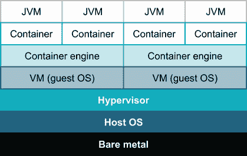

图 12.1 Java 应用程序的目标环境

在图 12.1 中，主机操作系统是抽象的最底层。虚拟机管理程序是下一层，然后是容器引擎、容器和 Java 应用程序。这似乎有点过分，不是吗？在更纯粹的容器环境中，确实如此，所以过去几年里，你会看到专门的容器主机机，如图 12.2 所示，它们移除了虚拟机管理程序和客户操作系统层。

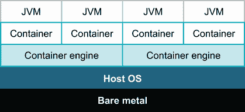

图 12.2 在专用容器引擎上 Java 应用程序的目标环境

这要好得多！话虽如此，大多数开发者并不确定他们的目标环境是什么样的。这里的要点是确保你与系统管理员联系，了解你的目标环境的确切样子以及每一层分配了多少裸金属有限资源。

尽管这些抽象层中存在所有这些复杂性，但作为一个 Java 开发者，你将主要关注容器作为部署目标，这种方式做事情有一些重要的好处。

### 12.1.2 容器的优势

在运行容器所需的额外移动部件中，为什么它们成为了新的部署标准？其中一个关键好处是容器能够应用限制，将单个运行进程彼此隔离。在过去，如果你在同一主机上部署了两个 Java 应用程序，它们相互干扰性能的可能性很高——窃取过多的 CPU 时间或占用超过其公平份额的内存。虽然存在缓解措施，但这些想法已经融入了容器的基本层。实际上，拥有我们可以信赖的限制，在实践中，使我们能够更充分地使用计算资源，在主机上运行比容器出现之前更安全的更多软件。

这种隔离如此关键，以至于在本章的剩余部分，我们将通过展示嵌套而不是堆叠的图像来展示容器、主机和进程之间的关系。这两种可视化关系都是有效的，所以不要对在野外找到两者感到惊讶，这取决于上下文。

容器还引领了一个更一致打包的世界，用于部署。你如何将应用程序的代码复制到部署环境，如何管理操作系统依赖，甚至如何管理进程启动，这些都曾经是随意的事情。容器为所有这些问题提供了答案，使得大量的工具和定制脚本变得不再必要。它们还为我们部署环境和容器内容之间提供了隔离。我们的容器引擎不需要关心我们如何安排容器内部结构——它只需要知道在请求时如何启动自己。容器镜像的打包是基础设施即服务（IaaS）的一个关键例子，它使用声明性、源代码控制的系统层描述，这在以前需要仔细的命令性构建。

最后一个好处建立在一致的打包上——围绕容器开发的生态系统。今天，几乎任何你想运行的软件的重要部分可能已经在 Docker Hub 或其他地方打包成容器了。大量的安装说明或定制安装脚本现在变得不再必要。

但不可能全是优点，对吧？运行在容器中有什么缺点？

### 12.1.3 容器的缺点

结果表明，我们列出的容器好处中的第一个——内置隔离——实际上在使用它们时却是一个难点。容器的任务是保持容器内部世界与外部世界的分离，而这个外部世界包括你，开发者。你在外部容器中常用的许多技术和工具在迁移到容器时可能需要特殊处理和配置。

尤其是在尝试将容器纳入你的本地开发流程时，这一点更为明显。更长的构建时间和在容器镜像之间移动大量时间可能并不总是值得。

尽管容器为我们打包和启动应用程序引入了一致接口，但现实世界的部署并不总是简单。例如，一个期望对其宿主机的磁盘有完全访问权限的应用程序可能需要配置，以便使所需的文件对容器可见。如果一组进程相互通信，将它们分离到容器中需要显式配置它们如何相互访问。捕获和应用此类配置是 Kubernetes 等编排器的一个关键任务。然而，请注意，我们将在本章简要介绍的 Kubernetes 是一个适合填满书籍的主题，并且该生态系统仍在快速发展。

尽管容器已经成为完全主流的技术，但经验丰富的开发者知道如何权衡利弊，为他们的系统找到合适的平衡点。让我们开始了解如何使用这些工具，以便我们能够感受到它们适合的位置。

## 12.2 Docker 基础知识

尽管许多构成容器的技术在此之前就已经存在，但 Docker 引入了方便的工具和抽象，将容器化推向了主流。让我们看看 Docker 给我们提供的两个核心功能——构建镜像和运行容器——以及我们作为 Java 开发者在实践中如何与之交互。

### 12.2.1 构建 Docker 镜像

Docker 容器是从 *镜像* 启动的。镜像本质上是一个快照，它捕获了运行软件所需的所有文件系统依赖项。镜像包括本地库、语言运行时、工具，最重要的是，运行你的软件的特定版本。

`Dockerfile` 是捕获构建镜像步骤集的典型格式。可能的最简单镜像，一个完全为空的镜像，看起来像这样：

```
FROM scratch
```

我们使用以下 `docker build` 命令构建镜像：

```
$ docker build .

[+] Building 0.1s (3/3) FINISHED
 => [internal] load build definition Dockerfile    0.0s
 => => transferring dockerfile: 55B                0.0s
 => [internal] load .dockerignore                  0.0s
 => => transferring context: 2B                    0.0s
 => exporting to image                             0.0s
 => writing image sha256:71de1148337f4d1845be0...  0.0s      ❶

Use 'docker scan' to run Snyk tests against images to find vulnerabilities
and learn how to fix them
```

❶ sha256 ID 71de114... 唯一标识生成的图像。我们稍后将看到如何给事物起一个更友好的名字。

当然，一个空图像并没有太大的用处。在实践中，存在许多已经安装了有用软件的基础镜像。这些基础镜像的默认来源是 Docker Hub ([`hub.docker.com/`](https://hub.docker.com/))。我们稍后会更多地讨论如何选择合适的 Java 基础镜像，但现在，让我们从一个由 Adoptium 提供的 Eclipse Temurin 版本的 OpenJDK 开始构建镜像。我们将特别选择这里显示的 `eclipse-temurin:11` 镜像，它包含 Java 11 的最新版本：

```
FROM eclipse-temurin:11
RUN java -version
```

默认情况下，Docker 的最新版本在交互式终端中构建时会动态隐藏输出。我们将使用 `--progress plain` 来获得更清晰的了解：

```
$ docker build --progress plain .

=1 [internal] load build definition from Dockerfile                        ❶
=1 sha256:261a2389333859f063c39502b306e984de49700a9...
=1 transferring dockerfile: 36B done
=1 DONE 0.0s

=2 [internal] load .dockerignore                                           ❶
=2 sha256:909e36a5a9cd7cc4e95e7926f84f982542233925d...
=2 transferring context: 2B done
=2 DONE 0.0s

=3 [internal] load docker.io/library/eclipse-temurin:11                    ❶
=3 sha256:6a73b62137bbf64760945abf21baf23bf909644cf...
=3 DONE 0.5s

=4 [1/2] FROM docker.io/library/eclipse-temurin:11...                      ❷
=4 sha256:f225b618d7ad96bd25e0182d6e89aa8e77643f42f...
=4 CACHED

=5 [2/2] RUN java -version                                                 ❸
=5 sha256:556476b43b8626a27892422f8688979c4ba1e6029...
=5 0.38 openjdk version "11.0.13" 2021-10-19
=5 0.38 OpenJDK Runtime Environment Temurin-11.0.13+8 (build 11.0.13+8)
=5 0.38 OpenJDK 64-Bit Server VM Temurin-11.0.13+8 (build 11.0.13+8)
=5 DONE 0.4s

=6 exporting to image                                                      ❶
=6 sha256:e8c613e07b0b7ff33893b694f7759a10d42e180f2...
=6 exporting layers 0.0s done
=6 writing image sha256:9796a789e295989cec550f... done
=6 DONE 0.0s

Use 'docker scan' to run Snyk tests against images to find vulnerabilities
and learn how to fix them
```

❶ Docker 在准备构建我们的镜像时采取的内部步骤

❷ 获取我们请求的基础镜像

❸ 我们的 `RUN` 命令在构建过程中执行，我们可以看到它的输出。

你可能会注意到，这段代码至少第一次运行需要更长的时间，因为 Docker 必须从 Docker Hub 下载相关的基镜像。我们添加的 `RUN` 命令在基镜像之上引入了我们自己的新步骤。`RUN` 可以在容器环境中执行任何有效的命令。如果命令改变了文件系统，这些更改将作为我们最终镜像的一部分被捕获。这个例子实际上并没有改变文件系统，但 `RUN` 经常用于下载文件（例如，通过 `curl`），使用标准包管理器安装操作系统包，或进行其他本地修改。

如果我们不触摸 `Dockerfile` 而再次运行相同的构建命令，我们可以看到构建 Docker 镜像的另一个重要部分：

```
$ docker build --progress plain .

=1-4 excluded for length...

=5 [2/2] RUN java -version
=5 sha256:556476b43b8626a27892422f8688979c4ba1e602907a09d62a39a2
=5 CACHED                                                           ❶

=6 exporting to image
=6 sha256:e8c613e07b0b7ff33893b694f7759a10d42e180f2b4dc349fb57dc
=6 exporting layers done
=6 writing image sha256:9796a789e295989cec5550fb3c17bc6c1d9c0867  done
=6 DONE 0.0s
```

❶ Docker 会在跳过某个步骤时通知我们，因为结果被缓存了。

`Dockerfile` 中每个前导命令（如 `FROM` 和 `RUN`）都创建了一个称为 *层* 的东西。因为这些命令通常很耗时，所以这些层被缓存，Docker 尽力避免不必要的操作。

现在我们已经有了 Java 环境，我们可以在那里运行自己的代码。我们将在`Dockerfile`旁边创建一个简单的 Java 文件，命名为`HelloDocker.java`。为了便于启动，我们将使用 Java 的单文件执行来运行它，而不是现在就构建一个完整的构建。基本代码如下：

```
public class HelloDocker {
  public static void main(String[] args) {
    System.out.println("Hello Docker!");
  }
}
```

我们可以指示 Docker 构建将此文件包含在我们的镜像中，并设置运行此镜像的容器的默认命令如下：

```
FROM eclipse-temurin:11
RUN java -version

COPY HelloDocker.java .            ❶

CMD ["java", "HelloDocker.java"]   ❷
```

❶ 将我们的文件复制到 Docker 当前工作目录

❷ 设置镜像的默认命令。注意每个命令行参数都在其单独的字符串中。

`COPY`（以及更复杂的`ADD`命令）将文件从我们的本地构建环境复制到我们的容器中。`ADD`特别具有许多选项，包括从远程源获取和自动提取 TAR 文件，但通常，如果您可以使用简单的`COPY`，那么您会更好。

`CMD`指向镜像生命周期的下一个阶段。我们不仅仅是为了好玩而构建这些镜像——我们希望运行我们在其中配置的软件。如前所述，每个镜像都有一个唯一的 SHA256 身份标识，但这些标识难以处理，并且每次构建时都会改变。在我们运行镜像之前，让我们用更简单的名称标记我们的镜像，如下所示：

```
$ docker build -t hello .

... Previous build steps excluded for length

=8 exporting to image
=8 sha256:e8c613e07b0b7ff33893b694f7759a10d42e...
=8 exporting layers done
=8 writing image sha256:666fdc7613189865b9a5f2... done   ❶
=8 naming to docker.io/library/hello done                ❷
=8 DONE 0.0s
```

❶ 我们镜像的 SHA256 身份标识

❷ 我们应用到最后镜像上的标签

目前我们的`hello`镜像仅在本地上可用，但通过`FROM`行我们已经看到镜像是可以共享的。这是通过所谓的*容器仓库*来实现的。当我们请求`eclipse-temurin:11`基础镜像时，Docker 默认会在 Docker Hub([`hub.docker.com/`](https://hub.docker.com/))上查找该镜像。其他容器仓库也存在，实际上，它们可以在内部运行以托管您的应用程序镜像。

您可以通过`docker push`和`docker pull`命令分别推送和拉取镜像，如下面的代码所示。如果与默认仓库一起工作，那么该名称将放在镜像和标签名称之前：

```
$ docker pull k8s.gcr.io/echoserver:1.4     ❶
1.4: Pulling from echoserver
6d9e6e7d968b: Pull complete
...
7abee76f69c0: Pull complete
Digest: sha256:5d99aa1120524c801bc8c1a7077e8f5ec122ba16b6dda1a...
Status: Image is up to date for k8s.gcr.io/echoserver:1.4
k8s.gcr.io/echoserver:1.4
```

❶ k8s.gcr.io 是仓库域名，echoserver 是镜像名称，1.4 是标签。

如果仓库需要身份验证，您可能在使用之前必须使用`docker login`。不过，Docker Hub 上公开可用的镜像不需要这一步。

构建好的 Docker 镜像还有很多内容，我们将在稍后回到一些这些主题。但首先，让我们看看如何将这些镜像转换为运行中的容器。

### 12.2.2 运行 Docker 容器

尽管您可能听到关于 Docker 和容器的所有炒作和讨论，但核心思想仅仅是能够在严格控制的环境中执行一个定义良好的过程。环境主要是由我们构建的镜像定义的。Docker 允许我们通过`docker run`命令运行容器，如下所示：

```
$ docker run hello
Hello Docker!
```

在这个命令中，Docker 基于我们的镜像创建了一个新的文件系统，应用了限制和控制（如 CPU 和内存），然后启动了由`CMD`定义的默认进程。我们的程序输出一条消息并退出，但它同样可以启动一个服务器并无限期地运行。

在图 12.3 中，我们可以看到我们在镜像的`CMD`中列出的`java`进程。请记住，这里显示的主机实际上在到达裸机之前可能隐藏了许多额外的层。

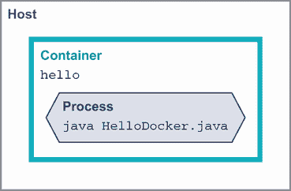

图 12.3 运行基本容器

我们的`CMD`仅定义了启动容器的默认命令。我们可以要求 Docker 使用我们想要的任何替代命令来运行镜像。我们之前提到容器有一个工作目录，就像你的交互式终端一样。我们可以使用`pwd`命令来询问容器该路径是什么，如下所示：

```
$ docker run hello pwd
/
```

如图 12.4 所示，当我们运行一个替代命令来启动容器时，默认的`CMD`进程就无处可寻。

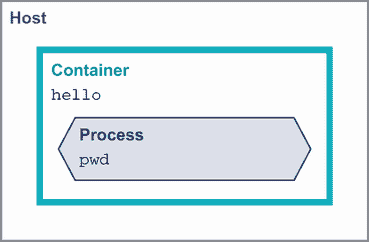

图 12.4 在容器中运行替代命令

我们可以通过文件将配置写入我们的镜像中，但通常希望允许在运行时定义它们。十二要素应用（[`12factor.net/`](https://12factor.net/)）中的一个原则，这是一套关于运行软件（如容器）的有影响力的思想，是通过*环境*来定义配置，这样相同的构建资源（在我们的情况下，是镜像）可以在不更改代码的情况下部署到新的目的地。

如以下代码片段所示，我们可以使用`-e`标志在启动容器时更改容器内的环境变量，这个标志可以多次传递。在我们的应用程序代码中，这些变量可以通过标准方式（如`System.getenv()`方法）读取：

```
$ docker run -e MY_VAR=here -e OTHER_VAR=there hello env         ❶
PATH=/opt/java/openjdk/bin:/usr/local/sbin:/usr/local/bin:...
HOSTNAME=f25762652561
MY_VAR=here                                                      ❷
OTHER_VAR=there                                                  ❷
LANG=en_US.UTF-8
LANGUAGE=en_US:en
LC_ALL=en_US.UTF-8
JAVA_VERSION=jdk-11.0.13+8
JAVA_HOME=/opt/java/openjdk
HOME=/root
```

❶ 运行标准 env 命令以查看容器的环境

❷ 我们完整的环境变量列表

在我们探讨更现实的构建 Java 应用程序在容器中的方法之前，让我们讨论一种最后的技巧：交互式运行镜像。我们已经看到如何更改默认命令以在容器中运行。我们可以使用同样的能力在容器中启动一个 shell，如`bash`，以进行额外的调试。这需要额外的`docker run`标志——具体来说，是`-i`，以便`STDIN`连接到容器，以及`-t`，以便容器为我们启动一个交互式 TTY，如下所示：

```
$ docker run -it hello bash
root@b770c2ac829c: ls *.java   ❶
HelloDocker.java
root@b770c2ac829c:
```

❶ 交互式输入 shell 命令以检查容器

这让我们能够精确地看到容器内部署的应用程序的世界。

将 hello world 单文件应用程序复制到容器中固然很好，但现在让我们看看更现实的将 Docker 和 Java 结合使用的方法。

## 12.3 使用 Docker 开发 Java 应用程序

在本节中，我们将探讨使用 Docker 开发 Java 应用程序的各种实际考虑因素。我们将从更深入地了解我们的 JVM 基镜像以及如何构建我们的镜像开始。从那里，我们将深入研究配置、运行和调试我们的容器时的各种考虑因素。我们的容器必须从某处获取 JVM，这把我们带到了选择基镜像的话题上。

### 12.3.1 选择您的基镜像

对于运行你的 JVM 应用程序的“正确”基镜像并没有一个单一的答案。确定适合你的镜像需要考虑以下因素：

+   我想要哪个供应商？

+   我想在容器内使用什么操作系统？

+   我需要在什么系统架构上运行？

供应商的选择也包含了一些可能影响你选择的因素（我们曾在第一章中简要讨论过），包括以下内容：

+   支持可用性和合同

+   安全更新策略和及时性

+   云部署的特殊考虑——Azure 的 Microsoft Build of OpenJDK，AWS 的 Amazon Corretto

云供应商特定的构建，虽然基于 OpenJDK，但可能包括在该供应商的云中具有益处的性能和其他增强功能。它们也可能有额外的支持和发布频率的好处。

大多数供应商在其容器中提供对多个操作系统的支持。常见的有 Debian、Ubuntu 或 Alpine，以及一些其他 Linux 变体。操作系统的选择在很大程度上决定了用于安装本地依赖项的包管理器以及容器内可用的额外工具。如果你的需求没有指定特定的操作系统，坚持使用更主流的选项，如 Debian/Ubuntu，通常可以避免在查找和更新软件包时遇到困难。

注意：特别小心使用 Alpine Linux。直到最近，Alpine 上还没有官方的 Java 镜像。你应该与你的 Java 供应商联系，并确保他们为 Alpine 提供镜像。

如果你需要在供应商直接提供的操作系统上运行，不要灰心。在这些情况下，你可以自己构建一个镜像，该镜像将使用系统的典型包管理器手动安装 JDK。记住，基镜像和我们的 Docker 构建只是确保容器文件系统中有了正确的位。通常有不止一种方法可以达到你想要的结果。

最后一点是关于镜像的系统架构。在云环境中，使用基于 ARM 的芯片越来越普遍。尽管这具有性能优势，但请注意，你需要为该架构专门构建的镜像。如果你需要在不同的架构上运行，你可能最终不得不构建和发布多个镜像，但 Docker 工具已经很好地支持了这一点。

### 12.3.2 使用 Gradle 构建镜像

正如我们在第十一章中看到的，任何大型的 Java 项目都将从使用一致的构建工具中受益。为了演示目的，我们将通过 Gradle 构建来构建一个镜像，但在资源中还有一个类似的 Maven 版本。

至少，我们的镜像需要包含我们应用程序的所有 JAR 文件（或类文件）以及我们类路径的所有依赖项。在我们的示例中，我们的应用程序依赖于`org.apache.commons:commons-lang3`，如下所示：

```
plugins {
  application
  java
}

application {
  mainClass.set("com.wellgrounded.Main")
}

tasks.jar {
  manifest {
    attributes("Main-Class" to application.mainClass)
  }
}

repositories {
  mavenCentral()
}

dependencies {
  implementation("org.apache.commons:commons-lang3:3.12.0")
}
```

我们需要一个与通常的`build`或`assemble`命令略有不同的命令，但 Gradle 的默认设置通过`installDist`为我们提供了所需的功能，如下所示：

```
$ ./gradlew installDist
```

从此命令生成的简化构建结果如下：

```
build
└── install
     └── docker-gradle
          ├── bin
          │     ├── docker-gradle
          │     └── docker-gradle.bat
          └── lib
               ├── commons-lang3-3.12.0.jar
               └── docker-gradle.jar
```

我们可以直接从 JAR 文件中运行容器，但 Gradle 已经为我们创建了一些启动应用程序的辅助脚本。让我们利用这些脚本：

```
FROM eclipse-temurin:17-jdk

RUN mkdir /opt/app                           ❶
WORKDIR /opt/app/bin                         ❷

COPY build/install/docker-gradle /opt/app/   ❸

CMD ["./docker-gradle"]                      ❹
```

❶ 确保目录存在，以便我们将结果复制进去

❷ Gradle 的启动脚本期望工作目录为 bin，因此将 bin 设置为 Docker 启动的默认位置。

❸ 将整个安装结果树复制到容器中

❹ 现在默认的运行命令是 Gradle 的启动脚本。

你可以在应用程序插件的文档中了解更多关于 Gradle 的启动脚本的信息（见[`mng.bz/yvxJ`](http://mng.bz/yvxJ))。

这种方法假设我们已经在本地安装了适当的 JDK，以便在将结果复制到我们的镜像之前使用 Gradle 构建。接下来，我们将看到如何完全使用 Docker 来实现这一点。

### 12.3.3 在 Docker 中运行构建

容器的一个关键承诺是能够为我们的软件创建一个隔离的、可重复的环境。这对于部署我们的服务是一个巨大的优势，但这并不止于此。许多项目的经典问题是设置本地开发环境。如果你曾经逐个步骤地阅读过 README，确保你得到了所有正确的版本，你就知道这种痛苦。容器可以帮助我们摆脱这种痛苦。让我们看看我们如何改变我们的构建以利用这种隔离。

到目前为止，我们的`Dockerfile`只涉及我们试图构建的一个结果镜像。但 Docker 允许我们在同一个文件中定义多个镜像，并且最重要的是，可以在它们之间复制内容。利用这种能力，我们可以构建一个用于构建我们应用程序的镜像——完全独立于本地系统上的任何 JDK——然后将结果复制到我们的部署镜像中。这对安全和镜像大小都有优势。

这个过程被称为*多阶段构建*，当`Dockerfile`中有多个`FROM`语句时，你可以看到它的实际操作。只是构建的中间阶段的`FROM`行也包括一个`AS`关键字来命名它们，以便在`Dockerfile`中稍后使用，而我们的主要结果镜像保持不变，如下所示：

```
FROM eclipse-temurin:17-jdk AS build                    ❶

RUN mkdir /project                                      ❷
WORKDIR /project

COPY . .                                                ❸

RUN ./gradlew clean installDist                         ❹

FROM eclipse-temurin:17-jre                             ❺

RUN mkdir /opt/app

COPY --from=build \                                     ❻
      /project/build/install/docker-gradle-multi \      ❻
      /opt/app/                                         ❻

WORKDIR /opt/app/bin
CMD ["./docker-gradle-multi"]
```

❶ 运行编译的容器，命名为 build

❷ 创建源代码的位置并将其设置为默认工作目录

❸ 将我们的完整项目复制到容器中

❹ 如同之前一样，在本地构建我们的应用程序（在这种情况下，是 Gradle 版本）

❺ 我们的部署镜像现在只需使用 JRE，它要小得多。

❻ 使用`COPY --from=build`从我们的构建镜像而不是本地文件系统获取文件。

现在持续集成环境只需要 Docker，而不需要安装 JDK，就能构建我们的应用程序以进行部署。如图 12.5 所示，所有必要的构建组件都完全位于容器内。

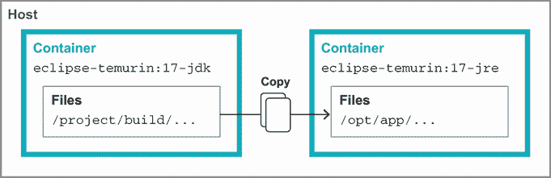

图 12.5 Docker 中的多阶段构建

值得指出的是，这几乎是最小化的此类构建设置，但它有一些关于构建时间的缺点。正如我们提到的，每个 Docker 命令都会创建一个被缓存的层，但如果我们不小心，这些缓存可能会被不必要地失效。

我们当前的`Dockerfile`中导致此类缓存失效的一个来源是将完整的项目目录复制到容器中。任何文件更改，无论多小，都会使`COPY . .`行失效，我们必须重新运行之后的所有内容。尽管如此，有些本地文件可能对我们的构建并不重要——例如，我们的 git 历史、IDE 文件和本地构建输出实际上不需要最终出现在我们的构建容器镜像中。幸运的是，我们可以通过在`Dockerfile`旁边放置一个`.dockerignore`文件来排除这些文件。格式简单，如果你之前使用过`.gitignore`文件，可能会很熟悉。如下代码片段所示，每一行都表达了一个模式（允许标准 shell 通配符），Docker 在查找要复制的文件时应忽略：

```
.git
.idea/
*.iml
*.class

# Ignore build folders
out/
build/
target/
.gradle/
```

第二个更为微妙的问题是我们的 Gradle 包装器。如果我们运行构建时观察输出，我们会看到它在启动时花费一段时间下载正确的分发。由于我们的容器启动时没有 Gradle 的本地缓存，这个下载每次运行都会重复。

避免这种重复需要将 Gradle 的第一次执行分离成一组单独的层，这些层在将我们的完整项目复制到容器之前发生。我们只想复制 Gradle 运行下载所需的最小文件，因此这个层的缓存只有在我们的 Gradle 包装器被更改（例如，更新版本）时才会失效：

```
COPY ./gradle ./gradle                 ❶
COPY ./gradlew* ./settings.gradle* .   ❶
RUN ./gradlew                          ❷

COPY . .                               ❸

RUN ./gradlew clean installDist
```

❶ 仅复制足够的 Gradle 配置以运行

❷ 仅运行`./gradlew`会强制下载分发，现在它被缓存在自己的层中。

❸ 我们的构建继续进行，我们的`COPY`操作很可能每次都会刷新（假设我们的代码已更改）。

这只是你在构建容器镜像时可以应用的各种优化类型的一个开始。需要记住的关键点是仔细考虑每个层应该包含什么。如果你的系统部分将以不同的速度发生变化，为它们提供单独的层可能是有益的。

我们已经展示了构建 Docker 镜像的相当原始的方法。正如你可能预料的那样，如果你想要封装这个功能而不手动编写 Dockerfile，Maven 和 Gradle 都有一系列插件。甚至有像 Jib([`github.com/GoogleContainerTools/jib`](https://github.com/GoogleContainerTools/jib))这样的选项，可以完全不使用 Docker 工具。所有这些都很实用，但一个扎实的开发者通过更深入地了解容器是如何构建的，即使他们在日常工作中得到帮助，也会得到帮助。

### 12.3.4 端口和主机

除了为我们应用程序提供其自己的独立文件系统外，容器还为网络做了同样的事情。以我们的示例应用程序为例，让我们假设我们添加了代码来运行一个标准的 HTTP 服务器，例如，在 JDK 中提供的`com.sun.net.httpserver.HttpServer`中的基本服务器。如果我们运行我们的容器，我们会发现没有方法可以调用那个 HTTP 端点。

为了解决这个问题，我们需要要求 Docker 为我们提供一个可用的端口。我们可以通过直接添加到我们的运行命令来实现这一点，如下所示：

```
$ docker run -p 8080:8080 hello
```

`-p`接受一个由冒号分隔的端口对。第一个值是我们希望在容器外部可用的端口。第二个值是我们软件在容器内部监听的端口。如果我们去另一个终端（或网页浏览器），我们可以看到它的工作情况，如下所示，以及图 12.6：

```
$ curl http://localhost:8080/hello
Hello from HttpServer
```

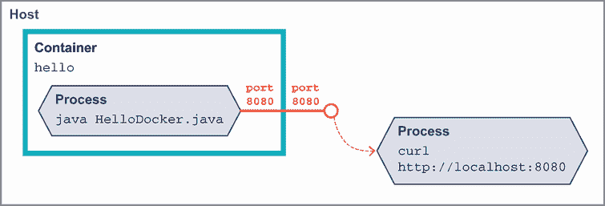

图 12.6 在 Docker 中暴露端口

如你从格式和图 12.6 中预期的那样，这两个端口值不必匹配。如果我们使用以下命令行运行：

```
$ docker run -p 9000:8080 hello   ❶
```

❶ 端口 9000 将在容器外部可见，连接到容器内部进程的端口 8080。

现在，我们将在端口 9000 上看到良好的响应，而 8080 不再可访问，如下所示：

```
$ curl http://localhost:9000/hello
Hello from HttpServer

$ curl http://localhost:8080/hello
curl: (7) Failed to connect to localhost port 8080: Connection refused
```

暴露端口是容器部署的基本部分，因此`Dockerfile`允许我们记录我们的镜像预期提供的端口，如下所示：

```
EXPOSE 8080
```

如果我们设置这个，再次运行`docker build`，并且不使用端口开关运行，你可能会惊讶地发现 Docker 不会默认使`EXPOSE`端口可用。然而，如果你只提供`-P`开关（注意大写和没有参数），Docker 将把我们的镜像中的每个`EXPOSE`端口绑定到一个随机或*临时*端口。因为我们无法猜测分配的端口是什么，我们需要一个新的命令来窥视并找到我们的临时端口。这可以通过以下`docker ps`来完成：

```
$ docker run -P hello

... In another terminal, some columns trimmed...
$ docker ps
CONTAINER ID   IMAGE     COMMAND             PORTS
94d7f125caad   hello     "./docker-gradle"   0.0.0.0:55031->8080/tcp
```

值`0.0.0.0:55031->8080/tcp`告诉我们，容器外部的端口 55031 绑定到了容器内部的端口 8080。

这种临时端口的业务可能一开始看起来像是一种烦恼，尤其是在测试时，因为端口会变动。但实际上，当在生产环境中运行容器时，这是一个关键特性。想象一下，你有一个主机，你希望充分利用它运行许多不同的 Java 容器。这些应用程序中的每一个都可能想要使用相同的端口，但主机只能分配一次该端口。尽管这需要在系统的其他部分进行额外的协调，但分配临时端口允许容器保持对世界的简单看法——“我运行在 8080”——同时仍然在一个更广泛、更复杂的环境中共存。

这使我们准备好在本地运行容器时与我们的应用程序进行通信。但另一方面——当我们的容器需要连接到其他服务，如数据库时，怎么办呢？

当我们在生产环境中运行时，明确配置服务位置并使用正常的负载均衡和 DNS 来访问它们是一种良好的做法。这些可以通过环境变量或其他服务发现系统注入到容器中，但关键是你不要假设资源相对于你的容器所在的位置。

但在本地工作时，这会变得更加困难，因为普通的开发者设置不会提供那种类型的基础设施。如果你使用 Docker for Mac 或 Docker for Windows，你可以在容器内部使用名称 `host.docker.internal`，它自动指向你的主机机器。Docker for Linux 可以在容器启动时使用 `--add-host host.docker.internal :host-gateway` 标志设置相同的设置。在这些情况下，如果你的应用程序设置为通过环境变量接收此类位置，你可以将你的容器指向该主机名。

如果这在你给定的环境中不起作用，容器内部存在一个主机的 IP 地址。例如，`sudo ip addr show` 这样的命令可能会给你一些关于位置的提示，但这很快就会变得繁琐。

容器拥有许多网络选项，这些选项超出了本书的范围，但其中一些可以帮助我们解决这个具体问题的选项被一个名为 Docker Compose 的工具所使用。让我们看看容器如何帮助我们本地解决外部资源访问问题。

### 12.3.5 使用 Docker Compose 进行本地开发

就像令人畏惧的新项目安装列表一样，应用程序在运行时通常也需要多个其他服务。也许你有一个数据库、一个缓存、一个 NoSQL 存储，甚至其他自定义应用程序，所有这些都必须运行起来，你的应用程序才能在本地工作。

Docker Compose 是一个用于声明和运行容器集的工具。它让我们能够捕获精确的服务集并一起启动它们。它还管理这些容器的状态保存，这样我们就可以停止和重新启动，而无需从头开始做所有事情。

如果这听起来类似于 Kubernetes 这样的编排工具，你并没有错。这两个工具在容器管理方面有重叠。然而，Docker Compose 是针对单台机器运行的，这使其不适合许多生产环境。

注意 Docker Compose 最初是一个独立的工具，但它已被集成到 `docker` 本身中的另一个命令中。如果你在网上看到有关运行 `docker-compose` 的信息，现在你只需将 `-` 替换为空格即可。

默认情况下，我们在名为 `docker-compose.yml` 的文件中描述我们的配置。首先，让我们这样告诉 Docker Compose 关于我们的应用程序：

```
version: "3.9"        ❶
services:
  app:                ❷
    build: .          ❸
    ports:
      - "8080:8080"   ❹
```

❶ Docker Compose 文件版本

❷ 声明一个名为 app 的服务来运行

❸ 指示 Docker Compose 在当前目录中运行一个典型的 Docker 构建来生成此服务的镜像

❹ 端口声明，就像我们在之前的手动 docker run 中做的那样

我们在命令行中使用 `docker compose up` 运行它。这将显示我们熟悉的构建输出，当它启动时，然后显示一些新的输出，当它启动我们的容器时，如下所示：

```
[+] Running 2/2
 - Network docker-gradle_default  Created                       0.1s
 - Container docker-gradle-app-1  Created                       0.1s
Attaching to docker-gradle-app-1
docker-gradle-app-1  | (Howdy,Docker)
```

我们的 `docker-compose.yml` 可以包含多个服务，我们将在稍后看到。每个服务的输出都带有名称前缀以区分它们，默认情况下基于我们的当前目录和服务名称，因此我们的名称是 `docker-gradle-app-1`。

假设我们的应用程序需要一个 Redis 实例。我们将其添加为一个新的键，我们将其称为 `redis`，在 `services` 键下，如下所示：

```
version: "3.9"
services:
  app:
    build: .
    ports:
      - "8080:8080"
  redis:
    image: "redis:alpine"   ❶
```

❶ 来自 Docker Hub 的 redis:alpine 镜像

现在我们运行时，Docker Compose 将拉取 `redis:alpine` 镜像，并使用我们的应用程序容器启动它。图 12.7 和接下来的代码示例说明了这些容器之间的关系：

```
[+] Running 7/7
 - redis Pulled                                    5.0s
   - 59bf1c3509f3 Pull complete                    1.2s
   - 719adce26c52 Pull complete                    1.2s
[+] Running 2/2
 - Container docker-gradle-redis-1  Created        0.2s
 - Container docker-gradle-app-1    Created        0.0s
Attaching to docker-gradle-app-1, docker-gradle-redis-1
docker-gradle-redis-1  | # oO0Oo Redis is starting...     ❶
docker-gradle-redis-1  | # Redis version=6.2.6, ...       ❶
docker-gradle-redis-1  | * monotonic clock: POSIX ...     ❶
docker-gradle-redis-1  | # Warning: no config file...     ❶
docker-gradle-redis-1  | * Running mode=standalone, ...   ❶
docker-gradle-redis-1  | # Server initialized             ❶
docker-gradle-redis-1  | * Ready to accept connections    ❶
docker-gradle-app-1    | (Howdy,Docker)                   ❷
```

❶ Redis 容器输出

❷ 我们的应用程序容器输出

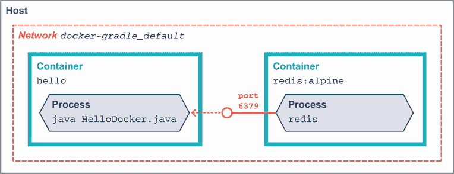

图 12.7 Docker Compose 容器运行

这已经很方便了——我们可以本地获取数据库和其他外部服务的精确版本，而无需手动安装。但是 Docker Compose 带来了另一个有用的功能，可以避免我们之前看到的许多网络问题。在初始启动期间，有一条消息显示 `Network docker-gradle_default Created`。这告诉我们 Docker Compose 创建了一个新的、独立的网络命名空间 `docker-gradle_default`。这个网络在我们为 Docker Compose 启动的所有服务之间共享。更好的是，我们在 `docker-compose.yml` 中指定的每个服务名称——`app` 和 `redis`——在所有容器内部都显示为真实的主机名。

如果我们根据十二要素原则设计了我们的应用程序，并通过环境变量传递 Redis 的位置，我们可以在 `docker-compose.yml` 中完全配置它，如下所示：

```
version: "3.9"
services:
  app:
    build: .
    ports:
      - "8080:8080"
    environment:
      REDIS_URL: redis://redis:6379   ❶
  redis:
    image: "redis:alpine"
```

❶ 第一个 redis 是 URL 方案，第二个 redis 是主机名。

这只是 Docker Compose 表面的冰山一角。所有控制`docker run`的常见选项都可以在`docker-compose.yml`中设置，这是平滑本地开发的一个很好的方法。

### 12.3.6 Docker 中的调试

当我们的软件表现不佳时，有时我们需要查看容器为我们设置的边界内部。之前我们遇到了`docker ps`来确定容器暴露的端口。然而，`docker ps`提供的信息远不止这些。特别是，默认情况下，容器会被赋予一个方便的、随机生成的名称，我们可以通过它来引用，如下所示：

```
$ docker ps
CONTAINER ID   IMAGE     COMMAND           ...  PORTS      NAMES
c103de6e6634   hello     "./docker-gradle" ...  8080/tcp   vigilant_austin
```

这个容器可以被称为`vigilant_austin`。如果你想要避免每次容器运行时名称都改变，你可以在`docker run`的`--name container-name`参数上控制它。你可能会想将它与`--rm`结合使用，以便在容器退出时删除它；否则，名称在第二次运行时将不可用。

有了容器的名称，我们可以采取其他调试步骤。使用`docker exec`，我们可以在运行中的容器中执行命令。正如我们之前在`docker run -it`中看到的那样，我们甚至可以在容器内获得一个交互式 shell，如下所示，假设它已安装了`bash`或类似的东西：

```
$ docker run --name hello-container --rm hello

# In another terminal start a shell in the container
$ docker exec -it hello-container bash

root@18a5f04bb4c8: ps aux
USER PID %CPU %MEM COMMAND
root   1  1.6  1.9 /opt/java/openjdk/bin/java -cp /opt/app/lib/docker-gradle
root  37  0.1  0.1 bash
root  47  0.0  0.1 ps aux
```

重要的是要记住，`exec`不会启动一个新的容器——它只是附加到一个现有的容器上。图 12.8 展示了进程如何在单个容器中共存。

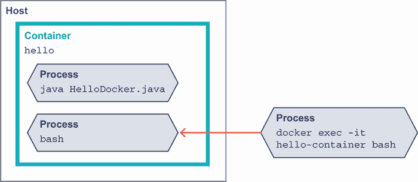

图 12.8 `docker exec`进入容器

虽然我们并不局限于仅使用基本的 Unix 命令，例如，我们可以使用`jps`和`jcmd`来检查容器中运行的 JVM，如下所示：

```
root@18a5f04bb4c8: jps
1 Main
148 Jps

root@18a5f04bb4c8: jcmd 1 VM.version
1:
OpenJDK 64-Bit Server VM version 17.0.1+12
JDK 17.0.1
```

在第七章中，我们探讨了使用 JFR（JDK 飞行记录器）工具可以获得的深度可见性。通过进入运行中的容器，我们可以使用几个简单的命令来收集 JFR 数据。如果它还没有运行，我们告诉 JFR 像这样开始记录：

```
root@4f146639fcfc: jcmd 1 JFR.start
1:
Started recording 1\. No limit specified, using maxsize=250MB as default.
```

在让应用程序收集数据一段时间后，我们将当前记录保存到容器内的文件中，如下所示：

```
root@4f146639fcfc: jcmd 1 JFR.dump name=1 filename=./capture.jfr
1:
Dumped recording "1", 293.3 kB written to:
```

要离线检查文件，我们需要将其从容器中复制出来。回到我们的主机系统，我们可以使用`docker cp`命令来完成，如下面的代码示例所示。同样，我们的容器名称在这里派上了用场，可以用来指定从哪里获取文件：

```
$ docker cp hello-container:/opt/app/bin/capture.jfr .   ❶
```

❶ `cp`命令的第一个参数是文件源，第二个参数是目标。它以`container-name:path`的格式指定。第二个参数是本地的，所以我们不需要容器名称，只需使用路径。

`capture.jfr`现在可在您的本地系统上打开，通过 JDK 任务控制（JMC）。

因为 Docker 公开了一个 API，所以你的`docker`命令可以指向远程主机而不是本地环境。有关如何配置的详细信息，请参阅 Docker 文档[`docs.docker.com/`](https://docs.docker.com/)。

所有这些 shell 和命令行选项都是获取我们容器中发生事情的低级别信息的好方法。但如果我们只想在本地容器中的 Java 应用程序的 IDE 中设置一个断点呢？幸运的是，JDK 的远程调试功能包含了我们配置此功能所需的所有组件，如下所示：

```
docker run --rm \
  -p 8090:8090 \
  -e JAVA_TOOL_OPTIONS=\
  '-agentlib:jdwp=transport=dt_socket,server=y,suspend=n,address=*:8090' \
  --name hello-container \
  hello
```

除了应用程序启动的正常输出外，你还应该看到如下消息，表明远程调试端口可用：

```
Listening for transport dt_socket at address: 8090
```

从这里，你可以使用你的 IDE 功能来调试指向端口 8090 的远程 JVM。一切都应该表现得与在本地环境中调试应用程序非常相似，但都是在容器这个舒适、受限的世界中。

### 12.3.7 使用 Docker 进行日志记录

正如我们反复看到的，容器从其宿主环境引入的隔离需要思维方式的转变。一个常见的障碍是日志记录。无论你使用的是流行的日志框架还是简单地写入`System.out`，在运行时产生输出是很常见的。我们不想因为迁移到容器而失去对这些信息的访问。

你可以使用我们在本章中已经看到的技术采取手动方法。简单地像以前一样将你的日志写入磁盘。当你需要检查它们时，你可以使用`docker exec`或`docker cp`来访问文件，如下所示：

```
// Start our container
$ docker run --rm --name hello-container hello

// In another shell, copy the file locally
// Assumes log is at /log/application.log
$ docker cp hello-container:/log/application.log .

// Or alternatively, tail the file continually
$ docker exec hello-container tail -f /log/application.log
```

然而，这引入了一些在检索这些信息时的摩擦，并且如果容器过早完全移除，可能会导致数据丢失。

一种常见的做法——无论是否有容器——是将应用程序的日志转发到中央位置。这个转发的目的地可以是集中式存储，一个索引服务，如 Elasticsearch，甚至是一个完全外部的日志提供商。

但是，如果我们试图在容器中保持将日志写入本地文件的简单做法，我们必须回答我们的日志转发应用程序在哪里运行的问题。将其放入容器中会消耗额外的内存和资源，我们需要考虑，通常建议避免在单个容器中放置多个东西。容器允许挂载卷，这样日志文件可以在容器和主机之间共享，但这需要配置，并且并不总是性能最佳。

一个更好的选择是依靠 Docker 捕捉我们的容器写入典型输出流的事实，即`STDOUT`和`STDERR`。在主机上，这些流被保存到每个正在运行的容器的已知文件位置。这简化了配置，因为我们可以在主机上一次性安装日志转发，并只需告诉我们的各个容器将日志写入`STDOUT`而不是文件。它还与现有的日志库兼容，例如`log4j2`，它有写入`CONSOLE`的附加器，正好用于这个目的。

这种围绕如何运行容器和捕获其日志的基础设施设置是一个例子，说明了在单个主机之外扩展容器时可能出现的问题。提供一种系统化的方法来回答这些问题是我们下一个主题的关键好处之一：Kubernetes。

## 12.4 Kubernetes

这本 Docker 入门书实际上只是触及了配置和定制我们容器的表面。在实际的生产环境中，您可能需要许多容器实例。仅使用`docker`命令管理大量容器会很快变得难以控制，并且生产环境中有数百个独立的容器并不罕见。您需要自动化这些任务。此类自动化的通用术语是*编排器*，尽管该领域有许多选项，但 Kubernetes 是主导解决方案。

Kubernetes（通常称为 K8s）是一个开源项目，最初源于谷歌在容器编排方面的内部工作。在其核心，它提供了一套标准、API 驱动的工具来描述系统的期望状态，并确保该状态在一段时间内得到维护。

Kubernetes 将您的系统建模为不同类型的*对象*集合。一组*控制器*持续运行，监视系统的实际状态并应用更改（例如，如果旧容器死亡则创建一个新的容器），以确保系统的期望状态和实际状态相匹配。

对 Kubernetes 的全面介绍远远超出了本书的范围，但为了了解其工作原理，让我们看看最基本的对象类型以及我们如何使用我们迄今为止获得的容器技能来使用它们。

+   *Cluster*—在单台机器到数百个节点上的单个 Kubernetes 安装

+   *Node*—集群中的单个机器（虚拟或物理）

+   *Pod*—一个可部署的容器单元（或多个容器）

+   *Deployment*—部署 Pod 的声明性方式

+   *Service*—一个对象，将集群中的容器暴露给调用者

为了逐步介绍这些概念并演示，我们将使用`minikube`，这是 Kubernetes 项目本身提供的本地开发环境。请参阅链接中的说明，获取您操作系统上的当前安装说明（[`minikube.sigs.k8s.io/docs/start/`](https://minikube.sigs.k8s.io/docs/start/)）。

安装完成后，我们可以使用`minikube start`命令启动本地集群，如下所示。请注意，第一次可能需要几分钟来下载所有必需的镜像：

```
$ minikube start

  minikube v1.25.2 on Darwin 11.6.2
  Using the docker driver based on existing profile
  Starting control plane node minikube in cluster minikube
  Pulling base image ...
  Downloading Kubernetes v1.23.1 preload ...
  > preloaded-images-k8s-v17-v1...: 504.44 MiB / 504.44 MiB  100.00%
  Restarting existing docker container for "minikube" ...
  Preparing Kubernetes v1.23.1 on Docker 20.10.12 ...
  * kubelet.housekeeping-interval=5m
  Verifying Kubernetes components...
  * Using image kubernetesui/dashboard:v2.3.1
  * Using image kubernetesui/metrics-scraper:v1.0.7
  * Using image gcr.io/k8s-minikube/storage-provisioner:v5
  Enabled addons: storage-provisioner, default-storageclass, dashboard

  Done! kubectl is now configured to use "minikube" cluster and "default"
  namespace by default
```

我们现在运行的 Kubernetes 集群是本地的。我们可以使用`minikube stop`命令停止集群，或者如果我们完全完成了实验，可以使用`minikube delete`命令将其删除。

虽然 Kubernetes 为系统提供了 REST API 以进行交互，但通过`kubectl`命令有一个更适合人类消费的方便包装器。我们可以使用它来查看、创建和编辑集群中的对象。例如，`minikube`默认负责创建我们的节点对象，但我们可以使用`kubectl describe node`来查看它代表我们设置了什么。此列表仅突出显示输出的一小部分，因为它提供了大量详细信息：

```
$ kubectl describe node

Name:               minikube
Roles:              control-plane,master
Labels:             kubernetes.io/arch=amd64
                    kubernetes.io/hostname=minikube
                    kubernetes.io/os=linux
Addresses:
  InternalIP:  192.168.49.2
  Hostname:    minikube

Non-terminated Pods:          (12 in total)                                ❶
  Namespace                   Name
  ---------                   ----
  kube-system                 coredns-64897985d-n8fzv
  kube-system                 etcd-minikube
  kube-system                 kube-apiserver-minikube
  kube-system                 kube-controller-manager-minikube
  kube-system                 kube-proxy-4zvll
  kube-system                 kube-scheduler-minikube
  kube-system                 storage-provisioner
  kubernetes-dashboard        dashboard-metrics-scraper-58549894f-bcjh4
  kubernetes-dashboard        kubernetes-dashboard-ccd587f44-mq8zv

Events:                                                                    ❷
  Type   Reason                  Message
  ----   ------                  -------
  Normal Starting                Starting kubelet.
  Normal NodeHasSufficientMemory Node status is: NodeHasSufficientMemory
  Normal NodeHasNoDiskPressure   Node status is: NodeHasNoDiskPressure
  Normal NodeHasSufficientPID    Node status is: NodeHasSufficientPID
```

❶ Kubernetes 本身在节点上运行在 Pod 中，如下所示。

❷ 如果节点中出现意外问题时，事件可能会有所帮助。

由于`minikube`为我们提供了集群和节点，我们已准备好运行一些软件。为了保持简单，我们将使用`k8s.gcr.io/echoserver:1.4`镜像，正如其名称所暗示的，它只是将发送给它的 HTTP 请求的信息回显。

注意`minikube`支持使用本地镜像进行工作，但它运行一个独立的 Docker 守护进程，因此镜像管理变得稍微复杂一些。如果您想使用`minikube`进行更多本地开发，请参阅[`github.com/kubernetes/minikube`](https://github.com/kubernetes/minikube)的 README。在我们的示例中，我们将坚持使用已发布的镜像以保持简单。

我们的首要目标是让集群上运行`echoserver`容器的 Pod 运行。我们通过请求`kubectl`创建一个部署来实现这一点，如以下代码片段所示。部署对象告诉 Kubernetes 集群我们希望 Pod 运行的状态。Kubernetes 的控制循环注意到期望状态与实际情况不匹配，并为我们启动 Pod 以解决这个问题：

```
$ kubectl create deployment echoes --image=k8s.gcr.io/echoserver:1.4
deployment.apps/echoes created
```

我们可以使用标准的`kubectl get`命令检查集群，以查看我们的部署是否存在，如下所示。此命令适用于系统中的任何类型的对象：

```
$ kubectl get deployments
NAME     READY   UP-TO-DATE   AVAILABLE   AGE
echoes   1/1     1            1           55s
```

如果我们查找 Pod，我们很快就会看到集群已经将其实际状态与我们的部署请求对齐，如下所示。图 12.9 展示了我们达到的单个 Pod 状态。

```
$ kubectl get pods
NAME                      READY   STATUS    RESTARTS   AGE
echoes-7989cff4bc-7m4df   1/1     Running   0          78s
```

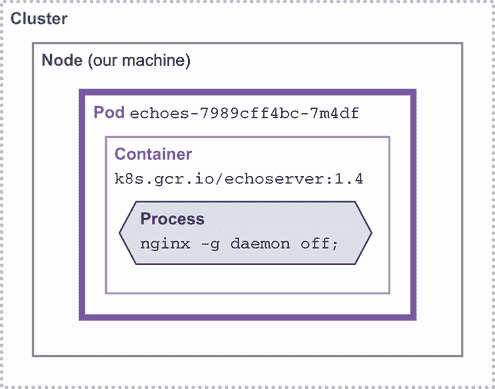

图 12.9 运行一个 Pod 的 Kubernetes 集群

`kubectl create deployment`命令是一个简单的入门方式，但它的参数只是触及了 Kubernetes 可以配置的表面。Kubernetes 对象的自然表示形式是 YAML，我们可以通过`kubectl edit deployment echoes`来访问完整的图片，如下所示。这将打开您的默认编辑器，并显示对象的当前 YAML。如果您对文件进行了更改，它们将在编辑器退出时应用。我们不会讨论所有这些选项，因此请参阅[`mng.bz/M5m2`](http://mng.bz/M5m2)的文档以获取更多信息：

```
# Please edit the object below. Lines beginning with a '#' will be ignored,
# and an empty file will abort the edit. If an error occurs while saving
# this file will be reopened with the relevant failures.
#
apiVersion: apps/v1
kind: Deployment
metadata:
  annotations:
    deployment.kubernetes.io/revision: "1"
  creationTimestamp: "2022-02-01T08:26:32Z"
  generation: 1
  labels:
    app: echoes
  name: echoes                                           ❶
  namespace: default
  resourceVersion: "1310"
  uid: e8b775f6-243e-46c1-9275-dadaecf2db3b
spec:                                                    ❷
  progressDeadlineSeconds: 600
  replicas: 1                                            ❸
  revisionHistoryLimit: 10
  selector:
    matchLabels:
      app: echoes
  strategy:
    rollingUpdate:
      maxSurge: 25%
      maxUnavailable: 25%
    type: RollingUpdate
  template:
    metadata:
      creationTimestamp: null
      labels:
        app: echoes
    spec:
      containers:
      - image: k8s.gcr.io/echoserver:1.4                 ❹
        imagePullPolicy: IfNotPresent
        name: echoserver
        resources: {}
        terminationMessagePath: /dev/termination-log
        terminationMessagePolicy: File
      dnsPolicy: ClusterFirst
      restartPolicy: Always
      schedulerName: default-scheduler
      securityContext: {}
      terminationGracePeriodSeconds: 30
status:                                                  ❺
  availableReplicas: 1
  conditions:
  - lastTransitionTime: "2022-02-01T08:26:33Z"
    lastUpdateTime: "2022-02-01T08:26:33Z"
    message: Deployment has minimum availability.
    reason: MinimumReplicasAvailable
    status: "True"
    type: Available
  - lastTransitionTime: "2022-02-01T08:26:32Z"
    lastUpdateTime: "2022-02-01T08:26:33Z"
    message: ReplicaSet "echoes-7989cff4bc" has successfully progressed.
    reason: NewReplicaSetAvailable
    status: "True"
    type: Progressing
  observedGeneration: 1
  readyReplicas: 1
  replicas: 1
  updatedReplicas: 1
```

❶ 我们为部署给出的 echo 名称

❷ spec 描述了我们的部署所需的状态。

❸ 我们将在稍后讨论的一个重要值，它决定了我们希望运行的 Pod 数量

❹ 我们为 Pod 运行请求的镜像

❺ `status` 告诉我们目前观察到的部署状态。请注意，它还有一个副本，告诉我们现在有多少正在运行。

如果我们将 `replicas: 1` 的 `spec` 值更改为 `3`，会发生什么？Kubernetes 会看到部署状态与集群实际状态之间的不匹配，并代表我们启动新的容器，如下所示。图 12.10 显示了容器启动后的结果。

```
$ kubectl get pods
NAME                      READY   STATUS    RESTARTS   AGE
echoes-7989cff4bc-7m4df   1/1     Running   0          7m38s
echoes-7989cff4bc-7qn47   1/1     Running   0          8s
echoes-7989cff4bc-cmngm   1/1     Running   0          8s
```

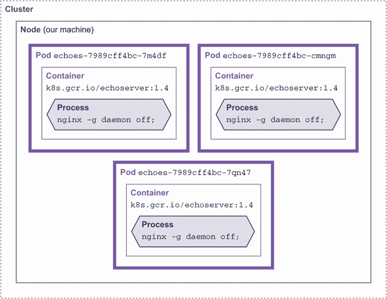

图 12.10 多个 pod 运行的 Kubernetes 集群

实际上，你很可能不会在生产 Kubernetes 集群上手动编辑 YAML 文件，但所有工具都是基于此构建的——CI/CD 系统、生成的或源控制的 Kubernetes 清单只是帮助我们创建正确的 YAML 和 API 调用的辅助工具。

在我们的本地系统上，我们之前用 `docker ps` 和 `docker exec` 玩过的同样的技巧将适用于让我们更仔细地查看正在运行的容器。一旦我们知道容器名称，`kubectl` 就有一个稍微干净一点的命令，允许我们在 pod 内部启动一个 shell，如下所示：

```
$ kubectl exec echoes-7989cff4bc-7m4df -- bash
root@echoes-7989cff4bc-7m4df: uname -a
Linux echoes-7989cff4bc-7m4df 5.10.76-linuxkit #1 SMP \
  Mon Nov 8 10:21:19 2021 x86_64 x86_64 x86_64 GNU/Linux
```

需要再进行最后一步才能使这次部署更有用。默认情况下，我们根本无法与集群中的 pod 进行通信。如果我们查看容器的 `docker ps`，你会看到没有任何端口被暴露。

Kubernetes 通过其 *服务* 抽象来解决这一问题，这是一个用于处理集群中各种负载均衡和流量路由的通用接口。这里的细节很快就会超出本介绍的范畴，但我们将设置其中最简单的一个，称为 `NodePort`，使用 `kubectl expose` 如下所示：

```
$ kubectl expose deployment echoes --type=NodePort --port=8080
service/echoes exposed
```

如图 12.11 所示，这会在集群中创建一个新的对象，代表我们的 `NodePort`。

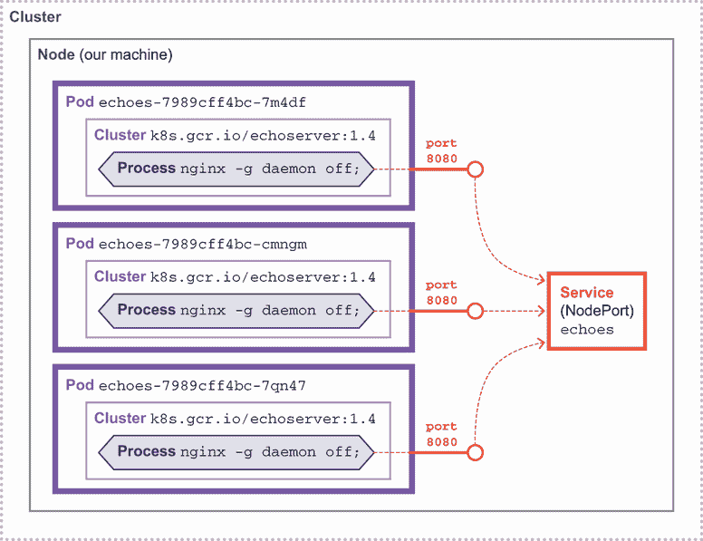

图 12.11 Kubernetes 集群中的 `NodePort` 和服务

查看服务，我们可以看到集群中配置了 `NodePort`，如下所示：

```
$ kubectl get services
NAME         TYPE        CLUSTER-IP       EXTERNAL-IP   PORT(S)          AGE
echoes       NodePort    10.108.182.100   <none>        8080:31980/TCP   12s
kubernetes   ClusterIP   10.96.0.1        <none>        443/TCP          35m
```

内部来说，这意味着集群中的每个节点上都可用端口 8080，并将流量转发到我们的 pod。现在我们已经有了让流量到达我们的 pod 的方法，我们仍然需要将其暴露在集群外部才能调用它。`kubectl` 通过其端口转发功能支持这一点，如下所示：

```
$ kubectl port-forward service/echoes 7080:8080
Forwarding from 127.0.0.1:7080 -> 8080
Forwarding from [::1]:7080 -> 8080
Handling connection for 7080
```

在终端中运行此转发，我们可以在浏览器中访问 127.0.0.1:7080，我们会看到我们的请求被回显。图 12.12 显示了流量通过各个组件到达 pod 的流程。

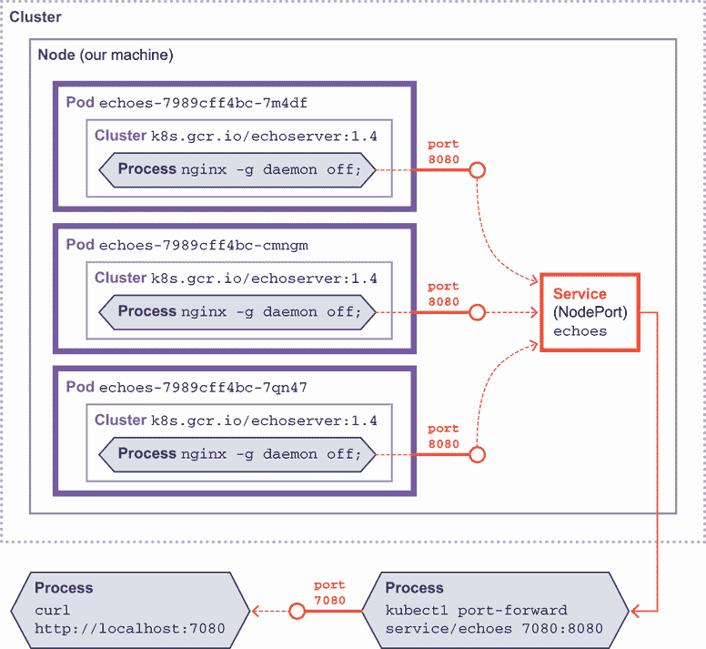

图 12.12 Kubernetes 集群中的端口转发

Kubernetes 的复杂性比仅在本地上运行我们的 Docker 容器要高得多，但它也提供了解决大规模运行容器困难的方法。然而，无论我们是否在 Kubernetes 上运行，我们几乎总是关心我们服务的性能。让我们来看看如何管理我们的容器在生产中的运行情况。

## 12.5 可观察性和性能

Java 技术最初是为一个在数据中心裸金属上运行 JVMs 的世界而设计的，在这个世界中，开发者可以相对独立于（甚至对）部署环境的细节保持无知。然而，世界正在从根本上发生变化。云原生部署——尤其是容器——已经到来，并且正在迅速被采用（但不同行业的各个部分采用的速度不同）。

容器在理解现代应用程序发生的细节方面提出了一些特定的挑战。例如，容器运行诸如 ssh 守护程序等服务并不是常见的做法，这使得无法登录到容器中观察正在发生的事情。相反，任何关于应用程序健康状况的数据都必须从容器中导出。

被称为*可观测性*的 DevOps 实践源于现代开发实践的几个不同分支，包括应用性能监控（APM）领域以及对编排系统（如 Kubernetes）可见性的需求。它的目标是提供对系统行为的非常细粒度的洞察，以及丰富的上下文。它提供的技术对于理解和调整容器中 Java 应用程序的性能非常有用，如果不是必不可少的。

### 12.5.1 可观测性

总体而言，可观测性是一个相当简单的概念集合：

1.  仪器化和应用程序以收集相关数据

1.  将这些数据发送到可以存储和分析的系统（包括查询能力）

1.  提供对整个系统的可视化洞察

查询和可视化能力是可观测性力量的关键。它被描述为“回答你不知道需要问的问题”——而这只有通过收集足够的数据来准确建模系统的内部状态才能实现。

注意：可观测性背后的理论来自系统控制理论——本质上是一个问题：“从外部可以多好地推断出系统的内部状态？”

最终的目标是能够从整个系统中获得*可操作的*洞察，这应该取代仅基于整体系统的一两个部分的片段性观点。

因此，虽然事件解决是一个显然适合可观测性的用例——毕竟，这是该实践起源的地方——但事实也是，潜在的适用范围要大得多。如果收集了正确的数据，可观测性的利益相关者远不止软件可靠性工程师（SREs）、生产支持和 DevOps 人员。

可观察性对于容器化应用程序尤其相关，因为这些部署通常比传统的本地应用程序更复杂。云部署的应用程序通常有更多的服务和组件，以及更复杂的拓扑结构，以及变化的速度更快（由持续部署等实践驱动）。

这也与新兴云原生技术的日益普及相结合，这些技术具有新的操作行为。这包括 Kubernetes，以及作为服务的函数部署，如 AWS Lambda。这个新世界使得根本原因分析和事件解决可能变得相当困难。

可观察性数据通常用“三个支柱”来概念化。这是一个简单的思维模型（有些人可能会认为*太简单*），但对于刚开始接触可观察性的开发者来说很有用。支柱如下：

+   *分布式跟踪*——单个服务调用的记录，对应于用户的一个请求

+   *度量*——在时间间隔内测量特定活动的值

+   *日志*——随时间发生的不变事件记录（可以是纯文本、结构化或二进制）

核心库和仪器组件都是开源的，其中大部分由云原生计算基金会（CNCF）等行业协会管理。

OpenTelemetry

OpenTelemetry 项目（[`opentelemetry.io/`](https://opentelemetry.io/)），作为 CNCF 中的一个主要项目，是一套标准、格式、客户端库和相关软件组件，用于提供可观察性。这些标准是明确跨平台的，并且不依赖于任何特定的技术堆栈。

这提供了一个框架，可以与操作系统和商业产品集成，并可以从用多种语言编写的应用程序中收集可观察性数据。由于实现是开源的，它们的技术成熟度各不相同，这取决于 OpenTelemetry 在特定语言社区中吸引的兴趣。

OpenTelemetry 项目源于两个先前开源项目的合并，即 OpenTracing 和 OpenCensus 项目。尽管 OpenTelemetry 仍在不断发展，但它正在获得动力，越来越多的应用程序和团队正在研究和实施它。这个数字似乎在 2022 年和 2023 年将显著增长。

从我们的角度来看，Java/JVM 实现是最成熟的可用的之一，并且与传统 APM/监控相比具有许多优势。特别是，使用开放标准提供了以下优势：

+   大大减少了供应商锁定

+   开放规范线协议

+   开源客户端组件

+   标准化架构模式

+   开源后端组件的数量和质量不断提高

OpenTelemetry 有几个子项目构成了整个标准，它们在其整体生命周期方面并不处于相同的成熟度水平。

分布式跟踪规范已达到 v1.0，并正在积极部署到生产系统中。它完全取代了 OpenTracing，OpenTracing 项目已被官方存档。最受欢迎的分布式跟踪后端之一，Jaeger 项目也已经停止其客户端库的开发，并将默认使用 OpenTelemetry 协议。

OpenTelemetry 度量项目虽然不算特别先进，但已经达到了 v1.0 和通用可用性（GA）阶段。在撰写本文时，该协议是稳定的，API 处于特性冻结状态。

最后，日志规范仍在草案阶段，预计要到 2022 年底才能达到 v1.0。目前仍认为在规范上还有一定的工作要做。

总体而言，当度量标准达到 v1.0 并与跟踪一起时，OpenTelemetry 作为一个整体将被视为 v1.0/GA。

OpenTelemetry 的 Java 库可以通过手动方法（开发者必须明确选择应用中需要被检测的部分）或使用自动检测（使用 Java 代理）部署到您的应用中。OpenTelemetry 的 Java 组件可以在 GitHub 上找到，并存在于多个项目中，包括[`mng.bz/aJyJ`](http://mng.bz/aJyJ)。

完全可观测性解决方案的实施方法（无论基于 OpenTelemetry 还是其他堆栈）超出了本书的范围，但经验丰富的 Java 开发者应该彻底探索这个领域。

与可观测性相关的一些性能细节，对于不是 Java/VM 专家的工程师来说可能并不了解。让我们更深入地了解一下。

### 12.5.2 容器中的性能

许多开发者在将 Java 应用程序迁移到容器时，会尝试使用尽可能小的容器。这似乎是有道理的，因为基于云的应用通常按使用的 RAM 和 CPU 数量计费。

然而，JVM 是一个非常动态的平台，某些重要的参数在启动时由 JVM 根据 JVM 运行所在机器的观察属性自动确定。

这些属性包括 CPU 的类型和数量以及物理内存。当在不同的机器上运行时，运行中的应用程序的行为可能会不同，这包括容器。以下是一些动态属性：

+   JVM 内省，一种可以利用非常具体的 CPU 特性（例如向量支持）的 JIT 技术

+   内部线程池（如“通用池”）的大小

+   用于 GC 的线程数量

只从这份列表中，我们就可以看出，错误地选择容器镜像的大小可能会导致与 GC 或常见线程操作相关的问题。然而，这个问题在本质上比这更深。

当前版本的 Java，包括 Java 17，在命令行未显式指定 GC 的情况下，会进行一些动态检查并** ergonomically**（自动地）决定使用哪种 GC。如果您没有指定收集器，那么逻辑如下：

+   如果机器是“服务器级”，则选择 G1（Java 8 的并行）。

+   如果机器不是“服务器级”，则选择 Serial。

服务器级机器的工作定义是：>= 两个物理 CPU 和 >= 2 GB 内存

这意味着如果 Java 应用程序在一个看起来少于两个 CPU 和 2 GB 内存的机器上运行，除非显式选择特定的收集器算法，否则将使用 Serial 算法。这通常不是团队想要的，并导致以下最佳实践：

建议：始终以至少两个 CPU 和 2 GB 内存运行 Java 应用程序。

同样重要的是要认识到，传统的 Java 应用程序生命周期包括多个阶段：引导、密集的类加载、预热（带有 JIT 编译），然后是一个长期稳定的状态（可能持续数天或数周），在此期间类加载和 JIT 相对较少。这种模式在云部署中受到挑战，因为容器可能存在的时间更短，集群大小可能会动态调整。

在这个新世界中，Java 必须确保它在几个关键轴上保持竞争力，包括以下方面：

+   占用空间

+   密度

+   启动时间

幸运的是，正在进行确保平台继续优化这些特性的工作和研究——我们将在第十八章中了解更多关于它。

## 摘要

+   容器彻底改变了我们打包和部署应用程序的方式，并需要一些新的技术和想法。

+   容器在经典操作系统、虚拟机管理程序和过去我们看到的虚拟机之上提供了一个另一层抽象。

+   Docker 是构建、发布和运行容器镜像最常用的工具。

+   我们通过 `Dockerfile` 指定容器镜像。生成的镜像包含我们的应用程序和一个完整的运行环境，包括 JVM、本地依赖项和额外的工具。

+   容器在特定于网络方面引入了一个额外的层。在其最基本的形式中，我们必须管理容器暴露的端口，以便它们对外部世界是可访问的。

+   在大规模上运行容器集群需要跟踪很多东西，因此使用编排器来系统地完成这项工作。最受欢迎的选择是 Kubernetes。

+   Kubernetes 提供了一个丰富的、可扩展的 API，用于声明系统的期望状态，并在运行时实现该状态。它可以通过命令行和一个 REST API 访问，周围有一个庞大的支持工具生态系统。

+   容器的一个关键特性是强制资源约束。这些对内存和 CPU 的限制可能对在容器中运行的应用程序的性能产生影响。
