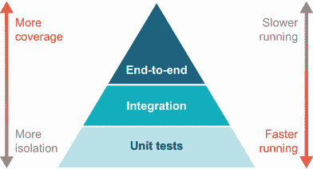

# 13 测试基础

本章涵盖

+   为什么我们要进行测试

+   我们如何进行测试

+   测试驱动开发

+   测试替身

+   从 JUnit 4 到 5

近年来，编程领域越来越接受自动化测试作为开发过程的一个预期部分。测试由开发者在本地运行，并在构建和持续集成环境中运行，以确保我们的系统表现良好。随之而来的是各种工具、方法和哲学的爆炸式增长。

就像任何技术一样，没有一劳永逸的解决方案——没有一种测试方法能涵盖所有可能的情况。鉴于这种情况，了解你为什么要测试非常重要，这样你才能确定最佳的测试方法。

## 13.1 为什么我们要进行测试

事实上，这个词“测试”隐藏了我们检查代码行为可能存在的许多原因。以下是一个非详尽（有时重叠）的考虑列表：

+   确认单个方法的逻辑是正确的

+   确认代码中两个对象之间的交互

+   确认库或其他外部依赖按预期行为

+   确认系统某部分产生或消耗的数据是有效的

+   确认系统与外部组件（如数据库）正确工作

+   确认系统的端到端行为满足重要的业务场景

+   为后来的维护者记录假设（因为测试不会像注释和文档那样同步）

+   通过暴露紧密耦合和对象职责来影响系统设计

+   自动化发布后清单，这些清单通常由人工执行

+   通过随机输入在代码中找到意外的边缘情况

即使这个简短的测试动机列表也表明，“测试你的代码”这个简单的想法并不一定那么简单。因此，当我们接近测试时，我们需要问自己以下问题：

+   我测试这段代码的动机是什么？

+   哪些技术能让我最准确、最干净地实现这个目标？

## 13.2 我们如何进行测试

讨论不同类型测试时最常用的工具之一是测试金字塔，如图 13.1 所示。它最初来自迈克·科恩的书籍《成功实施敏捷》（Addison-Wesley Professional，2009 年），金字塔表达了一种平衡不同类型测试成本的方法，以最大化它们为我们提供的帮助。



图 13.1 测试金字塔

尽管互联网上关于这些测试类型之间确切边界的争论激烈，但核心思想非常有用。

注意：这些类型的测试不是由你使用的工具定义的——你使用 JUnit 并不意味着你只是在编写单元测试，使用规范库也不能保证你实际上创建了对利益相关者有益的可用的验收测试。这些类型的测试是关于我们想要练习和证明的内容。

*单元测试*构成了金字塔的基础。这些是专注于测试系统某一方面的测试。我们所说的“一方面”是什么意思呢？最容易的部分是测试代码与外部依赖项的关系。如果你的测试在逻辑处理结果之前调用数据库，那么这不再是“一个”你要测试的事物——你现在正在测试数据库检索*以及*你的逻辑是否正确。这些外部依赖项也可能包括网络服务或文件。

避免违反单一关注点的一种常见方法是用*测试替身*——例如，让我们的单元测试与一个假对象通信而不是与真实的数据库通信。我们将在下一节中详细讨论这一点，但基本思想是这种欺骗有许多风味，如果要做好，我们需要考虑许多必要的事情。

单元测试因其多个原因而具有吸引力，因此它们在测试金字塔中的传统位置是最大的部分。这些原因包括以下内容：

+   *快速*——如果一个测试没有外部依赖项，它的执行时间不应该很长。

+   *专注*——通过只讨论一个“单元”的代码，测试所表达的内容通常比在更大、设置更复杂的测试中更清晰。

+   *可靠的失败*——最小化外部依赖项，特别是对外部状态的依赖，有助于使单元测试更加确定。

所有这些都听起来很棒，那么为什么我们不是一直只写单元测试呢？事实是，单元测试有其局限性，这阻止了它们在需要测试的每个规模上都有用。问题包括以下内容：

+   *紧密耦合*——由于单元测试本质上与其实现紧密相关，它们也容易过于紧密地绑定到那些实现选择上。当底层实现发生变化时，整个单元测试套件失效的情况并不少见。

+   *缺失有意义的交互*——虽然将我们的代码视为一队只关心自己事务的对象很有吸引力，但现实是程序的真正工作包括这些依赖部分之间的交互，而单元测试可能会错过这些交互。

+   *内部关注*——测试的目标通常是证明我们的软件最终用户得到了正确的结果。很少有一个方法的正确性实际上会转化为满意的用户。

*集成测试*，金字塔的下一步，摆脱了单元测试中与依赖项通信的限制。集成测试跨越这些边界，实际上可能专注于确保系统的不同部分能够无缝集成。

与单元测试一样，集成测试也可以选择只测试系统的部分。一些依赖项，如外部服务，可能仍然可以用测试替身来替换，而其他依赖项，如数据库，则适合进行测试。关键在于，测试的范围超出了单个“单元”代码。

单元测试和集成测试之间的确切界限可能很模糊。尽管如此，以下是一些明显跨越界限进入集成测试领域的例子：

+   你需要一个数据库实例，并调用你的数据访问代码。

+   你启动一个特殊的进程内 HTTP 服务器，并对其发起测试请求。

+   你会对另一个服务进行实际调用（无论是否在测试环境中）。

集成测试具有许多不错的特性，如下所示：

+   *更广泛的覆盖范围*——集成测试必然需要测试更多的代码以及你依赖的库的代码。

+   *更多验证*——某些类型的错误可能只有在使用真实依赖项时才能检测到。例如，SQL 语句中的语法错误在没有调用实际数据库的情况下很难找到。

当然，没有选择是没有权衡的。如果管理不当，集成测试可能会成为痛苦之源，原因如下：

+   *慢速测试*——访问真实数据库而不是从内存中读取值要慢得多。将这一点乘以数百或数千次测试，你可能会发现自己等待……很长时间。

+   *非确定性结果*——外部依赖增加了重要状态可能在测试运行之间发生变化的可能性。例如，数据库中留下的记录可能会改变 SQL 语句返回的内容。

+   *虚假信心*——集成测试有时使用与主系统略有不同的依赖项。例如，如果测试数据库的版本与生产不同，集成测试可能会错误地建议一切正常，而实际上并非如此。

对于所有这些困难，集成测试是测试领域的一个关键部分。

*端到端测试*超越了集成测试，目的是复制系统的完整用户体验。这可能意味着通过程序驱动网络浏览器或其他应用程序，或者在测试环境中操作服务的完全部署实例。端到端测试带来了以下难以在系统较低级别复制的优势：

+   *“真实”用户体验*——一个好的端到端测试接近用户所看到的内容。这让我们能够直接验证用户的高层次期望。

+   *“真实”环境*——许多端到端测试是在测试、预发布或甚至生产环境中运行的。这验证了我们的代码在舒适、精心管理的构建环境之外也能正常工作。

+   *UI 可用性*——许多端到端测试方法，如驱动网络浏览器的那些，可以查看系统的某些方面（例如，按钮是否渲染，因此可以点击），这些在其他地方可能很难验证。

但这种在我们端到端测试中的更大现实也伴随着下一个严峻的困难列表：

+   *更慢的测试*—在许多单元测试几乎瞬间运行，甚至集成测试通常也能在几秒内完成的情况下，控制网络浏览器遍历网站的全链路测试必然需要更长的时间来运行。

+   *不稳定的测试*—从历史上看，端到端测试的工具，尤其是 UI 测试，容易出问题，需要重试和长时间的超时来避免不必要的失败。

+   *脆弱的测试*—因为端到端测试位于金字塔的顶部，任何低于这一级别的更改都可能导致失败。看似无害的文本更改可能会无意中破坏这些庞大的测试。

+   *更难的调试*—因为端到端测试通常引入了另一个驱动测试的层，找出什么出了问题通常是一项繁琐的工作。

拥有这个金字塔，你可能会想问，“层与层之间正确的测试比例是多少？”事实是，没有唯一的答案。每个项目和系统的需求都不同。但金字塔可以帮助你指导你在选择如何测试系统中的每个功能部分时的利弊。

虽然这肯定不是唯一的方法，但经验丰富的开发者可能会发现，随着系统的演变，测试驱动开发有助于保持不同级别测试的清晰。

## 13.3 测试驱动开发

测试驱动开发（TDD）已经软件开发生业中存在了一段时间。其基本前提是在实现过程中编写测试，而不是之后，这些测试会影响代码的设计。一个常见的 TDD 方法，称为测试先行，是实际编写一个失败的测试，然后再提供实现，根据需要重构。例如，要编写两个字符串对象（`"foo"`和`"bar"`）的连接实现，你首先编写测试（测试结果必须等于`"foobar"`），以确保你知道你的实现是正确的。尽管许多开发者编写测试，但往往是在实现之后，从而失去了 TDD 的一些主要好处。

尽管看似无处不在，但许多开发者并不理解为什么他们应该进行测试驱动开发。许多开发者的疑问仍然是，“为什么编写测试驱动代码？有什么好处？”

我们相信，*消除恐惧和不确定性*是你应该编写测试驱动代码的压倒性原因。Kent Beck（JUnit 测试框架的共同发明者）也在他的书中很好地总结了这一点，*测试驱动开发：通过示例*（Addison-Wesley Professional，2002）：

+   恐惧会让你变得犹豫不决。

+   恐惧会让你想要减少沟通。

+   恐惧会让你回避反馈。

+   恐惧会让你变得易怒。

TDD 消除了恐惧，使经验丰富的 Java 开发者变得更加自信、善于沟通、乐于接受并更快乐。换句话说，TDD 帮助你摆脱了导致这些陈述的心态：

+   当开始一项新的工作时，“我不知道从哪里开始，所以我只会开始乱搞。”

+   当更改现有代码时，“我不知道现有代码会如何表现，所以我秘密地太害怕去更改它。”

TDD 带来了许多其他好处，这些好处并不总是立即明显，如下所示：

+   *更干净的代码*—您只编写所需的代码。

+   *更好的设计*—一些开发者称 TDD 为*测试驱动设计*。

+   *更好的 API*—您的测试充当实现的一个额外客户端，可以提前揭示粗糙之处。

+   *更大的灵活性*—TDD 鼓励编写接口代码。

+   *通过测试进行文档化*—因为您不会在没有测试的情况下编写代码，所以所有内容都在测试中有示例用法。

+   *快速反馈*—您现在就了解有关错误的信息，而不是在生产中。

对于刚开始接触的开发者来说，一个障碍是 TDD 有时可能被视为“普通”开发者不使用的技巧。这种看法可能是，只有某些想象中的“敏捷教会”或其他神秘运动的实践者使用 TDD，并且必须严格遵循每个 TDD 原则才能获得好处。这种看法是完全错误的，我们将证明这一点。TDD 是每个开发者的技巧。

### 13.3.1 TDD 概述

TDD 在单元测试级别上最容易，如果您不熟悉 TDD，这是一个好的起点。我们将从这里开始，但会展示 TDD 是如何工作的，特别是在单元测试和集成测试的边界上。

注意处理具有非常少或没有测试的现有代码可能是一项艰巨的任务。几乎不可能事后填充所有测试。相反，您应该为添加的每个新功能添加测试。有关进一步的帮助，请参阅 Michael Feathers 的杰出著作《与遗留代码有效工作》（Prentice Hall，2004）。

我们将从对 TDD 背后的红-绿-重构前提的简要覆盖开始，使用 JUnit 来测试驱动计算售票销售收入的代码。如果 JUnit 框架不熟悉，我们建议查看在线用户指南（见[`junit.org/junit5/docs/current/user-guide`](https://junit.org/junit5/docs/current/user-guide)）或，如需更详细的信息，请参阅 Cătălin Tudose 的《JUnit 实战》（Manning，2020；[`mng.bz/gwOR`](http://mng.bz/gwOR)）。让我们从一个 TDD 三个基本步骤的工作示例——红-绿-重构循环——开始，通过计算售票收入来计算收入。

### 13.3.2 单个用例的 TDD 示例

如果您是经验丰富的 TDD 实践者，您可能想跳过这个小型示例，尽管我们还会提供可能的新见解。假设您被要求编写一个坚如磐石的方法来计算销售一定数量戏院票所产生收入。剧院公司会计的初始业务规则很简单，如下所示：

+   票的基准价格是 30 美元。

+   总收入 = 售出票数 * 价格。

+   戏院座位 = 100 人。

由于戏院没有非常好的销售点软件，用户目前必须手动输入售出的票数。

如果你已经实践过 TDD，你将熟悉 TDD 的三个基本步骤：红色、绿色、重构。如果你是 TDD 的新手或者需要一点复习，让我们来看看 Kent Beck 在《测试驱动开发：通过示例》中对这些步骤的定义：

+   *红色*—编写一个不起作用的测试（失败的测试）。

+   *绿色*—尽可能快地使测试通过（*通过测试*）。

+   *重构*—消除重复（*精炼通过测试*）。

为了给你一个我们试图实现的`TicketRevenue`实现的思路，这里有一些你可能在脑海中的一些伪代码：

```
estimateRevenue(int numberOfTicketsSold)
  if (numberOfTicketsSold is less than 0 OR greater than 100)
    Deal with error and exit
  else
    revenue = 30 * numberOfTicketsSold;
    return revenue;
  endif
```

注意，你不必对此想得太深。测试将最终驱动你的设计和部分实现。

编写失败的测试（红色）

在这一步中的目的是从一个失败的测试开始。事实上，测试甚至无法编译，因为你还没有编写一个`TicketRevenue`类！

在与会计简短的白板会议后，你意识到你将需要为以下五种情况编写测试：负数的票销售、`0`、`1`、`2–100`和`> 100`。

写测试时（尤其是涉及数字时）的一个好规则是考虑零/`null`情况、一个情况以及许多（*N*）情况。在这一点上更进一步是考虑对*N*的其他约束，例如负数或超过最大限制的金额。

首先，你决定编写一个测试，覆盖一张票销售所收到的收入。你的 JUnit 测试将类似于以下代码（记住我们在这个阶段不是在编写一个完美的、通过测试）：

```
import org.junit.jupiter.api.BeforeEach;
import org.junit.jupiter.api.Test;

import java.math.BigDecimal;

import static org.junit.jupiter.api.Assertions.*;

public class TicketRevenueTest {
  private TicketRevenue venueRevenue;

  @BeforeEach
  public void setUp() {
    venueRevenue = new TicketRevenue();
  }

  @Test
  public void oneTicketSoldIsThirtyInRevenue() {    ❶
    var expectedRevenue = new BigDecimal("30");
    assertEquals(expectedRevenue, venueRevenue.estimateTotalRevenue(1));
  }
}
```

❶ 一个已售出的案例

如你所见，代码中的测试非常清楚地期望一张票的销售收入等于 30。

但就目前而言，这个测试无法编译，因为你还没有编写一个包含`estimateTotalRevenue(int numberOfTicketsSold)`方法的`TicketRevenue`类。为了消除编译错误以便运行测试，你可以添加一个随机实现，使测试能够编译，如下所示：

```
public class TicketRevenue {
  public BigDecimal estimateTotalRevenue(int i) {
    return BigDecimal.ZERO;
  }
}
```

你可能会觉得测试提取一个可变的`venueRevenue`字段有点奇怪，因为我们的一般建议是优先考虑不可变性。背后的理由是，共享字段允许我们在（即将到来的）不同的测试用例之间表达一个共同的设置。我们的测试不需要与我们的生产代码相同的保护，而且突出显示所有测试用例之间相同的部分，提高了整体的可读性。

现在测试可以编译了，你可以从你喜欢的 IDE 或命令行运行它。对于命令行测试，Gradle 和 Maven 都提供了运行测试的简单方法（`gradle test`或`mvn test`）。

注意：IDEs 也有它们自己运行 JUnit 测试的独特方式，但一般来说，它们都允许你右键单击测试类以获取运行测试选项。一旦你这样做，IDE 将显示一个窗口或部分，告诉你你的测试失败了，因为调用`estimateTotalRevenue(1)`没有返回预期的 30，而是返回了 0。

现在你有一个失败的测试，下一步是让测试通过（变为绿色）。

编写通过测试（绿色）

这一步的目的就是让测试通过，但实现不一定要完美。通过为`TicketRevenue`类提供一个更好的`estimateTotalRevenue()`实现（一个不仅仅返回 0 的实现），你会让测试通过（变为绿色）。

记住，在这个阶段，你试图让测试通过，而不一定需要编写完美的代码。你的初始解决方案可能看起来像以下代码：

```
import java.math.BigDecimal;

public class TicketRevenue {
  public BigDecimal estimateTotalRevenue(int numberOfTicketsSold) {
    BigDecimal totalRevenue = BigDecimal.ZERO;
    if (numberOfTicketsSold == 1) {
      totalRevenue = new BigDecimal("30");     ❶
    }

    return totalRevenue;
  }
}
```

❶ 通过测试的实现

当你现在运行测试时，它将通过，在大多数 IDE 中，这将以绿色条或勾号表示。即使是我们的命令行也会给我们一个友好的绿色消息，让我们知道代码一切正常。

下一个问题是你是否可以说“我完成了！”然后继续下一项工作？响亮的答案应该是“不！”像我们一样，你可能会迫不及待地整理之前的代码列表，所以让我们现在就着手做吧。

重构测试

这一步的目的就是查看你为了通过测试而编写的快速实现，并确保你遵循了公认的实践。显然，代码并不像它本可以的那样干净整洁。你当然可以重构它，并为将来自己和他人改善生活。

记住，现在你已经通过了考试，你可以*无惧重构*。你不会失去迄今为止所实现的企业逻辑的视线。

提示：通过编写初始通过测试，你已经给自己和更广泛的团队带来了一个好处，那就是更快的整体开发过程。其他团队成员可以立即使用这个代码的第一个版本，并开始与更大的代码库一起测试它（用于集成测试等）。

在这个例子中，你不想使用魔法数字——你想要确保 30 元的票价在代码中是一个命名的概念——所以我们编写以下代码：

```
import java.math.BigDecimal;

public class TicketRevenue {

  private final static int TICKET_PRICE = 30;                          ❶

  public BigDecimal estimateTotalRevenue(int numberOfTicketsSold) {
    BigDecimal totalRevenue = BigDecimal.ZERO;

    if (numberOfTicketsSold == 1) {
      totalRevenue = new BigDecimal(TICKET_PRICE *                     ❷
                                    numberOfTicketsSold);
    }

    return totalRevenue;
  }
}
```

❶ 没有魔法数字

❷ 重构后的计算

重构改进了代码，但显然它没有涵盖所有潜在用例（例如，负数、`0`、`2–100`和`> 100`张票的销售）。

而不是试图猜测其他用例的实现应该是什么样子，你应该让进一步的测试来驱动设计和实现。下一节通过在这个票据收入示例中展示更多用例，遵循测试驱动设计。

具有多种用例的 TDD 示例

一种特定的 TDD 风格会持续地一次添加一个测试用例，针对我们之前提出的负数、`0`、`2–100`和`> 100`的票务销售测试用例。但提前编写一组测试用例是完全有效的，尤其是如果它们与原始测试相关。

注意，在这里遵循红-绿-重构生命周期仍然非常重要。在添加所有这些用例后，你可能会得到一个有失败测试（红色）的测试类，如下所示：

```
import org.junit.jupiter.api.BeforeEach;
import org.junit.jupiter.api.Test;

import java.math.BigDecimal;

import static org.junit.jupiter.api.Assertions.*;

public class TicketRevenueTest {

  private TicketRevenue venueRevenue;
  private BigDecimal expectedRevenue;

  @BeforeEach
  public void setUp() {
    venueRevenue = new TicketRevenue();
  }

  @Test
  public void failIfLessThanZeroTicketsAreSold() {                         ❶
    assertThrows(IllegalArgumentException.class,
                 () -> venueRevenue.estimateTotalRevenue(-1));
  }

  @Test
  public void zeroSalesEqualsZeroRevenue() {                               ❷
    assertEquals(BigDecimal.ZERO, venueRevenue.estimateTotalRevenue(0));
  }

  @Test
  public void oneTicketSoldIsThirtyInRevenue() {                           ❸
    expectedRevenue = new BigDecimal("30");
    assertEquals(expectedRevenue, venueRevenue.estimateTotalRevenue(1));
  }

  @Test
  public void tenTicketsSoldIsThreeHundredInRevenue() {                    ❹
    expectedRevenue = new BigDecimal("300");
    assertEquals(expectedRevenue, venueRevenue.estimateTotalRevenue(10));
  }

  @Test
  public void failIfMoreThanOneHundredTicketsAreSold() {                   ❺
    assertThrows(IllegalArgumentException.class,
                 () -> venueRevenue.estimateTotalRevenue(101));
  }
}
```

❶ 负数售出情况

❷ 未售出 0 张票的情况

❸ 售出 1 张票的情况

❹ 售出 N 张票的情况

❺ 售出超过 100 张票的情况

通过通过所有这些测试（绿色）的初始基本实现可能看起来如下：

```
import java.math.BigDecimal;

public class TicketRevenue {
  public BigDecimal estimateTotalRevenue(int numberOfTicketsSold)
    throws IllegalArgumentException {

    if (numberOfTicketsSold < 0) {
      throw new IllegalArgumentException(                   ❶
                  "Must be > -1");
    }

    if (numberOfTicketsSold == 0) {
      return BigDecimal.ZERO;
    }

    if (numberOfTicketsSold == 1) {
      return new BigDecimal("30");
    }

    if (numberOfTicketsSold == 101) {
      throw new IllegalArgumentException(                   ❷
                  "Must be < 101");
    }

    return new BigDecimal(30 * numberOfTicketsSold);        ❸
  }
}
```

❶ 异常情况

❷ 异常情况

❸ 已售 N 张票的情况

在刚刚完成实现后，你现在有了通过的所有测试。

再次强调，通过遵循 TDD 生命周期，你现在将重构该实现。例如，你可以将非法的`numberOfTicketsSold`情况（小于 0 或大于 100）合并为一个`if`语句，并使用公式（`TICKET_PRICE * numberOfTicketsSold`）来返回所有其他合法`numberOfTicketsSold`值的收入。以下代码应类似于你可能会想到的：

```
import java.math.BigDecimal;

public class TicketRevenue {

  private final static int TICKET_PRICE = 30;

  public BigDecimal estimateTotalRevenue(int numberOfTicketsSold)
    throws IllegalArgumentException {

    if (numberOfTicketsSold < 0 || numberOfTicketsSold > 100) {
      throw new IllegalArgumentException(                           ❶
                    "# Tix sold must == 1..100");
    }

    return new BigDecimal(TICKET_PRICE *                            ❷
                          numberOfTicketsSold);
  }
}
```

❶ 异常情况

❷ 所有其他情况

`TicketRevenue`类现在更加紧凑，但仍通过所有测试！你已经完成了完整的红-绿-重构周期，可以自信地继续你的下一部分业务逻辑。或者，如果你（或会计）发现了任何遗漏的边缘情况，例如可变票价，你可以再次开始这个周期。

## 13.4 测试替身

当你继续以 TDD 风格编写代码时，你很快会遇到代码引用某些（通常是第三方）依赖或子系统的情形。在这种情况下，你通常会想确保正在测试的代码与该依赖项隔离，以确保你只编写针对你实际构建内容的测试代码。你还会希望测试尽可能快地运行，特别是如果你旨在编写单元测试而不是集成测试。调用第三方依赖或子系统，如数据库，可能需要很长时间，这意味着你失去了 TDD 的快速反馈优势。*测试替身*是解决这个问题的方案。

在本节中，你将了解测试替身如何帮助你有效地隔离依赖和子系统。你将通过使用四种测试替身类型（模拟、存根、伪造和模拟）的示例来操作。我们还将探讨测试替身带来的风险和困难，以及它们的优点。

我们喜欢 Gerard Meszaros 在他的《xUnit Test Patterns》一书中对测试替身的简单解释（Addison-Wesley Professional, 2007），所以我们很乐意在这里引用他：“*测试替身*（想想特技替身）是任何用于测试目的而代替真实对象的虚拟对象的通用术语。”

Meszaros 定义了四种测试替身类型，这些类型在表 13.1 中概述。

表 13.1 四种测试双胞胎类型

| 类型 | 描述 |
| --- | --- |
| 虚拟对象 | 一个被传递但从未使用的对象；通常用于满足方法参数列表 |
| 存根 | 总是返回相同预定义响应的对象；也可能持有一些虚拟状态 |
| 模拟 | 一个实际工作的实现（不是生产质量或配置），可以替换真实实现 |
| 模拟 | 代表一系列期望并提供预定义响应的对象 |

当你通过使用它们的代码示例来理解四种测试双胞胎类型时，它们就变得容易理解得多。现在让我们开始做，从虚拟对象开始。

### 13.4.1 虚拟对象

一个*虚拟*对象是四种测试双胞胎类型中最容易使用的。记住，它被设计用来帮助填充参数列表或满足你知道对象永远不会被使用的某些强制字段要求。在许多情况下，你甚至可以传递一个空对象（甚至`null`，尽管这并不保证是安全的）。

让我们回到剧院票的情景。对你单一售票亭的收入进行估计是非常好的，但剧院的所有者已经开始考虑得更大一些。需要更好地建模已售出的票和预期的收入，你听到更多要求和复杂性的低语。

你被要求跟踪已售出的票，并允许某些票享受 10%的折扣价格。看起来你需要一个`Ticket`类来提供折扣价格方法。你从熟悉的 TDD 周期开始，用一个失败的测试，专注于新的`getDiscountPrice()`方法。你还知道将需要几个构造函数：一个用于普通价格的票，另一个票面价值可能不同。`Ticket`对象最终将期望以下两个参数：

+   *客户端名称*——一个在此测试中根本不会被引用的`String`

+   *正常价格*——一个将用于此测试的`BigDecimal`

你相当确定客户端名称在`getDiscountPrice()`方法中不会被引用。这意味着你可以向构造函数传递一个虚拟对象（在这种情况下，任意的字符串`"Riley"`），如下面的代码所示：

```
import org.junit.jupiter.api.Test;

import java.math.BigDecimal;

import static org.junit.jupiter.api.Assertions.*;

public class TicketTest {

  private static String dummyName = "Riley";                   ❶

  @Test
  public void tenPercentDiscount() {
    Ticket ticket = new Ticket(dummyName,                      ❷
                                new BigDecimal("10"));

    assertEquals(new BigDecimal("9.0"), ticket.getDiscountPrice());
  }
}
```

❶ 创建一个虚拟对象

❷ 传递一个虚拟对象

如你所见，虚拟对象的概念是微不足道的。

为了使概念非常清晰，以下代码片段中有一个`Ticket`类的部分实现：

```
import java.math.BigDecimal;

public class Ticket {

  public static final int BASIC_TICKET_PRICE = 30;              ❶
  private static final BigDecimal DISCOUNT_RATE =               ❷
                                      new BigDecimal("0.9");

  private final BigDecimal price;
  private final String clientName;

  public Ticket(String clientName) {
    this.clientName = clientName;
    price = new BigDecimal(BASIC_TICKET_PRICE);
  }

  public Ticket(String clientName, BigDecimal price) {
    this.clientName = clientName;
    this.price = price;
  }

  public BigDecimal getPrice() {
    return price;
  }

  public BigDecimal getDiscountPrice() {
    return price.multiply(DISCOUNT_RATE);
  }
}
```

❶ 默认价格

❷ 默认折扣

一些开发者被虚拟对象搞糊涂了——他们寻找并不存在的复杂性。虚拟对象非常简单：它们是任何旧对象，用于避免`NullPointerException`并使代码运行。

让我们继续到下一种测试双胞胎类型。在复杂性方面，下一步是存根对象。

### 13.4.2 存根对象

当你想要用一个每次都会返回相同响应的对象替换真实实现时，通常使用 *存根* 对象。让我们回到我们的剧院票价定价示例，看看它是如何发挥作用的。

你在实现了 `Ticket` 类之后，从一次应得的假期中回来，你的收件箱中的第一件事是一份错误报告，指出你的 `tenPercentDiscount()` 测试现在间歇性地失败。当你查看代码库时，你会发现 `Ticket` 类现在使用一个具体的 `HttpPrice` 类，该类实现了新引入的 `Price` 接口。正如其名所示，`HttpPrice` 会联系外部网站，并可能在任何时刻返回不同的值或失败。

这使得测试失败，但进一步污染了我们的测试目的。记住，你只是想单元测试计算 10% 折扣！

注意：调用第三方定价网站绝对不是本测试的责任。应该有单独的集成测试来覆盖 `HttpPrice` 类及其第三方 `HttpPricingService`。

为了让我们的测试回到一致、稳定的状态，我们将用存根替换 `HttpPrice` 类。首先，让我们看看当前代码的状态，如下面的三个代码片段所示：

```
import org.junit.jupiter.api.Test;

import java.math.BigDecimal;

import static org.junit.jupiter.api.Assertions.*;

public class TicketTest {

  private static String dummyName = "Riley";

  @Test
  public void tenPercentDiscount() {
    Price price = new HttpPrice();                    ❶
    Ticket ticket = new Ticket(dummyName, price);     ❷
    assertEquals(new BigDecimal("9.0"),               ❸
                  ticket.getDiscountPrice());
  }
}
```

❶ HttpPrice 实现 Price 接口。

❷ 创建票据

❸ 测试可能会失败。

下一个片段显示了 `Ticket` 的新实现：

```
import java.math.BigDecimal;

public class Ticket {
  private final String clientName;
  private final Price priceSource;
  private final BigDecimal discountRate;

  private BigDecimal faceValue = null;

  public Ticket(String clientName,
                Price price,
                BigDecimal discountRate) {          ❶
    this.clientName = clientName;
    this.priceSource = price;
    this.discountRate = discountRate;
  }

  public BigDecimal getPrice() {
    if (faceValue == null) {
      faceValue = priceSource.getInitialPrice();    ❷
    }

    return faceValue;
  }

  public BigDecimal getDiscountPrice() {
    return faceValue.multiply(discountRate);        ❸
  }
}
```

❶ 改变的构造函数

❷ 新的 getInitialPrice 调用

❸ 未改变的计算

提供完整的 `HttpPrice` 类实现会让我们偏离太远，所以让我们假设它调用另一个类，`HttpPricingService`，如下所示：

```
import java.math.BigDecimal;

public interface Price {
  BigDecimal getInitialPrice();
}

public class HttpPrice implements Price {
  @Override
  public BigDecimal getInitialPrice() {
    return HttpPricingService.getInitialPrice();    ❶
  }
}
```

❶ 返回随机结果

现在我们已经调查了损害情况，让我们考虑我们原本想要测试的内容。我们的目标是展示 `Ticket` 类的 `getDiscountPrice()` 方法中的乘法按预期工作。证明这一点不需要外部网站。

`Price` 接口为我们提供了替换我们敏感的 `HttpPrice` 实例与一致的 `StubPrice` 实现所需的接口，如下所示：

```
import org.junit.jupiter.api.Test;

import java.math.BigDecimal;

import static org.junit.jupiter.api.Assertions.*;

public class TicketTest {
  @Test
  public void tenPercentDiscount() {
    Price price = new StubPrice();               ❶
    Ticket ticket = new Ticket(price);           ❷
    assertEquals(new BigDecimal("9.0"),          ❸
                  ticket.getDiscountPrice());
  }
}
```

❶ StubPrice 存根

❷ 创建一个票据

❸ 检查价格

`StubPrice` 类是一个简单的类，它始终返回初始价格 10，如下所示：

```
import java.math.BigDecimal;

public class StubPrice implements Price {
  @Override
  public BigDecimal getInitialPrice() {
    return new BigDecimal("10");               ❶
  }
}
```

❶ 返回一致的价格

呼吁！现在测试再次通过，同样重要的是，你可以放心地重构其余的实现细节。 

存根是有用的测试双胞胎类型，但有时我们希望存根执行一些更接近生产系统的实际工作。为此，你使用模拟对象作为你的测试双胞胎。

### 13.4.3 模拟对象

一个*假*对象可以被视为一个增强的存根，它几乎与您的生产代码做相同的工作，但为了满足您的测试要求而采取了一些捷径。当您希望您的代码针对与您在实时实现中使用的真实第三方子系统或依赖非常接近的东西运行时，假对象特别有用。

对于我们的票务应用程序，让我们假设我们的数据库层提供了一个用于处理票务的简单接口，如下所示：

```
package com.wellgrounded;

public interface TicketDatabase {
    Ticket findById(int id);
    Ticket findByName(String name);
    int count();

    void insert(Ticket ticket);
    void delete(int id);
}
```

我们用于管理单个演出的类需要与这个数据库接口一起工作，并管理诸如检查我们是否像这样过度销售等功能：

```
package com.wellgrounded;

import java.math.BigDecimal;

public class Show {
    private TicketDatabase db;
    private int capacity;

    public Show(TicketDatabase db, int capacity) {
        this.db = db;
        this.capacity = capacity;
    }

    public void addTicket(String name, BigDecimal amount) {
        if (db.count() < capacity) {
            var ticket = new Ticket(name, amount);
            db.insert(ticket);
        } else {
          throw new RuntimeException("Oversold");
        }
    }
}
```

我们希望在不需要完全实例化我们的关系数据库的情况下对`addTicket`进行单元测试。这样的测试可能看起来像这样：

```
package com.wellgrounded;

import org.junit.jupiter.api.Test;
import java.math.BigDecimal;
import static org.junit.jupiter.api.Assertions.*;

public class ShowTest {
    @Test
    public void plentyOfSpace() {
        var db = new FakeTicketDatabase();     ❶
        var show = new Show(db, 5);

        var name = "New One";
        show.addTicket(name, BigDecimal.ONE);

        var mine = db.findByName(name);
        assertEquals(name, mine.getName());
        assertEquals(BigDecimal.ONE, mine.getAmount());
    }
}
```

❶ `FakeTicketDatabase`不存在，但本着 TDD 的精神，我们将编写我们想要通过的代码。

虽然我们可以通过存根（stubbing）来实现这一点，但这会有很大的缺点。我们不得不对数据库的`count`和`insert`方法进行存根处理，而这些方法在测试中甚至都不可见，这会让测试变得杂乱无章，并分散了测试的实际目的。但困难还远不止于此——每个测试都必须确保`count`和`insert`调用次数之间的关系是一致的。更糟糕的是，我们最后的`findByName`调用，其目的是确保我们的数据已被保存，也需要进行存根处理。但正是这种存根意味着断言变得毫无用处——无论实现代码是否正确，它都会通过！存根不足以让我们准确验证这一系列紧密相关的操作。

一个假对象通过提供一个真实但简化的实现来提供另一种选择。提供的接口，如下所示，可以通过围绕简单的`HashMap`的包装来轻松提供：

```
package com.wellgrounded;

import java.util.HashMap;

class FakeTicketDatabase implements TicketDatabase {
    private HashMap<Integer, Ticket> tickets =              ❶
                                      new HashMap<>();
    private Integer nextId = 1;                             ❷

    @Override
    public Ticket findByName(String name) {
        var found = tickets.values()
                .stream()
                .filter(ticket -> ticket.getName().equals(name))
                .findFirst();
        return found.orElse(null);
    }

    @Override
    public int count() {
        return tickets.size();
    }

    @Override
    public void insert(Ticket ticket) {
        tickets.put(nextId, ticket);
        nextId++;
    }

    // Remaining methods available in resources
}
```

❶ 我们的地图在单元测试的生命周期中取代了数据库的位置。

❷ 我们必须复制诸如数据库自动递增 ID 等特性。

假对象，尤其是在具有强大接口的项目中共享时，可以是为支持单元测试提供的一种很好的解决方案。它们并不适用于所有地方——如果我们的数据库接口允许我们传递 SQL 子句进行额外的过滤，这很快就会超出我们假对象处理的能力——但它们是一个有用的工具。只需注意，实现不要变得太大或太复杂，因为我们写的每一行代码都可能是 bug 的来源。

### 13.4.4 模拟对象

*Mock*对象与您已经遇到的存根测试双胞胎有关，但存根对象通常是相当愚蠢的生物。例如，存根通常会模拟方法以始终给出相同的结果。这并不提供任何方式来模拟状态相关行为。

例如：你正在尝试遵循 TDD（测试驱动开发），并且你正在编写一个文本分析系统。你其中一个单元测试指示文本分析类对一个特定的博客文章计算“Java11”短语出现的次数。但由于博客文章是第三方资源，存在许多可能的失败场景，这些场景与你要编写的计数算法关系甚微。换句话说，被测试的代码没有隔离，调用第三方资源可能会很耗时。以下是一些常见的失败场景：

+   由于你所在组织的防火墙限制，你的代码可能无法上网查询博客文章。

+   博客文章可能已经被移动，但没有重定向。

+   博客文章可能被编辑以增加或减少“Java11”出现的次数。

使用桩，这个测试几乎不可能编写，并且对于每个测试用例来说都会非常冗长。这时就出现了*模拟对象*。这是一种特殊的测试双胞胎，你可以将其视为可编程的桩。使用模拟对象非常简单：当你准备模拟对象使用时，你告诉它预期的调用序列以及它应该如何对每个调用做出响应。

让我们通过查看一个简单的示例来观察这个行为，这个示例是关于剧院票用例的。我们将使用流行的模拟库 Mockito ([`site.mockito.org`](https://site.mockito.org))。以下代码片段展示了如何使用它：

```
import org.junit.jupiter.api.Test;
import java.math.BigDecimal;
import static org.junit.jupiter.api.Assertions.*;
import static org.mockito.Mockito.*;

public class TicketTest {
  @Test
  public void tenPercentDiscount() {
    Price price = mock(Price.class);       ❶

    when(price.getInitialPrice())
      .thenReturn(new BigDecimal("10"));   ❷

    Ticket ticket = new Ticket(price, new BigDecimal("0.9"));
    assertEquals(new BigDecimal("9.0"), ticket.getDiscountPrice());

    verify(price).getInitialPrice();
  }
}
```

❶ 创建模拟

❷ 为测试编程模拟

要创建一个模拟对象，你调用静态的`mock()`方法，并传入你想要模拟的类型的类对象。然后，通过调用`when()`方法来指示要记录哪个方法，以及通过调用`thenReturn()`来指定预期的结果来“记录”你希望模拟对象显示的行为。最后，你验证在模拟对象上是否调用了预期的方法。这确保你没有通过错误路径得到正确的结果。

这个验证捕捉了桩（stub）和模拟（mock）之间的重大差异。使用桩时，你的主要关注点是返回预设值。使用模拟时，目的是*验证行为*，例如实际做出的精确调用。在实践中，如果我们忽略验证，Mockito 丰富的`mock()`方法可以很容易地用来创建桩，但重要的是，作为程序员，你必须清楚你打算测试什么。

你可以使用模拟对象就像使用普通对象一样，并将其传递给`Ticket`构造函数的调用，无需任何额外的仪式。这使得模拟对象成为 TDD（测试驱动开发）中一个非常强大的工具。一些实践者实际上并不使用其他类型的测试双胞胎，而是几乎用模拟对象做所有事情。但正如许多强大的工具一样，模拟也伴随着需要注意的锋利边缘。

### 13.4.5 模拟的问题

测试替身（test doubles）最大的困难之一正是它们是假的，因此它们的行为可能会与实际的生产系统有所不同。不幸的是，这种情况可能会在你仍然感到温暖、安慰地认为你的测试已经全面覆盖了所有内容时发生——直到现实打破这种幻想。

这些行为差异可以有多种形式。常见的一些包括以下内容：

+   返回负载的差异，尤其是与复杂嵌套对象相关

+   序列化/反序列化测试数据的差异

+   集合中项目的顺序

+   对错误条件的响应——要么是未能抛出异常，要么是抛出不同的异常类型

虽然没有一劳永逸的解决方案，但这些问题通常可以在我们提升到集成测试级别时被发现。再次强调，如果我们始终牢记每套测试中我们在测试什么，我们就可以将单元测试集中在局部逻辑上，并在其他地方使用集成测试来覆盖与我们的依赖项的交互。

我们接口的稳固设计也有助于我们的测试替身。而不是服务类从 HTTP 调用返回原始内容字符串，返回一个特定对象让我们的测试替身有更少的变动空间。为你的类抛出的异常提供精确的子类，包装更原始的异常类型，不仅使你的代码更具表现力，而且更容易准确模拟。

如果在所有地方都使用模拟（mocking），也可能导致我们的测试过于紧密地模仿我们的生产代码。当这种情况发生时，你的实际代码中的每一行在测试配置中都有一个对应的行，重申了精确的预期调用。这样的测试非常脆弱，通常在修改代码时会导致大量看似无关的更改。

当模拟时，这种脆弱性甚至延伸到单个参数的级别。尽管框架使你能够非常精确地指定传递的值，但请考虑你的测试是否真的需要验证该参数。正如我们通过哑对象（dummy objects）所看到的，对于某些测试用例，给定的值可能并不重要。模拟框架提供了允许类似“任何整数”这样的语句的机制，如果值不重要，这些语句既明确了你的测试关心什么，又为生产代码的更容易演变留出了空间。给你的测试留出呼吸的空间！

当测试在运行前需要大量复杂的设置时，测试也可以暴露问题。特别是当与依赖注入结合使用时，模拟（Mocking）可以使在类中堆积依赖变得容易，而不会引起太多注意。如果你的测试设置比执行和验证结果的代码还要长，那么这可能是一个提示，表明你的类可能过于复杂，需要重构。测试设置也是观察违反迪米特法则（Law of Demeter）的绝佳方式，该法则建议对象只应了解其直接邻居。如果你的测试设置需要与自身多级之外的物体打交道，那么你的对象可能已经超出了自己的范围。

测试双倍（Test doubles）是经验丰富的开发者的一项宝贵工具。到目前为止，我们在讨论中已经稍微介绍了一些 JUnit，但还没有深入探讨。让我们更仔细地看看它，并借此机会看看 JUnit 5，最新主要版本的新特性。

## 13.5 从 JUnit 4 到 JUnit 5

JUnit 是基于 JVM 的 xUnit 风格测试框架的实现，最初由 Kent Beck 和 Erich Gamma 开发。这种单元测试风格已被证明是灵活且易于使用的，使 JUnit 成为 JVM 生态系统中最常用的库之一。

这段悠久的历史和广泛的使用也带来了许多限制。JUnit 4 最初于 2006 年发布，不能使用 lambda 表达式等特性而不破坏兼容性。2017 年，JUnit 5 发布，利用主要版本变更的机会引入了重大变化。

注意：下一章将花费大量时间介绍其他工具和技术，但经验丰富的 Java 开发者几乎肯定会遇到值得迁移到最新版本的 JUnit 代码。

JUnit 5 最大的变化之一是其打包方式。之前的版本是单体式的，包含编写测试的 API 以及运行和报告这些测试的支持，而 JUnit 5 将事物分解为更专注的包。JUnit 5 还摆脱了 JUnit 4 附带的外部依赖项 Hamcrest。

JUnit 5 位于一个全新的包中—`org.junit.jupiter`—这意味着在迁移期间两个版本可以共存。我们稍后会更详细地探讨这一点。

JUnit 5 的主要两个依赖项如下：

+   `org.junit.jupiter.junit-jupiter-api`—这是从你的测试代码中引用的，以提供编写测试所需的所有必要的注解和辅助工具。

+   `org.junit.jupiter.junit-jupiter-engine`—这是运行 JUnit 5 测试的默认引擎。它仅作为运行时依赖项，不是编译时依赖项，并且可以被增强或替换为其他测试运行器。

在 Gradle 中，这看起来是这样的，同时还有一个提示告诉 Gradle 在运行测试时使用新的 JUnit 组件：

```
dependencies {
  testImplementation("org.junit.jupiter:junit-jupiter-api:5.7.1")
  testRuntimeOnly("org.junit.jupiter:junit-jupiter-engine:5.7.1")
}

tasks.named<Test>("test") {
  useJUnitPlatform()
}
```

Maven 的等效项如下。Maven 的 `surefire` 和 `failsafe` 插件知道如何与 JUnit 5 自动工作，只要你有一个足够新的版本（建议使用 2.22 或更高版本）：

```
<project>
  <dependencies>
    <dependency>
      <groupId>org.junit.jupiter</groupId>
      <artifactId>junit-jupiter-api</artifactId>
      <version>5.7.1</version>
      <scope>test</scope>
    </dependency>
    <dependency>
      <groupId>org.junit.jupiter</groupId>
      <artifactId>junit-jupiter-engine</artifactId>
      <version>5.7.1</version>
      <scope>test</scope>
    </dependency>
  </dependencies>
</project>
```

如果你将这些添加到 JUnit 4 项目中并简单地运行测试，你会发现一个奇怪的结果——套件可能会通过，但如果仔细查看报告，*实际上没有测试运行过!* 这是因为实际的标记测试用例的注解随着 JUnit 5 的变化而变化。

注意 JUnit 5 在包 `org.junit.jupiter.api` 中带来了自己的 `@Test` 注解。默认情况下，它不会识别用较旧的 `org.junit` 版本的 `@Test` 标记的现有测试！

从这个点开始，有两种路径可以选择。第一种是更改所有导入旧注解的地方，使用新版本。逐个类地，你的测试套件将开始在 JUnit 5 下运行。这些转换可能需要我们稍后讨论的其他工作。

另一个选择是引入对 `junit-vintage-engine` 的额外运行时依赖。这个包使用 JUnit 5 更丰富的能力来插入不同的运行器和支持类，以允许与 JUnit 4（甚至 3）测试的向后兼容性。

在 Gradle 中：

```
dependencies {
  testImplementation("org.junit.jupiter:junit-jupiter-api:5.7.1")
  testRuntimeOnly("org.junit.jupiter:junit-jupiter-engine:5.7.1")

  testRuntimeOnly("org.junit.vintage:junit-vintage-engine:5.7.1")
}
```

在 Maven 中：

```
<project>
  <dependencies>
    <dependency>                                         ❶
      <groupId>junit</groupId>
      <artifactId>junit</artifactId>
      <version>4.13</version>
      <scope>test</scope>
    </dependency>
    <dependency>
      <groupId>org.junit.vintage</groupId>
      <artifactId>junit-vintage-engine</artifactId>
      <version>5.7.1</version>
      <scope>test</scope>
    </dependency>
    <dependency>                                         ❷
      <groupId>org.junit.jupiter</groupId>
      <artifactId>junit-jupiter-api</artifactId>
      <version>5.7.1</version>
      <scope>test</scope>
    </dependency>
    <dependency>
      <groupId>org.junit.jupiter</groupId>
      <artifactId>junit-jupiter-engine</artifactId>
      <version>5.7.1</version>
      <scope>test</scope>
    </dependency>
  </dependencies>
</project>
```

❶ 支持在 JUnit 5 中运行 JUnit 4 测试

❷ 我们主要的 JUnit 5 依赖项，api 和 engine

这种支持可以允许更容易的过渡，因为你可以启用 JUnit 5，然后随着时间的推移逐个转换测试，而不是要求一次性迁移所有内容。不过，值得注意的是，旧版支持确实有一些限制，这些限制在 JUnit 用户指南中有很好的文档记录，可在 [`mng.bz/5Q61`](http://mng.bz/5Q61) 查阅。

除了新的打包方式，还重命名了各种类，使它们更清晰、更准确地反映其用法，如下所示：

+   `@Before` 改为 `@BeforeEach`.

+   `@After` 改为 `@AfterEach`.

+   `@BeforeClass` 改为 `@BeforeAll`.

+   `@AfterClass` 改为 `@AfterAll`.

+   `@Category` 改为 `@Tag`.

+   `@Ignored` 改为 `@Disabled`（或者在新扩展模型中可能通过 `ExecutionCondition` 处理）。

+   `@RunWith`、`@Rule` 和 `@ClassRule` 被新的扩展模型所取代。

如最后几点所暗示的，JUnit 5 的一个重要特性是新的扩展模型，它涵盖了 JUnit 早期版本中的各种单独特性。这些特性允许你在类之间共享行为——例如测试设置、清理和期望设置——但它们并没有很好地结合在一起。

例如，这里有一个基本的 JUnit 4 测试，在测试运行之前需要启动服务器。它使用了 `ExternalResource` 类，以及一个 `@Rule` 注解来要求在生命周期中的正确点调用：

```
package com.wellgrounded;

import org.junit.Rule;
import org.junit.Test;
import org.junit.rules.ExpectedException;
import org.junit.rules.ExternalResource;

import static org.junit.Assert.*;

public class PasswordCheckerTest {
    private PasswordChecker checker = new PasswordChecker();

    @Rule                                                ❶
    public ExternalResource passwordServer =
                              new ExternalResource() {   ❷
        @Override
        protected void before() throws Throwable {
            super.before();
            checker.reset();
            checker.start();
        }

        @Override
        protected void after() {
            super.after();
            checker.stop();
        }
    };

    @Test
    public void ok() {
        assertTrue(checker.isOk("abcd1234!"));
    }
}
```

❶ `@Rule` 要求在每个测试之前/之后应用。

❷ `ExternalResource` 是由 JUnit 特别为这样的自定义设置/清理场景提供的。

我们对 `ExternalResource` 的覆盖可以轻松地拉入另一个位置，并在我们的测试之间共享。

JUnit 5 将测试生命周期分解为更小的接口，您需要实现。然后，这些扩展可以像下面展示的那样应用于类或测试方法级别：

```
package com.wellgrounded;

import org.junit.jupiter.api.extension.AfterEachCallback;
import org.junit.jupiter.api.extension.BeforeEachCallback;
import org.junit.jupiter.api.extension.ExtensionContext;

public class PasswordCheckerExtension
    implements AfterEachCallback, BeforeEachCallback {                     ❶

    private PasswordChecker checker;

    PasswordCheckerExtension(PasswordChecker checker) {                    ❷
        this.checker = checker;
    }

    @Override
    public void beforeEach(ExtensionContext context) {                     ❸
        checker.reset();
        checker.start();
    }

    @Override
    public void afterEach(ExtensionContext context) {                      ❸
        checker.stop();
    }
}
```

❶ 我们实现了 AfterEachCallback 和 BeforeEachCallback，以便在每个测试方法中像以前一样被调用。同样存在 AfterAllCallback 和 BeforeAllCallback，用于替代 @ClassRule 功能。

❷ 因为我们的扩展与测试类上的字段一起工作，我们需要在构造时传递它。

❸ 回调按之前的方式进行，以执行设置/清理工作。

拥有这个类后，我们可以在测试中如下应用它：

```
package com.wellgrounded;

import org.junit.jupiter.api.Test;
import org.junit.jupiter.api.extension.RegisterExtension;

import static org.junit.Assert.*;

public class PasswordCheckerTest {
    private static PasswordChecker checker = new PasswordChecker();

    @RegisterExtension                                                     ❶
    static PasswordCheckerExtension ext =
              new PasswordCheckerExtension(checker);                       ❷

    @Test
    public void ok() {
        assertTrue(checker.isOk("abcd1234!"));
    }
}
```

❶ @RegisterExtension 允许我们为测试实例化扩展。

❷ 测试类上的字段必须是公共的，才能与 @RegisterExtension 一起工作。

如果扩展在构造时不需要参数，它也可以使用 `@ExtendWith` 应用于类或方法定义，如下所示：

```
@ExtendWith(CustomConfigurationExtension.class)
public class PasswordCheckerTest {
    // ....
}
```

JUnit 5 要求使用更近期的 JDK 版本，这也清理了一些角落，其中规则曾经是标准方法。在 JUnit 4 及更早版本中，检查测试方法是否抛出异常可以采取以下两种形式：

```
package com.wellgrounded;

import org.junit.Rule;
import org.junit.Test;
import org.junit.rules.ExpectedException;

import static org.junit.Assert.*;

public class PasswordCheckerTest {
    private PasswordChecker checker = new PasswordChecker();

    @Rule
    public ExpectedException ex = ExpectedException.none();

    @Test
    public void nullThrows() {
        ex.expect(IllegalArgumentException.class);     ❶
        checker.isOk(null);
    }

    @Test(expected = IllegalArgumentException.class)   ❷
    public void alsoThrows() {
        checker.isOk(null);
    }
}
```

❶ 在测试方法上的基于规则的异常检查

❷ 测试注解中期望异常的配置

Lambda 表达式提供了一种新的表达方式，看起来更像我们的典型断言，如下所示：

```
package com.wellgrounded;

import org.junit.jupiter.api.Test;

import static org.junit.Assert.*;

public class PasswordCheckerTest {
    private static PasswordChecker checker = new PasswordChecker();

    @Test
    public void nullThrows() {
        assertThrows(IllegalArgumentException.class, () -> {
            checker.isOk(null);
        });
    }
}
```

`assertThrows` 相比于我们测试注解中的旧 `expected` 参数或 `ExpectedException` 规则，有几个原因更可取。首先，断言更加直接，位于我们实际测试的代码所在的位置，而不是方法的开头。此外，`assertThrows` 在我们不需要设置 `try`/`catch` 的情况下返回异常，因此我们可以更轻松地执行关于发生了什么的典型断言，而不需要特殊配置。尽管 JUnit 4 在生态系统中的遗留问题意味着它还将存在并维护一段时间，但如果你在使用 JUnit，了解新版本提供的内容是值得的。

尽管我们的测试库只是其中的一部分，尤其是当我们编写集成测试时。下一章将深入探讨一些有助于解决使用外部依赖的长期难题的有用工具。

## 摘要

+   我们讨论了测试的动机和类型，以及了解我们正在测试的内容的答案对于决定方法至关重要。

+   我们回顾了测试驱动开发，看到它如何以逐步的方式让我们有信心地演进设计。

+   我们检查了各种测试替身，它们有什么用，更重要的是，如果误用，它们会在哪里引起麻烦。

+   经过多年，JUnit 的新版本发布，解决了长期的设计问题，通常是来自长期废弃的 JDK 的限制。我们简要地探讨了将测试的基本知识迁移到这个最新版本。
