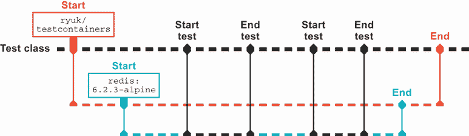
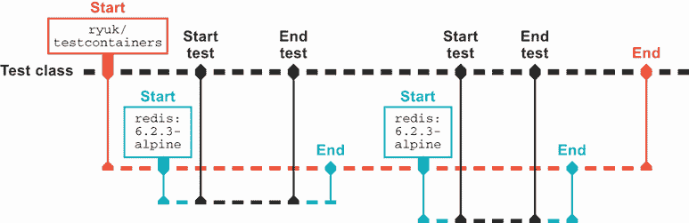

# 14 超越 JUnit 的测试

本章涵盖了

+   使用 Testcontainers 进行集成测试

+   使用 Spek 和 Kotlin 进行规范式测试

+   使用 Clojure 进行基于属性的测试

在上一章中，我们研究了指导我们测试的一般原则。现在我们将更深入地探讨针对不同情况的具体方法来改进我们的测试。无论我们的目标是更干净地测试依赖项、在测试代码中更好的沟通，还是甚至发现我们没有考虑到的边缘情况，JVM 生态系统提供了许多工具来帮助我们，我们只突出其中的一些。让我们从那个始终存在的斗争开始：在编写集成测试时如何有效地处理外部依赖项。

## 14.1 使用 Testcontainers 进行集成测试

当我们从隔离的单元测试向上移动金字塔时，我们会遇到各种障碍。要针对真实数据库进行集成测试，我们需要一个可用的真实数据库！从现实测试中获得好处意味着设置复杂性的巨大增加。这些外部系统的状态性也增加了我们的测试失败的可能性，不是因为我们的代码有问题，而是因为测试之间意外保留的状态。

在过去的几年里，这已经以许多方式解决，从内存数据库到在事务中完全运行测试并自行清理的框架。但这些解决方案通常带来了自己的边缘情况和困难。

如第十二章所述的容器化技术，为解决该问题提供了一种有趣的新方法。因为容器是短暂的，非常适合为特定的测试运行启动。因为它们封装了我们想要与之交互的真实数据库和其他服务，所以避免了内存数据库容易出现的细微不匹配的替代品。

### 14.1.1 安装 testcontainers

在我们的测试中利用容器的最简单方法之一是通过`testcontainers`库（见[`www.testcontainers.org/`](https://www.testcontainers.org/))）。这为我们提供了从测试代码中直接控制容器的 API，以及广泛支持的模块，用于常见的依赖项。核心功能是通过 Maven 中的`org.testcontainers.testcontainers` JAR 提供：

```
<dependency>
  <groupId>org.testcontainers</groupId>
  <artifactId>testcontainers</artifactId>
  <version>1.15.3</version>
  <scope>test</scope>
</dependency>
```

或者 Gradle:

```
testImplementation "org.testcontainers:testcontainers:1.15.3"
```

### 14.1.2 Redis 示例

如果你还记得，我们留下了我们的剧院应用程序从 HTTP 服务下载价格。我们希望为这些值引入一个缓存。尽管适当的缓存是一个完整的主题，但想象一下，我们决定将缓存外部化，而不是仅仅将值放在内存中。这种数据存储的典型例子是 Redis ([`redis.io/`](https://redis.io/))。Redis 提供了快速访问以获取、设置和删除键值对，以及其他更复杂的数据结构。

我们已经为从 HTTP 服务中查找数据而引入的`Price`接口，如下所示，使我们能够将缓存作为单独的关注点添加：

```
package com.wellgrounded;

import redis.clients.jedis.Jedis;

import java.math.BigDecimal;

public class CachedPrice implements Price {
    private final Price priceLookup;
    private final Jedis cacheClient;

    private static final String priceKey = "price";       ❶

    CachedPrice(Price priceLookup, Jedis cacheClient) {   ❷
        this.priceLookup = priceLookup;
        this.cacheClient = cacheClient;
    }

    @Override
    public BigDecimal getInitialPrice() {
        String cachedPrice = cacheClient.get(priceKey);   ❸
        if (cachedPrice != null) {
            return new BigDecimal(cachedPrice);
        }

        BigDecimal price =
            priceLookup.getInitialPrice();                ❹
        cacheClient.set(priceKey,
                        price.toPlainString());           ❺
        return price;
    }
}
```

❶ 我们将在 Redis 中缓存价格的关键字名称

❷ 我们使用 Jedis ([`github.com/redis/jedis`](https://github.com/redis/jedis))库来访问 Redis。

❸ 检查缓存中是否已有这个价格

❹ 如果我们没有价格，则使用提供的查找

❺ 缓存我们刚刚检索到的值

在这一点上，值得停下来考虑我们想要测试系统的哪个方面。`CachedPrice`类的主要点是 Redis 与我们的底层价格查找之间的交互。我们如何与 Redis 交互是关键，Testcontainers 允许我们按照以下方式对实际事物进行测试：

```
package com.wellgrounded;

import org.junit.jupiter.api.Test;
import org.testcontainers.containers.GenericContainer;
import org.testcontainers.junit.jupiter.*;
import org.testcontainers.utility.DockerImageName;
import redis.clients.jedis.*;

import java.math.BigDecimal;

import static org.junit.jupiter.api.Assertions.assertEquals;

@Testcontainers
public class CachedPriceTest {
    private static final DockerImageName imageName =
            DockerImageName.parse("redis:6.2.3-alpine");

    @Container
    public static GenericContainer redis = new GenericContainer(imageName)
            .withExposedPorts(6379);

    // Tests to follow...
}
```

在测试的这个开始部分，我们看到与 Testcontainers 连接的最基本形式。我们将`@Testcontainers`注解应用于整个测试类，让库知道它应该在测试执行期间监视我们所需的容器。标记为`@Container`的字段请求启动特定的容器镜像`"redis:6.2.3-alpine"`，使用标准的 Redis 端口 6379。

当这个测试类执行时，如图 14.1 所示，Testcontainers 会启动我们请求的容器。Testcontainers 将等待默认的超时时间（60 秒），直到第一个映射端口可用，这样我们就可以确信容器已经准备好通信。`redis`字段然后允许我们获取主机名和端口等信息，以便在测试的后续部分使用。



图 14.1 测试容器执行

当我们的容器化 Redis 运行时，我们可以开始实际的测试。因为关键点是 Redis 与查找之间的交互——而不是底层价格查找的实际实现——我们可以重用我们之前的`StubPrice`，它总是返回 10 以简化测试，如下所示：

```
@Test
    public void cached() {
        var jedis = getJedisConnection();
        jedis.set("price", "20");                                          ❶

        CachedPrice price =
            new CachedPrice(new StubPrice(), jedis);                       ❷
        BigDecimal result = price.getInitialPrice();

        assertEquals(new BigDecimal("20"), result);                        ❸
    }

    @Test
    public void noCache() {
        var jedis = getJedisConnection();
        jedis.del("price");                                                ❹

        CachedPrice price = new CachedPrice(new StubPrice(), jedis);
        BigDecimal result = price.getInitialPrice();

        assertEquals(new BigDecimal("10"), result);
    }

    private Jedis getJedisConnection() {                                   ❺
        HostAndPort hostAndPort = new HostAndPort(
                                        redis.getHost(),
                                        redis.getFirstMappedPort());
        return new Jedis(hostAndPort);
    }
```

❶ 在 Redis 中设置一个与我们的 stubbed price 不同的价格

❷ 将 StubPrice 作为我们的查找传递，它将返回 10 而不是 20

❸ 断言我们收到了缓存的值

❹ 使用 del 调用删除 Redis 中之前缓存的任何值

❺ 设置我们的 Jedis 实例的辅助方法。

重要的是要注意`getJedisConnection`方法如何使用 Testcontainers 的配置来连接到 Redis。尽管你可能观察到`redis.getHost()`是一个常见的值，例如`localhost`，但这并不一定在每种环境中都保证。最好向 Testcontainers 请求这样的值，并保护自己免受未来这些值意外变化的影响。

虽然在这里自动启动容器非常方便，但了解如何更直接地控制它是有价值的。这尤其适用于你的容器需要时间来启动的情况，正如我们将在后续示例中看到的，例如需要模式的关系数据库。

`@Container` 注解识别它是在静态字段上应用还是在实例字段上应用，如图 14.2 所示。当应用于静态字段时，容器将在测试类执行期间启动一次。如果你将字段留在实例级别，那么每个单独的测试将启动和停止容器。



图 14.2 字段和 `@Container`

这指向了管理我们的容器生命周期的另一种潜在方法：如果我们只想为整个测试套件运行一次容器怎么办？为了实现这一点，我们必须放弃 `@Container` 注解，并直接使用 `GenericContainer` 对象本身公开的 API，如下所示：

```
    private static final DockerImageName imageName =
            DockerImageName.parse("redis:6.2.3-alpine");

    public static GenericContainer redis = new GenericContainer(imageName)
            .withExposedPorts(6379);

    @BeforeAll
    public void setUp() {
        redis.start();        ❶
    }
```

❶ 在实例上安全地多次调用 `start` —— 它将为每个对象只开始一次容器。

我们不需要提供 `tearDown` 来显式停止容器，因为 `testcontainers` 库会自动为我们处理。

尽管前面的例子为每个测试调用 `start`，但 `redis` 对象可以移动到一个位置，在那里它可以安全地在多个测试类之间共享。

### 14.1.3 收集容器日志

如果你通过命令行或在你的集成开发环境中运行这些测试，你可能会注意到默认情况下容器没有输出。对于我们的简单 Redis 案例，这并不是问题，但对于更复杂的设置或调试，你可能希望有更多的容器可见性。为了帮助这里，Testcontainers 允许访问它启动的容器的 `STDOUT` 和 `STDERR`。

这种支持基于 JDK 的 `Consumer<>` 接口，库中包含几个实现。你可以连接到标准日志提供者，或者，如我们将要展示的，直接获取原始日志。

你可能会觉得将容器日志输出到主输出不方便，但当你确实需要它们时，进行自定义操作也很痛苦。一个解决方案是添加支持，始终将它们捕获到单独的位置，例如构建输出中的一个文件，如下所示：

```
    @Container                                                ❶
    public static GenericContainer redis =
        new GenericContainer(imageName)
            .withExposedPorts(6379);

    public static ToStringConsumer consumer =                 ❷
                                    new ToStringConsumer();

    @BeforeAll
    public static void setUp() {
        redis.followOutput(consumer,
                           OutputType.STDOUT,
                           OutputType.STDERR);                ❸
    }

    @AfterAll
    public static void tearDown() throws IOException {
        Path log = Path.of("./build/tc.log");                 ❹
        byte[] bytes = consumer.toUtf8String().getBytes();
        Files.write(log, bytes,
                    StandardOpenOption.CREATE);               ❺
    }
```

❶ 我们再次使用 @Container 注解来启动，因为它非常简单。

❷ 我们的消费者实例将在测试运行过程中收集日志。

❸ 将消费者附加到我们的容器，请求 STDOUT 和 STDERR

❹ 写入方便的位置

❺ 使用 java.nio.Files 轻松写入文件内容

### 14.1.4 Postgres 的示例

由于 Redis 没有依赖关系，通常存储的数据是临时的，以及容器上的快速启动时间，它是一个容易的例子。但关于传统集成测试中的痛点：关系型数据库怎么办？我们放入关系型存储的数据通常是我们的应用程序真正功能的最关键部分，但测试它充满了陈旧数据、尴尬的模拟和假阳性。

Testcontainers 支持广泛的不同的数据存储。这些被包装在单独的模块中，必须将其引入。我们将使用 Postgres 进行演示，但在 Testcontainers 网站 ([`www.testcontainers.org/modules/databases/`](https://www.testcontainers.org/modules/databases/)) 上，您将找到其他选项的长列表。

我们将 Postgres 模块作为测试依赖项以及主要的 Postgres 驱动程序一起包含，以便能够在 Maven 中连接到我们的新数据库：

```
<dependency>
  <groupId>org.postgresql</groupId>
  <artifactId>postgresql</artifactId>
  <version>42.2.1</version>
</dependency>
<dependency>
  <groupId>org.testcontainers</groupId>
  <artifactId>postgresql</artifactId>
  <version>1.15.3</version>
  <scope>test</scope>
</dependency>
```

或者使用 Gradle：

```
  implementation("org.postgresql:postgresql:42.2.1")
  testImplementation("org.testcontainers:postgresql:1.15.3")
```

重要的是，这个版本需要与您使用的基 `org.testcontainers:testcontainers` 库相匹配。

一个特定的类封装了我们访问 Postgres 容器的操作。它提供了配置信息，如数据库名称和凭证的帮助器，如下所示：

```
public static DockerImageName imageName =
            DockerImageName.parse("postgres:9.6.12"));

    @Container
    public static PostgreSQLContainer postgres =
        new PostgreSQLContainer<>(imageName)
            .withDatabaseName("theater_db")
            .withUsername("theater")
            .withPassword("password");
```

这里适用所有相同的生命周期管理考虑因素，额外的问题是关系数据库在使用之前需要应用模式。许多常见的数据库迁移项目都可以从代码中运行，但我们将仅使用 JDBC 直接演示，以表明没有发生任何魔法。

首先，我们需要连接到我们的容器实例。使用 JDBC 类，我们可以使用来自我们的 `postgres` Testcontainer 对象的参数来设置它，如下所示：

```
    private static Connection getConnection() throws SQLException {
        String url = String.format(
                "jdbc:postgresql://%s:%s/%s",
                postgres.getHost(),
                postgres.getFirstMappedPort(),
                postgres.getDatabaseName());

        return DriverManager.getConnection(url,
                                            postgres.getUsername(),
                                            postgres.getPassword());
    }
```

注意，Testcontainers 包含一个功能，允许您修改您的连接字符串，并且它会自动启动数据库的容器。虽然很方便，但演示起来可能不太直接。然而，当将 Testcontainers 集成到现有的测试套件中时，这可能特别有价值。

使用我们的连接，我们希望在运行任何测试之前确保我们的模式已经就绪。在一个测试类的作用域内，我们可以通过以下方式使用 `@BeforeAll` 来完成：

```
    @BeforeAll
    public static void setup() throws SQLException, IOException {
        var path = Path.of("src/main/resources/init.sql");
        var sql = Files.readString(path);                    ❶
        try (Connection conn = getConnection()) {
            conn.createStatement().execute(sql);             ❷
        }
    }
```

❶ 对于我们的示例，一个 SQL 文件包含我们的模式定义。

❷ 应用 SQL

在模式就绪后，我们的测试现在可以针对这个完整的、空的 Postgres 数据库运行，如下所示：

```
    @Test
    public void emptyDatabase() throws SQLException {
        try (Connection conn = getConnection()) {
            Statement st = conn.createStatement();
            ResultSet result = st.executeQuery("SELECT * FROM prices");
            assertEquals(0, result.getFetchSize());
        }
    }
```

如果您有其他抽象，如 DAO（数据访问对象）、仓库或其他从数据库读取的方式，它们都应该与容器的连接正常工作。

### 14.1.5 使用 Selenium 进行端到端测试的示例

使用容器中的外部资源进行集成测试是一个自然的选择。在端到端测试中，也适用类似的技术。尽管这取决于您的具体系统，但通常端到端测试会想要测试浏览器，以确保网络应用程序按预期运行。

从历史上看，从代码中驱动网络浏览器是一个有点棘手的问题。这些技术仍然很脆弱且速度慢，但 Testcontainers 通过让您在容器内启动浏览器并远程控制它来消除安装和配置的痛苦。

就像我们的 Postgres 示例一样，我们需要引入依赖项。在这种情况下，有一个用于 Testcontainers 支持的模块，以及用于在 Maven 中远程控制浏览器实例所需的库：

```
<dependency>
  <groupId>org.testcontainers</groupId>
  <artifactId>selenium</artifactId>
  <version>1.15.3</version>
  <scope>test</scope>
</dependency>
<dependency>
  <groupId>org.seleniumhq.selenium</groupId>
  <artifactId>selenium-remote-driver</artifactId>
  <version>3.141.59</version>
  <scope>test</scope>
</dependency>
<dependency>
  <groupId>org.seleniumhq.selenium</groupId>
  <artifactId>selenium-chrome-driver</artifactId>
  <version>3.141.59</version>
  <scope>test</scope>
</dependency>
```

或者使用 Gradle：

```
  testImplementation("org.testcontainers:selenium:1.15.3")
  testImplementation(
    "org.seleniumhq.selenium:selenium-remote-driver:3.141.59")
  testImplementation(                                                ❶
    "org.seleniumhq.selenium:selenium-chrome-driver:3.141.59")
```

❶ 类似名称的包中也存在对其他网络浏览器的支持。

特定的类配置浏览器实例。这里我们将传递 `ChromeOptions` 来表明我们正在启动那个特定的浏览器：

```
    @Container
    public static BrowserWebDriverContainer<?> chrome =
        new BrowserWebDriverContainer<>()
            .withCapabilities(new ChromeOptions());
```

使用这个实例，我们现在可以编写测试，访问网页并检查结果，如下所示：

```
    @Test
    public void checkTheSiteOut() {
        var url = "https://github.com/well-grounded-java";
        RemoteWebDriver driver = chrome.getWebDriver();
        driver.get(url);                                        ❶

        WebElement title =
                    driver.findElementByTagName("h1");          ❷
        assertEquals("well-grounded-java", title.getText());
    }
```

❶ 导航到 well-grounded-java 的 GitHub 组织

❷ 页面加载后，检查第一个 <h1> 内容

这个简单的例子已经显示了端到端测试容易出现的脆弱性。如果 GitHub 重新设计并决定在页面上添加另一个 `<h1>`，或者他们以某种微妙的方式更改标题文本，会怎样？如果你正在测试自己的应用程序，这可能不是一个大问题，但与展示的紧密耦合仍然是一个问题。

在容器内运行时，如果事情不是我们预期的，理解原因可能会很困难。幸运的是，我们可以通过几种方式获得视觉反馈。

首先，我们可以像这样在特定时间点截图：

```
    @Test
    public void checkTheSiteOut() {
        RemoteWebDriver driver = chrome.getWebDriver();
        driver.get("https://github.com/well-grounded-java");

        File screen = driver.getScreenshotAs(OutputType.FILE);
    }
```

返回的文件是临时的，将在测试结束时被删除，但你可以在创建后将其复制到代码的其他地方。

只看到某个时间点的情况很常见。你还可以请求自动记录会议的视频，如下所示：

```
    private static final File tmpDirectory = new File("build");

    @Container
    public static BrowserWebDriverContainer<?> chrome =
        new BrowserWebDriverContainer<>()
            .withCapabilities(new ChromeOptions())
            .withRecordingMode(RECORD_ALL,
                                tmpDirectory,
                                VncRecordingFormat.MP4);
```

就像我们对容器日志所做的那样，这将使我们的构建输出在测试运行时进行记录。我们需要调试的一切都准备好了，如果出现麻烦，一切都在那里。

这只是触及了 Testcontainers 可以让你完成的表面。现在让我们看看如何放弃 JUnit，以不同的、可能更易读的形式编写我们的测试。

## 14.2 使用 Spek 和 Kotlin 进行规范式测试

JUnit 使用方法、类和注解的方式对 Java 开发者来说非常自然。但无论我们是否意识到，它都塑造了我们表达和分组测试的方式。尽管不是必需的，我们通常最终会得到一个测试类映射到我们的生产类，以及为每个实现方法松散的测试方法集群。

另一个想法是所谓的编写 *规范*。这源于 RSpec 和 Cucumber 等框架，而不是关注我们的代码是如何被塑造的，它旨在在更高层次上支持指定系统的工作方式，更符合人类讨论需求的方式。

这种测试的一个例子可以通过 Kotlin 中的 Spek 框架获得（见 [`www.spekframework.org/`](https://www.spekframework.org/)）。正如我们将看到的，Kotlin 的许多内置功能允许我们在规范中实现非常不同的组织和感觉。

安装 Spek 遵循依赖项的典型过程。Spek 完全关注我们如何构建规范，并依赖于生态系统中的功能，如断言和测试运行。为了简单起见，我们将使用 JUnit 5 中的断言和测试运行器进行演示，但如果你有其他你更喜欢的库，则不需要使用这些。

在 Maven 中，只需通知 11.2.6 节中的`maven-surefire-plugin`我们的规范文件，我们将通过在文件名中包含`Spek`来标记这些文件，如下所示。我们还需要 11.2.5 节中描述的 Kotlin 支持（此处未重复，以节省篇幅）：

```
  <build>
    <plugins>
      <plugin>
        <artifactId>maven-surefire-plugin</artifactId>
        <version>2.22.2</version>
        <configuration>
          <includes>
            <include>**/*Spek*.*</include>            ❶
          </includes>
        </configuration>
      </plugin>
    </plugins>
  </build>

  <dependencies>
    <dependency>
      <groupId>org.junit.jupiter</groupId>
      <artifactId>junit-jupiter-api</artifactId>      ❷
      <version>5.7.1</version>
      <scope>test</scope>
    </dependency>
    <dependency>
      <groupId>org.spekframework.spek2</groupId>
      <artifactId>spek-dsl-jvm</artifactId>
      <version>2.0.15</version>
      <scope>test</scope>
    </dependency>
    <dependency>
      <groupId>org.spekframework.spek2</groupId>
      <artifactId>spek-runner-junit5</artifactId>     ❸
      <version>2.0.15</version>
      <scope>test</scope>
    </dependency>
  </dependencies>
```

❶ 由于我们的自定义文件约定，我们必须告诉 Maven 要运行什么。

❷ 使用 JUnit 的断言 API

❸ 使用 Spek 与 JUnit 测试运行器的集成

在 Gradle 中，我们连接到标准的`test`任务，并通知 JUnit 平台 Spek 的引擎，如下面的代码片段所示。你可能发现命令行测试将看到我们的规范，而无需引擎行，但其他系统，如我们的 IDE，可能错过它们：

```
dependencies {
  testImplementation(                                                      ❶
      "org.junit.jupiter:junit-jupiter-api:5.7.1")

  testImplementation("org.spekframework.spek2:spek-dsl-jvm:2.0.15")
  testRuntimeOnly(                                                         ❷
      "org.spekframework.spek2:spek-runner-junit5:2.0.15")
}

tasks.named<Test>("test") {                                                ❸
  useJUnitPlatform() {
    includeEngines("spek2")                                                ❹
  }
}
```

❶ 使用 JUnit 的断言 API

❷ 使用 Spek 与 JUnit 测试运行器的集成

❸ 查找测试任务，通知它是 Test 类型，因此我们可以访问 useJUnitPlatform 和后续方法

❹ 通知 JUnit 我们的引擎以实现更好的 IDE 集成

现在，我们可以着手编写我们的第一个规范。为了检查这一点，我们将查看针对`InMemoryCachedPrice`类所做的先前测试，并看看 Spek 如何改变我们的测试结构和流程，如下所示：

```
import org.spekframework.spek2.Spek
import org.junit.jupiter.api.Assertions.assertEquals
import java.math.BigDecimal

object InMemoryCachedPriceSpek : Spek({
    group("empty cache") {
        test("gets default value") {
            val stubbedPrice = StubPrice()
            val cachedPrice = InMemoryCachedPrice(stubbedPrice)

            assertEquals(BigDecimal(10), cachedPrice.initialPrice)
        }

        test("gets same value when called again") {
            val stubbedPrice = StubPrice()
            val cachedPrice = InMemoryCachedPrice(stubbedPrice)

            val first = cachedPrice.initialPrice
            val second = cachedPrice.initialPrice
            assertTrue(first === second)               ❶
        }
    }
})
```

❶ `===`是 Kotlin 的引用相等运算符，因此这检查在调用之间我们是否得到完全相同的对象，而不仅仅是相同的值。

我们的第一项规范详细说明了空缓存的行为。我们可以看到许多 Kotlin 特性正在发挥作用。首先，我们的规范被声明为一个单例`object`而不是一个类。这有助于阐明 JUnit 中偶尔发生的测试生命周期问题，这取决于测试运行器是按类还是按单个测试方法构造测试的单个实例。

主要规范在 lambda 表达式中声明，作为`Spek`类的参数传递。在这个 lambda 中，有两个重要的函数可用：`group`和`test`。每个函数都提供了一个完整的`String`描述。不需要驼峰命名法、下划线或其他技巧来使描述可读。`group`用于将各种相关的`test`调用组合在一起。如果需要，`group`构造函数也可以嵌套。

如果这种重新格式化是规范式测试带来的唯一好处，那么它就不会很有吸引力。然而，分组不仅仅是命名，因为我们可以声明*固定装置*，以便在多个测试中共享设置，如下所示：

```
object InMemoryCachedPriceSpek : Spek({
    group("empty cache") {
        lateinit var stubbedPrice : Price
        lateinit var cachedPrice : InMemoryCachedPrice

        beforeEachTest {
          stubbedPrice = StubPrice()
          cachedPrice = InMemoryCachedPrice(stubbedPrice)
        }

        test("gets default value") {
            assertEquals(BigDecimal(10), cachedPrice.initialPrice)
        }

        test("gets same value when called again") {
            val first = cachedPrice.initialPrice
            val second = cachedPrice.initialPrice
            assertTrue(first === second)
        }
    }
})
```

在我们的“空缓存”组中，我们声明了两个 fixtures：一个 `stubbedPrice` 用于设置缓存，以及我们将要测试的 `cachedPrice` 实例。任何属于这个 `group` 的 `test` 调用都会得到这些 fixtures 的相同视图。

推荐的 fixtures 模式是使用 `lateinit` 并在 `beforeEachTest` 中初始化它们。这种延迟初始化的需要实际上反映了 Spek 以两个阶段运行我们的规范：发现和执行。

在发现阶段，我们的规范的最高级 lambda 被运行。`group` lambda 被急切地评估，但 `test` 调用尚未执行；相反，它们被注意到以供稍后执行。在评估完所有规范的组之后，`test` lambda 被执行。这种分离，如以下所示，允许在每次单个 `test` 运行之前更紧密地控制每个 `group` 的上下文：

```
object InMemoryCachedPriceSpek : Spek({
    group("empty cache") {                                 ❶
        lateinit var stubPrice : Price                     ❶
        lateinit var cachedPrice : InMemoryCachedPrice     ❶

        beforeEachTest {                                   ❷
          stubPrice = StubPrice()                          ❷
          cachedPrice = InMemoryCachedPrice(stubPrice)     ❷
        }                                                  ❷
                                                           ❷
        test("gets default value") {                       ❷
            assertEquals(BigDecimal(10),                   ❷
                          cachedPrice.initialPrice)        ❷
        }                                                  ❷
                                                           ❷
        test("gets same value when called again") {        ❷
            val first = cachedPrice.initialPrice           ❷
            val second = cachedPrice.initialPrice          ❷
            assertTrue(first === second)                   ❷
        }
    }
})
```

❶ 在发现阶段运行

❷ 在执行阶段运行

使用 `lateinit` 有点笨拙，所以 Spek 使用 Kotlin 的 *委托属性* 来封装它。每个 fixture 都可以跟一个 `by memoized` 调用和一个 lambda 来提供值。

注意 *memoized*（不是 memorized！）是一个表示计算一次并缓存以供以后使用的值的术语。

不要将这些用于你正在测试的动作的结果——那些应该在 `test` lambda 本身内完成，如下所示：

```
object InMemoryCachedPriceSpek : Spek({
    val stubbedPrice : Price by memoized { StubPrice() }

    group("empty cache") {
        val cachedPrice by memoized { InMemoryCachedPrice(stubbedPrice) }

        test("gets default value") {
            assertEquals(BigDecimal(10), cachedPrice.initialPrice)
        }

        test("gets same value when called again") {
            val first = cachedPrice.initialPrice
            val second = cachedPrice.initialPrice
            assertTrue(first === second)
        }
    }
})
```

通过直接执行我们的 Kotlin 代码来发生测试发现阶段，这允许比 JUnit 可用的参数化更简单。我们不需要额外的注解和基于反射的查找，我们只需循环并重复调用 `test`，如下所示：

```
object InMemoryCachedPriceSpek : Spek({
    group("parameterized example") {
        listOf(1, 2, 3).forEach {
            test("testing $it") {           ❶
                assertNotEquals(it, 0)
            }
        }
    }
})
```

❶ 在循环的每次迭代中使用它为我们提供了测试 1、测试 2 和测试 3。

对于可能在其他生态系统（如 Ruby 中的 RSpec 或 JavaScript 中的 Jasmine）中遇到过规范式测试的人来说，你可以用 `describe` 和 `it` 替换 `group` 和 `test` 方法，以获得更自然的叙述流程，如下所示：

```
object InMemoryCachedPriceSpek : Spek({
    val stubbedPrice : Price by memoized { StubPrice() }

    describe("empty cache") {
        val cachedPrice by memoized { InMemoryCachedPrice(stubbedPrice) }

        it("gets default value") {
            assertEquals(BigDecimal(10), cachedPrice.initialPrice)
        }

        it("gets same value when called again") {
            val first = cachedPrice.initialPrice
            val second = cachedPrice.initialPrice
            assertEquals(true, first === second)
        }
    }
})
```

编写规范的另一常见格式是 *Gherkin 语法* ([`cucumber.io/docs/gherkin/reference/`](https://cucumber.io/docs/gherkin/reference/))，由 Cucumber 测试工具普及。这种语法通过一系列的给定-当-然后语句来声明我们的规范：*given* 这个设置，*when* 这个动作发生，*then* 我们看到这些后果。强制这种结构通常会使规范在自然语言中更易于阅读，而不仅仅是代码。

以 Gherkin 风格重述先前的测试可能看起来像这样：*Given* 一个空缓存，*when* 计算价格，*then* 我们查找默认值。以下是它如何转换为 Spek 的 Gherkin 支持：

```
object InMemoryCachedPriceSpekGherkin : Spek({
    Feature("caching") {
        val stubbedPrice by memoized { StubPrice() }

        lateinit var cachedPrice : Price
        lateinit var result : BigDecimal

        Scenario("empty cache") {
            Given("an empty cache") {
                cachedPrice = InMemoryCachedPrice(stubbedPrice)
            }

            When("calculating") {
                result = cachedPrice.initialPrice
            }

            Then("it looks up the default value") {
                assertEquals(BigDecimal(10), result)
            }
        }
    }
})
```

你会注意到这也带来了来自 Cucumber 的额外分组，我们在应用给定-当-然后组织之前，通过将规范分为 `Feature` 和 `Scenario` 来实现。

规范为我们提供了一种不同的方式来组织我们的测试代码，以便更好地与后来的读者沟通。但它们仍然要求我们手动编写所有案例。Clojure 提供了一些不同的可能性来探索我们如何选择测试数据。

## 14.3 使用 Clojure 进行基于属性的测试

与 Java 和 Kotlin 不同，Clojure 的标准库中自带了一个测试框架`clojure.test`。虽然我们不会深入探讨这个库，但在访问 Clojure 测试生态系统的其他更复杂部分之前，让我们先熟悉一下基础知识。

### 14.3.1 clojure.test

我们将通过 Clojure REPL 来练习我们的测试，就像我们在第十章中做的那样。如果你跳过了那一章或者已经有一段时间了，现在是复习 Clojure 基础知识的好时机，如果这些测试难以理解的话。

虽然它直接与 Clojure 一起发货，但`clojure.test`并没有自动捆绑到我们的代码中。我们需要通过`require`请求这个库。在我们的 REPL 中输入以下内容将使`clojure.test`中的所有函数都可用，并带有我们通过`:as`声明的`test`前缀：

```
user=> (require '[clojure.test :as test])
nil
user=> (test/is (= 1 1))
true
```

或者，我们可以通过`:refer`选择特定的函数，以便不带前缀使用，如下所示：

```
user=> (require '[clojure.test :refer [is]])
nil
user=> (is (= 1 1))
true
```

`is`函数代表`clojure.test`中断言的基础。当断言通过时，我们看到函数返回`true`。那么当它失败时呢？

```
user=> (is (= 1 2))

FAIL in () (NO_SOURCE_FILE:1)
expected: (= 1 2)
  actual: (not (= 1 2))
false
```

任何谓词都可以与`is`一起使用。例如，以下是确认一个函数将抛出我们期望的异常的方法：

```
user=> (defn oops [] (throw (RuntimeException. "Oops")))   ❶
#'user/oops

user=> (is (thrown? RuntimeException (oops)))
#error {                                                   ❷
 :cause "Oops"
 :via
 [{:type java.lang.RuntimeException
   :message "Oops"
   :at [user$oops invokeStatic "NO_SOURCE_FILE" 1]}]
   ...                                                     ❸
```

❶ 总是抛出`RuntimeException`的函数

❷ 我们收到的是一个#error 值，而不是 FAIL 消息。这表明断言通过了。

❸ 错误信息还包含完整的堆栈跟踪，这里为了节省空间省略了。

使用我们的断言，我们现在已经准备好开始构建测试。为此的主要方法是`deftest`函数，如下所示：

```
user=> (require '[clojure.test :refer [deftest]])
nil
user=> (deftest one-is-one (is (= 1 1)))
#'user/one-is-one
```

定义了我们的测试后，我们现在需要执行它。我们可以通过`run-tests`函数来完成，该函数将在我们的当前命名空间中找到所有定义的测试。对于 REPL，存在一个名为`user`的默认命名空间，它自动存在，并且我们的`deftest`将测试放在那里，如下所示：

```
user=> (require '[clojure.test :refer [run-tests]])
nil
user=> (run-tests)

Testing user

Ran 1 tests containing 1 assertions.
0 failures, 0 errors.
{:test 1, :pass 1, :fail 0, :error 0, :type :summary}
```

显然，在 REPL 中编写和运行测试对学习很有好处，但不适合在项目中长期使用。最终，设置一个测试运行器是值得的，尽管与 Java 世界中的 JUnit 是突出领导者不同，Clojure 中存在一些竞争选项。以下是一些可以考虑的选项：

+   Leiningen ([`leiningen.org/`](https://leiningen.org/)) 是一个流行的 Clojure 构建工具，它包括对测试的支持，类似于 Maven 和 Gradle。

+   Cognitect Labs 的`test-runner` ([`github.com/cognitect-labs/test-runner`](https://github.com/cognitect-labs/test-runner)) 是一个仅基于 Clojure 原生依赖支持的简单测试运行器。

+   Kaocha ([`github.com/lambdaisland/kaocha`](https://github.com/lambdaisland/kaocha)) 是一个功能齐全的测试运行器，它侧重于模块化设计测试过程。

话虽如此，我们将在我们的 REPL 中继续操作，现在来看看 Clojure 带来的一项有趣的能力：数据规范。

### 14.3.2 clojure.spec

尽管 Clojure 与 JVM 的集成意味着你可以自然地处理类和对象，但函数式编程并不像面向对象编程中那样紧密地将行为与数据耦合。常见的情况是函数操作由基本原始数据结构组成的数据结构，特别是当映射履行了我们与面向对象编程中的类相关联的数据携带行为时。

这使得拥有更好的设施来测试内置数据结构的形状和内容变得很有吸引力。这由标准库中的 `clojure.spec` 提供。与 `clojure.test` 一样，我们需要导入库才能访问它，如下所示：

```
user=> (require '[clojure.spec.alpha :as spec])
nil
```

注意：尽管 `clojure.spec` 使用了“specification”这个术语，但这与我们在 Kotlin 中的 Spek 所见到的“specification”是完全不同的用法。`clojure.spec` 定义的是 *数据* 的规范，而不是 *行为* 的规范。

在有了那个库之后，我们可以开始使用 `valid?` 函数对不同值做出声明。这个函数执行我们传递给它的谓词函数，并返回一个布尔值，如下所示：

```
user=> (spec/valid? even? 10)
true
user=> (spec/valid? even? 13)
false
```

`conform` 函数为我们提供了下一级别的检查，如下一个代码示例所示。如果值通过了谓词，我们会收到该值。否则，返回的是一个关键字 `:clojure.spec.alpha/invalid`：

```
user=> (spec/conform even? 10)
10
user=> (spec/conform even? 13)
:clojure.spec.alpha/invalid
```

我们可以使用 `and` 函数将不同的检查组合在一起。这可以通过直接编写我们自己的谓词函数来实现，但使用 `clojure.spec` 中的版本，如下一个代码片段所示，意味着库理解我们创建的组合。我们很快就会看到这如何给我们带来更多信息：

```
user=> (spec/conform (spec/and int? even?) 10)
10
user=> (spec/conform (spec/and int? even?) 13)
:clojure.spec.alpha/invalid
user=> (spec/conform (spec/and int? even?) "not int")
:clojure.spec.alpha/invalid
```

在看到 `and` 之后，可能会有所惊讶地发现存在一个 `or` 函数。但如果尝试像使用 `and` 一样使用 `or`，情况就会变得复杂，如下所示：

```
user=> (spec/conform (spec/or int? string?) 10)
Unexpected error (AssertionError) macroexpanding spec/or at (REPL:1:15).
Assert failed: spec/or expects k1 p1 k2 p2..., where ks are keywords
(c/and (even? (count key-pred-forms)) (every? keyword? keys))
```

这个错误信息告诉我们 `or` 期望在其传递给它的谓词之间包含关键字。这可能看起来像是一个简单的布尔函数的奇怪要求。然而，当我们更仔细地查看给定 `or` 条件时 `conform` 的结果，原因就会变得 clearer：

```
user=> (spec/conform (spec/or :a-number int? :a-string string?) "hello")
[:a-string "hello"]
user=> (spec/conform (spec/or :a-number int? :a-string string?) 10)
[:a-number 10]
user=> (spec/conform (spec/or :a-number int? :a-string string?) nil)
:clojure.spec.alpha/invalid
```

库不仅告诉我们值符合我们的规范，而且还告诉我们 `or` 条件中的哪个分支满足了规范。我们的规范不仅提供了简单的 yes/no 有效性，我们还找到了值通过的原因。

重复我们的规范变得越来越乏味，在实际应用中，这种重复显然是代码的坏味道。`clojure.spec` 允许我们使用命名空间关键字注册规范。然后我们只需像这样调用 `conform`：

```
user=> (spec/def :well/even (spec/and int? even?))
:well/even
user=> (spec/conform :well/even 10)
10
user=> (spec/conform :well/even 11)
:clojure.spec.alpha/invalid
```

Clojure REPL 内置了一个方便的 `doc` 函数，它与我们的规范很好地集成。当我们传递一个已注册的关键字时，我们得到一个格式整洁的规范版本，如下所示：

```
user=> (doc :well/even)
 -------------------------
 :well/even
 Spec
   (and int? even?)
```

虽然`conform`提供了关于成功匹配如何发生的反馈，但`:clojure.spec.alpha/invalid`关键字对失败的解释相当晦涩。`explain`函数依赖于我们的规范已经拥有的更深入的知识，告诉我们为什么给定的值失败，如下所示：

```
user=> (spec/explain :well/even 10)
Success!
nil
user=> (spec/explain :well/even 11)
11 - failed: even? spec: :well/even
nil
user=> (spec/explain :well/even "")
"" - failed: int? spec: :well/even
nil
```

现在我们已经为值定义了可重用的规范，我们可以在单元测试中直接应用它们，如下所示：

```
(deftest its-even
    (is (spec/valid? :well/even 4)))

(deftest its-not-even
    (is (not (spec/valid? :well/even 5))))
```

到目前为止，我们的规范主要集中在检查单个值。当我们与映射一起工作时，还有一个额外的问题：提供的数据形状是否符合我们的预期？我们用`keys`函数来验证这一点。

让我们设想我们的剧院票务系统的一部分是用 Clojure 编写的。我们希望确认我们传递的任何票都有一个`id`和`amount`。可选地，我们允许`notes`。我们可以像这样定义一个规范：

```
user=> (spec/def :well/ticket (spec/keys
                                :req [:ticket/id :ticket/amount]
                                :opt [:ticket/notes]))
:well/ticket
```

注意，这里的键都是用`:ticket`命名空间化的。这在 Clojure 的 map 键中被认为是良好的形式，因为它允许我们在票价和特定场所可用的座位数之间保持区分。如果您需要使用非命名空间化的键，各种函数如`req`会通过添加`-un`提供替代版本，例如，`req-un`。

在一个映射上调用`conform`将验证我们已明确指定的键的存在。它还允许在必需键旁边有未指定的键，如下所示：

```
user=> (spec/conform :well/ticket
                      {:ticket/id 1
                      :ticket/amount 100
                      :ticket/notes "Noted"})
#:ticket{:id 1, :amount 100, :notes "Noted"}

user=> (spec/conform :well/ticket
                      {:ticket/id 1
                      :ticket/amount 100
                      :ticket/other-stuff true})
#:ticket{:id 1, :amount 100, :other-stuff true}

user=> (spec/conform :well/ticket {:ticket/id 1})
:clojure.spec.alpha/invalid
```

命名空间化键清楚地显示了它的价值，尤其是在它如何与我们的先前值检查无缝工作。如果一个键名有一个已注册的规范，那么在`conform`时，该值将被验证，如下所示：

```
user=> (spec/def :ticket/amount int?)
:ticket/amount

user=> (spec/conform :well/ticket
                      {:ticket/id 1 :ticket/amount 100})
#:ticket{:id 1, :amount 100]}

user=> (spec/conform :well/ticket {:ticket/id 1 :ticket/amount "100"})
:clojure.spec.alpha/invalid
```

`clojure.spec`为我们提供了丰富的数据验证能力。但 Clojure 对如何与数据交互的关注并不仅限于此。

### 14.3.3 test.check

当我们编写测试时，我们的大部分时间都花在挑选好的数据来测试我们的代码上。无论是构建代表性的对象还是找到验证的边缘值，我们在这个寻找要测试的内容上投入了大量的精力。

基于属性的测试将这种关系颠倒过来。我们不是构建示例来执行，而是定义应该对我们函数成立的*属性*，然后输入随机数据来确保这些属性是真实的。

注意：最近围绕基于属性的测试的热潮归功于 Haskell 库 QuickCheck ([`hackage.haskell.org/package/QuickCheck`](https://hackage.haskell.org/package/QuickCheck))。其他语言也有等效的库，例如 Python 中的 Hypothesis ([`hypothesis.readthedocs.io/en/latest/`](https://hypothesis.readthedocs.io/en/latest/))。在 Clojure 中，这由`test.check`库提供。

这种测试范式与传统单元测试相比是一个重大的变化。在我们迄今为止看到的测试中，你期望 100%的确定性结果。测试运行中的任何波动都是测试编写不佳的迹象，应该被消除。

为什么基于属性的测试不同——不仅允许，而且依赖于随机数据？一方面，尽管输入是随机的，但失败并不表明测试有误——它揭示了我们对系统的理解，即通过我们定义的属性表达，是错误的。实际上，基于属性的测试发现了手动选择的数据可能遗漏的边缘情况。

这也不是完全放弃更传统单元测试的论点。用基于属性的测试补充我们的典型测试是合理的，尤其是在输入数据种类繁多、可能让我们陷入困境的领域。

与`clojure.test`和`clojure.spec`不同，`test.check`是一个独立的包，不在 Clojure 的标准库中。要在我们的 REPL 中使用它，我们必须告诉 Clojure 这个依赖项。最简单的方法是在运行`clj`的同一目录中放置一个名为`deps.edn`的文件。该文件指示 Clojure 从 Maven 仓库下载库，如下所示：

```
{
  :deps { org.clojure/test.check {:mvn/version "1.1.0"}}
}
```

在创建`deps.edn`文件后，您需要重新启动`clj` REPL。您第一次启动 REPL 时应看到消息，表明它正在下载必要的 JAR 文件。

基于属性的测试有两个主要部分：如何定义要检查代码的属性，以及如何生成随机数据来测试这些属性。让我们先从配置数据生成器开始，这可能会激发我们检查属性的想法。

`test.check`在`generators`包中为主创建随机数据提供支持。我们将引入整个包，并将其别名为`gen`，以减少一些输入，如下所示：

```
user=> (require '[clojure.test.check.generators :as gen])
nil
```

两个主要函数作为我们生成随机数据的入口点：`generate`和`sample`。`generate`获取单个值，而`sample`获取一组值。这些函数都需要一个生成器，其中许多是内置的。例如，我们可以通过生成随机的布尔值来模拟抛硬币：

```
user=> (gen/generate gen/boolean)
false

user=> (gen/sample gen/boolean)
(true false true false false false true true false false)

user=> (gen/sample gen/boolean 5)
(true true true true true)
```

`test.check`提供的基本生成器涵盖了 Clojure 中原始类型的大部分需求。以下是一些使用示例。您可以在[`mng.bz/6XoD`](http://mng.bz/6XoD)上查看文档以获取更多详细信息以及一些生成器可能接受的附加可选参数：

```
user=> (gen/sample gen/nat)                                                ❶
(0 1 0 2 3 5 5 7 4 5)

user=> (gen/sample gen/small-integer)                                      ❷
(0 -1 1 1 2 4 0 5 -7 -8)

user=> (gen/sample gen/large-integer)                                      ❸
(-1 0 -1 -3 3 -1 -8 9 26 -249)

user=> (gen/sample (gen/choose 10 20))                                     ❹
(11 20 17 16 11 16 14 19 14 13)

user=> (gen/sample gen/any)                                                ❺
(#{} (true) (-3.0) () (Xs/B 553N -4460N) {} #{-3 W_/R? :? \} () #{} [])

user=> (gen/sample gen/string)                                             ❻
("" "" "" "ØI_" "" "rý" "ƒHODÄ" "fÿí'ß" "ü<Ò29eXÔ" "‚ÅÆk0®<")

user=> (gen/sample gen/string-alphanumeric)                                ❼
("" "" "3" "G" "pB9" "e2" "oRt98" "l8" "T61T75k4" "b8505NXt")

user=> (gen/sample (gen/elements [:a :b :c]))                              ❽
(:b :c :b :a :c :b :a :c :a :b)

user=> (gen/sample (gen/list gen/nat))                                     ❾
(() (1) (1) (0 2 1) (0 3) (3 3) (1) (1 6 5 1 2 4 4) (4 7 3 4 7 0) (3 2))
```

❶ 小的自然（非负）整数

❷ 包括负数在内的小整数

❸ 包括负数在内的较大整数

❹ 从提供的整数范围内选择

❺ 任何 Clojure 值

❻ 任何有效的 Clojure 字符串

❼ 任何字母数字字符串

❽ 从元素列表中选择

❾ 根据提供的生成器创建列表

这些生成器对于一种称为 *fuzzing* 的测试类型非常有用。fuzzing 的实践，在安全领域经常使用，向系统投掷各种数据，特别是无效数据，以查看它在哪里崩溃。通常，我们测试的例子并不够有创意，尤其是当涉及到来自外部世界的输入时。生成器为我们提供了一个简单的方法，用我们不会想到的数据来加强我们的测试。

想象一下，我们的票务应用程序允许开放文本输入备注，但希望尝试提取关键词。如果我们的应用程序面向互联网，我们绝对不希望该函数抛出意外异常。我们可以这样 fuzz 它：

```
user=> (defn validate-input [s]
; imagine implementation here that should never throw
)
#'user/validate-input

user=> (deftest never-throws
         (doall (map (gen/sample gen/string)      ❶
                      validate-input)))

user=> (run-tests)

Testing user

Ran 1 tests containing 0 assertions.
0 failures, 0 errors.
{:test 1, :pass 0, :fail 0, :error 0, :type :summary}
```

❶ `doall` 确保 Clojure 不会因为其返回值未使用而懒加载我们的 map。

Fuzzing 可以是一个有用的第一步，但显然，我们的函数比“不会意外崩溃”有更多有趣的属性。

回到我们的剧院票务系统，所有者现在对一项新功能感兴趣，即人们可以竞标门票。已经从机器学习咨询公司购买了一个复杂的算法，以最大化在给定的一组竞标价格中购买的人数。该算法保证它不会提供超出提供的竞标价格范围的任何价格。

我们还没有收到代码，但当我们收到时，我们想要准备好检查他们的声明。在此之前，我们已经提供了一个占位符实现，如下所示，它给定一个竞标价格列表，将随机选择一个：

```
user=> (defn bid-price [prices] (rand-nth prices))
#'user/bid-price
user=> user=> (bid-price [1 2 3])
1
user=> (bid-price [1 2 3])
3
```

让我们看看我们如何使用 `test.check` 来定义关于我们的竞标函数的属性。除了我们之前拉入的生成器之外，我们还需要在 `clojure.test.check` 和 `clojure.test.check.properties` 中引入函数，如下所示：

```
user=>(require '[clojure.test.check :as tc])
nil

user=>(require '[clojure.test.check.properties :as prop])
nil
```

我们将要检查的第一个属性——对剧院所有者来说最重要的是——是我们永远不会返回一个比有人提供的竞标价更低的竞标价：

```
user=>(def bigger-than-minimum
  (prop/for-all [prices (gen/not-empty (gen/list gen/nat))]
    (<= (apply min prices) (bid-price prices))))
#'user/bigger-than-minimum
```

在这个小片段中有很多内容，所以让我们来分解一下。首先，我们的 `def bigger-than-minimum` 给我们的属性起了一个名字，以便稍后引用。重要的是要记住，这只是在定义属性，还没有实际检查它。

下一条语句声明了 `prop/for-all`，这是我们声明想要检查的属性的方式。它后面跟着一个列表，确定了我们将如何生成数据以及将这些值绑定到什么上。`[prices (gen/not-empty (gen/list gen/nat))]`。`prices` 依次从随后的生成器语句中获取每个生成的值。在这种情况下，我们请求一个非空的自然（非负）整数列表。

最后一条语句最终表达了我们的属性的实际逻辑。`(<= (apply min prices) (bid-price prices))` 找到我们生成的列表中的最小值，对同一列表调用我们的竞标函数，并确保竞标价格不低于最小值。

有了这个，我们现在可以要求`test.check`运行一组生成的值来检查属性，如下所示。`quick-check`函数需要一个迭代次数和一个要检查的属性：

```
user=> (tc/quick-check 100 bigger-than-minimum)
{:result true, :pass? true, :num-tests 100,
 :time-elapsed-ms 13, :seed 1631172881794}
```

我们的属性通过了！另一个请求的条件——我们不提供比任何出价更高的价格——是从我们已编写的内容中轻松扩展出来的，如下所示：

```
user=>(def smaller-than-maximum
  (prop/for-all [prices (gen/not-empty (gen/list gen/nat))]
    (>= (apply max prices) (bid-price prices))))
#'user/smaller-than-maximum

user=>(tc/quick-check 100 smaller-than-maximum)
{:result true, :pass? true, :num-tests 100,
 :time-elapsed-ms 13, :seed 1631173295156}
```

虽然我们的属性通过测试是件好事，但让我们打破它们，看看会发生什么。一个简单的方法是在出价函数中悄悄增加一点，然后重新检查我们的属性，如下所示：

```
user=>(defn bid-price [prices] (+ (rand-nth prices) 2))
#'user/bid-price

user=>(tc/quick-check 100 smaller-than-maximum)
{:shrunk {:total-nodes-visited 3, :depth 1, :pass? false, :result false,
:result-data nil, :time-shrinking-ms 1, :smallest [(0)]},
:failed-after-ms 5, :num-tests 1, :seed 1631173486892, :fail [(2)] }
```

现在，这看起来不同了！正如我们所希望的，检查失败了，我们在这里得到了关于失败案例的所有必要信息。特别是，`:smallest [(0)]`键指示了运行期间看到的精确失败值。我们之前的结果中看到了`:seed`。如果我们想用相同的值再次运行属性，我们可以将种子传递给调用，如下所示：

```
user=>(tc/quick-check 100 smaller-than-maximum
        :seed 1631173486892)                                               ❶
{:shrunk {:total-nodes-visited 3, :depth 1, :pass? false, :result false,
:result-data nil, :time-shrinking-ms 1, :smallest [(0)]},
:failed-after-ms 5, :num-tests 1, :seed 1631173486892, :fail [(2)] }
```

❶ 传递与之前相同的种子值以获得相同的失败

响应中的一个有趣点是键`:shrunk`。当`test.check`发现失败时，它不会只是停止并报告。它会通过一个过程进行*缩小*——从失败的生成数据创建更小的排列，以找到最小的情况。这对于调试非常有用，尤其是在更复杂的数据上。拥有将导致失败的最小、最简单的输入是一个巨大的帮助。

`test.check`与基础`clojure.test`库集成。`defspec`函数同时定义了一个测试（如`deftest`）和一个属性，如下所示：

```
user=> (require '[clojure.test.check.clojure-test :refer [defspec]])
nil

user=> (defspec smaller-than-maximum
  (prop/for-all [prices (gen/not-empty (gen/list gen/nat))]
    (>= (apply max prices) (bid-price prices))))
#'user/smaller-than-maximum

user=> (run-tests)
Testing user
{:result true, :num-tests 100, :seed 1631516389835,
 :time-elapsed-ms 36, :test-var "smaller-than-maximum"}

Ran 1 tests containing 1 assertions.
0 failures, 0 errors.
{:test 1, :pass 1, :fail 0, :error 0, :type :summary}
```

基于属性的测试最困难的部分通常不是编码，而是确定属性本身。虽然我们的票务示例和许多基本算法，如排序，适合明显的属性，但许多现实世界的情况并不那么明显。

这里有一些想法，可以在您的系统中寻找属性：

+   *验证和边界*—如果一个函数有一个在运行时需要验证的条件，例如值的限制、列表的长度或字符串的内容，那么这是一个定义属性的绝佳位置。

+   *数据往返*—在许多系统中，转换数据格式是一个常见的操作。也许我们在网络请求中收到一种类型的数据，需要将其转换为不同的形状才能存储到数据库中。对于这些情况，我们可以定义属性来显示值将成功通过我们的转换并返回其原始形式，而不会丢失。

+   *预言机*—有时我们最终会编写替代现有功能的内容。这可能是因为性能、更好的可读性或其他许多原因。如果我们有一个我们认为的“正确”答案的替代路径，这可以作为一个丰富的属性比较来源，即使只是在开发替代品的过程中。

### 14.3.4 clojure.spec 和 test.check

`test.check`为 Clojure 中的原始数据提供了丰富的生成器集，但我们几乎总是处理更丰富的结构。为这些更复杂的形状编写准确的生成器可能会很繁琐且困难。

幸运的是，`clojure.spec`有助于缩小这个差距。`clojure.spec`允许我们以通用方式描述我们的高级数据结构，并且它可以自动将这些转换为`test.check`兼容的生成器，这些生成器手动定义可能会很复杂。

为了刷新，以下是我们的票据结构定义——包括映射要求和值上的约束：

```
user=> (spec/def :well/ticket (spec/keys
                                :req [:ticket/id :ticket/amount]
                                :opt [:ticket/notes]))
:well/ticket

user=> (spec/def :ticket/amount int?)
:ticket/amount

user=> (spec/def :ticket/id int?)
:ticket/id

user=> (spec/def :ticket/notes string?)
:ticket/notes
```

`clojure.spec.alpha`中的`gen`函数会将规范转换为生成器。然后我们可以将这个生成器传递给之前用于创建类似这种随机数据的相同`test.check`函数方法：

```
user=> (gen/generate (spec/gen :well/ticket))
#:ticket{:notes "fZBvSkOAWERawpNz", :id -3, :amount 233194633}
```

这张随机票据已经揭示了我们在规范中可能没有考虑到的角落：我们真的想要负 ID 吗？我们应该对我们的票据金额实施范围限制吗？看起来我们还需要做更多的规范和测试工作！

## 摘要

+   测试并非一刀切。不同的技术有不同的优势。测试代码是混合和匹配库和语言的绝佳场所，以增强这些优势。

+   其他语言，如 Kotlin 和 Clojure，可以开启在 Java 中难以实现的测试风格。

+   集成测试——与数据存储和其他服务交互——可能会很棘手且容易出错。Testcontainers 提供了平滑的集成方式来处理这些外部依赖，利用我们从第十二章学到的容器知识。

+   我们如何编写规范会影响我们对我们系统的思考方式。使用 Kotlin 编写的 Spek，以及其他类似规范风格的测试框架，为以代码为中心的 JUnit 类型测试提供了一种替代方案。我们看到了它如何提升我们的测试沟通。

+   最后，我们采用了与“编写示例并检查结果”完全不同的测试方法，即使用 Clojure 的基于属性的测试。从生成随机数据，定义我们系统的全局属性，到将失败缩小到可能的最小输入，基于属性的测试为确保我们系统的质量开辟了新的途径。
